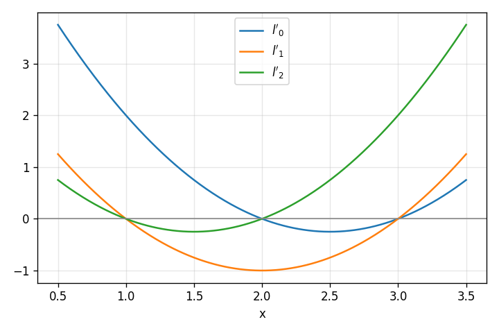
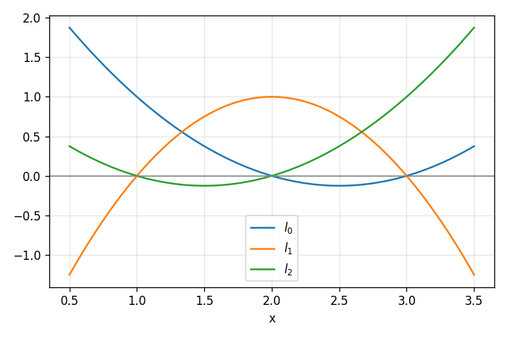
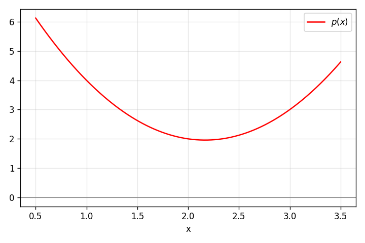

*Polynomial interpolation* is a method of finding a polynomial function that fits a given set of data perfectly. More concretely, suppose we have a set of distinct points :

And we want to find the polynomial coefficients such that:

Fits all our points; that is , etc.

This post discusses a common approach to solving this problem, and also shows why such a polynomial exists and is unique.

## Showing existence using linear algebra

When we assign all points into the generic polynomial , we get:

We want to solve for the coefficients . This is a linear system of equations that can be represented by the following matrix equation:

The matrix on the left is called the *Vandermonde matrix*. This matrix is known to be invertible (see Appendix for a proof); therefore, this system of equations has a single solution that can be calculated by inverting the matrix.

In practice, however, the Vandermonde matrix is often numerically ill-conditioned, so inverting it isn’t the best way to calculate exact polynomial coefficients. Several better methods exist.

## Lagrange Polynomial

Lagrange interpolation polynomials emerge from a simple, yet powerful idea. Let’s define the *Lagrange basis* functions () as follows, given our points :

In words, is constrained to 1 at and to 0 at all other . We don’t care about its value at any other point.

The linear combination:

is then a valid interpolating polynomial for our set of points, because it’s equal to at each (take a moment to convince yourself this is true).

How do we find ? The key insight comes from studying the following function:

This function has terms for all . It should be easy to see that is 0 at all when .

What about its value at , though? We can just assign into to get:

And then normalize , dividing it by this (constant) value. We get the Lagrange basis function :

Let’s use a concrete example to visualize this. Suppose we have the following set of points we want to interpolate: . We can calculate , and , and get the following:

Note where each intersects the axis. These functions have the right values at all . If we normalize them to obtain , we get these functions:

Note that each polynomial is 1 at the appropriate and 0 at all the other , as required.

With these , we can now plot the interpolating polynomial , which fits our set of input points:

## Polynomial degree and uniqueness

We’ve just seen that the linear combination of Lagrange basis functions:

is a valid interpolating polynomial for a set of distinct points . What is its degree?

Since the degree of each is , then the degree of is *at most* . We’ve just derived the first part of the *Polynomial interpolation theorem*:

**Polynomial interpolation theorem**: for any data points where no two are the same, there exists a unique polynomial of degree at most that interpolates these points.

We’ve demonstrated existence and degree, but not yet *uniqueness*. So let’s turn to that.

We know that interpolates all points, and its degree is . Suppose there’s another such polynomial . Let’s construct:

That do we know about ? First of all, its value is 0 at all our , so it has *roots*. Second, we also know that its degree is at most (because it’s the difference of two polynomials of such degree). These two facts are a contradiction. No non-zero polynomial of degree can have roots (a basic algebraic fact related to the *Fundamental theorem of algebra*). So must be the zero polynomial; in other words, our is unique .

Note the implication of uniqueness here: given our set of distinct points, there’s only one polynomial of degree that interpolates it. We can find its coefficients by inverting the Vandermonde matrix, by using Lagrange basis functions, or any other method .

## Lagrange polynomials as a basis for P\_n(\\mathbb{R})

The set consists of all real polynomials of degree . This set - along with addition of polynomials and scalar multiplication - [forms a vector space](https://eli.thegreenplace.net/2026/notes-on-linear-algebra-for-polynomials/).

We called the "Lagrange basis" previously, and they do - in fact - form an actual linear algebra basis for this vector space. To prove this claim, we need to show that Lagrange polynomials are linearly independent and that they span the space.

**Linear independence**: we have to show that

implies . Recall that is 1 at , while all other are 0 at that point. Therefore, evaluating at , we get:

Similarly, we can show that is 0, for all .

**Span**: we’ve already demonstrated that the linear combination of :

is a valid interpolating polynomial for any set of distinct points. Using the *polynomial interpolation theorem*, this is the unique polynomial interpolating this set of points. In other words, for every , we can identify any set of distinct points it passes through, and then use the technique described in this post to find the coefficients of in the Lagrange basis. Therefore, the set spans the vector space .

## Interpolation matrix in the Lagrange basis

Previously we’ve seen how to use the basis to write down a system of linear equations that helps us find the interpolating polynomial. This results in the *Vandermonde matrix*.

Using the Lagrange basis, we can get a much nicer matrix representation of the interpolation equations.

Recall that our general polynomial using the Lagrange basis is:

Let’s build a system of equations for each of the points . For :

By definition of the Lagrange basis functions, all where are 0, while is 1. So this simplifies to:

But the value at node is , so we’ve just found that . We can produce similar equations for the other nodes as well, , etc. In matrix form:

We get the identity matrix; this is another way to trivially show that , and so on.

## Appendix: Vandermonde matrix

Given some numbers a matrix of this form:

Is called the *Vandermonde* matrix. What’s special about a Vandermonde matrix is that we know it’s invertible when are distinct. This is [because its determinant is known to be non-zero](https://mathworld.wolfram.com/InvertibleMatrixTheorem.html). Moreover, its determinant is :

Here’s why.

To get some intuition, let’s consider some small-rank Vandermonde matrices. Starting with a 2-by-2:

Let’s try 3-by-3 now:

We can use the standard way of calculating determinants to expand from the first row:

Using some algebraic manipulation, it’s easy to show this is equivalent to:

For the full proof, let’s look at the generalized -by- matrix again:

Recall that subtracting a multiple of one column from another doesn’t change a matrix’s determinant. For each column , we’ll subtract the value of column multiplied by from it (this is done on all columns simultaneously). The idea is to make the first row all zeros after the very first element:

Now we factor out from the second row (after the first element), from the third row and so on, to get:

Imagine we erase the first row and first column of . We’ll call the resulting matrix .

Because the first row of is all zeros except the first element, we have:

Note that the first row of has a common factor of , so when calculating , we can move this common factor out. Same for the common factor of the second row, and so on. Overall, we can write:

But the smaller matrix is just the Vandermonde matrix for . If we continue this process by induction, we’ll get:

If you’re interested, the [Wikipedia page for the Vandermonde matrix](https://en.wikipedia.org/wiki/Vandermonde_matrix) has a couple of additional proofs.

---

|  | The -es here are called *nodes* and the -s are called *values*. |
| --- | --- |

|  | [Newton polynomials](https://eli.thegreenplace.net/2024/method-of-differences-and-newton-polynomials/) is also an option, and there are many other approaches. |
| --- | --- |

|  | Note that this means the product of all differences between and where is strictly smaller than . That is, for , the full product is . For an arbitrary , there are factors in total. |
| --- | --- |