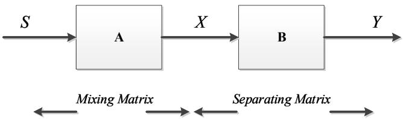
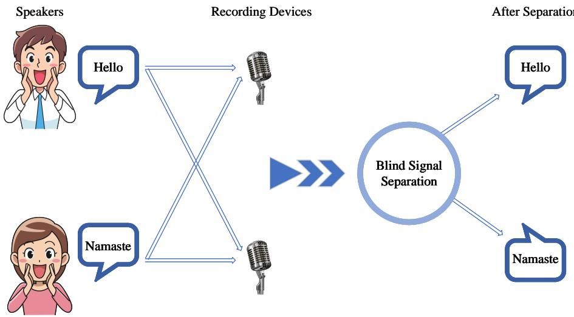
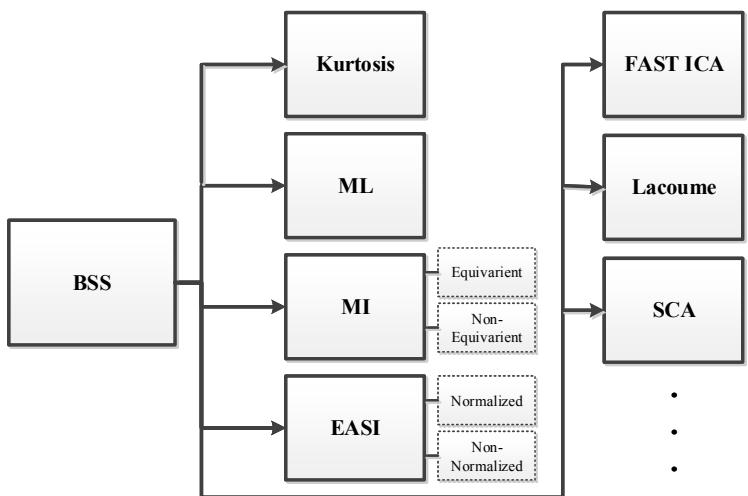
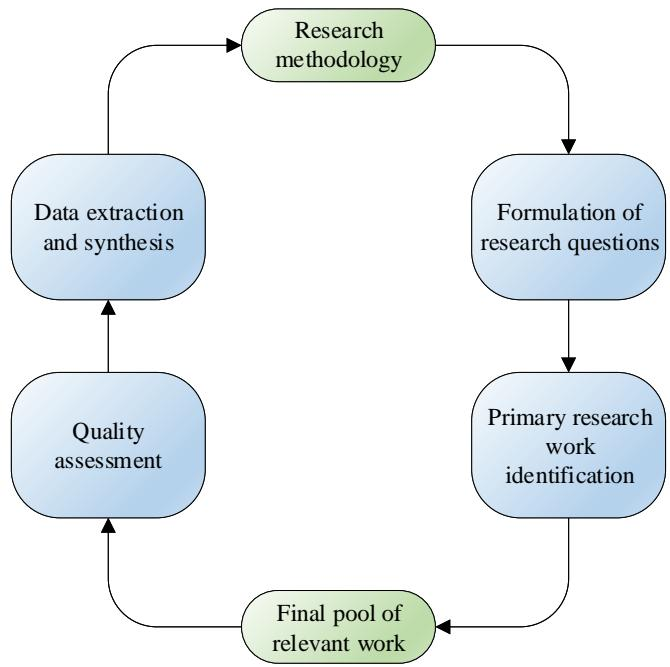
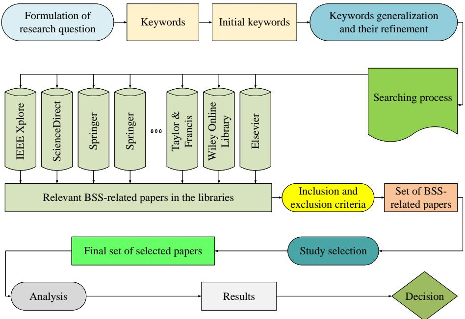
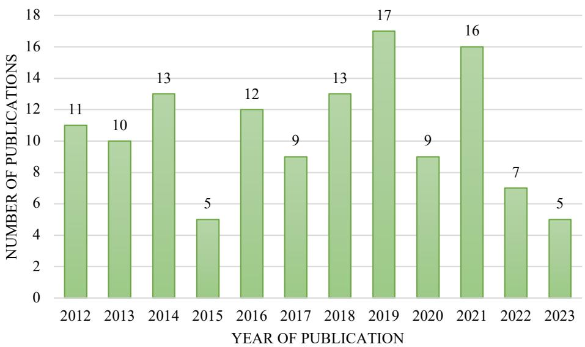
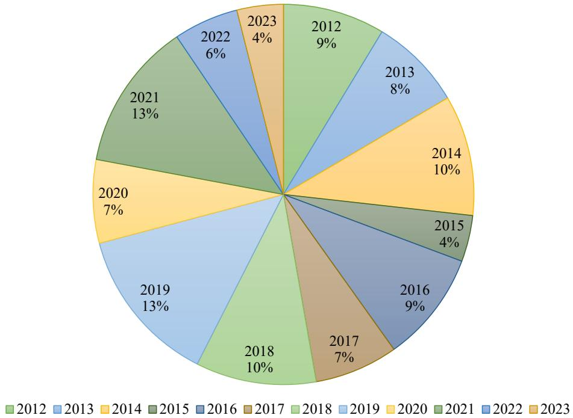
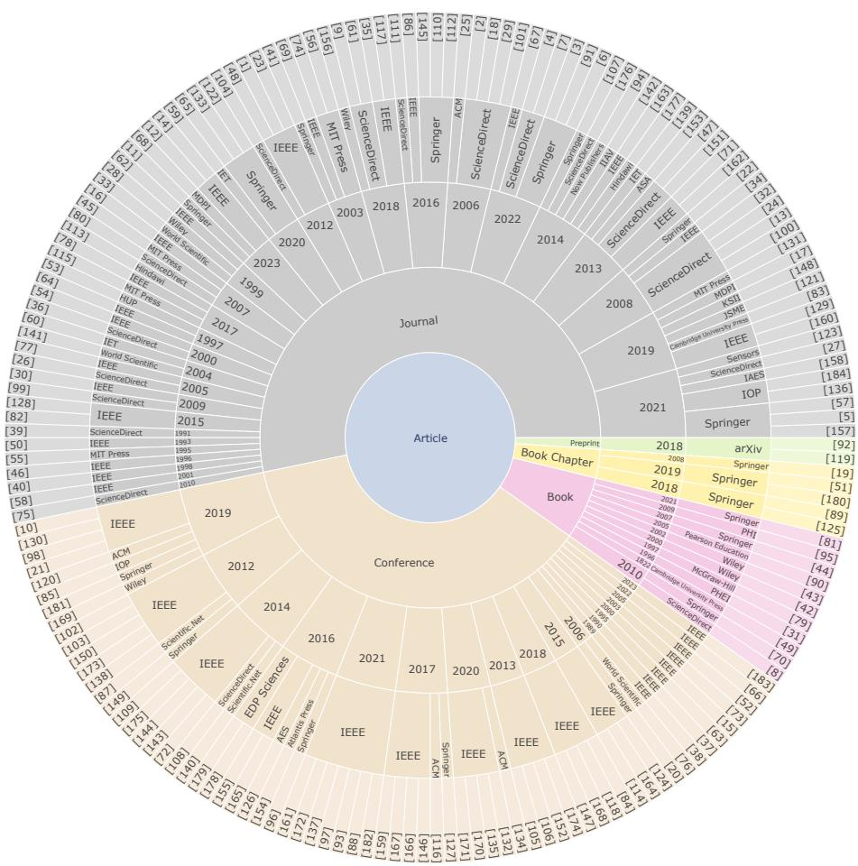
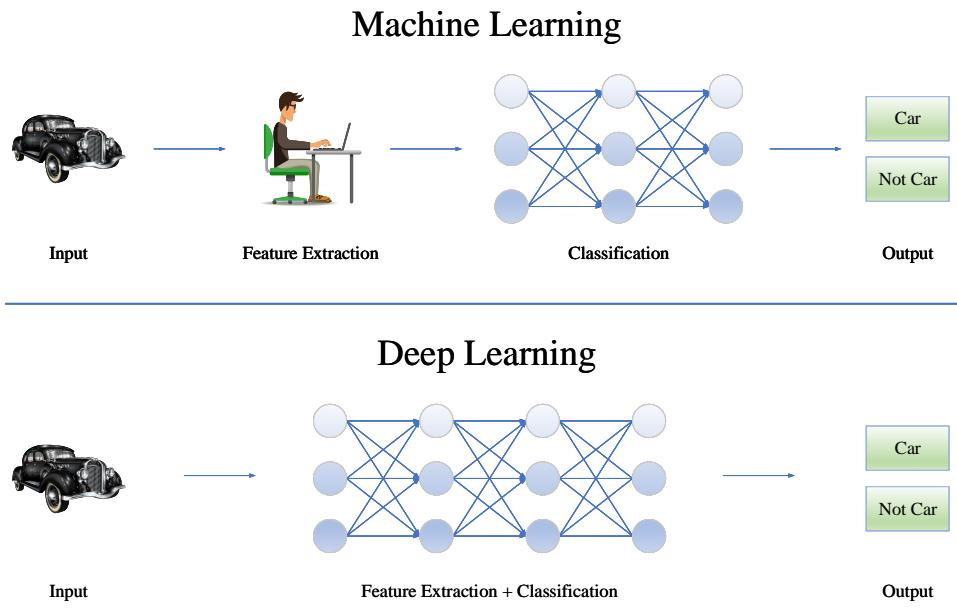
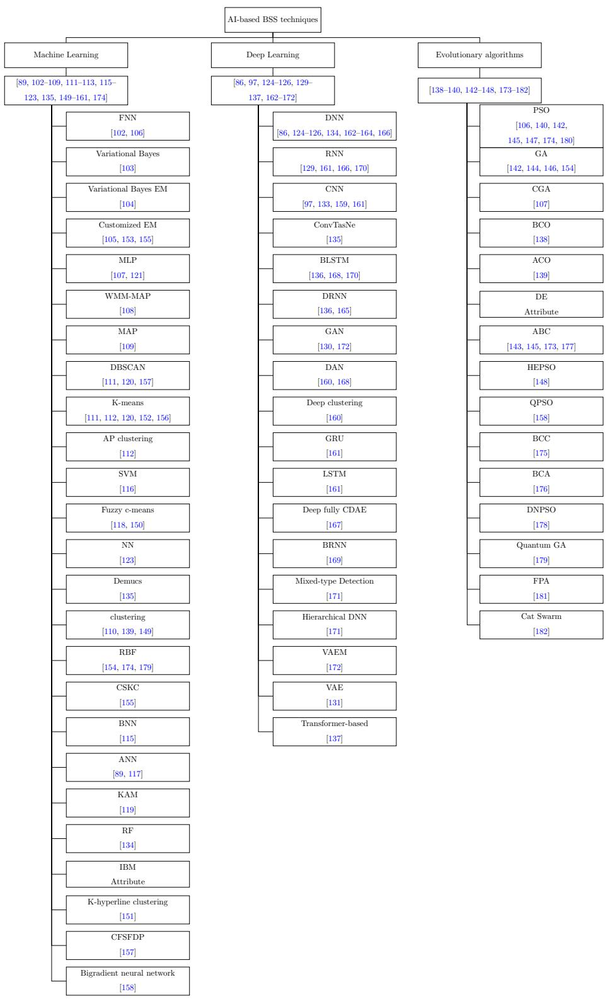

# A Survey of Artificial Intelligence Approaches in Blind Source Separation

Sam Ansaria, Abbas Saad Alatranyb, Khawla A. Alnajjara, Tarek Khatera, Soliman Mahmouda, Dhiya Al-Jumeilyb, Abir Jaafar Hussaina,b,∗

aDepartment of Electrical Engineering, University of Sharjah, Sharjah, United Arab Emirates

bSchool of Computer Science and Mathematics, Liverpool John Moores University, Liverpool L3 3AF, United Kingdom

## Abstract

In various signal processing applications, such as audio signal recovery, the extraction of desired signals from a mixture of other signals is a crucial task. To achieve superior performance and eficiency in separator systems, extensive research has been conducted. Blind source separation emerges as a relevant technique to address the challenge of separating and reconstructing unknown signals when only observations of their mixtures are available to end-users. Blind source separation involves retrieving a set of independent source signals mixed by an unknown and potentially destructive combining system. Notably, the separation process in blind source separation frameworks solely relies on observing the mixed sources without prior knowledge of the mixing algorithm or the source signal characteristics. The significance of blind source separation has garnered substantial attention, and its numerous applications have been demonstrated, which serves as the primary motivation for conducting this comprehensive study. This paper presents a systematic literature survey of blind source separation, encompassing existing methods, approaches, and applications, with a particular focus on artificial intelligence-based frameworks. Through a thorough review and examination, this work sheds light on the diverse techniques utilized in blind source separation and their performance in real-world scenarios. The study identifies research gaps in the current literature, highlighting areas that warrant further investigation and improvement. Moreover, potential avenues for future research are outlined to contribute to the ongoing development of blind source separation techniques.

Keywords: artificial intelligence, blind source separation, deep learning, independent component analysis, machine learning

## Nomenclature

<table><tr><td>#</td><td>Abbreviations</td><td>Phrases</td></tr><tr><td>1</td><td>ABC</td><td>Artificial bee colony</td></tr><tr><td>2</td><td>AI</td><td>Artificial intellignece</td></tr><tr><td>3</td><td>ANNs</td><td>Artificial neural networks</td></tr><tr><td>4</td><td>AP</td><td>Affinity propagation</td></tr><tr><td>5</td><td>AVCC</td><td>Absolute value of correlation coefficient</td></tr><tr><td>6</td><td>BCA</td><td>Bees colony algorithm</td></tr><tr><td>7</td><td>BCO</td><td>Bee colony optimization</td></tr><tr><td>8</td><td>BIO</td><td>Bioinspired intelligence optimization</td></tr><tr><td>9</td><td>BLSTM</td><td>Bi-directional long short-term memory</td></tr><tr><td>10</td><td>BNN</td><td>Biological neural networks</td></tr><tr><td>11</td><td>BRNN</td><td>Bidirectional recurrent neural network</td></tr><tr><td>12</td><td>BSS</td><td>Blind source separation</td></tr><tr><td>13</td><td>BCC</td><td>Bacterial colony chemotaxis</td></tr><tr><td>14</td><td>CCA</td><td>Canonical correlation analysis</td></tr><tr><td>15</td><td>CDAE</td><td>Convolutional denoising autoencoder</td></tr><tr><td>16</td><td>CFSFDP</td><td>Clustering by fast search and find of density peaks</td></tr><tr><td>17</td><td>CGA</td><td>Conjugate gradient algorithm</td></tr><tr><td>18</td><td>CMF</td><td>Complex matrix factorization</td></tr></table>

Continue on the next page

<table><tr><td>#</td><td>Abbreviations</td><td>Phrases</td></tr><tr><td>19</td><td>CNN</td><td>Convolutional neural network</td></tr><tr><td>20</td><td>Conv-TasNet</td><td>Convolutional time-domain audio separation network</td></tr><tr><td>21</td><td>CSC</td><td>Convolutional sparse coding</td></tr><tr><td>22</td><td>CSKC</td><td>Complex spherical k-mode clustering</td></tr><tr><td>23</td><td>DAN</td><td>Deep attractor networks</td></tr><tr><td>24</td><td>dB</td><td>Decibel</td></tr><tr><td>25</td><td>DE</td><td>Differential evolution</td></tr><tr><td>26</td><td>Demucs</td><td>Deep extractor for music sources</td></tr><tr><td>27</td><td>DNNs</td><td>Deep neural networks</td></tr><tr><td>28</td><td>DNPSO</td><td>Dynamic niching particle swarm optimization</td></tr><tr><td>29</td><td>DRNN</td><td>Deep recurrent neural networks</td></tr><tr><td>30</td><td>EASI</td><td>Equivariant adaptive source separation via independence</td></tr><tr><td>31</td><td>EEG</td><td>Electroencephalogram</td></tr><tr><td>32</td><td>EEMD</td><td>Ensemble empirical mode decomposition</td></tr><tr><td>33</td><td>EM</td><td>Expectation-maximization</td></tr><tr><td>34</td><td>FastICA</td><td>Fast independence component analysis</td></tr><tr><td>35</td><td>FCRNN</td><td>Fully connected recurrent neural network</td></tr><tr><td>36</td><td>FNN</td><td>Fuzzy neural network</td></tr><tr><td>37</td><td>FPA</td><td>Flower pollination algorithm</td></tr><tr><td>38</td><td>GA</td><td>Genetic algorithm</td></tr><tr><td>39</td><td>GAN</td><td>Generative adversarial network</td></tr><tr><td>40</td><td>GRU</td><td>Gated recurrent unit</td></tr><tr><td>41</td><td>HEPSO</td><td>High exploration particle swarm optimization</td></tr><tr><td>42</td><td>IBM</td><td>Ideal binary mask</td></tr><tr><td>43</td><td>ICA</td><td>Independent component analysis</td></tr><tr><td>44</td><td>IMF</td><td>Intrinsic mode function</td></tr><tr><td>45</td><td>Infomax</td><td>Information maximization</td></tr></table>

Continue on the next page

<table><tr><td>#</td><td>Abbreviations</td><td>Phrases</td></tr><tr><td>46</td><td>IoT</td><td>Internet of Things</td></tr><tr><td>47</td><td>IRM</td><td>Ideal ratio mask</td></tr><tr><td>48</td><td>IVA</td><td>Independent vector analysis</td></tr><tr><td>49</td><td>JADE</td><td>Joint approximate diagonalization of eigenmatrices</td></tr><tr><td>50</td><td>JD</td><td>Joint diagonalization</td></tr><tr><td>51</td><td>KAM</td><td>Kernel additive modeling</td></tr><tr><td>52</td><td>Khyp-GDA</td><td>K-hyperline-generalized discriminant analysis</td></tr><tr><td>53</td><td>Khyp-LDA</td><td>K-hyperline-linear discriminant analysis</td></tr><tr><td>54</td><td>LDA</td><td>Linear discriminant analysis</td></tr><tr><td>55</td><td>LMS</td><td>Least mean squares</td></tr><tr><td>56</td><td>MABC</td><td>Modified artificial bee colony algorithm</td></tr><tr><td>57</td><td>MAE</td><td>Mean absolute error</td></tr><tr><td>58</td><td>MAP</td><td>Maximum a posteriori probability</td></tr><tr><td>59</td><td>MI</td><td>Mutual information</td></tr><tr><td>60</td><td>MIR-1K</td><td>Multimedia information retrieval lab, 1000 song clips</td></tr><tr><td>61</td><td>mir_eval</td><td>Music information retrieval evaluation</td></tr><tr><td>62</td><td>ML</td><td>Maximum likelihood</td></tr><tr><td>63</td><td>MMSE</td><td>Minimum mean square error</td></tr><tr><td>64</td><td>MOD-GD</td><td>Modified group delay</td></tr><tr><td>65</td><td>MSE</td><td>Mean square error</td></tr><tr><td>66</td><td>NMF</td><td>Non-negative matrix factorization</td></tr><tr><td>67</td><td>NMSE</td><td>Normalized mean square error</td></tr><tr><td>68</td><td>ORM</td><td>Optimal ratio mask</td></tr><tr><td>69</td><td>PCA</td><td>Principal component analysis</td></tr><tr><td>70</td><td>PDF</td><td>Probability density function</td></tr><tr><td>71</td><td>PESQ</td><td>Perceptual evaluation of speech quality</td></tr><tr><td>72</td><td>PLCA</td><td>Probabilistic latent component analysis</td></tr></table>

Continue on the next page

<table><tr><td>#</td><td>Abbreviations</td><td>Phrases</td></tr><tr><td>73</td><td>PSESOP</td><td>Projected sequential subspace optimization</td></tr><tr><td>74</td><td>PSO</td><td>Particle swarm optimization</td></tr><tr><td>75</td><td>RBF</td><td>Radial basis function</td></tr><tr><td>76</td><td>ReLU</td><td>Rectified linear units</td></tr><tr><td>77</td><td>RF</td><td>Random forest</td></tr><tr><td>78</td><td>RNN</td><td>Recurrent neural network</td></tr><tr><td>79</td><td>RSME</td><td>Root mean square error</td></tr><tr><td>80</td><td>SAR</td><td>Signal-to-artifact ratio</td></tr><tr><td>81</td><td>SCA</td><td>Sparse component analysis</td></tr><tr><td>82</td><td>SCSS</td><td>Single-channel source separation</td></tr><tr><td>83</td><td>SDR</td><td>Signal-to-distortion ratio</td></tr><tr><td>84</td><td>SepFormer</td><td>Separation transformer</td></tr><tr><td>85</td><td>SIR</td><td>Signal-to-interference ratio</td></tr><tr><td>86</td><td>SISO</td><td>Single input single output</td></tr><tr><td>87</td><td>SNR</td><td>Signal-to-noise ratio</td></tr><tr><td>88</td><td>SOBI</td><td>Second-order blind identification</td></tr><tr><td>89</td><td>SSP</td><td>Single-source-point</td></tr><tr><td>90</td><td>STFT</td><td>Short-time Fourier transform</td></tr><tr><td>91</td><td>SVD</td><td>Singular value decomposition</td></tr><tr><td>92</td><td>SVM</td><td>Support vector machine</td></tr><tr><td>93</td><td>UMM</td><td>Underdetermined mixing matrix</td></tr><tr><td>94</td><td>VAE</td><td>Variational Autoencoders</td></tr><tr><td>95</td><td>WMM</td><td>Watson mixture model</td></tr></table>

## 1. Introduction

Everyday momentous and worthwhile content is broadcast on television, radio, internet, and satellite channels [1]. The transmitted data/information is combined with other sources, such as music, noise, etc. [2], that might or might not be very important for a diferent group of audiences. Therefore, the need for systems that separate inconsequential sources and signals which lack value from other sources of high importance is significantly evident [3]. Accordingly, extracting advantageous and desired signals combined with worthless sources that have no service and validity for a specific audience, e.g., music or ambient noise, singing voice, or the lead guitar, is substantially important. Additionally, a system separating the worthless data from the noteworthy data is necessitated to reduce the storage volume [4].

As an example, in telecommunications networks, in order to reduce the amount of data transmitted by the user, the system needs to recognize and remove the silence frames from the speech frames [5]. Another scenario is allowing people to talk simultaneously using various devices located at diferent locations. The speeches are mixed and conveyed to a receiver node. The goal is to distinguish and recover the speeches utilizing the perceived data [6]. As observed, a framework capable of speech and music separation can be very beneficial and leveraged in many lucrative applications [7].

Blind source separation (BSS) aims to retrieve the source signals that form an observed/received mixture without prior knowledge of the mixing algorithm or source signals [8]. The mixture can be either single-channel [9] or multichannel [10]. The separation problem is underdetermined when there are fewer observed channels than sources, e.g., musical audio. Therefore, prior knowledge about the original signals is demanded to further enhance the separation process. There are many diverse objectives for the development of BSS technology. Even if the focus is on audio signals, there are always diferent reasons and purposes for using BSS, including:

ˆ examining the cocktail party problem efect,

ˆ extracting the target speech in a noisy environment for better speech recognition results,

ˆ to separate each part of the musical instruments from the orchestral per-

formance to analyze the music.

For instance, various systems and algorithms have been presented by researchers in order to separate numerous audio sources. The signal separation methods are divided into single-channel algorithms and multi-channel algorithms [9, 10]. In single-channel algorithms, only one mixture output signal is available for processing. Signal separation, which usually focuses on separating a signal source, is performed using single-channel methods. The single-channelbased methods are generally based on the characteristics and assumptions that exist within the nature of the source signals. The discriminator algorithm can be implemented using the existing features and the special statistical conditions of the signals. On the other hand, multi-channel signals are formed from several sources that exhibit cross-channel similarity or correlation. While processing multi-channel signals, sources in diferent channels afect each other. One of the most well-known multi-channel methods is the BSS technique. Multi-channel algorithms are employed to perform BSS, reconstructing source signals.

Furthermore, BSS is a valuable and extensively employed technique in the field of multivariate data analysis. Multivariate data refers to datasets where each observation or data point consists of multiple variables recorded simultaneously. This data type arises in various domains, including neuroimaging, finance, genetics, and environmental sciences, among others. In the context of neuroimaging, for instance, functional magnetic resonance imaging (fMRI) captures brain activity as multivariate data by measuring the signal intensity at numerous spatial locations, i.e., voxels, over time. The fundamental goal of BSS is to disentangle the underlying independent sources from the observed mixtures without prior knowledge of the sources or the mixing process. In the context of fMRI data analysis, BSS techniques, such as independent component analysis (ICA), independent vector analysis (IVA) [11], joint approximate diagonalization of eigenmatrices (JADE) [12], Comon’s joint diagonalization (JD) [13], second-order blind identification (SOBI) [14], canonical correlation analysis (CCA) [15], and non-negative matrix factorization (NMF), play a critical role in revealing distinct brain networks, discerning task-specific activations, and identifying subject-specific patterns. As multivariate datasets continue to grow in complexity and scale, the development and refinement of BSS techniques hold tremendous potential in unraveling intricate patterns and latent structures across diverse disciplines, fostering deeper understanding and facilitating meaningful discoveries.

One of the main assumptions considered in the applications related to BSS is the statistical independence of the primary sources, which leads to the ICA technique [16–18]. Blind separation of signal sources is one of the studied topics in signal processing, which has been very popular in recent years [19]. The purpose of source signal separation is to estimate the signal of � diferent sources using the mixture of signals received by � sensors. The method is known to be blind because there is no primary information available about the sources and how the signals are combined at the nodes, i.e., only �-mixed signals are presented [20].

In addition to the accessible techniques, noise and various environmental factors destroy information in data transmission channels. Hence, BSS is one of the efective methods for data recovery. BSS is one of the best approaches for separating data signals that are unintentionally mixed due to environmental conditions or undesirable signals. Moreover, BSS is an important processing method in many applications, such as audio signal recovery, image processing [21], medical imaging, signal processing, cocktail party problem, and telecommunications [22–24]. Separating/retrieving audio sources is one of the topics of interest in signal processing in recent years.

Many machine-learning methods have been exploited in the BSS space [25]. In fact, one of the most important reasons for finding soft computing and computational intelligence is the existence of uncertainties and ambiguities in the real world. Machine learning and deep learning are two concepts of artificial intelligence (AI) [26, 27] that are currently undergoing significant growth and development and are two very active research fields in computer science. As one of the broad and widely used branches of AI, machine learning deals with the adjustment and discovery of models and algorithms based on which computers and systems gain the ability to learn and teach [28, 29]. The idea behind machine learning is a way to develop a system that learns and improves its performance through experience. The purpose of machine learning is that the system can gradually and, by increasing the amount of data, achieve superior eficiency in the desired task [30]. Algorithms based on artificial neural networks (ANN) aim to provide a structure similar to the structure of the human brain [31–34], which is categorized into two categories: classical methods and deep methods. Today, deep techniques have found a more suitable place in applications. Fuzzy logic and evolutionary algorithms are other AI-based models that are utilized in BSS problems [25]. Fuzzy logic is a logic system inspired by the human brain’s qualitative view of the phenomena around it. Fuzzy logic has been proposed to model linguistic and speech expression and uncertainty. Evolutionary algorithms, in an iterative process, attempt to employ special operators to manipulate weak solutions so that a system can solve a problem in the most favorable way possible.

This survey paper investigates and summarizes the latest BSS research work. In light of the above, the main contributions of this work can be listed as follows.

ˆ Systemic review of the latest literature on BSS.

ˆ Study in-depth knowledge about BSS and identify diferent parameters considered during the BSS process.

ˆ Benchmark various AI-based BSS approaches.

ˆ Analyze the state-of-the-art methods, applications, and results.

ˆ Identify the laps in the current solutions and suggest developing an enhanced BSS system based on the systematic literature review.

The remainder of the paper is organized as follows. Section 2 introduces the concept of blind source separation. The technical background related to blind source separation is presented in Section 3. Related work and a summary of the literature are provided in Section 4. Section 5 highlights the research gap and discussion. Finally, Section 6 provides an overview, conclusion, and avenues for future work.

## 2. Blind source separation

Nowadays, the field of digital signal processing, separation of received mixed signals, and extraction of desired information from received signals are of particular importance [35]. Consequently, a reliable system is necessitated to separate parts that are not of great importance and perhaps low-value from high-value content. Due to a lack of information regarding the mixing process and the source signals, a BSS model to extract and retrieve important data is required [36]. BSS refers to recovering a set of independent sources that an unknown destructive system has mixed. The separation procedure in this method is based only on observing the combined sources without having information about the mixing system and the type of source signals. These methods are proposed based on a particular branch of information theory. Cardoso and Jutten initiated the work on BSS [37–39]. The term blind relies on the fact that, firstly, the main signals are not visible, i.e., accessible, and secondly, there is no information about how they are combined. The separation is accomplished only on the basis of the mixed signals and assuming the statistical independence of the sources [40, 41]. Hitherto, numerous studies have been conducted in the field of BSS [36, 39, 42–45].

Separation of the mixed signals is without having information about the signal combining matrix or having little information about this signal combination. It is worth noting that the environmental conditions and the type of mixture afect the complexity of the BSS problem. The overall schematic for estimating and attaining the main signals (�) is illustrated in Fig. 1.

The mixing system can be formulated as follows [40, 46]:

$$
\mathbf {X} = A \mathbf {S},\tag{1}
$$

  
Figure 1: Schematic diagram of BSS in linear space.

where $\mathbf { S } ~ = ~ [ S _ { 1 } , S _ { 2 } , \ldots , S _ { M } ] ^ { T }$ designate a vector gathering the source signals and $X = [ X _ { 1 } , X _ { 2 } , \ldots X _ { N } ] ^ { T }$ indicate a vector collecting the signals resulting from the combination of the mixing matrix � (i.e., observed signals). Assuming independent sources, the goal in BSS is to acquire the input of matrix � so that $Y _ { 1 } , Y _ { 2 } , \dots , Y _ { N }$ , which are the estimated signals to be equal (similar) to the initial inputs and independent of each other like the original input signals. It should be mentioned that in addition to the assumption of independence of the input sources, assuming that the combining matrix is linear (which, of course, can be nonlinear), the exact mathematical formula to find the output is stated by [40, 46]:

$$
\mathbf {Y} = B \mathbf {X}\tag{2}
$$

where $\mathbf { Y } = [ Y _ { 1 } , Y _ { 2 } , \ldots , Y _ { N } ] ^ { T }$ represents a vector indexing the estimated signals, � designates the separating matrix obtained by a mathematical algorithm and repetitive methods. In (2), the number of input sources is equal to the number of sensors $( X _ { S } )$ . However, if it is assumed that there are � linear mixtures of � sources, in this case, the unknown matrix � has the $M \times P$ dimensions and is expressed as $X _ { 1 } , X _ { 2 } , \ldots , X _ { P }$

Fig. 2 illustrates an intuitive example of BSS to understand the concept better. The combination of two signals is exploited to display the problem better. Two speech signals received from the environment are combined, and it is intended to separate and retrieve the main speech signals employing the introduced methods. As can be observed in the figure, the two estimated, i.e., separated, signals are the same as the speech signals of the two speakers.

One of the assumptions engaged in some BSS methods is sparsity [2, 47, 48].

  
Figure 2: An illustration of mixture signals and BSS framework implementation.

The advantage of the sparsity assumption is that the probability that two or more sources are active at the same time in a point of the sparse space is very low. Therefore, in a sparse space, the contribution of the desired source can be removed from the combinations by estimating the coeficient of each source individually. The above assumption is used when the number of sources exceeds sensors (uncertain situation). For the sparse representation of an acoustic signal, Fourier transform [49], Gabor transform [50], and wavelet transform [51] are often leveraged.

So far, many models have been introduced and investigated to enhance the BSS performance, including kurtosis, maximum likelihood, and minimum mutual information [52–54]. However, the most common and preferred BSS method is to exploit ICA. In general, two ICA approaches, including linear ICA [55] and nonlinear ICA [56], can be listed. Fig. 3 provides various BSS techniques classified into diferent categories. Each of the listed methods has been reviewed in several articles [57–64].

  
Figure 3: The existing BSS techniques.

## 3. Technical background

BSS finds wide-ranging applications across diverse fields, showcasing its versatility and efectiveness. These applications include digital signal processing, enabling the separation and extraction of desired information from composite signals, as well as facilitating the distinction between fetal and maternal heart signals. Moreover, BSS proves valuable in the domains of image processing, audio signal separation, and audio processing, underscoring its significant impact in enhancing various technological endeavors [16–24].

For instance, as a prominent method within the domain of BSS, IVA stands out as a powerful and emerging approach for the separation of multivariate data, garnering increasing attention across various research domains [65]. Unlike traditional BSS methods, IVA extends its applicability beyond linear mixtures to handle complex and nonlinear dependencies among sources [66]. This unique capability makes IVA particularly well-suited for scenarios where the sources’ statistical independence is preserved, but their interactions are nonlinear in nature. In essence, IVA seeks to identify statistically independent sources while considering the inherent vector structure of the data, enabling it to capture higher-order dependencies that conventional BSS methods might overlook [67].

  
Figure 4: The main steps of the research protocol.

The methodology leverages higher-order statistics and optimization techniques to iteratively estimate the mixing matrix and separate the sources from the observed data. With its promising potential to reveal hidden patterns in multivariate datasets, such as fMRI data or audio signals, IVA continues to attract significant interest from researchers and holds the promise of opening new avenues for understanding complex relationships within diverse datasets [68]. This study investigates various AI-based methods in BSS. Various models of classical machine learning models, deep learning methods, and evolutionary algorithms employed in BSS are thoroughly investigated to provide a fair and detailed comparison of the state-of-the-art techniques.

The selection and filtering of the papers are explained in the following paragraphs and figures, i.e., Figs. 4 through 8. Fig. 4 depicts the primary steps toward implementing a systematic literature survey. Once the essentials and requirements of the survey process are identified, the review protocol, i.e., the proposed methodology, is provided. Fig. 5 demonstrates the proposed methodology of the review protocol deployed in this work. Fig. 6 shows the annual trend of the selected papers for the final pool, which empowers us to investigate the significance of the BSS study in the corresponding year. Fig. 7 presents the percentage contribution of the reviewed papers with respect to the year of publication in the final pool. The state-of-the-art work are categorized based on various criteria, including the type of the paper, publication year, selected digital library, and the reference number of the desired paper. Accordingly, Fig. 8 illustrates the final pool of the relevant studies providing complete information about the selected papers. The presented doughnut chart empowers the assessment process. Moreover, Sections 3.1 through 3.3 briefly overview the sparse approximation technique, machine learning, and deep learning, which are extensively utilized in various BSS approaches.

  
Figure 5: Illustration of the procedure followed to analyze the developed systems and studies in the BSS field.

Figure 6: Depiction of the annual trend of selected research articles.  
  
Figure 7: Illustration of the annual contribution of the selected papers in the final pool.

  
Figure 8: The evolution of the final pool possessing the information related to the selected studies.

## 3.1. Sparse approximation

Sparse approximation, also known as sparse representation [69–71], has received widespread attention in the last ten years. The main idea of sparse representation is that natural signals have much less information content in contrast to their high apparent dimension. Consequently, the natural signals can be represented in terms of a small number of basic signals (called atoms) [70]. A collection of atoms is called a dictionary [70, 72–74]. Sparse representation is a simple and eficient description of signals. Dictionary learning is used for sparse representation applications [72, 74], which generally involves restoring or improving signal or image quality [48, 70, 75]. Sparse representation introduces a model for the signal according to which processing operations can be performed with usually better quality than classical methods. For a brief overview of sparse representation and dictionary learning, suppose $\boldsymbol { y } \in R ^ { m }$ is a given signal and $D \in R ^ { n \times m }$ is a known dictionary containing � atoms in $R ^ { n }$ space. Now, the sparse representation is defined as approximating a signal � in terms of a linear combination containing a few atoms from the dictionary �. The problem $\left( P _ { 0 } \right)$ can be expressed as follows [70]:

$$
(P _ {0}): \min _ {x} x _ {0} s. t. y = D x\tag{3}
$$

where $\lVert \cdot \rVert _ { 0 }$ denotes the $\ell _ { 0 } { \cdot } \mathrm { n o r m } .$ , i.e., pseudo-norm of zero, which counts the number of non-zero regions, and $x \in R ^ { m }$ designates the sparse representation vector. Solving the above problem in polynomial time is impractical because the pseudo-norm of zero is a discrete function. Therefore, the problem is a nondeterministic polynomial time (NP)-hard problem [76].

Sparse approximation constitutes a prominent technique frequently applied to address the challenging problem of BSS. Among the notable methods falling under this category, sparse component analysis (SCA) [77] and sparse coding [78] emerge as significant approaches. In the context of BSS, the key objective of sparse approximation is to decompose mixed signals into a concise set of sparse components. Remarkably, these components exhibit sparsity, with only a few being significant, while the majority remain close to zero, or negligible. SCA leverages a meticulously constructed dictionary of basis functions to represent the mixed signals in a sparse manner. The proficient identification of sparse coeficients associated with these basis functions is at the heart of SCA’s effectiveness, allowing it to disentangle the underlying sources from the complex mixture of signals. As a result, the application of SCA in the domain of BSS yields promising outcomes, ofering valuable solutions in various domains, such as signal processing and related scientific fields.

## 3.2. Machine learning

Machine learning is recognized as the development by which a computer is trained to ensure a specific assignment [79, 80]. To date, various algorithms have been presented in the field of learning [81, 82]. Likewise, various AI algorithms have been employed in diferent parts of BSS and its numerous applications [35, 83–89]. One of the common methods of classifying machine learning algorithms is based on the type of input given to the algorithm in the learning phase. Supervised, unsupervised, semi-supervised, and reinforcement learning methods can be mentioned as the four main classes of machine learning [90]. The basis of work of most machine learning algorithms is the same as the first category, i.e., supervised learning. First, some data is given as training data. Once the training phase is over, other data is presented as test data to evaluate the algorithm, i.e., training and testing phases. Supervised BSS necessitates a dataset that contains the actual/real source signals, while unsupervised separation only requires a mixture of data. The existing unsupervised models still use supervision to evade over-separation and compete with fully supervised methods [91–93].

## 3.3. Deep learning

Deep learning is part of machine learning, a branch of AI that ofers a solution to various problems [94–98]. In deep learning, the computer learns from previous experiences how to react to new data. Deep learning sees the world as a hierarchy of concepts, where each concept is defined as its relationship to more straightforward concepts. Deep learning is a subset of machine learning and AI that imitates the way of thinking and the natural structure of the human brain and, in fact, the way that the human mind uses to learn a particular subject [94]. This type of learning is one of the important elements in data science, which includes statistics and predictive modeling.

Deep learning performs learning for the machine at the level of complex tasks and overcomes the limitations of machine learning models. In deep learning models and algorithms, the machine gets a better understanding of existential realities and can automatically discover and identify diferent patterns from the data. The two concepts of machine learning and deep learning have technical diferences from each other. Deep learning algorithms are hierarchical, increasing in complexity and abstraction, while traditional machine learning models are linear [94, 95].

In deep learning, unlike machine learning, there are no separate feature extraction and classification parts [99]. The feature extraction [100] part is embedded inside the model, which means the system automatically recognizes the features. Another diference between deep learning and machine learning is that deep learning exploits an end-to-end learning method, meaning that raw data is fed into the neural network and given a task such as classification. Afterward, the model itself learns how to perform the desired task automatically. Another remarkable diference between these two areas is that deep learning adapts itself to the increase in the amount of data. Whereas, machine learning is limited in this case because when the number of data in the models exceeds a limit, the learning curve loses its increasing trend and becomes fixed. The overall structure and diference between machine learning and deep learning is shown in Fig. 9.

The integration of BSS with machine learning and deep learning techniques has revolutionized the field, introducing novel approaches and enhancing the analysis of multivariate data. BSS models leverage unsupervised learning methods to disentangle mixed sources without requiring labeled data, making them valuable in scenarios with limited labeled datasets. In audio source separation applications, machine learning algorithms, such as clustering-based methods or NMF, eficiently segregate mixed audio sources into individual components. Similarly, deep learning architectures, like deep autoencoders and convolutional neural networks (CNN), excel at extracting complex temporal and spatial features, resulting in improved performance in source separation tasks.

The applications of deep learning extend to domains like computer vision and speech processing, where it learns hierarchical representations from data. In computer vision, deep learning-based BSS approaches extract salient visual features from mixed images, efectively isolating individual objects or components from complex scenes. In speech processing, deep learning models learn intricate spectral and temporal patterns, leading to accurate and robust separation of audio sources. This utilization of vast amounts of data and computational power unlocks new frontiers in BSS and enhances source separation applications.

  
Figure 9: The overall structure and diference between machine learning and deep learning.

Moreover, machine learning and deep learning have substantially enriched BSS applications in diverse fields. In neuroimaging, BSS combined with machine learning methods enables the extraction of distinct brain networks and their activations from functional MRI data, leading to improved insights into cognitive processes and neurological disorders. In audio processing, the application of deep learning in BSS has led to remarkable achievements in music source separation, facilitating the separation of individual instruments from complex musical mixtures. The evolving synergy between BSS and machine/deep learning is anticipated to lead to further breakthroughs and an expanded range of applications, underscoring the transformative impact of these integrated methodologies.

## 4. Related work and summary

Numerous work have been presented in the BSS field, which are comprehensively reviewed in this paper. The BSS-related work can be divided into two categories: analytical-based and AI-based. This work overviews the AI-based methods and briefly summarizes the previous work and related comparisons. The selected studies are split into audio, music, sound, speech, voice, and source, i.e., individual components or original signals that are mixed together, separation categories. It is worth noting that various comparison criteria are leveraged in diferent studies depending on the type of application [101]. Section 4 divides and reviews the previous papers according to their applications and then the technique employed.

## 4.1. Audio separation

## 4.1.1. Classical machine learning methods

The study in [102] proposes a fully connected recurrent neural network (FCRNN) algorithm for blind source separation. The authors add a self-feedback loop to their proposed model. It is claimed that the model does not get trapped in a local minimum. Moreover, the utilized FCRNN method enhances the speed of convergence of the weights. It is observed that the model is suitable for nonlinear mixing. The simulation results indicate that the technique can accurately perform BSS for multiple overlapping speech signals.

Underdetermined BSS is a challenging problem to overcome because the mixing process is not reversible. Accordingly, a variational Bayesian method for underdetermined BSS is presented in [103]. The study is conducted in a frequency bin-wise way. A variational mixture of Gaussians with a circular-symmetric complex-Gaussian density function is utilized at each frequency frame to model the time-frequency mixture. The authors mention that suitable conjugate prior distributions are selected for the modeling purpose of the parameters in the Bayesian inference. The learning task involves the estimation/tuning of hyperparameters that define the distribution of parameters for variational posterior distribution optimization. By exploiting variational behavior, the work provides a technique that can efectively determine the actual number of signal sources. It is stated that their proposed method does not need prior knowledge about the number of sources.

In [104], the authors present a variational Bayes expectation-maximization (EM) technique for time series. Their proposed work is based on the variational Bayesian theory of Attias. The proposed model of [104] first estimates the mixing matrix and, subsequently, the optimal model structure source signals in a BSS problem. Due to the correlation of mixing matrix elements, the distribution of the mixing matrix of [104] is based on the Gaussian matrix. Besides, a Wishart distribution represents the inverse covariance of the sensor noise for the correlation between various sensor noises. The distribution of each independent source is approximated by a mixture of the Gaussian model. The algorithm estimates the mixing matrix and source signals by applying the least mean squares (LMS) and maximum a posteriori probability (MAP) to the posterior distributions of the hidden variables and the model parameters. The results acknowledge that the provided model enhances the accuracy of separation. It is worth noting that their proposed algorithm is tested utilizing a synthetic dataset.

Each frequency bin is generally processed separately in frequency-domainbased BSS frameworks. Thus, subsequent alignment of permutation ambiguities occurring between frequency bins is required. Therefore, the work of [105] proposes permutation-free frequency-domain BSS. The model performs BSS through full-band clustering of time-frequency components. As opposed to frequency-domain-based BSS frameworks, the proposed method of [105] concurrently processes all frequency intervals utilizing a mixture model. The mixture model consists of frequency-independent, time-varying mixture weights. By assuming non-sparse priors on the mixture weights, the authors avoid any degradation in the BSS performance that might occur by the time-varying mixture weights. Moreover, the MAP estimation of the model parameters is accomplished through a customized expectation-maximization (EM) model. As a result, their model escapes the local maxima. The Watson mixture model (WMM) and the normalized observation vector, which is used as the feature vector, are employed to separate audio sources. Simulation results show that the proposed permutation-free BSS performs closely to the state-of-the-art.

Lee et al. [106] mention that ICA algorithms have been widely used to perform BSS. It is noted that the gradient algorithm is recognized as a well-known technique that separates independent signals through an iterative process with a learning rate. Therefore, the study in [106] employs a PSO-optimized fuzzy neural network (FNN) to tune the learning rate and enhance the convergence speed of the BSS method. The learning rates are adjusted according to the second-and higher-order correlation coeficients of BSS output components. The simulation results further indicate the superiority of the presented work.

The authors of [107] state that most of the previous work on the BSS problem investigate the linear mixing model. Therefore, the study in [107] tackles the more realistic model of BSS, which is the non-linear scenario. The work presents a non-linear BSS model by using a two-layer perceptron network that successfully retrieves source signals received in non-linear mixture signals. The model aims to minimize the MI criterion with a conjugate gradient algorithm. The presented system leverages the adaptive kernel density estimation to approximate the probability density functions (PDFs) as well as the derivatives of the separated sources. It is observed that the model ofers a decent non-linear BSS performance.

With recent advances in time-frequency clustering-based BSS, WMM is employed to separate mixed signals accurately. However, the majority of existing work necessitates an additional permutation alignment stage due to the utilization of frequency bin-wise. The application of WMM to under-determined cases needs to be further investigated. Accordingly, the application of a generative clustering method is studied in [108] to estimate time-frequency BSS masks. The authors appraise the clustering ability of the WMM within the clusteringbased BSS model. The results further designate the superiority of the WMM over other clustering algorithms, including the fuzzy c-means.

A uniqueness/disjointness theorem exploited in BSS based on conventional clustering algorithms assumes that the received mixed sources entail a single source only at each time-frequency slot. However, the performance of conventional techniques degrades in reverberant environments. Accordingly, a new clustering model is proposed by [109] to perform joint BSS and dereverberation. The technique is based on a relaxed disjointness assumption. Under the premise of relaxed disjointness, the selected system iteratively substitutes clustering-based BSS and dereverberation. The clustering is conducted on the dereverberation of mixtures. Joint BSS and dereverberation are challenging tasks that aim to simultaneously separate mixed sources and reduce the impact of reverberation in audio signals. While various approaches have been proposed to address this problem, IVA stands out as the most prominent method in the literature. IVA extends its applicability beyond linear mixtures and can efectively handle complex and nonlinear dependencies among sources, which are prevalent in joint BSS scenarios. By leveraging higher-order statistics and optimization techniques, IVA iteratively estimates the mixing matrix and separates the sources from the observed data. Its capability to exploit the statistical independence of sources while considering the inherent vector structure of the data enables IVA to capture higher-order dependencies, making it particularly well-suited for joint BSS and dereverberation tasks. MAP fitting a probabilistic generative architecture to reverberant mixed sources is employed to complete the separation task. The experimental results prove that considering signalto-interference ratio (SIR), the algorithm of [109] overtakes the state-of-the-art clustering method by 0.6–4 dB.

The work in [110] aims to estimate the mixing matrix of underdetermined BSS. Initially, they present an efective detection technique that recognize various single sources possessing only one source. The complex conjugates of the coeficients and the time-frequency coeficients of mixed signals are employed to acquire the single source points. Probability-density-based algorithms obtain more reliable single sources followed by a clustering procedure. Therefore, by reselecting and classifying single source points in various clusters, the model identifies the mixing matrix through which the source signals are recognized and separated. The evaluations demonstrate that the proposed model of [110] precisely performs BSS by estimating the mixing matrix. It can be noted that the algorithm achieves a superior performance only when the number of sensors is less than the sources.

Sun et al. [111] employ density-based spatial clustering of application with noise (DBSCAN) and the Hough transform to approximate and obtain the mixing matrix in underdetermined BSS. The DBSCAN clustering method automatically estimates the number of sources; thus, the mixing matrix is obtained and updated accordingly. Furthermore, the Hough transform accurately modifies the center of each cluster by which the mixing matrix is estimated more precisely. The paper proposes to use of phase-angle-based single-source time-frequency point detection for the improvement purposes of sparsity. The authors compare their work with the k-means and conventional DBSCAN algorithm. Based on the simulation results, the authors claim that the presented framework successfully estimates the mixing matrix as well as the number of sources.

Due to the non-invertibility of mixing matrices, underdetermined BSS becomes a complicated problem to solve. Conventionally, a two-step approach is employed to overcome this issue. The essential phase is to find the underdetermined mixing matrix. A hybrid model based on k-means and afinity propagation (AP) clustering techniques is exploited in [112] to enhance the estimation performance of the underdetermined mixing matrix. AP acquires the initial clusters as well as the exact number of exemplars. The model starts with transforming the time-domain signals into sparse signals in the frequency domain. Next, the normalization process is applied to the sparse signals mapping them on compact clustering. Eventually, the selected clustering algorithms estimate the underdetermined mixing matrix, and BSS is accomplished by linear programming. The evaluation results indicate the efectiveness of the hybrid model in separating the underdetermined signal sources.

The study in [113] signifies the need for some assumptions in order to achieve an accurate BSS according to various real-life scenarios. It should be noted that most of the existing models work well under laboratory conditions; however, these models sufer while dealing with real-life applications in which nothing is known. Accordingly, the authors of [113] employ sparsity approaches for the preprocessing phase and a Gaussianity-based technique to present a novel BSS framework. The model harnesses the power of the ICA tool to further augment the separation performance [11, 114]. Furthermore, the fixed-point ICA algorithm is utilized to appraise and validate the BSS model.

The study in [115] investigates the significance of BSS in natural and artificial signal processing. It is intended to utilize biologically plausible neural networks. The authors tackle the scenario in which the sources, not the mixing matrix, are non-negative due to their nature. The work is conducted in an online setting, i.e., the dataset is flooded to a neural network. Their technique considers the blind separation of non-negative sources as a similarity-matching problem. It is worth noting that biologically plausible local learning rules influence the synaptic weights of the neural network.

Abouzid et al. [116] present a framework in which they propose an approach that involves the implementation of the support vector machine (SVM) classification method as a preprocessing step for the purpose of segregating two signals acquired from separate microphones within a humanoid robot. The study focuses on a specific scenario termed the determined case. The core aim of their investigation is to assess the performance of SVM in efectively discerning audio signals, leveraging the sparsity properties of the signals without relying on additional assumptions like stationarity or source independence.

An underdetermined BSS approach employing single-layer perceptron ANN is proposed in [117]. The weight vectors of a one-layer perceptron act as source signals. The sources are retrieved by proper adjustment of the weight vector of the perceptron. Moreover, a ℓ0-norm computes the output error decision rule of the perceptron. The $\ell _ { 0 } { \mathrm { - n o r m } }$ deployment conduces to sparse recovery. The learning parameters are optimized. The model entails lower computational complexity, and the enhancement is achieved by using a descent sequence of the smoothed parameter at each iteration.

Wang et al. in [118] provide a BSS system by employing the �-transform along with fuzzy c-means clustering algorithm. The model can estimate mixing matrices and the number of source signals in an underdetermined BSS problem. Once the estimation is performed, the sources are represented in a null space form. Subsequently, the model retrieves the source signals exploiting ML criteria. Based on the evaluations, the authors claim that the presented technique can perform BSS on any distribution while achieving superior performance as compared to the existing BSS architectures.

The study in [119], by investigating three BSS techniques, presents an unsupervised audio, i.e., singing voice, recognition based on single-channel BSS. The investigated approaches benefit from morphological filtering of the analyzed mixture spectrogram. To achieve the goal, the authors first reformulate the selected BSS methods for audio signals and adjust the relevant hyperparameters. They also employ an extension of the kernel additive modeling (KAM) approach. The customized KAM possesses a new training system in order to obtain a source-specific kernel. The performance of the model is evaluated through exhaustive singing voice detection. Both supervised and unsupervised detection techniques are utilized for comparison purposes. Moreover, several BSS methods, including machine-learning-based BSS models, are implemented for benchmarking purposes.

Lei et al. [120] highlight the importance of acknokwledging the number of sources prior to BSS implementation. The work proposes the application of various machine-learning-based clustering models to find the number of sources, i.e., categorize the number of frequency bands of the received signal sources. The selected methods include Gaussian mixture, k-means, and DBSCAN. The inter-frequency distance is constructed with respect to the magnitude of each frequency in the signal spectrum curve. The clustering results of the selected models are illustrated under their respective optimal estimates. Spectral scatter plot indicates the advantage of source recognition and quantity evaluation in BSS problem [120].

The study in [121] utilizes a multilayer neural network to classify the spectrogram analysis blindly. The multilayer neural network operated in this study contains three layers and is used to separate the voice of a man from a woman. The method begins by providing a spectrum of the mixed signal using the shorttime Fourier transform. The spectrogram is divided into small time-frequency windows classified into the corresponding signal source class. The inverse shorttime Fourier transform extracts the separated signals.

FastICA is considered in [122] to perform BSS in determined or over-determined instantaneous mixture signals. The study examines various contrast functions using the FastICA algorithm. The contrast function is a non-linear function of FastICA measuring the independence of the estimated sources from the mixture signals. Besides, the highly performed available contrast functions for analyzing signals in noisy environments are found. The contrast functions in FastICA include negentropy, ML, and Kurtosis. The model is examined using real-time recorded mixture signals as well as synthetic instantaneous mixtures. The performance of the contrast functions is evaluated based on SIR, signal-todistortion ratio (SDR), signal-to-artifact ratio (SAR), and computational complexity. Based on the simulation results in noisy environments, it is claimed that the ML outperforms the remaining contrast functions.

The work in [123] targets enhancing the steady-state and convergence speed of BSS methods. The authors optimize the performance of the neural-networksbased BSS by tackling the loss function of the BSS method. The model employs neural networks and the ML estimation approach. It is reported that the neural network of the model possesses a bias term, and the L2 regularization terms are added to the loss function for the weights and biases. The added biases advance the steady-state performance. In addition, a new optimization model consisting of a dual acceleration strategy is designed, which accelerates the training for the gradient descent. The algorithm significantly enhances the convergence rate. Various simulations with and without prior knowledge of mixing systems and source signals are conducted to further validate the performance of the presented model [123]. It is claimed that the model fourfolds the convergence speed compared to the state-of-the-art methods. Moreover, the steady-state performance index is claimed to be improved by up to 96%. The simulation and validation results conclude that the model outperforms the existing techniques in terms of convergence and steady-state performance. Eventually, they state that their technique is more appropriate for engineering applications.

After thoroughly investigating the final set of relevant BSS articles, this survey paper extracts and reports their employed machine learning-based methods as well as their asserted results. Table 1 indexes the associated results for the selected machine learning-based methods investigated in Section 4.1.1. As observed, various benchmarking criteria are exploited to evaluate and report the performance of the presented BSS models, which makes it challenging to provide a fair comparison between diferent studies. It should be emphasized that not all work report their numerical results. Moreover, the papers do not discuss the time/computational complexity of their presented algorithms. It is worth noting that in order to utilize a technique, the complexity of the BSS model should be investigated. Depending on the nature of the problem, and application, the selection of BSS model configuration, feature extraction, and machine learning algorithms have associated advantages and disadvantages, which primarily relate to the context of the investigated activities.

## 4.1.2. Deep learning methods

Noda et al. [124] state that human-machine interaction necessitates a speech recognition system that is robust against noise to be applicable in real-world applications/environments. The work aims to separate sound sources, which is beneficial in noise-robust speech recognition frameworks. The speech of the target speaker needs to be extracted while other sources of the signal are removed or filtered. It is mentioned that the conventional ICA and nonlinear principal component analysis (PCA) face limitations while performing complex projections with scalability. Additionally, the existing models require additional systems for the reduction of noise. The work in [124] employs a deep neural network (DNN) to model the separation function that recognizes and separates sound sources. The DNN model is trained to develop a separation function that extracts the intended sound with no prior information about the environment. The DNN estimates a clean version of the target sound features. The model is capable of source separation in non-directional or directional accumulated noise scenarios. The sound is recognized as non-directional when the wavelength is longer than the distance between human ears. In contrast, directional sound refers to the technology of employing several devices to generate fields of sound that spread out less than conventional speakers. It is worth noting that the presented DNN model performs noise reduction procedure concomitantly. An extensive vocabulary of continuous speech and an isolated word recognition task are utilized to examine the model. By considering the simulation results, the authors conclude that their DNN model outperforms the conventional techniques. The paper adds that the performance diference becomes more noticeable when directional noise is accumulated with a low signal-to-noise ratio (SNR).

Table 1: The Performance Comparison of the State-of-the-Art Classical Machine Learning-Based Techniques

<table><tr><td>Ref</td><td>Technique</td><td>Application</td><td>Correlative Coefficients</td><td>NMSE</td><td>Recall</td><td>SAR (dB)</td><td>SDR (dB)</td><td>SIR (dB)</td></tr><tr><td>[102]</td><td>FNN</td><td>Speech</td><td>—</td><td>—</td><td>—</td><td>—</td><td>—</td><td>—</td></tr><tr><td>[103]</td><td>Variational Bayes</td><td>Speech (SiSEC08)</td><td>—</td><td>—</td><td>—</td><td>—</td><td>6.00</td><td>—</td></tr><tr><td>[104]</td><td>Variational Bayes EM</td><td>Speech</td><td>—</td><td>—</td><td>—</td><td>—</td><td>—</td><td>—</td></tr><tr><td>[105]</td><td>Customized EM</td><td>Speech</td><td>—</td><td>—</td><td>—</td><td>—</td><td>11.82</td><td>—</td></tr><tr><td>[106]</td><td>FNN + PSO</td><td>Signals</td><td>—</td><td>—</td><td>—</td><td>—</td><td>—</td><td>—</td></tr><tr><td>[107]</td><td>Two-layer perceptron network + CGA</td><td>Speech and Image</td><td>—</td><td>—</td><td>—</td><td>—</td><td>—</td><td>27.00</td></tr><tr><td>[108]</td><td>WMM-MAP</td><td>Audio</td><td>—</td><td>—</td><td>—</td><td>—</td><td>5.80</td><td>13.00</td></tr><tr><td>[109]</td><td>MAP</td><td>Audio</td><td>—</td><td>—</td><td>—</td><td>—</td><td>—</td><td>8.26</td></tr><tr><td>[110]</td><td>PDF + clustering</td><td>Speech</td><td>—</td><td>-55.4104</td><td>—</td><td>—</td><td>—</td><td>—</td></tr><tr><td>[111]</td><td>K-means + DBSCAN</td><td>Voice</td><td>—</td><td>-61.3072</td><td></td><td>—</td><td>—</td><td>—</td></tr><tr><td>[112]</td><td>K-means + AP clustering</td><td>Signals</td><td>0.96725</td><td>—</td><td>—</td><td>9.3930</td><td>8.0899</td><td>14.4262</td></tr><tr><td>[113]</td><td>Gaussianity and Sparsity</td><td>Audio</td><td>—</td><td>—</td><td>—</td><td>—</td><td>—</td><td>38.93</td></tr><tr><td>[115]</td><td>BNN</td><td>Natural Images</td><td>—</td><td>—</td><td>—</td><td>—</td><td>—</td><td>—</td></tr><tr><td>[116]</td><td>SVM</td><td>Speech</td><td>—</td><td>—</td><td>—</td><td>—</td><td>—</td><td>—</td></tr><tr><td>[117]</td><td>ANN (1 Layers)</td><td>Signals</td><td>—</td><td>—</td><td>—</td><td>—</td><td>—</td><td>—</td></tr><tr><td>[118]</td><td>S-Transform + Fuzzy C-Means</td><td>Signals</td><td>—</td><td>—</td><td>—</td><td>—</td><td>—</td><td>—</td></tr><tr><td>[119]</td><td>Proposed KAM</td><td>Singing voice</td><td>—</td><td>—</td><td>0.60</td><td>—</td><td>—</td><td>—</td></tr><tr><td>[120]</td><td>K-means + DBSCAN + GM</td><td>Source</td><td>—</td><td>—</td><td>—</td><td>—</td><td>—</td><td>—</td></tr><tr><td>[121]</td><td>MLP</td><td>Audio</td><td>—</td><td>—</td><td>—</td><td>—</td><td>—</td><td>—</td></tr><tr><td>[122]</td><td>FastICA + ML/Kurtosis/Negentropy</td><td>Speech</td><td>—</td><td>—</td><td>—</td><td>54.7559</td><td>49.7015</td><td>51.3274</td></tr><tr><td>[123]</td><td>Neural Networks + ML</td><td>Source</td><td>0.69</td><td>—</td><td>—</td><td>—</td><td>—</td><td>—</td></tr></table>

A hybrid model based on a classical multi-channel Gaussian model and a DNN is presented in [86, 125] to conduct BSS. The DNN joint with the classical multi-channel Gaussian model creates the source spectra and exploits the spatial information. The parameters are approximated in an iterative EM approach. Next, the estimated parameters are utilized to develop a multi-channel Wiener filter. The authors evaluate the performance of their model under the influence of diferent scenarios through an extensive experimental study. Diferent cost functions, including Cauchy, phase-sensitive, Kullback-Leibler, MSE, and the probabilistically motivated Itakura-Saito divergence, are used to train the DNNs. Furthermore, the work is extended by involving multiple DNNs and studying the number of EM iterations. Each DNN is designed to enhance the spectra approximated by the preceding EM iteration. The evaluations guarantee that the presented multi-channel approach outperforms single-channel DNNbased and conventional multi-channel NMF-based algorithms.

The work in [126] leverages a combination of several DNNs predictions, i.e., time-frequency masks, for single-channel source separation (SCSS) to acquire a superior BSS compared to the scenario that each DNN performs individually. Four DNNs possessing four diferent cost functions predict the various masks. The first and second DNNS gets trained to predict softmax and the reference binary masks. The third trained DNN directly forecasts a mask from the reference sources. For the fourth DNN, an additional discriminative constraint is defined in order to maximize the diferences between the estimated sources. The authors claim that employing four diferent DNNs and concatenating the predictions resulting from these four DNNs ofers superior results compared to an individual one.

DNNs are often used to tackle the SCSS problem by predicting time-frequency masks [127, 128]. The predicted masks are then used to separate the sources from the mixed signal. Diferent types of masks produce separate sources with diferent levels of distortion and interference. Some types of masks produce isolated sources with low distortion, while other masks produce little crosstalk between separated sources. However, many application scenarios require models capable of extracting sentiment from composite audio sources, such as television content.

The BSS of linear mixtures in various studies is accomplished through the exploration of the independence property of the sources. The independence property is not advantageous in nonlinear regimes. The problem of BSS under certain nonlinear mixing conditions is considered in [129] using the Taylor series. The paper introduces an approach based on deep learning techniques and recurrent neural networks (RNN) by considering nonlinear mixing systems. The model is trained to learn the inverse of the system where sources can be separated. A set of multi-variate polynomial functions assists the training of the RNN. The authors further assert the superiority of their RNN-based BSS model by illustrating diferent numerical results.

The authors of [130] state that the BSS of single-channel is a long-standing signal processing challenge that many researchers attempt to provide the best models through multiple signal priors, including sparsity, low rank, temporal continuity, etc. The work overviews the recent advance of generative adversarial models. Consequently, a promising BSS technique based on adversarial methods is presented in [130]. The independence of sources is assumed in order to form adversarial restrictions on pairs of approximately separated signal sources by which a good separation is guaranteed. The paper provides several simulation results on the numerous image sources and claims an excellent performance allowing the use of the model in other types of sources.

The authors of [131] present a technique for multichannel source separation called the multichannel variational autoencoder (VAE) method. The approach employs a conditional VAE to model and estimate the power spectrograms of individual sources in a mixture. The framework harnesses the powerful representation capabilities of DNNs for modeling the power spectrograms of individual sources. By training the conditional VAE with spectrograms from training examples labeled with source-class information, the decoder distribution can be used as a universal generative model capable of generating spectrograms conditioned on a specified class index. The unknown parameters of this generative model include the latent space variables and the class index. The authors propose a convergence-guaranteed algorithm for supervised determined source separation, which involves iteratively estimating the power spectrograms of the underlying sources and the separation matrices.

The work in [132] introduces an approach for determined multichannel source separation, utilizing a star generative adversarial network (GAN) to model power spectrograms of sources. To address the need for advancements in source modeling techniques, the paper explores the potential of star GAN for modeling source spectrograms and investigates its efectiveness within a frequency-domain ICA framework for determined multichannel source separation. The technique integrates a source model trained with star GAN into the local Gaussian modelbased BSS framework. The efectiveness of the Star GAN source model in source separation is explored and compared with the NMF model used in independent low-rank matrix analysis and the conditional VAE source model employed in the multichannel VAE.

BSS of a singing voice from its musical accompaniment is a fundamental challenge in music information retrieval. Lin et al. [133] propose a BSS technique based on a unique neural network utilizing pixel-wise image classification. The model is equipped by pretraining of the CNN and cross-entropy loss, which acts as an autoencoder on singing voice spectrograms. The ideal binary mask (IBM) is leveraged to train the target output label in the CNN. The pixel-wise classification method is used to predict the label of sound sources. Therefore, common pre- and postprocessing tasks are eliminated. The goal of the training phase is to minimize the error between the predicted and the target label by exploiting the cross-entropy. In addition, the work excludes the Wiener filter postprocessing by converting the BSS problem to a pixel-wise classification task. Various datasets and models are exploited to assess the model performance. By relying on simulation results, the authors indicate that their proposed CNN algorithm performs considerably better than the existing architectures, i.e., up to 5.9563 dB.

Using a random forest model and a DNN, [134] examines the efect of mixed audio on the emotion recognition of music and speech. The presented random forest algorithm ranks the speech/music emotion recognition features. The speech DNN consists of 512 neurons split into three hidden layers with a dropout rate of 0.5. Rectified linear units (ReLU) activation is exploited in the hidden layer neurons, whereas the output layer benefits from the softmax activation function. The model is implemented and examined on six datasets. By illustrating simulation results, the paper claims that the BSS model achieves superior music/speech emotion recognition accuracy.

The authors of [135] state that machine learning algorithms, such as convolutional time-domain audio separation network (Conv-TasNet) and deep extractor for music sources (Demucs), can discriminate between two interfering signals, such as speech and music, without any prior information about the mixture operation. The Demucs algorithm is a waveform-to-waveform model that offers a higher decoding capacity as compared to the Conv-TasNet model and exploits the same technique as the audio generation algorithm. On the other hand, the Conv-TasNet model is known to be a fully convolutional time-domain audio separation technique. The algorithms are compared based on high-quality and precise signal separation and lower time complexity, i.e., higher execution time. Four experiments/scenarios are declared to examine the performance of the selected models, including music-child, music-male, music-conversation, and music-female. The R-squared, mean absolute error (MAE), root mean square error (RMSE), and music information retrieval evaluation (mir eval) system, i.e., a Python library, scores metrics are employed to assess the obtained results. It is observed that Conv-TasNet provides a high SDR score for the music-child test and the highest SDR scores for the music-women tests. Additionally, the Demucs algorithm achieved a high SDR value of music in the music-female experiment, equal to 7.8, while the music-child experiment scored the highest SDR value of 8.15. However, measuring the average execution time, it is found that the Demucs model is seven times slower than Conv-TasNet. The absolute values and the average magnitude of the errors between the observed and predicted data are calculated using RMSE and MAE, respectively.

The speech signals converted and transferred to the computer may be mixed by other sources. The interference and mixture come from other speech sources or noises. For instance, when several people talk simultaneously, i.e., the cocktail party problem, producing a mixture of diferent mixed speech signals. Therefore, BSS is used to retrieve the desired audio signals. The study in [136] ofers a novel BSS framework benefiting from deep recurrent neural networks (DRNN) equipped with bi-directional long short-term memory (BLSTM). The presented algorithm separates audio signals from a monaural mixed signal consisting of male and female speeches. Two types of time-frequency masks, namely ideal ratio mask (IRM) and optimal ratio mask (ORM), are estimated.

RNNs have traditionally been the dominant architecture for sequence-tosequence learning. However, due to their inherently sequential nature, RNNs lack the ability to parallelize computations efectively. As an alternative, transformers have emerged as a promising solution, replacing recurrent computations with a multi-head attention mechanism. A neural model termed separation transformer (SepFormer) is proposed in [137] for speech separation. The SepFormer architecture is devoid of RNNs and exclusively utilizes a masking network composed of transformers. Within this masking network, a multi-scale approach is employed to learn both short and long-term dependencies. By relying on the reported results based on experiments conducted on two datasets, the authors assert that state-of-the-art performances in source separation can be achieved without incorporating RNNs in the network design. Consequently, computations across diferent time steps can be parallelized efectively. Moreover, the authors claim that the model delivers competitive performance even when the encoded representation is subsampled by a factor of eight, resulting in significant acceleration during training and inference, accompanied by a drastic reduction in memory usage.

Table 2: The Performance Comparison of the State-of-the-Art Deep Learning-Based Techniques

<table><tr><td>Ref</td><td>Technique</td><td>Application</td><td>ACC</td><td>MAE</td><td>RMSE</td><td>SAR (dB)</td><td>SDR (dB)</td><td>SIR (dB)</td></tr><tr><td>[86]</td><td>DNN + EM</td><td>Speech</td><td>—</td><td>—</td><td>—</td><td>18.23</td><td>13.25</td><td>15.58</td></tr><tr><td>[124]</td><td>DNN</td><td>Speech</td><td>(ACC) 93.89%</td><td>—</td><td>—</td><td>—</td><td>—</td><td>—</td></tr><tr><td>[125]</td><td>DNN + EM</td><td>Speech and Music</td><td>—</td><td>—</td><td>—</td><td>—</td><td>—</td><td>—</td></tr><tr><td>[126]</td><td>DNN</td><td>Speech + Music</td><td>—</td><td>—</td><td>—</td><td>7.05</td><td>4.24</td><td>11.34</td></tr><tr><td>[129]</td><td>RNN</td><td>Signals</td><td>—</td><td>0.0568</td><td>—</td><td>—</td><td>—</td><td>—</td></tr><tr><td>[130]</td><td>GAN</td><td>MNIST, shoes and bags</td><td>(ACC) 0.90/0.73</td><td>—</td><td>—</td><td>—</td><td>—</td><td>—</td></tr><tr><td>[133]</td><td>CNN + IBM</td><td>Singing VoiceMusical Accompaniment</td><td>—</td><td>—</td><td>—</td><td>—</td><td>15.1944/14.4359</td><td>—</td></tr><tr><td>[134]</td><td>DNN + RF</td><td>Audio</td><td>—</td><td>—</td><td>0.960</td><td>—</td><td>—</td><td>—</td></tr><tr><td>[135]</td><td>ConvTasNet + Demucs</td><td>Music + Speech</td><td>—</td><td>—</td><td>—</td><td>—</td><td>8.15</td><td>—</td></tr><tr><td>[136]</td><td>DRNN + BLSTM</td><td>Audio</td><td>—</td><td>—</td><td>—</td><td>14.150</td><td>6.347</td><td>7.387</td></tr></table>

Table 2 lists the results of each deep learning-based BSS model studied in Section 4.1.2. In summary, it can be concluded that there is no universal approach to BSS. Based on tabular summaries of the research work surveyed in relation to deep learning-based BSS, it is observed that diferent models are proposed for diferent types of audio signals within diferent environments. It should be emphasized that each BSS approach must be designed according to the application, goal, objectives, environment, datasets, environment, etc. The state-of-the-art models are claimed to provide an accurate separation. However, it is necessitated to further investigate the performance of the selected models using unique and similar evaluation criteria in order to obtain the best BSS framework.

## 4.1.3. Evolutionary algorithms

Mavaddaty et al. [138] employ a bee colony optimization (BCO) method for the BSS problem of independent component signals. The work aims to tackle linear instantaneous mixtures. Various cost functions are exploited to assess the performance of the BCO model. The employed cost functions are the results of information theory and higher-order statistics. The paradigms compute the statistical dependence of the retrieved signal obtained by the demixing system. Furthermore, the paper discusses the benefits of the proposed model, which are a high degree of flexibility and robustness against local minima. Exploiting the evaluation results and comparisons with other studies, such as PSO-based models, the authors demonstrate the superiority of the BCO-based technique.

Xuansen et al. [139] use an ant colony clustering algorithm to propose a new underdetermined BSS framework. The authors indicate that their proposed technique approximates the mixing matrix and the source signals quickly and precisely. The general idea behind the model is the application of linear clustering feature sparse signals. The model aims to predict the number of sources in addition to the column vector of the mixing matrix. The technique entails some preprocessing steps, including time domain to sparse signals in frequency domain transformation and normalization. In the normalization phase, the received data are mapped to compact clustering. Next, the data enter the ant colony clustering to acquire the number of source signals and the mixing matrix. Once the mixing matrix is estimated, the original signals are retrieved through a linear programming algorithm.

The study in [140] states that the selection of the learning rate causes a trade-of between the speed of convergence and the stability of the BSS model. Accordingly, the paper utilized a PSO to optimize and adjust the learning rate of the BSS system. Three signal sources are exploited to conduct the simulation in order to report the model performance. The signals are mixed and then separated using the model. The authors conclude that their technique improves the convergence rate and ofers eficient and stable ICA models.

Genetic algorithm (GA) [141] and PSO are two evolutionary algorithms used separately to perform BSS in [142]. The feature distance and kurtosis are defined as the fitness function of the selected evolutionary algorithms to evaluate the level of separated signals. The study considers the physical significance as well as the mathematical calculation of the separated source. Accordingly, the estimated signals correlate remarkably with the original signal sources. Various MATLAB simulations on mixed spoken signals are conducted, further illustrating the efectiveness of GA and PSO techniques on the BSS problem.

A chaotic signal is known to be a nonlinear and non-Gaussian signal. BSS of a mixture of chaotic signals is quite challenging due to the characteristics of non-periodic and wideband spectrums. Thus, the authors of [143] investigate an artificial bee colony (ABC) optimizer to model a new BSS. Besides, the framework adopts a parameterized representation of orthogonal matrices through principal rotation in order to decrease the complexity of the BSS problem. It is observed that the technique precisely separates the mixture of chaotic signals. The paper compares their model with conventional ICA techniques and states that better results are obtained.

The study in [144] presents a BSS framework equipped with GA and ICA techniques. Unlike other ICA-based work, the study does not apply any data preprocessing, including whitening transformation and centering techniques. Minimization of MI and maximization kurtosis are set as the fitness function. The method approximates the coeficients of the separating matrix. The authors utilize one objective/fitness function to measure kurtosis and MI. Several simulations, a mixture of two and three synthetic signals and a mixture of four audio signals, are implemented. Through simulations, the authors depict that their presented GA successfully retrieves the independent sources of synthetic signals. However, the work adds that in the case of four audio signals, the model fails to accurately separate one of the signals due to the Gaussian nature of one of the sources.

The problem of sequential BSS dealing with mixtures of sub- and sup-Gaussian sources is thoroughly deliberated in [145]. The authors develop three algorithms based on kurtosis maximization. The models include PSO, ABC, and diferential evolution (DE). The separation process is achieved by decreasing the absolute kurtosis order, considering the maximization of the kurtosis cost function. Several simulations are implemented to verify the validity of the BSS algorithms. Besides, through a fair comparison, it is seen that the models provide higher accuracy in separating various sources. Furthermore, electroencephalogram (EEG) signals are leveraged to perform a real-world BSS experiment. It is intended to separate EEGs from a super-determined mixture with Gaussian noise. It is declared that in contrast to the conventional models that separate EEG signals with noise simultaneously, the presented algorithms of [145] solely separate and extract only the EEG signals.

By recognizing the BSS technology as one of the primary areas in the signal processing field, [146] introduces a single-channel speech BSS technique. The model utilizes time-frequency masking and GA optimization. They decompose the mixture into an intrinsic mode function (IMF) with distinct source signal features. The ensemble empirical mode decomposition (EEMD) approach is utilized to compose a new multidimensional signal. Afterward, a GA benefiting from the ICA technique is employed to accomplish BSS. The work asserts that the selected approach successfully enhances the stability and eficiency of BSS operation, providing an excellent separation.

The study in [147] overviews the PSO algorithm in BSS and states that the model encounters some shortcomings, such as low accuracy and easy trapping in early maturation. Accordingly, the authors present an enhanced PSO to increase the BSS performance. The algorithm is based on adaptive adjustment inertia weight. The work is compared with the fast fixed-point algorithm, i.e., FastICA, and conventional PSO techniques. The selected environment is noisy, and the correlation coeficient matrix is chosen for evaluation purposes. The model is claimed to be robust against noise and able to efectively enhance the accuracy of BSS.

A method called high exploration particle swarm optimization (HEPSO) is presented in [148] to separate signal sources from a received set of observations. In the proposed method of [148], the presented model, an enhanced version of the PSO algorithm, consists of two additional operators: the GA and the bee colony mechanism. The GA and the bee colony framework are employed to update the speed and position of particles. The authors set kurtosis and MI as fitness functions. Their proposed models are leveraged to find the transform/mixing matrix. The study provides their simulation results in order to claim that the HEPSO provides superior results on three test datasets compared to that of

PSO and GA+kurtosis methods.

Wang et al. [57], by employing ABC optimization and kurtosis, introduce a BSS technique that compensates for the slow convergence rate. Their model does not impose any hypothetical requirements on the source signal. The algorithm of [57] selects iterative updates and step sizes based on adaptive function values. The kurtosis objective function allows the algorithm to be applicable to any signal distribution. Various simulations are conducted through which the authors highlight the superiority of their model compared to other approaches.

Table 3 highlights the reported results of evolutionary-based BSS algorithms examined in Section 4.1.3. From the illustration, it is clear that the most used algorithm is PSO, followed by GA. By relying on the reported results, it can be observed that the HEPSO model of [148] achieves a superior separation compared to the other evolutionary algorithms. However, it should be noted that the complexity of the models should be investigated and compared. Depending on the nature and importance of the application, the most suitable model should be considered.

## 4.2. Music separation

## 4.2.1. Classical machine learning methods

The work in [149] proposes the utilization of unsupervised clustering algorithms to improve the robustness and accuracy of separation. Diferent clustering methods are combined based on probability theory. The probabilities of having diferent data in the same cluster are calculated in order to be able to join various techniques. It is claimed that the model has a higher expandable ability than other state-of-the-art separation algorithms.

In [150], it is stated that conventional BSS approaches work based on overdetermined possessing more sensors than sources. The paper adds that the underdetermined is a challenging situation that is closer and more applicable to real-life scenarios. A two-step framework is proposed to achieve underdetermined BSS. The fuzzy c-means algorithm approximates the mixing matrix and reduces the necessity for sparsity. The model diminishes the restrictions by employing semi-NMF. The fuzzy c-means-gradient-based NMF combination procedure is illustrated in [150]. By depicting comparison results, Alshabrawy et al. indicate the significance of their proposed model in dealing with high SNR while encompassing low time complexity.

Table 3: The Performance Comparison of the State-of-the-Art Evolutionary-Based Optimization Techniques

<table><tr><td>Ref</td><td>Technique</td><td>Application</td><td>ACC</td><td>Correlative Coefficients</td><td>MSE</td><td>SAR (dB)</td><td>SDR (dB)</td><td>SIR (dB)</td><td>SNR (dB)</td></tr><tr><td>[138]</td><td>BCO</td><td>Speech and Image</td><td>—</td><td>—</td><td>—</td><td>—</td><td>—</td><td>—</td><td>28.80/ 16.163</td></tr><tr><td>[139]</td><td>Clustering + ACO</td><td>Voice</td><td>—</td><td>—</td><td>—</td><td>—</td><td>—</td><td>—</td><td>—</td></tr><tr><td>[140]</td><td>PSO</td><td>Signals</td><td>—</td><td>0.973/0.964/ 0.985</td><td>—</td><td>—</td><td>—</td><td>—</td><td>—</td></tr><tr><td>[142]</td><td>PSO and GA</td><td>Signals</td><td>—</td><td>—</td><td>—</td><td>—</td><td>28.6550/ 40.1285/ 28.7721/ 39.7033</td><td>—</td><td>—</td></tr><tr><td>[143]</td><td>ABC</td><td>Chaotic signals</td><td>—</td><td>—</td><td>—</td><td>—</td><td>—</td><td>—</td><td>—</td></tr><tr><td>[144]</td><td>GA-ICA</td><td>Signals</td><td>—</td><td>—</td><td>0.0317/ 0.0130</td><td>—</td><td>—</td><td>—</td><td>—</td></tr><tr><td>[145]</td><td>PSO + DE + ABC</td><td>EEG Signals</td><td>—</td><td>—</td><td>—</td><td>—</td><td>—</td><td>28.0683/ 38.7114/ 28.0683/ 38.7119/ 28.0699/ 38.7918</td><td>—</td></tr><tr><td>[146]</td><td>GA+ICA</td><td>Speech</td><td>—</td><td>—</td><td>—</td><td>13.17</td><td>23.47</td><td>12.76</td><td></td></tr><tr><td>[147]</td><td>PSO</td><td>Signals</td><td>—</td><td>—</td><td>—</td><td>—</td><td>—</td><td>—</td><td>—</td></tr><tr><td>[148]</td><td>HEPSO</td><td>Speech</td><td>(AVCC) 1.0000/ 0.0071</td><td>—</td><td>6.6862e-08</td><td>—</td><td>48.7775</td><td>—</td><td>—</td></tr></table>

The study in [151] leverages the disjoint orthogonality of source signals and the sparsity to estimate the mixing matrices in the instantaneous BSS problem. The authors investigate the performance of clustering techniques in BSS problem. It is stated that the model can be implemented in a parametric domain, i.e., signals can be sparsely represented. Accordingly, the paper employs k-hyperlinelinear discriminant analysis (Khyp-LDA) and k-hyperline-generalized discriminant analysis (Khyp-GDA) to achieve BSS. The kernel approach is added to the system to perform discriminative clustering in high-dimensional feature space for underdetermined BSS. The simulation results based on synthetic data further indicate the significant superiority of the models in the estimation of mixing matrices.

The BSS in audio files containing a mixture of speech sound and instrumental music is studied in [152]. It is mentioned that ICA performs poorly in dealing with a dynamic mixture of sources. The study aims to overcome the shortcoming of ICA by employing a two-pass model. The first subsection subdivides the observed mixture signal into diferent clusters considering the similarity of the audio characteristics. Afterward, the second pass is responsible for ICA implementation on each chunk. It should be emphasized that diferent mixtures of sources possess distinct features which can be identified and extracted by various machine learning models, such as k-means clustering. The extracted characteristics assist the BSS system in classifying the mixed-source input into distinct groups. As a result, the BSS model can perform better on the chucked files.

In [153], Souden et al. investigate the BSS problem and render a speech source clustering and separation technique. The approach leverages the multichannel location information in a recursive EM model. WMM models the normalized multi-channel speech-recording vector. The normalized vector is treated as a feature vector. Likelihood maximization determines the parameters of the selected model at each time-frequency slot. The proposed model regulates the speech clusters in an online fashion. The authors indicate that the presented model outperforms the batch EM techniques by relying on the evaluation results.

The work in [154] uses a GA-optimized radial basis function (RBF) neural network to provide a BSS model. The model aims to obtain high separation accuracy at low SNRs. Additionally, the k-means clustering model is exploited to compute the width and center values of the RBF network. Maximum entropy is used as the cost function. GA optimizes the tuning parameters of the RBF neural network. The authors present various simulation results claiming that their proposed model can accurately perform BSS at low SNR values.

A clustering algorithm is presented to cluster complex-valued unit-length vectors [155]. The clustering is performed on the unit hypersphere; the model is called complex spherical k-mode clustering. The derivation of the approach from the EM method for complex WMM is provided in detail. Subsequently, the validity and applicability of the model on real-world BSS problems are investigated. The authors observe and report that their proposed spherical k-mode framework competes significantly with the latest BSS models concerning SIR gains. Moreover, the work reports that the model entails lower computational complexity and easy implementation.

Ruan et al. [156] provide a two-stage underdetermined BSS system. The model is equipped with compressed sensing and eigenvalue decomposition. Electronic surveillance, radar applications, spectrum management, etc., can be named as several applications of underdetermined BSS algorithms. The contribution of [156] is threefold. The work provides single source points detection algorithm based on eigenvalue decomposition. A hierarchical coupling dictionary training method based on K-means singular value decomposition is presented. A two-stage algorithm is implemented to blindly separate radar signals with no prior knowledge. The eigenvector corresponding to the maximum eigenvalue is approximated. The estimated eigenvector is clustered as a vector of the mixing matrix. The mixing matrix is then utilized to recover sources from the received signals. The integrated underdetermined BSS-compressed sensing framework is constructed to perform the separation process. The work by relying on simulation results indicates that the system provides higher separation accuracy compared to the state-of-the-art methods.

The prediction of the mixing matrix is of great importance in underdetermined BSS in order to provide an accurate separation. The study in [157] exploits DBSCAN and clustering by fast search and find of density peaks (CFSFDP) to enhance the prediction accuracy of the BSS model. The mixed signals are transformed from the time domain into sparse signals in the frequency domain through an STFT. Besides, the single-source-point (SSP) detection improves the linear clustering characteristic of signals. First, the DBSCAN model searches for high-density data points and automatically acquires the cluster centers and the number of clusters. Next, the CFSFDP algorithm explores the density peaks of the data clusters in order to update the cluster centers. The authors, through simulation results, claim that their hybrid model ofers a robust predictor that enriches the prediction accuracy of UMM. Moreover, it is stated that the utilized joint clustering algorithm helps the CFSFDP model so that the technique does not require human intervention.

A hybrid method constructed by quantum PSO and Bigradient neural network is presented in [158] to optimize the ICA approach in order to obtain source signals. The performance of the hybrid model is benchmarked with both PSO and Bigradient neural network, by which the authors show that their hybrid model outperforms both models. SNR, SDR, AVSS, and computation time criteria are considered and reported.

Table 4 incorporates the results achieved by each of the state-of-the-art BSS frameworks explored in Section 4.2.1. There is a considerable variation in the obtained/reported results of the selected machine learning-based approaches, which makes it challenging to recognize the most eficient BSS model. Various work tackled the BSS problem using clustering techniques, while other papers employed classification algorithms to separate and retrieve source signals. It is worth noting that the appropriate model can be selected depending on the application, required accuracy, and speed. Accordingly, it is recommended to consider both accuracy and complexity while reporting/comparing models.

## 4.2.2. Deep learning methods

A regression-based speech enhancement system is proposed in [162]. The work employs multiple-layer DNNs. One of the advantages of DNN over classical machine learning is the ability to deal with large datasets. The study exploits a large training dataset to guarantee a potent model which can accurately estimate clean signals from noisy speech mixture. The speech signals are accurately separated from a musical-speech mixture that contains noise. The dataset entails more than one hundred hours of simulated speech data which empowers the model to obtain a superior generalization capability. The work is compared with the logarithmic minimum mean square error (MMSE) criterion. The authors use simulation results to illustrate and claim the significant superiority of their presented technique.

Table 4: The Performance Comparison of the State-of-the-Art Classical Machine Learning-Based Techniques

<table><tr><td>Ref</td><td>Technique</td><td>Application</td><td>ACC</td><td>Correlative Coefficients</td><td>MSE</td><td>SAR (dB)</td><td>SDR (dB)</td><td>SIR (dB)</td><td>SNR (dB)</td></tr><tr><td>[149]</td><td>Clustering</td><td>Signals</td><td>—</td><td>—</td><td>—</td><td>16.27</td><td>9.91</td><td>15.21</td><td>—</td></tr><tr><td>[150]</td><td>Fuzzy c-means + semi NMF PSESOP</td><td>Speech</td><td>—</td><td>—</td><td>—</td><td>—</td><td>—</td><td>—</td><td>324.2969/ 372.2919/ 429.9053/ 397.6122</td></tr><tr><td>[151]</td><td>K-hyperline clustering + LDA</td><td>Signals</td><td>—</td><td>—</td><td>—</td><td>—</td><td>—</td><td>—</td><td>—</td></tr><tr><td>[152]</td><td>K-means + ICA</td><td>Speech and Instrumental Music</td><td>—</td><td>0.89-0.93.</td><td>—</td><td>—</td><td>—</td><td>—</td><td>—</td></tr><tr><td>[153]</td><td>ML-based + EM</td><td>Speech</td><td>—</td><td>—</td><td>—</td><td>10.02</td><td>10.5</td><td>16.58</td><td>—</td></tr><tr><td>[154]</td><td>RBF + GA</td><td>Signals</td><td>—</td><td>0.875-0.992</td><td>—</td><td>—</td><td>—</td><td>—</td><td>—</td></tr><tr><td>[155]</td><td>CSKC + EM</td><td>Speech</td><td>—</td><td>—</td><td>—</td><td>—</td><td>—</td><td>16.3</td><td>—</td></tr><tr><td>[156]</td><td>K-means + SVD</td><td>Signals</td><td>—</td><td>—</td><td>—</td><td>—</td><td>—</td><td>—</td><td>24.78</td></tr><tr><td>[89]</td><td>—</td><td>Music</td><td>—</td><td>—</td><td>—</td><td>—</td><td>—</td><td>—</td><td>—</td></tr><tr><td>[157]</td><td>DBSCAN + CFSFDP</td><td>Signals</td><td>—</td><td>—</td><td>-47.0569</td><td>—</td><td>—</td><td>—</td><td>—</td></tr><tr><td>[158]</td><td>QPSO+ Bigradient neural network</td><td>Speech</td><td>(AVCC) 0.8741</td><td>—</td><td>—</td><td>—</td><td>13.9585</td><td>—</td><td>0.2013</td></tr><tr><td>[159]</td><td>CNN</td><td>Signals</td><td>(ACC) 0.996</td><td>—</td><td>—</td><td>—</td><td>—</td><td>—</td><td>—</td></tr><tr><td>[160]</td><td>Deep clustering and DAN</td><td>Speech</td><td>—</td><td>—</td><td>—</td><td>—</td><td>9.0</td><td>—</td><td>—</td></tr><tr><td>[161]</td><td>CNN + RNN + GRU + LSTM</td><td>Speech</td><td>(ACC) 98.00%</td><td>—</td><td>—</td><td>—</td><td>—</td><td>—</td><td>—</td></tr></table>

NMF is one of the most distinguished algorithms employed in BSS problems [163]. NMF factorizes a set of data into a basis matrix and an encoding matrix. The augmentation of the basis matrices for independent sources constructs the basis matrix for mixture data. Kang et al. [163] notice that BSS with the concatenated basis matrix becomes problematic when some overlap exists. Accordingly, by proposing a new model, the authors endeavor to improve encoding vector estimation. They formulate the approximation of encoding vectors from the mixture data as a regression problem. Their proposed BSS framework is equipped with a DNN facilitating the learning process of mapping the mixture data to the corresponding encoding vectors. Several simulations were implemented on the speech enhancement task by which the significance of the model is highlighted.

A DNN is used to extract an instrument from music in [164]. The study assumes that the types of instruments in the mixture are known to the system, i.e., having prior knowledge. A fully connected ReLU-based neural network is formed, resulting in the least squares initialization of weights and speeding up the training process. The experimental studies consisted of two mixtures, each involving three instruments. The separation performance is examined using a varying number of hidden layers.

DRNNs have been successfully employed to solve the challenging task of BSS in various environments, for instance, separating signal sources from a singlechannel acoustic mixture. It is stated in [165] that magnitude spectra help to learn the characteristics of each source in various monaural BSS scenarios. In contrast, the phase spectrum, which inherently comprises timing-related information, is often neglected. The application of modified group delay (MOD-GD) function is investigated in [165] in order to learn the time-frequency masks of the sources. The study is conducted for the monaural BSS problems. The authors employ the MOD-GD for two diferent music source separation tasks, including vocal-violin separation in the Carnatic music dataset and singing voice separation in the multimedia information retrieval lab, 1000 song clips (MIR-1K) dataset. Finally, considering the SIR, the paper shows that their presented model outperforms the existing features in the literature. In addition, the authors assert that the training and testing time is significantly reduced, i.e., up to 50%, without performance degradation.

The majority of algorithms of BSS assume that the number of signal sources is known. However, it is crucial to determine the number of independent sources in real-world applications of BSS. A deep learning model, namely CNN, is exploited in [159] to estimate the number of independent sources, which allows the separation of signal sources to be completed. Various simulations at diferent

SNRs are carried out, and the authors observe that the CNN model efectively retrieves signals from the mixture.

Uhlich et al. [166] tackle the problem of BSS in music separation. Two different DNN models, including feed-forward and a recurrent bidirectional LSTM network, are employed to separate music into individual instrument tracks stored on the SiSEC DSD100 dataset. Data augmentation is used at the time of training, which empowers the model against overfitting phenomena. Lastly, it is proposed to integrate both networks, and the outputs are linearly syndicated. The process is followed by a multi-channel Wiener filter postprocessing. The authors claim that the result of the integrated framework on the SiSEC DSD100 dataset achieves the best result ever reported.

The work in [167] employs deep fully convolutional denoising autoencoders (CDAEs) to tackle monaural audio BSS. Their proposed scheme requires each CDAE to acquire appropriate spectral-temporal filters and characteristics mapped to the corresponding source. The number of CDAEs must equate to the number of sources in order to perform a proper separation. Accordingly, every CDAE separates only one source while treating the remaining sources as background noise. As claimed by the authors, the experimental and comparison results demonstrate that CDAE surpasses the deep feedforward neural networks even with fewer parameters.

Deep attractor networks (DAN) are an approach to BSS benefiting from spectral features of a monaural recording exploiting bidirectional LSTM models. The study in [168] mentions that the bidirectional LSTM models cannot work in an online manner. Therefore, the authors present an integrated model of spatial and spectral features. The work aims to solve the block permutation issue. It is intended to provide generalized DANs so they can perform well in multi-channel meeting recordings. The DAN is responsible for the extraction of the spectral feature. The features are then provided to a model-based clustering method. Various joint models are analyzed in batch-processing scenarios. Eventually, a block-online BSS framework is developed. The efectiveness of the BSS algorithms on mixtures corrupted by noise is illustrated in the paper.

Furthermore, the paper states that the simulation results confirm the eficiency of both the batch-processing and the proposed block-online architectures.

Drude et al. [160] utilize deep clustering and DAN to form a standard model for acoustic BSS. The framework allows the integration of data-driven spectrotemporal approaches. In addition, physically motivated probabilistic spatial algorithms, namely complex angular central Gaussian mixture techniques, are embedded. The joint framework employs the complementary strengths of the two BSS methods. The models benefit from the strong modeling power of neural networks and the ease of unsupervised learning of the spatial mixture models. Actual recordings of speech mixtures and artificial mixed speech are involved in the set of experiments in order to confirm the eficiency of the integrated model compared to the individual models.

Recent advances in deep learning empower researchers to develop highly efficient BSS algorithms, e.g., non-stationary noise removal from speech. The authors in [169] demonstrate that by reformulating the problem of speech dereverberation and employing bidirectional RNN, BSS models can be applied to achieve the dereverberation goal. The eficiency of the model is compared with a baseline dereverberation technique considering spectral subtraction. The study reports benchmarking results to indicate that their proposed RNN model performs better than the baseline architecture.

Bhagwat et al. [170] state that BSS is used in music demixing tasks. Various components, including vocals, bass, drums, accompaniment, and jazz, get separated in music source separation. The bidirectional LSTM framework is employed to ofer a universal platform-independent software that precisely separates music sources. The models retrieve jazz solos and their accompaniment from audio mixtures. Five independent audio sources are accurately extracted from the original audio. Moreover, a CNN is used to process the extracted accompaniment stem and subsequently approximate instrumental components.

SCSS of speech is a popular framework to enhance and prepare speech signals for speech recognition. In [171], hierarchical DNNs and time-frequency masks are used to construct a BSS framework. The separation model initiates by classifying the mixture signals into three categories. Subsequently, three other networks use the classified data for speech separation. Next, the voice quality is boosted by considering an enhanced cost function. The job of the cost function is to reduce the interference of the estimated sources. The performance of the presented approach is appraised with diferent measurement indexes, including SDR, SIR, and perceptual evaluation of speech quality (PESQ). The authors assert that their architecture outperforms the existing methods of literature.

The study in [161] highlights the importance of BSS in speech recognition systems and intelligibility for humans. The voice-operated Internet of Things (IoT) devices necessitate the extraction of understandable commands from speech signals. When the number of noise sources to room acoustics ratio upsurges, the BSS becomes very challenging. A CNN model extracts the features, and their model employs RNN joint with LSTM and gated recurrent unit (GRU) to achieve an advanced BSS. The obtained results are compared with other machine learning classifiers. The simulation results report an average accuracy of 98%.

Due to the need for expensive synthetic datasets, unsupervised BSS techniques are sometimes preferred over supervised BSS models. However, it is worth noting that unsupervised algorithms benefit supervision in order to escape over-separation and provide close results to supervised algorithms. The method of [172] is a completely unsupervised single-channel BSS technique. The presented algorithm is based on variational auto-encoding. The correct and precise number of sources pooled in a mixture is automatically obtained and learned. A deep inference network separates data mixtures, and then a deep generative network decodes each demixed source to retrieve source signals. The paper demonstrates simulation results and concludes that the model outperforms state-of-the-art models.

Table 5 compares the presented deep learning-based methods discussed in Section 4.2.2. By relying on the tabular depiction, it can be outlined that DNN is the most employed deep learning algorithm for BSS. Moreover, it is observed that DAN+BLSTM [168] and GAN+VAEM [172] models obtain better results as compared to that of other selected models. It should be noted that the applications and sources are diferent, and each approach performs diferently on diferent source signals. In order to recognize the most appropriate BSS framework, the accuracy and complexity of the model should be considered simultaneously.

Table 5: The Performance Comparison of the State-of-the-Art Deep Learning-Based Techniques

<table><tr><td>Ref</td><td>Technique</td><td>Application</td><td>SAR (dB)</td><td>SDR (dB)</td><td>SIR (dB)</td><td>SNR (dB)</td><td>PESQ</td></tr><tr><td>[162]</td><td>DNN</td><td>Speech</td><td>—</td><td>—</td><td>—</td><td>—</td><td>1.93</td></tr><tr><td>[163]</td><td>DNN</td><td>Speech</td><td>13.91</td><td>8.74</td><td>11.20</td><td>—</td><td>2.23</td></tr><tr><td>[164]</td><td>DNN</td><td>Music</td><td>7.36</td><td>5.86</td><td>12.47</td><td>—</td><td>—</td></tr><tr><td>[165]</td><td>DRNN</td><td>Music</td><td>11.76</td><td>9.42</td><td>13.72</td><td>—</td><td>—</td></tr><tr><td>[166]</td><td>DNN and RNN</td><td>SiSEC DSD100</td><td>—</td><td>11.70</td><td>—</td><td>—</td><td>—</td></tr><tr><td>[167]</td><td>Deep fully CDAE</td><td>Audio</td><td>—</td><td>—</td><td>—</td><td>—</td><td>—</td></tr><tr><td>[168]</td><td>DAN+BLSTM</td><td>Speech</td><td>—</td><td>17.4/16.5/14.0</td><td>—</td><td>—</td><td>—</td></tr><tr><td>[169]</td><td>BRNN</td><td>Noise/Speech</td><td>—</td><td>9.6</td><td>—</td><td>8.7</td><td>—</td></tr><tr><td>[170]</td><td>BLSTM+RNN</td><td>Speech and Audio</td><td>5.905</td><td>5.250</td><td>10.49</td><td>—</td><td>—</td></tr><tr><td>[171]</td><td>Mixed-type Detection Hierarchical DNN</td><td>Speech</td><td>—</td><td>7.74</td><td>14.02</td><td>—</td><td>—</td></tr><tr><td>[172]</td><td>GAN + VAEM</td><td>Handwritten and Spec.</td><td>18.20</td><td>17.10</td><td>29.55</td><td>—</td><td>—</td></tr><tr><td>[97]</td><td>CNN</td><td>Signals</td><td>—</td><td>—</td><td>—</td><td>—</td><td>—</td></tr></table>

## 4.2.3. Evolutionary algorithms

The study in [173] models an AI-based technique for underdetermined convolutive BSS and permutation alignment. The model concatenates the full-rank spatial covariance model with time-frequency masking. The integrated framework separates Fourier transform coeficients of speech signals at each frequency bin. The separation of coeficients moderates computational complexity. The variance parameters are converted to binary masking sequences. The representative sequences are selected for clustering. Lastly, an ABC method is utilized to implement permutation alignment. The simulations based on SIR, SDR, and

SAR criteria indicate the eficiency of the model.

The convergence behavior of PSO and its usage in nonlinear BSS, which is problematic, is analyzed in [174]. Therefore, an RBF network is also added to the model to overcome the challenge of nonlinearity. The RBF model predicts nonlinear mapping. The inter-particle communication of the PSO is recognized by the history of the neighbors. The communication is highly correlated to the network structure of the swarm. The employed model focuses on the average path length of the architecture and the model performance. Accordingly, a long average path length PSO is selected to be added to the nonlinear BSS framework. The original sources are recovered by computing the distribution probability of signal sources. The RBF algorithm estimates the inverse mapping of the nonlinear mixture. The work outlines the eficiency of the approach through simulation results.

Most BSS models employ single-point optimization techniques. However, the utilization of such techniques in the existing work results in poor accuracy, very slow convergence, and getting stuck into local optimum [175]. Accordingly, the work in [175] presents a modified bacterial colony chemotaxis (BCC)-based BSS architecture. The model is equipped with an ergodic search of the entire domain in order to provide a better convergence rate and separation accuracy. The simulations are implemented by taking kurtosis under the instantaneous linear model.

Ebrahimzadeh et al. [176] exploit BCO to construct a demixing system for a novel BSS network. Various cost functions are thoroughly studied to achieve the an improved optimization. Higher-order statistics and information theory are the pillars of most cost functions. The paper indicates that the achievements are fourfold: high flexibility, superior accuracy, high convergence rate, and robustness against the local optimal.

Bioinspired intelligence optimization (BIO) techniques possess a very high computational complexity in BSS algorithms. The work in [177] proposes an efective blind source separation algorithm exploiting a modified artificial bee colony algorithm (MABC) and covariance ratio to solve and further improve the problem of computation amount. The algorithm uses the covariance ratio of the signals as the objective function. Accordingly, the MABC is employed to perform BSS. Subsequently, the deflation technique efaces the separated source signal components from the mixture. Through an iterative process, all source signals can be retrieved. The absolute value of correlation coeficient (AVCC), MSE, and SNR performance metrics are used to measure the accuracy of the presented model. The simulation results on three music and three speech signals show that the algorithm has improved computational complexity and signal separation quality compared to ABC and PSO algorithms.

The work in [178] presents the dynamic niching PSO technique to solve the linear BSS problem. The authors substitute conventional PSO and FastICA by dynamic niching PSO technique in ICA. The dynamic niching PSO technique empowers the ICA to achieve substantially higher accuracy and convergence rate. Numerical experiments study the performance of the dynamic niching PSO-based ICA.

The study in [179] criticizes other work by stating that they mostly focus on linear mixtures rather than nonlinear mixtures, which is mostly encountered in real-world applications. A nonlinear BSS model utilizing the RBF network is presented in [179]. The authors further improve the performance of the model by optimizing via multi-universe parallel quantum GA. Several experiments are performed to verify the model performance.

Singular value decomposition (SVD), ICA, and PCA methods are widely employed in BSS frameworks. Gradient descent and variants and fixed-point iterative models optimize the contrast function. The contrast function is nonlinear, which makes it challenging to achieve the global optimum. In [180], a unique gradient-based PSO is presented to assist the ICA. The traditional velocity in swarm search and the gradient information are joined to obtain the optimized contrast function. The authors show empirically that, in the proposed process, a BSS is achieved. The model extracts the source signals one by one, like the deflation process.

Hamdi et al. [181] study a BSS problem in which the sources are non-

Gaussian and independent. Accordingly, they propose an iterative swarm intelligence algorithm based on ICA. The flower pollination algorithm (FPA) benefits from the exploration and exploitation capability and separating at each iteration. The selected model is benchmarked with the PSO technique. It is outlined that the algorithm achieves high accuracy/similarity between the actual and the approximated sources.

The study in [182] ofers a chaotic background BSS method based on a hybrid model consisting of the cat swarm algorithm and phase space reconstruction technique. The phase space reconstruction model forms the objective function. The cat swarm algorithm acquires the separation matrix. The parametric representation of orthogonal matrices decreases the BSS complexity. Therefore, the model converges much faster. The authors use the experimental and comparisons to claim that their model converges faster.

The results of various performance metrics achieved in each work perused in Section 4.2.3 are recorded in Table 6. Some of the surveyed work do not announce their results numerically. The model performance varies in diferent applications and environments; therefore, it is challenging to determine the best model. It is essential that the models are evaluated and compared according to a single criterion. In addition, time and computational complexities are as important as accuracy, so model speed and big O-notation complexity should be assessed and presented. The complexity of BSS models significantly increases when the number of source signals increases. In summary, it can be concluded that in order to acquire an appropriate multipurpose BSS model, the trade-of between speed, storage, and accuracy of the technique should be considered. Deep learning-based algorithms are observed to surpass other techniques when more data is provided. A system capable of feature detection and extraction can excel in the separation of instantaneous aliasing signals.

Tables 7 and 8 provide a comprehensive overview of an array of methodologies, encompassing classical statistical paradigms, exemplified by ICA and NMF, alongside cutting-edge AI-based models, including DNNs and Transformers. The encompassing scope of the tables enables the evaluation and diferentiation of diverse approaches, thereby fostering an in-depth comprehension of the BSS landscape across various dimensions. The complexities of these techniques vary widely, with traditional methods like ICA and FastICA exhibiting moderate to low complexities, while AI-driven techniques like DNNs and Transformers necessitate higher computational resources. It is evident from the analysis that the choice of the appropriate BSS technique largely depends on the specific characteristics of the data and the desired level of separation accuracy. This comprehensive comparison can be employed to make informed decisions in selecting the most suitable BSS method for their respective applications, thus advancing the field of BSS and contributing to its widespread adoption in various domains. Furthermore, Table 9 highlights the selected papers, their proposed approaches, models, and the relevant citation to each work. Tabular summaries and illustrations of the surveyed BSS techniques are provided in Table 9 and Fig. 10, respectively.

Table 6: The Performance Comparison of the State-of-the-Art Evolutionary-Based Optimization Techniques

<table><tr><td>Ref</td><td>Technique</td><td>Application</td><td>ACC</td><td>Correlative Coefficients</td><td>MSE</td><td>SAR (dB)</td><td>SDR (dB)</td><td>SIR (dB)</td><td>SNR (dB)</td></tr><tr><td>[173]</td><td>ABC algorithm based Permutation</td><td>Speech</td><td>—</td><td>—</td><td>—</td><td>8.0423</td><td>1.8457</td><td>5.6697</td><td>—</td></tr><tr><td>[174]</td><td>PSO+RBF</td><td>Signals</td><td>—</td><td>—</td><td>0.172</td><td>—</td><td>—</td><td>—</td><td>—</td></tr><tr><td>[175]</td><td>Modified BCC algorithm</td><td>Signals</td><td>—</td><td>—</td><td>—</td><td>—</td><td>—</td><td>—</td><td>—</td></tr><tr><td>[176]</td><td>BCA</td><td>Speech and Images</td><td>—</td><td>—</td><td>—</td><td>—</td><td>—</td><td>—</td><td>22.75/19.44</td></tr><tr><td>[177]</td><td>Modified ABC</td><td>Speech and Music</td><td>(AVCC) 0.99857</td><td>—</td><td>1.983e-4</td><td>—</td><td>—</td><td>—</td><td>25.8384</td></tr><tr><td>[178]</td><td>DNPSO</td><td>Speech</td><td>—</td><td>0.9989</td><td>—</td><td>—</td><td>—</td><td>—</td><td>—</td></tr><tr><td>[179]</td><td>RBF + Quantum GA</td><td>Signals</td><td>(ACC) 0.8898</td><td>—</td><td>—</td><td>—</td><td>—</td><td>—</td><td>—</td></tr><tr><td>[180]</td><td>PSO</td><td>Signals</td><td>—</td><td>—</td><td>0.0066</td><td>—</td><td>—</td><td>—</td><td>—</td></tr><tr><td>[181]</td><td>FPA</td><td>Speech</td><td>—</td><td>0.9568</td><td>—</td><td>—</td><td>—</td><td>—</td><td>—</td></tr><tr><td>[182]</td><td>Cat Swarm</td><td>Signals</td><td>—</td><td>—</td><td>—</td><td>—</td><td>—</td><td>—</td><td>—</td></tr></table>

Table 7: Comparison of BSS Techniques based on Time/Computational Complexity

<table><tr><td>Ref.</td><td>Technique</td><td>Description</td><td>Complexity</td></tr><tr><td>[36]</td><td>ICA</td><td>Assumes the sources are statistically independent and aims to find unmixing matrix. Widely used in various fields.</td><td> $O(n^{3})$  to  $O(n^{4})$ </td></tr><tr><td>[122]</td><td>FastICA</td><td>An efficient implementation of ICA using fixed-point iteration and negentropy optimization.</td><td> $O(k*(n^{2}+n*t))$ ,k - components,n - samples,t - iterations</td></tr><tr><td>[163]</td><td>NMF</td><td>Decomposes data into non-negative basis vectors and coefficients.Suitable for non-negative sources.</td><td> $O(n*m*iter)$ ,n - samples,m - features,iter - iterations</td></tr><tr><td>[77]</td><td>SCA</td><td>Incorporates sparsity constraints into the separation process, assuming only a few sources are active at a time.</td><td> $O(n*m*iter)$ ,n - samples,m - features,iter - iterations</td></tr><tr><td>[12]</td><td>JADE</td><td>Uses cumulant-based statistics to diagonalize eigenmatrices of the mixture.</td><td> $O(p^{3}+p^{2}*n)$ ,p - sources,n - samples</td></tr><tr><td>[14]</td><td>SOBI</td><td>Utilizes second-order statistics to recover sources from the mixture.</td><td> $O(p^{3}+p^{2}*n)$ ,p - sources,n - samples</td></tr><tr><td>[13]</td><td>JD</td><td>Jointly diagonalizes the covariance matrices to estimate the unmixing matrix.</td><td> $O(p^{3}+p^{2}*n)$ ,p - sources,n - samples</td></tr><tr><td>[15]</td><td>CCA</td><td>Finds linear transformations for both the sources and mixtures to maximize correlation.</td><td> $O((n+m)^{3})$ ,n - samples,m - features</td></tr><tr><td>[156]</td><td>SVD</td><td>Extracts dominant components and might not fully separate sources.</td><td> $O(n^{3})$ </td></tr><tr><td>[78]</td><td>Sparse Coding</td><td>Represents data as a linear combination of atoms, suitable for sparse sources.</td><td>High -Depends on dictionary size and iterations</td></tr></table>

Table 8: Comparison of BSS Techniques based on Time/Computational Complexity

<table><tr><td>Ref.</td><td>Technique</td><td>Description</td><td>Complexity</td></tr><tr><td>[145]</td><td>PSO</td><td>Optimizes separation parameters using a swarm intelligence-based approach.</td><td>Moderate to High -Depends on the problem complexity</td></tr><tr><td>[183]</td><td>GA</td><td>Applies genetic-inspired operators to search for optimal separation parameters.</td><td>Moderate to High -Depends on the problem complexity</td></tr><tr><td>[184]</td><td>DE</td><td>Uses an evolutionary algorithm to optimize the separation process.</td><td>Moderate to High -Depends on the problem complexity</td></tr><tr><td>[125]</td><td>DNN</td><td>Utilizes deep learning models, such as autoencoders, to learn feature representations and separate sources.</td><td>High -Depends on network architecture and data size</td></tr><tr><td>[129]</td><td>RNN</td><td>Effective for sequential data like audio, utilizes recurrent connections to capture temporal dependencies.</td><td>High -Depends on network architecture and data size</td></tr><tr><td>[133]</td><td>CNN</td><td>Suitable for image and spectrogram-based source separation tasks.</td><td>High -Depends on network architecture and data size</td></tr><tr><td>[131]</td><td>VAE</td><td>Aims to model the underlying generative process and separate sources in a probabilistic manner.</td><td>High -Depends on network architecture and data size</td></tr><tr><td>[132]</td><td>GAN</td><td>Employs a generator and discriminator network to learn to separate sources.</td><td>High -Depends on network architecture and data size</td></tr><tr><td>[137]</td><td>Transformer-based Models</td><td>Utilizes self-attention mechanisms to process sequential data efficiently.Commonly used in natural language processing tasks.</td><td>High -Depends on model size and data size</td></tr><tr><td>[160]</td><td>Deep Clustering</td><td>Combines deep learning with clustering algorithms for source separation.</td><td>High -Depends on network architecture and data size</td></tr></table>

Table 9: The List of Approaches, Algorithms, and References Reported for BSS System Development

<table><tr><td>Approach</td><td>Algorithm</td><td>References</td></tr><tr><td>Classical Machine Learning Methods</td><td>FNN, Variational Bayes,Variational Bayes EM,Customized EM, MLP ,WMM-MA, MAP,DBSCAN, K-means,AP, SVM, Fuzzy c-means,NN, Demucs, clustering,RBF, CSKC, BNN,ANN, KAM, RF, IBM,K-hyperline clustering,CFSFDP, Bigradientneural network</td><td>[89, 102–109, 111–113, 115–123, 135, 149–161, 174]</td></tr><tr><td>Deep Learning Methods</td><td>DNN, RNN, CNN,ConvTasNe, BLSTM,DRNN, GAN, DAN,Deep clustering, GRU,LSTM, Deep fully CDAE,BRNN,Mixed-typeDetection, HierarchicalDNN, VAE, GAN, VAEM,Transformer-based networks</td><td>[86, 97, 124–126, 129–137, 162–172]</td></tr><tr><td>Evolutionary Methods</td><td>PSO, GA, CGA, BCO,ACO, DE, ABC,HEPSO, QPSO, BCC,BCA, DNPSO,Quantum GA, FPA,Cat Swarm</td><td>[138–140, 142–148, 173–182]</td></tr></table>

  
Figure 10: Illustration of the tree chart of the surveyed BSS approaches.

## 5. Research gap and discussion

With the rapid growth and recent advances in telecommunication networks, possessing a rapid and accurate BSS system is of great importance. First and foremost, great attention needs to be given to the speed and accuracy of the models to be proposed for BSS. The tradeof and the relations between the speed and accuracy of the BSS framework must be thoroughly studied. New models should be proposed that can realize the blind separation of instantaneous aliasing signals. Future work should understand and avoid the problems of slow convergence rates and complex parameters in BSS.

It should be emphasized that BSS is a multidisciplinary field that can be implemented in various applications. These applications include the separation of audio, speech, music, silence and noise, image, etc. With the presence of a vast number of BSS applications, an appropriate multipurpose BSS model capable of operating in diferent scenarios should be considered. Many existing BSS algorithms are sensitive to variations in data characteristics and model parameters, leading to a lack of robustness in real-world scenarios. Furthermore, the scalability of these methods to handle large-scale datasets and complex source separations remains a challenge. Future research should focus on developing more robust and scalable AI-based BSS techniques, ensuring their eficacy across diverse applications and datasets.

Most of the existing work consider the determined convolutive BSS problem. Work needs to be further extended to employ various AI-based classification methods for tackling the underdetermined convolutive BSS problem. It is observed that the majority of the instrument sounds are harmonic. The harmonic structure of the music signal is stable. Most state-of-the-art BSS techniques do not perform well when dealing with non-harmonic instruments, such as drums. Therefore, several rhythm-tracking methods can be exploited to separate nonharmonic audio frames precisely. In addition, proper utilization of the feature selection algorithms and identifying the most eficient features can significantly enhance the BSS process, especially in music/audio classification. The optimal setting of the tuning parameters of machine learning models can significantly improve the performance of algorithms. The dynamic parameters control can be investigated and tuned where the exploitation can be preferred to exploration at the later phase of the BSS process.

Future studies must consider additive noises and nonlinear BSS problems. There is a pressing need for AI-driven BSS methods that can efectively handle nonlinear mixing models to improve the separation accuracy in challenging acoustic environments. Speech separation becomes a complex task when the number of noise sources upsurges with respect to environmental acoustics. The application of hybrid machine learning models should be investigated in BSS. The work on DNN-based BSS models needs to be expanded. More datasets, additional techniques, especially hybrid AI models, and a huge number of data categories need to be further studied to verify the performance of BSS models in practical scenarios. A robust, reliable, and real-time BSS is highly necessitated.

A standardized evaluation framework for comparing and benchmarking different BSS methods is lacking. Existing evaluation metrics often fail to capture the perceptual quality and higher-order statistics of the separated sources accurately. Future research should focus on developing comprehensive and perceptually relevant evaluation metrics that align better with human auditory perception and cater to the diverse nature of BSS applications. Evolution is required considering the actual time separation, computational cost, and 100% interference separation.

Current BSS algorithms often operate in an unsupervised manner, without exploiting prior information or constraints related to the sources or the mixing process. The incorporation of additional knowledge, such as spatial or temporal cues, could greatly enhance the performance of BSS methods. Researchers should investigate ways to integrate such information into AI-based BSS frameworks to improve the quality and interpretability of the separated sources.

In addition, with the increasing prevalence of edge computing and the widespread use of mobile devices, great promise is held by the applicability of BSS algorithms in such environments. As the coming years are envisioned, it is firmly

believed that substantial growth will be witnessed in the adoption of BSS algorithms on edge/mobile devices, thereby opening up new possibilities in various fields. The following points are emphasized to elaborate on the application/use of BSS frameworks, particularly in the context of exploiting edge/mobile devices.

ˆ Edge/On-Device Processing: One of the most compelling advantages of employing BSS techniques on edge devices is the potential to perform realtime processing without the need for extensive cloud infrastructure. This capability is crucial for various applications where low-latency and realtime audio processing are imperative, such as live music performances, interactive audio installations, and augmented reality audio experiences.

ˆ Privacy and Data Security: By processing audio and music signals locally on edge devices, there is reduced reliance on transmitting sensitive audio data to remote servers. Consequently, BSS can enhance privacy and data security, which is particularly crucial for applications dealing with personal audio content.

ˆ Bandwidth Eficiency: Utilizing edge devices for BSS can significantly reduce the amount of data that needs to be transmitted over networks, thereby conserving bandwidth and reducing the overall network load.

ˆ Mobile Applications: The integration of BSS algorithms into mobile applications presents exciting possibilities. For instance, personalized audio filtering, noise reduction, and enhanced audio quality are just a few areas where mobile users can benefit from the implementation of BSS techniques.

ˆ IoT Applications: As the IoT ecosystem continues to expand, edge devices with audio processing capabilities, i.e., BSS, can find applications in smart homes, connected audio devices, and acoustic event detection systems, enhancing the overall user experience and interaction.

ˆ Challenges and Opportunities: Despite the promise of on-device processing, there are challenges to overcome, such as limited computational resources and power constraints on edge devices. Addressing these challenges will require developing eficient and lightweight BSS algorithms tailored for edge/mobile platforms, which could also open up research opportunities in the field. Many AI-driven BSS techniques involve computationally intensive operations, making real-time processing challenging on resource-constrained devices. For practical deployment, it is crucial to explore hardware-eficient architectures and algorithm optimizations that facilitate real-time BSS processing on edge devices and embedded systems.

Lastly, attention is drawn to the fact that the success of AI-based BSS methods heavily relies on the availability of large and annotated training datasets. However, acquiring such data may not always be feasible, especially in specialized domains. Investigating transfer learning and domain adaptation techniques can enable the transfer of knowledge from related domains and help overcome the data scarcity issue, thereby enhancing the generalization capabilities of BSS models.

## 6. Conclusion

The transmission process often leads to the mixing and manipulation of signals, resulting in the presence of unwanted data in the received signal at the receiver’s end. Such undesirable elements can be destructive and disadvantageous for recipients. To address this issue, communication systems require an accurate and fast separator system capable of discriminating mixed signal sources. BSS stands out as an advanced signal processing technique, enabling the retrieval of source signals from a received mixture without the need for prior knowledge of the mixing algorithm or the types of source signals. This review paper delves into a comprehensive investigation and analysis of the BSS concept, contributing to a deeper understanding of the subject. The study explores various AI-based BSS models, emphasizing their unique properties, applications, and eficiency.

The research findings are presented through various figures and tables, showcasing the results of comparative studies. By closely examining numerous BSS techniques, this survey paper sheds light on the competitiveness of such solutions concerning their performance eficiency. In addition, this study diligently identifies pertinent research gaps, critical shortcomings, and inherent limitations prevalent within the current spectrum of BSS methodologies. To ensure the development of rapid and robust communication networks, it is crucial to investigate the complexity of BSS approaches and thoroughly assess the trade-of between speed and accuracy in BSS frameworks. This investigation should consider aspects such as actual time separation, computational cost, and achieving 100% interference separation. Novel techniques need to be proposed to facilitate the blind separation of instantaneous aliasing signals. The exploration and proposal of versatile BSS models, emphasizing their adaptability and suitability for various applications, are of paramount importance. Furthermore, BSS emerges as a multidisciplinary field with diverse applications. Consequently, the design of an appropriate multipurpose BSS model becomes essential for its successful implementation in various scenarios.

## References

[1] D.-S. Huang, W. Jiang, A general cpl-ads methodology for fixing dynamic parameters in dual environments, IEEE Transactions on Systems, Man, and Cybernetics, Part B (Cybernetics) 42 (5) (2012) 1489–1500.

[2] L. Shang, D.-S. Huang, C.-H. Zheng, Z.-L. Sun, Noise removal using a novel non-negative sparse coding shrinkage technique, Neurocomputing 69 (7-9) (2006) 874–877.

[3] K. B. Bhangale, M. Kothandaraman, Survey of deep learning paradigms for speech processing, Wireless Personal Communications (2022) 1–37.

[4] C. Li, L. Zhu, Z. Luo, Z. Zhang, Y. Yang, Efective methods and perfor-

mance analysis on data transmission security with blind source separation in space-based ais, China Communications 19 (4) (2022) 154–165.

[5] R. Jahangir, Y. W. Teh, F. Hanif, G. Mujtaba, Deep learning approaches for speech emotion recognition: State of the art and research challenges, Multimedia Tools and Applications 80 (16) (2021) 23745–23812.

[6] J. J. Sheeja, B. Sankaragomathi, Cnn-qtlbo: an optimal blind source separation and blind dereverberation scheme using lightweight cnn-qtlbo and pcdp-lda for speech mixtures, Signal, Image and Video Processing 16 (5) (2022) 1323–1331.

[7] H. Ma, X. Zheng, X. Wu, L. Yu, P. Xiang, A blind separation algorithm for underdetermined convolutional mixed communication signals based on time-frequency soft mask, Physical Communication (2022) 101747.

[8] P. Comon, C. Jutten, Handbook of Blind Source Separation: Independent component analysis and applications, Academic press, 2010.

[9] P. He, T. She, W. Li, W. Yuan, Single channel blind source separation on the instantaneous mixed signal of multiple dynamic sources, Mechanical systems and signal processing 113 (2018) 22–35.

[10] L. Drude, D. Hasenklever, R. Haeb-Umbach, Unsupervised training of a deep clustering model for multichannel blind source separation, in: ICASSP 2019-2019 IEEE International Conference on Acoustics, Speech and Signal Processing (ICASSP), IEEE, 2019, pp. 695–699.

[11] A. Algumaei, M. Azam, F. Najar, N. Bouguila, Bounded multivariate generalized gaussian mixture model using ica and iva, Pattern Analysis and Applications (2023) 1–30.

[12] Z. Lei, Q. Qu, H. Chen, Z. Zhang, G. Dou, Y. Wang, Mainlobe jamming suppression with space–time multichannel via blind source separation, IEEE Sensors Journal (2023) 1–1doi:10.1109/JSEN.2023.3278709.

[13] T. Mei, A. Mertins, F. Yin, J. Xi, J. F. Chicharo, Blind source separation for convolutive mixtures based on the joint diagonalization of power spectral density matrices, Signal Processing 88 (8) (2008) 1990–2007.

[14] S. Chen, Y. Lin, Y. Yuan, J. Li, X. Wang, L. Zhu, S. Zhang, Airborne sar suppression of blanket jamming based on second order blind identification and fractional order fourier transform, IEEE Transactions on Geoscience and Remote Sensing 61 (2023) 1–14. doi:10.1109/TGRS.2023.3294236.

[15] J. Galy, C. Adnet, Canonical correlation analysis: a blind source separation using non-circularity, in: Neural Networks for Signal Processing X. Proceedings of the 2000 IEEE Signal Processing Society Workshop (Cat. No.00TH8501), Vol. 1, 2000, pp. 465–473 vol.1. doi:10.1109/NNSP.2000. 889439.

[16] D.-S. Huang, J.-X. Mi, A new constrained independent component analysis method, IEEE Transactions on Neural networks 18 (5) (2007) 1532– 1535.

[17] N. Sompairac, P. V. Nazarov, U. Czerwinska, L. Cantini, A. Biton, A. Molkenov, Z. Zhumadilov, E. Barillot, F. Radvanyi, A. Gorban, et al., Independent component analysis for unraveling the complexity of cancer omics datasets, International Journal of molecular sciences 20 (18) (2019) 4414.

[18] C.-H. Zheng, D.-S. Huang, Z.-L. Sun, M. R. Lyu, T.-M. Lok, Nonnegative independent component analysis based on minimizing mutual information technique, Neurocomputing 69 (7-9) (2006) 878–883.

[19] M. S. Pedersen, J. Larsen, U. Kjems, L. C. Parra, Convolutive blind source separation methods, in: Springer handbook of speech processing, Springer, 2008, pp. 1065–1094.

[20] S. Lesage, S. Krstulovi´c, R. Gribonval, Under-determined source separation: comparison of two approaches based on sparse decompositions, in:

International Conference on Independent Component Analysis and Signal Separation, Springer, 2006, pp. 633–640.

[21] Q. Wang, L. Zhang, L. Bertinetto, W. Hu, P. H. Torr, Fast online object tracking and segmentation: A unifying approach, in: Proceedings of the IEEE/CVF conference on Computer Vision and Pattern Recognition, 2019, pp. 1328–1338.

[22] X. Wang, D.-S. Huang, A novel multi-layer level set method for image segmentation., Journal of Universal Computer Science 14 (14) (2008) 2427– 2452.

[23] Y. Zhao, D.-S. Huang, W. Jia, Completed local binary count for rotation invariant texture classification, IEEE transactions on image processing 21 (10) (2012) 4492–4497.

[24] X.-F. Wang, D.-S. Huang, J.-X. Du, H. Xu, L. Heutte, Classification of plant leaf images with complicated background, Applied mathematics and computation 205 (2) (2008) 916–926.

[25] A. Yilmaz, O. Javed, M. Shah, Object tracking: A survey, Acm computing surveys (CSUR) 38 (4) (2006) 13–es.

[26] D.-S. Huang, W.-B. Zhao, Determining the centers of radial basis probabilistic neural networks by recursive orthogonal least square algorithms, Applied Mathematics and Computation 162 (1) (2005) 461–473.

[27] C. Zhang, Y. Lu, Study on artificial intelligence: The state of the art and future prospects, Journal of Industrial Information Integration 23 (2021) 100224.

[28] D.-S. Huang, S.-D. Ma, Linear and nonlinear feedforward neural network classifiers: a comprehensive understanding, Journal of Intelligent Systems 9 (1) (1999) 1–38.

[29] J.-X. Du, D.-S. Huang, G.-J. Zhang, Z.-F. Wang, A novel full structure optimization algorithm for radial basis probabilistic neural networks, Neurocomputing 70 (1-3) (2006) 592–596.

[30] X.-F. Wang, D.-S. Huang, A novel density-based clustering framework by using level set method, IEEE Transactions on knowledge and data engineering 21 (11) (2009) 1515–1531.

[31] D.-S. Huang, Systematic theory of neural networks for pattern recognition, Publishing House of Electronic Industry of China, Beijing 201.

[32] F. Han, Q.-H. Ling, D.-S. Huang, Modified constrained learning algorithms incorporating additional functional constraints into neural networks, Information Sciences 178 (3) (2008) 907–919.

[33] D.-s. Huang, Radial basis probabilistic neural networks: Model and application, International Journal of Pattern Recognition and Artificial Intelligence 13 (07) (1999) 1083–1101.

[34] D.-S. Huang, J.-X. Du, A constructive hybrid structure optimization methodology for radial basis probabilistic neural networks, IEEE Transactions on neural networks 19 (12) (2008) 2099–2115.

[35] Z. Luo, C. Li, L. Zhu, A comprehensive survey on blind source separation for wireless adaptive processing: Principles, perspectives, challenges and new research directions, IEEE Access 6 (2018) 66685–66708.

[36] A. Hyv¨arinen, E. Oja, Independent component analysis: algorithms and applications, Neural networks 13 (4-5) (2000) 411–430.

[37] J.-F. Cardoso, Eigen-structure of the fourth-order cumulant tensor with application to the blind source separation problem, in: International Conference on Acoustics, Speech, and Signal Processing, IEEE, 1990, pp. 2655–2658.

[38] J.-F. Cardoso, Source separation using higher order moments, in: International Conference on Acoustics, Speech, and Signal Processing,, IEEE, 1989, pp. 2109–2112.

[39] C. Jutten, J. Herault, Blind separation of sources, part i: An adaptive algorithm based on neuromimetic architecture, Signal processing 24 (1) (1991) 1–10.

[40] J.-F. Cardoso, Blind signal separation: statistical principles, Proceedings of the IEEE 86 (10) (1998) 2009–2025.

[41] H. Saruwatari, S. Kurita, K. Takeda, F. Itakura, T. Nishikawa, K. Shikano, Blind source separation combining independent component analysis and beamforming, EURASIP Journal on Advances in Signal Processing 2003 (11) (2003) 1–12.

[42] S. Haykin, Unsupervised adaptive filtering, volume 1, Blind source separation 1.

[43] A. Cichocki, S.-i. Amari, Adaptive blind signal and image processing: learning algorithms and applications, John Wiley & Sons, 2002.

[44] S. Makino, T.-W. Lee, H. Sawada, Blind speech separation, Vol. 615, Springer, 2007.

[45] C.-H. Zheng, D.-S. Huang, K. Li, G. Irwin, Z.-L. Sun, Misep method for postnonlinear blind source separation, Neural computation 19 (9) (2007) 2557–2578.

[46] J.-F. Cardoso, B. H. Laheld, Equivariant adaptive source separation, IEEE Transactions on signal processing 44 (12) (1996) 3017–3030.

[47] C.-Y. Lu, D.-S. Huang, Optimized projections for sparse representation based classification, Neurocomputing 113 (2013) 213–219.

[48] Z.-Q. Zhao, H. Glotin, Z. Xie, J. Gao, X. Wu, Cooperative sparse representation in two opposite directions for semi-supervised image annotation, IEEE Transactions on Image Processing 21 (9) (2012) 4218–4231.

[49] J. B. J. Fourier, G. Darboux, et al., Th´eorie analytique de la chaleur, Vol. 504, Didot Paris, 1822.

[50] S. Qian, D. Chen, Discrete gabor transform, IEEE transactions on signal processing 41 (7) (1993) 2429–2438.

[51] D. Zhang, Wavelet transform, in: Fundamentals of image data mining, Springer, 2019, pp. 35–44.

[52] C. F´evotte, J.-F. Cardoso, Maximum likelihood approach for blind audio source separation using time-frequency gaussian source models, in: IEEE Workshop on Applications of Signal Processing to Audio and Acoustics, 2005., IEEE, 2005, pp. 78–81.

[53] A. Hyv¨arinen, Independent component analysis by minimization of mutual information, Helsinki University of Technology, Laboratory of Computer and Information Science, Report A59.

[54] Z. Ding, T. Nguyen, Stationary points of a kurtosis maximization algorithm for blind signal separation and antenna beamforming, IEEE Transactions on Signal Processing 48 (6) (2000) 1587–1596.

[55] A. J. Bell, T. J. Sejnowski, An information-maximization approach to blind separation and blind deconvolution, Neural computation 7 (6) (1995) 1129–1159.

[56] L. B. Almeida, Misep—linear and nonlinear ica based on mutual information, The journal of Machine Learning Research 4 (2003) 1297–1318.

[57] R. Wang, Blind source separation based on adaptive artificial bee colony optimization and kurtosis, Circuits, Systems, and Signal Processing 40 (7) (2021) 3338–3354.

[58] K. E. Hild, D. Erdogmus, J. Pr´ıncipe, Blind source separation using renyi’s mutual information, IEEE Signal Processing Letters 8 (6) (2001) 174–176.

[59] B. Ma, T. Zhang, Single-channel blind source separation for vibration signals based on tvf-emd and improved sca, IET Signal Processing 14 (4) (2020) 259–268.

[60] J. Chambers, M. Jafari, S. McLaughlin, Variable step-size easi algorithm for sequential blind source separation, Electronics Letters 40 (6) (2004) 393–394.

[61] N. Hassan, D. A. Ramli, A comparative study of blind source separation for bioacoustics sounds based on fastica, pca and nmf, Procedia Computer Science 126 (2018) 363–372.

[62] A. Hyvarinen, Fast and robust fixed-point algorithms for independent component analysis, IEEE transactions on Neural Networks 10 (3) (1999) 626–634.

[63] V. Capdevielle, C. Serviere, J.-L. Lacoume, Blind separation of wide-band sources in the frequency domain, in: 1995 International Conference on Acoustics, Speech, and Signal Processing, Vol. 3, IEEE, 1995, pp. 2080– 2083.

[64] J.-F. Cardoso, Infomax and maximum likelihood for blind source separation, IEEE Signal processing letters 4 (4) (1997) 112–114.

[65] R. Mowakeaa, Z. Boukouvalas, Q. Long, T. Adali, Iva using complex multivariate ggd: application to fmri analysis, Multidimensional Systems and Signal Processing 31 (2020) 725–744.

[66] I. Lehmann, E. Acar, T. Hasija, M. A. B. S. Akhonda, V. D. Calhoun, P. J. Schreier, T. Adali, Multi-task fmri data fusion using iva and parafac2, in: ICASSP 2022-2022 IEEE International Conference on Acoustics, Speech and Signal Processing (ICASSP), IEEE, 2022, pp. 1466–1470.

[67] H. Ruan, T. Lei, K. Chen, J. Lu, An explicit connection between independent vector analysis and tensor decomposition in blind source separation, IEEE Signal Processing Letters 29 (2022) 1277–1281.

[68] M. Sun, B. Gabrielson, M. A. B. S. Akhonda, H. Yang, F. Laport, V. Calhoun, T. Adali, A scalable approach to independent vector analysis by shared subspace separation for multi-subject fmri analysis, Sensors 23 (11) (2023) 5333.

[69] R. Gribonval, M. Nielsen, Sparse representations in unions of bases, IEEE transactions on Information theory 49 (12) (2003) 3320–3325.

[70] M. Elad, Sparse and redundant representations: from theory to applications in signal and image processing, Vol. 2, Springer, 2010.

[71] Y. Xie, W. Zhang, C. Li, S. Lin, Y. Qu, Y. Zhang, Discriminative object tracking via sparse representation and online dictionary learning, IEEE transactions on cybernetics 44 (4) (2013) 539–553.

[72] M. Srinivas, D. Roy, C. K. Mohan, Learning sparse dictionaries for music and speech classification, in: 2014 19th International Conference on Digital Signal Processing, IEEE, 2014, pp. 673–675.

[73] J. A. Tropp, A. C. Gilbert, S. Muthukrishnan, M. J. Strauss, Improved sparse approximation over quasiincoherent dictionaries, in: Proceedings 2003 International Conference on Image Processing (Cat. No. 03CH37429), Vol. 1, IEEE, 2003, pp. I–37.

[74] K. Kreutz-Delgado, J. F. Murray, B. D. Rao, K. Engan, T.-W. Lee, T. J. Sejnowski, Dictionary learning algorithms for sparse representation, Neural computation 15 (2) (2003) 349–396.

[75] X.-F. Wang, D.-S. Huang, H. Xu, An eficient local chan–vese model for image segmentation, Pattern Recognition 43 (3) (2010) 603–618.

[76] A. Wigderson, P, np and mathematics–a computational complexity perspective, in: Proceedings of the ICM, Vol. 6, 2006, pp. 665–712.

[77] P. Georgiev, F. Theis, A. Cichocki, Sparse component analysis and blind source separation of underdetermined mixtures, IEEE Transactions on Neural Networks 16 (4) (2005) 992–996. doi:10.1109/TNN.2005.849840.

[78] L. Zhen, D. Peng, Z. Yi, Y. Xiang, P. Chen, Underdetermined blind source separation using sparse coding, IEEE Transactions on Neural Networks and Learning Systems 28 (12) (2017) 3102–3108. doi:10.1109/TNNLS. 2016.2610960.

[79] T. M. Mitchell, T. M. Mitchell, Machine learning, Vol. 1, McGraw-hill New York, 1997.

[80] J.-X. Du, D.-S. Huang, X.-F. Wang, X. Gu, Shape recognition based on neural networks trained by diferential evolution algorithm, Neurocomputing 70 (4-6) (2007) 896–903.

[81] Z.-H. Zhou, Machine learning, Springer Nature, 2021.

[82] S. Li, Z.-H. You, H. Guo, X. Luo, Z.-Q. Zhao, Inverse-free extreme learning machine with optimal information updating, IEEE transactions on cybernetics 46 (5) (2015) 1229–1241.

[83] H. Sawada, N. Ono, H. Kameoka, D. Kitamura, H. Saruwatari, A review of blind source separation methods: two converging routes to ilrma originating from ica and nmf, APSIPA Transactions on Signal and Information Processing 8 (2019) e12. doi:10.1017/ATSIP.2019.5.

[84] X. Zhao, Q. Liu, J. Li, Y. Guo, Blind source separation for face image based on deep leaming, in: 2018 IEEE International Conference on Automation, Electronics and Electrical Engineering (AUTEEE), IEEE, 2018, pp. 83–86.

[85] J. Xu, Application of blind source separation in sound source separation, in: Journal of Physics: Conference Series, Vol. 1345, IOP Publishing, 2019, p. 032006.

[86] A. A. Nugraha, A. Liutkus, E. Vincent, Multichannel audio source separation with deep neural networks, IEEE/ACM Transactions on Audio, Speech, and Language Processing 24 (9) (2016) 1652–1664.

[87] X. M. Wang, Nonlinear blind source separation using ga optimized rbf-ica and its application to the image noise removal, in: Advanced Materials Research, Vol. 393, Trans Tech Publ, 2012, pp. 205–208.

[88] C. Sun, S. Wang, Q. Li, Blind source separation for intelligent vehicles based on microphone array in road environment, in: 2021 33rd Chinese Control and Decision Conference (CCDC), IEEE, 2021, pp. 1961–1966.

[89] B. Pardo, Z. Rafii, Z. Duan, Audio source separation in a musical context, in: Springer Handbook of Systematic Musicology, Springer, 2018, pp. 285– 298.

[90] M. Negnevitsky, Artificial intelligence: a guide to intelligent systems, Pearson education, 2005.

[91] J. Tan, T. Zhang, L. Zhao, D. Huang, Z. Zhang, Low-light image enhancement with geometrical sparse representation, Applied Intelligence (2022) 1–15.

[92] R. Anirudh, J. J. Thiagarajan, B. Kailkhura, T. Bremer, An unsupervised approach to solving inverse problems using generative adversarial networks, arXiv preprint arXiv:1805.07281.

[93] J. Neri, R. Badeau, P. Depalle, Unsupervised blind source separation with variational auto-encoders, in: 2021 29th European Signal Processing Conference (EUSIPCO), 2021, pp. 311–315. doi:10.23919/EUSIPCO54536. 2021.9616154.

[94] L. Deng, D. Yu, et al., Deep learning: methods and applications, Foundations and trends® in signal processing 7 (3–4) (2014) 197–387.

[95] B. Yegnanarayana, Artificial neural networks, PHI Learning Pvt. Ltd., 2009.

[96] L. Bertinetto, J. Valmadre, J. F. Henriques, A. Vedaldi, P. H. Torr, Fullyconvolutional siamese networks for object tracking, in: Computer Vision– ECCV 2016 Workshops: Amsterdam, The Netherlands, October 8-10 and 15-16, 2016, Proceedings, Part II 14, Springer, 2016, pp. 850–865.

[97] S. G. Mali, M. V. Dhale, S. P. Mahajan, Separation of multiple stationary sound sources using convolutional neural network, in: 2021 6th International Conference for Convergence in Technology (I2CT), IEEE, 2021, pp. 1–6.

[98] X. Lu, W. Wang, C. Ma, J. Shen, L. Shao, F. Porikli, See more, know more: Unsupervised video object segmentation with co-attention siamese networks, in: Proceedings of the IEEE/CVF conference on computer vision and pattern recognition, 2019, pp. 3623–3632.

[99] B. Li, C. Wang, D.-S. Huang, Supervised feature extraction based on orthogonal discriminant projection, Neurocomputing 73 (1-3) (2009) 191– 196.

[100] B. Li, D.-S. Huang, C. Wang, K.-H. Liu, Feature extraction using constrained maximum variance mapping, Pattern Recognition 41 (11) (2008) 3287–3294.

[101] Z.-L. Sun, D.-S. Huang, C.-H. Zheng, L. Shang, Optimal selection of time lags for tdsep based on genetic algorithm, Neurocomputing 69 (7-9) (2006) 884–887.

[102] S. Li, B. Yang, J. Zhang, H. Wu, Bss algorithm based on fully connected recurrent neural network and the application in separation of speech sig-

nals, in: 2012 Spring Congress on Engineering and Technology, IEEE, 2012, pp. 1–3.

[103] J. Taghia, N. Mohammadiha, A. Leijon, A variational bayes approach to the underdetermined blind source separation with automatic determination of the number of sources, in: 2012 IEEE International Conference on Acoustics, Speech and Signal Processing (ICASSP), IEEE, 2012, pp. 253–256.

[104] S. Sun, C. Peng, W. Hou, J. Zheng, Y. Jiang, X. Zheng, Blind source separation with time series variational bayes expectation maximization algorithm, Digital Signal Processing 22 (1) (2012) 17–33.

[105] N. Ito, S. Araki, T. Nakatani, Permutation-free convolutive blind source separation via full-band clustering based on frequency-independent source presence priors, in: 2013 IEEE International Conference on Acoustics, Speech and Signal Processing, IEEE, 2013, pp. 3238–3242.

[106] C.-H. Lee, M.-T. Huang, C.-M. Lin, Fuzzy neural-based learning rate adjustment for gradient based blind source separation, in: 2013 International Conference on Machine Learning and Cybernetics, Vol. 3, IEEE, 2013, pp. 1450–1455.

[107] W. Li, H. Yang, A non-linear blind source separation method based on perceptron structure and conjugate gradient algorithm, Circuits, Systems, and Signal Processing 33 (11) (2014) 3573–3590.

[108] I. Jafari, R. Togneri, S. Nordholm, On the use of the watson mixture model for clustering-based under-determined blind source separation, in: Fifteenth Annual Conference of the International Speech Communication Association, Computer Speech and Language, 2014.

[109] N. Ito, S. Araki, T. Yoshioka, T. Nakatani, Relaxed disjointness based clustering for joint blind source separation and dereverberation, in:

2014 14th International Workshop on Acoustic Signal Enhancement (IWAENC), IEEE, 2014, pp. 268–272.

[110] Y. Li, W. Nie, F. Ye, Y. Lin, A mixing matrix estimation algorithm for underdetermined blind source separation, Circuits, Systems, and Signal Processing 35 (9) (2016) 3367–3379.

[111] J. Sun, Y. Li, J. Wen, S. Yan, Novel mixing matrix estimation approach in underdetermined blind source separation, Neurocomputing 173 (2016) 623–632.

[112] X.-s. He, F. He, W.-h. Cai, Underdetermined bss based on k-means and ap clustering, Circuits, Systems, and Signal Processing 35 (8) (2016) 2881– 2913.

[113] A. Houda, C. Otman, A novel method based on gaussianity and sparsity for signal separation algorithms, International Journal of Electrical and Computer Engineering 7 (4) (2017) 1906.

[114] M. Azam, N. Bouguila, Unsupervised keyword spotting using bounded generalized gaussian mixture model with ica, in: 2015 IEEE Global Conference on Signal and Information Processing (GlobalSIP), 2015, pp. 1150– 1154. doi:10.1109/GlobalSIP.2015.7418378.

[115] C. Pehlevan, S. Mohan, D. B. Chklovskii, Blind nonnegative source separation using biological neural networks, Neural computation 29 (11) (2017) 2925–2954.

[116] H. Abouzid, O. Chakkor, Blind source separation approach for audio signals based on support vector machine classification, in: Proceedings of the 2nd international conference on computing and wireless communication systems, 2017, pp. 1–6.

[117] W. Fu, B. Nong, X. Zhou, J. Liu, C. Li, Source recovery in underdetermined blind source separation based on artificial neural network, China Communications 15 (1) (2018) 140–154.

[118] R.-j. Wang, A method of underdetermined blind source separation with an unknown number of sources, in: 2018 3rd International Conference on Computational Intelligence and Applications (ICCIA), IEEE, 2018, pp. 223–227.

[119] D. Fourer, G. Peeters, Single-channel blind source separation for singing voice detection: a comparative study, arXiv preprint arXiv:1805.01201.

[120] L. Lei, J. Zhou, N. Liu, Research on signal source estimation based on clustering algorithm, in: Proceedings of the 2019 International Conference on Artificial Intelligence and Computer Science, 2019, pp. 175–180.

[121] T. Shiraishi, T. Doura, Blind source separation by multilayer neural network classifiers for spectrogram analysis, Mechanical Engineering Journal 6 (6) (2019) 18–00527.

[122] M. Kumar, V. Jayanthi, Blind source separation using kurtosis, negentropy and maximum likelihood functions, International Journal of Speech Technology 23 (1) (2020) 13–21.

[123] S. Liu, B. Wang, L. Zhang, Blind source separation method based on neural network with bias term and maximum likelihood estimation criterion, Sensors 21 (3) (2021) 973.

[124] K. Noda, N. Hashimoto, K. Nakadai, T. Ogata, Sound source separation for robot audition using deep learning, in: 2015 IEEE-RAS 15th International Conference on Humanoid Robots (Humanoids), IEEE, 2015, pp. 389–394.

[125] A. A. Nugraha, A. Liutkus, E. Vincent, Deep neural network based multichannel audio source separation, in: Audio Source Separation, Springer, 2018, pp. 157–185.

[126] E. M. Grais, G. Roma, A. J. Simpson, M. D. Plumbley, Single-channel audio source separation using deep neural network ensembles, in: Audio Engineering Society Convention 140, Audio Engineering Society, 2016.

[127] P. Chandna, M. Miron, J. Janer, E. G´omez, Monoaural audio source separation using deep convolutional neural networks, in: International conference on latent variable analysis and signal separation, Springer, 2017, pp. 258–266.

[128] P.-S. Huang, M. Kim, M. Hasegawa-Johnson, P. Smaragdis, Joint optimization of masks and deep recurrent neural networks for monaural source separation, IEEE/ACM Transactions on Audio, Speech, and Language Processing 23 (12) (2015) 2136–2147.

[129] H. Zamani, S. Razavikia, H. Otroshi-Shahreza, A. Amini, Separation of nonlinearly mixed sources using end-to-end deep neural networks, IEEE Signal Processing Letters 27 (2019) 101–105.

[130] Y. Hoshen, Towards unsupervised single-channel blind source separation using adversarial pair unmix-and-remix, in: ICASSP 2019-2019 IEEE International Conference on Acoustics, Speech and Signal Processing (ICASSP), IEEE, 2019, pp. 3272–3276.

[131] H. Kameoka, L. Li, S. Inoue, S. Makino, Supervised determined source separation with multichannel variational autoencoder, Neural Computation 31 (9) (2019) 1891–1914. doi:10.1162/neco\_a\_01217.

[132] L. Li, H. Kameoka, S. Makino, Determined audio source separation with multichannel star generative adversarial network, in: 2020 IEEE 30th International Workshop on Machine Learning for Signal Processing (MLSP), 2020, pp. 1–6. doi:10.1109/MLSP49062.2020.9231555.

[133] K. W. E. Lin, B. Balamurali, E. Koh, S. Lui, D. Herremans, Singing voice separation using a deep convolutional neural network trained by ideal binary mask and cross entropy, Neural Computing and Applications 32 (4) (2020) 1037–1050.

[134] C. Laugs, H. V. Koops, D. Odijk, H. Kaya, A. Volk, The influence of blind source separation on mixed audio speech and music emotion recog-

nition, in: Companion Publication of the 2020 International Conference on Multimodal Interaction, 2020, pp. 67–71.

[135] A. Alghamdi, G. Healy, H. Abdelhafez, Real time blind audio source separation based on machine learning algorithms, in: 2020 2nd Novel Intelligent and Leading Emerging Sciences Conference (NILES), IEEE, 2020, pp. 35–40.

[136] R. J. Issa, Y. F. Al-Irhaym, Audio source separation using supervised deep neural network, in: Journal of Physics: Conference Series, Vol. 1879, IOP Publishing, 2021, p. 022077.

[137] C. Subakan, M. Ravanelli, S. Cornell, M. Bronzi, J. Zhong, Attention is all you need in speech separation, in: ICASSP 2021 - 2021 IEEE International Conference on Acoustics, Speech and Signal Processing (ICASSP), 2021, pp. 21–25. doi:10.1109/ICASSP39728.2021.9413901.

[138] S. Mavaddaty, A. Ebrahimzadeh, A comparative study of bees colony algorithm for blind source separation, in: 20th Iranian Conference on Electrical Engineering (ICEE2012), IEEE, 2012, pp. 1172–1177.

[139] X. He, F. Wang, W. Chai, W. Liangmin, Ant colony clustering algorithm for underdetermined bss, Chin. J. Electron 22 (2) (2013) 319–324.

[140] H. Zhou, C. Z. Chen, X. M. Sun, H. Liu, Research on blind source separation algorithm based on particle swarm optimization, in: advanced Materials Research, Vol. 989, Trans Tech Publ, 2014, pp. 1566–1569.

[141] W.-B. Zhao, D.-S. Huang, J.-Y. Du, L.-M. Wang, Genetic optimization of radial basis probabilistic neural networks, International Journal of Pattern Recognition and Artificial Intelligence 18 (08) (2004) 1473–1499.

[142] Y. Yang, X. Wang, D. Zhang, Blind source separation research based on the feature distance using evolutionary algorithms, Int. J. Acoust. Vib 19 (2014) 276.

[143] Y. Chen, Y. Li, S. Li, Application of artificial bee colony algorithm in blind source separation of chaotic signals, in: 2014 IEEE 7th Joint International Information Technology and Artificial Intelligence Conference, IEEE, 2014, pp. 527–531.

[144] C. P. Dadula, E. P. Dadios, A genetic algorithm for blind source separation based on independent component analysis, in: 2014 International Conference on Humanoid, Nanotechnology, Information Technology, Communication and Control, Environment and Management (HNICEM), IEEE, 2014, pp. 1–6.

[145] W. Rongjie, Z. Yiju, Z. Haifeng, A class of sequential blind source separation method in order using swarm optimization algorithm, Circuits, Systems, and Signal Processing 35 (9) (2016) 3220–3243.

[146] F. Wang, N. Guo, Z. Jia, W. Wu, H. Zhao, Y. Zhang, Single channel speech blind separation based on genetic algorithm optimization, in: 2017 IEEE 7th Annual International Conference on CYBER Technology in Automation, Control, and Intelligent Systems (CYBER), IEEE, 2017, pp. 1437–1441.

[147] C. Li, Y. Jiang, F. Liu, Y. Xiang, Blind source separation algorithm based on improved particle swarm optimization under noisy condition, in: 2018 2nd IEEE Advanced Information Management, Communicates, Electronic and Automation Control Conference (IMCEC), IEEE, 2018, pp. 398–401.

[148] A. Khalfa, N. Amardjia, E. Kenane, D. Chikouche, A. Attia, Blind audio source separation based on high exploration particle swarm optimization, KSII Transactions on Internet and Information Systems 13 (5) (2019) 2574–2587. doi:10.3837/tiis.2019.05.019.

[149] J. M. Becker, M. Spiertz, V. Gnann, A probability-based combination method for unsupervised clustering with application to blind source separation, in: International Conference on Latent Variable Analysis and Signal Separation, Springer, 2012, pp. 99–106.

[150] O. S. Alshabrawy, M. Ghoneim, W. Awad, A. E. Hassanien, Underdetermined blind source separation based on fuzzy c-means and seminonnegative matrix factorization, in: 2012 Federated Conference on Computer Science and Information Systems (FedCSIS), IEEE, 2012, pp. 695– 700.

[151] J. J. Thiagarajan, K. N. Ramamurthy, A. Spanias, Mixing matrix estimation using discriminative clustering for blind source separation, Digital Signal Processing 23 (1) (2013) 9–18.

[152] S. Phon-Amnuaisuk, Handling a dynamic mixture of sources in blind source separation tasks, in: 2013 Conference on Technologies and Applications of Artificial Intelligence, IEEE, 2013, pp. 211–216.

[153] M. Souden, K. Kinoshita, T. Nakatani, Towards online maximumlikelihood-based speech clustering and separation, The Journal of the Acoustical Society of America 133 (5) (2013) EL339–EL345.

[154] P. Cong, Blind source separation by rbf neural network optimized by ga, in: 2016 2nd Workshop on Advanced Research and Technology in Industry Applications (WARTIA-16), Atlantis Press, 2016, pp. 1193–1198.

[155] L. Drude, C. Boeddeker, R. Haeb-Umbach, Blind speech separation based on complex spherical k-mode clustering, in: 2016 IEEE International Conference on Acoustics, Speech and Signal Processing (ICASSP), IEEE, 2016, pp. 141–145.

[156] G. Ruan, Q. Guo, J. Gao, Novel underdetermined blind source separation algorithm based on compressed sensing and k-svd, Transactions on Emerging Telecommunications Technologies 29 (9) (2018) e3427.

[157] X.-s. He, F. He, L. Xu, Underdetermined mixing matrix estimation based on joint density-based clustering algorithms, Multimedia Tools and Applications 80 (6) (2021) 8281–8308.

[158] H. M. Salman, A. K. M. Al-Qurabat, et al., Bigradient neural networkbased quantum particle swarm optimization for blind source separation, IAES International Journal of Artificial Intelligence 10 (2) (2021) 355.

[159] W. Hu, R. Liu, X. Lin, Y. Li, X. Zhou, X. He, A deep learning method to estimate independent source number, in: 2017 4th International Conference on Systems and Informatics (ICSAI), IEEE, 2017, pp. 1055–1059.

[160] L. Drude, R. Haeb-Umbach, Integration of neural networks and probabilistic spatial models for acoustic blind source separation, IEEE Journal of Selected Topics in Signal Processing 13 (4) (2019) 815–826.

[161] R. B. Mohite, O. S. Lamba, Classifier comparison for blind source separation, in: 2021 International Conference on Smart Generation Computing, Communication and Networking (SMART GENCON), IEEE, 2021, pp. 1–5.

[162] Y. Xu, J. Du, L.-R. Dai, C.-H. Lee, An experimental study on speech enhancement based on deep neural networks, IEEE Signal processing letters 21 (1) (2013) 65–68.

[163] T. G. Kang, K. Kwon, J. W. Shin, N. S. Kim, Nmf-based target source separation using deep neural network, IEEE Signal Processing Letters 22 (2) (2014) 229–233.

[164] S. Uhlich, F. Giron, Y. Mitsufuji, Deep neural network based instrument extraction from music, in: 2015 IEEE International Conference on Acoustics, Speech and Signal Processing (ICASSP), IEEE, 2015, pp. 2135–2139.

[165] J. Sebastian, H. A. Murthy, Group delay based music source separation using deep recurrent neural networks, in: 2016 International Conference on Signal Processing and Communications (SPCOM), IEEE, 2016, pp. 1–5.

[166] S. Uhlich, M. Porcu, F. Giron, M. Enenkl, T. Kemp, N. Takahashi, Y. Mitsufuji, Improving music source separation based on deep neural networks

through data augmentation and network blending, in: 2017 IEEE International Conference on Acoustics, Speech and Signal Processing (ICASSP), IEEE, 2017, pp. 261–265.

[167] E. M. Grais, M. D. Plumbley, Single channel audio source separation using convolutional denoising autoencoders, in: 2017 IEEE global conference on signal and information processing (GlobalSIP), IEEE, 2017, pp. 1265– 1269.

[168] L. Drude, T. Higuchi, K. Kinoshita, T. Nakatani, R. Haeb-Umbach, Dual frequency-and block-permutation alignment for deep learning based blockonline blind source separation, in: 2018 IEEE International Conference on Acoustics, Speech and Signal Processing (ICASSP), IEEE, 2018, pp. 691– 695.

[169] S. Nercessian, A. Lukin, Speech dereverberation using recurrent neural networks, in: Proceedings of the 23rd International Conference on Digital Audio Efects (DAFx-19), Birmingham, UK, 2019, pp. 2–6.

[170] T. Bhagwat, S. Deolalkar, J. Lokhande, L. Ragha, Enhanced audio source separation and musical component analysis, in: 2020 IEEE International Symposium on Sustainable Energy, Signal Processing and Cyber Security (iSSSC), IEEE, 2020, pp. 1–6.

[171] S. M. Noorani, S. Seyedin, Single channel speech source separation using hierarchical deep neural networks, in: 2020 28th Iranian Conference on Electrical Engineering (ICEE), IEEE, 2020, pp. 1–5.

[172] J. Neri, R. Badeau, P. Depalle, Unsupervised blind source separation with variational auto-encoders, in: 2021 29th European Signal Processing Conference (EUSIPCO), IEEE, 2021, pp. 311–315.

[173] Y. Chen, J. Liu, A new method for underdetermined convolutive blind source separation in frequency domain, in: Proceedings of 2012 2nd In-

ternational Conference on Computer Science and Network Technology, IEEE, 2012, pp. 1484–1487.

[174] T. Kurihara, K. Jin’no, Analysis of convergence property of pso and its application to nonlinear blind source separation, in: 2013 IEEE Congress on Evolutionary Computation, IEEE, 2013, pp. 976–981.

[175] Q. Su, Y. Shen, W. Jian, P. Xu, Blind source separation algorithm based on modified bacterial colony chemotaxis, in: Fifth International Conference on Intelligent Control and Information Processing, IEEE, 2014, pp. 354–359.

[176] A. Ebrahimzadeh, S. Mavaddati, A novel technique for blind source separation using bees colony algorithm and eficient cost functions, Swarm and Evolutionary Computation 14 (2014) 15–20.

[177] L. Chen, L. Zhang, Y. Guo, Y. Huang, J. Liang, Blind source separation based on covariance ratio and artificial bee colony algorithm, Mathematical Problems in Engineering 2014.

[178] H. Li, Z. Li, H. Li, A blind source separation algorithm based on dynamic niching particle swarm optimization, in: MATEC Web of Conferences, Vol. 61, EDP Sciences, 2016, p. 03008.

[179] P. Wang, R. Tang, D. Zhao, H. Li, J. Chen, A nonlinear blind source separation method based on radial basis function and quantum genetic algorithm, in: MATEC Web of Conferences, Vol. 61, EDP Sciences, 2016, p. 01014.

[180] R. Pati, V. Kumar, A. K. Pujari, Gradient-based swarm optimization for ica, in: Progress in Advanced Computing and Intelligent Engineering, Springer, 2019, pp. 225–235.

[181] M. Hamdi, H. ElMannai, A. AlGarni, Swarm intelligence and ica for blind source separation, in: International Conference on Computing, Springer, 2019, pp. 183–192.

[182] C. Wu, W. Wang, Blind separation of signals in chaotic background based on cat swarm algorithm, in: 2021 International Conference on Networking Systems of AI (INSAI), IEEE, 2021, pp. 289–292.

[183] S. Ansari, K. A. Alnajjar, S. Mahmoud, R. Alabdan, H. Alzaabi, M. Alkaabi, A. Hussain, Blind source separation based on genetic algorithmoptimized multiuser kurtosis, in: 2023 46th International Conference on Telecommunications and Signal Processing (TSP), 2023, pp. 164–171.

[184] Y. Li, B. Shi, X. Pan, Ballistic target signal separation based on diferential evolution algorithm, in: Journal of Physics: Conference Series, Vol. 1883, IOP Publishing, 2021, p. 012005.