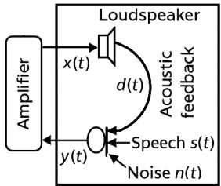
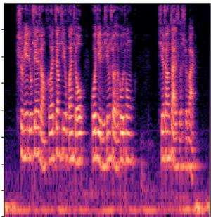
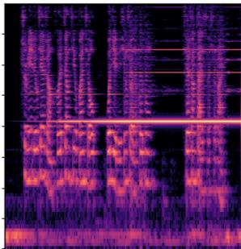
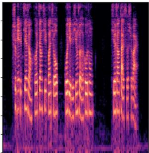
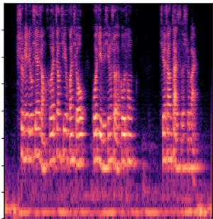

# Acoustic Howling Suppression Enhancement by Fine-Tuning Deep Speech Enhancement Networks

Avichay Ashur and Israel Cohen

Andrew and Erna Viterbi Faculty of Electrical & Computer Engineering

Technion – Israel Institute of Technology, Haifa 3200003, Israel

ashur@campus.technion.ac.il; icohen@ee.technion.ac.il

Abstract—Acoustic Howling Suppression (AHS) remains a significant challenge in assistive listening devices, public address systems, and musical instrument amplifiers. While recent deep learning approaches have shown strong performance on AHS, many are designed as dedicated suppression models and do not explicitly address preserving speech enhancement capabilities, which are essential in practical systems. In this work, we investigate the adaptation of a pretrained speech enhancement network for acoustic howling suppression by fine-tuning it on offline-generated howling training samples. By augmenting the original noise-reduction training data with controlled amounts of synthetic howling signals, the network learns to suppress acoustic feedback while maintaining its speech-enhancement performance. Experimental results demonstrate that appropriate mixing ratios yield substantial improvements in online howling suppression with only minimal degradation in noise reduction quality. The proposed training strategy is simple to implement, requires no architectural modifications or recursive training, and provides a practical solution for jointly addressing noise reduction and acoustic howling suppression in real-world audio systems.

Index Terms—acoustic howling suppression, deep learning, speech enhancement, fine-tuning, audio signal processing.

## I. INTRODUCTION

Acoustic Howling Suppression (AHS) remains a longstanding challenge in speech processing systems, including assistive listening devices, public address systems, and musical instrument amplifiers. Acoustic howling arises from a feedback loop between microphones and loudspeakers, producing highly disruptive tonal artifacts that severely degrade speech quality and intelligibility. Effective suppression of howling is therefore essential for reliable operation in real-world acoustic environments.

Conventional AHS methods are commonly divided into passive and active approaches. Passive techniques rely on manual system adjustments, such as microphone placement or loudspeaker gain reduction, which are often impractical in dynamic or user-driven scenarios. Active approaches process the microphone signal to mitigate feedback. Automatic gain control [1]–[3] adaptively reduces amplification but can struggle under rapidly changing feedback conditions. Notch filtering methods [4], [5] attenuate narrowband frequency components associated with howling, but may distort speech and introduce audible artifacts or instability. Adaptive feedback cancellation (AFC) techniques estimate and subtract the feedback path using adaptive filters. At the same time, effective in many cases, their performance is sensitive to parameter tuning and can degrade in the presence of loudspeaker nonlinearities [6]. These limitations motivate the exploration of more robust and generalizable approaches to AHS.

Recent advances in deep learning (DL) have led to substantial improvements in speech enhancement and noise reduction [7]–[10], encouraging their application to acoustic howling suppression. Many DL-based AHS methods, however, are designed as dedicated suppression systems that primarily target feedback instability, without explicitly preserving general speech enhancement capabilities. Hybrid systems that combine classical signal processing and neural networks [11] have shown improved suppression performance but often at the cost of degraded speech quality. As a result, a gap remains in practical solutions that jointly address acoustic howling suppression and speech enhancement within a unified framework.

Several recent works attempt to narrow this gap. Deep AHS [12] trains neural networks on synthetically generated howling signals using teacher-forced learning [13], [14], avoiding explicit recursive modeling. Other approaches address AHS jointly with acoustic echo cancellation, either reformulating it as a speech-separation problem [15] or combining adaptive filtering with deep residual suppression [16]. Other methods combine adaptive Kalman filtering with deep learning, using both offline and online howling data [17]. In addition, prior studies, such as DeepMFC [18] and related extensions, have explored the use of offline-generated acoustic feedback signals to train data-driven AHS models. In these works, training relies exclusively on synthetic howling data and primarily aims to stabilize the feedback loop. While this approach demonstrated the feasibility of learning-based AHS, its suppression performance was later surpassed by methods employing hybrid signal-processing architectures, recursive training strategies, or joint modeling of speech and feedback dynamics. Unlike DeepMFC, offline-generated data is not used in isolation but rather as complementary data alongside noise-reduction data.

In contrast to prior work that designs dedicated AHS models or relies exclusively on offline-generated howling data, this paper investigates the adaptation of an existing pretrained speech enhancement network for acoustic howling suppression. Offline-generated howling samples are incorporated as a complementary training component alongside the original noise-reduction data, rather than serving as the sole supervision signal. By fine-tuning a real-time speech enhancement model with systematically varied proportions of howling and noise-reduction samples, we analyze the trade-off between online robustness to howling suppression and speechenhancement performance. Experimental results demonstrate that intermediate mixing ratios substantially improve acoustic howling suppression under realistic feedback conditions and achieve competitive, and in many cases state-of-the-art, suppression performance, while preserving nearly the same noisereduction effectiveness as the original pretrained network. The proposed training strategy requires no architectural modifications, introduces no additional inference latency, and avoids recursive training, making it well-suited to practical real-time audio systems.

  
Fig. 1. Diagram of an acoustic amplification system

## II. ACOUSTIC HOWLING SUPPRESSION

Acoustic howling is a phenomenon that occurs in audio systems when sound from a loudspeaker is picked up by a microphone, amplified, and re-emitted, creating a feedback loop, as shown in Fig. 1. The system consists of a microphone and a loudspeaker. The target speech picked up by the microphone is denoted as $s ( t )$ , while the amplified loudspeaker signal, $x ( t )$ is emitted from the speaker and subsequently captured by the microphone as $d ( t )$

$$
d (t) = N L [ x (t) ] * h (t)\tag{1}
$$

where $h ( t )$ represents the room impulse response from the loudspeaker to the microphone, ∗ denotes linear convolution, and $N L ( \cdot )$ accounts for the nonlinear distortion introduced by the loudspeaker. The microphone signal can be represented as:

$$
y (t) = s (t) + n (t) + N L [ y (t - \Delta t) \cdot G ] * h (t).\tag{2}
$$

The background noise is represented by $n ( t )$ , while $\Delta t$ indicates the delay in the system from the microphone to the loudspeaker, and $G$ refers to the amplifier gain. The recursive connection between $y ( t )$ and $y ( t - \Delta t )$ causes the playback signal to be repeatedly amplified, which creates a feedback loop and produces a disruptive high-pitched sound, commonly known as acoustic howling.

## III. PROPOSED METHOD

## A. Baseline Speech Enhancement Model

The baseline model used in this work is the real-time Denoiser network proposed in [19], which is derived from the DEMUCS (Deep Extractor for Music Sources) architecture [20]. DEMUCS follows an encoder–decoder structure with skip connections and was initially developed for waveformdomain source separation. The architecture employs stacked convolutional layers in the encoder to progressively downsample the input signal while capturing both spectral and temporal features. A recurrent module based on long short-term memory (LSTM) layers is incorporated in the latent representation to model long-range temporal dependencies.

The Denoiser adapts this architecture for real-time speech enhancement by optimizing latency and computational efficiency while preserving the encoder–decoder design. Convolutional layers and skip connections enable effective reconstruction of clean speech, while activation and normalization layers improve training stability and generalization. The model is trained initially on large-scale noisy speech datasets, such as Valentini-Botinhao [21], using time-domain loss functions to map noisy inputs to clean speech targets. During inference, the pretrained network effectively suppresses background noise while maintaining speech intelligibility.

## B. Fine-Tuning with Offline-Generated Howling Data

To adapt the pretrained Denoiser for acoustic howling suppression, we fine-tune the model using a combination of its original noise-reduction training data and offline-generated acoustic howling samples. The noise-reduction data preserve the model’s speech-enhancement capabilities. In contrast, the synthetic howling data expose the network to feedbackinduced distortions that are absent from conventional speechenhancement datasets.

The offline-generated howling samples simulate realistic acoustic feedback scenarios under varying room impulse responses, amplification gains, and loudspeaker nonlinearities. Rather than training exclusively on howling signals, the two datasets are jointly used during fine-tuning, with their relative proportions systematically varied. This allows us to study the trade-off between speech enhancement performance and robustness to acoustic howling suppression.

By incorporating howling data as a complementary training component, the adapted model learns to suppress feedbackinduced tonal artifacts while largely retaining its original noise-reduction effectiveness. The fine-tuning process requires no architectural modifications, introduces no additional inference latency, and avoids recursive or closed-loop training strategies. As a result, the proposed approach is simple to implement and well-suited to real-time audio processing systems operating under practical acoustic conditions.

## IV. EXPERIMENTAL RESULTS

## A. Acoustic Howling Dataset

The AISHELL-2 dataset [22] is used as the clean speech source for generating offline acoustic howling training samples. Acoustic feedback signals are synthesized by embedding each utterance in a simulated acoustic amplification loop. For each sample, a room impulse response (RIR) is generated using the image method [23], with randomized room dimensions and source–receiver configurations to model diverse acoustic environments.

  
(a)

  
(b)

  
(c)

  
(d)  
Fig. 2. Spectrograms of (a) target signal, (b) no AHS, (c) 0% howling data (0-100) model, and (d) 60% howling data (60-40) model.

TABLE I  
ONLINE ACOUSTIC HOWLING SUPPRESSION PERFORMANCE (SDR AND PESQ) AT DIFFERENT GAIN LEVELS (G). THE BEST RESULTS FOR EACH ROW ARE SHOWN IN BOLD.

<table><tr><td>Models</td><td colspan="3">SDR (dB) ↑</td><td colspan="3">PESQ ↑</td></tr><tr><td>Gain</td><td>2</td><td>5</td><td>7.5</td><td>2</td><td>5</td><td>7.5</td></tr><tr><td>0-100</td><td>-0.26</td><td>-0.54</td><td>-1.02</td><td>1.95</td><td>1.81</td><td>1.66</td></tr><tr><td>10-90</td><td>-0.32</td><td>-0.20</td><td>-0.20</td><td>1.93</td><td>1.83</td><td>1.71</td></tr><tr><td>25-75</td><td>-0.02</td><td>-0.11</td><td>-0.04</td><td>2.19</td><td>2.01</td><td>1.86</td></tr><tr><td>50-50</td><td>0.76</td><td>0.62</td><td>0.30</td><td>2.46</td><td>2.26</td><td>2.06</td></tr><tr><td>60-40</td><td>2.00</td><td>1.65</td><td>1.34</td><td>2.55</td><td>2.41</td><td>2.22</td></tr><tr><td>75-25</td><td>1.27</td><td>1.06</td><td>0.72</td><td>2.19</td><td>2.03</td><td>1.86</td></tr></table>

The feedback path is constructed by convolving the loudspeaker signal with the generated RIR and applying a nonlinear loudspeaker model. Loudspeaker nonlinearity is modeled as a saturation-type distortion using hard clipping [24]. During offline howling generation, background noise is not added, allowing the training samples to isolate feedback-induced distortions and focus the learning process on suppressing acoustic howling.

The system delay parameter ∆t in the feedback loop is set to zero during offline data generation. This choice is motivated by the fact that the randomized RIRs inherently introduce a range of effective delays due to propagation effects between the loudspeaker and microphone. At inference time, the actual system delay is estimated using the implementation in the Denoiser repository, which computes it based on the target platform’s hardware and software configuration.

Unless otherwise stated, the amplification gain is fixed to G = 2 during training. The model is fine-tuned for 300 epochs using offline-generated howling samples and noise-reduction data, as described in the following subsection.

## B. Speech Enhancement Dataset

To preserve the pretrained model’s original speech enhancement capabilities, we also use the Valentini-Botinhao dataset [21] during fine-tuning. This dataset consists of paired clean and noisy speech recordings under a wide range of noise types and signal-to-noise ratios, and is commonly used as a benchmark for noise reduction and speech enhancement tasks.

During fine-tuning, acoustic howling and noise-reduction samples are combined to form a single training dataset. The relative proportions of howling and noise-reduction data are systematically varied to study the trade-off between acoustic howling-suppression robustness and speech-enhancement performance. By retaining the original noisy speech samples alongside the synthetic howling data, the model is encouraged to suppress feedback-induced tonal artifacts while maintaining its ability to reduce background noise and preserve speech intelligibility.

This joint training setup reflects practical deployment scenarios, such as hearing instruments and public address systems, where both acoustic feedback and environmental noise are present. It enables controlled evaluation of the impact of howling data inclusion on overall system performance.

## C. Evaluation Metrics

The proposed approach is evaluated under two complementary scenarios: noise reduction (speech enhancement) and online acoustic howling suppression.

Speech enhancement evaluation: For noise reduction performance, the model is evaluated on the Valentini-Botinhao test set. Performance is measured using the Perceptual Evaluation of Speech Quality (PESQ) [29] and the Signal-to-Distortion Ratio (SDR). In this setting, both metrics are computed between the enhanced output signal and the corresponding clean target speech signal. Higher PESQ and SDR values indicate improved noise suppression with minimal speech distortion. To assess generalization, evaluation is conducted across diverse types of background noise and signal-to-noise ratios.

Online acoustic howling suppression evaluation: For streaming inference, the enhanced model is integrated into an acoustic feedback loop and evaluated in real time. Different room impulse responses (RIRs) are applied for each test sample to simulate a wide range of acoustic environments. PESQ and SDR are computed between the processed microphone signal and the original clean speech signal before feedback,

TABLE II  
HOWLING SUPPRESSION PERFORMANCE COMPARISON OF DIFFERENT METHODS. MEAN AND STANDARD DEVIATION ARE INCLUDED.

<table><tr><td rowspan="2">Models Gain</td><td colspan="4">SDR (dB) ↑</td><td colspan="4">PESQ ↑</td></tr><tr><td>1.5</td><td>2</td><td>2.5</td><td>3</td><td>1.5</td><td>2</td><td>2.5</td><td>3</td></tr><tr><td>no-AHS</td><td>-30.51 ± 7.23</td><td>-31.86 ± 5.66</td><td>-33.10 ± 3.96</td><td>-33.21 ± 3.94</td><td>-</td><td>-</td><td>-</td><td>-</td></tr><tr><td>DeepMFC [18]</td><td>-0.09 ± 6.50</td><td>-2.78 ± 9.44</td><td>-5.59 ± 11.40</td><td>-7.69 ± 12.26</td><td>2.11 ± 0.51</td><td>1.88 ± 0.59</td><td>1.70 ± 0.62</td><td>1.56 ± 0.59</td></tr><tr><td>DeepAHS [12]</td><td>1.98 ± 6.50</td><td>0.04 ± 8.60</td><td>-3.15 ± 12.01</td><td>-6.32 ± 14.07</td><td>2.49 ± 0.42</td><td>2.42 ± 0.65</td><td>2.04 ± 0.79</td><td>1.84 ± 0.77</td></tr><tr><td>HybridAHS [25]</td><td>2.96 ± 3.04</td><td>1.25 ± 5.79</td><td>-1.45 ± 9.60</td><td>-3.49 ± 10.90</td><td>2.57 ± 0.47</td><td>2.33 ± 0.53</td><td>2.22 ± 0.59</td><td>1.95 ± 0.62</td></tr><tr><td>Neural-KG [26]</td><td>2.50 ± 2.78</td><td>1.63 ± 3.34</td><td>-0.46 ± 7.46</td><td>-2.50 ± 9.94</td><td>2.35 ± 0.46</td><td>2.14 ± 0.44</td><td>1.95 ± 0.48</td><td>1.80 ± 0.53</td></tr><tr><td>NKal-AHS [27]</td><td>3.65 ± 2.01</td><td>2.65 ± 1.70</td><td>1.98 ± 1.49</td><td>1.45 ± 1.31</td><td>2.55 ± 0.44</td><td>2.33 ± 0.41</td><td>2.1 ± 0.39</td><td>2.04 ± 0.37</td></tr><tr><td>Hybrid-NN [28]</td><td>3.87 ± 1.68</td><td>3.04 ± 1.34</td><td>2.49 ± 1.11</td><td>2.11 ± 0.98</td><td>2.60 ± 0.41</td><td>2.40 ± 0.38</td><td>2.25 ± 0.36</td><td>2.13 ± 0.34</td></tr><tr><td>Model 60-40</td><td>2.02 ± 4.78</td><td>2.00 ± 4.81</td><td>1.99 ± 4.82</td><td>1.97 ± 4.88</td><td>2.58 ± 0.62</td><td>2.55 ± 0.62</td><td>2.55 ± 0.61</td><td>2.53 ± 0.62</td></tr></table>

Fig. 2 illustrates representative spectrograms of model performance at an amplification gain of 2. In the No AHS condition (panel (b)), strong narrowband high-frequency components caused by acoustic feedback dominate the signal, clearly illustrating the howling effect in the absence of any suppression. The 0–100 model (panel (c)), trained without howling data, exhibits incomplete suppression of these feedback components and reduced spectral clarity. In contrast, the 60–40 model effectively suppresses feedback-induced tonal reflecting the combined effect of howling suppression and speech preservation under closed-loop operation.

To analyze the effect of data composition during fine-tuning, multiple models are trained using different mixtures of offlinegenerated howling data and standard noise-reduction data. Each model is labeled according to its corresponding mixing ratio (e.g., the 25–75 model uses 25% howling data and 75% noise-reduction data). All models are evaluated under identical conditions for both speech enhancement and online acoustic howling suppression.

## D. Speech Enhancement Performance

Speech enhancement performance, measured by PESQ and SDR on the Valentini-Botinhao test set, remains stable mainly across models fine-tuned with different proportions of howling data. For mixing ratios up to 60%, howling data do not significantly affect PESQ, which remains close to 2.56, with less than a 1% reduction compared to the original pretrained Denoiser [19] (the 0-100 configuration, fine-tuned without any howling data). Similarly, SDR varies by at most 2%, indicating only minor degradation in noise reduction performance when moderate amounts of howling data are included during training.

## E. Online Acoustic Howling Suppression

As the proportion of howling data increases, performance degradation becomes more pronounced. In the 75–25 setting, PESQ decreases to 2.47, and SDR drops from 17.62 to 16.79, reflecting reduced speech enhancement quality. These results suggest that an excessive emphasis on howling data can bias the model to suppress narrowband feedback components at the expense of broadband speech reconstruction, underscoring the importance of balancing howling and noise-reduction data during fine-tuning.

artifacts while preserving both low- and high-frequency speech components.

Quantitative results are reported in Table I, which presents SDR and PESQ scores at gains of 2, 5, and 7.5. Models trained with increasing proportions of howling data generally achieve improved suppression performance, particularly at higher gains where feedback instability is more severe. Among the evaluated configurations, the 60–40 model consistently provides the best trade-off, achieving strong howling suppression with only minimal degradation in speech enhancement performance (PESQ 2.564 → 2.556).

Overall, these results demonstrate that incorporating offlinegenerated howling data during fine-tuning substantially improves online acoustic howling suppression under realistic feedback conditions while preserving the noise-reduction capabilities of the original pretrained speech enhancement model.

## F. Comparison with Previous Works

The performance of the proposed approach is compared with several representative acoustic howling suppression methods in Table II. At higher amplification gains, the proposed 60–40 model achieves the highest PESQ scores among all evaluated methods, except for Hybrid-NN at a gain of 1.5, where Hybrid-NN attains a slightly higher value. This indicates that the proposed fine-tuning strategy is particularly effective at preserving perceptual speech quality under challenging feedback conditions.

In terms of SDR, Hybrid-NN consistently achieves higher scores across all gain levels. This suggests that methods explicitly optimized for feedback cancellation may better minimize overall signal distortion, whereas the proposed approach prioritizes perceptual speech quality and robustness in closedloop operation. The comparatively lower SDR values of the proposed model indicate that further improvements could be achieved by reducing residual distortion introduced during suppression.

A key observation is the stability of the proposed method as the gain increases. While Hybrid-AHS and NKal-AHS exhibit PESQ drops of approximately 0.5–0.6 between gains of 1.5 and 3, the proposed model shows a decrease of only about 0.05 over the same range. This behavior highlights the robustness of the joint training strategy in maintaining speech quality as feedback conditions become more severe, and underscores the benefit of incorporating offline-generated howling data alongside noise-reduction data during training.

## V. CONCLUSIONS

This paper investigated the adaptation of a pretrained realtime speech enhancement network for acoustic howling suppression by fine-tuning it on offline-generated howling data. By jointly training on synthetic howling samples and standard noise-reduction data, the proposed approach improves robustness to acoustic feedback while preserving the original speech enhancement performance.

Experimental results demonstrate that an appropriate balance between howling and noise-reduction data yields a favorable trade-off between suppression robustness and speech quality. In particular, intermediate mixing ratios provide strong online howling suppression under realistic feedback conditions, with only minimal degradation in noise-reduction performance. Compared to existing methods, the proposed approach achieves competitive and, in several cases, state-of-the-art perceptual speech quality at higher gain levels, while avoiding architectural modifications, recursive training, or additional inference latency.

These findings highlight the practicality of incorporating offline-generated howling data as a complementary training component for speech enhancement models. The simplicity and flexibility of the proposed training strategy make it wellsuited for deployment in real-world audio systems, such as hearing instruments and public address systems. Future work will focus on further reducing residual distortion and extending the approach to more complex acoustic scenarios involving simultaneous noise, feedback, and reverberation.

## REFERENCES

[1] A. Pandey and V.J. Mathews, “Howling suppression in hearing aids using least-squares estimation and perceptually motivated gain control,” in Proc. ICASSP, 2006, vol. 5, pp. V–V.

[2] Y. Alkaher and I. Cohen, “Dual-microphone speech reinforcement system with howling-control for in-car speech communication,” Frontiers in Signal Processing, vol. 2, pp. 1–15, March 2022, Article 819113.

[3] Y. Alkaher and I. Cohen, “Howling detection and gain control for speech reinforcement in noisy reverberant environments,” IEEE/ACM Trans. Audio, Speech, Lang. Process., vol. 32, pp. 1494–1504, February 2024.

[4] Pepe Gil-Cacho, Toon van Waterschoot, Marc Moonen, and Søren Holdt Jensen, “Regularized adaptive notch filters for acoustic howling suppression,” in 2009 17th European Signal Processing Conference, 2009, pp. 2574–2578.

[5] Y. Alkaher and I. Cohen, “Temporal howling detector for speech reinforcement systems,” Acoustics, vol. 4, no. 4, pp. 967–995, November 2022, Special Issue on Acoustics, Speech and Signal Processing.

[6] A. Spriet, G. Rombouts, M. Moonen, and J. Wouters, “Adaptive feedback cancellation in hearing aids,” Journal of the Franklin Institute, vol. 343, no. 6, pp. 545–573, 2006.

[7] Y. Xu and Z. Liu, “A deep learning approach to speech enhancement,” IEEE/ACM Trans. Audio, Speech, Lang. Process., vol. 23, no. 5, pp. 827–840, 2015.

[8] D. Wang and J. Chen, “Deep learning for single-microphone speech enhancement: An overview,” IEEE/ACM Trans. Audio, Speech, Lang. Process., vol. 26, no. 6, pp. 1199–1211, 2018.

[9] T. Rosenbaum, E. Winebrand, O. Cohen, and I. Cohen, “Deep learning framework for efficient real-time speech enhancement and dereverberation,” Sensors, vol. 25, no. 3, pp. 1–19, February 2025, Article 630.

[10] A. Ivry, I. Cohen, and B. Berdugo, “Off-the-shelf deep integration for residual echo suppression,” in Proc. ICASSP, 2022, pp. 746–750.

[11] Y. Kim and S. Lee, “Hybrid approaches for acoustic howling suppression and speech enhancement,” in Proc. ICASSP, 2019, pp. 1745–1749.

[12] Hao Zhang, Meng Yu, and Dong Yu, “Deep ahs: A deep learning approach to acoustic howling suppression,” in Proc. ICASSP, 2023, pp. 1–5.

[13] Ronald J. Williams and David Zipser, “A learning algorithm for continually running fully recurrent neural networks,” Neural Computation, vol. 1, pp. 270–280, 1989.

[14] Anirudh Goyal, Alex Lamb, Ying Zhang, Saizheng Zhang, Aaron Courville, and Yoshua Bengio, “Professor forcing: a new algorithm for training recurrent networks,” in Proc. NeurIPS. 2016, p. 4608–4616, Curran Associates Inc.

[15] Hao Zhang, Meng Yu, and Dong Yu, “Deep learning for joint acoustic echo and acoustic howling suppression in hybrid meetings,” in Proc. ASRU, 2023, pp. 1–7.

[16] E. Shachar, I. Cohen, and B. Berdugo, “Acoustic echo cancellation with the normalized sign-error least mean squares algorithm and deep residual echo suppression,” Algorithms, vol. 16, no. 3, pp. 1–14, March 2023, Special Issue on Deep Learning Architecture and Applications, Article 137.

[17] Hao Zhang, Yixuan Zhang, Meng Yu, and Dong Yu, “Enhanced acoustic howling suppression via hybrid kalman filter and deep learning models,” IEEE/ACM Trans. Audio, Speech, Lang. Process., vol. 32, pp. 2828–2840, May 2024.

[18] Chengshi Zheng, Meihuang Wang, Xiaodong Li, and Brian C. J. Moore, “A deep learning solution to the marginal stability problems of acoustic feedback systems for hearing aids,” The Journal of the Acoustical Society of America, vol. 152, no. 6, pp. 3616–3634, 12 2022.

[19] Alexandre Defossez, Gabriel Synnaeve, and Yossi Adi, “Real´ time speech enhancement in the waveform domain,” ArXiv, vol. abs/2006.12847, 2020.

[20] Alexandre Defossez, Nicolas Usunier, L´ eon Bottou, and Francis R.´ Bach, “Music source separation in the waveform domain,” CoRR, vol. abs/1911.13254, 2019.

[21] Cassia Valentini-Botinhao, “Noisy speech database for training speech enhancement algorithms and tts models,” 2017.

[22] Jiayu Du, Xingyu Na, Xuechen Liu, and Hui Bu, “Aishell-2: Transforming mandarin asr research into industrial scale,” ArXiv, vol. abs/1808.10583, 2018.

[23] J. B. Alien and D. A. Berkley, “Image method for efficiently simulating small-room acoustics,” The Journal of the Acoustical Society of America, vol. 60, no. S1, pp. S9–S9, 08 2005.

[24] A.N. Birkett and R.A. Goubran, “Nonlinear loudspeaker compensation for hands free acoustic echo cancellation,” Electronics Letters, vol. 32, pp. 1063–1064, 1996.

[25] Hao Zhang, Meng Yu, Yuzhong Wu, Tao Yu, and Dong Yu, “Hybrid ahs: a hybrid of kalman filter and deep learning for acoustic howling suppression,” in Proc. Interspeech, 2023, pp. 834–838.

[26] Behrad Soleimani, Henning Schepker, and Majid Mirbagheri, “Neuralafc: Learning-based step-size control for adaptive feedback cancellation with closed-loop model training,” in Proc. ICASSP, 2023, pp. 1–5.

[27] Yixuan Zhang, Hao Zhang, Meng Yu, and Dong Yu, “Neural network augmented kalman filter for robust acoustic howling suppression,” in Proc. Interspeech, 09 2024, pp. 1715–1719.

[28] Hao Zhang, Yixuan Zhang, Meng Yu, and Dong Yu, “Advancing acoustic howling suppression through recursive training of neural networks,” in Proc. ICASSP, 2024, pp. 711–715.

[29] Antony W. Rix, John G. Beerends, Mike Hollier, and Andries P. Hekstra, “Perceptual evaluation of speech quality (pesq)-a new method for speech quality assessment of telephone networks and codecs,” in Proc. ICASSP, 2001, vol. 2, pp. 749–752 vol.2.