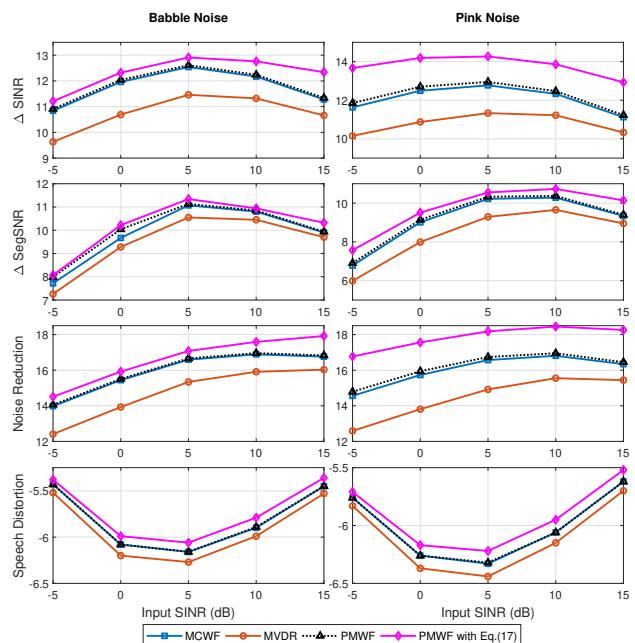

# Exploiting Multi-Channel Speech Presence Probability in Parametric Multi-Channel Wiener Filter

Saeed Bagheri, Daniele Giacobello

Sonos Inc., Santa Barbara, CA, USA

{saeed.sereshki,daniele.giacobello}@sonos.com

## Abstract

In this paper, we present a practical implementation of the parametric multi-channel Wiener filter (PMWF) noise reduction algorithm. In particular, we extend on methods that incorporate the multi-channel speech presence probability (MC-SPP) in the PMWF derivation and its output. The use of the MC-SPP brings several advantages. Firstly, the MC-SPP allows for better estimates of noise and speech statistics, for which we derive a direct update of the inverse of the noise power spectral density (PSD). Secondly, the MC-SPP is used to control the trade-off parameter in PMWF which, with proper tuning, outperforms the traditional approach with a fixed trade-off parameter. Thirdly, the MC-SPP for each frequency-band is used to obtain the MMSE estimate of the desired speech signal at the output, where we control the maximum amount of noise reduction based on our application. Experimental results on a large number of simulated scenarios show significant benefits of employing MC-SPP in terms of SNR improvements and speech distortion.

Index Terms: Microphone arrays, multi-channel noise reduction, multi-channel speech presence probability (MC-SPP)

## 1. Introduction

Multi-channel noise reduction is an integral part of many modern microphone arrays systems with applications ranging from communication systems to human-machine interfaces [1]. In particular, the recent advent of smart loudspeakers like the Amazon Echo, Google Home, and Sonos One, has pushed the robustness required in far-field noise reduction, as the user expects the same level of performance in multiple conditions, regardless of their acoustic environments. Differently from single channel approaches, the added spatial dimension, inherent to the array spatial aperture, results in more degrees of freedom that allows for noise reduction with low or even no speech distortion [2].

Given the inherent spatial nature of the multi-channel noise reduction problem, earlier approaches were greatly influenced by the traditional theory of beamforming that was initially developed for sonar and radar applications using antenna arrays [3]. Well-known multi-channel noise reduction techniques include the Frost beamformer [4], the minimum variance distortionless response (MVDR) beamformer, also known as Capon beamformer [5], the linearly constrained minimum variance (LCMV) beamformers [6, 7], and the generalized sidelobe canceler (GSC) [8]. In all these methods, the general idea is to steer a beam toward the desired speaker while reducing the background noise coming from other directions.

The multi-channel Wiener filter (MWF) is another wellknown multi-channel noise reduction technique, providing a minimum mean-squared error (MMSE) estimate of the speech component in one of the microphone signals [2]. The literature offers several extensions to the traditional MWF. In particular, in [9], the MVDR, the GSC, and the parametric multichannel Wiener filter (PMWF) were formulated into a common frequency-domain framework where a trade-off between noise reduction and speech distortion can be achieved. Furthermore, in contrast to traditional beamforming research, in [9] there are no assumptions on the geometry of the system. In this case, MWF and PMWF can also be formulated as a distributed noise reduction algorithm where the microphone arrays are part of a wireless acoustic sensor network system [10, 11]. This makes the MWF particularly relevant in practical implementation of speech enhancement algorithms in multi-device applications where the relative geometry of multiple sets of microphones is unknown, like multi-device smart loudspeaker systems (e.g., Sonos home sound system).

The MWF and its extensions, require an accurate estimate of the noise PSD. This, in turn, requires a robust estimation of when speech is present [12]. This can be achieved using the speech presence probability (SPP) that has been known to offer better performance when incorporated in the noise spectrum estimation [13, 14]. In [15], a new expression for the multichannel speech presence probability (MC-SPP) was established for a microphone array with arbitrary geometry under the assumption of Gaussian statistical model for speech and noise. The MC-SPP has then been used to extend the single-channel noise PSD estimation to the multi-channel case [16, 17].

In this paper, we provide implementation details for all these different steps of the PMWF derived using the MC-SPP. The MC-SPP helps in an efficient estimation of the inverse of the noise PSD matrix, fundamental in any MWF implementation. Similarly to [12], we show also how the MC-SPP can help in controlling the tradeoff parameter between speech distortion and noise reduction and the overall speech output.

This paper is organized as follows. We define the multichannel noise reduction problem in Section 2. In Section 3, we review the PMWF formulation and its solution. In Section 4, we overview the approach to estimate the PSD matrices. In Section 5, we summarize the implementation aspects of our proposed algorithm. Experimental evaluation and conclusions are discussed in Section 6 and 7, respectively.

## 2. Problem Definition

In the following, we consider the signal model in STFT domain where each microphone input of an N-element array includes an additive mixture of reverberant speech component (or desired signal), and noise where the noise can represent multiple competing point sources or a spatially incoherent noise. The received signal at the n-th microphone can be modeled as $Y _ { n } ( \ell , k ) = X _ { n } ( \ell , k ) + V _ { n } ( \ell , k ) , ~ \overset { \cdot } { n } = 1 , 2 , \ldots , N$ , where $X _ { n } ( \ell , k )$ and $V _ { n } ( \ell , k )$ represent the STFT complex coefficients of the desired speech signal and the noise component, respectively. In addition, \` and $k \in \{ 0 , \ldots , K - 1 \}$ denote the timeframe and frequency bin indices, respectively. The observed signal at the microphone array can be written in vector format by defining $\mathbf { y } ( \ell , k ) \overset { \cdot } { \triangleq } [ Y _ { 1 } ( \ell , k ) , \dots , Y _ { N } ( \ell , k ) ] ^ { T }$ , and its corresponding power spectrum density (PSD) matrix is defined as

$$
\boldsymbol {\Phi} _ {y y} (\ell , k) \triangleq \mathbb {E} [ \mathbf {y} (\ell , k) \mathbf {y} ^ {H} (\ell , k) ].\tag{1}
$$

Similarly, we define vectors $\mathbf { x } ( \boldsymbol { \ell } , k )$ and $\mathbf { v } ( { \boldsymbol { \ell } } , k )$ and PSD matrices $\Phi _ { x x } ( \ell , k )$ and $\Phi _ { v v } ( \ell , k )$ . Assuming that the desired speech and noise signals are zero-mean and uncorrelated, the speech PSD matrix can be expressed as

$$
\Phi_ {x x} (\ell , k) = \Phi_ {y y} (\ell , k) - \Phi_ {v v} (\ell , k).\tag{2}
$$

## 3. Parametric Multi-Channel Wiener Filter

The multi-channel Wiener filter is a linear filter that attempts to enhance the output SNR by reducing noise, utilizing the microphone array’s input observation. The objective is to reduce the noise and recover one of the signal components in some optimal way (by solving a constraint optimization) where a linear filter h $( \ell , k )$ is applied to the observation vector as $\hat { X } _ { i } ( \ell , k ) ~ = ~ \mathbf { h } _ { i } ^ { H } ( \ell , k ) \mathbf { y } ( \ell , k )$ The constraint optimization problem is formed to maximize the local noise reduction factor $( \xi _ { n r } ( \mathbf { h } _ { i } ( \ell , k ) ) )$ ) while limiting the maximum allowable local signal distortion index $( \nu _ { s d } ( { \bf h } _ { i } ( \ell , k ) ) ;$ ) below a frequencydependent threshold. The constraint optimization problem in order to find the linear filters is given by

$$
\begin{array}{l l} \underset {\mathbf {h} _ {i} (\ell , k)} {\arg \max} & \xi_ {n r} (\mathbf {h} _ {i} (\ell , k)) \\ \text {subject to} & \nu_ {s d} (\mathbf {h} _ {i} (\ell , k)) \leq \sigma^ {2} (\ell , k) \end{array}\tag{3}
$$

where $\mathbf { u } _ { i }$ is the i-th standard basis vector and

$$
\xi_ {n r} (\mathbf {h} _ {i} (\ell , k)) = \frac {\Phi_ {v _ {i} v _ {i}} (\ell , k)}{\mathbf {h} _ {i} ^ {H} (\ell , k) \boldsymbol {\Phi} _ {v v} (\ell , k) \mathbf {h} _ {i} (\ell , k)},\tag{4}
$$

$$
\nu_ {s d} (\mathbf {h} _ {i} (\ell , k)) = \frac {[ \mathbf {u} _ {i} - \mathbf {h} _ {i} (\ell , k) ] ^ {H} \boldsymbol {\Phi} _ {x x} (\ell , k) [ \mathbf {u} _ {i} - \mathbf {h} _ {i} (\ell , k) ]}{\Phi_ {x _ {i} x _ {i}} (\ell , k)}.\tag{5}
$$

The closed form solution is obtained by first forming the Lagrangian associated with the optimization problem and then setting its derivative with respect to ${ \bf h } _ { i } ^ { H } ( \ell , k )$ to zero. The STFT domain PMWF is given by [9]

$$
\mathbf {h} _ {i} (\ell , k) = \frac {\boldsymbol {\Phi} _ {v v} ^ {- 1} (\ell , k) \boldsymbol {\Phi} _ {y y} (\ell , k) - \mathbf {I} _ {N}}{\beta (\ell , k) + \operatorname{tr} \left\{\boldsymbol {\Phi} _ {v v} ^ {- 1} (\ell , k) \boldsymbol {\Phi} _ {y y} (\ell , k) \right\} - N} \mathbf {u} _ {i},\tag{6}
$$

where $\operatorname { t r } \{ \cdot \}$ denotes the trace operator and $\beta ( \ell , k )$ (positive valued and the inverse of the Lagrange multiplier) is a timefrequency dependent factor that allows for tuning the signal distortion and noise reduction at the output of h ${ \bf \Phi } _ { i } ( \ell , k )$ . In the following, we propose a method to use the multi-channel speech presence probability to control the trade-off parameter $\beta .$ . One important advantage of the final expression for PMWF is that it only depends on the input and noise statistics through their PSD matrices.

## 4. Estimation of PSD Matrices

PMWF is uniquely based on the second-order statistics, and in the estimation of the speech+noise and the noise-only PSD matrices. Typically, an averaging time window of 2-3 seconds is used to achieve a reliable estimate. This suggests that the noise reduction performance of the PMWF depends on the longterm average of the spectral and the spatial characteristics of the speech and the noise sources. In practice, this means that the PMWF can only work well if the long-term spectral and/or spatial characteristics of the speech and the noise are slowly timevarying. As it is evident from the final expression of PMWF in (6), the key to obtain the linear filter is to estimate the PSD matrices $\Phi _ { y y } ( \ell , k )$ ) and $\Phi _ { v v } ( \ell , k )$ . The accuracy of these estimates play a crucial role in the quality of the filter and its final performance. In this section, we summarize the ideas utilized to estimate these PSDs.

The estimation of $\Phi _ { y y } ( \ell , k )$ is relatively straightforward. We use the typical first order smoothing to approximate the mathematical expectation and estimate the input vector’s PSD. The only parameter of importance is the smoothing coefficient $( \alpha _ { y } )$ which needs to be tuned properly. The Following expression is used to update input PSD matrix

$$
\widehat {\boldsymbol {\Phi}} _ {y y} (\ell , k) = \alpha_ {y} \widehat {\boldsymbol {\Phi}} _ {y y} (\ell - 1, k) + (1 - \alpha_ {y}) \mathbf {y} (\ell , k) \mathbf {y} ^ {H} (\ell , k).\tag{7}
$$

For noise PSD matrix estimation, we need to take into account the speech presence uncertainty. The standard procedure to estimate the speech presence probability in a given timeframe and frequency-bin requires distinguishing between two hypotheses

$$
\begin{array}{l l} H _ {0} (\ell , k): \mathbf {y} (\ell , k) = \mathbf {v} (\ell , k) & \text { speech   is   absent }, \\ H _ {1} (\ell , k): \mathbf {y} (\ell , k) = \mathbf {x} (\ell , k) + \mathbf {v} (\ell , k) & \text { speech   is   present }. \end{array}
$$

Assuming that the speech and noise signals are modelled as complex multivariate Gaussian random variables, the MC-SPP is estimated as follows [15]

$$
\begin{array}{l} p (\ell , k) \triangleq \operatorname * {P r} [ H _ {1} (\ell , k) | \mathbf {y} (\ell , k) ] \\ = \left\{1 + \frac {q (\ell , k)}{1 - q (\ell , k)} [ 1 + \xi (\ell , k) ] \exp \left[ - \frac {\gamma (\ell , k)}{1 + \xi (\ell , k)} \right] \right\} ^ {- 1}, \end{array}\tag{8}
$$

where $q ( \ell , k ) \ \triangleq \ \operatorname* { P r } [ H _ { 0 } ( \ell , k ) ]$ is the a priori speech absence probability which can be estimated recursively as in [18, 17] (we have used fixed $q ( \ell , k ) \triangleq q _ { 0 }$ in our implementation), and we have the following definitions

$$
\begin{array}{l} \gamma (\ell , k) \triangleq \mathbf {y} ^ {H} (\ell , k) \boldsymbol {\Phi} _ {v v} ^ {- 1} (\ell , k) \boldsymbol {\Phi} _ {y y} (\ell , k) \boldsymbol {\Phi} _ {v v} ^ {- 1} (\ell , k) \mathbf {y} (\ell , k) \\ \quad - \mathbf {y} ^ {H} (\ell , k) \boldsymbol {\Phi} _ {v v} ^ {- 1} (\ell , k) \mathbf {y} (\ell , k) \\ \xi (\ell , k) \triangleq \operatorname{tr} \{\boldsymbol {\Phi} _ {v v} ^ {- 1} (\ell , k) \boldsymbol {\Phi} _ {y y} (\ell , k) \} - N, \end{array}\tag{9}
$$

where we have utilized (2) to replace $\Phi _ { x x } ( \ell , k )$ , and $\xi ( \ell , k )$ denotes the multi-channel a priori signal-to-noise ratio (SNR) which is also the theoretical output SNR of the PMWF which also appears in the denominator of (6).

Using the speech presence probability, a MMSE estimate for the noise PSD matrix can be written as

$$
\begin{array}{c} \mathbb {E} [ \mathbf {v v} ^ {H} | \mathbf {y} ] = \operatorname * {P r} [ H _ {0} | \mathbf {y} ] \mathbb {E} [ \mathbf {v v} ^ {H} | \mathbf {y}, H _ {0} ] \\ + \operatorname * {P r} [ H _ {0} | \mathbf {y} ] \mathbb {E} [ \mathbf {v v} ^ {H} | \mathbf {y}, H _ {1} ], \end{array}\tag{10}
$$

where we have omitted \` and k indices for simplicity of notation. To approximate the expectations in (10), we follow the same approach we took to estimate $\Phi _ { y y } ( \ell , k )$ . We use recursive averaging using a smoothing parameter $\alpha _ { v }$ when we are under hypothesis $H _ { 0 }$ by including the new observation vector y in the averaging while we do not change the noise PSD matrix estimate when we are under hypothesis $H _ { 1 } .$ . This can be viewed as a generalization of the MCRA approach [18] for noise tracking to multi-channel case. Employing this technique, the noise PSD matrix can be estimated as

$$
\begin{array}{c} \widehat {\boldsymbol {\Phi}} _ {v v} (\ell , k) = p (\ell , k) \widehat {\boldsymbol {\Phi}} _ {v v} (\ell - 1, k) + (1 - p (\ell , k)) \times \\ \left(\alpha_ {v} \widehat {\boldsymbol {\Phi}} _ {v v} (\ell - 1, k) + (1 - \alpha_ {v}) \mathbf {y} (\ell , k) \mathbf {y} ^ {H} (\ell , k)\right). \end{array}\tag{11}
$$

The noise PSD matrix estimate can be further simplified as

$$
\begin{array}{r l} & {\widehat {\boldsymbol {\Phi}} _ {v v} (\ell , k) = \widetilde {\alpha} _ {v} (\ell , k) \widehat {\boldsymbol {\Phi}} _ {v v} (\ell - 1, k)} \\ & {\qquad + (1 - \widetilde {\alpha} _ {v} (\ell , k)) \mathbf {y} (\ell , k) \mathbf {y} ^ {H} (\ell , k),} \end{array}\tag{12}
$$

where the effective time-frequency dependent smoothing coefficient is defined as $\widetilde { \alpha } _ { v } ( \ell , k ) \overset { \circ } { = } \alpha _ { v } + \bar { ( } 1 - \alpha _ { v } ) p ( \ell , k )$

## 5. Implementation Aspects

In this section, we summarize the steps used to derive the PMWF and its output and the steps that would improve its robustness and performance in practical applications.

MC-SPP Smoothing: In order to improve the MC-SPP estimation, we propose to use a recursively smoothed MC-SPP with smoothing coefficient $0 \leq \alpha _ { p } < 1$ as follows

$$
\overline {{p}} (\ell , k) = \alpha_ {p} \overline {{p}} (\ell - 1, k) + (1 - \alpha_ {p}) p (\ell , k).\tag{13}
$$

In addition, in order to avoid stagnation, we introduce a maximum SPP value and set $\overline { { p } } ( \ell , k ) = \operatorname* { m i n } \{ \overline { { p } } ( \ell , k ) , p _ { \operatorname* { m a x } } \}$ . Similarly, we can introduce a minimum SPP and modify the SPP as $\overline { { p } } ( \ell , k ) = \operatorname* { m a x } \{ \overline { { p } } ( \ell , k ) , p _ { \operatorname* { m i n } } \}$

Derivation of the Inverse of the Noise PSD Matrix: To obtain PMWF at time-frame \` and frequency k, we need to compute $\widehat { \Phi } _ { v v } ^ { - 1 } ( \ell , k )$ , where the calculation of the noise PSD matrix requires the MC-SPP estimate $p ( \ell , k )$ . The value of $p ( \ell , k )$ is calculated using $\gamma ( \ell , k )$ and $\xi ( \ell , k )$ which are defined in (9). However, to compute these terms, we need the estimate of the inverse of the noise PSD matrix $\widehat { \Phi } _ { v v } ^ { - 1 } ( \ell , k )$ which is not available yet. As a compromise, we propose to use $\widehat { \Phi } _ { v v } ^ { - 1 } ( \ell - 1 , k )$ to estimate $p ( \ell , k )$ which is then used to derive $\widetilde { \alpha } _ { v } ( \ell , k )$ and ${ \overline { { p } } } ( \ell , k )$ . It is possible to perform this procedure in a few iterative steps to achieve a better estimation at time frame \`. Basically, update MC-SPP after $\widehat { \Phi } _ { v v } ^ { - 1 } ( \ell , k )$ is estimated and proceed again to estimate $p ( \ell , k )$

Note that, by definition, we should have $\gamma ( \ell , k ) \geq 0$ and $\xi ( \ell , k ) \ \geq \ 0 .$ . However, in practice, due to estimation errors and overestimation of the noise PSD matrix, we might get negative values for these terms, especially before the PSD matrices converge. To improve the algorithm’s performance and avoid numerical issues, whenever $\bar { \gamma } ( \ell , k ) < \mathrm { ~ 0 ~ o r ~ } \xi ( \ell , k ) < 0$ , we propose to set $\widehat { \Phi } _ { v v } ^ { - 1 } ( \ell , k ) = \widehat { \Phi } _ { y y } ^ { - 1 } ( \ell , k )$

Typically, calculation of matrix inverse is computationally very prohibitive. We note that the update expression for $\widehat { \Phi } _ { v v } ( \ell , k )$ in (12) includes a rank-1 correction in each iteration. As a result, we propose to use Woodbury matrix identity (or Sherman-Morrison formula) in (12) where we don’t need to calculate $\widehat { \Phi } _ { v v } ( \ell , k )$ directly

$$
\widehat {\boldsymbol {\Phi}} _ {v v} ^ {- 1} (\ell , k) = \frac {1}{\widetilde {\alpha} _ {v} (\ell , k)} \left(\widehat {\boldsymbol {\Phi}} _ {v v} ^ {- 1} (\ell - 1, k) - \frac {\widetilde {\mathbf {y}} (\ell , k) \widetilde {\mathbf {y}} ^ {H} (\ell , k)}{g (\ell , k)}\right)\tag{14}
$$

where $\widetilde { \mathbf { y } } ( \ell , k ) \triangleq \widehat { \Phi } _ { v v } ^ { - 1 } ( \ell - 1 , k ) \mathbf { y } ( \ell , k )$ , and

$$
g (\ell , k) \triangleq \frac {\widetilde {\alpha} _ {v} (\ell , k)}{1 - \widetilde {\alpha} _ {v} (\ell , k)} + \mathbf {y} ^ {H} (\ell , k) \widetilde {\mathbf {y}} (\ell , k).\tag{15}
$$

It is evident that the above approach directly updates the inverse of the noise PSD matrix which reduces the computational complexity of the algorithm in practical implementations. Employing this approach requires a proper initialization step which is discussed in more details in the following.

MC-SPP Controlled PMWF: The a posteriori SPP has been used to control the trade-off between noise reduction and speech distortion. In [12], the SPP was used to control the trade-off parameter of a PMWF. The SPP-controlled PMWF outperforms the traditional MWF that uses a fixed trade-off parameter in terms of noise reduction and speech distortion. In this contribution, we propose to control the trade-off parameter $\beta ( \ell , k )$ based on the estimated MC-SPP using the following expression

$$
\beta (\ell , k) = \frac {\beta_ {0}}{\alpha_ {\beta} + (1 - \alpha_ {\beta}) \beta_ {0} \overline {{p}} (\ell , k)}.\tag{16}
$$

The idea is to use small trade-off values when MC-SPP is high to reduce speech distortion, and use larger trade-off values when MC-SPP is low to increase the noise reduction. The parameter $\alpha _ { \beta }$ provides a compromise between a fixed trade-off parameter β and one purely based on MC-SPP.

MMSE Estimate of the Output: Once the linear filter $\mathbf { h } _ { i } ^ { H } ( \ell , k )$ is derived, the MMSE estimate of the desired speech signal can be obtained according to

$$
\widehat {X} _ {i} (\ell , k) = \overline {{p}} (\ell , k) \mathbf {h} _ {i} ^ {H} (\ell , k) \mathbf {y} (\ell , k) + (1 - \overline {{p}} (\ell , k)) G _ {\min} Y _ {i} (\ell , k),\tag{17}
$$

where ${ \overline { { p } } } ( \ell , k )$ is defined in (13), and the gain factor $G _ { \mathrm { m i n } }$ determines the maximum amount of noise suppression when speech is not present. This method mitigates the speech distortion caused due to the estimation error of MC-SPP. The parameter $G _ { \mathrm { m i n } }$ can be tuned to optimize the performance metric of interest $( e . g .$ , word error rate in automatic speech recognition systems) in the speech acquisition system. Note that this derivation does not assume a specific assignment of the reference microphone and potentially $\mathsf { \bar { \Phi } } i \in \{ 1 , \dots , N \}$

Initialization of the PSD Matrices: The input and noise PSD matrices need to be initialized at time-frame 0 in the recursive averaging implementation. A standard technique is to initialize them with diagonal matrices as $\widehat \Phi _ { y y } ( 0 , k ) = \delta \mathbf { I } _ { N }$ and $\widehat \Phi _ { v v } ^ { - 1 } ( 0 , k ) = \delta ^ { - 1 } \mathbf { I } _ { N }$ for $k \in \{ 0 , \ldots , K - 1 \}$ where $\delta > 0$ is a very small positive number. However, the convergence speed of the algorithm can be improved by introducing an initialization period where we assume the input signal consists of noise only. Moreover, this approach provides a consistent behavior in noise reduction and noise PSD matrix tracking independent of its spatial and spectral structure. Let us assume that the first L time frames are used for the initialization period where $L \geq N .$ Then, the input signal PSD matrix at time-frame L can be approximated as

$$
\widehat {\boldsymbol {\Phi}} _ {y y} (L, k) = \delta \mathbf {I} _ {N} + \frac {1}{L} \sum_ {\ell = 1} ^ {L} \mathbf {y} (\ell , k) \mathbf {y} ^ {H} (\ell , k).\tag{18}
$$

In order to derive the inverse of the noise PSD matrix at timeframe $L ,$ we initialize $\widehat \Phi _ { v v } ^ { - 1 } ( 0 , k ) = \delta ^ { - 1 } \mathbf { I } _ { N }$ and then use the Woodbury matrix identity during the initialization period a

$$
\widehat {\boldsymbol {\Phi}} _ {v v} ^ {- 1} (\ell , k) = \widehat {\boldsymbol {\Phi}} _ {v v} ^ {- 1} (\ell - 1, k) - \frac {\widetilde {\mathbf {y}} (\ell , k) \widetilde {\mathbf {y}} ^ {H} (\ell , k)}{L + \mathbf {y} ^ {H} (\ell , k) \widetilde {\mathbf {y}} (\ell , k)},\tag{19}
$$

Table 1: Parameters used to implement the proposed algorithm

<table><tr><td>N=4</td><td>L=16</td><td></td><td></td></tr><tr><td>$ \alpha_{v}=0.95 $</td><td>$ \alpha_{y}=0.95 $</td><td>$ \alpha_{p}=0.1 $</td><td>$ q_{0}=0.5 $</td></tr><tr><td>$ p_{\text{max}}=0.99 $</td><td>$ p_{\text{min}}=0.01 $</td><td>$ G_{\text{min}}=0.1 $</td><td>$ \delta=10^{-5} $</td></tr></table>

where $\ell = 1 , \ldots , L$ and $\widetilde { \mathbf { y } } ( \ell , k ) \triangleq \widehat { \Phi } _ { v v } ^ { - 1 } ( \ell - 1 , k ) \mathbf { y } ( \ell , k )$ . During the initialization period, the MC-SPP is set to 0 and the output is generated using (17). In our experiments, a relatively short initialization period of 250 ms $( L = 1 6 )$ was used which resulted in fast convergence of the noise PSD matrix.

## 6. Numerical Experiments

In this section, we present the performance evaluation of the proposed algorithm in terms of speech enhancement and distortion at the output of the PMWF. In our simulation setup, the sampling frequency was 16 kHz, and the frame length of $M = 5 1 2$ samples was used in the STFT implementation with 50% overlap with Hann window. The simulation was performed in a room with the dimension of [5 5 3] m. We consider a circular array of $N = 4$ microphones with the diameter of $d = 7 . 2 5$ cm where the microphone array is located at $[ 2 . 5 1 1 ]$ m in the room. Table 1 summarizes the parameters used in the implementation of the proposed algorithm. We focus on reverberant environments where the reverberation time $T _ { 6 0 } = 3 0 0$ ms has been used. The i-th microphone signal $( y _ { i } ( t ) )$ is generated by convolving the target source signal (clean speech utterance) with the corresponding room impulse response (RIR) (which results in $x _ { i } ( t ) )$ and then corrupted by noise signal $( v _ { i } ( t ) )$ based on the SIR and SNR values: $y _ { i } ( t ) ~ = ~ x _ { i } ( t ) + v _ { i } ( t )$ The RIRs are generated using the image source model [19]. The noise signal is decomposed as $v _ { i } ( t ) = w _ { i } ( t ) + n _ { i } ( t )$ where $w _ { i } ( t )$ denotes the point-source noise or the interference and $n _ { i } ( t )$ denotes the spatially and temporally white Gaussian noise $( \mathrm { A W G N } )$ . The noise levels are controlled by SNR and SIR values which are defined as $\mathrm { S I R } = \mathbb { E } \{ x _ { 1 } ^ { 2 } ( t ) \} / \mathbb { E } \{ w _ { 1 } ^ { 2 } ( t ) \}$ and $\mathrm { S N R } = \mathbb { E } \{ x _ { 1 } ^ { 2 } ( t ) \} / \mathbb { E } \{ n _ { 1 } ^ { 2 } ( t ) \}$ where microphone 1 is used as the reference. The target speech signals are taken from the TIMIT database [20] and include 80 speakers which consists of 40 males and 40 females where 1 utterance for each speaker is selected. The speaker is located at the distance of 3 m and angle of 120 degrees with respect to the center of the microphone array. Two different types of point-source noise (interference) are studied in this work: babble and pink noise taken from the Noisex database [21]. The point-noise source is located at the distance of 2.5 m and angle of 45 degrees with respect to the center of the microphone array. In our experiment, we use $\mathrm { S I R } = \mathrm { S N R }$ where the overall input SINR is changed from −5 to 15 dB.

In the following, we consider four performance metrics to demonstrate the performance of the proposed method. In this setup, for computation of the performance measures, we can calculate the filtered clean speech signal $( x _ { \mathrm { f i l t e r e d } } ( t ) )$ by applying the derived filters to the input clean speech. Then, we can calculate the output SINR in time-domain as $\mathbb { E } \{ x _ { \mathrm { f i l t e r e d } } ^ { 2 } ( t ) \} / \mathbb { E } \{ v _ { \mathrm { f i l t e r e d } } ^ { 2 } ( t ) \}$ where $v _ { \mathrm { f i l t e r e d } } ( t )$ is the residual noise and is expressed as $v _ { \mathrm { f i l t e r e d } } ( t ) ~ = ~ y _ { \mathrm { f i l t e r e d } } ( t ) - x _ { \mathrm { f i l t e r e d } } ( t )$ Using the value of output SINR and input SINR, we can define SINR improvement as the first performance metric. The noise reduction factor is defined as $\mathbb { E } \{ v _ { 1 } ^ { 2 } ( t ) \} / \mathbb { E } \{ v _ { \mathrm { f i l t e r e d } } ^ { 2 } ( t ) \}$ and the speech distortion factor is defined as ${ \mathbb E } \{ ( x _ { 1 } ( t ) ~ -$ $x _ { \mathrm { f i l t e r e d } } ( t ) ) ^ { \hat { 2 } } \} / \mathbb { E } \{ x _ { 1 } ^ { 2 } ( t ) \}$ . Moreover, we report the improvement in segmental SNR (SegSNR) defined in [22] as an objective speech quality measure. These metrics are then averaged over all the utterances in our dataset. In the following, we compare the performance of the standard MVDR $( \beta _ { 0 } = 0 , \alpha _ { \beta } = 1 ) ,$ MCWF $( \beta _ { 0 } ~ = ~ 1 , ~ \alpha _ { \beta } ~ = ~ 1 )$ , MC-SPP Controlled PMWF $( \beta _ { 0 } = 1 , \alpha _ { \beta } = 0 . 7 5 )$ , and the proposed MMSE estimate in (17) with $\beta _ { 0 } = 1 , \alpha _ { \beta } = 0 . 7 5$

  
Figure 1: Performance metrics for babble noise (left) and pink noise (right)

The performance metrics of interests are illustrated in Fig. 1 as a function of input SINR. The results show that MCWF consistently outperforms MVDR in all performance metrics except for the speech distortion factor (as expected). PMWF outperforms MCWF in terms of ∆SINR, ∆SegSNR, and noise reduction while the speech distortion factor remains almost the same. For both noise types, the improvements of PMWF over MCWF get smaller as input SINR increases. PMWF with MMSE estimate in (17) outperforms PMWF (and all other methods) in terms of ∆SINR, ∆SegSNR, and noise reduction. The improvements are more noticeable in the pink noise scenario. In this approach, we observe slightly higher speech distortion, however, the increase is relatively small. Overall, the presented results suggest that using MC-SPP can improve the noise reduction capability of the filter with controlled increase in the speech distortion where we can tune the parameters to the desirable levels of the performance.

## 7. Conclusion

A parametric multi-channel Wiener filter (PMWF) implementation was proposed that utilizes an estimate of the multi-channel speech presence probability (MC-SPP). We showed how the MC-SPP affects different aspects of a traditional PMWF formulation, i.e., the estimation of the noise PSD matrix, the control of the trade-off between noise reduction and speech distortion, and the estimate of desired speech signal at the output of the PMWF. In the performance evaluations, we demonstrated that the proposed method outperforms traditional beamforming techniques in terms of SINR improvement and speech distortion factor.

## 8. References

[1] M. R. Bai, J.-G. Ih, and J. Benesty, Acoustic array systems: theory, implementation, and application. John Wiley & Sons, 2013.

[2] J. Benesty, J. Chen, and Y. Huang, Microphone array signal pro cessing. Springer Science & Business Media, 2008.

[3] B. D. V. Veen and K. M. Buckley, “Beamforming: a versatile ap proach to spatial filtering,” IEEE ASSP Magazine, vol. 5, no. 2, pp. 4–24, 1988.

[4] O. L. Frost, “An algorithm for linearly constrained adaptive array processing,” Proceedings ofthe IEEE, vol. 60, no. 8, pp. 926–935, 1972.

[5] J. Capon, “High-resolution frequency-wavenumber spectrum analysis,” Proceedings ofthe IEEE, vol. 57, no. 8, pp. 1408–1418, 1969.

[6] M. Er and A. Cantoni, “Derivative constraints for broad-band element space antenna array processors,” IEEE Transactions on Acoustics, Speech, and Signal Processing, vol. 31, no. 6, pp. 1378–1393, 1983.

[7] S. Darlington, “Linear least-squares smoothing and prediction, with applications,” The Bell System Technical Journal, vol. 37, no. 5, pp. 1221–1294, 1958.

[8] L. Griffiths and C. Jim, “An alternative approach to linearly con strained adaptive beamforming,” IEEE Transactions on Antennas and Propagation, vol. 30, no. 1, pp. 27–34, 1982.

[9] M. Souden, J. Benesty, and S. Affes, “On optimal frequencydomain multichannel linear filtering for noise reduction,” IEEE Transactions on Audio, Speech, and Language Processing, vol. 18, no. 2, pp. 260–276, 2010.

[10] A. Bertrand, J. Callebaut, and M. Moonen, “Adaptive distributed i d i f h h i i l i sor networks,” in Proc. ofthe International Workshop on Acoustic Echo and Noise Control (IWAENC), 2010.

[11] A. Bertrand, “Applications and trends in wireless acoustic sen sor networks: A signal processing perspective,” in 18th IEEE Symposium on Communications and Vehicular Technology in the Benelux, 2011.

[12] K. Ngo, A. Spriet, M. Moonen, J. Wouters, and S. H. Jensen, “Incorporating the conditional speech presence probability in multi-channel wiener filter based noise reduction in hearing aids,” EURASIP Journal on Advances in Signal Processing, 2009.

[13] R. McAulay and M. Malpass, “Speech enhancement using a softdecision noise suppression filter,” IEEE Transactions on Acoustics, Speech, and Signal Processing, vol. 28, no. 2, pp. 137–145, 1980.

[14] O. Cappe, “Elimination of the musical noise phenomenon with´ the ephraim and malah noise suppressor,” IEEE Transactions on Speech and Audio Processing, vol. 2, no. 2, pp. 345–349, 1994.

[15] M. Souden, J. Chen, J. Benesty, and S. Affes, “Gaussian modelbased multichannel speech presence probability,” IEEE Transac tions on Audio, Speech, and Language Processing, vol. 18, no. 5, pp. 1072–1077, 2010.

[16] M. Taseska and E. A. P. Habets, “MMSE-based blind source extraction in diffuse noise fields using a complex coherence-based a priori SAP estimator,” in International Workshop on Acoustic Echo and Noise Control (IWAENC), 2012.

[17] M. Souden, J. Chen, J. Benesty, and S. Affes, “An integrated solution for online multichannel noise tracking and reduction,” IEEE Transactions on Audio, Speech, and Language Processing, vol. 19, no. 7, pp. 2159–2169, 2011.

[18] I. Cohen, “Noise spectrum estimation in adverse environments: improved minima controlled recursive averaging,” IEEE Transac tions on Speech and Audio Processing, vol. 11, no. 5, pp. 466– 475.2003

[19] E. A. Habets, “Room impulse response generator,” Technische Universiteit Eindhoven, Tech. Rep, 2006.

[20] J. S Garofolo, L. Lamel, W. M Fisher, J. Fiscus, D. S. Pallett, N. L. Dahlgren, and V. Zue, “Timit acoustic-phonetic continuous speech corpus,” Linguistic Data Consortium, 1992.

[21] A. Varga and H. J. Steeneken, “Assessment for automatic speech recognition: II. NOISEX-92: A database and an experiment to study the effect of additive noise on speech recognition systems,” Speech communication, vol. 12, no. 3, pp. 247–251, 1993.

[22] S. Quackenbush, T. Barnwell, and M. Clements, Objective measures ofspeech quality. Ellis Horwood Series in Artificial Intel ligence, Prentice Hall PTR, 1988.