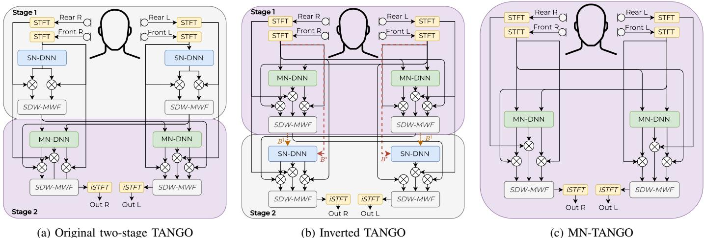
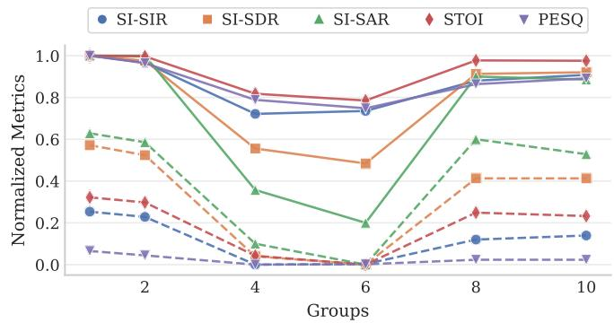

# It Takes Few to TANGO: A Quantized Distributed Model for Binaural Speech Enhancement

Zahra Benslimane ∗†, Pierre Chouteau∗, Martyna Poreba ∗,

Fabrice Auzanneau ∗, Michal Szczepanski ∗, Fabian Chersi ∗, Romain Serizel †

∗ Universite Paris-Saclay, CEA, List, F-91120 Palaiseau, France´

† Universite de Lorraine, CNRS, Inria, LORIA, F-54000 Nancy, France´

zahra-hafida.benslimane@cea.fr

Abstract—Neural network-based multichannel speech enhancement systems achieve strong enhancement performance, but their computational and memory requirements limit deployment on resource-constrained devices. This paper investigates lowprecision inference for TANGO, a hybrid distributed binaural speech enhancement system combining neural mask estimation with spatial filtering. We evaluate post-training quantization and quantization-aware training for the neural components, and analyze how quantization errors in the mask estimators propagate through the downstream spatial filtering stage. Our analysis shows that, although quantization degrades intermediate mask estimates, the spatial filtering stage compensates for most quantization-induced errors. Leveraging this robustness, we simplify TANGO into MN-TANGO, reducing both model size and computational complexity while maintaining comparable final performance. By combining INT8 weight-and-activation quantization with ERB compression and grouped recurrent layers, the most compact MN-TANGO reaches 4.65 MMAC/s and 0.177 MB.

Index Terms—Speech enhancement, quantization-aware training, recurrent neural networks, low-compute.

## I. INTRODUCTION

Deep learning approaches to speech enhancement (SE) have achieved strong performance, but they often rely on large and computationally expensive models. This limits their deployment on resource-constrained devices, such as embedded systems and hearing aids, where low-latency and low-power inference are critical. To address this limitation, a growing body of work has investigated model compression for neural SE.

Early studies mainly focused on reducing model storage through weight compression. Wu et al. [1] combined channel pruning with k-means clustering to quantize the weights of a time-domain fully convolutional network. Similarly, Tan and Wang [2] applied sparse regularization, iterative pruning, and k-means-based quantization to several architectures, including temporal convolutional networks, and gated convolutional recurrent networks (GCRNs). Other works explored reduced floating-point representations. Hsu et al. [3] introduced the Exponent-Only Floating-Point Quantized Neural Network (EOFP-QNN), which quantizes the mantissa and exponent separately. Lin et al. [4] went further by discarding the mantissa entirely and retaining only the sign and exponent bits, achieving about 81% model compression.

While these methods reduce memory footprint, they primarily target weights. Activations, inputs, and outputs often remain in floating point, so inference may still require costly floating-point arithmetic. This limits efficiency on low-power hardware, such as microcontrollers and neural processing units, which are typically optimized for integer pipelines such as INT8. To address this limitation, Fedorov et al. [5] proposed TinyLSTMs, combining structured pruning with quantizationaware training (QAT) [6] to quantize both weights and activations to 8 bits, while keeping the model outputs on 16-bit. Recent studies further showed that activation and I/O standard QAT can be more challenging than weight quantization alone, especially at high input signal-to-noise ratios (SNRs). To mitigate this effect, [7] introduced a residual correction branch to compensate for quantization errors. This approach was later extended to source separation using a knowledge-distillationbased loss for quantization-sensitive samples [8].

Despite these advances, most quantization studies for SE focus on single-channel, purely neural models, leaving hybrid multichannel systems largely unexplored. In this work, we show that the hybrid neural-spatial structure of TANGO [9] makes it robust to low-precision neural inference. We focus on quantizing the neural network rather than the spatial filter, since the neural component accounts for most of the computational cost [10]. Although quantization degrades intermediate mask estimates, the downstream spatial filtering stage compensates for most quantization-induced errors. Our results highlight three main findings: (i) the final spatial filtering stage provides most of the enhancement gains, (ii) spatial filtering mitigates most of the degradation introduced by quantization, and (iii) the original two-stage architecture can be simplified into its second stage (MN-TANGO) while maintaining comparable final performance. Building on these findings, we combine MN-TANGO with QAT, Equivalent Rectangular Bandwidth (ERB) compression, and grouped recurrent layers to obtain a compact low-compute model for distributed binaural SE.

## II. BACKGROUND

## A. Baseline TANGO Architecture

TANGO [9] is used as the baseline architecture in this study. Like other hybrid SE systems, TANGO combines the representation learning capabilities of deep neural networks with the spatial filtering properties of classical beamformers. This hybrid design makes it particularly relevant for studying the impact of quantization on both neural and signalprocessing components. In the first stage, each ear-node independently estimates speech and noise time-frequency masks using a single-node DNN (SN-DNN). These masks are used to estimate speech and noise spatial covariance matrices, from which a GEVD-based [11] speech-distortion-weighted multichannel Wiener filter (SDW-MWF) [12] is derived and applied as a spatial filter. The resulting ear-specific compressed signal is then transmitted to the contralateral ear-node. In the second stage, a multi-node DNN (MN-DNN) refines the mask estimates by exploiting both local signals and the exchanged representation. A final SDW-MWF then generates the enhanced binaural output. The overall architecture is illustrated in Fig. 1a.

(a) Original two-stage TANGO  
  
Fig. 1: Overview of the evaluated TANGO variants: (a) original two-stage TANGO with SN-DNN followed by MN-DNN processing, (b) inverted TANGO with MN-DNN processing before the SN-DNN stage, and (c) MN-TANGO with only the MN-DNN stage. In (b), the dotted lines indicate the two alternative inputs to the second-stage SN-DNN: (B†) uses the output of the first spatial filtering stage, whereas (B⋆) uses the local reference signal.

## B. Neural Network Quantization

Quantization maps floating-point values to a lower-precision integer representation. This reduces memory requirements and can improve inference efficiency, particularly on hardware that supports low-precision arithmetic. In neural networks, it can be applied both to the weights and to the intermediate activations.

In uniform affine quantization, values are mapped from a selected floating-point range to a finite set of integer levels determined by the target bit-width. The scale controls the spacing between these levels, while clipping ensures that values outside the selected range remain representable. In dynamic post-training quantization (DPTQ), quantization is applied after floating-point training: the layer weights are stored in low precision, while activations are quantized dynamically at runtime according to their observed range. In contrast, QAT simulates low-precision inference during training by inserting fake-quantization modules in the forward pass. Since rounding is non-differentiable, gradients are approximated using a straight-through estimator, allowing the model to adapt to quantization errors before deployment [6].

## III. TOWARD LOW-COMPUTE QUANTIZED TANGOA. From TANGO to MN-TANGO

To better understand the contribution of each TANGO stage, we investigate alternative architectures that either reorganize or simplify its processing stages, as shown in Fig. 1. We first evaluate two inverted configurations, denoted as (B⋆) and (B†) and illustrated in Fig. 1(b). Both variants start with a crossnode exchange of the reference signals and apply an MN-DNN before the first spatial filtering stage. They differ in the input used by the second-stage SN-DNN: (B†) uses the output of the first spatial filtering stage, whereas (B⋆) uses only the local reference signal of the corresponding node. These variants allow us to assess whether performing multi-node processing earlier in the pipeline improves enhancement performance. We further investigate a simplified MN-only configuration, shown in Fig. 1(c), that removes the SN-DNN stage entirely. This variant tests whether the first single-node stage is necessary once inter-node information is available, or whether most of the final enhancement can be preserved by combining multinode mask estimation with the final spatial filtering stage. In the following, we refer to this configuration as MN-TANGO.

## B. End-to-End Training

The original TANGO training strategy optimizes the neural mask estimators using mask-level objectives. However, in hybrid neural-beamforming systems, accurate mask estimation does not necessarily translate into optimal enhanced signals after spatial filtering. To better align optimization with the final enhancement objective, we investigate end-to-end training, where the spatial filtering stage is included in the training loop. During training, we use a differentiable implementation of the SDW-MWF, which allows gradients to propagate from the enhanced STFT loss back to the neural mask estimators. At inference time, the spatial filtering stage is computed using the GEVD-based implementation adopted in the original TANGO model. Thus, the reported enhancement results are obtained with the GEVD-based spatial filter, unless explicitly stated otherwise.

TABLE I: Model comparison with quantization scheme, precision configuration, memory, and left/right ear scores. W, A, and I/O denote weights, activations, and input/output tensors, respectively.

<table><tr><td rowspan="2">Quant. scheme</td><td colspan="3">Precision</td><td> $Memory^{\downarrow}$ </td><td colspan="2">SI-SIR $^{\uparrow}$ </td><td colspan="2">SI-SDR $^{\uparrow}$ </td><td colspan="2">SI-SAR $^{\uparrow}$ </td><td colspan="2">STOI $^{\uparrow}$ </td><td colspan="2">PESQ $^{\uparrow}$ </td></tr><tr><td>W</td><td>A</td><td>I/O</td><td>MB</td><td>L</td><td>R</td><td>L</td><td>R</td><td>L</td><td>R</td><td>L</td><td>R</td><td>L</td><td>R</td></tr><tr><td>Noisy</td><td>-</td><td>-</td><td>-</td><td>-</td><td>0.0</td><td>-4.0</td><td>-0.6</td><td>-4.6</td><td>-</td><td>-</td><td>0.68</td><td>0.56</td><td>1.14</td><td>1.10</td></tr><tr><td>Float32</td><td>FP32</td><td>FP32</td><td>FP32</td><td>4.03</td><td>22.8</td><td>26.2</td><td>4.7</td><td>5.0</td><td>5.0</td><td>5.1</td><td>0.842</td><td>0.850</td><td>1.731</td><td>1.770</td></tr><tr><td>DPTQ</td><td>INT8</td><td>FP32</td><td>FP32</td><td>1.01</td><td>18.4</td><td>20.9</td><td>2.7</td><td>2.9</td><td>3.6</td><td>3.6</td><td>0.811</td><td>0.813</td><td>1.585</td><td>1.614</td></tr><tr><td>QAT</td><td>INT8</td><td>FP32</td><td>FP32</td><td>1.083</td><td>22.8</td><td>26.2</td><td>4.7</td><td>5.0</td><td>5.0</td><td>5.1</td><td>0.843</td><td>0.851</td><td>1.729</td><td>1.765</td></tr><tr><td>QAT</td><td>INT8</td><td>INT8</td><td>INT16</td><td>1.083</td><td>23.0</td><td>25.9</td><td>3.7</td><td>4.5</td><td>4.0</td><td>4.6</td><td>0.828</td><td>0.842</td><td>1.735</td><td>1.753</td></tr></table>

The end-to-end objective combines the mask-level loss with an enhanced-STFT loss computed after the last spatial filtering stage. Let $\tilde { M _ { c } }$ and $M _ { c }$ denote the estimated and target masks for ear $c \in \{ \mathrm { L } , \mathrm { R } \}$ , and let $\tilde { S } _ { c }$ and $S _ { c }$ denote the corresponding enhanced and clean STFTs. The mask loss is defined as:

$$
\mathcal {L} _ {\mathrm{mask}} = \frac {1}{2} \sum_ {c \in \{\mathrm{L}, \mathrm{R} \}} \operatorname{MSE} \left(\tilde {M} _ {c}, M _ {c}\right).\tag{1}
$$

Inspired by [13], the enhanced-STFT loss is defined as:

$$
\begin{array}{l} \ell_ {\mathrm{STFT}} \left(\tilde {S} _ {c}, S _ {c}\right) = (1 - \beta) \mathrm{MSE} \left(| \tilde {S} _ {c} |, | S _ {c} |\right) + \\ \beta \left(\mathrm{MSE} \left(\mathrm{Re} \{\tilde {S} _ {c} \}, \mathrm{Re} \{S _ {c} \}\right) + \mathrm{MSE} \left(\mathrm{Im} \{\tilde {S} _ {c} \}, \mathrm{Im} \{S _ {c} \}\right)\right). \end{array}\tag{2}
$$

where $\operatorname { R e } \{ \cdot \}$ and Im{·} denote the real and imaginary parts, respectively. Here, β balances magnitude-domain and complex-domain reconstruction terms. The loss is then averaged over the two ears:

$$
\mathcal {L} _ {\mathrm{STFT}} = \frac {1}{2} \sum_ {c \in \{\mathrm{L}, \mathrm{R} \}} \ell_ {\mathrm{STFT}} (\tilde {S} _ {c}, S _ {c}).\tag{3}
$$

The full end-to-end objective is:

$$
\mathcal {L} _ {\mathrm{task}} = \alpha \mathcal {L} _ {\mathrm{mask}} + (1 - \alpha) \mathcal {L} _ {\mathrm{STFT}},\tag{4}
$$

where α controls the balance between mask reconstruction and final enhanced-signal reconstruction.

## C. Low-Precision TANGO

We evaluate TANGO under low-precision inference using QAT, following Section II-B. Because low-precision inference may degrade the quality of the predicted masks and the resulting enhanced signal, we further introduce knowledge distillation (KD) with floating-point TANGO as the teacher and the quantized model as the student. The KD objective combines mask-level MSE matching and enhanced-STFT matching between the teacher and student outputs. The masklevel KD loss is defined as:

$$
\mathcal {L} _ {\mathrm{KD}} ^ {\mathrm{mask}} = \frac {1}{2} \sum_ {c \in \{\mathrm{L}, \mathrm{R} \}} \mathrm{MSE} \left(M _ {c} ^ {(s)}, M _ {c} ^ {(t)}\right),\tag{5}
$$

where $M _ { c } ^ { ( s ) }$ and $M _ { c } ^ { ( t ) }$ denote the final masks predicted by the student and teacher, respectively. The enhanced-STFT KD loss reuses the per-ear STFT loss from Section III-B:

$$
\mathcal {L} _ {\mathrm{KD}} ^ {\mathrm{STFT}} = \frac {1}{2} \sum_ {c \in \{\mathrm{L}, \mathrm{R} \}} \ell_ {\mathrm{STFT}} \left(Y _ {c} ^ {(s)}, Y _ {c} ^ {(t)}\right),\tag{6}
$$

where $Y _ { c } ^ { ( s ) }$ and $Y _ { c } ^ { ( t ) }$ denote the corresponding enhanced STFTs after the differentiable spatial filter. The final distillation and training objectives are:

$$
\mathcal {L} _ {\mathrm{distill}} = \lambda_ {\mathrm{KD}} \mathcal {L} _ {\mathrm{KD}} ^ {\mathrm{mask}} + (1 - \lambda_ {\mathrm{KD}}) \mathcal {L} _ {\mathrm{KD}} ^ {\mathrm{STFT}},\tag{7}
$$

$$
\mathcal {L} \mathrm{total} = \lambda_ {\mathrm{task}} \mathcal {L} _ {\mathrm{task}} + (1 - \lambda_ {\mathrm{task}}) \mathcal {L} _ {\mathrm{distill}}.\tag{8}
$$

where $\lambda _ { \mathrm { K D } }$ controls the balance between mask-level and enhanced-STFT distillation, and $\lambda _ { \mathrm { t a s k } }$ controls the balance between supervised task training and knowledge distillation.

## D. Low-Compute TANGO

Beyond low-precision quantization, we further reduce the complexity of TANGO through architectural compression. This allows us to assess whether the proposed quantization pipeline remains effective under stricter compute and memory constraints.

This design adapts the architectural compression strategy introduced in our previous low-latency, low-compute RT-TANGO framework [14], relying on ERB feature compression to exploit perceptual frequency redundancy and grouped recurrent processing to reduce recurrent computation.

After the point-wise channel-mixing layer, the linearfrequency STFT representation is projected onto a compact ERB scale, reducing the recurrent input dimension. The predicted ERB-domain mask is then mapped back to the original STFT frequency bins before filtering.

The original MN-DNN recurrent block is replaced with grouped LSTM layers. The hidden representation is partitioned into (G) groups processed independently within each recurrent layer. Deterministic interleaving is applied between layers to exchange information across groups [15].

## IV. EXPERIMENTAL SETUP

## A. Training and Evaluation

The training data consisted of simulated binaural mixtures generated according to the setup described by Monir et al. [16].

TABLE II: Stage-wise performance and complexity comparison of end-to-end trained TANGO variants in FP32. Bold and underlined values indicate the best and second-best scores, respectively, among the final GEVD filtering rows.

<table><tr><td rowspan="2">Method</td><td rowspan="2">MMACs/s↓</td><td rowspan="2">#Params↓</td><td rowspan="2">Step</td><td colspan="2">SI-SIR↑</td><td colspan="2">SI-SDR↑</td><td colspan="2">SI-SAR↑</td><td colspan="2">STOI↑</td><td colspan="2">PESQ↑</td></tr><tr><td>L</td><td>R</td><td>L</td><td>R</td><td>L</td><td>R</td><td>L</td><td>R</td><td>L</td><td>R</td></tr><tr><td>Noisy</td><td>-</td><td>-</td><td>-</td><td>0.0</td><td>-4.0</td><td>-0.6</td><td>-4.6</td><td>-</td><td>-</td><td>0.68</td><td>0.56</td><td>1.14</td><td>1.10</td></tr><tr><td rowspan="4">TANGO</td><td rowspan="4">65.65</td><td rowspan="4">1 M</td><td>SN-DNN</td><td>3.1</td><td>0.0</td><td>0.7</td><td>-2.2</td><td>7.3</td><td>5.5</td><td>0.71</td><td>0.59</td><td>1.14</td><td>1.09</td></tr><tr><td>Filter1 (GEVD)</td><td>9.4</td><td>6.7</td><td>-0.7</td><td>-2.1</td><td>0.8</td><td>0.4</td><td>0.73</td><td>0.66</td><td>1.21</td><td>1.16</td></tr><tr><td>MN-DNN</td><td>13.0</td><td>7.8</td><td>5.0</td><td>2.2</td><td>6.2</td><td>4.6</td><td>0.75</td><td>0.74</td><td>1.22</td><td>1.15</td></tr><tr><td>Filter2 (GEVD)</td><td>24.3</td><td>25.6</td><td>5.3</td><td>4.9</td><td>5.5</td><td>5.0</td><td>0.85</td><td>0.85</td><td>1.76</td><td>1.68</td></tr><tr><td rowspan="4">Inverted TANGO (B†)</td><td rowspan="4">65.65</td><td rowspan="4">1 M</td><td>MN-DNN</td><td>3.3</td><td>1.7</td><td>-0.9</td><td>-2.2</td><td>4.8</td><td>3.5</td><td>0.52</td><td>0.58</td><td>1.11</td><td>1.09</td></tr><tr><td>Filter1 (GEVD)</td><td>12.3</td><td>15.2</td><td>-1.3</td><td>-0.4</td><td>0.5</td><td>0.7</td><td>0.70</td><td>0.77</td><td>1.29</td><td>1.30</td></tr><tr><td>SN-DNN</td><td>9.1</td><td>3.9</td><td>3.6</td><td>0.3</td><td>6.0</td><td>5.1</td><td>0.72</td><td>0.67</td><td>1.15</td><td>1.10</td></tr><tr><td>Filter2 (GEVD)</td><td>24.2</td><td>24.9</td><td>5.2</td><td>4.9</td><td>5.4</td><td>5.1</td><td>0.85</td><td>0.84</td><td>1.71</td><td>1.67</td></tr><tr><td rowspan="4">Inverted TANGO (B*)</td><td rowspan="4">65.65</td><td rowspan="4">1 M</td><td>MN-DNN</td><td>3.1</td><td>0.8</td><td>-0.20</td><td>-2.1</td><td>6.2</td><td>4.7</td><td>0.57</td><td>0.55</td><td>1.11</td><td>1.10</td></tr><tr><td>Filter1 (GEVD)</td><td>11.2</td><td>8.7</td><td>4.8</td><td>2.3</td><td>6.6</td><td>4.4</td><td>0.74</td><td>0.62</td><td>1.23</td><td>1.13</td></tr><tr><td>SN-DNN</td><td>11.2</td><td>8.7</td><td>4.8</td><td>2.3</td><td>6.6</td><td>4.4</td><td>0.74</td><td>0.62</td><td>1.25</td><td>1.13</td></tr><tr><td>Filter2 (GEVD)</td><td>23.2</td><td>23.6</td><td>6.7</td><td>5.5</td><td>7.0</td><td>5.8</td><td>0.88</td><td>0.84</td><td>1.84</td><td>1.77</td></tr><tr><td rowspan="3">MN-TANGO</td><td rowspan="3">30.79</td><td rowspan="3">0.5 M</td><td>MN-DNN</td><td>12.2</td><td>8.9</td><td>4.2</td><td>2.0</td><td>5.5</td><td>3.8</td><td>0.67</td><td>0.61</td><td>1.19</td><td>1.13</td></tr><tr><td>Filter2 (GEVD)</td><td>23.7</td><td>24.2</td><td>6.1</td><td>5.5</td><td>6.3</td><td>5.6</td><td>0.86</td><td>0.84</td><td>1.79</td><td>1.73</td></tr><tr><td>Filter2 (SDW-MWF)</td><td>12.5</td><td>10.4</td><td>6.9</td><td>5.5</td><td>9.2</td><td>8.3</td><td>0.83</td><td>0.76</td><td>1.56</td><td>1.37</td></tr></table>

The simulated hearing-aid configuration contains four microphones, two placed on each ear. Speech signals were taken from LibriSpeech [17] and combined with speech-shaped noise and real environmental noise sources. For evaluation, we used a subset of the BinauRec dataset1 [18]. This subset contains 1,200 binaural mixtures generated from measured room impulse responses. The RIRs were recorded using a portable hearing laboratory equipped with behind-the-ear hearing-aid shells mounted on a dummy head [19]. Mixtures were generated at input SNRs of −5, 0, and 5 dB. The target source was placed in front of the listener, while the noise source was located either 45◦ or 90◦ to the right of the target. This setup reflects a typical hearing-aid scenario, with a frontal target speaker and lateral interfering noise. Only right-side noise locations are considered, since left-side configurations are symmetric, making the right ear more challenging.

## B. Model Configuration

All mask estimators use 257-bin magnitude STFT features computed with a 512-point FFT, a 512-sample Hann window, and a 256-sample hop at 16 kHz, corresponding to 62.5 frames/s. Floating-point end-to-end models are trained on 512- frame segments, while grouped QAT models are initialized from their floating-point grouped checkpoints and fine-tuned on 64-frame segments, to reduce training time.

The learning rates are $5 \times 1 0 ^ { - 4 }$ for floating-point training and $1 0 ^ { - 4 }$ for QAT fine-tuning. For the end-to-end objective, we set $\alpha = 0 . 3$ and $\beta = 0 . 3$ . For the KD experiments, we set $\lambda _ { \mathrm { K D } } = 0 . 3$ and $\lambda _ { \mathrm { t a s k } } = 0 . 7$ . In all experiments, all spatial filtering stages use the trade-off parameter $\mu = 1$

TANGO uses two recurrent mask estimators. The SN-DNN is a unidirectional LSTM mask estimator with three LSTM layers of 128 hidden units and a fully connected mask head with hidden/output dimensions 256 and 257. The MN-DNN first applies a point-wise convolution to combine the two input channels, followed by GELU activation, layer normalization, a three-layer unidirectional LSTM with 128 hidden units, and a fully connected sigmoid mask head with 257 output bins.

For the low-compute TANGO, the ERB projection uses 64 low-frequency linear bins and 64 ERB bands, yielding a 128- dimensional recurrent input for most grouped models. When divisibility by the group count G is required, the number of ERB bands is adjusted accordingly. The grouped recurrent block consists of two unidirectional LSTM layers with 128 hidden units, and the final mask is mapped back to the original 257 STFT frequency bins before filtering.

## C. Quantization Configurations

In this work, quantization is applied only to the neural mask estimators. All fixed signal-processing components, including STFT/iSTFT operations, covariance estimation, and SDW-MWF/GEVD spatial filtering, remain in floating-point precision (FP32). Although the low-precision methodology can be applied to any TANGO variant, the QAT and KD experiments in this paper are conducted on MN-TANGO. DPTQ is implemented using the PyTorch eager-mode dynamic quantization $\mathrm { A P I . } ^ { 2 }$ For QAT, we use a custom implementation inspired by the FQSS fully quantized source-separation framework3. Weights use a symmetric signed quantizer, while activations are quantized using an asymmetric affine quantizer whose range is initialized from observed activation minima and maxima. Observer-based range updates are enabled during an initial warm-up phase and then frozen, after which quantization ranges are optimized by gradient descent. The main QAT configuration uses mixed precision: trainable weights and internal activations are quantized to 8 bits (W8A8), while input and output mask tensors are simulated using 16-bit. Bias terms are kept in higher precision and added in the accumulator domain before requantization. Throughout this work, W8A8 refers specifically to the precision of internal neural layers rather than to input/output mask tensors.

TABLE III: Effect of W8A8 quantization and knowledge distillation on MN-TANGO before and after GEVD filtering.

<table><tr><td rowspan="2">Output</td><td rowspan="2">Precision</td><td rowspan="2">KD</td><td colspan="2">SI-SIR $^{\uparrow}$ </td><td colspan="2">SI-SDR $^{\uparrow}$ </td><td colspan="2">SI-SAR $^{\uparrow}$ </td><td colspan="2">STOI $^{\uparrow}$ </td><td colspan="2">PESQ $^{\uparrow}$ </td></tr><tr><td>L</td><td>R</td><td>L</td><td>R</td><td>L</td><td>R</td><td>L</td><td>R</td><td>L</td><td>R</td></tr><tr><td rowspan="3">MN-DNN</td><td>FP32</td><td>-</td><td>12.2</td><td>8.9</td><td>4.2</td><td>2.0</td><td>5.5</td><td>3.8</td><td>0.67</td><td>0.61</td><td>1.19</td><td>1.13</td></tr><tr><td>W8A8</td><td>✘</td><td>10.7</td><td>7.1</td><td>3.7</td><td>1.4</td><td>5.4</td><td>4.0</td><td>0.66</td><td>0.59</td><td>1.18</td><td>1.12</td></tr><tr><td>W8A8</td><td>✓</td><td>10.6</td><td>7.0</td><td>3.6</td><td>1.3</td><td>5.3</td><td>3.9</td><td>0.65</td><td>0.59</td><td>1.18</td><td>1.12</td></tr><tr><td rowspan="3">Final output(GEVD)</td><td>FP32</td><td>-</td><td>23.7</td><td>24.2</td><td>6.1</td><td>5.5</td><td>6.3</td><td>5.6</td><td>0.86</td><td>0.84</td><td>1.79</td><td>1.73</td></tr><tr><td>W8A8</td><td>✘</td><td>23.6</td><td>24.8</td><td>5.8</td><td>5.4</td><td>6.1</td><td>5.5</td><td>0.86</td><td>0.84</td><td>1.77</td><td>1.71</td></tr><tr><td>W8A8</td><td>✓</td><td>23.9</td><td>25.2</td><td>5.8</td><td>5.3</td><td>6.0</td><td>5.5</td><td>0.86</td><td>0.84</td><td>1.77</td><td>1.72</td></tr></table>

## D. Evaluation Metrics

Enhancement performance was measured using scaleinvariant signal-to-distortion ratio (SI-SDR), scale-invariant signal-to-interference ratio (SI-SIR), and scale-invariant signal-to-artifacts ratio (SI-SAR), all reported in dB [20], as well as the short-time objective intelligibility (STOI) [21] and perceptual evaluation of speech quality (PESQ) [22]. The unprocessed noisy input mixture is reported in the result tables to provide a reference signal quality prior to enhancement. SI-SAR is not reported for this baseline, as the metric reflects artifacts introduced by signal processing and is therefore not applicable to an unprocessed input. Computational complexity and model size are reported per processing node, with complexity measured in multiply-accumulate operations (MACs) and model size given in terms of the number of trainable parameters and memory footprint.

## V. RESULTS

## A. Quantized TANGO

Table I compares DPTQ and QAT without KD on the full TANGO model, revealing a clear performance gap between post-training and training-aware quantization. DPTQ leads to a noticeable degradation compared with the FP32 baseline. This likely reflects the quantization sensitivity of LSTM layers, whose activations and internal states can span different dynamic ranges. In contrast, weight-only QAT preserves the FP32 performance almost exactly, indicating that TANGO can effectively adapt to quantization noise when low-precision effects are incorporated during training. When activations and I/O tensors are also quantized, performance slightly decreases, mainly in SI-SDR and SI-SAR, while STOI and PESQ remain close to the FP32 baseline. This suggests that the neural mask estimators are highly sensitive to na¨ıve post-training quantization, but can effectively adapt to low-precision constraints when quantization noise is incorporated during training.

## B. Quantized MN-TANGO

Table II compares the TANGO variants introduced in Section III-A. Across variants, the largest performance jump consistently occurs after the final spatial filtering stage rather than within the neural mask estimators. This indicates that the downstream spatial filter contributes most of the final enhancement by exploiting binaural spatial structure and compensating for imperfect mask estimates. For the original TANGO model, the final stage increases SI-SIR from 13.0/7.8 dB after MN-DNN to 24.3/25.6 dB after GEVD filtering for the left and right ears, respectively. Among the inverted variants, B† achieves performance close to the original TANGO model but does not provide consistent improvements across metrics. By contrast, B⋆ achieves the best reconstruction quality in terms of SI-SDR, SI-SAR, STOI, and PESQ, although its SI-SIR remains slightly below that of the original TANGO model. This suggests that performing multi-node processing earlier in the pipeline improves signal reconstruction quality, even if interference suppression is not maximized.

TABLE IV: Component-wise computational complexity of the grouped recurrent architecture. Component costs and frame totals are in kMACs/frame; the last column is in MMAC/s.

<table><tr><td>G</td><td>PW</td><td>LSTM</td><td>ERB+Inv.</td><td>FC</td><td>Total/frame $^{\downarrow}$ </td><td>Total/s $^{\downarrow}$ </td></tr><tr><td>1</td><td>0.51</td><td>459.26</td><td>-</td><td>32.90</td><td>492.67</td><td>30.79</td></tr><tr><td>2</td><td>0.51</td><td>131.07</td><td>24.70</td><td>16.38</td><td>172.67</td><td>10.79</td></tr><tr><td>4</td><td>0.51</td><td>65.54</td><td>24.70</td><td>16.38</td><td>107.14</td><td>6.70</td></tr><tr><td>6</td><td>0.51</td><td>42.34</td><td>23.93</td><td>15.88</td><td>82.66</td><td>5.17</td></tr><tr><td>8</td><td>0.51</td><td>32.77</td><td>24.70</td><td>16.38</td><td>74.37</td><td>4.65</td></tr><tr><td>10</td><td>0.51</td><td>27.04</td><td>25.48</td><td>16.90</td><td>69.93</td><td>4.37</td></tr></table>

MN-TANGO provides the best overall trade-off between enhancement quality, computational cost, and communication overhead. With GEVD inference, it reaches SI-SIR values of 23.7 dB and 24.2 dB for the left and right ears, respectively. Compared with the full TANGO system, MN-TANGO reduces the parameter count and neural computational cost by approximately 50%, from 1.0M to 0.5M parameters and from 65.65 to 30.79 MMAC/s, while preserving the single internode exchange required by the original TANGO architecture.

Since the end-to-end training uses a differentiable SDW-MWF implementation, we additionally evaluate MN-TANGO using the same SDW-MWF implementation at inference. This allows us to quantify the effect of the train–test filtering mismatch and assess whether using the same filtering formulation during training and inference improves performance. The results show that SDW-MWF inference produces higher SI-SDR and SI-SAR, whereas GEVD-based filtering provides stronger interference suppression and better perceptual scores.

TABLE V: Performance-complexity trade-off of W8A8 MN-TANGO variants with grouped recurrent layers.

<table><tr><td rowspan="2">Method</td><td rowspan="2">G</td><td rowspan="2">MMACs/s↓</td><td rowspan="2">#Params↓</td><td rowspan="2">Memory↓</td><td rowspan="2">Step</td><td colspan="2">SI-SIR↑</td><td colspan="2">SI-SDR↑</td><td colspan="2">SI-SAR↑</td><td colspan="2">STOI↑</td><td colspan="2">PESQ↑</td></tr><tr><td>L</td><td>R</td><td>L</td><td>R</td><td>L</td><td>R</td><td>L</td><td>R</td><td>L</td><td>R</td></tr><tr><td>Noisy</td><td>-</td><td>-</td><td>-</td><td>-</td><td>-</td><td>0.0</td><td>-4.0</td><td>-0.6</td><td>-4.6</td><td>-</td><td>-</td><td>0.68</td><td>0.56</td><td>1.14</td><td>1.10</td></tr><tr><td>TANGO</td><td>-</td><td>65.65</td><td>1M</td><td>4.03 MB</td><td>Filter2 (GEVD)</td><td>24.3</td><td>25.6</td><td>5.3</td><td>4.9</td><td>5.5</td><td>5.0</td><td>0.85</td><td>0.85</td><td>1.76</td><td>1.68</td></tr><tr><td>MN-TANGO W8A8</td><td>-</td><td>30.79</td><td>0.5 M</td><td>0.508 MB</td><td>MN-DNN Filter2 (GEVD)</td><td>12.2 23.7</td><td>8.9 24.2</td><td>4.2 6.1</td><td>2.0 5.5</td><td>5.5 6.3</td><td>3.8 5.6</td><td>0.67 0.86</td><td>0.61 0.84</td><td>1.19 1.79</td><td>1.13 1.73</td></tr><tr><td>MN-TANGO W8A8</td><td>2</td><td>10.79</td><td>0.179 M</td><td>0.274 MB</td><td>MN-DNN Filter2 (GEVD)</td><td>10.3 22.7</td><td>6.4 22.8</td><td>3.4 5.7</td><td>1.0 5.0</td><td>5.3 6.0</td><td>3.8 5.3</td><td>0.65 0.85</td><td>0.58 0.83</td><td>1.18 1.74</td><td>1.11 1.66</td></tr><tr><td>MN-TANGO W8A8</td><td>8</td><td>4.65</td><td>0.081 M</td><td>0.177 MB</td><td>MN-DNN Filter2 (GEVD)</td><td>9.1 21.2</td><td>5.7 21.3</td><td>2.7 5.2</td><td>0.4 4.4</td><td>4.9 5.6</td><td>3.6 4.8</td><td>0.62 0.84</td><td>0.55 0.82</td><td>1.16 1.68</td><td>1.10 1.60</td></tr></table>

\* TANGO is the full-precision reference; grouping and W8A8 quantization are applied only to MN-TANGO variants.

This suggests that the differentiable SDW-MWF is effective as an optimization surrogate during training, while the GEVDbased implementation remains preferable.

Table III evaluates the impact of W8A8 quantization and knowledge distillation on MN-TANGO. Although quantization noticeably degrades the intermediate MN-DNN outputs, most of this degradation disappears after GEVD filtering. This indicates that the spatial filtering stage is robust to errors introduced by 8-bit weight and activation quantization. KD provides only marginal improvements, suggesting that teacher guidance brings limited benefit once the downstream spatial filter compensates for most quantization artifacts.

## C. Low memory, low compute MN-TANGO

Fig. 2 and Table IV show that recurrent grouping provides substantial computational savings with controlled performance degradation. The best performance is obtained with one or two groups, whereas four and six groups lead to a noticeable degradation. Performance partially recovers for eight and ten groups, indicating that the effect of grouping is not strictly monotonic and depends on how the recurrent representation is partitioned. At the same time, increasing the number of groups substantially reduces computational cost: the total complexity decreases from 492.67 kMACs/frame (30.79 MMAC/s) with one group to 69.93 kMACs/frame (4.37 MMAC/s) with ten groups. This reduction is largely driven by the recurrent block, whose complexity decreases from 459.26 to 27.04 kMACs/frame, confirming that the LSTM dominates the neural computation. These results indicate that grouped recurrent layers offer large computational savings, but the number of groups must be selected as a trade-off between enhancement quality and efficiency.

Table V then evaluates grouped MN-TANGO configurations after W8A8 quantization. The same trend is observed after quantization: increasing the number of recurrent groups reduces both the parameter count and memory footprint, from 0.5 M parameters and 0.508 MB to 0.179 M parameters and 0.274 MB for $G = 2 .$ , and to 0.081 M parameters and 0.177 MB for $G = 8 .$ This reduction comes with lower MN-DNN performance, but the GEVD stage consistently improves the final output for all configurations. Among the quantized variants, $G = 2$ offers the best complexity-performance tradeoff, whereas $G = 8$ provides the most compact model with the lowest computational cost.

  
Fig. 2: Effect of the number of groups on normalized metrics. Dashed lines correspond to the DNN output, while solid lines represent the final GEVD output. The metrics are averaged over the left and right ears and min-max normalized for compact visualization

## VI. CONCLUSION

We presented a low-compute quantized version of TANGO for distributed binaural SE. Our study showed that hybrid neural-spatial enhancement systems are particularly well suited to low-precision inference: while quantization degrades neural mask estimation, the spatial filtering stage effectively mitigates most of the resulting errors. Based on this insight, we simplified the original two-stage architecture into MN-TANGO and combined W8A8 quantization, grouped recurrent processing, and ERB compression to significantly reduce memory footprint and computational complexity while maintaining strong enhancement performance. The best trade-off was obtained with two recurrent groups, reducing the complexity from 65.65 to 10.79 MMAC/s, with 0.179M parameters and 0.274 MB memory. The most compact configuration, with eight groups, reduced the complexity further to 4.65 MMAC/s, while using only 0.081M parameters and 0.177 MB memory. These results show that quantized grouped MN-TANGO is a promising architecture for resource-constrained binaural speech enhancement.

## ACKNOWLEDGMENT

This research was carried out with the support of the French National Research Agency as part of the REFINED project, “REal-time artiFicial INtelligence for hEaring aiDs” (ANR21- CE19-0043).

## VII. GENERATIVE AI USE DISCLOSURE

The authors used AI tools solely for language editing and clarity improvement. All scientific ideas, content, and results were developed and verified by the authors.

## REFERENCES

[1] J.-Y. Wu, C. Yu, S.-W. Fu, C.-T. Liu, S.-Y. Chien, and Y. Tsao, “Increasing Compactness of Deep Learning Based Speech Enhancement Models With Parameter Pruning and Quantization Techniques,” IEEE Signal Processing Letters, vol. 26, no. 12, p. 1887–1891, 2019.

[2] K. Tan and D. Wang, “Towards Model Compression for Deep Learning Based Speech Enhancement,” IEEE/ACM Transactions on Audio, Speech, and Language Processing, vol. 29, pp. 1785–1794, 2021.

[3] Y.-T. Hsu, Y.-C. Lin, S.-W. Fu, Y. Tsao, and T.-W. Kuo, “A Study on Speech Enhancement Using Exponent-Only Floating Point Quantized Neural Network (EOFP-QNN),” IEEE Spoken Language Technology Workshop (SLT), pp. 566–573, 2018.

[4] Y.-C. Lin, C. Yu, Y.-T. Hsu, S.-W. Fu, Y. Tsao, and T.-W. Kuo, “SEOFP-NET: Compression and Acceleration of Deep Neural Networks for Speech Enhancement Using Sign-Exponent-Only Floating-Points,” IEEE/ACM Transactions on Audio, Speech, and Language Processing, vol. 30, pp. 1016–1031, 2022.

[5] I. Fedorov, M. Stamenovic, C. Jensen, L.-C. Yang, A. Mandell, Y. Gan, M. Mattina, and P. N. Whatmough, “TinyLSTMs: Efficient Neural Speech Enhancement for Hearing Aids,” in Interspeech, 2020, pp. 4054– 4058.

[6] B. Jacob, S. Kligys, B. Chen, M. Zhu, M. Tang, A. Howard, H. Adam, and D. Kalenichenko, “Quantization and Training of Neural Networks for Efficient Integer-Arithmetic-Only Inference,” in IEEE/CVF Conference on Computer Vision and Pattern Recognition, 2018, pp. 2704–2713.

[7] E. Cohen, H. V. Habi, and A. Netzer, “Towards Fully Quantized Neural Networks For Speech Enhancement,” in Interspeech, 2023, pp. 181–185.

[8] E. Cohen, H. V. Habi, R. Peretz, and A. Netzer, “Fully Quantized Neural Networks for Audio Source Separation,” IEEE Open Journal of Signal Processing, vol. 5, pp. 926–933, 2024.

[9] N. Furnon, R. Serizel, S. Essid, and I. Illina, “DNN-Based Mask Estimation for Distributed Speech Enhancement in Spatially Unconstrained Microphone Arrays,” IEEE/ACM Transactions on Audio, Speech, and Language Processing, vol. 29, pp. 2310–2323, 2021.

[10] Z. Benslimane, F. Auzanneau, M. Poreba, M. Szczepanski, F. Chersi, and R. Serizel, “Multichannel Speech Enhancement Under Low-Latency Constraints: Balancing Quality And Computational Cost,” in Pervasive Intelligence - From Architectures to Sustainable Edge AI Systems-of-Systems, ser. European Conference on EDGE AI Technologies and Applications (EEAI2025), 2025, pp. 79–94.

[11] R. Serizel, M. Moonen, B. Van Dijk, and J. Wouters, “Low-rank Approximation Based Multichannel Wiener Filter Algorithms for Noise Reduction with Application in Cochlear Implants,” IEEE/ACM Transactions on Audio, Speech, and Language Processing, vol. 22, no. 4, pp. 785–799, 2014.

[12] S. Doclo, A. Spriet, J. Wouters, and M. Moonen, “Frequency-domain criterion for the speech distortion weighted multichannel wiener filter for robust noise reduction,” Speech Communication, vol. 49, no. 7, pp. 636–656, 2007.

[13] X. Rong, T. Sun, X. Zhang, Y. Hu, C. Zhu, and J. Lu, “GTCRN: A Speech Enhancement Model Requiring Ultralow Computational Resources,” in IEEE International Conference on Audio, Speech and Signal Processing (ICASSP), 2024, pp. 971–975.

[14] Z. Benslimane, P. Chouteau, M. Poreba, F. Auzanneau, M. Szczepanski, F. Chersi, and R. Serizel, “Rt-tango: Real-time distributed binaural speech enhancement for low-power hearing aid devices,” 2026. [Online]. Available: https://arxiv.org/abs/2607.01834

[15] F. Gao, L. Wu, L. Zhao, T. Qin, X. Cheng, and T.-Y. Liu, “Efficient Sequence Learning with Group Recurrent Networks,” in Proceedings of the 2018 Conference of the North American Chapter of the Association for Computational Linguistics: Human Language Technologies, Volume 1 (Long Papers), M. Walker, H. Ji, and A. Stent, Eds., Jun. 2018, pp. 799–808.

[16] N.-E. Monir, P. Magron, and R. Serizel, “Frequency-Weighted Training Losses for Phoneme-Level DNN-based Speech Enhancement,” in IEEE International Workshop on Multimedia Signal Processing (MMSP), 2025, pp. 310–315.

[17] V. Panayotov, G. Chen, D. Povey, and S. Khudanpur, “Librispeech: An ASR corpus based on public domain audio books,” in IEEE International Conference on Acoustics, Speech and Signal Processing (ICASSP), 2015, pp. 5206–5210.

[18] L. Delebecque and R. Serizel, “BinauRec: A dataset to test the influence of the use of room impulse responses on binaural speech enhancement,” in European Signal Processing Conference (EUSIPCO), 2023, pp. 126– 130.

[19] C. Pavlovic, R. Kassayan, S. R. Prakash, H. Kayser, V. Hohmann, and A. Atamaniuk, “A high-fidelity multi-channel portable platform for development of novel algorithms for assistive listening wearables,” The Journal of the Acoustical Society of America, vol. 146, pp. 2878–2878, 2019.

[20] J. L. Roux, S. Wisdom, H. Erdogan, and J. R. Hershey, “SDR – Halfbaked or Well Done?” in IEEE International Conference on Acoustics, Speech and Signal Processing (ICASSP), 2019, pp. 626–630.

[21] C. H. Taal, R. C. Hendriks, R. Heusdens, and J. Jensen, “A shorttime objective intelligibility measure for time-frequency weighted noisy speech,” in IEEE International Conference on Acoustics, Speech and Signal Processing (ICASSP), 2010, pp. 4214–4217.

[22] A. Rix, J. Beerends, M. Hollier, and A. Hekstra, “Perceptual evaluation of speech quality (PESQ)-a new method for speech quality assessment of telephone networks and codecs,” in IEEE International Conference on Acoustics, Speech, and Signal Processing (ICASSP), vol. 2, 2001, pp. 749–752.