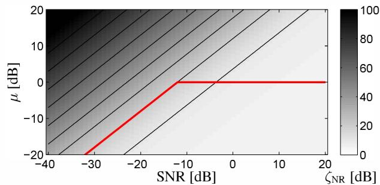
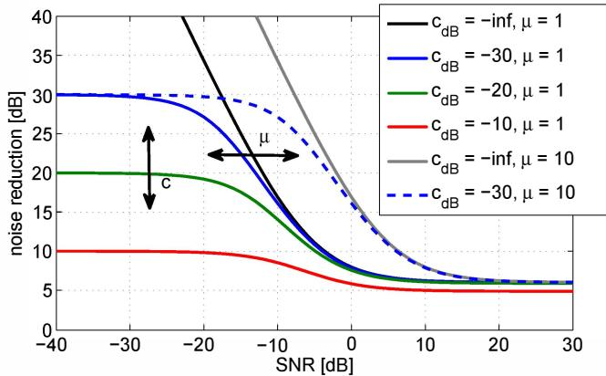
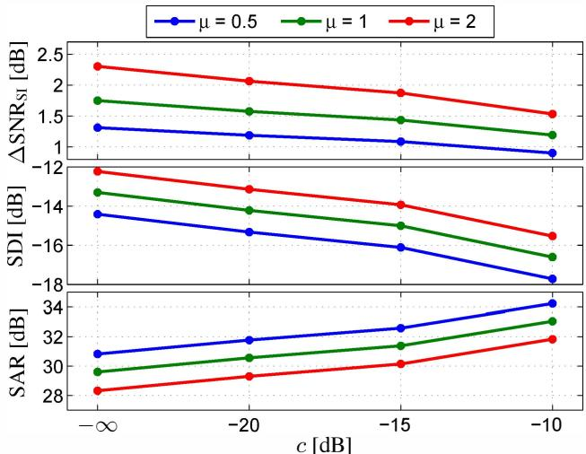
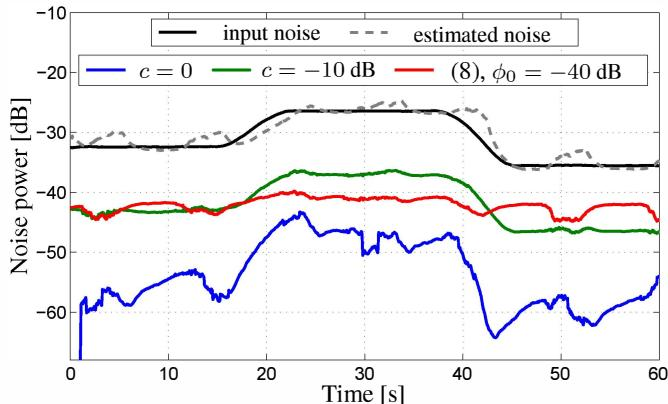

# RESIDUAL NOISE CONTROL USING A PARAMETRIC MULTICHANNEL WIENER FILTER

Sebastian Braun, Konrad Kowalczyk $^{\dagger\ddagger}$ and Emanuël A. P. Habets

International Audio Laboratories Erlangen\*, Am Wolfsmantel 33, 91058 Erlangen, Germany

## ABSTRACT

Multichannel noise reduction techniques are commonly used in speech communication applications. In these applications, it is often desired to maintain a residual amount of background noise to avoid perceptually unpleasant artifacts, such as musical tones or time periods of complete silence. Noise reduction can be achieved by the parametric multichannel Wiener filter (PMWF), which provides a trade-off between speech distortion and noise reduction. To additionally control the maximum noise reduction, the PMWF can be decomposed into a spatial filter and a spectral gain, which is limited to a desired minimum value. Such decomposition is however only possible if the desired source power spectral density matrix is rank-one, which in general does not even hold for a single source in reverberant environments. In the proposed approach, we define the desired signal as a sum of the speech signal plus the desired residual noise, and derive an optimum filter in the minimum mean-square error sense. The resulting filter has the advantage that it enables direct control of the maximum noise reduction without the need for a gain limiting step and is furthermore applicable to desired signals of higher rank. We analyze the derived filter thoroughly and show its relation to the standard PMWF that results as a special case. Furthermore, we propose a solution for keeping the residual noise level constant in slowly time-varying noise fields.

Index Terms— array processing, multichannel Wiener filter, noise suppression, residual noise control

## 1. INTRODUCTION

The reduction of acoustic interference such as sensor noise, ambient noise and other undesired sounds has been a field of extensive research for decades. Typical applications range from hands-free communication, source separation to speech recognition systems. Multiple microphones help to gather spatial information about the sound field which can be exploited by spatially selective filtering. A widely used approach to reduce noise and interfering sounds is the multichannel Wiener filter (MWF), which requires the knowledge of the power spectral density (PSD) matrices of desired and undesired sound components. In the following, the latter is referred to as noise. Since neither the signals nor their second-order statistics are unobservable separately in mixed sound fields, the latter need to be estimated. As a consequence, the filtered signal may contain residual noise and additional artifacts.

Single-channel speech enhancement algorithms often suffer from artifacts known as musical tones, which are caused by PSD estimation errors. There exist many approaches that aim to mitigate these artifacts, e.g. [1]. A simple yet effective and widely used technique is to limit the spectral filter gain to a minimum value greater than zero, which leaves residual noise in the filtered signal that can mask the musical tones and thereby leads to perceptually more pleasing results. However, limiting the spectral filtering gain is generally only possible for single-channel algorithms that use a spectral gain and to some extent for multichannel filters that can be decomposed into a spatial filter and a spectral gain [2]. Note that this decomposition requires that the desired source PSD matrix is rank-one, which is not always true even if only a single desired source is active. For instance, the desired source PSD matrix is of higher rank when the analysis time frames are shorter than the reverberation time of the acoustic environment [3, 4].

There exist some approaches for a time-domain Wiener filter introducing a parameter to control the residual noise $[5, 6]$ . In the class of single-channel spectral enhancement methods, $[7]$ proposes a method to control the amount of residual noise, and in $[8]$ a similar method is proposed for two interfering sound components in the context of joint noise reduction and echo cancellation. A multichannel method for partial noise reduction for hearing aids is proposed in $[9]$ . Additional control over the trade-off between speech distortion and noise reduction is provided by the parametric multichannel Wiener filter (PMWF) $[10]$ . In typical applications of the PMWF, the trade-off parameter is set to a fixed empirically determined value $[11, 12]$ or is heuristically controlled $[13]$ . Existing solutions, however, seldom focus on directly controlling the amount of residual noise.

In this paper, a multichannel filter is proposed which provides direct control of the amount of residual noise. An optimum PMWF is derived by defining the desired output signal as a sum of the source signal and the desired residual noise level. The derived filter can be seen as a generalized PMWF which does not require the source rank-one assumption to set the lower bound on noise reduction. The newly formulated filter is analyzed analytically and through simulations, and its key advantages over the standard PMWF are discussed. Finally, two approaches to choose the control parameter of the residual noise are proposed: (i) for a constant noise reduction and (ii) for a constant noise level at the filter output. The latter approach can be used to shape the residual noise to a desired spectral shape.

## 2. PROBLEM FORMULATION

Let us consider an array that consists of M microphones capturing the sound field. Using the notation in the short-time Fourier transform (STFT) domain, the signals $Y_{m}(k,n)$ with $m=\{1,\ldots,M\}$ are observed at the microphones, where k and n are the frequency and time indices, respectively. The signals are stacked into the vector $\mathbf{y}(k,n)=[Y_{1}(k,n),\ldots,Y_{M}(k,n)]^{T}$ . We assume that the sound field is described by

$$
\mathbf {y} (k, n) = \mathbf {x} (k, n) + \mathbf {v} (k, n),\tag{1}
$$

where $\mathbf{x}(k,n)$ contains the desired speech signal at each microphone $X_{m}(k,n)$ and $\mathbf{v}(k,n)$ contains the undesired noise signals $V_{m}(k,n)$ . We assume both sound components to be uncorrelated such that the PSD matrix of the microphone signals $\Phi_{y}(k,n)=E\{\mathbf{y}(k,n)\mathbf{y}^{H}(k,n)\}$ can be written as

$$
\Phi_ {y} (k, n) = \Phi_ {x} (k, n) + \Phi_ {v} (k, n),\tag{2}
$$

where the PSD matrix of the desired sound $\Phi_{x}(k,n)$ and the noise PSD matrix $\Phi_{v}(k,n)$ are defined similarly.

Generally in speech enhancement, the objective is to extract the desired speech component at a reference microphone, in this case $X_{1}(k,n)$ , and to suppress the noise components $\mathbf{v}(k,n)$ . Typical filters designed for this task may introduce artifacts such as distortion and musical tones, and in practice some residual noise still remains at the filter output. These artifacts can be controlled and mitigated if we are able to control the amount and the spectral shape of the residual noise. The controlled residual noise can mask musical tones and a lower bound on noise suppression results in a lower speech distortion. In the following, we define the target signal as the sum of speech and reduced (i.e. desired residual) noise as

$$
Z (k, n) = \mathbf {e} _ {1} ^ {T} \mathbf {x} (k, n) + c (k) \mathbf {e} _ {1} ^ {T} \mathbf {v} (k, n),\tag{3}
$$

where the parameter $0 \leq c(k) \leq 1$ controls the noise reduction and $\mathbf{e}_1 = [1, 0, \ldots, 0]^T$ . We aim to obtain an estimate $\hat{Z}(k, n)$ of the target signal given in (3) using a spatial filter $\mathbf{h}(k, n)$ as

$$
\hat {Z} (k, n) = \mathbf {h} ^ {H} (k, n) \mathbf {y} (k, n).\tag{4}
$$

Hereafter, the time and frequency indices are omitted for brevity when possible.

## 3. PARAMETRIC MULTICHANNEL WIENER FILTER WITH RESIDUAL NOISE CONTROL

In this section, a generalized PMWF is derived that provides direct control of the maximum noise reduction. The filter is analyzed, related to the well-known standard PMWF and two methods to choose the residual noise control parameter are discussed.

## 3.1. Derivation of the proposed filter

To obtain a filter formulated in a flexible way, we employ the PMWF to our problem with the newly defined target signal. The PMWF can be derived in two ways: either by minimizing the residual noise with a constraint on the speech distortion $[12]$ or by minimizing the speech distortion with a constraint on the residual noise $[11]$ . If the target signal is defined as the desired speech signal only, both approaches result in an identical filter. Since in our problem formulation the target signal given by $(3)$ contains components of the desired signal as well as of the residual noise, only the latter formulation leads to a useful result. To obtain an estimate of the target signal $Z(k,n)$ , we minimize the speech distortion with the constraint that the error between the desired residual noise and the filtered noise is smaller than the threshold $\sigma$ as

$$
\mathbf {h} _ {Z} (k, n) = \underset {\mathbf {h}} {\arg \min} \mathrm{E} \left\{\left| \mathbf {e} _ {1} ^ {T} \mathbf {x} - \mathbf {h} ^ {H} \mathbf {x} \right| ^ {2} \right\}\tag{5a}
$$

$$
\text { subject   to } \mathrm{E} \left\{\left| \mathbf {c} _ {1} ^ {T} \mathbf {v} - \mathbf {h} ^ {H} \mathbf {v} \right| ^ {2} \right\} \leq \sigma ,\tag{5b}
$$

where $c_{1} = c e_{1}$ . The solution using the Lagrangian multiplier $\mu$ yields the proposed PMWF given by

$$
\mathbf {h} _ {Z} (k, n) = \left(\boldsymbol {\Phi} _ {x} + \mu \boldsymbol {\Phi} _ {v}\right) ^ {- 1} \left(\boldsymbol {\Phi} _ {x} \mathbf {e} _ {1} + \mu \boldsymbol {\Phi} _ {v} \mathbf {c} _ {1}\right).\tag{6}
$$

  
Fig. 1. Noise reduction factor for a standard PMWF depending on $\mu$ and the input SNR. Results obtained for M = 4, inter-microphone spacing of 3 cm and angular frequency of $\omega = \pi/5$ .

## 3.2. Properties and relation to existing filters

The filter given by (6) can be decomposed into a weighted sum of two Wiener filters: one that extracts the desired signal and one that extracts the noise. By defining the modified input PSD matrix as $\widetilde{\Phi}_{y} = \Phi_{x} + \mu \Phi_{v}$ , we can rewrite (6) as

$$
\mathbf {h} _ {Z} = \underbrace {\widetilde {\boldsymbol {\Phi}} _ {y} ^ {- 1} \boldsymbol {\Phi} _ {x} \mathbf {e} _ {1}} _ {\mathbf {h} _ {X}} + c \underbrace {\widetilde {\boldsymbol {\Phi}} _ {y} ^ {- 1} \mu \boldsymbol {\Phi} _ {v} \mathbf {e} _ {1}} _ {\mathbf {h} _ {V}}\tag{7a}
$$

$$
= \mathbf {h} _ {X} + c \widetilde {\boldsymbol {\Phi}} _ {y} ^ {- 1} (\widetilde {\boldsymbol {\Phi}} _ {y} - \boldsymbol {\Phi} _ {x}) \mathbf {e} _ {1}\tag{7b}
$$

$$
= \mathbf {h} _ {X} + c (\mathbf {e} _ {1} - \mathbf {h} _ {X})\tag{7c}
$$

$$
= (1 - c) \mathbf {h} _ {X} + c \mathbf {e} _ {1}.\tag{7d}
$$

From (7c) we can see that the noise extraction filter $\mathbf{h}_{V}(k,n)$ is complementary to $\mathbf{h}_{X}(k,n)$ . Furthermore, from (7d) it is clear that by introducing the residual noise control parameter c, the obtained filter can be seen as a weighted sum of a standard PMWF and the reference microphone. It follows that by using the form of (7c), an arbitrary filter that aims to extract any desired signal can be designed to control the residual noise using an analogous complementary filter.

For c = 0, we obtain the well-known standard PMWF, where the target signal is the desired speech only. By choosing $0 \leq c \leq 1$ , the maximum noise reduction of the filter can be additionally controlled. The Lagrangian multiplier $\mu$ adjusts the input noise [14], i.e., it enables the control over the level of over- or underestimation. For $\mu = 1$ , a MWF with residual noise control is obtained that is similar to the filter derived in [9] in the context of hearing aids.

## 3.3. Controlling the residual noise with the standard PMWF

In this section, we consider the standard PMWF, i.e. (6) with c = 0. The solution to the problem given by (5) (with c = 0) can be found by setting (5b) to an equality and computing the Lagrangian multiplier such that the residual noise can be kept smaller or equal than $\sigma$ . A closed form solution can be obtained only by assuming that the desired signal PSD matrix $\Phi_{x}(k,n)$ is rank-one and can be found e.g. in [15]. For the single-channel case, a similar solution was found in [14]. In both publications, the parameter $\mu$ depends on the input signal-to-noise ratio (SNR), which causes the filter to change drastically. Also in [12, 16] it was found that the upper bound on $\mu(k,n)$ has to be linearly dependent on the SNR to ensure that the speech distortion is bounded below a given threshold.

In [13], it was proposed to choose the parameter $\mu$ from a different perspective, i.e., by computing the residual noise power for a given $\mu$ . Following this approach, Fig. 1 shows the resulting noise reduction factor $\zeta_{NR}$ (see (12)) for a given $\mu$ assuming spatially white noise. The contour lines of equal noise reduction values are drawn in black. We can observe that the parameter $\mu$ has to be linearly dependent on the SNR to ensure a constant noise reduction level. To limit the noise reduction, $\mu$ should be linearly dependent on the SNR for low SNRs and constant over the SNR above the limit. This is exemplary shown as red line in Fig. 1 for a maximum noise reduction of 20 dB and $\mu = 1$ for higher SNRs. Hence, the constraint (5b) is not sufficient to fully control the residual noise level when $\sigma$ is set to a constant value. Moreover, since there exists no closed form solution to compute a Lagrangian multiplier $\mu$ with the desired behavior for arbitrary ranks of the desired signal PSD matrix $\Phi_{x}$ , adaptive or iterative methods would be required to compute $\mu$ for a desired $\sigma$ .

## 3.4. Selection of the residual noise control parameter

In contrast to the standard PMWF discussed in Sec. 3.3, the proposed filter allows for a flexible control of the residual noise power and its spectral shape using the parameter c. In the following, we focus on two control mechanisms that ensure that (i) constant noise reduction or (ii) a constant output noise level is attained.

The first option is to use a fixed value for c, which yields a filter with maximum noise reduction limited to c. The parameter c can also be chosen frequency dependent to control the amount of noise reduction for specific frequency regions and to shape the residual noise spectrally. For some frequency regions a higher suppression might be desired to obtain more clarity, whereas for other frequency regions a lower suppression can be used to mitigate artifacts.

The second option is to scale c depending on the input noise power at the reference microphone, i.e. as

$$
c (k, n) = \min \left[ \sqrt {\frac {\phi_ {0} (k)}{\mu \mathbf {e} _ {1} ^ {T} \boldsymbol {\Phi} _ {v} (k , n) \mathbf {e} _ {1}}}, 1 \right],\tag{8}
$$

where $\phi_{0}(k)$ is the desired output noise power for low SNRs. In (8), the control parameter is limited to avoid amplification of noise at time-frequency regions where the noise is already below the desired output noise power. Using this approach, we obtain a constant output noise power at low SNRs even when the noise power changes over time. This behavior can be desired e.g. if the long-term noise power is slowly time-varying or if noise reduction of the spatial filter changes due to a moving desired source. Note that the noise power can be kept constant in time-varying noise fields, if we are able to track changes of the noise PSD, which is usually possible for slowly time-varying noise. Furthermore, by choosing $\phi_{0}(k)$ to be frequency dependent, we can also adjust the spectral shape of the residual noise.

## 4. THEORETICAL PERFORMANCE ANALYSIS

In this section, we analyze the proposed filter and the PMWF under the rank-one assumption for $\mathbf{\Phi}_{x}(k,n)$ as typically done in the analysis of MWFs. This assumption means that the desired signal PSD matrix can be written as $\mathbf{\Phi}_{x}(k,n)=\phi_{X}(k,n)\mathbf{a}(k,n)\mathbf{a}^{H}(k,n)$ , where $\phi_{X}(k,n)=E\{X_{1}(k,n)X_{1}^{*}(k,n)\}$ and the vector $\mathbf{a}(k,n)$ contains the source relative transfer functions (RTFs) from the reference microphone to all microphones.

Let the speech distortion index be defined as

$$
\nu_ {\mathrm{sd}} (\mathbf {h}) = \frac {\operatorname{E} \left\{\left| X _ {1} - \mathbf {h} ^ {H} \mathbf {x} \right| ^ {2} \right\}}{\phi_ {X}}.\tag{9}
$$

  
Fig. 2. Noise reduction of the proposed PMWF with residual noise control depending on the input SNR. The values of c are in dB.

Under the rank-one assumption, the filter $\mathbf{h}_{X}(k,n)$ can be written using the Woodbury matrix identity in the well-known form as [17]

$$
\mathbf {h} _ {X} = \frac {\boldsymbol {\Phi} _ {v} ^ {- 1} \mathbf {a} \phi_ {X}}{\mu + \phi_ {X} \mathbf {a} ^ {H} \boldsymbol {\Phi} _ {v} ^ {- 1} \mathbf {a}}.\tag{10}
$$

Thus the speech distortion index of the proposed filter under rank-one assumption can be obtained using (7d) and (10), and is given by

$$
\nu_ {\mathbf {s d}} (\mathbf {h} _ {Z}) = (1 - c) ^ {2} \cdot \left| \frac {\mu}{\mu + \phi_ {X} \mathbf {a} ^ {H} \boldsymbol {\Phi} _ {v} ^ {- 1} \mathbf {a}} \right| ^ {2}.\tag{11}
$$

From (11) we can deduce that the parameter c limits the speech distortion to a maximum value. Compared to the typically used standard PMWF that is equivalent to the proposed filter for c = 0, the speech distortion decreases for c > 0. Note that the Lagrangian multiplier $\mu$ also has an influence on the speech distortion. For an increasing $\mu$ , the speech distortion increases.

The noise reduction factor is defined as [17]

$$
\zeta_ {\mathrm{nr}} (\mathbf {h}) = \frac {\mathbf {e} _ {1} ^ {T} \boldsymbol {\Phi} _ {v} \mathbf {e} _ {1}}{\mathbf {h} ^ {H} \boldsymbol {\Phi} _ {v} \mathbf {h}}\tag{12}
$$

and is given for the proposed filter under rank-one assumption by

$$
\zeta_ {\mathrm{nr}} (\mathbf {h} _ {Z}) = \frac {(\mu + \lambda) ^ {2}}{(1 - c) ^ {2} \eta_ {1} \lambda + \eta_ {1} 2 (1 - c) c (\mu + \lambda) + c ^ {2} (\mu + \lambda) ^ {2}},\tag{13}
$$

where $\eta_{1}(k,n)=\phi_{X}\phi_{V}^{-1}$ is the input SNR at the first microphone and $\lambda=\phi_{X}a^{H}\Phi_{v}^{-1}a$ is the multichannel a priori SNR. For c=0, we obtain the same form as derived in [12]. In the single-channel case, due to $\eta_{1}=\lambda$ , (13) reduces to

$$
\zeta_ {\mathrm{nr}} (\mathbf {h} _ {Z}) = \frac {(\mu + \lambda) ^ {2}}{(\mu + c \lambda) ^ {2}}, \quad M = 1.\tag{14}
$$

Since the complicated form of (13) provides no direct insight into the behavior of the noise reduction factor, we computed the noise reduction factor of the proposed filter (6) for different parameters as a function of the SNR in Fig. 2. The noise reduction factor is computed for a single frequency and for a given input SNR at the first microphone assuming spatially white noise with equal PSD at all sensors. We can observe that for low SNRs, the proposed filter approaches asymptotically its maximum noise reduction given by c, which is the desired behaviour. The parameter c changes the maximum noise reduction at low SNRs, whereas the parameter $\mu$ shifts the curve left or right along the input SNR axis. This can be seen as over- or underestimation of the noise. Note that for c = 0 (black and grey lines), the noise reduction is equal to that of a standard PMWF, for which a constant lower noise bound cannot be achieved for any constant value of $\mu$ .

## 5. EXPERIMENTAL EVALUATION

## 5.1. Simulation setup and estimation techniques

We carried out two experiments as a proof of concept for the proposed approach. In both experiments, we used a sampling rate of 16 kHz, an FFT length of 512 points, a square-root Hann window with 32 ms length, and a hop-size of 16 ms. The desired signal was a speech signal convolved with a simulated impulse response using the image source method. We simulated a uniform linear array with M = 4 microphones and 5 cm inter-microphone spacing in a room with $T_{60} = 200$ ms and size of $5 \times 4 \times 6$ m, and the source was located in the broadside direction of the array at a distance of 2 m. The desired speech signal was a concatenation of three speech signals taken from the EBU-SQAM database [18], with a total length of 60 s.

The noise PSD was estimated online using the multichannel speech presence probability based approach proposed in [19]. The desired signal PSD was estimated by subtracting the PSD matrices as $\hat{\Phi}_{x} = \Phi_{y} - \hat{\Phi}_{v}$ , where we ensured that the estimated matrix is positive semi-definite. The matrix $\Phi_{y}(k, n)$ was obtained by recursive averaging with a time constant of 30 ms.

## 5.2. Evaluation by objective measures

In this experiment, the effect of the controlled residual noise together with the overestimation factor is evaluated using objective measures. The tests were conducted for different noise signals, i.e. speech-spectrum shaped diffuse noise generated with the method proposed in $[20]$ , cafeteria babble noise, and train station noise from the DEMAND database $[21]$ . The noise was added with varying SNRs between $[-10, 30]$ dB. The results averaged over all tested SNR and noise conditions are presented in Fig. 3.

From all results it can be observed that by controlling the residual noise level, the quality in terms of the speech distortion index (SDI) and the signal-to-artifact ratio (SAR) [22] increases. This is traded against a slightly lower improvement in the speech-intelligibility weighted segmental SNR $(\mathrm{SNR}_{\mathrm{SI}})$ [23]. Thus, by choosing the residual noise control parameter $c > 0$ , artifacts caused by estimation errors can be clearly reduced. Decreasing the parameter $\mu$ also helps mitigating the speech distortion and musical tones, but results in a much lower SNR improvement.

## 5.3. Controlling the output noise power

Given that the noise PSD can be estimated sufficiently fast, the parameter c adjusting the residual noise level can be chosen such that the residual noise at the output is kept constant with (8). A sufficiently fast tracking of slowly time-varying noise is possible e.g. using speech presence probability based approaches [19, 24].

In this experiment, $\mathbf{v}(k,n)$ is white Gaussian noise with a slowly time-varying power. The broadband noise power of the noise at the first microphone is shown in black in Fig. 4 and the estimated average noise PSD is marked as dashed grey. We can observe a slight overestimation in active speech periods and a slightly delayed tracking during noise power changes. The filtered output noise power is averaged only over time-frequency bins where noise is dominating, i.e. where the input SNR is below -10 dB. All filters are computed with $\mu = 1$ . The blue line shows the noise output power where the residual noise is uncontrolled, as in a standard MWF (c = 0 and $\mu = 1$ ). If the noise reduction parameter is chosen constant as c = -10 dB (green line), we can see that the green line follows the input noise (black line) at a 10 dB lower level. Thus as desired, a constant noise reduction is achieved. The red line depicts the noise power controlled by c depending on the estimated input noise power (8), where the absolute desired residual noise power is set to $\phi_{0}(k) = -40$ dB. As expected, the output noise power stays constant at the desired level, independently of the time-varying input noise power. The fluctuations of the green and red curves are caused by noise PSD estimation errors.

  
Fig. 3. Objective measures for the proposed filter.

  
Fig. 4. Power of time-varying noise at the filter input and output.

## 6. CONCLUSION AND OUTLOOK

In this paper, a method to control the residual noise at the output of a parametric multichannel Wiener filter was proposed. It was shown that limiting the amount of noise reduction using the proposed filtering can significantly reduce speech distortion and noise reduction artifacts, while the signal-to-noise ratio decreases only slightly. In addition, a method to maintain a constant noise level at the filter output in slowly time-varying noise fields was presented, in which the parameter for the residual noise level is computed adaptively. The proposed method can be extended to control the residual level of multiple interferers individually.

## 7. REFERENCES

[1] C. Breithaupt, T. Gerkmann, and R. Martin, “A novel a priori SNR estimation approach based on selective cepstro-temporal smoothing,” in Proc. IEEE Intl. Conf. on Acoustics, Speech and Signal Processing (ICASSP), Apr. 2008, pp. 4897–4900.

[2] J. Bitzer and K. U. Simmer, Microphone Arrays: Signal Processing Techniques and Applications, chapter Superdirective microphone arrays, pp. 19–38, Springer-Verlag, May 2001.

[3] Y. Avargel and I. Cohen, “On multiplicative transfer function approximation in the short-time Fourier transform domain,” IEEE Signal Processing Letters, vol. 14, no. 5, pp. 337–340, 2007.

[4] R. Talmon, I. Cohen, and S. Gannot, “Relative transfer function identification using convolutive transfer function approximation,” IEEE Trans. Audio, Speech, Lang. Process., vol. 17, no. 4, pp. 546–555, May 2009.

[5] Y. Huang J. Chen, J. Benesty and S. Doclo, “New insights into the noise reduction Wiener filters,” IEEE Trans. Audio, Speech, Lang. Process., vol. 14, pp. 1218–1234, July 2006.

[6] T. J. Klasen, T. V. den Bogaert, M. Moonen, and J. Wouters, "Binaural noise reduction algorithms for hearing aids that preserve interaural time delay cues," IEEE Trans. Signal Process., vol. 55, no. 4, pp. 1579-1585, 2007.

[7] B. Zamani, M. Rahmani, and A. Akbari, “Residual noise control for coherence based dual microphone speech enhancements,” in Proc. Intl. Conf. on Computer and Electrical Engineering (ICCEE), 2008, pp. 601–605.

[8] S. Gustafsson, P. Jax, A. Kamphausen, and P. Vary, “A postfilter for echo and noise reduction avoiding the problem of musical tones,” in Proc. IEEE Intl. Conf. on Acoustics, Speech and Signal Processing (ICASSP), Mar. 1999, pp. 1–4.

[9] T. Van den Bogaert, S. Doclo, J. Wouters, and M. Moonen, "Preserving binaural hearing of hearing impaired subjects with binaural noise reduction systems for hearing aids," in Proc. NAG-DAGA International Conference on Acoustics, Rotterdam, The Netherlands, Mar. 2009, pp. 176–179.

[10] A. Spriet, M. Moonen, and J. Wouters, “Spatially preprocessed speech distortion weighted multi-channel Wiener filtering for noise reduction,” Signal Processing, vol. 84, no. 12, pp. 2367–2387, Dec. 2004.

[11] S. Doclo and M. Moonen, “GSVD-based optimal filtering for single and multimicrophone speech enhancement,” IEEE Trans. Signal Process., vol. 50, no. 9, pp. 2230–2244, Sept. 2002.

[12] M. Souden, J. Benesty, and S. Affes, “On optimal frequency-domain multichannel linear filtering for noise reduction,” IEEE

Trans. Audio, Speech, Lang. Process., vol. 18, no. 2, pp. 260–276, 2010.

[13] Y. Ephraim and H. L. Van Trees, “A signal subspace approach for speech enhancement,” in Proc. IEEE Intl. Conf. on Acoustics, Speech and Signal Processing (ICASSP), Apr. 1993, vol. 2, pp. 355–358.

[14] Y. Ephraim and H. L. Van Trees, “A signal subspace approach for speech enhancement,” IEEE Trans. Speech Audio Process., vol. 3, no. 4, pp. 251–266, July 1995.

[15] K. Kowalczyk, A. Craciun, and E. A. P. Habets, “Generating virtual microphone signals in noisy environments,” in Proc. European Signal Processing Conf. (EUSIPCO), Marrakesh, Morocco, Sept 2013, pp. 1–5.

[16] S. Y. Low and S. Nordholm, “An insight into the parametric multichannel Wiener formulation,” in Proc. Intl. Conf. on Computer Science and Automation Engineering (CSAE), June 2011, vol. 1, pp. 513–516.

[17] M. S. Brandstein and D. B. Ward, Eds., Microphone Arrays: Signal Processing Techniques and Applications, Springer-Verlag, Berlin, Germany, 2001.

[18] European Broadcasting Union, “Sound quality assessment material recordings for subjective tests,” 1988, http://tech.ebu.ch/publications/sqamcd.

[19] M. Taseska and E. A. P. Habets, “MMSE-based blind source extraction in diffuse noise fields using a complex coherence-based a priori SAP estimator,” in Proc. Intl. Workshop Acoust. Signal Enhancement (IWAENC), Sep. 2012.

[20] E. A. P. Habets and S. Gannot, “Generating sensor signals in isotropic noise fields,” J. Acoust. Soc. Am., vol. 122, no. 6, pp. 3464–3470, Dec. 2007.

[21] J. Thiemann, N. Ito, and E. Vincent, “Diverse Environments Multichannel Acoustic Noise Database (DEMAND),” June 2013, http://parole.loria.fr/DEMAND/.

[22] E. Vincent, R. Gribonval, and C. Fevotte, “Performance measurement in blind audio source separation,” IEEE Trans. Audio, Speech, Lang. Process., vol. 14, no. 4, pp. 1462–1469, July 2006.

[23] ANSI, “Methods for the calculation of the speech intelligibility index,” ANSI Standard S3.5–1997 (R2007), American National Standards Institute, 1997.

[24] T. Gerkmann and R. C. Hendriks, “Unbiased MMSE-based noise power estimation with low complexity and low tracking delay,” IEEE Trans. Audio, Speech, Lang. Process., vol. 20, no. 4, pp. 1383–1393, May 2012.