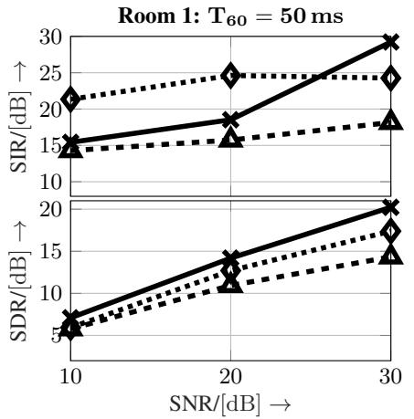
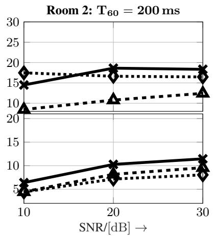
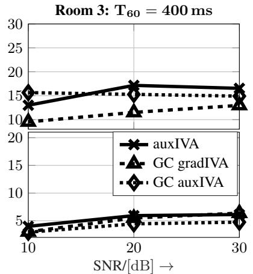
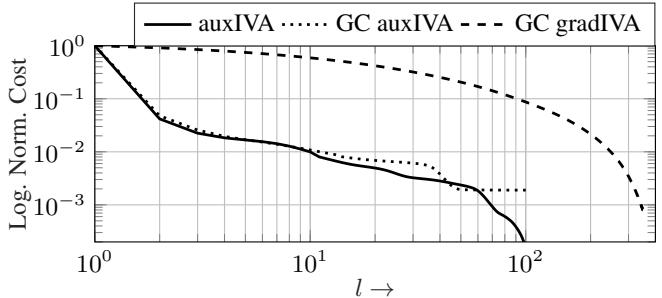

# SPATIALLY GUIDED INDEPENDENT VECTOR ANALYSIS

Andreas Brendel, Thomas Haubner and Walter Kellermann

Multimedia Communications and Signal Processing, Friedrich-Alexander-Universitat Erlangen-N ¨ urnberg,¨ Cauerstr. 7, D-91058 Erlangen, Germany, Andreas.Brendel@FAU.de

## ABSTRACT

We present a Maximum A Posteriori (MAP) derivation of the Independent Vector Analysis (IVA) algorithm for blind source separation incorporating an additional spatial prior over the demixing matrices. In this way, the outer permutation ambiguity of IVA is avoided and the algorithm can be guided towards a desired solution in adverse acoustic conditions. The resulting MAP optimization problem is solved by deriving majorize-minimize update rules to achieve convergence speed comparable to the well-known auxiliary function IVA algorithm, i.e., the convergence is not impaired by the additional constraint. The proposed algorithm exhibits superior performance at lower computational cost than a state-of-the-art spatially constrained IVA algorithm in a setup defined by real-world Room Impulse Responses (RIRs).

Index Terms— Independent Vector Analysis, MM Algorithm, Directional Constraint

## 1. INTRODUCTION

Blind Source Separation (BSS), i.e., the estimation of signals out of a recorded mixture with only little information about the underlying scenario, is a core task of audio signal processing problems and has been addressed in a multitude of proposed approaches in the last decades [1, 2]. For the most practically relevant scenario of a convolutive mixture, Frequency-Domain Independent Component Analysis (FD-ICA) [3] has been proposed which estimates demixing matrices independently in each frequency bin such that the output signals are statistically independent. However, this causes the well-known inner permutation problem [4], which has to be resolved afterwards. As a method which avoids the inner permutation problem by choosing a multivariate source prior over all frequency bins, Independent Vector Analysis (IVA) [5] has attracted much attention. Based on the Majorize-Minimize (MM) principle [6], stable and fast update rules, named Auxiliary Function IVA (auxIVA) [7, 8], have been derived which do not require any tuning parameter, e.g., a stepsize. Various ways to incorporate prior knowledge into IVA have been proposed, whereby knowledge about the source variances is the most established one [9]. Nonnegative Matrix Factorization (NMF) [10] is used in the Independent Low-Rank Matrix Analysis (ILRMA) algorithm [11] to estimate these source variances.

Another ambiguity, which is inherent to BSS, is the ordering of the broadband signals at the output channels, i.e., the outer permutation ambiguity. In principle this ambiguity could be resolved by associating the estimated demixing matrix with a known target Direction of Arrival (DOA). However, such an approach is likely to fail in adverse acoustic conditions, e.g., highly reverberant, or in underdetermined scenarios, i.e., if the number of sources is larger than the number of microphones. Prior knowledge has to be introduced to solve this issue by guiding the adaptation of the demixing filters. To this end, supervised IVA [12] has been proposed, which introduces pilot signals that are statistically dependent on the source signals into a gradient-based update rule. Another idea, which has been successfully applied for resolving the outer permutation problem, is to exploit spatial information about the sources. Such techniques include exploiting the dominance of a source for a certain direction in FD-ICA [13], initialization of auxIVA with filters obeying a freefield model [14], using prelearned filters for gradient-based IVA [15] or imposing a Geometric Constraint (GC) [16, 17, 18, 19, 20] on different BSS variants. For IVA, a geometrically-constrained gradientbased update rule has been proposed in [21].

In this contribution, we provide a Maximum A Posteriori (MAP) derivation of IVA, based on the previous work for Independent Component Analysis (ICA) [22], which allows to incorporate prior knowledge about the demixing system via a prior Probability Density Function (PDF) to preclude the outer permutation problem and guide the algorithm to a desired solution in acoustically demanding scenarios. This allows to express the uncertainty of the localization information and to fuse the proposed MAP IVA with a localization or tracking algorithm by exploiting the uncertainties of the estimates. Finally, motivated by the tremendous advantage regarding convergence speed of auxIVA [8] in comparison to gradient-based IVA [5], we derive update rules based on the MM principle providing faster convergence than the competing gradient-based methods without the necessity for tuning the step size or impairing the convergence relative to IVA. Note that we do not compare our approach with ILRMA as for ILRMA only prior spectral knowledge about the sources can be introduced if used in a semi-supervised setup, but no spatial prior knowledge, which is the focus of this paper.

In the following, scalar variables are denoted by lower-case letters, vectors by bold lower-case letters, matrices by bold upper-case letters and sets as calligraphic upper-case letters. $[ \cdot ] _ { i } \mathrm { ~ o r ~ } [ \cdot ] _ { i , j }$ denotes the ith element of a vector or the element in the ith row and jth column of a matrix, and (·)T, (·)∗ and $( \cdot ) ^ { \mathrm { H } }$ denote transposition, complex conjugation and hermitian, respectively.

## 2. PROBABILISTIC MODEL

In the following, we study a determined scenario, i.e., the number of sources equals the number of sensors K. Assuming sufficiently shorter impulse responses between sources and microphones than the window length of the Short-Time Fourier Transform (STFT), the microphone signals can be described at time step $n \in \mathcal { N } = \{ 1 , . . . , N \}$ , where N is the number of observed time frames, and frequency index $f \in { \mathcal { F } } = \left\{ 1 , \ldots , F \right\}$ as

$$
\mathbf {x} _ {f, n} = \mathbf {A} _ {f} \mathbf {s} _ {f, n}.
$$

(1)

Hereby, $\mathbf { A } _ { f } \in \mathbb { C } ^ { K \times K }$ is the matrix of acoustic transfer functions at frequency index $f$ and

$$
\mathbf {s} _ {f, n} = \left[ s _ {f, n} ^ {1}, \ldots , s _ {f, n} ^ {K} \right] ^ {\mathrm{T}}, \mathbf {x} _ {f, n} = \left[ x _ {f, n} ^ {1}, \ldots , x _ {f, n} ^ {K} \right] ^ {\mathrm{T}} \in \mathbb {C} ^ {K}\tag{2}
$$

denote the input signals and microphone signals with channel or signal index $k \in \mathcal { K } = \{ 1 , \ldots , K \}$ , respectively. An estimate of the demixed signals T

$$
\mathbf {y} _ {f, n} = \left[ y _ {f, n} ^ {1}, \dots , y _ {f, n} ^ {K} \right] ^ {\mathrm{T}} \in \mathbb {C} ^ {K}\tag{3}
$$

can be obtained by applying a demixing matrix for each frequency bin f

$$
\mathbf {W} _ {f} = \left[ \mathbf {w} _ {f} ^ {1}, \ldots , \mathbf {w} _ {f} ^ {K} \right] ^ {\mathrm{H}} \in \mathbb {C} ^ {K \times K},\tag{4}
$$

representing the K demixing filters for the kth output in vector $\big ( \hat { \mathbf { w } } _ { f } ^ { k } \big ) ^ { \mathrm { H } }$ , to the observed microphone signals

$$
\mathbf {y} _ {f, n} = \mathbf {W} _ {f} \mathbf {x} _ {f, n}.\tag{5}
$$

Additionally, we define the demixed broadband signal vector for channel k over all frequencies and the concatenation as

$$
\underline {{\mathbf {y}}} _ {k, n} = \left[ y _ {1, n} ^ {k}, \dots , y _ {F, n} ^ {k} \right] ^ {\mathrm{T}} \in \mathbb {C} ^ {F}, \underline {{\mathbf {y}}} _ {n} = \left[ \underline {{\mathbf {y}}} _ {1, n} ^ {\mathrm{T}}, \dots , \underline {{\mathbf {y}}} _ {K, n} ^ {\mathrm{T}} \right] ^ {\mathrm{T}} \in \mathbb {C} ^ {K F},\tag{6}
$$

respectively. The set of all demixing matrices is denoted as $\mathcal { W } \overset { \cdot } { = } \{ \mathbf { W } _ { f } \in \mathbb { C } ^ { K \times K } | f \in \mathcal { F } \}$ , the set of all demixed signal vectors as $\mathcal { Y } = \left\{ \mathbf { y } _ { n } \in \mathbb { C } ^ { K F } | n \in \mathcal { N } \right\}$ and the set of all microphone observations as $\mathcal { X } = \left\{ \mathbf { x } _ { f , n } \in \mathbb { C } ^ { K } | f \in \mathcal { F } , n \in \mathcal { N } \right\}$

Equipped with these definitions, we apply Bayes theorem to calculate the joint posterior of the demixed broadband signals and demixing matrices

$$
\begin{array}{l} p (\mathcal {W}, \mathcal {Y} | \mathcal {X}) = p (\mathcal {W}, \mathcal {Y}) \frac {p (\mathcal {X} | \mathcal {W} , \mathcal {Y})}{p (\mathcal {X})} = p (\mathcal {W}) p (\mathcal {Y} | \mathcal {W}) \frac {p (\mathcal {X} | \mathcal {W} , \mathcal {Y})}{p (\mathcal {X})} \\ \propto p (\mathcal {W}) p (\mathcal {Y} | \mathcal {W}) p (\mathcal {X} | \mathcal {W}, \mathcal {Y}). \end{array} \tag {7}
$$

According to the deterministic relationship between microphone signals and demixed signals (5), we model the likelihood for one observed time frame index n and frequency bin f to be

$$
p \left(\mathbf {x} _ {f, n} \mid \mathcal {W}, \mathbf {y} _ {f, n}\right) = \delta \left(\mathbf {x} _ {f, n} - \mathbf {W} _ {f} ^ {- 1} \mathbf {y} _ {f, n}\right),\tag{8}
$$

assuming that the inverse of $\mathbf { W } _ { f }$ exists. Hereby, $\delta ( \cdot )$ denotes the Dirac distribution. Furthermore, we assume independence between time blocks and frequency bins, which yields the likelihood

$$
p (\mathcal {X} | \mathcal {W}, \mathcal {Y}) = \prod_ {n = 1} ^ {N} \prod_ {f = 1} ^ {F} \delta \left(\mathbf {x} _ {f, n} - \mathbf {W} _ {f} ^ {- 1} \mathbf {y} _ {f, n}\right).\tag{9}
$$

The PDF of all demixed signal vectors is obtained by assuming independence over all time blocks n and signals k

$$
p (\mathcal {Y} | \mathcal {W}) = \prod_ {n = 1} ^ {N} p \left(\underline {{\mathbf {y}}} _ {n}\right) = \prod_ {n = 1} ^ {N} \prod_ {k = 1} ^ {K} p \left(\underline {{\mathbf {y}}} _ {k, n}\right).\tag{10}
$$

Note that $p ( \underline { { \mathbf { y } } } _ { k , n } )$ is a multivariate density capturing all frequency bins. Now, we compute the posterior of the demixing matrices by marginalizing the demixed signals

$$
\begin{array}{l} p (\mathcal {W} | \mathcal {X}) = \int p (\mathcal {W}, \mathcal {Y} | \mathcal {X}) d \underline {{{{\mathbf {y}}}}} _ {1} \dots d \underline {{{{\mathbf {y}}}}} _ {N} \\ \propto p (\mathcal {W}) \prod_ {n = 1} ^ {N} \int p (\underline {{{{\mathbf {y}}}}} _ {n}) \prod_ {f = 1} ^ {F} \delta \left(\mathbf {x} _ {f, n} - \mathbf {W} _ {f} ^ {- 1} \mathbf {y} _ {f, n}\right) d \underline {{{{\mathbf {y}}}}} _ {n} \\ = p (\mathcal {W}) \prod_ {f = 1} ^ {F} | \det \mathbf {W} _ {f} | ^ {2 N} \prod_ {n = 1} ^ {N} \prod_ {k = 1} ^ {K} p \left(\underline {{{{\mathbf {y}}}}} _ {k, n}\right), \end{array} \tag {11}
$$

where we used the sifting property of the Dirac distribution in the last step. Finally, we obtain the following MAP optimization problem for the estimation of the demixing matrices

$$
\begin{array}{l} \mathbf {W} _ {f} = \underset {\mathbf {W} _ {f} \in \mathbb {C} ^ {K \times K}} {\arg \max} \frac {\log p (\mathcal {W})}{N} + 2 \sum_ {f = 1} ^ {F} \log | \det \mathbf {W} _ {f} | \dots \\ \qquad \dots - \sum_ {k = 1} ^ {K} \hat {\mathbb {E}} \left\{G \left(\underline {{\mathbf {y}}} _ {k, n}\right) \right\}. \end{array}\tag{12}
$$

Here, we introduced the source model $G ( \underline { { \mathbf { y } } } _ { k , n } ) = - \log p ( \underline { { \mathbf { y } } } _ { k , n } )$ and the averaging operator $\begin{array} { r } { \hat { \mathbb { E } } \left\{ \cdot \right\} = \frac { 1 } { N } \sum _ { n = 1 } ^ { N } ( \cdot ) } \end{array}$

## 2.1. Relation to IVA

By choosing an uninformative prior for the demixing matrices, $p ( \mathcal { W } ) = \mathrm { c o n s t } .$ ., and negating the maximization problem (12), we arrive at the IVA cost function [5, 23]

$$
J _ {\mathrm{IVA}} (\mathcal {W}) = \sum_ {k = 1} ^ {K} \hat {\mathbb {E}} \left\{G \left(\underline {{\mathbf {y}}} _ {k, n}\right) \right\} - 2 \sum_ {f = 1} ^ {F} \log | \det \mathbf {W} _ {f} |,\tag{13}
$$

$\mathrm { i . e . }$ , the MAP optimization problem yields the original IVA cost function as a special case.

## 2.2. Choice of Prior PDF

Assuming free-field propagation, the mth element of the Relative Transfer Function (RTF) $\mathbf { \hat { h } } _ { f } ^ { \mathcal { \bar { k } } } \in \mathbb { C } ^ { \mathbf { \hat { K } } }$ in frequency bin f w.r.t. the first microphone is expressed as

$$
[ \mathbf {h} _ {f} ^ {k} ] _ {m} = \left[ \exp \left(j \frac {2 \pi \nu_ {f}}{c _ {s}} \| \mathbf {r} _ {m} - \mathbf {r} _ {1} \| _ {2} \cos \vartheta_ {k}\right) \right] _ {m}.\tag{14}
$$

Hereby, $\nu _ { f }$ denotes the frequency in Hz corresponding to frequency bin $f , c _ { s }$ the speed of sound, $\mathbf { r } _ { m }$ the position of the mth microphone, $\vartheta _ { k }$ the DOA of the considered source at channel k and $\| \cdot \| _ { 2 }$ the Euclidean norm. We model the prior over the demixing matrices to be i.i.d. over all frequency bins and channels

$$
p (\mathcal {W}) = \prod_ {f = 1} ^ {F} p \left(\mathbf {W} _ {f}\right) = \prod_ {f = 1} ^ {F} \prod_ {k = 1} ^ {K} p \left(\mathbf {w} _ {f} ^ {k}\right).\tag{15}
$$

We propose the following prior, which favors a spatial null into the specified DOA $\vartheta _ { k }$

$$
p \left(\mathbf {w} _ {f} ^ {k}\right) = \frac {\exp \left(- \frac {1}{\tilde {\sigma} _ {f} ^ {2}} (\mathbf {w} _ {f} ^ {k}) ^ {\mathrm{H}} \left(\lambda_ {\mathrm{E}} \mathbf {I} + \mathbf {h} _ {f} ^ {k} (\mathbf {h} _ {f} ^ {k}) ^ {\mathrm{H}}\right) \mathbf {w} _ {f} ^ {k}\right)}{\sqrt {\left(\pi \tilde {\sigma} _ {f} ^ {2}\right) ^ {K} \det (\lambda_ {\mathrm{E}} \mathbf {I} + \mathbf {h} _ {f} ^ {k} (\mathbf {h} _ {f} ^ {k}) ^ {\mathrm{H}})}}.\tag{16}
$$

Here, the variable $\tilde { \sigma } _ { f } ^ { 2 }$ is a user-defined parameter, expressing the uncertainty of the DOA estimate. However, $\tilde { \sigma } _ { f } ^ { 2 }$ could be directly obtained from a localization or tracking algorithm. The identity matrix in (16) acts as a Tikhonov regularizer [24], controlled by the parameter $\lambda _ { \mathrm { E } } ,$ , i.e., this term is penalizing the filters energy. In the following we constrain the channels corresponding to the indices in the set I and choose a non-informative prior otherwise.

## 3. DERIVATION OF UPDATE RULES

The cost function corresponding to the MAP problem (12) and the chosen prior PDF in Sec. 2.2 is obtained as

$$
\begin{array}{l} J (\mathcal {W}) = \underbrace {\sum_ {k = 1} ^ {K} \hat {\mathbb {E}} \left\{G \left(\underline {{\mathbf {y}}} _ {k}\right) \right\} - 2 \sum_ {f = 1} ^ {F} \log | \det \mathbf {W} _ {f} |} _ {J _ {\mathrm{IVA}} (\mathcal {W})} \dots \\ \dots + \underbrace {\frac {1}{\sigma_ {f} ^ {2}} \sum_ {f = 1} ^ {F} \sum_ {k = 1} ^ {K} (\mathbf {w} _ {f} ^ {k}) ^ {\mathrm{H}} \left(\lambda_ {\mathrm{E}} \mathbf {I} + \mathbf {h} _ {f} ^ {k} (\mathbf {h} _ {f} ^ {k}) ^ {\mathrm{H}}\right) \mathbf {w} _ {f} ^ {k}} _ {J _ {\mathrm{prior}} (\mathcal {W})}, \end{array}\tag{17}
$$

where $\sigma _ { f } ^ { 2 } = N \tilde { \sigma } _ { f } ^ { 2 }$ . The cost function (17) is composed of the summation of the original IVA cost function $J _ { \mathrm { { I V A } } } ( \mathcal { W } )$ and a nonnegative term corresponding to the contribution of the prior $J _ { \mathrm { p r i o r } } ( \mathcal { W } ) \geq 0 .$ In the following, we will derive an MM algorithm [6] based on [8] to minimize the proposed cost function (17).

## 3.1. Construction of an Upper Bound

In the following, $\mathscr { W } ^ { ( l ) }$ marks the set of estimated demixing matrices at iteration $l \in \{ 1 , \ldots , L \}$ with L as the maximum number of iterations. Furthermore, $Q ( \mathcal { W } | \mathcal { W } ^ { ( l ) } )$ denotes an upper bound of the cost function $J ( \mathcal { W } )$ at the lth iteration. To develop an MM algorithm for the optimization of the demixing matrices W, we have to construct $Q ( \mathcal { W } | \mathcal { W } ^ { ( l ) } )$ such that it dominates the cost function for all choices of W

$$
J (\mathcal {W}) \leq Q (\mathcal {W} | \mathcal {W} ^ {(l)})\tag{18}
$$

and is identical to the cost function iff $\mathcal { W } = \mathcal { W } ^ { ( l ) }$ , i.e.,

$$
J (\mathcal {W} ^ {(l)}) = Q (\mathcal {W} ^ {(l)} | \mathcal {W} ^ {(l)}).\tag{19}
$$

Defining $\mathcal { W } _ { k } = \left\{ \mathbf { w } _ { f } ^ { k } \in \mathbb { C } ^ { K } | f \in \mathcal { F } \right\}$ as the set of all demixing vectors for source k, we can use the following inequality for super-Gaussian source models G, which has been proven in [7, 8]

$$
\hat {\mathbb {E}} \left\{G \left(\underline {{\mathbf {y}}} _ {k, n}\right) \right\} \leq \frac {1}{2} \sum_ {f = 1} ^ {F} \left(\left(\mathbf {w} _ {f} ^ {k}\right) ^ {\mathrm{H}} \mathbf {V} _ {f} ^ {k} \left(\mathcal {W} _ {k} ^ {(l)}\right) \mathbf {w} _ {f} ^ {k}\right) + R _ {k} \left(\mathcal {W} _ {k} ^ {(l)}\right)\tag{20}
$$

Hereby, $R _ { k } ( \mathcal { W } _ { k } ^ { ( l ) } )$ constitutes a term which is independent of W [7, 8], and $\mathbf { V } _ { f } ^ { k }$ denotes the weighted microphone signal covariance matrix

$$
\mathbf {V} _ {f} ^ {k} \left(\mathcal {W} _ {k} ^ {(l)}\right) = \hat {\mathbb {E}} \left\{\frac {G ^ {\prime} (r _ {n} ^ {k} (\mathcal {W} _ {k} ^ {(l)}))}{r _ {n} ^ {k} (\mathcal {W} _ {k} ^ {(l)})} \mathbf {x} _ {f, n} \mathbf {x} _ {f, n} ^ {\mathrm{H}} \right\},\tag{21}
$$

where

$$
r _ {n} ^ {k} \left(\mathcal {W} _ {k} ^ {(l)}\right) = \left\| \underline {{\mathbf {y}}} _ {k, n} ^ {(l)} \right\| _ {2} = \sqrt {\sum_ {f = 1} ^ {F} \left| \left(\mathbf {w} _ {f} ^ {k , (l)}\right) ^ {\mathrm{H}} \mathbf {x} _ {f , n} \right| ^ {2}}.\tag{22}
$$

Using the inequality (20), the following upper bound for the cost function (17) can be derived by subtracting $\stackrel { \cdot } { 2 } \textstyle \sum _ { f = 1 } ^ { F }$ log | det $\mathbf { W } _ { f } |$ and adding $J _ { \mathrm { p r i o r } } ( \mathcal { W } )$ on both sides of (20)

$$
\begin{array}{l} Q \left(\mathcal {W} | \mathcal {W} ^ {(l)}\right) = \sum_ {f = 1} ^ {F} \left[ - 2 \log | \det \mathbf {W} _ {f} | + \sum_ {k = 1} ^ {K} \left(\frac {R _ {k} \left(\mathcal {W} _ {k} ^ {(l)}\right)}{F} \dots \right. \right. \\ \left. + \left(\mathbf {w} _ {f} ^ {k}\right) ^ {\mathrm{H}} \left(\mathbf {V} _ {f} ^ {k} \left(\mathcal {W} _ {k} ^ {(l)}\right) + \frac {\lambda_ {\mathrm{E}} \mathbf {I} + \mathbf {h} _ {f} ^ {k} (\mathbf {h} _ {f} ^ {k}) ^ {\mathrm{H}}}{\sigma_ {f} ^ {2}}\right) \mathbf {w} _ {f} ^ {k}\right) \Bigg ], \end{array} \tag {23}
$$

with $J ( \mathcal { W } ) = Q \left( \mathcal { W } | \mathcal { W } ^ { ( l ) } \right)$ iff $\mathcal { W } = \mathcal { W } ^ { ( l ) }$

Algorithm 1 Informed IVA

INPUT: X, L,  $\{\sigma_{f}^{2}\}_{f\in F}$ 

Initialize:  $\mathbf{W}_{f}^{(0)} = \mathbf{I}_{K} \forall f \in \mathcal{F}, \mathbf{y}_{f,n} = \mathbf{x}_{f,n} \forall f \in \mathcal{F}, n \in \mathcal{N}$ 

for l = 1 to L do

    for k = 1 to K do

    Estimate energy of demixed signals by (22)  $\forall n \in N$ 

    for f = 1 to F do

    Estimate weighted covariance matrix (21)

    if  $k \in I$  then

    Update constrained demixing vector (24), (25)

    else

    Update demixing vectors without constraint (26), (27)

    end if

    end for

    end for

end for

OUTPUT: W

## 3.2. Minimization of the Upper Bound

In order to construct update rules following the MM philosophy, we minimize the upper bound, which yields the following conditions for the demixing matrices, where $q \in \{ 1 , \ldots , K \}$

$$
\begin{array}{l} \left(\mathbf {w} _ {f} ^ {q}\right) ^ {\mathrm{H}} \mathbf {V} _ {f} ^ {k} \left(\mathcal {W} _ {k} ^ {(l)}\right) \mathbf {w} _ {f} ^ {k} \stackrel {{!}} {{=}} \delta_ {k q} \qquad \text { for   } k \notin \mathcal {I} \\ \left(\mathbf {w} _ {f} ^ {q}\right) ^ {\mathrm{H}} \left[ \mathbf {V} _ {f} ^ {k} \left(\mathcal {W} _ {k} ^ {(l)}\right) + \mathbf {P} _ {f} \right] \mathbf {w} _ {f} ^ {k} \stackrel {{!}} {{=}} \delta_ {k q} \quad \text { for   } k \in \mathcal {I}, \end{array}
$$

where $\begin{array} { r } { \mathbf { P } _ { f } = \frac { \lambda _ { \mathrm { E } } \mathbf { I } + \mathbf { h } _ { f } ^ { k } ( \mathbf { h } _ { f } ^ { k } ) ^ { \mathrm { H } } } { \sigma _ { f } ^ { 2 } } } \end{array}$ and $\delta _ { k q }$ denotes the Kronecker delta, i.e., $\delta _ { k q } = 1$ iff $k = q$ and $\delta _ { k q } = 0$ else. For solving this problem, we adopt a sequential update strategy [8], which results in the following update rules for $k \in \mathcal { Z }$

$$
\tilde {\mathbf {w}} _ {f} ^ {k, (l + 1)} = \left(\mathbf {W} _ {f} ^ {(l)} \left[ \mathbf {V} _ {f} ^ {k, (l)} \left(\mathcal {W} _ {k} ^ {(l)}\right) + \mathbf {P} _ {f} \right]\right) ^ {- 1} \mathbf {e} _ {k},\tag{24}
$$

$$
\mathbf {w} _ {f} ^ {k, (l + 1)} = \frac {\tilde {\mathbf {w}} _ {f} ^ {k , (l + 1)}}{\sqrt {\left(\tilde {\mathbf {w}} _ {f} ^ {k , (l + 1)}\right) ^ {\mathrm{H}} \left[ \mathbf {V} _ {f} ^ {k , (l)} \left(\mathcal {W} _ {k} ^ {(l)}\right) + \mathbf {P} _ {f} \right] \tilde {\mathbf {w}} _ {f} ^ {k , (l + 1)}}}
$$

and for $k \not \in \mathcal { T }$

(25)

$$
\tilde {\mathbf {w}} _ {f} ^ {k, (l + 1)} = \left(\mathbf {W} _ {f} ^ {k, (l)} \mathbf {V} _ {f} ^ {k, (l)} \left(\mathcal {W} _ {k} ^ {(l)}\right)\right) ^ {- 1} \mathbf {e} _ {k},\tag{26}
$$

$$
\mathbf {w} _ {f} ^ {k, (l + 1)} = \frac {\tilde {\mathbf {w}} _ {f} ^ {k , (l + 1)}}{\sqrt {\left(\tilde {\mathbf {w}} _ {f} ^ {k , (l + 1)}\right) ^ {\mathrm{H}} \mathbf {V} _ {f} ^ {k , (l)} \left(\mathcal {W} _ {k} ^ {(l)}\right) \tilde {\mathbf {w}} _ {f} ^ {k , (l + 1)}}},\tag{27}
$$

where $\mathbf { e } _ { k }$ denotes the canonical unit vector with a one as its kth entry. Algorithm 1 summarizes the proposed method for estimating the demixing matrices W. The final step is the demixing of the recorded signals according to (5).

## 4. EXPERIMENTS

To show the efficacy of the proposed algorithm, we carried out experiments based on measured Room Impulse Responses (RIRs) of three rooms, i.e., a low-reverberant chamber (Room 1 $, T _ { 6 0 } = 5 0 \mathrm { m s } )$ and two meeting rooms (Room 2 & 3, $T _ { 6 0 } = 2 0 0$ ms, 400 ms) with a microphone pair of 0.21 m spacing. Clean speech signals of a female and a male speaker $\left( K \overset { \vartriangle } { = } 2 \right)$ are convolved with the according

  
Fig. 1. SIR values (first row) and SDR values (second row) of the proposed algorithm GC auxIVA and the two benchmark algorithms auxIVA and GC gradIVA averaged over different directional priors and source DOAs for three different rooms.

RIRs, mixed, and distorted by additive white Gaussian noise to simulate the microphone signals. These are transformed into the STFT domain by employing a Hamming window of length 2048 and 50% overlap at a sampling rate of 16 kHz.

In the following, we compare the performance of the proposed algorithm (GC auxIVA), with a prior on the first source and an uninformative prior on the second source, with auxIVA [8] and the GC gradient-based IVA algorithm [21] (GC gradIVA), which steers a spatial one into the target direction. All methods use the source model $G \left( r _ { n } ^ { k } \right) = r _ { n } ^ { k }$ and are evaluated with a sufficiently large number of iterations to ensure convergence $( L = 1 0 0$ for auxIVA and GC auxIVA and $L = 3 5 0$ for GC gradIVA). The variance of the Gaussian prior (16) has been chosen to be constant for all frequencies $\sigma _ { f } ^ { 2 } = \stackrel { \cdot } { \sigma } ^ { 2 } = 4 0$ and the filter energy penalty parameter is chosen to be $\dot { \lambda } _ { \mathrm { E } } = 1 0 ^ { - 3 }$ . The stepsize for GC gradIVA has been set to 0.05 and the weighting of the directional constraint to 0.5. These values yielded the fastest convergence and the smallest influence of the regularizing term while still resolving the outer permutation problem.

To quantify the performance of the proposed algorithm, we chose RIRs measured at 1 m distance from the microphone array and $4 5 ^ { \circ } / 1 3 5 ^ { \circ } , 4 5 ^ { \circ } / 9 0 ^ { \circ }$ and $2 0 ^ { \circ } / 1 6 0 ^ { \circ }$ for Room 1 and $5 0 ^ { \circ } / 1 3 0 ^ { \circ }$ $5 0 ^ { \circ } / 9 0 ^ { \circ }$ and $1 0 ^ { \circ } / 1 7 0 ^ { \circ }$ for Room 2 & 3 w.r.t. the array axis corresponding to averaged Direct-to-Reverberant energy Ratios (DRRs) of 6.8 dB, 4.5 dB and 3.3 dB, respectively. We synthesized microphone signals corresponding to Signal-to-Noise Ratio (SNR) values of 10 dB, 20 dB, 30 dB. For each configuration, solutions with a constraint on each source direction are computed and the resulting SIR and SDR values computed by employing the toolbox [25] are averaged over all source configurations and directional constraints to yield the results for auxIVA, GC auxIVA and GC gradIVA depicted in Fig. 1. Note that the outer permutation problem is solved by GC auxIVA and GC gradIVA algorithmically, whereas it is not solved by auxIVA which is the main motivation for considering constrained IVA algorithms. Hence, for the computation of the performance measures, the permutation ambiguity of auxIVA has to be resolved by oracle knowledge. It can be seen that the proposed GC auxIVA obtains a higher SIR than GC gradIVA in all scenarios and is comparable with auxIVA. The SDR of GC auxIVA is slightly lower than auxIVA due to the free-field prior, but comparable with GC gradIVA in general. The SDR is decreasing for all algorithms for increasing $T _ { 6 0 }$ due to the decreasing DRR. Spatial aliasing did not visibly affect the performance of the prior in the presented experiments. Note that for disambiguating K sources $| \mathcal { T } | = K - 1$ prior terms of the form (16) can be used. The Signal-to-Artefact Ratio (SAR) showed similar trends as the presented SDR results but has been omitted here due space constraints. A comprehensive evaluation, including results for the SAR and various setups has been conducted in [26].

  
Fig. 2. Exemplary behaviour of the logarithmic normalized IVA cost function values (without considering the prior) for the three investigated algorithms.

Finally, the convergence speed of the investigated algorithms is compared. To this end, we show a typical curve of the cost function values normalized to the inital cost over the iterations l in a semilogarithmic scale in Fig. 2. It can be seen that auxIVA and GC aux-IVA exhibit almost identical and a much faster convergence speed than GC gradIVA. One iteration of auxIVA or GC auxIVA needs on average 0.24 s and GC gradIVA 0.15 s on a PC with an Intel Core i7-5600U CPU. Hence, one iteration of GC auxIVA is computationally slightly more demanding, however, needs much less iterations to converge than GC gradIVA and is hence computationally cheaper.

## 5. CONCLUSION

We presented a MAP derivation of IVA including a directional prior over the demixing filters to solve the outer permutation problem of BSS algorithms. The resulting cost function is efficiently solved by an MM algorithm achieving dramatically faster convergence speed and higher interference suppression than a comparable state-of-theart competing method. Future work may include the discussion of other priors for the source direction including priors which steer a spatial one into the direction of interest. Additionally, the derivation of a fully Bayesian approach including hyperpriors over the source, e.g., its variance, may be one of the next steps.

## 6. REFERENCES

[1] E. Vincent, T. Virtanen, and S. Gannot, Eds., Audio source separation and speech enhancement, John Wiley & Sons, Hoboken, NJ, 2018.

[2] Michael Syskind Pedersen, Jan Larsen, Ulrik Kjems, and Lucas C. Parra, “A Survey of Convolutive Blind Source Separation Methods,” in Springer Handbook of Speech Processing, J. Benesty, Y. Huang, and M. M. Sondhi, Eds. Nov. 2007.

[3] P. Smaragdis, “Blind Separation of Convolved Mixtures in the Frequency Domain,” Neurocomputing Journal, vol. 22, pp. 21–34, 1998.

[4] H. Sawada, R. Mukai, S. Araki, and S. Makino, “A Robust and Precise Method for Solving the Permutation Problem of Frequency-Domain Blind Source Separation,” IEEE Transactions on Speech and Audio Processing, vol. 12, no. 5, pp. 530– 538, Sept. 2004.

[5] T. Kim, H. T. Attias, S.-Y. Lee, and T.-W. Lee, “Blind Source Separation Exploiting Higher-Order Frequency Dependencies,” IEEE Transactions on Audio, Speech and Language Processing, vol. 15, no. 1, pp. 70–79, Jan. 2007.

[6] D. R. Hunter and K. Lange, “A Tutorial on MM Algorithms,” The American Statistician, vol. 58, no. 1, pp. 30–37, Feb. 2004.

[7] N. Ono and S. Miyabe, “Auxiliary-Function-Based Independent Component Analysis for Super-Gaussian Sources,” in Latent Variable Analysis and Signal Separation, vol. 6365, pp. 165–172. Springer Berlin Heidelberg, Berlin, Heidelberg, 2010.

[8] N. Ono, “Stable and fast update rules for independent vector analysis based on auxiliary function technique,” in IEEE Workshop on Applications of Signal Processing to Audio and Acoustics (WASPAA), New Paltz, NY, USA, Oct. 2011, pp. 189–192.

[9] T. Ono, N. Ono, and S. Sagayama, “User-guided independent vector analysis with source activity tuning,” in IEEE International Conference on Acoustic, Speech and Signal Processing (ICASSP), Kyoto, Japan, Mar. 2012, pp. 2417–2420.

[10] D. D. Lee and H. S. Seung, “Algorithms for Non-negative Matrix Factorization,” in NIPS’00 Proceedings of the 13th International Conference on Neural Information Processing Systems, 2000, pp. 535–541.

[11] D. Kitamura, N. Ono, H. Sawada, H. Kameoka, and H. Saruwatari, “Determined Blind Source Separation Unifying Independent Vector Analysis and Nonnegative Matrix Factorization,” IEEE/ACM Transactions on Audio, Speech, and Language Processing, vol. 24, no. 9, pp. 1626–1641, Sept. 2016.

[12] F. Nesta and Z. Koldovsky, “Supervised independent vector´ analysis through pilot dependent components,” in IEEE International Conference on Acoustic, Speech and Signal Processing (ICASSP), Mar. 2017, pp. 536–540.

[13] H. Sawada, S. Araki, R. Mukai, and S. Makino, “Blind Extraction of a Dominant Source Signal from Mixtures of Many Sources,” in IEEE International Conference on Acoustics, Speech, and Signal Processing., Philadelphia, Pennsylvania, USA, 2005, vol. 3, pp. 61–64.

[14] S. Chen, Y. Zhao, and Y. Liang, “Auxiliary Function Based Independent Vector Analysis with Spatial Initialization for Frequency Domain Speech Separation,” in 2014 Seventh International Joint Conference on Computational Sciences and Optimization, Beijing, China, July 2014, pp. 185–189.

[15] Z. Koldovsky, J. Malek, P. Tichavsk´ y, and F. Nesta, “Semi-´ Blind Noise Extraction Using Partially Known Position of the Target Source,” IEEE Transactions on Audio, Speech, and Language Processing, vol. 21, no. 10, pp. 2029–2041, Oct. 2013.

[16] L.C. Parra and C.V. Alvino, “Geometric source separation: merging convolutive source separation with geometric beamforming,” IEEE Transactions on Speech and Audio Processing, vol. 10, no. 6, pp. 352–362, Sept. 2002.

[17] M. Knaak, S. Araki, and S. Makino, “Geometrically Constrained Independent Component Analysis,” IEEE Transactions on Audio, Speech and Language Processing, vol. 15, no. 2, pp. 715–726, Feb. 2007.

[18] W. Zhang and B. D. Rao, “Combining independent component analysis with geometric information and its application to speech processing,” in 2009 IEEE International Conference on Acoustics, Speech and Signal Processing, Taipei, Taiwan, Apr. 2009, pp. 3065–3068.

[19] K. Reindl, S. Meier, H. Barfuss, and W. Kellermann, “Minimum Mutual Information-Based Linearly Constrained Broadband Signal Extraction,” IEEE/ACM Transactions on Audio, Speech, and Language Processing, vol. 22, no. 6, pp. 1096– 1108, June 2014.

[20] H. Barfuss, K. Reindl, and W. Kellermann, “Informed Spatial Filtering Based on Constrained Independent Component Analysis,” in Audio Source Separation, Shoji Makino, Ed., pp. 237–278. Springer International Publishing, Cham, 2018.

[21] A. H. Khan, M. Taseska, and E. A. P. Habets, “A Geometrically Constrained Independent Vector Analysis Algorithm for Online Source Extraction,” in Latent Variable Analysis and Signal Separation, vol. 9237, pp. 396–403. Springer International Publishing, Cham, 2015.

[22] K.H. Knuth, “A Bayesian Approach to Source Separation,” in ICA’99 Proceedings, Aussois, France, Jan. 1999.

[23] D. Kitamura, Effective Optimization Algorithms for Blind and Supervised Music Source Separation with Nonnegative Matrix Factorization, PHD Thesis, SOKENDAI (The Graduate University for Advanced Studies), Mar. 2017.

[24] C. M. Bishop, Pattern recognition and machine learning, Information science and statistics. Springer, New York, 2006.

[25] E. Vincent, R. Gribonval, and C. Fevotte, “Performance measurement in blind audio source separation,” IEEE Transactions on Audio, Speech and Language Process., vol. 14, no. 4, pp. 1462–1469, July 2006.

[26] A. Brendel, T. Haubner, and W. Kellermann, “A unified Bayesian view on spatially informed source separation and extraction based on independent vector analysis,” in arXiv: https://arxiv.org/abs/2001.05958.