## tinyML® Foundation

## Enabling Ultra-low Power Machine Learning at the Edge

## tinyML Summit April 22 - 24, 2024

## Embedded Joint Acoustic Echo Cancellation and Noise Suppression

## Francesco Castelli

DSP Engineer, Voice & Audio Team, NXP

| Public | NXP, and the NXP logo are trademarks of NXP B.V. All other product or service names are the property of their respective owners. © 2024 NXP B.V.

## Speech enhancement – Two problems in one

Strict latency requirements

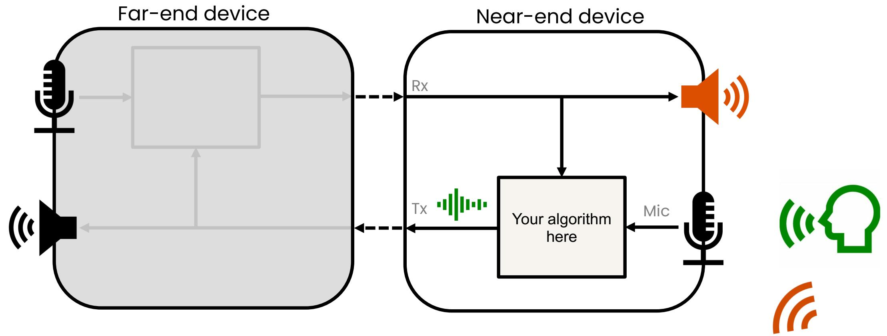

## Speech enhancement – Acoustic Echo Cancellation

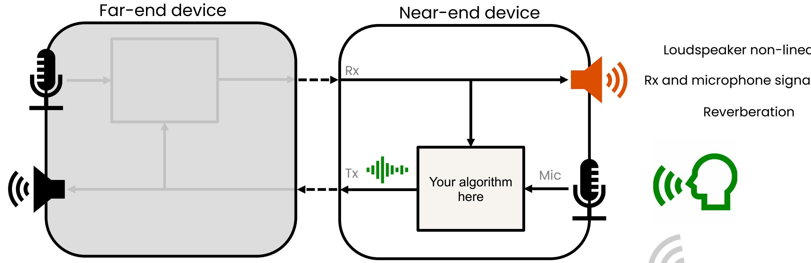

Loudspeaker non-linearity
Rx and microphone signal delay
Reverberation

## Speech enhancement – Noise Suppression

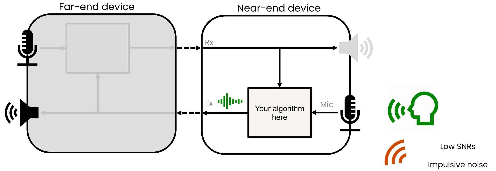

## State Of The Art - DeepVQE

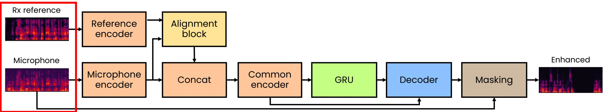  
power law compressed
complex spectrograms
2 x t x f

<table><tr><td></td><td>Sample Rate</td><td>Win size</td><td>Hop size</td></tr><tr><td>paper</td><td>24 kHz</td><td>20 ms</td><td>10 ms</td></tr><tr><td>ours</td><td>16 kHz</td><td>32 ms</td><td>16/8 ms</td></tr></table>

Algorithmic latency

## DeepVQE - Encoders

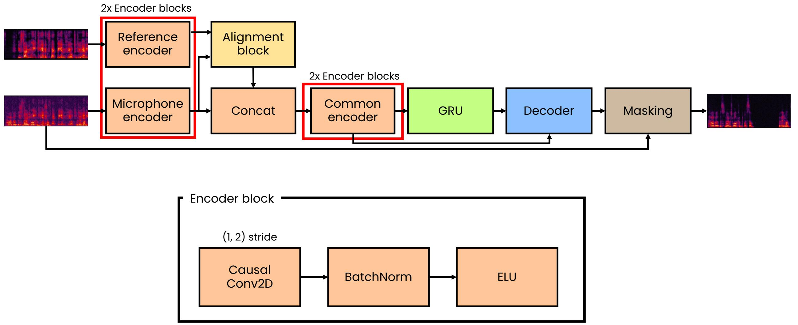

## DeepVQE – Alignment Block

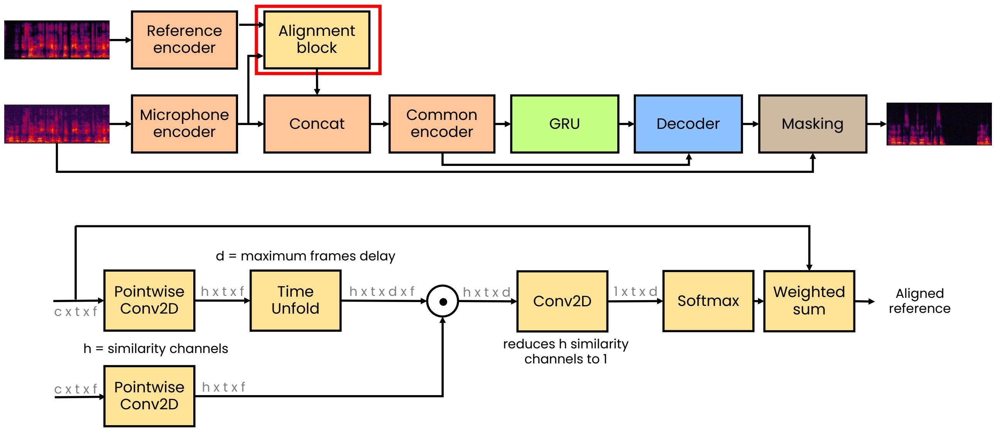

## DeepVQE - Decoder

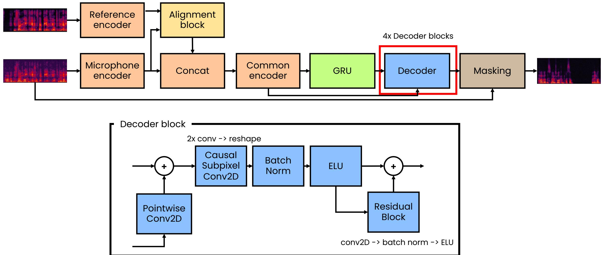

## DeepVQE - Masking

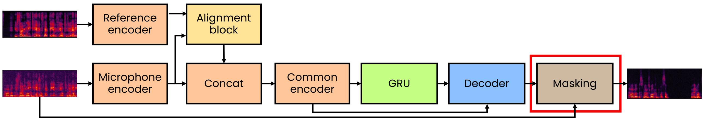

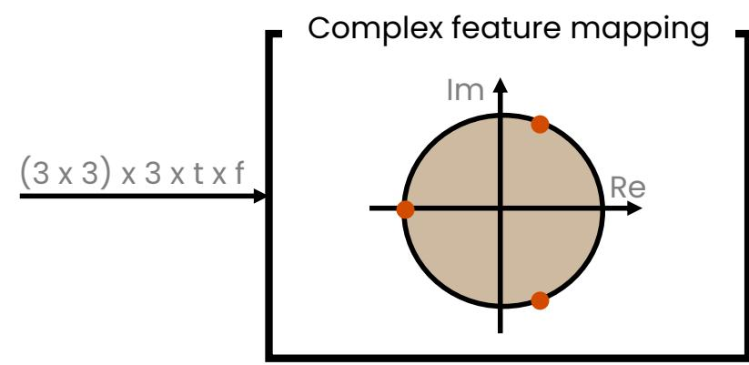  
dot product with 3 complex points

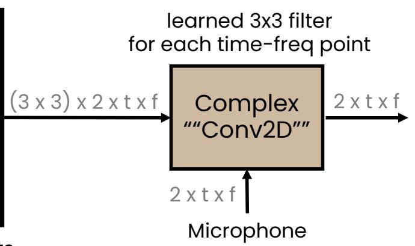

## AEC evaluation – Scenarios and metrics

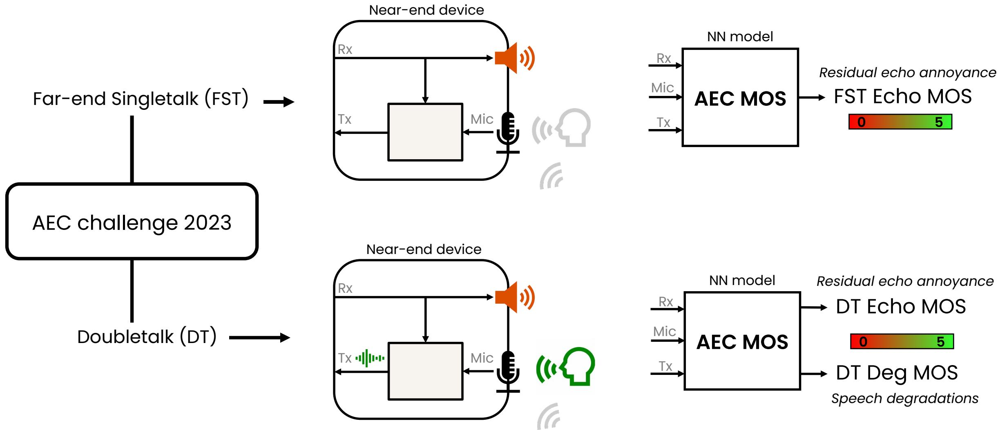

## NS evaluation – Scenario and metrics

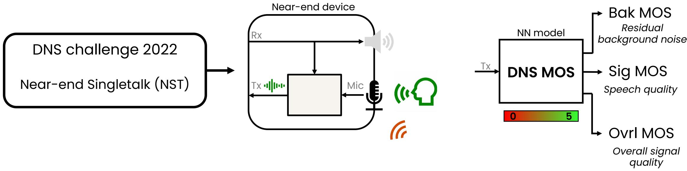

## Training - Loss function

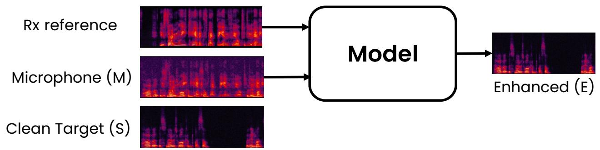

Complex L2 loss

Magnitude only L2 loss

$$
\begin{array}{r l} L _ {C S D R} (A, \hat {A}) = & \frac {\sum_ {k} \big | | A | ^ {p} e ^ {j \theta A} - | \hat {A} | ^ {p} e ^ {j \theta \hat {A}} \big | ^ {2}}{\boxed {\sum_ {k} \big | | A | ^ {p} e ^ {j \theta A} \big | ^ {2}}} \\ & L _ {M S D R} (A, \hat {A}) = \frac {\sum_ {k} \big | | A | ^ {p} - | \hat {A} | ^ {p} \big | ^ {2}}{\boxed {\sum_ {k} \big | | A | ^ {p} \big | ^ {2}}} \\ & L _ {S D R} (A, \hat {A}) = \alpha L _ {C S D R} (A, \hat {A}) + (1 - \alpha) L _ {M S D R} (A, \hat {A}) \\ & L = \sum_ {n} \beta L _ {S D R} (S, E) + (1 - \beta) L _ {S D R} (M - S, M - E) \\ & \beta = \sum_ {k} | S | ^ {2} / \sum_ {k} | M | ^ {2} \end{array}
$$

Echo Cancellation performances

<table><tr><td colspan="3"></td><td colspan="3">AEC MOS</td><td colspan="3">DNS MOS</td></tr><tr><td>Model</td><td>Params (k)</td><td>MACs (M)</td><td>FST Echo</td><td>DT Echo</td><td>DT Deg</td><td>Sig</td><td>Bak</td><td>Ovrl</td></tr><tr><td>Unprocessed</td><td>-</td><td>-</td><td>2.19</td><td>2.09</td><td>4.05</td><td>3.49</td><td>2.11</td><td>2.31</td></tr><tr><td colspan="3"></td><td>Echo only suppression</td><td colspan="2">Doubletalk</td><td>Speech distortions</td><td>Noise suppression</td><td>Overall quality</td></tr></table>

## First results - DeepVQE

<table><tr><td colspan="3"></td><td colspan="3">AEC MOS</td><td colspan="3">DNS MOS</td></tr><tr><td>Model</td><td>Params (k)</td><td>MACs (M)</td><td>FST Echo</td><td>DT Echo</td><td>DT Deg</td><td>Sig</td><td>Bak</td><td>Ovrl</td></tr><tr><td>Unprocessed</td><td>-</td><td>-</td><td>2.19</td><td>2.09</td><td>4.05</td><td>3.49</td><td>2.11</td><td>2.31</td></tr><tr><td>DeepVQE-s (paper)</td><td>590</td><td>9.64*</td><td>4.61</td><td>4.62</td><td>4.02</td><td>3.60</td><td>4.10</td><td>3.30</td></tr><tr><td>DeepVQE-s (ours)</td><td>610</td><td>10.28</td><td>4.67</td><td>4.61</td><td>4.07</td><td>3.54</td><td>4.08</td><td>3.28</td></tr></table>

Slightly better echo cancellation  
Slightly worst noise suppression

➢ Smaller batch sizes: Batch Norm -> Layer Norm

▶ Frame delay d=1s

## First optimizations - MobileVQE

<table><tr><td colspan="3"></td><td colspan="3">AEC MOS</td><td colspan="3">DNS MOS</td></tr><tr><td>Model</td><td>Params (k)</td><td>MACs (M)</td><td>FST Echo</td><td>DT Echo</td><td>DT Deg</td><td>Sig</td><td>Bak</td><td>Ovrl</td></tr><tr><td>Unprocessed</td><td>-</td><td>-</td><td>2.19</td><td>2.09</td><td>4.05</td><td>3.49</td><td>2.11</td><td>2.31</td></tr><tr><td>DeepVQE-s (paper)</td><td>590</td><td>9.64*</td><td>4.61</td><td>4.62</td><td>4.02</td><td>3.60</td><td>4.10</td><td>3.30</td></tr><tr><td>DeepVQE-s (ours)</td><td>610</td><td>10.28</td><td>4.67</td><td>4.61</td><td>4.07</td><td>3.54</td><td>4.08</td><td>3.28</td></tr><tr><td>MobileVQE</td><td>635</td><td>1.34</td><td>4.68</td><td>4.49</td><td>3.95</td><td>3.39</td><td>3.95</td><td>3.11</td></tr></table>

Conv2d -> Depthwise Separable Conv2D

No decoder residual blocks

Frame delay d=0.5s

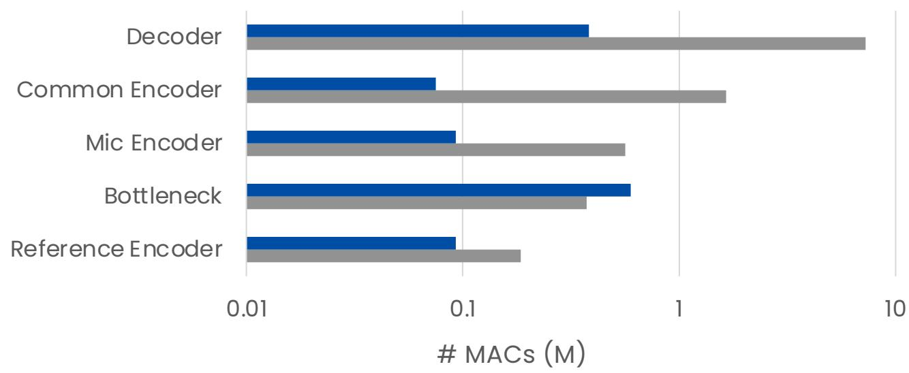  
■ MobileVQE ■ DeepVQE

■ 1x Cortex A53 frame inference (ms)

## Integration - MobileVQE

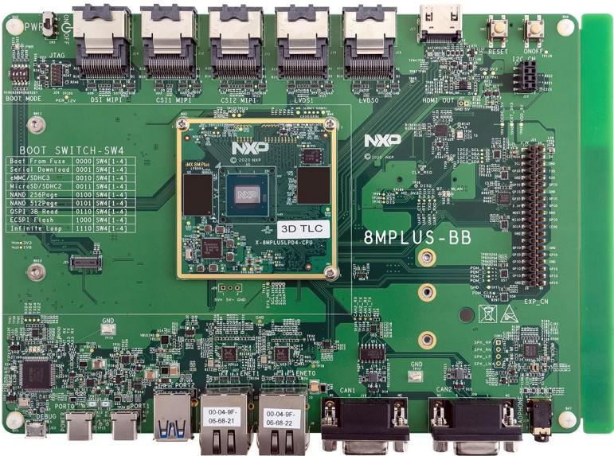  
i.MX 8M Plus EVK

1 core of Arm® Cortex® A53

▶ FP32 model, 16ms hop size

▶ TFLite runtime with XNNPack

GStreamer audio-visual pipeline integration

i.MX 8M Plus: High end NXP MPU

• 4x Arm® Cortex® A53 (1.8 GHz)

\- NPU (2.3 TOPS)

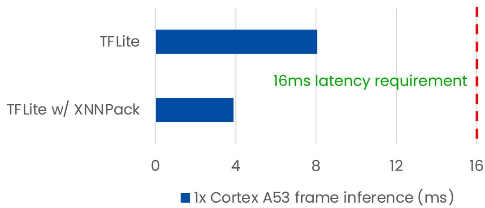

## The real target

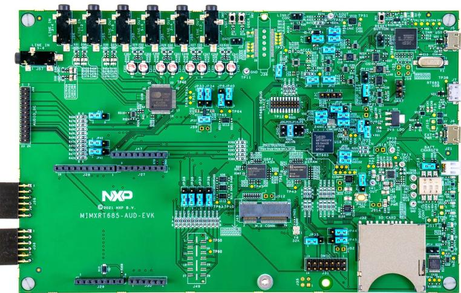  
IMXRT600-AUD-EVK

## Cadence® Tensilica® HiFi 4 DSP:

\- Two 2-way SIMD VFPU: 4 FP32 MACs/cycle

\- Fixed-Point: 8 32x16 or 16x16 MACs/cycle

• C/C++ intrinsics

• Cadence® HiFi4 NN library

i.MX RT600: dual-core NXP MCU

\- Arm® Cortex® M33 (300 MHz)

\- Cadence® Tensilica® HiFi 4 DSP (600 MHz)

• 4.5 MB shared on-chip SRAM

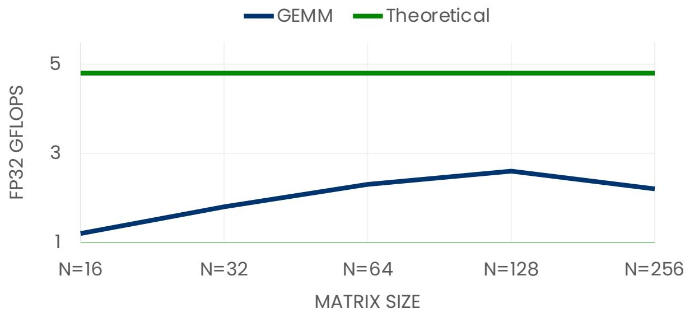

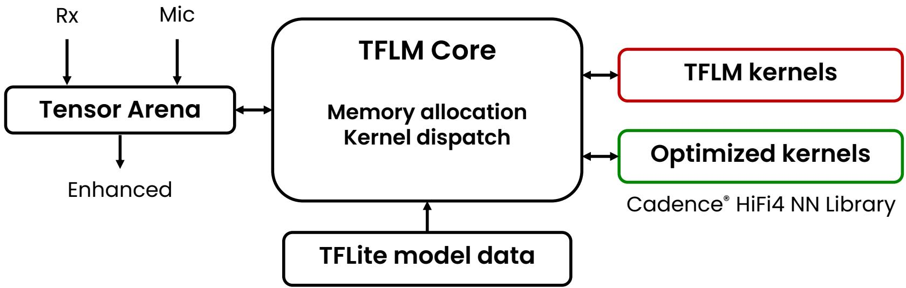

## Model optimizations – FP32 performances

Echo Cancellation performances  
Noise Suppression performances

<table><tr><td colspan="3"></td><td colspan="3">AEC MOS</td><td colspan="3">DNS MOS</td><td>HiFi4 DSP</td></tr><tr><td>Params (K)</td><td>MACs (M)</td><td>Memory (KB)</td><td>FST Echo</td><td>DT Echo</td><td>DT Deg</td><td>Sig</td><td>Bak</td><td>Ovrl</td><td>Inference (ms)</td></tr></table>

FP32 DSP frame
inference @ 600MHz

FP32 Tensor arena

Model optimizations – Smaller model

<table><tr><td colspan="4"></td><td colspan="3">AEC MOS</td><td colspan="3">DNS MOS</td><td>HiFi4 DSP</td></tr><tr><td>Model</td><td>Params (k)</td><td>MACs (M)</td><td>Memory (KB)</td><td>FST Echo</td><td>DT Echo</td><td>DT Deg</td><td>Sig</td><td>Bak</td><td>Ovrl</td><td>Inference (ms)</td></tr><tr><td>DeepVQE-s (ours)</td><td>610</td><td>10.28</td><td>-</td><td>4.67</td><td>4.61</td><td>4.07</td><td>3.54</td><td>4.08</td><td>3.28</td><td>-</td></tr><tr><td>MobileVQE</td><td>635</td><td>1.34</td><td>-</td><td>4.68</td><td>4.49</td><td>3.95</td><td>3.39</td><td>3.95</td><td>3.11</td><td>-</td></tr><tr><td>Cut parameters</td><td>147</td><td>0.86</td><td>770</td><td>4.53</td><td>4.34</td><td>3.81</td><td>3.31</td><td>3.84</td><td>3.01</td><td>13.19</td></tr></table>

➢ Too large: 635k FP32 -> 2.54 MB

Bottleneck: 598k / 635k -> 94%

Frame delay d=500 ms

➤ 147k FP32 -> 588 KB

▶ Bottleneck: 102k / 147k -> 69%

Frame delay d=250 ms

Model optimizations - Custom masking layer

<table><tr><td colspan="4"></td><td colspan="3">AEC MOS</td><td colspan="3">DNS MOS</td><td>HiFi4 DSP</td></tr><tr><td>Model</td><td>Params (k)</td><td>MACs (M)</td><td>Memory (KB)</td><td>FST Echo</td><td>DT Echo</td><td>DT Deg</td><td>Sig</td><td>Bak</td><td>Ovrl</td><td>Inference (ms)</td></tr><tr><td>DeepVQE-s (ours)</td><td>610</td><td>10.28</td><td>-</td><td>4.67</td><td>4.61</td><td>4.07</td><td>3.54</td><td>4.08</td><td>3.28</td><td>-</td></tr><tr><td>MobileVQE</td><td>635</td><td>1.34</td><td>-</td><td>4.68</td><td>4.49</td><td>3.95</td><td>3.39</td><td>3.95</td><td>3.11</td><td>-</td></tr><tr><td>Cut parameters</td><td>147</td><td>0.86</td><td>770 ↓</td><td>4.53</td><td>4.34</td><td>3.81</td><td>3.31</td><td>3.84</td><td>3.01</td><td>13.19 ↓</td></tr><tr><td>Custom impls</td><td>147</td><td>0.86</td><td>690 ↓</td><td>4.53</td><td>4.34</td><td>3.81</td><td>3.31</td><td>3.84</td><td>3.01</td><td>7.19 ↓</td></tr></table>

▶ Masking MACs: 2.3k

➢ TFLM: Split, Concatenation, Transposition

HiFi4 intrinsics: batched complex dot product

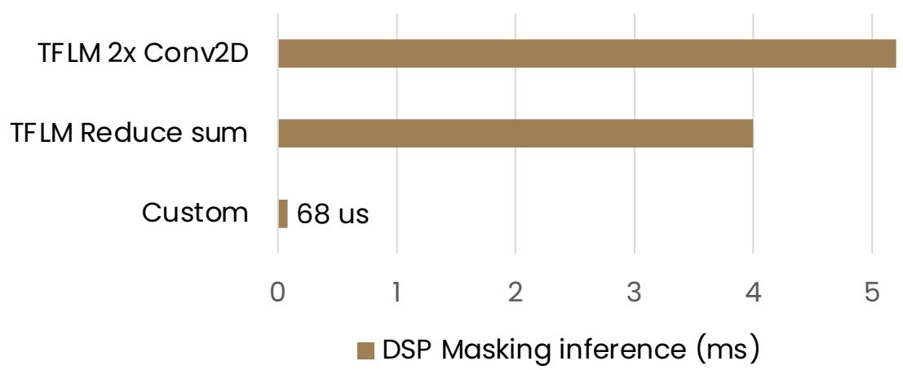

Model optimizations - ReLu

<table><tr><td colspan="4"></td><td colspan="3">AEC MOS</td><td colspan="3">DNS MOS</td><td>HiFi4 DSP</td></tr><tr><td>Model</td><td>Params (k)</td><td>MACs (M)</td><td>Memory (KB)</td><td>FST Echo</td><td>DT Echo</td><td>DT Deg</td><td>Sig</td><td>Bak</td><td>Ovrl</td><td>Inference (ms)</td></tr><tr><td>DeepVQE-s (ours)</td><td>610</td><td>10.28</td><td>-</td><td>4.67</td><td>4.61</td><td>4.07</td><td>3.54</td><td>4.08</td><td>3.28</td><td>-</td></tr><tr><td>MobileVQE</td><td>635</td><td>1.34</td><td>-</td><td>4.68</td><td>4.49</td><td>3.95</td><td>3.39</td><td>3.95</td><td>3.11</td><td>-</td></tr><tr><td>Cut parameters</td><td>147</td><td>0.86</td><td>770</td><td>4.53</td><td>4.34</td><td>3.81</td><td>3.31</td><td>3.84</td><td>3.01</td><td>13.19</td></tr><tr><td>Custom impls</td><td>147</td><td>0.86</td><td>690</td><td>4.53↓</td><td>4.34↓</td><td>3.81</td><td>3.31↓</td><td>3.84↓</td><td>3.01</td><td>7.19↓</td></tr><tr><td>ELU -&gt; ReLu</td><td>147</td><td>0.86</td><td>690</td><td>4.57</td><td>4.49</td><td>3.79</td><td>3.26↓</td><td>3.93↓</td><td>3.00</td><td>4.04↓</td></tr></table>

More "aggressive" model

ELU: default TFLM kernel

ReLU: HiFi4 FP32 optimized kernel

Model optimizations – Faster model

<table><tr><td colspan="4"></td><td colspan="3">AEC MOS</td><td colspan="3">DNS MOS</td><td>HiFi4 DSP</td></tr><tr><td>Model</td><td>Params (k)</td><td>MACs (M)</td><td>Memory (KB)</td><td>FST Echo</td><td>DT Echo</td><td>DT Deg</td><td>Sig</td><td>Bak</td><td>Ovrl</td><td>Inference (ms)</td></tr><tr><td>DeepVQE-s (ours)</td><td>610</td><td>10.28</td><td>-</td><td>4.67</td><td>4.61</td><td>4.07</td><td>3.54</td><td>4.08</td><td>3.28</td><td>-</td></tr><tr><td>MobileVQE</td><td>635</td><td>1.34</td><td>-</td><td>4.68</td><td>4.49</td><td>3.95</td><td>3.39</td><td>3.95</td><td>3.11</td><td>-</td></tr><tr><td>Cut parameters</td><td>147</td><td>0.86</td><td>770</td><td>4.53</td><td>4.34</td><td>3.81</td><td>3.31</td><td>3.84</td><td>3.01</td><td>13.19</td></tr><tr><td>Custom impls</td><td>147</td><td>0.86</td><td>690</td><td>4.53</td><td>4.34</td><td>3.81</td><td>3.31</td><td>3.84</td><td>3.01</td><td>7.19</td></tr><tr><td>ELU -&gt; ReLu</td><td>147</td><td>0.86</td><td>690</td><td>4.57</td><td>4.49</td><td>3.79</td><td>3.26</td><td>3.93</td><td>3.00</td><td>4.04</td></tr><tr><td>Cut MACs</td><td>139</td><td>0.54</td><td>455</td><td>4.56</td><td>4.45</td><td>3.87</td><td>3.28</td><td>3.82</td><td>2.98</td><td>2.99</td></tr></table>

Skip Conv2Ds: 120k MACs

Last decoder block: 117k MACs

➢ Reference/Mic encoders: 252k MACs

Symmetrical model: no skip Conv2D

➢ Masking layer 27 -> 18: 80k MACs

➢ Reference/Mic encoders: 94k MACs

Model optimizations - TinyVQE

<table><tr><td colspan="4"></td><td colspan="3">AEC MOS</td><td colspan="3">DNS MOS</td><td>HiFi4 DSP</td></tr><tr><td>Model</td><td>Params (k)</td><td>MACs (M)</td><td>Memory (KB)</td><td>FST Echo</td><td>DT Echo</td><td>DT Deg</td><td>Sig</td><td>Bak</td><td>Ovrl</td><td>Inference (ms)</td></tr><tr><td>DeepVQE-s (ours)</td><td>610</td><td>10.28</td><td>-</td><td>4.67</td><td>4.61</td><td>4.07</td><td>3.54</td><td>4.08</td><td>3.28</td><td>-</td></tr><tr><td>MobileVQE</td><td>635</td><td>1.34</td><td>-</td><td>4.68</td><td>4.49</td><td>3.95</td><td>3.39</td><td>3.95</td><td>3.11</td><td>-</td></tr><tr><td>Cut parameters</td><td>147</td><td>0.86</td><td>770</td><td>4.53</td><td>4.34</td><td>3.81</td><td>3.31</td><td>3.84</td><td>3.01</td><td>13.19</td></tr><tr><td>Custom impls</td><td>147</td><td>0.86</td><td>690</td><td>4.53</td><td>4.34</td><td>3.81</td><td>3.31</td><td>3.84</td><td>3.01</td><td>7.19</td></tr><tr><td>ELU -&gt; ReLu</td><td>147</td><td>0.86</td><td>690</td><td>4.57</td><td>4.49</td><td>3.79</td><td>3.26</td><td>3.93</td><td>3.00</td><td>4.04</td></tr><tr><td>Cut MACs</td><td>139</td><td>0.54</td><td>455</td><td>4.56</td><td>4.45</td><td>3.87</td><td>3.28</td><td>3.82</td><td>2.98</td><td>2.99</td></tr><tr><td>TinyVQE</td><td>114</td><td>0.48</td><td>420</td><td>4.55</td><td>4.41</td><td>3.81</td><td>3.26</td><td>3.80</td><td>2.95</td><td>2.32</td></tr></table>

Remove layer norm

➢ Longer training runs ➢ Next step: 16x8 QAT
➢ ≈ x4 smaller model
➢ ≈ x2 DSP frame inference speed up

Model optimizations - Bonus

<table><tr><td colspan="4"></td><td colspan="3">AEC MOS</td><td colspan="3">DNS MOS</td><td>HiFi4 DSP</td></tr><tr><td>Model</td><td>Params (k)</td><td>MACs (M)</td><td>Memory (KB)</td><td>FST Echo</td><td>DT Echo</td><td>DT Deg</td><td>Sig</td><td>Bak</td><td>Ovrl</td><td>Inference (ms)</td></tr><tr><td>DeepVQE-s (ours)</td><td>610</td><td>10.28</td><td>-</td><td>4.67</td><td>4.61</td><td>4.07</td><td>3.54</td><td>4.08</td><td>3.28</td><td>-</td></tr><tr><td>MobileVQE</td><td>635</td><td>1.34</td><td>-</td><td>4.68</td><td>4.49</td><td>3.95</td><td>3.39</td><td>3.95</td><td>3.11</td><td>-</td></tr><tr><td>Cut parameters</td><td>147</td><td>0.86</td><td>770</td><td>4.53</td><td>4.34</td><td>3.81</td><td>3.31</td><td>3.84</td><td>3.01</td><td>13.19</td></tr><tr><td>Custom impls</td><td>147</td><td>0.86</td><td>690</td><td>4.53</td><td>4.34</td><td>3.81</td><td>3.31</td><td>3.84</td><td>3.01</td><td>7.19</td></tr><tr><td>ELU -&gt; ReLu</td><td>147</td><td>0.86</td><td>690</td><td>4.57</td><td>4.49</td><td>3.79</td><td>3.26</td><td>3.93</td><td>3.00</td><td>4.04</td></tr><tr><td>Cut MACs</td><td>139</td><td>0.54</td><td>455</td><td>4.56</td><td>4.45</td><td>3.87</td><td>3.28</td><td>3.82</td><td>2.98</td><td>2.99</td></tr><tr><td>TinyVQE</td><td>114</td><td>0.48</td><td>420</td><td>4.55</td><td>4.41</td><td>3.81</td><td>3.26</td><td>3.80</td><td>2.95</td><td>2.32</td></tr><tr><td>Bonus</td><td>92</td><td>0.45</td><td>418</td><td>4.54</td><td>4.24</td><td>3.63</td><td>3.27</td><td>3.79</td><td>2.92</td><td>2.26</td></tr></table>

Not enough echo suppression

TinyVQE - Summary

<table><tr><td colspan="4"></td><td colspan="3">AEC MOS</td><td colspan="3">DNS MOS</td><td>HiFi4 DSP</td></tr><tr><td>Model</td><td>Params (k)</td><td>MACs (M)</td><td>Memory (KB)</td><td>FST Echo</td><td>DT Echo</td><td>DT Deg</td><td>Sig</td><td>Bak</td><td>Ovrl</td><td>Inference (ms)</td></tr><tr><td>DeepVQE-s (ours)</td><td>610</td><td>10.28</td><td>-</td><td>4.67</td><td>4.61</td><td>4.07</td><td>3.54</td><td>4.08</td><td>3.28</td><td>-</td></tr><tr><td>TinyVQE</td><td>114</td><td>0.48</td><td>420</td><td>4.55</td><td>4.41</td><td>3.81</td><td>3.26</td><td>3.80</td><td>2.95</td><td>2.32</td></tr></table>

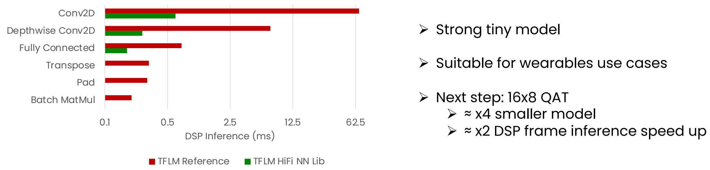

## NXP

## nxp.com

## Copyright Notice

This presentation in this publication was presented at the tinyML® Summit 2024. The content reflects the opinion of the author(s) and their respective companies. The inclusion of presentations in this publication does not constitute an endorsement by tinyML Foundation or the sponsors.

There is no copyright protection claimed by this publication. However, each presentation is the work of the authors and their respective companies and may contain copyrighted material. As such, it is strongly encouraged that any use reflect proper acknowledgement to the appropriate source. Any questions regarding the use of any materials presented should be directed to the author(s) or their companies.

tinyML is a registered trademark of the tinyML Foundation.

## www.tinyml.org