# On the Design and Implementation of Higher Order Differential Microphones

Enzo De Sena, Student Member, IEEE, Hüseyin Hacihabiboglu˘ , Member, IEEE, and Zoran Cvetkovic´, Senior Member, IEEE

Abstract—A novel systematic approach to the design of directivity patterns of higher order differential microphones is proposed. The directivity patterns are obtained by optimizing a cost function which is a convex combination of a front-back energy ratio and uniformity within a frontal sector of interest. Most of the standard directivity patterns—omnidirectional, cardioid, subcardioid, hypercardioid, supercardioid—are particular solutions of this optimization problem with specific values of two free parameters: the angular width of the frontal sector and the convex combination factor. More general solutions of practical use are obtained by varying these two parameters. Many of these optimal directivity patterns are trigonometric polynomials with complex roots. A new differential array structure that enables the implementation of general higher order directivity patterns, with complex or real roots, is then proposed. The effectiveness of the proposed design framework and the implementation structure are illustrated by design examples, simulations, and measurements.

Index Terms—Beamforming, differential microphone, direc tivity pattern, microphone.

## I. INTRODUCTION

D IRECTIONAL microphones have been a subject of re-search since the rise of commercial broadcasting in the search since the rise of commercial broadcasting in the early 1920s. Their development was based on the need to emphasize voices of news presenters and to suppress surrounding noise sources. One of the first directional microphones is the cardioid microphone. In its earliest form, it was composed of a pressure element and a pressure gradient element, whose signals were electrically summed [1], achieving the well-known heart-shaped directivity function. Most of the directional microphones used in the recording industry today are from the first-order cardioid family and satisfy design requirements by setting a ratio between the pressure and pressure gradient components. These include supercardioid pattern that exhibits the maximumfront-back ratio, the hypercardioid pattern that attains the maximum directivity index [1], and subcardioid pattern that is not designed to satisfy any objective optimization criteria but has been found to provide pleasing results in classical music recordings [1].

Due to the high cost and the inconvenience of having a dedicated microphone design for different recording scenarios, several technologies for constructing variable-pattern first-order microphones have been developed since the mid-1930s. Most notable examples, still widely used today, are the Braunmuhl–Weber design developed in 1935 [2], differential microphones introduced in the 1950s [1], and the more recent Soundfield microphone [3], proposed first by Gerzon and Craven in 1975. The Braunmuhl–Weber design employs two back-to-back cardioid microphones, whose signals are electrically combined together with a variable ratio. First-order differential microphones achieve the desired directional pattern by delaying and subtracting the signals of two closely spaced pressure microphones. The more sophisticated Soundfield microphone employs an array of four subcardioid microphones arranged in tetrahedral topology. When appropriately combined, their signals can produce the entire range of the first-order cardioid family. Recording engineers set the ratio of pressure and pressure gradient elements to obtain an appropriate pattern according to their taste and the recording scenario; usually a slider serves as the interface to set this ratio.

Recently, there has been significant interest in the develop ment of second and higher order microphones, driven by the need to overcome the limitations of first-order microphones in terms of achievable directivity patterns and rejection levels of sounds coming from undesirable directions. Higher order microphones can be obtained by means of differential arrays that combine outputs of a number of pressure microphones [1], [4]–[7]. Differential arrays have many advantages: only pressure microphones are required for directivity patterns of th-order, their physical construction is trivial and, if the signals of individual microphones are stored separately, the directivity pattern can be modified in post-processing. Moreover, their implementation requires only very simple components such as delays and integration filters. These advantages come at the cost of a high noise sensitivity when the dimension of the array is comparable to the wavelength of the recorded sound signal, restricting the lower bound of their operational frequency range. Similarly to other beamforming techniques, which suffer from the same problem [8]–[10], a wider operational range can be obtained by combining outputs of two or more arrays, each optimized for a different frequency band.

While differential microphone arrays enable the design of a large class of directivity patterns, exploiting this flexibility fully and in a user-friendly way opens up new issues. The directivity pattern of an th-order differential array is an th-order trigonometric polynomial in the angle of incidence. Coefficients of this polynomial need to be selected according to some objective criterion, and this criterion should be expressed in terms of a small number of physical parameters that would be set by a recording engineer. Even in the case of first-order microphones there is no such general unifying design criterion, and often the one free parameter is set empirically. The need for a unifying and systematic design framework is even more pronounced in the case of higher order microphones.

In this paper, we propose a design criterion for higher order microphones. The criterion is a convex combination of a within/ out-of a sector of interest ratio and uniformity within the sector. The criterion is thus specified in terms of two physical application oriented parameters: , the angular width of the sector of interest, and , the convex combination parameter which controls the relative importance of the within/out-of sector ratio and the uniformity within the sector of interest. We then show that all standard directivity patterns, i.e., omnidirectional, subcardioid, cardioid, supercardioid, and hypercardioid, are in fact minima of this design criterion corresponding to different values of and .

Optimal directivity patterns for certain $( \alpha , \lambda )$ pairs are trigonometric polynomials with complex-conjugate roots, which cannot be implemented using existing differential microphone structures. We propose a new practical differential array architecture that overcomes this restriction. Furthermore, trigonometric polynomials with complex roots allow for a much more flexible and sophisticated design, outside the scope of the proposed design criterion, e.g., in applications that require a psychoacoustic design criteria [11], [12]. The proposed differential structure is comparable to the conventional one in terms of noise sensitivity and low implementation complexity, making it suitable for real-time operation.

The paper is organized as follows. In Section II, an overview of common directional patterns is given, and conventional differential arrays are briefly reviewed. The new method for microphone directivity pattern design is presented in Section III. In Section IV, the new differential array structure is described, along with an analysis of its sensitivity to noise and its operational bandwidth. Design examples are presented in Section V together with simulation and measurement results validating the proposed methods. Conclusions are drawn in Section VI.

## II. BACKGROUND

## A. Directional Microphones

In the context of this paper, the far-field directivity pattern $\Gamma ( \theta )$ is defined as the microphone amplitude response to a plane wave incident from the direction . A general expression for an $N ^ { t h }$ -order frequency-independent microphone directivity pattern is given by [6]

$$
\Gamma (\theta) = a _ {0} + a _ {1} \cos (\theta) + a _ {2} \cos^ {2} (\theta) + \ldots + a _ {N} \cos^ {N} (\theta).\tag{1}
$$

Since a normalization of (1) does not affect directional characteristics of the microphone, it is convenient to set $a _ { 0 } = 1 - a _ { 1 } -$ $a _ { 2 } - \ldots - a _ { N }$ , so that $\Gamma _ { \mathbf { a } } ( 0 ) = 1$ . Therefore, in the following we will consider directivity patterns of the form

$$
\Gamma_ {\mathbf {a}} (\theta) = 1 - \sum_ {i = 1} ^ {N} a _ {i} + \sum_ {i = 1} ^ {N} a _ {i} \cos^ {i} (\theta)\tag{2}
$$

where the subscript denotes the vector of coefficients ${ \bf a } =$ $[ a _ { 1 } , . . . , a _ { N } ] \in \mathbb { R } ^ { N }$ . Note also that since $\Gamma _ { \mathbf { a } } ( \theta )$ is an even function of , considerations can be restricted to $\theta \in [ 0 , \pi ]$

First-order directivity patterns thus have the form

$$
\Gamma (\theta) = (1 - a _ {1}) + a _ {1} \cos (\theta).
$$

The cardioid is obtained for $a _ { 1 } = 0 . 5$ , while the subcardioid is characterized by $a _ { 1 } = 0 . 3 .$ . Unlike the cardioid and subcardioid, the hypercardioid and supercardioid patterns are designed to satisfy certain optimality criteria. In particular, the hypercardioid is the pattern which maximizes the directivityfactor [13], [14] defined as [6]

$$
Q _ {\mathbf {a}} = \frac {| \Gamma_ {\mathbf {a}} (0) | ^ {2}}{\frac {1}{\pi} \int_ {0} ^ {\pi} | \Gamma_ {\mathbf {a}} (\theta) | ^ {2} d \theta}.\tag{3}
$$

under the assumption of cylindrically isotropic soundfield and axisymmetric directivity pattern.

Supercardioid was first proposed by Marshall and Harry in 1941 [15]. It is the directivity pattern with the maximum frontback ratio [6], defined as

$$
F _ {\mathbf {a}} = \frac {\int_ {0} ^ {\pi / 2} | \Gamma_ {\mathbf {a}} (\theta) | ^ {2} d \theta}{\int_ {\pi / 2} ^ {\pi} | \Gamma_ {\mathbf {a}} (\theta) | ^ {2} d \theta}\tag{4}
$$

again under the assumption of cylindrically isotropic soundfield and axisymmetric directivity pattern. In the case of first-order microphones, the hypercardioid is obtained for $a _ { 1 } = 2 / 3$ , while the supercardioid is obtained for $a _ { 1 } \approx 0 . 5 8 6$

First-order microphones are extremely limited in terms of achievable directivity patterns. Higher order microphones, when designed properly, provide more flexibility in this respect.

The directivity pattern of the $N ^ { t h }$ -order cardioid microphone is

$$
\Gamma (\theta) = [ 0. 5 + 0. 5 \cos (\theta) ] ^ {N}
$$

according to Elko [6]. An alternative form is given by

$$
\Gamma (\theta) = [ 0. 5 + 0. 5 \cos (\theta) ] \cos^ {N - 1} (\theta)
$$

according to Eargle [1]. We will refer to the former as cardioid-A, and to the latter as cardioid-B. Observe that the two definitions coincide for $N \ = \ 1$ . Both forms of th-order cardioid are heuristic approaches to improving microphone directivity while keeping a null at $1 8 0 ^ { \circ }$ . Optimal solutions in terms of the directivity index or front back ratio are however obtained as coefficient sets $a _ { 2 } , \dots , a _ { N }$ that maximize (3) or (4), respectively. Solutions to these two optimization problems are shown in Table I for the first-, second-, and third-order patterns [6], along with coefficients that give cardioid and subcardioid patterns.

TABLE I  
COEFFICIENTS OF STANDARD DIRECTIVITY PATTERNS AND THE ASSOCIATED DIRECTIVITY FACTORS,  , AND FRONT–BACK RATIOS, $F _ { \mathbf { a } }$

<table><tr><td>Pattern</td><td>N</td><td>Pattern coefficients a</td><td> $Q_{\text{adB}}$ </td><td> $F_{\text{adB}}$ </td></tr><tr><td>Omnidirectional</td><td>0</td><td>[1]</td><td>0</td><td>0</td></tr><tr><td>Subcardioid</td><td>1</td><td>[0.7, 0.3]</td><td>2.7</td><td>4.8</td></tr><tr><td>Cardioid</td><td>1</td><td> $\left[\frac{1}{2}, \frac{1}{2}\right]$ </td><td>4.3</td><td>10</td></tr><tr><td rowspan="2">Cardioid-A</td><td>2</td><td> $\left[\frac{1}{4}, \frac{1}{2}, \frac{1}{4}\right]$ </td><td>5.6</td><td>18</td></tr><tr><td>3</td><td> $\left[\frac{1}{8}, \frac{3}{8}, \frac{3}{8}, \frac{1}{8}\right]$ </td><td>6.5</td><td>25</td></tr><tr><td rowspan="2">Cardioid-B</td><td>2</td><td> $\left[0, \frac{1}{2}, \frac{1}{2}\right]$ </td><td>6.6</td><td>18</td></tr><tr><td>3</td><td> $\left[0, 0, \frac{1}{2}, \frac{1}{2}\right]$ </td><td>7.6</td><td>22</td></tr><tr><td rowspan="3">Hypercardioid</td><td>1</td><td> $\left[\frac{1}{3}, \frac{2}{3}\right]$ </td><td>4.8</td><td>11</td></tr><tr><td>2</td><td> $\left[-\frac{1}{5}, \frac{2}{5}, \frac{4}{5}\right]$ </td><td>7.0</td><td>11</td></tr><tr><td>3</td><td> $\left[-\frac{1}{7}, -\frac{4}{7}, \frac{4}{7}, \frac{8}{7}\right]$ </td><td>8.4</td><td>14</td></tr><tr><td rowspan="3">Supercardioid</td><td>1</td><td>[0.414, 0.586]</td><td>4.6</td><td>13</td></tr><tr><td>2</td><td>[0.103, 0.484, 0.413]</td><td>6.3</td><td>26</td></tr><tr><td>3</td><td>[0.022, 0.217, 0.475, 0.286]</td><td>7.2</td><td>40</td></tr></table>

In Section III, we propose a unifying microphone directivity design framework based on optimizing the ratio between the energy within a given angular sector and the energy outside of that sector along with a uniformity within the sector. The known directivity patterns reviewed in this section are particular cases of this framework.

## B. Differential Microphones

Differential microphone arrays have been used since the 1950s in various applications areas such as hearing aids [16] and automatic speech recognition [17]. Differential micro phones use the direction-dependent phase relations between pressure signals recorded by a number of omnidirectional microphones positioned on a line. A first-order differential microphone consists of two omnidirectional microphones as shown in Fig. 1(a). Consider a monochromatic plane of fre quency propagating along the direction of the wave vector . The acoustic pressure field of this sound wave is given by

$$
p (\mathbf {k}, \mathbf {r}, t) = P _ {0} e ^ {j \omega t} e ^ {- j \mathbf {k} \cdot \mathbf {r}}\tag{5}
$$

where is the position vector and $P _ { 0 }$ is the wave amplitude, which we will without loss of generality consider to be a positive real number. The norm of the wave vector $\| \mathbf { k } \| = k$ is the wave number, $k = \omega / c$ , where is the speed of sound, while its argument $\theta = \arg ( \mathbf { k } )$ is the angle of incidence of the sound wave. The sound pressure at the locations of the left and right microphones are

$$
p (\mathbf {k}, \mathbf {r}, t) | _ {\mathbf {r} = \left[ 0, - \frac {d}{2} \right]} = P _ {0} e ^ {j \omega t} e ^ {- j \frac {k d}{2} \cos \theta}\tag{6}
$$

$$
p (\mathbf {k}, \mathbf {r}, t) | _ {\mathbf {r} = \left[ 0, + \frac {d}{2} \right]} = P _ {0} e ^ {j \omega t} e ^ {+ j \frac {k d}{2} \cos \theta}\tag{7}
$$

respectively, where is the spacing between them. If the right microphone output is delayed by and subtracted from the left microphone output, and the resulting signal is filtered by a correction filter $H _ { c } ( \omega )$ , one obtains the output signal proportional to

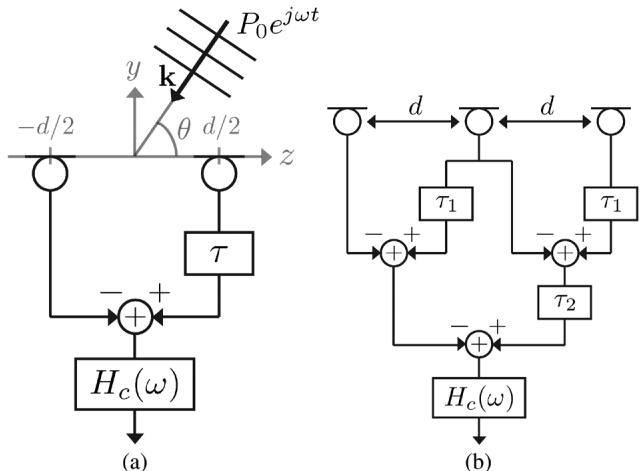  
Fig. 1. Conventional design of differential microphones [6]. (a) First-order differential microphone. (b) Second-order differential microphone obtained by cascading two first-order differential microphones. $H _ { c } ( \omega )$ are correction filters, while  blocks are delays.

$$
x (t, \omega , \theta) = 2 j H _ {c} (\omega) P _ {0} e ^ {j \omega t} e ^ {- j \omega \frac {\tau}{2}} \sin \left(\frac {k d}{2} \cos \theta - \frac {\omega \tau}{2}\right)\tag{8}
$$

By setting and small enough, such that $k d \ll \pi / 2$ and $\omega \tau \ll \pi / 2$ , the expression for the output signal can be well approximated by

$$
x (t, \omega , \theta) \approx j \omega H _ {c} (\omega) P _ {0} e ^ {j \omega t} e ^ {- j \omega \frac {\tau}{2}} \left(\frac {d}{c} \cos \theta - \tau\right).\tag{9}
$$

Selecting the correction filter as $H _ { c } ( \omega ) = [ j \omega ( ( d / c ) - \tau ) ] ^ { - 1 }$ makes the output signal be

$$
x (t, \omega , \theta) = P _ {0} \left[ \frac {- c \tau}{d - c \tau} + \frac {d}{d - c \tau} \cos \theta \right] e ^ {j \omega t} e ^ {- j \omega \frac {\tau}{2}}.\tag{10}
$$

Hence, this differential array acts as a microphone positioned at the origin with the frequency-independent directivity pattern

$$
\Gamma_ {\mathbf {a}} (\theta) = (1 - a _ {1}) + a _ {1} \cos \theta\tag{11}
$$

where $a _ { 1 } = d / ( d - c \tau )$ . A general first-order directivity pattern can be obtained by selecting as

$$
\tau = \frac {a _ {1} - 1}{a _ {1}} \frac {d}{c}.\tag{12}
$$

Notice that the omnidirectional pattern— i.e., $a _ { 1 } \to 0 \to$ —cannot be realized with this structure. In fact, the condition of Taylor expansion $\ll \pi / 2 ,$ or equivalently $( ( a _ { 1 } - 1 ) / a _ { 1 } ) \ll ( \pi / 2 k d )$ is not valid for this degenerate case.

The design approach can be extended to second and higher order microphones by cascading first-order microphones as shown in Fig. 1(b) [6]. The second-order microphone directivity obtained in this way is the product of two first-order directivity patterns and, by defining $\beta _ { 1 } ~ = ~ d / ( d - c \tau _ { 1 } )$ and $\beta _ { 2 } = d / ( d - c \tau _ { 2 } )$ , can be expressed as

$$
\begin{array}{r l} & {\Gamma_ {\mathbf {a}} (\theta) = [ (1 - \beta_ {1}) + \beta_ {1} \cos \theta ] [ (1 - \beta_ {2}) + \beta_ {2} \cos \theta ]} \\ & {\quad = (1 - a _ {1} - a _ {2}) + a _ {1} \cos \theta + a _ {2} \cos^ {2} \theta} \end{array}\tag{13}
$$

where $a _ { 1 } = \beta _ { 1 } + \beta _ { 2 } - 2 \beta _ { 1 } \beta _ { 2 }$ , and $a _ { 2 } = \beta _ { 1 } \beta _ { 2 }$ . A limitation of this design approach is that the values of $a _ { 1 }$ and $a _ { 2 }$ cannot be chosen arbitrarily. In fact, it follows from (13) that the conventional differential array structure can only have directivity patterns described by trigonometric polynomials with real roots, i.e.,

$$
\frac {\beta_ {1} - 1}{\beta_ {1}} = \frac {c \tau_ {1}}{d} \quad \mathrm{and} \quad \frac {\beta_ {2} - 1}{\beta_ {2}} = \frac {c \tau_ {2}}{d}.
$$

Differential-integral microphone arrays, which are based on the Jacobi–Anger expansion, provide an indirect solution to this problem [18]. However this method employs $2 N + 1$ microphones instead of $N + 1$ microphones required for conventional differential arrays, and the operational bandwidth is limited to one octave band. In Section IV, we propose a differential array structure capable of implementing directivity patterns which are not restricted to polynomials with real roots.

## III. GENERALIZED DIRECTIVITY PATTERN DESIGN METHOD

As discussed in Section II-A, directivity patterns optimal according to standard criteria, i.e., maximum front/back ratio and maximum directivity factor, are well known. However, there are applications for which these functions are not adequate, including recording scenarios where the sources of interest are located in an angular sector different from . Furthermore, a more uniform directivity throughout the angular sector of interest would be preferable, such that the sources of interest are recorded at the same level. A cost function whose minima provide directivity patterns which satisfy these two criteria is formulated in this section. It is then shown that the standard directivity patterns are also particular solutions of the same optimization problem.

## A. Optimization Problem Definition

We propose directivity patterns $\Gamma _ { \mathbf { a } } ( \theta )$ as given in (2) with coefficients optimized according to the following criterion:

$$
\tilde {\mathbf {a}} (\alpha , \lambda) = \underset {\mathbf {a}} {\arg \min} \Phi_ {\mathbf {a}} (\alpha , \lambda)\tag{14}
$$

where the cost function is

$$
\Phi_ {\mathbf {a}} (\alpha , \lambda) = \lambda \frac {\int_ {\alpha} ^ {\pi} | \Gamma_ {\mathbf {a}} (\theta) | ^ {2} d \theta}{\int_ {0} ^ {\alpha} | \Gamma_ {\mathbf {a}} (\theta) | ^ {2} d \theta} + (1 - \lambda) \int_ {0} ^ {\alpha} | \Gamma_ {\mathbf {a}} ^ {\prime} (\theta) | ^ {2} d \theta\tag{15}
$$

with $\lambda \in [ 0 , 1 ]$ and $\alpha \in [ 0 , \pi ]$ . This cost function is a convex combination of two terms: 1) the ratio between the directional gains in the frontal sector $\theta \in [ 0 , \alpha ]$ and in the complementary sector $\theta \in [ \alpha , \pi ] ;$ ; and 2) a term related to the smoothness of the directivity function in the sector $\theta \in [ 0 , \alpha ]$

The cost function allows for the explicit control of two parameters which are important in most recording scenarios. The angle can be set to cover the angular region where the sound sources of interest are located, while controls the relative importance of the uniformity of the directivity in the desired region and the suppression of sources outside of it. Thus, the proposed method provides a convenient and intuitive interface to microphone adjustment, in the sense that it directly sets the two immediately relevant physical parameters and $\lambda ,$ rather than adjusting the coefficients without a clear impact on the shape of the directivity.

Other choices of the cost function could have been made. For instance, (15) could be replaced by

$$
\lambda \int_ {\alpha} ^ {\pi} | \Gamma_ {\mathbf {a}} (\theta) | ^ {2} d \theta + (1 - \lambda) \int_ {0} ^ {\alpha} | 1 - \Gamma_ {\mathbf {a}} (\theta) | ^ {2} d \theta\tag{16}
$$

where the two terms reflect the leakage of energy from outside of the region of interest and the uniformity of the directivity pattern in the desired range, respectively. However, we observed that solutions of such an optimization problem usually exhibit undesirable ripples.

## B. Relationship to Standard Directivity Patterns

The standard directivity patterns discussed in previous section are particular solutions to the proposed design criterion.

1) Omnidirectional. When $\lambda = 0$ and $\alpha = \pi$ , the cost function (15) becomes

$$
\Phi_ {\mathbf {a}} (\pi , 0) = \int_ {0} ^ {\pi} | \Gamma_ {\mathbf {a}} ^ {\prime} (\theta) | ^ {2} d \theta\tag{17}
$$

and the solution of the associated minimization problem is trivially the constant function $\Gamma ( \theta ) = 1$

2) Supercardioid. When $\lambda = 1$ and $\alpha = \pi / 2$ , the cost function (15) becomes

$$
\Phi_ {\mathbf {a}} \left(\frac {\pi}{2}, 1\right) = \frac {\int_ {\frac {\pi}{2}} ^ {\pi} | \Gamma_ {\mathbf {a}} (\theta) | ^ {2} d \theta}{\int_ {0} ^ {\frac {\pi}{2}} | \Gamma_ {\mathbf {a}} (\theta) | ^ {2} d \theta}\tag{18}
$$

which is the inverse of the front-back ratio (4) for axisymmetric directivity patterns and under the assumption of a cylindrically isotropic sound field.1 As a consequence, the solution of the associated minimization problem (14) is the supercardioid pattern.

3) Hypercardioid. For $\lambda = 1$ and $\alpha \to 0$ the cost function is equivalent to

$$
\Phi_ {\mathbf {a}} (0, 1) = \int_ {0} ^ {\pi} | \Gamma_ {\mathbf {a}} (\theta) | ^ {2} d \theta .\tag{20}
$$

The solution that minimizes this cost function is the hypercardioid pattern under the assumption of cylindrically isotropic soundfield.1 In fact, since $\Gamma _ { \mathbf { a } } ( 0 ) = 1$ , solving the problem (20) is equivalent to maximizing the directivity factor (3).

4) Subcardioid and cardioid. These directivity patterns were not originally designed to satisfy any specific optimality criterion and are not particular cases of the cost function (15). However, it can be shown that they are very close

1This paper is focused on the case of cylindrically isotropic sound fields. The case of spherically isotropic sound field can be studied by redefining the cos function (15) as

$$
\Phi_ {\mathbf {a}} (\alpha , \lambda) = \lambda \frac {\int_ {\alpha} ^ {\pi} | \Gamma_ {\mathbf {a}} (\theta) | ^ {2} \sin (\theta) d \theta}{\int_ {0} ^ {\alpha} | \Gamma_ {\mathbf {a}} (\theta) | ^ {2} \sin (\theta) d \theta} + (1 - \lambda) \int_ {0} ^ {\alpha} | \Gamma_ {\mathbf {a}} ^ {\prime} (\theta) | ^ {2} \sin (\theta) d \theta .\tag{19}
$$

This case was explored in another paper by the present authors [19] to solutions of the optimization problem for certain $( \alpha , \lambda )$ pairs. In order to measure the distance between a directivity pattern and the space of solutions of the proposed optimization framework, we find the solution $\Gamma _ { \tilde { \mathbf { a } } ( \alpha , \lambda ) }$ to (14) and (15) that minimizes the distance

TABLE II  
STANDARD DIRECTIVITY PATTERNS IN RELATION TO THE PROPOSED DIRECTIVITY OPTIMIZATION FRAMEWORK

<table><tr><td>Pattern</td><td>N</td><td> $\lambda$ </td><td> $\alpha$ </td><td>Error  $\delta$  dB</td></tr><tr><td>Omnidirectional</td><td>0</td><td>0</td><td> $\pi$ </td><td> $-\infty$ </td></tr><tr><td>Subcardioid</td><td>1</td><td>0.5008</td><td>2.247</td><td> $\ll -100$ </td></tr><tr><td>Cardioid</td><td>1</td><td>1.000</td><td>3.1408</td><td> $\ll -100$ </td></tr><tr><td rowspan="4">Cardioid-A</td><td>2</td><td>1.000</td><td>3.131</td><td> $\ll -100$ </td></tr><tr><td>3</td><td>1.000</td><td>2.795</td><td>-92</td></tr><tr><td>4</td><td>1.000</td><td>2.530</td><td>-43</td></tr><tr><td>5</td><td>1.000</td><td>1.944</td><td>-50</td></tr><tr><td rowspan="4">Cardioid-B</td><td>2</td><td>0.02782</td><td>0.2841</td><td>-30</td></tr><tr><td>3</td><td>1.000</td><td>1.177</td><td>-30</td></tr><tr><td>4</td><td>1.000</td><td>1.155</td><td>-33</td></tr><tr><td>5</td><td>0.9974</td><td>0.9801</td><td>-34</td></tr><tr><td>Hypercardioid</td><td>Any</td><td>1</td><td> $\rightarrow 0$ </td><td> $-\infty$ </td></tr><tr><td>Supercardioid</td><td>Any</td><td>1</td><td> $\frac{\pi}{2}$ </td><td> $-\infty$ </td></tr></table>

$$
\delta = \min _ {\alpha , \lambda} \frac {1}{2 \pi} \int_ {0} ^ {2 \pi} \left| \Gamma_ {\tilde {\mathbf {a}} (\alpha , \lambda)} (\theta) - \Gamma (\theta) \right| ^ {2} d \theta .\tag{21}
$$

Table II presents the results obtained using a grid search for subcardioid and first to fifth order cardioid microphones. For the first-order patterns, the approximation error $\Delta = 1 0 \log _ { 1 0 } \delta$ is smaller than 100 dB. The subcardioid is very close to the solution that equally weights the two terms in (15), with an angular region of interest of rad. An interesting observation can be made for the first-order cardioid pattern. In the context of the proposed optimization problem, a solution so close to $( \alpha , \lambda ) = ( \pi , 1 )$ indicates that this pattern is the first-order pattern that best satisfies the objective of rejecting sources at $\theta = \pi$ while keeping a high sensitivity elsewhere.

The cardioid-A patterns show decreasing values of as the order increases, which is in agreement with their increasing directivity factor (see Table I). The approximation errors for the cardioid-A patterns are $\ll - 1 0 0 \mathrm { d B } , - 9 2$ dB, and 43 dB, for second, third, and fourth orders, respectively, indicating that they fit into the proposed optimization framework. The cardioid-B patterns on the other hand have slightly higher approximation errors, mainly due to their two small back-lobes which conflicts with the within/out-of sector component of the cost function. As the order increases, their back-lobe disappears, and the approximation error decreases accordingly. Finally, for orders higher than two, they also show the same characteristic of cardioid-A patterns, i.e., decreasing values of with increasing order.

The results presented so far are summarized for $N = 1 , 2 .$ 3, 4 in Fig. 2. Each point marked in these figures represents an $( \alpha , \lambda )$ pair corresponding to one of standard directivity patterns. The shaded areas in Fig. 2(c) and (d) represent the regions in the $( \alpha , \lambda )$ plane where the optimal solutions are trigonometric polynomials with complex roots. In Section IV we propose a method for constructing such directivity patterns using differential microphones.

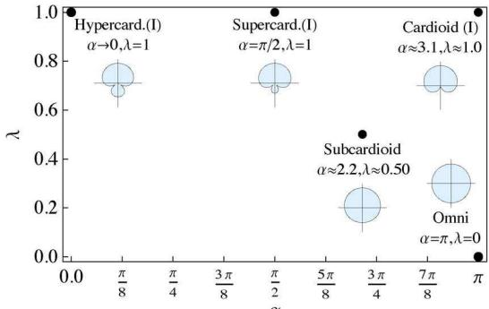  
(a)

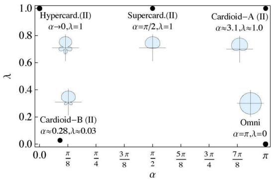  
(b)

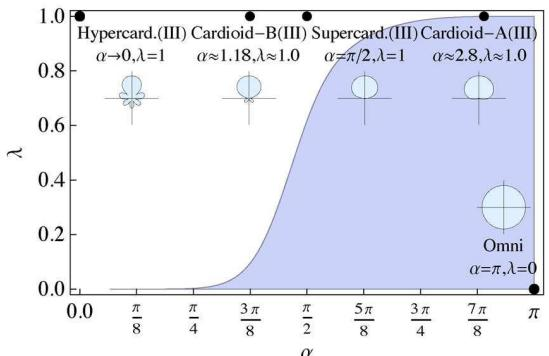

(c)  
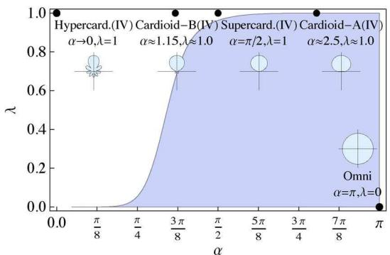  
(d)  
Fig. 2. Overview of the design space with markers on the existing directivity patterns for (a) first-, (b) second-, (c) third-, and (d) fourth-order directivity patterns. The shaded areas represent - - regions for which optimal patters are trigonometric polynomials with complex roots. Note that for $\bar { \lambda }  0 ^ { \bar { + } }$ complex roots are present, as opposed to $\lambda = \bar { 0 }$ where the solution is the omnidirectional pattern.

## C. General Solutions

The optimization framework formulated by (14) and (15) generates a much richer class of solutions than the standard directivity patterns. Fig. 3 illustrates general solutions to the proposed optimization problems for $( \alpha , \lambda )$ pairs taken on a regular grid within the $\alpha \in ( 0 , \pi ) , \lambda \in ( 0 , 1 )$ range.

Many different directivity patterns of practical use can be obtained by means of the proposed design method. For instance, small values of produce directivity patterns similar to hypercardioid, but with a slightly larger frontal beam. These patterns can be used to record more than one musical instrument or speaker from a distance. As a second example, there may be a need to record all sound sources in the frontal plane (e.g., orchestra recording), corresponding to $\alpha = \pi / 2$ . At the top end of this case $( \lambda = 1 , \alpha = \pi / 2$ , see Fig. 2), the supercardioid microphone is the one that maximizes the front-back ratio. However, the supercardioid pattern causes sound sources near $\pi / 2$ to be highly attenuated. This drawback can be alleviated by selecting smaller values of $\lambda ,$ thus trading a smaller front-back ratio with a more uniform directivity pattern in the frontal plane.

The proposed method can also be used for applications where an automatic selection of the directivity pattern is needed. For instance, in a teleconferencing scenario, the directivity pattern can be widened as the estimation of the position of the speaker becomes less accurate. Similarly, the built-in microphone on a video camera can be coupled with the optical lens, so as to provide an “acoustical zoom” that matches the optical zoom [20]. To this end, an operating line between end points $( \alpha , \lambda ) = ( 0 , 1 )$ and $( \alpha , \lambda ) = ( \pi , 0 )$ can be used, where the patterns evolve from highly directional to omnidirectional.

## IV. IMPLEMENTATION WITH DIFFERENTIAL MICROPHONES

A higher order directivity pattern can be implemented as a cascade of first-order differential microphones. Each level of the cascade is associated with one of the roots of the trigonometric polynomial in (2). A general directivity pattern with real coefficients $a _ { 1 } , \ldots , a _ { N }$ can have both real or complex conjugate roots. However, conventional differential microphone techniques implement only patterns described by trigonometric polynomials with real roots. In Fig. 2, the shaded areas in the $( \alpha , \lambda )$ plane correspond to directivity functions which have complex roots, and therefore cannot be implemented using conventional differential microphone structures.

In this section, we propose a differential microphone structure that allows for directivity patterns with complex conjugate roots. The utility of this structure goes beyond directivity functions that minimize the cost function (15); in fact any method that optimizes coefficients in (2) towards a certain criterion can lead to complex roots. For instance, in [11] and [12] the directivity pattern coefficients were optimized so as to approximate the well known time-intensity stereophonic panning curves, and directivity patterns with complex conjugate roots were obtained. Constraining the optimization algorithm to trigonometric polynomials with real roots could bypass the problem. However, this would increase the complexity of the optimization problem, and, more importantly, it would limit the design space, yielding suboptimal solutions.

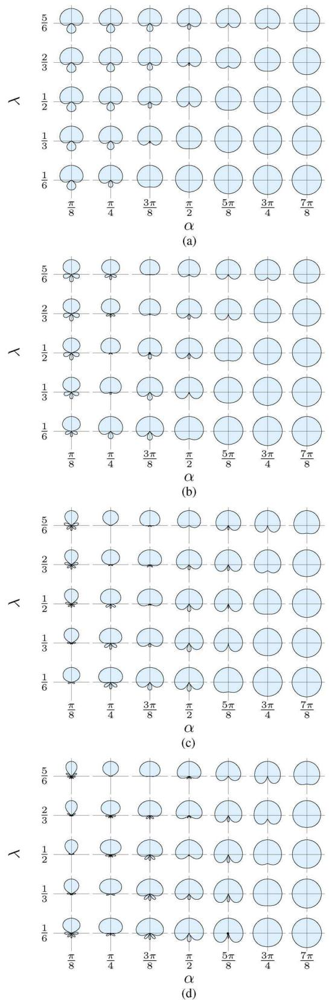  
Fig. 3. Examples of directivity functions, plotted on the dB scale, generated by the design framework for different pairs of - - and for (a) first-, (b) second-, (c) third-, and (d) fourth-order directivity patterns.

## A. Design ofDifferential Microphones With Complex Roots

The method proposed in this paper extends the design of second-order differential microphone arrays to directivity functions with arbitrary real coefficients. The structure in Fig. 4 is proposed for this purpose. It may be observed that this structure is equivalent to the conventional differential array shown in Fig. 1(b) when $2 \tau = \tau _ { 1 } + \tau _ { 2 }$ and the middle branch is replaced by two parallel delay lines with delays of $\tau _ { 1 }$ and $\tau _ { 2 } .$ or equivalently $H _ { 0 } ( \omega ) = e ^ { - j \omega \tau _ { 1 } } + e ^ { - j \omega \tau _ { 2 } }$ . The aim of the proposed method is to achieve general second order directivity patterns by using simple and practical filters $H _ { 0 } ( \omega )$ and $H _ { c } ( \omega )$

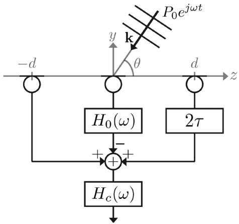  
Fig. 4. Proposed second-order differential microphone array structure.

Consider a monochromatic plane wave $P _ { 0 } e ^ { j \omega t }$ incident from the direction . Sound pressure levels at the positions of the individual microphones are

$$
p (\mathbf {k}, \mathbf {r}, t) | _ {\mathbf {r} = [ 0, 0 ]} = P _ {0} e ^ {j \omega t},\tag{22}
$$

$$
p (\mathbf {k}, \mathbf {r}, t) | _ {\mathbf {r} = [ 0, - d ]} = P _ {0} e ^ {j \omega t} e ^ {- j k d \cos \theta}\tag{23}
$$

$$
p (\mathbf {k}, \mathbf {r}, t) | _ {\mathbf {r} = [ 0, + d ]} = P _ {0} e ^ {j \omega t} e ^ {+ j k d \cos \theta}.\tag{24}
$$

The output of the microphone array is therefore

$$
\begin{array}{r} x (t, \omega , \theta) = P _ {0} e ^ {j \omega t} H _ {c} (\omega) \left(e ^ {- j k d \cos \theta} - H _ {0} (\omega) + e ^ {j (k d \cos \theta - \omega 2 \tau)}\right) \end{array}\tag{25}
$$

which can be expressed as

$$
\begin{array}{r l} & x (t, \omega , \theta) = - P _ {0} e ^ {j \omega (t - \tau)} H _ {c} (\omega) \\ & \qquad \times \left[ H _ {0} (\omega) e ^ {j \omega \tau} - 2 \cos (k d \cos \theta - \omega \tau) \right]. \end{array}\tag{26}
$$

Assuming that $| \omega \tau | \ll \pi / 2$ and $| k d \cos \theta | \ll \pi / 2$ , the output signal can be approximated by a second-order Taylor expansion as

$$
\begin{array}{r} x (t, \omega , \theta) \approx - P _ {0} e ^ {j \omega (t - \tau)} H _ {c} (\omega) \left[ H _ {0} (\omega) e ^ {j \omega \tau} - 2 \right. \\ + \omega^ {2} \tau^ {2} + \omega^ {2} \tau_ {0} ^ {2} \cos^ {2} \theta - 2 \omega^ {2} \tau_ {0} \tau \cos \theta \big ] \end{array}\tag{27}
$$

where $\tau _ { 0 } = d / c$ . The frequency dependence of the microphone directivity can be factored out by selecting

$$
H _ {0} (\omega) = e ^ {- j \omega \tau} (2 - \omega^ {2} \tau^ {2} + \omega^ {2} \kappa)\tag{28}
$$

such that

$$
x (t, \omega , \theta) \approx - P _ {0} e ^ {j \omega (t - \tau)} H _ {c} (\omega) \omega^ {2} \left(\kappa - 2 \tau_ {0} \tau + \tau_ {0} ^ {2}\right) \Gamma_ {\mathbf {a}} (\theta)\tag{29}
$$

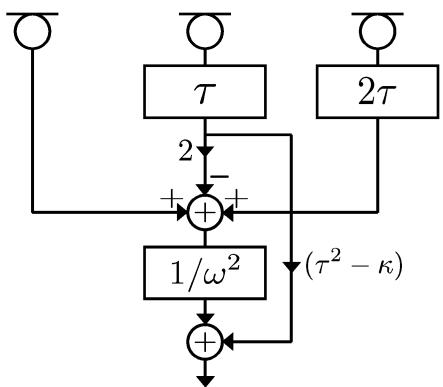  
Fig. 5. Implementation of the proposed second-order differential microphone array structure.

where

$$
\begin{array}{r} \Gamma_ {\mathbf {a}} (\theta) = \frac {\kappa - 2 \tau_ {0} \tau \cos \theta + \tau_ {0} ^ {2} \cos^ {2} \theta}{\kappa - 2 \tau_ {0} \tau + \tau_ {0} ^ {2}} \\ = (1 - a _ {1} - a _ {2}) + a _ {1} \cos \theta + a _ {2} \cos^ {2} \theta \end{array}\tag{30}
$$

(31)

with

$$
\kappa = \frac {(1 - a _ {1} - a _ {2})}{a _ {2}} \tau_ {0} ^ {2} \quad \mathrm{and} \quad \tau = - \frac {a _ {1}}{a _ {2}} \frac {\tau_ {0}}{2}.\tag{32}
$$

Therefore, as long as the conditions required by the Taylor series expansion are satisfied, any second-order microphone directivity can be obtained by this structure. Notice that first-order directivity patterns—i.e., —cannot be realized by this second-order structure. In fact, the condition $| \omega \tau | \ll \pi / 2$ , or equivalently $| a _ { 1 } / a _ { 2 } | \ll \pi / ( k d )$ , is not valid for this degenerate case, and a first-order structure should be used instead. The same considerations hold for th-order conventional differential microphones, which cannot realize directivity patterns of order lower than . It is therefore assumed in the following that the th order coefficient is not negligible.

The correction filter should be designed as $H _ { c } ( \omega ) = 1 / \omega ^ { 2 }$ in order to equalize for the frequency dependence of the microphone response.

## B. Implementation

The delay filters of the proposed structure can be implemented by means of maximally flat allpass fractional delay filters [21]. From (32) it follows that when $a _ { 1 }$ and $a _ { 2 }$ have the same sign, the delay will be negative, and therefore the filters will not be causal. In that case a common delay should be added to all three channels.

The central filter $H _ { 0 } ( \omega )$ as given in (28) has a component proportional to $\scriptstyle \omega ^ { 2 }$ , which is then further processed by the correction filter $H _ { c } ( \omega ) = 1 / \omega ^ { 2 }$ . This structure is therefore redundant, and the only component of the central filter $H _ { 0 } ( \omega )$ that actually has to be implemented is the fractional delay part. Hence, the differential array can be implemented using the structure shown in Fig. 5, which employs the same type of filters and has the same complexity as the conventional design shown in Fig. 1(b).

Finally, the correction filter $H _ { c } ( \omega )$ is a standard double integrator.

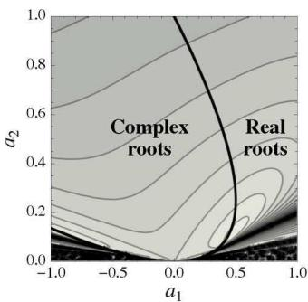  
(a)

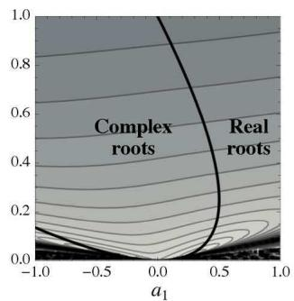  
(b)

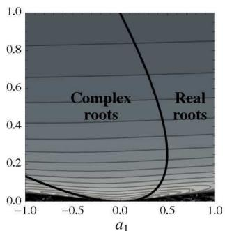  
(c)

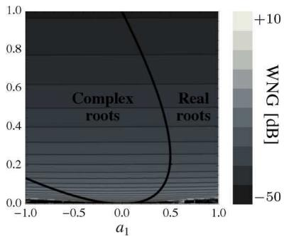  
(d)  
Fig. 6. White noise gain (in dB) of the second-order differential microphone structures for (a) $k d = 1 , ( \mathbf { b } ) k d = 0 . 5$ , (c) $k d = 0 . 2 5$ , and (d) $k d = 0 . 1$ . WNG of the differential structure proposed in the paper is plotted in the region denoted as “complex roots.” WNG of the conventional second-order structure is plotted in the region denoted as “real roots.”

## C. White Noise Gain

The derivation of the array directivity in the previous subsection was relying on the assumptions that microphones are point-like, omnidirectional, noise-free, and positioned accurately, which is not strictly satisfied in practice. It is therefore of interest to assess the robustness of the array to such imperfections. A quantity widely used for this purpose is the white noise gain (WNG), which is defined as the improvement in signal-to-noise ratio (SNR) of the array output compared to the SNR of individual microphones for white Gaussian noise [22], [23]. The WNG in the look direction of the second-order differential structure proposed in Section IV-A can be shown to be

$$
\mathrm{WNG} _ {c} (k d, a _ {1}, a _ {2}) = \frac {\left| 1 - \frac {\xi^ {2}}{2} - \cos \sqrt {\xi^ {2} + \frac {(k d) ^ {2}}{a _ {2}}} \right| ^ {2}}{\frac {1}{2} + \left(1 - \frac {\xi^ {2}}{2}\right) ^ {2}}\tag{33}
$$

where $\xi = k d ( \sqrt { a _ { 1 } ^ { 2 } - 4 a _ { 2 } ( 1 - a 1 - a 2 ) } / 2 a _ { 2 } )$ . Observe that WNG is not a bivariate function of and , but a univariate function of their product . The WNG of the conventional second-order structure described in Section II-B has a similar form, which can be shown to be

$$
\mathrm{WNG} _ {r} (k d, a _ {1}, a _ {2}) = \frac {\left| \cos \xi - \cos \sqrt {\xi^ {2} + \frac {(k d) ^ {2}}{a _ {2}}} \right| ^ {2}}{\frac {1}{2} + \cos^ {2} \xi}.\tag{34}
$$

The WNG of the two structures is shown in Fig. 6 as a function of $a _ { 1 } \in ( - 1 , 1 )$ and $a _ { 2 } \in ( 0 , 1 )$ , for four values of $k d = 1$ $0 . 5 , 0 . 2 5 , 0 . 1$ . The $( a _ { 1 } , a _ { 2 } )$ plane is divided into two regions which correspond to values of $a _ { 1 }$ and $a _ { 2 }$ for which the trigonometric polynomial has complex and real roots, respectively. The curve representing the case with coincident roots, i.e., $a _ { 1 } ^ { 2 } -$ $4 a _ { 2 } ( 1 - a 1 - a 2 ) = 0 \quad$ , separates the two regions. The WNG of the new structure given in (33) and WNG of the conventional differential microphone structure given in (34) are plotted for the regions of the plane where complex and real roots occur, respectively. It can be observed that the two structures have very similar WNGs in their respective areas of applicability. The WNG shows a high variation in the area where $| a _ { 1 } / a _ { 2 } | \geq$ $\pi / ( k d )$ , which is the region where the Taylor series approximation is not sufficiently accurate.

As decreases, WNG of both structures decrease in agreement with the well known fact that differential microphones are sensitive to noise, particularly at low frequencies and for small inter-element distances, when signals captured by individual microphones are very similar. At $k d = 0 . 1$ , both the conventional and the proposed differential structures are nearly unusable, unless omnidirectional microphones with very low internal noise are available. The lower bound of the operational bandwidth of differential microphones is therefore set by acceptable noise sensitivity. It can be concluded that at low frequencies, a desired directivity pattern can be maintained at the cost of increased noise sensitivity; which is a problem in a wider microphone design context including also phase-mode spherical beamforming techniques [8] such as the Eigenmike [9].

The robustness of differential microphones and their operational bandwidth can be increased by combining differential arrays with different inter-element distances [6], each designed to achieve the same directivity pattern but covering different frequency bands. A similar approach was also suggested for phase-mode spherical beamformers [10]. The idea is based on the fact that WNG is a function of the product , therefore an array with a given inter-element distance and working at a given frequency has the same WNG of an array with a larger inter-element distance working at a correspondingly lower frequency. We illustrate this method by a design example and accompanying measurements in the next section.

Alternatively, the robustness can be achieved by more sophisticated constrained optimization in the space of free design parameters, by imposing an explicit constraint on WNG, as explored by others [24]–[26]. These methods involve frequency dependent optimization and achieve a compromise between the requirement for frequency independent directivity and acceptable WNG. Some of these ideas could potentially be combined with the design framework proposed in Section III by incorporating a constraint on WNG and running the same algorithm for different frequency bins. In this way, a frequency dependent vector of coefficients would be obtained. This directivity pattern might then be realized by means of $K$ parallel differential microphones processing the same pressure microphone signals, at the expense of increased computational load. Details of such an approach go beyond the scope of the present paper.

TABLE III  
OPERATIONAL BANDWIDTH OF SECOND-ORDER DIFFERENTIAL MICROPHONESWITH DIFFERENT CONFIGURATIONS FOR $\gamma = 0 . 2 5$

<table><tr><td>M</td><td> $d_1$  [cm]</td><td> $d_{i+1}$ </td><td>P</td><td> $f_{\min}$  [Hz]</td><td> $f_{\max}$  [Hz]</td></tr><tr><td>1</td><td>5.08</td><td>-</td><td>3</td><td>268</td><td>1688</td></tr><tr><td>1</td><td>2.54</td><td>-</td><td>3</td><td>537</td><td>3376</td></tr><tr><td>1</td><td>1.27</td><td>-</td><td>3</td><td>1074</td><td>6752</td></tr><tr><td>2</td><td>2.54</td><td> $2d_i$ </td><td>4</td><td>268</td><td>3376</td></tr><tr><td>2</td><td>1.27</td><td> $2d_i$ </td><td>4</td><td>537</td><td>6752</td></tr><tr><td>3</td><td>1.27</td><td> $2d_i$ </td><td>5</td><td>268</td><td>6752</td></tr><tr><td>2</td><td>1.27</td><td> $d_i \frac{\pi}{2\gamma}$ </td><td>5</td><td>171</td><td>6752</td></tr><tr><td>2</td><td>0.8</td><td> $d_i \frac{\pi}{2\gamma}$ </td><td>5</td><td>271</td><td>10718</td></tr></table>

## D. Operational Bandwidth

The operational bandwidth of a differential microphone has an upper limit determined by the Taylor approximation condition $\ll \pi / 2$ . This is a restriction for both the conventional structure and the structure proposed in this paper. We observed however that in this context the approximation gives acceptable results even for close to $\pi / 2 ,$ and hence that the practical upper bound is set by the requirement that $k d \leq \pi / 2$ . The lower limit depends on the minimum admissible $\mathrm { W N G }$ . In particular, a microphone array is operational for frequencies $f$ such that $f \geq ( \gamma c / 2 \pi d )$ , where $\gamma$ is the lowest value of for which the noise sensitivity is acceptable. Hence, the boundaries of the operational bandwidth are given by

$$
f _ {\mathrm{min}} \triangleq \frac {\gamma c}{2 \pi d} \quad \mathrm{and} \quad f _ {\mathrm{max}} \triangleq \frac {c}{4 d}.\tag{35}
$$

For instance, as shown in Fig. 6(c), $k d = 0 . 2 5$ yields WNG values of at least dB. In particular, the WNG for the second-order hypercardioid pattern is 29.9 dB, for cardioid-B it is 25.9 dB, for cardioid-A it is 20 dB, and for supercardioid it is 24.3 dB. The bandwidths obtained according to (35) with $\gamma = 0 . 2 5$ are shown in Table III (the rows corresponding to $M = 1 )$ for different inter-element distances. The operational bandwidth for these cases is always wider than two and a half octaves. The method proposed in [18] also yields general second-order directivity patterns with linear arrays; however, the bandwidth is limited to one octave, and it requires five omnidirectional elements, as opposed to the three microphones required by the proposed structure. It follows from (35) that the structure proposed here achieves operational bandwidth wider than one octave-band as long as $\gamma < ( \pi / 4 ) \approx 0 . 8 $

The operational bandwidth can be further extended by using differential microphone structures with different inter-element distances and combining their outputs by means of complementary crossover filters. The number of omnidirectional microphones needed by the overall microphone array is therefore $P = M ( N + 1 )$ . This number can be reduced if some of the individual microphones are used by more than one array. The arrays can be aligned so that they share at least one microphone. Further savings can be achieved if inter-element distances in one array are integer multiples of the distances in another. For example, if the inter-element distance of the first sub-array is $d _ { 1 }$ and inter-element distances of the other sub-arrays are set as $d _ { i + 1 } = 2 d _ { i }$ , most of the microphones will be shared between different sub-arrays. As shown in Table III, a second-order pattern with a wider operational bandwidth can be realized in this way at the cost of adding only one microphone. A disadvantage of setting $d _ { i + 1 } = 2 d _ { i }$ is that the operational bandwidths of the sub-arrays will have substantial overlaps, thus decreasing the overall operational bandwidth. In order to avoid this, the lower bound of one sub-array can be imposed to coincide with the upper bound of the next sub-array, that is, $( \gamma c / 2 \pi d _ { i } ) = c / 4 d _ { i + 1 }$ . In this case, only one microphone will be shared, and then $P = M N + 1$ . However, even if $M = 2 .$ , a nearly broadband second-order microphone can be implemented with $P = 5$ elements, as shown in Table III.

Other techniques have been suggested to increase the output SNR of differential microphones, including baffling individual microphones [27] and averaging the outputs of two or more closely positioned identical arrays [6].

## V. DESIGN EXAMPLE

In this section, we present an example of a third-order microphone directivity designed according to the optimization criterion in (14), (15) and implemented using the proposed differential structure.

The optimization specified by (14), (15) can be performed using any nonlinear optimization algorithm and the corresponding software. The examples presented in this paper are obtained using the Mathematica function NMinimize, which is based on the Nelder-Mead algorithm [28]. This software always converged to a solution within 0.1 s, even for the fourth-order cases (Mac OS X, 2.53-GHz Intel Core 2 Duo, 4-GB DDR3). This execution time allows for application in scenarios where real-time adaptation is required. A Mathematica notebook that for a given pair of and $\lambda$ provides optimal coefficients $a _ { 1 } , \dots , a _ { N }$ is available at [29]. The software also provides an aid for selecting to achieve either a certain attenuation at a given angle, a certain front-back ratio, or a directivity index.

Fig. 7 shows the optimal third order directivity pattern obtained for $\lambda = 0 . 5$ and $\alpha = \pi / 2$ . This directivity function combines a good front-back ratio with a uniform response in the frontal lobe. A microphone having this directivity pattern could be desirable, for instance, as a front-stage microphone. Sources at $\pi / 2$ are attenuated by approximately 3 dB, and the front-back ratio is 8.13 dB. It can be observed from Fig. 2 that this $( \alpha , \lambda ) ~ = ~ ( ( \pi / 2 ) , ( 1 / 2 ) )$ pair lies in the zone where the trigonometric polynomial has complex roots. Hence, this pattern requires a combination of conventional blocks as described in Section II—referred to in the following as real blocks—and blocks designed as per Section IV—referred to as complex blocks. A cascade of either two complex blocks and one real block or three real blocks and one complex block can be used to achieve a third-order directivity pattern. In this example, the former is used. This structure is shown in Fig. 8. The directivity pattern has coefficients $\mathbf { a } = [ 0 . 7 1 6 4 , 0 . 4 8 4 1 , - 0 . 3 0 9 6 , 0 . 1 0 9 1 ]$ , which corresponds to roots at approximately $\theta = 1 . 8 5 \pm 2 . 0 5 j$ and COS $\theta = - 0 . 8 6$ . The parameters of the array are obtained using (12) and (32), which give $\kappa \approx 1 . 0 4 \cdot 1 0 ^ { - 8 } , \tau _ { 1 } \approx 6 . 8 5 \cdot 1 0 ^ { - 5 } \mathrm { s } .$ $\tau _ { 2 } \approx - 3 . 1 9 \cdot 1 0 ^ { - 5 } \mathrm { s } .$

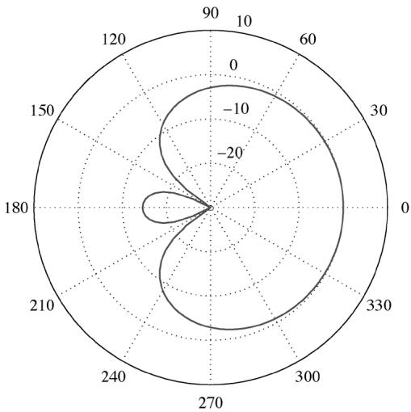

Fig. 7. Third-order directivity pattern obtained for $\lambda = 0 . 5$ and $\alpha = \pi / 2$  
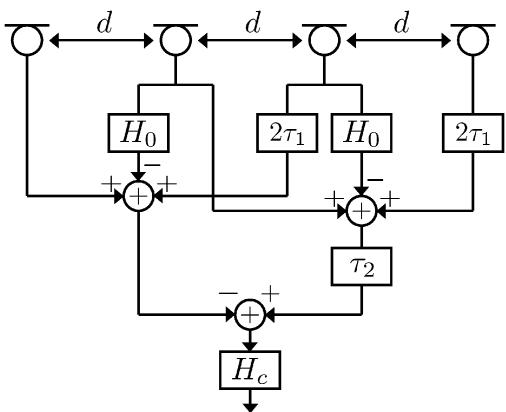  
Fig. 8. Structure implementing a third-order directivity pattern with a pair of complex conjugate roots. The complex structure implemented in the examples of this section is the one presented in Section IV-B. However, the equivalent structure in Fig. 4 is depicted in this figure for the sake of clarity.

In simulations and measurements reported below, the delay elements of both the complex and real blocks are implemented as maximally flat allpass fractional delay filters [21]. The correction filter of the real block is implemented using an Al-Alaoui integrator [30]. For the complex structure, a cascade of two Simpson integrators [31] is used instead, which has a phase response equal to almost everywhere on the unit circle. This choice simplifies the compensation of its phase response in the bypass branch of the structure presented in Section IV-B. In fact, it is sufficient to modify the amplifier gain as $- ( \tau ^ { 2 } - \kappa )$ . The phase response of the integrators can be improved further by including fractional delay filters as proposed in [31]. The integrators are preceded by high-pass filters with a cutoff frequency of 50 Hz in order to avoid stability issues at low frequencies.

## A. Simulations

In order to analyze the impact of noise on the performance of the described third-order differential microphone, the array response is simulated for the look direction, $\theta = 0$ . Two cases were investigated to evaluate microphone response and WNG performance.

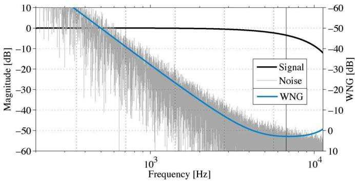  
(a)

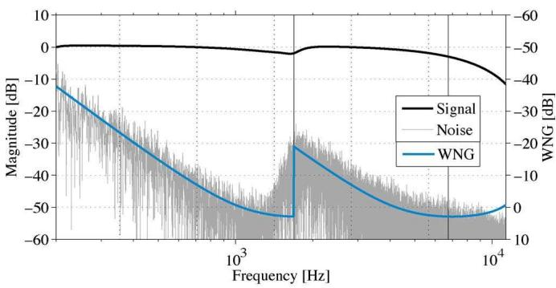  
(b)  
Fig. 9. Simulation of signal and noise energy, and the theoretical WNG for the third-order differential microphone for the directivity function $\Gamma _ { \tilde { \mathbf { a } } ( 0 . 5 , \pi / 2 ) }$ Note the different scale of the WNG axis on the right. The input SNR in this simulation is set to 50 dB; therefore, the axis of WNG at 0 dB is aligned with the signal magnitude axis at 50 dB. The dotted vertical lines mark the boundaries between octave bands. (a) Single differential array with an inter-element distance $d _ { 1 } = 1 . 2 7$ cm. The vertical solid line marks the upper bound of its operational bandwidth $f _ { \mathrm { m a x } } = 6 7 5 2$ Hz. (b) Combination of two differential arrays with inter-element distances $d _ { 1 } = 1 . 2 7$ cm and $d _ { 2 } = 4 d _ { 1 } = 5 . 0 8$ cm The left and right vertical solid lines mark the upper bound for the low-frequency array $f _ { \mathrm { m a x } } = 1 6 8 8$ Hz and for the high-frequency array $f _ { \mathrm { m a x } } = 6 7 5 2 \ : \mathrm { H z }$

In the first case, a single differential array is evaluated. For this, an inter-element distance of $d _ { 1 } = 1 . 2 7$ cm (0.5 inches) is used. The microphone response, noise, and WNG are shown in Fig. 9(a). The SNR at the individual microphones was set to 50 dB, and the sampling frequency was 96 KHz. It may be observed from the figure that for frequencies above $f _ { \mathrm { m a x } } =$ $( c / 4 d ) = 6 7 5 2$ Hz the signal energy drops significantly. This is due to the fact that Taylor series approximation is no longer accurate in this range. Moreover, output noise increases at lower frequencies, following the inverse of the theoretical WNG. Assuming that a WNG of 20 dB is considered acceptable, this structure has an operational bandwidth 2 octaves wide.

In the second case, the operational bandwidth is extended by using two differential structures with different inter-element distances as discussed in Section IV-D. Fig. 9(b) shows the microphone response, output noise, and WNG when outputs of two structures, one with $d _ { 1 } ~ = ~ 1 . 2 7$ cm and the other with $d _ { 2 } = 4 \cdot d _ { 1 } = 5 . 0 8$ cm, are combined. The outputs of the two interleaved structures are mixed by using a crossover filter pair having a transition frequency of $c / 4 d _ { 2 } = 1 6 8 8 \mathrm { H z , i . e . }$ ., the upper limit of the low frequency differential microphone structure. The total number of microphones in this case is $P = 7$ Assuming that $\mathrm { W N G } > - 2 0$ dB is acceptable, the operational bandwidth covers about 4 octaves. This arrangement is further investigated in the next section and the results of real measure ments are presented.

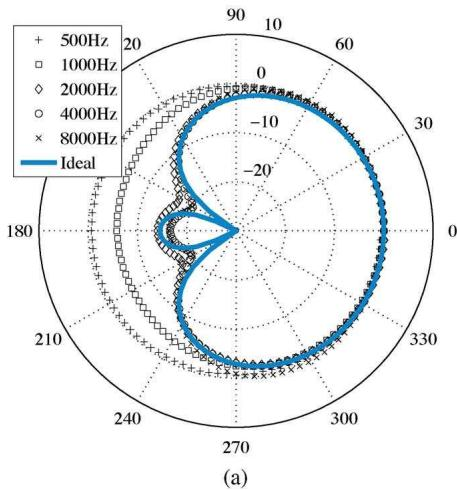

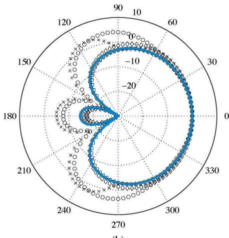

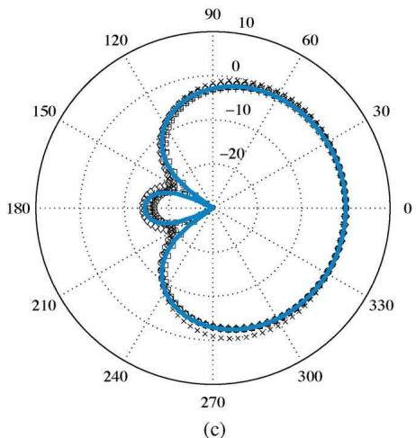  
Fig. 10. Ideal and measured directivity patterns of the differential microphone for the third-order directivity pattern $\Gamma _ { \tilde { \mathbf { a } } ( \pi / 2 , 0 . 5 ) }$ . In (a) the measured directivity of a differential array with inter-element distance $d _ { 1 } = 1 . 2 7$ cm is shown, whereas in (b) the same plots are shown for an array with $d _ { 2 } = 4 d _ { 1 } = 5 . 0 7$ cm. Finally, (c) shows the response of the result of merging the structures in (a) and (b) via crossover filters.

## B. Measurements

We now present directivity pattern measurements for the dif ferential array built according to the design and implementation described in the previous subsection. The proposed structure was built using low-cost AKG C 417 omnidirectional micro phones positioned through the holes of a Meccano metal strip. The diameter of the microphones is 7.5 mm and their equivalent noise level is 34 dBA [32]. The microphones were connected to an audio workstation via a MOTU 896HD audio interface, which was also driving a Mackie HR824 loudspeaker used in the measurements. The sampling frequency was 96 kHz, and the input SNR was approximately 50 dB with the microphone operating at no-load condition [33]. The measurements were carried out in an acoustic isolation booth of size $4 . 5 6 \ : \mathrm { m } \times 6 . 5 2$ m × m. Mismatches in frequency responses of individual microphones may adversely affect the overall response. Therefore, the microphones were equalized using the substitution method [33]. One of the microphones was assigned as the reference and eighth-order IIR filters were designed to equalize all responses to that of the reference.

The array was mounted on a stepper motor and placed at a height of 1.1 m and at a distance of 1 m from the loudspeaker, which was at the same height. Exponential sine sweep method [34] was used to obtain impulse responses of microphone elements. The duration of each sweep was 1.5 s. A total of 100 measurements were made with angular steps of 3.6 degrees. In order to obtain the responses of microphones without the effect of the room, the first 300 reflection-free samples of the impulse response were extracted. This allowed for estimation of the signal down to 320 Hz, or, equivalently, to the entire octave band centered at 500 Hz. The individual impulse responses were then equalized, as noted in the above, and then combined to obtain the overall response of the differential array. The output impulse response was then fed into an octave band filter bank to obtain the directivity in frequency bands of interest [33].

For better visualization, in all plots that follow the directivity patterns at each octave band are normalized to 0 dB in the look direction. This is equivalent to equalizing for the combined response of the loudspeaker and the reference microphone at that octave band. The directivity pattern of the differential array with $d _ { 1 } = 1 . 2 7$ cm is shown in Fig. 10(a). It may be observed that the responses for the upper three octave bands are very close to the ideal directivity pattern. Notice that the distortion observed for the octave band centered at 8 kHz is negligible, although $f _ { \mathrm { m a x } } = c / 4 d _ { 1 } = 6 7 5 2$ Hz. At low frequencies, self-noise of the microphones, which has an omnidirectional characteristic, is the dominant component—cfr. Fig. 9(a). In Fig. 10(b), the polar pattern of the differential array with $d _ { 2 } = 5 . 0 8$ cm is shown. In this case, a good match is observed at low frequencies. At high frequencies Taylor series approximation is no longer valid, which causes significant deviation from the desired directivity pattern. By mixing the outputs of the two arrays via a crossover filter pair with a transition frequency at $c / 4 d _ { 2 } = 1 6 8 8$ Hz, the directivity pattern shown in Fig. 10(c) is obtained. This combined array thus implements the desired directivity function over 5 octaves.

## VI. CONCLUSION

This paper was concerned with the design and implementation of differential microphones. A new systematic framework for designing microphone directivity functions was proposed. The proposed design framework provides a simple interface that reduces the design space of higher order microphones to two physically relevant parameters. Given the width of a sector of interest, this interface produces the actual coefficients of the microphone directivity pattern by minimizing a convex combination of a within/out-of sector energy ratio and a measure of the uniformity of the pattern within the sector. It was found that most of the existing directivity design cases such as omnidirectional, cardioid, subcardioid, hypercardioid, and supercardioid are particular solutions of this optimization problem. The proposed framework, however, provides a much broader class of practically relevant directivity patterns. This was illustrated through various examples.

It was further found that many optimal patterns are in fact trigonometric polynomials with complex roots, which cannot be implemented using conventional differential microphone constructions. To overcome this limitation, a new second-order differential microphone array structure capable of implementing directivity functions described by trigonometric polynomials with complex conjugate roots was then proposed. It was then shown that the proposed structure and the conventional one have comparable noise sensitivity and implementation complexity. An analysis of the white noise gain and operational bandwidth of differential microphones was presented, along with guidelines for increasing the bandwidth by means of multiple differential arrays with different inter-element distances.

The effectiveness of the proposed design framework and the generalized differential microphone array structure was demonstrated by design examples and simulations. Finally, directivity pattern measurements were presented for an actual array built according to the techniques proposed in the paper.

It should be noted that the utility of the presented directivity design framework is not limited to differential arrays. In fact, it can be used with any microphone that implements directivity patterns described by a trigonometric polynomial, or—equivalently—by a weighted sum of zero degree spherical harmonics. These include but are not limited to differential-integral microphone arrays [18] and the Eigenmike [9]. Similarly, the utility of the proposed differential microphone array structure also goes beyond the implementation of designs obtained using the proposed optimization framework.

## ACKNOWLEDGMENT

The authors would like to thank Professor A. Farina for his help and support.

## REFERENCES

[1] J. Eargle, The Microphone Book. Waltham, MA: Focal Press, 2004.

[2] R. Streicher and W. Dooley, “The bidirectional microphone: A forgotten patriarch,” J. Audio Eng. Soc., vol. 51, no. 3, pp. 211–225, Mar. 2003.

[3] P. Craven and M. Gerzon, “Coincident Microphone Simulation Covering Three Dimensional Space and Yielding Various Directional Outputs,” U.S. Patent 4,042,779, Aug. 16, 1977.

[4] G. M. Sessler and J. E. West, “Directional transducers,” IEEE Trans. Audio Electroacoust., vol. AU-19, no. 1, pp. 19–23, Mar. 1971.

[5] G. W. Elko, “Microphone array systems for hands-free telecommunication,” Speech Commun., vol. 20, no. 3–4, pp. 229–240, Dec. 1996.

[6] G. W. Elko, “Differential microphone arrays,” in Audio Signal Processing for Next-Generation Multimedia Communication Systems, Y. Huang and J. Benesty, Eds. Norwell, MA: Kluwer, 2004.

[7] M. Kolundzija, C. Faller, and M. Vetterli, “Spatiotemporal gradient analysis of differential microphone arrays,” J. Audio Eng. Soc, vol. 59, no. 1/2, pp. 20–28, Feb. 2011.

[8] B. Rafaely, “Phase-mode versus delay-and-sum spherical microphone array processing,” IEEE Signal Process. Lett., vol. 12, no. 10, pp. 713–716, Oct. 2005.

[9] J. Meyer and G. W. Elko, “A highly scalable spherical microphone array based on an orthonormal decomposition of the soundfield,” in Proc. IEEE Int. Conf. Acoust. Speech, Signal Process. (ICASSP-93), Minneapolis, MN, Apr. 1993, vol. 2, pp. 1781–1784.

[10] T. D. Abhayapala and D. B. Ward, “Theory and design of high order sound field microphones using spherical microphone array,” in Proc. IEEE Int. Conf. Acoust. Speech, Signal Process. (ICASSP-93), Minneapolis, MN, Apr. 1993, vol. 2, pp. 1949–1952.

[11] H. Hacihabiboglu, E. De Sena, and Z. Cvetkovic˘ ´, “Design of a circular microphone array for panoramic audio recording and reproduction: Microphone directivity,” presented at the 128th Audio Eng. Soc. Conv., Preprint #8063, London, U.K., May 2010.

[12] H. Hacihabiboglu, E. De Sena, and Z. Cvetkovic˘ ´, “Microphone Array,” U.S. Patent Application, U.S. Application No. 12/905,415, Oct. 15, 2010.

[13] L. Beranek, Acoustics. Melville, NY: Acoustical Society of America, 1993.

[14] A. Parsons, “Maximum directivity proof for three-dimensional arrays,” J. Acoust. Soc. Amer., vol. 82, pp. 179–182, Jul. 1987.

[15] R. Marshall and W. Harry, “A new microphone providing uniform directivity over an extended frequency range,” J. Acoust. Soc. Amer., vol. 12, pp. 481–498, Feb. 1941.

[16] V. Hamacher, J. Chalupper, J. Eggers, E. Fischer, U. Kornagel, H. Puder, and U. Rass, “Signal processing in high-end hearing aids: State of the art, challenges, and future trends,” EURASIP J. Appl. Signal Process., vol. 18, pp. 2915–2929, Sep. 2005.

[17] W. Kellermann, “Towards natural acoustic interfaces for automatic speech recognition,” in Proc. 13th Int. Conf. Speech Comput., St Petersburg, Russia, Jun. 2009.

[18] T. D. Abhayapala and A. Gupta, “Higher order differential-integral microphone arrays,” J. Acoust. Soc. Amer., vol. 127, no. 5, pp. EL227–EL233, Apr. 2010.

[19] E. De Sena, H. Hacihabiboglu, and Z. Cvetkovic˘ ´, “A generalized design method for directivity patterns of spherical microphone arrays,” in Proc. 2011 IEEE Int. Conf. Acoust. Speech, Signal Process. (ICASSP-11), Prague, Czech Republic, May 2011, pp. 125–128.

[20] M. Matsumoto, H. Naono, H. Saitoh, K. Fujimura, and Y. Yasuno, “Stereo zoom microphone for consumer video cameras,” IEEE Trans. Consum. Electron., vol. 35, no. 4, pp. 759–766, Nov. 1989.

[21] T. I. Laakso, V. Välimäki, M. Karjalainen, and U. K. Laine, “Splitting the unit delay,” IEEE Signal Process. Mag., vol. 13, no. 1, pp. 30–60, Jan. 1996.

[22] H. Cox, R. Zeskind, and M. Owen, “Robust adaptive beamforming,” IEEE Trans. Acoust. Speech, Signal Process., vol. ASSP-35, no. 10, pp. 1365–1376, Oct. 1987.

[23] M. Brandstein and D. Ward, Microphone Arrays: Signal Processing Techniques and Applications. New York: Springer-Verlag, 2001.

[24] E. Mabande, A. Schad, and K. Kellermann, “Design of robust superdirective beamformers as a convex optimization problem,” in Proc. IEEE Int. Conf. Acoust. Speech, Signal Process. (ICASSP-09), Taipei, Taiwan, Apr. 2009, pp. 77–80.

[25] H. Sun, S. Yan, and P. Svensson, “Robust spherical microphone array beamforming with multi-beam-multi-null steering, and sidelobe control,” in Proc. IEEE Workshop Appl. Signal Process. Audio Acoust. (WASPAA’09), New Paltz, NY, Oct. 2009, pp. 113–116.

[26] S. Doclo and M. Moonen, “Design of broadband beamformers robust against gain and phase errors in the microphone array characteristics,” IEEE Trans. Signal Process., vol. 51, no. 10, pp. 2511–2526, Oct. 2003.

[27] J. E. West, G. M. Sessler, and R. A. Kubli, “Unidirectional, secondorder gradient microphone,” J. Acoust. Soc. Amer., vol. 82, no. S1, pp. S39–S39, Dec. 1987.

[28] J. Nelder and R. Mead, “A simplex method for function minimization,” Comput. J., vol. 7, no. 4, pp. 308–313, Jan. 1965.

[29] [Online]. Available: http://www.enzo.desena.name/didim

[30] M. A. Al-Alaoui, “Novel digital integrator and differentiator,” Electron. Lett., vol. 29, no. 4, pp. 376–378, Feb. 1993.

[31] M. A. Al-Alaoui, “Using fractional delay to control the magnitudes and phases of integrators and differentiators,” IET Signal Process., vol. 1, no. 2, pp. 107–119, Jun. 2007.

[32] AKG Acoustics GmbH, AKG C 417 Microphone Specifications, [Online]. Available: http://www.akg.com

[33] IEC 60268-4 Sound System Equipment—Part 4: Microphones 2004.

[34] A. Farina, “Simultaneous measurement of impulse response and distortion with a swept-sine technique,” presented at the 108th Audio Eng. Soc. Conv., Preprint #50930, Paris, France, Feb. 2000.

  
Enzo De Sena (S’11) was born in Napoli, Italy, in 1984. He received the B.Sc. degree and M.Sc. degree (cum laude in telecommunications engineering from the Università degli Studi di Napoli “Federico II,” Napoli, Italy, in 2007 and 2009, respectively. He is currently pursuing the Ph.D. degree in electronic engineering at King’s College London, London, U.K.

His research interests include multichannel audio systems, psychoacoustics of spatial hearing, room acoustics simulation, and microphone array processing.

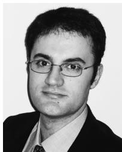

Hüseyin Hacihabiboglu˘ (S’96–M’00) received the B.Sc. (honors) degree from the Middle East Technical University (METU), Ankara, Turkey, in 2000, the M.Sc. degree from the University of Bristol, Bristol, U.K., in 2001, both in electrical and electronic engineering, and the Ph.D. degree in computer science from Queen’s University Belfast, Belfast, U.K., in 2004.

He held research positions at University of Surrey, Guildford, U.K. (2004–2008) and King’s College London, London, U.K. (2008–2011). Currently, he

Zoran Cvetkovic´ (SM’04) received the Dipl.Ing.El. and Mag.El. degrees from the University of Belgrade, Belgrade, Yugoslavia, in 1989 and 1992, respectively, the M.Phil. degree from Columbia University, New York, in 1993, and the Ph.D. degree in electrical engineering from the University of California, Berkeley, in 1995.

is a Lecturer at the Informatics Institute, Middle East Technical University, Ankara, Turkey. His research interests include audio signal processing, room acoustics modeling and simulation, multichannel audio systems, psychoacous tics of spatial hearing, game audio, and microphone arrays.

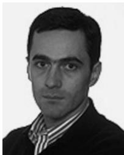

He held research positions at EPFL, Lausanne, Switzerland (1996), and at Harvard University, Cambridge, MA (2002–2004). From 1997 to 2002, he was a Member of Technical Staff at AT&T Shannon

Dr. Hacihabiboglu is a member of the IEEE Signal Processing Society, Audio˘ Engineering Society (AES), Turkish Acoustics Society (TAD), and the European Acoustics Association (EAA).

Laboratory. He is now a Reader in Signal Processing at King’s College London, London, U.K. His research interests are in the broad area of signal processing, ranging from theoretical aspects of signal analysis to applications in source coding, telecommunications, and audio and speech technology.