Research Article

# High-Selectivity Filter Banks for Spectral Analysis of Music Signals

Filipe C. C. B. Diniz, Iuri Kothe, Sergio L. Netto, and Luiz W. P. Biscainho

LPS-PEE/COPPE and DEL/Poli, Universidade Federal do Rio de Janeiro (UFRJ), Caixa Postal 68504, 21941-972 Rio de Janeiro, RJ, Brazi

Received 7 December 2005; Revised 10 August 2006; Accepted 10 September 2006

Recommended by Masataka Goto

This paper approaches, under a unified framework, several algorithms for the spectral analysis of musical signals. Such algorithms include the fast Fourier transform (FFT), the fast filter bank (FFB), the constant-Q transform (CQT), and the bounded-Q transform (BQT), previously known from the associated literature. Two new methods are then introduced, namely, the constant-Q fast filter bank (CQFFB) and the bounded-Q fast filter bank (BQFFB), combining the positive characteristics of the previously mentioned algorithms. The provided analyses indicate that the proposed BQFFB achieves an excellent compromise between the reduced computational efort of the FFT, the high selectivity of each output channel of the FFB, and the eficient distribution of frequency channels associated to the CQT and BQT methods. Examples are included to illustrate the performances of these meth ods in the spectral analysis of music signals.

Copyright © 2007 Hindawi Publishing Corporation. All rights reserved.

## 1. INTRODUCTION

This paper aims at describing tools for the spectral analysis of music signals that are characterized by high-selectivity filters, a channel frequency spacing that is more eficient for this kind of signals, and acceptable computational complexity. The paper includes a brief overview of some related techniques used in music spectral analysis. New tools which achieve a good compromise between computational complexity and component discrimination are then introduced.

The standard spectral tool is the fast Fourier transform (FFT), which is the fast algorithm for the discrete Fourier transform (DFT). The FFT is widely used in several applications due to its simplicity [1]. Taking the FFT as a filter bank, it can be interpreted that such simplicity comes partly from the use of a low-order kernel filter, which results in poorly selective channels. As an attempt to solve this problem, Lim and Farhang-Boroujeny [2] took advantage of the FFT tree structure but with more complex kernel filters, resulting in the so-called fast filter bank (FFB). The FFB complexity is slightly higher than the FFT’s, but with highly selective channels in the frequency domain.

The FFT and FFB channels are uniformly distributed along the frequencies, which means that all the channels present the same bandwidth, regardless of their center frequencies. Depending on the envisaged application, this approach, shown in Figure 1(a), may not be eficient for music signals, due to the equal tempered scale used in Western music [3]. Focusing on this issue, Brown [4] created, based on the DFT, the constant-Q transform (CQT), in which the channel bandwidth Δ f varies proportionally to its center frequency f0 (as seen in Figure 1(b)), thus keeping its quality factor $Q = f _ { 0 } / \Delta f$ constant. Regarding the identification of musical notes, this transform shows to be a more appropriate spectral representation due to its geometrically spaced channels.

Even the fast implementation of the CQT [5] requires a great amount of computation, compared to the FFT. The answer to this issue was to approximate the geometric frequency “axis” by a piecewise linear one, which was proposed as the bounded-Q transform (BQT) [6], also based on the DFT. In that approach, just the octaves are geometrically spaced, whereas the channels inside each octave are linearly spaced, which is shown in Figure 1(c).

These previous tools are unable to combine all the desired characteristics for the spectral analysis of audio signals, namely, eficient frequency distribution, reduced computational complexity, and high selectivity in each distinct channel. The goal of the present paper is to help solving this issue.

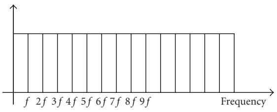  
(a)

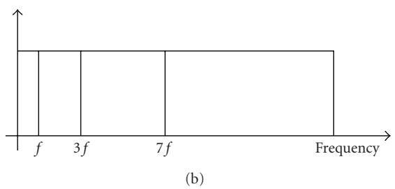

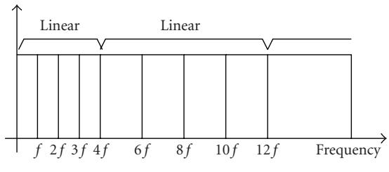  
(c)  
Figure 1: Methods for spectral analysis of music signals: (a) linear frequency spacing; (b) geometric frequency spacing; (c) piecewise linear frequency spacing. The scales were arbitrarily selected.

For that purpose, the constant-Q fast filter bank (CQFFB) and the bounded-Q fast filter bank (BQFFB) tools are thoroughly analyzed. The CQFFB [7, 8] is seen as a highresolution version of the CQT, from which it inherits the high computational cost. After that, the BQFFB is introduced as the most eficient tool, combining the FFT-like reduced complexity, the BQT-like linear geometric frequency distribution, and the FFB-like high resolution. The original concept of the BQFFB was first given in [9]. The present paper includes a complete description of this tool along with other spectral analysis tools under a unified framework. A more eficient implementation of the BQFFB, which avoids decimation filters, is newly introduced.

In the context of music information retrieval, the algorithms discussed in this work find application, for example, in automatic music transcription and musical feature extraction.

The remains of this paper are organized as follows: Section 2 describes the linear frequency spacing methods, which are the FFT and its high-selectivity counterpart, the FFB. Section 3 presents the geometric frequency spacing methods, which are the CQT and its high-selectivity equivalent, the CQFFB. Section 4 describes the piecewise linear frequency methods, which are the BQT and its newly implemented high-selectivity form, the BQFFB. Section 5 describes some practical issues, such as the choice of parameters values and their efects on the computational complexity of the proposed tools. Section 6 describes computer experiments to illustrate the performance of the proposed filter bank. Finally, Section 7 concludes the paper, emphasizing its main contributions.

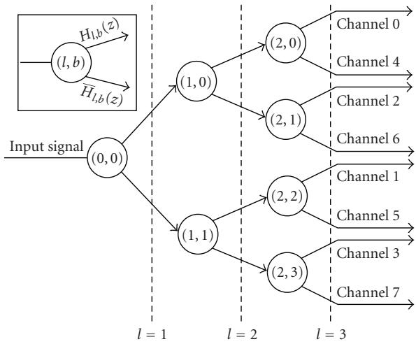  
Figure 2: Tree-like representation for the sFFT and FFB, allowing both algorithms to have a fast modular implementation. Each node in the diagram is composed by a pair of prototype and complementary filters, which work in tandem, to generate the input signals for the next layer of filters.

## 2. LINEAR FREQUENCY SPACING METHODS

## 2.1. Fast Fourier transform

The short-time DFT is defined by

$$
X [ k ] = \frac {1}{N} \sum_ {n = 0} ^ {N - 1} w [ n ] x [ n ] e ^ {- j 2 \pi k n / N},\tag{1}
$$

where x[n] is the nth sample of the input signal, 2πk/N is the normalized digital frequency in radians (the period in samples is N ), $0 \leq k \leq ( \bar { N } - 1 ) \dot { }$ is the frequency bin index, and w[n] is a window function, such as the Hamming window [10]. Shifting a rectangular window w[n] along x[n] in hops of S samples, one turns the DFT into a block transform. The FFT is the family of fast algorithms for the DFT [11], responsible for the latter being widely employed [12]. Its most popular type is the radix-2 FFT, which is based upon a simple modular lattice structure.

Making S = 1 in the FFT setup yields the so-called sliding FFT (sFFT), which can be promptly seen as an N-channel filter bank [13], with $N = 2 ^ { \bar { L } }$ , where L is an integer, organized as the tree-like structure shown in Figure 2. Each channel filter is composed by the cascade of L subfilters. At each node of the diagram, one finds a prototype and its complementary filter, thus allowing to halve the number of multiplications.

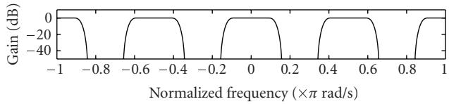

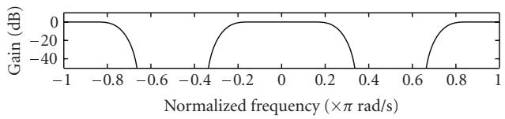

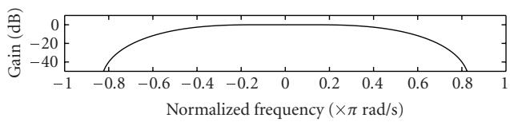

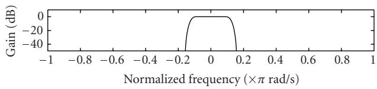  
Figure 3: Building of channel-0 filter in an 8-channel sFFT or FFB scheme, from modified versions of the kernel filters. From top to bottom, the plots show the hypothetical magnitude response of prototype filters (0, 0), (1, 0), and (2, 0), followed by the resulting channel-0 filter (see Figure 2).

Every prototype filter is a modulated and an interpolated version of the same kernel filter

$$
H (z) = 1 + z ^ {- 1},\tag{2}
$$

with only two nonzero coeficients. A given filter $H _ { l , b } ( z )$ is built by replacing z in H(z) by

$$
W _ {N} ^ {- \widetilde {b}} z ^ {2 ^ {L - l - 1}} = \left\{e ^ {- j 2 \pi / N} \right\} ^ {- \widetilde {b}} z ^ {2 ^ {L - l - 1}},\tag{3}
$$

where $l = 0 , \ldots , ( L - 1 )$ is the level index, $b = 0 , \ldots , ( 2 ^ { l } - 1 )$ 1 is the filter index within each level, and $\widetilde { b }$ is the bit-reversed representation of the integer b.

The overall filtering scheme is made clearer by Figure 3, which illustrates how channel-0 filter is formed in an 8- channel sFFT.

The FFT complexity can be shown to be of N log N complex multiplications for a length-N sequence [10], if no further simplification is assumed. The above described sFFT, in turn, requires $C _ { \mathrm { F F T } } ~ = ~ 1$ complex multiplication per input sample per channel [1].

Combining the FFT algorithm with a nonrectangular window function (e.g., Hamming, Kaiser, etc.) improves the attenuation level in a given band, but highly increases the superposition between adjacent bands. This efect, commonly referred to as interchannel interference, causes a single frequency tone to appear in a few adjacent bins in the frequency domain [10].

## 2.2. Fast filter bank

Aiming to avoid the trade between sidelobe rejection and main lobe width inherent to the windowed-FFT solution, Lim and Farhang-Boroujeny [2] proposed to associate the FFT tree structure with longer kernel filters. The idea is to profit from the modular implementation of the FFT to get filters with very steep passband-stopband transitions. Their design follows the frequency response masking (FRM) approach [14].

The FRM technique is intended for the design of digital filters with very sharp transition bands and low complexity. It starts from the observation that the frequency response of an interpolated filter in the form $H ( z ^ { L } )$ is composed by periodic replicas of the frequency response of $H ( z )$ compressed by L. Each replica exhibits passband-stopband transitions L times sharper than those of $H ( z )$ . A moderately selective masking filter $G ( z )$ can be designed to suppress the undesired images, thus keeping only the desired selective passband. Since the number of nonzero coeficients of $H ( z ^ { L } )$ is L times smaller than its order, and the specifications of $G ( z )$ need not be very stringent, the resulting filter may exhibit a very low complexity. The overall design is carried out through properly chosen optimization procedures.

The FFT filter bank discussed in Section 2.1 (see especially Figures 2 and 3) is structurally suited for the FRM design, since it is based on cascaded interpolated filters. The main modification necessary to turn the original FFT channels into high-selectivity filters is to employ a distinct higherorder kernel filter at each level l of the structure, instead of the unique low-order FFT kernel given in (2). An adequate FRM procedure can be recursively employed to generate the necessary filters along the structure, in such a way that each interpolated filter is masked by the subsequent filters in cascade. The resulting technique is the so-called fast filter bank (FFB) (whose design is detailed in [15, 16]), which keeps the linear-phase characteristics of the FFT structure, thus avoiding phase distortions on the signal.

In this paper, the FFB follows the same specifications as in [2], thus keeping the same filter orders, as given in Table 1. Figure 4 depicts the high-selectivity nature of the FFB method against the FFT’s. Considering the minimum rejection level at the highest sidelobes in each case, the FFT filters present a rejection of about 13 dB [2], while the FFB filters attain a 56 dB attenuation level. The singular FFB-filter stopbands result from the cascade of several masking filters, each with its own distinct stopband response. If a window function is employed to increase the FFT sidelobe attenuation level, it will also increase the FFT interchannel interference, as discussed above [10].

The number of filter coeficients per FFB level is presented in Table 1. It can be seen that the accumulated amount of distinct nonzero coeficients until a given cascade level $l \geq 5$ is $( 2 N + 2 3 )$ . This yields a number of complex multiplications per channel per input sample

$$
C _ {\mathrm{FFB}} (l) = C (l) = \frac {(2 N + 2 3)}{N} \approx 2,\tag{4}
$$

Table 1: Number of nonzero coeficients per level of FFB subfilter structure.

<table><tr><td>Cascade level (l)</td><td>Distinct coefficients per filter</td><td>Prototype filters</td><td>Coefficients per level</td><td>Accumulated coefficients C(l)</td></tr><tr><td>1</td><td>7</td><td>1</td><td>7</td><td>7</td></tr><tr><td>2</td><td>6</td><td>2</td><td>12</td><td>19</td></tr><tr><td>3</td><td>3</td><td>4</td><td>12</td><td>31</td></tr><tr><td>4</td><td>3</td><td>8</td><td>24</td><td>55</td></tr><tr><td>5</td><td>2</td><td>16</td><td>32</td><td>87</td></tr><tr><td>6</td><td>2</td><td>32</td><td>64</td><td>151</td></tr><tr><td>7</td><td>2</td><td>64</td><td>128</td><td>279</td></tr><tr><td>8</td><td>2</td><td>128</td><td>256</td><td>535</td></tr><tr><td> $\vdots$ </td><td> $\vdots$ </td><td> $\vdots$ </td><td> $\vdots$ </td><td> $\vdots$ </td></tr><tr><td> $\log_2 N$ </td><td>2</td><td>N/2</td><td>N</td><td>2N + 23</td></tr></table>

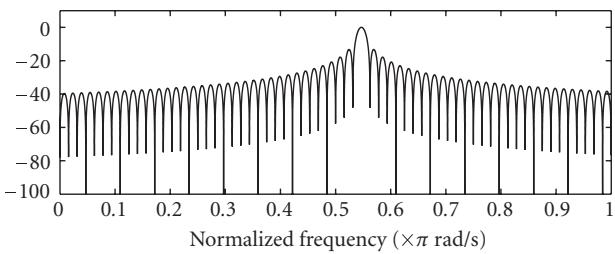  
(a)

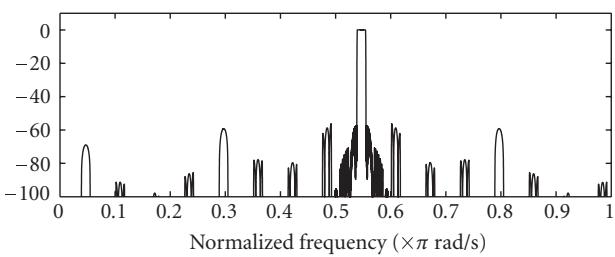  
(b)  
Figure 4: Magnitude response of the 35th channel of a 128-channel filter bank: (a) FFT; (b) FFB. The FFB magnitude response is formed by the cascade of interpolated filters designed by FRM: each interpolated filter, exhibiting sharp transition bands, is followed by a composed masking filter that eliminates the former’s undesired passband images.

where N is the number of channels of the FFB. This is twice the computational load of the radix-2 FFT. So, a great increase in selectivity is attained by the FFB at the cost of a slight raise in complexity. A matrix formulation of the FFB [17] seems to be more suitable for a fast implementation.

It must be emphasized that the linear frequency spacing tools for spectral analysis described above exhibit a constant frequency resolution along the spectrum. The following sections deal with variable resolution tools.

## 3. GEOMETRIC FREQUENCY SPACING METHODS

Despite the high selectivity of the FFB, it still distributes the channels uniformly along the frequencies. However, the frequencies of musical notes in modern Western music (in the equal tempered scale) are geometrically spaced [3]. So, low-pitched notes are much closer in Hz than high-pitched notes. As a consequence, in the spectral analysis of music signals, if channel spacing is made linear, a suficient resolution to discriminate between low-pitched notes implies an over detailed precision for the high-pitched ones, while a good resolution for the latter yields an insuficient resolution for the former. One can circumvent this problem by distributing geometrically the bin frequencies, thus employing a reduced number of channels.

The goal of the constant-Q transform (CQT) [4], which is based on the DFT, is to provide a geometric frequency spacing. This is accomplished by varying the channel spacing directly with the channel frequencies in such a way that their ratio remains constant. Given a desired number of channels per octave, one can define this constant quality factor as

$$
Q = \frac {f _ {k}}{\Delta f _ {k}},\tag{5}
$$

where $f _ { k }$ is the kth channel frequency and $\Delta f _ { k }$ is the spacing between channels k and $k + 1$ . Therefore, as $f _ { k }$ increases geometrically, a constant Q is achieved by a similar bandwidth $\Delta f _ { k }$ increase, in such a manner that the filters keep filling in the entire spectrum, as desired.

With reference to (1), attributing a fixed value to Q is equivalent to choosing a diferent length window for each spectral component, turning N into

$$
N _ {k} = \frac {f _ {s}}{\Delta f _ {k}} = \frac {f _ {s}}{f _ {k}} Q,\tag{6}
$$

where $f _ { s }$ is the sampling frequency.

The above definitions lead to the expression for the kth CQT spectral component

$$
X _ {\mathrm{CQ}} [ k ] = \frac {1}{N _ {k}} \sum_ {n = 0} ^ {N _ {k} - 1} w [ n, k ] x [ n ] e ^ {- j 2 \pi k n / N _ {k}}.\tag{7}
$$

A detailed discussion on the choice of the window function can be found in [4].

## 3.1. Constant-Q fast filter bank

The CQFFB [7] combines the high selectivity of the FFB with the constant-Q behavior of the CQT. The idea is to allocate the CQT frequency distribution to the filter spacing within the filter bank. The varying window length $N _ { k }$ of the CQT is now replaced by filters with varying bandwidths. The bin frequencies of the CQT become the center frequencies of the corresponding filters of the CQFFB, while the distance between two CQT neighbor bins is replaced by one CQFFB filter bandwidth. Naturally, the improved selectivity implies an increase in computational cost.

In the following, two diferent implementations of the CQFFB are presented. The first one consists of the following steps.

(1) Knowing the necessary Q to achieve the desired level of frequency detail, design an FFB with the minimum integer L such that $N = 2 ^ { L } \ge 2 Q$ channels, and take the filter corresponding to channel Q .

(2) For each channel k of the CQFFB,

(i) resample the input signal so that the new sampling frequency is

$$
f _ {s} (k) = \frac {N}{Q} f _ {\min} r ^ {k - 1},\tag{8}
$$

where

$$
r = \frac {2 + 1 / Q ^ {2} + (1 / Q) \sqrt {4 + 1 / Q ^ {2}}}{2}\tag{9}
$$

is the center frequency ratio between contiguous channels and $f _ { \mathrm { m i n } }$ is the center frequency of channel $k = 1$ ，

(ii) filter the resampled version of the input signal by the FFB filter chosen in the first step.

Resampling the input signal to $f _ { s } ( k )$ moves the desired frequency range of the input signal into the passband of the selected FFB filter. The main disadvantage of this approach is spending a great amount of calculations to perform several resamplings of the input signal. Moreover, it requires additional antialiasing filterings. The complexity for a given channel k, in terms of complex multiplications per input sample, amounts to

$$
C _ {\mathrm{CQFFB}} (k) = C _ {R} (k) + \left(C _ {Q} + 1\right) \gamma (k),\tag{10}
$$

where $C _ { R } ( k )$ is the resampling cost, $\gamma ( k )$ is the resampling factor, both for channel k, and $C _ { Q }$ is the cost of the FFB filter selected in the first step of the algorithm above.

An alternative implementation resamples the filters instead of the input signal [8]. Now the procedure is the following.

(1) Knowing the necessary Q to achieve the desired level of frequency detail, design an FFB with the minimum integer L such that $N = 2 ^ { L } \ge 2 Q$ channels, and take the filter corresponding to channel Q.

(2) For each channel k of the CQFFB,

(i) resample the impulse response of the filter chosen in the first step according to (8),

(ii) filter the input signal by the filter modified in the previous step.

Resampling the impulse response of the selected FFB filter to $f _ { s } ( k )$ moves the filter passband to the desired frequency range of the input signal. This renders the filtering more complex, since the filter bank loses an important feature of the original FFB filters: the large amount of null coeficients. On the other hand, the calculations for obtaining the filters can be performed only once, ofline. Now, the complexity for

a given channel k becomes

$$
C _ {\mathrm{CQFFB}} (k) = \left(C _ {Q} + 1\right) \gamma (k).\tag{11}
$$

Equations (11) and (12) show that the second CQFFB implementation is less costly, since it does not include the parcel related to the resampling, performed only in the first implementation. The overall complexity amounts to

$$
C _ {\mathrm{CQFFB,Total}} = \sum_ {k = q _ {1}} ^ {q _ {2}} \left(C _ {Q} r ^ {- k} + 1\right),\tag{12}
$$

where $q _ { 1 } = [ \log _ { r } ( 2 ^ { - D } ( N / 2 Q ) ) ] , q _ { 2 } = [ \log _ { r } ( N / 2 Q ) ]$ , and D is the number of octaves.

This kind of tool can be useful, for example, in automatic music transcription, which requires the detection of which musical notes were played during the recording of a music signal. Conventional notes in Western equal tempered scale are geometrically spaced; therefore, contiguous note patterns become equally spaced in a constant-Q representation [4] (the ideal case would be a perfectly tuned fixed note instrument), which turns their detectability homogeneous along the spectrum. As a highly selective tool, the CQFFB makes an interesting choice for this application. The issue of harmonics is discussed in Section 5.3.

## 4. PIECEWISE LINEAR FREQUENCY SPACING METHODS

In order to reduce the high complexity inherent to the CQT, the bounded-Q transform (BQT) was proposed in [6]. In this analysis tool, only the octaves are geometrically separated, whereas within each octave, the frequency bins are equally spaced, as seen in Figure 1(c). This channel distribution becomes a good approximation for the geometric scale with a proper number of channels per octave, as will be illustrated in Section 6.

A constant-Q method designed for R channels per octave would divide an octave starting at frequency $f _ { 0 }$ into bandwidths given by

$$
B W _ {\mathrm{CQ}} (k) = f _ {0} \left[ \left(\sqrt [ R ]{2}\right) ^ {k} - \left(\sqrt [ R ]{2}\right) ^ {k - 1} \right],\tag{13}
$$

where $k = 1 , \dotsc , R$ is the channel index. On the other hand, a bounded-Q method designed for $N = 2 ^ { L }$ channels per octave, with L is an integer, would result in bandwidths

$$
B W _ {\mathrm{BQ}} = \frac {f _ {0}}{N}.\tag{14}
$$

Making $B W _ { \mathrm B Q } ~ = ~ B W _ { \mathrm C Q } ( 1 ) ~$ and solving for N, one obtains the minimum number of bounded-Q channels per octave that provides bandwidths equal to the narrower constant-Q bandwidth

$$
N _ {\mathrm{min}} = 2 ^ {\lceil \log_ {2} (1 / (\sqrt [ R ]{2} - 1)) \rceil}.\tag{15}
$$

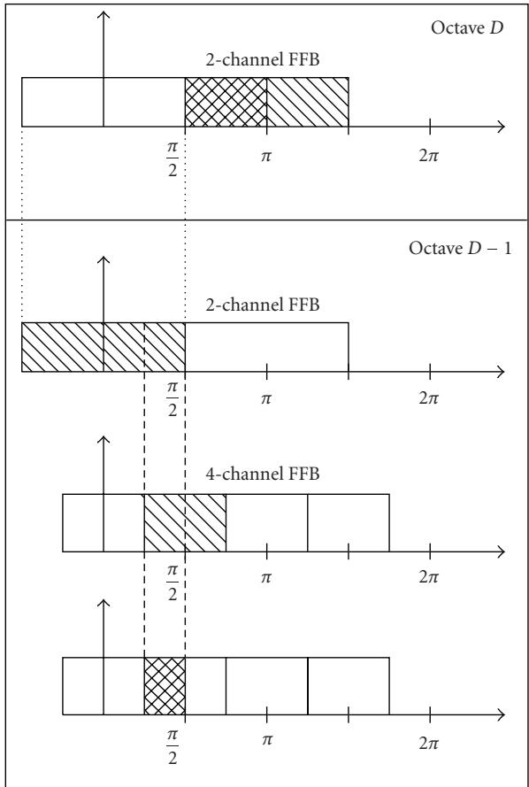  
Figure 5: Procedure for building CQFFB filters in order to separate octaves in the BQFFB.

## 4.1. Bounded-Q fast filter bank

The BQFFB combines the piecewise linear spacing of the bounded-Q scheme with the high selectivity of the FFB. This can be achieved by using a CQFFB to separate the input signal into octaves, and then applying an FFB within each octave to obtain linearly spaced frequency bins. In this scheme, the CQFFB requires only ten output channels, corresponding to the 10-octave human auditory range, which does not demand a heavy computational load. Each octave is then isolated from the others by using filters designed according to the following procedure (see Figure 5).

(1) Obtain the filter for the highest octave, D, from the second filter of a 2-channel FFB.

(2) Obtain the filter for each remaining octave, $d = ( D -$ $1 ) , \ldots , 1$ , as a cascade of the second filter of a $2 ^ { ( D - { \dot { d } } + 1 ) } .$ channel FFB with the first filter of a $2 ^ { ( D - d ) }$ -channel FFB.

Using the filters already mentioned in Section 2.2 (i.e., with the same orders as those described in [2]) for octave separation, the total of nonzero coeficients required by the procedure above is given in Table 2.

The reasoning for this procedure is that the filter assigned to the highest octave, indexed by D, is the second filter of a

Table 2: Accumulated number of nonzero coeficients of the CQFFB octave separation filters used in the BQFFB, where $d = D$ is the highest octave.

<table><tr><td>Number of octaves (D)</td><td>Octave index (d)</td><td>Coefficients in octave d</td><td>Accumulated coefficients F(D)</td></tr><tr><td>1</td><td>D</td><td>7</td><td>7</td></tr><tr><td>2</td><td>D-1</td><td>6</td><td>13</td></tr><tr><td>3</td><td>D-2</td><td>3</td><td>16</td></tr><tr><td>4</td><td>D-3</td><td>3</td><td>19</td></tr><tr><td>5</td><td>D-4</td><td>2</td><td>21</td></tr><tr><td>6</td><td>D-5</td><td>2</td><td>23</td></tr><tr><td>7</td><td>D-6</td><td>2</td><td>25</td></tr><tr><td>8</td><td>D-7</td><td>2</td><td>27</td></tr><tr><td>9</td><td>D-8</td><td>2</td><td>29</td></tr><tr><td>10</td><td>D-9</td><td>2</td><td>31</td></tr></table>

2-channel FFB. Actually, this filter would be wider than necessary. But, since the input signal is assumed to be real, the resulting band is limited to its left half. For the octave $( D - 1 )$ the filter must be designed in such a way that it is lower bounded by π/4 and upper bounded by π/2. These limits can be reached by combining the first filter (lowpass) of the octave D and the second filter (bandpass) of the octave (D - 1). This process is carried out until the lower octave is reached.

After the octaves from the constant-Q stage have been separated, each one must be divided into N linearly spaced channels, through the following procedure.

(1) For $d = 1 , \ldots , D ,$ downsample the signal from the octave d by the factor $2 ^ { ( D - d + 1 ) }$

(2) Submit each downsampled signal to a 2N-channel FFB, obtaining the separated channels assigned to the octave d.

The downsampling of each octave signal makes its spectrum wider (from 0 to 2π), without requiring additional decimation filtering, since the high-selectivity FFB filters employed in the octave separation stage are suficient to avoid aliasing. It is important to notice that the FFB employed within each octave must have twice the number of channels to be separated, since it also generates the negative part of the filter responses. Table 2 shows the accumulated number F(D) of nonzero coeficients for the octave separation filters computed for distinct values of the number D of octaves. Then, the number of complex multiplications per input sample for the BQFFB is

$$
C _ {\mathrm{BQFFB,Total}} = \left(F (D) + D\right) + 2 C (l) D,\tag{16}
$$

where C(l) is obtained from Table 1.

An earlier implementation of the bounded-Q concept [9] employed conventional antialiasing filtering instead of a CQFFB to separate the octaves. As a consequence, there would occur considerable overlapping between contiguous octaves unless the antialiasing filters were extremely consuming. Furthermore, it employed (4N)th-order FFBs within the octaves. The new implementation proposed here evidently supersedes that one with respect to frequency discrimination, at a comparable computational burden.

Table 3: Comparison between diferent spectral analysis tools. The asterisk refers to the FFB-based high-selectivity tools, which tend to be more complex than the FFT-based algorithms.

<table><tr><td>Analysis tool</td><td>Frequency spacing</td><td>Channel selectivity</td><td>Computational complexity</td></tr><tr><td>FFT</td><td>Linear</td><td>Low</td><td>Low</td></tr><tr><td>FFB</td><td>Linear</td><td>High</td><td>Low (*)</td></tr><tr><td>CQT</td><td>Geometric</td><td>Low</td><td>High</td></tr><tr><td>CQFFB</td><td>Geometric</td><td>High</td><td>High (*)</td></tr><tr><td>BQT</td><td>Piecewise linear</td><td>Low</td><td>Medium</td></tr><tr><td>BQFFB</td><td>Piecewise linear</td><td>High</td><td>Medium (*)</td></tr></table>

Table 3 summarizes the main characteristics of all spectral analysis algorithms seen in this paper.

As a final remark, it must be added that, as opposed to the FFT and the FFB, neither the CQFFB nor the BQFFB is structurally invertible. The direct resynthesis of a signal analyzed through these methods requires a synthesis filter bank which can only approximate perfect reconstruction. This fact results from the noninvertibility of their originating CQT [4].

## 5. PRACTICAL ISSUES

In the following, some design aspects concerning the practical implementation and application of the proposed algorithms are addressed.

## 5.1. Choice of parameter values

The first problem to be taken into consideration is the filter bank resolution. In musical applications, one can refer to the geometric organization of the equal tempered scale used in Western music [3]: each octave is divided into 12 musical notes following a geometric progression of ratio $\sqrt [ 1 2 ] { 2 } \approx 1 . 0 6$ This ratio is known as a semitone. In order to detect a semitone variation, the resolution should be the square root of this value, that is, $\sqrt [ 2 4 ] { 2 } \approx 1 . 0 3$ (one quartertone).

If one wants to use constant-Q channels, as in the CQFFB [7], the corresponding quality factor is given by

$$
Q = \frac {f _ {k}}{(\Delta f) _ {\mathrm{CQ}}} = \frac {f _ {k}}{\left(2 ^ {1 / 4 8} - 2 ^ {- 1 / 4 8}\right) f _ {k}} \approx \frac {1}{0 . 0 2 8 9} \approx 3 4. 6,\tag{17}
$$

where $f _ { k }$ is the central frequency (in a geometric sense) and $( \Delta f ) _ { C Q }$ is the bandwidth of any given channel k. To simplify the calculations, the resulting value for the Q-factor will be 35.

The intended quartertone separation corresponds to $R =$ 24. Using (15), the bounded-Q solution should employ at least $N _ { \mathrm { m i n } } ~ = ~ 6 4$ channels per octave to make them all narrower than the constant-Q channels. For all practical purposes, $N = 3 2$ can be used, since only three of the twenty four CQFFB channels are narrower than their BQFFB counterparts.

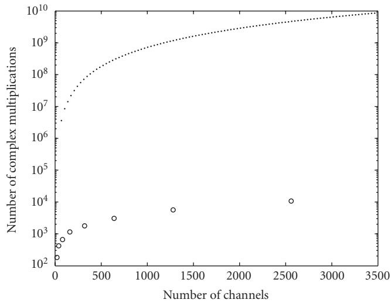  
Figure 6: Complexity comparison between the CQFFB (dots) and the BQFFB (circles), here introduced, as a function of the number of channels.

## 5.2. Complexity comparison

In order to compare the computational loads of the CQFFB and BQFFB approaches presented in this paper, Figure 6 plots the number of complex multiplications required to analyze a 10-octave spectrum as a function of the number of channels. These curves follow (12) for the CQFFB and (16) for the BQFFB. It becomes clear that the BQFFB outperforms the CQFFB. In typical applications using around 100–320 channels, the gain is about five orders of magnitude in favor of the former.

## 5.3. Requirements versus applications

This work is concerned with spectral analysis tools with high selectivity (as the FFB), also reduced number of channels (as the CQFFB), and also low complexity (as the BQFFB). A brief discussion linking applications with the requirements on these methods can be useful. In Section 3.1, automatic music transcription (AMT) was cited as a potential application of a geometrically spaced frequency representation.

In AMT, even in the simple case of monophonic signals, the identification of musical notes by such a tool must face several problems.

(i) Absolute tuning (modern Western convention dictates A4 = 440 Hz) is not always guaranteed.

(ii) Instruments may be simply out of tune, thus shifting notes arbitrarily.

(iii) Instruments (e.g., bells) may exhibit inharmonicity; in this case, perceived pitch is not necessarily associated to a “fundamental” frequency.

(iv) Most instruments emit continuously variable notes (e.g., the violin, as opposed to the piano).

Additionally, in the more usual polyphonic contexts, when the overlap of notes’ spectra must be solved, harmonics must be carefully accounted for—but they are linearly spaced.

All these considerations can be summarized in one sentence: there is no ideal frequency grid for the spectral analysis of music signals. In fact, depending on the target application, diferent solutions may be preferable. Under this perspective, the bounded-Q economy of 5 orders of magnitude in complexity over the constant-Q makes it a preferable analysis tool in general. The linear spacing of harmonics must not cause much concern, if suficient granularity is available, for example, it can be easily shown that with N linear channels per octave, the system can separate the first 2N harmonics of a given musical note. Of course, the fine granularity must be paralleled by suficient separation capability, and this is the importance of including the FFB filters in the proposed structures.

In broad terms, the proposed methods can be seen as music-oriented time-frequency representations. They can provide (magnitude, frequency) x time as parameters for general music feature extraction systems, where higher-level layers may process the information in a myriad of ways. Since related applications often deal with great amounts of data, the reduced number of channels (and generated output samples) is an important issue of the CQFFB and BQFFB techniques.

## 6. COMPUTER EXPERIMENTS

In this section, some computer simulations are carried out to assess the performance of the variable resolution highselectivity methods using the linear frequency spacing methods as a reference.

## 6.1. Two synthetic musical notes

First, consider a one-second test signal formed as the sum of 8 pure tones of unit magnitude. The first two tones are at frequencies 263 Hz and 295 Hz, which correspond to notes C4 and D4 slightly out of tune with respect to an equal tempered scale, to simulate a realistic situation. Their next three harmonics are also included. Since the main concern in this experiment is frequency detection, the component magnitudes were made equal to simplify their visualization.

The frequency resolution value adopted in the CQFFB simulation is Q 35, as shown in (17), and will also serve as a reference in choosing the number of channels for the remaining methods. To keep the comparison fair, the channel with the worst resolution in the linear spacing tools should satisfy the quarter tone constraint. This restriction applies to the lowest channel, which must contain the lowest test tone. To meet these conditions, both FFT and FFB divide the spectrum in 4096 channels from 0 to 22050 Hz (assuming a sampling rate of 44100 Hz), each one 5.38 Hz wide.

The BQFFB, in turn, divides the spectrum (from its highest limit) in seven octaves, plus the remaining lower frequency band (which includes the lowest test tone). Each of these eight subbands is linearly divided in 32 channels, thus keeping in the lowest band the same spacing as the FFT and FFB tools.

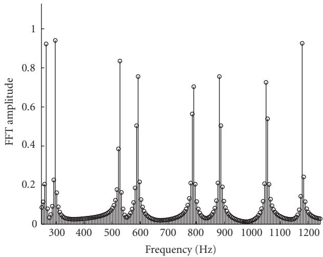  
Figure 7: FFT analysis of the test signal formed with sinusoids. The linear frequency distribution of the FFT keeps the resolution constant throughout the entire spectrum, and the reduced sidelobe attenuation generates a noise-floor efect that can mask medium level tones in practical signals.

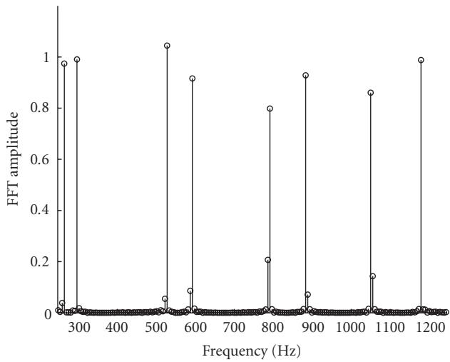  
Figure 8: FFB analysis of the test signal formed with sinusoids. The linear frequency distribution of the FFB keeps the resolution constant throughout the entire spectrum, whereas the FFB selectivity avoids the noise-floor efect.

Figures 7 to 10 show the responses of FFT, FFB, CQFFB, and BQFFB to the test signal. From these figures, it becomes evident that the FFT yields some noise level around the test tones, due to the poor selectivity of the associated FFT filters. Such a noise may become a negative factor in practical cases, as it can mask some signal components close to the major frequency components. In contrast, the FFB is able to detect the peaks clearly, but with the same unnecessarily large number of channels. The CQFFB identifies the tones with fewer channels, yet increasing considerably the computational cost. In fact, the BQFFB attains the same performance as the FFB, with about five orders of magnitude lower complexity than the CQFFB, as predicted. The slight magnitude distortion observed in Figure 10 can be minimized by the use of longer filters for octave separation, at negligible increase in the overall complexity.

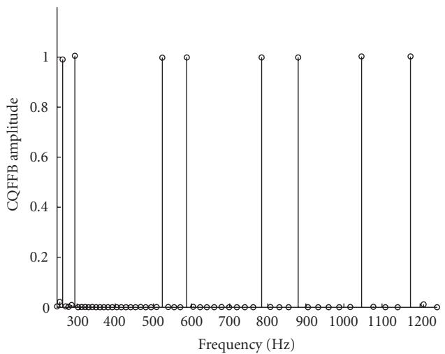  
Figure 9: CQFFB analysis of the test signal formed with sinusoids. The geometric frequency distribution of the constant-Q scheme scatters the channel bins more eficiently, unfortunately at a high computational cost, and the FFB selectivity avoids the noise-floor efect.

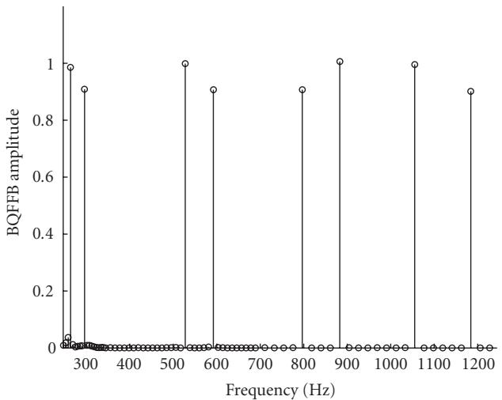  
Figure 10: BQFFB analysis of the test signal formed with sinusoids. The mixed linear geometric frequency distribution of the bounded-Q method scatters the channel bins more eficiently, at a reasonable computational cost, and the FFB selectivity avoids the noise-floor efect.

## 6.2. A stationary excerpt from a real audio signal

The signal used in this example is a four-second extract from the recording of an organ work by Cesar Franck. It contains ´ an A-Major chord composed by the notes A3 (220 Hz), E4 (329.63 Hz), A4 (440 Hz), C#5 (554.37 Hz), E5 (659.26 Hz), and C#6 (1108.73 Hz) played on the manuals plus an A0 (27.5 Hz + octaves) pedal bass. The fundamental frequencies of the prescribed notes are indicated on the plots.

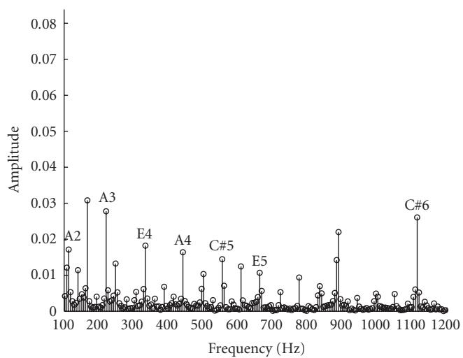  
Figure 11: FFT analysis of the test signal acquired from an audio recording.

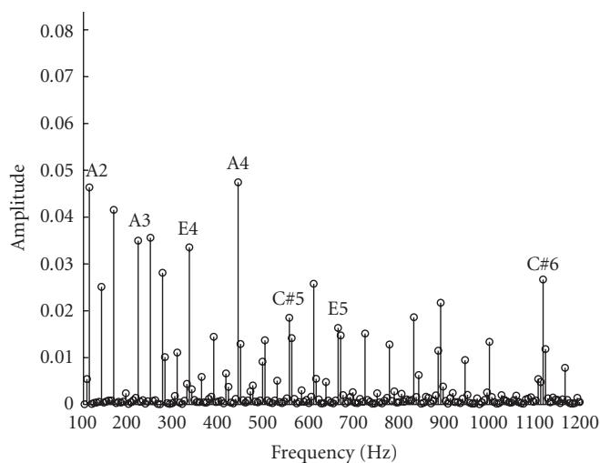  
Figure 12: FFB analysis of the test signal acquired from an audio recording.

One can clearly notice that all four tools were able to discriminate these components. Figure 11 shows that the FFT output is quite noisy, masking some important information. Furthermore, while the FFB (seen in Figure 12) requires an excessively large number of channels and the CQFFB (seen in Figure 13) employs a great amount of computation, the BQFFB (seen in Figure 14) presents a good compromise between all these aspects. Harmonics of the lowest note (discernible by the 27.5 Hz spacing) could only be detected by the FFB-based tools.

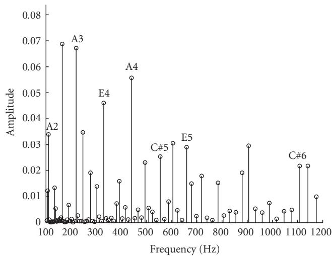  
Figure 13: CQFFB analysis of the test signal acquired from an audio recording.

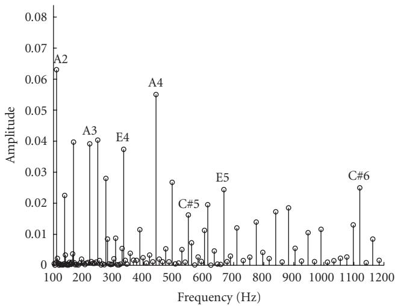  
Figure 14: BQFFB analysis of the test signal acquired from an audio recording.

## 6.3. Two real audio signals along the time

Since the best choice for combining high selectivity, reduced number of channels, and low complexity is the BQFFB, this section shows the analysis of two real audio signals performed by this method along the time. Once more, the system was designed with 32 equal-width channels per octave.

The first signal (Figure 15) is an excerpt of the recording of a piece composed by J. S. Bach (1685–1750) for solo flute. The second signal (Figure 16) is the beginning of the recording of a piece composed by D. Shostakovich (1906– 1975) for piano solo. In both figures, the sheet music is first presented as a reference, followed by a sequence of plots. Each plot depicts in greyscale the magnitude of the 32 channels (along a linear frequency scale in Hz) inside an octave versus time (in seconds). Only those octaves with significant content are shown in the figures. Additionally, in order to turn the visualization easier, since the power spans a large dynamic range along diferent portions of the spectrum, each octave plot was individually normalized in magnitude—as a side efect, magnitudes inside diferent octaves cannot be quantitatively compared.

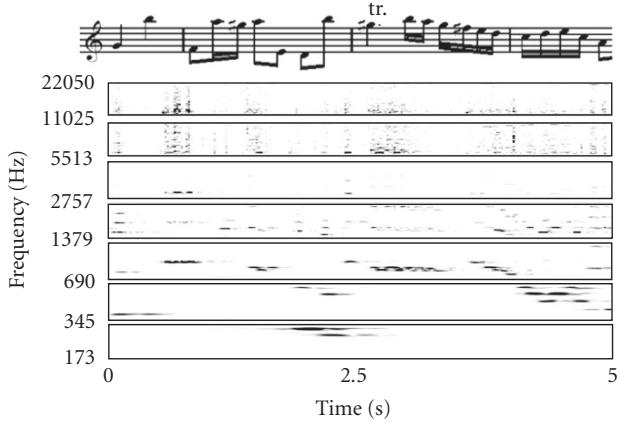  
Figure 15: BQFFB analysis of flute recording: excerpt from the Corrente of the Partita in A Minor, BWV 1013, by J. S. Bach.

The flute example is a one-voice signal, with predominance of medium-high frequencies, and moderate tempo. In Figure 15, it is possible to distinguish the several note harmonics following the tune evolution. Variable dynamics, including some vibrato efect can be recognized inside the first three octaves. A trill shortly after 2.5 s can be clearly discerned. Localization is quite good, since the acoustics is fairly dry. The magnitude normalization per octave accounts for the sparse aspect in the [2757–5513] octave as well as the fuzzy appearance in the next two octaves.

The piano extract is a two-voice signal with wide frequency span. In Figure 16, it can be seen that the right hand plays around 13 notes per second—a quite fast passage— and the legato touch yields the visible note overlaps; the bass notes sound quite resonant, which is reflected by their longer durations. The restricted dynamic range employed by the pianist in right-hand part allied to the constant pulse and equal note values allow the melody shape to be easily followed along the plots.

The examples above attest that the BQFFB can be a useful spectral analysis tool for music signals.

## 7. CONCLUSION

This paper presented several algorithms for the spectral analysis of music signals. The FFB is seen as a high-selectivity version of the standard FFT algorithm. The CQT and BQT can be seen as variations of the FFT with more eficient channel distribution in the frequency domain. The CQT uses a geometric frequency separation that emulates the organization of the usual Western music scale. Meanwhile, the BQT uses a linear geometric separation, to allow a fast implementation of the algorithm without sacrificing the ability of discriminating musical tones. Two novel methods were then introduced: the CQFFB and the BQFFB, which can be seen as high-selectivity versions of the CQT and BQT, respectively. In such framework, the BQFFB is an eficient spectral analysis tool for the analysis of music signals, combining reasonable computational cost, suitable channel distribution in the frequency domain, and high selectivity between adjacent frequency channels. Such properties make the BQFFB an attractive tool for applications like automatic music transcription systems and music feature extraction.

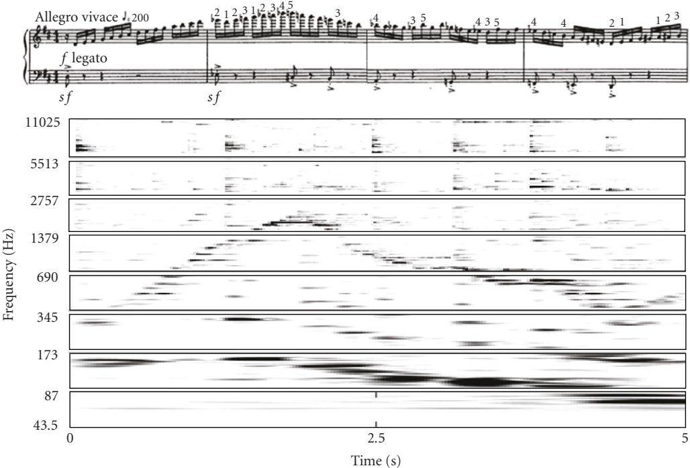  
Figure 16: BQFFB analysis of piano recording: excerpt from the Prelude in D Major, op. 34/5, by D. Shostakovich.

## ACKNOWLEDGMENTS

This work was supported by Fundac¸ao Carlos Chagas Filho˜ de Amparo a Pesquisa do Estado do Rio de Janeiro (FAPERJ), \` Brazil. The authors would like to thank Mr. Cristiano N. dos Santos and Mr. Danilo B. Graziosi for their contributions in the early stages of this work.

## REFERENCES

[1] B. Farhang-Boroujeny and Y. C. Lim, “A comment on the computational complexity of sliding FFT,” IEEE Transactions on Circuits and Systems II: Analog and Digital Signal Processing, vol. 39, no. 12, pp. 875–876, 1992.

[2] Y. C. Lim and B. Farhang-Boroujeny, “Fast filter bank (FFB),” IEEE Transactions on Circuits and Systems II: Analog and Digital Signal Processing, vol. 39, no. 5, pp. 316–318, 1992.

[3] D. William and E. Brown, Theoretical Foundations of Music, Wadsworth, Belmont, Calif, USA, 1978.

[4] J. C. Brown, “Calculation of a constant Q spectral transform,” Journal of the Acoustical Society of America, vol. 89, no. 1, pp. 425–434, 1991.

[5] J. C. Brown and M. S. Puckette, “An eficient algorithm for the calculation of a constant Q transform,” Journal of the Acoustical Society of America, vol. 92, no. 5, pp. 2698–2701, 1992.

[6] K. L. Kashima and B. Mont-Reynaud, “The bounded-Q approach to time-varying spectral analysis,” Tech. Rep. STAN-M-28, Stanford University, Department of Music, Stanford, Calif, USA, 1985.

[7] D. B. Graziosi, C. N. Dos Santos, S. L. Netto, and L. W. P. Biscainho, “A constant-Q spectral transformation with improved frequency response,” in Proceedings of IEEE International Symposium on Circuits and Systems (ISCAS ’04), vol. 5, pp. 544– 547, Vancouver, Canada, May 2004.

[8] C. N. Dos Santos, S. L. Netto, L. W. P. Biscainho, and D. B. Graziosi, “A modified constant-Q transform for audio signals,” in Proceedings of IEEE International Conference on Acoustics, Speech and Signal Processing (ICASSP ’04), vol. 2, pp. 469–472, Montreal, Canada, May 2004.

[9] F. C. C. B. Diniz, I. Kothe, L. W. P. Biscainho, and S. L. Netto, “A bounded-Q fast filter bank for audio signal analysis,” in Proceedings of IEEE International Telecommunications Symposium (ITS ’06), vol. 1, Fortaleza, Brazil, September 2006.

[10] P. S. R. Diniz, E. A. B. da Silva, and S. L. Netto, Digital Signal Processing: System Analysis and Design, Cambridge University Press, Cambridge, UK, 2002.

[11] J. W. Cooley and J. W. Tukey, “An algorithm for the machine calculation of complex fourier series,” Mathematics of Computation, vol. 19, no. 90, pp. 297–301, 1965.

[12] S. Haykin and B. Van Veen, Signals and Systems, John wiley & Sons, Hoboken, NJ, USA, 2nd edition, 2002.

[13] P. P. Vaidyanathan, Multirate Systems and Filter Banks, Prentice Hall, Upper Saddle River, NJ, USA, 1992.

[14] Y. C. Lim, “Frequency-response masking approach for the synthesis of sharp linear phase digital filters,” IEEE Transactions on Circuits and Systems, vol. 33, no. 4, pp. 357–364, 1986.

[15] Y. C. Lim and B. Farhang-Boroujeny, “Analysis and optimum design of the FFB,” in Proceedings of IEEE International Symposium on Circuits and Systems (ISCAS ’94), vol. 2, pp. 509–512, London, UK, June 1994.

[16] L. J. Wei and Y. C. Lim, “Designing the fast filter bank with a minimum complexity criterion,” in Proceedings of the 7th International Symposium on Signal Processing and Its Applications (ISSPA ’03), vol. 2, pp. 279–282, Paris, France, July 2003.

[17] Y. C. Lim and L. J. Wei, “Matrix formulation: fast filter bank,” in Proceedings of IEEE International Conference on Acoustics, Speech and Signal Processing (ICASSP ’04), vol. 5, pp. 133–136, Montreal, Canada, May 2004.

Filipe C. C. B. Diniz was born in Rio de Janeiro, Brazil, in 1979. He received the Electrical Engineering degree from the EE (now Poli) at Universidade Federal do Rio de Janeiro (UFRJ), Brazil, in 2003, and the M.S. degree in electrical engineering from the COPPE at UFRJ in 2005. He is a D.S. student at PEE/COPPE, at UFRJ. His research area is digital signal processing, particularly audio and speech processing and

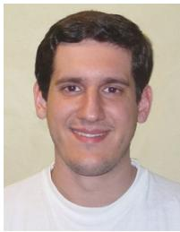

denoising techniques. He is currently a Member of the IEEE (Institute of Electrical and Electronics Engineers) and works for the Brazilian oil company, Petrobras.

Iuri Kothe was born in Sao Paulo, Brazil,˜ in 1980. He received the electrical engineering degree from Universidade Federal de Bras´ılia (UnB), Brazil, in 2003, and the M.S. degree in Electrical Engineering from the COPPE at Universidade Federal do Rio de Janeiro (UFRJ) in 2006. He currently cooperates with LPS (Signal Processing Laboratory), at UFRJ. His main research area is digital audio processing. He is currently

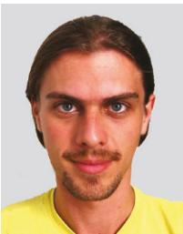

a Member of the AES (Audio Engineering Society).

Sergio L. Netto was born in Rio de Janeiro, Brazil. He received the B.S. degree (cum laude) from the Federal University of Rio de Janeiro (UFRJ), Brazil, in 1991, the M.S. degree from COPPE/UFRJ in 1992, and the Ph.D. degree from the University of Victoria, BC, Canada, in 1996, all in electrical engineering. Since 1997, he has been an Associate Professor with the Department of Electronics and Computer Engineering, at

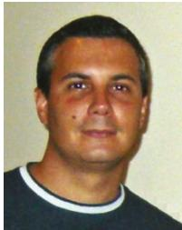

UFRJ, and, since 1998, with the Program of Electrical Engineering, at COPPE/UFRJ. He is the coauthor (with P. S. R. Diniz and E. A. B. da Silva) of “Digital Signal Processing: System Analysis and Design” by Cambridge University Press, Cambridge, UK, 2002. His research interests lie in the areas of adaptive signal processing, digital filter design, and speech processing (synthesis and coding).

Luiz W. P. Biscainho was born in Rio de Janeiro, Brazil, in 1962. He received the electrical engineering degree (magna cum laude) from the EE (now Poli) at Universidade Federal do Rio de Janeiro (UFRJ), Brazil, in 1985, and the M.S. and D.S. degrees in electrical engineering from the COPPE at UFRJ in 1990 and 2000, respectively. He is an Associate Professor at DEL/Poli and PEE/COPPE, at UFRJ. His re-

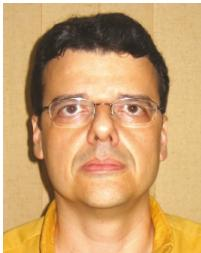

search area is digital signal processing, particularly audio processing and adaptive systems. He is currently a Member of the IEEE (Institute of Electrical and Electronics Engineers), the AES (Audio Engineering Society), and the SBrT (Brazilian Telecommunications Society).