# GSVD-Based Optimal Filtering for Single and Multimicrophone Speech Enhancement

Simon Doclo, Associate Member, IEEE, and Marc Moonen, Member, IEEE

Abstract—In this paper, a generalized singular value decomposition (GSVD) based algorithm is proposed for enhancing multimicrophone speech signals degraded by additive colored noise. This GSVD-based multimicrophone algorithm can be considered to be an extension of the single-microphone signal subspace algorithms for enhancing noisy speech signals and amounts to a specific optimal filtering problem when the desired response signal cannot be observed.

The optimal filter can be written as a function of the generalized singular vectors and singular values of a speech and noise data matrix. A number of symmetry properties are derived for the single-microphone and multimicrophone optimal filter, which are valid for the white noise case as well as for the colored noise case. In addition, the averaging step of some single-microphone signal subspace algorithms is examined, leading to the conclusion that this averaging operation is unnecessary and even suboptimal.

For simple situations, where we consider localized sources and no multipath propagation, the GSVD-based optimal filtering technique exhibits the spatial directivity pattern of a beamformer. When comparing the noise reduction performance for realistic situations, simulations show that the GSVD-based optimal filtering technique has a better performance than standard fixed and adaptive beamforming techniques for all reverberation times and that it is more robust to deviations from the nominal situation, as, e.g., encountered in uncalibrated microphone arrays.

Index Terms—Generalized singular value decomposition, optimal filtering, robust beamforming, speech enhancement.

## I. INTRODUCTION

N many speech communication applications, such as hands-free mobile telephony, hearing aids, and voice-controlled systems, the recorded and transmitted speech signals are often corrupted by a considerable amount of acoustic background noise. This is mainly due to the fact that the speaker is located at a certain distance from the recording microphones, allowing the microphones to record the noise sources as well. Generally speaking, acoustic background noise is a broadband and nonstationary signal, and the signal-to-noise ratio (SNR) of the microphone signals can be quite low (down to 0 dB). Background noise causes a signal degradation, which can lead to total unintelligibility of the speech and which substantially decreases the performance of speech coding and automatic speech recognition systems. Therefore, efficient noise reduction algorithms are required.

In the last few decades, single-microphone speech enhancement algorithms have attracted a great deal of interest. Single-microphone speech enhancement algorithms can be broadly classified in parametric and nonparametric techniques. Parametric techniques model the speech signal as a stochastic autoregressive (AR) model embedded in Gaussian noise. Speech enhancement then roughly consists of estimating the speech AR parameters and applying a (noncausal) Wiener filter [1], [2] or Kalman filter [3], [4] to the noisy signal, where the optimal filters are based on the estimated AR parameters. Non-parametric techniques do not estimate the speech parameters and require a noise fingerprint in a transform domain (mainly DFT or KLT-domain), which is used during speech-and-noise periods to obtain an estimate of the clean speech signal. Well-known nonparametric techniques include spectral subtraction [5], [6] and signal subspace-based techniques.

Several signal subspace-based single-microphone speech enhancement techniques for additive (colored) noise have recently been proposed. These techniques are based on a (generalized) singular value decomposition (SVD) [7]–[10] or a Karhunen–Loève transform (KLT) [11]–[14]. The main idea is to consider the noisy signal as a vector in an -dimensional vector space and to separate this space into two orthogonal subspaces: the signal-plus-noise subspace (with dimension smaller than , corresponding to the clean signal), and the noise subspace, which is the orthogonal complement of the signal-plus-noise subspace. Of course, this separation is only possible if the clean signal can be modeled with a low-rank model, which is a model that has often been attributed to clean speech [15], [16]. Signal enhancement is performed by removing the noise subspace and by estimating the clean speech signal from the remaining signal-plus-noise subspace. Depending on the specific optimization criterion, different clean speech estimates can be obtained.

Signal subspace-based single-microphone speech enhancement techniques can be classified according to the noise assumptions (white noise versus colored noise), type of estimate (least-squares, minimum variance, perceptually relevant criterion), type of processing (block-based versus adaptive), and on whether an additional averaging step is included or not. For all techniques, the resulting filter matrix can be written as a function of the (generalized) singular vectors and singular values of a so-called speech and noise data matrix.

Dendrinos et al. [7] assume white noise, make a least-squares (LS) estimate of the Toeplitz-structured speech data matrix by removing the smallest singular values, and restore the Toeplitzstructure of the rank-reduced matrix by arithmetically averaging along the diagonals. Jensen et al. [8] have extended this technique to the colored noise case by using a quotient singular value decomposition (QSVD), which implicitly includes noise prewhitening. They make a minimum-variance (MV) estimate of the Toeplitz-structured speech data matrix and average along the diagonals. For the white noise case, Ephraim and Van Trees [11] have introduced two perceptually relevant estimation criteria, which minimize the signal distortion while keeping the residual noise energy below some given threshold. They do not use an additional averaging step. Huang and Zhao [12] have slightly modified this procedure by adding an energy-constraint that matches the short-time energy of the enhanced signal to an estimate of the short-time energy of the clean speech. Mittal and Phamdo [13] have extended the technique of Ephraim and Van Trees to the colored noise case without using prewhitening by making a distinction in processing speech-dominated and noise-dominated speech frames. Rezayee and Gazor [14] have reduced the computational complexity of the signal subspacebased speech enhancement techniques by using an adaptive KLT tracking algorithm, namely, the projection approximation subspace tracking (PAST) with deflation [17]. All authors claim a better speech intelligibility and/or speech recognition performance when comparing signal subspace-based algorithms with spectral subtraction algorithms.

However, all single-microphone speech enhancement techniques only use the time-frequency information present in the signals and can therefore be considered a (signal-adaptive) frequency filtering of the noisy speech signal [18]. This filtering operation can be interpreted as an adaptive extraction of the most important formants of the speech signal, thereby reducing the amount of noise.

In many applications, such as hands-free mobile telephony and hearing aids, multiple microphones are nowadays available for recording and enhancing the noisy speech signals. When multiple microphones are available, both frequency and spatial characteristics of the speech and noise sources can be exploited, resulting in a procedure that combines spatio-temporal information. Some authors have already used signal subspace-based algorithms for processing multichannel signals. Hansen [9] suggests the use of a single-channel subspace-based speech enhancement algorithm on each microphone signal separately, followed by delay-and-sum beamforming. Jabloun and Champagne [19] exploit the multimicrophone information to design a (single-channel) signal subspace post-filter, following a delay-and-sum beamformer. However, these techniques cannot be considered integrated multimicrophone subspace-based speech enhancement techniques. Dologlou et al. [20] have used subspace-based ideas for processing (multichannel) images, but their procedure does not allow the exploitation of the spatial information present in the multi-microphone signals. Asano et al. [21] have designed a minimum-variance beamformer in the signal-plus-noise subspace, which is constructed using the coherent subspace method. By splitting the problem into different frequency bands, only spatial information is used in each frequency band.

This paper discusses a class of multimicrophone speech enhancement techniques that are based on the signal subspace method and combine the spatio-temporal information of the speech and noise sources. The paper is organized as follows. In Section II, the optimal filtering technique for enhancing multimicrophone noisy speech signals is described. The MSE estimator, as well as a more general class of estimators, is discussed. Section III discusses the practical computation using a generalized singular value decomposition (GSVD), and it is shown that the optimal filter matrix can be written as a function of the generalized singular vectors and singular values of a so-called speech and noise data matrix. In Section IV, a number of symmetry properties are derived for the single-microphone and multimicrophone optimal filter, which are valid for the white noise case as well as for the colored noise case. In addition, the averaging step of some single-microphone signal subspace-based algorithms is examined, leading to the conclusion that this averaging operation is unnecessary and even suboptimal. Section V compares the performance of the multimicrophone GSVD-based optimal filtering technique with standard fixed and adaptive beamforming techniques. It is shown that for simple situations, the GSVD-based optimal filtering technique exhibits the spatial directivity pattern of a beamformer. It will also be shown that the GSVD-based optimal filtering technique has a better noise reduction performance than standard fixed and adaptive beamforming techniques (delay-and-sum beamformer, Generalized Sidelobe Canceller) for all reverberation times. This section also discusses the robustness of the GSVD-based optimal filtering technique, which is an important issue when, e.g., the position of the speech source is incorrectly estimated or when using uncalibrated microphone arrays. Section VI discusses the computational complexity of the GSVD-based optimal filtering technique, showing that the complexity can be drastically reduced using recursive GSVD-updating techniques and subsampling.

## II. OPTIMAL FILTERING FOR MULTIPLE MICROPHONES

In this section, the GSVD-based optimal filtering technique for multimicrophone speech enhancement is discussed. First, the general problem is stated, and some notational conventions are given. Then, the optimal filter matrix is derived as a function of the generalized eigenvalues and eigenvectors of a speech and noise correlation matrix, and the link with the different single-microphone signal subspace-based estimators is further explored.

## A. Problem Formulation and Notation

Consider microphones, where each microphone signal $y _ { n } [ k ] , n = 0 , . . . , N - 1$ , at time , consists of a filtered version of the clean speech signal and additive noise (see Fig. 1)

$$
y _ {n} [ k ] = h _ {n} [ k ] \otimes s [ k ] + v _ {n} [ k ] = x _ {n} [ k ] + v _ {n} [ k ]\tag{1}
$$

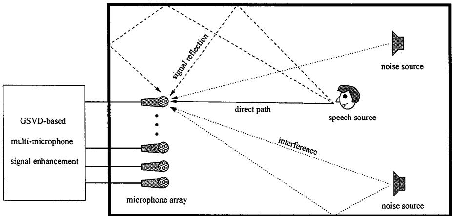  
Fig. 1. Typical speech communication environment with desired speech source and undesired noise sources recorded with a microphone array.

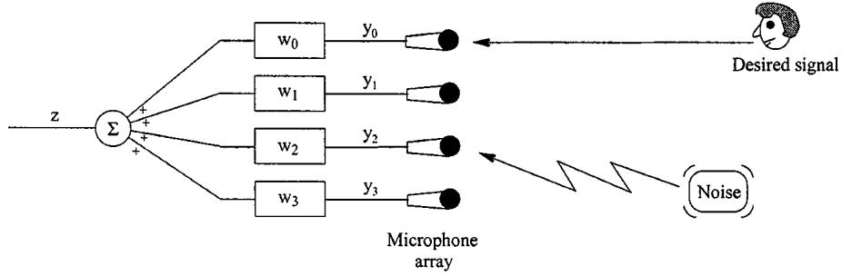  
Fig. 2. Multimicrophone filtering for speech enhancement.

where

$x _ { n } [ k ]$ and $v _ { n } [ k ]$ speech and noise component received at the th microphone, respectively;

$$
h _ {n} [ k ]\tag{⊗}
$$

acoustic room impulse response between the speech source and the th microphone; convolution.

The additive noise can be colored and is assumed to be uncorrelated with the clean speech signal. In single-microphone speech enhancement, the number of microphones is $N = 1$ such that the model (1) simplifies to

$$
y _ {0} [ k ] = x _ {0} [ k ] + v _ {0} [ k ].\tag{2}
$$

The goal of multimicrophone speech enhancement is to compute the filters $\mathbf { w } _ { n } [ k ] , n = 0 , \dots , N - 1$ (see Fig. 2) such that the speech signal $s [ k ]$ or one of the received speech components $x _ { n } [ k ]$ is recovered. A generalized sidelobe canceller (GSC) [22] attempts to recover the speech signal $s [ k ]$ by constraining the array response to unity in the direction of the speech source and by minimizing the energy coming from all other directions. The GSVD-based optimal filtering technique estimates the speech components $x _ { n } [ k ]$ in an optimal way, using all the microphone signals $y _ { n } [ k ]$

Let the filters $\mathbf { w } _ { n } [ k ]$ have length

$$
\mathbf {w} _ {n} [ k ] = [ w _ {n} ^ {0} [ k ] w _ {n} ^ {1} [ k ] \dots w _ {n} ^ {L - 1} [ k ] ] ^ {T}\tag{3}
$$

and consider the -dimensional data vectors ${ \bf y } _ { n } [ k ]$ , the -dimensional stacked filter (with $M = L N )$ , and the -dimensional stacked data vector $\mathbf { y } [ k ]$ , defined as

$$
\mathbf {y} _ {n} [ k ] = [ y _ {n} [ k ] \quad y _ {n} [ k - 1 ] \quad \ldots \quad y _ {n} [ k - L + 1 ] ] ^ {T}\tag{4}
$$

$$
\mathbf {w} [ k ] = [ \mathbf {w} _ {0} ^ {T} [ k ] \quad \mathbf {w} _ {1} ^ {T} [ k ] \quad \ldots \quad \mathbf {w} _ {N - 1} ^ {T} [ k ] ] ^ {T}\tag{5}
$$

$$
\mathbf {y} [ k ] = [ \mathbf {y} _ {0} ^ {T} [ k ] \mathbf {y} _ {1} ^ {T} [ k ] \dots \mathbf {y} _ {N - 1} ^ {T} [ k ] ] ^ {T}\tag{6}
$$

such that the output signal can be written as

$$
z [ k ] = \sum_ {n = 0} ^ {N - 1} \mathbf {w} _ {n} ^ {T} [ k ] \mathbf {y} _ {n} [ k ] = \mathbf {w} ^ {T} [ k ] \mathbf {y} [ k ].\tag{7}
$$

In Section II-B, a method will be described for computing the stacked filter $\mathbf { w } [ k ]$ such that is an optimal estimate for one of the speech components $x _ { n } [ k ]$ . The same method can be used for single-microphone speech enhancement, by taking $N = 1$ in all obtained formulas.

## B. Optimal Filtering

Consider the filtering problem in Fig. 3. is the -dimensional filter input vector, and $\mathbf { z } = \mathbf { W } ^ { T } \mathbf { y }$ is the filter output vector, where is an $M \times M$ filter matrix. The -dimensional vector is the desired response vector, and ${ \bf e } = { \bf d } - { \bf z }$ is the -dimensional error vector. The MSE (mean square error) cost function for optimal filtering is

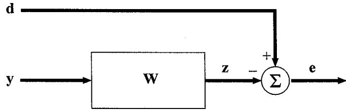  
Fig. 3. Optimal filtering problem with unknown desired response vector d.

$$
\begin{array}{r} \mathbf {J} _ {\mathrm{MSE}} (\mathbf {W}) = E \{\| \mathbf {e} \| _ {2} ^ {2} \} \\ = E \{\mathbf {d} ^ {T} \mathbf {d} \} - 2 E \{\mathbf {y} ^ {T} \mathbf {W} \mathbf {d} \} \\ + E \{\mathbf {y} ^ {T} \mathbf {W} \mathbf {W} ^ {T} \mathbf {y} \} \end{array}\tag{8}
$$

where is the expected value operator. The optimal filter matrix is readily found by setting the derivative $( \partial { \mathbf { J } _ { \mathrm { M S E } } ( \mathbf { W } ) } / \partial { \mathbf { W } } )$ to zero. The optimal filter $\mathbf { W } _ { W F }$ is the well-known multidimensional Wiener filter

$$
\mathbf {W} _ {W F} = \mathbf {R} _ {y y} ^ {- 1} \mathbf {R} _ {y d}\tag{9}
$$

where ${ \bf R } _ { y y } = E \{ { \bf y } { \bf y } ^ { T } \}$ is the $M \times M$ correlation matrix of the input signal, and $\mathbf { R } _ { y d } = E \{ \mathbf { y d } ^ { T } \}$ is the $M \times M$ cross-correlation matrix of the input signal and the desired signal [23]. If both matrices $\mathbf { R } _ { y y }$ and $\mathbf R _ { y d }$ are known, the problem is solved conceptually. Note that for multiple microphones, both the correlation and the cross-correlation matrix contain spatio-temporal information.

When considering multimicrophone noisy speech signals, the input vector consists of a speech component $\mathbf { x } [ k ]$ and an additive noise component

$$
\mathbf {y} [ k ] = \mathbf {x} [ k ] + \mathbf {v} [ k ]\tag{10}
$$

with defined in (6) and $\mathbf { x } [ k ]$ and $\mathbf { v } [ k ]$ similarly defined. If we use a robust voice activity detection (VAD) algorithm [24], [25], noise-only observations can be made during speech pauses (time $k ^ { \prime } )$ , where ${ \boldsymbol { \tau } } [ k ^ { \prime } ] = \mathbf { v } [ k ^ { \prime } ]$ . This allows the estimation of the spatio-temporal correlation properties of the noise signal. The goal is to reconstruct the speech signal from $\mathbf { y } [ k ]$ during speech-and-noise periods by means of the linear filter matrix . In the optimal filtering context, this means that the desired signal is equal to the signal of interest $\mathbf { \mathop { d } } [ k ] = \mathbf { \mathop { x } } [ k ]$ , but this also implies that the desired signal is in fact an unobservable signal.

We now make two assumptions: short-term stationarity of the noise

$$
\mathbf {R} _ {v v} [ k ] = E \left\{\mathbf {v} [ k ] \mathbf {v} ^ {T} [ k ] \right\} = E \left\{\mathbf {v} [ k ^ {\prime} ] \mathbf {v} ^ {T} [ k ^ {\prime} ] \right\} = \mathbf {R} _ {v v} [ k ^ {\prime} ]\tag{11}
$$

and statistical independence of the speech and noise signals

$$
\mathbf {R} _ {x v} [ k ] = E \left\{\mathbf {x} [ k ] \mathbf {v} ^ {T} [ k ] \right\} = \mathbf {0}.\tag{12}
$$

The first assumption allows to estimate the noise correlation matrix $\mathbf { R } _ { v v } [ k ]$ during speech pauses. From the second assumption, it is easily verified that $\mathbf { \bar { R } } _ { y y } [ k ] = \mathbf { R } _ { x x } [ k ] + \mathbf { R } _ { v v } [ k ]$ and ${ \bf R } _ { y x } [ k ] = { \bf R } _ { x x } [ k ]$ such that the optimal filter matrix can be written as

$$
\mathbf {W} _ {W F} = \mathbf {R} _ {y y} ^ {- 1} [ k ] \left(\mathbf {R} _ {y y} [ k ] - \mathbf {R} _ {v v} [ k ]\right)\tag{13}
$$

where, again, ${ \bf R } _ { y y } [ k ] = E \{ { \bf y } [ k ] { \bf y } ^ { T } [ k ] \}$ is estimated during speech-and-noise periods, and $\mathbf { R } _ { v v } [ k ] = E \{ \mathbf { v } [ k ^ { \prime } ] \mathbf { v } ^ { T } [ k ^ { \prime } ] \}$ is estimated during noise-only periods.

By using the joint diagonalization of the symmetric block-Toeplitz correlation matrices ${ \bf R } _ { y y } [ k ]$ and $\mathbf { R } _ { v v } [ k ]$ in the calculation of the optimal filter $\mathbf { W } _ { W F }$ , the low-rank model of the clean speech signal can be taken into account (cfr. Section II-C). The joint diagonalization of $\mathbf { R } _ { y y } [ k ]$ and ${ \bf R } _ { v v } [ k ]$ is defined as (we assume full-rank matrices)

$$
\left\{ \begin{array}{l} \mathbf {R} _ {y y} [ k ] = \bar {\mathbf {Q}} \operatorname{diag} \left\{\bar {\sigma} _ {i} ^ {2} \right\} \bar {\mathbf {Q}} ^ {T} \\ \mathbf {R} _ {v v} [ k ] = \bar {\mathbf {Q}} \operatorname{diag} \left\{\bar {\eta} _ {i} ^ {2} \right\} \bar {\mathbf {Q}} ^ {T} \end{array} \right.\tag{14}
$$

where $\bar { \mathbf { Q } }$ is an invertible, but not necessarily orthogonal, matrix [26]. Substituting (14) into (13) gives an expression for the optimal filter matrix

$$
\mathbf {W} _ {W F} = \bar {\mathbf {Q}} ^ {- T} \mathrm{diag} \left\{1 - \frac {\bar {\eta} _ {i} ^ {2}}{\bar {\sigma} _ {i} ^ {2}} \right\} \bar {\mathbf {Q}} ^ {T}.\tag{15}
$$

In the spatio-temporal white noise case, the noise correlation matrix is ${ \mathbf { R } } _ { v v } [ k ] = \bar { \eta } ^ { 2 } I _ { M }$ , where $\bar { \eta } ^ { 2 }$ is the noise power. The matrix $\bar { \mathbf { Q } }$ then reduces to an orthogonal matri such that $\mathbf { W } _ { W F }$ is a symmetric matrix

$$
\mathbf {W} _ {W F} = \bar {\mathbf {Q}} \operatorname{diag} \left\{1 - \frac {\bar {\eta} ^ {2}}{\bar {\sigma} _ {i} ^ {2}} \right\} \bar {\mathbf {Q}} ^ {T}.\tag{16}
$$

The enhanced speech vector $\hat { \mathbf { x } } [ k ] ~ = ~ \mathbf { z } [ k ]$ is obtained as $\hat { \mathbf { x } } [ k ] = \mathbf { W } _ { W F } ^ { T } \mathbf { y } [ k ]$ . The -dimensional vector $\mathbf { \hat { x } } [ k ]$ contains an estimate for all the speech samples $x _ { n } [ k - l ] , n = 0 , \ldots , N - 1$ $l = 0 , \ldots , L - 1$

The estimation error is defined as ${ \bf e } [ k ] = \hat { \bf x } [ k ] - { \bf x } [ k ] =$ ${ \bf W } _ { W F } ^ { T } { \bf y } [ k ] - { \bf x } [ k ]$ such that the error covariance matrix ${ \bf R } _ { e e } [ k ]$ can be written as

$$
\begin{array}{r l} \mathbf {R} _ {e e} [ k ] = & E \left\{\left(\mathbf {W} _ {W F} ^ {T} \mathbf {y} [ k ] - \mathbf {x} [ k ]\right) \left(\mathbf {W} _ {W F} ^ {T} \mathbf {y} [ k ] - \mathbf {x} [ k ]\right) ^ {T} \right\} \\ = & \mathbf {W} _ {W F} ^ {T} \mathbf {R} _ {x x} [ k ] - \mathbf {R} _ {x x} [ k ] \mathbf {W} _ {W F} - \mathbf {W} _ {W F} ^ {T} \mathbf {R} _ {x x} [ k ] \\ + & \mathbf {R} _ {x x} [ k ] \\ = & (\mathbf {R} _ {y y} [ k ] - \mathbf {R} _ {v v} [ k ]) (I _ {M} - \mathbf {W} _ {W F}) \\ = & \mathbf {R} _ {v v} [ k ] \mathbf {W} _ {W F}. \end{array} \tag {1}\tag{17}
$$

The elements $\{ { \bf R } _ { e e } [ k ] \} _ { i i } , i = 1 , \ldots , M$ on the main diagonal of the error covariance matrix indicate how well the th component of , i.e., a delayed speech sample in a certain microphone signal, is estimated. The smallest element on the diagonal, say, element $i ,$ therefore corresponds to the best estimator, namely, the column ${ \bf w } _ { W F } ^ { i }$ of $\mathbf { W } _ { W F }$

## C. Low-Rank Modeling of Speech

If we model the acoustic room impulse response with an FIRfilter $\mathbf { h } _ { n } [ k ]$ of length

$$
\mathbf {h} _ {n} [ k ] = [ h _ {n} ^ {0} [ k ] \quad h _ {n} ^ {1} [ k ] \quad \ldots \quad h _ {n} ^ {K - 1} [ k ] ] ^ {T}\tag{18}
$$

then the speech component $x _ { n } [ k ]$ can be written as

$$
x _ {n} [ k ] = \sum_ {i = 0} ^ {K - 1} h _ {n} ^ {i} [ k ] s [ k - i ].\tag{19}
$$

The data vector $\mathbf { x } _ { n } [ k ]$ and stacked data vector $\mathbf { x } [ k ]$ , which are similarly defined as in (6), can be written as

$$
\begin{array}{r l} & {\mathbf {x} _ {n} [ k ] = \left[ \begin{array}{c} x _ {n} [ k ] \\ x _ {n} [ k - 1 ] \\ \vdots \\ x _ {n} [ k - L + 1 ] \end{array} \right]} \\ & {= \underbrace {\left[ \begin{array}{c c c c} \boxed {\mathbf {h} _ {n} ^ {T} [ k ]} & 0 & \ldots & 0 \\ 0 & \boxed {\mathbf {h} _ {n} ^ {T} [ k ]} & \ldots & 0 \\ & & \ddots & \\ 0 & 0. & \boxed {\mathbf {h} _ {n} ^ {T} [ k ]} \end{array} \right]} _ {\text {}}.} \end{array}
$$

$$
\times \underbrace {\left[ \begin{array}{c} s [ k ] \\ s [ k - 1 ] \\ \vdots \\ s [ k - K - L + 2 ] \end{array} \right]} _ {\mathbf {s} [ k ]}\tag{20}
$$

$$
\mathbf {x} [ k ] = \underbrace {\left[ \begin{array}{c} H _ {0} [ k ] \\ H _ {1} [ k ] \\ \vdots \\ H _ {N - 1} [ k ] \end{array} \right]} _ {\mathcal {H} [ k ]} \mathbf {s} [ k ]\tag{21}
$$

where $H _ { n } [ k ]$ is an $L \times ( K + L - 1 )$ matrix, and $\mathcal { H } [ k ]$ is an $M \times ( K \bar { + } \bar { L } - 1 )$ matrix (with typically $K \gg M )$

If the clean speech signal $s [ k ]$ can be modeled with a low-rank model of rank [15], [16] with $R \leq K + L - 1$ , then the signal vector can be written as a linear combination of linear independent basis vectors $\{ \mathbf { s } _ { 1 } [ k ] , \ldots , \mathbf { s } _ { R } [ k ] \}$

$$
\mathbf {s} [ k ] = \sum_ {r = 1} ^ {R} \mathbf {s} _ {r} [ k ] \alpha_ {r}.\tag{22}
$$

Since the correlation matrix ${ \bf R } _ { s s } [ k ] = E \{ { \bf s } [ k ] { \bf s } ^ { T } [ k ] \}$ is then a rank- ${ \mathbf { \nabla } } \cdot R$ matrix, the correlation matrix $\mathbf { R } _ { x x } [ k ]$ , which can be written as

$$
\mathbf {R} _ {x x} [ k ] = \mathcal {H} [ k ] \mathbf {R} _ {s s} [ k ] \mathcal {H} ^ {T} [ k ]\tag{23}
$$

is also a rank- matrix (if $R \leq M$ and $\mathcal { H } [ k ]$ is assumed to be of full row rank). The generalized eigenvalue decomposition of $\mathbf { R } _ { x x } [ k ]$ and ${ \bf R } _ { v v } [ k ]$ is then given by

$$
\left\{ \begin{array}{l} \mathbf {R} _ {x x} [ k ] = \bar {\mathbf {Q}} \left[ \begin{array}{c c} \bar {\boldsymbol {\Lambda}} _ {x} & \mathbf {0} \\ \mathbf {0} & \mathbf {0} \end{array} \right] \bar {\mathbf {Q}} ^ {T} \\ \mathbf {R} _ {v v} [ k ] = \bar {\mathbf {Q}} \left[ \begin{array}{c c} \bar {\boldsymbol {\Lambda}} _ {n 1} & \mathbf {0} \\ \mathbf {0} & \bar {\boldsymbol {\Lambda}} _ {n 2} \end{array} \right] \bar {\mathbf {Q}} ^ {T} \end{array} \right.\tag{24}
$$

where $\bar { \Lambda } _ { x }$ and $\bar { \Lambda } _ { n 1 }$ are $R \times R$ diagonal matrices, and $\bar { \mathbf { \Lambda } } _ { n 2 }$ is an $( M - R ) \times ( M - R )$ diagonal matrix. Since $\mathbf { R } _ { x x } [ k ]$ and ${ \bf R } _ { v v } [ k ]$ can be assumed positive (semi-)definite matrices, all diagonal elements are positive. The correlation matrix $\mathbf { R } _ { y y } [ k ]$ can now be written as

$$
\mathbf {R} _ {y y} [ k ] = \mathbf {R} _ {x x} [ k ] + \mathbf {R} _ {v v} [ k ] = \bar {\mathbf {Q}} \left[ \begin{array}{c c} \bar {\boldsymbol {\Lambda}} _ {x} + \bar {\boldsymbol {\Lambda}} _ {n 1} & \mathbf {0} \\ \mathbf {0} & \bar {\boldsymbol {\Lambda}} _ {n 2} \end{array} \right] \bar {\mathbf {Q}} ^ {T}.\tag{25}
$$

Comparing this equation with (14), we see that

$$
\left\{ \begin{array}{l l} \bar {\sigma} _ {i} ^ {2} > \bar {\eta} _ {i} ^ {2} & i = 1, \ldots , R \\ \bar {\sigma} _ {i} ^ {2} = \bar {\eta} _ {i} ^ {2} & i = R + 1, \ldots , M. \end{array} \right.\tag{26}
$$

This implies that the diagonal matrix in (15) has $R$ positive nonzero elements. Even if the signal cannot be modeled with a low-rank model, i.e., $R = M$ , none of the diagonal elements can ever become negative. This fact will be used in the practical computation of the optimal filter matrix (cfr. Section III).

In the spatio-temporal white noise case, all $\bar { \eta } _ { i } ^ { 2 } , i = 1 , \ldots , M$ are equal to $\overline { { \eta } } ^ { 2 }$ such that the noise power $\overline { { \eta } } ^ { 2 }$ can be estimated from the smallest eigenvalues of $\mathbf { R } _ { y y } [ k ]$ if the speech components can be modeled with a low-rank model. This also implies that in this case, no voice activity detection is required.

## D. General Class of Estimators

The filter matrix in fact belongs to a more general class of estimators, which can be represented as

$$
\mathbf {W} = \bar {\mathbf {Q}} ^ {- T} \mathrm{diag} \left\{f \left(\bar {\sigma} _ {i} ^ {2}, \bar {\eta} _ {i} ^ {2}\right) \right\} \bar {\mathbf {Q}} ^ {T}\tag{27}
$$

where $f ( \overline { { \sigma } } _ { i } ^ { 2 } , \overline { { \eta } } _ { i } ^ { 2 } )$ is a function of the generalized eigenvalues, depending on the specific cost criterion being optimized. This formula can be interpreted as an analysis filterbank $\bar { \mathbf { Q } } ^ { - T }$ that performs a transformation from the time domain to a signal-dependent transform domain, a gain function $f ( \overline { { \sigma } } _ { i } ^ { 2 } , \overline { { \eta } } _ { i } ^ { 2 } )$ that modifies the transform domain parameters, and a synthesis filterbank $\bar { \mathbf { Q } } ^ { T }$ that performs a transformation back to the time domain [18].

If the MSE criterion is optimized, the filter is equal to (15). If the SNR is optimized and a least-squares (LS) estimate of rank 1 is made, only the principal generalized eigenvector should be considered, such that the gain function is $\overline { { f ( \bar { \sigma } _ { i } ^ { 2 } , \bar { \eta } _ { i } ^ { 2 } ) = [ 1 { \quad \mathrm { ~ 0 ~ } \quad } \dots \quad 0 ] } }$ . This will, however, introduce a significant amount of signal distortion. In [11], two perceptually relevant cost criteria that minimize the signal distortion while keeping the residual noise energy below some given threshold have been presented. In fact, the estimation error $\mathbf { e } [ k ]$ is the sum of a term $\mathbf { e } _ { y } [ k ]$ representing signal distortion and a term $\mathbf { e } _ { v } [ k ]$ representing the residual noise

$$
\mathbf {e} [ k ] = \mathbf {W} ^ {T} \mathbf {y} [ k ] - \mathbf {x} [ k ] = \underbrace {\left(\mathbf {W} ^ {T} - I _ {M}\right) \mathbf {x} [ k ]} _ {\mathbf {e} _ {y} [ k ]} + \underbrace {\mathbf {W} ^ {T} \mathbf {v} [ k ]} _ {\mathbf {e} _ {v} [ k ]}.\tag{28}
$$

If we want to minimize the energy of the signal distortion $\epsilon _ { y } ^ { 2 } [ k ] = E \{ \mathbf { e } _ { y } ^ { T } [ k ] \mathbf { e } _ { y } [ k ] \}$ under the constraint that the residual noise energy $\begin{array} { r } { \dot { \epsilon } _ { v } ^ { 2 } [ k ] = { \cal E } \{ { \bf e } _ { v } ^ { T } [ k ] { \bf e } _ { v } [ k ] \} } \end{array}$ is kept below some given threshold $T$

$$
\min _ {\mathbf {W}} \epsilon_ {y} ^ {2} [ k ], \text { subject   to } \epsilon_ {v} ^ {2} [ k ] \leq T\tag{29}
$$

we can easily prove that the filter is equal to

$$
\begin{array}{r l} \mathbf {W} & = (\mathbf {R} _ {x x} [ k ] + \mu \mathbf {R} _ {v v} [ k ]) ^ {- 1} \mathbf {R} _ {x x} [ k ] \\ & = (\mathbf {R} _ {y y} [ k ] + (\mu - 1) \mathbf {R} _ {v v} [ k ]) ^ {- 1} (\mathbf {R} _ {y y} [ k ] - \mathbf {R} _ {v v} [ k ]) \end{array}\tag{30}
$$

(31)

$$
= \bar {\mathbf {Q}} ^ {- T} \mathrm{diag} \left\{\frac {\bar {\sigma} _ {i} ^ {2} - \bar {\eta} _ {i} ^ {2}}{\bar {\sigma} _ {i} ^ {2} + (\mu - 1) \bar {\eta} _ {i} ^ {2}} \right\} \bar {\mathbf {Q}} ^ {T}\tag{32}
$$

with the Lagrange-multiplier $\mu > 0$ related to as

$$
\begin{array}{l} T = \operatorname{tr} \left\{\mathbf {W} ^ {T} \mathbf {R} _ {v v} [ k ] \mathbf {W} \right\} \\ = \operatorname{tr} \left\{\bar {\mathbf {Q}} ^ {- T} \operatorname{diag} \left\{\left(\frac {\bar {\sigma} _ {i} ^ {2} - \bar {\eta} _ {i} ^ {2}}{\bar {\sigma} _ {i} ^ {2} + (\mu - 1) \bar {\eta} _ {i} ^ {2}}\right) ^ {2} \bar {\eta} _ {i} ^ {2} \right\} \bar {\mathbf {Q}} ^ {T} \right\}. \end{array}\tag{33}
$$

In fact, a similar expression can be obtained when the residual noise energy $\epsilon _ { v } ^ { 2 } [ k ]$ is minimized while keeping the signal distortion $\epsilon _ { y } ^ { 2 } [ k ]$ below a given threshold. If $\mu = 1$ , then the MSE criterion is minimized, and is equal to (15). If $\mu > 1$ , the residual noise level will be lower, at the expense of increased signal distortion. Taking $\mu < 1$ reduces the signal distortion at the expense of decreased noise reduction (if $\mu = 0 ,$ then ${ \bf W } = I _ { M } )$ . In the rest of the paper, we will assume MSE estimation $( \mu = 1 )$ .

In all subspace-based single-microphone speech enhancement techniques [7]–[9], [11]–[14], the resulting filter matrix can be written as in (27). In Section IV, we will prove symmetry properties for this filter matrix.

## III. PRACTICAL COMPUTATION USING GSVD

In practice, the matrix $\bar { \mathbf { Q } }$ and the diagonal elements $\overline { { \sigma } } _ { i } ^ { 2 }$ and $\overline { { \eta } } _ { \overline { { i } } } ^ { 2 }$ are estimated by means of a generalized singular value decomposition (GSVD) [26], [27] of ${ \mathrm { a } p } \times M$ speech data matrix $\mathbf { Y } [ k ]$ containing speech data vectors recorded during speech-andnoise periods and a $q \times M$ noise data matrix $\mathbf { V } [ k ^ { \prime } ]$ containing noise data vectors recorded during noise-only periods (with and typically larger than )

$$
\mathbf {Y} [ k ] = \left[ \begin{array}{c} \mathbf {y} ^ {T} [ k - p + 1 ] \\ \vdots \\ \mathbf {y} ^ {T} [ k - 1 ] \\ \mathbf {y} ^ {T} [ k ] \end{array} \right] \quad \mathbf {V} [ k ^ {\prime} ] = \left[ \begin{array}{c} \mathbf {v} ^ {T} [ k ^ {\prime} - q + 1 ] \\ \vdots \\ \mathbf {v} ^ {T} [ k ^ {\prime} - 1 ] \\ \mathbf {v} ^ {T} [ k ^ {\prime} ] \end{array} \right].\tag{34}
$$

For the sake of a simple interpretation, we assume here that the time indices in $\mathbf { Y } [ k ]$ and $\mathbf { V } [ k ^ { \prime } ]$ are consecutive. These time indices do not need to be consecutive, as long as $\mathbf { Y } [ k ]$ contains speech data vectors and $\mathbf { V } [ k ^ { \prime } ]$ contains noise data vectors.

Both the speech and the noise data matrix are block-Toeplitz (and Toeplitz in the single-microphone case). The correlation matrices $\mathbf { R } _ { y y } [ k ]$ and ${ \bf R } _ { v v } [ k ]$ can be approximated by the empirical correlation matrices $\bar { \mathbf { Y } } ^ { T } [ k ] \mathbf { Y } [ \bar { k } ] / p$ and ${ \bf V } ^ { T } [ \dot { k ^ { \prime } } ] { \bf V } [ k ^ { \prime } ] / q$ (which is an approximation because of the finite lengths and $q )$ . The GSVD of the data matrices and $\mathbf { V } [ k ^ { \prime } ]$ is defined as

$$
\left\{ \begin{array}{l} \mathbf {Y} [ k ] = \mathbf {U} _ {Y} \boldsymbol {\Sigma} _ {Y} \mathbf {Q} ^ {T} \\ \mathbf {V} [ k ^ {\prime} ] = \mathbf {U} _ {V} \boldsymbol {\Sigma} _ {V} \mathbf {Q} ^ {T} \end{array} \right.\tag{35}
$$

where $\Sigma _ { Y } = \mathrm { d i a g } \{ \sigma _ { i } \} , \Sigma _ { V } = \mathrm { d i a g } \{ \eta _ { i } \}$ , and $\mathbf { U } _ { V }$ are orthogonal matrices, is an invertible but not necessarily orthogonal matrix containing the generalized singular vectors, and $\sigma _ { i } / \eta _ { i }$ are the generalized singular values. Substituting these formulas into (13) gives an estimate for the optimal filter matrix

$$
\mathbf {W} _ {W F} \simeq \mathbf {Q} ^ {- T} \mathrm{diag} \left\{1 - \frac {p}{q} \frac {\eta_ {i} ^ {2}}{\sigma_ {i} ^ {2}} \right\} \mathbf {Q} ^ {T}\tag{36}
$$

showing that the optimal filter matrix estimate is a function of the generalized singular vectors and singular values of the speech and noise data matrices.

Because, in practice, the generalized singular values are estimated from the empirical correlation matrices, it occurs that (26) is no longer satisfied, and hence, some diagonal elements in (36) may become negative. In [11], it has already been noted that these negative values will always be obtained when an unbiased nonperfect estimator is used. Therefore, these negative values, which are in fact zero estimates, will be put to zero.

Using the speech data matrix and the optimal filter matrix $\mathbf { W } _ { W F }$ , an estimate can be obtained for the $p \times M$ clean speech data matrix ${ \hat { \mathbf { X } } } [ k ]$ , which is defined similarly to (34) as

$$
\begin{array}{r l} & {\hat {\mathbf {X}} [ k ] = \left[ \begin{array}{c c c} \hat {\mathbf {x}} _ {0} ^ {T} [ k - p + 1 ] & \ldots & \hat {\mathbf {x}} _ {N - 1} ^ {T} [ k - p + 1 ] \\ \vdots & & \vdots \\ \hat {\mathbf {x}} _ {0} ^ {T} [ k - 1 ] & \ldots & \hat {\mathbf {x}} _ {N - 1} ^ {T} [ k - 1 ] \\ \hat {\mathbf {x}} _ {0} ^ {T} [ k ] & \ldots & \hat {\mathbf {x}} _ {N - 1} ^ {T} [ k ] \end{array} \right]} \\ & {\quad = \mathbf {Y} [ k ] \mathbf {W} _ {W F}.} \end{array}\tag{37}
$$

Using a more explicit notation, we can rewrite the $p \times L$ submatrix ${ \hat { \mathbf { X } } } _ { j } [ k ] \ \mathrm { a s } , ( 3 8 )$ , shown at the bottom of the page, where $\hat { x } _ { j , k } ^ { k - L + 1 } [ \check { k } ]$ is the estimate for the speech component $x _ { j } [ k ]$ in the th microphone signal at time $k ,$ which is obtained as a linear combination of the noisy microphone samples $y _ { n } [ k -$ $L + 1 ] , . . . , y _ { n } [ k ] , n = 0 , . . . , N - 1$ . As can be easily seen from this matrix, several different estimates are available for the same speech sample, e.g., different estimates are available for $x _ { 0 } [ k - L + 1 ]$ . If we subdivide the th column ${ \bf w } _ { W F } ^ { i }$ of $\mathbf { W } _ { W F }$ into the -dimensional filters $\mathbf { w } _ { n } ^ { i } , n = 0 , \dots , N - \bar { 1 }$ , which is similar to (5)

$$
\mathbf {w} _ {W F} ^ {i} = \left[ \begin{array}{l l l l} \mathbf {w} _ {0} ^ {i ^ {T}} & \mathbf {w} _ {1} ^ {i ^ {T}} & \dots & \mathbf {w} _ {N - 1} ^ {i ^ {T}} \end{array} \right] ^ {T}\tag{39}
$$

then the different estimates for $x _ { 0 } [ k - L + 1 ]$ can be explicitly written as (40), shown at the bottom of the next page, where $\mathcal { W } _ { j }$ is the filter matrix used for estimating speech components in the th microphone signal. The question now arises as to which of the available estimates in the th microphone signal is the best estimate. In addition, we have to decide from which of the microphone signals we are going to use the speech estimates, which in fact leads to possibilities. As already

$$
\hat {\mathbf {X}} _ {j} [ k ] = \left[ \begin{array}{c} \hat {\mathbf {x}} _ {j} ^ {T} [ k - p + 1 ] \\ \vdots \\ \hat {\mathbf {x}} _ {j} ^ {T} [ k - 1 ] \\ \hat {\mathbf {x}} _ {j} ^ {T} [ k ] \end{array} \right] = \left[ \begin{array}{c c c c} \hat {x} _ {j, k - p + 1} ^ {k - L - p + 2} [ k - p + 1 ] & \hat {x} _ {j, k - p + 1} ^ {k - L - p + 2} [ k - p ] & \ldots & \hat {x} _ {j, k - p + 1} ^ {k - L - p + 2} [ k - L - p + 2 ] \\ \vdots & \vdots & & \vdots \\ \hat {x} _ {j, k - 2} ^ {k - L - 1} [ k - 2 ] & \hat {x} _ {j, k - 2} ^ {k - L - 1} [ k - 3 ] & \ldots & \hat {x} _ {j, k - 2} ^ {k - L - 1} [ k - L - 1 ] \\ \hat {x} _ {j, k - 1} ^ {k - L} [ k - 1 ] & \hat {x} _ {j, k - 1} ^ {k - L} [ k - 2 ] & \ldots & \hat {x} _ {j, k - 1} ^ {k - L} [ k - L ] \\ \hat {x} _ {j, k} ^ {k - L + 1} [ k ] & \hat {x} _ {j, k} ^ {k - L + 1} [ k - 1 ] & \ldots & \hat {x} _ {j, k} ^ {k - L + 1} [ k - L + 1 ] \end{array} \right]\tag{38}
$$

indicated in Section II-B, the answer is given by the error covariance matrix ${ \bf R } _ { e e } [ k ]$ . The th diagonal element of this matrix indicates how well the th component of $\mathbf { x } [ k ]$ is estimated. The smallest element on the diagonal, say, element , therefore corresponds to the best estimator, namely, the column $\mathbf { w } _ { W F } ^ { i }$ of $\mathbf { W } _ { W F } \left( 1 \leq i \leq M \right)$ . The enhanced speech signal ${ \hat { x } } [ k ]$ can now be computed as

$$
\left[ \begin{array}{c} \hat {x} _ {j} [ k - \Delta - p + 1 ] \\ \vdots \\ \hat {x} _ {j} [ k - \Delta - 1 ] \\ \hat {x} _ {j} [ k - \Delta ] \end{array} \right] = \mathbf {Y} [ k ] \mathbf {w} _ {W F} ^ {i}\tag{41}
$$

where

$$
j = \operatorname{div} (i - 1, L)\tag{42}
$$

$$
\Delta = \operatorname{rem} (i - 1, L).\tag{43}
$$

In the single-microphone case, some procedures [7]–[10] use an additional averaging step, thereby averaging out over all available speech estimates. However, it will be shown in Section IV-B that this averaging step is unnecessary and even suboptimal. Other procedures [11], [12], which are block-based, use an overlap-add procedure on the last row of $\hat { \bf X } _ { 0 } [ k ]$ , whereas the adaptive procedure in [14] only retains the first element of this row at each time step, thereby implicitly using the first column of $\mathbf { W } _ { W F } \left( i = 1 \right)$

The optimal procedure for minimizing the MSE thus consists of computing $\mathbf { R } _ { e e } [ k ]$ at each time step and choosing the column corresponding to its smallest diagonal element. However, this is a computationally very demanding procedure. Simulations indicate that taking a fixed value $i = L / 2 ,$ i.e., using the optimal estimate of the delayed speech component in the first microphone signal $x _ { 0 } [ k - ( L / 2 ) + 1 ]$ , instead of the optimal value does not decrease the noise reduction performance and the speech intelligibility considerably [28].

## IV. SYMMETRY PROPERTIES AND AVERAGING OPERATION

## A. Single-Microphone Case

In the single-microphone case, the correlation matrices $\mathbf { R } _ { y y } [ k ]$ and ${ \bf R } _ { v v } [ k ]$ are symmetric Toeplitz matrices. These matrices belong to the class of double symmetric matrices, which are symmetric with respect to both the main and the secondary diagonal and whose eigenvectors have special symmetry properties [29], i.e., every eigenvector is either symmetric or skew-symmetric.

Theorem 1: If is constructed according to (27), then satisfies

$$
\mathbf {W} = J \mathbf {W} J \quad (\mathbf {W} ^ {T} = J \mathbf {W} ^ {T} J)\tag{44}
$$

where $J = J ^ { T }$ is the $M \times M$ reverse identity matrix. These properties hold in the white noise case as well as in the colored noise case for any function $f \left( \overline { { \sigma } } _ { i } ^ { 2 } , \overline { { \eta } } _ { i } ^ { 2 } \right)$

Proof: Considering the joint diagonalization of $\mathbf { R } _ { y y } [ k ]$ and ${ \bf R } _ { v v } [ k ]$ in (14), one can easily verify that

$$
\mathbf {R} _ {y y} ^ {- 1} [ k ] \mathbf {R} _ {v v} [ k ] = \bar {\mathbf {Q}} ^ {- T} \mathrm{diag} \left\{\frac {\bar {\eta} _ {i} ^ {2}}{\bar {\sigma} _ {i} ^ {2}} \right\} \bar {\mathbf {Q}} ^ {T}\tag{45}
$$

is an eigenvalue decomposition. Because $\mathbf { R } _ { y y } [ k ]$ and ${ \bf R } _ { v v } [ k ]$ are double-symmetric matrices

$$
J \mathbf {R} _ {y y} [ k ] J = \mathbf {R} _ {y y} [ k ], \quad J \mathbf {R} _ {v v} [ k ] J = \mathbf {R} _ {v v} [ k ]\tag{46}
$$

such that

$$
\mathbf {R} _ {y y} ^ {- 1} [ k ] \mathbf {R} _ {v v} [ k ] = J \mathbf {R} _ {y y} ^ {- 1} [ k ] \mathbf {R} _ {v v} [ k ] J.\tag{47}
$$

Therefore, the eigenvectors, which are the columns of $\bar { \mathbf { Q } } ^ { - T }$ satisfy the property [29]

$$
J \bar {\mathbf {Q}} ^ {- T} = \bar {\mathbf {Q}} ^ {- T} \mathrm{diag} \{\pm 1 \}\tag{48}
$$

$$
\left[ \begin{array}{c} \hat {x} _ {0, k} ^ {k - L + 1} [ k - L + 1 ] \\ \hat {x} _ {0, k - 1} ^ {k - L} [ k - L + 1 ] \\ \vdots \\ \hat {x} _ {0, k - L + 1} ^ {k - 2 L + 2} [ k - L + 1 ] \end{array} \right] = \underbrace {\left[ \begin{array}{c c c c c c c c c c c c c c c c c c c c c c c c c c c c c c c c c c c c c c c c c c c c c c c c c c c c c c c c c c c c} \boxed {\mathbf {w} _ {0} ^ {L ^ {T}}} & & & & & & & & & & & & & & & & & & & & & & & & & & & & & & & & & & & & & & & & & \\ 0 & \boxed {\mathbf {w} _ {0} ^ {L - 1 ^ {T}}} & & & & & & & & & & & & & & & & & & & & & & & & & & & & & & & & & & & & & \\ 0 & \ddots & & & & & & & & & & & & & & & & & & & & & & & & & & & & & & & & & & & & \\ 0 & 0 & \ldots & \boxed {\mathbf {w} _ {0} ^ {1 ^ {T}}} \end{array} \right]} _ {\mathcal {W} _ {0} ^ {T}} \times \left[ \begin{array}{c} y _ {0} [ k ] \\ \vdots \\ y _ {0} [ k - 2 L + 2 ] \\ \hline \vdots \\ \hline y _ {N - 1} [ k ] \\ \vdots \\ y _ {N - 1} [ k - 2 L + 2 ] \end{array} \right]\tag{40}
$$

such that

$$
J \mathbf {W} J = J \bar {\mathbf {Q}} ^ {- T} \mathrm{diag} \left\{f \left(\bar {\sigma} _ {i} ^ {2}, \bar {\eta} _ {i} ^ {2}\right) \right\} \bar {\mathbf {Q}} ^ {T} J\tag{49}
$$

$$
= \bar {\mathbf {Q}} ^ {- T} \mathrm{diag} \left\{f \left(\bar {\sigma} _ {i} ^ {2}, \bar {\eta} _ {i} ^ {2}\right) \right\} \bar {\mathbf {Q}} ^ {T} = \mathbf {W}.\tag{50}
$$

These symmetry properties imply that the th row/column of is equal to the $( L + 1 - i )$ th row/column in reversed order. For odd, the middle column in is symmetric and, hence, represents a linear phase filter. This linear phase property is an extension of the zero phase property that has already been attributed to SVD and rank truncation based estimators for the white noise case if an additional averaging step is included [30] (cfr. Section IV-B). However, the above linear phase property is also valid for the colored noise case as well as for a general function $f \left( \bar { \sigma } _ { i } ^ { 2 } , \bar { \eta } _ { i } ^ { 2 } \right)$ .

## B. Averaging Operation

As already indicated in Section III, some single-microphone procedures [7]–[10] use an averaging step for obtaining a final estimate from the different available estimates for $x _ { 0 } [ k { - } L { + } 1 ]$ In the single-microphone case, (40) reduces to (51), shown at the bottom of the page. From $\mathbf { W } ^ { T } = J \mathbf { W } ^ { T } J$ , with

$$
\mathbf {W} = [ \begin{array}{l l l l} \mathbf {w} _ {0} ^ {1} & \dots & \mathbf {w} _ {0} ^ {L - 1} & \mathbf {w} _ {0} ^ {L} \end{array} ]\tag{52}
$$

it immediately follows that

$$
\mathcal {W} _ {0} ^ {T} = J \mathcal {W} _ {0} ^ {T} J.\tag{53}
$$

The averaging operation can now be written as

$$
\begin{array}{r l} & {\tilde {x} _ {0, k} ^ {k - 2 L + 2} [ k - L + 1 ]} \\ & {\qquad = [ \frac {1}{L} \quad \frac {1}{L} \quad \dots \quad \frac {1}{L} ] \left[ \begin{array}{c} \hat {x} _ {0, k} ^ {k - L + 1} [ k - L + 1 ] \\ \hat {x} _ {0, k - 1} ^ {k - L} [ k - L + 1 ] \\ \vdots \\ \hat {x} _ {0, k - L + 1} ^ {k - 2 L + 2} [ k - L + 1 ] \end{array} \right]} \end{array}\tag{54}
$$

$$
= \underbrace {[ \begin{array}{c c c c} \frac {1}{L} & \frac {1}{L} & \ldots & \frac {1}{L} \end{array} ] \mathcal {W} _ {0} ^ {T}} _ {\tilde {\mathbf {W}} ^ {T}} \left[ \begin{array}{c} y _ {0} [ k ] \\ y _ {0} [ k - 1 ] \\ \vdots \\ y _ {0} [ k - 2 L + 2 ] \end{array} \right]\tag{55}
$$

where the averaged value $\tilde { x } _ { 0 , k } ^ { k - 2 L + 2 } [ k - L + 1 ]$ is estimated from $y _ { 0 } [ k - L + 1 ]$ together with $L - 1$ past samples and $L - 1$ future samples. The $( 2 L - 1 )$ -dimensional filter is obtained by averaging out over the available -dimensional filters ${ \bf w } _ { W F } ^ { i } ,$ $i = 1 , \ldots , L$ . From the symmetry property of ${ \mathcal { W } } _ { 0 }$ , it is readily seen that represents a zero phase filter. The question now is whether has a better performance than the individual filters $\mathbf { w } _ { W F } ^ { i }$ from which it is computed. Specifically, should be compared with the symmetric middle row of $\mathbf { W } _ { W F }$ (if is odd), which represents a linear phase filter that uses $( L - 1 / 2 )$ past samples and $( L - 1 / 2 )$ future samples.

First, it can be verified that is not the -dimensional optimal filter, i.e.,

$$
\tilde {x} _ {0, k} ^ {k - 2 L + 2} [ k - L + 1 ] \neq \hat {x} _ {0, k} ^ {k - 2 L + 2} [ k - L + 1 ]\tag{56}
$$

since $\tilde { x } _ { 0 , k } ^ { k - 2 L + 2 } [ k { - } L { + } 1 ]$ is obtained by averaging out over a collection of -dimensional optimal filters, whereas $\hat { x } _ { 0 , k } ^ { k - 2 L + 2 } [ k -$ $L + 1 ]$ is obtained by applying the optimal filter formulas to a $( 2 L - 1 )$ -dimensional vector .

Second, simulations indicate that the obtained error variance for the $( 2 L - 1 )$ -dimensional filter is always larger than the error variance for the best -dimensional filter $\mathbf { w } _ { W F } ^ { i } ,$ which is obtained by considering the smallest diagonal element of the error covariance matrix ${ \bf R } _ { e e } [ k ]$

Consider the following simulation example: The input signal $y [ k ]$ is constructed as the sum of two (stationary) unit-variance white noise signals and

$$
y [ k ] = x [ k ] + \eta v [ k ], \quad k = 1, \dots , p.\tag{57}
$$

Both the optimal filter matrix $\mathbf { W } _ { W F }$ , which consists of $L { \mathrm { - } } \mathrm { d i } .$ mensional filters $\begin{array} { r } { { \bf w } _ { W F } ^ { i } , i = 1 , \ldots , L , } \end{array}$ , and the $( 2 L - 1 )$ -dimensional filter are computed from these signals. In addition, the enhanced signals ${ \hat { x } } ^ { i } [ k ]$ and $\tilde { x } [ k ]$ are computed using the filters ${ \bf w } _ { W F } ^ { i }$ and . The error variances $\hat { \sigma } ^ { i } , i = 1 , \ldots , L$ , and are defined as

$$
\hat {\sigma} ^ {i} = \frac {1}{p} \sum_ {k = 1} ^ {p} \left(x [ k ] - \hat {x} ^ {i} [ k ]\right) ^ {2}, \quad i = 1, \ldots , L\tag{58}
$$

$$
\tilde {\sigma} = \frac {1}{p} \sum_ {k = 1} ^ {p} (x [ k ] - \tilde {x} [ k ]) ^ {2}.\tag{59}
$$

For $L = 9 , p = 1 0 ^ { \breve { \circ } }$ , and $\eta ^ { 2 } = 2 ,$ the error variances $\hat { \sigma } ^ { i }$ $i = 1 , \ldots , L$ , and are compared in Fig. 4. As can be seen from Fig. 4, the performance of the $( 2 L - 1 )$ -dimensional filter is not always better than the individual -dimensional filters $\mathbf { w } _ { W F } ^ { i }$ from which it is computed. Moreover, there always seems to exist an -dimensional filter ${ \bf w } _ { W F } ^ { i }$ that gives rise to a lower error variance.

$$
\left[ \begin{array}{c} \hat {x} _ {0, k} ^ {k - L + 1} [ k - L + 1 ] \\ \hat {x} _ {0, k - 1} ^ {k - L} [ k - L + 1 ] \\ \vdots \\ \hat {x} _ {0, k - L + 1} ^ {k - 2 L + 2} [ k - L + 1 ] \end{array} \right] = \underbrace {\left[ \begin{array}{c c c c} \boxed {\mathbf {w} _ {0} ^ {L ^ {T}}} & 0 & \ldots & 0 \\ 0 & \boxed {\mathbf {w} _ {0} ^ {L - 1 ^ {T}}} & \ldots & 0 \\ & \ddots & & \\ 0 & 0 & \ldots & \boxed {\mathbf {w} _ {0} ^ {1 ^ {T}}} \end{array} \right]} _ {\mathcal {W} _ {0} ^ {T}} \left[ \begin{array}{c} y _ {0} [ k ] \\ y _ {0} [ k - 1 ] \\ \vdots \\ y _ {0} [ k - 2 L + 2 ] \end{array} \right].\tag{51}
$$

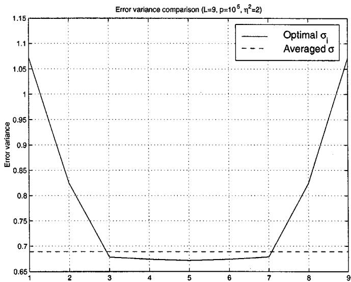  
Fig. 4. Error variance comparison between $( 2 L - 1 ) ,$ )-dimensional filter w\~ and L-dimensional filters $\mathbf { w } _ { W F } ^ { i } , i = 1 , \dots , L$

Hence, averaging does not seem to be a well-founded operation, whereas on the other hand, it increases computational complexity since it requires $( 2 L - 1 )$ -taps filtering instead of -taps filtering. If minimal error variance is sought, we suggest the use of the -dimensional filter corresponding to the smallest diagonal element in the error covariance matrix. However, as already indicated in Section III, this is a computationally very demanding procedure since in each time step, the error covariance matrix ${ \bf R } _ { e e } [ k ]$ needs to be computed. Therefore, in practice, we suggest the use of the -dimensional filter given by the middle column of $\mathbf { W } _ { W F } .$ , which provides both low error variance (albeit mostly not the lowest attainable error variance) and linear phase. It is unpredictable whether this filter or the averaged filter yields the lowest error variance.

## C. Multimicrophone Case

In the multichannel case, similar and additional symmetry properties can be derived, depending on the assumptions we make for the spatio-temporal correlation matrices $\mathbf { R } _ { x x } [ k ]$ and ${ \bf R } _ { v v } [ k ]$

In the following, we will assume $N = 2$ . However, the symmetry properties can easily be extended to the case of more than two microphones. We will subdivide the $2 L \times 2 L$ symmetric correlation matrices as

$$
\begin{array}{r} \mathbf {R} _ {x x} [ k ] = \left[ \begin{array}{c c} \mathbf {R} _ {x x} ^ {1 1} [ k ] & \mathbf {R} _ {x x} ^ {1 2} [ k ] \\ \mathbf {R} _ {x x} ^ {2 1} [ k ] & \mathbf {R} _ {x x} ^ {2 2} [ k ] \end{array} \right] \\ \mathbf {R} _ {v v} [ k ] = \left[ \begin{array}{c c} \mathbf {R} _ {v v} ^ {1 1} [ k ] & \mathbf {R} _ {v v} ^ {1 2} [ k ] \\ \mathbf {R} _ {v v} ^ {2 1} [ k ] & \mathbf {R} _ {v v} ^ {2 2} [ k ] \end{array} \right] \end{array}\tag{60}
$$

where $\mathbf { R } _ { x x } ^ { 1 1 } [ k ] , \mathbf { R } _ { x x } ^ { 2 2 } [ k ] , \mathbf { R } _ { v v } ^ { 1 1 } [ k ] ,$ and $\mathbf { R } _ { v v } ^ { 2 2 } [ k ]$ are double-sym metric matrices, $\bar { \mathbf { R } } _ { x x } ^ { 1 2 } [ k ] = \bar { \mathbf { R } } _ { x x } ^ { 2 1 } { } ^ { T } [ k ]$ , and $\mathbf { \bar { R } } _ { v v } ^ { 1 2 } [ k ] = \mathbf { R } _ { v v } ^ { 2 1 } \mathbf { \bar { \Psi } } [ k ]$ We will also subdivide the filter matrix as

$$
\mathbf {W} = \left[ \begin{array}{c c} \mathbf {W} ^ {1 1} & \mathbf {W} ^ {1 2} \\ \mathbf {W} ^ {2 1} & \mathbf {W} ^ {2 2} \end{array} \right].\tag{61}
$$

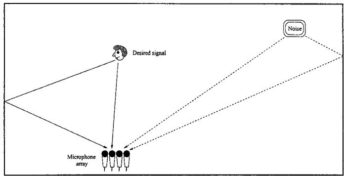  
Fig. 5. Simulation environment.

If we assume that the speech and noise correlation matrices for both microphones are equal $( \mathbf { R } _ { x x } ^ { 1 1 } [ k ] = \mathbf { R } _ { x x } ^ { 2 2 } [ k ]$ and $\mathbf { R } _ { v v } ^ { 1 1 } [ k ] =$ $\mathbf { R } _ { v v } ^ { 2 2 } [ k ] )$ and that $\mathbf { R } _ { x x } ^ { 1 2 } [ k ]$ and $\mathbf { R } _ { v v } ^ { 1 2 } [ k ]$ are Toeplitz matrices, then

$$
J \mathbf {R} _ {x x} [ k ] J = \mathbf {R} _ {x x} [ k ], \quad J \mathbf {R} _ {v v} [ k ] J = \mathbf {R} _ {v v} [ k ]\tag{62}
$$

such that the same symmetry properties as for the single-channel case apply. Moreover, if $\dot { \bf R } _ { x x } ^ { 1 2 } [ k ]$ and $\mathbf { R } _ { v v } ^ { 1 2 } [ k ]$ are symmetric Toeplitz matrices, then in addition

$$
S \mathbf {R} _ {x x} [ k ] S = \mathbf {R} _ {x x} [ k ], \quad S \mathbf {R} _ {v v} [ k ] S = \mathbf {R} _ {v v} [ k ]\tag{63}
$$

where $S = S ^ { T }$ is the reverse block-identity matrix, i.e.,

$$
S = \left[ \begin{array}{c c} \mathbf {0} & I _ {L} \\ I _ {L} & \mathbf {0} \end{array} \right].\tag{64}
$$

A matrix satisfying $S \mathbf { A } S = \mathbf { A }$ is called a double blocksymmetric matrix. Using the same arguments as in [29], it can be proven that any eigenvector of a double block-symmetric matrix is either block symmetric or block skew-symmetric, i.e., $S \mathbf { u } = \pm \mathbf { u }$ . Using this symmetry property, it is easy to prove that the filter matrix , which is constructed according to (27), satisfies the additional symmetry property

$$
\mathbf {W} = S \mathbf {W} S \quad (\mathbf {W} ^ {T} = S \mathbf {W} ^ {T} S)\tag{65}
$$

such that

$$
J \mathbf {W} ^ {1 1} J = \mathbf {W} ^ {1 1} = \mathbf {W} ^ {2 2}, \quad J \mathbf {W} ^ {1 2} J = \mathbf {W} ^ {1 2} = \mathbf {W} ^ {2 1}.\tag{66}
$$

In this case, the middle columns (for odd) of $\mathbf { W } ^ { 1 1 }$ and $\mathbf { W } ^ { 2 1 }$ are again two linear phase filters.

The same properties hold when the two noise components $v _ { 1 } [ k ]$ and $v _ { 2 } [ k ]$ are uncorrelated because then, $\mathbf { \bar { R } } _ { v v } ^ { 1 2 } [ k ] = \mathbf { \bar { R } } _ { v v } ^ { \bar { 2 } 1 } [ k ] = \mathbf { 0 }$ . In the case of spatio-temporal white noise, the noise correlation matrix reduces to

$$
\mathbf {R} _ {v v} [ k ] = \eta^ {2} \left[ \begin{array}{c c} I _ {L} & \mathbf {0} \\ \mathbf {0} & I _ {L} \end{array} \right]\tag{67}
$$

and the filter matrix has the additional property of being symmetric such that

$$
\mathbf {W} ^ {1 1} = \mathbf {W} ^ {1 1 ^ {T}}, \quad \mathbf {W} ^ {1 2} = \mathbf {W} ^ {1 2 ^ {T}}.\tag{68}
$$

## V. PERFORMANCE OF GSVD-BASED OPTIMAL FILTERING

This section discusses the performance of the GSVD-based optimal filtering technique for noise reduction in multimicrophone speech signals. First, the used simulation environment is described, and some implementation details are given. Then, the spatial directivity pattern, noise reduction performance (for stationary and nonstationary noise sources), and robustness of the GSVD-based optimal filtering technique is discussed and compared with standard beamforming techniques.

Clean speech – noisy microphone signal – Enhanced signal  
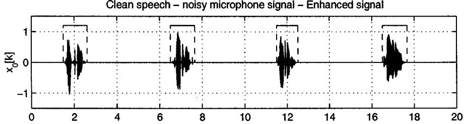

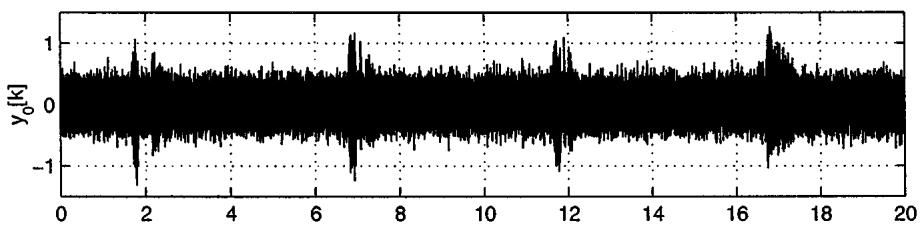

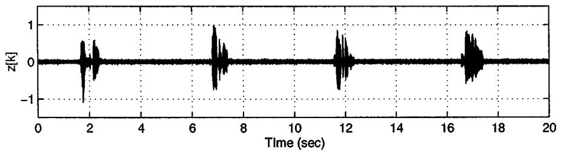  
Fig. 6. (a) Speech component $x _ { 0 } [ k ]$ and voice activity detection. (b) Noisy microphone signal y [k] $( \mathrm { S N R } = 0 \mathrm { d B } )$ . (c) Enhanced signal z[k] $( N = 4 , L = 8 0$ $T _ { 6 0 } = 1 3 0$ ms).

## A. Simulation Environment

The simulation room is depicted in $\mathrm { F i g }$ . 5 and has dimensions $6 \mathrm { m } \times 3 \mathrm { m } \times 2 . 5 \mathrm { m }$ . It consists of a microphone array, a speech source $s [ k ]$ , and a noise source $v [ k ]$ . In our simulations, we have used a linear equispaced microphone array with $N = 4$ microphones, and the nominal distance between two adjacent microphones is 5 cm. The speech source is located 0.6 m from the microphone array. Broadside direction is represented as $\theta = 9 0 ^ { \circ }$ whereas endfire direction is represented as $\theta = 0 ^ { \circ }$ . The used signals are an 8 kHz clean speech signal and stationary temporally white noise (in Section ${ \mathrm { V - E } } ,$ a nonstationary noise source will be used). The speech and noise components received at the th microphone are filtered versions of the clean speech and noise signals with simulated acoustic room impulse responses.

The acoustic room impulse responses are calculated using the image method [31], [32], with a filter length of 1500 taps and for different reverberation times $T _ { 6 0 }$ . The reverberation time $T _ { 6 0 }$ can be expressed as a function of the reflection coefficient $\gamma$ of the walls, according to Eyring’s formula [33]

$$
T _ {6 0} = \frac {0 . 1 6 3 \mathrm{V}}{- S \log (1 - \gamma)}\tag{69}
$$

where $V$ is the volume of the room, and is the total surface of the room.

Since we are using simulations, we can easily compare the performance for different reverberation times $T _ { 6 0 }$ and since the speech and noise components of all signals are at hand, the unbiased SNR of a signal $\overline { y } [ k ]$ can be computed as

$$
\mathrm{SNR} = 1 0 \log_ {1 0} {\frac {\sum {\bar {x}} ^ {2} [ k ]}{\sum {\bar {v}} ^ {2} [ k ]}}\tag{70}
$$

where $\overline { { x } } [ k ]$ and are the speech and noise component of the considered signal .

In our simulations, we have constructed the noisy microphone signals such that the unbiased SNR of the first microphone signal $y _ { 0 } [ k ]$ is 0 dB. Fig. 6(a) and (b) depicts the speech component $x _ { 0 } [ k ]$ and the noisy microphone signal $y _ { 0 } [ k ]$ for reverberation time $T _ { 6 0 } = 1 3 0 \mathrm { m s }$

## B. Implementation Details

First, the speech and noise data matrices $\mathbf { Y } [ k ]$ and $\mathbf { V } [ k ^ { \prime } ]$ are constructed from the noisy microphone signals $y _ { n } [ k ] , n =$ $0 , \ldots , N - 1$ . In order to construct these data matrices, a voice activity detection (VAD) algorithm needs to determine when speech is present [24], [25]. Fig. 6(a) shows the output of such an algorithm on the speech component of the first microphone signal (which is, of course, not available in practice). In our simulations, we have constructed the speech data matrix $\mathbf { Y } [ k ]$ using all available speech samples and the noise data matrix $\mathbf { V } [ k ^ { \prime } ]$ using all available noise samples. As already indicated in Section III, the time indices in the data matrices do not need to be consecutive.

From the GSVD of the speech and noise data matrices, cfr. (35), the optimal filter matrix $\mathbf { W } _ { W F }$ is computed using $( 3 6 )$ , where all negative diagonal elements are put to zero. The stacked filter $\mathbf { w } [ k ] = [ \mathbf { w } _ { 0 } ^ { T } [ k ] \quad \mathbf { w } _ { 1 } ^ { T } [ k ] \quad \ldots \quad \mathbf { w } _ { N - 1 } ^ { T } [ k ] ] ^ { T }$ is determined as the th column ${ \bf w } _ { W F } ^ { i }$ of $\mathbf { W } _ { W F }$ , using the fixed value $i = L / 2$ (cfr. Section III). The enhanced signal $z [ k ]$ is obtained by filtering the microphone signals with the filters $\mathbf { w } _ { n } [ k ] , n \ = \ 0 , \ldots , N - 1$ . Hence, in our simulations, the enhanced signal is the optimal estimate for the delayed speech component in the first microphone $x _ { 0 } [ k - ( L / 2 ) +$ . Fig. 6(c) shows the enhanced signal $z [ k ]$ for filter length $L = 8 0$

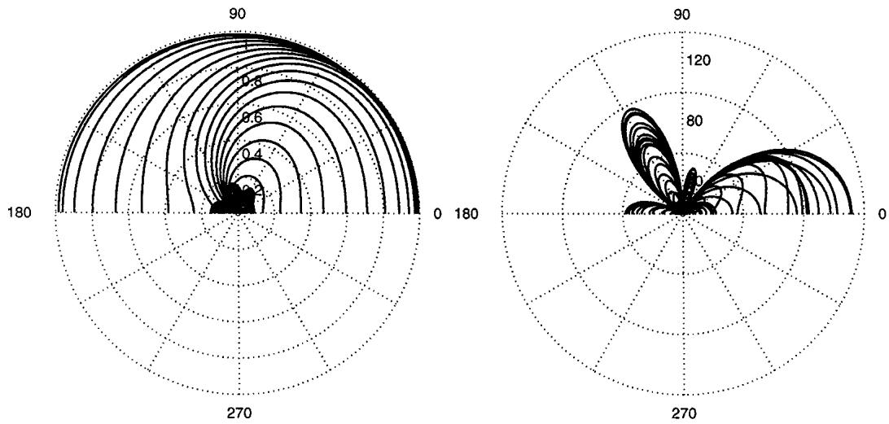  
Fig. 7. Spatial directivity pattern $| H ( f , \theta )$ j for (a) spatio-temporal white noise and speech source at $\theta = 4 5 ^ { \circ } \left( N = 4 , L = 1 0 , \mathrm { { S N R } = 0 } \mathrm { { d B } } \right)$ and (b) localized white noise sources at $\theta \overset { \cdot } { = } 6 0 ^ { \circ }$ and $\dot { \theta } = 1 \dot { 5 } 0 { } ^ { \circ }$ and speech source at $\theta = 9 0 ^ { \circ } ( N = \mathrm { \bar { 4 } } , L = 2 0$ , and $\mathrm { S N R } = \mathrm { 0 ~ d B } )$ .

In this paper, we will only discuss the noise reduction performance of the batch version of the GSVD-based signal enhancement technique, where the data matrices and the optimal filter are computed using all available data during speech-and-noise periods and noise-only periods. Some issues regarding computational complexity reduction are briefly discussed in Section VI.

## C. Spatial Directivity Pattern

When considering localized sources and no multipath propagation, it can be shown that the GSVD-based optimal filtering technique exhibits a beamforming behavior. The spatial directivity pattern of the filter $\mathbf { w } [ k ] = \mathbf { w } _ { W F } ^ { i }$ is defined as

$$
H (f, \theta) = \sum_ {n = 0} ^ {N - 1} W _ {n} (f) \cdot \exp \left(j 2 \pi f \frac {n d \cos \theta}{c}\right)\tag{71}
$$

where

$H ( f , \theta )$ spatial directivity pattern (function of frequency $f$ and angle $\theta ) ;$ ;

$W _ { n } ( f )$ frequency response of the filter $\mathbf { w } _ { n } [ k ] ;$

$d$ distance between adjacent microphones;

C speed of sound wave propagation $( c = 3 4 0 \mathrm { m / s } )$

First, we consider spatio-temporal white noise, i.e., the noise component $v _ { n } [ k ]$ present in every microphone signal $y _ { n } [ k ]$ is temporally white and is uncorrelated with the noise components in the other microphone signals (e.g., sensor noise). We consider the situation where the speech source impinges on the microphone array at an angle $\theta = 4 5 ^ { \circ }$ . Fig. 7(a) shows the spatial directivity pattern for the frequencies $f _ { j } = j \cdot 1 0 0 , j = 1 , \ldots , 4 0$ For most frequencies, the directivity gain is maximal for the direction $\theta = 4 5 ^ { \circ }$ , which implies that the GSVD-based optimal filtering technique automatically finds the direction of the desired speech source. However, for low frequencies, the spatial selectivity is rather poor.

Second, we consider two localized white noise sources that impinge on the microphone array at angles $\theta = 6 0 ^ { \circ }$ and $\theta =$ $1 5 0 ^ { \circ }$ . The speech source is located in front of the microphone array $( \theta = 9 0 ^ { \circ } )$ . Fig. 7(b) shows the directivity pattern for the frequencies $f _ { j } = j \cdot 1 0 0 , j = 1 , \ldots , 4 0 .$ . As can be seen, for all frequencies, the directivity gain is approximately zero for $\theta \ : = \ : 6 0 ^ { \circ }$ and $\theta = 1 5 0 ^ { \circ }$ , i.e., the directions of the two noise sources. Although difficult to see on this figure, the directivity gain in the direction of the speech source $( \theta = 9 0 ^ { \circ } )$ is not equal to unity, as is the case for a GSC, but depends on the frequency content of the speech and noise signals.

We can conclude that the GSVD-based optimal filtering technique has the desired beamforming behavior for both simple scenarios. For more realistic reverberant situations, it is rather difficult to interpret the spatial directivity plots since the GSVDbased filtering technique computes an optimal estimate for the speech component of one microphone signal, thereby reducing the additive noise but not the reverberation of the speech signal.

## D. Noise-Reduction Performance

In this section, the noise-reduction performance of the GSVD-based optimal filtering technique is compared for different filter lengths and for different reverberation times $T _ { 6 0 }$ Low reverberation corresponds to highly correlated signals, whereas high reverberation corresponds to highly uncorrelated (diffuse) signals. The noise reduction performance is also compared with standard fixed and adaptive beamforming techniques, i.e., delay-and-sum beamformer and generalized sidelobe canceller [22].

In a delay-and-sum beamformer, the different microphone signals are spatially aligned to an angle (e.g., the direction of the speech source) by delaying each microphone signal $y _ { n } [ k ]$ $n = 0 , \ldots , N - 1$ , with

$$
\delta_ {n} = n \frac {d \cos \theta}{c}.\tag{72}
$$

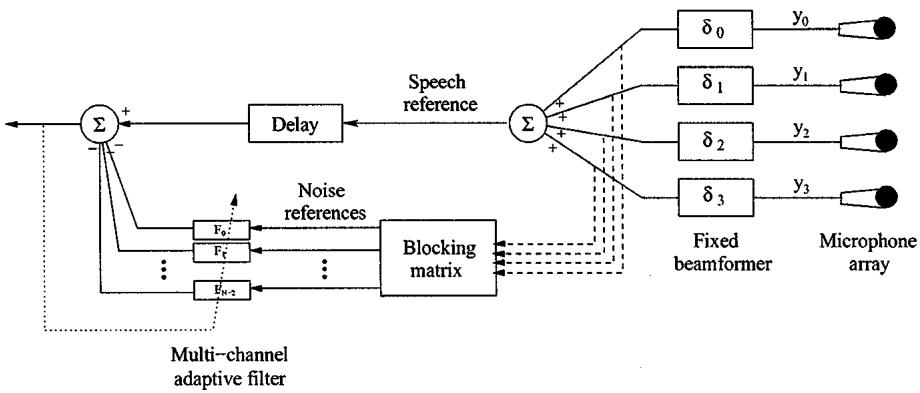  
Fig. 8. Generalized sidelobe canceller (GSC).

However, the position of the speech source needs to be determined beforehand, e.g., using some generalized cross-correlation method. A delay-and-sum beamformer offers limited spatial selectivity, especially in the low-frequency region. In our simulations, the speech source is at broadside $( \theta = 9 0 ^ { \circ } )$ such that the output of the delay-and-sum beamformer is simply obtained by summing the microphone signals.

The GSC, which is an adaptive beamformer, is depicted in Fig. 8 and consists of three parts:

1) a fixed delay-and-sum beamformer, which spatially aligns the microphone signals to the direction of the speech source and which creates a so-called speech reference;

2) a blocking matrix , which creates so-called noise references by blocking the direction of the speech source $( N - 1$ independent noise references can be created);

3) a standard multichannel adaptive filter, using the noise reference as input signal and the speech reference as desired signal [34] (to allow some acausal taps, the speech reference is delayed).

If the noise components in the different microphone signals are correlated and the speech component is assumed to be uncorrelated with the noise components, then the adaptive filter reduces a considerable amount of noise from the speech reference. A GSC will therefore perform considerably better for highly correlated noise than for uncorrelated noise [35]. A problem arises when the noise references also contain part of the speech signal: so-called signal leakage. In that case, the adaptive filter will also remove part of the speech signal from the speech reference. In order to avoid this signal cancellation and distortion, no filter adaptation is allowed during speech-and-noise periods [36]. In our simulations, we have used an NLMS-procedure (step size $\lambda = 0 . 2 )$ for updating an adaptive filter of length 800.

Fig. 9 compares the unbiased SNR of the enhanced signal for reverberation times up to 1500 ms. The unbiased SNR is plotted for the original microphone signal SNR dB , the delay-and-sum beamformer, the GSC, and the GSVD-based optimal filtering technique (with filter lengths $L = 5 , 2 0 , 5 0 , 8 0 )$ As expected, for small $T _ { 6 0 } ,$ the GSC performs much better than for high $T _ { 6 0 }$ . Unlike the GSC, the GSVD-based optimal filtering technique still performs well for high $T _ { 6 0 }$ . As can be seen, for all reverberation times, the GSVD-based optimal filtering technique performs better than the GSC if the filter length is large enough.

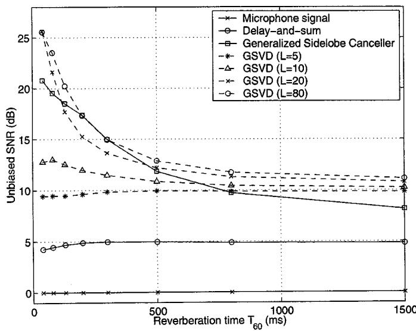  
Fig. 9. Comparison of unbiased SNR for delay-and-sum, GSC, and GSVD-based optimal filter $( N = 4 , \mathrm { { S N R } = 0 \ d B } )$ ).

## E. Nonstationary Noise Source

In this section, we discuss simulations with a temporally nonstationary noise source, i.e., a noise source at a fixed position with a changing frequency spectrum. It will be demonstrated that the noise reduction performance of the GSVD-based optimal filtering technique is mainly dependent on the spatial characteristics of the noise source and not on the temporal characteristics.

The nonstationary noise source has been created by filtering a white noise source with a time-varying FIR-filter, which is represented by the ten-dimensional vector . The filter varies between a lowpass filter $\mathbf { g } _ { L }$ (with cut-off frequency 2400 Hz) and a highpass filter (with cut-off frequency 1600 Hz) at different rates

$$
\mathbf {g} [ k ] = \alpha [ k ] \mathbf {g} _ {H} + (1 - \alpha [ k ]) \mathbf {g} _ {L}\tag{73}
$$

where $0 \leq \alpha [ k ] \leq 1$ is a time-varying parameter determining how fast the filter $\mathbf { g } [ k ]$ varies in time. The frequency response of , , and a number of intermediate filters is plotted in Fig. 10. The nonstationary noise source is filtered with the (simulated) acoustic room impulse responses between the noise source position and the microphone array. In our simulations, we have used a reverberation time $T _ { 6 0 } = 3 0 0$ ms and SNR dB. A nonstationarity factor indicates how many times the filter varies between the lowpass and the highpass filter (and back) over the total signal (20 s).

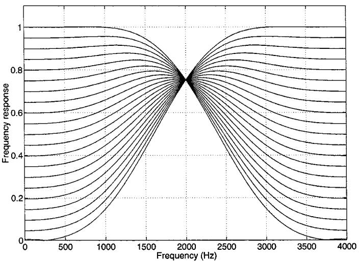  
Fig. 10. Frequency responses of time-varying FIR filter $\mathbf { g } \left[ k \right]$

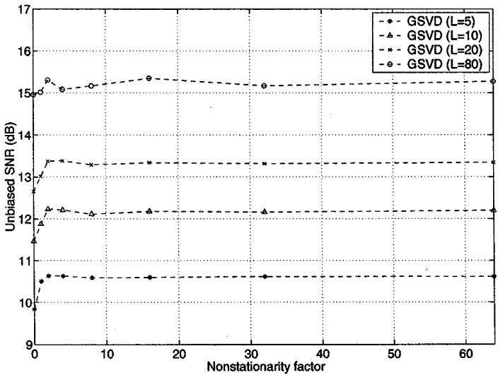  
Fig. 11. Comparison of unbiased SNR for nonstationary noise source $( N = 4 ,$ $\mathrm { S N R } = 0 ~ \mathrm { d B } , \mathbf { \dot { \eta } } _ { 6 0 } = 3 0 0$ ms).

Fig. 11 compares the unbiased SNR of the enhanced signal for different filter lengths $L = 5 , 2 0 , 5 0$ , and 80 at different levels of nonstationarity. As can be seen, the noise-reduction performance of the GSVD-based optimal filtering technique is practically independent of the nonstationarity factor. Therefore, we can conclude that the noise-reduction procedure mainly exploits the spatial characteristics of the noise source, rather than its spectral characteristics.

## F. Robustness Issues

Many multimicrophone noise-reduction techniques, e.g., GSC, rely on a priori assumptions about the position of the speech source and the microphone array configuration. These techniques therefore tend to be rather sensitive to deviations from the nominal situation, as, e.g., encountered when incorrectly estimating the position of the speech source or when using uncalibrated microphone arrays. The GSVD-based optimal filtering technique does not rely on any assumptions of this kind. Therefore, we can expect the GSVD-based optimal filtering technique to be less sensitive to deviations from the nominal situation.

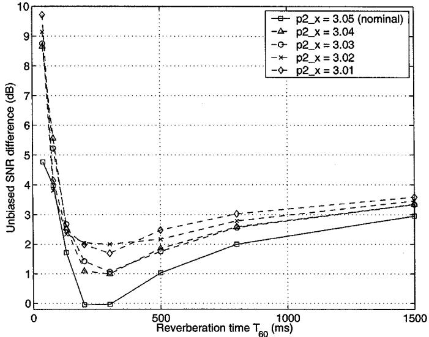  
Fig. 12. Unbiased SNR-difference between GSVD-based optimal filtering and ${ \bar { \mathbf { G S C } } } \left( N = 4 , L = 8 0 , { \mathrm { S N R } } = 0 \mathrm { d B } \right)$ for different microphone positions p .

In [37], we have compared the robustness of the GSVD-based optimal filtering technique with the GSC for three kinds of deviations from the nominal situation:

a) incorrect estimation of the position of the speech source;

b) microphone displacement;

c) different microphone amplification.

It has been shown that for all three deviations, the GSVD-based optimal filtering technique is more robust than the GSC.

Fig. 12 shows the difference in noise-reduction performance (unbiased SNR) between the GSVD-based optimal filtering technique and the GSC for a different position $\mathbf { p } _ { 2 }$ of the second microphone. Because the difference in performance increases the more the microphone position $\mathbf { p } _ { 2 }$ deviates from the nominal position $\mathbf { p } _ { 2 } ^ { \mathrm { n o m } } = 3 . 0 5 \mathrm { m }$ , we can conclude that the GSVD-based optimal filtering technique is more robust than the GSC for microphone displacement.

Fig. 13 shows the difference in noise-reduction performance (unbiased SNR) for different amplifications $g _ { 2 }$ of the second microphone. For most reverberation times (especially higher reverberation), the difference in performance increases the more the amplification $g _ { 2 }$ deviates from the nominal amplification $g _ { 2 } ^ { \mathrm { n o m } } = 1$ . Therefore, we can conclude that the GSVD-based optimal filtering technique is more robust than the GSC for different microphone amplifications. It can, in fact, be proven that the noise-reduction performance of the GSVD-based optimal filtering technique is insensitive to variations in the amplification and phase difference of the microphones.

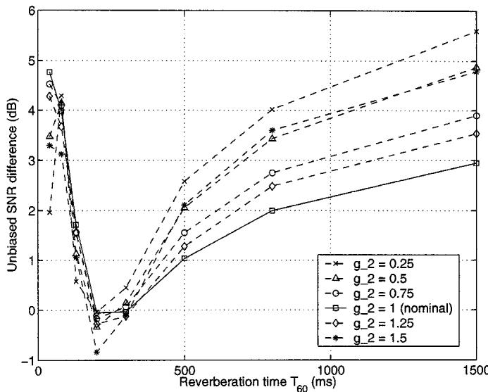  
Fig. 13. Unbiased SNR-difference between GSVD-based optimal filtering and ${ \bf G } { \bf \breve { S } C } \left( N = 4 , L = 8 0 , { \bf S } { \bf N } { \bf R } = 0 \mathrm { d } { \bf B } \right)$ ) for different microphone amplification $g _ { 2 } .$

## VI. COMPUTATIONAL COMPLEXITY

The VAD should be tuned such that speech-and-noise periods are always correctly classified. When speech-and-noise periods are wrongly classified, speech vectors are added to the noise data matrix, resulting in signal cancellation and signal distortion, which is equivalent to signal leakage in the noise references of a GSC. This can be seen from (15), where the diagonal elements $\left\{ 1 - ( \bar { \eta } _ { i } ^ { 2 } / \bar { \sigma } _ { i } ^ { 2 } ) \right\}$ decrease. On the other hand, adding noise vectors to the speech data matrix is less harmful since this only gives rise to less noise reduction but no signal cancellation. This can be seen from (15), where the diagonal elements $\left\{ 1 - ( \bar { \eta } _ { i } ^ { 2 } / \bar { \sigma } _ { i } ^ { 2 } ) \right\}$ increase.

In a real-time implementation, the data matrices and the optimal filter need to be updated at every time step. Depending on whether the VAD classifies the samples at time $k + 1$ as speech or noise, the stacked data vector $\mathbf { y } [ k + 1 ]$ is added to either the speech or the noise data matrix. If, e.g., the sample at time $k + 1$ is classified as speech, then the updated speech data matrix $\mathbf { Y } [ k + 1 ]$ is equal to

$$
\mathbf {Y} [ k + 1 ] = \left[ \begin{array}{c} \mathbf {y} ^ {T} [ k - p + 2 ] \\ \vdots \\ \mathbf {y} ^ {T} [ k ] \\ \mathbf {y} ^ {T} [ k + 1 ] \end{array} \right], \quad \mathbf {Y} [ k + 1 ] = \left[ \begin{array}{c} \lambda \cdot \mathbf {Y} [ k ] \\ \mathbf {y} ^ {T} [ k + 1 ] \end{array} \right]\tag{74}
$$

depending on whether a fixed length data window or exponential weighting is used.

From the GSVD of the updated data matrices $\mathbf { Y } [ k + 1 ]$ and $\mathbf { V } [ k ^ { \prime } + 1 ]$ , the optimal filter matrix $\mathbf { W } _ { W F }$ and the enhanced signal $\hat { x } [ \bar { k } + 1 ]$ can be computed. Calculating the GSVD of two $p \times M$ matrices using Jacobi-rotations typically requires $1 7 M ^ { 3 } + 3 p M ^ { 2 }$ operations (additions and multiplications) [27], which is clearly too high for real-time operation (see Table I). Instead of recomputing the GSVD from scratch for each time step, recursive GSVD-updating algorithms are able to compute the GSVD at time $k + 1$ using the decomposition at time . In [38] and [39], a Jacobi-type (G)SVD-updating algorithm is described, reducing the computational complexity to $2 3 . 5 M ^ { 2 }$ (and

TABLE I  
COMPUTATIONAL COMPLEXITY OF GSVD-BASED OPTIMAL FILTERING TECHNIQUE $( N = 4 , L = 2 0 , p = 4 0 0 0 , f _ { s } = 8 \mathrm { ~ k H z } )$

<table><tr><td></td><td>Non-recursive</td><td>Recursive</td><td>Square root-free</td></tr><tr><td></td><td> $\frac{17M^3 + 3pM^2}{r}$ </td><td> $\frac{27.5M^2}{r}$ </td><td> $\frac{21.5M^2}{r}$ </td></tr><tr><td> $r = 1$ </td><td>684 Gflops</td><td>1408 Mflops</td><td>1101 Mflops</td></tr><tr><td> $r = 20$ </td><td>34.2 Gflops</td><td>70.4 Mflops</td><td>55.0 Mflops</td></tr></table>

$1 7 . 5 M ^ { 2 }$ using a square-root free implementation). The computational complexity of computing one column of $\mathbf { W } _ { W F } \mathrm { i s } 4 M ^ { 2 }$ For stationary acoustic environments, the computational complexity can be further reduced by using subsampling techniques without any loss in performance [40], [41]. In this context, subsampling means that the GSVD and the filter $\mathbf { W } _ { W F }$ are only updated every samples. The total computational complexity for the nonrecursive and the recursive algorithms is summarized in Table I, showing that, $\mathrm { e . g . }$ , for $N = 4$ and $L = 2 0$ , the complexity can be reduced from 684 Gflops to 55 Mflops, practically without any reduction in noise reduction performance. Although the complexity of the recursive GSVD-updating algorithms is still quite high, suffice it to say that we have succeeded in implementing this GSVD-based multimicrophone speech enhancement algorithm in real time on a Pentium-III 450 MHz PC. Recently, a subband implementation of this GSVD-based optimal filtering technique has been described in [42], showing an improved performance at a further reduced computational complexity.

## VII. CONCLUSION

In this paper, a class of optimal multimicrophone signal enhancement techniques has been described, which are based on the generalized singular value decomposition. The GSVD-based optimal filtering technique can be considered to be an extension of the signal subspace algorithms for enhancing single-microphone noisy speech signals. A number of symmetry properties have been derived for the optimal filter matrix, and the averaging step of some single-microphone signal subspace algorithms has been examined. When comparing the noise-reduction performance in multimicrophone speech signals, simulations show that the GSVD-based optimal filtering technique has a better noise-reduction performance than standard beamforming techniques for all reverberation times and that it is more robust to deviations from the nominal situation.

## ACKNOWLEDGMENT

The authors would like to thank the reviewers for their valuable comments and suggestions.

## REFERENCES

[1] J. S. Lim and A. V. Oppenheim, “All-pole modeling of degraded speech,” IEEE Trans. Acoust., Speech, Signal Processing, vol. ASSP-26, pp. 197–210, June 1978.

[2] J. H. L. Hansen and M. A. Clements, “Constrained iterative speech enhancement with application to speech recognition,” IEEE Trans. Signal Processing, vol. 39, pp. 795–805, Apr. 1991.

[3] J. D. Gibson, B. Koo, and S. D. Gray, “Filtering of colored noise for speech enhancement and coding,” IEEE Trans. Signal Processing, vol. 39, pp. 1732–1742, Aug. 1991.

[4] S. Gannot, D. Burshtein, and E. Weinstein, “Iterative and sequential kalman filter-based speech enhancement algorithms,” IEEE Trans. Speech Audio Processing, vol. 6, pp. 373–385, July 1998.

[5] S. F. Boll, “Suppression of acoustic noise in speech using spectral subtraction,” IEEE Trans. Acoust., Speech, Signal Processing, vol. ASSP-27, pp. 113–120, Apr. 1979.

[6] Y. Ephraim and D. Malah, “Speech enhancement using a minimun mean-square error log-spectral amplitude estimator,” IEEE Trans. Acoust., Speech, Signal Processing, vol. ASSP–33, pp. 443–445, Apr 1985.

[7] M. Dendrinos, S. Bakamidis, and G. Carayannis, “Speech enhancement from noise: A regenerative approach,” Speech Commun., vol. 10, no. 2, pp. 45–57, Feb. 1991.

[8] S. H. Jensen, P. C. Hansen, S. D. Hansen, and J. A. Sørensen, “Reduction of broad-band noise in speech by truncated QSVD,” IEEE Trans. Speech Audio Processing, vol. 3, pp. 439–448, Nov. 1995

[9] P. S. K. Hansen, “Signal subspace methods for speech enhancement,” Ph.D. dissertation, Techn. Univ. Denmark, Lyngby, Denmark, 1997.

[10] S. Doclo, I. Dologlou, and M. Moonen, “A novel iterative signal enhancement algorithm for noise reduction in speech,” in Proc. Int. Conf. Spoken Language Process., Sydney, Australia, Dec. 1998, pp. 1435–1438.

[11] Y. Ephraim and H. L. Van Trees, “A signal subspace approach for speech enhancement,” IEEE Trans. Speech Audio Processing, vol. 3, pp. 251–266, July 1995.

[12] J. Huang and Y. Zhao, “Energy-constrained signal subspace method for speech enhancement and recognition,” IEEE Signal Processing Lett., vol. 4, pp. 283–285, Oct. 1997.

[13] U. Mittal and N. Phamdo, “Signal/noise KLT based approach for enhancing speech degraded by colored noise,” IEEE Trans. Speech Audio Processing, vol. 8, pp. 159–167, Mar. 2000.

[14] A. Rezayee and S. Gazor, “An adaptive KLT approach for speech enhancement,” IEEE Trans. Speech Audio Processing, vol. 9, pp. 87–95, Feb. 2001.

[15] J. L. Flanagan, “Parametric coding of speech spectra,” J. Acoust. Soc. Amer., vol. 68, no. 2, pp. 412–419, Aug. 1980.

[16] R. J. McAulay and T. F. Quatieri, “Speech analysis/synthesis based on a sinusoidal representation,” IEEE Trans. Acoust., Speech, Signal Processing, vol. ASSP-34, pp. 744–754, Aug. 1986.

[17] B. Yang, “Projection approximation subspace tracking,” IEEE Trans. Signal Processing, vol. 43, pp. 95–107, Jan. 1995.

[18] P. C. Hansen and S. H. Jensen, “FIR filter representations of reduced-rank noise reduction,” IEEE Trans. Signal Processing, vol. 46, pp. 1737–1741, June 1998.

[19] F. Jabloun and B. Champagne, “A multi-microphone signal subspace approach for speech enhancement,” in Proc. IEEE Int. Conf. Acoust., Speech, Signal Process., Salt Lake City, UT, May 2001, pp. 205–208.

[20] I. Dologlou, J.-C. Pesquet, and J. Skowronski, “Projection-based rank reduction algorithms for multichannel modeling and image compression,” Signal Process., vol. 48, no. 2, pp. 97–109, Jan. 1996.

[21] F. Asano, S. Hayamizu, T. Yamada, and S. Nakamura, “Speech enhancement based on the subspace method,” IEEE Trans. Speech Audio Processing, vol. 8, pp. 497–507, Sept. 2000

[22] B. D. Van Veen and K. M. Buckley, “Beamforming: A versatile approach to spatial filtering,” IEEE ASSP Mag., pp. 4–24, Apr. 1988.

[23] L. L. Scharf, Statistical Signal Processing: Detection, Estimation and Time Series Analysis, 1 ed. Reading, MA: Addison Wesley, 1991.

[24] S. Van Gerven and F. Xie, “A comparative study of speech detection methods,” in Proc. EUROSPEECH, vol. 3, Rhodos, Greece, Sept. 1997, pp. 1095–1098.

[25] S. G. Tanyer and H. Özer, “Voice activity detection in nonstationary noise,” IEEE Trans. Speech Audio Processing, vol. 8, pp. 478–482, July 2000.

[26] G. H. Golub and C. F. Van Loan, Matrix Computations, 3rd ed. Baltimore, MD: John Hopkins Univ. Press, 1996.

[27] F. T. Luk, “A parallel method for computing the generalized singular value decomposition,” J. Paral. Distrib. Comput., vol. 2, pp. 250–260, 1985.

[28] S. Doclo and M. Moonen, “GSVD-based optimal filtering for multimicrophone speech enhancement,” in Microphone Arrays: Signal Processing Techniques and Applications, M. S. Brandstein and D. B. Ward, Eds. Berlin, Germany: Springer-Verlag, 2001, ch. 6, pp. 111–132.

[29] P. Butler and A. Cantoni, “Eigenvalues and eigenvectors of symmetric centrosymmetric matrices,” Linear Algebra Applicat., vol. 13, pp. 275–288, Mar. 1976.

[30] I. Dologlou and G. Carayannis, “Physical representation of signal reconstruction from reduced rank matrices,” IEEE Trans. Signal Processing, vol. 39, pp. 1682–1684, July 1991.

[31] J. Allen and D. Berkley, “Image method for efficiently simulating small-room acoustics,” J. Acoust. Soc. Amer., vol. 65, pp. 943–950, Apr. 1979.

[32] P. M. Peterson, “Simulating the response of multiple microphones to a single acoustic source in a reverberant room,” J. Acoust. Soc. Amer., vol. 80, no. 5, pp. 1527–1529, 1986.

[33] F. A. Everest, The Master Handbook ofAcoustics, 2nd ed. New York: McGraw-Hill, 1989.

[34] S. Haykin, Adaptive Filter Theory, 4th ed. Englewood Cliffs, NJ: Prentice-Hall, 2001.

[35] J. Bitzer, K. U. Simmer, and K.-D Kammeyer, “Theoretical noise reduction limits of the generalized sidelobe canceller (GSC) for speech enhancement,” in Proc. IEEE Int. Conf. Acoust., Speech, Signal Process., vol. 5, Phoenix, AZ, May 1999, pp. 2965–2968.

[36] D. Van Compernolle, “Switching adaptive filters for enhancing noisy and reverberant speech from microphone array recordings,” in Proc. IEEE Int. Conf. Acoust., Speech, Signal Process., vol. 2, Albuquerque, NM, Apr. 1990, pp. 833–836.

[37] S. Doclo and M. Moonen, “Robustness of SVD-based optimal filtering for noise reduction in multi-microphone speech signals,” in Proc. Int. Workshop Acoust. Echo Noise Contr., Pocono Manor, PA, Sept. 1999, pp. 80–83.

[38] M. Moonen, P. Van Dooren, and J. Vandewalle, “A singular value decomposition updating algorithm for subspace tracking,” SIAM J. Matrix Anal. Applicat., vol. 13, no. 4, pp. 1015–1038, Oct. 1992.

[39] , “A systolic algorithm for QSVD updating,” Signal Process., vol. 25, pp. 203–213, 1991.

[40] S. Doclo and M. Moonen, “Noise reduction in multi-microphone speech signals using recursive and approximate GSVD-based optimal filtering,” in Proc. IEEE Benelux Signal Process. Symp., Hilvarenbeek, The Netherlands, Mar. 2000.

[41] , “Multi-microphone noise reduction using recursive GSVD-based optimal filtering with ANC postprocessing stage,” IEEE Trans. Speech Audio Processing, May 2002, to be published.

[42] A. Spriet, M. Moonen, and J. Wouters, “A multi-channel subband generalized singular value decomposition approach to speech enhancement,” Eur. Trans. Telecommun., Special Issue on Acoustic Echo and Noise Control, no. 2, pp. 149–158, Mar-Apr. 2002.

Simon Doclo (S’95–A’98) was born in Wilrijk, Belgium, in 1974. In 1997, he received the electrical engineering degree from the Katholieke Universiteit Leuven (KU Leuven), Leuven, Belgium. He is currently pursuing the Ph.D. degree at the Electrical Engineering Department, KU Leuven, and is supported by the Flemish Institute for Scientific and Technological Research in Industry.

His research interests are in the area of digital signal processing for speech and audio applications.

Mr. Doclo received the First prize “KVIV-Studentenprijzen” (with E. De Clippel) in 1997 for his M.Sc. thesis, and in 2001, he received a Best Student Paper Award at the IEEE International Workshop on Acoustic Echo and Noise Control. He is secretary of the IEEE Benelux Signal Processing Chapter.

Marc Moonen (M’94) received the B.E.E. and Ph.D. degrees in applied sciences from the Katholieke Universiteit Leuven (KU Leuven), Leuven, Belgium, in 1986 and 1990, respectively.

Since 1994, he has been a Research Associate with the Belgian National Fund for Scientific Research. Since 2000, he has been an Associate Professor with the Electrical Engineering Department, KU Leuven. His research activities are in mathematical systems theory and signal processing, parallel computing, and digital communications. He is a member of the editorial board of Integration, the VLSI Journal and Applied Signal Processing (EURASIP JASP).

Dr. Moonen received the 1994 KU Leuven Research Council Award, the 1997 Alcatel Bell (Belgium) Award (with P. Vandaele), and was a 1997 “Laureate of the Belgium Royal Academy of Science.” He is Chairman of the IEEE Benelux Signal Processing Chapter and a EURASIP officer.