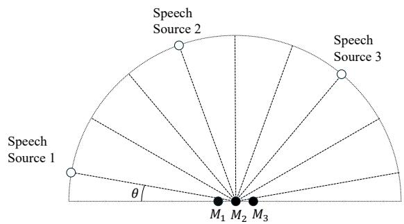
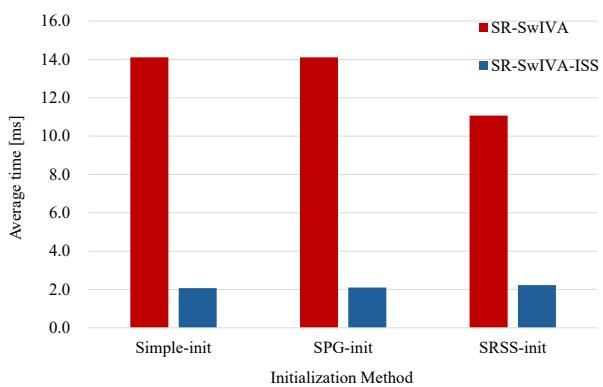

# Spatially-Regularized Switching Independent Vector Analysis with Iterative Source Steering

Haonan Dong1, Wei Liu1,2, Xuemai Xie1 and Shoji Makino1

1Waseda University, 2-7 Hibikino, Wakamatsu-ku, Kitakyushu, Fukuoka 808-0135, Japan 2Wuhan University, School of Electronic Information, Wuhan, Hubei 430072, China E-mail: {donghaonan@asagi,xuemaixie@ruri, s.makino@}waseda.jp

## Abstract

This paper presents a computationally efficient approach to speech separation based on Spatially Regularized Switching Independent Vector Analysis (SR-SwIVA) incorporating an Iterative Source Steering (ISS) update. By introducing a switching mechanism, the proposed framework models the time-varying characteristics of multichannel mixtures using multiple demixing matrices, while spatial regularization based on direction-of-arrival information solves the interstate permutation problem. To further improve efficiency, the conventional matrix-inversion-based update is replaced with an ISS-based rank-one update, significantly reducing computational cost while preserving separation performance. Experimental results on noisy and reverberant environment demonstrate that the proposed method achieves improved separation quality and faster convergence compared with conventional SR-SwIVA, making it suitable for practical scenarios with limited microphone arrays.

## 1. Introduction

Blind source separation (BSS) aims to recover individual speech sources from multichannel mixtures without prior knowledge of the source signals [1, 2]. Independent Component Analysis (ICA) is a BSS algorithm that estimates separation filters as ones that maximize the independence between the separated signals [3]. To apply ICA to time-frequency domain audio signals, Independent Vector Analysis (IVA) has been proposed [4, 5]. IVA is a widely used frequencydomain approach due to its ability to exploit inter-frequency dependencies and achieve good separation performance while avoiding the frequency permutation problem. As a result, IVA has been successfully applied to many multichannel speech separation tasks. However, its performance is often limited when the number of microphones is small or when the observed mixtures contain strong noise or reverberation.

To address these issues, Switching Independent Vector Analysis (SwIVA) introduces multiple demixing matrices and selects the most appropriate one for each time–frequency bin through a switching mechanism [6]. By allowing the separation system to adapt to local time–frequency variations, SwIVA improves separation performance, especially when the number of microphones is small [7, 8]. Based on SwIVA, Spatially Regularized SwIVA (SR-SwIVA) further incorporates steering vectors derived from directions of arrival (DOAs) into the objective function [9]. In addition, SR-SwIVA proposes a spatially guided initialization technique, referred to as SRSS-init, which utilizes DOA-based acoustic transfer functions (ATFs) to initialize the demixing matrices [10, 11]. Spatial regularization has been shown to be effective for conventional BSS techniques in aligning the permutation of separated sources, and its integration into the switching IVA framework further enhances robustness and convergence behavior.

Despite these improvements, SR-SwIVA still relies on the Iterative Projection (IP) update rule for optimizing the demixing matrices. The IP update requires matrix inversions at each iteration and frequency bin, which may result in increased computational cost and potential numerical instability, particularly in switching-based frameworks where multiple demixing matrices are maintained simultaneously. To overcome these limitations, we introduce Iterative Source Steering (ISS) into SR-SwIVA [12]. ISS performs rank-one updates on the demixing matrix without explicit matrix inversion, thereby reducing computational complexity while maintaining numerical stability. By integrating ISS with spatial regularization and the switching structure, the proposed SR-SwIVA-ISS achieves efficient and stable speech separation.

## 2. Signal Model and Problem Formulation

We consider a multichannel blind source separation problem in the short-time Fourier transform (STFT) domain. Suppose that N speech sources are recorded by M microphones in a reverberant environment. The observed signal is modeled as a mixture of the source signals

$$
\mathbf {x} (f, t) = \mathbf {A} (f) \mathbf {s} (f, t), \tag {1}
$$

where $\mathbf { x } ( f , t ) \in \mathbb { C } ^ { M }$ is the observed multichannel signal at frequency bin $f$ and time frame $t , \mathbf { s } ( f , t ) \in \mathbb { C } ^ { N \times 1 }$ denotes the source signal vector and $\mathbf { A } ( f ) \in \dot { \mathbb { C } } ^ { M \times N }$ is the frequencydependent mixing matrix representing the acoustic transfer responses between the sources and microphones. The mixing matrix $\mathbf { A } ( f )$ is assumed to be unknown, and no prior information on the mixing system is available.

In blind source separation, the source signals are estimated by applying demixing matrices to the observed signals. To account for time-varying acoustic conditions, a switching-based demixing model is considered, in which multiple demixing matrices are prepared [6]. Let $\mathbf { W } _ { j } ( f ) \in \mathbb { C } ^ { \mathbf { \hat { M } } \times N }$ denote the demixing matrix associated with the $j \mathrm { - t h }$ switching state, where $j = 1 , \dots , J$ . For a given switching state $j ,$ , the separated source signals are given by

$$
\hat {\mathbf {s}} _ {j} (f, t) = \mathbf {W} _ {j} ^ {\mathsf {H}} (f) \mathbf {x} (f, t), \tag {2}
$$

where $( \cdot ) ^ { \mathsf { H } }$ denotes the Hermitian transpose operator and $\hat { \mathbf { s } } _ { j } ( f , t ) \ \stackrel { \cdot \ } { \in } \ \mathbb { C } ^ { N }$ represents the separated source vector corresponding to the j-th state. The n-th element of $\hat { \mathbf { s } } _ { j } ( f , t )$ , denoted as $\hat { s } _ { j , n } ( f , t )$ , corresponds to the estimate of the n-th source component under state $j .$

To select the most appropriate demixing matrix at each time–frequency bin, a binary switching variable $\delta _ { j } ( f , t )$ is introduced [6], which is defined as

$$
\delta_ {j} (f, t) \in \{0, 1 \}, \quad \sum_ {j = 1} ^ {J} \delta_ {j} (f, t) = 1. \tag {3}
$$

The variable $\delta _ { j } ( f , t )$ indicates whether the $j \cdot$ -th switching state is selected at frequency bin $f$ and time frame t. This formulation enables the separation system to adaptively switch among multiple demixing matrices across time–frequency bins, thereby enhancing its flexibility in modeling nonstationary mixtures.

Given the observed signals ${ \bf x } ( f , t )$ , the objective is to estimate the demixing matrices ${ \bf W } _ { j } ( f )$ and the switching variables $\delta _ { j } ( f , t )$ such that the separated signals $\hat { \mathbf { s } } _ { j } ( f , t )$ approximate the source signals. In addition, spatial information derived from DOAs is assumed to be available and will be incorporated to guide the separation process.

## 3. Proposed Method

SR-SwIVA introduces steering vectors ${ \bf a } _ { n } ( f )$ estimated from DOA information to provide spatial regularization [9]. Let ${ \bf w } _ { j , n } ( f )$ denote the nth row of ${ \bf W } _ { j } ( f )$ , the SR-SwIVA cost function $\mathcal { L } ( \Theta )$ to be minimized is given

$$
\begin{array}{l} \mathcal {L} (\Theta) = \sum_ {j, f, t} \delta_ {j} (f, t) \left[ \sum_ {n} \left(\log v _ {n} (f, t) + \frac {| \hat {\mathbf {s}} _ {j , n} (f , t) | ^ {2}}{\mathbf {v} _ {n} (f , t)}\right) \right. \\ \left. - 2 \log | \det \mathbf {W} _ {j} (f) | \right] + \sum_ {f, j, n} \lambda_ {\text { reg }} \| \mathbf {w} _ {j, n} (f) - \mathbf {a} _ {n} (f) \| _ {2} ^ {2}, \tag {4} \\ \end{array}
$$

where $\lambda _ { \mathrm { r e g } }$ is a regularization weight that controls the strength of the spatial regularization toward the steering vectors ${ \bf a } _ { n } ( f )$ while $v _ { n }$ is the variance of the sources.

The original SR-SwIVA updates $\mathbf { W } _ { j } ( f )$ by using the IP method, which requires matrix inversion at the time–frequency bin and leads to a high computational cost. To avoid this, we adopt the ISS framework [12], whose original update form is the rank-one update

$$
\mathbf {W} _ {f} \leftarrow \mathbf {W} _ {f} - \mathbf {v} _ {n, f} \mathbf {w} _ {n, f} ^ {\mathrm{H}}, \tag {5}
$$

where $\mathbf { v } _ { n , f }$ is a vector to be determined. Without the matrix inverse, this update is computationally more efficient as well as stable [10].

We optimize the update vector ${ \bf v } _ { j , n } ( f )$ while keeping all other variables fixed. For the adopted rank-one update, the determinant of the updated demixing matrix is given by

$$
\begin{array}{l} \det \left(\mathbf {W} _ {j} (f) - \mathbf {v} _ {j, n} (f) \mathbf {w} _ {j, n} ^ {\mathrm{H}} (f)\right) \tag {6} \\ = \det \bigl (\mathbf {W} _ {j} (f) \bigr) \bigl (1 - v _ {j, n n} (f) \bigr). \\ \end{array}
$$

which implies that the log-determinant term in the objective function introduces a nonlinear penalty −2 log $\left| 1 - v _ { j , n n } ( f ) \right|$ that depends only on the diagonal component $v _ { j , n n } ( f )$ in the ISS update.

Substituting the rank-one update into (4) and discarding constant terms independent of ${ \bf v } _ { j , n } ( f )$ , the optimization problem can be reduced to a sub-objective with respect to ${ \bf v } _ { j , n } ( f )$ , given by

$$
\begin{array}{l} \mathcal {J} \left(\mathbf {v} _ {j, n} (f)\right) = \sum_ {i, t} \delta_ {j} (f, t) \frac {\left| \hat {s} _ {j , i} (f , t) - v _ {j , i n} (f) \hat {s} _ {j , n} (f , t) \right| ^ {2}}{v _ {i} (f , t)} \\ + \lambda_ {\mathrm{reg}} \sum_ {i} \big \| \mathbf {w} _ {j, i} (f) - v _ {j, i n} ^ {*} (f) \mathbf {w} _ {j, n} (f) - \mathbf {a} _ {i} (f) \big \| _ {2} ^ {2} \\ - 2 \log | 1 - v _ {j, n n} (f) |, \tag {7} \\ \end{array}
$$

where $\lambda _ { \mathrm { r e g } }$ denotes the regularization weight and ${ \bf a } _ { i } ( f )$ represents the steering vector of the i-th source estimated from the DOA information.

For $i \neq n ,$ the sub-objective in (7) reduces to a standard complex quadratic minimization problem, and the optimal coefficient $v _ { j , i n } ( f )$ can be obtained in closed form. In contrast, the diagonal coefficient $v _ { j , n n } ( f )$ is explicitly coupled with the log-determinant term from (4), and its update therefore requires a scalar derivation.

To this end, we minimize (7) with respect to $v _ { j , n n } ^ { * } ( f )$ . Collecting the quadratic terms, we define

$$
\alpha_ {j, n} (f) = \sum_ {t} \delta_ {j} (f, t) \frac {\left| \hat {s} _ {j , n} (f , t) \right| ^ {2}}{v _ {n} (f , t)} + 2 \lambda_ {\text { reg }} \| \mathbf {w} _ {j, n} (f) \| ^ {2}, \tag {8}
$$

which represents the curvature of the sub-objective, and

$$
\beta_ {j, n} (f) = \lambda_ {\mathrm{reg}} \mathbf {w} _ {j, n} ^ {\mathsf {H}} (f) \big (\mathbf {w} _ {j, n} (f) - \mathbf {a} _ {n} (f) \big), \tag {9}
$$

which quantifies the deviation of the demixing vector from the steering direction.

The first-order optimality condition for $v _ { j , n n } ( f )$ can then be written as

$$
\frac {1}{(1 - v _ {j , n} (f)) ^ {*}} - \alpha_ {j, n} (f) \big (1 - v _ {j, n} (f) \big) + 2 \beta_ {j, n} (f) = 0. \tag {10}
$$

When $\beta _ { j , n } ( f ) = 0$ , the above equation admits the solution given by

$$
v _ {j, n} (f) = 1 - \alpha_ {j, n} (f) ^ {- 1 / 2}. \tag {11}
$$

Otherwise, enforcing phase consistency yields the closedform solution

$$
v _ {j, n} (f) = \gamma_ {j, n} (f), \tag {12}
$$

with

$$
\gamma_ {j, n} (f) = 1 - \frac {\beta_ {j , n} ^ {*} (f)}{| \beta_ {j , n} (f) |} + \frac {\sqrt {| \beta_ {j , n} (f) | ^ {2} + \alpha_ {j , n} (f)}}{\alpha_ {j , n} (f) | \beta_ {j , n} (f) |}. \tag {13}
$$

Combining the above two cases, the update of $v _ { j , n } ( f )$ is summarized as

$$
v _ {j, n} (f) = \left\{ \begin{array}{l l} 1 - \alpha_ {j, n} (f) ^ {- 1 / 2}, & \beta_ {j, n} (f) = 0, \\ \gamma_ {j, n} (f), & \beta_ {j, n} (f) \neq 0. \end{array} \right. \tag {14}
$$

Once $v _ { j , n } ( f )$ is obtained, the demixing matrix is updated by

$$
\mathbf {w} _ {j, i} ^ {\mathrm{H}} (f) \leftarrow \mathbf {w} _ {j, i} ^ {\mathrm{H}} (f) - v _ {j, n} (f) \mathbf {w} _ {j, n} ^ {\mathrm{H}} (f), \tag {15}
$$

and the separated signals $\mathbf { y } ( f , t )$ are updated as

$$
\mathbf {y} (f, t) \leftarrow \mathbf {y} (f, t) - \mathbf {v} _ {j} (f) y _ {j} (f, t). \tag {16}
$$

These updated results are then used to update for the next iteration. After completing the iterations, we apply the projection back to solve the scale ambiguity and perform the inverse STFT to obtain the time-domain signals.

## 4. Experiment

In this section, we compare the performance of SR-SwIVA [6] and proposed SR-SwIVA-ISS.

## 4.1 Experiment conditions

We conducted experiments using TIMIT-ConvMix, which is composed of simulated noisy reverberant mixtures [13]. Multichannel mixtures are generated using simulated room impulse responses (RIRs) with a reverberation time of 300 ms.We use a three-element uniform linear array with an intermicrophone spacing of 3 cm, placing at the center of the room.

The spatial configuration of this experiments is illustrated in Fig. 1. The mixtures consist of three speech sources and five noise sources. Three speech signals and five noise signals were used as sources, and their DOAs were randomly assigned from the azimuth of $\left\{ 1 0 ^ { \circ } , 3 0 ^ { \circ } , 5 0 ^ { \circ } , \ldots , 1 7 0 ^ { \circ } \right\}$ to construct the multichannel mixtures, under the assumption that all microphones and sound sources are located on the same horizontal plane.

text_image

Speech Source 2
Speech Source 3
Speech Source 1
θ
M₁ M₂ M₃

Figure 1: Spatial configuration of the microphone array and sound sources.

The minimum angular separation between any pair of speech sources was constrained to be at least $4 0 ^ { \circ }$ . The signalto-noise ratio (SNR) was fixed at 10 dB, which is the ratio between the total energy of each target speech source signal and the total energy of all noise sources.

We used a Hann window of 64 ms for the STFT with a shift of 32 ms. The sampling frequency $f _ { s }$ was set to 16 kHz. We use SDRi, which means the improvement in signal-todistortion ratio relative to the mixture, and SIRi, which means the improvement in signal-to-interference ratio relative to the mixture to evaluate the separation performance. We evaluate the computational efficiency using the average computational time per iteration for updating the demixing matrix $\mathbf { W } _ { f } .$ . For each method, all groups of input mixed signal were run for 50 iterations, and the results is obtained by averaging its performance over all experimental groups.

To investigate the robustness of the algorithms with respect to initialization, we considered three different initialization strategies with varying levels of prior information [6]. In the Simple-init, we directly set each separation matrix $W _ { j } ( f )$ as an $M \times M$ identity matrix $I _ { M }$ . The Spatially-guided initialization (SPG-init) employ the conventional MPDR beamformer to initialize the separation matrices $W _ { j } ( f )$ , thereby providing spatial guidance based on directional information. The Spatially-Regularized Single-State initialization (SRSSinit) is the DOA-based spatial regularization to the initialization for SR-SwIVA. In this initialization method, the separation matrix $W _ { j } ( f )$ is estimated by spatial regularized IVA is copied and used as input to SR-SwIVA.

## 4.2 Results

Table 1 reports the separation performance under different initialization conditions. It can be observed that the performance of SR-SwIVA-ISS is generally comparable to that of the original SR-SwIVA method. The computational efficiency of the two methods is further compared in Fig. 2, which shows the average computational time per iteration for updating the demixing matrix W. SR-SwIVA-ISS consistently requires less computation time than SR-SwIVA for all initialization conditions.

Table 1: Results of comparison.

<table><tr><td>Initialization</td><td>Method</td><td>SDRi [dB]</td><td>SIRi [dB]</td></tr><tr><td rowspan="2">Simple-init</td><td>SR-SwIVA</td><td>7.28</td><td>18.70</td></tr><tr><td>SR-SwIVA-ISS</td><td>7.05</td><td>18.39</td></tr><tr><td rowspan="2">SPG-init</td><td>SR-SwIVA</td><td>7.14</td><td>18.47</td></tr><tr><td>SR-SwIVA-ISS</td><td>7.36</td><td>19.04</td></tr><tr><td rowspan="2">SRSS-init</td><td>SR-SwIVA</td><td>8.45</td><td>22.16</td></tr><tr><td>SR-SwIVA-ISS</td><td>8.45</td><td>22.34</td></tr></table>

bar chart

| Initialization Method | SR-SwIVA (ms) | SR-SwIVA-ISS (ms) |
| :--- | :--- | :--- |
| Simple-init | 14.0 | 2.0 |
| SPG-init | 14.0 | 2.0 |
| SRSS-init | 11.0 | 2.0 |

Figure 2: Average run time under different initialization setups.

Combining the results in Table 1 and Fig. 2, it shows that SR-SwIVA-ISS is effective in providing faster updates while maintaining stability compared with the conventional SR-SwIVA.

## 5. Conclusions

In this work, we proposed SR-SwIVA-ISS, a fast optimization method for spatially regularized switching IVA. By replacing the IP update with an inverse-free ISS update, the method reduces computation while maintaining separation accuracy. Experimental results demonstrate that SR-SwIVA-ISS achieves stable separation performance with a substantially reduced per-iteration computational cost.

## References

[1] S. Makino, Audio source separation. Berlin, Germany: Springer, 2018.  
[2] T. Kim, H. T. Attias, S.-Y. Lee, and T.-W. Lee, “Blind source separation exploiting higher-order frequency de-  
pendencies,” IEEE Trans. ASLP, vol. 15, no. 1, pp. 70–79, 2006.  
[3] A. Hyvarinen and E. Oja, “Independent component¨ analysis: algorithms and applications,” Neural Networks, vol. 13, no. 4–5, pp. 411–430, 2000.  
[4] T. Kim, H. T. Attias, S.-Y. Lee, and T.-W. Lee, “Blind source separation exploiting higher-order frequency dependencies,” IEEE Trans. ASLP, vol. 15, no. 1, pp. 70–79, 2006.  
[5] A. H. Khan, M. Taseska, and E. A. Habets, “A geometrically constrained independent vector analysis algorithm for online source extraction,” in Proc. LVA/ICA, 2015, pp. 396–403.  
[6] T. Nakatani, I. Rintaro, K. Keisuke, S. Hiroshi, K. Naoyuki, and A. Shoko, “Switching independent vector analysis and its extension to blind and spatially guided convolutional beamforming algorithms,” IEEE/ACM Trans. ASLP, pp. 1032–1047, 2022.  
[7] K. Yamaoka, N. Ono, and S. Makino, “Time-frequencybin-wise linear combination of beamformers for distortionless signal enhancement,” IEEE/ACM Trans. ASLP, vol. 29, pp. 3461–3475, 2021.  
[8] K. Yamaoka, A. Brendel, N. Ono, S. Makino, M. Buerger, T. Yamada, and W. Kellermann, “Timefrequency-bin-wise beamformer selection and masking for speech enhancement in underdetermined noisy scenarios,” in Proc. EUSIPCO, 2018, pp. 1582–1586.  
[9] T. Ueda, T. Nakatani, I. Rintaro, A. Shoko, and S. Makino, “Spatially-regularized switching independent vector analysis,” in Proc. APSIPA ASC, pp. 2024–2030, 2023.  
[10] L. Li and K. Koishida, “Geometrically constrained independent vector analysis for directional speech enhancement,” in Proc. ICASSP, 2020, pp. 846–850.  
[11] G. Kana, U. Tetsuya, L. Li, Y. Takeshi, and M. Shoji, “Geometrically constrained independent vector analysis with auxiliary function approach and iterative source steering,” in Proc. EUSIPCO, pp. 757–761, 2022.  
[12] R. Scheibler and N. Ono, “Fast and stable blind source separation with rank-1 updates,” in Proc. ICASSP, pp. 236–240, 2020.  
[13] J. Barker, R. Marxer, E. Vincent, and S. Watanabe, “The third ‘CHiME’ speech separation and recognition challenge: Dataset, task and baselines,” in Proc. ASRU, pp. 504–511, 2015.
