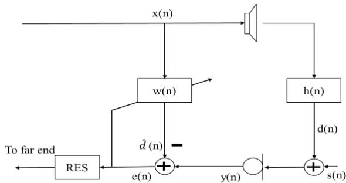
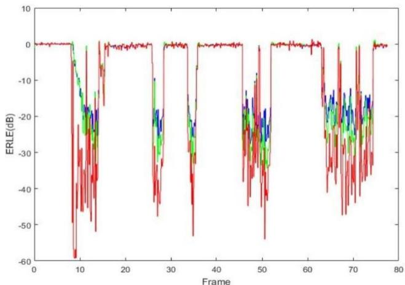
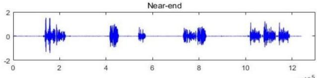
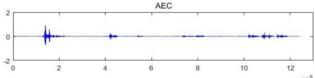
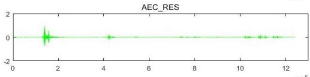
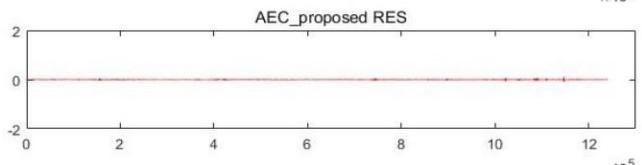
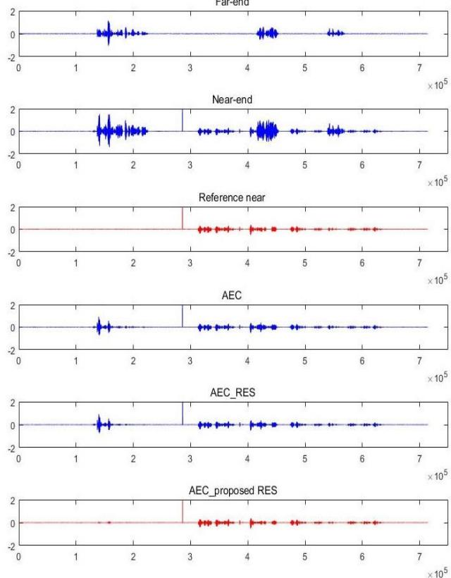

# A Robust Residual Echo Suppression Algorithm Even During Double Talk

Bingxiao Fang

Beijing Sabine Technologies Co., Ltd

Beijing, China

e-mail: fangbingxiao@sabinetek.com

Abstract—Adaptive echo cancellation (AEC) is an essential part in hand-free full-duplex communication to cancel the annoying echo. However, residual echo always remains even after linear acoustic echo canceller (LAEC) for the misalignment between the room impulse response and the adaptive filter coefficients. In practical applications, AEC algorithm followed by residual echo suppression (RES) is a general strategy. This paper proposes a new algorithm to estimate the residual echo power spectral density after LAEC based on the statistic normalized correlation between the output after LAEC and the estimated echo. The experimental results verify the good performance of the algorithm in terms of return loss enhancement (ERLE) and speech-to-speech-distortion power ratio(SSDR).

Keywords-acoustic echo cancellation; residual echo suppression; power spectral density

## I. INTRODUCTION

As an annoying disturbance, acoustic echo is the far-end signal is broadcasted by loudspeaker and picked up by the microphone in hand-free full-duplex communication system. Widely utilized method to solve this question is to design an adaptive filter to model the echo propagation path to obtain the echo with excitation signal (far-end signal) and then subtract it from the microphone signal (near-end signal). However, adaptive linear filter couldn't perfectly model the accurate transfer function of the echo path for the following reason (1) The length of the adaptive filter can't be sufficient match the real room impulse response (RIR) considering the algorithm complexity (2) There is disturbance in the process of filter tracking echo path changing caused by the movement of objects or people [1], [2].

In order to suppress the residual echo, several algorithms have been explored. Regarding the residual echo as noise, a kind of slow-attach-and-fast-decay method to trace the residual echo power density to get a good performance is suggested in [3], [4], whose drawback is difficult to track the change of the residual echo in time. With the same assumption, Jason Wung [4] advices a psycho acoustic postfilter algorithm in log-spectral amplitude (LSA) domain to reduce the near-end speech distortion, which can achieve improved RES during strong near-end interference, and the estimation method of residual echo is based on voice activity detector(VAD) (Near-end talk (NT), Single talk (ST) and double-talk detection (DTD)). Obviously, it is not easy to obtain these perfect VAD. Mini-tracking algorithm is also utilized to trace the residual echo power [5], where crosscorrelation spectral subtraction (CCSS) approach is utilized to obtain better performance with considering the correlation between the far-end speech and near-end speech. An adaptive echo suppression AES method based on the correlation between the microphone signal and loudspeaker signal without considering AEC component are advised in [6], [7]. Ying Tong and Yun-Sik Park explore the application of nearend speech presence probability (NESPP) in residual echo suppression in [8], [9], where [8] uses near-end speech presence probability to obtain larger level echo suppression While near-end speech presence probability is used as a soft decision method to control the update of residual echo power density to get a better ability of tracking residual echo in [9].

Assume the normalized correlation between the residual echo and microphone will statistically converge to a stable relationship, this paper proposes a new method to estimate the power spectral density of residual echo utilizing the correlation between the output after LAEC and the estimated echo. The experimental results verify the good performance of the algorithm in terms of return loss enhancement (ERLE) and speech-to-speech-distortion power ratio (SSDR), which is effective even in double talk situation.

This paper is organized as follows. The next section will introduce the details of the proposed algorithm and then experimental tests are compared followed by a brief conclusion.

  
Figure 1. Echo cancellation diagram architecture.

## II. THE SYSTEM ARCHITECTURE OF PROPOSED RESIDUAL ECHO SUPPRESSION

## A. The Structure of Echo Cancellation System

The proposed system architecture is shown in figure 1. Farend signal denoted by $\boldsymbol { x } ( \boldsymbol { n } ) = \left[ x _ { 0 } ( \boldsymbol { n } ) , x _ { 1 } ( \boldsymbol { n } ) . . . x _ { N - 1 } ( \boldsymbol { n } ) \right] ^ { T }$ is broadcast, reflected or scattered back and picked up by microphone as echo signal denoted by $d ( n )$ with near-end speech denoted by $s ( n )$ , where the real echo propagation path is denoted by $h ( \boldsymbol { n } ) = [ h _ { 0 } ( \boldsymbol { n } ) , h _ { 1 } ( \boldsymbol { n } ) . . . h _ { N - 1 } ( \boldsymbol { n } ) ] ^ { T }$ . The general AEC model in figure 1 is an adaptive filter with normalized least-mean-square (NLMS) algorithm, where the N-order filters are denoted by $W ( n ) { = } [ w _ { 0 } ( n ) , w _ { 1 } ( n ) . . . w _ { N - 1 } ( n ) ] ^ { T }$ , to track the echo path and the estimated echo is denoted by ${ \hat { d } } ( n )$ . The microphone signal denoted by $y ( n )$ is expressed as a sum of near-end speech n)(s and echo replica n)(d .

$$
y (n) = h (n) ^ {T} x (n) = d (n) + s (n)\tag{1}
$$

where T denotes transpose operator.

The representation of the data model in short time Fourier transform (STFT) domain is:

$$
Y (i, k) = X (i, k) ^ {T} H (i, k) + S (i, k)\tag{2}
$$

For each time index � and each frequency bin � , $Y ( i , \ k ) , \ X ( \mathrm { i , k } ) , \ S ( i , k ) , \ H ( i , k )$ represent the microphone signal, far-end signal, near-end desired speech and the transfer function in STFT domain. Echo replica, $\widehat { \cal D } ( i , k )$ , are given by

$$
\widehat {D} (i, k) = W (i, k) ^ {T} X (i, k)\tag{3}
$$

Subtract the echo replica from the microphone signal to get the output of the microphone:

$$
\begin{array}{l} \mathrm{e} (n) = s (n) - [ h (n) - w (n) ] ^ {T} x (n) \\ = s (n) - r (n) \end{array}\tag{4}
$$

where n)(r presents the residual echo

$$
\begin{array}{c} r (n) = I S T F T \{R (i, k) \\ = I S T F T \{(H (i, k) - W (i, k)) ^ {T} * X (i, k) \} \end{array}\tag{5}
$$

$R ( i , k ) = D ( i , k ) - \widehat { D } ( i , k )$ presents the residual echo in STFT domain.

## B. Residual Echo Power Spectral Density Estimation

With the assumption the echo is sufficiently reduced, meanwhile, regarding the residual echo as noise are a regular idea to suppress the residual echo, thus the residual echo suppression problem is converted to a noise suppression problem, when a variety of noise estimation algorithms could be utilized. However, instead of using voice activity detector(DTD,NT)[4] or minimum statistics[10] to estimate the residual echo power spectral density for frame � in frequency bin domain or sub-band domain, this paper proposes a new algorithm based on statistic correlation between the residual echo signal $e ( n )$ and echo replica $d ( n )$ to estimate the residual echo power spectral density $r ^ { d r d r }$ , which is according to :

$$
r ^ {d r d r} (i, k) = \frac {r ^ {d e} (i , k) * r ^ {d e} (i , k)}{r ^ {d d} (i , k)}\tag{6}
$$

where

$$
r ^ {d e} (i, k) = \alpha * r ^ {d e} (i - 1, k) + (1 - \alpha) | \widetilde {D} ^ {*} (i, k) \widetilde {E} (i, k) | (7)
$$

$$
r ^ {d d} (i, k) = \alpha * r ^ {d d} (i - 1, k) + (1 - \alpha) | \widetilde {D} ^ {*} (i, k) \widetilde {D} (i, k) |
$$

$$
\widetilde {D} (i, k) = \hat {D} (i, k) - E \{\hat {D} (i, k) \}\tag{8}
$$

$$
\tilde {E} (i, k) = E (i, k) - E \{E (i, k) \}\tag{9}
$$

(10)

And � is the smoothing parameters to control the speed of adaption, meanwhile, superscript ∗ presents the conjugate. �{} denotes the expectation operator and $E ( i , k )$ is STFT of n)(e .

When the near-end speech were silence, the residual echo power spectral density is equal to the power spectral density of current microphone signal. i.e. $e ( n ) = r ( n )$ ). Rewrite the formation (6) as

$$
\begin{array}{l} r ^ {d r d r} = = \frac {\left| \widetilde {D} ^ {*} (i , k) R (i , k) \right| ^ {2}}{\left| \widetilde {D} ^ {*} (i , k) \widetilde {D} (i , k) \right|} = \\ \frac {\left| \widetilde {D} (i , k) \right| ^ {2} \left| R (i , k) \right| ^ {2} \cos (\theta)}{\left| \widetilde {D} (i , k) \right| ^ {2}} = \left| R (i, k) \right| ^ {2} \cos (\theta) \end{array}\tag{11}
$$

)(cos presents the coherence of the residual echo and the estimated echo, which approximately equals to 1 when nearend speech is not active.

The near-end signal and the estimated echo are assumed to be statistical uncorrelated in a long time. For DTD situation

$$
\begin{array}{l} r ^ {d r d r} = = \frac {\left| \widetilde {D} ^ {*} (i , k) (S (i , k) + R (i , k)) \right| ^ {2}}{\left| \widetilde {D} ^ {*} (i , k) \widetilde {D} (i , k) \right|} = \\ \frac {\left| \widetilde {D} (i , k) S (i , k) + \widetilde {D} ^ {*} (i , k) R (i , k) \right| ^ {2}}{\left| \widetilde {D} (i , k) \right| ^ {2}} = \left| R (i, k) \right| ^ {2} \cos (\theta) \end{array}\tag{12}
$$

And if the microphone (near-end) signal only contains the local desired speech, i.e. $d ( n ) = { \hat { d } } ( n ) = r ( n ) = 0$ . There is no need to estimate the residual echo power spectral density $r ^ { d r d r }$

## C. Residual Echo Suppression Algorithm

Define priori signal (near-end speech) to echo ratio (SER)

$$
\xi^ {p r i o r i} (i, k) = \frac {| E (i , k) | ^ {2} - \beta r ^ {d r d r}}{| E (i , k) | ^ {2}}\tag{13}
$$

Posteriori signal (near-end speech) to echo ratio (SER)：

$$
\xi^ {p o s t} (i, k) = \frac {E (i , k) ^ {2}}{r ^ {d r d r} (i , k)} - 1\tag{14}
$$

Priori SER can be obtained according to Ephraim and Malah approach [11]

$$
\begin{array}{c} \xi^ {\text {priori}} (i, k) = \beta . \xi^ {\text {priori}} (i, k) + (1 - \\ \beta). m a x (\xi^ {\text {post}} (i, k), 0) \end{array}\tag{15}
$$

And then the residual gain to estimate final output is given by:

$$
G (i, k) = m a x (\frac {\xi^ {p r i o r i} (i , k)}{\xi^ {p r i o r i} (i , k) + 1}, G _ {m i n})\tag{16}
$$

where $\beta$ is aggressiveness factor, and $ \mathrm { { G } } _ { \mathrm { m i n } }$ is the spectral floor to implement the modulations of the background noise for Given the microphone signal always contains background noise .

And the final spectral magnitude of the output clean signal $\hat { S } ( i , k )$ is obtained by:

$$
\hat {S} (i, k) = E (i, k) * G (i, k)\tag{17}
$$

The time waveform reconstruction will be obtained by IFFT and over-add method.

## III. EXPERIMENTAL SETUP

Using the method above, real echo signal, where far-end speech is playback by a loudspeaker, is recorded by a microphone in a $( 5 ^ { * } 8 ^ { * } 3 )$ ) meeting room with sampling rate is 16kHz. The microphone signal is the sum of echo signal and the desired near-end speech recorded with the same method. The experiment adopts the frame length is 20ms, the overlap is 50%. A generalized multidelay block frequency domain adaptive filter (GMDF) algorithm [12] is adopted in AEC module for its advantage in the separation selection of FFT size and the block delay. The well-known echo return loss enhancement (ERLE) and speech-to-speech-distortion power ratio (SSDR) are utilized to be as the evaluation matrix:

$$
E R L E = 1 0 \log 1 0 \frac {E \{| e (n) | ^ {2} \}}{E \{| y (n) | ^ {2} \}}\tag{17}
$$

$$
S S D R = 1 0 l o g 1 0 \frac {\sum_ {n = 0} ^ {N _ {D T ^ {- 1}}} | s (n) | ^ {2}}{\sum_ {n = 0} ^ {N _ {D T ^ {- 1}}} | s (n) - e (n) | ^ {2}}\tag{18}
$$

where $e ( n ) , y ( n ) , s ( n )$ separately denotes the output signal after echo cancellation, original microphone signal and reference near-end signal. And $N _ { D T }$ is the number of DTD segment.

The compared baseline is based on the algorithm explored in paper [13] where slow-attach-and-fast-decay method is used to trace the residual echo power density and reduce the residual echo. Figure 2 gives the ERLE comparison in farend only situation with the same initialization situation no matter for frame size, overlap length and AEC module. The blue line is the ERLE result of the output of the AEC module, the green line shows the ERLE result of the baseline algorithm and the red line is the ERLE of the proposed RES algorithm. Though both of the two algorithms, where RES algorithm follow the AEC algorithm, achieve the better residual echo suppression performance compared with the only AEC module output, the proposed algorithm obviously outperforms the baseline algorithm owes to the proposed RES algorithm.

The waveform outputs are also presented in Fig. 3. The top is the original microphone speech which only contains echo signal and the second depicts the output of only AEC module. The output of the AEC with the baseline RES algorithm can be seen in the third and the bottom is the result of AEC with proposed RES algorithm.

  
Figure 2. Comparison ERLE in only far-end situation

  
Figure 3. Waveform comparison in only far-end situation

In order to check the robust of the proposed algorithm for DTD. A segmental speech contains near-end speech only, echo only and double talk is recorded, the result of the time domain is shown in Fig. 4. The waveforms are far-end speech, microphone signal, desired near-end speech, the output of AEC module, the baseline algorithm output with AEC module and the output of proposed RES algorithm with AEC module from top to bottom. The comparison shows that, compared with the only AEC module, the structure AEC algorithm followed by RES algorithm have a better echo suppression effect. And the algorithm is significantly better than the baseline in terms of echo suppression level. At the same time, the comparison of SSDR is also tested and the results are shown in Table I. The results reply that the proposed algorithm introduces less speech distortion compare with the baseline method with a higher residual echo level.

  
Figure 4. Waveform comparison in DTD

TABLE I. SSDR COMPARISON (dB)

<table><tr><td>AEC</td><td>AEC+RES</td><td>AEC+Proposed RES</td></tr><tr><td>3.8976</td><td>4.6797</td><td>4.8270</td></tr></table>

## IV. CONCLUSION

This paper promotes a new residual echo suppression method, which utilizes the statistic relationship between the echo replica and the error output of the adaptive filter to get a better performance. The real recorded experimental data measurement verifies that the proposed RES algorithm can efficiently suppress the residual echo in term of ERLE and SSDR even in case of double talk.

Though the proposed method yields promising performance based on real experimental data, further improvement of echo suppression is also needed. Variable step size (VSS) control method needs to be exploited to get a better AEC module to cooperate with the proposed RES algorithm getting better echo suppression performance, and the non-line echo suppression which caused by amplifier is also a challenging part needed to be explored.

## REFERENCES

[1] Jun Yang. "Multilayer Adaptation Based Complex Echo Cancellation and Voice Enhancement," in Proc. IEEE ICASSP, Calgary, AB, Canada,2018

[2] O. Hoshuyama and A. Sugiyama, “An acoustic echo suppressor based on a frequency-domain model of highly nonlinear residual echo,” in Proc. ICASSP ‘ 06, 2006, pp. 21–32

[3] Ingo Schalk-Schupp, Friedrich Faubel, Markus Buck, Andreas Wendemuth, “Approximation of a Nonlinear Distortion Function for Combined Linear and Nonlinear Residual Echo Suppression,” 2016 IEEE International Workshop on Acoustic Signal Enhancement (IWAENC 2016), Xi’an, China, Sept. 13 - 16, 2016.

[4] Jason Wung, Ted S. Wada, Biing-Hwang Juang, Bowon Lee,Ton Kalker, and Ronald W. Schafer, “A System Approach to Residual Echo Suppression in Robust Hands-free Teleconferencing,” ICASSP 2011, Prague, Czech Republic, pp.445 - 448, May 22 - 27, 2011.

[5] Jie Xia, Yi Zhou, and Ruitang Mao, “An Improved Crosscorrelation Spectral Subtraction Post-processing Algorithm for Noise and Echo Canceller,” 2016 IEEE International Conference on Digital Signal Processing (DSP), Beijing, China, pp. 114 - 118, Oct. 16 - 18, 2016.

[6] Alexis Favrot, Christof Faller, Markus Kallinger, Markus Schmidt," Acoustic Echo Control Based on Temporal Fluctuations of Short-Time Spectra,". in Proc. Intl. Works. on Acoust. Echo and Noise Control (IWAENC). 2008.

[7] Christelle Yemdji, Moctar I. Mossi and Nicholas Evans and Christophe Beaugeant "Low delay filtering for joint noise reduction and residual echo suppression," in Proc. Intl. Works. on Acoust. Echo and Noise Control (IWAENC). 2010

[8] Ying Tong and Yaping Gu, “Acoustic echo suppression based on speech presence probability,” 2016 IEEE International Conference on Digital Signal Processing (DSP), Beijing, China, 2016

[9] Yun-Sik Park, Ji-Hyun Song, Sang-Ick Kang, Woojung Lee, Joon-Hyuk Chang"A statistical model-based double-talk detection incorporating soft decision," 2010 IEEE International Conference on Acoustics, Speech and Signal Processing Dallas, TX, USA,2010

[10] R. Martin, “Spectral subtraction based on mininum statistics,” in Proc. EUSIPCO ‘ 94, 1994, pp. 1182–1185.

[11] Y. Ephraim and D. Malah, “Speech enhancement using optimal nonlinear spectral amplitude estimation, " in Proc. IEEE International Conference on Acoustics, Speech, and Signal Processing (ICASSP), April 1983, pp. 1118–1121

[12] E. Moulines, O. Ait Amrane, and Y. Grenier, “The generalized multidelay adaptive filter: structure and convergence analysis,” IEEE Transactions on Signal Processing, Vol.43, No.1, pp. 14-28, Jan. 1995.

[13] O. Hoshuyama and A. Sugiyama, “An Acoustic ECHO Suppressor Based on a Frequency-Domain Model of Highly Nonlinear Residual ECHO", 2006 IEEE International Conference on Acoustics Speech and Signal Processing Proceedings, Toulouse, France, May 2006