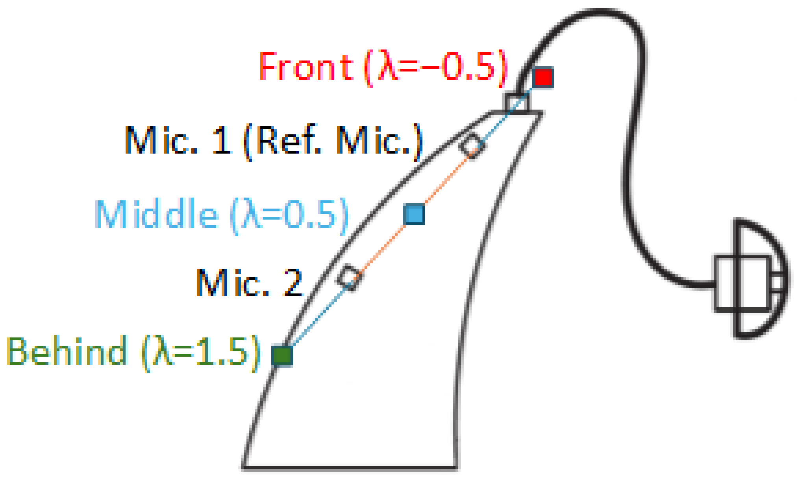
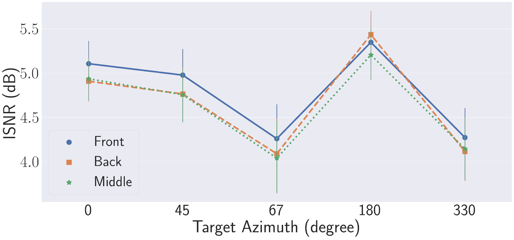
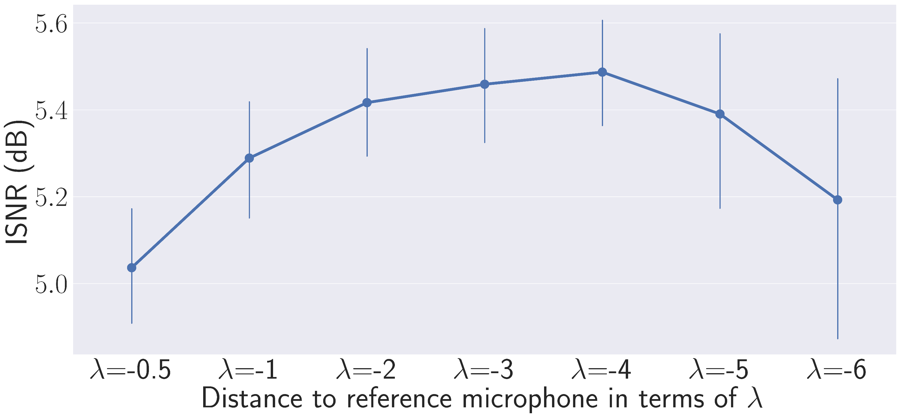
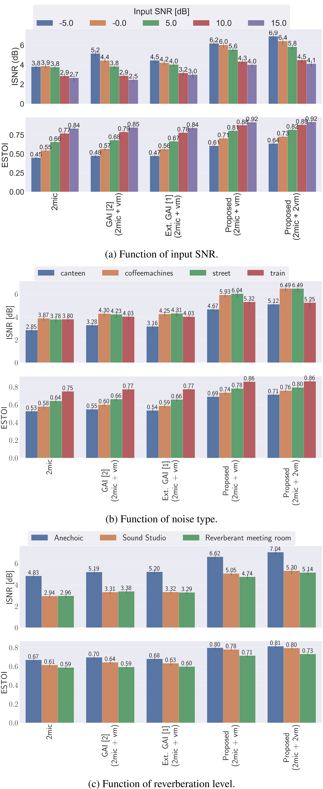

# BEAMFORMING USING VIRTUAL MICROPHONES FOR HEARING AID APPLICATIONS

Mojtaba Farmani1,2, Svend Feldt1, Jesper Jensen1

1Eriksholm Research Centre, Snekkersten, Denmark 2Department of Electronic Systems, Aalborg University, Aalborg, Denmark

## ABSTRACT

This paper presents a novel, low-complexity method for synthesizing virtual microphone (VM) signals to enhance beamforming in hearing aid (HA) applications. Leveraging the W-disjoint orthogonality (WDO) assumption, the proposed approach generates additional VM channels from a typical two-microphone setup, potentially eliminating the need for extra hardware for physical microphone channels. The VM signals are estimated by modeling their relative transfer functions (RTFs) as a power function of the RTF between the physical microphones, enabling both interpolation and extrapolation of VM positions. We demonstrate the integration of the synthesized VM signals into a minimum variance distortionless response (MVDR) beamformer using realistic HA recordings across diverse acoustic scenarios. Experimental results show substantial improvements in signal-to-noise ratio (SNR) and objective speech intelligibility, with further gains achieved by optimizing VM position(s). Compared to existing VM methods, the proposed technique offers superior performance and scalability while maintaining low computational complexity, making it highly suitable for resourceconstrained devices such as HAs.

Index Terms— hearing aid, beamforming, virtual microphone

## 1. INTRODUCTION

Modern hearing aids (HAs) rely on microphone arrays to enable advanced speech enhancement algorithms like beamforming. The performance of these algorithms generally improves with the number of microphones, but practical constraints such as device size, power consumption, and hardware complexity limit the number that can be integrated. To overcome this limitation, virtual microphones (VMs) can synthesize acoustic signals at locations where no physical microphones exist, effectively increasing the array size without additional hardware [1, 2, 3, 4, 5]. This paper introduces a novel, lowcomplexity method for estimating VM signals, specifically designed to enhance beamforming performance in HA applications.

Existing methods for generating VM signals vary in complexity and application focus. Some approaches synthesize the VM signal based on a propagation model using geometric information, such as the estimated source direction of arrival (DOA) [3]. These methods, often targeting spatial perception, can be adapted for noisy and reverberant conditions [6]. Other techniques, such as generalized amplitude interpolation (GAI) [2, 5], focus on noise reduction by interpolating the phase and amplitude of physical microphone signals. Although effective to a degree, GAI methods require separate manipulation of phase and amplitude, increasing computational complexity. The work in [1] extends GAI by introducing wavelength-proportional arrangements of VMs, enabling both interpolation and extrapolation of VM positions. However, its extrapolation relies solely on phase information, which may be inadequate for HA applications where both phase and amplitude are critical due to head shadowing effects. Recently, neural networkbased estimators have shown enhanced performance but at the cost of significantly higher computational demands, making them less suitable for resource-constrained devices such as HAs [4, 7, 8].

The proposed method leverages the W-disjoint orthogonality (WDO) assumption [1, 9, 10, 11], which assumes that only one sound source is dominant at any given time-frequency point due to the sparsity and non-overlap of sound signals, particularly speech. This property simplifies the signal model in the short-time Fourier transform (STFT) domain and allows for the direct estimation of the relative transfer function (RTF) between microphones [12]. We model the VM RTF as a power of the physical inter-microphones RTF, which enables low-complexity interpolation and extrapolation of the VM positions. We show that the resulting VM signals improve beamforming-based noise reduction and integrate efficiently with typical two-microphone HA pipelines. Although reverberation and stationary noises may weaken the WDO assumption, our results indicate that the approximation is sufficiently accurate for noise reduction in practical acoustic situations for hearing aid applications.

## 2. SIGNAL MODEL

Under the WDO assumption, the signal model in the STFT domain can be expressed as:

$$
Y _ { i } ( k , l ) = X ( k , l ) \cdot D _ { i } ( k , l ) ,\tag{1}
$$

where k and l denote the frequency and time-frame indices, respectively. Here, $Y _ { i } ( k , l )$ is the signal received at microphone $i , X ( k , l )$ is the dominant source signal in the (k, l) STFT tile at a predefined reference microphone, and $D _ { i } ( k , l )$ is the RTF between microphone i and the reference microphone.

For an array of M microphones, the received signals can be stacked into a vector form:

$$
\underline { { Y } } ( k , l ) = X ( k , l ) \cdot \underline { { D } } ( k , l ) ,\tag{2}
$$

where $\underline { { Y } } ( k , l ) = [ Y _ { 1 } ( k , l ) , Y _ { 2 } ( k , l ) , \ldots , Y _ { \mathrm { M } } ( k , l ) ] ^ { \top }$ and $\underline { { \boldsymbol { D } } } ( k , l ) =$ $[ 1 , D _ { 2 } ( k , l ) , \ldots , \dot { D } _ { \mathrm { M } } ( k , l ) ] ^ { \intercal }$ , where, without loss of generality, the first microphone is chosen as the reference.

## 3. VIRTUAL MICROPHONE ESTIMATION

This section details the proposed method for synthesizing a VM signal from a M = 2 array. Based on Eq. (1), the signal at the VM, $Y _ { 3 } ( k , l )$ , can be estimated from the reference microphone signal, $Y _ { 1 } ( k , l )$ , if $D _ { 3 } ( k , l )$ is known:

$$
Y _ { 3 } ( k , l ) = Y _ { 1 } ( k , l ) \cdot D _ { 3 } ( k , l ) .\tag{3}
$$

Fig. 1: Illustration of VM locations for different values of λ: Front (λ = −0.5), Middle (λ = 0.5), and Behind (λ = 1.5). Diamonds: physical microphones. Filled squares: VMs.

The core of the proposed method is to estimate $D _ { 3 } ( k , l )$ . Assuming a free-field and far-field situation, $D _ { i } ( k , l )$ can be modeled as $D _ { i } ( k , l ) ~ = ~ \alpha _ { i } ( k , l ) \cdot e ^ { - j \omega \tau _ { i } ( k , l ) }$ , where the relative attenuation $\alpha _ { i } ( k , l )$ with respect to the reference microphone and the relative delay $\tau _ { i } ( k , l )$ from the reference microphone to microphone i are functions of the inter-microphone distance $d _ { i }$ [13]. To be precise, under free-field and far-field assumptions, $\tau _ { i } ( k , l )$ is linearly related to $d _ { i } ,$ while $\alpha _ { i } ( k , l )$ follows the inverse-square law [14]. Assuming that the VM is located on the straight line between the two physical microphones, $D _ { 3 } ( k , l )$ can be modeled as a power function of $D _ { 2 } ( k , l )$

$$
D _ { 3 } ( k , l ) = \left( D _ { 2 } ( k , l ) \right) ^ { \lambda } ,\tag{4}
$$

where $\lambda \in \mathbb { R }$ is a parameter that controls the VM’s distance relative to the reference microphone. Parameter λ is a scaling factor that allows for both interpolation $( 0 < \lambda < 1 )$ and extrapolation $( \lambda > 1$ or $\lambda ~ < ~ 0 )$ of the VM position along the line connecting the two physical microphones. Generally, by raising $D _ { 2 } ( k , l )$ to the power of $\lambda ,$ we properly scale both the attenuation and the phase delay, which provides a computationally efficient way to approximate the RTF at a new virtual position. Fig. 1 illustrates the relative positions of the VM with different λ values. It is worth noting that to avoid negative exponents when placing the VM in front of the front microphone (as shown in Fig. 1), one can simply select the rear microphone (Mic. 2) as the reference and derive the VM equations accordingly. This approach simplifies implementation and ensures numerical stability.

While this model is based on simplified assumptions and does not explicitly account for complex phenomena like head-shadowing, our experimental results confirm its effectiveness for enhancing beamforming performance in realistic HA applications. Furthermore, the proposed framework is easily scalable, allowing for the synthesis of multiple VMs at different locations by selecting different values for λ.

To estimate $Y _ { 3 } ( k , l )$ using Eqs. (3) and (4), we require $D _ { 2 } ( k , l )$ which can be computed from $Y _ { 1 } ( k , l )$ and $Y _ { 2 } ( k , l )$ . Making the standard assumption that $Y _ { 1 } ( k , l )$ and $Y _ { 2 } ( k , l )$ are zero-mean [12], $D _ { 2 } ( k , l )$ is estimated as follows [12]:

$$
{ \cal D } _ { 2 } ( k , l ) = \frac { \mathrm { E } \left[ Y _ { 1 } ^ { \ast } ( k , l ) Y _ { 2 } ( k , l ) \right] } { \mathrm { E } \left[ Y _ { 1 } ^ { \ast } ( k , l ) Y _ { 1 } ( k , l ) \right] } ,\tag{5}
$$

where $\mathrm { E } [ \cdot ]$ denotes expectation operator, and ∗ represents the complex conjugate. In practice, the expectation operator E[·] can be estimated using an exponential moving average. This approach relies on the WDO assumption that within short time intervals (e.g., 20 ms), only a single dominant source is active at each frequency, which is approximately true for speech signals [11]. Accordingly, the averaging is performed over such durations to enhance estimation accuracy.

## 4. BEAMFORMER

To demonstrate the applicability and the performance of the proposed VM estimation method, we employ a minimum variance distortionless response (MVDR) beamformer [15]. The beamformer weights are computed as

$$
\underline { { w } } ( k , l ) = \frac { { \bf C } _ { v } ^ { - 1 } ( k , l ) \underline { { d } } ( k , l ) } { \underline { { d } } ^ { \mathrm { H } } ( k , l ) { \bf C } _ { v } ^ { - 1 } ( k , l ) \underline { { d } } ( k , l ) } ,\tag{6}
$$

where $\mathbf { C } _ { v } ( k , l )$ is the inter-microphone noise covariance matrix, $\underline { { d } } ( k , l )$ is the steering vector, and $( \cdot ) ^ { \mathrm { H } }$ represents the Hermitian transpose.

The noise covariance matrix $\mathbf { C } _ { v } ( k , l )$ is estimated using a voice activity detector (VAD) over frames classified as noise:

$$
\begin{array} { r } { \mathbf { C } _ { v } ( k , l ) = \mathrm { E } \left[ \underline { { Y } } ( k , l ) \underline { { Y } } ^ { \mathrm { H } } ( k , l ) \right] _ { \mathrm { V A D = N o i s e } } . } \end{array}\tag{7}
$$

To compute $\underline { { d } } ( k , l )$ , we first estimate the speech covariance matrix $\mathbf { C } _ { s } ( \boldsymbol { k } , \boldsymbol { l } )$ over frames where speech is detected:

$$
\begin{array} { r } { \mathbf { C } _ { s } ( k , l ) = \mathrm { E } \left[ \underline { { Y } } ( k , l ) \underline { { Y } } ^ { \mathrm { H } } ( k , l ) \right] _ { \mathrm { V A D = S p e e c h } } . } \end{array}\tag{8}
$$

Assuming that at each time and frequency, only one speaker is active, $\mathbf { C } _ { s } ( k , l )$ will be rank one, and the (un-normalized) steering vector is given by any column of $\mathbf { C } _ { s } ( k , l )$ [16].

## 5. EVALUATION

This section evaluates the performance of the MVDR beamformer using VMs in realistic acoustic environments.

## 5.1. Input signals

Realistic HA recordings were used as input signals. Target speech and noise signals were recorded separately using HA shells equipped with two microphones mounted on a head-and-torso simulator (HATS). Both female and male voices served as target signals, played back through loudspeakers positioned at various azimuth angles relative to the HATS. Target signals were recorded in three environments: an anechoic room, a low-reverberant sound studio (6 m×8 m×4 m) with acoustic treatment to reduce reverberation, and a typical reverberant meeting room (5 m×7 m×3 m) with hard walls, windows, and standard meeting furniture. The considered azimuth angles were $0 ^ { \circ } , 4 5 ^ { \circ } , 6 7 ^ { \circ } , 1 8 0 ^ { \circ }$ , and $3 3 0 ^ { \circ }$ , where $0 ^ { \circ }$ corresponds to the front of the user, and angles increase counterclockwise. In addition to single-target-talker scenarios, a multi-target-talker scenario was also recorded, where two talkers positioned at $4 5 ^ { \circ }$ and $- 4 5 ^ { \circ }$ engaged in a dialogue.

Noise signals were recorded separately with the same HA shells in four real-world environments: a canteen, an intercity train, near coffee machines in an office where people gather and engage in conversation, and on a street with traffic noise.

Recordings were sampled at 20 kHz. To create the noisy input signals for beamformer evaluation, 30-second segments were randomly selected from longer recordings of both target speech and noise. All combinations of target gender, azimuth angle, recording environment, and noise type were included, resulting in a comprehensive dataset. In total, 420 distinct binaural acoustic scenes (840 monaural scenes) were generated, corresponding to 420 minutes of noisy signals with SNRs ranging from -5 dB to 15 dB. This diverse set of acoustic scenarios was used for performance assessment.

## 5.2. Algorithm Setup

All signals are processed in the STFT domain using 128-sample frames (6.4 ms) with a 108-sample overlap and a 128-point fast Fourier transform (FFT) to ensure low latency processing, which is important for HA applications. A square-root Hann window is employed for both analysis and synthesis.

The RTF $D _ { 2 } ( k , l )$ is estimated according to Eq. (5), where the expectation operator E[·] is implemented as an exponential moving average with a 20 ms time constant. This estimation is based solely on the noisy microphone signals.

For the MVDR beamformer, $\mathbf { C } _ { v }$ and $\mathbf { C } _ { s } ,$ , are estimated using an ideal VAD. The VAD classifies a time-frequency tile as speech if its instantaneous SNR is positive, and as noise otherwise. The expectation operators in Eqs. (7) and (8) are implemented as exponential moving averages with a 159 ms time constant. This estimation procedure for Cv and Cs is applied consistently across the proposed method and all benchmark methods to ensure a fair comparison.

## 5.3. Performance Measures

To measure the beamformer performance, we use the improvement in segmental signal-to-noise ratio (ISNR). In addition, we use the Extended Short-Time Objective Intelligibility (ESTOI) metric [17] to objectively estimate the intelligibility of speech signals.

## 5.4. Benchmarks

To benchmark the proposed VM estimation method for noise reduction, we compare it with three alternatives. The first is a baseline MVDR beamformer using only the two physical microphones signals, without any VM. The second is the GAI method [2], which estimates the VM signal by separately interpolating the phase and amplitude of the physical microphones, resulting in a more complex solution than the proposed approach. For the GAI method, we set $\alpha = 0 . 5$ and $\beta = - 2 0$ , as recommended in [5] for optimal performance. In fact, this setup corresponds to the specific case of our method with $\lambda \ : = \ : 0 . 5$ The third benchmark is the method proposed in [1], which extends GAI to allow extrapolation and employs wavelength-proportional arrangements of VMs. We set k = 1 as recommended in [1].

## 5.5. Simulation Results

For evaluation, first we investigate the effect of the relative location of the VM. Next, we analyze the impact of the VM distance from the reference microphone. Finally, we compare the proposed method with benchmark approaches.

## 5.5.1. Relative VM location

Here, we investigate how the relative placement of the VM affects beamformer performance. We evaluate three candidate positions, as illustrated in Fig. 1: Front $( \lambda = - 0 . 5 )$ , Middle $( \lambda \stackrel { - } { = } 0 . 5 )$ and Behind $( \lambda = 1 . 5 )$

Fig. 2 shows the ISNR of the three-channel (two physical and one virtual) MVDR beamformer versus target azimuth, averaged over all noise types and environments. Placing the VM in front yields the best performance for frontal targets, while rear placement is optimal for targets behind the user. This is because SNR at the VM is highest when it is closest to the target. For HA applications, where the target is usually in front, the Front configuration is recommended and used in subsequent sections.

Fig. 2: Effect of VM relative location on MVDR SNR improvement as a function of target azimuth.

Fig. 3: Effect of the relative distance of the VM to the reference microphone on MVDR beamforming performance.

## 5.5.2. Virtual microphone distance

Here, we analyze how the VM’s distance from the reference microphone, controlled by λ, affects beamformer performance. We focus on frontal VM placement and vary λ to expand the effective array aperture. Figure 3 shows the ISNR as a function of λ, averaged over all conditions. While increasing |λ| generally improves ISNR by enhancing spatial resolution, excessive distances can introduce spatial aliasing and degrade performance. ISNR increases with |λ| up to a point $( \lambda = - 4 ) .$ , after which performance drops. This demonstrates a trade-off: larger VM distances improve beamforming performance up to a point, but too large a distance is detrimental. While we employ the same λ for all frequency bins in this analysis, the optimal λ may vary with frequency, and the method can be adapted to estimate λ per frequency bin if needed.

## 5.5.3. Comparison with benchmarks

In this section, we compare the proposed VM method with the benchmark approaches outlined in Section 5.4. Five configurations are evaluated:

• 2mic: MVDR beamformer with the two physical mics.

• GAI (2mic + vm): MVDR beamformer augmented with a VM generated using the GAI method [2].

• Ext. GAI (2mic + vm): MVDR beamformer augmented with a VM generated using the extended GAI method [1].

• Proposed (2mic + vm): MVDR beamformer augmented with the proposed VM (λ = −4).

• Proposed (2mic + 2vm): MVDR beamformer augmented with two proposed VMs (λ = −3 and −4).

Fig. 4 presents a comprehensive performance comparison across various conditions, with results broken down by input SNR (Fig. 4a), noise type (Fig. 4b), and reverberation level (Fig. 4c).

Fig. 4: Comparison of MVDR beamformer performance across different configuration as a function of input SNR (Fig. 4a), noise type (Fig. 4b), and reverberation level (Fig. 4c).

As shown in Fig. 4a, the proposed method consistently outperforms both the baseline and the GAI-based approaches. It achieves substantial gains across all input SNR levels, with an ISNR improvement of up to 3 dB over the baseline two-microphone configuration. Furthermore, Fig. 4b and Fig. 4c demonstrate that the method maintains robust performance across all tested noise types and reverberation levels. This robustness is evident even in challenging conditions that can weaken the WDO assumption, such as multi-talker environments (canteen, coffee machine), reverberant rooms, and scenes with stationary noise (train, street traffic).

Overall, the proposed VM approach delivers superior performance compared to the benchmark methods. Adding a single VM enhances both SNR and estimated intelligibility across a wide range of conditions, and adding a second VM yields further performance gains. This highlights the scalability and practical benefits of our method for hearing aid applications.

## 6. CONCLUSION

This paper presented a novel, low-complexity method for synthesizing virtual microphone (VM) signals to enhance beamforming in hearing aid applications. By leveraging the W-disjoint orthogonality assumption, the proposed approach enables the creation of additional VM channels from a standard two-microphone setup, potentially eliminating the need for extra hardware. Experimental results demonstrate that integrating the synthesized VM signals into an MVDR beamformer yields substantial improvements in signal-tonoise ratio and objective speech intelligibility across diverse acoustic scenarios. The method also allows flexible VM placement, further improving performance. Compared to existing techniques, the proposed solution offers superior noise reduction and scalability, while maintaining low computational complexity, making it highly suitable for practical hearing aid devices.

(a) Function of input SNR.

(b) Function of noise type.  
(c) Function of reverberation level.  
Fig. 4: Comparison of MVDR beamformer performance across different configuration as a function of input SNR (Fig. 4a), noise type (Fig. 4b), and reverberation level (Fig. 4c).

## 7. REFERENCES

[1] R. Jinzai, K. Yamaoka, M. Matsumoto, S. Makino, and T. Yamada, “Wavelength proportional arrangement of virtual microphones based on interpolation/extrapolation for underdetermined speech enhancement,” in 27th European Signal Processing Conference (EUSIPCO), A Coruna, Spain, 2019, pp. 1–5. ˜

[2] H. Katahira, N. Ono, S. Miyabe, T. Yamada, and S. Makino, “Nonlinear speech enhancement by virtual increase of channels and maximum SNR beamformer,” EURASIP Journal on Advances in Signal Processing, vol. 2016, no. 1, pp. 1–8, Dec. 2016.

[3] G. D. Galdo, O. Thiergart, T. Weller, and E. A. P. Habets, “Generating virtual microphone signals using geometrical information gathered by distributed arrays,” in Proc. Joint Workshop Hands-Free Speech Communication and Microphone Arrays (HSCMA), Edinburgh, Scotland, May 2011, pp. 185–190.

[4] T. Ochiai, M. Delcroix, T. Nakatani, R. Ikeshita, K. Kinoshita, and S. Araki, “Neural network-based virtual microphone estimator,” in Proc. IEEE Int. Conf. Acoustics, Speech and Signal Processing (ICASSP), 2021, pp. 6114–6118.

[5] H. Katahira, N. Ono, S. Miyabe, T. Yamada, and S. Makino, “Generalized amplitude interpolation by lambda-divergence for virtual microphone array,” in 14th International Workshop on Acoustic Signal Enhancement (IWAENC), Juan-les-Pins, France, 2014, pp. 149–153.

[6] K. Kowalczyk, A. Craciun, and E. A. P. Habets, “Generating virtual microphone signals in noisy environments,” in Proc. European Signal Processing Conference (EUSIPCO), 2013.

[7] H. Segawa, T. Ochiai, M. Delcroix, T. Nakatani, R. Ikeshita, S. Araki, T. Yamada, and S. Makino, “Neural network-based virtual microphone estimation with virtual microphone and beamformer-level multi-task loss,” in Proc. IEEE Int. Conf. Acoustics, Speech and Signal Processing (ICASSP), 2024, pp. 11 021–11 025.

[8] , “Neural virtual microphone estimator: Application to multi-talker reverberant mixtures,” in Asia-Pacific Signal and Information Processing Association (APSIPA), 2022, pp. 293– 299.

[9] O. Yilmaz and S. Rickard, “Blind separation of speech mixtures via time-frequency masking,” IEEE Transactions on Signal Processing, vol. 52, no. 7, pp. 1830–1847, Jul. 2004.

[10] S. Rickard, “The DUET blind source separation algorithm,” in Blind Speech Separation, ser. Signals and Communication Technology. Dordrecht, The Netherlands: Springer, 2007.

[11] S. Rickard and O. Yilmaz, “On the approximate w-disjoint orthogonality of speech,” in Proc. IEEE Int. Conf. Acoustics, Speech and Signal Processing (ICASSP), 2002, pp. I–529–I– 532.

[12] O. Shalvi and E. Weinstein, “System identification using nonstationary signals,” IEEE Transactions on Signal Processing, vol. 44, no. 8, pp. 2055–2063, Aug. 1996.

[13] M. Farmani, M. S. Pedersen, Z.-H. Tan, and J. Jensen, “Informed sound source localization using relative transfer functions for hearing aid applications,” IEEE/ACM Transactions on Audio, Speech, and Language Processing, vol. 25, no. 3, pp. 611–623, 2017.

[14] P. Zahorik, D. S. Brungart, and A. W. Bronkhorst, “Auditory distance perception in humans: A summary of past and present research,” Acta Acustica united with Acustica, vol. 91, no. 3, pp. 409–420, 2005.

[15] E. A. Habets, J. Benesty, S. Gannot, and I. Cohen, “The MVDR beamformer for speech enhancement,” in Speech Processing in Modern Communication. Berlin, Germany: Springer, 2010, pp. 225–254.

[16] B. Cornelis, S. Doclo, T. V. den Bogaert, M. Moonen, and J. Wouters, “Theoretical analysis of binaural multimicrophone noise reduction techniques,” IEEE Transactions on Audio, Speech, and Language Processing, vol. 18, no. 2, pp. 342–355, Feb. 2010.

[17] J. Jensen and C. H. Taal, “An algorithm for predicting the intelligibility of speech masked by modulated noise maskers,” IEEE/ACM Transactions on Audio, Speech, and Language Processing, vol. 24, no. 11, pp. 2009–2022, Nov. 2016.