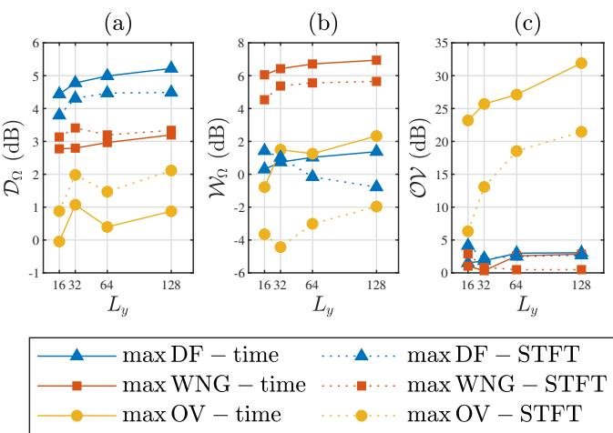

# LOW-LATENCY AUDIO FRONT-END REGION-OF-INTEREST BEAMFORMING FOR SMART GLASSES

Ariel Frank and Israel Cohen

Andrew and Erna Viterbi Faculty of Electrical and Computer Engineering Technion – Israel Institute of Technology, Haifa 3200003, Israel

## ABSTRACT

In wearable audio capture, region-of-interest (ROI) beamforming improves robustness to direction-of-arrival uncertainty while aligning acquisition with the wearer’s field of view. Least-distortion maximum-gain (LDMG) ROI beamformers have been proposed in both the time domain and the short-time Fourier transform (STFT) domain, but their trade-offs for smart-glasses front ends remain unclear. We develop a unified formulation that subsumes both implementations, makes their approximations explicit, and enables a fair, streaming-aware comparison. Using real multichannel recordings from a smart-glasses platform, we quantify algorithmic latency and real-time complexity and benchmark speech enhancement and spatial selectivity. Across all tested conditions, the time-domain implementation delivers higher performance with 2× lower algorithmic latency, at the cost of increased computation. These results indicate that, when low latency is critical and modest additional on-device computing power is available, time-domain ROI beamforming is the preferred choice for smart-glasses front ends.

Index Terms— wearable audio, smart glasses, region-ofinterest beamforming, low latency, on-device compute.

## 1. INTRODUCTION

The rapid emergence of smart glasses with integrated microphone arrays sharpens the need for low-latency, low-power spatial filtering on resource-constrained hardware. Spatial filtering, also known as beamforming, can align audio capture with the wearer’s field of view. In these wearables, even tens of milliseconds of algorithmic latency can disrupt lip-sync and conversational turn-taking, while compute and memory budgets are tightly bounded by thermal and battery limits. Region-of-interest (ROI) beamforming is well-suited to this application: rather than preserving a single direction of arrival (DOA), it preserves signals from a spatial region while suppressing sounds from elsewhere, accommodating DOA uncertainty due to head motion, moving or switching sources, background noise, and reverberation, thereby mitigating distortion. This paper asks: which domain—time or short-time Fourier transform (STFT)—better serves ROI beamforming for smart-glasses audio front ends?

Beamformers are often designed to focus on specific DOAs [1– 6]. When the precise direction is unknown, frequency-invariant [7], constant-beamwidth [8, 9], and ROI [10–15] beamformers reduce distortion. Other methods enhance the signal without explicitly specifying an ROI [16–19]. While neural networks can achieve strong performance [10–13, 16–19], classical options are less memory- and compute-demanding [7–9,14,15,20]. Implementations split roughly into two camps: time-domain processing of the waveform [7–11, 15, 20] and STFT processing [12–14, 16–19]. Which implementation is preferable — time or STFT — remains unsettled. Latency favors the time domain [7, 21]. However, computational complexity is application-dependent [22]: some report lower complexity for time-domain processing [23], others find the advantage holds only for small arrays [22, 24], and still others report higher complexity for the time domain [2, 25]. In terms of performance, [21] shows equivalence of time- and frequency-domain weights when no analysis/synthesis windows are used. In practice, windows are used to reduce STFT aliasing at the cost of degrading the signal-to-noise ratio (SNR) [26], and the window length imposes a trade-off between time and frequency resolution [25]. Several studies favor time-domain implementations—slightly better signal quality [23], slightly better speech separation [27], better localization [20], greater robustness to range errors [22], and improved low-frequency behavior [24], or in general better [25]—whereas [2] found the STFT implementation more robust to filter perturbations. The literature thus suggests the choice is application-specific.

We conduct a head-to-head comparison of two state-of-theart ROI least-distortion maximum-gain (LDMG) beamformers, the time-domain implementation [15] and the STFT-domain implementation [14], quantifying latency, real-time complexity, and performance on real smart-glasses recordings. Our contributions are: (i) a unified ROI formulation spanning time- and STFT-domain implementations, highlighting each domain’s modeling approximations, latency, and real-time complexity; (ii) an evaluation on real multichannel smart-glasses recordings; and (iii) guidance on the latency-complexity-performance trade-offs most relevant to wearable deployment.

## 2. SIGNAL MODEL AND PROBLEM FORMULATION

## 2.1. Signal Model

Consider a desired source signal x(t) recorded by smart glasses equipped with M microphones. The audio measured by each microphone $y _ { m } ( t ) , 1 \leq m \leq M$ , contains the desired source signal filtered by $g _ { m } ( t ) -$ —the acoustic response, from the source to that microphone, including reflections from the wearer—and additional noises, $v _ { m } ( t ) ;$

$$
\begin{array}{r l} & y _ {m} (t) = g _ {m} (t) * x (t) + v _ {m} (t) \\ & \quad = d _ {m} (t) * x _ {1} (t) + v _ {m} (t) \\ & \quad = x _ {m} (t) + v _ {m} (t), m = 1, 2, \ldots , M, \end{array}\tag{1}
$$

where t is the discrete time index and ∗ denotes linear convolution. The desired source signal measured at each microphone, $x _ { m } ( t ) =$ $g _ { m } ( t ) * x ( t )$ , can equivalently be expressed using a noncausal infinite impulse response filter relative to Microphone $1 , d _ { m } ( t ) , \operatorname { a s } x _ { m } ( t ) =$ $d _ { m } ( t ) * x _ { 1 } ( t )$

The objective is to estimate the desired source signal at the reference microphone, $x _ { 1 } ( t )$ , from the multichannel measurements $\{ y _ { m } ( t ) \} _ { m = 1 } ^ { M }$ . Two robust ROI beamforming approaches were proposed in 2025: a time-domain implementation [15] and an STFTdomain implementation [14]. Each approach starts from (1) but adopts a different approximation to derive beamformer weights. The time-domain method approximates each $d _ { m } ( t )$ by a noncausal finite impulse response filter. The STFT-domain method assumes the analysis window is sufficiently longer than the effective support of $d _ { m } ( t )$ so that they can use the multiplicative transfer function (MTF) approximation. Below, we develop both signal models under these respective assumptions, beginning with the STFT domain.

Applying the STFT with frame length $L _ { y }$ on Equation (1) yields

$$
y _ {m} (k, r) = x _ {m} (k, r) + v _ {m} (k, r),\tag{2}
$$

where k is the frequency bin index, r is the time frame index, and $y _ { m } ( k , r ) , \ x _ { m } ( k , r )$ , and $v _ { m } ( k , r )$ are respectively the STFTs of $y _ { m } ( t ) , x _ { m } ( t )$ , and $v _ { m } ( t )$ . Under the MTF approximation [28], $x _ { m } ( k , r ) ~ = ~ d _ { m } ( k ) x _ { 1 } ( k , r )$ , where $d _ { m } ( k )$ is a complex scalar. Without the MTF approximation, $x _ { m } ( k , r )$ depends on neighboring frequency and time frame bins of $x _ { 1 } ( k , r )$ [29]. Neglecting these terms can lead to a suboptimal estimate of $x _ { 1 } ( t )$

The STFT-domain implementation estimates $x _ { 1 } ( k , r )$ from $\{ y _ { m } ( k , r ) \} _ { m = 1 } ^ { M }$ and then applies an inverse STFT. In vector notation, the observation vector of length M is:

$$
\begin{array}{r l} \mathbf {y} (k, r) & = \left[ \begin{array}{l l l l} y _ {1} (k, r) & y _ {2} (k, r) & \dots & y _ {M} (k, r) \end{array} \right] ^ {T} \\ & = \mathbf {d} (k) x _ {1} (k, r) + \mathbf {v} (k, r) \\ & = \mathbf {x} (k, r) + \mathbf {v} (k, r), \end{array}\tag{3}
$$

where $_ T$ denotes transpose, ${ \bf x } ( k , r )$ and $\mathbf { v } ( k , r )$ are defined similarily $\operatorname { t o } \mathbf { y } ( k , r )$ ), and

$$
\mathbf {d} (k) = \left[ \begin{array}{c c c c} d _ {1} (k) & d _ {2} (k) & \dots & d _ {M} (k) \end{array} \right] ^ {T}\tag{4}
$$

is known as the steering vector of length M.

For the time-domain implementation, Equation (1) is approximated as:

$$
y _ {m} (t) = \sum_ {t ^ {\prime} = - \Delta} ^ {L _ {d} - 1 - \Delta} d _ {m} (t ^ {\prime}) x _ {1} (t - t ^ {\prime}) + v _ {m} (t),\tag{5}
$$

where $L _ { d }$ is the noncausal finite impulse response length and $\Delta \geq 0$ is the number of noncausal coefficients. Approximating with too small values for $\Delta$ and $L _ { d }$ can lead to a suboptimal estimate of $x _ { 1 } ( t )$ . The time-domain implementation estimates $x _ { 1 } ( t )$ from $L _ { y }$ samples per channel. In vector notation, the observation vector of length $M L _ { y }$ is:

$$
\begin{array}{r l} \mathbf {y} (t) & = \left[ \begin{array}{c c c c} \mathbf {y} _ {1} ^ {T} (t) & \mathbf {y} _ {2} ^ {T} (t) & \dots & \mathbf {y} _ {M} ^ {T} (t) \end{array} \right] ^ {T} \\ & = \mathbf {D} \bar {\mathbf {x}} _ {1} (t + \Delta) + \mathbf {v} (t) \\ & = \mathbf {x} (t) + \mathbf {v} (t), \end{array}\tag{6}
$$

where

$$
\mathbf {y} _ {m} (t) = \left[ \begin{array}{c c c c} y _ {m} (t) & y _ {m} (t - 1) & \dots & y _ {m} (t - L _ {y} + 1) \end{array} \right] ^ {T},\tag{7}
$$

${ \bf x } ( t )$ and $\mathbf { v } ( t )$ are defined similarily to ${ \bf y } ( t )$

$$
\begin{array}{l} \bar {\mathbf {x}} _ {1} (t + \Delta) \\ = [ x _ {1} (t + \Delta) x _ {1} (t + \Delta - 1) \dots x _ {1} (t + \Delta - L + 1) ] ^ {T} \end{array}\tag{8}
$$

is a vector of length $L = L _ { d } + L _ { y } - 1$ , and D is an $M L _ { y } \times L$ real matrix called the time-domain steering matrix.

## 2.2. Problem Formulation

In the following, we omit the notations t, k, and r in expressions valid for both implementations. The noisy signal is filtered by applying h—a real linear spatiotemporal filter of length $M L _ { y }$ for the time implementation or a complex linear spatial filter of length M per frequency bin for the STFT implementation—to the observation vector $\mathbf { y } \mathbf { : }$

$$
z = \mathbf {h} ^ {H} \mathbf {y} = x _ {\mathrm{fd}} + v _ {\mathrm{rn}},\tag{9}
$$

where $H$ denotes conjugate transpose (reducing $\tan ^ { T }$ in the real timedomain case), $v _ { \mathrm { r n } } = \mathbf { \bar { h } } ^ { \mathbf { \bar { H } } } \mathbf { v }$ is the residual noise, and

$$
x _ {\mathrm{fd}} (k, r) = \mathbf {h} ^ {H} (k) \mathbf {d} (k) x _ {1} (k, r),\tag{10}
$$

$$
x _ {\mathrm{fd}} (t) = \mathbf {h} ^ {T} \mathbf {D} \bar {\mathbf {x}} _ {1} (t + \Delta)\tag{11}
$$

is the filtered desired signal for the STFT (10) and time (11) implementations.

A distortionless response is achieved when $x _ { \mathrm { f d } } ~ = ~ x _ { 1 }$ . In the STFT implementation, this directly leads to the distortionless constraint for a specific look direction: $\mathbf { h } ^ { H } ( k ) \mathbf { d } ( k ) = 1$ . In the time implementation, any element of $\bar { \mathbf { x } } _ { 1 } \left( t + \Delta \right)$ may be considered the desired element, leading to the distortionless constraint $\mathbf { h } ^ { T } \mathbf { D } = \mathbf { i } _ { l } ^ { T }$ where i is a vector of zeros of length L except for the lth element which equals 1. A practical choice is $l = \Delta \bar { + } \lfloor L _ { y } / 2 \rfloor + 1$ , where ⌊·⌋ denotes the floor operation, since the center sample of the frame is typically most correlated with the rest, improving estimation accuracy. This choice yields a latency of $\lfloor { L _ { y } } / 2 \rfloor$ samples, and is used throughout this paper. This is less than the latency of the STFT implementation, which equals $L _ { y }$ , the frame length, because the STFT accumulates $L _ { y }$ samples to compute the spectrum of a frame. Selecting a smaller l can further reduce the time implementation’s latency, but may degrade performance.

In ROI beamforming, the source may lie anywhere in the ROI, so the beamformer should minimize the average distortion across the ROI. The ROI, denoted by Ω, is the set of all directional angles $( \theta , \phi )$ from which the source may originate, where $\theta \in [ 0 , \pi ]$ and $\phi \in [ - \pi , \pi ]$ are the polar and azimuthal angles, respectively, in a spherical coordinate system. The average distortion is given by

$$
J _ {\mathrm{d}, \Omega} (\mathbf {h} (k)) = \frac {1}{| \Omega |} \iint_ {(\theta , \phi) \in \Omega} \left| \mathbf {h} ^ {H} (k) \mathbf {d} (k) - 1 \right| ^ {2} \sin \theta \mathrm{d} \phi \mathrm{d} \theta ,\tag{12}
$$

$$
J _ {\mathrm{d}, \Omega} (\mathbf {h}) = \frac {1}{| \Omega |} \iint_ {(\theta , \phi) \in \Omega} \left[ \mathbf {D} ^ {T} \mathbf {h} - \mathbf {i} _ {l} \right] ^ {T} \left[ \mathbf {D} ^ {T} \mathbf {h} - \mathbf {i} _ {l} \right] \sin \theta \mathrm{d} \phi \mathrm{d} \theta\tag{13}
$$

for the STFT (12) and time (13) implementations, where $| \Omega | =$ $\textstyle \int _ { ( \theta , \phi ) \in \Omega }$ sin θdϕdθ. Notice that in (12) the steering vector $\mathbf { d } ( k )$ and in (13) the steering matrix D have a functional dependence on $( \theta , \phi )$ , which is omitted for notational compactness. The average distortion can have a unified expression for both implementations as

$$
J _ {\mathrm{d}, \Omega} = \mathbf {h} ^ {H} \boldsymbol {\Gamma} _ {\Omega} \mathbf {h} - \mathbf {h} ^ {H} \mathbf {d} _ {\Omega} - \mathbf {d} _ {\Omega} ^ {H} \mathbf {h} + 1,\tag{14}
$$

where

$$
\mathbf {d} _ {\Omega} (k) = \frac {1}{| \Omega |} \iint_ {(\theta , \phi) \in \Omega} \mathbf {d} (k) \sin \theta \mathrm{d} \phi \mathrm{d} \theta ,\tag{15}
$$

$$
\mathbf {\Gamma} _ {\Omega} (k) = \frac {1}{| \Omega |} \iint_ {(\theta , \phi) \in \Omega} \mathbf {d} (k) \mathbf {d} ^ {H} (k) \sin \theta \mathrm{d} \phi \mathrm{d} \theta\tag{16}
$$

for the STFT implementation, and

$$
\mathbf {d} _ {\Omega} = \frac {1}{| \Omega |} \iint_ {(\theta , \phi) \in \Omega} \mathbf {D i} _ {l} \sin \theta \mathrm{d} \phi \mathrm{d} \theta ,\tag{17}
$$

$$
\mathbf {\Gamma} _ {\Omega} = \frac {1}{| \Omega |} \iint_ {(\theta , \phi) \in \Omega} \mathbf {D} \mathbf {D} ^ {T} \sin \theta \mathrm{d} \phi \mathrm{d} \theta\tag{18}
$$

for the time implementation. The average distortion is minimized by taking the derivative of (14) with respect to h and then equating to zero, leading to the minimum-distortion constraint:

$$
\boldsymbol {\Gamma} _ {\Omega} \mathbf {h} = \mathbf {d} _ {\Omega}.\tag{19}
$$

The average array gain over the ROI is given by

$$
\mathcal {G} _ {\Omega} = \frac {\mathbf {h} ^ {H} \boldsymbol {\Gamma} _ {\Omega} \mathbf {h}}{\mathbf {h} ^ {H} \boldsymbol {\Gamma_ {v}} \mathbf {h}},\tag{20}
$$

where $\begin{array} { r } { \mathbf { \rho } \mathbf { { { T } } _ { v } } = \frac { \mathbf { R _ { v } } } { \sigma _ { v _ { 1 } } ^ { 2 } } , \mathbf { R _ { v } } } \end{array}$ is the covariance matrix of $\mathbf { v } ,$ and $\sigma _ { v _ { 1 } } ^ { 2 }$ is the variance of $v _ { 1 }$ .

## 2.3. Optimal Beamforming

Both implementations derive the beamformer h by maximizing the average array gain subject to the minimum-distortion constraint:

$$
\max _ {\mathbf {h}} \frac {\mathbf {h} ^ {H} \boldsymbol {\Gamma} _ {\Omega} \mathbf {h}}{\mathbf {h} ^ {H} \boldsymbol {\Gamma} _ {\mathbf {v}} \mathbf {h}} \text { subject   to } \boldsymbol {\Gamma} _ {\Omega} \mathbf {h} = \mathbf {d} _ {\Omega}.\tag{21}
$$

Assuming $\mathbf { { { \Gamma } } } _ { \mathbf { { v } } }$ is full rank (M or M $L _ { y }$ for the STFT and time implementations, respectively), and denoting the rank of $\mathbf { \Gamma } \mathbf { \Gamma } \mathbf { \Gamma } \mathbf { \Gamma } \mathbf { \Gamma } \mathbf { \Gamma } \mathbf { \Gamma } \mathbf { \Gamma } \mathbf { \Gamma } \mathbf { \Gamma } \mathbf { \Gamma } \mathbf { \Gamma } \mathbf { \Gamma } \mathbf { \Gamma } \mathbf { \Gamma } \mathbf { \Gamma } \mathbf { \Gamma } \mathbf { \Gamma } \mathbf { \Gamma } \mathbf { \Gamma } \mathbf { \Gamma } \mathbf { \Gamma } \mathbf { \Gamma } \mathbf { \Gamma } \mathbf { \Gamma } \mathbf { \Gamma } \mathbf { \Gamma } \mathbf { \Gamma } \mathbf { \Gamma } \mathbf { \Gamma } \mathbf { \Gamma } \mathbf { \Gamma } \mathbf { \Gamma } \mathbf { \Gamma } \mathbf { \Gamma } \mathbf { \Gamma } \mathbf { \Gamma } \mathbf { \Gamma } \mathbf { \Gamma } \mathbf { \Gamma } \mathbf { \Gamma } \mathbf { \Gamma } \mathbf { \Gamma } \mathbf { \Gamma } \mathbf { \Gamma } \mathbf { \Gamma } \mathbf { \Gamma } \mathbf { \Gamma } \mathbf { \Gamma } \mathbf { \Gamma } \mathbf { \Gamma } \mathbf { \Gamma } \mathbf { \Gamma } \mathbf { \Gamma } \mathbf { \Gamma } \mathbf { \Gamma } \mathbf { \Gamma } \mathbf { \Gamma } \mathbf { \Gamma } \mathbf { \Gamma } \mathbf { \Gamma } \mathbf { \Gamma } \mathbf { \Gamma } \mathbf \mathbf { \Gamma } \mathbf { \Gamma } \mathbf \Gamma \mathbf { \Gamma } \mathbf { \Gamma } \mathbf \Gamma \mathbf { \Gamma } \mathbf \Gamma \mathbf { \Gamma } \mathbf \Gamma \mathbf  \Gamma \Gamma \Gamma \Gamma \Gamma \Gamma \Gamma \Gamma \Gamma \Gamma \mathbf \Gamma \Gamma \Gamma \Gamma \Gamma \Gamma \mathbf \Gamma \Gamma \Gamma \Gamma \Gamma \mathbf \Gamma \Gamma \Gamma \Gamma \Gamma \Gamma \Gamma \mathbf \Gamma \Gamma \Gamma \Gamma \Gamma \mathbf \Gamma \Gamma \Gamma \Gamma \Gamma \Gamma \mathbf \Gamma \Gamma \Gamma \Gamma \mathbf \Gamma \Gamma \Gamma \Gamma \Gamma \mathbf \Gamma \Gamma \Gamma \Gamma \Gamma \mathbf \Gamma \Gamma \Gamma \Gamma \Gamma \Gamma \Gamma \mathbf \Gamma \Gamma \Gamma \Gamma \Gamma \mathbf \Gamma \Gamma \Gamma \Gamma \Gamma \Gamma \mathbf \Gamma \Gamma \Gamma \Gamma \Gamma \Gamma \Gamma \Gamma \Gamma \mathbf \Gamma \Gamma \Gamma \Gamma \Gamma \Gamma \Gamma \Gamma \Gamma \Gamma \Gamma \Gamma \Gamma \Gamma \Gamma \mathbf \Gamma \Gamma \Gamma \Gamma \Gamma \Gamma \Gamma \Gamma \Gamma \Gamma \Gamma \Gamma \ c \ c \ c \ c \ c \ c \ c \ c \ c \ c \ c \ c \ c \ c \ c \ c \ c \ c \ c \ c \ c \ c $ by $P ,$ , the optimization problem in (21) can be solved via generalized eigenvalue decomposition [30], attaining the following solution:

$$
\mathbf {h} _ {P} = \left[ \sum_ {p = 1} ^ {P} \frac {\mathbf {t} _ {p} \mathbf {t} _ {p} ^ {H}}{\lambda_ {p}} \right] \mathbf {d} _ {\Omega},\tag{22}
$$

where $\mathbf { t } _ { p }$ are the eigenvectors of $\mathbf { \Gamma } _ { \mathbf { v } } ^ { - 1 } \mathbf { T } _ { \Omega }$ and $\lambda _ { p }$ are the respective positive eigenvalues sorted in descending order: $\lambda _ { 1 } \geq \lambda _ { 2 } \geq \cdot \cdot \cdot \geq$ $\lambda _ { P } > 0$ . The beamformer is made more robust by limiting the number of eigenvectors in the sum to K $, 1 \le K \le P$ , and adding a regularization constant $\mu \geq 0$

$$
\mathbf {h} _ {K, \mu} = \left[ \sum_ {p = 1} ^ {K} \frac {\mathbf {t} _ {p} \mathbf {t} _ {p} ^ {H}}{\lambda_ {p} + \mu} \right] \mathbf {d} _ {\Omega}.\tag{23}
$$

Decreasing K and increasing µ improve the average array gain, but degrade the average distortion.

Because of the modifications in (23), we suggest a final normalization so that the average desired signal reduction factor,

$$
\xi_ {\mathrm{d}, \Omega} = \frac {1}{\mathbf {h} ^ {H} \boldsymbol {\Gamma} _ {\Omega} \mathbf {h}},\tag{24}
$$

equals 1. This results in the following beamformer:

$$
\mathbf {h} = \frac {\mathbf {h} _ {K , \mu}}{\sqrt {\mathbf {h} _ {K , \mu} ^ {H} \boldsymbol {\Gamma} _ {\Omega} \mathbf {h} _ {K , \mu}}}.\tag{25}
$$

## 3. METHODS

## 3.1. Experimental Setup and Parameter Estimation

A manikin was placed on a rotating podium in an anechoic chamber. The manikin wore a pair of smart glasses equipped with $M = 6$ microphones. A loudspeaker situated across from the manikin played stationary broadband white noise to estimate the spatial statistics. The podium rotated azimuthally at a fixed elevation $\theta = 0 ^ { \circ }$ , completing one full $3 6 0 ^ { \circ }$ revolution in 10.4 minutes. Throughout the rotation, the smart glasses’ microphones recorded the excitation signal, producing signals $\{ x _ { m } ( t ) \} _ { m = 1 } ^ { M }$ sampled at 16 kHz.

To derive the beamformers, we first need to estimate the expressions appearing in (15)-(18). For the STFT implementation, we first compute the STFT of the recordings, and then we can estimate the expressions by:

$$
\widehat {\mathbf {d}} (k, \phi) = \frac {\sum_ {r} \mathbf {x} (k , r , \phi) x _ {1} ^ {H} (k , r , \phi)}{\sum_ {r} | x _ {1} (k , r , \phi) | ^ {2}},\tag{26}
$$

$$
\widehat {\mathbf {d d} ^ {H}} (k, \phi) = \frac {\sum_ {r} \mathbf {x} (k , r , \phi) \mathbf {x} ^ {H} (k , r , \phi)}{\sum_ {r} | x _ {1} (k , r , \phi) | ^ {2}},\tag{27}
$$

where the summation is over the time frames that the loudspeaker was within $\phi \pm 0 . 5 ^ { \circ }$ relative to the smart glasses, i.e., the recording spatial resolution was $1 ^ { \circ }$ . In this paper, the STFT is computed with a Hamming synthesis window of length $L _ { y }$ and the analysis window is the corresponding biorthogonal window [31] with 75% overlap. For the time implementation,

$$
\widehat {\mathbf {D i} _ {l}} (\phi) = \frac {\sum_ {t} \mathbf {x} (t , \phi) \bar {\mathbf {x}} _ {1} ^ {T} (t + \Delta , \phi) \mathbf {i} _ {l}}{\sum_ {t} x _ {1} ^ {2} (t , \phi)},\tag{28}
$$

$$
\widehat {\mathbf {D} \mathbf {D} ^ {T}} (\phi) = \frac {\sum_ {t} \mathbf {x} (t , \phi) \mathbf {x} ^ {T} (t , \phi)}{\sum_ {t} x _ {1} ^ {2} (t , \phi)},\tag{29}
$$

where the summation is over time indices with hops of $0 . 2 5 L _ { y }$ to use the same amount of data as the STFT implementation. We configure $L = 2 L _ { y } - 1$ and $\Delta = \lceil L _ { y } / 2 \rceil - 1$ as suggested in [15].

The ROI expressions in (15)-(18) are then obtained by averaging the corresponding per-direction estimates from (26)-(29) over the ${ \mathrm { R O I } } , \Omega = \{ \phi : \ \bar { \phi } \in [ - 5 ^ { \circ } , 5 ^ { \circ } ] \}$ , which represents directions in front of the smart glasses. We computed each quantity per azimuth and only then averaged over Ω, since the empirical variance of x1 changed with the direction of the loudspeaker. Finally, the beamformers can be derived for a specified noise distribution.

## 3.2. Performance Evaluation

To assess performance, we filter the recordings with the designed beamformers. The STFT implementation first computes the STFT of the recordings, then applies a beamformer per frequency bin, and finally computes the inverse STFT.

Focusing on the time intervals when the loudspeaker was positioned within the ROI, we calculate the empirical average desired signal reduction factor as

$$
\xi_ {\mathrm{d}, \Omega} = \frac {\operatorname{var} [ x _ {1} (t) ]}{\operatorname{var} [ x _ {\mathrm{fd}} (t) ]},\tag{30}
$$

where $\mathrm { v a r } ( \cdot )$ is the empirical variance, and is computed over the times when the loudspeaker was within the ROI. Next, desired signal distortion is quantified by the scale-invariant signal-to-distortion ratio (SI-SDR) [32], again computed over the times when the loudspeaker was within the ROI.

Table 1. Comparison of Time and STFT Implementations

<table><tr><td></td><td>Time</td><td>STFT</td></tr><tr><td>Latency</td><td> $\lfloor L_y/2 \rfloor$ </td><td> $L_y$ </td></tr><tr><td>Complexity</td><td> $ML_y^2$ </td><td> $\mathcal{O}(ML_y\log_2L_y)$ </td></tr></table>

The directivity factor (DF) characterizes the attenuation of diffuse noise. The empirical diffuse noise reduction factor is given by (30) where the variance is computed over the entire $3 6 0 ^ { \circ }$ recording. Finally, the average DF over the ROI, $\mathcal { D } _ { \Omega }$ , is given by the ratio of the empirical diffuse noise reduction factor to the empirical average desired signal reduction factor.

The white noise gain (WNG) characterizes the attenuation of thermal noise. It is evaluated by passing white noise through the beamformer. Denoting the white noise at the microphones by $\{ v _ { m } ( t ) \} _ { m = 1 } ^ { M }$ and the filtered white noise by $v _ { \mathrm { r n } } ( t )$ , the empirical white noise reduction factor is

$$
\xi_ {\mathrm{n}} = \frac {\operatorname{var} [ v _ {1} (t) ]}{\operatorname{var} [ v _ {\mathrm{rn}} (t) ]}.\tag{31}
$$

Finally, the average WNG over the ROI, $\mathcal { W } _ { \Omega }$ , is given by the ratio of the empirical white noise reduction factor to the empirical average desired signal reduction factor.

In addition to diffuse and thermal noise, the beamformer should suppress the wearer’s own voice. To measure this, a loudspeaker at the manikin’s mouth plays white noise, which is recorded by the array. The own-voice reduction factor, OV, is given by equation (31) where the white noise is replaced with the own-voice recordings. Larger OV indicates better own-voice suppression.

## 3.3. Computational Complexity

In this section, we analyze the real-time computational complexity of each implementation, with beamformer weights precomputed offline. For the time-domain implementation, computing a sample at the output of the beamformer requires $M L _ { y }$ real multiplications according to (9). Thus, producing $L _ { y }$ output samples costs $M L _ { y } ^ { 2 }$ real multiplications. For the STFT-domain implementation, processing is done in frames of length $L _ { y }$ per microphone. Per frame: (i) analysis windowing costs $M L _ { y }$ real multiplications, (ii) M FFTs cost $M \{ \frac { L _ { y } } { 2 } [ \log _ { 2 } ( L _ { y } ) - 3 ] + 2 \}$ real multiplications [33], (iii) beamforming on the nonnegative frequency bins costs $4 M ( \lfloor \frac { L _ { y } } { 2 } \rfloor + 1 )$ real multiplications, (iv) the inverse FFT costs $\begin{array} { r } { \frac { L _ { y } } { 2 } [ \log _ { 2 } ( L _ { y } ) - 3 ] + 2 } \end{array}$ real multiplications, and (v) synthesis windowing costs $L _ { y }$ real multiplications. With R% overlap, this is repeated $\frac { R } { 1 0 0 - R }$ times every $L _ { y }$ samples. Table 1 highlights the superiority of the time-domain implementation in terms of latency at the cost of additional computations compared with the STFT-domain implementation.

## 4. EXPERIMENTAL RESULTS AND DISCUSSION

We derived three ROI beamformers that differ in the assumed noise field. Each beamformer was derived with the time and STFT implementations for frame lengths of $L _ { y } \in \{ 1 6 , 3 2 , 6 4 , 1 2 8 \}$ , corresponding to latencies of {0.5, 1, 2, 4} ms for the time implementation and {1, 2, 4, 8} ms for the STFT implementation. We first derived the maximum DF beamformer, where $\mathbf { { { T } _ { v } } }$ was obtained by averaging the expression in (27) or (29) over the 360 azimuthal angles. Second, we derived the maximum WNG beamformer, where $\mathbf { { { r } _ { v } } }$ was set to the identity matrix. Last, we derived the maximum own-voice reduction beamformer, where $\mathbf { { { T } _ { v } } }$ was empirically estimated with the own-voice recordings as in (27) or (29). Additionally, we applied diagonal loading to ensure $\mathbf { { { \Gamma } } } _ { \mathbf { { v } } }$ is well conditioned, setting $\pmb { \Gamma _ { \mathbf { v } } }  0 . 9 9 \pmb { \Gamma _ { \mathbf { v } } } + 0 . 0 1 \mathbf$ , where I denotes the identity matrix.

  
Fig. 1. (a) Directivity factor, (b) white noise gain, and (c) own-voice reduction factor versus frame length for ROI beamformers optimized for maximum DF (triangles), maximum WNG (squares), and maximum own-voice reduction (circles). Results are shown for the timedomain (solid line) and STFT-domain (dotted line) implementations.

To enable a fair comparison, we tuned K and $\mu$ such that the SI-SDR of each beamformer equaled 14.9 dB. We coarsely attained the specified SI-SDR by choosing the smallest K for which the SI-SDR exceeded 14.9 dB. Then we slightly increased $\mu$ until the SI-SDR reached 14.9 dB.

Figure 1 displays the performance of the beamformers as a function of the frame length. As expected, the maximum DF beamformers have the highest DF among the beamformers, and their DF increases monotonically with the frame length. Additionally, the time implementation has a better DF than the STFT implementation. The same trends occur for the maximum WNG beamformers when observing the WNG, and for the maximum own-voice reduction beamformers when observing the own-voice reduction factor.

We attribute the advantage of the time implementation to its direct spatiotemporal filtering of the waveform. In contrast, the STFT implementation relies on the MTF approximation, which is inaccurate when the frame length is shorter than the effective support of the relative impulse responses.

## 5. CONCLUSIONS

We compared time-domain and STFT-domain implementations of ROI LDMG beamformers for smart glasses. By enforcing a regionof-interest (ROI) distortion constraint, our approach preserves signals within the wearer’s field of view while suppressing noise and interference from outside the ROI. Under all evaluated conditions, the time-domain implementation consistently outperformed the STFTdomain alternative, achieving superior performance with half the latency. This improvement is achieved at the cost of increased computational complexity. These findings suggest that time-domain implementations are particularly suitable for on-device listening on smart glasses, especially when low latency and minimal in-ROI distortion are crucial and sufficient computational resources are available.

## 6. REFERENCES

[1] Wei Xue, Alastair H Moore, Mike Brookes, and Patrick A Naylor, “Modulation-domain multichannel Kalman filtering for speech enhancement,” IEEE/ACM Trans. Audio, Speech, Language Process., vol. 26, no. 10, pp. 1833–1847, 2018.

[2] Xiaofei Li, Laurent Girin, Sharon Gannot, and Radu Horaud, “Multichannel speech separation and enhancement using the convolutive transfer function,” IEEE/ACM Trans. Audio, Speech, Language Process., vol. 27, no. 3, pp. 645–659, 2019.

[3] Ju Lin, Niko Moritz, Yiteng Huang, Ruiming Xie, Ming Sun, Christian Fuegen, and Frank Seide, “AGADIR: Towards arraygeometry agnostic directional speech recognition,” in Proc. IEEE Int. Conf. Acoust. Speech Signal Process., 2024, pp. 11951–11955.

[4] Tiantian Feng, Ju Lin, Yiteng Huang, Weipeng He, Kaustubh Kalgaonkar, Niko Moritz, Li Wan, Xin Lei, Ming Sun, and Frank Seide, “Directional source separation for robust speech recognition on smart glasses,” in Proc. IEEE Int. Conf. Acoust. Speech Signal Process., 2025, pp. 1–5.

[5] Ya Jiang, Hongbo Lan, Qing Wang, and Shutong Niu, “Multimodal streaming ASR in cross-talk scenario for smart glasses,” in Proc. IEEE Int. Conf. Acoust. Speech Signal Process., 2025, pp. 1–5.

[6] Yufeng Yang, Desh Raj, Ju Lin, Niko Moritz, Junteng Jia, Gil Keren, Egor Lakomkin, Yiteng Huang, Jacob Donley, Jay Mahadeokar, et al., “M-BEST-RQ: A multi-channel speech foundation model for smart glasses,” in Proc. IEEE Int. Conf. Acoust. Speech Signal Process., 2025, pp. 1–5.

[7] Shefeng Yan, “Robust time-domain broadband modal beamforming for circular arrays,” IEEE Trans. Aerosp. Electron. Syst., vol. 56, no. 3, pp. 1783–1794, 2020.

[8] Avital Kleiman, Israel Cohen, and Baruch Berdugo, “Constant-beamwidth beamforming with nonuniform concentric ring arrays,” IEEE/ACM Trans. Audio, Speech, Language Process., vol. 30, pp. 1952–1962, 2022.

[9] Orel Peretz and Israel Cohen, “Constant elevation-beamwidth beamforming with concentric ring arrays,” IEEE/ACM Trans. Audio, Speech, Language Process., vol. 32, pp. 1662–1672, 2024.

[10] Anton Kovalyov, Kashyap Patel, and Issa Panahi, “DSENet: Directional signal extraction network for hearing improvement on edge devices,” IEEE Access, vol. 11, pp. 4350–4358, 2023.

[11] Teerapat Jenrungrot, Vivek Jayaram, Steve Seitz, and Ira Kemelmacher-Shlizerman, “The cone of silence: Speech separation by localization,” in Proc. Advances in Neural Information Process. Systems, 2020, vol. 33, pp. 20925–20938.

[12] Rongzhi Gu and Yi Luo, “ReZero: Region-customizable sound extraction,” IEEE/ACM Trans. Audio, Speech, Language Process., vol. 32, pp. 2576–2589, 2024.

[13] Zhongweiyang Xu, Ali Aroudi, Ke Tan, Ashutosh Pandey, Jung-Suk Lee, Buye Xu, and Francesco Nesta, “FoVNet: Configurable field-of-view speech enhancement with low computation and distortion for smart glasses,” in Proc. Interspeech, 2024, pp. 3350–3354.

[14] Gal Itzhak and Israel Cohen, “STFT-domain least-distortion region-of-interest beamforming,” IEEE Trans. Audio, Speech, Language Process., vol. 33, pp. 2803–2816, 2025.

[15] Ariel Frank and Israel Cohen, “Least-distortion maximum gain beamformer for time-domain region-of-interest beamforming,” IEEE Trans. Audio, Speech, Language Process., vol. 33, pp. 2286–2301, 2025.

[16] Kristina Tesch and Timo Gerkmann, “Insights into deep nonlinear filters for improved multi-channel speech enhancement,”

IEEE/ACM Trans. Audio, Speech, Language Process., vol. 31, pp. 563–575, 2023.

[17] Changsheng Quan and Xiaofei Li, “SpatialNet: Extensively learning spatial information for multichannel joint speech separation, denoising and dereverberation,” IEEE/ACM Trans. Audio, Speech, Language Process., vol. 32, pp. 1310–1323, 2024.

[18] Zhong-Qiu Wang, Peidong Wang, and DeLiang Wang, “Complex spectral mapping for single-and multi-channel speech enhancement and robust ASR,” IEEE/ACM Trans. Audio, Speech, Language Process., vol. 28, pp. 1778–1787, 2020.

[19] Mhd Modar Halimeh and Walter Kellermann, “Complexvalued spatial autoencoders for multichannel speech enhancement,” in Proc. IEEE Int. Conf. Acoust. Speech Signal Process., 2022, pp. 261–265.

[20] Tatiana Gelvez-Barrera, Quentin Leclere, Barbara Nicolas, Jer´ ome Antoni, and Adrian Basarab, “Time-domain beam- ˆ forming for room acoustics analysis based on reverberant field estimation,” in Proc. IEEE Int. Conf. Acoust. Speech Signal Process., 2025, pp. 1–5.

[21] Lal C Godara, “Application of the fast Fourier transform to broadband beamforming,” J. Acoust. Soc. Am., vol. 98, no. 1, pp. 230–240, 1995.

[22] Zvi Aharon Herscovici and Israel Cohen, “Feedback beamforming in the time domain,” Sensors, vol. 24, no. 7, 2024, Art. no. 2179.

[23] Mimisha M Menakath, Mahesh Raveendranatha Panicker, and G Hareesh, “A comparison of time domain vs frequency domain delay and sum beamforming for underwater 3D acoustical imaging,” in Proc. OCEANS 2022 Hampton Roads, 2022, pp. 1–5.

[24] Thomas Padois, Jeoffrey Fischer, Con Doolan, and Olivier Doutres, “Acoustic imaging with conventional frequency domain beamforming and generalized cross correlation: A comparison study,” Appl. Acoust., vol. 177, 2021, Art. no. 107914.

[25] Rongzhi Gu, Shi-Xiong Zhang, Yuexian Zou, and Dong Yu, “Towards unified all-neural beamforming for time and frequency domain speech separation,” IEEE/ACM Trans. Audio, Speech, Language Process., vol. 31, pp. 849–862, 2023.

[26] Olaf Jaeckel, “Strengths and weaknesses of calculating beamforming in the time domain,” Proc. 1st Berlin Beamform. Conf., 2006.

[27] Fahimeh Bahmaninezhad, Jian Wu, Rongzhi Gu, Shi-Xiong Zhang, Yong Xu, Meng Yu, and Dong Yu, “A comprehensive study of speech separation: Spectrogram vs waveform separation,” in Proc. Interspeech, 2019, pp. 4574–4578.

[28] Yekutiel Avargel and Israel Cohen, “On multiplicative transfer function approximation in the short-time Fourier transform domain,” IEEE Signal Process. Lett., vol. 14, no. 5, pp. 337–340, 2007.

[29] Yekutiel Avargel and Israel Cohen, “System identification in the short-time Fourier transform domain with crossband filtering,” IEEE Trans. Audio, Speech, Language Process., vol. 15, no. 4, pp. 1305–1319, 2007.

[30] Joel N. Franklin, Matrix Theory, Prentice-Hall, Englewood Cliffs, NJ, USA, 1968.

[31] Shie Qian and Dapang Chen, “Optimal biorthogonal analysis window function for discrete Gabor transform,” IEEE Trans. Signal Process., vol. 42, no. 3, pp. 694–697, 1994.

[32] Jonathan Le Roux, Scott Wisdom, Hakan Erdogan, and John R Hershey, “SDR–half-baked or well done?,” in Proc. IEEE Int. Conf. Acoust. Speech Signal Process., 2019, pp. 626–630.

[33] Martin Vetterli and Henri J Nussbaumer, “Simple FFT and DCT algorithms with reduced number of operations,” Signal Process., vol. 6, no. 4, pp. 267–278, 1984.