# PAPER

# Verification of simultaneous equations method by an experimental active noise control system

Kensaku Fujii1; , Kotaro Yamaguchi1;y , Shigeyuki Hashimoto1;z ,Yusuke Fujita2;x and Mitsuji Muneyasu3;}

1Department of Computer Engineering, University of Hyogo

2Catsystem Corporation

3Faculty of Engineering, Kansai University

( Received 14 November 2005, Accepted for publication 20 February 2006 )

Abstract: In this study, we verify the performance of the simultaneous equations method using an experimental active noise control system. The simultaneous equations method is based on a priciple different from the filtered-x algorithm requiring a filter modeled on a secondary path from a loudspeaker to an error microphone. Instead of the filter, called the secondary path filter, this method uses an auxiliary filter identifying the overall path consisting of a primary path, a noise control filter and the secondary path. As inferred from the configuration of the overall path, the auxiliary filter can provide two independent equations when two different coefficient vectors are given to the noise control filter. The method thereby estimates the coefficient vector of the noise control filter minimizing the output of the error microphone. In this paper, we propose the application of a frequency domain adaptive algorithm to the identification of the overall path. An improvement in the noise reduction speed is thereby expected. In this paper, we also present computer simulation results demonstrating that the simultaneous equations method can automatically recover the noise reduction effect degraded by path changes, and finally, using an experimental system, we indicate that the method successfully works in practical systems.

Keywords: Active noise control, Feedforward type, Secondary path change, Auxiliary filter, Simultaneous equations

PACS number: 43.50.Ki [doi:10.1250/ast.27.270]

# 1. INTRODUCTION

The filtered-x algorithm [1] is widely applied to feedforward-type active noise control (ANC) systems [2]. However, this algorithm involves a well-known drawback to be solved. Actually, the algorithm requires a filter, called the ‘‘secondary path filter,’�exactly modeled on the secondary path from a loudspeaker to an error microphone, whereas the secondary path in practical systems continuously changes. This path change inevitably increases the modeling error, and at worst, the ANC system thereby falls into an uncontrollable state [3].

In ANC systems using the filtered-x algorithm, repeatedly identifying the secondary path at certain intervals is required. The essence of the difficulty in the repeated identification is that the feedforward-type system involves two unknown paths: the secondary path and a primary path from a noise detection microphone to an error microphone. Nevertheless, in the feedforward-type system, available signals for identifying the two unknown paths are only outputs of the two microphones, which can provide only one equation. To identify the two unknown paths under active noise control, a device for yielding another independent equation is requisite [4]. As such a device, [5] presents a way of feeding an extra noise to the loudspeaker. In practical systems, avoiding such feeding is desirable.

Hence, a few methods capable of automatically recovering the noise reduction effect without feeding the extra noise have been proposed [6�]. However, [6] and [7] neglect the feedback path from the loudspeaker to the noise detection microphone. In addition, their noise reduction speed is lower than that of the filtered-x algorithm, and the processing cost of [7,8] is higher. The simultaneous equations method proposed in [8,9] can successfully work under the condition that the feedback path generates no howling [10]. In particular, [9] shows that the processing cost is lower than that of the filtered-x algorithm and also the noise reduction speed is higher. However, it has not yet been verified whether the simultaneous equations method can reduce the noise in practical systems. In this study, we verify this using an experimental system.

The simultaneous equations method is characterized by an auxiliary filter identifying the overall path from the noise detection microphone, through the primary path, noise control filter and secondary path, to the error microphone. In this study, we apply a frequency domain adaptive algorithm to the identification instead of two wellknown algorithms: the normalized least mean square (NLMS) algorithm used in [8] and cross spectrum method adopted in [9] for decreasing the processing cost. The noise reduction speed is thereby improved [11].

In this paper. we first show that the simultaneous equations method can estimate the coefficient vector of the optimum noise control filter minimizing the output of the error microphone even in the system involving the feedback path. Next, we explain the procedure for repeatedly estimating the coefficient vector and examine the performance of the simultaneous equations method using the frequency domain adaptive algorithm by computer simulation. Finally, we introduce an experimental system, and by applying a recorded diesel engine exhaust gas noise to it, we indicate that the simultaneous equations method is feasible in practical systems.

# 2. SIMULTANEOUS EQUATIONS METHOD

The simultaneous equations method [8] is characterized by an auxiliary filter substituted for the secondary path filter forming the core of the filtered-x algorithm [1]. Figure 1 shows the configuration of the feedforward-type active noise control system using the simultaneous equations method, where z-transforms indicate the following signals, filters and paths.

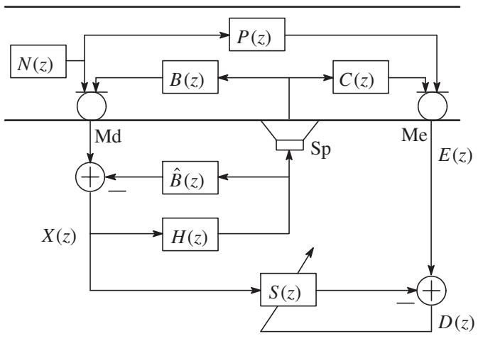

<details>
<summary>flowchart</summary>

```mermaid
graph TD
    A["N(z)"] --> B["+"]
    C["Md"] --> D["+"]
    E["X(z)"] --> F["+"]
    G["BÌ‚(z)"] --> H["Sp"]
    I["H(z)"] --> J["S(z)"]
    K["P(z)"] --> L["C(z)"]
    M["Me"] --> N["D(z)"]
    O["Sp"] --> P["+"]
    Q["E(z)"] --> R["+"]
    S["�] --> T["�]
    U["�] --> V["�]
    W["�] --> X["�]
    Y["�] --> Z["�]
    AA["�] --> AB["�]
    AC["�] --> AD["�]
    AE["�] --> AF["�]
    AG["�] --> AH["�]
    AI["�] --> AJ["�]
    AK["�] --> AL["�]
    AM["�] --> AN["�]
    AO["�] --> AP["�]
    AQ["�] --> AR["�]
    AS["�] --> AT["�]
    AU["�] --> AV["�]
    AW["�] --> AX["�]
    AY["P(z)"] --> AZ["C(z)"]
    BA["B(z)"] --> BB["C(z)"]
    BC["BÌ‚(z)"] --> BD["C(z)"]
    BE["H(z)"] --> BF["C(z)"]
    BG["S(z)"] --> BH["C(z)"]
    BI["D(z)"] --> BJ["C(z)"]
```
</details>

Fig. 1 Configuration of feedforward-type active noise control system using simultaneous equations method.

NðzÞ Primary noise

PðzÞ Primary path from noise detection microphone, Md, to error microphone, Me

CðzÞ Secondary path from loudspeaker, Sp, to error microphone, Me

$B ( z )$ Feedback path from loudspeaker, Sp, to noise detection microphone, Md

$\hat { B } ( z )$ Feedback control filter

$H ( z )$ Noise control filter

SðzÞ Auxiliary filter

XðzÞ Input signal of noise control filter

EðzÞ Output signal of error microphone

DðzÞ Identification error

In this configuration, the auxiliary filter SðzÞ is used for identifying the overall path from the input of the noise control filter to the output of the error microphone. This overall path is rearranged, as shown in Fig. 2, where

$$
\Delta B (z) = B (z) - \hat {B} (z), \tag {1}
$$

and

$$
\tilde {C} (z) = C (z) - \Delta B (z) P (z). \tag {2}
$$

Naturally, $\tilde { C } ( z )$ is equal to $C ( z )$ when the feedback control filter perfectly cancels the feedback path: $\varDelta B ( z ) = 0$ . In any case, the auxiliary filter gives

$$
S (z) = P (z) + H (z) \tilde {C} (z) \tag {3}
$$

after the identification.

In addition, our purpose is to derive the optimum noise control filter, $H _ { \mathrm { o p t } } ( z )$ , satisfying

$$
P (z) + H _ {\text { opt }} (z) \tilde {C} (z) = 0. \tag {4}
$$

Equation (4) states that the estimation of $P ( z )$ and $\tilde { C } ( z )$ is necessary for the derivation of $H _ { \mathrm { o p t } } ( z )$ . However, the available signals for this estimation are only XðzÞ and EðzÞ; thus, this system can provide only Eq. (3). As it stands, estimating PðzÞ and $\tilde { C } ( z )$ from only Eq. (3) is impossible. For this estimation, two independent equations are requisite.

To obtain these two equations, the simultaneous equations method exploits the fact that the system can give arbitrary coefficient vectors to the noise control filter if we accept the degradation of the noise reduction effect. Such acceptance can provide us two relations,

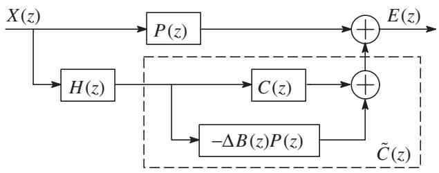

<details>
<summary>flowchart</summary>

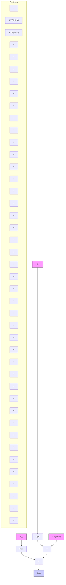
</details>

Fig. 2 Block diagram of overall path identified by auxiliary filter.

$$
S _ {1} (z) = P (z) + H _ {1} (z) \tilde {\boldsymbol {C}} (z) \tag {5}
$$

and

$$
S _ {2} (z) = P (z) + H _ {2} (z) \tilde {\boldsymbol {C}} (z), \tag {6}
$$

after the identification of the overall path. Clearly, Eqs. (5) and (6) are valid when the two different coefficient vectors given to the noise control filter satisfy

$$
H _ {2} (z) \neq H _ {1} (z). \tag {7}
$$

Under this condition, the elimination of $\tilde { C } ( z )$ provides a solution,

$$
P (z) = \frac {S _ {1} (z) H _ {2} (z) - S _ {2} (z) H _ {1} (z)}{H _ {2} (z) - H _ {1} (z)}, \tag {8}
$$

and similarly, the elimination of PðzÞ from Eqs. (5) and (6) gives another solution,

$$
\tilde {C} (z) = \frac {S _ {1} (z) - S _ {2} (z)}{H _ {1} (z) - H _ {2} (z)}. \tag {9}
$$

Incidentally, solution (9) can be used for refreshing the coefficient vector of the secondary path filter [12,13].

As mentioned above, our purpose is to estimate $H _ { \mathrm { o p t } } ( z )$ satisfying Eq. (4). In addition, $P ( z )$ and $C ( z )$ , which are necessary for calculating $H _ { \mathrm { o p t } } ( z )$ , are obtained as Eqs. (8) and (9). Then, the remaining operation is only the substitution of Eqs. (8) and (9) into Eq. (4). This substitution yields

$$
\begin{array}{l} \{S _ {1} (z) H _ {2} (z) - S _ {2} (z) H _ {1} (z) \} \\ - H _ {\text { opt }} (z) \{S _ {2} (z) - S _ {1} (z) \} = 0. \tag {10} \\ \end{array}
$$

Moreover, as inferred from Fig. 2, $H _ { 2 } ( z ) \neq H _ { 1 } ( z )$ satisfies

$$
S _ {2} (z) - S _ {1} (z) \neq 0. \tag {11}
$$

Therefore, Eq. (10) gives

$$
H _ {\mathrm{opt}} (z) = \frac {S _ {1} (z) H _ {2} (z) - S _ {2} (z) H _ {1} (z)}{S _ {2} (z) - S _ {1} (z)} \tag {12}
$$

consisting of the known components.

In practical use, the degradation of the noise reduction effect is unacceptable. To prevent the degradation, the simultaneous equations method exploits the error involved in the estimated coefficient vector of the noise control filter. Using the estimation error, the simultaneous equations method can continuously refresh the coefficient vector of the noise control filter. Automatically recovering the degraded noise reduction effect thereby becomes possible.

# 3. TRANSFORMATION INTO FILTER COEFFICIENT VECTOR

In practical use, an operation for transforming $H _ { \mathrm { o p t } } ( z )$ into a filter coefficient vector is required. Figure 3 shows a transformation technique, which is proposed in [8]. In

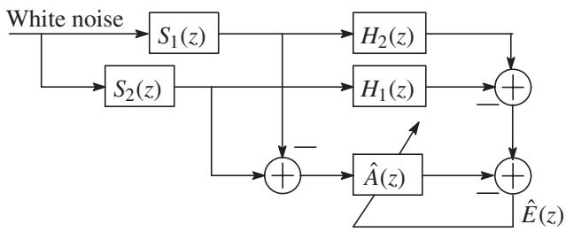

<details>
<summary>flowchart</summary>


</details>

Fig. 3 System identification circuit transforming $H _ { \mathrm { o p t } } ( z )$ into filter coefficient vector.

Fig. 3, the adaptive algorithm estimates the coefficient vector of the adaptive filter $\hat { A } ( z )$ so as to minimize

$$
\begin{array}{l} \hat {E} (z) = \{S _ {1} (z) H _ {2} (z) - S _ {2} (z) H _ {1} (z) \} \\ - \hat {A} (z) \{S _ {2} (z) - S _ {1} (z) \}. \tag {13} \\ \end{array}
$$

Obviously, $\hat { A } ( z )$ is approximate to $H _ { \mathrm { o p t } } ( z )$ after $\hat { E } ( z )$ has become minimum. [8] presents simulation results demonstrating that the technique can successfully derive the coefficient vector of the optimum noise control filter. However, this estimation requires a high processing cost.

To reduce the cost, we apply a frequency domain technique to the transformation [9]. In the frequency domain, $H _ { \mathrm { o p t } } ( z )$ is expressed as

$$
H _ {\mathrm{opt}} (\omega) = \frac {S _ {1} (\omega) H _ {2} (\omega) - S _ {2} (\omega) H _ {1} (\omega)}{S _ {2} (\omega) - S _ {1} (\omega)}, \tag {14}
$$

where $H _ { 1 } ( \omega ) , H _ { 2 } ( \omega ) , S _ { 1 } ( \omega )$ and $S _ { 2 } ( \omega )$ are the frequency responses of the noise control filter and auxiliary filter, respectively. In this case, the inverse Fourier transform becomes available for this transformation; thereby, the processing cost extremely decreases [9]. Actually, the frequency responses are estimated using the fast Fourier transform (FFT). Hence, in this paper, we rewrite Eq. (14) as

$$
H _ {\mathrm{opt}} (k) = \frac {S _ {1} (k) H _ {2} (k) - S _ {2} (k) H _ {1} (k)}{S _ {2} (k) - S _ {1} (k)}, \tag {15}
$$

where k is the element number of the frequency responses calculated by FFT.

Moreover, in many systems, the primary noise has a high autocorrelation. It is well known that frequency domain adaptive algorithms improve the identification speed in such a case. In any case, the transformation using FFT requires the estimation of the frequency response of the auxiliary filter, SðkÞ. For this estimation, we use the following frequency domain adaptive algorithm:

$$
S _ {j + 1} (k) = S _ {j} (k) + \mu \frac {\sum_ {i = j I + 1} ^ {(j + 1) I} D _ {i} (k) X _ {i} ^ {*} (k)}{\sum_ {i = j I + 1} ^ {(j + 1) I} X _ {i} (k) X _ {i} ^ {*} (k)}, \tag {16}
$$

where

j block number,

\- step size,

i FFT duration number,

I number of blocks,

$D _ { i } ( k )$ kth spectrum element of identification error DðzÞ shown in Fig. 1,

XiðkÞ kth spectrum element of noise control filter input XðzÞ,

and fg indicates the complex conjugate. The calculation of Eq. (16) is repeated J times, and its result is used as $S _ { 1 } ( k )$ and $S _ { 2 } ( k )$ in Eq. (15). In Eq. (16), the summation is applied to reducing the probability that the denominator of the second term becomes zero.

# 4. UPDATING PROCEDURE

In practical systems, the coefficient vector of the noise control filter should be repeatedly refreshed. Figure 4 shows the flow chart of the refreshment procedure. The simultaneous equations method can continuously update the coefficient vector by repeating the procedure shown in Fig. 4:

(1) Give a coefficient vector, for example,

$$
\boldsymbol {H} _ {1} = \mathbf {0}, \tag {17}
$$

to the noise control filter.

(2) Transform $\pmb { H } _ { 1 }$ into $H _ { 1 } ( k )$

(3) Initialize the coefficient vector and frequency response of the auxiliary filter as

$$
\mathbf {S} _ {1} = \mathbf {0} \tag {18}
$$

and

$$
S _ {1} (k) = 0, \tag {19}
$$

respectively.

(4) Estimate $S _ { 1 } ( k )$ using Eq. (16).

(5) Give another coefficient vector, for example,

$$
\boldsymbol {H} _ {2} = \left[ \begin{array}{l l l l} a & 0 & \dots & 0 \end{array} \right] ^ {\mathrm{T}}, \tag {20}
$$

to the noise control filter, where a is an arbitrary nonzero constant.

(6) Transform $\pmb { H } _ { 2 }$ into $H _ { 2 } ( k )$

(7) Initialize the coefficient vector and frequency response of the auxiliary filter as

$$
\mathbf {S} _ {2} = \mathbf {0} \tag {21}
$$

and

$$
S _ {2} (k) = 0, \tag {22}
$$

respectively.

(8) Estimate $S _ { 2 } ( k )$ using Eq. (16).

(9) Calculate $H _ { \mathrm { o p t } } ( k )$ by substituting the estimated $H _ { 1 } ( k )$ , $H _ { 2 } ( k ) , S _ { 1 } ( k )$ and $S _ { 2 } ( k )$ into Eq. (15).

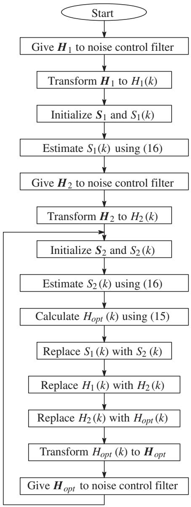

<details>
<summary>flowchart</summary>

```mermaid
graph TD
    A["Start"] --> B["Give Hâ‚?to noise control filter"]
    B --> C["Transform Hâ‚?to Hâ‚?k)"]
    C --> D["Initialize Sâ‚?and Sâ‚?k)"]
    D --> E["Estimate Sâ‚?k) using (16)"]
    E --> F["Give Hâ‚?to noise control filter"]
    F --> G["Transform Hâ‚?to Hâ‚?k)"]
    G --> H["Initialize Sâ‚?and Sâ‚?k)"]
    H --> I["Estimate Sâ‚?k) using (16)"]
    I --> J["Calculate Hâ‚’â‚šâ‚?k) using (15)"]
    J --> K["Replace Sâ‚?k) with Sâ‚?k)"]
    K --> L["Replace Hâ‚?k) with Hâ‚?k)"]
    L --> M["Replace Hâ‚?k) with Hâ‚’â‚šâ‚?k)"]
    M --> N["Transform Hâ‚’â‚šâ‚?k) to Hâ‚’â‚šâ‚?]
    N --> O["Give Hâ‚’â‚šâ‚?to noise control filter"]
```
</details>

Fig. 4 Procedure for updating noise control filter coefficients by frequency domain simultaneous equations method.

(10) Replace $S _ { 1 } ( k )$ with $S _ { 2 } ( k )$ .   
(11) Replace $H _ { 1 } ( k )$ with $H _ { 2 } ( k )$ .   
(12) Replace $H _ { 2 } ( k )$ with $H _ { \mathrm { o p t } } ( k )$ .   
(13) Transform $H _ { \mathrm { o p t } } ( k )$ into $H _ { \mathrm { o p t } } .$   
(14) Give $H _ { \mathrm { o p t } }$ to the noise control filter.   
(15) Back to (7).

By repeating the above procedure, the method can continuously adjust the coefficient vector of the noise control filter so that the output of the error microphone becomes minimum, and thereby, the noise reduction effect degraded by path changes can be automatically recovered.

# 5. SIMULATION RESULTS

In this paper, we present a simulation result demonstrating that the simultaneous equations method can automatically recover the noise reduction effect degraded by path changes. Figure 5 shows a result obtained under the following conditions:

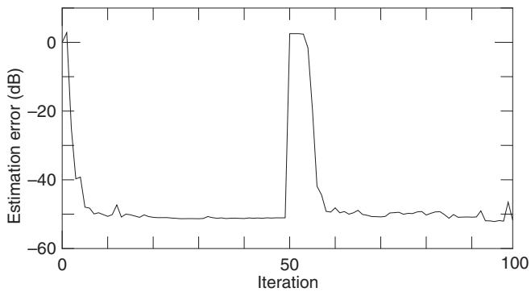

<details>
<summary>line</summary>

| Iteration | Estimation error (dB) |
| --------- | --------------------- |
| 0         | 0                     |
| 10        | -40                   |
| 20        | -50                   |
| 30        | -50                   |
| 40        | -50                   |
| 50        | 0                     |
| 60        | -50                   |
| 70        | -50                   |
| 80        | -50                   |
| 90        | -50                   |
| 100       | -50                   |
</details>

Fig. 5 Automatic recovering property of estimation error obtained using white Gaussian noise as primary noise.

(1) The type of primary noise is white Gaussian.   
(2) The feedback component is negligible: $\varDelta B ( z ) = 0$ .   
(3) The primary path is separable as

$$
P (z) = A (z) C (z). \tag {23}
$$

(4) Regular random numbers are given as the impulse response samples of the primary and secondary paths.   
(5) The initial coefficient vectors of the noise control filter are given as

$$
\boldsymbol {H} _ {1} = \mathbf {0} \tag {24}
$$

and

$$
\boldsymbol {H} _ {2} = \left[ \begin{array}{l l l l} 1 & 0 & \dots & 0 \end{array} \right] ^ {\mathrm{T}}. \tag {25}
$$

(6) The number of taps of the noise control filter is 128.   
(7) The impulse response sample numbers of the secondary and primary paths are 128 and 256, respectively. Accordingly, the duration of FFT is 512.   
(8) $D _ { i } ( k )$ and $X _ { i } ( k )$ are calculated using 256 samples of the identification errors and 512 samples of the noise control filter input signals as

$$
\boldsymbol {D} _ {i} = [ \underbrace {0 , \cdots , 0} _ {2 5 6}, \underbrace {d _ {i} , \cdots , d _ {i - 2 5 5}} _ {2 5 6} ] ^ {\mathrm{T}} \tag {26}
$$

and

$$
\boldsymbol {X} _ {i} = [ \underbrace {x _ {i} , \cdots , x _ {i - 2 5 5}} _ {2 5 6}, \underbrace {x _ {i - 2 5 6} , \cdots , x _ {i - 5 1 1}} _ {2 5 6} ] ^ {\mathrm{T}}. \tag {27}
$$

(9) SðkÞ estimated using (16) is transformed into a coefficient vector,

$$
\boldsymbol {S} = \left[ \underbrace {s _ {0} , \cdots , s _ {2 5 5}} _ {2 5 6}, \underbrace {s _ {2 5 6} , \cdots , s _ {5 1 1}} _ {2 5 6} \right] ^ {\mathrm{T}}, \tag {28}
$$

and then only the former 256 elements are given to

the auxiliary filter.

(10) The later 384 elements of

$$
\boldsymbol {H} _ {\text { opt }} = \left[ \underbrace {h _ {0} , \cdots , h _ {1 2 7}} _ {1 2 8}, \underbrace {h _ {1 2 8} , \cdots , h _ {5 1 1}} _ {3 8 4} \right] ^ {\mathrm{T}}, \tag {29}
$$

estimated using Eq. (15) and the inverse FFT, are discarded, and only the former 128 elements are given to the noise control filter.

(11) In Eq. (16), $\mu = 1 . 0 , I = 5$ and $J = 6 .$ .

(12) The type of environmental noise is also white Gaussian.

(13) The power ratio of the primary noise to the environmental noise is 40 dB.

In addition, the horizontal axis in Fig. 5 gives the iteration number of updating the coefficient vector of the noise control filter, and its updating interval is $5 1 2 I J ( = 1 5 , 3 6 0 )$ sample times. On the other hand, the vertical axis is the estimation error involved in the coefficient vector of the noise control filter, which is calculated as

$$
\text { Error } = 1 0 \log_ {1 0} \frac {\sum_ {n = 0} ^ {1 2 7} \left\{a _ {n} + h _ {n} \right\} ^ {2}}{\sum_ {n = 0} ^ {1 2 7} a _ {n} ^ {2}}, \tag {30}
$$

where $h _ { n }$ is the nth element of $H _ { \mathrm { o p t } }$ estimated by the simultaneous equations method, and similarly, $a _ { n }$ is the nth impulse response sample of the divided primary path AðzÞ.

In this example, the estimation error rapidly decreases to about -50 dB after increasing by giving $\pmb { H } _ { 2 }$ to the noise control filter, and automatically recovers after increasing by the path change (from CðzÞ to -CðzÞ) caused at the middle of a FFT duration in the 49th iteration. This result suggests that the simultaneous equations method is valid for practical systems whose secondary path may change.

# 6. COMPARISON WITH FILTERED-X NLMS ALGORITHM

Next, we compare the convergence properties provided by the simultaneous equations method and the filtered-x normalized least mean square (NLMS) algorithm. Figure 6 shows a simulation result obtained under the following conditions:

(1) The primary noise is generated by feeding white Gaussian noise to a filter whose transfer function is expressed as

$$
X (z) = \frac {1}{1 - 2 \gamma \cos \theta z ^ {- 1} + \gamma^ {2} z ^ {- 2}}, \tag {31}
$$

where $\gamma = 0 . 9$ , and $\theta = \pi / 4$ corresponding to the resonance frequency of 1 kHz when the sampling frequency is 8 kHz. Incidentally, this filter is modeled on the noise of the jet fan discharging exhaust gas to prevent it from filling in a tunnel.

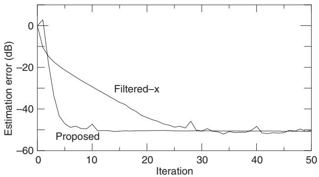

<details>
<summary>line</summary>

| Iteration | Filtered-x (dB) | Proposed (dB) |
| --------- | --------------- | ------------- |
| 0         | 0               | 0             |
| 5         | -20             | -40           |
| 10        | -30             | -50           |
| 15        | -35             | -50           |
| 20        | -40             | -50           |
| 25        | -45             | -50           |
| 30        | -50             | -50           |
| 35        | -50             | -50           |
| 40        | -50             | -50           |
| 45        | -50             | -50           |
| 50        | -50             | -50           |
</details>

Fig. 6 Convergence properties provided by filtered-x NLMS algorithm and frequency domain simultaneous equations method.

(2) The step size applied to the filtered-x NLMS algorithm is 0.1 (a step size of more than 0.1 diverges the estimation error).   
(3) $\mu = 0 . 2 , I = 1 0$ and $J = 1 0$ are applied to Eq. (16); accordingly, the interval of updating the coefficient vector of the noise control filter is 51,200 sampling times. Here, it should be noted that these parameters are selected so that the estimation error converges on the same value that the filtered-x NLMS algorithm with the step size of 0.1 provides.   
(4) The other conditions are the same as those in Fig. 5.

This example shows that the convergence speed of the simultaneous equations method is much higher than that of the filtered-x NLMS algorithm. In addition, it should be noted that the convergence property of the filtered-x NLMS algorithm is calculated on an impractical assumption that the secondary path is perfectly identified with no error, and moreover, the identification time of the secondary path is neglected.

# 7. VERIFICATION USING EXPERIMENTAL SYSTEM

Using the experimental system shown in Fig. 7, we finally verify the performance of the simultaneous equations method. The experimental system is constructed with a vinyl chloride pipe of 83 mm diameter and controlled by a personal computer. Table 1 shows the main equipment used in the experimental system.

Figure 8 shows the decreasing properties of the error microphone output obtained using the experimental system under the following conditions:

(1) The number of taps of the auxiliary filter is 1,024.   
(2) Accordingly, the length of the FFT duration is 2,048.   
(3) The number of taps of the noise control filter is 512.   
(4) $\mu = 0 . 2 5 .$   
(5) $I = 5 .$   
(6) $J = 2 0 .$

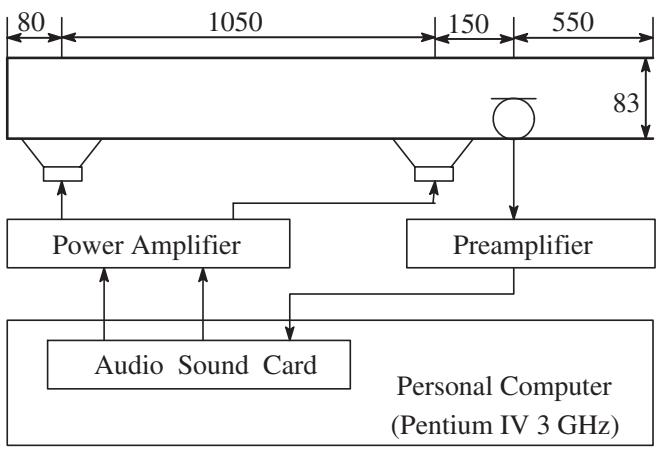

<details>
<summary>flowchart</summary>

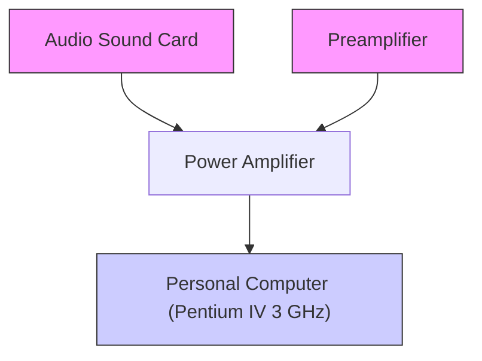
</details>

Fig. 7 Configuration of experimental system used for verifying proposed method performance (The unit of scale is millimeter).

Table 1 Equipment used in experimental system. 

<table><tr><td>Personal computer</td><td>Dell, Dimension 8300(Pentium IV 3 GHz)</td></tr><tr><td>Power amplifier</td><td>Yamaha, HC-2700</td></tr><tr><td>Preamplifier</td><td>Audio Technica, AT-MA2</td></tr><tr><td>Loudspeaker</td><td>Pioneer, TS-E1076</td></tr><tr><td>Microphone</td><td>Audio Technica, AT-805F</td></tr><tr><td>Audio sound card</td><td>M Audio, Delta 44</td></tr></table>

In Fig. 8, the horizontal axis indicates the number of FFT durations, and the output power shown in the vertical axis is calculated as

$$
P e _ {i} = 1 0 \log_ {1 0} \frac {\sum_ {k = 0} ^ {1 , 0 2 3} E _ {i} (k) E _ {i} ^ {*} (k)}{P e _ {0}}, \tag {32}
$$

where $E _ { i } ( k )$ is the kth spectrum component calculated using the error microphone output samples in the ith FFT duration, and $P e _ { 0 }$ is calculated as

$$
P e _ {0} = \frac {\sum_ {i = 0} ^ {I J - 1} \sum_ {k = 0} ^ {1 , 0 2 3} E _ {i} (k) E _ {i} ^ {*} (k)}{I J}, \tag {33}
$$

which is approximated to the average power of the error microphone output detected previous to feeding the secondary noise to the loudspeaker.

In this experiment, the first 200 $( = I J \times 2 )$ FFT durations are used for only setting up the simultaneous equations, and the operation of updating the coefficient vector of the noise control starts from the 200th duration. According to the results, the output powers of the error microphone decrease to less than -20 dB after two or four updating operations, and subsequently, this system stably maintains the output less than 20 dB. Incidentally, the 2,000 FFT duration shown in Fig. 8 is equivalent to 512 s.

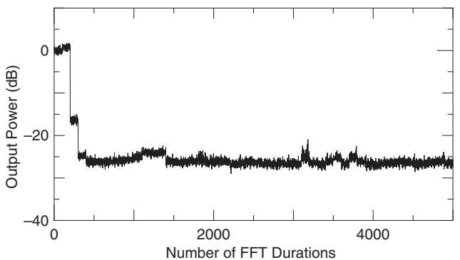

<details>
<summary>line</summary>

| Number of FFT Durations | Output Power (dB) |
| ----------------------- | ----------------- |
| 0                       | 0                 |
| 500                     | -25               |
| 1000                    | -28               |
| 1500                    | -27               |
| 2000                    | -26               |
| 2500                    | -25               |
| 3000                    | -24               |
| 3500                    | -26               |
| 4000                    | -27               |
| 4500                    | -26               |
| 5000                    | -27               |
</details>

(a)

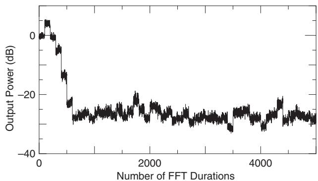

<details>
<summary>line</summary>

| Number of FFT Durations | Output Power (dB) |
| ----------------------- | ----------------- |
| 0                       | 0                 |
| 500                     | -10               |
| 1000                    | -25               |
| 1500                    | -28               |
| 2000                    | -27               |
| 2500                    | -29               |
| 3000                    | -30               |
| 3500                    | -28               |
| 4000                    | -27               |
| 4500                    | -26               |
| 5000                    | -27               |
</details>

(b)

Fig. 8 Decreasing properties of output of error microphone monitoring noise reduction effect, where primary noises used for experiment are (a) jet fan noise generated by (31) and (b) recorded diesel engine generator exhaust gas noise.   
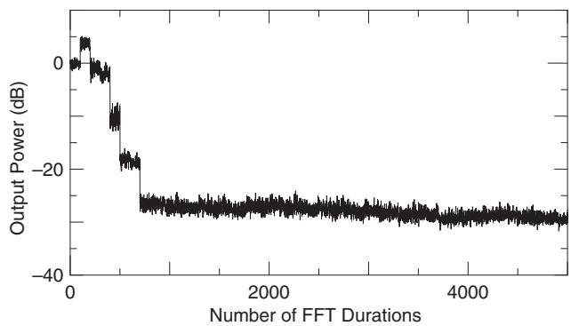

<details>
<summary>line</summary>

| Number of FFT Durations | Output Power (dB) |
| ----------------------- | ----------------- |
| 0                       | 0                 |
| 500                     | -10               |
| 1000                    | -25               |
| 1500                    | -28               |
| 2000                    | -29               |
| 2500                    | -30               |
| 3000                    | -31               |
| 3500                    | -32               |
| 4000                    | -33               |
| 4500                    | -34               |
| 5000                    | -35               |
</details>

Fig. 9 Decreasing properties of output of error microphone built in experimental system with averaging operation.

On the other hand, the output power fluctuates in the durations after decreasing to less than -20 dB, particularly notable in the decreasing property shown in Fig. 8(b), although inaudible. To reduce this fluctuation, we add an operation of averaging the coefficient vector of the noise control filter to the simultaneous equations method. Figure 9 shows the decreasing property obtained by applying the averaging operation,

$$
\hat {H} _ {\mathrm{opt}} (k) = H _ {\mathrm{opt}} (k) \times 0. 1 + \hat {H} _ {\mathrm{opt}} (k) \times 0. 9, \tag {34}
$$

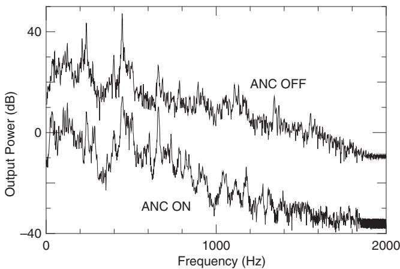

<details>
<summary>line</summary>

| Frequency (Hz) | ANC ON (dB) | ANC OFF (dB) |
| -------------- | ----------- | ------------ |
| 0              | ~0          | ~30          |
| 500            | ~-20        | ~10          |
| 1000           | ~-30        | ~0           |
| 1500           | ~-35        | ~-5          |
| 2000           | ~-40        | ~-10         |
</details>

Fig. 10 Power spectrums of error microphone outputs obtained using recorded diesel engine generator exhaust gas noise, where ‘‘ANC ON’�and ‘‘ANC OFF’�denote after and before application of active noise control by simultaneous equations method.

to the simultaneous equations method only when the output power is less than -20 dB. Apparently, the averaging operation firmly maintains the output power.

Here, the frequency characteristics of the noise reduction effect provided by the simultaneous equations method are confirmed. Figure 10 shows the average of the power spectrums calculated using the error microphone output samples detected in five FFT durations, which is calculated as

$$
P a (k) = 1 0 \log_ {1 0} \frac {\sum_ {m = 1} ^ {5} E _ {m} (k) E _ {m} ^ {*} (k)}{I}. \tag {35}
$$

In this result, we can see that the noise reduction effect is obtained in the whole frequency range. Usually, the inversion of the effect is observed particularly in the lowand high-frequency bands. In this experimental result, such inversion is not observed. This is an advantage of the simultaneous equations method.

The strong point of the simultaneous equations method is that the noise reduction effect degraded by path changes can be automatically recovered, as shown in Chapter 5. Finally, we verify this point by using the experimental system. Figure 11 shows the recovering property observed using the experimental system, where the path change is substituted by multiplying the output of the noise control filter by -1 (change from CðzÞ to -CðzÞ). This experimental result demonstrates that the simultaneous equations method successfully works in practical systems whose secondary path changes.

# 8. CONCLUSION

In this study, we have applied the frequency domain adaptive algorithm to the identification of the overall path and obtained the simulation result demonstrating that the simultaneous equations method can automatically recover the noise reduction effect degraded by a path change without feeding an extra noise to the loudspeaker. Moreover, we have applied the simultaneous equations method to the experimental system and verified that the method successfully works in practical systems.

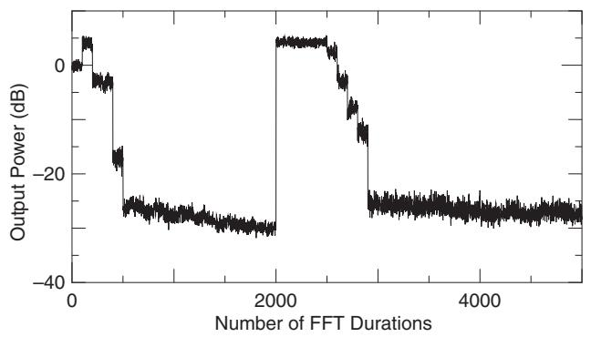

<details>
<summary>line</summary>

| Number of FFT Durations | Output Power (dB) |
| ----------------------- | ----------------- |
| 0                       | 0                 |
| 500                     | -10               |
| 1000                    | -25               |
| 1500                    | -30               |
| 2000                    | -30               |
| 2500                    | -10               |
| 3000                    | -30               |
| 3500                    | -30               |
| 4000                    | -30               |
| 4500                    | -30               |
| 5000                    | -30               |
</details>

Fig. 11 Recovering properties provided by proposed method, where recorded diesel engine generator exhaust gas noise is used as primary noise.

This simultaneous equations method can also be applied to updating the coefficient vector of the feedback control filter canceling the feedback path from the secondary source to the noise detection sensor [10]. Hence. our subsequent studies will focus on the verification of the feedback path identification method using the simultaneous equations method in an experimental system.

# REFERENCES

[1] B. Widrow and S. D. Stearn, Adaptive Signal Processing (Printice Hall, Englewood Cliffs, N.J., 1985), pp. 288�94.

[2] S. J. Elliott and P. A. Nelson, ‘‘Active noise control,’�IEEE Signal Process. Mag., 10, 12�5 (1993).   
[3] S. D. Synder and C. H. Hansen, ‘‘The effect of transfer function estimation errors on the filtered-x LMS algorithm,’�IEEE Trans. Signal Process., SP-42, 950�53 (1994).   
[4] N. Saito and T. Sone, ‘‘Influence of modeling error on noise reduction performance of active noise control systems using filtered-x LMS algorithm,’�J. Acoust. Soc. Jpn. (E), 17, 195�202 (1996).   
[5] L. J. Erikson and M. C. Allie, ‘‘Use of random noise for on-line transducer modeling in an adaptive active attenuation system,’�J. Acoust. Soc. Am., 85, 797�02 (1989).   
[6] Y. Kajikawa and Y. Nomura, ‘‘An active noise control system without secondary path model,’�IEICE Trans. Fundam., J82-A, 209�17 (1999).   
[7] T. Kohno, Y. Ohta and A. Sano, ‘‘Adaptive active noise control algorithm without explicit identification of secondary path dynamics,’�IEICE Trans. Fundam., J86-A, 9�8 (2003).   
[8] K. Fujii, M. Muneyasu and J. Ohga, ‘‘Active noise control systems by using the simultaneous equations method without estimation of the error path filter coefficients,’�IEICE Trans. Fundam., J82-A, 299�05 (1999).   
[9] K. Fujii, S. Hashimoto and M. Muneyasu, ‘‘Application of a frequency domain processing technique to the simultaneous equations method,’�IEICE Trans. Fundam., E86-A, 2020�2027 (2003).   
[10] K. Fujii, Y. Iwamatsu and M. Muneyasu, ‘‘A method to update the coefficients of feedback control filter,’�Proc. ICSV 12, paper no. 212 (2005).   
[11] K. Fujii, S. Hashimoto and M. Muneyasu, ‘‘Application of frequency domain processing techniques to the simultaneous equations method,’�Proc. ICSV 10, pp. 275�82 (2003).   
[12] K. Fujii and J. Ohga, ‘‘Method to update the coefficients of the secondary path filter under active noise control,’�Signal Process., 81, 381�87 (2001).   
[13] M. Muneyasu, Y. Wakasugi, O. Hisayasu, K. Fujii and T. Hinamoto, ‘‘Hybrid active noise control systems based on the simultaneous equations method,’�IEICE Trans. Fundam., E84-A, 479�81 (2001).
