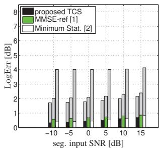
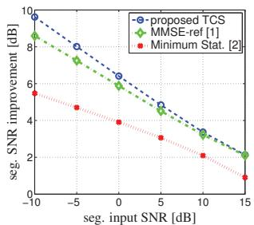
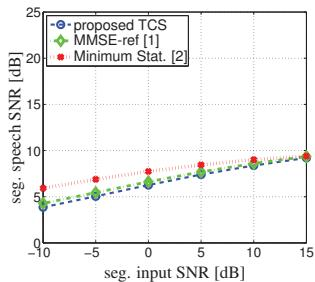
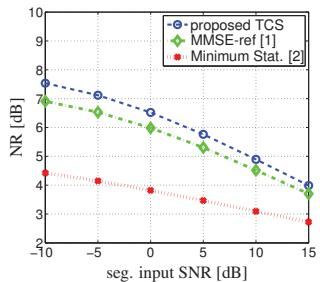
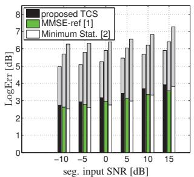
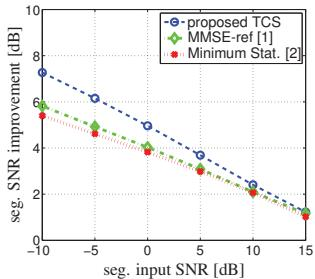
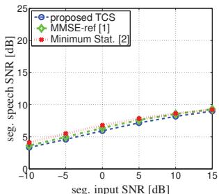
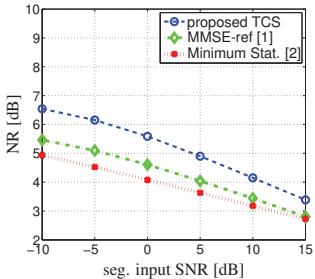

# IMPROVED MMSE-BASED NOISE PSD TRACKING USING TEMPORAL CEPSTRUM SMOOTHING

Timo Gerkmann

Speech Signal Processing Universitat Oldenburg, Fakult ¨ at V ¨ 26111 Oldenburg, Germany timo.gerkmann@uni-oldenburg.de

## ABSTRACT

Recently, it has been shown that MMSE-based noise power estimation [1] results in an improved noise tracking performance with respect to minimum statistics-based approaches. The MMSE-based approach employs two estimates of the speech power to estimate the unbiased noise power. In this work, we improve the MMSE-based noise power estimator by employing a more advanced estimator of the speech power based on temporal cepstrum smoothing (TCS). TCS can exploit knowledge about the speech spectral structure. As a result, only one speech power estimate is needed for MMSE-based noise power estimation. Moreover, the presented estimator results in an improved noise tracking performance, especially in babble noise, where SNR improvements of 1 dB over the original MMSE-based approach can be observed.

Index Terms— Noise power estimation, speech enhancement.

## 1. INTRODUCTION

As speech processing applications like mobile telephony, hearing aids and speech recognition systems are expected to work in a wide variety of environments, it is likely that these applications have to deal with speech signals that are degraded with environmental noise sources. In order to cope with this, there has been much interest to equip these applications with noise reduction algorithms. Usually, these algorithms work on a frame-by-frame basis in a spectral domain, e.g., the discrete Fourier transform domain, where a gain function is applied to the noisy DFT coefficients followed by an inverse DFT and overlap-add. The noise power spectral density (PSD) is one of the very important parameters of noise reduction algorithms. Since the noise PSD is unknown in practice, it has to be estimated from the noisy speech. For relatively stationary noise sources, the PSD can be estimated quite accurately using minimum statistics (MS) based approaches [2][3]. However, when the noise source tends to change faster, i.e., within the time-span of one second, these methods usually lead to less satisfying results. More recently a minimum mean-square error (MMSE)-based noise power estimator has been proposed [1], which has been proven to allow for a faster tracking of quickly changing noise fields as compared to MS based approaches [4].

For the MMSE-based noise PSD estimation, an estimate of the speech PSD is needed to obtain the conditioned estimate of the noise

Richard C. Hendriks

Signal and Information Processing Lab Delft University of Technology 2628 CD Delft, The Netherlands r.c.hendriks@tudelft.nl

periodogram. In [1], for this estimate, a limited maximum likelihood (ML) estimate is employed, which however results in a bias. It has been shown that this bias can be compensated, if the true speech PSD is known. Thus, in [1], the bias introduced by using the simple ML estimator is compensated using a second estimate of the speech PSD, obtained using the decision-directed (DD) approach [5]. In this work, we employ a more advanced estimator of the speech PSD based on temporal cepstrum smoothing (TCS). Using this advanced speech PSD estimator in the first place makes the estimation of a second speech PSD estimate for bias compensation unnecessary. At the same time, the TCS-based speech PSD estimate results in a better estimate of the noise PSD, a higher noise reduction performance when employed in a speech enhancement framework, a comparable amount of signal distortions and a higher gain in the segmental SNR. The costs of the improved performance are two additional Fourier transforms needed for the cepstral transform and its inverse.

This work is structured as follows. After introducing the employed signal model in Section 2, we review the MMSE-based noise power estimation in Section 3, describe the proposed TCS-based approach in Section 4, evaluate the algorithms in Section 5 and conclude with Section 6.

## 2. SIGNAL MODEL

Let $S _ { k } ( l ) , N _ { k } ( l )$ and $Y _ { k } ( l )$ denote the complex speech, noise and noisy speech discrete Fourier transform (DFT) coefficient, respectively, for frequency-bin index k and time-frame index l, obtained by windowing the corresponding time-domain processes followed by a DFT. Here, capital letters indicate random variables, while realizations are denoted by its corresponding lower case letters.

We assume the speech and the noise processes to be additive in the short-time Fourier domain, i.e.,

$$
Y _ {k} (l) = S _ {k} (l) + N _ {k} (l).\tag{1}
$$

Further, we assume that the speech and noise DFT coefficients are zero mean and mutually independent and uncorrelated, such that

$$
\operatorname{E} \big [ | Y _ {k} (l) | ^ {2} \big ] = \operatorname{E} \big [ | S _ {k} (l) | ^ {2} \big ] + \operatorname{E} \big [ | N _ {k} (l) | ^ {2} \big ],
$$

(2)

with E[·] the statistical expectation operator. For notational convenience, the time-frame index l and the frequency-bin index k will be left out, unless necessary for clarification. The speech PSD and noise PSD are defined by $\mathbf { \check { E } } \big [ | S | ^ { 2 } \big ] = \sigma _ { \mathrm { S } } ^ { 2 }$ and ${ \mathrm { E } } \big [ | \dot { N } | ^ { 2 } \big ] = \sigma _ { \mathrm { N } } ^ { 2 }$ , respectively. We then define the a priori signal-to-noise ratio (SNR) by $\xi = \bar { \sigma _ { \mathrm { S } } } ^ { 2 } / \sigma _ { \mathrm { N } } ^ { 2 }$ . In the sequel estimated quantities will be denoted by a hat symbol, i.e. $\widehat { \sigma _ { \mathrm { N } } ^ { 2 } }$ is an estimate of $\sigma _ { \mathrm { N } } ^ { 2 }$

## 3. MMSE BASED NOISE PSD ESTIMATION

To guide the reader, we present in this section a brief summary of the MMSE-based noise PSD estimation approach presented in [1].

The noise PSD estimator presented in [1] is based on an MMSE estimate of the noise periodogram, which can be obtained by computing the conditional expectation $\operatorname { E } \left[ | N | ^ { 2 } \mid y \right]$ . Assuming that the speech and noise DFT coefficients have a complex Gaussian distribution with variances $\sigma _ { \mathrm { S } } ^ { 2 }$ and $\sigma _ { \mathrm { N } } ^ { 2 } .$ , respectively, this leads to [1]

$$
\mathrm{E} \big [ | N | ^ {2} \mid y \big ] = \left(\frac {\sigma_ {\mathrm{N}} ^ {2}}{\sigma_ {\mathrm{N}} ^ {2} + \sigma_ {\mathrm{S}} ^ {2}}\right) ^ {2} | y | ^ {2} + \frac {\sigma_ {\mathrm{S}} ^ {2}}{\sigma_ {\mathrm{N}} ^ {2} + \sigma_ {\mathrm{S}} ^ {2}} \sigma_ {\mathrm{N}} ^ {2}.\tag{3}
$$

Obviously, both $\sigma _ { \mathrm { S } } ^ { 2 }$ and $\sigma _ { \mathrm { N } } ^ { 2 }$ are unknown expected values and have to be estimated before (3) can be evaluated. Assuming that $\sigma _ { \mathrm { N } } ^ { 2 }$ changes relatively slowly from frame to frame, it was proposed in [1] to use the noise PSD estimate of the previous time-frame in $( 3 ) , \mathrm { i . e . , } \widehat { \sigma _ { \mathrm { N } } ^ { 2 } } =$ $\widehat { \sigma _ { \mathrm { N } } ^ { 2 } } ( l - 1 )$ . To estimate $\sigma _ { \mathrm { S } } ^ { 2 }$ , it was proposed in [1] to use a limited ML estimate given by

$$
\widehat {\sigma_ {\mathrm{S,ML}} ^ {2}} = \max \left(0, | y | ^ {2} - \widehat {\sigma_ {\mathrm{N}} ^ {2}}\right).\tag{4}
$$

However, as argued in [1], this ML estimate will lead to a bias in $\operatorname { E } \left[ | N | ^ { 2 } \mid y \right]$ , which can be computed analytically given ${ \widehat { \sigma _ { \mathrm { S , M L } } ^ { 2 } } } ,$ and can be written as a function $B \big ( \sigma _ { \mathrm { S } } ^ { 2 } , \sigma _ { \mathrm { N } } ^ { 2 } \big )$ , which is, again, a function of the speech and noise PSD. In order to compute this bias, the noise PSD is again estimated by $\widehat { \sigma _ { \mathrm { N } } ^ { 2 } } = \widehat { \sigma _ { \mathrm { N } } ^ { 2 } } ( l - 1 )$ and the speech PSD $\sigma _ { \mathrm { S } } ^ { 2 }$ is computed using the DD approach [5] denoted by $\widehat { \sigma _ { \mathrm { S , D D } } ^ { 2 } }$ . The final estimate of the noise PSD is then obtained as

$$
\widetilde {\sigma_ {\mathrm{N}} ^ {2}} = \operatorname{E} \left[ | N | ^ {2} \mid y, \widehat {\sigma_ {\mathrm{S} , \mathrm{ML}} ^ {2}}, \widehat {\sigma_ {\mathrm{N}} ^ {2}} \right] B (\widehat {\sigma_ {\mathrm{S} , \mathrm{DD}} ^ {2}}, \widehat {\sigma_ {\mathrm{N}} ^ {2}}),
$$

followed by recursive smoothing in order to reduce small variations across time, that is

$$
\widehat {\sigma_ {\mathrm{N}} ^ {2}} (l) = \alpha_ {\mathrm{pow}} \widehat {\sigma_ {\mathrm{N}} ^ {2}} (l - 1) + (1 - \alpha_ {\mathrm{pow}}) \widetilde {\sigma_ {\mathrm{N}} ^ {2}},\tag{5}
$$

where $\alpha _ { \mathrm { p o w } } = 0 . 8$ . To overcome a locking of the algorithm, the current estimate $\sigma _ { \mathrm { N } } ^ { 2 } ( l )$ is forced to be larger than the minimum of the noisy periodograms of the last 0.8 seconds [1].

In summary, the MMSE approach for noise PSD estimation exploits thus two different speech PSD estimators, i.e., a limited ML estimate and a DD-based estimate, and, as a consequence of the limited ML estimate, the method requires a bias compensation.

## 4. PROPOSED APPROACH BASED ON TEMPORAL CEPSTRUM SMOOTHING (TCS)

We propose to improve the MMSE-based noise PSD estimator by improving the speech PSD estimation necessary to evaluate (3). The proposed method is based on selective temporal smoothing in the cepstral domain in order to obtain more accurate estimates of the speech PSD, similar to [6], instead of using a limited ML estimate and a DD-based estimate as outlined in Section 3.

The benefit of smoothing in the cepstral domain is that a $p r i -$ ori knowledge about the speech spectral structure can easily be employed: in the cepstral domain speech is mainly represented by few lower cepstral coefficients and the peak of the remaining cepstral coefficients. The lower cepstral coefficients represent the speech spectral envelope, while the peak represents the fundamental period of voiced speech. Furthermore, non-speech-like spectral structures are likely to be mapped to a different set of cepstral coefficients than speech spectral structures. We apply a selective smoothing in the cepstral domain, i.e., little or no smoothing to the speech related cepstral coefficients, and a stronger smoothing to the remaining cepstral coefficients. By this, non-speech-like spectral outliers are reduced while the speech spectral structure is preserved.

Similar to (4) we use a limited ML speech PSD estimate, as

$$
\widehat {\sigma_ {\mathrm{S} , k} ^ {2}} ^ {\text { pre }} = \max \left(\widehat {\sigma_ {\mathrm{N} , k} ^ {2}} \xi_ {\min}, | y _ {k} (l) | ^ {2} - \widehat {\sigma_ {\mathrm{N} , k} ^ {2}}\right),\tag{6}
$$

which is lower limited by $\widehat { \sigma _ { \mathrm { N } , k } ^ { 2 } } \xi _ { \mathrm { m i n } }$ and where $\xi _ { \mathrm { m i n } }$ is set to $1 0 \log _ { 1 0 } ( \xi _ { \mathrm { m i n } } ) = - 3 0 \mathrm { d B }$ in order to reduce speech distortions.

Let the length of the Fourier transform be denoted by K and the cepstral index by $q .$ . The cepstral representation of the preliminary speech PSD is then obtained as the inverse Fourier transform of the log spectrum,

$$
\widehat {\sigma_ {\mathrm{S} , q} ^ {2}} ^ {\mathrm{pre,ceps}} = 1 / K \sum_ {k = 0} ^ {K - 1} \log \left(\widehat {\sigma_ {\mathrm{S} , k} ^ {2}} ^ {\mathrm{pre}}\right) \mathrm{e} ^ {\mathrm{j} 2 \pi k q / K}.\tag{7}
$$

As the cepstrum is symmetric with respect to $K / 2$ , we only consider the lower symmetric part $q \in \{ 0 , . . . , K / 2 \}$ in the sequel. For a better distinction between cepstral domain and frequency domain coefficients, in this section we explicitly state the frequency index k and the cepstral index q.

## 4.1. Selective smoothing

Selective smoothing in the cepstral domain can be done by means of recursive temporal smoothing of $\widehat { \sigma _ { \mathrm { S } , q } ^ { 2 } } ^ { \mathrm { p r e , c e p s } }$ with a cepstral-index and frame-index dependent smoothing factor $0 \le \alpha _ { q } ( l ) \le 1$ , i.e.,

$$
\widehat {\sigma_ {\mathrm{S} , q} ^ {2}} ^ {\text { ceps }} (l) = \alpha_ {q} (l) \widehat {\sigma_ {\mathrm{S} , q} ^ {2}} ^ {\text { ceps }} (l - 1) + (1 - \alpha_ {q} (l)) \widehat {\sigma_ {\mathrm{S} , q} ^ {2}} ^ {\text { pre,ceps }} (l).\tag{8}
$$

To adjust the smoothing factor $\alpha _ { q } .$ , the speech related cepstral coefficients need to be determined. This means that we need to find the fundamental period peak in the cepstrum. Since the power of voiced sounds is less at high frequencies, estimation of the fundamental period peak is more robust if less emphasis is put on the higher frequencies. To reduce the effect of the high frequencies on the cepstrum, we smooth the cepstrum by convolving it with a short Hamming window $w _ { \mathrm { H } , q }$ of length $\tau _ { \mathrm { H } } = f _ { \mathrm { s } } / 2 0 0 0 \mathrm { H z } = 8 ,$ , as

$$
\overline {{\sigma_ {\mathrm{S} , q} ^ {2}}} ^ {\mathrm{ceps}} (l) = \widehat {\sigma_ {\mathrm{S} , q} ^ {2}} ^ {\mathrm{ceps}} (l) * w _ {\mathrm{H}, q} * w _ {\mathrm{H}, - q},\tag{9}
$$

with

$$
w _ {\mathrm{H}, q} = \left\{ \begin{array}{l l} 0. 5 4 - 0. 4 6 \cos \left(2 \pi \frac {q + \tau_ {\mathrm{H}} / 2}{\tau_ {\mathrm{H}}}\right) & \text { for } - \tau_ {\mathrm{H}} / 2 \leq q <   \tau_ {\mathrm{H}} / 2 \\ 0 & \text { else }. \end{array} \right.\tag{10}
$$

The cepstral index $q _ { 0 } ( l )$ that most likely represents the fundamental period is then found as

$$
q _ {0} (l) = \arg \max _ {q} \left\{\overline {{\sigma_ {\mathrm{S} , q} ^ {2}}} ^ {\mathrm{ceps}} (l) | q _ {\mathrm{low}} \leq q \leq q _ {\mathrm{high}} \right\},\tag{11}
$$

where the search is limited to possible fundamental frequencies between $f _ { 0 , \mathrm { l o w } } = 7 0 \mathrm { H z }$ and $f _ { 0 , \mathrm { h i g h } } = 3 0 0 \mathrm { H z } ,$ , resulting in the range $q _ { \mathrm { l o w } } = \mathrm { \lfloor } f _ { \mathrm { s } } / f _ { \mathrm { 0 , h i g h } } \mathrm { \rfloor }$ to $q _ { \mathrm { h i g h } } = \lfloor f _ { \mathrm { s } } / f _ { \mathrm { 0 , l o w } } \rfloor$ , with $f _ { \mathrm { s } }$ the sampling rate and · the flooring operator towards the nearest smaller integer number.

To determine whether the found peak-value represents the fundamental frequency of a voiced speech sound, we compare the peakvalue to a threshold, $\Lambda ^ { \mathrm { t h r } }$ . The set of cepstral bin indices associated with the fundamental frequency, say $\mathbb { Q } _ { \mathrm { p i t c h } }$ , is then defined as

$$
\mathbb {Q} _ {\text { pitch }} (l) = \left\{ \begin{array}{l l} \{q _ {0} (l) - \Delta q _ {0},..., q _ {0} (l) + \Delta q _ {0} \} & \text { if } \overline {{\sigma_ {\mathrm{s}} ^ {2}}}, q _ {0} (l) \geq \Lambda^ {\text { thr }} \\ \emptyset & \text { otherwise }, \end{array} \right.\tag{12}
$$

where $q \in \{ q _ { 0 } - \Delta q _ { 0 } , . . . , q _ { 0 } + \Delta q _ { 0 } \}$ is the range of cepstral bins that represent the fundamental period, $\Delta q _ { 0 } = 2$ is a small margin, and ∅ is the empty set. A decrease of the threshold $\boldsymbol { \Lambda } ^ { \mathrm { t h r } }$ results in a better protection of the fundamental period, but also in less reduction of processing outliers in unvoiced speech and speech pauses. We find that $\Lambda ^ { \mathrm { t h r } } = 0 . 1$ 1 yields a good trade-off.

As the lower cepstral coefficients and the fundamental period peak represent the speech spectral structure, less smoothing is applied to these speech related coefficients than to the remaining coefficients. To avoid a strong smoothing of the speech fundamental period peak, the smoothing factor $\alpha _ { q } ( l )$ is determined adaptively as

$$
\alpha_ {q} (l) = \left\{ \begin{array}{l l} \alpha_ {\text {pitch}} & \text {if} q \in \mathbb {Q} _ {\text {pitch}} \\ \beta   \alpha_ {q} (l - 1) + (1 - \beta)   \alpha_ {q} ^ {\text {const}} & \text {otherwise}, \end{array} \right.\tag{13}
$$

where $\alpha _ { \mathrm { p i t c h } }$ determines how strongly the fundamental period peak is smoothed and where $\alpha _ { q } ^ { \mathrm { c o n s t } }$ will be specified below. A decrease of $\alpha _ { \mathrm { p i t c h } }$ results in a better protection of the fundamental period, but also in less reduction of processing outliers. We find $\alpha _ { \mathrm { p i t c h } } = 0 . 2$ as a reasonable compromise. The smoothing constant $\beta = 0 . 9 6$ is a forgetting factor that determines how fast the value of $\alpha _ { q } ( l )$ can rise back from $\alpha _ { \mathrm { p i t c h } }$ to $\alpha _ { q } ^ { \mathrm { c o n s t } }$ . Due to (13), a detection error of the fundamental period in the current frame l does not immediately lead to a strong smoothing of the cepstral fundamental period peak. The algorithm is not sensitive with respect to the exact choice of the smoothing constant $\alpha _ { q } ^ { \mathrm { c o n s t } }$ , but it should be chosen such that only little smoothing is applied to the lower cepstral coefficients and a stronger smoothing to the upper cepstral coefficients that represent the speech spectral envelope and the non-speech-like spectral structures, respectively. For the proposed noise PSD estimator, we find the following choice of $\alpha _ { q } ^ { \mathrm { c o n s t } }$ to yield a good compromise

$$
\alpha_ {q} ^ {\text { const }} = \left\{ \begin{array}{l l} 0 & q <   3 \\ 0. 2 & 3 \leq q <   2 0 \\ 0. 8 5 & 2 0 \leq q \leq 2 5 6. \end{array} \right.\tag{14}
$$

Finally, the smoothed cepstral representation is then transformed back to the frequency domain to obtain an estimate of the speech PSD, as

$$
\widehat {\sigma_ {\mathrm{S} , k} ^ {2}} (l) = \mathcal {B} \cdot \exp \left(\sum_ {q = 0} ^ {K - 1} \widehat {\sigma_ {\mathrm{S} , q} ^ {2}} ^ {\text { ceps }} (l) \mathrm{e} ^ {- \mathrm{j} 2 \pi k q / K}\right),\tag{15}
$$

where $\boldsymbol { B }$ compensates for a bias that is introduced by TCS [7]. Notice that this bias is introduced due to the nonlinear compression in (7) and subsequent smoothing in the log domain, prior to transforming back to the linear domain via (15).

This bias was analyzed in [7] and depends on the amount of smoothing that is applied in the cepstral domain, $\mathrm { i } . \mathrm { e } . , \alpha _ { q } ( l )$ . In [7] an analytic expression for this bias is derived based on distributional assumptions on the speech DFT coefficients and Hann windowed speech frames, that is, [7]

$$
\mathcal {B} = \frac {\exp (\psi (\bar {\mu}) + \boldsymbol {C})}{\bar {\mu}},\tag{16}
$$

where $c = 0 . 5 7 7 2$ is Euler’s constant [8, Eq. 9.73] and $\psi ( \cdot )$ is Euler’s Psi-function [8, Eq. 8.360]. In [7] it is shown how the parameter μ¯ can be determined as a function of the smoothing factor $\alpha _ { q } ( l )$ . For our choice of $\alpha _ { q } ^ { \mathrm { c o n s t } }$ t, depending on $\mathbb { Q } _ { \mathrm { p i t c h } }$ , the resulting bias is typically in the range 1.45 $< B < 1 . 5 5$

Finally, the estimate $\widehat { \sigma _ { \mathrm { S } , k } ^ { 2 } } ( l )$ of the speech PSD (15) is employed in (3) to estimate the noise periodogram, followed by recursive temporal smoothing by means of (5).

## 5. EVALUATION

In this section we compare the performance of the proposed algorithm with respect to the MMSE-based approach of [1], referred to as MMSE-ref, and the MS-based approach [2].

For the spectral analysis we use 32 ms Hann-windows with 50% overlap. The length of the Fourier transform is $K \ = \ 5 1 2$ and the sampling rate $f _ { \mathrm { s } } ~ = ~ 1 6 \mathrm { k H z }$ . We evaluate 320 sentences from the TIMIT-database for modulated white Gaussian noise and babble noise at segmental input SNRs between −10 and 15 dB under free-field conditions. To create modulated noise we multiply a white Gaussian noise signal by $f ( m ) = 1 { + } 0 . 5$ sin $( 2 \pi m f _ { \mathrm { m o d } } / f _ { \mathrm { s } } )$ ), where m is the time-sample index, and we choose $f _ { \mathrm { m o d } } ~ = ~ 0 . 5 \ : \mathrm { H }$ z. We measure the logarithmic error between the estimated noise power and the noise reference and distinguish between noise power overestimation and noise power underestimation, as

$$
\begin{array}{l} \text {LogErrOver} = \frac {1}{K L} \sum_ {l = 0} ^ {L - 1} \sum_ {k = 0} ^ {K - 1} \left| \min \left(0, 1 0 \log_ {1 0} \left(\frac {\sigma_ {\mathrm{N} , k} ^ {2} (l)}{\widehat {\sigma} _ {\mathrm{N} , k} ^ {2} (l)}\right)\right) \right|, \\ \text {LogErrUnder} = \frac {1}{K L} \sum_ {l = 0} ^ {L - 1} \sum_ {k = 0} ^ {K - 1} \max \left(0, 1 0 \log_ {1 0} \left(\frac {\sigma_ {\mathrm{N} , k} ^ {2} (l)}{\widehat {\sigma} _ {\mathrm{N} , k} ^ {2} (l)}\right)\right), \end{array}
$$

where K and $L$ indicate the total number of frequency-bins and time-frames, respectively. The sum of both results in the LogErr as employed in [1], i.e. LogErr = LogErrOver + LogErrUnder. The lower the value for LogErr, the better the performance. While for the artificially created modulated Gaussian noise, the true noise power $\sigma _ { \mathrm { N } , k } ^ { 2 }$ is known, for babble noise we use the periodogram of the noise-only signal as an estimate of the true noise power, i.e. $\sigma _ { \mathrm { N } , k } ^ { 2 } = | N | ^ { 2 }$

We also employ the estimated noise power in a speech enhancement framework and evaluate the performance in terms of the segmental SNR, the segmental speech SNR and the amount of noise reduction [9]. For these three measures, large values indicate improved performance, e.g. a large speech SNR indicates that speech is well preserved. To estimate the clean speech amplitude, we employ the super-Gaussian estimator described in [10], with parameters $\gamma = 1$ and $\nu = 0 . 6 $ , and the a priori SNR estimated using the DD approach with smoothing constant $\alpha _ { \mathrm { d d } } = 0 . 9 8$

The results are given in Figure 1 and Figure 2. It can be seen that the proposed TCS-based approach results in lower values for the LogErr than the MMSE-ref approach [1] and the MS approach [2]. It can be seen that the MS approach results in a higher speech SNR than the proposed approach and the MMSE-ref, however in the lowest amount of noise reduction. The MMSE-based approaches result in a better trade-off between speech distortions and noise reduction as indicated by a larger gain in the segmental SNR. The proposed approach results in the largest noise reduction and largest SNR improvement while exhibiting a similar speech SNR as the MMSE-ref. For babble noise the SNR improvement is approximately 1 dB at 0 dB input SNR with respect to the competing approaches. The price for the increased performance are two additional real-valued Fourier transforms required for computing the cepstrum and its inverse. This computational complexity can be reduced by using pruned Fourier transforms [11].

  
(a) Log estimation error

  
(b) Segmental SNR improvement

  
(c) Segmental speech SNR

  
(d) Segmental noise reduction  
Fig. 1. Quality measures for modulated white Gaussian noise. The lower part of the bars in Subfigure (a) represents the noise overestimation LogErrOver, while the upper part represents the noise underestimation LogErrUnder. The total height of the bars gives the LogErr.

## 6. CONCLUSIONS

In this paper we revisited minimum mean-square error (MMSE)- based noise power spectral density (PSD) estimation. We showed that using temporal cepstral smoothing for speech PSD estimation, better results in terms of a lower LogErr and, a larger signal-tonoise ratio (SNR), a larger noise reduction and similar speech SNR can be achieved. As opposed to the MMSE-ref [1] only one speech PSD estimate is needed to estimate the noise PSD. The computational costs for the improved performance are dominated by two real-valued Fourier transforms for the cepstral transform and its inverse.

## 7. REFERENCES

[1] R. C. Hendriks, R. Heusdens, and J. Jensen, “MMSE based noise PSD tracking with low complexity,” IEEE ICASSP, pp. 4266–4269, Mar. 2010.

[2] R. Martin, “Noise power spectral density estimation based on optimal smoothing and minimum statistics,” IEEE Trans. Speech Audio Process., vol. 9, no. 5, pp. 504–512, Jul. 2001.

[3] I. Cohen, “Noise spectrum estimation in adverse environments: Improved minima controlled recursive averaging,” IEEE Trans. Speech Audio Process., vol. 11, no. 5, pp. 466–475, Sep. 2003.

  
(a) Log estimation error

  
(b) Segmental SNR improvement

  
(c) Segmental speech SNR

  
(d) Segmental noise reduction  
Fig. 2. Quality measures for babble noise. As in Figure 1 the bars in Subfigure (a) indicate noise overestimation and underestimation.

[4] J. Taghia, J. Taghia, N. Mohammadiha, J. Sang, V. Bouse, and R. Martin, “An evaluation of noise power spectral density estimation algorithms in adverse acoustic environments,” IEEE ICASSP, May 2011.

[5] Y. Ephraim and D. Malah, “Speech enhancement using a minimum mean-square error short-time spectral amplitude estimator,” IEEE Trans. Acoust., Speech, Signal Process., vol. 32, no. 6, pp. 1109–1121, Dec. 1984.

[6] C. Breithaupt, T. Gerkmann, and R. Martin, “A novel a priori SNR estimation approach based on selective cepstro-temporal smoothing,” IEEE ICASSP, pp. 4897–4900, Apr. 2008.

[7] T. Gerkmann and R. Martin, “On the statistics of spectral amplitudes after variance reduction by temporal cepstrum smoothing and cepstral nulling,” IEEE Trans. Signal Process., vol. 57, no. 11, pp. 4165–4174, Nov. 2009.

[8] I. S. Gradshteyn and I. M. Ryzhik, Table of Integrals Series and Products, 6th ed. San Diego, CA, USA: Academic Press, 2000.

[9] T. Lotter and P. Vary, “Speech enhancement by MAP spectral amplitude estimation using a super-Gaussian speech model,” EURASIP J. Applied Signal Process, vol. 2005, no. 7, pp. 1110–1126, Jan. 2005.

[10] J. S. Erkelens, R. C. Hendriks, R. Heusdens, and J. Jensen, “Minimum mean-square error estimation of discrete Fourier coefficients with generalized Gamma priors,” IEEE Trans. Audio, Speech, Lang. Process, vol. 15, no. 6, pp. 1741–1752, Aug. 2007.

[11] T. Gerkmann and R. Martin, “Cepstral smoothing with reduced computational complexity,” ITG-Fachtagung Sprachkommunikation, Oct. 2010.