# Regularized Adaptive Notch Filters for Acoustic Howling Suppression

Gil-Cacho, Pepe; van Waterschoot, Toon; Moonen, Marc; Jensen, Søren Holdt

Published in: Proceedings of 17th European Signal Process. Conf. (EUSIPCO '09)

Publication date: 2009

Document Version Publisher's PDF, also known as Version of record

Link to publication from Aalborg University

Citation for published version (APA): Gil-Cacho, P., van Waterschoot, T., Moonen, M., & Jensen, S. H. (2009). Regularized Adaptive Notch Filters for Acoustic Howling Suppression. In Proceedings of 17th European Signal Process. Conf. (EUSIPCO '09) EURASIP. http://www.eurasip.org/Proceedings/Eusipco/Eusipco2009/contents/papers/1569192927.pdf

## General rights

Copyright and moral rights for the publications made accessible in the public portal are retained by the authors and/or other copyright owners and it is a condition of accessing publications that users recognise and abide by the legal requirements associated with these rights.

## Take down policy

# REGULARIZED ADAPTIVE NOTCH FILTERS FOR ACOUSTIC HOWLING SUPPRESSION

Pepe Gil-Cacho1, Toon van Waterschoot1, Marc Moonen1 and Søren Holdt Jensen2

1Katholieke Universiteit Leuven, ESAT-SCD, Kasteelpark Arenberg 10, B-3001 Leuven, Belgium 2Aalborg University, Dept. Electronic Systems, Niels Jernes Vej 12, DK-9220 Aalborg, Denmark

## ABSTRACT

In this paper, a method for the suppression of acoustic howling is developed, based on adaptive notch filters (ANF) with regularization (RANF). The method features three RANFs working in parallel to achieve frequency tracking, howling detection and suppression. The ANF-based approach to howling suppression introduces minimal processing delay and minimal complexity, in contrast to non-parametric frame-based methods featuring a non-parametric frequency analysis. Compared to existing ANF-based howling suppression methods, the proposed method allows for a more advanced howling detection such that tonal components in the source signal are not affected. The RANFs proposed in this paper are implemented in direct form and are updated using a gradient descent type algorithm. Results show that, under certain conditions, the level of suppression and sound quality are similar to what is obtained with frame-based methods.

## 1. INTRODUCTION

Acoustic howling appears as a result of an acoustic feedback path, i.e., an acoustic coupling between a loudspeaker and a microphone. Due to this coupling the signal from the loudspeaker is captured by the microphone, and then this signal is fedback to the loudspeaker after amplification. This phenomenon is also referred to as acoustic feedback. From a closed-loop system point of view, howling will occur if certain instability conditions are met. The analysis is based on the Nyquist stability criterion [1] which can be derived from the closed-loop frequency response of the system depicted in Fig.1, i.e

$$
G _ {\mathrm{CL}} (f) = \frac {G _ {\mathrm{FW}} (f)}{1 - G _ {\mathrm{FB}} (f) G _ {\mathrm{FW}} (f)}\tag{1}
$$

The second term in the denominator is called the loop response and is given as

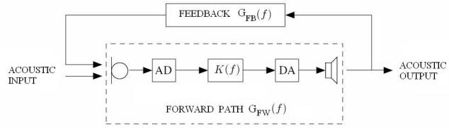  
Figure 1: Closed-loop system resulting from acoustic feedback in a scenario with one loudspeaker and one microphone

$$
G _ {\mathrm{L}} (f) = G _ {\mathrm{FB}} (f) G _ {\mathrm{FW}} (f)\tag{2}
$$

The feedback path response $G _ { \mathrm { F B } } ( f )$ is actually a combination of acoustic, mechanical and electromagnetic feedback, while $G _ { \mathrm { F W } } ( f )$

is a combination of the loudspeaker-microphone responses, A/D and D/A-converters and a $K ( f )$ representing a combination of amplification and signal processing. The Nyquist stability criterion says that, if there exists a frequency f such that

$$
\left\{ \begin{array}{l l} | G _ {\mathrm{FB}} (f) G _ {\mathrm{FW}} (f) | & \geq 1 \\ \angle G _ {\mathrm{FB}} (f) G _ {\mathrm{FW}} (f) & = n 2 \pi , \qquad n = \ldots - 2, - 1, 0, 1, 2 \ldots \end{array} \right.
$$

then the closed-loop system is unstable. If the system is moreover excited with an input signal containing the critical frequency f, then an oscillation producing acoustic howling will occur. Howling is perceived as a very narrowband or sinusoidal signal at this critical frequency f .

Acoustic feedback limits the achievable amplification, which is critical in hearing aids (HA) and public address (PA) systems applications. It is noted that the two applications mentioned here (HA and PA) are quite different in nature. For instance, in HA applications usually one loudspeaker and one, or two, microphone are used, whereas in PA systems multichannel configurations are used. Yet, not only the number of channels but also the acoustic scenario inherent to these applications determines the preferred acoustic feedback control method. In HA applications, for instance, the feedback path impulse response is much shorter than in PA systems while, on the other hand, the computational power is much smaller than in PA systems. Therefore, it seems natural that different acoustic feedback control methods have been developed for these different applications. The state-of-the-art methods for acoustic feedback control in hearing aids are based on adaptive feedback cancellation (AFC) [2], while for PA systems notch-filter-based howling suppression (NHS) methods are preferred [3]. The AFC approach is similar to acoustic echo cancellation in the sense that a model of the feedback path is estimated to predict the feedback signal in the microphone [2]. The NHS approach relies in the use of notch filters in the forward path so as to suppress frequency components that produce acoustic howling [3]. In this paper, we will focus on the NHS approach.

NHS methods perform a frequency analysis, howling detection and howling suppression. We may tackle these actions using either frame-based techniques ,i.e., using the Fast Fourier Transform (FFT) or adaptive notch filters (ANF). Howling detection is difficult in ANF-based methods since no power spectrum information is available [4], [5]. Frame-based methods, on the other hand, accomplish howling detection based on power spectra amplitude information. However, due to the FFT operations involved, frame-based methods are more complex and require more processing delay than ANF-based methods. The method proposed in this papaer combines the advantages of keeping the complexity small while having an improved howling detection mechanism, by including regularization and multiple parallel ANFs.

The paper is organized as follows: Section II reviews with notch-filter-based suppression methods. The main structure of both frame-based and ANF-based methods is shown. Moreover, the direct-form ANF type of algorithm. Section III presents the proposed method, showing its operation and its block structure. Simulation results are presented in Section IV and conclusions are drawn in Section V.

## 2. NOTCH-FILTER-BASED HOWLING SUPPRESSION (NHS)

To eliminate narrowband or sinusoidal signals from a broadband signal (e.g. a noise, audio or speech signal) notch filters are often used. There exist different types of notch filters, e.g. FIR or IIR filters. We will focus on second-order IIR filters with constrained poles and zeros [6]. The constraint is that the zeros lie on the unit circle and the poles will lie in the same radial direction but with a pole radius within $0 < < r < 1$ . The transfer function of such a notch filter, centered at a radial notch frequency $\omega _ { 0 } = 2 \pi \left( f _ { 0 } / f _ { s } \right)$ , with $f _ { s }$ the sampling frequency, is given by.

$$
H (z) = \frac {1 - 2 \cos (w _ {0}) z ^ {- 1} + z ^ {- 2}}{1 - 2 r \cos (w _ {0}) z ^ {- 1} + r ^ {2} z ^ {- 2}}\tag{3}
$$

When using notch filters for howling suppression, one aims to have maximum attenuation at the howling frequency but a minimal effect on surrounding frequencies so as to avoid distortion of the acoustic input signal. This can be achieved by employing a very narrow bandwidth, i.e., a pole radius close to unity. Therefore, the notch filter performance strongly depends on the estimation of the howling frequency in the sense that, if very narrowband filters are to be used then very accurate frequency estimates are needed. Otherwise, there is a high risk of suppressing a signal component in the close vicinity of, but not exactly at the actual howling frequency. If the frequency estimation is known to have poor accuracy, a larger bandwidth must be used in order to ensure that the howling frequency is sufficiently attenuated. Suppressing the signal in a wider frequency band, on the other hand, leads to more distortion.

## 2.1 Non-parametric frequency estimation

Non-parametric frequency estimation methods, in which a framebased estimation is performed using the FFT [3], can yield accurate frequency estimates only when long signal frames are used. This in turn implies that a large processing delay and a high computing power are required. The choice of the frame size is hence a tradeoff between processing delay and computational complexity on the one hand, and frequency estimation accuracy on the other hand. Another issue with frame-based methods is that for rapid changes in the howling frequency, proper frequency tracking is insufficient if the frame is too long [7].

NHS methods based on non-parametric frequency estimation are two-stage methods, where howling estimation/detection and suppression are performed separately, see Fig.2. As explained be-

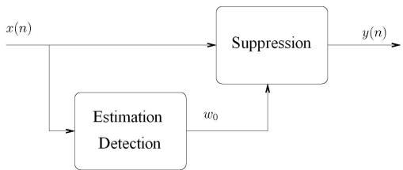  
Figure 2: Detection and suppression block scheme in a typical twostage FFT-based NHS system

fore, the suppression block consists of a notch filter, as in (3), or of a bank of notch filters in which several notch filters are cascaded. Each of those notch filters can be tuned to a different howling frequency previously estimated in the estimation/detection block. There are different approaches to discriminate whether a tonal component is either due to undesired acoustic feedback or it is a desired source signal component. An extensive comparison of these approaches is given in [3].

## 2.2 Adaptive Notch filters

Adaptive notch filters (ANFs) perform a parametric frequency estimation, and allow for a simultaneous howling estimation/detection and suppression as shown in Fig. 3.

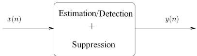  
Figure 3: Simultaneous detection and suppression in a one-stage ANF-based system

The advantage of ANF-based methods over FFT-based methods is fourfold: 1) the required processing delay is minimum since the ANF-based method is sample-based, 2) ANFs are able to track changes in the howling frequency in a sample-by-sample basis, 3) avoiding FFT operations strongly reduces computational complexity, and 4) the achievable frequency estimation accuracy is generally high for a limited amount of data. Different IIR-ANF implementations have been proposed in the literature, both with a Gauss-Newton-type update [8], [9], [6], and with a gradient-descent-type update [10]. In the sequel we will use a gradient-descent implementation as it is of minimal complexity and only n parameters have to be estimated, where n is the number of sinusoids. The notch filter transfer function (3) can be rewritten in a slightly different form which is more suitable for coefficient updating, i.e.

$$
H (q) = \frac {1 - a (n) q ^ {- 1} + q ^ {- 2}}{1 - a (n) r q ^ {- 1} + r ^ {2} q ^ {- 2}}\tag{4}
$$

where $q$ denotes the discrete time shift operator, $\mathrm { i . e . , ~ } q ^ { - k } u ( n ) =$ $u ( n - k )$ . The parameter $a ( n )$ defines the instantaneous frequency $w _ { 0 } ( n ) , { \mathrm { i . e . } }$

$$
w _ {0} (n) = \arccos \left(\frac {a (n)}{2}\right)\tag{5}
$$

The parameter $a ( n )$ is allowed to take values bounded by $- 2 <$ $a ( n ) < 2$ . The basic idea underlying ANF-based frequency estimation and howling suppression consists in feeding the signal into the ANF and perform a minimization w.r.t. $a ( n )$ , of the mean square error (MSE) of the notch filter output signal y(n)

$$
\min _ {a (n)} E [ y (n) ^ {2} ]\tag{6}
$$

This will cause the notch to be centered at the frequency corresponding to the signal’s narrowband or sinusoidal component. The gradient descent algorithm will adjust the coefficient $a ( n )$ in the negative gradient direction $\nabla _ { a } ( n )$ , until a local minimum in the cost function is attained. The gradient descent algorithm for the directform ANF is given by equations $\left( 7 \right) - \left( 1 1 \right) \left[ 1 0 \right]$ . Here the ANF input and output signals are denoted by x(n) and y(n) respectively, the filter states are denoted by $u ( n ) , u ( \bar { n } - 1 ) , t ( \bar { n } ) , t ( \bar { n ^ { - } } 1 )$ and the step-size is denoted by $\mu .$

$$
{ t ( n + 1 ) } { = } { u ( n ) - r a ( n ) t ( n ) - r ^ { 2 } t ( n - 1 ) }\tag{7}
$$

$$
\nabla_ {a} (n) = t (n + 1) - r t (n - 1)\tag{8}
$$

$$
u (n + 1) = x (n) - r a (n) u (n) - r ^ {2} u (n - 1)\tag{9}
$$

$$
y (n) = u (n + 1) + a (n) u (n) + u (n - 1)
$$

$$
a (n + 1) = a (n) - \mu y (n) \nabla_ {a} (n)\tag{10}
$$

(11)

## 3. REGULARIZED ADAPTIVE NOTCH FILTERS

The proposed NHS method employs three regularized ANFs (RANF) that run in parallel and share one decision block, see Fig.5. Each RANF is regularized with a term $\lambda _ { i } ,$ which is chosen to have a different value for $i = 1 , 2 , 3$ . The regularized ANF cost function is given as

$$
\min _ {a _ {i} (n)} E [ y _ {i} (n) ^ {2} ] + \lambda_ {i} a _ {i} (n) ^ {2} \quad i = 1, 2, 3.\tag{12}
$$

This results in a modified gradient descent coefficient update, corresponding to a so-called Leaky LMS [11]:

$$
a _ {i} (n + 1) = a _ {i} (n) - \mu \left\{y _ {i} (n) \nabla_ {a _ {i}} (n) + \lambda_ {i} a _ {i} (n) \right\}\tag{13}
$$

The effect of the regularization term is negligible when howling is present in the signal. This is so because the term in (13) with the gradient search direction $\nabla _ { a _ { i } } ( n ) ~ ( \mathrm { i . e . } ~ y _ { i } ( n ) \nabla _ { a _ { i } } ( n ) )$ is significantly larger than the term $\lambda _ { i } a _ { i } ( \dot { n } )$ Conversely, when howling is not present, the gradient search direction $\dot { \nabla } _ { a _ { i } } ( n )$ tends to zero and so the coefficient update formula approximately equals $a _ { i } ( n + 1 ) = a _ { i } ( n ) - \mu \lambda _ { i } a _ { i } ( n ) \stackrel { \scriptscriptstyle = } { = } ( 1 - \mu \lambda _ { i } ) a _ { i } ( n )$ . The effect of this is that the regularization term is in fact penalizing the estimates $a _ { i } ( n )$ Moreover, depending on the sign of $\lambda _ { i } ,$ the regularization term will introduce a leakage or an accumulation effect on the coefficient estimate. Conventionally regularized algorithms ,i.e., with a positive $\lambda _ { i } ,$ produce estimates that are biased towards zero. By having negative $\lambda _ { i } ,$ , the proposed RANF algorithm also produces estimates that are ”biased towards infinity”. This is indeed what we observe in Fig. 4: Whenever howling does not occur the RANF coefficients diverge either to their upper bound if $\lambda _ { i }$ is negative or to zero if $\lambda _ { i }$ is positive.

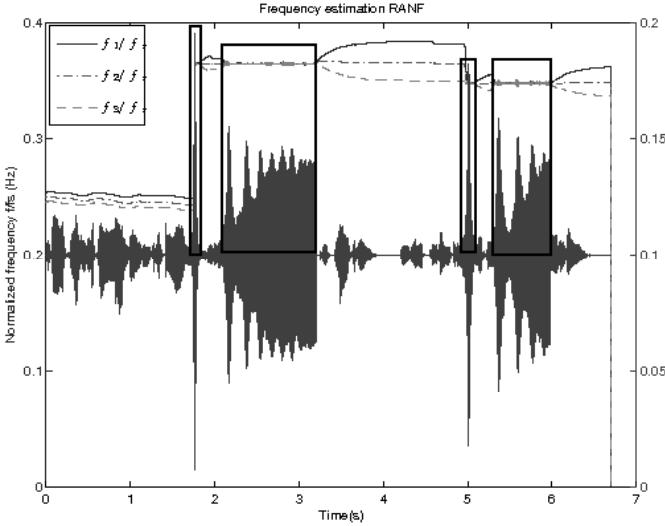  
Figure 4: Combined representation of time domain RANF input signal $x ( n )$ (lower curve) and RANF normalized frequency estimates $f _ { i } / f _ { s } \stackrel { \cdot } { ( i = 1 , 2 , 3 }$ . Upper curves) The framed signal fragments correspond to howling segments

Fig. 4 shows an example of the evolution of the frequency tracking as a function of time with the proposed method. When howling appears in the signal, the three coefficients $a _ { i } ( n )$ converge to the same value. The boxes frame the part of the signal where howling is present. When howling disappears, the three coefficients $a _ { i } ( n )$ move away from each other as a result of having different regularization parameters $\lambda _ { i } .$

Figure 5 shows a block diagram of the proposed RANF-based NHS method. The signal x(n) is input into the three RANF blocks which will track a tonal component in the signal. The Decision Rule block monitors the coefficients $a _ { i } ( n )$ of the three RANF blocks. After L samples are buffered, where L is a small number so as to have minimum decision delay (e.g., L = 5 which corresponds to 0.312 ms at 16 kHz sampling rate) the mean and the variance of a block of L samples is calculated and compared for the three RANF blocks. If the difference between two mean values is less than a fixed threshold, in Hz, then howling is assumed to be present. Essentially, this means that howling is detected when at least two RANF coefficients have converged to the same frequency. In this case, the output signal y(n) is assigned to be one of the three RANF block output signals $y ( n ) _ { 1 , 2 , 3 }$ , depending on the frequency estimation variance. The smaller the variance the more reliable the result is assumed to be. Similarly, if the differences in mean value for the three RANF blocks are larger than the fixed threshold, then no howling is assumed in the signal and the output is generated directly from the input.

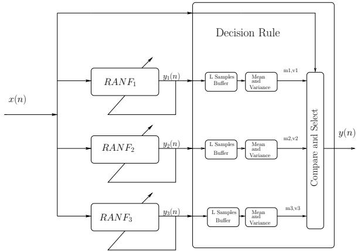  
Figure 5: Block diagram of the proposed RANF-based NHS method

The values of $\lambda _ { i }$ are chosen such that the difference $\Delta f \left( \mathrm { H z } \right)$ , in a time period of M samples, between two coefficients $a _ { i } ( n )$ corresponds to a given fixed threshold (Hz). We will set $\lambda _ { 1 } = \dot { \lambda } , \lambda _ { 2 } = 0$ and $\lambda _ { 3 } = - \lambda$ , where

$$
\lambda = \frac {1}{\mu} \left[ \sqrt [ 2 M ]{1 + \left(\frac {2 \pi}{f _ {s}} \Delta f\right) ^ {2}} - 1 \right]\tag{14}
$$

Expression (14) is based on the ”small-angle approximation” , $\mathrm { i . e . , } \Delta \bar { f }$ should be small compared to the sampling frequency $f _ { s } ,$ a trigonometric relationship between the regularization parameter $\lambda _ { i } ,$ and the desired divergence rate after a howling occurrence.

## 4. RESULTS

In this section, the performance of the proposed method is evaluated for two types of signals. These signals, were generated in Matlab from clean speech and music signals. The feedback paths were synthetically generated, using an exponentially damped tone at a particular frequency, as a synthetic feedback path impulse response. The frequency and duration of the feedback path were drawn from pre-defined distributions in order to simulate changing feedback conditions (i.e., dynamic feedback path). A pre-specified loop gain was obtained by changing the forward gain appropriately. The frequency range and maximum loop gain were chosen for two test scenarios (i.e., scenarios $\ ' _ { \textrm { a } } \cdotp$ and ’b’) in order to change, besides the howling frequency, the speed at which the howling appears, the exponential slope of the increasing howling amplitude, the howling duration and how frequently howling appears in the signal, see Fig. 6(a), 6(c) and Fig. 7(a), 7(c) . Therefore, for each clean signal two types of howling signals were generated, namely $S p e e c h _ { a } , S p e e c h _ { b }$ Musica and Musicb.

The original signals were a speech signal $( \mathrm { i . e . }$ , an Englishspeaking female voice) and a music signal (i.e. a fragment of a song) both sampled at 16 kHz. The system parameters were set to ${ \bar { \lambda } } _ { 1 } = + 0 . 0 0 { \hat { 0 } } 1 , \ \lambda _ { 2 } = 0 , \ \lambda _ { 3 } = - 0 . 0 { \dot { 0 } } 0 1 , \ { \hat { \mu } } = 0 . 0 2 3 , \ r = 0 . 8 5$ Threshold = 5 Hz, L = 5 samples.

Four objective performance measures will be used in this section, namely Maximum and Minimum Attenuation in $d B \ ( \ A t t _ { m a x }$ and $A t t _ { m i n }$ respectively) and Maximum and Mean Frequency-Weighted Log-Spectral Signal Distortion $( S D _ { m a x }$ and $S D _ { m e a n } \mathrm { \ r e - }$ spectively). The Attenuation (15) is calculated comparing the power spectrum of the original signal without howling with the signal after howling suppression, i.e.

$$
\text { Attenuation } (f) = 1 0 \log_ {1 0} \frac {S _ {y} (f)}{S _ {x} (f)}\tag{15}
$$

where $S _ { y } ( f )$ and $S _ { x } ( f )$ denote the short-term power spectra of the signal after suppression and the original signal around the howling frequency $f ,$ respectively. $A t t _ { m a x }$ is the difference in dB between the frequency component with the smallest power in the signal after suppression and the original signal and so, $A t t _ { m i n }$ is the difference with respect to the highest frequency component. Ideally, $A t t _ { m a x }$ should be zero dB which means that perfect, distortion-free, howling suppression is achieved.

The SD is a measure of sound quality and objectively measures the distortion produced not only by applying notch filters to the signal but also due to howling. It was proposed in [3] and is given as

$$
S D (t) = \sqrt {\int_ {0} ^ {f _ {s} / 2} w _ {\mathrm{ERB}} (f) \left(1 0 \log_ {1 0} \frac {S _ {y} (f)}{S _ {x} (f)}\right) ^ {2} d f}\tag{16}
$$

where $w _ { \mathrm { E R B } } ( f )$ is a weighting function that gives weights to each auditory critical band within the Nyquist interval, following Table II of the ANSI S3.5-1997 standard. The integration in (16) is approximated by a summation over the critical frequency bands. Both the mean and maximum values $S D _ { m e a n } S D _ { m a x } .$ , will be used.

## 4.1 Speech signal

Fig. 6 shows the spectrograms of the speech signal before and after howling suppression by means of the proposed method. In Fig. 6(a) and Fig. 6(c) the howling speech signal is presented to show the howling frequency range and time evolution. In Fig. 6(b) it is clear that suppression is performed equally well over time and frequency. However, in Fig. 6(d) we can see that in the frequency range below 1.5 kHz, no suppression is accomplished.

## 4.2 Music signal

The same procedure is followed in this case for a music signal. Fig. 7 shows the spectrograms of the music signal before and after howling suppression. The same observation as in the speech simulation can be made in this case.

In Table 1, the corresponding performance measures are shown. It can again be observed that scenario ’b’ is more problematic in terms of both maximum and minimum howling suppression and spectral distortion. For frequencies below 1500 Hz, the method not only is unable to suppress the howling but also is further distorting the signal in a wider frequency range due to false howling detection. This fact has been noted in [10] where it is pointed out that direct-form adaptive notch filters are not necessarily stable when the notch frequency approaches its extreme values (i.e., 0 and $f _ { s } / 2 )$ Therefore, when the signal contains howling in the neighbourhood of these frequencies, the proposed method cannot be used to suppress it. Solutions to this problem rely on lattice ANF implementations [10], however their performance is acceptable only when tracking sinusoids inmersed in white noise (i.e. not in colored inputs such as music or speech).

## 5. CONCLUSION

In this paper, a new method for acoustic howling suppression has been presented. It is based on adaptive notch filters that include a regularization term (RANF). The proposed method has the advantage over non-parametric frame-based methods, e.g., FFT-based methods, that it requires a minimum processing delay and has a small computational complexity. Simulations show that the method is able to suppress and track howling frequencies in situations where the howling frequency is confined to mid-range frequencies. Compared to existing ANF-based methods, an accurate howling detection can be achieved.

Table 1: System performance for given howling signals

<table><tr><td>Signal</td><td>SDmean</td><td>SDmax</td><td>Maxatt dB</td><td>Minatt dB</td></tr><tr><td>Speecha</td><td>1.66</td><td>14.78</td><td>5</td><td>6</td></tr><tr><td>Speechb</td><td>4.32</td><td>28.83</td><td>5</td><td>40</td></tr><tr><td>Musica</td><td>1.05</td><td>13.24</td><td>3</td><td>6</td></tr><tr><td>Musicb</td><td>3.61</td><td>17.83</td><td>1</td><td>40</td></tr></table>

## REFERENCES

[1] H. Nyquist, “Regeneration theory,” Bell Syst. Tech. J., vol. 11, pp. 126–147, 1932.

[2] A. Spriet, S. Doclo, M. Moonen, and J. Wouters, Feedback control in hearing aids, ch. 6 in “Part H. Speech Enhancement of the Springer Handbook of Speech Processing and Speech Communication (Benesty J., Huang Y. A., Sondhi M., eds.)”. Springer, Heidelberg, Germany, 2007.

[3] T. van Waterschoot and M. Moonen, “50 years of acoustic feedback control: state-of-the-art and future challenges,” ESAT-SISTA Technical Report TR 08-13, Katholieke Universiteit Leuven, Belgium, 2008.

[4] J. B. Foley, “Adaptive periodic noise cancellation for the control of acoustic howling,” in Proc. IEE Colloq. Adaptive Filters, (London, UK), pp. 7/1–7/4, Mar. 1989.

[5] S. M. Kuo and J. Chen, “New adaptive IIR notch filter and its application to howling control in speakerphone system,” IEE Electronics Lett., vol. 28, pp. 764–766, Apr. 1992.

[6] A. Nehorai, “A minimal parameter adaptive notch filter with constrained poles and zeros,” IEEE Trans. Acoust. Speech, Signal Process, vol. ASSP-33, no. 4, pp. 983–996, 1985.

[7] S. Jiao and M. H. Nagrial, “Modeling and simulation of a real time adaptive notch filter for sinusoidal frequency tracking,” International Conference on Power Electronic Drives and Energy Systems for Industrial Growth, vol. 2, no. 1, pp. 948–952, 1998.

[8] J. M. Travassos-Romano and M. Bellanger, “Fast least-squares adaptive notch filtering,” IEEE Trans. Acoust. Speech, Signal Process, vol. 36, no. 9, pp. 1536–1540, 1984.

[9] D. Bhaskar and S. Kung, “Adaptive notch filtering for the retrieval of sinusoids in noise,” IEEE Trans. Acoust. Speech, Signal Process, vol. ASSP-32, no. 4, pp. 791–802, 1984.

[10] P. Regalia, Adaptive IIR Filtering in Signal Processing and Control. 270 Madison Avenue, NY: Marcel Dekker, 1995.

[11] K. Mayyas and T. Aboulnasr, “Leaky LMS algorithm: MSE analysis for Gaussian data,” IEEE Trans. on Signal Processing, vol. 45, no. 4, pp. 927–934, 1997.

[12] A. Spriet, K. Eneman, M. Moonen, J. Wouters , “Objective measures for real-time evalutaion of adaptive feedback algorithms in hearing aids,” in Proc. 16th European Signal Processing Conf. (EUSIPCO ’08), (Laussane, Switzerland), Aug. 2008.

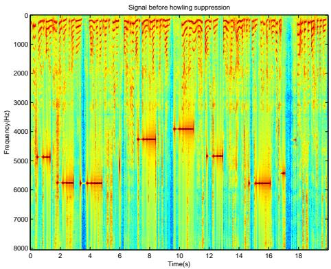  
(a) Speecha before suppression

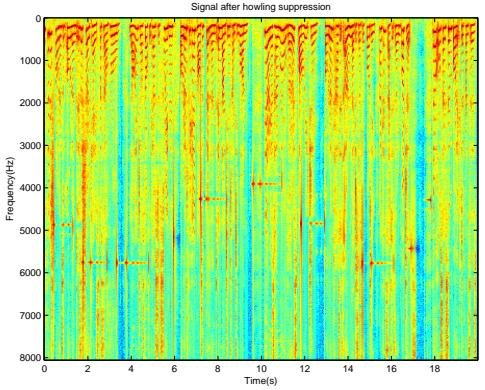  
(b) Speecha after suppression

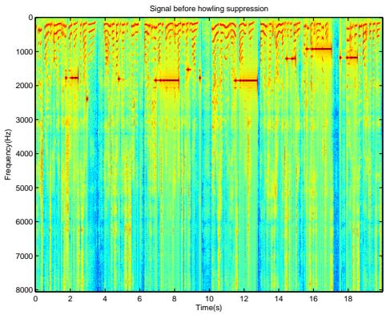  
(c) Speechb before suppression

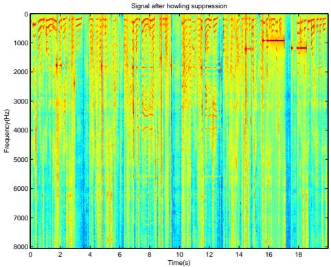  
(d) Speechb after suppression  
Figure 6: Speech signal before and after howling suppression. The frequency range, gain and time evolution of howling is generated differently in $\bar { \mathbf { \rho } } _ { \mathrm { a } } ,$ and $\overrightarrow { \mathbf { b } } \overrightarrow { \mathbf { \xi } }$ scenarios

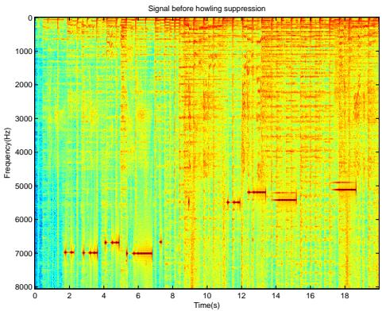  
(a) Musicabefore suppression

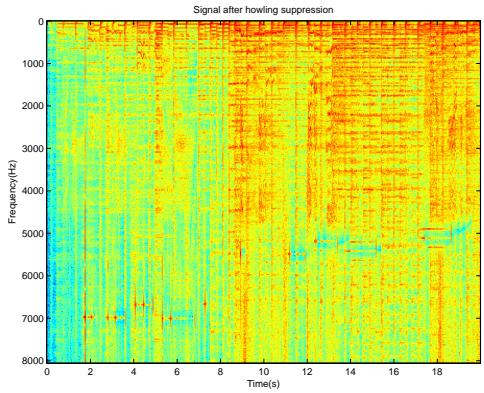  
(b) Musica after suppression

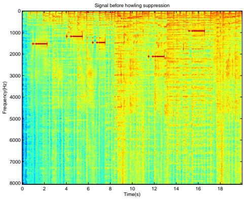  
(c) Musicb before suppression

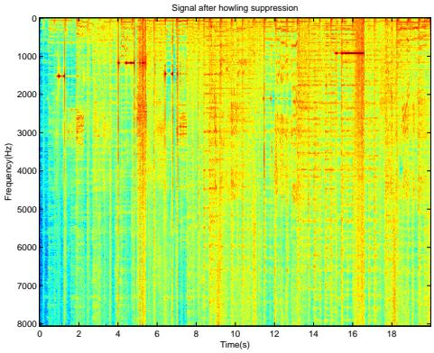  
(d) Musicb after suppression  
Figure 7: Music signal before and after howling suppression. The frequency range, gain and time evolution of howling is generated differently in $\breve { \mathbf { \Phi } } _ { \mathbf { a } } ,$ and $\because \mathrm { { \bf { b } } } ^ { \prime }$ scenarios