# BLIND DIRECTION-DEPENDENT ACOUSTIC PARAMETER ESTIMATION USING SMART GLASSES

Philipp Görtz $^{1\dagger}$ , Sebastià V. Amengual $^{2}$ , Paul Calamia $^{2}$ , Ishwarya Ananthabhotla $^{2}$ , Andrew Francl $^{2}$ , Carl Schissler $^{2}$ , Emanuele A. P. Habets $^{1}$

$^{1}$ Friedrich-Alexander University Erlangen-Nuremberg, Germany $^{2}$ Meta Reality Labs, Redmond, Washington, USA

# ABSTRACT

We address the task of blind, direction-dependent estimation of acoustic parameters from reverberant speech captured with smart glasses equipped with a compact microphone array. Such estimates are valuable for realistic rendering of virtual sound sources in auditory augmented reality. To overcome the limited spatial resolution inherent to compact arrays, the proposed method exploits natural head rotations by aggregating spatial information across multiple viewing orientations. The approach is validated by estimating the direction-dependent decay time $\mathrm{T}_{20}$ and directional acoustic energy.

Index Terms—Smart glasses, acoustic signal processing, extended reality

# 1. INTRODUCTION

In the context of auditory augmented reality (AAR) applications, plausible rendering of virtual sound sources within real environments is critical for immersion, realism, and telepresence [1, 2]. This requirement for realism arises from the fact that the human auditory system extracts a wealth of information from reverberant sound fields to support cognitive tasks such as sound source localization and the formation of a spatial understanding of the environment [3]. Rendering a virtual sound source in a real environment using wearable technology, therefore, involves generating a plausible binaural signal based on knowledge of the space's acoustic properties, such as room impulse responses (RIRs) or acoustic parameters [4].

Recent research in acoustic scene analysis and modeling with a focus on AAR has produced impressive results, particularly through the incorporation of multi-modal information [5, 6]. Existing approaches range from leveraging visual information to predict the RIR at an unseen location [7-9] to estimating spatial maps of acoustic parameters, such as reverberation time [10]. However, many recently proposed multi-modal scene analysis methods are computationally intensive, making their deployment on wearable devices challenging. Moreover, approaches that rely on visual information can raise privacy and security concerns, whereas those that require controlled acoustic measurements are often impractical in real-world scenarios. Consequently, scene analysis methods that enable continuous, blind estimation of acoustic parameters without relying on visual data are often preferable. Although various methods exist for blindly estimating acoustic parameters from reverberant signals [11-13], they typically neglect the spatial or directional dependency of these parameters [14]. This dependency is essential for realistic spatial audio rendering of virtual sources [15]. The limitation is particularly relevant for AAR applications, which are commonly used in

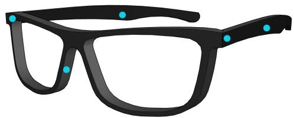  
Fig. 1: Illustration of the smart glasses used in this study. The positions of the five built-in microphones are marked in cyan.

domestic environments characterized by non-uniform absorption and anisotropic energy decay.

Wearable devices are often equipped with a small number of microphones arranged in irregular, potentially asymmetric layouts due to design constraints. The resulting limited spatial resolution and directional ambiguities make the estimation of direction-dependent acoustic parameters (DDAPs) from reverberant signals challenging. Prior studies in sound source localization have investigated the use of head rotation to improve estimation accuracy [16-19]. Since head movements naturally occur during AAR use and contribute to spatial perception [20], we propose a method for blind DDAP estimation that integrates acoustic cues across multiple head orientations with the corresponding orientation information. This integration improves upon the limited spatial resolution imposed by the small number and compact arrangement of microphones in smart glasses. To the best of our knowledge, the proposed method constitutes the first multimodal approach for blind DDAP estimation using a wearable device. We demonstrate its effectiveness by estimating two parameters, the direction-dependent decay time $(\mathrm{T}_{20})$ and the direction-dependent acoustic energy.

The remainder of this paper is organized as follows. Section 2 reviews the background relevant to the proposed method. Section 3 describes the proposed approach, including the computation of ground truth data and the DDAP estimation model. Sections 4 and 5 present the experimental evaluation and corresponding discussion, respectively. Finally, Section 6 concludes the paper.

# 2. BACKGROUND

We define the spherical coordinate $\pmb{\theta} = [\vartheta, \phi]$ , where $0 \leq \vartheta \leq \pi$ is the zenith angle and $0 \leq \phi < 2\pi$ the azimuth. Real-valued spherical harmonics of order $l$ and degree $m$ are given by

$$
Y _ {l m} (\vartheta , \phi) = N _ {l | m |} P _ {l | m |} (\cos \vartheta) \left\{ \begin{array}{l l} \sqrt {2} \sin (| m | \phi), & m <   0, \\ 1, & m = 0, \\ \sqrt {2} \cos (m \phi), & m > 0, \end{array} \right. \tag {1}
$$

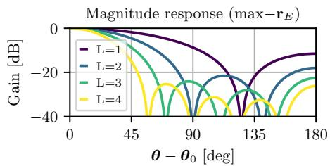

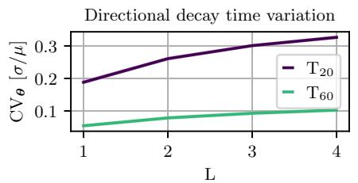

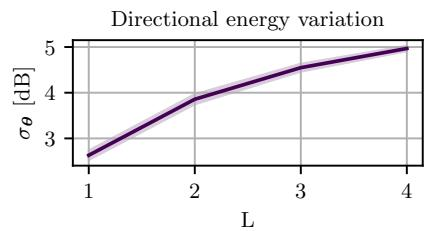  
Fig. 2: (Left) Magnitude response of the $\max -\mathbf{r}_E$ beamformer for different $L$ ; (Center) coefficient of variation (CV) for the decay times $\mathrm{T}_{20}$ and $\mathrm{T}_{60}$ depending on $L$ , showing the mean and standard deviation across the four octaves; (Right) Standard deviation of the directional energy $E$ depending on $L$ , showing the mean and standard deviation across the four octaves.

where $P_{lm}$ is the associated Legendre polynomial and $N_{lm} = (-1)^{|m|}\sqrt{(2l + 1)(l - m)! / 4\pi(l + m)!}$ is a normalization factor. The spherical harmonic transform (SHT) of a function $f(\vartheta, \phi)$ is given by

$$
\begin{array}{l} \mathrm {S H T} _ {L} (f (\vartheta , \phi)) = \int_ {0} ^ {2 \pi} \int_ {0} ^ {\pi} f (\vartheta , \phi) Y _ {l m} ^ {*} (\vartheta , \phi) \sin \vartheta d \vartheta d \phi \tag {2} \\ \text {f o r} \quad 0 \leq l \leq L, - l \leq m \leq l \\ \end{array}
$$

where $L$ denotes the highest order included in the spherical harmonic expansion, and $(\cdot)^*$ denotes the complex conjugate. The inverse transform of the obtained spherical harmonic coefficients (SHC) $f_{lm}$ is given by

$$
\mathrm {i S H T} _ {L} \left(f _ {l m}\right) = \sum_ {l = 0} ^ {L} \sum_ {m = - l} ^ {l} f _ {l m} Y _ {l m} (\vartheta , \phi). \tag {3}
$$

In this study, we consider a reverberant sound field produced by a single active source $S$ and captured by a compact array of $K$ microphones. The resulting multichannel signal is given by

$$
\mathbf {x} [ n ] = \sum_ {n ^ {\prime} = 0} ^ {N _ {h} - 1} \mathbf {h} [ n ^ {\prime} ] s [ n - n ^ {\prime} ] \in \mathbb {R} ^ {K}, \tag {4}
$$

where $\mathbf{x}[n] = [x_1[n],\dots,x_K[n]]^T$ denotes the multi-channel reverberant signal, modeled as the convolution of the monaural anechoic source signal $s[n]$ with the array RIR $\mathbf{h}[n] = [h_1[n],\dots,h_K[n]]^T$ of length $N_{h}$ , where $n$ denotes the discrete-time index. Additionally, we define $\mathbf{h}_{lm}^{(\circ)}[n]\in \mathbb{R}^{(L + 1)^2}$ as the SH domain spatial RIR between $S$ and a single, omnidirectional receiver, located at the center of the microphone array in the smart glasses. Sets are notated in calligraphic type font.

# 3. PROPOSED METHOD

We aim to estimate DDAPs from $\mathbf{h}_{lm}^{(\circ)}[n]$ using reverberant signals acquired by the smart-glasses microphone array. In the following, we first outline our approach to computing the target DDAPs and then present our orientation-aware, blind estimation method.

# 3.1. Ground Truth Computation

In this work, we consider DDAPs in four octaves with center frequencies $[0.5, 1, 2, 4] \mathrm{kHz}$ , which are chosen based on the physical constraints of the compact microphone array shown in Figure 1, with limited spatial resolution at low frequencies and spatial aliasing at

wavelengths significantly shorter than the microphone spacing. In the following, we describe the ground truth DDAP computation for a single octave. To that end, we form a set of control directions $\mathcal{J} = \{\pmb{\theta}_j\}_{j=1}^J$ that follow a spherical $15^{\mathrm{th}}$ -order $t$ -design [21], which offers uniform spherical coverage and allows for efficient integration over the sphere in (2). We orient a maximum radial energy beamformer (abbrev. $\max - \mathbf{r}_E$ , cf. Figure 2) towards a direction $\pmb{\theta}_j \in \mathcal{J}$ to obtain the directional RIR

$$
h _ {\boldsymbol {\theta} _ {j}} [ n ] = \sum_ {l = 0} ^ {L} \sum_ {m = - l} ^ {l} w _ {l} Y _ {l m} \left(\boldsymbol {\theta} _ {j}\right) \mathbf {h} _ {l m} ^ {(\circ)} [ n ], \tag {5}
$$

where $w_{l}$ denotes the approximated modal weight coefficients resulting from $\max -\mathbf{r}_E$ weighting [23]. We subsequently apply a $2^{\mathrm{nd}}$ -order Butterworth bandpass filter to bandlimit $h_{\theta_j}[n]$ to the considered octave. We compute the direction-dependent decay time $\mathrm{T}_{20}(\pmb {\theta}_j)$ from $h_{\theta_j}[n]$ based on the directional energy decay curve

$$
\operatorname {E D C} _ {\boldsymbol {\theta} _ {j}} [ n ] = 1 0 \log_ {1 0} \left(\frac {\sum_ {n ^ {\prime} = n} ^ {N - 1} h _ {\boldsymbol {\theta} _ {j}} ^ {2} [ n ^ {\prime} ]}{\sum_ {n ^ {\prime} = 0} ^ {N - 1} h _ {\boldsymbol {\theta} _ {j}} ^ {2} [ n ^ {\prime} ]}\right), \tag {6}
$$

where $\mathrm{T}_{20}$ is defined as the time interval where $-25\leq \mathrm{EDC}_{\theta_j}\leq -5$ , extrapolated to a decay by $60\mathrm{dB}$ , i.e., $\mathrm{T}_{20} = 3\times (\mathrm{T}_{25} - \mathrm{T}_5)$ Furthermore, we compute the directional energy

$$
E \left(\boldsymbol {\theta} _ {j}\right) = 1 0 \log_ {1 0} \left(\frac {1}{N} \sum_ {n = 0} ^ {N - 1} h _ {\boldsymbol {\theta} _ {j}} ^ {2} [ n ]\right). \tag {7}
$$

Figure 2 shows the magnitude beam pattern of the $\max -\mathbf{r}_E$ beamformer as a function of SH order $L$ , along with the corresponding DDAP variation, averaged across all spatial RIRs used in the study. For the estimation of directional decay time, we focus on $\mathrm{T}_{20}$ rather than $\mathrm{T}_{60}$ , as it exhibits a substantially stronger directional dependence, owing to the fact that the sound field captured in the RIR becomes more diffuse and isotropic over time.

# 3.2. Orientation-aware Parameter Estimation

The proposed estimation framework is identical for direction-dependent decay time and directional acoustic energy. In the following, a generic direction-dependent acoustic parameter (DDAP) in a single subband is denoted by $\Gamma (\pmb {\theta})$ , where $\Gamma (\pmb {\theta})$ represents either the decay time $\mathrm{T}_{20}(\pmb {\theta})$ or the acoustic energy $E(\pmb {\theta})$ .In this work, DDAPs are jointly estimated across four octave bands using all five microphones of the smart glasses. Each reverberant microphone signal $x_{k}[n]$ is represented in the time-frequency domain by its short-time Fourier transform $X_{k}[n_{f},f]\in \mathbb{C}$ ,where $n_f$ and $f$ denote the time-frame and frequency indices, respectively. For each time-frequency bin, the microphone signals are collected

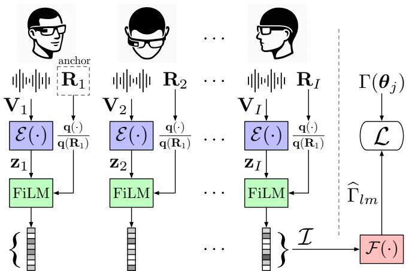  
Fig. 3: Overview of the proposed method, showing the encoder $\mathcal{E}(\cdot)$ that extracts spatial information from the reverberant input signals, and the aggregation module $\mathcal{F}(\cdot)$ that estimates the DDAP from the embedding set $\mathcal{I}$ .

into a feature vector $\mathbf{v}[n_f, f] \in \mathbb{R}^{C := K + 2(K - 1)}$ to form the input $\mathbf{V} \in \mathbb{R}^{C \times F \times N_f}$ , with $F$ and $N_f$ denoting the frequency and time dimensions, respectively. Specifically, we encode the four inter-channel phase differences between neighboring microphones using sine and cosine functions to avoid phase discontinuities, and stack them with magnitudes compressed by an exponent $c \in (0,1]$ . Furthermore, each $\mathbf{V}$ is associated with a fixed orientation of the smart glasses, represented by a rotation matrix $\mathbf{R}(\alpha, \beta, \gamma)$ constructed from Euler angles in $ZYX$ order, and the corresponding unit quaternion representation $\mathbf{q}(\mathbf{R}) \in \mathbb{R}^4$ , with $\| \mathbf{q}(\mathbf{R}) \|_2 = 1$ .

The DDAP estimator is realized with two deep neural networks. Figure 3 illustrates the architecture of the proposed approach. First, an encoder $\mathcal{E}:\mathbb{R}^{C\times F\times N_f}\to \mathbb{R}^D$ extracts a spatial acoustic embedding $\mathcal{E}(\mathbf{V}) = \mathbf{z}$ from a reverberant array signal. Second, an aggregation model $\mathcal{F}:\mathcal{I}\rightarrow \mathbb{R}^{(L + 1)^2}$ processes the set $\mathcal{I} = \{\mathbf{z}_i\mid \mathbf{q}(\mathbf{R}_i)\mathbf{q}(\mathbf{R}_1)^{-1}\}_{i = 1}^I$ of embeddings conditioned on orientation information, and yields the estimated DDAP of interest in the spherical harmonic domain, denoted by $\widehat{\Gamma}_{lm}$ . During training, a random element from $\mathcal{I}$ is defined as the anchor $\mathbf{q}(\mathbf{R}_1)$ to which the remaining orientations are expressed relatively. Accordingly, $\mathcal{F}$ predicts $\widehat{\Gamma}_{lm}$ with an orientation corresponding to the anchor view. The aggregation rests on the assumption that the orientation remains fixed for each conditioned embedding and that acoustic conditions remain constant across $\mathcal{I}$ , i.e., that $S$ is the sole stationary sound source.

The encoder $\mathcal{E}$ is realized with a series of convolutional layers that extract local spatio-temporal features, followed by attention-based temporal pooling, yielding a fixed-size embedding. The aggregation model $\mathcal{F}$ , based on a transformer encoder architecture, processes embeddings conditioned on orientation through feature-wise linear modulation (FiLM) [24] as an unordered set by omitting positional encoding. $\mathcal{E}$ and $\mathcal{F}$ consist of 676,288 and 294,992 trainable parameters, respectively, and are trained jointly by minimizing the mean squared error between the ground truth and the estimated DDAP in the spatial domain, evaluated over the set of directions in $\mathcal{J}$

$$
\mathcal {L} = \sum_ {j \in \mathcal {J}} \left\| \sum_ {l = 0} ^ {L} \sum_ {m = - l} ^ {l} \widehat {\Gamma} _ {l m} Y _ {l m} (\boldsymbol {\theta} _ {j}) - \overline {{\Gamma}} (\boldsymbol {\theta} _ {j}) \right\| _ {2} ^ {2}, \tag {8}
$$

where $\overline{\Gamma} (\theta)$ denotes the ground truth DDAP reconstructed from SHCs

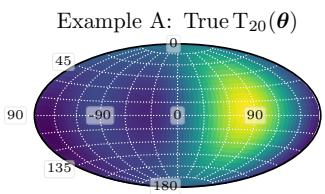

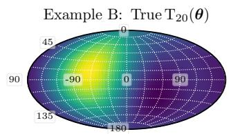

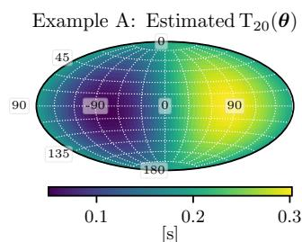

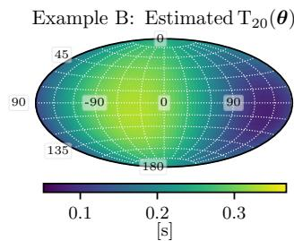  
Fig. 4: Two examples of direction-dependent $\mathrm{T}_{20}$ in the $2\mathrm{kHz}$ octave with $L = 2$ ; ground truth and estimates are shown using a shared color range.

up to order $L$ . Estimating DDAPs in the SH domain rather than in the spatial domain over a discrete set of directions yields a compact, continuous representation that is amenable to evaluation at arbitrary angles during inference. The flexibility to choose $L$ provides convenient control over the spatial resolution of the estimated parameter, potentially guided by perceptual considerations. Moreover, the method naturally estimates the omnidirectional (zero-order) acoustic parameter, which may be desired in certain applications.

# 4. EXPERIMENTAL SETUP AND RESULTS

# 4.1. Data Generation

In this work, the RIRs used to generate reverberant input signals were obtained by combining measured anechoic transfer functions of the microphones in the smart glasses with spatial RIRs simulated using the Treble Acoustics Simulation Platform [25]. For each microphone, the spatial anechoic response was rotated [26] and combined with $\mathbf{h}_{lm}^{(\mathrm{o})}[n]$ to form the device-specific RIR $h_k[n]$ . In each simulated environment, the source and receiver were randomly positioned while maintaining a minimum distance of $0.5\mathrm{m}$ from each other and from any boundary. The initial orientation was sampled as $\alpha_0\sim \mathcal{U}[0,2\pi ]$ , $\beta_0\sim \mathcal{U}[-\pi /4,\pi /4]$ , and $\gamma_0 = 0$ , with additional orientational offsets independently drawn from $\alpha \sim \mathcal{U}[-\pi /2,\pi /2]$ , $\beta \sim \mathcal{U}[-\pi /8,\pi /8]$ , and $\gamma \sim \mathcal{U}[-\pi /12,\pi /12]$ . A total of 400 environments were simulated, of which 280 were used for training and 60 each for validation and testing. Using the EARS dataset of anechoic speech recordings [27], we generated approximately 34 hours of multi-channel reverberant speech at a sampling rate of $16\mathrm{kHz}$ .

# 4.2. Performance Evaluation

The evaluation of our proposed method is based on the estimation error - mean absolute percentage error (MAPE) for $\mathrm{T}_{20}(\theta)$ and mean absolute error (MAE) for $\mathrm{E}(\theta)$ - and the Pearson correlation coefficient (PCC), which captures the relative directional variability between ground truth and estimated DDAP. Figure 4 qualitatively shows two examples of direction-dependent $\mathrm{T}_{20}$ at $2\mathrm{kHz}(L = 2)$ . While Example A exhibits accurate estimation, Example B shows a noticeable mismatch in the overall shape, underscoring the need to consider both performance metrics.

Table 1: Overview of evaluation metrics within each of the four octave bands, for all SH orders and both DDAPs. The top section shows the estimation errors, the bottom section shows the PCC. For $\mathrm{T}_{20}(\theta)$ , we report median and IQR (in brackets), for $\mathrm{E}(\theta)$ , we report mean and $\pm$ standard deviation.   

<table><tr><td rowspan="2" colspan="2"></td><td colspan="4">T20(θ)</td><td colspan="5">E(θ)</td></tr><tr><td>0.5 kHz</td><td>1 kHz</td><td>2 kHz</td><td>4 kHz</td><td>0.5 kHz</td><td>1 kHz</td><td>2 kHz</td><td>4 kHz</td><td></td></tr><tr><td rowspan="4">MAPE (↓) [%]</td><td>L=1</td><td>20.0 (20.6)</td><td>28.3 (27.3)</td><td>30.0 (30.4)</td><td>34.2 (49.5)</td><td>L=1</td><td>1.71 ± 0.96</td><td>1.94 ± 0.75</td><td>2.26 ± 0.84</td><td>2.60 ± 0.90</td></tr><tr><td>L=2</td><td>18.4 (16.3)</td><td>24.7 (20.6)</td><td>28.9 (31.1)</td><td>33.8 (33.3)</td><td>L=2</td><td>1.70 ± 0.87</td><td>1.82 ± 0.70</td><td>2.25 ± 0.80</td><td>2.68 ± 0.96</td></tr><tr><td>L=3</td><td>17.9 (13.0)</td><td>25.6 (20.9)</td><td>30.9 (30.5)</td><td>34.8 (31.4)</td><td>L=3</td><td>1.85 ± 0.91</td><td>2.06 ± 0.93</td><td>2.40 ± 0.87</td><td>2.94 ± 1.13</td></tr><tr><td>L=4</td><td>16.4 (13.3)</td><td>25.4 (18.6)</td><td>29.6 (26.8)</td><td>31.3 (27.2)</td><td>L=4</td><td>2.16 ± 1.15</td><td>2.53 ± 1.21</td><td>2.68 ± 1.13</td><td>3.31 ± 1.41</td></tr><tr><td rowspan="4">PCC (↑)</td><td>L=1</td><td>0.82 (0.35)</td><td>0.73 (0.28)</td><td>0.60 (0.36)</td><td>0.62 (0.31)</td><td>L=1</td><td>0.90 ± 0.12</td><td>0.89 ± 0.09</td><td>0.86 ± 0.09</td><td>0.84 ± 0.09</td></tr><tr><td>L=2</td><td>0.81 (0.30)</td><td>0.73 (0.29)</td><td>0.64 (0.30)</td><td>0.64 (0.29)</td><td>L=2</td><td>0.92 ± 0.10</td><td>0.90 ± 0.08</td><td>0.86 ± 0.09</td><td>0.83 ± 0.10</td></tr><tr><td>L=3</td><td>0.83 (0.34)</td><td>0.73 (0.31)</td><td>0.64 (0.30)</td><td>0.62 (0.25)</td><td>L=3</td><td>0.90 ± 0.11</td><td>0.89 ± 0.09</td><td>0.83 ± 0.14</td><td>0.82 ± 0.11</td></tr><tr><td>L=4</td><td>0.79 (0.45)</td><td>0.68 (0.37)</td><td>0.58 (0.34)</td><td>0.58 (0.30)</td><td>L=4</td><td>0.86 ± 0.16</td><td>0.85 ± 0.16</td><td>0.79 ± 0.19</td><td>0.77 ± 0.17</td></tr></table>

Table 1 lists the results across all octave bands for both parameters and all considered SH orders. As a Shapiro-Wilk test indicated that the results for $\mathrm{T}_{20}(\theta)$ do not follow a normal distribution $(p < 0.05)$ , we report the median and inter-quartile range (IQR) instead of mean and standard deviation. We observe that the estimation becomes increasingly challenging as $L$ increases. Here, the limited number of microphones constrains the array's spatial selectivity, which the aggregation of different orientations can compensate only up to a certain degree. We also observe that estimation performance degrades towards higher octaves, indicating that the spacing between microphones in the smart glasses constrains the frequency range over which spatial information can be effectively extracted.

Human sensitivity to DDAPs in domestic environments remains unexplored, and just-noticeable differences (JNDs) for the considered DDAPs - particularly for $\mathrm{E}(\theta)$ - are still unknown. However, a related study reported JNDs for direction-independent early decay time, which relates to the initial decay characteristics captured by $\mathrm{T}_{20}$ , ranging from $13\%$ to $25\%$ [28]. In comparison, the results in Table 1 suggest that for $L = 1$ , the proposed method yields estimates that could be sufficient from a perceptual point of view.

# 4.3. Orientation Ablation

We investigate the ability of the aggregation model $\mathcal{F}(\cdot)$ to incorporate different orientations into the DDAP estimate. To this end, we vary the number of head orientations in $\mathcal{I}$ while keeping the total observed signal length constant and compute the resulting average directional estimation error. For $I = 8$ , $\mathcal{F}(\cdot)$ estimates $\Gamma_{lm}$ based on eight four-second segments of reverberant speech, while with $I = 1$ , the model processes a segment of reverberant speech from a single orientation with a duration of $32\mathrm{s}$ . As shown in Figure 5, using $E(\theta)$ at $1\mathrm{kHz}$ ( $L = 3$ ) as an example, we observe a reduction of the estimation error towards the top and bottom with respect to the frontal look direction, which is expected since pitch and roll support the resolution of spatial ambiguity in the vertical direction inherent to the horizontal microphone layout of the smart glasses (cf. Figure 1).

# 5. DISCUSSION

To the best of our knowledge, this work represents the first attempt to estimate DDAPs from reverberant speech using the compact microphone array integrated into smart glasses, while leveraging information from multiple head orientations. The proposed method assumes that reverberant signals are acquired with the head held at fixed orientations, whereas in practice, head movements are gradual and irregular. This necessitates a preprocessing step that divides the continuous input signal into segments of approximately static head

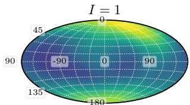

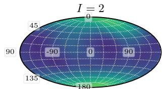

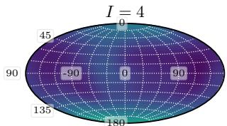

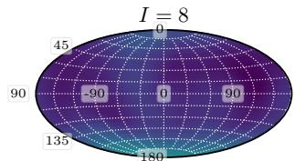

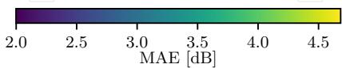  
Fig. 5: Average directional estimation error for acoustic energy $(1\mathrm{kHz},L = 3)$ , depending on the number of incorporated acoustic views. The results show that integrating multiple head orientations improves performance, most notably in the vertical direction.

orientation, during which acoustic conditions remain constant. As these intervals may vary in duration, the encoder $\mathcal{E}(\cdot)$ was designed to accommodate variable-length input.

Beyond these signal-processing considerations, evaluating the practical utility of DDAP estimation requires an understanding of perceptual requirements. At this point, the accuracy of DDAP estimation required for perceptually plausible rendering in AAR systems remains unclear. Ultimately, the perceptual plausibility in interactive, dynamic environments depends on the system's analysis and synthesis components and their interaction. Although spatial perceptual thresholds, such as just-noticeable differences in minimum audible angle, are well studied under controlled and static conditions, the relationship between perceptual plausibility and rendering accuracy in interactive, dynamic environments remains less well understood and warrants further investigation.

# 6. CONCLUSION

We presented a method for blind estimation of DDAPs from reverberant speech recorded with smart glasses. The approach leverages natural head rotations by integrating multiple acoustic views obtained at different head orientations. Its effectiveness was demonstrated through the estimation of two direction-dependent parameters, namely the decay time $\mathrm{T}_{20}$ and energy. An ablation study showed that the proposed method can compensate for the limited spatial resolution imposed by the compact microphone array in smart glasses.

# 7. REFERENCES

[1] Annika Neidhardt, Christian Schneiderwind, and Florian Klein, "Perceptual matching of room acoustics for auditory augmented reality in small rooms - literature review and theoretical framework," Trends in Hearing, vol. 26, pp. 1-22, 2022.   
[2] Sarvesh Agrawal, Adele Simon, Søren Bech, Klaus Bærentsen, and Søren Forchhammer, “Defining immersion: Literature review and implications for research on immersive audiovisual experiences,” Journal Audio Eng. Soc., vol. 68, no. 6, pp. 404–417, 2019.   
[3] Jens Blauert, Spatial Hearing: The psychophysics of human sound localization, MIT press, 1997.   
[4] Stefan Weinzierl and Michael Vorländer, “Room acoustical parameters as predictors of room acoustical impression: What do we know and what would we like to know?” Acoustics Australia, vol. 43, pp. 41–48, 2015.   
[5] Taeyoung Kim, Youngsun Kwon, and Sung-Eui Yoon, "Real-time 3-D mapping with estimating acoustic materials," in 2020 IEEE/SICE International Symposium on System Integration (SII). IEEE, 2020, pp. 646-651.   
[6] Anton Ratnarajah, Sreyan Ghosh, Sonal Kumar, Purva Chiniya, and Dinesh Manocha, "AV-RIR: Audio-visual room impulse response estimation," in Proc. IEEE/CVF Conference on Computer Vision and Pattern Recognition, 2024, pp. 27164-27175.   
[7] Mingfei Chen, Israel D. Gebru, Ishwarya Ananthabhotla, Christian Richardt, Dejan Markovic, Jake Sandakly, Steven Krenn, Todd Keebler, Eli Shlizerman, and Alexander Richard, "Sound-vista: Novel-view ambient sound synthesis via visual-acoustic binding," in Proc. IEEE/CVF Conference on Computer Vision and Pattern Recognition, 2025, pp. 8331-8341.   
[8] Hadam Baek, Hannie Shin, Jiyoung Seo, Chanwoo Kim, Saerom Kim, Hyeongbok Kim, and Sangpil Kim, "AV-Surf: Surface-enhanced geometry-aware novel-view acoustic synthesis," arXiv preprint arXiv:2503.12806, 2025.   
[9] Xiulong Liu, Anurag Kumar, Paul Calamia, Sebastià V. Amengual, Calvin Murdock, Ishwarya Ananthabhotla, Philip Robinson, Eli Shlizerman, Vamsi Krishna Ithapu, and Ruohan Gao, "Hearing anywhere in any environment," in Proc. IEEE/CVF Conference on Computer Vision and Pattern Recognition, 2025, pp. 5732-5741.   
[10] Ricardo Falcon-Perez, Ruohan Gao, Gregor Mueckl, Sebastià V. Amengual Gari, and Ishwarya Ananthabhotla, “Novel view acoustic parameter estimation,” arXiv preprint arXiv:2410.23523, 2024.   
[11] James Eaton, Nikolay D. Gaubitch, Alastair H. Moore, and Patrick A. Naylor, "Estimation of room acoustic parameters: The ACE challenge," IEEE Trans. Audio, Speech, Lang. Process., vol. 24, no. 10, pp. 1681-1693, 2016.   
[12] Hannes Gamper and Ivan J. Tashev, "Blind reverberation time estimation using a convolutional neural network," in Proc. Intl. Workshop Acoust. Signal Enhancement (IWAENC). IEEE, 2018, pp. 136-140.   
[13] Philipp Götz, Cagdas Tuna, Andreas Walther, and Emanuel A.P. Habets, “Online reverberation time and clarity estimation in dynamic acoustic conditions,” The Journal Acoust. Soc. of America, vol. 153, no. 6, pp. 3532–3542, 2023.

[14] Georg Götz, Sebastian J. Schlecht, and Ville Pulkki, "Common-slope modeling of late reverberation," IEEE/ACM Transactions on Audio, Speech, and Language Processing, vol. 31, pp. 3945-3957, 2023.   
[15] Benoit Alary, Analysis and Synthesis of Directional Reverberation, Ph.D. thesis, Aalto University, Helsinki, Finland, 2021.   
[16] Jonas Braasch, Samuel Clapp, Anthony Parks, Torben Pastore, and Ning Xiang, “A binaural model that analyses acoustic spaces and stereophonic reproduction systems by utilizing head rotations,” in The technology of binaural listening, pp. 201–223. Springer, 2013.   
[17] Ning Ma, Tobias May, Hagen Wierstorf, and Guy J. Brown, “A machine-hearing system exploiting head movements for binaural sound localisation in reverberant conditions,” in Proc. IEEE Intl. Conf. on Acoustics, Speech and Signal Processing (ICASSP). IEEE, 2015, pp. 2699–2703.   
[18] Calvin Murdock, Ishwarya Ananthabhotla, Hao Lu, and Vamsi Krishna Ithapu, "Self-motion as supervision for egocentric audiovisual localization," in Proc. IEEE Intl. Conf. on Acoustics, Speech and Signal Processing (ICASSP). IEEE, 2024, pp. 7835-7839.   
[19] Thomas Deppisch, Sebastiá V. Amengual Gari, Paul Calamia, and Jens Ahrens, "Spatial room impulse response estimation from a moving microphone array," Horizon, vol. 21, pp. 22, 2025.   
[20] W. Owen Brimijoin, Alan W. Boyd, and Michael A. Akeroyd, "The contribution of head movement to the externalization and internalization of sounds," PloS one, vol. 8, no. 12, pp. e83068, 2013.   
[21] Ronald H. Hardin and Neil J.A. Sloane, "McLaren's improved snub cube and other new spherical designs in three dimensions," Discrete & Computational Geometry, vol. 15, pp. 429-441, 1996.   
[22] Jérôme Daniel, Jean-Bernard Rault, and Jean-Dominique Polack, “Ambisonics encoding of other audio formats for multiple listening conditions,” in Proc. Audio Eng. Soc. Convention. Audio Engineering Society, 1998.   
[23] Franz Zotter and Matthias Frank, “All-round ambisonic panning and decoding,” Journal Audio Eng. Soc., vol. 60, no. 10, pp. 807–820, 2012.   
[24] Ethan Perez, Florian Strub, Harm De Vries, Vincent Dumoulin, and Aaron Courville, "Film: Visual reasoning with a general conditioning layer," in Proc. AAAI Conference on Artificial Intelligence, 2018, vol. 32.   
[25] Treble Technologies ehf., "Treble acoustics," https://www.treble.tech, 2023.   
[26] Franz Zotter and Matthias Frank, Ambisonics: A practical 3D audio theory for recording, studio production, sound reinforcement, and virtual reality, Springer Nature, 2019.   
[27] Julius Richter, Yi-Chiao Wu, Steven Krenn, Simon Welker, Bunlong Lay, Shinjii Watanabe, Alexander Richard, and Timo Gerkmann, “EARS: An anechoic fullband speech dataset benchmarked for speech enhancement and dereverberation,” in Proc. Interspeech Conf., 2024, pp. 4873–4877.   
[28] Fernando del Solar Dorrego and Michelle C. Vigeant, “A study of the just noticeable difference of early decay time for symphonic halls,” The Journal Acoust. Soc. of America, vol. 151, no. 1, pp. 80–94, 2022.
