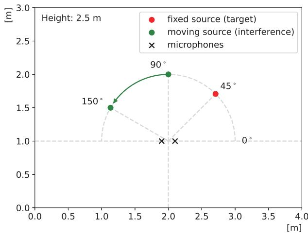
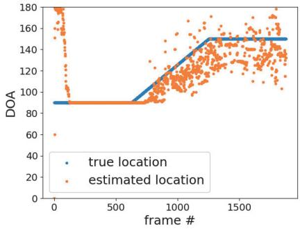
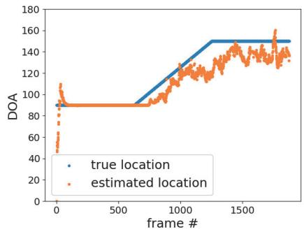
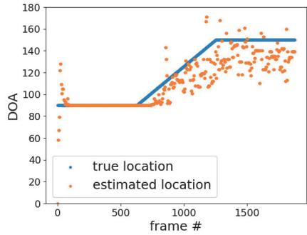
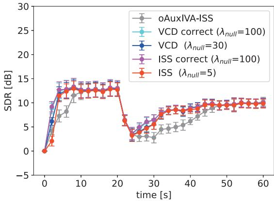

# Accelerating online algorithm using geometrically constrained independent vector analysis with iterative source steering

Kana Goto∗, Tetsuya Ueda†, Li Li‡, Takeshi Yamada∗, and Shoji Makino†∗

University of Tsukuba, Japan

† Waseda University, Japan

‡ NTT Communication Science Laboratories, Nippon Telegraph and Telephone Corporation, Japan

Abstract—In this paper, we derive an alternative online algorithm for geometrically constrained independent vector analysis (GC-IVA) based on iterative source steering (ISS) to tackle realtime directional speech enhancement. The proposed algorithm fully exploits the advantages of the auxiliary function approach, i.e., fast convergence and no stepsize tuning, and ISS, i.e., low computational complexity and numerical stability, making it highly suitable for practical use. In addition, we investigate the performance impact of using estimated spatial information, which is assumed to be known as prior information in GC-IVA. Specifically, we evaluate the proposed algorithm with geometric constraints defined using directions of arrival (DOAs) estimated by the multiple signal classification (MUSIC) method. Experimental results revealed that the proposed online algorithm could work in real-time and achieve comparable speech enhancement performance with the conventional method called online GC-AuxIVA-VCD while significantly reducing execution times in the situation where a fixed target was interfered with by a moving interference.

## I. INTRODUCTION

The presence of diffuse noise and directional interferences can severely decimate the quality of recorded speech and subsequently decrease the performance of speech-targeted applications, which raises the need for speech enhancement techniques. Especially for real-time applications, e.g., hearing-aid devices and teleconference systems, it is necessary to develop real-time speech enhancement systems, where processes for the current frame are finished before the next frame arrives1. Online algorithms [3], [4], [5], [6], [7], [8] extended from batch-processing-based (offline) blind source separation (BSS) [9], [10], [11], [12], [13], [14] and geometrically constrained BSS (GC-BSS) [7], [15] are such methods, where demixing matrices are updated at every new frame arriving. When BSS is applied to speech enhancement, post-processing to select the desired speech is inevitable due to the ambiguity of the channel output order, while GC-BSS [7], [15], [16], [17], [18] combining the optimization problem of BSS with geometric constraints using spatial information allows us to select the desired source simultaneously with the separation.

Online geometrically constrained independent vector analysis (GC-IVA) [7], [8] is one of the online GC-BSS methods which combines IVA [11], [12] and beamforming-based constraints. Comparing with the algorithm [7] using a gradien descent method, the algorithm [8] derived using the auxiliary function approach [19], [13] and vectorwise coordinate descent (VCD) [20] fully exploits the advantage of the auxiliary function approach, namely, fast convergence and no stepsize tuning, making it suitable for practical applications. We hereafter refer to this algorithm as GC-AuxIVA-VCD. Online GC-AuxIVA-VCD has shown to work reasonably well in realtime processing. Despite all these advantages, the update rules of online GC-AuxIVA-VCD require matrix inversion for each source and iteration, which is computationally expensive and numerically unstable. This is a point that should be improved further for the practical use of online GC-AuxIVA-VCD. Another limitation is that directions of arrival (DOAs) of sources are required to be known in advance for conducting accurate geometric constraints, which is nearly impossible in applications due to various reasons.

In this paper, we first derive an alternative online algorithm named online GC-AuxIVA-ISS for GC-IVA by replacing VCD with iterative source steering (ISS) [14] to further reduce computational cost. ISS was originally proposed for AuxIVA [13], then applied to other source separation methods [21], [22]. The key idea of ISS is to update the demixing matrix with a sequence of rank-1 operations, where each operation updates one single demixing filter and does not affect the others, resulting in an inverse-free algorithm with lower computational complexity and can tackle moving sources more efficient [21].

Secondly, we investigate the performance impact using estimated DOAs of interferences. For directional speech enhancement, the desired target is determined by specifying the target direction. Therefore, an algorithm using only the target DOA is desirable. However, it has been experimentally shown that properly constraining output channels using DOAs of interferences as additional cues can improve enhancement performance [8], [22]. In [8], a heuristic approach has been adopted to estimate interference DOAs, where DOAs of all sources are first estimated by calculating the power in the lowfrequency band of beam pattern obtained by another AuxIVA separation system. Then interference DOAs are defined as those far away from the given target DOA. This method is straightforward, but performance is highly dependent on the frequency range over which pattern power is calculated. Furthermore, it is unclear how to merge the results calculated by using different beam patterns in different channels when the number of sources increases. In this paper, we propose using the multiple signal classification (MUSIC) method [23] to estimate interference DOAs. The speech enhancement performance of the proposed online GC-AuxIVA-ISS with MUSIC method is evaluated in a situation where a fixed target source is interfered with by a spatially moving interference.

## II. BASELINE METHODS

## A. Offline GC-AuxIVA-VCD

Let us consider a determined situation where J sources are observed by I microphones. Here, $I = J . \operatorname { L e t } x _ { i f n }$ and $y _ { j f n }$ denote the short-time Fourier transform (STFT) coefficients of the signal observed at the ith microphone and that output at the jth channel, respectively. Here, $f = 1 , \ldots , F$ and $n = 1 , \ldots , N$ are the indices of the frequency and frame, respectively. We denote the frequency-wise vector representation of the observed and the estimated sources by

$$
\boldsymbol {x} _ {f n} = \left[ x _ {1 f n}, \dots , x _ {I f n} \right] ^ {\mathsf {T}} \in \mathbb {C} ^ {I},\tag{1}
$$

$$
\boldsymbol {y} _ {f n} = [ y _ {1 f n}, \dots , y _ {J f n} ] ^ {\mathsf {T}} \in \mathbb {C} ^ {J},\tag{2}
$$

where $( \cdot ) ^ { \intercal }$ denotes the transpose. When considering a timeinvariant instantaneous mixture model, where the STFT window length is sufficiently longer than the impulse responses between sources and microphones, the relationship between the observed and estimated sources can be expressed as

$$
\boldsymbol {y} _ {f n} = \boldsymbol {W} _ {f} \boldsymbol {x} _ {f n}.\tag{3}
$$

Here, $W _ { f } = [ \pmb { w } _ { 1 f } , \dotsc , \pmb { w } _ { J f } ] ^ { \mathsf { H } }$ is an $I \times I$ demixing matrix containing demixing filters $\pmb { w } _ { j f } = [ w _ { 1 j f } , \dots , w _ { I j f } ] ^ { \top }$ and $( \cdot ) ^ { \mathsf { H } }$ denotes the Hermitian transpose.

IVA [11], [12] assumes that each frame of source follows a multivariate distribution, and thus dependencies over frequency components can be exploited to solve frequency-domain permutation alignment simultaneously with frequency-wise source separation. The demixing matrices $\mathcal { W } ~ = ~ \{ W _ { f } \} _ { f }$ are estimated by minimizing the following negative log-likelihood function:

$$
\mathcal {L} _ {\mathrm{IVA}} (\mathcal {W}) = \sum_ {j = 1} ^ {J} \mathbb {E} [ G (\boldsymbol {y} _ {j n}) ] - \sum_ {f = 1} ^ {F} \log | \det \boldsymbol {W} _ {f} |,\tag{4}
$$

where E[ ] denotes the expectation operator over frames and $\pmb { y } _ { j n } = [ \overleftarrow { y _ { j 1 n } } , \cdot \cdot \cdot , y _ { j F n } ] ^ { \mathsf { T } } \in \mathbb { C } ^ { F }$ is the source-wise vector representation. Here, $G ( \pmb { y } _ { j n } )$ is the contrast function having the relationship $G ( \pmb { y } _ { j n } ) = - \log p ( \pmb { y } _ { j n } )$ , where $p ( \pmb { y } _ { j n } )$ represents a multivariate probability density function of the jth source at nth frame. One typical choice of the contrast function is to use a spherical contract function [11], [12], [13], which is expressed as

$$
\begin{array}{l} G (\boldsymbol {y} _ {j n}) = G _ {R} (r _ {j n}), \\ r _ {j n} = | | \boldsymbol {y} _ {j n} | | _ {2} = \sqrt {\sum_ {f} | \boldsymbol {y} _ {j f n} | ^ {2}} = \sqrt {\sum_ {f} | \boldsymbol {w} _ {j f} ^ {\mathsf {H}} \boldsymbol {x} _ {f n} | ^ {2}}. \end{array}\tag{5}
$$

(6)

Here, $G _ { R } ( r )$ is a function of a real-valued scalar variable r and $| | \cdot | | _ { 2 }$ denotes the $L _ { 2 }$ norm of a vector. By adopting the auxiliary function approach [19], [13], an upper bound is optimized instead of the original objective function, which is expressed as

$$
\begin{array}{l} \mathcal {L} _ {\mathrm{IVA}} (\mathcal {W}) \leq \mathcal {L} _ {\mathrm{AuxIVA}} (\Sigma , \mathcal {W}) \\ = \frac {1}{2} \sum_ {f = 1} ^ {F} \sum_ {j = 1} ^ {J} \boldsymbol {w} _ {j f} ^ {\mathrm{H}} \boldsymbol {\Sigma} _ {j f} \boldsymbol {w} _ {j f} - \sum_ {f = 1} ^ {F} \log | \det \boldsymbol {W} _ {f} |. \end{array}\tag{7}
$$

Here, $\Sigma = \{ \Sigma _ { j f } \} _ { j f }$ denotes a set of weighted covarivance $\Sigma _ { j f }$ given as

$$
\pmb {\Sigma} _ {j f} = \sum_ {n} \varphi (r _ {j n}) \pmb {x} _ {f n} \pmb {x} _ {f n} ^ {\mathsf {H}},\tag{8}
$$

where $\varphi ( r _ { j n } ) = G _ { R } ^ { ' } ( r _ { j n } ) / r _ { j n }$ and $( \cdot ) ^ { \prime }$ denotes the derivative operator.

Now, let us consider geometric constraints [15] that restrict the far-field response of filters estimated by IVA in a set of directions Θ, which is described as

$$
\mathcal {L} _ {\mathrm{GC}} (\mathcal {W}) = \sum_ {f = 1} ^ {F} \sum_ {j = 1} ^ {J} \sum_ {\theta \in \Theta} \lambda_ {j \theta} | \boldsymbol {w} _ {j f} ^ {\mathsf {H}} \boldsymbol {d} _ {f \theta} - c _ {j \theta} | ^ {2}.\tag{9}
$$

Here, Θ denotes a set including all directions to be considered, $d _ { f \theta }$ is the steering vector pointing to the direction $\theta , c _ { j \theta }$ is a nonnegative value set for all frequency bins as constraints, and $\lambda _ { j \theta } \geq 0$ is a parameter that weighs the importance of the constraint. Note that (9) with $c _ { j \theta } = 1$ forces the spatial filter to form a conventional delay-and-sum beamformer steering in the direction θ to preserve the target source whereas a small value of $c _ { j \theta }$ essentially creates a spatial null towards the direction θ so that multiple constraints of spatial nulls towards the directions of all interferences can be used to suppress all interferences and preserve the target. Note that no auxiliary function is required since these geometric constraints are linear and can be easily optimized.

Therefore, the auxiliary function for GC-AuxIVA-VCD, a.k.a., the objective function to be minimized, is given as

$$
\mathcal {L} (\Sigma , \mathcal {W}) = \mathcal {L} _ {\text { AuxIVA }} (\Sigma , \mathcal {W}) + \mathcal {L} _ {\text { GC }} (\mathcal {W}).\tag{10}
$$

The update rule for Σ is obtained straightforwardly by substituting (6) into (8) and those for  are derived by embracing the idea adopted in VCD [20], which are summarized as

follows:

$$
\boldsymbol {u} _ {j f} = \boldsymbol {D} _ {j f} ^ {- 1} \boldsymbol {W} _ {f} ^ {- 1} \boldsymbol {e} _ {j},\tag{11}
$$

$$
\hat {\boldsymbol {u}} _ {j f} = \boldsymbol {D} _ {j f} ^ {- 1} \sum_ {\theta \in \Theta} \lambda_ {j \theta} c _ {j \theta} \boldsymbol {d} _ {f \theta},\tag{12}
$$

$$
h _ {j f} = \boldsymbol {u} _ {j f} ^ {\mathsf {H}} \boldsymbol {D} _ {j f} \boldsymbol {u} _ {j f},\tag{13}
$$

$$
\hat {h} _ {j f} = \boldsymbol {u} _ {j f} ^ {\mathsf {H}} \boldsymbol {D} _ {j f} \hat {\boldsymbol {u}} _ {j f},\tag{14}
$$

$$
\boldsymbol {w} _ {j f} = \left\{ \begin{array}{l} \frac {1}{\sqrt {h _ {j f}}} \boldsymbol {u} _ {j f} + \hat {\boldsymbol {u}} _ {j f} (\text {   if   } \hat {h} _ {j f} = 0), \\ \frac {\hat {h} _ {j f}}{2 h _ {j f}} \Big [ - 1 + \sqrt {1 + \frac {4 h _ {j f}}{| \hat {h} _ {j f} | ^ {2}}} \Big ] \boldsymbol {u} _ {j f} + \hat {\boldsymbol {u}} _ {j f} (\text {   o.w. }). \end{array} \right.\tag{15}
$$

Here, $\begin{array} { r } { D _ { j f } \ = \ \pmb { \Sigma } _ { j f } + \sum _ { \theta \in \Theta } \lambda _ { j \theta } \pmb { d } _ { f \theta } \pmb { d } _ { f \theta } ^ { \mathsf { H } } } \end{array}$ and $e _ { j }$ is the jth column of an $I \times I$ identity matrix.

## B. Online GC-AuxIVA-VCD

In offline GC-AuxIVA-VCD, $\Sigma _ { j f }$ is calculated using all the observed samples over time $n = 1 , \ldots N$ . However, in the case of online processing, only the observed signals up to the present time are available. By autoregressively calculating covariance at each frame using the previously calculated one [5], the covariance $\Sigma _ { j f n }$ at each frame n is expressed as

$$
\pmb {\Sigma} _ {j f n} = \alpha \pmb {\Sigma} _ {j f (n - 1)} + (1 - \alpha) \varphi (r _ {j n}) \pmb {x} _ {f n} \pmb {x} _ {f n} ^ {\mathsf {H}}.\tag{16}
$$

Here, $0 \leq \alpha < 1$ denotes a forgetting factor controlling how much statistics of past signals is considered. $r _ { j n }$ is calculated by (6) using time-varying demixing filter ${ \pmb w } _ { j f n }$ , which is initialized at each frame by the estimated one at previous frame. Since $\Sigma _ { j f n }$ is the only parameter that require all the observed signal, we can then simply obtain the update rules for the online GC-AuxIVA-VCD by replacing $\Sigma _ { j f }$ in offline GC-AuxIVA-VCD with its online version $\Sigma _ { j f n } ,$ namely, using (16) instead of (8) [8].

## III. PROPOSED METHOD

Online GC-AuxIVA-VCD is a suitable method for applications thanks to its valuable properties, including no requirement for stepsize tuning and postprocessing and fast convergence. However, there remains room for improvement toward practical application, such as further reduction of computational complexity by eliminating matrix inversion in the algorithm and relaxation of utilization restrictions by exploring appropriate approaches to estimate interference DOAs.

## A. Online GC-AuxIVA-ISS

As (11) shows, either offline or online GC-AuxIVA-VCD requires the matrix inversion for each frequency, source, and iteration, which is typically considered to be computationally expensive and numerically unstable, and therefore should be avoided in practice. In this subsection, we derive an alternative algorithm for online GC-AuxIVA by replacing VCD with the recently proposed ISS method, resulting in an inverse-free algorithm and subsequently addressing the above drawbacks.

Instead of updating each row of the demixing matrix $W _ { f }$ alternately, ISS performs a rank-1 update for the whole demixing matrix as

$$
\pmb {W} _ {f n} \leftarrow \pmb {W} _ {f n} - \pmb {v} _ {j f n} \pmb {w} _ {j f n} ^ {\mathsf {H}},\tag{17}
$$

for $j = 1 , \dots , I$ . Here, $\pmb { v } _ { j f n } = [ v _ { 1 j f n } , \dotsc , v _ { I j f n } ] ^ { \mathsf { T } } \in \mathbb { C } ^ { I }$ is a vector to be estimated instead of the demixing matrix.

Substituting (17) into the objective function of online GC-AuxIVA-VCD, i.e., (10) with time-varying demixing filters ${ \pmb w } _ { j f n }$ and looking directions $\Theta _ { n }$ , we have

$$
\mathcal {L} (\boldsymbol {v} _ {j f n}) = \sum_ {f = 1} ^ {F} \left\{- \log | \det (\boldsymbol {W} _ {f n} - \boldsymbol {v} _ {j f n} \boldsymbol {w} _ {j f n} ^ {\mathsf {H}}) | \right.
$$

$$
+ \frac {1}{2} \sum_ {i = 1} ^ {I} (\boldsymbol {w} _ {i f n} - v _ {i j f n} ^ {*} \boldsymbol {w} _ {j f n}) ^ {\mathsf {H}} \boldsymbol {\Sigma} _ {j f n} (\boldsymbol {w} _ {i f n} - v _ {i j f n} ^ {*} \boldsymbol {w} _ {j f n})
$$

$$
\left. + \sum_ {\theta \in \Theta_ {n}} \lambda_ {i \theta} | (\boldsymbol {w} _ {i f n} - v _ {i j f n} ^ {*} \boldsymbol {w} _ {j f n}) ^ {\mathsf {H}} \boldsymbol {d} _ {f \theta} - c _ {i \theta} | ^ {2} \right\},\tag{18}
$$

which is the new objective function to be minimized. By solving $\partial \mathcal { L } ( v _ { j f n } ) / \partial v _ { i j f n } ^ { * } = 0$ , we obtain following update rules:

$$
v _ {i j f n} = \frac {\boldsymbol {w} _ {i f n} \boldsymbol {\Sigma} _ {i f n} \boldsymbol {w} _ {j f n} ^ {\mathsf {H}} + 2 \sum_ {\theta \in \Theta_ {n}} \lambda_ {i \theta} g _ {j f \theta n} ^ {*} (g _ {i f \theta n} - c _ {i \theta})}{\boldsymbol {w} _ {j f n} \boldsymbol {\Sigma} _ {i f n} \boldsymbol {w} _ {j f n} ^ {\mathsf {H}} + 2 \sum_ {\theta \in \Theta_ {n}} \lambda_ {i \theta} | g _ {j f \theta n} | ^ {2}}\tag{19}
$$

$$
v _ {j j f n} = \left\{ \begin{array}{l l} 1 - p _ {j f n} ^ {- 1 / 2} (q _ {j f n} = 0), \\ 1 - q _ {j f n} ^ {*} \frac {| q _ {j f n} | + \sqrt {| q _ {j f n} | ^ {2} + p _ {j f n}}}{p _ {j f n} | q _ {j f n} |} (\mathrm{o.w.}), \end{array} \right.\tag{20}
$$

where,

$$
g _ {j f \theta n} = \pmb {w} _ {j f n} ^ {\mathsf {H}} \pmb {d} _ {f \theta},\tag{21}
$$

$$
p _ {j f n} = \boldsymbol {w} _ {j f n} \boldsymbol {\Sigma} _ {j f n} \boldsymbol {w} _ {j f n} ^ {\mathsf {H}} + 2 \sum_ {\theta \in \Theta_ {n}} \lambda_ {j \theta} | g _ {j f \theta n} | ^ {2},\tag{22}
$$

$$
q _ {j f n} = \sum_ {\theta \in \Theta_ {n}} \lambda_ {j \theta} c _ {j \theta} g _ {j f \theta n}.\tag{23}
$$

Note that $\Theta _ { n }$ can be either time-varying or time-invariant, with the former allowing adaptation of geometric constraints along the estimated DOAs and the latter allowing more manual control.

## B. Related work

With the same motivation to reduce computational complexity and stabilize numerical calculations, we have recently proposed offline GC-AuxIVA-ISS [22] by replacing VCD with ISS and confirmed that offline GC-AuxIVA-ISS could achieve comparable speech enhancement performance with GC-AuxIVA-VCD while reducing execution time by approximately 35% to 50%. The proposed online GC-AuxIVA-ISS is an extension from this offline version.

Meanwhile, an extension from offline AuxIVA with ISS to an online algorithm has already been performed [6]. Different from the iterative projection (IP) method used in the original AuxIVA [13], where each row of the demixing matrix is updated using all information contained in the previous demixing matrix, AuxIVA with ISS updates the demixing filter in a manner equivalent to updating each steering vector in the mixing system. This allows the algorithm to update only the demixing filters that have changed after convergence and leave the other unchanged filters intact, saving computational resources when tackling moving sources [6]. Note that the proposed method can be considered as an extension of online AuxIVA using ISS that incorporates geometric constraints to restrict the demixing filters.

## C. DOA estimation with MUSIC

In this subsection, we describe how to obtain interference DOAs with a well-known DOA estimation method called MUSIC [23] for conducting geometric constraints.

MUSIC is a subspace-based method that decomposes the covariance matrix of the observed multichannel signals to obtain subspaces of signals and noise that are orthogona to each other. Note that MUSIC assumes the number of microphones I larger than that of sources J. Using the noise subspace, a spatial spectrum $P _ { f \theta }$ for the direction θ is defined as

$$
P _ {f \theta} = \frac {1}{\sum_ {i = J + 1} ^ {I} \left| \boldsymbol {d} _ {f \theta} ^ {\mathsf {H}} \boldsymbol {u} _ {i f} \right| ^ {2}},\tag{24}
$$

where ${ \pmb u } _ { i f } \ ( i = J + 1 , \dots , I )$ denotes the eigenvector with the last $I - J$ minima and satisfying

$$
\boldsymbol {R} _ {f} \boldsymbol {u} _ {i f} = \mu_ {i f} \boldsymbol {u} _ {i f}.\tag{25}
$$

Here, ${ R _ { f } } ~ = ~ \mathbb { E } [ { \pmb x } _ { f n } { \pmb x } _ { f n } ^ { \sf H } ]$ is the covariance of the observed signals and $\mu _ { i f }$ denotes the eigenvalue corresponding to the eigenvector ${ \pmb u } _ { i f }$ . Since the signal and noise subspaces are orthogonal, the spatial spectrum $P _ { f n }$ is maximized when there is a signal source in the direction θ.

To apply the MUSIC method to obtain interference DOAs, we perform the projection back technique [24] to each temporarily estimated interference signals $y _ { j f n }$ to generate multichannel input, which is expressed as

$$
\tilde {\pmb {y}} _ {j f n} = \pmb {W} _ {f} ^ {- 1} \pmb {e} _ {j} y _ {j f n}.\tag{26}
$$

Here, $\tilde { { y } } _ { j f n }$ denotes source images vector of jth signal in the microphone array, which is the input of the MUSIC algorithm. For the first frame in which no temporarily estimated signal is available, we perform projection back for each observed signal ${ \pmb x } _ { j { f n } }$ to generate a source image $\tilde { \mathbf { x } } _ { j f n } ,$ and apply the MUSIC algorithm to all these source images to obtain I DOAs. The DOAs except the one closest to the given target DOA is selected as the interference DOAs.

We investigate three ways to obtain interference DOAs: “MUSIC normal”, “MUSIC smooth”, and “MUSIC block”. “MUSIC normal” directly uses the estimated DOAs in each frame for geometric constraints, while “MUSIC smooth” uses the estimated DOAs after moving average over the last few frames. “MUSIC block” indicates the way that perform DOA estimation in a blockwise manner.

  
Fig. 1: Layout of sound sources and microphones.

## IV. EXPERIMENTAL EVALUATIONS

To evaluate the effectiveness of online GC-AuxIVA-ISS, we conducted speech enhancement experiment and compared it with online GC-AuxIVA-VCD (oGC-AuxIVA-VCD) [8] and online AuxIVA-ISS (oAuxIVA-ISS) [5] in terms of enhancement performance and runtime.

## A. Setup

We used speech signals of 6 speakers (3 males and 3 females) extracted from the ATR Japanese Speech Database [25]. By randomly selecting 2 speakers from the database, we generated 20 mixture signals with length of 60 seconds for each. We used the signal generator2 to simulate room impulse responses (RIRs), and the layout of sound sources and microphones is shown in Fig. 1. The target speaker was fixed for all 60 seconds and the interference speaker was fixed at $9 0 ^ { \circ }$ for the first 20 seconds, moved on an arc from $9 0 ^ { \circ }$ to 150◦ for the next 20 seconds, and finally fixed at 150◦ for the last 20 seconds. We used 2 microphones with the interva at 2 cm. The reverberation time $( R T _ { 6 0 } )$ was set at 200 ms. All the speech signals were sampled at 16 kHz. The STFT was computed using a Hanning window, whose length and shift were set at 1024 samples (64 ms) and 512 samples (32 ms), respectively. We initialized $\Sigma _ { j f 0 }$ and $W _ { f 0 }$ as identity matrices and set the forgetting parameter α at 0 99 for each method.

For oGC-AuxIVA-VCD and oGC-AuxIVA-ISS, we employed null constraints using the estimated interference DOAs and set $c _ { j \theta } = 0$ and the target DOA given at $4 5 ^ { \circ }$ . Here, We denote $\lambda _ { j \theta }$ as $\lambda _ { \mathrm { n u l l } } > 0$ . We investigated several values of $\lambda _ { \mathrm { n u l l } }$ and chose the optimal one experimentally. For DOA estimation, spatial spectrum was calculated for each frequency bins ranging from 500Hz to 4,000Hz and the peak was detected using spatial spectrum averaged over these frequency bins3. The moving average and blockwise eatimation were performed for five frames. The distance the source moved during the five frames was approximately 0 4◦ (0.7 cm), which could be considered as stationary. We also given the “Correct” DOAs to demonstrate the upper bound performance.

TABLE I: Average SDR and SIR [dB] by each DOA estimation approach with oGC-AuxIVA-ISS. Bold font shows top scores.

<table><tr><td>DOA estimation approach</td><td>SDR [dB]</td><td>SIR [dB]</td></tr><tr><td>MUSIC normal</td><td>7.45</td><td>13.67</td></tr><tr><td>MUSIC smooth</td><td>8.33</td><td>14.34</td></tr><tr><td>MUSIC block</td><td>7.59</td><td>13.74</td></tr></table>

The enhancement performance was evaluated using the source-to-distortions ratio (SDR) and source-to-interferences ratio (SIR) [26].

## B. Results

First, we investigated the optimal way to obtain the estimated DOAs. Table I shows the average SDRs and SIRs [dB] by each DOA estimation approach with oGC-AuxIVA-ISS. “MUSIC smooth” outperformed “MUSIC normal” and “MUSIC block” by more than 0.7 dB for SDR and 0.6 dB for SIR. We considered this result was caused by the DOA estimation accuracy. From Fig. 2, we found that “MUSIC normal” and “MUSIC block” had a larger variation in the estimated DOA at each frame compared to “MUSIC smooth”, which could decrease the enhancement performance.

Next, we compared the proposed method to the conventional methods. We used “MUSIC smooth” for DOA estimation, which was most effective in the experiment described above. Fig. 3 shows the average SDRs of the fixed target source enhanced by each online method in every 2 second period without overlap, which demonstrate the variation in scores over time. The proposed oGC-AuxIVA-ISS showed almost the equivalent SDR scores to oGC-AuxIVA-VCD. Although the SDR decreased significantly immediately after the interference speaker moved, the scores were improved faster by oGC-AuxIVA-VCD and oGC-AuxIVA-ISS with geometric constraints than blind oAuxIVA-ISS. In oGC-AuxIVA-ISS and oGC-AuxIVA-VCD, the performance of methods using DOAs estimated with “MUSIC smooth” was close to that with correct DOAs. All these results indicated that the proposed system using MUSIC was effective for speech enhancement tasks involving moving sound sources. Both oGC-AuxIVA-VCD and oGC-AuxIVA-ISS methods did not cause output order errors if the value of $\lambda _ { \mathrm { n u l l } }$ was appropriate.

Table II shows the runtime of separating 60 seconds of observed signals. oGC-AuxIVA-ISS reduced execution time by approximately 75% for “Correct”, 25% for “MUSIC normal” and “MUSIC smooth”, and 55% for “MUSIC block”.

Since the time required for DOA estimation was the same for both separation methods, the execution time reductions were larger for “Correct”, “block”, and “normal” or “smooth”, which require fewer DOA estimations, in that order.

## V. CONCLUSIONS

In this paper, we proposed an online speech enhancement algorithm, which is an extension of the offline version of GC-AuxIVA-ISS. GC-AuxIVA-ISS combines IVA with a set of linear constraints that limit the far-field responses of the demixing filters, whose update rules are derived based on the auxiliary function approach and ISS. Thanks to ISS, online GC-AuxIVA-ISS not only has all the advantages of online GC-AuxIVA-VCD, but also avoided the problem of it, which requires inverse matrix operations and is computational expensive. We investigated the proposed online algorithm and compared it with online AuxIVA-ISS and online GC-AuxIVA-VCD using DOA estimation. The experimental results revealed that the proposed method achieved comparable speech enhancement performance with online GC-AuxIVA-VCD in real-time and outperformed in terms of runtime.

## ACKNOWLEDGEMENTS

This work was supported by JSPS KAKENHI Grant Number 19H04131.

## REFERENCES

[1] A. Koutvas, E. Dermatas, and G. Kokkinakis, “Blind speech separation of moving speakers in real reverberant environments,” in Proc. ICASSP, 2000, pp. 1133–II1136.

[2] R. Mukai, H. Sawada, S. Araki, and S. Makino, “Blind source separation for moving speech signals using blockwise ICA and residual crosstalk subtraction,” IEICE Trans. Fundamentals, 2004.

[3] B. Sallberg, N. Grbic, and I. Claesson, “Complex-valued independent component analysis for online blind speech extraction,” IEEE Trans. ASLP, vol. 16, no. 8, pp. 1624–1632, 2008.

[4] T. Kim, “Real-time independent vector analysis for convolutive blind source separation,” IEEE Trans. Circuits Syst. 1, vol. 57, no. 7, pp. 1431–1438, 2010.

[5] T. Taniguchi, N. Ono, A. Kawamura, and S. Sagayama, “An auxiliaryfunction approach to online independent vector analysis for real-time blind source separation,” in Proc. HSCMA, 2014, pp. 107–111.

[6] T. Nakashima and N. Ono, ““ inverse-free online independent vector analysis with flexible iterative source steering (accepted),” in Proc. APSIPA.

[7] A. H. Khan, M. Taseska, and E. A. P. Habets, “A geometrically constrained independent vector analysis algorithm for online source extraction,” in Proc. LVA/ICA, 2015, pp. 396–403.

[8] L. Li, K. Koishida, and S. makino, “Online directional speech enhance ment using geometrically constrained independent vector analysis,” in Proc. Interspeech, 2020, pp. 61–65.

[9] E. Bingham and A. Hyvarinen, “A fast fixed-point algorithm for¨ independent component analysis of complex valued signals,” Int. J. Neural Syst., vol. 10, pp. 1–8, 2000.

[10] A.Hyvarinen and E. Oja, “Independent component analysis: algorithms¨ and applications,” Neural networks, vol. 13, no. 4-5, pp. 411–430, 2000.

[11] T. Kim, T. Eltoft, and T.-W. Lee, “Independent vector analysis: An extension of ICA to multivariate components,” in Proc. ICA, 2006, pp. 165–172.

[12] A. Hiroe, “Solution of permutation problem in frequency domain ICA using multivariate probability density functions,” in Proc. ICA, 2006, pp. 601–608.

[13] N. Ono, “Stable and fast update rules for independent vector analysis based on auxiliary function technique,” in Proc. WASPAA, 2011, pp. 189–192.

  
(a) normal (oGC-AuxIVA-ISS)

  
(b) smooth (oGC-AuxIVA-ISS)

  
(c) block (oGC-AuxIVA-ISS)  
Fig. 2: DOA of the moving source estimated by MUSIC. Blue lines represent the correct DOA.

  
Fig. 3: Average SDR of the target source (fixed) enhanced by each method in every 2 s. Error bar denotes the 1.96 standard error in each time. VCD and ISS in the legend denote oGC-AuxIVA-VCD and oGC-AuxIVA-ISS (proposed), respectively. $\lambda _ { \mathrm { n u l l } }$ denotes the weight of the geometric constraint. For oGC-AuxIVA-VCD and oGC-AuxIVA-ISS, the accuracy of output signal order were 100%.

[14] R. Scheibler and N. Ono, “Fast independent vector extraction by iterative SINR maximization,” in Proc. ICASSP, 2020, pp. 601–605.

[15] L. Li and K. Koishida, “Geometrically constrained independent vector analysis for directional speech enhancement,” in Proc. ICASSP, 2020, pp. 846–850.

[16] L. C. Parra and C. V. Alvino, “Geometric source separation: Merging convolutive source separation with geometric beamforming,” IEEE Trans. SAP, vol. 10, no. 6, pp. 352–362, 2002.

[17] H. Saruwatari, T. Kawamura, T. Nishikawa, A. Lee, and K. Shikano, “Blind source separation based on a fast-convergence algorithm com bining ICA and beamforming,” IEEE Trans. ASLP, vol. 14, no. 2, pp. 666–678, 2006.

[18] A. Brendel, T. Haubner, and W. Kellermann, “A unified probabilistic view on spatially informed source separation and extraction based on independent vector analysis,” IEEE Trans. Signal Processing, vol. 68, 2020.

[19] D. R Hunter and K. Lange, “A tutorial on MM algorithms,” The American Statistician, vol. 58, no. 1, pp. 30–37, 2004.

[20] Y. Mitsui, N. Takamune, D. Kitamura, H. Saruwatari, Y. Takahashi, and K. Kondo, “Vectorwise coordinate descent algorithm for spatially regularized independent low-rank matrix analysis,” in Proc. ICASSP, 2018, pp. 746–750.

TABLE II: Average runtime for 60 second signals [s].

<table><tr><td>DOA estimation approach</td><td>oGC-AuxIVA-VCD [15]</td><td>oGC-AuxIVA-ISS (proposed)</td></tr><tr><td>Correct</td><td>25.25</td><td>6.24</td></tr><tr><td>MUSIC normal</td><td>75.32</td><td>56.04</td></tr><tr><td>MUSIC smooth</td><td>73.96</td><td>55.99</td></tr><tr><td>MUSIC block</td><td>35.58</td><td>16.16</td></tr></table>

[21] T. Nakashima, R. Scheibler, M. Togami, and N. Ono, “Joint derever beration and separation with iterative source steering,” Proc. ICASSP, pp. 216–220, 2021.

[22] K. Goto, T. Ueda, L. Li, T. Yamada, and S. Makino, “Geometrically constrained independent vector analysis with auxiliary function approach and iterative source steering,” in Proc. EUSIPCO.

[23] R. Schmidt, “Multiple emitter location and signal parameter estima tion,” IEEE Trans. Antennas Propag., vol. 34, no. 3, pp. 276–280, 1986.

[24] N. Murata, S. Ikeda, and A. Ziehe, “An approach to blind source sepa ration based on temporal structure of speech signals,” Neurocomputing, vol. 41, no. 1-4, pp. 1–24, 2001.

[25] A. Kurematsu, K. Takeda, Y. Sagisaka, S. Katagiri, H. Kuwabara, and K. Shikano, “ATR Japanese speech database as a tool of speech recognition and synthesis,” Speech communication, vol. 9, no. 4, pp. 357–363, 1990.

[26] E. Vincent, R. Gribonval, and C. Fevotte, “Performance measurement´ in blind audio source separation,” IEEE/ACM Trans. ASLP, vol. 14, no. 4, pp. 1462–1469, 2006.