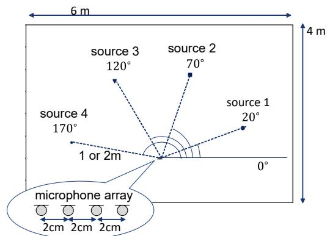
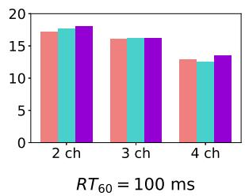
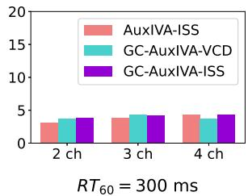
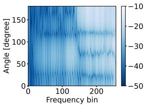
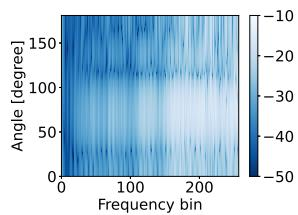

# Geometrically Constrained Independent Vector Analysis with Auxiliary Function Approach and Iterative Source Steering

Kana Goto∗, Tetsuya Ueda∗, Li Li†, Takeshi Yamada∗, Shoji Makino‡

∗University of Tsukuba, 1-1-1 Tennodai, Tsukuba, Ibaraki 305-8577, Japan

†NTT Communication Science Laboratories, Nippon Telegraph and Telephone Corporation, Japan ‡Waseda University, Japan

Email: k.goto@mmlab.cs.tsukuba.ac.jp, t.ueda@mmlab.cs.tsukuba.ac.jp, lili-0805@ieee.org, takeshi@cs.tsukuba.ac.jp, s.makino@waseda.jp

Abstract—In this paper, we propose an alternative algorithm, which is faster and more stable, for geometrically constrained independent vector analysis (GC-IVA) to tackle multichannel speech separation problem. GC-IVA is a method that combines IVA, a blind source separation method, with beamforming-based geometrical constraints, which are defined using the spatial information of the sources, so that it allows us to achieve high separation performance while able to obtain the target speech at the desired output channel. GC-IVA with auxiliary-function approach and vectorwise coordinate descent (GCAV-IVA) is one such method, which has the advantage that no step-size tuning is required, the objective function monotonically decreases, and the algorithm converges fast. However, this method requires matrix inversion, which is computationally expensive and adversely affects numerical stability. To address this problem, we propose an algorithm by using the recently introduced iterative source steering (ISS), which uses a sequence of rank-1 update. ISS does not require matrix inversion and achieves a lower computational complexity per iteration of quadratic in the number of microphones, resulting in the proposed method being faster and more stable than GCAV-IVA. The experimental results revealed that the proposed method had higher source separation performance and shorter execution time than conventional methods.

Index Terms—Multichannel blind source separation, independent vector analysis, geometric constraints, auxiliary function approach, iterative source steering

## I. INTRODUCTION

When capturing speeches using a distant microphone, diffuse noise and directional interferences are mixed during recording and they can significantly degrade the performances of many speech processing applications. Blind Source Separation (BSS) methods separate such observed mixtures to provide access to the individual sources of the mixture [1]–[5]. BSS algorithms, including a variety of independent component analysis (ICA) methods, estimate source signals using only the observed signals based on the assumption that source signals are statistically independent with each other.

When BSS is applied to extract specific sources from the observed mixture signal, post-processing is usually required to select the desired sources using additional cues, such as speaker information or spatial information. However, it is preferable to solve source selection jointly with source separation since the clues used for desired source selection can also be helpful for source separation. Geometrically constrained BSS (GC-BSS) [6]–[11] is one of such methods that exploits spatial information to guide the demixing matrices to obtain a signal from a desired direction. Since GC-BSS usually separates signals using a spatial null, which is estimated on the basis of the statistical independence of source signals, it can work with a small number of microphones without any training samples. Geometrically constrained independent vector analysis (GC-IVA) [6], [9], [10] is one of the GC-BSS method, which combines the optimization problem of IVA [2], [3] with beamforming-based geometric constraints derived from a prior spatial information of source signals and the sensor geometry. Many algorithms have been proposed for solving the optimization problem of GC-IVA, including gradient descent method [6]. Among them, GC-IVA with auxiliaryfunction approach and vectorwise coordinate descent (GCAV-IVA) [10], [11] adopts auxiliary function approach [12] and vectorwise coordinate descent algorithm (VCD) [13], resulting in an algorithm noteworthy in high performance, fast convergence, and no requirement of step-size parameter tuning. These characteristics make GCAV-IVA suitable for practical applications. Furthermore, owing to the well-designed geometric constraints, GCAV-IVA can reduce the negative impact of block permutation between the low- and high-frequency bands in the auxiliary function-based IVA (AuxIVA) [4], [5], and subsequently improve speech separation performance.

Despite all their advantages, the update rules of GCAV-IVA require matrix inversion, which is computational consuming. In addition, the matrix inversion is desired to be avoided since it makes numerical computation unstable. Recently, iterative source steering (ISS) has been introduced for AuxIVA to overcome similar disadvantages [14], which updates the whole demixing matrix with a rank-1 update. This leads to an inversefree algorithm and reduces the computational complexity. AuxIVA with ISS has been demonstrated to achieve comparable separation performance with the original AuxIVA while significantly reducing computational time when the number of microphones increases.

Towards practical applications, in this paper, we derive an algorithm for GCAV-IVA based on ISS to stabilize the numerical computation and reduce computational cost, which we call “GC-AuxIVA-ISS”. It preserves the advantages of fast convergence and non-requirement of pre-training and stepsize parameter tuning. Experimental results show that the separation performance of the proposed GC-AuxIVA-ISS is stable and it can perform separation faster than conventional methods.

## II. BASELINE METHOD: GC-IVA WITH AUXILIARYFUNCTION APPROACH AND VCD

Let us consider a determined situation where J sources are observed by I microphones. Let $x _ { i f n }$ and $y _ { j f n }$ denote the short-time Fourier transform (STFT) coefficients of the signals observed at the i-th microphone and the j-th estimated sources, respectively. Here, $f = 1 , \ldots , F$ and $n = 1 , \ldots , N$ are the indices of the frequency and frame, respectively. We denote the frequency-wise vector representation of the observations and the estimated sources by

$$
\pmb {x} _ {f n} = [ x _ {1 f n}, \dots , x _ {I f n} ] ^ {\mathsf {T}} \in \mathbb {C} ^ {I},\tag{1}
$$

$$
\boldsymbol {y} _ {f n} = \left[ y _ {1 f n}, \dots , y _ {J f n} \right] ^ {\mathsf {T}} \in \mathbb {C} ^ {J},\tag{2}
$$

where $( \cdot ) ^ { \intercal }$ denotes the transpose. When considering a determined case, where $I = J$ , and a time-invariant instantaneous mixture model, where the STFT window length is sufficiently longer than the impulse responses between sources and microphones, the relationship between the observations and the estimated sources can be expressed as

$$
\boldsymbol {y} _ {f n} = \boldsymbol {W} _ {f} \boldsymbol {x} _ {f n},\tag{3}
$$

where $W _ { f } = [ \pmb { w } _ { 1 f } , \dotsc , \pmb { w } _ { J f } ] ^ { \mathsf { H } }$ is an $I \times I$ demixing matrix containing demixing filters $\pmb { w } _ { j f } = [ w _ { 1 j f } , \dots , w _ { I j f } ] ^ { \intercal }$ , and $( \cdot ) ^ { \mathsf { H } }$ denotes the Hermitian transpose.

IVA assumes that each frame of source follows a multivariate distribution and thus dependencies over frequency components can be exploited to solve frequency-domain permutation alignment. The demixing matrices $\mathcal { W } = \{ W _ { f } \} _ { f }$ are estimated by minimizing the following negative log-likelihood function

$$
\mathcal {L} _ {\mathrm{IVA}} (\mathcal {W}) = \sum_ {j = 1} ^ {J} \mathbb {E} [ G (\boldsymbol {y} _ {j n}) ] - \sum_ {f = 1} ^ {F} \log | \det \boldsymbol {W} _ {f} |,\tag{4}
$$

where, E[·] denotes the expectation operator and $\begin{array} { r l } { \pmb { y } _ { j n } } & { { } = } \end{array}$ $[ y _ { j 1 n } , \dotsc , y _ { j F n } ] ^ { \mathsf { T } } \ \in \ \mathbb { C } ^ { F }$ is the source-wise vector representation. Here, $G ( \pmb { y } _ { j n } )$ is the contrast function having the relationship $G ( \pmb { y } _ { j n } ) \overset { \cdot } { = } - \log p ( \pmb { y } _ { j n } )$ , where $p ( \pmb { y } _ { j n } )$ represents a multivariate probability density function of the j-th source at n-th frame. One typical choice of the contrast function is to use a spherical contract function [2]–[4], which is expressed as

$$
G (\boldsymbol {y} _ {j n}) = G _ {R} (r _ {j n}),\tag{5}
$$

$$
r _ {j n} = | | \boldsymbol {y} _ {j n} | | _ {2} = \sqrt {\sum_ {f} | \boldsymbol {y} _ {j n} | ^ {2}}.\tag{6}
$$

Here, $G _ { R } ( r )$ is a function of a real-valued scalar variable $r ,$ and $| | \cdot | | _ { 2 }$ denotes the $L _ { 2 }$ norm of a vector. By adopting the auxiliary function approach [12], an upper bound is optimized instead of the original objective function, which is expressed as

$$
\begin{array}{l} \mathcal {L} _ {\mathrm{IVA}} (\mathcal {W}) \leq \mathcal {L} _ {\mathrm{AuxIVA}} (\Sigma , \mathcal {W}) \\ = \frac {1}{2} \sum_ {f = 1} ^ {F} \sum_ {j = 1} ^ {J} \boldsymbol {w} _ {j f} ^ {\mathsf {H}} \boldsymbol {\Sigma} _ {j f} \boldsymbol {w} _ {j f} - \sum_ {f = 1} ^ {F} \log | \det \boldsymbol {W} _ {f} |. \end{array}\tag{7}
$$

Here, $\Sigma ~ = ~ \{ \Sigma _ { j f } \} _ { j f }$ and $\Sigma _ { j f }$ is the weighted covariance expressed as

$$
\boldsymbol {\Sigma} _ {j f} = \sum_ {n} \varphi (r _ {j n}) \boldsymbol {x} _ {f n} \boldsymbol {x} _ {f n} ^ {\mathsf {H}}.\tag{8}
$$

Here, $\varphi ( r _ { j n } ) = G _ { R } { ( r _ { j n } ) } ^ { \prime } / r _ { j n }$ and $( \cdot ) ^ { \prime }$ denotes the derivative operator.

Now, let us consider geometric constraints [15] that restrict the far-field response of filters estimated by IVA in a set of directions Θ, which is described as

$$
\mathcal {L} _ {\mathrm{GC}} (\mathcal {W}) = \sum_ {j = 1} ^ {J} \sum_ {\theta \in \Theta} \lambda_ {j \theta} \sum_ {f = 1} ^ {F} | \boldsymbol {w} _ {j f} ^ {\mathsf {H}} \boldsymbol {d} _ {f \theta} - c _ {j \theta} | ^ {2}.\tag{9}
$$

Here, Θ denotes a set including all directions to be considered, $d _ { f \theta }$ is the steering vector pointing to the direction $\theta , \ : c _ { j \theta }$ is a nonnegative value set for all frequency bins as constraints, and $\lambda _ { j \theta } \geq 0$ is a parameter that weighs the importance of the constraint. Note that (9) with $c _ { j \theta } = 1$ forces the spatial filter to form a conventional delay-and-sum beamformer steering in the direction θ to preserve the target source whereas a small value of $c _ { j \theta }$ essentially creates a spatial null towards the direction θ so that multiple constraints of spatial nulls towards the directions of all interferences can be used to suppress all interferences and preserve the target.

The objective function of GCAV-IVA is summarized as

$$
\mathcal {L} (\Sigma , \mathcal {W}) = \mathcal {L} _ {\text { AuxIVA }} (\Sigma , \mathcal {W}) + \mathcal {L} _ {\text { GC }} (\mathcal {W}).\tag{10}
$$

The update rule for Σ is obtained straightforwardly by applying (6) into (8), whereas the update rule for W is derived by embracing the idea adopted in VCD [13] that arranges the term log | det W| with the property of cofactor expansion. The derived update rules are summarized as follows:

$$
\boldsymbol {D} _ {j f} = \boldsymbol {\Sigma} _ {j f} + \sum_ {\theta \in \Theta} \lambda_ {j \theta} \boldsymbol {d} _ {f \theta} \boldsymbol {d} _ {f \theta} ^ {\mathsf {H}}\tag{11}
$$

$$
\boldsymbol {u} _ {j f} = \boldsymbol {D} _ {j f} ^ {- 1} \boldsymbol {W} _ {f} ^ {- 1} \boldsymbol {e} _ {j},\tag{12}
$$

$$
\hat {\boldsymbol {u}} _ {j f} = \boldsymbol {D} _ {j f} ^ {- 1} \sum_ {\theta \in \Theta} \lambda_ {j \theta} c _ {j \theta} \boldsymbol {d} _ {f \theta},\tag{13}
$$

$$
h _ {j f} = \boldsymbol {u} _ {j f} ^ {\mathsf {H}} \boldsymbol {D} _ {j f} \boldsymbol {u} _ {j f},\tag{14}
$$

$$
\hat {h} _ {j f} = \pmb {u} _ {j f} ^ {\mathsf {H}} \pmb {D} _ {j f} \hat {\pmb {u}} _ {j f},\tag{15}
$$

$$
\boldsymbol {w} _ {j f} = \left\{ \begin{array}{l} \frac {1}{\sqrt {h _ {j f}}} \boldsymbol {u} _ {j f} + \hat {\boldsymbol {u}} _ {j f} \quad (\text { if } \hat {h} _ {j f} = 0), \\ \frac {\dot {h} _ {j f}}{2 h _ {j f}} \Big [ - 1 + \sqrt {1 + \frac {4 h _ {j f}}{| \dot {h} _ {j f} | ^ {2}}} \Big ] \boldsymbol {u} _ {j f} + \hat {\boldsymbol {u}} _ {j f} \quad (\text { o.w. }). \end{array} \right.\tag{16}
$$

Here, $e _ { j }$ is the j-th column of the $I \times I$ identity matrix. These update rules are equivalent to those employed in AuxIVA when $\lambda _ { j \theta } ~ = ~ 0$ for all j and θ. The details of the derivation are available in [10] and [13].

These update rules have the advantage that no step-size tuning is required, the objective function monotonically deceases, and the algorithm converges fast. However, the matrix inverse required at each iteration is computationally expensive and may adversely affects numerical stability.

## III. PROPOSED METHOD: GC-AUXIVA-ISS

We propose a new update algorithm for GCAV-IVA based on ISS [14], which are lower computational cost and inversefree. We call it GC-IVA with auxiliary function approach and ISS (GC-AuxIVA-ISS). Instead of updating a single row of the demixing matrix $\boldsymbol { W } _ { f }$ alternately, ISS performs a rank-1 update for the whole demixing matrix as

$$
\boldsymbol {W} _ {f} \leftarrow \boldsymbol {W} _ {f} - \boldsymbol {v} _ {j f} \boldsymbol {w} _ {j f} ^ {\mathsf {H}}\tag{17}
$$

for $j = 1 , \dots , I .$ . Here, ${ \pmb v } _ { j f }$ is a vector to be estimated instead of the demixing matrix.

Plugging (17) into (10), we have

$$
\begin{array}{l} \mathcal {L} (\boldsymbol {v} _ {j f}) = - \sum_ {f = 1} ^ {F} \log | \det (\boldsymbol {W} _ {f} - \boldsymbol {v} _ {j f} \boldsymbol {w} _ {j f} ^ {\mathrm{H}}) | \\ + \sum_ {f = 1} ^ {F} \sum_ {i = 1} ^ {I} \left\{\frac {1}{2} \left(\boldsymbol {w} _ {i f} - v _ {i j f} ^ {*} \boldsymbol {w} _ {j f}\right) ^ {\mathrm{H}} \boldsymbol {\Sigma} _ {j f} \left(\boldsymbol {w} _ {i f} - v _ {i j f} ^ {*} \boldsymbol {w} _ {j f}\right) \right. \\ + \sum_ {\theta \in \Theta} \lambda_ {i \theta} | (\boldsymbol {w} _ {i f} - v _ {i j f} ^ {*} \boldsymbol {w} _ {j f}) ^ {\mathrm{H}} \boldsymbol {d} _ {f \theta} - c _ {i \theta} | ^ {2} \}, \end{array} \tag {1}\tag{18}
$$

which is the new objective function to be minimized. The index of $f$ is omitted hereafter for the notation simplicity. We derive update rules for cases of $i \neq j$ and $i = j$ separately.

First, when $i \neq j$ , we can obtain the partial derivative of $\mathcal { L } ( v _ { j } )$ w.r.t. $v _ { i j } ^ { * }$ as

$$
\begin{array}{r} \frac {\partial}{\partial v _ {i j} ^ {*}} \mathcal {L} (\pmb {v} _ {j}) = - \frac {1}{2} \sum_ {n} \varphi (r _ {i n}) y _ {i n} y _ {j n} ^ {*} + \frac {1}{2} v _ {i j} \sum_ {n} \varphi (r _ {i n}) | y _ {j n} | ^ {2} \\ + \sum_ {\theta \in \Theta} \lambda_ {i \theta} \{v _ {i j} | g _ {j \theta} | ^ {2} - g _ {j \theta} ^ {*} (g _ {i \theta} - c _ {i \theta}) \}, \end{array}\tag{19}
$$

where $\begin{array} { r } { g _ { j \theta } ~ = ~ w _ { j } ^ { \sf H } d _ { \theta } , ~ \sum _ { n } \varphi ( r _ { i n } ) y _ { i n } y _ { j n } ^ { * } ~ = ~ w _ { i } ^ { \sf H } \Sigma _ { i } w _ { j } } \end{array}$ , and $\begin{array} { r } { \sum _ { n } \varphi ( r _ { i n } ) | y _ { j n } | ^ { 2 } = { \pmb w } _ { j } ^ { \sf H } \Sigma _ { i } { \pmb w } _ { j } } \end{array}$ . From $\begin{array} { r } { \dot { { \partial \mathcal { L } } } ( \pmb { v } _ { j } ) / \partial \pmb { v } _ { i j } ^ { * } = 0 . } \end{array}$ , we have

$$
v _ {i j} = \frac {\sum_ {n} \varphi (r _ {i n}) y _ {i n} y _ {j n} ^ {*} + 2 \sum_ {\theta \in \Theta} \lambda_ {i \theta} g _ {j \theta} ^ {*} (g _ {i \theta} - c _ {i \theta})}{\sum_ {n} \varphi (r _ {i n}) | y _ {j n} | ^ {2} + 2 \sum_ {\theta \in \Theta} \lambda_ {i \theta} | g _ {j \theta} | ^ {2}}.\tag{20}
$$

Next, when $i = j ,$ , we can obtain the partial derivative of $\mathcal { L } ( v _ { j } )$ w.r.t. $v _ { j j } ^ { * }$ as

$$
\begin{array}{c} \frac {\partial}{\partial v _ {j j} ^ {*}} \mathcal {L} (\boldsymbol {v} _ {j}) = \frac {1}{2} (1 - v _ {j j} ^ {*}) ^ {- 1} - \frac {1}{2} (1 - v _ {j j}) \sum_ {n} \varphi (r _ {j n}) | y _ {j n} | ^ {2} \\ + \sum_ {\theta \in \Theta} \lambda_ {j \theta} \{v _ {j j} | g _ {j \theta} | ^ {2} - g _ {j \theta} ^ {*} (g _ {j \theta} - c _ {j \theta}) \}, \end{array}\tag{21}
$$

and equating this expression to zero, we have

$$
\begin{array}{c} 1 - | 1 - v _ {j j} | ^ {2} (\sum_ {n} \varphi (r _ {j n}) | y _ {j n} | ^ {2} + 2 \sum_ {\theta \in \Theta} \lambda_ {j \theta} | g _ {j \theta} | ^ {2}) \\ + 2 (1 - v _ {j j}) ^ {*} \sum_ {\theta \in \Theta} \lambda_ {j \theta} c _ {j \theta} g _ {j \theta} ^ {*} = 0. \end{array}\tag{22}
$$

Because the first and second terms in (22) are real numbers, the third term in (22) must satisfy

$$
\operatorname{Im} \left[ (1 - v _ {j j}) ^ {*} \sum_ {\theta \in \Theta} \lambda_ {j \theta} c _ {j \theta} g _ {j \theta} ^ {*} \right] = 0.\tag{23}
$$

From $( 1 - v _ { j j } ) ^ { * } \neq 0$ and (23), we have

$$
\sum_ {\theta \in \Theta} \lambda_ {j \theta} c _ {j \theta} g _ {j \theta} = 0\tag{24}
$$

or

$$
(1 - v _ {j j}) ^ {*} = \gamma_ {j} \sum_ {\theta \in \Theta} \lambda_ {j \theta} c _ {j \theta} g _ {j \theta},\tag{25}
$$

where $\gamma _ { j } \in \mathbb { R } \backslash \{ 0 \}$ . When (24) holds, (22) simplifies to

$$
v _ {j j} = 1 - (\sum_ {n} \varphi (r _ {j n}) | y _ {j n} | ^ {2} + 2 \sum_ {\theta \in \Theta} \lambda_ {j \theta} | g _ {j \theta} | ^ {2}) ^ {- 1 / 2}.\tag{26}
$$

On the other hand, when (25) holds, we can derive a quadratic equation in $\gamma _ { j }$ from (22) as follows:

$$
1 - \gamma_ {j} ^ {2} | \beta_ {j} | ^ {2} \alpha_ {j} + 2 \gamma_ {j} | \beta_ {j} | ^ {2} = 0,\tag{27}
$$

where,

$$
\alpha_ {j} = \sum_ {n} \varphi (r _ {j n}) | y _ {j n} | ^ {2} + 2 \sum_ {\theta \in \Theta} \lambda_ {j \theta} | g _ {j \theta} | ^ {2},\tag{28}
$$

$$
\beta_ {j} = \sum_ {\theta \in \Theta} \lambda_ {j \theta} c _ {j \theta} g _ {j \theta}.\tag{29}
$$

By substituting the solution of (27) into (25), we have

$$
\gamma_ {j} = \frac {- | \beta_ {j} | \pm \sqrt {| \beta_ {j} | ^ {2} + \alpha_ {j}}}{- \alpha_ {j} | \beta_ {j} |},\tag{30}
$$

and

$$
v _ {j j} = 1 - \beta_ {j} ^ {*} \frac {| \beta_ {j} | \mp \sqrt {| \beta_ {j} | ^ {2} + \alpha_ {j}}}{\alpha_ {j} | \beta_ {j} |},\tag{31}
$$

where the $\mp$ sign in (31) should be positive (see Appendix $\mathbf { A } )$

In summary, when $i = j ,$ , the minimization of (18) with respect to $v _ { i j }$ gives

$$
v _ {j j} = \left\{ \begin{array}{l} 1 - \alpha_ {j} ^ {- 1 / 2} (\beta_ {j} = 0), \\ 1 - \beta_ {j} ^ {*} \frac {| \beta_ {j} | + \sqrt {| \beta_ {j} | ^ {2} + \alpha_ {j}}}{\alpha_ {j} | \beta_ {j} |} (\beta_ {j} \neq 0). \end{array} \right.\tag{32}
$$

After computing ${ \pmb v } _ { j }$ by (20) and (32), we need to update the output signal ${ \pmb y } _ { n }$ and ${ \pmb w } _ { i } ^ { \sf H } { \pmb d } _ { \theta }$ by applying (17) as

$$
\boldsymbol {y} _ {n} \leftarrow \boldsymbol {y} _ {n} - \boldsymbol {v} _ {j} y _ {j n},\tag{33}
$$

$$
\boldsymbol {w} _ {i} ^ {\mathsf {H}} \boldsymbol {d} _ {\theta} \leftarrow \boldsymbol {w} _ {i} ^ {\mathsf {H}} \boldsymbol {d} _ {\theta} - v _ {i j} \boldsymbol {w} _ {j} ^ {\mathsf {H}} \boldsymbol {d} _ {\theta}.\tag{34}
$$

Since ${ \pmb w } _ { i } ^ { \sf H } { \pmb d } _ { \theta }$ is a scalar, these rules has lower computational cost than that of the conventional method.

## IV. EXPERIMENT

To evaluate the effectiveness of GC-AuxIVA-ISS, we conducted speech separation experiments. We evaluated each method in terms of separation performance, accuracy of output signal order, and runtime. We compared our proposed method GC-AuxIVA-ISS with GCAV-IVA and AuxIVA-ISS. For clarity, we refer to GCAV-IVA as GC-AuxIVA-VCD hereafter. Since output order of AuxIVA-ISS is arbitrary, we did not calculate the accuracy of output order. We also examined whether the block permutation problem observed in AuxIVA-ISS can be solved by the proposed method.

  
Fig. 1: Layout of sound sources and microphones.

## A. Setup

We used speech signals of 6 speakers (3 males and 3 females) extracted from the ATR Japanese Speech Database [16]. We conducted source separation for 2, 3, and 4 sources. By randomly selecting 2 to 4 different speakers from the database, we generated 48 pair of source signals and mixtures for each case. We used the pyroomacoustics Python package [17] to simulate room impulse responses (RIRs), and the layout of sound sources and microphones is shown in Fig. 1. The directions of arrival (DOAs) were set at $2 0 ^ { \circ }$ and 70◦ for the 2-source case, 20◦, 70◦, and 120◦ for the 3-source case, and 20◦, 70◦, 120◦, and 170◦ for the 4-source case, respectively. The number of microphones was set equal to the number of sources with the interval of microphones at 2 cm. We tested two different reverberant conditions, where the reverberation times $( R T _ { 6 0 } )$ were about 100 ms and 300 ms. All the speech signals were sampled at 16 kHz. The STFT was computed using a Hanning window, whose length and shift were set at 512 samples (32 ms) and 256 samples (16 ms), respectively. All methods were run for 50 iterations.

In these experiments, we assumed that the correct DOAs of speakers were known and set Θ as follows:

when $J = 2 , \Theta = \{ 2 0 ^ { \circ } , 7 0 ^ { \circ } \}$

when $J = 3 , \Theta = \{ 2 0 ^ { \circ } , 7 0 ^ { \circ } , 1 2 0 ^ { \circ } \} .$

• when $J = 4 , \Theta = \{ 2 0 ^ { \circ } , 7 0 ^ { \circ } , 1 2 0 ^ { \circ } , 1 7 0 ^ { \circ } \}$

where J is the number of sources. Here, we define $\mathbf { \Lambda } \mathbf { \Lambda } = \mathbf { \Lambda } [ \lambda _ { 1 } \dots , \lambda _ { J } ] ^ { \intercal }$ and $\begin{array} { r } { \boldsymbol { C } = [ \boldsymbol { c } _ { 1 } , \ldots , \boldsymbol { c } _ { J } ] ^ { \intercal } , } \end{array}$ where $\begin{array} { l l } { \displaystyle \lambda _ { j } } & { = } \end{array}$ $[ \lambda _ { j \theta _ { 1 } } , \dots , \lambda _ { j \theta _ { T } } ] \ \stackrel { \cdot } { \in } \ \mathbb { R } ^ { T }$ and $\pmb { c } _ { j } \doteq [ c _ { j \theta _ { 1 } } , \ldots , c _ { j \theta _ { T } } ] \in \mathbb { R } ^ { \tilde { T } } . \ T$ is the number of elements in Θ, which was equivalent to J. We considered 3 ways to design the constraints.

unit response (UR) constraint: $c _ { j \theta } ~ = ~ 1$ when θ is the DOA of the target.

Null constraint: $c _ { j \theta } ~ = ~ 0$ when θ is the DOA of the interferences.

Double constraint: constraint using both of the UR and null constraints.

We achieved UR constraint by setting the non-diagonal elements of Λ to zero as $\Lambda = \Lambda I$ , null constraint by setting the diagonal elements of $\pmb { \Lambda } = \Lambda ( \pmb { J } - \pmb { I } )$ to zero, and double constraint by setting as $\mathbf { \Lambda } \mathbf { \Lambda } \mathbf { \Lambda } \mathbf { \Lambda } \mathbf { \Lambda } \mathbf { \Lambda } \mathbf { \Lambda } \mathbf { \Lambda } \mathbf { \Lambda } \mathbf { \Lambda } \mathbf { \Lambda } \mathbf { \Lambda } \mathbf { \Lambda } \mathbf { \Lambda } \mathbf { \Lambda } \mathbf { \Lambda } \mathbf { \Lambda } \mathbf { \Lambda } \mathbf { \Lambda } \mathbf { \Lambda } \mathbf { \Lambda } \mathbf { \Lambda } \mathbf { \Lambda } \mathbf { \Lambda } \mathbf { \Lambda } \mathbf { \Lambda } \mathbf { \Lambda } \mathbf { \Lambda } \mathbf { \Lambda } \mathbf { \Lambda } \mathbf { \Lambda } \mathbf { \Lambda } \mathbf { \Lambda } \mathbf { \Lambda } \mathbf { \Lambda } \mathbf { \Lambda } \mathbf { \Lambda } \mathbf { \Lambda } \mathbf { \Lambda } \mathbf { \Lambda } \mathbf { \Lambda } \mathbf { \Lambda } \mathbf { \Lambda } \mathbf { \Lambda } \mathbf { \Lambda } \mathbf { \Lambda } \mathbf { \Lambda } \mathbf { \Lambda } \mathbf { \Lambda } \mathbf { \Lambda } \mathbf { \Lambda } \mathbf { \Lambda } \mathbf { \Lambda } \mathbf { \Lambda } \mathbf { \Lambda } \mathbf { \Lambda } \mathbf { \Lambda } \mathbf { \Lambda } \mathbf { \Lambda } \mathbf { \Lambda } \mathbf { \Lambda } \mathbf { \Lambda } \mathbf { \Lambda } \mathbf { \Lambda } \mathbf { \Lambda } \mathbf { \Lambda } \mathbf { \Lambda } \mathbf { \Lambda } \mathbf { \Lambda } \mathbf { \Lambda } \mathbf { \Lambda } \mathbf { \Lambda } \mathbf { \Lambda } \mathbf \Lambda { \Lambda } \mathbf \Lambda \mathbf { \Lambda } \Lambda \mathbf { \Lambda } \Lambda \mathbf { \Lambda } \Lambda \mathbf \Lambda \Lambda \Lambda \mathbf { } \Lambda \Lambda \Lambda \mathbf \Lambda \Lambda \Lambda \Lambda \mathbf { } \Lambda \Lambda \Lambda \Lambda \Lambda \Lambda \mathbf \Lambda \Lambda \Lambda \Lambda \Lambda \Lambda \Lambda \Lambda \Lambda \Lambda \Lambda \Lambda \Lambda \Lambda \Lambda \Lambda \Lambda \Lambda \Lambda \Lambda \Lambda \Lambda \Lambda \Lambda \Lambda \Lambda \Lambda \Lambda \Lambda \Lambda \Lambda \Lambda \Lambda \Lambda \Lambda \Lambda \Lambda \Lambda \Lambda \Lambda \Lambda \Lambda \Lambda \Lambda \Lambda \Lambda \Lambda \Lambda \Lambda \Lambda \Lambda \Lambda \Lambda \Lambda \Lambda \Lambda \Lambda \Lambda \Lambda \Lambda \Lambda \Lambda \Lambda \Lambda \Lambda \Lambda \Lambda \Lambda \Lambda \Lambda \Lambda \Lambda \Lambda \Lambda \Lambda \Lambda \Lambda \Lambda \Lambda \Lambda \Lambda \Lambda \Lambda \Lambda \Lambda \Lambda \Lambda \Lambda \Lambda \Lambda \Lambda \Lambda \Lambda \Lambda \Lambda \Lambda \Lambda $ , respectively. Here, Λ is an arbitrary non-negative value, I is a $J \times J$ identity matrix, and J is a $J \times J$ all-ones matrix.

TABLE I: Average SDR [dB], SIR [dB], and accuracy of output signal order over 48 samples in each condition.

<table><tr><td>method</td><td>constraint</td><td> $\Lambda$ </td><td>SDR [dB]</td><td>SIR [dB]</td><td>accuracy of output signal order [%]</td></tr><tr><td colspan="6">2 channel</td></tr><tr><td>AuxIVA-ISS [14]</td><td>-</td><td>-</td><td>10.19</td><td>12.20</td><td>-</td></tr><tr><td rowspan="3">GC-AuxIVA-VCD [10]</td><td>UR</td><td>5</td><td>10.09</td><td>12.14</td><td>100</td></tr><tr><td>null</td><td>0.8</td><td>11.05</td><td>13.26</td><td>100</td></tr><tr><td>double</td><td>2</td><td>10.95</td><td>13.16</td><td>100</td></tr><tr><td rowspan="3">GC-AuxIVA-ISS (proposed)</td><td>UR</td><td>90</td><td>10.96</td><td>13.18</td><td>100</td></tr><tr><td>null</td><td>80000</td><td>11.07</td><td>13.30</td><td>100</td></tr><tr><td>double</td><td>80</td><td>10.97</td><td>13.19</td><td>100</td></tr><tr><td colspan="6">3 channel</td></tr><tr><td>AuxIVA-ISS [14]</td><td>-</td><td>-</td><td>9.96</td><td>11.98</td><td>-</td></tr><tr><td rowspan="3">GC-AuxIVA-VCD [10]</td><td>UR</td><td>2</td><td>9.69</td><td>11.82</td><td>100</td></tr><tr><td>null</td><td>5</td><td>10.62</td><td>12.74</td><td>100</td></tr><tr><td>double</td><td>2</td><td>10.58</td><td>12.75</td><td>100</td></tr><tr><td rowspan="3">GC-AuxIVA-ISS (proposed)</td><td>UR</td><td>60</td><td>10.14</td><td>12.46</td><td>100</td></tr><tr><td>null</td><td>90000</td><td>10.63</td><td>12.76</td><td>100</td></tr><tr><td>double</td><td>80</td><td>10.06</td><td>12.11</td><td>100</td></tr><tr><td colspan="6">4 channel</td></tr><tr><td>AuxIVA-ISS [14]</td><td>-</td><td>-</td><td>8.64</td><td>10.65</td><td>-</td></tr><tr><td rowspan="3">GC-AuxIVA-VCD [10]</td><td>UR</td><td>15</td><td>5.68</td><td>7.47</td><td>100</td></tr><tr><td>null</td><td>40</td><td>9.36</td><td>11.28</td><td>100</td></tr><tr><td>double</td><td>2</td><td>9.52</td><td>11.79</td><td>100</td></tr><tr><td rowspan="3">GC-AuxIVA-ISS (proposed)</td><td>UR</td><td>60</td><td>8.84</td><td>10.98</td><td>100</td></tr><tr><td>null</td><td>8000</td><td>9.17</td><td>11.35</td><td>100</td></tr><tr><td>double</td><td>80</td><td>8.73</td><td>10.84</td><td>100</td></tr></table>

  
Fig. 2: Average SDR [dB] under reverberant conditions where $R T _ { 6 0 } = 1 0 0$ ms and $R T _ { 6 0 } = 3 0 0$ ms.

The separation performance was evaluated using the sourceto-distortion ratio (SDR) and source-to-interferences ratio (SIR) [18]. The order of the output signals was determined as the one that achieves the highest SIR among all permutations. We investigated several values of Λ and chose the optimal one based on SDR and the accuracy of output signal order.

## B. Results

Table I shows the average SDR, SIR, and accuracy of output signal order over 48 samples in each condition, and Fig. 2 shows the average SDR under reverberant conditions, where $R T _ { 6 0 } = 1 0 0$ ms and $R T _ { 6 0 } = 3 0 0 ~ \mathrm { m s }$ . The proposed GC-AuxIVA-ISS showed the equivalent or higher SDR and SIR scores than the conventional methods. In terms of the accuracy of output signal order, we confirmed that there were no samples with incorrect output order for both GC-AuxIVA-VCD and GC-AuxIVA-ISS. This indicated that the proposed method, as well as GC-AuxIVA-VCD, could correctly guide the output order if the weights of the regularization terms were set appropriately.

TABLE II: Runtime [ms] per iteration.

<table><tr><td>method</td><td>2 ch</td><td>3 ch</td><td>4 ch</td></tr><tr><td>AuxIVA-ISS [14]</td><td>33.02</td><td>62.31</td><td>99.06</td></tr><tr><td>GC-AuxIVA-VCD [10]</td><td>51.12</td><td>120.83</td><td>217.84</td></tr><tr><td>GC-AuxIVA-ISS (proposed)</td><td>33.60</td><td>63.16</td><td>101.60</td></tr></table>

  
(a) AuxIVA-ISS  
(b) GC-AuxIVA-ISS  
Fig. 3: Examples of beam patterns obtained by AuxIVA-ISS and GC-AuxIVA-ISS with double constraint when the number of sources was 4, the target direction was $7 0 ^ { \circ }$ , and $R T _ { 6 0 } = 3 0 0$ ms. Block permutation problem occurred between the low- and high-frequency bands in AuxIVA-ISS, which was avoided in GC-AuxIVA-ISS.

Figure 3 shows examples of beam pattern obtained by separating the same input sample with AuxIVA-ISS and GC-AuxIVA-ISS. In Fig. 3(a), block permutations occurred between the low- and high-frequency bands, whereas in Fig. 3(b) it did not. This indicated that spatial information was effective for the ISS-based update rules to avoid the block permutation problem.

Table II shows the runtime of each method averaged over iterations for separating a signal with length of 10 seconds. We found that GC-AuxIVA-VCD took longer runtime than AuxIVA-ISS or GC-AuxIVA-ISS. Especially in the case of 4 channels, the ISS-based methods took less than half of runtime of the GC-AuxIVA-VCD.

## V. CONCLUSIONS

In this paper, we proposed an algorithm for GC-IVA using ISS method, which we call GC-AuxIVA-ISS. GC-AuxIVA-VCD is a method that combines IVA with a set of linear constraints that limit the far-field responses of the demixing filters, whose update rules are derived based on the auxiliary function approach and VCD. The matrix inversion required for each iteration is computationally inefficient and makes numerical computations unstable. On the other hand, the proposed method based on ISS does not require inverse matrix, resulting in a lower computational cost. The experimental results confirmed that the proposed method outperformed the conventional GC-AuxIVA-VCD in terms of separation performance and runtime.

## APPENDIX A. SOLUTION OF SIGN AMBIGUITY IN (31)

When $\textit { i } = \textit { j }$ and (25) holds, by extracting the terms containing $v _ { j j }$ in $\mathcal { L }$ and substituting (28), (29), and (31) into

those we obtain:

$$
\begin{array}{l} - \log \frac {\left| | \beta_ {j} | \mp \sqrt {| \beta_ {j} | ^ {2} + \alpha_ {j}} \right|}{\alpha_ {j}} \\ \qquad + \frac {1}{2 \alpha_ {j}} \Bigl \{\Bigl (- | \beta_ {j} | \mp \sqrt {| \beta_ {j} | ^ {2} + \alpha_ {j}} \Bigr) ^ {2} - 4 | \beta_ {j} | ^ {2} \Bigr \}. \end{array}\tag{35}
$$

From (35), L becomes smaller when we take $^ +$ . Then the $\mp$ sign in (31) should be positive.

## ACKNOWLEDGEMENTS

This work was supported by JSPS KAKENHI Grant Number 19H04131.

## REFERENCES

[1] A.Hyvarinen and E. Oja, “Independent component analysis: algorithms¨ and applications,” Neural networks, vol. 13, no. 4-5, pp. 411–430, 2000.

[2] T. Kim, T. Eltoft, and T.-W. Lee, “Independent vector analysis: An extension of ICA to multivariate components,” in Proc. ICA, 2006, pp. 165–172.

[3] A. Hiroe, “Solution of permutation problem in frequency domain ICA using multivariate probability density functions,” in Proc. ICA, 2006, pp. 601–608.

[4] N. Ono, “Stable and fast update rules for independent vector analysis based on auxiliary function technique,” in Proc. WASPAA, 2011, pp. 189–192.

[5] N. Ono, “Fast stereo independent vector analysis and its implementation on mobile phone,” in Proc. IWAENC, 2012, pp. 1–4.

[6] A. H. Khan, M. Taseska, and E. A. P. Habets, “A geometrically constrained independent vector analysis algorithm for online source extraction,” in Proc. LVA/ICA, 2015, pp. 396–403.

[7] H. Saruwatari, T. Kawamura, T. Nishikawa, A. Lee, and K. Shikano, “Blind source separation based on a fastconvergence algorithm combining ICA and beamforming,” IEEE Trans. ASLP, vol. 14, no. 2, pp. 666–678, 2006.

[8] M. Knaak, S. Araki, and S. Makino, “Geometrically constrained independent component analysis,” IEEE Trans. ASLP, vol. 15, no. 2, pp. 715–726, 2007.

[9] A. Brendel, T. Haubner, and W. Kellermann, “A unified probabilistic view on spatially informed source separation and extraction based on independent vector analysis,” IEEE Trans. Signal Processing, vol. 68, 2020.

[10] L. Li and K. Koishida, “Geometrically constrained independent vector analysis for directional speech enhancement,” in Proc. ICASSP, 2020, pp. 846–850.

[11] K. Goto, L. Li, R. Takahashi, S. Makino, and T. Yamada, “Study on geometrically constrained IVA with auxiliary function approach and VCD for in-car communication,” in Proc. APSIPA, 2020, pp. 858–862.

[12] D. R Hunter and K. Lange, “A tutorial on MM algorithms,” The American Statistician, vol. 58, no. 1, pp. 30–37, 2004.

[13] Y. Mitsui, N. Takamune, D. Kitamura, H. Saruwatari, Y. Takahashi, and K. Kondo, “Vectorwise coordinate descent algorithm for spatially regularized independent low-rank matrix analysis,” in Proc. ICASSP, 2018, pp. 746–750.

[14] R. Scheibler and N. Ono, “Fast and stable blind source separation with rank-1 updates,” in Proc. ICASSP, 2020, pp. 236–240.

[15] L. C. Parra and C. V. Alvino, “Geometric source separation: Merging convolutive source separation with geometric beamforming,” IEEE Trans. SAP, vol. 10, no. 6, pp. 352–362, 2002.

[16] A. Kurematsu, K. Takeda, Y. Sagisaka, S. Katagiri, H. Kuwabara, and K. Shikano, “ATR Japanese speech database as a tool of speech recognition and synthesis,” Speech communication, vol. 9, no. 4, pp. 357–363, 1990.

[17] R. Scheibler, E. Bezzam, and I. Dokmanic, “Pyroomacoustics: A python package for audio room simulations and array processing algorithms,” in Proc. ICASSP, 2018, pp. 351–355.

[18] E. Vincent, R. Gribonval, and C. Fevotte, “Performance measurement´ in blind audio source separation,” IEEE/ACM Trans. ASLP, vol. 14, no. 4, pp. 1462–1469, 2006.