# Detection of Secondary-Path Irregularities in Active Noise Control Headphones

Markus Guldenschuh and Raymond de Callafon

Abstract—Headphones with adaptive feedback ANC show a good performance if the secondary-path is well known. The secondary-path however changes considerably if the headphones are lifted. In this paper, it is shown that these changes mainly affect the low frequencies of the secondary-path and that the resulting low-frequency poles of the system cause instabilities. However, the changes in the secondary-path can be detected via low-frequency changes of the adaptive filter. A cost-efficient algorithm in the time-domain is developed to detect and react to these changes in order to keep the ANC system stable. Experimental results show that the algorithm yields the desired $\mathbf { A } \bar { \mathbf { N } } \bar { \mathbf { C } }$ performance in the regular use case and still avoids instabilities even during sudden changes in the secondary-path.

Index Terms—Adaptive signal processing, adaptive filters, noise cancellation, adaptive control, active noise reduction, robust stability, feedback.

## I. INTRODUCTION

H EADPHONES with Active Noise Control (ANC) cancelambient noise by playing back destructively interfering ’anti-noise.’ There are two main control strategies to generate the anti-noise. The first strategy is a feedforward controller, and the second strategy is a feedback controller. The feedforward controller requires a reference from the ambient noise outside the headphones. The feedback controller only relies on measuring the control error (i.e. the superposition of noise and anti-noise) inside the headphones. This is advantageous because the controller does not depend on the sound field around the headphones [1]–[3]. Fig. 1 shows a typical realization of a digital feedback ANC-system (compare [4]). It uses a model $\hat { G } ( j \omega )$ of the secondary-path (i.e. the transfer function from the loudspeaker to the microphone inside the ear-cup) to estimate the primary noise $x ( n )$ . Thus, the feedback controller can be formulated as the combination of a feedforward controller $W ( j \omega )$ and the internal plant model $\hat { G } ( j \omega )$ [5]. It is therefore called internal model controller (IMC) and it allows adapting the control filter $W ( j \omega )$ with the Least Mean Square algorithm. An adaptive filter is beneficial when facing noises with changing spectral characteristics, and the LMS is a cost efficient adaptive algorithm [6].

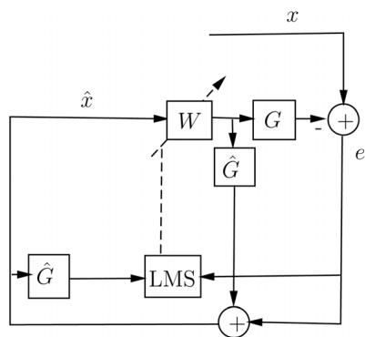  
Fig. 1. Feedback ANC with an internal model controller: The internal model $\hat { G } ( j \omega )$ of the secondary-path is used to derive an estimate ${ \hat { x } } ( n )$ of the noise. Besides, it is required to filter the input of the LMS adaptation.

The performance and stability of an IMC feedback ANC-system is dependent on the accuracy of the secondary-path model $\hat { G } ( j \omega )$ . An initial nominal model can easily be determined off-line by injecting an appropriate broadband signal (e.g. a swept cosine) into the headphones and measuring the system response with the microphones inside the ear-cups. The secondary-path $G ( j \omega )$ , however, changes considerably once the headphones are lifted or pulled away completely as will be shown in Section IV. The deviation of $G ( j \omega )$ from the nominal model $\hat { G } ( j \omega )$ can then drive the system unstable.

In [3], it is shown that an additional analogue feedback-controller can reduce the deviation from the nominal model, but the analogue controller design is non-trivial and stability cannot be assured in general. Consequently, the controller has either to incorporate an uncertainty about the secondary-path model [7]–[9] or an on-line secondary-path estimation has to be implemented that tracks changes in $G ( j \omega )$ [10]–[12]. The first method suffers from a loss of performance under optimal conditions and/or requires real-time Fourier transforms to check the uncertainty constraints; and the latter method fails when there are large and sudden changes in the secondary-path, and it requires the injection of a broadband noise into the headphones which is counter-productive for a noise-cancelling application.

We introduce a simple and efficient method to identify changes in the secondary-path without the need of injecting additional noise into the headphones and without the need of real-time Fourier transforms. In particular, we show that lifting and pulling away the headphones mainly affects the low frequencies of $G ( j \omega )$ and that the adaptive filter $W ( j \omega )$ which tries to invert $G ( j \omega )$ can be used to detect those low frequency changes. Once this irregularity in $G ( j \omega )$ is detected, the LMS adaptation is interrupted and the filter temporarily changes to a stable default-setting. This way, we avoid instabilities even during sudden and large changes in $G ( j \omega )$

In the given adaptive feedback-ANC-system, two stability issues arise: (i) Stability ofadaptation and (ii) stability ofthe feedback loop. We first discuss the theoretical conditions for both issues separately in Section II and III. Then we show experimental data from prototype headphones in Section IV. With the experimental data, we review the adaptation stability in Section V and the feedback stability in Section VI. Finally, we show experimental results of our algorithm and compare it to existing approaches from the literature in Section VII.

## II. THEORETICAL CONSIDERATIONS FOR THE STABILITY OF ADAPTATION

The sensitivity function $S ( j \omega )$ (i.e. the transfer function from the input noise $X ( j \omega )$ to the residual error $E ( j \omega ) )$ of the feedback system in Fig. 1 reads as (with omitted dependency on )

$$
S = \frac {E}{X} = \frac {1}{1 + G \frac {W}{1 - \hat {G} W}} = \frac {1 - W \hat {G}}{1 - W (\hat {G} - G)}.\tag{1}
$$

In the case of $G = { \hat { G } } .$ , the denominator of $S$ is equal to unity and the filter $W$ becomes $W = \hat { G } ^ { - 1 }$ in order to minimize $| S |$ However, the inverse of $\hat { G }$ in general will not exist since $\hat { G }$ will not have minimum phase. Thus, the filter $W$ can only try to compensate for the phase delay and the dynamics of $\hat { G } \ \mathrm { e . g . }$ in an $H _ { 2 }$ or $H _ { \infty }$ optimal sense. The accuracy of the compensation depends on the bandwidth in which $\hat { G }$ shall be compensated. It is easier to compensate for the phase delay and the magnitude at a single frequency than over a broad bandwidth. Thus, the optimal filter $W$ depends on the current spectral characteristic of the input noise $x .$ . It is therefore advantageous to implement an adaptive filter that yields the compensation in the band where it is currently needed. Note that the adaptive filter tries to do a system identification of the inverse secondary-path. This fact will be used later to detect changes in the secondary-path.

## A. Stability of LMS Adaptation

The cost function ${ \cal J } ( { \bf w } )$ ofthe time-domain adaptive filter can be defined as the expectation of the squared adaptation-error $J ( \mathbf { w } ) = E \{ e ^ { 2 } \}$ . It yields a convex performance surface with a global minimum. The LMS algorithm uses the method of steepest decent which iteratively changes the filter coefficients according to the negative gradient $\nabla$ of the performance surface

$$
\mathbf {w} (n + 1) = \mathbf {w} (n) - \mu \nabla ,\tag{2}
$$

where $n$ is the discrete time index and $\mu$ is the step size that controls the speed of convergence. It can be shown that the algorithm converges to the global minimum if $\begin{array} { r } { 0 < \mu < \frac { 1 } { \lambda _ { \operatorname* { m a x } } } , } \end{array}$ where $\lambda _ { \mathrm { m a x } }$ is the largest eigenvalue of the input autocorrelation matrix [4], [6], [13]–[18].

In applications with dynamically varying excitation and a non-negligible delay in the secondary-path, the normalized Filtered-x LMS (FxLMS) is applied to yield stable convergence. The FxLMS uses the secondary-path model to apply the same phase shift to the reference input as is applied to the controller output due to the real secondary-path (cf. [4] and Fig. 1). As a consequence, the convergence of the FxLMS also depends on the deviation of $\hat { G }$ from . It is shown that it is mainly the phase deviation that matters and that the phase deviation has to stay below $9 0 ^ { \circ }$ to maintain convergence [19]–[21].

If the phase deviation is larger than $9 0 ^ { \circ }$ , only a penalty on the filter gain can keep the system stable. The filter gain is penalized by including its norm in the cost function ${ \cal J } ( { \pmb w } ) =$ $\bf \bar { \Delta } \phi \{  e ^ { 2 } + \gamma ( \bar { \bf w } ^ { T } { \bf w } ) \}$ . The factor $\gamma$ allows for a trade-off between a large penalty that results in robust stability but an increased excess error and vice versa. The extended cost function leads to the leaky LMS algorithm [22], [23]. Its normalized filtered-x version has the following coefficient update:

$$
\pmb {w} (n + 1) = (1 - \mu \gamma) \pmb {w} (n) + \mu \frac {e (n) \hat {\mathbf {G}} \hat {\pmb {x}} (n)}{\hat {\pmb {x}} ^ {\mathrm{T}} (n) \hat {\pmb {x}} (n)},\tag{3}
$$

where $\hat { \mathbf { G } }$ is the convolution matrix ofthe secondary-path model and ${ \hat { \mathbf { x } } } ( n )$ is a vector of the latest estimated noise input-samples as in Fig. 1. The leaky LMS prevents divergence and avoids large filter gains in general which can be important in real life conditions [4] as will also be shown in section V-B.

## III. THEORETICAL CONSIDERATIONS FOR FEEDBACK STABILITY

## A. Constraint on the Norm of

A robust constraint results from regarding the deviation of the nominal model from the real secondary-path as additive uncertainty $U ( \omega ) = | \hat { G } ( j \omega ) - G _ { i } ( j \omega ) _ { i } |$ . We are now interested in the maximum uncertainty $U _ { \mathrm { m a x } } ( \omega )$ over all possible variations $G _ { i } ( j \omega ) _ { i } . U _ { \operatorname* { m a x } } ( \omega )$ can be regarded as radius around every frequency point $\omega$ of the Nyquist contour of $\hat { G } ( j \omega )$ . Thus, all $G _ { i } ( j \omega )$ have to lie within this band of radii. The uncertainty radius around the frequency points of the open loop follows to

$$
r (j \omega) = \left| \frac {W (j \omega) U _ {\mathrm{max}} (\omega)}{1 - W (j \omega) \hat {G} (j \omega)} \right|.\tag{4}
$$

From Fig. 2 it is clear that no open loop (for any $G _ { i } )$ can encircle the point (-1,0) if the distance of the nominal open loop $\hat { L }$ from $( - 1 , 0 )$ is larger than $r _ { * }$ Mathematically expressed this means

$$
\left| 1 + \frac {W \hat {G}}{1 - W \hat {G}} \right| > \left| \frac {W U _ {\mathrm{max}}}{1 - W \hat {G}} \right|.\tag{5}
$$

The condition can be simplified to

$$
1 > | W (j \omega) U _ {\mathrm{max}} (\omega) |\tag{6}
$$

which yields the practical constraint for IMC [5]

$$
| W (j \omega) | <   \frac {1}{U _ {\mathrm{max}} (\omega)}.\tag{7}
$$

Since constraint (7) is formulated in the frequency domain, it is advisable to implement the frequency-domain LMS. The resulting filter $W ( z )$ can be transformed into the time-domain to avoid the latency of block-processing in the anti-noise path as in [24], [25]. In the following, we show a constrain that allows implementing the FxLMS completely in the time-domain.

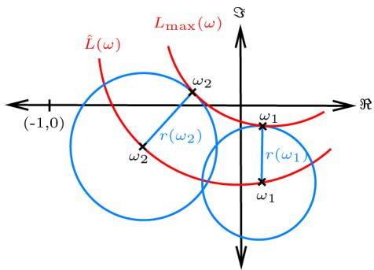  
Fig. 2. Graphical derivation of the stability condition: The nominal open-loop is displayed together with $L _ { \mathrm { m a x } }$ the open loop with the largest uncertainty. No open-loop with a smaller uncertainty can encircle the point (-1,0) if the distance of from (-1,0) is larger than .

## B. Constraint on Single Frequency Bins of

The poles of a system are its resonances and they can be recognized by peaks in the magnitude response. The closer a pole (or a complex conjugate pole-pair, respectively) comes to the unit circle, the sharper the resonance becomes until it can be heard as ringing. As long as the pole stays inside the unit circle, the ringing will eventually die out, but as soon as the pole crosses the unit circle, the system looses its stability.

It is thus very likely that the instability is caused by a distinct pole or pole-pair at a distinct frequency. If the resonance frequencies that most likely turn into unstable poles are known, it can be sufficient to check constraint (7) only at the corresponding frequency bins.

For a single frequency bin , constraint (7) reads as

$$
\left(\frac {1}{L} \sum_ {l = 1} ^ {L} w _ {l} e ^ {2 \pi \frac {k}{L} l}\right) ^ {2} <   \frac {1}{U _ {\max} ^ {2} (k)}\tag{8}
$$

where $w _ { l }$ are the coefficients of the taps long filter . The exponential Fourier Kernel can also be expressed as cosine and sine operation. This yields a real numbered expression

$$
\left(\frac {1}{L} \sum_ {l = 1} ^ {L} w _ {l} \cos \left(2 \pi \frac {k}{L} l\right)\right) ^ {2} + \left(\frac {1}{L} \sum_ {l = 1} ^ {L} w _ {l} \sin \left(2 \pi \frac {k}{L} l\right)\right) ^ {2}\tag{9}
$$

on the left hand side of inequality (8) that has a complexity of only $\mathcal { O } ( N )$ . Constraint (7), for comparison, has a complexity of at least $\mathcal { O } ( N \log _ { 2 } N )$ because it requires a complete Fourier transform of .

## C. Measures to Preserve Feedback Stability

We know that feedback stability cannot be guaranteed, if one of the above conditions is violated. However, we still need a strategy to react on such cases. In [7] and [8] it is shown, that constraint (7) can be directly incorporated in the controller design, and in [9], the same constraint is checked before each filter update. We choose the latter approach, since it can be applied to both above introduced constraints.

If one of the above constraints is violated, must not be updated. Instead, it makes sense to change $W$ to a stable default filter because if deviates from ${ \hat { G } } ,$ the FxLMS update is not reliable anymore. From equation (7), we know that the default filter yields stability if its absolute value is smaller than the inverse of the maximum uncertainty. The easiest implementation of such a time-domain default filter is a scaled Kronecker impulse $\delta ( l )$

$$
\tilde {w} _ {l} = \frac {\delta (l)}{\max (U _ {\max} (\omega)) + \epsilon},\tag{10}
$$

where is the index of filter coefficients and is a small quantity that ensures the inequality of (7).

In order to prevent time variances during the filter process, should not change abruptly, but converge smoothly to the scaled impulse. Therefore the difference $\Delta _ { w } = \tilde { \pmb { w } } - \pmb { w } ( n )$ between the coefficients of the default filter and the current filter ${ \pmb w } ( n )$ is used as update. Ifthe difference-vector is normalized and scaled by the step-size parameter $\mu ,$ , the update yields a similar effective step-size as the NFxLMS

$$
\begin{array}{c} \boldsymbol {w} (m + 1) = \boldsymbol {w} (m) + \mu \frac {\boldsymbol {\Delta} _ {w}}{\boldsymbol {\Delta} _ {w} ^ {T} \boldsymbol {\Delta} _ {w}}, \\ m = n \ldots n + \text { round } \left(\frac {\boldsymbol {\Delta} _ {w} ^ {T} \boldsymbol {\Delta} _ {w}}{\mu}\right). \end{array}\tag{11}
$$

This interim update starts as soon as the stability constraint is violated. The time index of the interim update thus starts with the recent sample and the update is repeated $\big | \frac { \Delta _ { w } ^ { T } \Delta _ { w } } { \mu } \big |$ times until ${ \pmb w } ( m ) = \tilde { \pmb w }$ . The brackets of $\Big | \frac { \Delta _ { w } ^ { T } \Delta _ { w } } { \mu }$ denote rounding ofa scalar to the nearest integer as denoted in the time index bounds of eq. (11).

After the given number ofrepetitions, the NFxLMS is applied again. Apart from possible short breaks, the NFxLMS is thus constantly running also if constantly deviates form $\hat { G }$ . In that case, the filter starts growing again and it eventually violates one of the constraints again. It thus will constantly grow and scale back to the stable impulse.

## IV. RESPONSE DATA OF PROTOTYPE HEADPHONES

It has been shown that both the stability of the LMS adaptation and the feedback stability depend on the deviation of from . We will therefore have a closer look at the variations in the secondary-path in the following and review both stability issues using the experimental data in Sections V and VI.

The biggest change in and thus the greatest uncertainty and the greatest phase error is expected when the headphones are pulled away from the ears. We therefore measured the secondary-path response firstly on a dummy head and secondly when the headphones are hanging loosely. In order to get insight into the secondary-path variations between these two extreme situations, we also made measurements where we left one and then two leaks of mm between the headphones and the artificial ears.

Fig. 3 shows the bode plots of the measurements. It can be seen that an increased leakage leads to an increased drop-off at low frequencies.

The tight wearing situation is the regular use-case; consequently the secondary-path measure under tight condition will be the nominal model . This however implies that there is a large uncertainty on this model if the headphones are lifted as shown in Fig. 4. The maximum uncertainty $U _ { \mathrm { m a x } } ( \omega )$ is the one of the three uncertainties that has the largest magnitude at the given . As can be seen in Fig. $4 ( \mathrm { a } ) , U _ { \mathrm { m a x } } ( \omega )$ is mostly determined by the secondary-path ofthe open headphones. However, below 1000 $\mathrm { H z , }$ the uncertainty of $G$ with two inserted leaks is equally large and even slightly larger around 300 Hz.

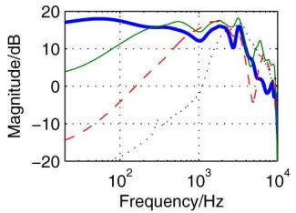  
(a)

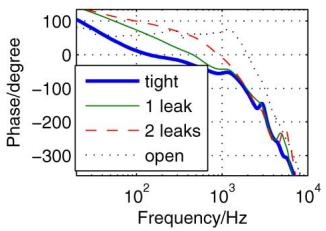  
(b)

Fig. 3. (a) Magnitude- and (b) phase response of the secondary-path for tight, leaky and completely loose headphones. The increased leakage leads above all to a magnitude drop-off at low frequencies.  
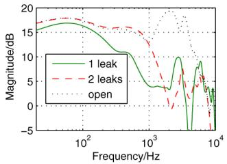  
(a)

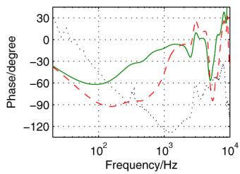  
(b)  
Fig. 4. (a) Magnitude of the additive uncertainty and (b) phase error of differently positioned headphones compared to the nominal model $\hat { G }$ of the tight sitting headphones.

## V. EXPERIMENTAL CONSIDERATIONS FOR THE STABILITY OF ADAPTATION

## A. Robustness Against Phase Mismatch

In Fig. 4(b), it can be seen that the phase error between the nominal secondary-path model $\hat { G }$ and the secondary-path ofthe open headphones is larger than $9 0 ^ { \circ }$ around 1300 Hz. The usual FxLMS algorithm would thus diverge if the headphones were lifted, as it is also shown in [21]. It is therefore necessary to implement the leaky FxLMS as described in Section II-A.

The leakage factor $\gamma ,$ which is a trade-off between stability and excess error, has to be determined empirically. We thus simulate the normalized leaky FxLMS with the given measurement data in three test setups:

1) A narrowband excitation around 1300 Hz with the secondary-path of the open headphones $G _ { \mathrm { o p e n } }$ . This is the set up with the largest phase error, as already mentioned.

2) A broadband excitation with $G _ { \mathrm { o p e n } } .$

3) A broadband excitation with the secondary-path of the headphones with two leaks $G _ { 2 }$ because it also slightly exceeds the phase error of $9 0 ^ { \circ }$

The broadband excitation is white noise that is filtered with a second order low-pass filter with 500 Hz cut-off frequency. This second-order filter simulates the passive attenuation of the headphones and it yields -33 dB attenuation at 3500 Hz. Since we do not expect more than 30 dB ofnoise cancellation, aliasing components below -33 dB do not influence the ANC. Thus, no further anti-aliasing filter is required if the sampling frequency fs is above 7000 Hz. We choose $\mathrm { f _ { s } ~ = ~ 7 3 5 0 }$ Hz because it is one sixth of 44.1 kHz, which is a common sampling frequency in audio technology. We set the filter length to $\mathrm { L } = 6$ taps and choose the step size according to the largest eigenvalue of the input autocorrelation matrix as $\mu ~ = ~ \frac { \mathbf { \bar { \mu } } _ { 1 } } { 2 \lambda _ { \operatorname* { m a x } } }$ which yields the fastest convergence [4].

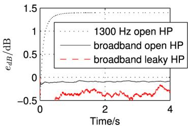

Fig. 5. The related residual error $e _ { \mathrm { d B } }$ for 3 worst case scenarios: A narrowband excitation at 1300 Hz for $G _ { \mathrm { o p e n } } ,$ , and a broadband excitation for $G _ { \mathrm { o p e n } }$ and $G _ { 2 }$ The excitation at 1300 Hz causes an error which lies 1.4 dB over the excitation level, but the adaption stays stable in all three cases.  
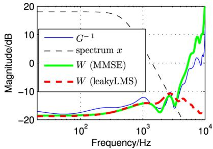  
Fig. 6. The filter $W$ tries to match the inverse of . Without constraints, it has the freedom to heavily boost the high frequencies since there is no noise excitation in this band. The leaky LMS (with $\gamma = 0 . 0 0 5 )$ minimizes the filter’s energy which leads to a desirable roll-off at high frequencies.

We test the leaky NFxLMS in open loop condition in order to decouple the convergence ofthe filter from the possible feedback instability as in [26] and [21], and find that $\gamma ~ = ~ 0 . 0 0 5$ is the smallest leakage factor that yields a stable update. Fig. 5 shows the related error as $\begin{array} { r } { e _ { \mathrm { d B } } = \dot { 1 } 0 \log \frac { \bar { e } ^ { 2 } [ n ] } { \bar { x } ^ { 2 } [ n ] } } \end{array}$ , where $\bar { e } ^ { 2 } [ n ]$ and $\bar { x } ^ { 2 } [ n ]$ are smoothed by a moving average filter over the error and the input signal, respectively. In the broadband cases, the adaptive filter even yields a small noise reduction. In the narrowband case, the filter causes an amplification of the input noise of 1.4 dB which on the one hand proves that the NFxLMS does not converge to the optimal solution anymore, but on the other hand the simulation also shows that the filter coefficients stay bounded because of the leakage factor .

## B. Robustness Against Excessive Amplification

The robustness against phase errors in $\hat { G }$ is not the only advantage ofthe leaky LMS. It also makes the system more robust against sensor noise and non-linearities in that might occur at loud playback volumes.

Fig. 6 compares the converged filter of the previous leaky-NFxLMS simulation with the optimum filter $W _ { \mathrm { o p t } }$ that yields the minimum mean square error (MMSE). Since there is hardly any high-frequency excitation, the filter $W _ { \mathrm { o p t } }$ can boost these high frequencies without significantly increasing the error. However, this boost of the high frequencies is detrimental to performance in a real life condition, where e.g. sensor noise or estimation errors of would be strongly ampli fied. The leaky NFxLMS solution on the other hand prevents the filter from excessively amplifying the high frequencies. It matches the inverse of less accurately and has a larger excess error below 4000 Hz, but it still yields ANC up to 15 dB as can be seen in Fig. 7.

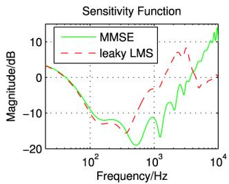  
Fig. 7. Sensitivity function of the NFxLMS for $G \ = \ \hat { G }$ with and without leakage factor. Negative dB values denote noise cancellation, positive values denote noise enhancement. Without leakage, the NFxLMS converges to the MMSE but it produces a large gain on the high frequencies. With leakage, $S$ rolls offat high frequencies but it does not yield the optimum performance below 4000 Hz.

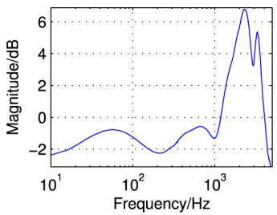  
Fig. $8 . \ \left| W U _ { \operatorname* { m a x } } \right|$ where is the converged filter from Fig. 6. As long as $| \tilde { W } \tilde { U } _ { \mathrm { m a x } } | < 0$ dB $( \mathrm { i . e . } \ \big | W U _ { \mathrm { m a x } } \big | < 1$ in linear notation) the feedback loop cannot become unstable. This condition is violated for frequencies above 1200 Hz.

## VI. EXPERIMENTAL CONSIDERATIONS FOR FEEDBACK STABILITY

## A. High Frequency Uncertainty

A large uncertainty at high frequencies is inherit in most physical systems since small changes in the plant already lead to large phase differences at high frequencies. In our case, this uncertainty is especially critical around 3000 Hz because the adaptive filter amplifies this frequency band as it was shown in the previous simulation in Fig. 6. The product $| W U _ { \mathrm { m a x } } |$ between this filter and the maximum uncertainty from Fig. 4 is shown in Fig. 8. The stability is not assured because the product exceeds unity gain above 1200 Hz.

The large high-frequency uncertainty can be controlled by penalizing the error in the upper frequency band. The error can be filtered by a high-shelf filter which then has to be considered in the secondary-path model, too, as in Fig. 9. We suggest a high-shelf filter that amplifies frequencies above 1200 Hz by 7 dB. The penalty on the high frequencies in forces the adaptive filter to reduce the gain at high frequencies.

The uncertainty below 1200 Hz however is still a problem and it cannot be reduced by a filter operation because this is the band where ANC is most desirable. Thus further constraints on $W$ are required.

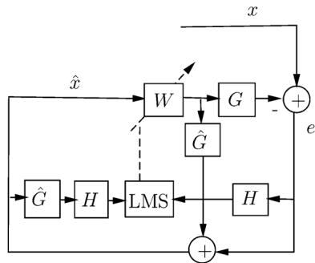

Fig. 9. Block diagram of the adaptive feedback system with a high-shelf filter that penalizes the high frequency amplification.  
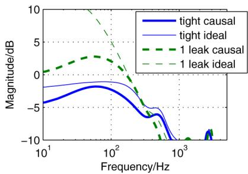  
Fig. 10. $\left| W ( \hat { G } - G _ { 1 } ) \right|$ where firstly is assumed to be a inverse of $G _ { \mathrm { t i g h t } }$ and secondly is assumed to be an inverse of $G _ { 1 }$ . For narrowband analysis, $W$ is the ideal inverse of ; for the broadband analysis, $W$ is an $H _ { 2 }$ -optimal causal version of the inverse.

## B. Low Frequency Uncertainty

As stated above, the stability of the feedback loop depends on the denominator of

$$
S = \frac {1 - W \hat {G}}{1 - W (\hat {G} - G)}.
$$

As long as $G = { \hat { G } } _ { : }$ , the feedback is stable and $W$ converges to $G ^ { - 1 }$ . For narrowband excitations, $W$ converges to the ideal inverse of in the corresponding frequency bin. For broadband excitations, converges to a causal approximation of $G ^ { - 1 }$

Fig. 10 illustrates the scenario when changes from the tight secondary-path $G _ { \mathrm { t i g h t } }$ (which equals $\hat { G } )$ to the secondary-path with one leak $G _ { 1 }$ . It shows the magnitude of $| W ( \hat { G } - G _ { 1 } ) |$ which has been weighted with the inverse of $| H |$ . First, it is assumed that $W$ is still an approximation of $G _ { \mathrm { t i g h t } } ^ { - 1 }$ , and we distinguish between the ideal inverse of $G _ { \mathrm { t i g h t } }$ for narrowband analysis and the causal inverse for broadband analysis. The causal version has been derived over an LMS approximation.

When the headphones are lifted, the feedback initially stays stable because $| W ( \hat { G } - G _ { 1 } ) | < 1$ , but the product is close to 1 below 100 Hz. Hence, this is the frequency band where a pole outside the unit circle is most likely. This is especially true in the second step when adapts to the inverse of $G _ { 1 }$ because $W$ has to amplify these low frequencies. In this case, $| W ( \hat { G } - G _ { 1 } ) |$ exceeds unity gain below 300 Hz.

Since $| W ( \hat { G } - G _ { 1 } ) | \ < \ 1$ is violated in the low frequency band first, we propose to only check the low frequencies of $W U _ { \mathrm { m a x } }$ . It is thus sufficient to determine $W ( k )$ at the frequency bins below 300 Hz instead of doing a full Fourier-transform.

The number of necessary frequency analyses depends on the frequency resolution of . has to approximate the inverse of up to 1200 Hz, and has hardly any dynamic variation in this band. It therefore suffices to choose a very low frequency resolution of about 1200 Hz per bin. The adaption of below 300 Hz will then become noticeable in the DC-bin. This is very beneficial because the constraint on the DC-gain of does not need the decomposition into cosine and sine as in eq. (9). It can easily be formulated in the time-domain as

$$
\sum_ {l} w _ {l} <   \frac {1}{U _ {\mathrm{max}} (0)},\tag{12}
$$

where $U _ { \mathrm { m a x } } ( 0 )$ is the maximum uncertainty below 300 Hz. Consequently, the entire check for robust stability only requires multiply-accumulate operations (MACs) per filter update.

In Fig. 4 it can be seen that $U _ { \mathrm { m a x } } ( 0 )$ is at 17.3 dB. Once the DC-gain exceeds the given threshold, the adaptive filter is changed to the stable default filter as in eq. (11). With a headroom of $\epsilon = 2 . 7$ dB, the default filter is scaled to an impulse of -20 dB according to eq. (10).

## VII. EXPERIMENTAL RESULTS

## A. Summary of the Algorithm

The whole adaptive feedback-ANC algorithm with DC-constraint can be summarized as follows:

1) Filter the error with a high-shelf filter that penalizes the filter gain above 1200 Hz.

2) Update the coefficients of via the leaky NFxLMS algorithm as in eq. (3).

3) Check if $\begin{array} { r } { \sum _ { i } w _ { i } < \frac { 1 } { U _ { \operatorname* { m a x } } ( 0 ) } } \end{array}$ . If no:

• Calculate the gradient which leads to the stable default filter $\Delta _ { w } = \tilde { \pmb { w } } - \pmb { w } ( n )$

• For the next $\begin{array} { r } { M = \left| \frac { \bar { \mathbf { \Delta } } \Delta _ { w } ^ { T } \mathbf { \Delta } \Delta _ { w } } { \mu } \right| } \end{array}$ samples update the coefficients as $\begin{array} { r } { \pmb { w } ( m + 1 ) ^ { * } = \pmb { w } ( m ) + \mu \frac { \pmb { \Delta } _ { w } } { \pmb { \Delta } _ { -- } ^ { T } \pmb { \Delta } _ { m } } } \end{array}$

• After iterations continue the leaky NFxLMS update (jump to step 2.)

The development of the algorithm is based on responses of prototype headphones, but all steps are motivated by physical reasons that apply to all headphones of similar making.

• High frequency uncertainty is a problem for all feedback ANC headphones. A high-shelffilter that penalizes the amplification of the upper frequency band is therefore always advisable.

• A leak between the ear-cups and the ears changes the low frequency response ofthe secondary-path [27], [28]. Thus, there will always be a large uncertainty at low frequencies that demands a constraint on . The constraint on the norm of is always applicable, and the constraint on single frequency bins of and especially on the DC gain is suitable for a low frequency resolution of . In general, does not have to equalize a lot, since a flat frequency response is desired for high-fidelity headphones. Therefore, a low frequency resolution is generally suitable.

• The maximum uncertainty that is required to scale the default filter can easily be assessed with some preliminary measurements as described in Section IV.

## B. Evaluation ofthe Algorithm

In the above analysis and deduction of the time-domain constraint, it is assumed that converges to $G ^ { - 1 }$ , but does not exceed the magnitude of $G ^ { - 1 }$ . This is most likely because the leaky FxLMS penalizes the norm of . An extensive numerical analysis is still necessary to prove the robustness of the time-domain constraint. The numerical analysis has to be done through simulations of the adaptive feedback system because firstly the adaptive filter depends on the input signal, and secondly the temporal behavior of $W$ is important. It has to be examined whether always exceeds constraint (12) before the feedback loop starts ringing.

The analysis is done for various input noises: (i) Sinusoidal excitation at 50 Hz and in 100 Hz steps from 100 Hz to 1400 Hz. (ii) Narrowband excitation with white noise passed through a 2nd order peak filter with a quality factor of $Q = 8$ and centre frequencies as before. (iii) Broad band excitation with white noise. (iv) Broad band excitation with pink noise.

Each of the excitation signals is filtered with a 2nd order low-pass filter of passive attenuation with a cut-off frequency at 500 Hz. The simulations are not only done for changes from $G _ { \mathrm { t i g h t } }$ to $G _ { 1 }$ , but also with an initial worst-case and for a sudden change from $G _ { \mathrm { t i g h t } }$ to the worst case $G .$ The worst case $G$ is the one with the largest uncertainty in the corresponding frequency band (cf. Fig. 4). Thus, the worst case $G$ below 1000 Hz is the secondary-path with two inserted leaks, and above 1000 Hz, it is the open secondary-path. Both, $G _ { 2 }$ and $G _ { \mathrm { o p e n } }$ are tested with the broadband excitations. The NFxLMS is run with simulated white sensor noise of -60 dB relative to the excitation level and with the same $\mu$ and as in Section V. With a sampling frequency of 7350 Hz, we can apply a 6 taps long filter to yield a frequency-resolution of 1200 Hz per bin. The calculation of the DC-gain does then only require 6 MACs.

We calculate the energy of the input noise $E _ { x } ( n )$ and the error-energy $E _ { e } ( n )$ over the last samples as

$$
\begin{array}{l} {E _ {x} (n) = \sum_ {m = n - M} ^ {n} x (m) ^ {2}} \\ {E _ {e} (n) = \sum_ {m = n - M} ^ {n} e (m) ^ {2}.} \end{array}\tag{13}
$$

The integration time should be approximately as long as one period of the lowest frequency under consideration, and it is therefore chosen as $M = 1 6 7$ samples which corresponds to one period ofa 50 Hz tone. The start ofringing is detected when all of the three properties are true:

$E _ { e }$ grows such that $E _ { e } ( n ) > E _ { e } ( n - M )$

$E _ { e } ( n )$ is larger than twice $E _ { x } ( n )$ and

$E _ { e }$ grows twice as fast as $E _ { x }$ , i.e. $E _ { e } ( n ) - E _ { e } ( n - M ) >$ $2 ( E _ { x } ( n ) - E _ { x } ( n - M ) )$

Every time the three properties are detected, $W ( n )$ is marked as unstable. In contrast, if

$E _ { e }$ decreases such that $E _ { e } ( n ) < E _ { e } ( n - M )$ , and

$E _ { e } ( n )$ is smaller than $E _ { x } ( n )$

the ANC-system works properly and $W$ is marked as stable.

Fig. 11 shows the DC-gain distribution of all filters which are marked as stable and unstable respectively. The DC-gain of the filters which are recorded before ringing always exceeds $\begin{array} { r } { \frac { 1 } { U _ { \mathrm { m a x } } ( 0 ) } = - 1 7 . 3 } \end{array}$ dB. Also the filters which improve ANC exceed this threshold in some cases. Thus it occurs that the adaptive filter is switched to , although the system would have been stable. However, it is more important to see that the constraint on the DC-gain is a robust constraint to keep the feedback stable. A further test ofthe algorithm with additional experimental data is applied in the following.

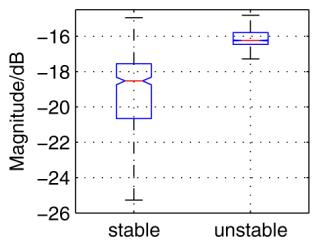  
Fig. 11. DC-gain distribution of under stable condition and when the feedback drives unstable. The boxes include 50% of the registered DC-gains and the whiskers show the whole distribution. The bars in the middle of the boxes denote the median value and the notches indicate the confidence interval. The DC-gain of always exceeds -17.3 dB before instability occurred.

## C. Performance Comparison

The experimental data for the development and evaluation of the algorithm is gathered by measurements on a mannequin. In this section, we test the algorithm with experimental data from real persons and we compare the performance with existing approaches from the literature. As stated in the introduction, there are two main strategies to handle secondary-path uncertainties:

1) Consideration of Uncertainty: The adaptive filter is bounded by the inverse of $U _ { \mathrm { m a x } }$ as in constraint (7). In [7], this constraint is included in the controller design, but the controller is non-adaptive. In [9], an adaptive filter is used and constraint (7) is checked before each filter update. If the constraint is violated, the filter is not updated. In [8], Rafaely and Elliott included the constraint in the cost function of the LMS as

$$
J (\mathbf {w}) = E \left\{e ^ {2} + \sigma \max \left[ | W (k) | ^ {2} - \frac {1}{U _ {\max} ^ {2} (k)}, 0 \right] \right\},\tag{14}
$$

where the value of $\begin{array} { r } { \left\lceil | W ( k ) | ^ { 2 } - \frac { 1 } { U ( k ) _ { \operatorname* { m a x } } ^ { 2 } } , 0 \right\rceil } \end{array}$ is zero if constraint (7) holds. If it does not hold, the adaptive filter is scaled back by a factor that depends on the weight . Since the constraint depends on the frequency bin , the adaptive filter is only scaled back in the frequency band where the constraint is violated. Therefore, this approach can be considered as the most elaborated and it will be used for the following comparison.

2) Online Secondary-Path Estimation: The second strategy is to get a permanent estimate of the current state of . The most robust approach is to inject an auxiliary signal into the headphones in order to identify the secondary-path [11], [29]. In [10], the music playback is used as auxiliary signal, but it only works for slowly changing secondary-paths. Even approaches that inject white noise fail when there are fast and large changes in . The most advanced method is presented by Zhang et al. in [12]. It comprises three measures: (i) A third adaptive filter reduces the disturbance of the noise cancelling error onto the secondary-path adaptation. (ii) The auxiliary noise is scaled with a dependence on the convergence status to keep it as low as possible. (iii) A hard constraint on the norm of the adaptive controller prevents divergence, even for sudden large changes in . The method is proposed for feedforward ANC where it avoids the divergence of for the most part. We will include it in the following comparison to investigate if it is extendible to feedback ANC.

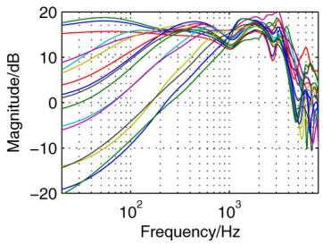  
Fig. 12. Magnitude response of the secondary-paths measured on two persons with differently positioned headphones.

The reader may denote that measure (iii) of Zhang’s approach actually falls into the first category, too. The threshold for the norm constraint and the parameter in Rafaely’s approach are determined empirically by tuning them in order to minimize error amplifications. Our approach falls into the first category, too, but we build on the finding that constraint (7) is violated around DC, while all other solutions from strategy 1) analyze the full bandwidth from 0 Hz to $\frac { \mathrm { f s } } { 2 }$ . The benefit of our approach is that no real-time Fourier transform and no auxiliary noise is needed. The drawback is that the cost efficient DC constraint is only applicable for low frequency resolutions. The approaches of Rafaely and Zhang do not have this restriction. For their approaches, we choose a frequency resolution that is twice as large as ours to demonstrate the limitations of our controller. Thus, we set their filter length to $L = 1 2$ taps, while ours has only 6 taps. The longer filter means a slower convergence (cf. [4] and eq. (3)), but the comparison will show that the increased resolution outweighs the slightly slower convergence.

To get real-life experimental data, we asked two people to put on the headphones in differently tight, leaky and lifted positions. For the tight measurements, the subjects were also asked to press the headphones to the ears. For all headphone-positions, we measured the secondary-path with a sine sweep of one second. This gives us 16 different measurements in total that can be seen in Fig. 12. The measurements show again that leaks between the ears and the headphones mainly affect the low frequencies.

In all following evaluations, we apply the same measures:

• Every 0.5 s, the measured secondary-paths are replaced by each other in a way that tight and leaky fittings alternate.

• As (initial) secondary-path model, we still use $\hat { G }$ which we derived from the tight measurement on the dummy head.

• The excitation signals are filtered with the second order low-pass filter that approximates the passive attenuation of the headphones as in Section VII-B.

• The high frequency uncertainty is reduced by the additional shelving filter

First, we chose white noise and narrowband noise around 100 Hz as excitation signals because they lead to instabilities if the normalized leaky FxLMS is run without further constraints (cf. Fig. 13). Fig. 14 compares the performance ofour algorithm with the approaches of Rafaely and Zhang for the same conditions. The first thing to notice is that our approach preserves stability for the real-life experimental data, too. Consequently, also Rafaely’s approach has to preserve stability because his approach uses the same constraint only extended to the full bandwidth. Secondly, it is demonstrated that Zhang’s method preserves stability, too, and can thus be extended to feedback ANC. However, the performance for broadband noise is deteriorated due to the additionally injected noise and the hard constraint on the norm of (cf. Fig. 14(a)).

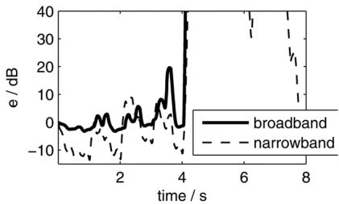  
Fig. 13. The related residual error $e _ { d B }$ over 8 seconds of a normalized leaky FxLMS for pink and narrowband noise around 100 Hz: The secondary-path changes abruptly every 0.5 seconds which leads to a related error of+10 dB and more in the first 4 seconds and to complete instability afterwards.

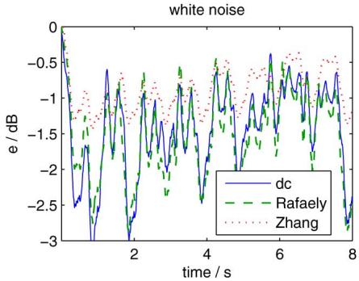  
(a)

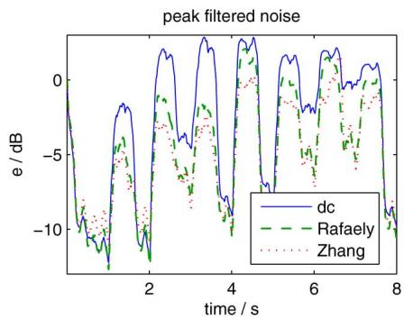  
(b)  
Fig. 14. $e _ { d B }$ for (a) broadband noise and (b) narrowband noise around 100 Hz: The conditions are the same as in Fig. 13, but this time, our DC constraint as well as the constraints by Rafaely and Zhang are applied.

On the other side, the performance of our system is slightly degraded for the low-frequency narrowband noise. There are two reasons for this:

The impulse is a suitable broadband compensation for , but it is a suboptimal narrowband compensation. Fig. 15(a) compares the noise powers with the error power over the eight seconds of the experiment in third octave bands. Our system yields only 1 dB of noise reduction in average while Rafaely’s and Zhang’s approach still yield a reduction of 4-6 dB.

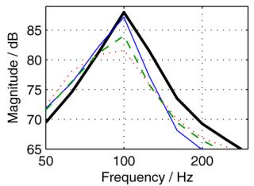  
(a)

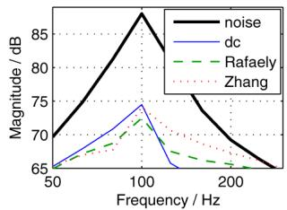  
(b)

Fig. 15. Comparison of the narrowband noise power with the error power in third octave bands (a) over the complete 8 seconds (b) during the time where is close to $\hat { G } .$  
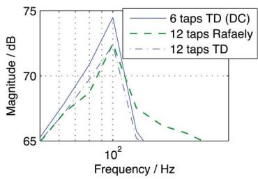  
Fig. 16. Error spectra comparison of our time-domain (TD) approach (6 taps) with Rafaely’s approach (12 taps) and our time-domain approach with 12 taps.

• The filter is very short. Fig. 15(b) shows the same comparison for a time frame where is close to (from 1.5 to 2 s in Fig. 14(b)). Our approach yields 2 dB less noise reduction than Rafaely’s, although the filter has not been scaled back to an impulse during this time. Thus, the 2 dB difference occurs because we only use a six taps long filter, while a longer filter can be used in Rafaely’s approach.

Fig. 16 shows that our approach would yield the same noise reduction if a 12 taps long filter would be applied. However, with the increased frequency resolution of the 12 taps long filter, the frequency bin around 612 Hz already includes as much signal energy at 306 Hz as the DC bin. It would therefore be necessary to extend the frequency analysis to the 612 Hz bin as in eq. (8) and (9). Instead of 12 (MACs) to calculate the DC-gain, the frequency analysis would then require additionally MACS for the cosine and sine component at 612 Hz and another MACS for the square operations yielding 60 MACs in total. Therefore, the 6 taps long filter is preferred since it still yields 14 dB of narrowband noise reduction if the headphones sit regularly tight. Compared to the MMSE of -16 dB (from Rafaely’s approach), this is only 12.5% less noise reduction. Thus, the reduced complexity of the shorter filter outweighs the small loss of performance.

In the broadband case, our approach (with 6 taps) yields the same results as Rafaely’s approach over all secondary-paths as well as for $G \approx { \hat { G } }$ as can be seen in Fig. 17. However, Rafaely’s approach is computationally far more demanding than ours. Rafaely suggests implementing a frequency-domain LMS with a time-domain adaptive filter. For a filter length of 12 taps, a 24 point FFT of the buffered and , and a 24 point IFFT for is required to avoid circular convolution effects [8], [30]. With a computational complexity of $\mathcal { O } ( N \log _ { 2 } N )$ per complex-numbered FFT, $2 \times 2 4 \log _ { 2 } 2 4$ real-numbered MACs are required. With two FFTs and one IFFT, at least 661 MACs are required per filter update, while our approach only requires 6 MACs. Even with a filter length of 6 taps, the frequency-domain LMS would require 130 MACs with hardly any advantage over our approach. Zhang’s approach can be implemented in the time-domain, too, but it yields 50-62% less noise reduction than Rafaely’s and our approach depending on the positioning of the headphones.

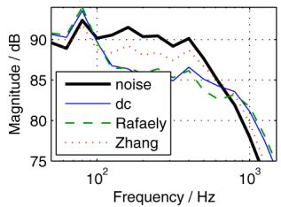  
(a)

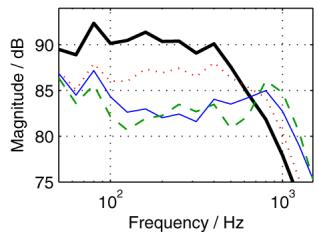  
(b)  
Fig. 17. Comparison of the broadband noise power with the error power in third octave bands (a) over the complete 8 seconds (b) during the time where is close to .

To summarize the comparison:

• All approaches under comparison preserve stability of the adaptive feedback system, even after large and sudden changes in .

• Zhang’s and our approach can be directly implemented in the time-domain, but Zhang’s approach requires three LMS updates, while ours requires only one. Zhang’s approach, which does not have a restriction on the filter length, performs slightly better for the low-frequency narrowband excitation, but our approach is clearly superior for broadband excitation.

• Rafaely’s approach yields a narrowband noise reduction that is 2-5 dB better than ours and a broadband noise reduction that is comparable to ours. But his approach requires three Fourier transforms per filter update, while ours only requires a single summation for the stability constraint.

Thus, the main contribution of this work is to show that stability of feedback ANC-headphones can be preserved with a computationally very economical constraint that hardly influences the performance.

## VIII. CONCLUSION

Adaptive feedback-ANC is a very powerful solution for headphones applications, but, as with all feedback systems, it suffers from the risk of instabilities. We present an algorithm that avoids these instabilities and preserves the benefits of adaptive feedback ANC.

In particular, we examine how the secondary-path changes when the headphones are lifted and demonstrate that these changes affect the stability of the NFxLMS adaption and the feedback loop. We propose to use the leaky NFxLMS to overcome the first stability issue. To overcome the feedback stability issue, we develop an algorithm that detects changes in the secondary-path. We use the fact that the adaptive filter increases its low-frequency gain if the headphones are lifted. We show that this low-frequency amplification is independent from the excitation-noise characteristic and that it is sufficient to check the filter’s DC-gain to identify lifted headphones.

## REFERENCES

[1] K. Zangi, “A new two-sensor active noise cancellation algorithm,” in Proc. IEEE Int. Conf. Acoust., Speech, Signal Process. (ICASSP’93), Apr. 1993, vol. 2, pp. 351–354, vol. 2.

[2] A. Oppenheim, E. Weinstein, K. Zangi, M. Feder, and D. Gauger, “Single-sensor active noise cancellation,” IEEE Trans. Speech Audio Process., vol. 2, no. 2, pp. 285–290, Apr. 1994.

[3] Y. Song, Y. Gong, and S. Kuo, “A robust hybrid feedback active noise cancellation headset,” IEEE Trans. Speech Audio Process., vol. 13, no. 4, pp. 607–617, Jul. 2005.

[4] S. Kuo and D. Morgan, “Active noise control: A tutorial review,” Proc. IEEE, vol. 87, no. 6, pp. 943–973, Jun. 1999.

[5] M. Morari and E. Zafiriou, Robust Process Control. Englewood Cliffs, NJ, USA: Prentice-Hall, Jan. 1989.

[6] S. Haykin, Adaptive Filter Theory, 4th Ed. ed. Upper Saddle River, NJ, USA: Prentice-Hall, Sep. 2001.

[7] B. Rafaely and S. Elliott, “ ; active control of sound in a headrest: Design and implementation,” IEEE Trans. Control Syst. Technol., vol. 7, no. 1, pp. 79–84, Jan. 1999.

[8] B. Rafaely and S. Elliott, “A computationally efficient frequency-domain LMS algorithm with constraints on the adaptive filter,” IEEE Trans. Signal Process., vol. 48, no. 6, pp. 1649–1655, Jun. 2000.

[9] C. Kinney, A. Villalta, and R. de Callafon, “Active noise control of a cooling fan in a short duct,” in Proc. ASME NoiseCon/NCAD, 2008, pp. 1–11.

[10] W. Gan, S. Mitra, and S. Kuo, “Adaptive feedback active noise control headset: Implementation, evaluation and its extensions,” IEEE Trans. Consumer Electron., vol. 51, no. 3, pp. 975–982, Aug. 2005.

[11] M. Akhtar, M. Abe, and M. Kawamata, “A new variable step size LMS algorithm-based method for improved online secondary path modeling in active noise control systems,” IEEE Trans. Audio, Speech, Lang. Process., vol. 14, no. 2, pp. 720–726, Mar. 2006.

[12] M. Zhang, H. Lan, and W. Ser, “A robust online secondary path modeling method with auxiliary noise power scheduling strategy and norm constraint manipulation,” IEEE Trans. Speech Audio Process., vol. 11, no. 1, pp. 45–53, Jan. 2003.

[13] B. Widrow, J. McCool, M. Larimore, and C. Johnson, “Stationary and nonstationary learning characteristics of the LMS adaptive filter,” Proc. IEEE, vol. 64, no. 8, pp. 1151–1162, Aug. 1976.

[14] S. Kuo, S. Kuo, and D. Morgan, Active noise control systems: algorithms and DSP implementations, ser. Wiley series in telecommunications and signal processing. New York, NY, USA: Wiley, 1996.

[15] S. Snyder and C. Hansen, “The influence of transducer transfer functions and acoustic time delays on the implementation of the LMS algorithm in active noise control systems,” J. Sound Vibr., vol. 141, no. 3, pp. 409–424, 1990.

[16] B. Widrow, J. R. Glover, J. M. Mccool, J. Kaunitz, C. S. Williams, R. H. Hearn, J. R. Zeidler, E. Dong, R. C. Goodlin, and R. C. Goodlin, “Adaptive noise cancelling: Principles and applications,” Proc. IEEE, vol. 63, no. 12, pp. 1692–1716, Dec. 1975.

[17] J. C. Burgess, “Active adaptive sound control in a duct: A computer simulation,” J. Acoust. Soc. Amer., vol. 70, p. 715, 1981.

[18] P. A. Nelson, S. J. Elliott, and J. E. F. Williams, “Active control of sound,” Phys. Today, vol. 46, no. 1, pp. 75–76, 1993 [Online]. Available: http://link.aip.org/link/?PTO/46/75/2

[19] P. Lopes and M. Piedade, “The behavior of the modified fx-LMS algorithm with secondary path modeling errors,” IEEE Signal Process. Lett., vol. 11, no. 2, pp. 148–151, Feb. 2004.

[20] S. Snyder and C. Hansen, “The effect of transfer function estimation errors on the filtered-x LMS algorithm,” IEEE Trans. Signal Process., vol. 42, no. 4, pp. 950–953, Apr. 1994.

[21] L. Wang, W.-S. Gan, A. Khong, and S. Kuo, “Convergence analysis of narrowband feedback active noise control system with imperfect secondary path estimation,” IEEE Trans. Audio, Speech, Lang. Process., vol. 21, no. 11, pp. 2403–2411, Nov. 2013.

[22] M. Kamenetsky and B. Widrow, “A variable leaky LMS adaptive algorithm,” in Proc. Conf. Rec. 38th Asilomar Conf. Signals, Syst., Comput., Nov., vol. 1, pp. 125–128, Vol. 1.

[23] D. A. Cartes, L. R. Ray, and R. D. Collier, “Experimental evaluation of leaky least-mean-square algorithms for active noise reduction in communication headsets,” J. Acoust. Soc. Amer., vol. 111, no. 4, pp. 1758–1771, 2002.

[24] D. Morgan and J. Thi, “A delayless subband adaptive filter architecture,” IEEE Trans. Signal Process., vol. 43, no. 8, pp. 1819–1830, Aug. 1995.

[25] S. J. Park, J. H. Yun, Y. C. Park, and D. H. Youn, “A delayless subband active noise control system for wideband noise control,” IEEE Trans. Speech Audio Process., vol. 9, no. 8, pp. 892–899, Nov. 2001.

[26] M. Guldenschuh and R. Höldrich, “Prediction filter design for active noise cancellation headphones,” IETSignal Process., vol. 7, no. 6, 2013.

[27] M. Guldenschuh, A. Sontacchi, M. Perkmann, and M. Opitz, “Assessment of active noise cancelling headphones,” in Proc. IEEE Int. Conf. Consumer Electron. - Berlin (ICCE-Berlin), Sep. 2012, pp. 299–303.

[28] M. Guldenschuh, “Secondary-path models in adaptive-noise-control headphones,” in Proc. 3rd Int. Conf. Syst. Control (ICSC), Oct. 2013, pp. 653–658.

[29] M. Zhang, H. Lan, and W. Ser, “Cross-updated active noise control system with online secondary path modeling,” IEEE Trans. Speech Audio Process., vol. 9, no. 5, pp. 598–602, Jul. 2001.

[30] J. Shynk, “Frequency-domain and multirate adaptive filtering,” IEEE Signal Process. Mag., vol. 9, no. 1, pp. 14–37, Jan. 1992.

Markus Guldenschuh received the Dipl.Ing. degree (corresponding to M.Sc.) in Electrical Engineering from Graz University of Technology, Austria in 2009. Since 2009, he has been with the Institute of Electronic Music and Acoustics in Graz, Austria. He is currently pursuing the Ph.D. degree in acoustics and audio engineering at the University of Music and Performing Arts in Austria. From November 2012 to April 2013, he was a visiting scholar in the Dynamic Systems and Control Group of Prof. de Callafon at the University of California, San Diego.

Raymond A. de Callafon received his M.Sc. degree in 1992 and his Ph.D. degree in 1998 in Mechanical Engineering from the Delft University of Technology, the Netherlands. In 1997 he held a Research Assistant position with the Mechanical and Aerospace Engineering Department at the University of California, San Diego (UCSD), where he is currently a Full Professor. At UCSD he directs the System Identification and Control Laboratory and is an affiliated faculty to the Center for Magnetic Recording Research. His research interests include

topics in the field of experiment-based approximation modeling, control relevant system identification and recursive/adaptive control. He is the recipient of the 2010 INSIC Technical Achievement award in the design and application of adaptive servo technology.