# A Survey on Adaptive Active Noise Control Algorithms Overcoming the Output Saturation Effect

Preprint · December 2023 DOI: 10.13140/RG.2.2.24401.10086

CITATIONS 0

5 authors, including:

Yu Guo Nanyang Technological University 2 PUBLICATIONS   1 CITATION

SEE PROFILE

Xiaoyi Shen Nanyang Technological University 46 PUBLICATIONS   515 CITATIONS

SEE PROFILE

READS 183

Dongyuan Shi Nanyang Technological University 129 PUBLICATIONS   1,597 CITATIONS

SEE PROFILE

Junwei Ji Nanyang Technological University 22 PUBLICATIONS   87 CITATIONS

SEE PROFILE

## 1 Highlights

2 A Survey on Adaptive Active Noise Control Algorithms Overcom-

3 ing the Output Saturation Efect

Yu Guo, Dongyuan Shi, Xiaoyi Shen, Junwei Ji, Woon-Seng Gan

5 • The output-saturation issue that plays a central role in the nonlinearity 6 of the secondary path not only deforms the control signal but also 7 degrades the stability of the adaptive algorithm.

8 • Output constraint algorithms address output saturation by constrain-9 ing the output power with low computational complexity.

• Nonlinear adaptive algorithms utilize the nonlinear model to counteract the output-saturation distortions at the expense of enormous computation consumption.

# 13 A Survey on Adaptive Active Noise Control Algorithms 14 Overcoming the Output Saturation Efect

15 Yu Guoa, Dongyuan Shia, Xiaoyi Shena, Junwei Jia, Woon-Seng Gana

aDigital Signal Processing Lab, School of Electrical and Electronic Engineering, Nanyang Technology University, 639798, Singapore

## 16 Abstract

This paper presents a comparison of contemporary algorithms aimed at mitigating the saturation-induced challenges in active noise control (ANC) systems. The saturation efect introduces nonlinear elements into the adaptive algorithm, consequently impacting the ANC system’s performance and degrading the system’s stability. The detailed theoretical analysis indicates that the cause of the output saturation issue lies in the exceeding output power of the control signal. Recently, two categories of adaptive algorithms have been developed to address this issue. The first category focuses on efectively constraining the output signal to manage the saturation efect, exhibiting notable practical eficacy. The second category employs nonlinear ANC algorithms (NANC) to model the inherent signal nonlinearity, controlling harmonic distortion caused by saturation efects. This work summarizes the key results in the literature and demonstrates that output constraint algorithms outperform the NANC algorithms in computational eficiency and robustness. Hence, they should be a more practical choice than others in coping with the output-saturation issue in ANC systems.

Keywords: Active noise control, Output constraint algorithms, Saturation efect, Nonlinear adaptive algorithms

## 1. Introduction

Active Noise Control (ANC) systems [1, 2, 3, 4, 5, 6, 7] are critical tools for noise reduction in a variety of applications, from automotive environments to industrial settings [8, 9, 10, 11, 12, 13, 14, 15, 16, 17]. During these applications, adaptive algorithms, such as the filtered reference least mean square (FxLMS) algorithm [18, 19], are widely utilized in ANC systems to adapt to the variations of the primary noise and acoustic environments. Although these adaptive control systems can achieve excellent noise reduction performance, their stability issue becomes a significant challenge in hindering their massive deployments in practice. Through the theoretical investigations and experimental validations, we found that the output saturation of the power amplifier plays a main role in impairing the robustness of the adaptive ANC systems [20]. The output saturation occurs when the power of the magnitude of the control signal exceeds the acceptable output range of the system [20, 21, 22, 23, 24]. It not only results in nonlinear distortions in anti-noise waves but also causes the divergence of the adaptive algorithms [3, 21].

To address this issue, researchers have developed a series of advanced adaptive algorithms that can be classified into two main categories: “output constraint algorithms” and “nonlinear adaptive algorithms.” Although they employ distinct methodologies, these algorithms serve the common objective of controlling output saturation into an acceptable range.

The typical algorithms in the first category include two gradient direction FxLMS (2-GD FxLMS) [25, 26], leaky FxLMS (LFxLMS) [19, 27, 28, 29], minimum output variance FxLMS (MoV FxLMS) [30, 31], re-scaling FxLMS [26, 32] algorithms, and so on. These linear approaches [33, 34] primarily focus on the manipulation of control filter weights to regulate the control signal [20, 32, 35, 36, 37], preventing the power amplifier entering the saturation zone.

The algorithms in the second category are the nonlinear adaptive algorithms, which can model the inherent nonlinearity in the secondary path and utilize these nonlinear models to alleviate the output distortions [22, 38, 39, 40, 41, 42]. These algorithms include second order Volterra filters FxLMS (2nd-VFxLMS) [21, 43, 44, 45], bilinear filters FxLMS (BFxLMS) [22, 46, 47, 48], Functional Linked Artificial Neural Networks (FLANN) based filter-s least mean square (FsLMS) [49, 50], Tangential Hyperbolic Function based FxLMS (THF-FxLMS) algorithms [38, 39, 51, 52] and multi-layered perception FxLMS (MLPNN-FxLMS) [53]. To obtain a satisfactory nonlinear control performance, these algorithms usually require a huge amount of computation.

59 Until now, there have been few investigations into the realizability of these 60 algorithms in real-world applications. Hence, this paper explores these two 61 categories of algorithms, shedding light on their operations, benefits, and 62 potential drawbacks. It ultimately contributes to a comprehensive under-63 standing of how ANC systems efectively operate in the presence of output 64 saturation. Furthermore, the comparative studies on these algorithms’ com-65 putational complexity, stability, and nonlinear performance provide guidance for users in choosing the most suitable adaptive algorithm to overcome output saturation in practical ANC systems.

The paper is organized as follows: the main problems of the output saturation efect have been illustrated in section 2. The output constraint algorithms, including 2-GD, Re-scaling, leaky, and MOV FxLMS, are discussed in Section 3. In contrast, the nonlinear ANC-FxLMS algorithms such as Volterra, Bilinear, FLANN, and THF-based FxLMS are discussed in Section 4. The computation analysis and comparison of these two categories are investigated in section 5, and the conclusion is provided in section 6. Table 1 lists variables used through ANC systems for each algorithm.

<table><tr><td>Notation</td><td>Meaning</td><td>Notation</td><td>Meaning</td></tr><tr><td> $x(n)$ </td><td>reference signal</td><td> $y(n)$ </td><td>control signal</td></tr><tr><td> $x'(n)$ </td><td>filtered reference signal</td><td> $y'(n)$ </td><td>anti-noise</td></tr><tr><td> $P(z)$ </td><td>primary path</td><td> $S(z)$ </td><td>secondary path</td></tr><tr><td> $\hat{S}(z)$ </td><td>secondary path estimate</td><td> $W(n)$ </td><td>control filter</td></tr><tr><td> $s_l$ </td><td>lth coefficient in the impulse response of secondary path</td><td> $\hat{s}_l$ </td><td>lth coefficient of the secondary path estimate</td></tr><tr><td> $\mathbf{w}_o$ </td><td>optimal control filter</td><td> $d(n)$ </td><td>disturbance</td></tr><tr><td> $e(n)$ </td><td>error signal</td><td> $\mu$ </td><td>step size</td></tr><tr><td> $\gamma$ </td><td>extended leaky factor</td><td> $\lambda$ </td><td>leaky factor</td></tr><tr><td> $J$ </td><td>cost function</td><td> $\alpha$ </td><td>penalty factor</td></tr><tr><td> $f[\cdot]$ </td><td>saturation function</td><td> $\mathbf{P}_{dx'}$ </td><td>cross-correlation of  $d(n)$  and  $x'(n)$ </td></tr><tr><td> $\mathbf{R}_{x'}$ </td><td>auto-correlation of filtered  $x'(n)$ </td><td> $D$ </td><td>amplitude of noise signal</td></tr><tr><td> $V_{thr}$ </td><td>threshold for control signal</td><td> $\mathbf{c}(n)$ </td><td>inverse secondary path model</td></tr><tr><td> $C$ </td><td>control signal threshold for 2-GD algorithm</td><td> $\xi$ </td><td>ratio of threshold and amplitude of noise</td></tr><tr><td> $\mathbf{C}$ </td><td>constraint matrix for extended LFxLMS algorithm</td><td> $\Lambda_o$ </td><td>lagrange factor</td></tr><tr><td> $\sigma_d^2$ </td><td>variance of disturbance  $d(n)$ </td><td> $a(n)$ </td><td>feed-forward coefficient for BFxLMS</td></tr><tr><td> $b(n)$ </td><td>feedback coefficient for BFxLMS</td><td> $c(n)$ </td><td>cross term coefficient for BFxLMS</td></tr><tr><td> $G_s$ </td><td>power gain for secondary path</td><td> $f_{THF}(\cdot)$ </td><td>function of THF modelling</td></tr><tr><td> $P$ </td><td>number of order</td><td> $\mathbf{A}(n)$ </td><td>function expansion of input signal  $x(n)$ </td></tr><tr><td> $\rho^2$ </td><td>output power constraint</td><td> $\eta^2$ </td><td>nonlinear degree</td></tr><tr><td> $N$ </td><td>control filter length</td><td> $K$ </td><td>moving filter length</td></tr><tr><td> $L$ </td><td>length of secondary path estimation</td><td> $M$ </td><td>length of controller</td></tr></table>

Table 1: Table of common notations in ANC systems

## 2. Problem Statement

As is common knowledge, the actuator (the output amplifier and the speaker), the acoustic path, and the error microphone circuits make up the secondary path of the ANC system. Therefore, the secondary path’s nonlinearity should stem from these three main parts. The following paragraph examines the nonlinearity of these three components.

## 2.1. Nonlinearity from the error microphone

The magnitude of the disturbance that exceeds the input range is one of the most likely causes of the nonlinearity of the microphone and its signal conditioning circuits. In this instance, the error signal would be clipped, causing circuit distortion [54]. In most ANC applications, however, the sound level of the disturbance is between 40 and 90 dBA, which typically falls within the input range of modern error microphone signal conditioning circuits. Therefore, a suitable design for signal conditioning circuits can prevent the clipping distortion caused by the error signal.

## 2.2. Nonlinearity from the acoustic path

The large amplitude acoustic waves usually causes nonlinearity in the acoustic path. When the acoustic amplitude is suficiently large, the nonlinear terms of the equation of motion, continuity equation, and medium equation of state that describe the acoustic wave process cannot be neglected. At this time, the speed of propagation of the acoustic disturbance is proportional to its intensity; consequently, the acoustic wave propagation process produces waveform distortion and acoustic saturation, acoustic nonlinear interaction, and a number of nonlinear phenomena [55].

Fortunately, the acoustic level of the disturbance in the ANC system is typically below 100 dBA [55], which is insuficient to induce nonlinear phenomena in the acoustic propagation path. Therefore, the nonlinear acoustic efect is not the primary component of the secondary path’s nonlinearity.

## 2.3. Nonlinearity from the actuator

The ANC system’s actuator consists of the output amplifier and the speaker. The output amplifier is used to amplify the control signal and supply power to the loudspeaker. A loudspeaker is a passive device typically constructed with a high power-carrying capacity [56]. Once the loudspeaker’s rated power matches the output power, it will not cause the nonlinearity issue [20].

Nevertheless, when the desired output power exceeds the rated output power, the amplifier will enter a saturation model and cause a series of nonlinear phenomena in the secondary path [57, 58]. It not only causes distortions in the control signal but also compromises the stability of the algorithm [59]. The subsequent subsection will analyze the output saturation efect on adaptive ANC systems for narrow-band and broadband noise cancellations.

## 2.3.1. Narrow-band noise cancellation

Figure 1 depicts the block diagram of a feedforward narrow-band ANC system. For simplicity, the output amplifier is considered to work as a clipping function. When the amplitude of the control signal exceeds its threshold $V _ { \mathrm { t h r } } .$ , the excess portions of the signal are truncated [60, 61, 62].

The narrow band disturbance is assumed to be sine tone:

$$
d (n) = D \sin (\omega_ {o} n),\tag{1}
$$

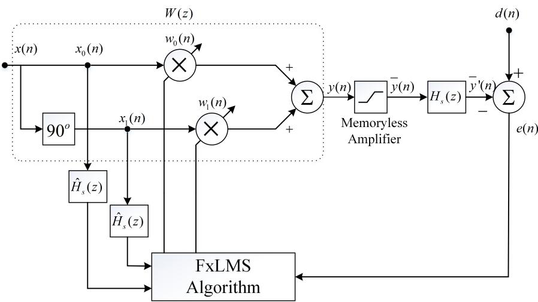  
Figure 1: Block diagram of feedforward narrow-band ANC system [20].

where D and $\omega _ { 0 }$ denote the amplitude and frequency of the noise. It has been discovered [20] that when $D \in [ 0 , V _ { \mathrm { t h r } } ]$ , the ANC system can eliminate the disturbance entirely. However, when $\textstyle D \in [ V _ { \mathrm { t h r } } , { \frac { 4 A _ { \mathrm { s } } V _ { \mathrm { t h r } } } { \pi } } ]$ , the disturbance can be canceled, but many high-frequency harmonics will be produced, and the residual error signal can be derived to be a function of the high-frequency harmonics:

$$
e (n) = \frac {2 A _ {\mathrm{s}} V _ {\mathrm{thr}} (1 - \xi^ {2}) ^ {3 / 2}}{3 (\xi \sqrt {1 - \xi^ {2}} + \arcsin \xi)} \sin (3 \omega_ {0} n) + \dots ,\tag{2}
$$

where $\begin{array} { r } { \xi = \frac { V _ { \mathrm { t h r } } } { D } } \end{array}$ and As stands for the gain of the secondary path. However, once D exceeds $\frac { 4 A _ { \mathrm { s } } V _ { \mathrm { t h r } } } { \pi }$ , the disturbance cannot be completely attenuated, and the control filter’s coeficients will overrun [20].

## 2.3.2. Broadband noise cancellation

Figure 2 depicts the block diagram of a feedforward ANC system that employs the FxLMS algorithm for adaptive noise cancellation. In the Fig. 2, $\mathbf { p } , \mathbf { w } ( n )$ , and s represent, respectively, the impulse responses of the primary path, the control filter, and the secondary path. The secondary path estimate obtained through system identification is denoted by ˆs. Moreover, an “S”- shaped nonlinear function f[·] is cascaded after the control filter to simulate the saturation efect of the output amplifier.

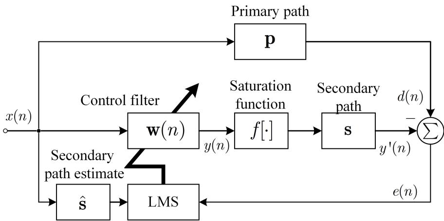  
Figure 2: Block diagram of the adaptive active noise control system with the saturation distortion, where $\displaystyle \sum$ represents the acoustic summation [30].

When the ANC system is operating, the reference signal captured by the reference microphone is passed through the control filter to create the control signal:

$$
y (n) = \mathbf {x} ^ {\mathrm{T}} (n) \mathbf {w} (n),\tag{3}
$$

in which the control filter vector is expressed as

$$
\mathbf {w} (n) = \left[ \begin{array}{c c c} w _ {0} (n) & w _ {1} (n) & \dots w _ {N - 1} (n) \end{array} \right] ^ {\mathrm{T}}.\tag{4}
$$

The error signal $e ( n )$ in Fig. 2 is obtained from

$$
e (n) = d (n) - \sum_ {l = 0} ^ {L - 1} s _ {l} f [ y (n - l) ],\tag{5}
$$

where $s _ { l }$ represents the lth coeficient of the secondary path s:

$$
\mathbf {s} = \left[ \begin{array}{l l l l} s _ {0} & s _ {1} & \dots & s _ {L - 1} \end{array} \right] ^ {\mathrm{T}}.\tag{6}
$$

The nonlinear function is given by [24]

$$
f (y) = \int_ {- \infty} ^ {y} e ^ {- \left(\frac {t}{\sigma}\right) ^ {2 M}} \mathrm{d} t - \sigma ,\tag{7}
$$

where $\sigma$ is the function’s clipping threshold $( \sigma > 0 )$ , and $e$ is the base of the natural logarithm. M determines the linearity of the function within the threshold.

According to the FxLMS algorithm [63], the new control filter is gained from

$$
\mathbf {w} (n + 1) = \mathbf {w} (n) + \mu e (n) \mathbf {x} ^ {\prime} (n),\tag{8}
$$

where $\mu$ denotes the step size. $\mathbf { x } ^ { \prime } ( n )$ stands for the filtered reference vector

$$
\mathbf {x} ^ {\prime} (n) = \left[ \begin{array}{c c c c} x ^ {\prime} (n) & x ^ {\prime} (n - 1) & \dots & x ^ {\prime} (n - N + 1) \end{array} \right] ^ {\mathrm{T}},\tag{9}
$$

where each element is obtained from

$$
x ^ {\prime} (n) = \sum_ {l = 0} ^ {L - 1} s _ {l} \cdot x (n - l).\tag{10}
$$

For the sake of simplicity, we considered the first element of the control filter vector $w _ { 0 } ( n )$ and assumed its initial value to be 0. Through (8), it can be found that [30, 64]

$$
w _ {0} (n + 1) = \mu \sum_ {i = 0} ^ {n} e (i) x ^ {\prime} (i).\tag{11}
$$

Once the disturbance cannot be completely canceled due to the output limitation, it can be demonstrated that the final residual error signal will have the same phase as $x ^ { \prime } ( n )$ [30]. Consequently, the magnitude of the control will progressively approach infinity as time passes [30]:

$$
\lim _ {n \to \infty} \mathbb {E} [ w (n + 1) ] = \infty ,\tag{12}
$$

where $\mathbb { E } [ \cdot ]$ represents the expectation operator.

The above analysis shows that the output saturation efect plays a significant role in the nonlinearity of the secondary path [65]. It creates distortion in the anti-noise and influences the stability of the adaptive control algorithms [66, 67].

## 3. Output Constraint ANC Algorithms

This section presents the algorithms of the first class, which impose an output constraint on the output signal to ensure linear operation of the output amplifier [36, 68, 69].

## 3.1. Two-gradient Direction FxLMS algorithm

To ensure the linear operation of the output amplifier, it is natural to limit the control signal’s amplitude to a particular value. However, clipping the control signal [70] with a large amplitude without modifying the control filter typically leads to the divergence of adaptive algorithms. Therefore, adaptive algorithms have been devised to obtain optimal control with amplitude output constraints in a recursive manner [36, 69, 71, 72, 73, 74]. Among these algorithms, the two-gradient direction (2GD) FxLMS algorithm has the lowest computational complexity among these algorithms [25, 37, 75].

It consists of two distinct parts, each with its own gradient direction [76]. When the amplitude of the control signal falls below a certain threshold $\left( | y ( n ) | = | \mathbf { w } ^ { \mathrm { T } } ( n ) \mathbf { x } ( n ) | \leq C \right)$ , the updating equation for the control filter is derived as

$$
\mathbf {w} (n + 1) = \mathbf {w} (n) + \mu e (n) \mathbf {x} ^ {\prime} (n);\tag{13}
$$

while the output signal $| y ( n ) | = | \mathbf { w } ^ { \mathrm { T } } ( n ) \mathbf { x } ( n ) | > C$ , the updating equation changes to be

$$
\mathbf {w} (n + 1) = \mathbf {w} (n) - \mu y (n) \mathbf {x} (n),\tag{14}
$$

where |·| and $\mu$ represent the absolute value of the argument and the step size, respectively. Moreover, due to its low computational complexity, the 2GD-FxLMS algorithm has been extended to the multichannel FxLMS algorithm as well [77].

## 3.2. Re-scaling algorithm

Alternately, the re-scaling algorithm [32] rescales the control signal and the magnitude of the control filter once the amplitude of the control signal exceeds the threshold. Once $| y ( n + 1 ) | > C$ , the control filter and control signal are given by

$$
\left\{ \begin{array}{l l} \mathbf {w} (n + 1) & = \mathbf {w} (n + 1) \cdot [ C / | y (n + 1) | ], \\ y (n + 1) & = y (n + 1) \cdot [ C / y (n + 1) ]. \end{array} \right.\tag{15}
$$

Otherwise, the control filter continues to update in accordance with the FxLMS algorithm.

It is worth noting that the 2GD-FxLMS and re-scaling algorithms belong to the amplitude constraint algorithm. When the system requires that the output power be constrained, these algorithms are only practical for regular signals whose power can be easily estimated from their amplitude. In addition to modifying the gradient, several algorithms terminate the updating process directly when the output signal surpasses the set amplitude constraint [78].

## 3.3. Leaky FxLMS algorithm

The leaky FxLMS algorithm [19] employs a leaky factor λ $( \lambda > 0 )$ to restrict the magnitude of the control filter weights to limit the output power [79, 80, 81]. Its cost function is given by

$$
J = \mathbb {E} \left[ e ^ {2} (n) \right] + \lambda \mathbf {w} ^ {\mathrm{T}} (n) \mathbf {w} (n).\tag{16}
$$

According to the gradient decent method, its recursive formula can be derived as

$$
\mathbf {w} (n + 1) = (1 - \mu \lambda) \mathbf {w} (n) + \mu e (n) \mathbf {x} ^ {\prime} (n).\tag{17}
$$

The value of the leakage factor determines the tightness of the output constraint in this algorithm. A significant reduction in output power will result from a large leakage factor and vice versa. Besides the time domain, the leaky method has also been used in the frequency domain control application [34, 82, 83, 84, 85, 86, 87, 88]. However, there are few guidelines for calculating the leakage factor in order to meet a particular output power limitation.

## 3.4. Extended leaky FxLMS algorithm

From (16), we found that the leakage factor of the leaky FxLMS algorithm is a scalar. It is natural to wonder if the leakage factor can be a matrix to enhance its control freedom [28]. Hence, the cost function can be rewritten as

$$
J (n) = e ^ {2} (n) + \| \mathbf {C w} (n) \|,\tag{18}
$$

where C represents a constraint matrix. Similarly to the derivation of the leaky FxLMS algorithm, its updating equation of the control filter can be inducted as

$$
\mathbf {w} (n + 1) = (\mathbf {I} - \mu \boldsymbol {\gamma}) \mathbf {w} (n) + \mu e (n) \mathbf {x} ^ {\prime} (n).\tag{19}
$$

It would converge to the optimal solution as [89]

$$
\mathbf {w} _ {\mathrm{o}} = \left(\boldsymbol {\gamma} + \mathbf {R} _ {x ^ {\prime}}\right) ^ {- 1} \mathbf {P} _ {d x ^ {\prime}},\tag{20}
$$

where ${ \bf P } _ { d x ^ { \prime } } = \mathbb { E } \left[ d ( n ) { \bf x } ^ { \prime } ( n ) \right]$ and ${ \mathbf { R } } _ { x ^ { \prime } } = \mathbb { E } [ { \mathbf { x } } ^ { \prime } ( n ) { \mathbf { x ^ { \prime } } } ^ { \mathrm { T } } ( n ) ]$ represent the crosscorrelation vector between the disturbance and filtered reference signal and the auto-correlation matrix of the filtered reference signal, respectively. Here, we defined an extended leakage factor as

$$
\pmb {\gamma} = \mathbf {C} ^ {\mathrm{T}} \mathbf {C},\tag{21}
$$

which is undoubtedly a positive semi-definite matrix and hence ensures the convex of (18) [89].

## 3.5. Minimum Output Variance Adaptive Filter Algorithm

As stated in the preceding sections, most adaptive output-constrained algorithms focus on limiting the magnitude of the control filter. In contrast, the minimum output variance algorithm confines the variance directly to the output power. Its cost function is represented by

$$
J = \mathbb {E} \left[ e ^ {2} (n) \right] + \alpha \mathbb {E} \left[ y ^ {2} (n) \right],\tag{22}
$$

where α $( \alpha > 0 )$ denotes penalty factor. Based on the gradient descent method, its updating formula can be derived as

$$
\mathbf {w} (n + 1) = \mathbf {w} (n) + \mu \left[ e (n) \mathbf {x} ^ {\prime} (n) - \alpha y (n) \mathbf {x} (n) \right],\tag{23}
$$

which is the so-called Minimum Output Variance (MOV) FxLMS algorithm. The optimal MOV-FxLMS solution can be resolved to be [29, 36, 90]

$$
\mathbf {w} _ {\mathrm{o}} = \left(\mathbf {R} _ {x ^ {\prime}} + \alpha \mathbf {R} _ {x}\right) ^ {- 1} \mathbf {P} _ {d x ^ {\prime}}.\tag{24}
$$

## 3.6. Optimal control under output constraint

To ensure that the output amplifier runs linearly, we can restrict the output power of the system within a given constraint $\rho ^ { 2 }$ . Therefore, its cost function can be abstracted to a quadratically constrained quadratic program (QCQP) as [91]

$$
\begin{array}{l} \min _ {\mathbf {w}} J (\mathbf {w}) = \mathbb {E} \left[ \left| d (n) - \sum_ {l = 0} ^ {L - 1} s _ {l} \mathbf {w} ^ {\mathrm{T}} (n - l) \mathbf {x} (n - l) \right| ^ {2} \right] \\ \text {s.t.} g (\mathbf {w}) = \mathbb {E} \left[ \left| \mathbf {w} ^ {\mathrm{T}} (n) \mathbf {x} (n) \right| ^ {2} \right] \leq \rho^ {2}, \end{array}\tag{25}
$$

in which $J ( \mathbf { w } )$ and $g ( \mathbf { w } )$ represent the mean square error and average output power, respectively, of the ANC system. Typically, the power constraint $\rho ^ { 2 }$ is set to the rated power of the output amplifier, which can be obtained from the amplifier’s data sheet or experimental measurements.

In accordance with the Karush–Kuhn–Tucker (KKT) conditions, the optimal solution of (25) can be determined to be [92]

$$
\mathbf {w} _ {\mathrm{o}} = \left(\lambda_ {\mathrm{o}} \mathbf {R} _ {x} + \mathbf {R} _ {x ^ {\prime}}\right) ^ {- 1} \mathbf {P} _ {d x ^ {\prime}},\tag{26}
$$

where ${ \bf P } _ { d x ^ { \prime } } = \mathbb { E } \left[ d ( n ) { \bf x } ^ { \prime } ( n ) \right]$ and ${ \mathbf { R } } _ { x ^ { \prime } } = \mathbb { E } [ { \mathbf { x } } ^ { \prime } ( n ) { \mathbf { x ^ { \prime } } } ^ { \mathrm { T } } ( n ) ]$ denote the crosscorrelation vector between the disturbance and filtered reference signal and the auto-correlation matrix of the filtered reference signal [93]. Moreover, the optimal Lagrangian factor $\lambda _ { \mathrm { o } }$ can be derived as [92]

$$
\lambda_ {\mathrm{o}} = \frac {\mathbf {w} _ {\mathrm{o}} ^ {\mathrm{T}} \mathbf {P} _ {d x ^ {\prime}} - \mathbf {w} _ {\mathrm{o}} ^ {\mathrm{T}} \mathbf {R} _ {x ^ {\prime}} \mathbf {w} _ {\mathrm{o}}}{\rho^ {2}} \mathrm{or} 0.\tag{27}
$$

Notably, $\lambda _ { 0 }$ is a positive number, which constrains the magnitude of the control filter to limit the output power. Once it reaches zero, the optimal constrained control filter will become the algorithm’s optimal solution.

In practice, obtaining the autocorrelation matrix in (26) is challenging. Adaptive algorithms have been developed in order to recursively obtain optimal control with output constraints.

## 3.7. Optimal leaky FxLMS (OLFxLMS) algorithm

To recursively solve the optimal control with output constraints, it is intuitive to set (26) equal (20):

$$
\pmb {\gamma} = \Lambda_ {0} \mathbf {R} _ {x},\tag{28}
$$

which ensures that the extended leaky FxLMS algorithm converges to the optimal control filter under the output constraint in (26). Meanwhile, the Lagrange factor $\Lambda _ { \mathrm { o } }$ can be rewritten as

$$
\Lambda_ {\mathrm{o}} = G _ {\mathrm{s}} (\eta - 1),\tag{29}
$$

where the nonlinear degree of the system is given by

$$
\eta^ {2} = \max \left(\frac {\sigma_ {d} ^ {2}}{G _ {\mathrm{s}} \rho^ {2}}, 1\right).\tag{30}
$$

Function max(·) returns the largest of the input values. Moreover, $\sigma _ { d } ^ { 2 }$ denotes the variance of the disturbance as $\sigma _ { d } ^ { 2 } = \mathbb { E } [ d ^ { 2 } ( n ) ]$ , and $G _ { s }$ represents the power gain of the secondary path.

To estimate the power gain, we can first obtain the inverse secondary path $\mathbf { c } _ { \mathrm { o } }$ using the inverse modeling method, as shown in Fig. 3. Then, the predicted control signal can be calculated as

$$
\hat {y} _ {d} (n) = \mathbf {c} _ {\mathrm{o}} ^ {\mathrm{T}} \mathbf {d} (n),\tag{31}
$$

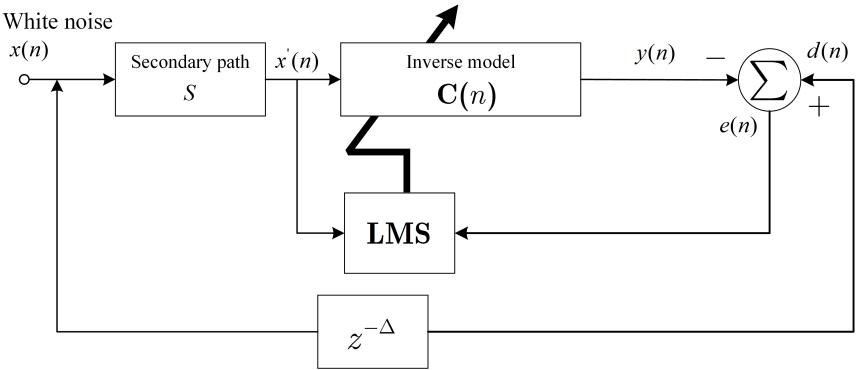  
Figure 3: Block diagram of adaptive inverse modeling for the secondary path [77].

where $\mathbf { d } ( n )$ is the disturbance vector of $d ( n )$ . The power gain of the secondary path can be estimated as

$$
\hat {G} _ {\mathrm{s}} = \frac {\sum_ {i = 0} ^ {I} d ^ {2} (n - i)}{\sum_ {i = 0} ^ {I} \hat {y} _ {d} ^ {2} (n - i)},\tag{32}
$$

in which I denotes the number of sample data.

Once the optimal leakage factor has been determined from (28) to (32), the extended leaky FxLMS algorithm can be used to obtain the optimal control with a given output constraint. However, γ is a matrix, which unavoidably raises the algorithm’s computational complexity [81].

## 3.8. Optimal MOV FxLMS algorithm

In comparison to the extended FxLMS algorithm, the MOV-FxLMS algorithm requires less computation. In order to ensure that the MOV-FxLMS algorithm achieves optimal control under a particular output constraint, we set (20) to equal (24), and we can get

$$
\alpha = \Lambda_ {\mathrm{o}}.\tag{33}
$$

In this instance, it can be demonstrated that the MOV-FxLMS algorithm converges to the optimal control filter under the output constraint in the steady state [30]. While the $\Lambda _ { \mathrm { o } }$ Lagrange factor is obtained using the inverse modeling technique described in (29).

## 3.9. MOV-Modified-FxLMS with variable penalty factor

Based on the preceding sections, it can be found that the determination of the optimal leakage factor and penalty factor is conducted by ofline estimation. The eficacy of their applications in addressing dynamic noise and varying acoustic environments is compromised. What’s worse. The estimation cannot be accomplished online due to the sluggish convergence resulting from the inverse modeling technique.

Since determining the power gain of the secondary path is the central issue in the estimation of the leakage factor and penalty factor, a more pragmatic approach has been proposed to realize the online estimation as follows [31]:

$$
\hat {G} _ {s} (n) = \frac {\sigma_ {x ^ {\prime}} ^ {2} (n)}{\sigma_ {x} ^ {2} (n)} \approx G _ {s},\tag{34}
$$

where $\sigma _ { x ^ { \prime } } ^ { 2 }$ and $\sigma _ { x } ^ { 2 }$ represent the variances of the filtered reference signal and the reference signal, respectively. With the help of the moving filter method, the above estimation can be performed during the control process at a low computational cost. Hence, in this situation, the penalty factor is obtained from [31]

$$
\alpha (n) = \max \left\{\hat {G} _ {s} (n) \left(\sqrt {\frac {\sum_ {k = 0} ^ {K - 1} \hat {d} ^ {2} (n - k)}{K \rho^ {2} \hat {G} _ {s} (n)}} - 1\right), 0 \right\},\tag{35}
$$

296 where K denotes the moving filtering length.

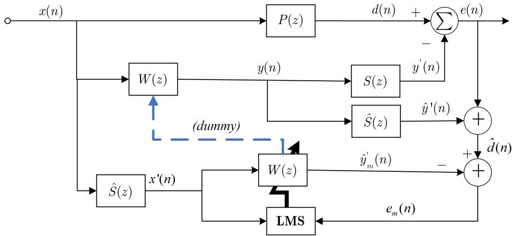  
Figure 4: Block diagram of the modified FxLMS algorithm [31].

The utilization of the modified FxLMS algorithm is a suitable option for the estimation strategy due to its requirement of the disturbance signal. The estimated disturbance in the algorithm would be reconstructed, as depicted in Fig. 4. Additionally, the modified FxLMS method exhibits superior convergence characteristics compared to the conventional FxLMS algorithm.

Unlike other adaptive algorithms with output constraint, the MOV-Modified FxLMS algorithm can estimate the optimal penalty factor online to accomplish the optimal noise control under the specific output constraint, even when dealing with dynamic noise or variable acoustic environments [94].

## 4. Nonlinear FxLMS algorithms

This section overviews the algorithms of the second type, which utilizes the nonlinear models to generate the nonlinear components in the control signal to counterbalance the efects of output saturation [40, 41, 42, 54, 74, 95, 96, 97, 98, 99, 100, 101, 102, 103].

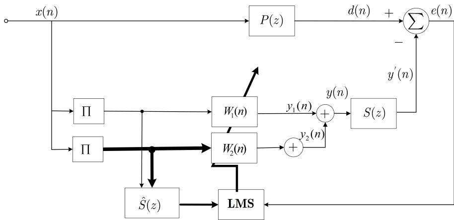  
Figure 5: Second Order VFxLMS based ANC [43].

## 4.1. The second-order Volterra filter FxLMS (2nd-VFxLMS) algorithm

The first nonlinear filter algorithm investigated in this study is the second order Volterra filter with the FxLMS algorithm(2nd-VFxLMS) [43] which incorporates a second-order Volterra feedforward term to enhance the nonlinear representation capability of the FxLMS algorithm [104, 105, 106, 107, 108, 109, 110].

Figure 5 shows the block diagram of 2nd-VFxLMS which output signal is given by

$$
y (n) = \underbrace {\sum_ {i = 0} ^ {N - 1} w _ {1} ^ {(i)} (n) \cdot x (n - i)} _ {\text { First - order   term }} + \underbrace {\sum_ {i = 0} ^ {N - 1} \sum_ {j = i} ^ {N - 1} w _ {2} ^ {(i , j)} (n) \cdot x (n - i) x (n - j)} _ {\text { Secondary - order   term }},\tag{36}
$$

where319 $w _ { 1 } ^ { ( i ) } ( n )$ denotes the ith coeficient of the first-order control filter, and 320 $w _ { 2 } ^ { ( i , j ) } ( n )$ represents the ijth coeficient of the second-order control filter. Con-

321 currently, the error signal is acquired from

$$
\begin{array}{l} e (n) = d (n) - \sum_ {l = 0} ^ {L - 1} \sum_ {i = 0} ^ {N - 1} s _ {l} \cdot w _ {1} ^ {(i)} (n - l) x (n - i - l) \\ \qquad - \sum_ {l = 0} ^ {L - 1} \sum_ {i = 0} ^ {N - 1} \sum_ {j = i} ^ {N - 1} s _ {l} \cdot w _ {2} ^ {(i, j)} (n - l) x (n - i - l) x (n - j - l). \end{array}\tag{37}
$$

322 By utilizing the gradient descent method to minimize the square error of 323 (37), the recursive formula of the control filter in the 2nd-VFxLMS algorithm 324 is derived as

$$
\left\{ \begin{array}{l l} w _ {1} ^ {(i)} (n + 1) & = w _ {1} ^ {(i)} (n) + \mu e (n) \sum_ {l = 0} ^ {L - 1} \hat {s} _ {l} \cdot x (n - i - l), \\ w _ {2} ^ {(i, j)} (n + 1) & = w _ {2} ^ {(i, j)} (n) + \\ & \mu e (n) \sum_ {l = 0} ^ {L - 1} \hat {s} _ {l} \cdot x (n - i - l) x (n - j - l), \end{array} \right.\tag{38}
$$

in which $\hat { s } _ { l }$ denotes the lth coeficient of the secondary path estimate.

Based on equations (36) and (38), the 2nd-VFxLMS necessitates much more computational resources compared to the FxLMS algorithm [111, 112, 113]. However, this increased computational burden is attended by an improvement in its nonlinear approximation capability, attributable to the inclusion of the second-order element.

Based on the above algorithm, a series of Volterra-based algorithms are developed to reduce the computational load, such as the filtered-X afine projection (FxAP) Volterra algorithm [100, 110, 114, 115] adaptive recursive second-order Volterra (RSOV) [116] filter-based filtered error LMS (FeLMS) algorithm, and genetic algorithms (GAs) proposed by [113]. However, these algorithms still encounter specific issues, such as convergence to local minima or poorer performance at lower frequencies.

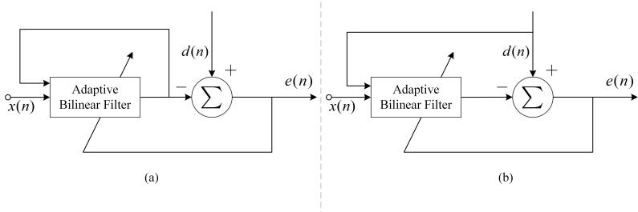  
Figure 6: (a) Output Error Bilinear filter (b) Equation error Bilinear filter [22].

## 4.2. The Bilinear filter FxLMS (BFxLMS) Algorithm

The limitation of the 2nd-VFxLMS lies in its incapability to efectively represent systems exhibiting pronounced nonlinearity, particularly in cases of severe saturation within the signal [22]. The bilinear filter could solve the same issue with the lower order and feedforward and feedback polynomials similar to linear infinite-impulse response(IIR) filters [47, 117, 118, 119, 120, 121, 122].

Kuo et al. [22] proposed two distinct types of adaptive bilinear filters, namely the output error method shown Fig. 6 (a) and the equation error method shown in Fig. 6 (b). The output error technique is widely favored and applied due to its practicality, ofering unbiased estimates by utilizing a recursive model [123]. With the output error method, the BFxLMS ANC could be used to model the nonlinearity of the secondary path, and its block diagram is shown in Fig. 7.

The control signal of the output-error bilinear filter in Fig. 7 is obtained

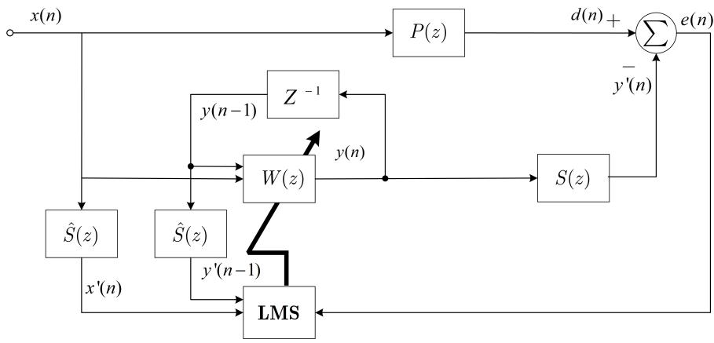  
Figure 7: The block diagram of feedforward ANC system using equation error bilinear filter [22].

353 from

$$
\begin{array}{c} y (n) = \sum_ {i = 0} ^ {N} a _ {i} (n) x (n - i) + \sum_ {j = 1} ^ {N} b _ {j} (n) y (n - j) + \\ \sum_ {i = 0} ^ {N} \sum_ {j = 1} ^ {N} c _ {i, j} (n) x (n - i) y (n - j), \end{array}\tag{39}
$$

where $a _ { i } ( n ) , b _ { j } ( n )$ and $c _ { i , j } ( n )$ denotes the filter’s coeficients.

To achieve simplification, Kuo et al. [22] derived the BFxLMS algorithm with a filter length of N. The coeficient $a ( n )$ represents the feedforward coeficient vector of size $N + 1$ , while the coeficient $b ( n )$ denotes the feedback coeficient vector of size N.

Furthermore, the error signal picked up by the error microphone is rep-

360 resented can be derived as

$$
\begin{array}{l} e (n) = d (n) - \sum_ {l = 0} ^ {L - 1} \sum_ {i = 0} ^ {N} s _ {l} \cdot a _ {i} (n - l) x (n - i - l) \\ \qquad - \sum_ {l = 0} ^ {L - 1} \sum_ {j = 1} ^ {N} s _ {l} \cdot b _ {j} (n - l) y (n - j - l) \\ \qquad - \sum_ {l = 0} ^ {L - 1} \sum_ {i = 0} ^ {N} \sum_ {j = 1} ^ {N} s _ {l} \cdot c _ {i, j} (n - l) x (n - i - l) y (n - j - l). \end{array}\tag{40}
$$

361 The recursive formula of the control filter in this adaptive algorithm as

$$
\left\{ \begin{array}{l l} a _ {i} (n + 1) & = a _ {i} (n) + \mu e (n) \sum_ {l = 0} ^ {L - 1} \hat {s} _ {l} \cdot x (n - i - l), \\ b _ {j} (n + 1) & = b _ {j} (n) + \mu e (n) \sum_ {l = 0} ^ {L - 1} \hat {s} _ {l} \cdot y (n - j - l), \\ c _ {i, j} (n + 1) & = c _ {i, j} (n) + \mu e (n) \sum_ {l = 0} ^ {L - 1} \hat {s} _ {l} \cdot x (n - i - l) y (n - j - l), \end{array} \right.\tag{41}
$$

which is the so-called Bilinear filter FxLMS algorithm.

Via modeling and compensating for nonlinear saturation, the BFxLMS algorithm improves the performance of the ANC system [48]. This algorithm incorporates the product of the input and output signals as a nonlinear term into the adaptive filter, achieving a more precise representation of the nonlinear systems. Hence, when confronted with severe nonlinear saturation, the BFxLMS algorithm shows better noise reduction performance and quicker convergence speed.

## 4.3. Functional Link artificial neural network (FLANN) based Filter-s LMS Algorithm

Although the BFxLMS has better noise reduction performance than the 2nd-VFxLMS, the computation complexity is still high. The functional link artificial neural network (FLANN) [50] filter then been proposed and frequently used to model the nonlinearity of the signal. It presents an innovative multi-layer artificial neural network (MLANN) configuration, utilizing a singular, flat network to decrease computational complexity [124, 125, 126, 127, 128, 129, 130] which is shown in Fig. 8.

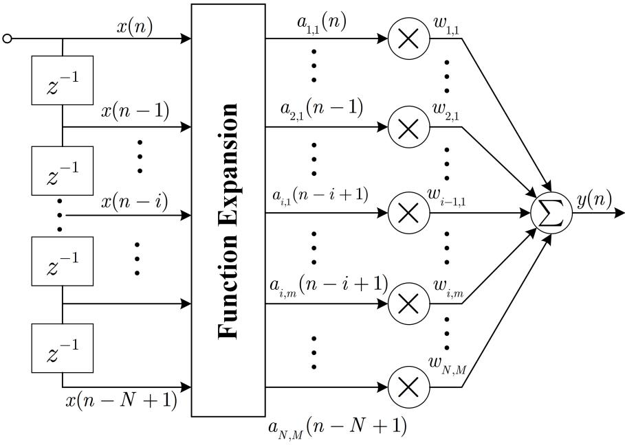  
Figure 8: The block diagram of general structure of FLANN [50].

The fundamental concept underlying the functional link relies on a set of generated linearly independent functions joined as patterns to enhance the representation and reduce the complexity of the learning process. It is able to establish a consistent framework for various network types and contains three functions: supervised learning, associative memory storage and retrieval, and unsupervised learning. There are several types of functional expansion [131], and the most representative model is trigonometry expansion.

By integrating this trigonometric FLANN into the ANC system, a novel algorithm called filtered-s least mean square (FsLMS) has been proposed by [49] as shown in Fig. 9, where the filtered-s means filtered the functionally enhanced vector (after functional expansion). Its control signal is obtained from

$$
y (n) = \sum_ {i = 1} ^ {N} \sum_ {m = 1} ^ {M} w _ {i, m} (n) \cdot a _ {i, m} (n),\tag{42}
$$

91 where M is the length of functional expansion vector and the functional 92 expansion value of the reference signal is given by

$$
a _ {i, m} (n) = \left\{ \begin{array}{l l} x (n - i + 1), & m = 1, \\ \sin \big \{\lfloor \frac {m}{2} \rfloor \pi x (n - i + 1) \big \}, & m \mod 2 = 0, \\ \cos \big \{\lfloor \frac {m}{2} \rfloor \pi x (n - i + 1) \big \}, & m \mod 2 = 1, \text {   and   } m \neq 1. \end{array} \right.\tag{43}
$$

393 In the equation, ⌊·⌋ and mod denote floor rounding and remainder opera-394 tions, respectively. The error signal is derived as

$$
\begin{array}{l} e (n) = d (n) + \sum_ {l = 0} ^ {L - 1} s _ {l} \cdot y (n - l) \\ \qquad = d (n) + \sum_ {l = 0} ^ {L - 1} \sum_ {i = 1} ^ {N} \sum_ {m = 1} ^ {M} s _ {l} \cdot w _ {i, m} (n - l) \cdot a _ {i, m} (n - l). \end{array}\tag{44}
$$

395 The recursive formula for the imth weight of the control filter is derived as

$$
w _ {i, m} (n + 1) = w _ {i, m} (n) - \mu e (n) v _ {i, m} (n).\tag{45}
$$

396 The filtered expanded signal is obtained from

$$
v _ {i, m} (n) = \sum_ {l = 0} ^ {L - 1} \hat {s} _ {l} \cdot a _ {i, m} (n - l).\tag{46}
$$

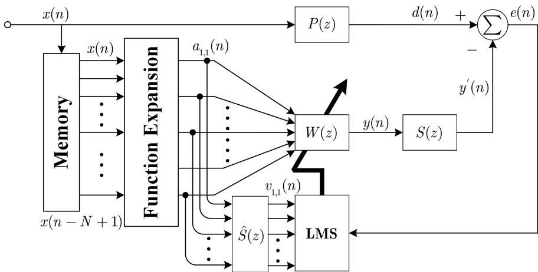  
Figure 9: Block diagram of the FsLMS algorithm used in a feedforward ANC system [50].

Similar to the FxLMS algorithm, the FsLMS algorithm follows the same logic as FxLMS and just incorporates a nonlinear expansion of the reference signal, thereby augmenting the adaptive algorithm’s capacity for nonlinear representation [132].

## 4.4. Tangential Hyperbolic Function (THF) FxLMS Algorithm

The Tangential Hyperbolic Function (THF) is a nonlinear mathematical function commonly employed in modeling nonlinear noise signals to address the saturation efect observed in secondary path. The primary focus of the THF-FxLMS algorithm is to represent the secondary saturation effect [38, 133, 134] through the utilization of a tangential hyperbolic function [135] characterized by constant parameters. The general expression for this representation is provided as follows

$$
f _ {\mathrm{THF}} (y) = \alpha_ {f} \cdot \tanh (\beta \cdot y),\tag{47}
$$

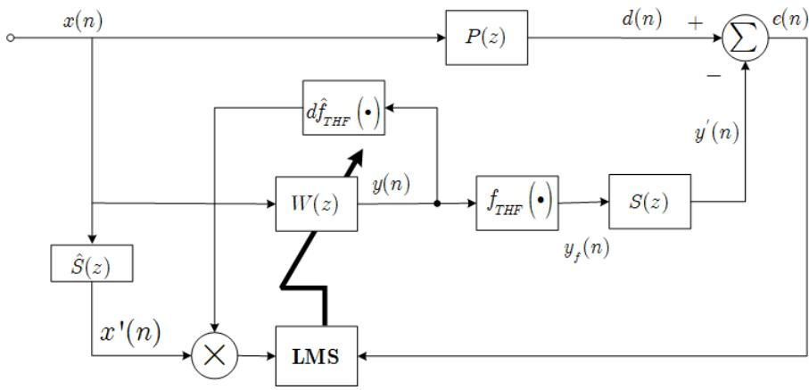  
Figure 10: Block diagram of the THF-FxLMS algorithm used in the ANC system [38].

where $\alpha _ { f }$ and $\beta$ denote scaling parameters that indicate strength and saturation.

Figure 10 illustrates the block diagram of a THF based FxLMS algorithm in ANC system, where $f _ { \mathrm { T H F } } ( \cdot )$ denote the nonlinear and linear parts of the secondary path. It is noteworthy to mention that a Hammerstein model is employed to approximate the secondary path during the modeling process [38]. The nonlinear aspect of this model is subsequently employed in the THF-FxLMS algorithm.

The error signal in Fig. 10 is obtained from

$$
e (n) = d (n) - \alpha_ {f} \cdot \tanh [ \beta \cdot y (n) ] * s (n).\tag{48}
$$

The weight-updating equation can be derived as

$$
\mathbf {w} (n + 1) = \mathbf {w} (n) - \mu e (n) \cdot \hat {\alpha} _ {f} \hat {\beta} \cdot \left\{1 - \tanh ^ {2} \left[ \hat {\beta} \cdot y _ {c} (n) \right] \right\} \mathbf {x} ^ {\prime} (n),\tag{49}
$$

where $\hat { \alpha _ { f } }$ and $\hat { \beta }$ are estimated scaling parameters to be used in the real-time implementation.

Moreover the small step size value $\mu$ should be used to ensure the stability of adaptive control algorithm. The THF-FxLMS algorithm is more advantageous than the previous algorithm as it has slightly less computation complexity and allows a greater degree of nonlinearity to be modeled [39], while the simulation results of [39, 51, 52] show that THF-based FxLMS ANC achieves significant noise reduction than the 2nd-VFxLMS algorithm.

In addition to these nonlinear FxLMS algorithms, several innovative methodologies enhance nonlinear performance by cascading the nonlinear model after the control filter [24], but still causing significantly higher computation complexity.

## 4.5. Multi-layered perception neural networks (MLPNN) FxLMS Algorithm

The multi-layer perceptron neural networks (MLPNN) has been demonstrated to possess the capacity to approximate any arbitrary function. Therefore, several works employ MLPNN to address the nonlinearities [53, 136] in ANC applications. The diagram presented in Figure 11 depicts a feedforward ANC system wherein an MLPNN is employed as the controller. For simplicity, it is assumed that this MLPNN consists solely of one hidden layer. The input of the lth neuron in the h layer can be represented as

$$
x _ {l} ^ {(h)} = \sum_ {k = 0} ^ {N - 1} w _ {k l} ^ {(h)} x _ {k} ^ {(h - 1)},\tag{50}
$$

439 and its output is obtained from

$$
y _ {l} ^ {(h)} = f (x _ {l} ^ {(h)}),\tag{51}
$$

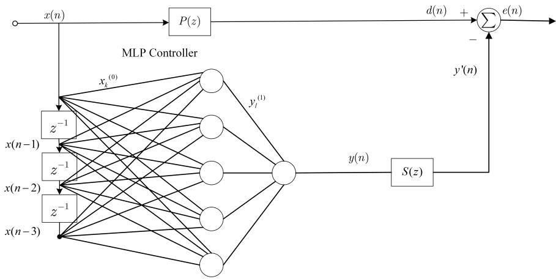  
Figure 11: A feedforward ANC system with the MLPNN controller [53].

where f(·) denotes a nonlinear activation function. It is worth noting that the first layer’s input is given by

$$
x _ {k} ^ {(0)} = x (n - k).\tag{52}
$$

The weight-updating equation can be represented as

$$
w _ {k l} ^ {(h)} (n + 1) = w _ {k l} ^ {(h)} (n) + \mu e (n) \frac {\partial J (n)}{\partial w _ {k l} ^ {(h)}},\tag{53}
$$

in which the derivative in the final term can be computed by using the backpropagation method [137].

Despite MLPNN’s strong capability for nonlinear representation, its extensive computational demands pose challenges to its practical applicability. As the number of layers increases, the problem of gradient vanishing will become more pronounced and have a significant impact on the convergence behavior of the model.

Furthermore, numerous deep-learning-based algorithms have emerged in recent times [138, 139, 140, 141, 142, 143, 144], drawing inspiration from the

MLPNN ANC technique. These algorithms exhibit promising capabilities to attain exceptional nonlinear noise reduction performance, particularly when coupled with advanced computing units in forthcoming times.

## 5. Comparison of the algorithms

In this section, the comparative studies between output-constraint algorithms and nonlinear adaptive algorithms from diferent perspectives.

## 5.1. Computational complexity of adaptive algorithms

Computational complexity plays a crucial role in assessing the efectiveness of an algorithm, especially for the implementation in the real-time processor. Hence, this section summarizes the computational requirements of both output constraint and nonlinear adaptive algorithms.

<table><tr><td>Algorithm</td><td>Adaptive filter equation</td></tr><tr><td>2nd-VFxLMS</td><td> $\begin{cases} w_1^{(i)}(n+1) & =w_1^{(i)}(n)+\mu e(n)\sum_{l=0}^{L-1}\hat{s}_l\cdot x(n-i-l), \\ w_2^{(i,j)}(n+1) & =w_2^{(i,j)}(n)+ \\ & \mu e(n)\sum_{l=0}^{L-1}\hat{s}_l\cdot x(n-i-l)x(n-j-l). \end{cases}$ </td></tr><tr><td>BFxLMS</td><td> $\mathbf{w}(n+1)=\mathbf{w}(n)+\mu\left\{\hat{s}(n)*[x(n)\ldots x(n-N)y(n-1)\ldots y(n-N)x(n)y(n-1)\ldots x(n-N)y(n-N)]^T\right\}e(n)$ </td></tr><tr><td>FLANN-FsLMS</td><td> $w_{i,m}(n+1)=w_{i,m}(n)-\mu e(n)v_{i,m}(n), \text{ where } v_{i,m}(n)=\sum_{l=0}^{L-1}\hat{s}_l\cdot a_{i,m}(n-l)$ </td></tr><tr><td>THF-FxLMS</td><td> $\mathbf{w}(n+1)=\mathbf{w}(n)-\mu e(n)\cdot\hat{\alpha}_f\hat{\beta}\cdot\left\{1-\tanh^2\left[\hat{\beta}\cdot y_c(n)\right]\right\}\hat{\mathbf{x}}(n)$ </td></tr><tr><td>MLPNN-FxLMS</td><td> $w_{kl}^{(h)}(n+1)=w_{kl}^{(n)}(n)+\mu e(n)\frac{\partial J(n)}{\partial w_{kl}^{(h)}}$ </td></tr><tr><td>2-GD FxLMS</td><td> $\begin{cases} \mathbf{w}(n+1) = \mathbf{w}(n) + \mu e(n)\mathbf{x}'(n), & |y(n)| = |\mathbf{w}^{\mathrm{T}}(n)\mathbf{x}(n)| \leq C, \\ \mathbf{w}(n+1) = \mathbf{w}(n) - \mu y(n)\mathbf{x}(n), & |y(n)| = |\mathbf{w}^{\mathrm{T}}(n)\mathbf{x}(n)| > C \end{cases}$ </td></tr><tr><td>Re-scaling FxLMS</td><td> $\begin{cases} \mathbf{w}(n+1) = \mathbf{w}(n+1) \cdot [C/|y(n+1)|], & |y(n+1)| > C, \\ \mathbf{w}(n+1) = \mathbf{w}(n) + \mu e(n)\mathbf{x}'(n) \end{cases}$ </td></tr><tr><td>Leaky FxLMS</td><td> $\mathbf{w}(n+1) = (1 - \mu\lambda)\mathbf{w}(n) + \mu e(n)\mathbf{x}'(n)$ </td></tr><tr><td>Extended leaky FxLMS</td><td> $\mathbf{w}(n+1) = (\mathbf{I} - \mu\lambda)\mathbf{w}(n) + \mu e(n)\mathbf{x}'(n)$ </td></tr><tr><td>Optimal MOV FxLMS</td><td> $\mathbf{w}(n+1) = \mathbf{w}(n) + \mu[e(n)\mathbf{x}'(n) - \alpha_{o}y(n)\mathbf{x}(n)]$ </td></tr><tr><td>Modified MOV FxLMS</td><td> $\mathbf{w}(n+1) = \mathbf{w}(n) + \mu[e(n)\mathbf{x}'(n) - \alpha(n)y(n)\mathbf{x}(n)]$ </td></tr></table>

Table 2: The updating equations of nonlinear adaptive algorithms.

Table 3: The updating equations of output constraint algorithms.

To compare these algorithms, we listed their updating equations in Table 2 and 3. Table 4 and 5 illustrate the detailed computational requirements of these algorithms, where N, L, and K denote the length of the control filter, secondary path estimate, and moving filter; P represents the order of the functional expansion. In the MLPNN algorithm, M and L indicate the number of input layers and hidden layer nodes, respectively [145].

Furthermore, Figure 12 shows the varied computation amount of these algorithms with increasing filter length. For the sake of simplicity, N, L, and K are set equal and gradually change from 0 to 512, and P is set to 2.

Among nonlinear adaptive algorithms, MLPNN has the highest computational burden, even though it can better model the nonlinearity of the secondary path. In contrast, the nonlinear adaptive algorithm with the least computational overhead presented in this paper is THF-FxLMS. Nevertheless, it still involves derivative operations of nonlinear functions in addition

477 to multiplication and addition [38]. Overall, the enormous computational demand presents practical challenges for nonlinear adaptive algorithms.

<table><tr><td>Algorithms</td><td>Multiplication</td><td>Addition</td></tr><tr><td>FxLMS</td><td> $2N + L + 1$ </td><td> $2N + L - 2$ </td></tr><tr><td>2nd-VFxLMS</td><td> $(3N^{2} + 9N + 2L + 2)/2$ </td><td> $N^{2} + 2N + L - 3$ </td></tr><tr><td>BFxLMS</td><td> $3N^{2} + 8N + 2L + 5$ </td><td> $2N^{2} + 6N + 2L - 3$ </td></tr><tr><td>FLANN- FxLMS</td><td> $N(2P + 1)(L + 3) - L$ </td><td> $N(2P + 1)(L + 1) + 1$ </td></tr><tr><td>THF-FxLMS</td><td> $2N + 2L + 3$ </td><td> $2N + 2L - 3$ </td></tr><tr><td>MLPNN-FxLMS</td><td> $3M^{2}L + 4ML + 2L$ </td><td> $M^{2}L + 2ML + 4L + M$ </td></tr></table>

Table 4: Computational complexity of nonlinear adaptive algorithms.

In contrast, the output-constraint algorithms have a much lighter computational complexity, as shown in Fig. 12. They replace characterizing the nonlinear system with suppressing the output power, forcing the system to operate in the linear region. Compared to the FxLMS algorithm, 2-GD FxLMS among these algorithms exhibits similar computational complexity, while the leaky algorithm has slightly higher complexity. Moreover, the extended leaky FxLMS algorithm shows better control flexibility at the expense of higher computational complexity [89]. Meanwhile, the optimal MOV FxLMS algorithm strikes a favorable equilibrium between computational complexity and constraint performance.

Therefore, in terms of computational complexity, the output-constraint algorithms undoubtedly perform much better than the nonlinear adaptive algorithms.

(a) Number of Multiplication for different Algorithms  
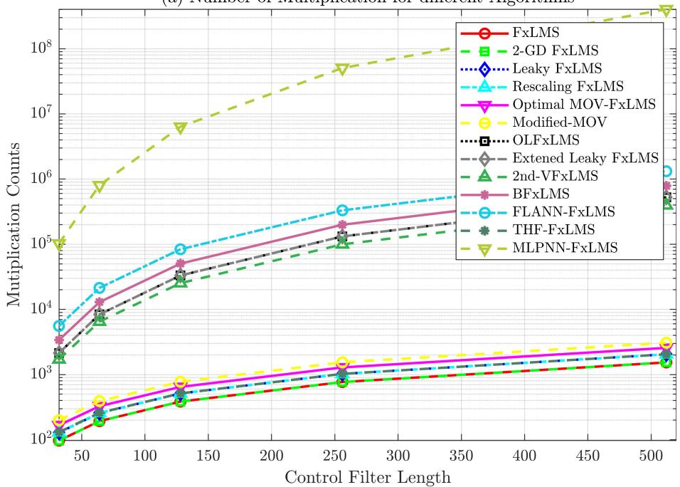

(b) Number of Addition for different Algorithms  
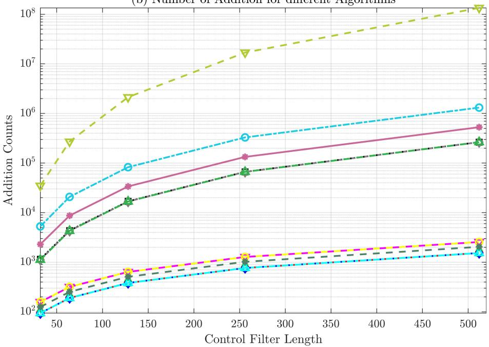  
Figure 12: The computational complexity of algorithms varies depending on the length of the control filter, resulting in difering numbers of (a) Multiplications of control filter with length 32 to 512 and (b) Additions of control filter with length 32 to 512.

<table><tr><td>Algorithm Type</td><td>Multiplication</td><td>Addition</td></tr><tr><td>FxLMS</td><td> $2N + L + 1$ </td><td> $2N + L - 2$ </td></tr><tr><td>2-GD FxLMS</td><td> $2N + L + 1$ </td><td> $2N + L - 2$ </td></tr><tr><td>Leaky FxLMS</td><td> $3N + L + 1$ </td><td> $2N + L - 2$ </td></tr><tr><td>Rescaling FxLMS</td><td> $3N + L + 2$ </td><td> $2N + L - 2$ </td></tr><tr><td>Optimal MOV-FxLMS</td><td> $4N + L + 7$ </td><td> $4N + L - 2$ </td></tr><tr><td>Modified MOV-FxLMS</td><td> $4N + L + K + 7$ </td><td> $4N + L - 2$ </td></tr><tr><td>Optimal leaky FxLMS</td><td> $2N^{2} + 2N + L$ </td><td> $N^{2} + 3N + L - 2$ </td></tr><tr><td>Extend Leaky FxLMS</td><td> $2N^{2} + 2N + L + 1$ </td><td> $N^{2} + 2N + L - 2$ </td></tr></table>

Table 5: Computational complexity of output-constraint adaptive algorithms.

## 5.2. Nonlinear performance of the adaptive algorithms

493 The nonlinear adaptive algorithms usually bring the nonlinear function 494 or terms in their filtering operation to enhance their nonlinear representa-495 tion ability. During these algorithms, the Volterra filter excels at handling 496 high-order nonlinear systems but is hindered by its high computational com-497 plexity, limiting its real-time applications and robustness [45]. The BFxLMS 498 requires fewer computations and is suitable for moderately complex non-499 linear systems; however, its performance may degrade when dealing with 500 high-order nonlinearities [46]. The FLANN algorithm leverages neural net-501 works to adapt to various nonlinear systems, providing robustness. However, 502 it requires substantial data and computational resources for training, which 503 may not be ideal for high real-time demands [146]. The THF algorithm 504 excels in managing periodic noise, showing good real-time performance and 505 robustness, but its efectiveness is limited to specific noise types [39]. The 506 MLPNN method, with excellent approximate ability for arbitrary functions, 507 also performs well in dealing with the nonlinearity of the system [147].

These approaches deform the input signal and create the nonlinear output components, which are used to counterbalance the nonlinear efect of the power amplifier. They function similarly to the predictive distortion technique, so in addition to producing the anti-noise signal, their adaptive filters must also create the nonlinear amplifier’s inverse model [148] to compensate for the output-saturation distortions. Therefore, the nonlinear representation ability of these algorithms determines their performance to overcome the nonlinearity of the power amplifier. Although these algorithms show their nonlinear performance to some extent, few indicators or measurement techniques can quantitatively reflect the strength of their nonlinear representation ability. On the other hand, the complicated and dynamic model of the power amplifier when entering the severe output saturation state creates many challenges to be accurately estimated. Therefore, these obstacles seriously impede the investigation of the efectiveness of these nonlinear adaptive algorithms in dealing with the output saturation efect.

## 5.3. Stability issue of the adaptive algorithms

As stated in Section 2.3, the amplifier output saturation can be categorized into two states: mild and severe output saturation conditions. In mild saturation, the linear adaptive algorithm can attenuate the fundamental frequency component and achieve convergence but still leave harmonic distortions. In this scenario, nonlinear adaptive algorithms are widely recognized as superior in reducing noise, as they can employ the pre-distortion strategy to mitigate harmonic distortions efectively.

However, when the amplifier reaches a state of severe output saturation, it cannot fully attenuate the disturbance’s fundamental components. It would cause the magnitude of the coeficients in the control filter to continuously increase until they reach a point of overflow, resulting in system divergence. This phenomenon will occur in both linear and nonlinear adaptive algorithms. In this situation, the use of adaptive algorithms that limit output can restrict output power, forcing the amplifier to operate in a linear model. Although these algorithms cannot assist the ANC system in entirely canceling the disturbance, they can efectively preserve its stability.

## 5.4. Overall real-time performance investigation of adaptive algorithms

To assess the real-time performance of these algorithms, we have compiled an analysis of their computational complexity and stability. These factors are crucial in determining the feasibility of implementing these algorithms in a real-time processor [149].

The computational eficiency and stability of these methods are provided in Tables 6 and 7. The tables concisely summarize the algorithm’s eficacy in addressing the saturation issue. These results show that nonlinear adaptive algorithms ofer good nonlinear performance at the expense of substantial computation costs. However, there are still no experimental validations that they can still maintain stability when the amplifier enters a severe nonlinear region. In contrast, output constraint algorithms present a more manageable approach to controlling signal regulation and exhibit lower computational complexity, thus requiring fewer computing resources for signal processing.

## 6. Conclusion

This paper provides a systematic view of the output-saturation issue, which plays a primary role in the nonlinearity of the ANC system, as well as its recent adaptive solutions. Unlike other overview papers, this work starts with a theoretical investigation of the nonlinear ANC system and reveals that it originates from the output-saturation problem of the output amplifier. To address this issue, we introduced two types of adaptive algorithms through their fundamental principles and executive mechanisms. The first category comprises output constraint algorithms, including 2-GD FxLMS, re-scaling FxLMS, optimal leaky FxLMS, and MOV FxLMS algorithms. These algorithms primarily impose constraints on the output signal from the output amplifier to ensure linear signal operation. Their lower computational load contributes to robust real-time performance. The second category involves nonlinear filter algorithms such as the Volterra filter, Bilinear filter, FLANN, THF, and MLPNN based FxLMS algorithms, which aim to eliminate the saturation efect by modelling the nonlinearity at the output amplifier. These algorithms efectively utilize pre-distortion strategies to reduce the presence of harmonic distortions but entail higher computational complexity. Furthermore, with a specific focus on their feasibility for real-time implementation, comparative studies of these algorithms are conducted in this paper through their computational complexity and practical stability properties. The evaluation results uncover that output-constrained adaptive algorithms achieve an excellent balance between the feasibility of real-time implementation and nonlinear performance.

<table><tr><td>Algorithms</td><td>Stability</td><td>Computational efficiency</td></tr><tr><td>2-GD</td><td>·High adaptability and system stability [25]. ·Dynamically tuning the filter weight with a simple operator [37]. ·Relatively high robustness [25].</td><td>·Same computation complexity as conventional FxLMS [77]. ·Momentum 2GD algorithm with variable step size enables real-time implementation [75]. ·Real-time implementation has been carried out in [37].</td></tr><tr><td>Re-scaling</td><td>·Keep stable when the step size is within the stability requirement of FxLMS algorithm [32].</td><td>·Slightly higher computation complexity than FxLMS [25, 92].</td></tr><tr><td>Optimal Leaky</td><td>·Optimal Leaky prevents output saturation and improves noise reduction performance [29, 92].</td><td>·Require higher computation complexity for OLFxLMS [28, 92]. ·Determination of the optimal leaky factor requires more steps [35].</td></tr><tr><td>Optimal Mov-FxLMS</td><td>·Slightly slower convergence speed with higher stability [30, 31]. ·Relatively high robustness [29].</td><td>·Own the high computational efficiency in the progress of real-time adaptation but require more steps to determine the penalty factor [31].</td></tr><tr><td>Modified Mov-FxLMS</td><td>·Higher stability of Constraints the output signal power [31]. ·Resolve the over-constraints issue in optimal MOV FxLMS algorithms [31].</td><td>·Slightly higher computational complexity [31]. ·Implementable computational load with the sudden changes in noise type [31].</td></tr><tr><td>Algorithm</td><td>Stability</td><td>Computational Efficiency</td></tr><tr><td>2nd-VFxLMS</td><td>Modelling higher order nonlinear saturation which performance better than FIR [43, 150].No guaranteed stability that depends on the conditions [45].</td><td>Relatively high computational load [44].Limited performance in real-time applications [44].</td></tr><tr><td>BFxLMS</td><td>Stability depends on conditions and is especially unstable for IIR case [48].</td><td>Relatively lower cost of computation than 2nd-VFxLMS.</td></tr><tr><td>FLANN-FsLMS</td><td>Leverage of neural network to model nonlinear saturation enhances robustnessUnable to assure stability [46].</td><td>Relative high computational cost and complex model lead to difficulty in real-time implementation [146, 151, 152].</td></tr><tr><td>THF-FxLMS</td><td>Capable of modeling both linear and nonlinear parts of the output signal [39, 51].</td><td>Slight higher computational load.Real-time nonlinear secondary path modeling is realizable [38].</td></tr><tr><td>MLPNN-FxLMS</td><td>Performance of modeling nonlinearity is better [153].</td><td>Unachievable computational burden in practice [27, 154].</td></tr></table>

Table 6: Comparative evaluation of output constraint algorithms.

Table 7: Comparative evaluation of nonlinear adaptive algorithms.

## References

[1] X. Kong, S. M. Kuo, Study of causality constraint on feedforward active noise control systems, IEEE Transactions on Circuits and Systems II:

Analog and Digital Signal Processing 46 (2) (1999) 183–186.

[2] S. M. Kuo, D. R. Morgan, Active noise control systems, Vol. 4, New York: Wiley, 1996.

[3] S. M. Kuo, M. Tahernehadi, W. Hao, Convergence analysis of narrowband active noise control system, IEEE Transactions on Circuits and Systems II: Analog and Digital Signal Processing 46 (2) (1999) 220– 223.

[4] S. J. Elliott, P. A. Nelson, Active noise control, IEEE signal processing magazine 10 (4) (1993) 12–35.

[5] C. H. Hansen, Understanding active noise cancellation, CRC Press, 1999.

[6] J. Zhang, T. D. Abhayapala, W. Zhang, P. N. Samarasinghe, S. Jiang, Active noise control over space: A wave domain approach, IEEE/ACM Transactions on audio, speech, and language processing 26 (4) (2018) 774–786.

[7] M. Pawe lczyk, Analogue active noise control, Applied Acoustics 63 (11) (2002) 1193–1213.

[8] Y. Kajikawa, W.-S. Gan, S. M. Kuo, Recent advances on active noise control: open issues and innovative applications, APSIPA Transactions on Signal and Information Processing 1 (2012) e3.

[9] Y. Kajikawa, W.-S. Gan, S. M. Kuo, Recent applications and challenges

on active noise control, in: 2013 8th International Symposium on Image and Signal Processing and Analysis (ISPA), IEEE, 2013, pp. 661–666.

[10] J. Zhang, H. Sun, P. N. Samarasinghe, T. D. Abhayapala, Active noise control over multiple regions: Performance analysis, in: ICASSP 2020- 2020 IEEE International Conference on Acoustics, Speech and Signal Processing (ICASSP), IEEE, 2020, pp. 8409–8413.

[11] C.-Y. Chang, X.-W. Liu, S. M. Kuo, et al., Active noise control for centrifugal and axial fans, Noise Control Engineering Journal 68 (6) (2020) 490–500.

[12] X. Shen, W.-S. Gan, D. Shi, Multi-channel wireless hybrid active noise control with fixed-adaptive control selection, Journal of Sound and Vibration 541 (2022) 117300.

[13] B. Lam, D. Shi, W.-S. Gan, S. J. Elliott, M. Nishimura, Active control of broadband sound through the open aperture of a full-sized domestic window, Scientific reports 10 (1) (2020) 1–7.

[14] J. Cheer, S. J. Elliott, Multichannel control systems for the attenuation of interior road noise in vehicles, Mechanical Systems and Signal Processing 60 (2015) 753–769.

[15] X. Shen, D. Shi, W.-S. Gan, S. Peksi, Adaptive-gain algorithm on the fixed filters applied for active noise control headphone, Mechanical Systems and Signal Processing 169 (2022) 108641.

[16] C.-Y. Chang, C.-T. Chuang, S. M. Kuo, C.-H. Lin, Multi-functional

active noise control system on headrest of airplane seat, Mechanical Systems and Signal Processing 167 (2022) 108552.

[17] P. N. Samarasinghe, W. Zhang, T. D. Abhayapala, Recent advances in active noise control inside automobile cabins: Toward quieter cars, IEEE Signal Processing Magazine 33 (6) (2016) 61–73.

[18] D. R. Morgan, History, applications, and subsequent development of the fxlms algorithm [dsp history], IEEE Signal Processing Magazine 30 (3) (2013) 172–176.

[19] S. M. Kuo, D. R. Morgan, Active noise control: a tutorial review, Proceedings of the IEEE 87 (6) (1999) 943–973.

[20] D. Shi, C. Shi, W.-S. Gan, Efect of the audio amplifier’s distortion on feedforward active noise control, in: 2017 Asia-Pacific Signal and Information Processing Association Annual Summit and Conference (APSIPA ASC), IEEE, 2017, pp. 469–473.

[21] S. M. Kuo, H.-T. Wu, F.-K. Chen, M. R. Gunnala, Saturation efects in active noise control systems, IEEE Transactions on Circuits and Systems I: Regular Papers 51 (6) (2004) 1163–1171.

[22] S. M. Kuo, H.-T. Wu, Nonlinear adaptive bilinear filters for active noise control systems, IEEE Transactions on Circuits and Systems I: Regular Papers 52 (3) (2005) 617–624.

[23] S. D. Snyder, N. Tanaka, Active control of vibration using a neural network, IEEE Transactions on Neural Networks 6 (4) (1995) 819–828.

[24] S. Ahmed, M. Tufail, M. Rehan, T. Abbas, A. Majid, A novel approach for improved noise reduction performance in feed-forward active noise control systems with (loudspeaker) saturation non-linearity in the secondary path, IEEE/ACM Transactions on Audio, Speech, and Language Processing 29 (2020) 187–197.

[25] D. Shi, W.-S. Gan, B. Lam, C. Shi, Two-gradient direction fxlms: An adaptive active noise control algorithm with output constraint, Mechanical Systems and Signal Processing 116 (2019) 651–667.

[26] D. Shi, C. Shi, W.-S. Gan, A systolic fxlms structure for implementation of feedforward active noise control on fpga, in: 2016 Asia-Pacific Signal and Information Processing Association Annual Summit and Conference (APSIPA), IEEE, 2016, pp. 1–6.

[27] M. Bouchard, B. Paillard, C. T. Le Dinh, Improved training of neural networks for the nonlinear active control of sound and vibration, IEEE transactions on neural networks 10 (2) (1999) 391–401.

[28] L. Wu, X. Qiu, Y. Guo, A generalized leaky fxlms algorithm for tuning the waterbed efect of feedback active noise control systems, Mechanical Systems and Signal Processing 106 (2018) 13–23.

[29] J. C. Bermudez, M. H. Costa, Optimum leakage factor for the mov-lms algorithm in nonlinear modeling and control systems, in: 2002 IEEE International Conference on Acoustics, Speech, and Signal Processing, Vol. 2, IEEE, 2002, pp. II–1393.

[30] D. Shi, W.-S. Gan, B. Lam, X. Shen, Optimal penalty factor for the mov-fxlms algorithm in active noise control system, IEEE Signal Processing Letters 29 (2021) 85–89.

[31] C. K. Lai, D. Shi, B. Lam, W.-S. Gan, Mov-modified-fxlms algorithm with variable penalty factor in a practical power output constrained active control system, IEEE Signal Processing Letters (2023).

[32] X. Qiu, C. H. Hansen, A study of time-domain fxlms algorithms with control output constraint, The Journal of the Acoustical Society of America 109 (6) (2001) 2815–2823.

[33] L. Lu, K.-L. Yin, R. C. de Lamare, Z. Zheng, Y. Yu, X. Yang, B. Chen, A survey on active noise control in the past decade—part i: Linear systems, Signal Processing 183 (2021) 108039.

[34] W. J. Kozacky, T. Ogunfunmi, A cascaded iir–fir adaptive anc system with output power constraints, Signal processing 94 (2014) 456–464.

[35] W.-S. Gan, D. Shi, X. Shen, Practical active noise control: Restriction of maximum output power, arXiv preprint arXiv:2307.10913 (2023).

[36] F. Taringoo, J. Poshtan, M. H. Kahaei, Analysis of efort constraint algorithm in active noise control systems, EURASIP Journal on Advances in Signal Processing 2006 (2006) 1–9.

[37] D. Shi, W.-S. Gan, B. Lam, S. Wen, Practical consideration and implementation for avoiding saturation of large amplitude active noise control, Proc. 23rd Int. Congr. Acoust (2019) 6905–6912.

[38] M. A. Sahib, R. Kamil, M. H. Marhaban, Nonlinear fxlms algorithm for active noise control systems with saturation nonlinearity, IEEJ Transactions on Electrical and Electronic Engineering 7 (6) (2012) 598–606.

[39] R. Srazhidinov, R. Kamil, Performance comparison of lfxlms, movfxlms and thf-nlfxlms algorithms for hammerstein nanc, in: 2016 International Conference on Instrumentation, Control and Automation (ICA), IEEE, 2016, pp. 12–15.

[40] L. Lu, K.-L. Yin, R. C. de Lamare, Z. Zheng, Y. Yu, X. Yang, B. Chen, A survey on active noise control in the past decade–part ii: Nonlinear systems, Signal Processing 181 (2021) 107929.

[41] N. V. George, G. Panda, Advances in active noise control: A survey, with emphasis on recent nonlinear techniques, Signal processing 93 (2) (2013) 363–377.

[42] N. V. George, A. Gonzalez, Convex combination of nonlinear adaptive filters for active noise control, Applied Acoustics 76 (2014) 157–161.

[43] L.-Z. Tan, J. Jiang, Filtered-x second-order volterra adaptive algorithms, Electronics letters 33 (8) (1997) 671–672.

[44] W. A. Frank, An eficient approximation to the quadratic volterra filter and its application in real-time loudspeaker linearization, Signal Processing 45 (1) (1995) 97–113.

[45] Y. Kajikawa, The adaptive volterra filter: Its present and future, Electronics and Communications in Japan (Part III: Fundamental Electronic Science) 83 (12) (2000) 51–61.

[46] H. Zhao, X. Zeng, Z. He, T. Li, W. Jin, Nonlinear adaptive filter-based simplified bilinear model for multichannel active control of nonlinear noise processes, Applied acoustics 74 (12) (2013) 1414–1421.

[47] L. Tan, C. Dong, S. Du, On implementation of adaptive bilinear filters for nonlinear active noise control, Applied Acoustics 106 (2016) 122– 128.

[48] C. Dong, L. Tan, X. Guo, S. Du, Eficient adaptive bilinear filters for nonlinear active noise control, in: 2016 10th International Conference on Signal Processing and Communication Systems (ICSPCS), IEEE, 2016, pp. 1–5.

[49] D. P. Das, G. Panda, Active mitigation of nonlinear noise processes using a novel filtered-s lms algorithm, IEEE Transactions on Speech and Audio Processing 12 (3) (2004) 313–322.

[50] J. C. Patra, R. N. Pal, B. Chatterji, G. Panda, Identification of nonlinear dynamic systems using functional link artificial neural networks, IEEE transactions on systems, man, and cybernetics, part b (cybernetics) 29 (2) (1999) 254–262.

[51] R. Srazhidinov, R. Kamil, S. B. Mohd Noor, Nlfxlms and thf-nlfxlms algorithms for wiener-hammerstein nonlinear active noise control, Asian Journal of Control 19 (5) (2017) 1791–1801.

[52] S. Ghasemi, R. Kamil, M. H. Marhaban, Nonlinear thf-fxlms algorithm for active noise control with loudspeaker nonlinearity, Asian Journal of Control 18 (2) (2016) 502–513.

[53] S. J. Elliot, Active control of nonlinear systems, Noise Control Engineering Journal 49 (1) (2001) 30–53.

[54] N. J. Bershad, On error-saturation nonlinearities in lms adaptation, IEEE Transactions on Acoustics, Speech, and Signal Processing 36 (4) (1988) 440–452.

[55] M. F. Hamilton, D. T. Blackstock, et al., Nonlinear acoustics, Vol. 237, Academic press San Diego, 1998.

[56] D. Shi, W.-S. Gan, B. Lam, R. Hasegawa, Y. Kajikawa, Feedforward multichannel virtual-sensing active control of noise through an aperture: Analysis on causality and sensor-actuator constraints, The Journal of the Acoustical Society of America 147 (1) (2020) 32–48.

[57] G. Tao, P. V. Kokotovic, Adaptive control of systems with actuator and sensor nonlinearities, John Wiley & Sons, Inc., 1996.

[58] V. E. DeBrunner, D. Zhou, Active nonlinear noise control with certain nonlinearities in the secondary path, in: The Thrity-Seventh Asilomar Conference on Signals, Systems & Computers, 2003, Vol. 2, IEEE, 2003, pp. 2053–2057.

[59] F. Albu, The constrained stability least mean square algorithm for active noise control, in: 2018 IEEE International Black Sea Conference on Communications and Networking (BlackSeaCom), IEEE, 2018, pp. 1–5.

[60] C. Gong, M. Wu, J. Guo, J. Chen, Z. Zhang, Y. Cao, J. Yang, Statistical analysis of multichannel fxlms algorithm for narrowband active noise control, Signal Processing 200 (2022) 108646.

[61] F.-K. Chen, C.-W. Chen, Modeling the saturation efects for narrowband active noise control systems, IEICE transactions on fundamentals of electronics, communications and computer sciences 92 (11) (2009) 2922–2926.

[62] P. Babu, A. Krishnan, Improving tracking performance of fxlms algorithm based active noise control systems, in: International Conference on Web and Semantic Technology, Springer, 2010, pp. 11–20.

[63] F. Yang, J. Guo, J. Yang, Stochastic analysis of the filtered-x lms algorithm for active noise control, IEEE/ACM Transactions on Audio, Speech, and Language Processing 28 (2020) 2252–2266.

[64] S. Haykin, Adaptive filter theory, prentice hall google schola 2 (2002) 286–292.

[65] M. H. Costa, J. C. Bermudez, N. J. Bershad, Nonlinear secondary-path efects on the transient behavior of the multiple-error fxlms algorithm, in: 2000 IEEE International Symposium on Circuits and Systems (IS-CAS), Vol. 3, IEEE, 2000, pp. 598–601.

[66] M. H. Costa, J. C. M. Bermudez, N. J. Bershad, Stochastic analysis of the lms algorithm with a saturation nonlinearity following the adaptive filter output, IEEE transactions on signal processing 49 (7) (2001) 1370–1387.

[67] M. H. Costa, J. C. M. Bermudez, N. J. Bershad, Stochastic analysis of the filtered-x lms algorithm in systems with nonlinear secondary paths, IEEE Transactions on Signal Processing 50 (6) (2002) 1327–1342.

[68] P. Strauch, B. Mulgrew, Active control of nonlinear noise processes in a linear duct, IEEE transactions on signal processing 46 (9) (1998) 2404–2412.

[69] S. J. Elliott, K. Back, Efort constraints in adaptive feedforward control, IEEE Signal Processing Letters 3 (1) (1996) 7–9.

[70] S. Morici, E. Spiriti, L. Piroddi, An indirect model selection algorithm for nonlinear active noise control, in: 2013 European Control Conference (ECC), IEEE, 2013, pp. 2910–2915.

[71] W. J. Kozacky, T. Ogunfunmi, Convergence analysis of an adaptive algorithm with output power constraints, IEEE Transactions on Circuits and Systems II: Express Briefs 61 (5) (2014) 364–367.

[72] W. J. Kozacky, T. Ogunfunmi, An active noise control algorithm with gain and power constraints on the adaptive filter, EURASIP Journal on Advances in Signal Processing 2013 (1) (2013) 1–12.

[73] H. Lan, M. Zhang, W. Ser, A weight-constrained fxlms algorithm for feedforward active noise control systems, IEEE Signal Processing Letters 9 (1) (2002) 1–4.

[74] Z. Zhang, F. Hu, J. Wang, On saturation suppression in adaptive vibration control, Journal of Sound and Vibration 329 (9) (2010) 1209–1214.

[75] X. Shen, D. Shi, Z. Luo, J. Ji, W.-S. Gan, A momentum two-gradient direction algorithm with variable step size applied to solve practical output constraint issue for active noise control, in: ICASSP 2023-2023 IEEE International Conference on Acoustics, Speech and Signal Processing (ICASSP), IEEE, 2023, pp. 1–5.

[76] S. Roberts, H. Lyvers, The gradient method in process control, Industrial & Engineering Chemistry 53 (11) (1961) 877–882.

[77] D. Shi, B. Lam, X. Shen, W.-S. Gan, Multichannel two-gradient direction filtered reference least mean square algorithm for outputconstrained multichannel active noise control, Signal Processing 207 (2023) 108938.

[78] X. Tian, J. Huang, X. Feng, Y. Shen, An intermittent fxlms algorithm for active noise control systems with saturation nonlinearity, IEEE/ACM Transactions on Audio, Speech, and Language Processing 30 (2022) 2347–2356.

[79] O. J. Tobias, R. Seara, Leaky-fxlms algorithm: Stochastic analysis for gaussian data and secondary path modeling error, IEEE Transactions on speech and audio processing 13 (6) (2005) 1217–1230.

[80] S. Wen, W.-S. Gan, D. Shi, Convergence behavior analysis of fxlms algorithm with diferent leaky term, in: INTER-NOISE and NOISE-CON Congress and Conference Proceedings, Vol. 261, Institute of Noise Control Engineering, 2020, pp. 728–739.

[81] O. J. Tobias, R. Seara, On the lms algorithm with constant and variable leakage factor in a nonlinear environment, IEEE transactions on signal processing 54 (9) (2006) 3448–3458.

[82] Y. Tang, H. Zhang, Y. Zhang, Stability guaranteed active noise control: Algorithms and applications, IEEE Transactions on Control Systems Technology (2023).

[83] D. Shi, W.-S. Gan, B. Lam, X. Shen, Comb-partitioned frequencydomain constraint adaptive algorithm for active noise control, Signal Processing 188 (2021) 108222.

[84] Y. Zhuang, Y. Liu, Constrained optimal filter design for multi-channel active noise control via convex optimization, The Journal of the Acoustical Society of America 150 (4) (2021) 2888–2899.

[85] Y. Tang, H. Zhang, A frequency-weighted leaky fxlms algorithm with application to feedback active noise control systems, in: ICASSP 2023- 2023 IEEE International Conference on Acoustics, Speech and Signal Processing (ICASSP), IEEE, 2023, pp. 1–5.

[86] B. Rafaely, S. Elliot, A computationally eficient frequency-domain lms algorithm with constraints on the adaptive filter, IEEE Transactions on Signal Processing 48 (6) (2000) 1649–1655. doi:10.1109/78.845922.

[87] C. Zhou, H. Zou, X. Qiu, A frequency band constrained filtered–x least mean square algorithm for feedback active control systems, The Journal of the Acoustical Society of America 148 (4) (2020) 1947–1951.

[88] W. J. Kozacky, T. Ogunfunmi, A frequency domain adaptive filter algorithm with constraints on the output weights, in: 2009 IEEE International Symposium on Circuits and Systems, 2009, pp. 2053–2056. doi:10.1109/ISCAS.2009.5118197.

[89] D. Shi, W.-S. Gan, B. Lam, X. Shen, A frequency-domain outputconstrained active noise control algorithm based on an intuitive circulant convolutional penalty factor, IEEE/ACM Transactions on Audio, Speech, and Language Processing 31 (2023) 1318–1332.

[90] P. Darlington, G. Xu, Equivalent transfer functions of minimum output variance mean-square estimators, IEEE Transactions on signal processing 39 (7) (1991) 1674–1677.

[91] D. Shi, W.-S. Gan, B. Lam, S. Wen, X. Shen, Optimal outputconstrained active noise control based on inverse adaptive modeling leak factor estimate, IEEE/ACM Transactions on Audio, Speech, and Language Processing 29 (2021) 1256–1269.

[92] D. Shi, B. Lam, W.-S. Gan, S. Wen, Optimal leak factor selection for the output-constrained leaky filtered-input least mean square algorithm, IEEE Signal Processing Letters 26 (5) (2019) 670–674.

[93] N. Bershad, On the optimum data nonlinearity in lms adaptation, IEEE transactions on acoustics, speech, and signal processing 34 (1) (1986) 69–76.

[94] A. Zolfagharian, A. Noshadi, M. R. Khosravani, M. Z. M. Zain, Unwanted noise and vibration control using finite element analysis and ar-

tificial intelligence, Applied Mathematical Modelling 38 (9-10) (2014) 2435–2453.

[95] N. J. Bershad, On weight update saturation nonlinearities in lms adaptation, IEEE transactions on acoustics, speech, and signal processing 38 (4) (1990) 623–630.

[96] F. X. Gao, W. M. Snelgrove, Adaptive linearization of a loudspeaker, in: Audio Engineering Society Convention 93, Audio Engineering Society, 1992.

[97] W. Frank, R. Reger, U. Appel, Loudspeaker nonlinearities-analysis and compensation, in: [1992] Conference Record of the Twenty-Sixth Asilomar Conference on Signals, Systems & Computers, IEEE, 1992, pp. 756–760.

[98] D. Delvecchio, L. Piroddi, A dual filtering scheme for nonlinear active noise control, International Journal of Adaptive Control and Signal Processing 28 (12) (2014) 1422–1439.

[99] F. Heinle, R. Rabenstein, A. Stenger, A measurement method for the linear and nonlinear properties of electro-acoustic transmission systems, Signal Processing 64 (1) (1998) 49–60.

[100] I. J. Umoh, T. Ogunfunmi, An adaptive nonlinear filter for system identification, EURASIP Journal on Advances in Signal Processing 2009 (2009) 1–7.

[101] S. B. Behera, D. P. Das, N. K. Rout, Nonlinear feedback active noise

control for broadband chaotic noise, Applied Soft Computing 15 (2014) 80–87.

[102] M. H. Costa, J. C. M. Bermudez, A new adaptive algorithm for reducing non-linear efects from saturation in active noise control systems, International Journal of Adaptive Control and Signal Processing 19 (2- 3) (2005) 177–196.

[103] M. A. Sahib, R. Kamil, Multiple channel active noise internal model control with saturation nonlinearities, in: 2011 Third International Conference on Computational Intelligence, Modelling & Simulation, IEEE, 2011, pp. 237–241.

[104] L. Luo, W. Zhu, A. Xie, A novel acoustic feedback compensation filter for nonlinear active noise control system, Mechanical Systems and Signal Processing 158 (2021) 107675.

[105] K.-L. Yin, H.-R. Zhao, Y.-F. Pu, L. Lu, Nonlinear active noise control with tap-decomposed robust volterra filter, Mechanical Systems and Signal Processing 206 (2024) 110887.

[106] Y. Yu, L. Lu, Z. Zheng, X. Yang, Interpolated individual weighting subband volterra filter for nonlinear active noise control, IEEE Transactions on Circuits and Systems II: Express Briefs 70 (2) (2022) 816– 820.

[107] L. Lu, H. Zhao, Adaptive volterra filter with continuous lp-norm using a logarithmic cost for nonlinear active noise control, Journal of Sound and Vibration 364 (2016) 14–29.

[108] H. Zhao, X. Zeng, X. Zhang, Z. He, T. Li, W. Zhao, Adaptive extended pipelined second-order volterra filter for nonlinear active noise controller, IEEE transactions on audio, speech, and language processing 20 (4) (2011) 1394–1399.

[109] L. Tan, J. Jiang, Adaptive second-order volterra filtered-x rls algorithms with sequential and partial updates for nonlinear active noise control, in: 2009 4th IEEE Conference on Industrial Electronics and Applications, IEEE, 2009, pp. 1625–1630.

[110] M. Ferrer, A. Gonzalez, M. De Diego, G. Pinero, Fast afine projection algorithms for filtered-x multichannel active noise control, IEEE transactions on audio, speech, and language processing 16 (8) (2008) 1396–1408.

[111] L. Tan, J. Jiang, Adaptive volterra filters for active control of nonlinear noise processes, IEEE Transactions on signal processing 49 (8) (2001) 1667–1676.

[112] K. Lashkari, A novel volterra-wiener model for equalization of loudspeaker distortions, in: 2006 IEEE international conference on acoustics speech and signal processing proceedings, Vol. 5, IEEE, 2006, pp. V–V.

[113] F. Russo, G. L. Sicuranza, Accuracy and performance evaluation in the genetic optimization of nonlinear systems for active noise control, IEEE Transactions on Instrumentation and Measurement 56 (4) (2007) 1443–1450.

[114] A. Carini, G. L. Sicuranza, Filtered-x afine projection algorithms for active noise control using volterra filters, EURASIP Journal on Advances in Signal Processing 2004 (2004) 1–8.

[115] A. Fermo, A. Carini, G. L. Sicuranza, Low-complexity nonlinear adaptive filters for acoustic echo cancellation in gsm handset receivers, European transactions on telecommunications 14 (2) (2003) 161–169.

[116] H. Zhao, X. Zeng, Z. He, T. Li, Adaptive rsov filter using the felms algorithm for nonlinear active noise control systems, Mechanical Systems and Signal Processing 34 (1-2) (2013) 378–392.

[117] X. Guo, J. Jiang, J. Chen, S. Du, L. Tan, Bibo-stable implementation of adaptive function expansion bilinear filter for nonlinear active noise control, Applied Acoustics 168 (2020) 107407.

[118] C. Dong, Y. Ding, L. Tan, S. Du, X. Guo, Diagonal-structure adaptive bilinear filters for multichannel active noise control of nonlinear noise processes, Mechanical Systems and Signal Processing 143 (2020) 106703.

[119] L. Zhu, T. Yang, J. Pan, M. Zhu, X. Li, Reweighted adaptive bilinear filters for an active noise control system with a nonlinear secondary path, Applied Acoustics 155 (2019) 123–129.

[120] L. Luo, J. Sun, A novel bilinear functional link neural network filter for nonlinear active noise control, Applied Soft Computing 68 (2018) 636–650.

[121] D. C. Le, D. Li, J. Zhang, M-max partial update leaky bilinear filtererror least mean square algorithm for nonlinear active noise control, Applied Acoustics 156 (2019) 158–165.

[122] L. Tan, J. Jiang, Nonlinear active noise control using diagonal-channel lms and rls bilinear filters, in: 2014 IEEE 57th International Midwest Symposium on Circuits and Systems (MWSCAS), IEEE, 2014, pp. 789–792.

[123] C. Vehlow, T. Reinhardt, D. Weiskopf, Visualizing fuzzy overlapping communities in networks, IEEE Trans. Vis. Comput. Graph. 19 (2013) 2486–2495.

[124] C.-C. Ku, K. Y. Lee, Diagonal recurrent neural networks for dynamic systems control, IEEE transactions on neural networks 6 (1) (1995) 144–156.

[125] N. V. George, G. Panda, Active control of nonlinear noise processes using cascaded adaptive nonlinear filter, Applied acoustics 74 (1) (2013) 217–222.

[126] N. V. George, G. Panda, On the development of adaptive hybrid active noise control system for efective mitigation of nonlinear noise, Signal Processing 92 (2) (2012) 509–516.

[127] L. Luo, Z. Bai, W. Zhu, J. Sun, Improved functional link artificial neural network filters for nonlinear active noise control, Applied Acoustics 135 (2018) 111–123.

[128] D. C. Le, J. Zhang, D. Li, Hierarchical partial update generalized functional link artificial neural network filter for nonlinear active noise control, Digital Signal Processing 93 (2019) 160–171.

[129] S. Zhang, W. X. Zheng, H. Han, Design of delayless multi-sampled subband functional link neural network with application to active noise control, Signal Processing 202 (2023) 108757.

[130] L. Luo, W. Zhu, Fast-convergence hybrid functional link artificial neural network for active noise control with a mixture of tonal and chaotic noise, Digital Signal Processing 106 (2020) 102846.

[131] W. Klippel, Dynamic measurement and interpretation of the nonlinear parameters of electrodynamic loudspeakers, Journal of the Audio Engineering Society 38 (12) (1990) 944–955.

[132] K. Yin, H. Zhao, L. Lu, Functional link artificial neural network filter based on the q-gradient for nonlinear active noise control, Journal of Sound and Vibration 435 (2018) 205–217.

[133] M. A. Sahib, R. Kamil, Loudspeaker nonlinearity compensation with inverse tangent hyperbolic function-based predistorter for active noise control, Transactions of the Institute of Measurement and Control 36 (8) (2014) 971–982.

[134] S. G. DEHKORDI, Nonlinear adaptive algorithm for active noise control with loudspeaker nonlinearity (2014).

[135] M. T. Akhtar, An adaptive algorithm, based on modified tanh nonlinearity and fractional processing, for impulsive active noise control

systems, Journal of Low Frequency Noise, Vibration and Active Control 37 (3) (2018) 495–508.

[136] M. Bouchard, New recursive-least-squares algorithms for nonlinear active control of sound and vibration using neural networks, IEEE Transactions on Neural Networks 12 (1) (2001) 135–147.

[137] Z. Luo, D. Shi, J. Ji, W.-s. Gan, Implementation of multi-channel active noise control based on back-propagation mechanism, arXiv preprint arXiv:2208.08086 (2022).

[138] H. Zhang, D. Wang, A deep learning approach to active noise control., in: INTERSPEECH, 2020, pp. 1141–1145.

[139] H. Zhang, D. Wang, Deep anc: A deep learning approach to active noise control, Neural Networks 141 (2021) 1–10.

[140] H. Zhang, D. Wang, Deep mcanc: A deep learning approach to multichannel active noise control, Neural Networks 158 (2023) 318–327.

[141] D. Chen, L. Cheng, D. Yao, J. Li, Y. Yan, A secondary path-decoupled active noise control algorithm based on deep learning, IEEE Signal Processing Letters 29 (2021) 234–238.

[142] A. Mostafavi, Y.-J. Cha, Deep learning-based active noise control on construction sites, Automation in Construction 151 (2023) 104885.

[143] Z. Luo, D. Shi, W.-S. Gan, A hybrid sfanc-fxnlms algorithm for active noise control based on deep learning, IEEE Signal Processing Letters 29 (2022) 1102–1106.

[144] Y.-J. Cha, A. Mostafavi, S. S. Benipal, Dnoisenet: Deep learning-based feedback active noise control in various noisy environments, Engineering Applications of Artificial Intelligence 121 (2023) 105971.

[145] M. Akraminia, M. J. Mahjoob, M. Tatari, Nonlinear active noise control using adaptive wavelet filters, American Scientific Research Journal for Engineering, Technology, and Sciences (ASRJETS) 37 (1) (2017) 287–304.

[146] G. L. Sicuranza, A. Carini, A generalized flann filter for nonlinear active noise control, IEEE Transactions on Audio, Speech, and Language Processing 19 (8) (2011) 2412–2417.

[147] R. Majhi, G. Panda, G. Sahoo, Eficient prediction of exchange rates with low complexity artificial neural network models, Expert systems with applications 36 (1) (2009) 181–189.

[148] B. Widrow, G. L. Plett, Nonlinear adaptive inverse control, in: Proceedings of the 36th IEEE Conference on Decision and Control, Vol. 2, IEEE, 1997, pp. 1032–1037.

[149] S. M. Kuo, Adaptive active noise control systems: algorithms and digital signal processing (dsp) implementations, in: Digital Signal Processing Technology: A Critical Review, Vol. 10279, SPIE, 1995, pp. 26–52.

[150] F. Russo, G. L. Sicuranza, Genetic optimization in nonlinear systems for active noise control: Accuracy and performance evaluation, in: 2006

IEEE Instrumentation and Measurement Technology Conference Proceedings, IEEE, 2006, pp. 1512–1517.

[151] N. K. Rout, D. P. Das, G. Panda, Particle swarm optimization based nonlinear active noise control under saturation nonlinearity, Applied Soft Computing 41 (2016) 275–289.

[152] S. K. Behera, D. P. Das, B. Subudhi, Adaptive nonlinear active noise control algorithm for active headrest with moving error microphones, Applied Acoustics 123 (2017) 9–19.

[153] A. Montazeri, J. Poshtan, M. Jahed-Motlagh, Evaluating the performance of a nonlinear active noise control system in enclosure, in: IECON 2007-33rd Annual Conference of the IEEE Industrial Electronics Society, IEEE, 2007, pp. 2484–2488.

[154] S. Zhang, M. Lei, Y. Dong, W. He, Adaptive neural network control of coordinated robotic manipulators with output constraint, IET Control Theory & Applications 10 (17) (2016) 2271–2278.