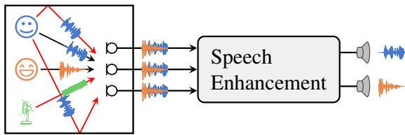
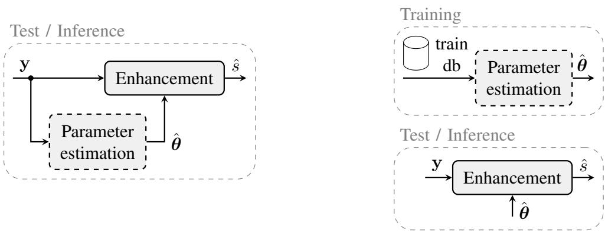
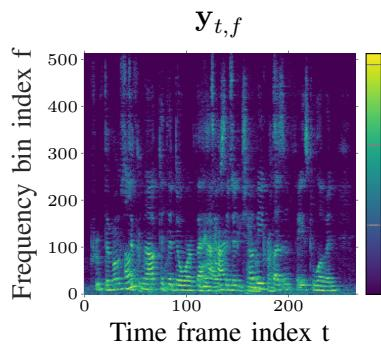
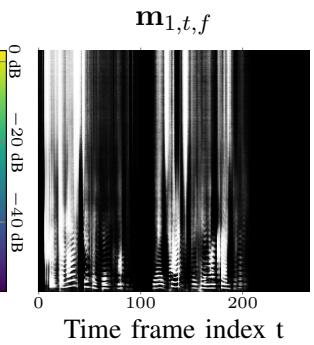
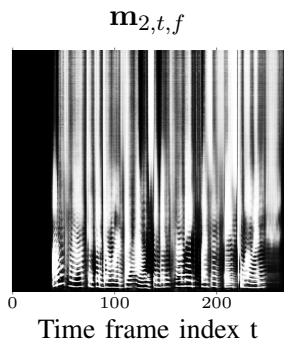
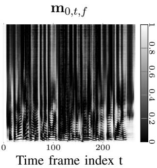
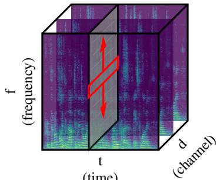
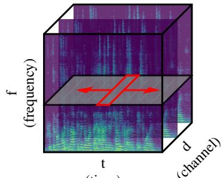
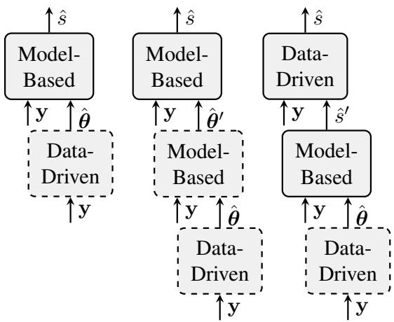
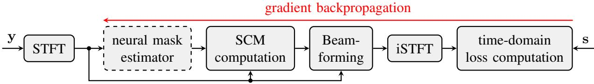

# Microphone Array Signal Processing and Deep Learning for Speech Enhancement

Reinhold Haeb-Umbach∗, Tomohiro Nakatani†, Marc Delcroix†, Christoph Boeddeker∗,

Tsubasa Ochiai†

∗Paderborn University, Germany; †NTT Corporation, Japan

## Abstract

Multi-channel acoustic signal processing is a well-established and powerful tool to exploit the spatial diversity between a target signal and non-target or noise sources for signal enhancement. However, the textbook solutions for optimal data-dependent spatial filtering rest on the knowledge of second-order statistical moments of the signals, which have traditionally been difficult to acquire. In this contribution, we compare model-based, purely data-driven, and hybrid approaches to parameter estimation and filtering, where the latter tries to combine the benefits of model-based signal processing and data-driven deep learning to overcome their individual deficiencies. We illustrate the underlying design principles with examples from noise reduction, source separation, and dereverberation.

## Index Terms

Microphone array processing, speech enhancement, deep learning, source separation

## I. INTRODUCTION

Speech enhancement has been a research topic for many years. It is concerned with removing distortions, such as ambient noise, from a degraded speech signal. Its various applications fall into two classes: improving human-to-human communication and improving human-to-machine communication, i.e., automatic speech recognition (ASR). In the first case, where the human is the consumer of the enhanced signal, the focus is on enhancing the quality, and ideally also the intelligibility, of the signal captured by the microphone(s). Examples of applications are telecommunications, hearing aids, media archive enhancement, etc. [1]–[4]. If the enhancement stage is followed by an ASR system, the goal is to improve the recognition accuracy of the recognizer.

There are many ways in which a speech signal can be distorted. It can be degraded by the superposition of other acoustic signals, such as by environmental noise or competing speakers. The multi-path propagation from the speech source to the microphones, known as reverberation, leads to degraded intelligibility and ASR performance. And there are many other distortions, e.g., line or acoustic echoes, signal clipping, etc. Consequently, the field of speech enhancement is large, and a plethora of techniques have been proposed to clean up a speech signal.

Those techniques can be classified according to the enhancement task to be solved. In this contribution, we concentrate on noise reduction, source separation, and dereverberation. Another classification is into methods using a single microphone (single-channel) or multiple microphones (multi-channel). Here, we are concerned with multi-channel approaches, assuming that the signals are captured by a compact microphone array. Finally, and this is the focus of this study, methods can be categorized into model-based and data-driven methods, as well as hybrid methods that combine the two.

Research in speech enhancement has a long tradition, with the spectral subtraction method by Boll [5] being an early hallmark. This heuristic approach was soon complemented by statistically motivated methods [6]. For years, research was dominated by such model-based approaches, which use statistical signal processing methods derived from a physical model of the degradation and a probabilistic model of the involved signals. With the advent of deep learning, those model-based techniques have been challenged by data-driven approaches that learn the enhancement operation from data. This is typically done by training a deep neural network (DNN) in a supervised manner with the observed degraded signal at its input and the desired signal or a quantity derived from it as the training target. A third class of techniques, hybrid approaches, blend model-based with data-driven methods. They aim to combine the benefits of both approaches while overcoming their individual shortcomings.

This paper is not about giving a comprehensive overview of the various approaches to speech enhancement. Its purpose is rather to highlight the advantages and shortcomings of the above classes of enhancement techniques mentioned in the last section and discuss those with a few concrete examples from the field of multi-channel enhancement. We look into noise reduction, dereverberation, and source separation, for which we can juxtapose the three classes of enhancement methods, as outlined in Table I. Although many presented methods have more applications than being used for speech, e.g., for music signals, we focus here on speech for brevity.

We will start with the presentation of commonly used signal models. The models have a decreasing degree of complexity. We continue by describing the properties of model-based and data-driven enhancement approaches. We then put an emphasis on hybrid methods, for which we offer a taxonomy. In recent research, we are observing a trend towards data-driven methods, replacing more and more components of the enhancement operation with deep learning-based alternatives. We exemplify this trend with the example of acoustic beamforming and finish with a critical discussion of this trend.

TABLE I  
EXAMPLES OF MODEL-BASED, DATA-DRIVEN, AND HYBRID SPEECH ENHANCEMENT APPROACHES FOR NOISE REDUCTION(NR), DEREVERBERATION (DR), AND SOURCE SEPARATION (SS). THE RELATED SECTIONS IN THIS PAPER AND PROS ANDCONS OF EACH APPROACH ARE ALSO INDICATED.

<table><tr><td colspan="2">Model-based</td><td colspan="2">Data-driven</td><td colspan="2">Hybrid</td></tr><tr><td rowspan="2">III-A1</td><td rowspan="2">Beamforming (BF) with EM-based mask estimation for NR and SS</td><td rowspan="2">III-B1</td><td rowspan="2">Spectral mapping and masking by DNN for NR and DR</td><td>IV-A</td><td>BF with DNN-based mask estimation for NR and SS</td></tr><tr><td>IV-B</td><td>BF with EM and DNN-based mask estimation for NR and SS</td></tr><tr><td>III-A1</td><td>Blind SS (BSS) for SS</td><td>III-B1</td><td>Permutation Invariant</td><td></td><td></td></tr><tr><td rowspan="3">III-A2</td><td rowspan="3">Linear prediction (LP), Kalman filter for DR</td><td></td><td>Training (PIT) for SS</td><td>IV-B</td><td>DNN-guided SS/LP for NR, DR and SS</td></tr><tr><td rowspan="2">IV-E</td><td rowspan="2">Trend to purely data-driven approach</td><td>IV-C</td><td>Spectral mapping by DNN-BF-DNN for NR, DR, and SS</td></tr><tr><td>IV-D</td><td>End-to-end optimization</td></tr><tr><td>Pros</td><td>High adaptability, explainability</td><td>Pros</td><td>No model assumptions, high performance</td><td>Pros</td><td>Fewer model assumptions, high performance with high adaptability</td></tr><tr><td>Cons</td><td>Restricted by model assumptions</td><td>Cons</td><td>Requires a large amount of training data, sensitivity to train-test mismatch</td><td>Cons</td><td>Requires a large amount of training data, adaptability is partly limited by the data-driven approach</td></tr></table>

  
Fig. 1. Illustration of the considered scenario: A reverberant enclosure with desired and undesired acoustic sources. The signal is captured by a microphone array and processed by a speech enhancement system to output one or more cleaned-up signals.

## II. SIGNAL MODELS

At the outset of any speech enhancement method is a physical and/or statistical model that describes the properties of the desired signal, the distortion, and how the distortion impacts the desired signal. As shown in Fig. 1, we consider a scenario where the microphone signal is distant from the speakers, i.e., a far-field scenario, as opposed to a close-talking scenario.

The signals at the microphones are modeled as a linear superposition of the convolution of in general K source signals $s _ { k , \ell } , k = 1 , \dots , K$ (including, of course, the case of a single source, i.e., $K = 1 )$ with their respective acoustic impulse responses (AIRs) $\tilde { \mathbf { h } } _ { k , \tilde { \ell } }$ from a source k to the $D$ microphones and an additive distortion $\tilde { \mathbf { n } } _ { \ell }$

$$
\tilde {\mathbf {y}} _ {\ell} = \sum_ {k = 1} ^ {K} \sum_ {\tilde {\ell} = 0} ^ {\tilde {L} - 1} \tilde {\mathbf {h}} _ {k, \tilde {\ell}} \tilde {s} _ {k, \ell - \tilde {\ell}} + \tilde {\mathbf {n}} _ {\ell} \in \mathbb {R} ^ {D},\tag{1}
$$

where $\ell$ and $\tilde { \ell }$ are the discrete time and the AIR’s tap indices, respectively. Here, $\tilde { \mathbf { y } } _ { \ell } , \tilde { \mathbf { h } } _ { k , \tilde { \ell } }$ and $\tilde { \mathbf { n } } _ { \ell }$ are D-dimensional vectors of the time-domain signals at the microphones, the AIR, and the noise. The AIRs represent the propagation of the speech signal from the source to the microphones. This is in general a multi-path propagation, seen in the equation by the convolution of the source signal with the AIR, resulting in a reverberated signal at the sensors. Note that we assumed a time-invariant AIR for simplicity.

The speech signals are either treated as deterministic variables or as random processes, where Gaussian and supergaussian probability density functions (PDFs) are typical assumptions. The noise $\tilde { \mathbf { n } } _ { \ell }$ is usually modeled as a Gaussian random process, which is independent of the speech.

With Eq. (1), the different enhancement tasks can be explained:

• Noise reduction refers to removing n˜ from y˜. If this is done by exploiting the multi-channel recording instead of only a single channel, it is called beamforming or spatial filtering.

• Source separation is concerned with isolating the individual source signals $\widetilde { s } _ { k } , k = 1 , \ldots , K$ or the reverberated source signals at the microphones, from the mixture $\tilde { \mathbf { y } }$ . If we are only interested in one of the sources, say $k = 1$ , we call it source extraction. In that case, the remaining source signals $\tilde { s } _ { k }$ , $k = 2 , \ldots , K$ are viewed as additive distortions.

• Dereverberation is about reducing the reverberation components in the AIR $\tilde { \mathbf { h } } _ { k , \tilde { \ell } } ,$ such that the estimated source signal is not corrupted by delayed versions of it.

While Eq. (1) can be considered a faithful model, it is often too complex to be used in practice for deriving enhancement algorithms. According to the well-known saying of the statistician George Box that “Essentially all models are wrong, but some are useful” [7], virtually all models are only a more or less exact approximation to the reality, and it is important to know the assumptions a model makes.

As a first step towards tractability, the signals are represented in the short time Fourier transform (STFT) domain. Since speech is a broadband signal, its processing is simplified if done in the STFT domain, where the time-domain convolution can be approximated by a convolution over the frame index t employing a much shorter acoustic transfer function (ATF) h (so-called convolutive transfer function (CTF) approximation [8]):

$$
\begin{array}{l} \mathbf {y} _ {t, f} = \sum_ {k = 1} ^ {K} \underbrace {\sum_ {\tau = 0} ^ {L - 1} \mathbf {h} _ {k , \tau , f} s _ {k , t - \tau , f}} _ {\mathbf {x} _ {k, t, f}} + \mathbf {n} _ {t, f} \\ = \sum_ {k = 1} ^ {K} \left(\sum_ {\tau = 0} ^ {\Delta - 1} \mathbf {h} _ {k, \tau , f} s _ {k, t - \tau , f} + \sum_ {\tau = \Delta} ^ {L - 1} \mathbf {h} _ {k, \tau , f} s _ {k, t - \tau , f}\right) + \mathbf {n} _ {t, f} \\ = \sum_ {k = 1} ^ {K} \left(\mathbf {x} _ {k, t, f} ^ {\text {(early)}} + \mathbf {x} _ {k, t, f} ^ {\text {(late)}}\right) + \mathbf {n} _ {t, f} \in \mathbb {C} ^ {D}. \end{array}\tag{2}
$$

(3)

(4)

Here, t and $f$ are the time frame and frequency bin indices, and $s _ { k , t , f } , \mathbf { y } _ { t , f } \ \mathbf { n } _ { t , f }$ are the STFT of the k-th source signal and the STFT vectors of the microphone signal and the noise, respectively, while $\mathbf { h } _ { k , t , f }$ is the vector of ATFs. The time lag $\Delta$ separates the direct signal and early reflections from the late reverberation. Dereverberation is typically concerned with removing the late reverberation only. Equation (2) is an approximation to Eq. (1), because the cross-band filters, which are used for canceling the aliasing effects caused by subsampling from sampling rate to frame rate, have been neglected, see [8] for a discussion. We further introduced the notation ${ \bf x } _ { k , t , f }$ for the spatial image of the source signal $s _ { k , t , f }$ at the microphone array, which can be divided in $\mathbf { x } _ { k , t , f } ^ { ( \mathrm { e a r l y } ) }$ , the direct signal plus early reflections, and $\mathbf { x } _ { k , t , f } ^ { ( \mathrm { l a t e } ) } ,$ , the late reverberation.

The model can be further simplified by approximating the convolution over the frame index by a multiplication (so-called multiplicative transfer function (MTF) or narrowband approximation [8], [9]):

$$
\mathbf {y} _ {t, f} = \sum_ {k = 1} ^ {K} \mathbf {h} _ {k, f} \mathbf {s} _ {k, t, f} + \mathbf {n} _ {t, f} = \sum_ {k = 1} ^ {K} \mathbf {x} _ {k, t, f} + \mathbf {n} _ {t, f}.\tag{5}
$$

This simplification is justified if the STFT frame length is (significantly) larger than the length of the AIR, i.e., in low reverberant situations.

The model can be even further simplified by assuming an anechoic environment, i.e., neglecting reverberation completely. Employing the far-field approximation, which says that the distance of the source to the microphones is much larger than the inter-microphone distance, the attenuation through signal propagation is the same for all elements and can be neglected for the model. Then, the vector of ATFs consists of complex exponentials representing delays caused by the different propagation path lengths from the sources to the sensors of the microphone array, which depend on the directions of arrival (DoAs) of the sources:

$$
\mathbf {h} _ {k, f} = [ \mathrm{e} ^ {- j 2 \pi \tilde {f} \tau_ {k, 1}}, \mathrm{e} ^ {- j 2 \pi \tilde {f} \tau_ {k, 2}}, \ldots , \mathrm{e} ^ {- j 2 \pi \tilde {f} \tau_ {k, D}} ] ^ {\mathsf {T}}.\tag{6}
$$

  
Fig. 2. A speech enhancement system consists of two operations, the estimation of the parameters θ of the enhancement operation (dashed boxes) and the actual enhancement (solid boxes). Left: the parameters are estimated from the same signal that has to be enhanced. This is the typical scenario in model-based approaches. Right: Parameters are estimated in a training stage and then used in the enhancement operation on the test data. This is typical for data-driven approaches.

Here, $\tau _ { k , d }$ is the propagation delay from the k-th source to the d-th microphone, which depends on the DoA, and $\tilde { f } = f \cdot ( f _ { s } / F )$ is the frequency in Hertz $( f _ { s } )$ sampling frequency, F: DFT size).

Another simplification of (5) is to neglect the noise and concentrate on reverberation:

$$
\mathbf {y} _ {t, f} = \sum_ {k = 1} ^ {K} \sum_ {\tau = 0} ^ {L - 1} \mathbf {h} _ {\tau , f} s _ {t - \tau , f} = \sum_ {k = 1} ^ {K} \mathbf {x} _ {k, t, f} ^ {(\text { early })} + \sum_ {k = 1} ^ {K} \mathbf {x} _ {k, t, f} ^ {(\text { late })}.\tag{7}
$$

Eqs. (1) - (7) are physical models of different degrees of complexity. A model of decreasing complexity goes hand in hand with the model having an increasing degree of approximations. Obviously, the desire for a simple, tractable model collides here with the desire of high faithfulness.

## III. MODEL-BASED AND DATA-DRIVEN APPROACHES TO ENHANCEMENT

Speech enhancement, as many other signal processing tasks, consists of two subtasks: the estimation of the parameters of the enhancement algorithm and the actual enhancement operation, see Fig. 2.

For the first task, there are two options: either the parameters are estimated from the very same signal that is to be enhanced, or the parameters are estimated in a separate training stage. Of course, there is also the option that the parameters estimated in the training stage are adapted during the enhancement of the test data. We will come back to this option later on.

Model-based parameter estimation and enhancement is done as illustrated in the left figure, while data-driven estimation and enhancement take the route illustrated in the right figure. Hybrid methods blend model-based with data-driven approaches, where this blending can be done either in the parameter estimation, in the enhancement stage, or in both.

## A. Model-based parameter estimation and enhancement

For years, many sophisticated model-based enhancement techniques have been developed. Given a signal model, estimation theory is employed to derive statistically optimal estimators. Being able to prove the optimality of an estimator is an important property, which most data-driven techniques lack. Note, however, that optimality rests upon certain assumptions, foremostly the validity of the model and the knowledge of its parameters. Below, we introduce representative examples of model-based approaches for denoising, source separation, and dereverberation.

1) Acoustic beamforming for denoising and source separation: Beamforming exploits the spatial diversity of the sources and points a beam towards the source of interest and enhances that source signal, while suppressing signals with a different spatial signature. It performs denoising and/or source separation/extraction depending on whether the signals to be suppressed include noise and/or interfering source signals. For this problem, optimal solutions have been derived [9]. A common choice for the beamformer is the minimum variance distortionless response (MVDR) beamformer. Its coefficients can be computed as follows [10]

$$
\mathbf {w} _ {f} ^ {\mathrm{MVDR}} = \frac {\left(\boldsymbol {\Phi} _ {\mathbf {n} , f}\right) ^ {- 1} \boldsymbol {\Phi} _ {\mathbf {x} , f}}{\operatorname{tr} \left\{\left(\boldsymbol {\Phi} _ {\mathbf {n} , f}\right) ^ {- 1} \boldsymbol {\Phi} _ {\mathbf {x} _ {f}} \right\}} \mathbf {u} _ {1}\tag{8}
$$

where $\mathbf { u } _ { 1 }$ is an all-zero vector with a one at the position of the reference microphone, and $\operatorname { t r } \{ \cdot \}$ is the trace operator. In these equations, $\Phi _ { \mathbf { x } , f } = \mathbb { E } [ \mathbf { x } _ { t , f } \mathbf { x } _ { t , f } ^ { \mathsf { H } } ]$ and $\Phi _ { \mathbf { n } , f } = \mathbb { E } [ \mathbf { n } _ { t , f } \mathbf { n } _ { t , f } ^ { \mathsf { H } } ]$ are the spatial covariance matrices (SCMs) of the speech and the noise part of the microphone signals, respectively.

The key problem in beamforming is to estimate the beamformer coefficients $\mathbf { w } _ { f }$ that allow the extraction of the desired signal. This boils down to estimating the SCMs $\Phi _ { \mathbf { x } , f }$ and $\Phi _ { \mathbf { n } , f }$ of the desired signal and the noise, respectively.

One popular approach to estimating these quantities is an indirect one, which first estimates a signal activity parameter, from which the variance parameters can then be computed. This indirect method is based on the sparseness property and the w-disjoint orthogonality of speech in the STFT domain [11], which say that a time-frequency (tf)-bin is either dominated by speech or by noise, and in case of multiple speakers, the individual speakers are dominant in disjoint sets of tf-bins. This can be expressed by introducing a latent one-hot vector $\mathbf z _ { t , f } \in \{ 0 , 1 \} ^ { K + 1 }$ , where $z _ { k , t , f } = 1$ means that source k is dominant in the tf-bin (t, f). Giving noise the index 0 we have:

$$
\mathbf {y} _ {t, f} = \left\{ \begin{array}{l l} \mathbf {x} _ {k, t, f} & z _ {k, t, f} = 1; k = 1, \ldots , K \\ \mathbf {n} _ {t, f} & z _ {0, t, f} = 1. \end{array} \right.\tag{9}
$$

  
Fig. 3. A 4.25 seconds long segment of speech from the LibriCSS corpus [13]. From left (1) to right (4): (1) Observation, (2) mask of first active speaker, (3) mask of second active speaker, (4) the noise mask. Masks were estimated by a DNN.

This latent variable can be estimated using the expectation maximization (EM) algorithm applied to a spatial mixture model for $\mathbf { y } _ { t , f }$ [12]:

$$
p (\mathbf {y} _ {t, f}) = \sum_ {k = 0} ^ {K} \pi_ {k} p (\mathbf {y} _ {t, f}; \boldsymbol {\theta} _ {k}),\tag{10}
$$

where $\pi _ { k }$ is the a priori probability that $z _ { k , t , f } ~ = ~ 1$ , which can be chosen time frame or frequency dependent. Further, $p ( \mathbf { y } _ { t , f } ; \pmb { \theta } _ { k } )$ is a distribution that models the spatial properties of $\mathbf { y } _ { t , f }$ if it is from source k [12]. The EM algorithm estimates the posterior probability

$$
m _ {k, t, f} = \mathbb {E} [ z _ {k, t, f} | \mathbf {y} _ {t, f} ] \in [ 0, 1 ].\tag{11}
$$

This, or a quantized version of $\mathbf { i t } ,$ is called a mask. Figure 3 shows example masks computed from a segment of audio, which consists of partially overlapping speech of two speakers and additive noise.

With the estimated masks, the SCMs can be estimated as follows:

$$
\hat {\mathbf {\Phi}} _ {\mathbf {x} _ {k}, f} = \sum_ {\tau = 1} ^ {T} \frac {1}{\sum_ {\tau^ {\prime} = 1} ^ {T} \hat {m} _ {k , \tau^ {\prime} , f}} \hat {m} _ {k, \tau , f} \mathbf {y} _ {\tau , f} \mathbf {y} _ {\tau , f} ^ {\mathsf {H}}, \quad k = 1, \ldots , K\tag{12}
$$

$$
\hat {\mathbf {\Phi}} _ {\mathbf {n}, f} = \sum_ {\tau = 1} ^ {T} \frac {1}{\sum_ {\tau^ {\prime} = 1} ^ {T} \hat {m} _ {0 , \tau^ {\prime} , f}} \hat {m} _ {0, \tau , f} \mathbf {y} _ {\tau , f} \mathbf {y} _ {\tau , f} ^ {\mathsf {H}}.\tag{13}
$$

With the SCM estimates, the beamformer coefficients of the various statistically optimum beamformers can be readily computed. Applying the beamformer as in Eq. (8) realizes denoising and/or source separation.

Another important class of model-based source separation technique is blind source separation (BSS) based on independent component analzysis (ICA). It estimates spatial filters that separate a given number of sources only from the observation, assuming its underlying physical model and statistical independence between the sources. Many techniques have been developed for speech source separation based on these principles [9], [14].

2) Dereverberation: The goal of dereverberation is the deconvolution of the speech signal to remove the effect of the reverberant environment. We here introduce two model-based methods, the first is based on a transversal and the second on an autoregressive model of the reverberated signal.

Equation (2) can be expressed in vector form (let K = 1 for ease of exposition):

$$
\mathbf {y} _ {t, f} = \breve {\mathbf {H}} _ {t, f} \breve {\mathbf {s}} _ {t, f} + \mathbf {n} _ {t, f}\tag{14}
$$

where

$$
\breve {\mathbf {H}} _ {t, f} = \left[ \begin{array}{c c c c} \mathbf {h} _ {0, f} & \mathbf {h} _ {1, f} & \dots & \mathbf {h} _ {L - 1, f} \end{array} \right] \in \mathbb {C} ^ {D \times L}\tag{15}
$$

$$
\breve {\mathbf {s}} _ {t, f} = \left[ \begin{array}{c c c c} s _ {t, f} & s _ {t - 1, f} & \dots & s _ {t - L + 1, f} \end{array} \right] ^ {\mathsf {T}} \in \mathbb {C} ^ {L}.\tag{16}
$$

If we model $s _ { t , f }$ as complex Gaussian random variable, $p ( s _ { t , f } ; \lambda _ { t , f } ^ { \mathrm { ( s ) } } ) = \mathcal { C N } ( s _ { t , f } ; 0 , \lambda _ { t , f } ^ { \mathrm { ( s ) } } )$ , we arrive at a Gaussian random process for $\breve { \mathbf { s } } _ { t , f }$ with the following state equation

$$
\breve {\mathbf {s}} _ {t, f} = \mathbf {A} _ {t, f} \breve {\mathbf {s}} _ {t - 1, f} + \mathbf {w} _ {t, f}.\tag{17}
$$

The state transition matrix A and the system noise vector w can readily be identified by comparing this state space model with Eq. (16).

Based on this view, a dereverberation algorithm has been developed, which consists of an EM algorithm with parameter estimation in the M-step, while the E-step is a Kalman filter for the actual enhancement [15].

The second dereverberation algorithm, the weighted prediction error (WPE) method [16], approximates the reverberated speech, Eq. (7), by an auto-regressive (AR) model (also referred to as a linear prediction model):

$$
\begin{array}{l} \mathbf {y} _ {t, f} = \mathbf {x} _ {t, f} ^ {\text {(early)}} + \mathbf {x} _ {t, f} ^ {\text {(late)}} \\ = \sum_ {\tau = 0} ^ {\Delta - 1} \mathbf {h} _ {\tau , f} s _ {t - \tau , f} + \sum_ {\tau = \Delta} ^ {L - 1} \mathbf {G} _ {\tau , f} \mathbf {y} _ {t - \tau , f}, \end{array}\tag{18}
$$

where the matrix $\mathbf { G } _ { t , f } \in \mathbb { C } ^ { D \times D }$ is a matrix with the coefficients of the AR process $\mathbf { y } _ { t , f }$ . However, speech is an AR process by itself. To not destroy that property and capture only the unwanted reverberation in $\mathbf { x } _ { t , f } ^ { ( \mathrm { l a t e } ) }$ , the lag $\Delta$ is introduced. Thus, the dereverberated speech can be estimated via [16]

$$
\hat {\mathbf {x}} _ {t, f} ^ {(\mathrm{early})} = \mathbf {y} _ {t, f} - \sum_ {\tau = \Delta} ^ {L ^ {\prime} - 1} \hat {\mathbf {G}} _ {\tau , f} \mathbf {y} _ {t - \tau , f},\tag{19}
$$

where $\hat { \mathbf { G } }$ is an estimate of G. WPE maximizes the likelihood of the model under the assumption that $\mathbf { x } _ { t , f } ^ { ( \mathrm { e a r l y } ) }$ is a realization of a zero-mean complex Gaussian process with an unknown channel independent time-varying variance $\lambda _ { t , f } \colon$

$$
p (\mathbf {x} _ {t, f} ^ {\mathrm{(early)}}; \lambda_ {t, f}) = \mathcal {C N} (\mathbf {x} _ {t, f} ^ {\mathrm{(early)}}, 0, \lambda_ {t, f} \mathbf {I}).\tag{20}
$$

Here, I is the identity matrix. An iterative estimation algorithm has been developed for alternately estimating G and $\lambda _ { t , f }$ [16].

3) Remarks: The presented model-based approaches to beamforming or dereverberation estimate their parameters from the microphone signal to be enhanced. Since there is no separate training phase, there is no risk of a train-test mismatch, i.e., that the training data have different statistics than the data to be enhanced. In fact, they can adapt to a new acoustic environment with only a few seconds of observed data.

Since the model parameters to be estimated are not directly observable, the EM is a good starting point to derive an estimation algorithm. It is an iterative batch algorithm and thus not readily usable for online, low-latency processing. However, recursive EM formulations exist, which then allow low-latency processing [17].

Model-based techniques have been shown to be very robust. For example, the spatial mixture modelbased source activity estimation [12] and the WPE dereverberation [16] have been chosen for the CHiME-6 [18] and CHiME-7 [19] challenge baseline systems. This data set on dinner party transcription is known for its extremely challenging acoustic conditions. The high robustness of the model-based approach is probably due to the physical and statistical assumptions that are implemented in the model with relatively few parameters.

Given an underlying physical model, the derived algorithms often enjoy explainability: the effect of certain parameters on the outcome can often be well predicted. For example, for the above beamformers, the signal-to-noise ratio gain through beamforming can be computed, and the effect of the noise statistics on that gain can be assessed analytically. In case of Bayesian estimators one may even be able to predict the reliability of the estimate.

The above examples can only give a glimpse into the rich literature on model-based enhancement. They have been chosen to highlight the typical properties of model-based enhancement. We are aware of the fact that many important techniques had to be left out from our discussion due to space limitations.

## B. Data-driven parameter estimation and enhancement

With data-driven techniques, we refer to machine-learning-based methods. They take a different route than the model-based approach: instead of defining a physical model from which the enhancement operation can be derived, the enhancement function is estimated from examples of input-output pairs (y, s), with y being the input to the enhancement stage and s being the desired output.

The enhancement operator is nowadays realized by a DNN. Clearly, a DNN is also a model, although not physically inspired. The DNN has in general many more parameters than the physically and statistically inspired models discussed above. To discern it from those, we won’t call it a “model” in the following.

1) Denoising and source separation: There are many examples of data-driven approaches to speech enhancement [20]. The vast majority of neural networks are real-valued machines. However, the STFT representations are complex-valued variables. Thus, neural networks were initially not good at representing phase information. Consequently, the first neural regression-based enhancement techniques only estimated the magnitude spectrum of the desired signal from the STFT magnitude representation of the input signal, disregarding the phase [21]. Later it was found that stacking the real and imaginary components of the input STFT was a simple but effective means to represent the complex-valued input signal. So-called complex spectral mapping computes the target real and imaginary (RI) components based on the RI components of the input signal with a regression neural network [22]. Or the network is trained to estimate a complex-valued mask to do so-called complex ratio masking [23].

An alternative way to avoid the issue with representing complex-valued variables is to do “timedomain” processing. Here, the STFT and inverse STFT are replaced by learnt encoder-decoder modules [24]. Using very short analysis windows of, e.g., 2 ms, these techniques achieved excellent single-channel source separation performance.

DNNs were initially also poor at modeling spatial information available in multi-channel data, because this manifests itself in phase differences between the frequency domain representations of the channels of a compact microphone array, see Eq. (6). This was in part overcome by computing spatial features, such as inter-channel phase differences between the STFTs of the microphone signals [25] and appending these features with spectral features at the input of the DNN. Furthermore, the above technique of stacking real and imaginary parts to a real-valued vector of double the size proved to be effective to capture spatial cues as well [26].

For processing in the STFT domain, a typical representation of multi-channel data at the input to the network is a three-dimensional tensor with time, frequency and channel axes, where the latter consists of 2D components, capturing the real and imaginary values of the signals in the D microphone channels. This is complemented by a fourth dimension, the batch dimension.

An example network architecture for multi-channel speech enhancement consists of alternating layers for temporal processing and spectral processing [27]. Temporal processing is achieved by a recurrent network layer (e.g., a bi-directional long short-term memory (BLSTM) layer) whose sequence axis is the time axis and which operates independently for each frequency bin. Spectral processing is done with a network layer (e.g., a recurrent BLSTM layer) that operates along the frequency axis, for each time frame separately. This is sometimes called “fullband processing” and is known to be particularly effective in capturing spatial information, because the DoA results in a characteristic phase change pattern along the frequency axis.

  
(time)

  
(time)  
Fig. 4. An illustration of spectral (fullband) processing within a frame (left) and temporal (subband) processing across frames (right). The red arrows indicate the sequence axis.

For denoising, the network predicts masks for the speech and noise. Since the two have distinct spectral patterns, a DNN can learn easily which of its outputs corresponds to the speech and which to the noise masks. However, for source separation, we should output masks for each speaker. Speech signals have similar spectral patterns, which causes a permutation ambiguity, i.e., the mapping between DNN outputs and sources are arbitrary. Permutation invariant training (PIT) was introduced as a way to circumvent this ambiguity to allow training DNNs for speech separation [28]. The idea is simply to compute the training loss with the optimal permutation of the sources with respect to the loss. PIT is used in most DNN-based speech separation approaches.

2) Dereverberation: As late reverberation can be viewed as an additive distortion of the desired signal, see Eq. (3), DNN-based networks for dereverberation are similar to those for denoising. One of the earliest works was [29], where a recurrent neural network was employed in an autoencoder structure with the magnitude spectrum of the reverberated speech at the input and the magnitude spectrum of the nonreverberant speech as the training target at the output. Many more deep learning-based systems have been proposed, some of which are capable of jointly carrying out dereverberation, denoising, and source separation [27].

3) Remarks: Parameter estimation of DNNs is also guided by a statistically motivated objective function, typically the cross entropy in case of a network for classification (e.g., for mask estimation), which is an instance of maximum likelihood estimation. In this sense, there is some similarity to the model-based approaches that are derived to be the solution to a statistical optimization problem. However, model-based beamforming can choose among several objective functions, of which the constrained optimization leading to the MVDR criterion is a particularly interesting one, because, by definition, it does not introduce speech distortions. No such distortion-less criterion is known for DNNs.

However, this is a rather theoretical argument, because experimentation tells that DNNs are excellent enhancement machines. No simplifying modeling assumptions, or at least no obvious simplifying assumptions are made in the data-driven approach. Consequently, very good performance has been reported for many enhancement tasks, and purely data-driven techniques are often at the top of leaderboards for single-channel processing.1 Similarly, data-driven approaches are also becoming more competitive for multi-channel processing, as discussed in Section IV-E, although it is more difficult to measure because results are often reported on different corpora.

Due to the many parameters of the DNN, the amount of training data considered necessary to obtain good enhancement performance is significant. For the supervised training of enhancement networks, socalled paired data, which consist of pairs of clean and degraded versions of the same utterance, are required. Collecting such paired data for real recordings involves capturing both the clean source speech signal and the microphone signals simultaneously, which requires a special recording setup and is often difficult, if not impossible. To avoid costly data recording and annotation campaigns, researchers regularly resort to simulation and data augmentation techniques. Simulated microphone signals can be generated following Eq. (1) using a dataset of clean speech signals and noise recordings. Besides, AIRs can also be artificially generated by simulation tools using the image source method and variants of it. In addition, data augmentation is also frequently used to expand the training set by artificially modifying/distorting the input data and letting the network learn to disregard those modifications. With these techniques, arbitrarily large amounts of training data can be generated.

However, these artificial degradations of clean speech can only approximate the true degradation signals experience in a real environment [30], [31]. One known issue with artificial data is that they almost exclusively use time-invariant AIRs, while in a real recording, the AIR is time-varying due to movements of the speaker, even if those are only small head movements. In an attempt to be able to train on real data, for which the separated source signals are unavailable, mixture invariant training (MixIT) has been proposed, which is completely unsupervised [31]: Here, existing mixtures are mixed together. The algorithm then attempts to separate the mixture of mixtures into the individual source signals such that, if remixed, the original mixture of mixtures can be retained. Other unsupervised domain adaptation techniques have been developed, that require only the degraded signal from the target environment and not paired degraded - clean recordings [30].

While these attempts diminish the train-test mismatch, they cannot fully close the gap, and it remains true that data-driven techniques are only good when the training and test data characteristics are relatively similar. If the statistics of test data do not match that of the training data, then performance can be poor. Thus, the quality of data-driven enhancement crucially depends on the availability of appropriate training data.

But even if a large amount of representative training data is used, there is still the risk that some test data elicit the network in regions of feature space where it is not well trained. It is a known issue that small modifications of the input data can lead to surprisingly poor output [32]. Thus, data-driven techniques are generally viewed to be “black boxes”, with sometimes surprising and unexplainable results.

Finally, DNN-based enhancement tends to be more compute-intensive and memory-demanding than model-based enhancement, but novel frameworks and specialized hardware diminish this drawback.

## IV. HYBRID SPEECH ENHANCEMENT

If a physical and/or statistical model exists that reflects reality well, whose parameters are easy to obtain, and which leads to effective algorithms, there is no need to switch to data-driven methods. On the other hand, if the nature of the degradation and the statistics of the involved signals are so complex that they cannot be well represented by a computationally accessible model, and if appropriate training data are available or can be simulated, then data-driven methods are the preferred choice.

Often, however, the truth lies somewhere in-between. From the preceding discussion, it becomes obvious that model-based and data-driven methods have different and often complementary properties. It is thus natural to search for combinations of the two to have the best of both worlds. Such hybrid systems have been proposed for many enhancement tasks.

In this section, we describe three classes of hybrid approaches that differ in how they use model-based and data-driven methods for parameter estimation or for enhancement, see Fig. 5. The first exploits a data-driven approach to estimate the parameters of a model-based enhancement method. The second combines data-driven and model-based approaches for estimating the model parameters. Finally, the last combines model-based and data-driven approaches for the enhancement operation itself. We will also discuss how to train a hybrid system and study the gradual replacement of model-based components by learnable modules with the example of acoustic beamforming.

  
Fig. 5. Three classes of hybrid approaches (from left to right): data-driven parameter estimation for model-based enhancement; combined model-based and data-driven parameter estimation for model-based enhancement; joint model-based and data-driven approach for the enhancement operation.

## A. Data-driven estimation of model parameters

In Section III-A, the source activity masks were estimated via the posterior class probabilities of a spatial mixture model, as shown in Eq. (11). With those, the SCMs were estimated, from which eventually the beamformer coefficients were obtained. Alternatively, the masks can be estimated by a DNN in a supervised learning approach, where the noisy speech is at the input and the class affiliation ${ \bf z } _ { t , f }$ or quantities derived from it are the training targets [33], [34]. In its simplest variant, the training objective is a binary cross entropy criterion, which computes, for each frequency f, time frame t and source k, the cross entropy between the network output $\hat { z } _ { k , t , f }$ and the ground truth $z _ { k , t , f }$ . Because all STFT bins $f = 0 , 1 , \ldots , F - 1$ are used as inputs, the network can effectively learn the spectro-temporal patterns of speech and noise. On the contrary, the spatial mixture model based estimator [12] operates on each frequency bin independently, which introduces a frequency permutation problem that needs to be addressed.

Many variants of this basic approach have been proposed. A particularly interesting one is concerned with speech enhancement in dynamic acoustic environments, where the signal statistics change over time. In Eq. (12), a time-invariant SCM is estimated over a block of T frames. However, if speakers move, the SCMs are time-varying, and we need to introduce a tracking mechanism. In its simplest form, this is achieved by a first-order recursive filter

$$
\hat {\boldsymbol {\Phi}} _ {\mathbf {x} _ {k}, t, f} = \beta \hat {\boldsymbol {\Phi}} _ {\mathbf {x} _ {k}, t - 1, f} + \hat {\boldsymbol {\Psi}} _ {\mathbf {x} _ {k}, t, f} = \sum_ {\tau = 1} ^ {t} \beta^ {t - \tau} \hat {\boldsymbol {\Psi}} _ {\mathbf {x} _ {k}, \tau , f},
$$

(21)

where

$$
\hat {\Psi} _ {\mathbf {x} _ {k}, t, f} = m _ {k, t, f} \mathbf {y} _ {t, f} \mathbf {y} _ {t, f} ^ {\mathsf {H}}\tag{22}
$$

is the instantaneous spatial covariance matrix (ISCM), and $0 < \beta < 1$ is a forgetting factor, which gives exponentially less weight to older ISCMs. However, setting the forgetting factor is challenging because its optimal value depends on the rate of change of the acoustic environment.

We can express the different SCM computations by writing [35]

$$
\hat {\Phi} _ {\mathbf {x} _ {k}, t, f} = \sum_ {t ^ {\prime} = 1} ^ {T} c _ {\mathbf {x} _ {k}, t, t ^ {\prime}} \hat {\Psi} _ {\mathbf {x} _ {k}, t ^ {\prime}, f},\tag{23}
$$

where the definition of $c _ { \mathbf { x } _ { k } , t , t ^ { \prime } }$ can be inferred by comparing Eq. (23) with Eq. (12) and Eq. (21). These coefficients control the range for accumulating the statistics for computing the SCM. The same generalization can also be applied to the estimation of the SCM of the noise. Eq. (23) has a similar form as the well-known (self) attention mechanism of deep learning, and attention networks can thus be used to find optimal weights for the SCM estimation in dynamic acoustic environments [35].

## B. Combined data-driven and model-based estimation of model parameters

The two methods for tf mask estimation, spatial mixture models and the DNN-based approach, exploit different signal properties: The spatial clustering approach utilizes the spatial diversity of the sources, while the DNN is trained to learn the typical spectro-temporal patterns of speech and noise. The former does unsupervised parameter learning on the utterance to be enhanced, while the latter employs a training stage.

It is thus natural to combine the two strategies. One approach integrates the two mask estimators by using the masks obtained by a DNN as a priori probability of the spatial mixture model. The EM algorithm refines the masks as the posterior probability of the model [36].

While this technique carries out unsupervised adaptation of the DNN-computed masks on the test utterance, the unsupervised learning capability of the spatial mixture model can also be used in the training stage: the posterior class probabilities computed by the mixture model can be taken as training targets for the supervised training of the DNN-based mask estimator. This has led to better separation performance, because the DNN-based mask estimator treats all frequencies jointly, unlike the spatial mixture model [37]. Furthermore, this system can perform source separation on single-channel inputs, despite having learned how to do so using multi-channel recordings [38].

The tf masks can also be estimated in a two-step procedure, starting with a source activity variable $m _ { k , t }$ with time resolution, that is refined to tf resolution ${ m } _ { k , t , f }$ in the second stage. If the first stage, the diarization stage, which estimates the activity of the individual speakers, is realized with a DNN, and the second with a model-based approach, this is another example of joint model-based and datadriven speech activity estimation. In its simplest variant, the DNN in the first stage is trained to detect speech overlap, where concurrent speakers are active, and exclude those segments in the second stage. The remaining segments in the second stage can then be used to compute the beamformer coefficients for extracting each of the relevant source signals [39]. But there are also neural diarization methods that can cope with speech overlap and identify each of the simultaneously active speakers. A particularly powerful one, the target speaker voice activity detection (TS-VAD), can identify the speakers active in a segment of overlapped speech [40]. The refinement of the computed diarization information $m _ { k , t }$ to tf resolution can be achieved with the very same spatial mixture model mentioned earlier in Section III-A1. Here, the diarization information is utilized to constrain (“guide”) the estimation of the posterior: ${ m } _ { k , t , f }$ is allowed to have non-zero values only in time frames, where $m _ { k , t }$ is not zero [41], i.e., when the target speaker is found to be active by the diarization front-end. This modification can be simply implemented by replacing Eq. (11) with

$$
m _ {k, t, f} = \frac {m _ {k , t} \mathbb {E} [ z _ {k , t , f} | \mathbf {y} _ {t , f} ]}{\sum_ {\tilde {k} = 1} ^ {K} m _ {\tilde {k} , t} \mathbb {E} [ z _ {\tilde {k} , t , f} | \mathbf {y} _ {t , f} ]}\tag{24}
$$

in the EM algorithm of the model-based approach. Thus, the mask estimation shown in Eq. (24) combines model-based and data-driven methods. This approach, called guided source separation (GSS), has turned out to be very robust and was used in most systems, including the top ones, submitted to the CHiME-6 [18] and CHiME-7 [19] challenges on dinner party transcription.

There are many more examples of joint DNN and model-based parameter estimation. In the context of WPE, for example, the iterative estimation of the model parameters $\lambda _ { t , f }$ (power spectral density of clean speech) and of the AR parameter matrix $\hat { \mathbf { G } } _ { t , f } ^ { } .$ , defined in Eqs. (18) and (20), can be avoided by employing a neural network to estimate $\lambda _ { t , f }$ [42].

A neural network for target/source power spectral density (PSD) estimation has also been incorporated into BSS algorithms based on ICA [43]. This idea was further pursued for joint dereverberation and source separation using independent vector analysis and vector extraction with a neural source model [44], [45].

## C. Joint model-based and data-driven enhancement

Not only have model-based and data-driven parameter estimation complementary advantages and disadvantages, so have the model-based and data-driven enhancement operations. While the first enjoys statistical optimality under certain assumptions, the second is not constrained by simplifying modeling assumptions. The preceding discussion has also shown that beamformers are good at exploiting spatial information, while DNNs are good at capturing spectro-temporal information.

This complementarity has been utilized in advanced speech enhancement systems. A particularly powerful system that prototypically exploits those complementary strengths is the TF-GridNet architecture [27] for joint denoising, dereverberation, and source separation. Here, the network architecture consists of layers that aim at capturing correlations along the time axis and layers that capture correlations along the frequency axis, similarly as we discussed in Section III-B1 and illustrated in Fig. 4. Further, the self-attention mechanism is introduced to leverage global information across frames. Spatial information is aggregated both by DNNs with multi-channel input and by a beamformer, a multi-frame Wiener Filter, that is sandwiched between two DNNs (DNN-BF-DNN structure).

## D. End-to-end optimizaton

A clear deficit of hybrid modeling techniques is that the neural network may be optimized towards a different criterion than the model-based part of the system. This issue has been addressed in the literature with end-to-end training. This term means that the whole processing chain is optimized towards a single criterion. It does not mean that the system has to be a monolithic neural network.

The end-to-end training criterion can be a signal level metric of the enhanced signal, such as the signal-to-noise power ratio (SNR) at the output of the beamforming operation. Figure 6 provides an example, which we use to illustrate end-to-end optimization [46]. Here, the training loss is computed in the time-domain. Then the gradient is back-propagated through the inverse STFT and through the beamforming operation and SCM computation all the way to the DNN for mask estimation, to learn its parameters. This requires that SCM computation and beamforming operation are differentiable, which they are indeed.

The end-to-end approach has the advantage that the mask estimator is optimized towards a criterion that is closer to the final objective, such as improving the SNR, rather than towards an intermediate criterion.

End-to-end training has also been used to optimize speech enhancement with respect to a loss defined at the output of a downstream system, such as a speech recognizer. This particular setting has another significant advantage over a separate training of the network in the enhancement stage: the mask estimator training no longer requires paired data. Instead, the enhancement is trained jointly with the speech recognizer using “normal” ASR training data, consisting of speech recordings accompanied with their transcription.

  
Fig. 6. An example of end-to-end training: Gradient backpropagation from a loss computed in the time-domain through the beamformer to the DNN for mask estimation. [46].

Joint optimization of enhancement and ASR has been pursued by many researchers, e.g., [47]. One should, however, mention that end-to-end training may require a carefully designed training curriculum. Starting end-to-end training from scratch may result in poor performance, while fine-tuning pre-trained network components with end-to-end training can lead to faster convergence and a better optimum. An other downside of end-to-end training is that one can lose the modularity of the system. An enhancement system that is optimized end-to-end with a particular ASR model may not perform well when combined with a different ASR engine.

## E. Towards purely data-driven multi-channel enhancement

In the literature, there is a clear trend to replace model-based enhancement with hybrid and even purely data-driven approaches, often termed “all-neural”. In fact, even very established representations and algorithms are being replaced by learnable components.

We will show this trend with the example of acoustic beamforming. The starting point is the configuration of Fig. 6, which consists of a neural network-based mask estimator, while the remaining components to arrive at the enhanced signal are model-based.

For the computation of the beamformer coefficients, the SCMs of speech and noise are required, see Eq. (8). In [48], it has been found that the SCMs can be estimated more reliably directly with a recurrent neural network (RNN), in particular in the presence of time-varying statistics. It has even been proposed to directly estimate the beamforming coefficients $\mathbf { w } _ { f }$ by a neural network [49].

Subsequently, it was argued that the STFT itself is a limitation, because of its uniform frequency resolution and its short-time stationarity assumption. In [50], the STFT was replaced by learnable filters, and the beamforming operation was carried out in the time domain. The only remaining model-based component was the actual beamforming operation itself.

An even more radical step was taken in [51], where beamforming was abandoned completely, because the linear operation of beamforming was considered suboptimal: In the traditional model-based approach, noise reduction by beamforming is achieved by an MVDR beamformer, followed by a spectral postfilter. The first ensures a distortion-less response to the target signal, while the second improves the noise suppression. For this model it has been shown that the MVDR beamformer is a sufficient statistic in the Bayesian sense for estimating the clean speech signal s [52], if the noise has a Gaussian distribution:

$$
p (s | \mathbf {y}) = p (s | \hat {x} ^ {(\mathrm{MVDR})})
$$

where $\hat { x } ^ { \mathrm { ( M V D R ) } } = \mathbf { w } ^ { \mathrm { ( M V D R ) } } \mathbf { y }$ . This important result says that linear filtering is optimal, because no information is lost for estimating s.

However, optimality is lost if the noise is no longer Gaussian. For the model of Eq. (5), Hendriks et al. have shown that the minimum mean squared error (MMSE) optimal speech estimator in the presence of noise, which is modeled as a mixture of Gaussians, is a nonlinear, jointly spatial and spectral filter that cannot be decomposed into a cascade of spatial and spectral processing [53]. For speech enhancement tasks, non-Gaussianity is an important issue. For example, competing speakers are an example of non-Gaussian distortions. Indeed, significant performance gains can be achieved with a nonlinear processor in the presence of non-Gaussian distortions. However, the nonlinear processor is very complex, and there is no realistic way to implement an enhancement algorithm based on this model. It does not come to a surprise that the most straightforward choice of a non-linear processor is a DNN. With suitable DNN architectures performance improvements have been achieved over beamforming [51].

However, it is difficult to compare the systems mentioned in this section across the different publications, because the reported results had been obtained on different data sets.

## V. CONCLUSIONS

In this contribution we have contrasted model-based, data-driven and hybrid approaches to speech enhancement, with a focus on multi-channel beamforming-inspired methods. We illustrated the pros and cons of signal processing and neural approaches and found that blending the two often gives effective solutions that combine the best of both worlds.

From the literature study we observe a trend to replace model-based enhancement by hybrid and even by purely data-driven approaches. In fact, even very established representations and algorithms are being replaced by learnable components. Of course, one reason is that researchers want to explore the potential of new tools, which might be more rewarding than optimizing already very well-engineered techniques. A more serious reason is, in our view, that speech enhancement has reached a degree of maturity that even minor approximations of models are no longer acceptable. We illustrated this last point with the example of acoustic beamforming, where even established models, such as frequency-domain processing and linear beamforming, are challenged by neural approaches that, in principle, can overcome the simplifying assumptions of any model.

However, certain reservations have to be made. First, the network is only as good as representative the training data is of the later field data where the network is going to be used. Concerns remain about robustness: The network behavior can be arbitrarily poor in case of unexpected input, e.g., out of domain data [30], [32]. A model-based component may be inferior to a learnt module on the data sets, the learnt model is optimized for. But the model can add to the robustness, since it introduces valid physical knowledge to the system, serving as a kind of “regularizer” to prevent the data-driven component from deviating too far from what is considered physically reasonable. We have seen that hybrid approaches offer the possibility to combine the advantages of both worlds. A good example is GSS [41], which, by combining data-driven and model-based parameter estimation, can boost the performance of a modelbased enhancement approach while preserving the adaptation capability to the test data. This may explain its robustness to highly challenging recording conditions such as the CHiME challenge data [18].

There is a second reservation to be kept in mind: the network has to learn an ever more complex mapping function, which requires a larger network, in turn asking for more training data. Thus, an important prerequisite of the trend towards learnable components is the availability of larger and more diverse and realistic training data. A decision between a model-based component and its data-driven alternative should, therefore, be taken not only in terms of performance on a single data set but in terms of robustness and reliability on a wide range of diverse input data.

## REFERENCES

[1] S. Graetzer, J. Barker, T. J. Cox, M. Akeroyd, J. F. Culling, G. Naylor, E. Porter, and R. Viveros Munoz, “Clarity-2021 challenges: Machine learning challenges for advancing hearing aid processing,” in Proceedings of the Annual Conference of the International Speech Communication Association, INTERSPEECH, vol. 2, 2021.

[2] K. Somasundaram, J. Dong, H. Tang, J. Straub, M. Yan, M. Goesele, J. J. Engel, R. De Nardi, and R. Newcombe, “Project Aria: A new tool for egocentric multi-modal AI research,” arXiv preprint arXiv:2308.13561, 2023.

[3] T. Yoshioka, X. Wang, D. Wang, M. Tang, Z. Zhu, Z. Chen, and N. Kanda, “Vararray: Array-geometry-agnostic continuous speech separation,” in IEEE International Conference on Acoustics, Speech and Signal Processing (ICASSP). IEEE, 2022, pp. 6027–6031.

[4] R. Haeb-Umbach, S. Watanabe, T. Nakatani, M. Bacchiani, B. Hoffmeister, M. L. Seltzer, H. Zen, and M. Souden, “Speech processing for digital home assistance: Combining signal processing with deep-learning techniques,” IEEE Signal Processing Magazine, vol. 36, no. 6, p. 111–124, 2019.

[5] S. Boll, “Suppression of acoustic noise in speech using spectral subtraction,” IEEE Transactions on Acoustics, Speech, and Signal Processing, vol. 27, no. 2, pp. 113–120, 1979.

[6] Y. Ephraim and D. Malah, “Speech enhancement using a minimum-mean square error short-time spectral amplitude estimator,” IEEE Transactions on Acoustics, Speech, and Signal Processing, vol. 32, no. 6, pp. 1109–1121, 1984

[7] G. E. Box, “Science and statistics,” Journal of the American Statistical Association, vol. 71, no. 356, pp. 791–799, 1976.

[8] Y. Avargel and I. Cohen, “System identification in the short-time Fourier transform domain with crossband filtering,” IEEE Transactions on Audio, Speech, and Language Processing, vol. 15, no. 4, pp. 1305–1319, 2007.

[9] S. Gannot, E. Vincent, S. Markovich-Golan, and A. Ozerov, “A consolidated perspective on multimicrophone speech enhancement and source separation,” IEEE/ACM Transactions on Audio, Speech, and Language Processing, vol. 25, no. 4, pp. 692–730, 2017.

[10] M. Souden, J. Benesty, and S. Affes, “On optimal frequency-domain multichannel linear filtering for noise reduction,” IEEE Transactions on audio, speech, and language processing, vol. 18, no. 2, pp. 260–276, 2009.

[11] O. Yilmaz and S. Rickard, “Blind separation of speech mixtures via time-frequency masking,” IEEE Transactions on Signal Processing, vol. 52, no. 7, pp. 1830–1847, 2004.

[12] N. Ito, S. Araki, and T. Nakatani, “Complex angular central gaussian mixture model for directional statistics in mask-based microphone array signal processing,” in 2016 24th European Signal Processing Conference (EUSIPCO). IEEE, 2016, pp. 1153–1157.

[13] Z. Chen, T. Yoshioka, L. Lu, T. Zhou, Z. Meng, Y. Luo, J. Wu, X. Xiao, and J. Li, “Continuous speech separation: Dataset and analysis,” in IEEE International Conference on Acoustics, Speech and Signal Processing (ICASSP). IEEE, 2020, pp. 7284–7288.

[14] H. Sawada, N. Ono, H. Kameoka, D. Kitamura, and H. Saruwatari, “A review of blind source separation methods: Two converging routes to ILRMA originating from ICA and NMF,” APSIPA Transactions on Signal and Information Processing, vol. 8, no. e12, pp. 1–14, 2019.

[15] B. Schwartz, S. Gannot, and E. A. Habets, “Online speech dereverberation using Kalman filter and EM algorithm,” IEEE/ACM Transactions on Audio, Speech, and Language Processing, vol. 23, no. 2, pp. 394–406, 2014.

[16] T. Yoshioka, T. Nakatani, M. Miyoshi, and H. G. Okuno, “Blind separation and dereverberation of speech mixtures by joint optimization,” IEEE Transactions on Audio, Speech, and Language Processing, vol. 19, no. 1, pp. 69–84, 2011.

[17] D. M. Titterington, “Recursive parameter estimation using incomplete data,” Journal of the Royal Statistical Society Series B: Statistical Methodology, vol. 46, no. 2, pp. 257–267, 1984.

[18] S. Watanabe, M. Mandel, J. Barker, E. Vincent, A. Arora, X. Chang, S. Khudanpur, V. Manohar, D. Povey, D. Raj, D. Snyder, A. S. Subramanian, J. Trmal, B. B. Yair, C. Boeddeker, Z. Ni, Y. Fujita, S. Horiguchi, N. Kanda, T. Yoshioka and N. Ryant, “CHiME-6 challenge: Tackling multispeaker speech recognition for unsegmented recordings,” in Proc. CHiME-6 Workshop, 2020.

[19] S. Cornell, M. Wiesner, S. Watanabe, D. Raj, X. Chang, P. Garcia, Y. Masuyama, Z.-Q. Wang, S. Squartini, and S. Khudanpur, “The CHiME-7 DASR Challenge: Distant Meeting Transcription with Multiple Devices in Diverse Scenarios,” in Proc. 7th International Workshop on Speech Processing in Everyday Environments (CHiME 2023), 2023, pp. 1–6.

[20] D. Wang and J. Chen, “Supervised speech separation based on deep learning: An overview,” IEEE/ACM Transactions on Audio, Speech, and Language Processing, vol. 26, no. 10, pp. 1702–1726, 2018.

[21] Y. Xu, J. Du, L.-R. Dai, and C.-H. Lee, “A regression approach to speech enhancement based on deep neural networks,” IEEE/ACM Transactions on Audio, Speech, and Language Processing, vol. 23, no. 1, pp. 7–19, 2014.

[22] Z.-Q. Wang, P. Wang, and D. Wang, “Complex spectral mapping for single-and multi-channel speech enhancement and robust ASR,” IEEE/ACM transactions on audio, speech, and language processing, vol. 28, pp. 1778–1787, 2020.

[23] Y. Liu and D. Wang, “Divide and conquer: A deep CASA approach to talker-independent monaural speaker separation,” IEEE/ACM Transactions on audio, speech, and language processing, vol. 27, no. 12, pp. 2092–2102, 2019.

[24] Y. Luo and N. Mesgarani, “Conv-tasnet: Surpassing ideal time–frequency magnitude masking for speech separation,” IEEE/ACM transactions on audio, speech, and language processing, vol. 27, no. 8, pp. 1256–1266, 2019.

[25] Z.-Q. Wang, J. Le Roux, and J. R. Hershey, “Multi-channel deep clustering: Discriminative spectral and spatial embeddings for speaker-independent speech separation,” in 2018 IEEE International Conference on Acoustics, Speech and Signal Processing (ICASSP). IEEE, 2018, pp. 1–5.

[26] Z.-Q. Wang, P. Wang, and D. Wang, “Multi-microphone complex spectral mapping for utterance-wise and continuous speech separation,” IEEE/ACM transactions on audio, speech, and language processing, vol. 29, pp. 2001–2014, 2021.

[27] Z.-Q. Wang, S. Cornell, S. Choi, Y. Lee, B.-Y. Kim, and S. Watanabe, “TF-GridNet: Integrating full-and sub-band modeling for speech separation,” IEEE/ACM Transactions on Audio, Speech, and Language Processing, 2023.

[28] M. Kolbæk, D. Yu, Z.-H. Tan, and J. Jensen, “Multitalker speech separation with utterance-level permutation invariant training of deep recurrent neural networks,” IEEE/ACM Transactions on Audio, Speech, and Language Processing, vol. 25, no. 10, pp. 1901–1913, 2017.

[29] F. Weninger, S. Watanabe, Y. Tachioka, and B. Schuller, “Deep recurrent de-noising auto-encoder and blind de-reverberation for reverberated speech recognition,” in 2014 IEEE International Conference on Acoustics, Speech and Signal Processing (ICASSP). IEEE, 2014, pp. 4623–4627.

[30] K. Zmolikova, M. S. Pedersen, and J. Jensen, “Masked spectrogram prediction for unsupervised domain adaptation in speech enhancement,” IEEE Open Journal of Signal Processing, 2023.

[31] S. Wisdom, E. Tzinis, H. Erdogan, R. Weiss, K. Wilson, and J. Hershey, “Unsupervised sound separation using mixture invariant training,” Advances in neural information processing systems, vol. 33, pp. 3846–3857, 2020.

[32] E. Vincent, S. Watanabe, A. A. Nugraha, J. Barker, and R. Marxer, “An analysis of environment, microphone and data simulation mismatches in robust speech recognition,” Computer Speech and Language, vol. 46, pp. 535–557, 2017.

[33] J. Heymann, L. Drude, and R. Haeb-Umbach, “Neural network based spectral mask estimation for acoustic beamforming,” in Proc. of IEEE International Conference on Acoustics, Speech and Signal Processing (ICASSP), 2016.

[34] H. Erdogan, J. R. Hershey, S. Watanabe, M. I. Mandel, and J. L. Roux, “Improved MVDR beamforming using singlechannel mask prediction networks,” in Proc. Interspeech 2016, 2016, pp. 1981–1985.

[35] T. Ochiai, M. Delcroix, T. Nakatani, and S. Araki, “Mask-based neural beamforming for moving speakers with selfattention-based tracking,” IEEE/ACM Transactions on Audio, Speech, and Language Processing, vol. 31, pp. 835–848, 2023.

[36] T. Nakatani, N. Ito, T. Higuchi, S. Araki, and K. Kinoshita, “Integrating DNN-based and spatial clustering-based mask estimation for robust MVDR beamforming,” in 2017 IEEE International Conference on Acoustics, Speech and Signal Processing (ICASSP). IEEE, 2017, pp. 286–290.

[37] L. Drude, D. Hasenklever, and R. Haeb-Umbach, “Unsupervised training of a deep clustering model for multichannel blind source separation,” in Proc. of IEEE International Conference on Acoustics, Speech and Signal Processing (ICASSP), 2019.

[38] E. Tzinis, S. Venkataramani, and P. Smaragdis, “Unsupervised deep clustering for source separation: Direct learning from mixtures using spatial information,” in Proc. of IEEE International Conference on Acoustics, Speech and Signal Processing (ICASSP), 2019, pp. 81–85.

[39] S. E. Chazan, J. Goldberger, and S. Gannot, “LCMV beamformer with DNN-based multichannel concurrent speakers detector,” in 2018 26th European Signal Processing Conference (EUSIPCO). IEEE, 2018, pp. 1562–1566.

[40] I. Medennikov, M. Korenevsky, T. Prisyach, Y. Khokhlov, M. Korenevskaya, I. Sorokin, T. Timofeeva, A. Mitrofanov, A. Andrusenko, I. Podluzhny et al., “Target-speaker voice activity detection: a novel approach for multi-speaker diarization in a dinner party scenario,” arXiv preprint arXiv:2005.07272, 2020.

[41] C. Boeddeker, J. Heitkaemper, J. Schmalenstroeer, L. Drude, J. Heymann, and R. Haeb-Umbach, “Front-end processing for the CHiME-5 dinner party scenario,” in CHiME5 Workshop, Hyderabad, India, vol. 1, 2018.

[42] K. Kinoshita, M. Delcroix, H. Kwon, T. Mori, and T. Nakatani, “Neural network-based spectrum estimation for online WPE dereverberation,” in Proc. Interspeech 2017, 2017, pp. 384–388.

[43] A. A. Nugraha, A. Liutkus, and E. Vincent, “Multichannel audio source separation with deep neural networks,” IEEE/ACM Transactions on Audio, Speech, and Language Processing, vol. 24, no. 9, pp. 1652–1664, 2016.

[44] T. Nakatani, R. Ikeshita, K. Kinoshita, H. Sawada, and S. Araki, “Blind and neural network-guided convolutional beamformer for joint denoising, dereverberation, and source separation,” in Proc. of IEEE International Conference on Acoustics, Speech and Signal Processing (ICASSP), 2021, pp. 6129–6133.

[45] K. Saijo and R. Scheibler, “Independence-based joint dereverberation and separation with neural source model,” in Proc. Interspeech 2022, 2022, pp. 236–240.

[46] C. Boeddeker, W. Zhang, T. Nakatani, K. Kinoshita, T. Ochiai, M. Delcroix, N. Kamo, Y. Qian, and R. Haeb-Umbach, “Convolutive transfer function invariant SDR training criteria for multi-channel reverberant speech separation,” in IEEE International Conference on Acoustics, Speech and Signal Processing (ICASSP). IEEE, 2021, pp. 8428–8432.

[47] X. Chang, W. Zhang, Y. Qian, J. Le Roux, and S. Watanabe, “MIMO-speech: End-to-end multi-channel multi-speaker speech recognition,” in 2019 IEEE Automatic Speech Recognition and Understanding Workshop (ASRU). IEEE, 2019, pp. 237–244.

[48] Z. Zhang, Y. Xu, M. Yu, S.-X. Zhang, L. Chen, and D. Yu, “ADL-MVDR: All deep learning MVDR beamformer for target speech separation,” in IEEE International Conference on Acoustics, Speech and Signal Processing (ICASSP). IEEE, 2021, pp. 6089–6093.

[49] X. Xiao, S. Watanabe, H. Erdogan, L. Lu, J. Hershey, M. L. Seltzer, G. Chen, Y. Zhang, M. Mandel, and D. Yu, “Deep beamforming networks for multi-channel speech recognition,” in 2016 IEEE International Conference on Acoustics, Speech and Signal Processing (ICASSP), 2016, pp. 5745–5749.

[50] R. Gu, S.-X. Zhang, Y. Zou, and D. Yu, “Towards unified all-neural beamforming for time and frequency domain speech separation,” IEEE/ACM Transactions on Audio, Speech, and Language Processing, vol. 31, pp. 849–862, 2022.

[51] K. Tesch and T. Gerkmann, “Insights into deep non-linear filters for improved multi-channel speech enhancement,” IEEE/ACM Transactions on Audio, Speech, and Language Processing, vol. 31, pp. 563–575, 2022.

[52] R. Balan and J. Rosca, “Microphone array speech enhancement by Bayesian estimation of spectral amplitude and phase,” in Sensor Array and Multichannel Signal Processing Workshop Proceedings, 2002. IEEE, 2002, pp. 209–213.

[53] R. C. Hendriks, R. Heusdens, U. Kjems, and J. Jensen, “On optimal multichannel mean-squared error estimators for speech enhancement,” IEEE Signal Processing Letters, vol. 16, no. 10, pp. 885–888, 2009.