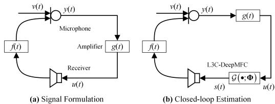
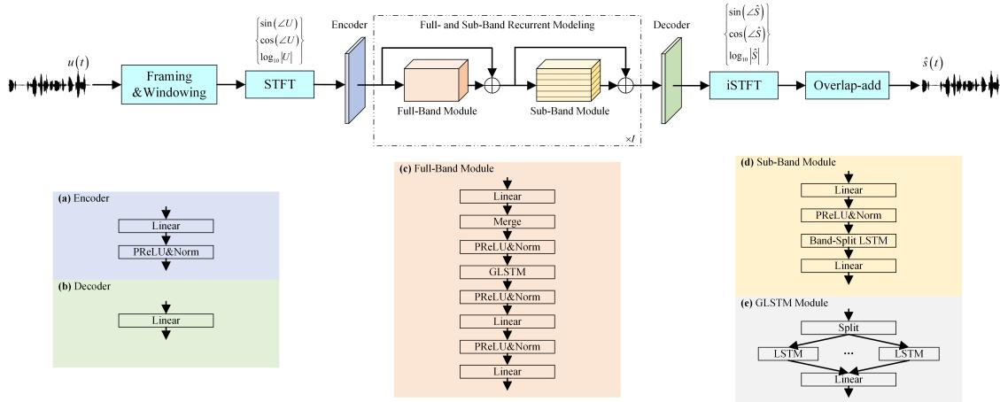
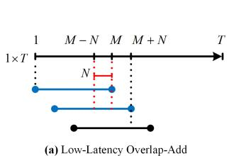
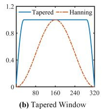
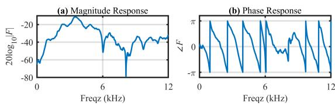

# L3C-DeepMFC: Low-Latency Low-Complexity Deep Marginal Feedback Cancellation with Closed-Loop Fine Tuning for Hearing Aids

Fengyuan Hao1,2, Brian C. J. Moore3, Huiyong Zhang1,2, Xiaodong Li1,2, Chengshi Zheng1,2

1Laboratory of Noise and Audio Research, Institute of Acoustics, Chinese Academy of Sciences, Beijing, China

2University of Chinese Academy of Sciences, Beijing, China

3Cambridge Hearing Group, Department of Psychology, University of Cambridge, Cambridge, UK cszheng@mail.ioa.ac.cn

## Abstract

Feedback control in hearing aids mitigates acoustic feedback caused by the coupling between the receiver and microphone. While DNN-based methods have achieved progress, they remain computationally intensive with relatively high latency. This paper introduces L3C-DeepMFC, a low-latency and low-complexity time-frequency (T-F) domain method that employs complex spectrum mapping to estimate the magnitude and phase components of the desired speech. This method integrates full- and sub-band recurrent modeling to capture spectrotemporal patterns and modifies the overlap-add method for lowlatency processing. Moreover, we utilize closed-loop fine tuning with dynamically generated feedback mixtures to minimize the mismatch between training and estimation. Evaluations using the AISHELL-3 dataset confirm its competitive performance across various gains, significantly improving the maximum stable gain (MSG). Integration with traditional methods shows better performance of feedback suppression.

Index Terms: Deep marginal feedback cancellation, lowlatency, low-complexity, deep learning, hearing aid

## 1. Introduction

Acoustic feedback arises due to the coupling between the receiver and microphone in local sound reinforcement systems such as hearing aids [1], where an amplified sound reproduced by the receiver is unintentionally captured by the microphone and subsequently reamplified [2], as illustrated in Fig. 1(a). This self-reinforcing phenomenon often leads to an unpleasant noise known as acoustic howling when the amplified gain is greater the maximum stable gain (MSG). Without effective feedback control, hearing aids may struggle to provide the necessary amplification prescribed by standard fitting methods [3, 4], especially for low-level speech. This shortcoming negatively affects both speech quality and intelligibility for individuals with hearing loss [5].

One technique for feedback control is frequency shifting (FS) [6], which is applied to the microphone signal before amplification and transmission to the receiver. However, while FS smooths the closed-loop response in hearing aids, it inevitably introduces speech distortions [7], imposing inherent limitations on its effectiveness. Beyond the evident applicability of phasemodulation techniques, one of the most straightforward strategies for feedback control is to automatically reduce the gain at frequencies where the MSG is lowest [8]. This method requires an effective howling detection method to determine these critical frequencies. Since howling components typically occur at only a few frequencies [9], notch filtering [10] can be introduced to selectively suppress these frequencies, causing only limited degradation in speech quality [11]. While the abovementioned methods have led to improved feedback control, they achieve only modest increases in MSG [6, 7] and are not effective when very high gains are required.

  
Figure 1: (a) Internal structure of signal formulation. (b) Internal structure of closed-loop estimation.

Adaptive feedback cancellation (AFC) is recognized for its theoretical potential to eliminate acoustic feedback completely [12, 13]. In practical applications, AFC estimates the feedback path to predict and subtract unwanted components in the received signal. To mitigate biased estimation caused by the high correlation between the receiver and microphone signals, various decorrelation techniques, such as addition of a low-level noise [14], FS [15] and the prediction error method (PEM) [16], have been integrated into AFC. The Neural-AFC [17, 18] and NeuralKalmanAHS [19] methods function as DNN-based stepsize controllers to strike a balance between convergence speed and steady-state error, achieving state-of-the-art (SOTA) performance across multiple benchmarks. DeepMFC [20] employs complex spectrum mapping [21] to mitigate degradations in sound quality that occur for systems with gain only a little below the MSG. DeepMFC and its extensions [20, 22, 23] treat feedback cancellation as an interference suppression task, training models in an open-loop manner, while using the pre-trained model in closed loop. Despite the significant progress that has been achieved by current DNN-based methods, most of these methods remain computationally intensive and introduce significant latency, which limits their practical application in lowresource systems requiring low latency, such as hearing aids.

In this paper, we propose a DNN-based time-frequency (T-F) domain method termed L3C-DeepMFC for Low-Latency Low-Complexity Deep Marginal Feedback Cancellation, which employs complex spectrum mapping to directly estimate the magnitude and phase components of feedback-free speech. This method incorporates both full- and sub-band recurrent modeling to effectively capture spectro-temporal patterns, achieving a significant reduction in computational complexity while maintaining strong performance. Additionally, the overlap-add method has been modified for real-time processing, resulting in an overall algorithmic latency of only 4 ms when ignoring the estimation time. To mitigate discrepancies between training and estimation, as observed in DeepMFC [20], we implement closed-loop fine tuning and dynamically generate paired mixtures with marginal feedback. Experimental evaluations using the AISHELL-3 [24] dataset confirmed that the proposed method achieves competitive performance across various gain levels and significantly improves the MSG of hearing aids. Moreover, integrating the proposed method with AFC further enhances overall feedback suppression.

  
Figure 2: Internal structure of L3C-DeepMFC, featuring a speech encoder, full- and sub-band recurrent modeling, and speech decoder.

## 2. Signal Formulation

As illustrated in Fig. 1(a), the amplified sound u[t] sent to the receiver is inadvertently captured by the microphone and subjected to repeated amplification. The microphone signal y[t] can be mathematically expressed as:

$$
y [ t ] = v [ t ] + u [ t ] * f [ t ] + n [ t ],\tag{1}
$$

where, $v [ t ] , f [ t ]$ and $n [ t ]$ are the desired speech, feedback path and environmental noise, respectively, t denotes the time index, and ∗ denotes linear convolution. For hearing aids, the amplification process follows the formulation: $g [ t ] = G \cdot \delta \left( t - \Delta t \right)$ where G denotes the gain, ∆t denotes the system delay that contains both algorithmic delay and hardware intrinsic delay, and $\delta ( \bullet )$ denotes the Dirichlet function. With appropriate suppression of feedback and noise, the desired receiver signal s[t] is $s [ t ] = G \cdot v [ t - \Delta t ]$ ], which serves as the training target for L3C-DeepMFC.

## 3. Methodology

The goal was to employ complex spectrum mapping to directly estimate the magnitude and phase components of amplified and delayed feedback-free speech in the T-F domain, formulated as:

$$
(\cos \angle \hat {S}, \sin \angle \hat {S}, \log | \hat {S} |) = \mathcal {G} (\cos \angle U, \sin \angle U, \log | U |; \Phi),\tag{2}
$$

where $\hat { S }$ and $U$ are the complex spectra of the estimated speech and amplified speech, respectively, $| \bullet |$ and $\angle \bullet$ extract the magnitude and phase components of the complex spectrum, and $\mathcal G ( \bullet ; \Phi )$ is a trainable transformation with parameters Φ. The internal structure of L3C-DeepMFC is illustrated in Fig. 2. Unlike [20], in which two parallel decoders are employed for real and imaginary (RI) components, the proposed method integrates gain-shape representations [25] to decouple the magnitude and phase components, covering a broader dynamic range. Comprising three essential components, the proposed method begins with a speech encoder that computes D-dimensional feature representations for each T-F unit. This is implemented through a linear layer, PReLU, and instant layer normalization [26]. After that, an I-layer full- and sub-band recurrent module is employed to effectively capture spectro-temporal dependencies to predict the feedback-free speech. Finally, a linear layer acts as the speech decoder, reconstructing the processed signal in the T-F domain.

## 3.1. T-F Band-Split Modeling

The full- and sub-band recurrent module extends the speech enhancement block from [27] by incorporating the gain-shape representation from Eq. (2) as input. Due to the high computational complexity of DeepMFC with fully convolutional modeling [28], which is impractical for low-complexity scenarios, we introduce a full- and sub-band recurrent modeling framework inspired by [29]. As depicted in Fig. 2, this framework consists of a sub-band recurrent module and a full-band recurrent module. By progressively refining the speech features, this framework facilitates effective feedback control.

In the sub-band recurrent module, the input features $R _ { i } \ \in$ $\mathbb { R } ^ { D \times T \times F }$ in the ith block are first processed by a linear layer to generate a C-dimensional representation. Zero-padding and normalization are applied before partitioning the features into non-overlapping frequency groups, each with a group size $L .$ These resulting features $Q _ { i }$ are then split into $\left\lceil \frac { F } { L } \right\rceil$ distinct sequences of length $T ,$ where ⌈•⌉ denotes the ceiling operation. To capture the temporal dependencies within each sub-band, a single-layer LSTM is introduced as follows:

$$
U _ {i} [:,:, b ] = \mathtt {L S T M} (Q _ {i} [:,:, b ]) \in \mathbb {R} ^ {H \times T},\tag{3}
$$

where $\ b \ \in \ \left[ 1 , \cdots , \left\lceil \frac { F } { L } \right\rceil \right]$ denotes the band index, and $H$ is the number of LSTM hidden units. This same LSTM is shared across all sub-bands to minimize the number of parameters. Adjusting L allows us to control the number of sub-bands, which directly affects computational complexity. Subsequently, a linear layer is applied to the LSTM output, and the final output $Z _ { i } \in \overset { \mathbf { \check { \rho } } } { \mathbb { R } } ^ { D \times T \times \overset { \mathbf { \check { \rho } } } { F } }$ is obtained. Unlike [27], which models bandlevel spectral information, the proposed method simplifies the process by ignoring inter-bands dependencies, leading to a reduction in computational complexity.

  
Figure 3: (a) Internal structure of low-latency overlap-add method. (b) Internal structure of tapered window.

The full-band recurrent module is engineered to capture global full-band information, addressing the limitations of previous modules that focus on local band-level information. This is achieved by computing frame-level features from the T-F features within each frame, followed by the application of a group-LSTM (GLSTM) [28] to obtain long-range contextual information, as illustrated in Fig. 2(e). To facilitate efficient streamingestimation processing, only a limited number of the hidden and cell states are utilized in the LSTMs, minimizing the buffer size requirement and making it more practical for real-time implementation. By leveraging iterative information transformation through both full- and sub-band modeling, the proposed method demonstrates robust performance for systems operating close to the limits of stability.

## 3.2. Low-Latency Overlap-Add Method

To reconstruct continuous speech in the time domain, existing T-F methods [20, 22, 23] rely on the overlap-add method, where the latency is influenced by the window length, posing a challenge for low-latency applications like hearing aids. To overcome this, we use a tapered window [30] as the analysis window $w _ { a } [ t ]$ , which helps to reduce discontinuities in the reconstructed speech. Additionally, we modify the traditional overlap-add method to synthesize the signals using only the current and next frames, as illustrated in Fig. 3(a). The synthesis procedure is described as:

$$
\begin{array}{r} \hat {s} [ M + (k - 1) N + t ] = w _ {s} ^ {(1)} [ t ] \cdot \hat {s} _ {w} [ t + M - N, k ] \\ + w _ {s} ^ {(2)} [ t ] \cdot \hat {s} _ {w} [ t + M - 2 N, k + 1 ], \end{array}\tag{4}
$$

where $t \in [ 1 , \cdots , N ] , \hat { s } _ { w }$ denotes frame-wise output speech that corresponds to the time-domain representation of ${ \hat { S } } ,$ $w _ { s } ^ { ( 1 ) } [ t ] = w _ { a } [ M - N : M ]$ and $w _ { s } ^ { ( 2 ) } [ t ] \stackrel { \textstyle = } { = } \left( w _ { a } [ 1 : N ] \right) ^ { 2 }$ are synthesis windows, M and N denote frame size and shift, and k denotes the frame index. By adjusting $N _ { \ast }$ , the latency of the proposed method can be decreased, the total algorithm delay being twice the window shift.

## 3.3. Closed-Loop Fine Tuning

DeepMFC [20] is trained using simulated mixtures with marginal feedback, but the closed-loop estimation, as illustrated in Fig. 1(b), may result in suboptimal performance due to two discrepancies between open-loop training and closed-loop estimation. First, in this closed-loop process, we update the corresponding frame buffer based on the output of each frame during the overlap-add stage. Second, by applying feedback concealment, we eliminate acoustic coupling entirely, ensuring that the received signal consists only of the feedback signal from the current frame and the desired speech. To alleviate this, we perform closed-loop fine tuning using a simulated hearing aid system, which leads to a noticeable increase in MSG.

  
Figure 4: Magnitude and phase responses of Set A.

## 3.4. Loss Function

To ensure that L3C-DeepMFC effectively enhances the target speech quality, we consider the mean square error (MSE) loss for both the complex spectrum and magnitude spectrum [31], which leads to improved results using perceptual metrics. The final loss function is formulated as follows:

$$
\mathcal {L} ^ {\mathrm{Mag+RI}} = 0. 5 \cdot \mathcal {L} ^ {\mathrm{Mag}} (\hat {S} ^ {\prime}, S) + 0. 5 \cdot \mathcal {L} ^ {\mathrm{RI}} (\hat {S} ^ {\prime}, S),\tag{5}
$$

$$
\mathcal {L} ^ {\mathrm{Mag}} (\hat {S} ^ {\prime}, S) = \left\| | \hat {S} ^ {\prime} | - | S | \right\| _ {F} ^ {2},\tag{6}
$$

$$
\mathcal {L} ^ {\mathrm{RI}} (\hat {S} ^ {\prime}, S) = \left\| \hat {S} _ {r} ^ {\prime} - S _ {r} \right\| _ {F} ^ {2} + \left\| \hat {S} _ {i} ^ {\prime} - S _ {i} \right\| _ {F} ^ {2},\tag{7}
$$

where $\| \bullet \| _ { F }$ represents the Frobenius norm, and subscripts $\{ r , i \}$ denote the RI components. After obtaining time-domain feedback-free speech, both $\hat { S } ^ { \prime }$ and S are compressed complex spectra of the estimated speech and target speech, derived using the Hanning window [32], which can reduce estimation errors due to spectral leakage from the tapered window.

## 4. Experimental Setup

## 4.1. Dataset Preparation

For fair comparisons, we evaluated the performance of the proposed method using simulated hearing aid systems. The clean Mandarin speech signals were taken from the AISHELL-3 [24] dataset, while environmental noises were taken from the DNS Challenge [33] dataset. The feedback path simulation followed [20], and both datasets were resampled to 24 kHz. To speed up convergence, we first trained the models based on simulated mixtures with marginal feedback, followed by fine tuning with a larger gain in a closed-loop system. The training mixtures covered signal-to-noise ratios (SNR) from 5 dB to 20 dB. During the estimation phase, we simulated 150 mixtures for objective evaluation in the simulated hearing aid systems, without any background noises. Two benchmarks were used for comparison: Set-A, which included a real measured feedback path, with the magnitude and phase response shown in Fig. 4, and Set-B, which was randomly sampled from 420 feedback paths in [34]. The configurations for estimation were mainly aligned with those in [20].

## 4.2. Configuration

By default, we set the window size M to 20 ms, hop size N to 2 ms and the fast Fourier transform (FFT) size to 480, leading to an overall algorithmic latency of 4 ms, as detailed in Section $3 . 2 .$ . For real-time processing, we set $I = 3 , D = 8$ $C = 8 , L = 4$ , and $H = 1 6$ . We compressed 8 neighbouring T-F bins into 4 dimensions to compute frame-level features.

Table 1: Quantitative comparisons with baselines in terms of WB-PESQ and HASQI-V2 based on the AISHELL-3 dataset. The bes result is highlighted in bold, the second best result is underlined, and “-” indicates system instability in each case.

<table><tr><td rowspan="2"></td><td rowspan="2">Gain Margin (dB)</td><td colspan="8">WB-PESQ</td><td colspan="8">HASQI-V2</td></tr><tr><td>-14</td><td>-12</td><td>-10</td><td>-8</td><td>-6</td><td>-4</td><td>-2</td><td>0</td><td>-14</td><td>-12</td><td>-10</td><td>-8</td><td>-6</td><td>-4</td><td>-2</td><td>0</td></tr><tr><td rowspan="6">Set A</td><td>Mixture</td><td>-</td><td>-</td><td>-</td><td>-</td><td>-</td><td>-</td><td>-</td><td>2.88</td><td>-</td><td>-</td><td>-</td><td>-</td><td>-</td><td>-</td><td>-</td><td>0.797</td></tr><tr><td>FS</td><td>-</td><td>-</td><td>-</td><td>-</td><td>-</td><td>-</td><td>-</td><td>1.73</td><td>-</td><td>-</td><td>-</td><td>-</td><td>-</td><td>-</td><td>-</td><td>0.411</td></tr><tr><td>AFC</td><td>-</td><td>-</td><td>-</td><td>3.86</td><td>4.14</td><td>4.26</td><td>4.32</td><td>4.36</td><td>-</td><td>-</td><td>-</td><td>0.770</td><td>0.823</td><td>0.857</td><td>0.880</td><td>0.897</td></tr><tr><td>L3C-DeepMFC</td><td>2.18</td><td>2.35</td><td>2.52</td><td>2.80</td><td>2.96</td><td>3.20</td><td>3.79</td><td>4.08</td><td>0.655</td><td>0.687</td><td>0.702</td><td>0.714</td><td>0.716</td><td>0.757</td><td>0.870</td><td>0.913</td></tr><tr><td>AFC+FS</td><td>-</td><td>1.29</td><td>1.67</td><td>1.92</td><td>2.09</td><td>2.20</td><td>2.27</td><td>2.32</td><td>-</td><td>0.206</td><td>0.437</td><td>0.508</td><td>0.545</td><td>0.563</td><td>0.572</td><td>0.578</td></tr><tr><td>AFC+L3C-DeepMFC</td><td>1.90</td><td>2.62</td><td>3.39</td><td>3.80</td><td>3.96</td><td>4.02</td><td>4.04</td><td>4.04</td><td>0.498</td><td>0.635</td><td>0.751</td><td>0.811</td><td>0.847</td><td>0.870</td><td>0.885</td><td>0.894</td></tr><tr><td rowspan="6">Set B</td><td>Mixture</td><td>-</td><td>-</td><td>-</td><td>-</td><td>-</td><td>-</td><td>-</td><td>2.38</td><td>-</td><td>-</td><td>-</td><td>-</td><td>-</td><td>-</td><td>-</td><td>0.645</td></tr><tr><td>FS</td><td>-</td><td>-</td><td>-</td><td>-</td><td>-</td><td>-</td><td>-</td><td>1.53</td><td>-</td><td>-</td><td>-</td><td>-</td><td>-</td><td>-</td><td>-</td><td>0.393</td></tr><tr><td>AFC</td><td>-</td><td>-</td><td>-</td><td>4.01</td><td>4.07</td><td>4.13</td><td>4.19</td><td>4.26</td><td>-</td><td>-</td><td>-</td><td>0.831</td><td>0.847</td><td>0.862</td><td>0.876</td><td>0.890</td></tr><tr><td>L3C-DeepMFC</td><td>2.28</td><td>2.36</td><td>2.53</td><td>2.79</td><td>3.23</td><td>3.78</td><td>4.01</td><td>4.00</td><td>0.707</td><td>0.710</td><td>0.705</td><td>0.725</td><td>0.800</td><td>0.886</td><td>0.918</td><td>0.924</td></tr><tr><td>AFC+FS</td><td>-</td><td>-</td><td>-</td><td>2.28</td><td>2.32</td><td>2.34</td><td>2.36</td><td>2.37</td><td>-</td><td>-</td><td>-</td><td>0.571</td><td>0.577</td><td>0.580</td><td>0.582</td><td>0.583</td></tr><tr><td>AFC+L3C-DeepMFC</td><td>3.78</td><td>3.89</td><td>3.94</td><td>3.96</td><td>3.97</td><td>3.96</td><td>3.94</td><td>3.90</td><td>0.800</td><td>0.830</td><td>0.849</td><td>0.862</td><td>0.872</td><td>0.878</td><td>0.882</td><td>0.884</td></tr></table>

Table 2: Objective results of ablation studies based on Set A of the AISHELL-3 dataset.

<table><tr><td rowspan="3">Method</td><td rowspan="3">Latency (ms)</td><td rowspan="3">Window in Eq. (5)</td><td rowspan="3">Closed-Loop</td><td rowspan="3">Param. (M)</td><td rowspan="3">MACs (G/s)</td><td colspan="10">Gain Margin (dB)</td></tr><tr><td colspan="5">WB-PESQ</td><td colspan="5">HASQI-V2</td></tr><tr><td>-15</td><td>-10</td><td>-5</td><td>0</td><td>5</td><td>-15</td><td>-10</td><td>-5</td><td>0</td><td>5</td></tr><tr><td>DeepMFC [20]</td><td rowspan="2">10</td><td rowspan="2">Tapered</td><td rowspan="2"> $\times$ </td><td rowspan="2">9.83</td><td rowspan="2">4.83</td><td>2.78</td><td>3.14</td><td>3.12</td><td>3.15</td><td>3.12</td><td>0.670</td><td>0.769</td><td>0.785</td><td>0.795</td><td>0.792</td></tr><tr><td>AFC+DeepMFC [20]</td><td>3.16</td><td>3.14</td><td>3.13</td><td>3.15</td><td>3.12</td><td>0.745</td><td>0.767</td><td>0.784</td><td>0.795</td><td>0.791</td></tr><tr><td>DeepMFC</td><td rowspan="2">4</td><td rowspan="2">Tapered</td><td rowspan="2"> $\times$ </td><td rowspan="2">9.83</td><td rowspan="2">12.04</td><td>1.54</td><td>1.83</td><td>1.88</td><td>1.93</td><td>2.03</td><td>0.369</td><td>0.518</td><td>0.541</td><td>0.552</td><td>0.564</td></tr><tr><td>AFC+DeepMFC</td><td>1.79</td><td>1.84</td><td>1.88</td><td>1.93</td><td>2.03</td><td>0.468</td><td>0.515</td><td>0.540</td><td>0.552</td><td>0.564</td></tr><tr><td>DeepMFC</td><td rowspan="2">4</td><td rowspan="2">Hanning</td><td rowspan="2"> $\times$ </td><td rowspan="2">9.83</td><td rowspan="2">12.04</td><td>2.18</td><td>2.96</td><td>3.21</td><td>4.34</td><td>4.29</td><td>0.648</td><td>0.776</td><td>0.767</td><td>0.947</td><td>0.958</td></tr><tr><td>AFC+DeepMFC</td><td>2.13</td><td>3.70</td><td>4.22</td><td>4.27</td><td>4.23</td><td>0.481</td><td>0.773</td><td>0.877</td><td>0.914</td><td>0.925</td></tr><tr><td>L3C-DeepMFC</td><td rowspan="2">4</td><td rowspan="2">Hanning</td><td rowspan="2"> $\checkmark$ </td><td rowspan="2">0.31</td><td rowspan="2">0.43</td><td>2.06</td><td>2.52</td><td>3.06</td><td>4.08</td><td>3.99</td><td>0.622</td><td>0.702</td><td>0.729</td><td>0.913</td><td>0.934</td></tr><tr><td>AFC+L3C-DeepMFC</td><td>1.64</td><td>3.39</td><td>4.00</td><td>4.04</td><td>3.99</td><td>0.422</td><td>0.751</td><td>0.860</td><td>0.894</td><td>0.903</td></tr></table>

The GLSTM had a group size of 2 and 128 hidden units. The models were trained using the AdamW optimizer [35] for 50 epochs, with an initial learning rate of 0.001, which was halved if the validation loss did not decrease over 2 consecutive epochs. Early stopping was applied after 4 epochs of no improvement.

## 5. Results and Discussion

To facilitate meaningful comparisons, we utilized two widely recognized objective metrics: wide-band perceptual evaluation of speech quality (WB-PESQ) [36] based on a 16-kHz bandwidth and hearing-aid speech quality index version 2 (HASQI-V2) [37] based on a 24-kHz bandwidth and assuming normal hearing. Higher values of these metrics correspond to better performance. We also measured the real-time factor (RTF) based on the C++ implementation for reference. Additionally, the number of multiply-accumulate (MAC) operations required for processing a 1-second mixture was evaluated in giga-operations per second (G/s), along with the number of trainable parameters, reported in millions (M).

To evaluate the performance of the proposed method, we compared it with two traditional methods: FS [6] and PEMbased AFC [16], as well as combinations of various methods with DeepMFC [20]. Table 1 details the quantitative results in the simulated hearing aid systems. The gain margin is defined as the ratio of MSG to the current system gain [5], more negative values indicating a greater benefit in terms of increases in MSG. To ensure fair comparison, the latency for all methods was set to 4 ms. Although some traditional methods performed well, the proposed low-latency method achieved satisfactory HASQI-V2 metrics across different benchmarks while maintaining an exceptionally low computational complexity of 0.43 G/s. While AFC methods that aim to minimize biased estimation using decorrelation techniques are less effective when dealing with large gains, the proposed method maintains system stability even at high gains. The integration with AFC further improved feedback suppression performance while reducing residual artifacts that are present in the output of L3C-DeepMFC. Ablation studies based on Set A, as detailed in Table 2, reveal several critical points. First, reducing frame shift leads to an exponential increase in the computational complexity of DeepMFC. Second, directly applying a tapered window for MSE loss computation results in severe speech distortions due to spectral leakage. However, by incorporating closedloop fine tuning, the proposed method achieves comparable performance to DeepMFC while maintaining computational efficiency, demonstrating its strong potential for feedback suppression. The proposed method achieves an RTF of 0.623 and a buffer size of 25.9 kilobytes (KB), making it highly suitable for resource-limited processing.

## 6. Conclusions

This paper proposes L3C-DeepMFC, a low-latency and lowcomplexity T-F domain method for feedback control. By using T-F band-split modeling, it utilizes complex spectrum mapping to extract the magnitude and phase components of feedbackfree speech. Additionally, the overlap-add method for reconstruction of the time-domain signal was modified to significantly reduce the algorithmic latency. To address discrepancies between training and estimation, we implemented closed-loop fine tuning and dynamically generated paired mixtures. Experimental evaluations using simulation show that the proposed method achieves competitive performance for a wide range of gains and significantly improves the MSG of hearing aids. The integration with AFC further improves feedback suppression.

## 7. References

[1] M. Siqueira and A. Alwan, “Steady-state analysis of continuous adaptation in acoustic feedback reduction systems for hearingaids,” IEEE Transactions on Speech and Audio Processing, vol. 8, pp. 443–453, 2000.

[2] T. van Waterschoot and M. Moonen, “Fifty years of acoustic feedback control: State of the art and future challenges,” Proceedings of the IEEE, vol. 99, pp. 288–327, 2011.

[3] G. Keidser, H. Dillon, M. Flax, T. Ching, and S. Brewer, “The NAL-NL2 prescription procedure,” Audiology Research, vol. 1, pp. 1–3, 2011.

[4] B. C. J. Moore, B. R. Glasberg, and M. A. Stone, “Development of a new method for deriving initial fittings for hearing aids with multi-channel compression: CAMEQ2-HF,” International Jour nal of Audiology, vol. 49, pp. 216–227, 2010.

[5] C. Zheng, C. Xu, M. Wang, X. Li, and B. C. J. Moore, “Evaluation of deep marginal feedback cancellation for hearing aids using speech and music,” Trends in Hearing, vol. 27, pp. 1–19, 2023.

[6] M. R. Schroeder, “Improvement of acoustic-feedback stability by frequency shifting,” The Journal of the Acoustical Society of America, vol. 36, pp. 1718–1724, 1964.

[7] C. Zheng, C. Hofmann, X. Li, and W. Kellermann, “Analysis of additional stable gain by frequency shifting for acoustic feedback suppression using statistical room acoustics,” IEEE Signal Processing Letters, vol. 23, pp. 159–163, 2016.

[8] E. T. Patronis, “Electronic detection of acoustic feedback and automatic sound system gain control,” Journal of The Audio Engineering Society, vol. 26, pp. 323–326, 1978.

[9] T. van Waterschoot and M. Moonen, “Comparative evaluation of howling detection criteria in notch-filter-based howling suppression,” Journal of The Audio Engineering Society, vol. 58, pp. 923– 940, 2010.

[10] J. Foley, “Adaptive periodic noise cancellation for the control of acoustic howling,” IEE Colloquium on Adaptive Filters, vol. 1, pp. 1–4, 1989.

[11] B. C. J. Moore and C.-T. Tan, “Perceived naturalness of spectrally distorted speech and music,” The Journal of the Acoustical Society of America, vol. 114, pp. 408–419, 2003.

[12] D. Bustamante, T. Worrall, and M. Williamson, “Measurement and adaptive suppression of acoustic feedback in hearing aids,” in Proc. ICASSP, 1989, pp. 2017–2020.

[13] J. Kates, “Feedback cancellation in hearing aids: results from a computer simulation,” IEEE Transactions on Signal Processing, vol. 39, pp. 553–562, 1991.

[14] G. Schmidt and T. Haulick, “Signal processing for in-car com munication systems,” Signal Processing, vol. 86, pp. 1307–1326, 2006.

[15] M. Guo, S. H. Jensen, J. Jensen, and S. L. Grant, “On the use of a phase modulation method for decorrelation in acoustic feedback cancellation,” in Proc. EUSIPCO, 2012, pp. 2000–2004.

[16] A. Spriet, I. Proudler, M. Moonen, and J. Wouters, “Adaptive feedback cancellation in hearing aids with linear prediction of the desired signal,” IEEE Transactions on Signal Processing, vol. 53, pp. 3749–3763, 2005.

[17] B. Soleimani, H. Schepker, and M. Mirbagheri, “Neural-AFC: Learning-based step-size control for adaptive feedback cancella tion with closed-loop model training,” in Proc. ICASSP, 2023, pp. 1–5.

[18] X. Zhan, F. Hao, X. Li, and C. Zheng, “DeepPEM-AFC: An improved prediction-error-method-based adaptive feedback cancellation with deep learning for hearing aids,” in Proc. ICASSP, 2025, pp. 1–5.

[19] H. Zhang, Y. Zhang, M. Yu, and D. Yu, “Enhanced acoustic howling suppression via hybrid kalman filter and deep learning models,” IEEE/ACM Transactions on Audio, Speech, and Language Processing, vol. 32, pp. 2828–2840, 2024.

[20] C. Zheng, M. Wang, X. Li, and B. C. J. Moore, “A deep learning solution to the marginal stability problems of acoustic feedback systems for hearing aids,” The Journal of the Acoustical Society of America, vol. 152, pp. 3616–3634, 2022.

[21] C. Zheng, H. Zhang, W. Liu, X. Luo, A. Li, X. Li, and B. C. J. Moore, “Sixty years of frequency-domain monaural speech enhancement: From traditional to deep learning methods,” Trends in Hearing, vol. 27, pp. 1–52, 2023.

[22] H. Zhang, M. Yu, and D. Yu, “Deep AHS: A deep learning approach to acoustic howling suppression,” in Proc. ICASSP, 2023, pp. 1–5.

[23] H. Gan, G. Luo, Y. Luo, and W. Luo, “Howling noise cancellation in time–frequency domain by deep neural networks,” in Proc. ICICT, 2022, pp. 319–332.

[24] Y. Shi, H. Bu, X. Xu, S. Zhang, and M. Li, “AISHELL-3: A multi-speaker mandarin TTS corpus,” in Proc. Interspeech, 2021, pp. 2756–2760.

[25] Y. Luo, J. Yu, H. Chen, R. Gu, and C. Weng, “Gull: A generative multifunctional audio codec,” arXiv preprint arXiv:2404.04947, 2024.

[26] Y. Luo and N. Mesgarani, “Conv-TasNet: Surpassing ideal time–frequency magnitude masking for speech separation,” IEEE/ACM Transactions on Audio, Speech, and Language Processing, vol. 27, pp. 1256–1266, 2019.

[27] F. Hao, A. Li, X. Li, and C. Zheng, “DSINet: Towards real-time target speaker extraction with dynamic speaker information fusion,” in Proc. ICASSP, 2025, pp. 1–5.

[28] K. Tan and D. Wang, “Learning complex spectral mapping with gated convolutional recurrent networks for monaural speech enhancement,” IEEE/ACM Transactions on Audio, Speech, and Language Processing, vol. 28, pp. 380–390, 2020.

[29] Z.-Q. Wang, S. Cornell, S. Choi, Y. Lee, B.-Y. Kim, and S. Watanabe, “Neural speech enhancement with very low algorithmic latency and complexity via integrated full- and sub-band modeling,” in Proc. ICASSP, 2023, pp. 1–5.

[30] R. Martin, D. Malah, R. V. Cox, and A. J. Accardi, “A noise reduction preprocessor for mobile voice communication,” EURASIP Journal on Advances in Signal Processing, vol. 1, pp. 1–13, 2004.

[31] A. Li, W. Liu, C. Zheng, C. Fan, and X. Li, “Two heads are better than one: A two-stage complex spectral mapping approach for monaural speech enhancement,” IEEE/ACM Transactions on Audio, Speech, and Language Processing, vol. 29, pp. 1829–1843, 2021.

[32] A. Li, C. Zheng, R. Peng, and X. Li, “On the importance of power compression and phase estimation in monaural speech dereverberation,” JASA Express Letters, vol. 1, pp. 1–6, 2021.

[33] H. Dubey, A. Aazami, V. Gopal, B. Naderi, S. Braun, R. Cutler, A. Ju, M. Zohourian, M. Tang, M. Golestaneh, and R. Aichner, “ICASSP 2023 deep noise suppression challenge,” IEEE Open Journal of Signal Processing, vol. 5, pp. 725–737, 2024.

[34] T. Sankowsky-Rothe, M. Blau, H. Schepker, and S. Doclo, “Reciprocal measurement of acoustic feedback paths in hearing aids,” The Journal of the Acoustical Society of America, vol. 138, pp. 399–404, 2015.

[35] I. Loshchilov and F. Hutter, “Decoupled weight decay regularization,” in Proc. ICLR, 2019, pp. 1–18.

[36] A. Rix, J. Beerends, M. Hollier, and A. Hekstra, “Perceptual eval uation of speech quality (PESQ) - a new method for speech quality assessment of telephone networks and codecs,” in Proc. ICASSP, 2001, pp. 749–752.

[37] J. M. Kates and K. H. Arehart, “The hearing-aid speech quality index (HASQI) version 2,” Journal of The Audio Engineering Society, vol. 62, pp. 99–117, 2014.