# Frequency-Warped Signal Processing for Audio Applications

Article in Journal of the Audio Engineering Society · November 2000

CITATIONS
200

READS
2,213

6 authors, including:

Aki Härmä
Maastricht University

143 PUBLICATIONS 2,296 CITATIONS

Vesa Välimäki
Aalto University

425 PUBLICATIONS 9,138 CITATIONS

SEE PROFILE

SEE PROFILE

Aalto University, School of EE, Espoo Finland

Unto Kalervo Laine

163 PUBLICATIONS 2,699 CITATIONS

SEE PROFILE

# Frequency-Warped Signal Processing for Audio Applications\*

AKI HÄRMÄ, $^{1}$ MATTI KARJALAINEN, $^{1}$ AES Fellow, LAURI SAVIOJA $^{2}$ , AES Member, VESA VÄLIMÄKI, $^{1}$ AES Member, UNTO K. LAINE, $^{1}$ AES Member, AND JYRI HUOPANIEMI, $^{3}$ AES Member

$^{1}$ Helsinki University of Technology, Laboratory of Acoustics and Audio Signal Processing, FIN-02015 HUT, Espoo, Finland

$^{2}$ Helsinki University of Technology, Telecommunications Software and Multimedia Laboratory, FIN-02015 HUT, Espoo, Finland

$^{3}$ Nokia Research Center, Speech and Audio Systems Laboratory, Helsinki, Finland

Modern audio techniques, such as audio coding and sound reproduction, emphasize the modeling of auditory perception as one of the cornerstones for system design. A methodology, frequency-warped digital signal processing, is presented in a tutorial paper as a means to design or implement digital signal-processing algorithms directly in a way that is relevant for auditory perception. Several audio applications are considered in which this approach shows advantages when used as a design or implementation tool or as a conceptual framework of design.

## 0 INTRODUCTION

The human auditory system is a very complex analyzer that is nonlinear, time-variant, and adaptive in many ways. Thus models of auditory perception are necessarily complex, and audio techniques that utilize such principles are intricate. Only few properties of the auditory system are such that they can be exploited easily and systematically in audio signal processing.

The most often utilized auditory feature in this sense are the pitch scales, that is, auditory “frequency” scales, which are nonlinear and nonuniform in relation to the hertz scale. Examples are the mel scale [1], the Bark scale (critical-band rate scale) [2], and the ERB (equivalent rectangular-bandwidth) rate scale [3]. A close relative to them is the logarithmic scale, which has a long tradition of use in audio technology. In many audio applications it would be desirable to design signal-processing systems and algorithms that work directly on some of these auditory scales. For example, audio equalizers typically should have such properties, and the psychoacoustic models of audio codecs approximate this kind of behavior.

The conventional frequency scale used in digital signal-processing (DSP) systems is linear in relation to the hertz scale, that is, the inherent frequency resolution is uniform for the whole band from dc to the Nyquist limit (half the sampling frequency $f_{s}$ ). The reason for this is the property of the unit delay $z^{-1}$ , the basic DSP building block, which delays signal components of all frequencies by the same amount: delay = 1/sample rate. For example, a sample sequence, when Fourier transformed, results in frequency bins that are equidistant in frequency.

There are of course ways to avoid this property of uniform frequency resolution. Recursive filters (IIR filters) can easily be focused on desired portions of the Nyquist band to have sharper resonances and magnitude response transitions than in other parts of the frequency scale. However, it would be useful to be able to design digital filters and algorithms directly on nonuniform frequency scales, such as the Bark scale.

In this paper we discuss a general approach to designing and implementing DSP techniques on a warped frequency scale that approximates well the Bark scale. The paper begins with an introduction to auditory frequency scales in Section 1. In Section 2 the theory of frequency-warped DSP is introduced, and it is studied how well a warped system can approximate auditory frequency representation. This is followed by an introduction to the design and implementation of warped FIR-type and IIR-type filters, which are the basic building blocks in warped signal-processing algorithms.

Several audio applications where frequency-warped techniques have shown advantages are introduced in Section 3. The warped fast Fourier transform and filterbank techniques are reviewed, and it is demonstrated how a conventional design of a uniform filter bank directly produces a computationally efficient auditory filter bank if it is implemented using warped filters. Parametric techniques for spectral estimation, such as warped LP (WLP) modeling and adaptive filtering techniques, are also available. It is demonstrated that WLP is a potential technique for wide-band speech and audio coding. The gain that can be obtained by warping an LPC-type coding algorithm is shown in listening test results.

Finally, specific applications of warped filters to digital loudspeaker equalization, physical modeling of the guitar body, and implementation of head-related transfer functions are studied. There is also an example where warped techniques have been used to solve a slightly different problem. In this application, warped filters are used to reduce dispersion errors in a digital waveguide mesh, which is used in physical modeling of musical instruments or acoustic spaces. Several other recent applications are also briefly reviewed.

## 1 PITCH SCALES AND RESOLUTIONS

## 1.1 Cochlear Mapping

Based on measurements of the mechanical motion of the cochlea and neural recordings, Greenwood introduced a general analytic expression for the cochlear frequency-position function [4]. For humans it is given by

$$
f = 1 6 5. 4 (1 0 ^ {0. 0 6 x} - 1)\tag{1}
$$

and

$$
x = \frac {1}{0 . 0 6} \log_ {1 0} \left(\frac {f - 1 6 5 . 4}{1 6 5 . 4}\right)\tag{2}
$$

where x is the location on the cochlea (in millimeters) and f is its characteristic frequency (in hertz) corresponding to that position. It is usually assumed that the same frequency representation is also preserved at higher neural stages of the hearing mechanism [5].

The first derivative of Eq. (1) is

$$
\frac {\mathrm{d} f}{\mathrm{d} x} = 2 2. 9 \times 1 0 ^ {0. 0 6 x} = 2 2. 9 \frac {f + 1 6 5 . 4}{1 6 5 . 4}.\tag{3}
$$

Here df/dx is a function describing the bandwidth related to a 1-mm range on the cochlea.

## 1.2 Psychoacoustic Scales

Psychoacoustic scales are usually based on a filterbank model of the hearing mechanism (see, for example, [6] for a review). Estimates of the bandwidths of the filters, that is, auditory filters, may be obtained in many different ways. Once a function representing the bandwidths of the filters is found, a psychoacoustic frequency-position function may be obtained by integrating over the frequency scale.

A classical and still widely used psychoacoustic frequency scale is based on the assumption that the ear may be modeled as a filter bank of a large number of overlapping filters. The bandwidth of those filters is called the critical bandwidth. Based on several different experiments, Scharf [2] concluded that listeners react in one way when the stimuli are wider than the critical band and in another way when the stimuli are narrower. The theory of critical bandwidth postulates that the same bandwidth is used in loudness summation, phase sensitivity, harmonic discrimination, and several other psychoacoustic phenomena.

Recently several authors have pointed out that this is not necessarily the case [5]. The built-in assumption that the filters of the auditory system have rectangular shapes has also been criticized, and it has been shown that off-band listening, which was not counted in the original experiments, may change observed effects significantly [6]. Furthermore, the technique used in determining the critical bandwidths, especially at low frequencies, may be inaccurate and based on incorrect assumptions [7].

Based on Scharf's data, a useful analytic expression for the critical bandwidth as a function of frequency is given by [8]

$$
\Delta f _ {\mathrm{CB}} = 2 5 + 7 5 \left[ 1 + 1. 4 \left(\frac {f}{\mathrm{kHz}}\right) ^ {2} \right] ^ {0. 6 9}\tag{4}
$$

where the unit is the Bark. Scharf remarked that the values may differ by as much as $\pm15\%$ among subjects.

A corresponding frequency-position function defines a scale called the Bark rate scale. A suitable approximation is given by [8]

$$
v = 1 3 \arctan \left(0. 7 6 \frac {f}{\mathrm{kHz}}\right) + 3. 5 \arctan \left(\frac {f}{7 . 5 \mathrm{kHz}}\right) ^ {2}.
$$

(5)

A technique that was designed so that these problems can be eliminated was introduced in [6]. In this technique, a notched noise masker was used in a novel way to find the shapes of auditory filters of the filter-bank model. The bandwidth of an auditory filter is often characterized by its equivalent rectangular bandwidth (ERB), that is, the bandwidth of a rectangular filter that passes the same amount of signal energy as the auditory filter. The following analytic expression for the ERB as a function of frequency was proposed in [3]:

$$
\Delta f _ {\mathrm{ERB}} = 2 4. 7 + 0. 1 0 8 f _ {\mathrm{c}}\tag{6}
$$

where $f_{c}$ is the center frequency of the filter. The equation is actually reliable only in the frequency range from 100 Hz to 10 kHz because ERBs have not been measured at very low and very high frequencies. The corresponding ERB scale can be calculated by

$$
\int \mathrm{d} x = \int \frac {\mathrm{d} f}{2 4 . 7 + 0 . 1 0 8 f}\tag{7}
$$

and

$$
\begin{array}{r l} x & = \frac {1}{0 . 1 0 8} \ln (2 4. 7 + 0. 1 0 8 f) + C \\ & = 2 1. 3 \log (2 4. 7 + 0. 1 0 8 f) + C \\ & = 2 1. 3 \left[ \log \left(1 + \frac {0 . 1 0 8}{2 4 . 7} f\right) - \log (2 4. 7) \right] + C. \end{array}
$$

Since $f(x = 0) = 0$ , the equation reduces to

$$
x = 2 1. 3 \log \left(1 + \frac {f}{2 2 9}\right)\tag{8}
$$

or

$$
f \approx 2 2 9 (1 0 ^ {x / 2 1. 3} - 1).\tag{9}
$$

## 1.3 Comparison of Different Auditory Scales

The ERB and Bark bandwidth estimates are compared in Figs. 1 and 2. In Fig. 1 the bandwidths are plotted on a log-log scale, and in Fig. 2 the ratios between the Bark, ERB, and one-third-octave bands, and the bandwidth expression of Eq. (3) are illustrated.

As shown in the figures, the ERBs are very close to the bandwidth measure derived from Greenwood's formula in Eq. (3). The Bark bands are wider at low and high frequencies, but the correspondence is excellent at the central range of hearing, that is, from 700 Hz to 4 kHz. In Fig. 2 it can be seen that the Bark bands are 2 to 4 times wider than ERBs below 200 Hz and 1.5 to 2 times wider above 5 kHz. The corresponding frequency-to-position mappings are compared in Fig. 3. All audi-

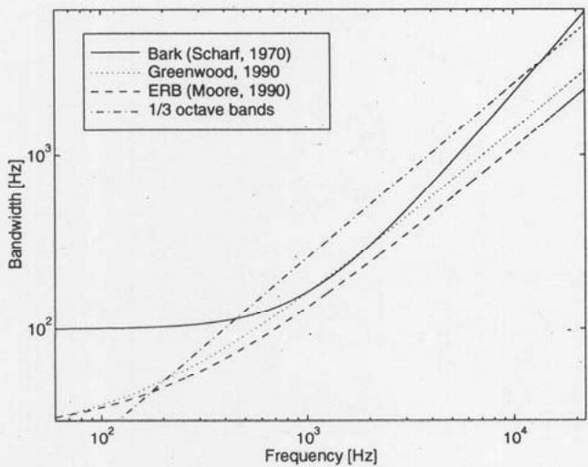  
Fig. 1. Bandwidth corresponding to 1 mm on cochlea, derived from Greenwood's formula, ERB, Bark, and one-third-octave bands as a function of center frequency.

J. Audio Eng. Soc., Vol. 48, No. 11, 2000 November tory frequency scales are between linear and logarithmic scales.

Since the ERB rate scale found by using psycho-acoustic listening tests and the frequency-to-position scale derived from physiological and neural measurements coincide, the ERB rate scale may be considered to be a more accurate model than the Bark scale.

## 2 FREQUENCY WARPING AND WARPED DIGITAL FILTERS

The technique of computing nonuniform-resolution Fourier transforms using first-order all-pass filters was introduced by Oppenheim, Johnson, and Steiglitz [9], [10]. They used the warping technique with the FFT to compute a nonuniform spectral representation of a signal [11]. Mathematically, there was nothing new in this technique—a trivial modification of the Fourier transform. The novelty was in the implementation with a network of digital filters. The idea of frequency-warped transfer functions dates back to a paper by Schüssler [12]. A technique was proposed where the unit delays of a digital filter are replaced with first-order all-pass filters to obtain a variable digital filter that can be controlled by adjusting the coefficient of the all-pass element. This idea, on the other hand, has its roots in a filter design method presented by Constantinides [13].

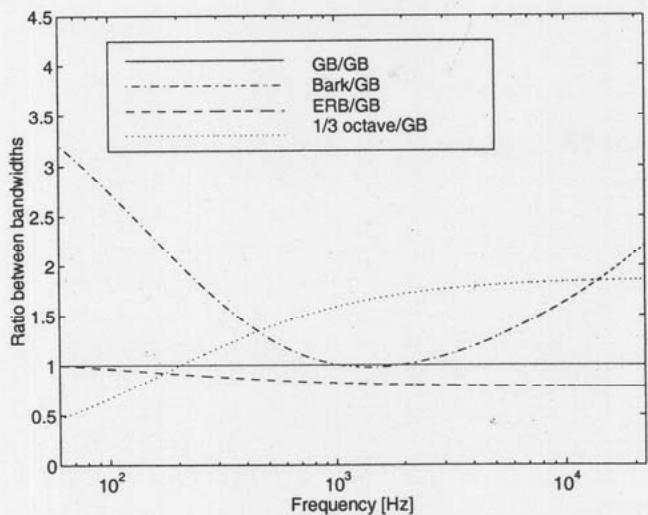  
Fig. 2. Difference between bandwidth estimates of an auditory filter, illustrated in terms of the ratio between a bandwidth function and the bandwidth derived from Greenwood's mapping (GB).

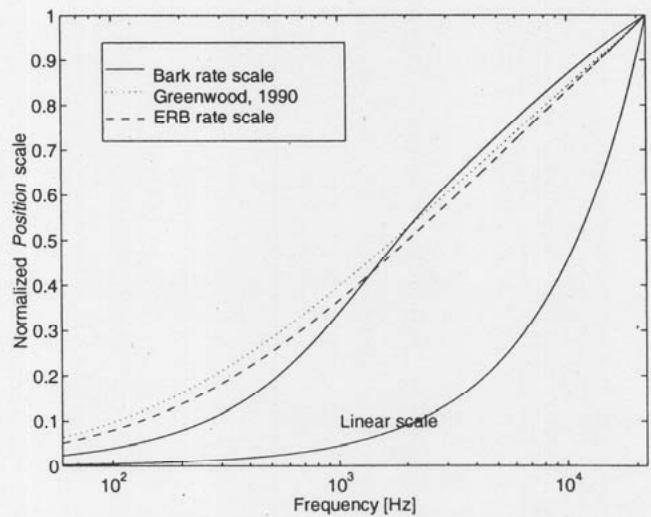  
Fig. 3. Mapping of Greenwood's formula, ERB rate scale, Bark rate scale, and linear frequency.

Strube [14] pointed out that the warping effect may be adjusted to approximate the spectral representation occurring in the human auditory system. He also designed a speech coding scheme where the frequency-warped autocorrelation method of linear prediction is used to estimate coefficients of warped analysis and synthesis filters of the codec [15]. A related technique of cepstral analysis and synthesis on a mel frequency scale was proposed in Imai [16]. Laine and coworkers [17], [18] presented a more general theory of frequency warping in terms of their classes of FAM and FAMlet functions.

## 2.1 All-Pass Filter Chain

The transfer function of a first-order all-pass filter is given by

$$
D (z) = \frac {z ^ {- 1} - \lambda}{1 - \lambda z ^ {- 1}}.\tag{10}
$$

By definition, the magnitude response of the filter is a constant. The normalized phase response of $D(z)$ for various real values of $\lambda$ is shown in Fig. 4. If the parameter $\lambda = 0$ , the transfer function [Eq. (10)] reduces to a single unit delay with linear phase and constant group delay.

The group delays of the same filters are shown in Fig.

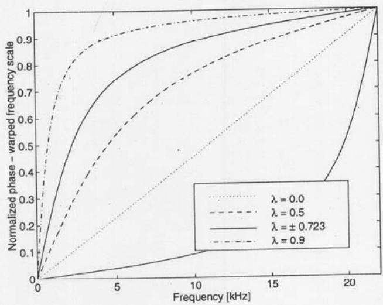  
Fig. 4. Phase response of first-order all-pass filter.

5. For example, the group delay of a filter with $\lambda = 0.723$ is approximately 6 samples at low frequencies but less than 0.2 sample at very high frequencies.

By cascading a set of all-pass filters the all-pass filter chain of Fig. 6 is built. Now if a signal is fed into an all-pass chain with a positive $\lambda$ , the nonuniform group delay of the elements makes low-frequency components proceed slower and high-frequency components faster than in a chain of unit delays. To illustrate this, it is convenient to study a simple example. Three sinusoidal signals are plotted in Fig. 7. We put those signals into an all-pass filter chain of 1000 elements with $\lambda = 0.723$ . The output values $w_{i}$ are read after 1000 samples and plotted as a new warped signal in Fig. 8. Comparing Figs. 7 and 8 one can see easily that the sinusoids propagate at different speeds in the filter chain, that is, the all-pass filter chain is a dispersive system. The procedure of forming a new sequence from the samples $w_{i}$ can be interpreted as a frequency-dependent resampling of the signal.

Studying the spectra of the original and warped signals we immediately see that the frequencies of the sinusoids have been changed. In fact, the mapping from the natural frequency domain to a warped frequency domain is determined by the phase function of the all-pass filter [14], which is given by

$$
\omega^ {\prime} = \arctan \frac {(1 - \lambda^ {2}) \sin (\omega)}{(1 + \lambda^ {2}) \cos (\omega) - 2 \lambda}\tag{11}
$$

where $\omega = 2\pi f/f_{s}$ , and $f_{s}$ is the sampling frequency.

As shown in Fig. 8, warping also changes the temporal structure of the original signal so that low-frequency components are shorter and high-frequency components longer than the original signal. The change in length of a sinusoidal signal is controlled by the group delay function of the all-pass filter. The turning point frequency $f_{tp}$ , where a warped sinusoid is as long as the original sinusoid, or where frequency warping does not change the frequency, is where the group delay is equal to one sample period. A convenient expression for $f_{tp}$ as a function of $\lambda$ and the sampling frequency $f_{s}$ is given by

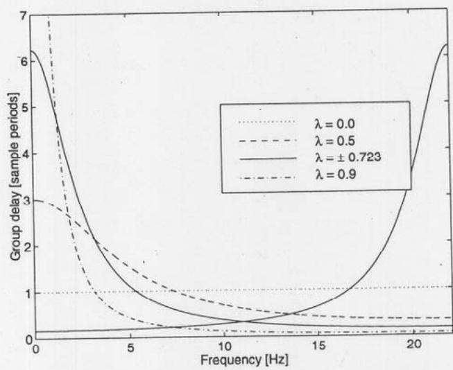  
Fig. 5. Group delay of first-order all-pass filter.

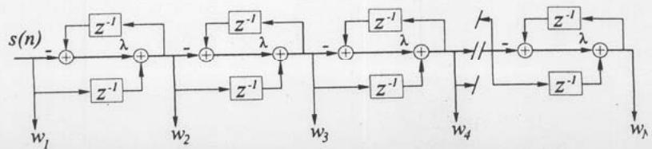  
Fig. 6. Direct-form II implementation of all-pass chain.

$$
f _ {\mathrm{tp}} = \pm \frac {f _ {\mathrm{s}}}{2 \pi} \arccos (\lambda).\tag{12}
$$

For a specific value of $\lambda$ , the frequency transformation closely resembles the frequency mapping occurring in the human auditory system. Smith and Abel [19] derived an analytic expression for $\lambda$ so that the mapping, for a given sampling frequency $f_{s}$ , matches the Bark rate scale mapping. The value is given by

$$
\lambda_ {f _ {\mathrm{s}}} \approx 1. 0 6 7 4 \left[ \frac {2}{\pi} \arctan (0. 0 6 5 8 3 f _ {\mathrm{s}}) \right] ^ {1 / 2} - 0. 1 9 1 6.\tag{13}
$$

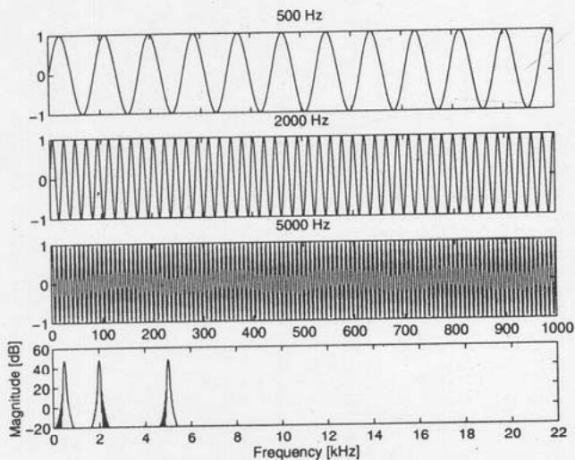  
Fig. 7. Set of sinusoidal signals and their sum spectrum.

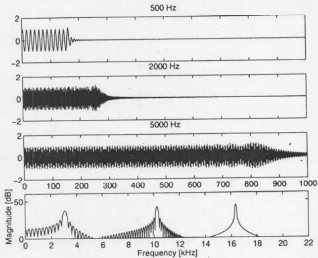  
Fig. 8. Set of warped signals and their sum spectrum.  
J. Audio Eng. Soc., Vol. 48, No. 11, 2000 November

At the 44.1-kHz sampling rate, $\lambda = 0.756$ . The mapping occurring in the all-pass chain is very close to the Bark rate scale mapping, and therefore it has been referred to as Bark bilinear mapping or Bark warping. If the low-frequency part of the mapping is emphasized, a slightly higher value, for example, $\lambda = 0.78$ , gives the best fit to both the Bark rate scale and Greenwood's frequency-to-position function. However, in practice the significance of the second decimal of $\lambda$ is small.

In Fig. 9 the all-pass mappings are compared to Greenwood's frequency-to-position curve and to the Bark rate scale mapping. Due to the shape of the first-order all-pass mapping, it is not possible to find a value for the parameter $\lambda$ for which the mapping would agree well with Greenwood's mapping. Globally, the closest match is found at $\lambda \approx 0.74$ , and if the optimization is focused on low frequencies, $\lambda \approx 0.8$ . Recently it turned out that it is possible to design warped systems where the mapping follows Greenwood's frequency-to-position curve, the ERB scale, or even a logarithmic frequency scale almost exactly. This is not based on the cascade of first-order all-pass filters but on a filter bank of high-order all-pass filters.

## 2.2 Warping as a Conformal Bilinear Mapping

The z transform of a signal or impulse response $s(n)$ , where $n = 0, 1, 2, \ldots, \infty$ , is given by

$$
S (z) = \sum_ {n = 0} ^ {\infty} s (n) z ^ {- n}.\tag{14}
$$

The standard procedure in producing frequency-warped signals and systems involves replacing the unit delays of the original system by first-order all-pass elements. In the z domain, this can be interpreted as a bilinear transformation determined by the mapping

$$
z ^ {- 1} \rightarrow \tilde {z} ^ {- 1} = \frac {z ^ {- 1} - \lambda}{1 - \lambda z ^ {- 1}} = D (z)\tag{15}
$$

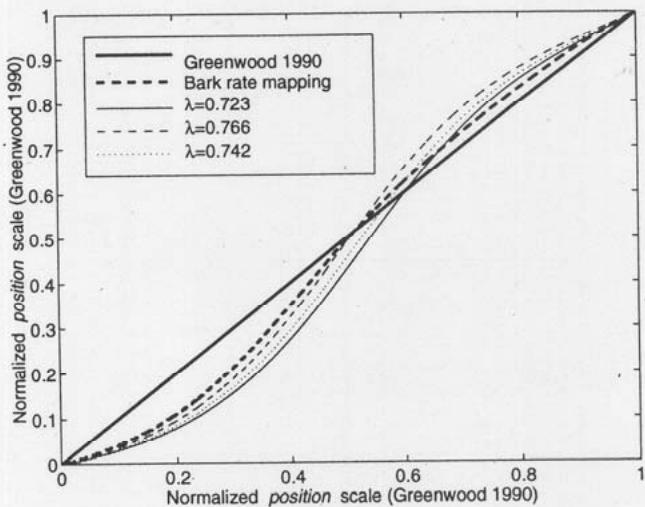  
Fig. 9. Bark rate scale mapping and frequency transformation in an all-pass chain for various $\lambda$ . Both $x$ and $y$ axes represent normalized auditory frequency scale from Greenwood's formula.

HÄRMÄ ET AL.

and its inverse mapping,

$$
\tilde {z} ^ {- 1} \rightarrow z ^ {- 1} = \frac {\tilde {z} ^ {- 1} + \lambda}{1 + \lambda z ^ {- - 1}}.\tag{16}
$$

This is a conformal mapping from the unit disk onto another unit disk. Therefore one can write a warped representation for Eq. (14) by

$$
S (z) = \sum_ {k = 0} ^ {\infty} w (k) \tilde {z} ^ {- k}\tag{17}
$$

where $w(k)$ are the samples of a corresponding warped impulse response. Naturally Eqs. (14) and (17) should be equal, that is,

$$
\sum_ {n = 0} ^ {\infty} s (n) z ^ {- n} = \sum_ {k = 0} ^ {\infty} w (k) \left(\frac {z ^ {- 1} - \lambda}{1 - \lambda z ^ {- 1}}\right) ^ {k}.\tag{18}
$$

Furthermore, one may use Eq. (16) to map the whole equation to the warped z domain. This yields

$$
\sum_ {n = 0} ^ {\infty} s (n) \left(\frac {\tilde {z} ^ {- 1} + \lambda}{1 + \lambda z ^ {- 1}}\right) ^ {n} = \sum_ {k = 0} ^ {\infty} w (k) \tilde {z} ^ {- k}.\tag{19}
$$

Eqs. (18) and (19) define all necessary mappings between a traditional signal or impulse response $s(n)$ and its warped counterpart $w(k)$ .

In the time domain, the right-hand side of Eq. (18) is a $w(n)$ -weighted superposition of the impulse responses of the outputs of the all-pass chain and therefore a method to synthesize a time-domain signal $s(n)$ from its warped counterpart $w(k)$ [20]. Correspondingly, the time-domain representation of the left-hand side of Eq. (19) gives a method to compute a warped signal $w(n)$ from the original signal as a superposition of impulse responses of a chain of all-pass filters. It is important to notice that in the latter case the value of $\lambda$ in the chain of filters is negative. Therefore this technique is sometimes called dewarping. A computational structure implementing the dewarping of an impulse response $s(n)$ is shown in Fig. 10.

Since the warping effect is generally a shift-variant operation, it is possible to use this approach easily only for a finite or truncated impulse response or coefficient sequence. It is important to keep in mind that there are actually two different views of the warping techniques. First, it is possible to warp a signal segment as was done in Fig. 8. Warped signals have rather strange characteristics, and therefore this should be done with care. Second, one may warp a transfer function, a coefficient sequence, or an impulse response. This approach is more straightforward and is actually used in all the application examples of this paper.

## 2.3 Warped FIR Filters

A warped FIR filter, denoted here by WFIR, is obtained by replacing the unit delays of a conventional filter structure with first-order all-pass filters (see Fig. 11). In fact, the term WFIR is somewhat misleading because the filter has an infinite impulse response, but the structure of the filter is like that of a typical FIR filter. Correspondingly, a warped FIR-type lattice filter is shown in Fig. 12. Warped filters are closely related to so-called digital Laguerre filters [20]–[23]. The only difference between the Laguerre filter and the WFIR filter [12] in this paper is that in a Laguerre filter there is an additional prefilter placed before the all-pass filter chain. The role of the prefilter is to orthogonalize the basis functions of the system, but its influence in practical applications is marginal. Therefore all the techniques that work with Laguerre filters are also suitable for frequency-warped filters.

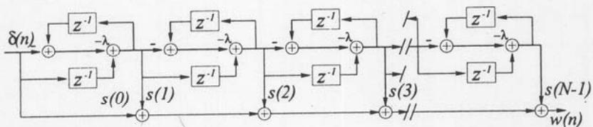  
Fig. 10. Network for computing warped impulse response $w(n)$ , that is, the coefficient sequence of a WFIR filter, from an impulse response $s(n)$ . Input to network is unit impulse signal $\delta(n)$ .

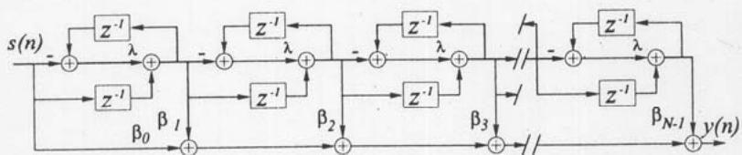  
Fig. 11. WFIR filter where unit delays of a conventional filter are replaced with first-order all-pass filters $D(z)$ . Term WFIR illustrates structural similarity with a nonwarped FIR filter.

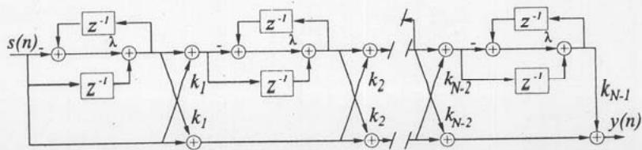  
Fig. 12. WFIR lattice filter structure.

WFIR filters may be designed using any conventional FIR design method if the frequency response of the filter is specified in a warped domain, for example, the Bark domain. Coefficients of a WFIR filter may also be derived from a nonwarped FIR filter in the following way. The desired impulse response $h(n)$ and its $z$ transform $H(z)$ must be equal to the impulse response $\tilde{h}(k)$ and its $z$ transform $\tilde{H}(\tilde{z})$ in the warped domain,

$$
H (z) = \sum_ {k = 0} ^ {\infty} \tilde {h} (k) \tilde {z} ^ {- k}\tag{20a}
$$

$$
\tilde {H} (\tilde {z}) = \sum_ {n = 0} ^ {\infty} h (n) z ^ {- n}. \quad \text { analysis }\tag{20b}
$$

Mappings between sequences $h(n)$ and $\tilde{h}(k)$ are linear but not shift-invariant. Eq. (20a) specifies the WFIR realization (= synthesis) structure, yielding

$$
H _ {\mathrm{WFIR}} (z) = \sum_ {n = 0} ^ {M} h ^ {-} (n) \tilde {z} ^ {- n} = \sum_ {n = 0} ^ {M} \beta_ {n} \{D (z) \} ^ {n}\tag{21}
$$

where the notation of the last form refers to the implementation of Fig. 11. Eq. (20b) yields a method to compute the WFIR coefficients (= analysis). It is easy to show from Eq. (15) that both forms of Eq. (20) may be computed with the same warping structure but using $\lambda$ for synthesis and $-\lambda$ for analysis. That is, reversing the mapping [Eq. (15)], Eq. (20b) may be written as

$$
\tilde {H} (\tilde {z}) = \sum_ {n = 0} ^ {\infty} h (n) \left(\frac {\tilde {z} ^ {- 1} + \lambda}{1 + \lambda z ^ {- 1}}\right) ^ {n}.\tag{22}
$$

Notice that both forms of Eq. (20) yield responses of infinite length, even if the sequence to be mapped is finite. Since the coefficient sequence $\beta_{i}$ must in practice be of finite length, we have to approximate $h(n)$ by truncation to $M$ samples, as is done in Eq. (21).

The reflection coefficients of the warped lattice filter may be obtained from coefficients of the WFIR using the same recursive computation as in the case of nonwarped filters (for example, see [24]).

## 2.4 Warped IIR Filters

A general form for the transfer function of a warped IIR (WIIR) filter is given by

$$
H _ {\mathrm{WIR}} (z) = \frac {\sum_ {i = 0} ^ {M} \beta_ {i} [ D (z) ] ^ {i}}{1 + \sum_ {i = 1} ^ {R} \alpha_ {i} [ D (z) ] ^ {i}}\tag{23}
$$

Since the implementation of the numerator of the transfer function, that is, a WFIR filter, is straightforward, we concentrate on the denominator, a warped all-pole filter.

In fact, this term is also inaccurate because this denominator polynomial yields zeros to the transfer function. However, those zeros are independent of the coefficients $\alpha_{i}$ .

The main problem in the implementation of the warped direct-form all-pole filter of Fig. 13(a) is that the filter contains delay-free recursive loops. The filter cannot be implemented directly. However, it is possible to implement the filter using a two-step technique proposed in [25], [26]. The output of the filter is first computed using a modified difference equation. After that the inner states of the filter are updated using the computed output value. From the same formulation it is also possible to derive a new modified structure, where the delay-free loops are eliminated. The modified filter is shown in Fig. 13(b). The coefficients $\sigma_{i}$ of the modified structure may be computed efficiently from $\alpha_{i}$ using a simple algorithm introduced in [27] and independently in [28]. The two-step implementation of the original filter in Fig. 13(a) is computationally more expensive than the modified structure of Fig. 13(b) unless the filter coefficients $\alpha_{i}$ are updated at each sample period.

A predictor-type formulation of a warped IIR (WIIR) lattice is shown in Fig. 14(a). The filter contains even more recursive delay-free loops than the direct-form filter. However, the two-step procedure can be used and, as in the case of the direct-form IIR filter, a new modified structure, shown in Fig. 14(b), can be found. There is also a recursive algorithm for computing the coefficients $c_{i}$ from reflection coefficients $k_{i}$ of the system [25]. The modified structure is computationally more efficient than the two-step implementation only if the coefficients are held constant over several hundred sample periods.

These four filters may be combined to form warped pole-zero filters. It is possible to use practically any conventional method of designing IIR filters to design WIIR filters if the filter specification is given in the warped domain. In addition, it is possible to convert any ordinary IIR filter to a warped filter by applying the technique presented in Section 2.3 to the numerator and the denominator of its transfer function separately. However, this usually requires a higher filter order than the original filter, and therefore it may be an impractical way of designing warped filters. A more efficient method is to solve the poles $p_i$ and zeros $m_i$ of the transfer function and map them explicitly to the warped domain. This may be done using the following formulas:

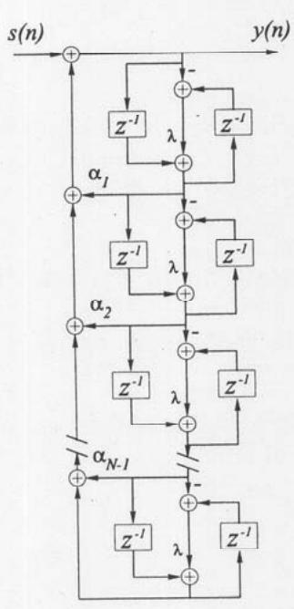

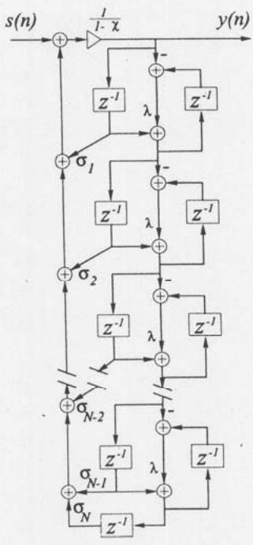  
(a)  
(b)  
Fig. 13. (a) WIIR filter, which cannot be implemented directly because it has delay-free recursive loops. (b) Directly realizable WIIR filter.

$$
\tilde {p} _ {k} = \frac {p _ {k} + \lambda}{1 + p _ {k} \lambda}, \quad \tilde {m} _ {k} = \frac {m _ {k} + \lambda}{1 + m _ {k} \lambda}\tag{24}
$$

for $k = 1, 2, 3, \ldots, N$ , and where $\tilde{p}_k$ and $\tilde{m}_k$ are the corresponding poles and zeros in the warped $\tilde{z}$ domain. Yet another alternative is to compute first the impulse response of the original filter, warp it using the synthesis technique presented in Section 2.3, and then use, for example, Prony's method [29] to find a pole-zero model to approximate the warped impulse response. This gives directly the coefficients of a warped pole-zero filter. However, it is often advantageous to modify the target impulse response in advance, for example, so that it has a minimum phase, since warping of a mixed-phase signal may lengthen high-frequency components in a problematic way.

## 2.5 Implementation Issues

A number of practical issues are important to know when designing warped filters or when using warping as a design method. One is to understand the robustness and parameter insensitivity of warped filter structures. In audio filters the need for resolution at low frequencies is typically high, often leading to poles that are clustered close to each other and the unit circle in the z plane. In the warped frequency domain such pole clusters are moved and spread more uniformly. It is known that filters with poles further apart are less sensitive to parameter accuracy and quantization noise problems (see, for example, [30]).

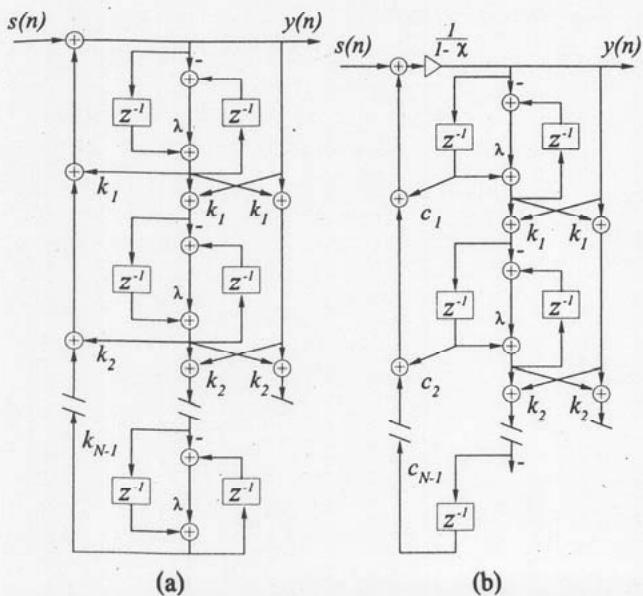  
Fig. 14. (a) WIIR lattice filter, which cannot be implemented directly because it contains delay-free recursive loops. (b) Directly realizable WIIR lattice filter.

If a filter is designed in the warped frequency domain, it is possible in theory to map it back to the traditional IIR filter form, which is computationally several times more efficient on a typical signal or general-purpose processor. This may, however, lead to accuracy problems due to the pole (and zero) clustering property mentioned. In practice it has been found that for orders below about 20 this mapping to a traditional filter may work without problems, but for orders above about 30 even double-precision floating-point arithmetic may not be useful.

Another important question is related to the computational efficiency of warped versus traditional filter structures [31]. For commonly used DSP processors WFIR filters are typically about 3 to 4 times slower than FIR filters of the same order. For WIIR filters this ratio is more favorable to the warped principle, since WIIRs are typically only 2 to 2.5 times slower than same order IIRs. Since the warping may reduce the filter order by a factor of about 5, or even more in some applications, the resulting warped filter is more efficient despite its structural complexity.

## 3 AUDIO APPLICATIONS OF FREQUENCY WARPING

Since frequency warping is just a bilinear mapping from a unit disk onto another unit disk, most of the techniques for parametric spectral estimation, adaptive filtering, and predictive coding are immediately available for warped systems, too. Frequency-warped techniques may be combined with most of the conventional DSP methods, including digital filtering and filter banks. In audio applications the main advantage of using frequency-warped techniques is the automatic utilization of nonuniform frequency representation, as was discussed.

The authors have recently published a free MATLAB [32] toolbox for frequency-warped signal processing. $^{1}$ It contains many of the techniques presented in the previous section and some examples related to the applications in this section.

## 3.1 Warped FFT and Filter Banks

A frequency-warped spectrum may be computed directly by applying the FFT to the outputs of an all-pass filter chain [9], as illustrated in Fig. 15. This technique may also be interpreted as a nonuniform-resolution filter bank. A Bark-warped filter bank with 16 channels is shown in Fig. 16. The filter bank is computationally very efficient and easy to design and implement. However, the sidebands have too high a level for many practical audio applications. It is possible to enhance the filter bank by using a longer all-pass chain and by combining the neighboring channels [33]. Also a more suitable window function can be used to improve the sidelobe attenuation.

Warped filter banks may also be designed directly. In [34] Karjalainen et al. introduced an auditory filter bank where the center frequencies of the filters follow Bark warping and the shapes of the filters are given by the classical approximation for the psychoacoustic spreading function or selectivity curves of hearing [35]. The design of the filters is straightforward because the shape of an auditory filter is suggested to be uniform on the Bark scale, that is, the domain where the filters are designed. It is also possible to design IIR-type warped filter banks. A set of filters from a filter bank which consists of 24 fifth-order warped Butterworth filters is shown in Fig. 17. The bandwidth of each rectangular-shaped filter is 1 Bark.

The main problem with warped filter banks is that they are based on IIR filters, and therefore the critical subsampling with perfect reconstruction is impossible in most cases. Therefore warped filter banks are probably not as suitable for coding applications as conventional filter banks. Nevertheless, there are techniques where perfect reconstruction after subsampling can be obtained. Laine [36] has introduced a warped block-recursive algorithm which can be interpreted as an approximately perfect reconstruction nonuniform-resolution filter bank. The approximation error is small in typical applications of the method. Recently Evangelista and Cavaliere [37] introduced a frequency-warped wavelet transform having the perfect reconstruction characteristics. However, the method is based on time reversal of the entire signal; thus real-time applications cannot be considered.

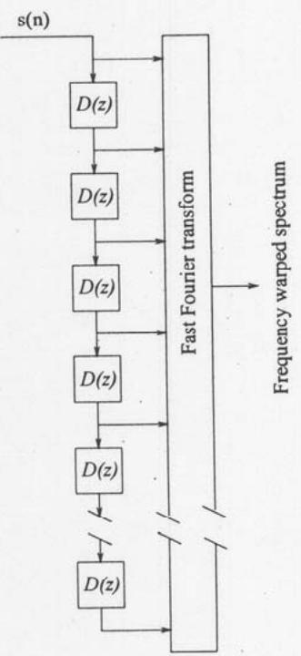  
Fig. 15. Network for computing warped FFT spectrum.

## 3.2 Warped Linear Prediction

Linear predictive coding (LPC) is a powerful technique to model a spectrum, such as in coding applications. It is well motivated in terms of human hearing because it gives an all-pole spectral representation which concentrates on modeling spectral peaks. The ear is known to be relatively insensitive to spectral zeros. In addition, a linear predictive spectral model is known to be particularly well matched to human speech signals. The representation of spectral information as a small set of parameters which can be quantized very efficiently is a beneficial feature, especially in coding applications. LPC is a standard technique in speech coding [38], and it is finding its way to wide-band audio coding applications [39], too.

Warped linear predictive coding (WLPC) was first proposed by Strube in 1980 [14], but the idea of performing linear predictive analysis on a modified frequency scale had been introduced earlier (see, for example, [40]).

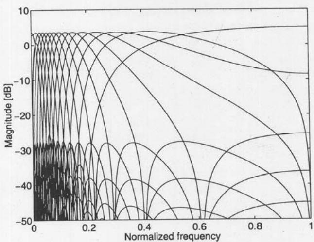  
Fig. 16. Example of frequency responses of 16-channel warped filter bank. Filter bank was designed using an all-pass filter chain of 16 elements, and Hamming windowing was used prior to FFT.

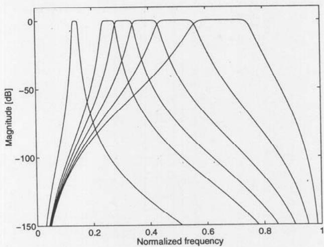  
Fig. 17. WIIR filter-bank design example. Filter bank consists of rectangular fifth-order warped Butterworth bandpass filters, each having a bandwidth of 1 Bark. Only channels 5, 10, 15, 19, . . . , 23 are plotted for clarity.

In classical forward linear prediction [41] an estimate for the next sample value $x(n)$ is obtained as a linear combination of N previous values given by

$$
\hat {x} (n) = \sum_ {k = 1} ^ {N} a _ {k} x (n - k) \quad \text { or } \quad \hat {X} (z) = \left(\sum_ {k = 1} ^ {N} a _ {k} z ^ {- k}\right) X\tag{\(X(z)\}
$$

(25)

where $a_{k}$ are fixed filter coefficients. Here $z^{-1}$ is a unit delay filter or a shift operator, which may be replaced by a first-order all-pass filter, here denoted by $D(z)$ , to obtain

$$
\hat {X} (z) = \left[ \sum_ {k = 1} ^ {N} a _ {k} D (z) ^ {k} \right] X (z).\tag{26}
$$

In the time domain, $D(z)^{-k}$ can be interpreted as a generalized shift operator defined as

$$
d _ {k} [ x (n) ] \equiv \underbrace {\delta (n) * \delta (n) * \cdots * \delta (n)} _ {k = \text { fold   convolution }} * x (n)\tag{27}
$$

where the asterisk indicates convolution and $\delta(n)$ is the impulse response of $D(z)$ . Furthermore, we write $d_{0}[x(n)] \equiv x(n)$ . The minimum mean square error of the estimate may now be written as

$$
e = E \left\{\left| x (n) - \sum_ {k = 1} ^ {N} a _ {k} d _ {k} [ x (n) ] \right| ^ {2} \right\}\tag{28}
$$

where $E\{\cdot\}$ denotes expectation. Minimization of this width $\partial e/\partial a_{k}=0$ and $k=1,2,\ldots,N$ leads to a system of normal equations,

$$
E \{d _ {m} [ x (n) ] d _ {0} [ x (n) ] \} - \sum_ {k = 1} ^ {N} a _ {k} E \{d _ {k} [ x (n) ] d _ {m} [ x (n) ] \} = 0\tag{29}
$$

with $m = 0, \ldots, N - 1$ . Since $D(z)$ is an all-pass filter, it is straightforward to show that

$$
E \{d _ {m} [ x (n) ] d _ {k} [ x (n) ] \} = E \{d _ {m + p} [ x (n) ] d _ {k + p} [ x (n) ] \}\tag{30}
$$

for all values of $j, k$ , and $p$ . This means that the same correlation values appear in both parts of Eq. (29). Therefore Eq. (29) can be seen as a generalized form of the Wiener–Hopf equations. The correlation terms can be computed easily using the autocorrelation network of Fig. 18. The optimal coefficients $a_{k}$ can be solved efficiently using, for example, the Levinson–Durbin algorithm, as in the conventional autocorrelation method of linear prediction. Correspondingly, we now have a prediction error filter given by

$$
A (z) = 1 - \sum_ {k = 1} ^ {N} a _ {k} D (z) ^ {k}\tag{31) +}
$$

which can be implemented directly by replacing all unit delays of a conventional FIR structure with $D(z)$ blocks. It is also possible to implement a synthesis filter given by

$$
A ^ {- 1} (z) = \frac {1}{1 - \sum_ {k = 1} ^ {N} a _ {k} D (z) ^ {k}}\tag{32) +}
$$

using, for example, techniques discussed here and in [25], [26].

In the spectral domain the solution of Eq. (29) is equivalent to matching the power spectrum $P(f)$ of the signal with an estimate given by the warped all-pole model,

$$
P (f ^ {\prime}) \sim \frac {G ^ {2}}{\left| 1 + \sum_ {k = 1} ^ {M} a _ {k} e ^ {- \mathrm{i} * 2 \pi f ^ {\prime} / N} \right| ^ {2}}\tag{33) +}
$$

where G is a gain term and $f'$ are warped frequency bins given by Eq. (11). It is now easy to see that the matching of the model is done on the warped frequency scale (see, for example, [14] for details).

Fig. 19 illustrates this and shows how the approach differs from conventional linear predictive modeling. The three curves in Fig. 19(a) shows a power spectrum of an excerpt of a sound of the clarinet and the spectral estimates that have been obtained by conventional and warped linear predictive analysis. The order of the model is 40 in both cases. In Fig. 19(b) the same data are shown on a warped frequency scale, which approximates the Bark scale. The warped model has been optimized on this scale, and therefore the frequency resolution is significantly better at low frequencies, while the conventional model pays too much attention to insignificant spectral details at very high frequencies at the cost of a poorer resolution at low frequencies.

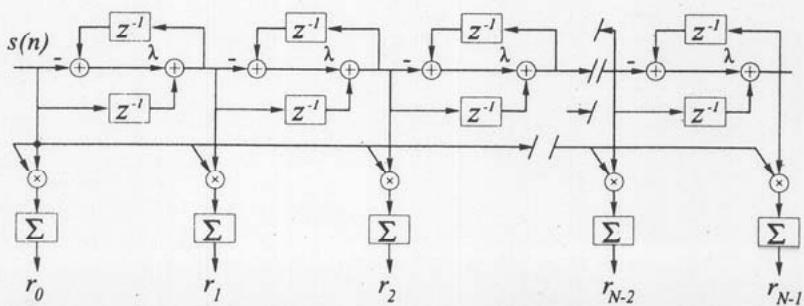  
Fig. 18. Warped autocorrelation network, which computes N-tap warped autocorrelation values continuously from input sequence $s(n)$ .

A characteristic of classical D\*PCM [42], or residual driven [43], LPC is that the spectrum of the quantization error signal in the decoded signal has the same spectral shape as the estimated all-pole model. Hence the frequency masking effect of hearing is automatically utilized at least to some extent. In WLPC this feature is even more pronounced. The spectral estimates in Fig. 19(b) can be assumed to be close to the masked threshold that is related to the original signal. In Fig. 20 the quantization noise spectrum in a simple WLP-based D\*PCM codec is compared with an MPEG I layer 3 codec at the output of a perceptual computational model. Although the WLP codec has no auditory model controlling the quantization process, the noise spectra in the two cases are very similar.

Practically all conventional LPC techniques can be warped. One may take, for example, any coder from the vast speech coding literature and warp it using the techniques presented here. It can be assumed that in many cases a warped coder can be made to work better than a conventional coder, especially in wide-band cod-

Normalized excitation patterns produced by AIM  
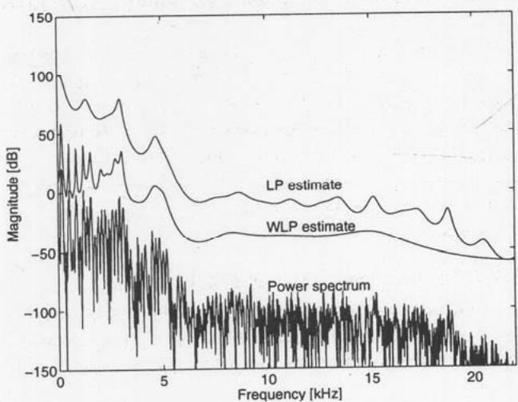  
(a)

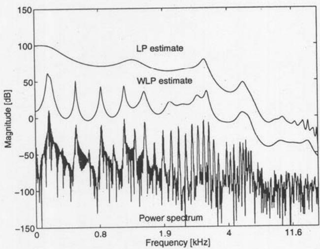  
(b)  
Fig. 19. Power spectrum of a musical signal (clarinet) and power spectral estimates given by a conventional LPC and a WLPC model of 40th order. (a) Linear frequency scale. (b) Warped frequency scale.

J. Audio Eng. Soc., Vol. 48, No. 11, 2000 November ing. However, there are some specific techniques where the application of warping is less straightforward. For example, warping of Barnwell's adaptive autocorrelation method [44] requires a new derivation for lagged product filters.

To show the difference between LPC and WLPC, a set of listening tests with a simulated generalized linear-prediction-based audio codec has been conducted [45]. Both WLPC and conventional LPC were used in the listening tests. The task in the listening test was to find a sufficient signal-to-noise ratio (SNR) for the residual, or excitation, signal such that the difference between an original signal and a signal with quantization noise is inaudible. The method of adjustment was used in listening tests so that the listener was allowed to adjust the SNR of the residual signal in real time. SNR has approximately the following relation to the bit rate of the quantizer:

$$
\mathrm{SNR} / \mathrm{dB} = 6 b + \gamma\tag{34}
$$

⊕

where b is the number of bits and $\gamma$ is some constant (see, for example, [46]). Therefore the obtained SNR value at the threshold of audibility of coding artifacts can be used directly to estimate a sufficient bit rate for the residual signal.

The test material consisted of 12 steady-state musical and speech sounds. The WLPC and conventional LPC simulations were tested at four different sampling rates (8, 16, 32, and 48 kHz) and with three different orders of LPC or WLPC models, namely, 20, 40, and 50. In addition, a 10th-order codec at the 8-kHz sampling rate was also tested.

The average listening test results over all test samples and subjects are shown in Fig. 21. At sampling rates of 48 and 32 kHz, the SNR for the residual signal in the WLPC is approximately 6 dB below that of a conventional LPC. According to Eq. (34) this means that a sufficient bit rate for the residual signal in WLPC is 1 bit per sample less, that is, 48 kbit/s or 32 kbit/s less, than in LPC. At 16- and 8-kHz sampling rates the difference between WLPC and LPC is a decreasing function of the model order. In the case of a 50th-order model at the 16-kHz sampling rate, or a 35th-order model at the 8-kHz sampling rate, the use of WLPC brings no gain compared to the conventional case. However, below that the difference is clear. For example, in the case of a 10th-order model at 8 kHz the gain is approximately 3 dB, which corresponds to a saving of 0.5 bit per sample.

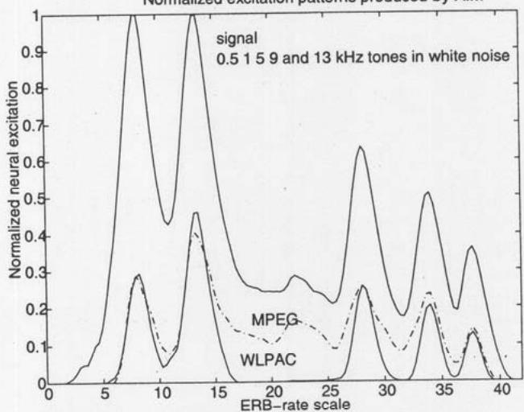  
Fig. 20. Noise processes in WLP coding. The original signal consists of a set of sinusoids and white background noise. The error has the same spectral shape as the original signal due to open-loop coding scheme. The corresponding coding error signal in an MPEG I layer 3 codec is plotted for comparison (---).

Basically this means that the bit rate for the excitation signal can be reduced using WLPC instead of LPC without affecting the quality of the signal. Alternatively, the order of the model can be significantly lower in WLPC compared to the conventional LPC. Similar results with narrow-band speech coding were also obtained by Krüger and Strube [15] and, for example, by Koishida et al. [47].

## 3.3 Warped Adaptive Filtering

Warped or Laguerre adaptive filtering has been studied by several authors. Den Brinker [48] used a well-known LMS-type algorithm with a Laguerre filter, and Tokuda et al. [49] introduced a speech coding method where the coefficients of a warped filter are updated using their adaptive mel-cepstral analysis technique. Fejzo and Lev-Ari [50] studied the properties of an adaptive warped lattice filter, where the coefficients are updated using the gradient adaptive lattice (GAL) algorithm. Adaptive warped filters share the same characteristics as warped linear predictive methods, that is, the frequency resolution follows from the characteristics of the warping function.

A perceptual audio codec based on the backward adaptive Bark-warped lattice was introduced in [51]. Since the codec is warped it has similar advantages as the WLP codec presented in the previous section; for example, the noise-masking characteristics of the ear are automatically utilized. In addition, the use of backward adaptation makes it possible to minimize the coding delay of the codec. In fact, the coding delay in its first prototype is equal to one sample period. In conventional audio codes, where the auditory modeling is realized as a separate block so that the noise-masking characteristics are determined from a long-term FFT spectrum, it is probably not possible to achieve an equally low coding delay. This is one obvious advantage of using a warped DSP system where the auditory model is incorporated into the coding process.

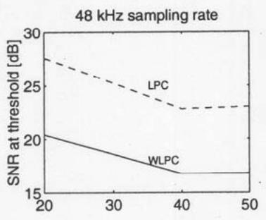

## 3.4 Audio Equalization

A traditional use of the frequency-warping technique is the design of digital filters for audio equalization. Moorer [52] discussed the modification of resonance or cutoff frequencies of parametric equalizers, shelving filters, and notch filters using the first-order all-pass mapping. It can be used to derive closed-form formulas for the coefficients of digital equalization filters [52], [53].

Recently it was shown that the use of frequency warping is advantageous in fixed-point implementations of digital audio filters. An audio equalizer that is designed and implemented as a warped filter is less sensitive to coefficient quantization and round-off noise than conventional digital filters [54]. The resulting quantization noise level is low and the noise has a low-pass characteristic.

## 3.4.1 Loudspeaker Equalization

Loudspeaker response equalization by digital inverse filtering is becoming a well-known technique, although relatively few commercial implementations exist. The most common method is FIR equalization, but IIR filters have also been used. The equalization is applied either to the magnitude response only or to both magnitude and phase. The applicability of different equalizer filter structures, including warped structures, has been compared in [31].

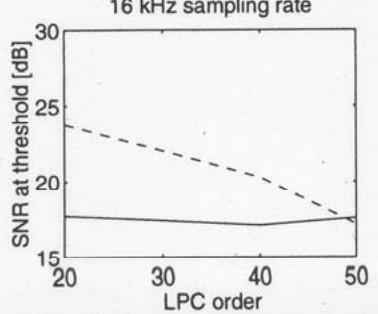

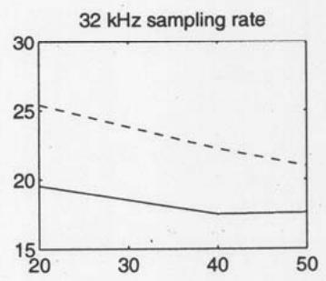

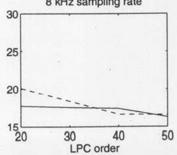  
Fig. 21. Preliminary listening test results at four different sampling rates as a function of the order of a WLPC and an LPC filter. Only average data over 11 test signals and two subjects are shown.

FIR filters are very efficient at high frequencies. This is due to the fact that FIRs inherently yield a uniform frequency resolution while in audio the response specifications as well as the response measurements are given typically on a logarithmic scale. Thus FIRs are particularly problematic in equalization at low frequencies. IIR filters avoid some of the problems found with FIRs, but they are more difficult to design and they tend to share the frequency resolution problem.

It was shown in [34] that WFIR and WIIR filter structures are good competitors to traditional filters. Fig. 22 shows a set of magnitude responses for a less than medium-quality loudspeaker, including the original response and three equalized ones. The WIIR equalizer (inverse filter) design was based on the warped Prony method. Very low filter orders (less than 10) already show good overall equalization. Fig. 22 depicts also a comparison with the traditional FIR filter equalizer (order 105), which yields about the same degree of equalization as the WIIR filter of order 24. Notice also that while the FIR filter does the best job at high frequencies, the WIIR filters work best at middle to low frequencies (depending on the amount of warping).

A useful characteristic of warped equalizers is that by selecting a proper value of the warping parameter $\lambda$ , it is possible to focus the best resolution to a desired part of the audio frequency range. If two- or three-way loudspeakers with crossover networks are designed, each subband can have an optimized $\lambda$ value. A combination of warping and multirate techniques is also possible.

Loudspeaker equalization techniques based on warped filters have been studied recently by other authors [54], [55].

## 3.5 Physical Modeling of the Guitar Body

Another application example concerns model-based synthesis of the acoustic guitar. The modeling and real-time synthesis of string vibration are relatively well understood, and the body can be simulated efficiently by commuted synthesis, where the body response is used as excitation. Simulation of the body as a digital filter is computationally expensive [56], [57], and thus efficient filter approximations are of interest.

A typical magnitude response of the acoustic guitar body is shown in Fig. 23(a). It is measured by impact hammer excitation to the bridge of a guitar with damped strings and by recording the response 1 meter in front of the sound hole.

For a sample rate of 22 kHz, a simple FIR approximation of the impulse response requires a filter order of about 2000–5000 for good results since the lowest resonances are sharp and they decay slowly. On the other hand, the high-frequency modes are much broader in bandwidth and thus decay faster. FIR modeling is not well suited, and an IIR model fits better. Using linear prediction to design the filter, an all-pole model of order 500–1000 works relatively well.

WFIR filters of order 500, with $\lambda = 0.63$ , are comparable in quality to those mentioned before. WIIR filters yield the lowest order approximation so that a denominator order of 100–200, designed using linear prediction in the warped domain, is comparable in quality. Although the warped structures are inherently more complex than corresponding unwarped ones, a small efficiency advantage of warped over traditional filters remains due to order reduction when implementing the warped structures using typical DSP processors.

In the body modeling case the frequency-warping technique shows a double advantage and a match to the characteristics of the problem. First, physically, warping means balancing of the resonance Q values so that the sharp low-frequency peaks in the warped domain will be broadened to resemble more the Q values of the high-frequency resonance peaks [Fig. 23(b)]. Second, warping yields a natural match to the auditory resolution and Bark scale so that the filter order needed is minimized.

## 3.6 Binaural Filter Design and Implementation

Real-time digital modeling of human spatial hearing cues is often referred to as binaural technology or 3-D sound. The static cues of spatial hearing are contained in

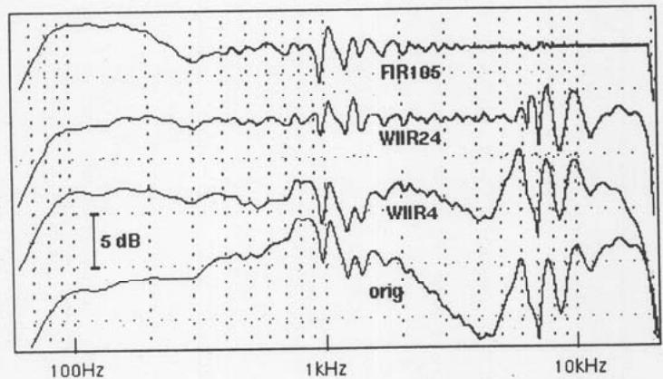  
Fig. 22. Loudspeaker equalization curves. orig—original magnitude response; WIIR4, WIIR24—WIIR equalization, filter orders 4 and 24; FIR105—FIR filter equalization, filter order 105.

J. Audio Eng. Soc., Vol. 48, No. 11, 2000 November head-related transfer functions (HRTFs). Traditionally, HRTF filters have been created using minimum-phase reconstruction and different FIR and IIR design methods (see [58] for a detailed summary). The use of warped filters in binaural and crosstalk canceled binaural filter design has been investigated in [59], [60]. Use of a psychoacoustically based frequency scale was found to be well motivated for the binaural filter design as well, and a considerable reduction in filter order can be achieved using warped designs. The transfer function expressions of warped filters may be expanded (dewarped) to yield equivalent IIR filters of the traditional form, such as direct-form II filters. $^{2}$ Such implementations have been reported in the literature [61]. An alternative strategy has been presented by the authors [56], [31], [58], [60], where implementation is carried out directly in the warped domain using WFIR and WIIR structures.

Theoretical and empirical investigations [58] have shown that dewarped WIIR structures outperform traditional FIR and IIR design methods. In Fig. 24 IIR design methods with and without warping are compared. A Cortex MK2 dummy head HRTF was used, and two filter orders (orders 20 and 6) were tested. The filters were designed using Prony's method (available in MATLAB [32]). For the warping a $\lambda$ value of 0.65 was chosen. It can clearly be seen from the results that the fit at lower frequency is enhanced in WIIR designs with a tradeoff of reduced high-frequency matching. According to the psychoacoustic theory, this can be tolerated. In summary, the use of auditorily motivated filter design in 3-D sound applications has a clear computational advantage without sacrificing perceptual accuracy.

## 3.7 Improved Digital Waveguide Mesh Simulations

The digital waveguide mesh was introduced in 1993 [62]. It is a finite-difference time-domain simulation, where the vibrating surface has been discretized. The model consists of a rectangular grid, where the signal value at every node is updated at each sampling interval using the state of the four neighboring nodes. It was shown that the method is suitable for sound synthesis of percussion instruments, although it suffers from direction-dependent dispersion [62]. In 1994 Savioja et al. extended the use of the digital waveguide mesh to three dimensions and presented simulation results of wave propagation in acoustic spaces [63].

The main weakness of the digital waveguide mesh technique is the dispersion error, which increases with frequency. Due to dispersion, the digital waveguide mesh method can be used for accurate numerical simulations at low frequencies only, that is, the sampling frequency (in both time and space) must be very high in acoustic simulations. The dispersion error appears as a frequency error in the simulation results: the modes at high frequencies occur at incorrect frequencies. The frequency dependence implies that the error caused by dispersion varies as a function of the direction of propagation: the frequency of standing waves that are formed in the diagonal direction—with respect to the sampling grid—are exact, whereas the frequencies of standing waves in any other direction are too small, and the error increases with frequency, that is, higher modes are displaced more than the lower ones.

A triangular waveguide mesh [64]–[66] has been developed to overcome the direction-dependent wave propagation characteristics and dispersion error. It is based on the idea that the sampling points are at corners of equilateral triangles instead of squares. The interpolated mesh was also devised to reduce the error while still using the convenient rectangular sampling grid [67], [68]. The key idea was that sample updates should account for more propagation directions than just four, as in the original mesh. The interpolation effectively inserts new nodes in the mesh—the contribution of the hypothetical nodes is then spread over the existing neighboring nodes to obtain a realizable structure. This is a multidimensional application of fractional delay filters [69].

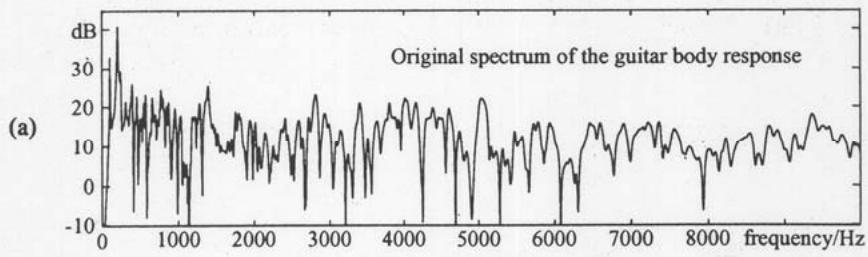

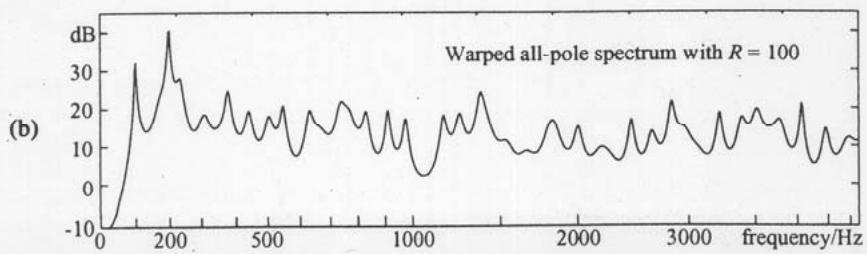  
Fig. 23. Modeling of guitar body response. (a) Original magnitude response. (b) Magnitude response using WIIR modeling (notice warped frequency scale).

Using the interpolated digital waveguide mesh, it was only possible to reduce the direction dependence, but the dispersion was not affected much—it was merely rendered almost independent of direction. The triangular mesh also improved the direction dependence, although the dispersion itself was also much reduced. Luckily the remaining dispersion error can be made considerably smaller in both cases using frequency warping. It is implemented by postprocessing the output signal of the mesh using a WFIR filter. The best results so far have been obtained using the triangular mesh together with a WFIR filter [70], [68]. Also, the interpolated rectangular mesh is improved using frequency warping [71], [68].

In this application the frequency-warping method can be used since the error to be corrected is almost identical in all directions and the error function is relatively smooth [71], [70], [68]. Frequency warping is implemented with a WFIR filter in which the tap coefficients are set equal to the output samples of the digital waveguide mesh algorithm. When a unit impulse is fed into the filter, the warped signal is obtained at the output. The extent of warping is controlled by the value of the all-pass filter coefficient $\lambda$ , which can be optimized using one of many optimization methods, such as those based on the least squares or the minimax criterion.

We present results from a simulation of an ideal square membrane with rigid boundaries using the digital waveguide mesh. For details of the simulation, see [71], [70], [68]. Fig. 25(a) shows a waveform propagating in the diagonal direction in the original digital waveguide mesh. Note that this is the ideal response, since there is no dispersion in that case.

The waveform in Fig. 25(b) has been obtained with the interpolated mesh in the axial direction. It is seen that the waveform differs significantly from that in Fig. 25(a). The responses in other directions look very similar. Fig. 25(c) represents the frequency-warped version of Fig. 25(b) using $\lambda = -0.250$ . The warping has almost restored the original waveshape. The group delay of each response in Fig. 25 is displayed in Fig. 26. The group delay of the ideal response is almost constant [see Fig. 26(a)], but that of the interpolated mesh increases with frequency due to dispersion [see Fig. 26(b)]. By frequency warping the group delay has been rendered close to a constant value, as shown in Fig. 26(c).

Fig. 27 shows the magnitude spectra of the simulated membrane in three cases: (a) the original, (b) the interpolated, and (c) the warped interpolated digital waveguide mesh using $\lambda = -0.327385$ . Also, the analytically solved ideal eigenfrequencies are given for comparison in each case. The locations of the spectral peaks in Fig. 27(a) reveal that some eigenmodes occur at nearly the correct frequency whereas others are too low by several percent. In the response of the interpolated mesh shown in Fig. 27(b) all the eigenmodes are too low, and the error increases with frequency. The errors in the warped interpolated mesh are smaller, as shown in Fig. 27(c)—they are within $\pm 1.5\%$ in the frequency band from 0 to $25\%$ of the sampling rate. However, the warped triangular mesh would be still better: its maximum error on the same frequency band is only $0.60\%$ [70], [68].

Our example demonstrates the fact that frequency warping turns the digital waveguide mesh simulations into an accurate method for obtaining impulse responses of acoustic systems. However, a suitable waveguide mesh algorithm needs to be used as well, that is, either the interpolated rectangular mesh or the triangular mesh.

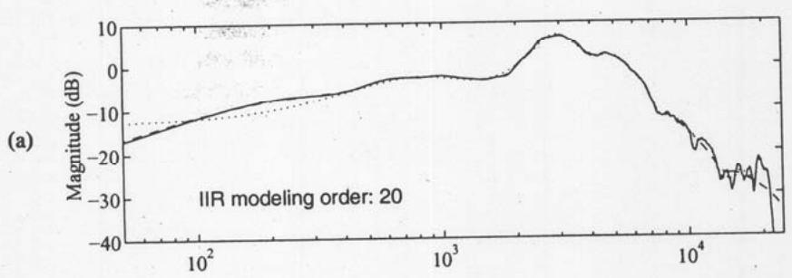

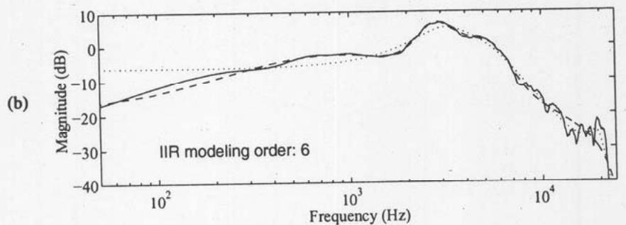  
Fig. 24. Example of modeling minimum-phase dummy-head HRTFs using warped IIR filters: (a) filter order 20. (b) order 6. (—) original HRTF magnitude response. (…) IIR model using Prony's method. (—)— warped IIR model using Prony's method (warping coefficient 0.65). Warped IIR models have been unwarped to second-order sections to retain the same computational complexity as linear designs.

## 3.8 Other Applications

In speech signal processing, the warped techniques have been used in various applications. Strube's pioneering work [14] with WLP was soon followed by Imai's paper [16] on warped cepstral analysis, where the spectral representation is warped and a logarithmic magnitude scale is used. His mel-cepstral analysis technique was further generalized in [72]. A group of Japanese researchers have published several articles where the mel-cepstral, or mel-generalized cepstral, analysis techniques have been used, such as in speech analysis [73] and coding [47] applications.

Frequency warping has also been applied to speaker verification [74] or to measure the objective quality of coded speech [75]. Recently warped filter banks were used in a speech-enhancement applications [76]. Frequency-warped linear prediction has shown its power also in speech synthesis [77], where a reduced filter order due to WLP helps the parametric control of text-to-speech synthesis.

## 4 CONCLUSIONS

This paper has described a methodology, frequency-warped signal processing, which can be used to modify frequency representation in DSP systems. The idea is not new, but it was almost forgotten after pioneering work in various fields in the 1970s and 1980s. During the last five years there have been clear signs of a renaissance for this methodology.

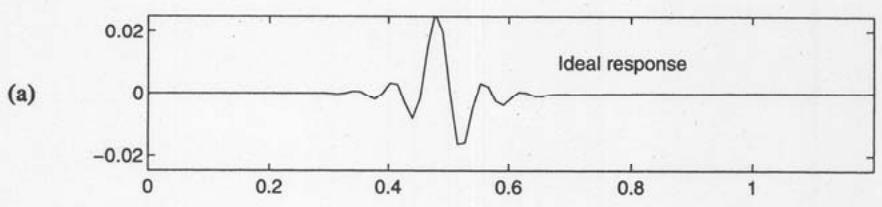

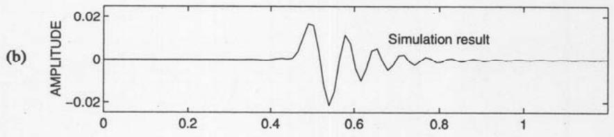

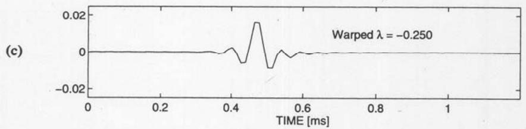  
Fig. 25. Digital waveguide mesh suffers from frequency-dependent dispersion. (a) Ideal response. (b) Simulation result. (c) Dispersion reduced by frequency warping.

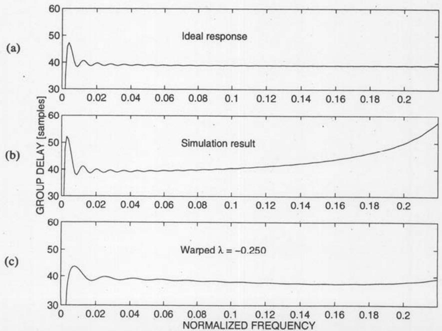  
Fig. 26. Group delays corresponding to impulse responses in Fig. 25.

It has been shown that practically any DSP algorithm can be warped. After presenting the basic methodology, it was shown how this can be utilized in filter design and implementation, nonparametric and parametric spectral estimation, coding, several audio applications, and in a specific application to reduce errors that are produced by a multidimensional discrete-time structure.

The main focus has been on audio and wide-band speech signal-processing techniques, where it is advantageous to design the system so that it takes into account the nonuniform frequency resolution of human hearing. It is shown that a warped DSP system can be designed to approximate accurately the frequency resolution of hearing. In several application examples this brings about obvious gains in terms of quality, computational complexity, and digital storage. It seems obvious that other variations of the methodology can be discovered and new applications can be found.

## 5 ACKNOWLEDGMENT

The work of Aki Härmä has been supported by the Academy of Finland and the GETA graduate school. The work of Vesa Välimäki has been supported by the Academy of Finland.

## 6 REFERENCES

[1] S. S. Stevens, J. Volkmann, and E. B. Newman, "A Scale for the Measurement of the Psychological Magnitude of Pitch," J. Acoust. Soc. Am., vol. 8, pp. 185–190 (1937).

[2] B. Scharf, "Critical Bands," in Foundations of Modern Auditory Theory, J. V. Tobias, Ed. (Academic Press, New York, 1970), pp. 159–202.

[3] B. C. J. Moore, R. W. Peters, and B. R. Glasberg, "Auditory Filter Shapes at Low Center Frequencies," J. Acoust. Soc. Am., vol. 88, pp. 132–140 (1990 July).

[4] D. D. Greenwood, "A Cochlear Frequency-Position Function for Several Species—29 Years Later,"

J. Acoust. Soc. Am., vol. 87, pp. 2592–2605 (1990 June).

[5] B. C. J. Moore, "Frequency Analysis and Masking," in Hearing Handbook of Perception and Cognition, 2nd ed., B. C. J. Moore, Ed. (Academic Press, New York, 1995).

[6] R. D. Patterson, "Auditory Filter Shapes Derived with Noise Stimuli," J. Acoust. Soc. Am., vol. 59, pp. 640–654 (1976 Mar.).

[7] A. Sek and B. C. J. Moore, "The Critical Modulation Frequency and Its Relationship to Auditory Filtering at Low Frequencies," J. Acoust. Soc. Am., vol. 95, pp. 2606–2615 (1994 May).

[8] E. Zwicker and H. Fastl, Psychoacoustics: Facts and Models (Springer-Verlag, Berlin, 1990).

[9] A. V. Oppenheim, D. H. Johnson, and K. Steiglitz, "Computation of Spectra with Unequal Resolution Using the Fast Fourier Transform," Proc. IEEE, vol. 59, pp. 299–301 (1971 Feb.).

[10] A. V. Oppenheim and D. H. Johnson, "Discrete Representation of Signals," Proc. IEEE, vol. 60, pp. 681–691 (1972 June).

[11] C. Braccini and A. V. Oppenheim, "Unequal Bandwidth Spectral Analysis Using Digital Frequency Warping," IEEE Trans. Acoust., Speech, Signal Process., vol. ASSP-22, pp. 233–245 (1974 Aug.).

[12] W. Schüssler, "Variable Digital Filters," Arch. Elek. Übertragung, vol. 24, pp. 524–525 (1970), reprinted in Digital Signal Processing, L. Rabiner and C. M. Rader, Eds. (Selected Reprint Series, IEEE Press, New York, 1972).

[13] A. G. Constantinides, "Spectral Transformations for Digital Filters," Proc. IEEE, vol. 117, pp. 1585–1590 (1970 Aug.).

[14] H. W. Strube, "Linear Prediction on a Warped Frequency Scale," J. Acoust. Soc. Am., vol. 68, pp. 1071–1076 (1980 Oct.).

[15] E. Krüger and H. W. Strube, "Linear Prediction on a Warped Frequency Scale," IEEE Trans. Acoust. Speech, Signal Process., vol. 36, pp. 1529–1531 (1988 Sept.).

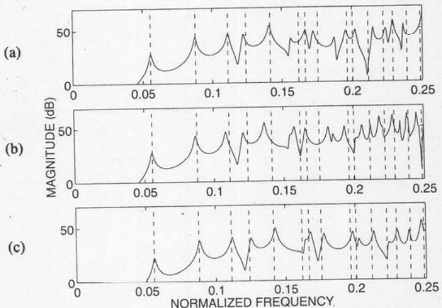  
Fig. 27. Simulated magnitude responses of ideal square membrane. (a) Original digital waveguide mesh. (b) Interpolated mesh. (c) Warped interpolated mesh ( $\lambda = -0.327358$ ). Dashed vertical lines—analytically solved ideal eigenmode frequencies.

J. Audio Eng. Soc., Vol. 48, No. 11, 2000 November

[16] S. Imai, "Cepstral Analysis Synthesis on the Mel Frequency Scale," in Proc. IEEE Int. Conf., on Acoustics, Speech, and Signal Processing (Boston, MA, 1983 Apr.), pp. 93–96.

[17] U. K. Laine, "Famlet, to Be or Not to Be a Wavelet," in Proc. Int. Symp. Time-Frequency and Time-Scale Analysis (Victoria, Canada, 1992 Oct.). IEEE, pp. 335–338.

[18] U. K. Laine, M. Karjalainen, and T. Altosaar, "WLP in Speech and Audio Processing," in Proc. IEEE Int. Conf. on Acoustics, Speech, and Signal Processing (Adelaide, Australia, 1994), vol. 3, pp. 349–352.

[19] J. O. Smith and J. S. Abel, "Bark and ERB Bilinear Transform," IEEE Trans. Speech and Audio Process., vol. 7, pp. 697–708 (1999 Nov.).

[20] R. E. King and P. N. Paraskevopoulos, "Digital Laguerre Filters," J. Circuit Theory Appl., vol. 5, pp. 81–91 (1977).

[21] B. Maione and B. Turchiano, "Laguerre z-Transfer Function Representation of Linear Discrete-Time Systems," Int. J. Contr., vol. 41, pp. 245–257 (1985).

[22] B. Wahlberg, "System Identification Using Laguerre Models," IEEE Trans. Automatic Contr., vol. 36, pp. 551–562 (1991 May).

[23] T. Oliveira e Silva, "Optimality Conditions for Truncated Laguerre Networks," IEEE Trans. Signal Process., vol. 42, pp. 2528-2530 (1995).

[24] J. G. Proakis and D. G. Manolakis, Digital Signal Processing, 2nd ed. (Macmillan, New York, 1992).

[25] A. Härmä, "Implementation of Recursive Filters Having Delay Free Loops," in Proc. IEEE Int. Conf. on Acoustics, Speech, and Signal Processing (Seattle, WA, 1998 May), vol. 3, pp. 1261–1264.

[26] A. Härmä, "Implementation of Frequency-Warped Recursive Filters," Signal Process., vol. 80, pp. 543–548 (2000 Feb.).

[27] T. Kobayashi, S. Imai, and Y. Fukuda, "Mel-Generalized Log Spectral Approximation Filter," Trans. IECE, vol. 68, pp. 610–611 (1985).

[28] M. Karjalainen, A. Härmä, J. Huopaniemi, and U. K. Laine, "Warped Filters and Their Audio Applications," in IEEE Workshop on Appl. Signal Proc. Acoust. and Audio (New Paltz, NY, 1997 Oct.).

[29] T. W. Parks and C. S. Burrus, Digital Filter Design (Wiley, New York, 1987).

[30] L. B. Jackson, Digital Filters and Signal Processing, 2nd ed. (Kluwer, Boston, MA, 1989).

[31] M. Karjalainen, E. Piirilä, A. Järvinen, and J. Huopaniemi, "Comparison of Loudspeaker Equalization Methods Based on DSP Techniques," J. Audio Eng. Soc., vol. 47, pp. 14–31 (1999 Jan./Feb.).

[32] The Mathworks, Natick, MA, USA, MATLAB—The Language for Technical Computing (1997 Jan.).

[33] U. K. Laine and A. Härmä, "On the Design of Bark-FAMlet Filterbanks," in Proc. Nordic Acoust. Mtg. (NAM) (Helsinki, Finland, 1996 June), pp. 277–284.

[34] M. Karjalainen, A. Härmä, and U. K. Laine, "Realizable Warped IIR Filter Structures," in Proc. IEEE Nordic Signal Process. Symp., NORSIG 96 (Es-

poo, Finland, 1996 Sept.), pp. 483–486.

[35] M. R. Schroeder, B. S. Atal, and J. L. Hall, "Optimizing Digital Speech Coders by Exploiting Masking Properties of the Human Ear," J. Acoust. Soc. Am., vol. 66, pp. 1647–1652 (1979 Dec.).

[36] U. K. Laine, "Critically Sampled PR Filterbanks of Nonuniform Resolution Based on Block Recursive FAMlet Transform," in Proc. EUROSPEECH'97 (Rhodes, Greece, 1997 Sept.), vol. 2, pp. 697–700.

[37] G. Evangelista and S. Cavaliere, "Discrete Frequency Warped Wavelets: Theory and Applications," IEEE Trans. Signal Process., vol. 46, pp. 874–885 (1998 Apr.).

[38] N. S. Jayant and P. Noll, Digital Coding of Waveforms (Prentice-Hall, Englewood Cliffs, NJ, 1984).

[39] N. Iwakami and T. Moriya, "Transform-Domain Weighted Interleave Vector Quantization (TwinVQ)," presented at the 101st Convention of the Audio Engineering Society, J. Audio Eng. Soc. (Abstracts), vol. 44, pp. 1171, 1172 (1996 Dec.), preprint 4377.

[40] J. Makhoul and M. Berouti, "Adaptive Noise Spectral Shaping and Entropy Coding in Predictive Coding of Speech," IEEE Trans. Acoust., Speech, Signal Process., vol. ASSP-27, pp. 63–73 (1979 Feb.).

[41] J. D. Markel and A. H. Gray, Linear Prediction of Speech, vol. 12 of Communication and Cybernetics (Springer, New York, 1976).

[42] P. Noll, "On Predictive Quantizing Schemes," Bell Sys. Tech. J., vol. 57, pp. 1499–1532 (1978 May–June).

[43] J. Gibson, "Adaptive Prediction in Speech Differential Encoding Systems," Proc. IEEE, vol. 68, pp. 488–525 (1980 Apr.).

[44] T. Barnwell, "Recursive Autocorrelation Computation for LPC Analysis," in Proc. IEEE Int. Conf. on Acoustics, Speech, and Signal Processing (Hartford, CT, 1977 May), pp. 1–4.

[45] A. Härmä, "Evaluation of a Warped Linear Predictive Coding Scheme," in Proc. IEEE Int. Conf. on Acoustics, Speech, and Signal Processing (Istanbul, Turkey, 2000 June), vol. 2, pp. 897–900.

[46] L. R. Rabiner and R. W. Schafer, Digital Processing of Speech Signals (Prentice-Hall, Englewood Cliffs, NJ, 1978).

[47] K. Koishida, K. Tokuda, T. Kobayashi, and S. Imai, "CELP Coding System Based on Mel-Generalized Cepstral Analysis," in Proc. Int. Conf. on Spoken Language Processing (Philadelphia, PA, 1996 Oct.), vol. 1.

[48] A. C. Den Brinker, "Adaptive Modified Laguerre Filters," Signal Process., vol. 31, pp. 69–79 (1993).

[49] K. Tokuda, T. Kobayashi, S. Imai, and T. Fukada, "Speech Coding Based on Adaptive Mel-Cepstral Analysis and Its Evaluation," Elec. and Comm. in Japan, pt. 3, vol. 78, no. 6, pp. 50–61 (1995).

[50] Z. Fejzo and H. Lev-Ari, "Adaptive Laguerre-Lattice Filters," IEEE Trans. Signal Process., vol. 45, pp. 3006-3016 (1997 Dec.).

[51] A. Härmä, U. K. Laine, and M. Karjalainen, "Backward Adaptive Warped Lattice for Wideband

Stereo Coding," in Signal Processing IX: Theories and Applications, EUSIPCO'98 (Rhodes, Greece, 1998 Sept.), EURASIP, pp. 729–732.

[52] J. A. Moorer, "The Manifold Joys of Conformal Mapping: Applications to Digital Filtering in the Studio," J. Audio Eng. Soc., vol. 31, pp. 826–841 (1983 Nov.).

[53] D. K. Wise, "A Survey of Biquad Filter Structures for Application to Digital Parametric Equalization," presented at the 105th Convention of the Audio Engineering Society, J. Audio Eng. Soc. (Abstracts), vol. 46, p. 1041 (1998 Dec.), preprint 4820.

[54] C. Asavathiratham, P. E. Beckmann, and A. V. Oppenheim, "Frequency Warping in the Design and Implementation of Fixed-Point Audio Equalizers," in Proc. IEEE Workshop on Appl. Signal Proc. Audio and Acoust. (New Paltz, NY, 1999 Oct.), IEEE, pp. 55–59.

[55] M. Tyril, J. A. Pedersen, and P. Rubak, "Digital Filters for Low-Frequency Equalization," presented at the 106th Convention of the Audio Engineering Society, J. Audio Eng. Soc. (Abstracts), vol. 47, p. 519 (1999 June), preprint 4897.

[56] M. Karjalainen, "Warped Filter Design for the Body Modeling and Sound Synthesis of String Instruments," in Proc. Nordic Acoustical Mtg. (NAM'96) (Helsinki, Finland, 1996 June), pp. 445–453.

[57] M. Karjalainen and J. O. Smith, "Body Modeling Techniques for String Instrument Synthesis," in Proc. Int. Computer Music Conf. (Hong Kong, 1996 Aug.), pp. 232–239.

[58] J. Huopaniemi, N. Zacharov, and M. Karjalainen, "Objective and Subjective Evaluation of Head-Related Transfer Function Filter Design," J. Audio Eng. Soc., vol. 47, pp. 218–239 (1999 Apr.).

[59] J. Huopaniemi and M. Karjalainen, "Review of Digital Filter Design and Implementation Methods for 3-D Sound," presented at the 102nd Convention of the Audio Engineering Society, J. Audio Eng. Soc. (Abstracts), vol. 45, p. 413 (1997 May), preprint 4461.

[60] J. Huopaniemi, "Virtual Acoustics and 3-D Sound in Multimedia Signal Processing," Ph.D. thesis, Helsinki University of Technology, Laboratory of Acoustics and Audio Signal Processing (1999).

[61] J. M. Jot, O. Warusfel, and V. Larcher, "Digital Signal Processing Issues in the Context of Binaural and Transaural Stereophony," presented at the 98th Convention of the Audio Engineering Society, J. Audio Eng. Soc. (Abstracts), vol. 43, p. 396 (1995 May), preprint 3980.

[62] S. Van Duyne and J. O. Smith, "Physical Modeling with the 2-D Digital Waveguide Mesh," in Proc. Int. Computer Music Conf. (ICMC'93) (Tokyo, Japan, 1993 Sept.), pp. 40-47.

[63] L. Savioja, T. Rinne, and T. Takala, "Simulation of Room Acoustics with a 3-D Finite Difference Mesh," in Proc. Int. Computer Music Conf. (ICMC'94) (Aarhus, Denmark, 1994 Sept.), pp. 463-466.

[64] F. Fontana and D. Rocchesso, "A New Formulation of the 2D-Waveguide Mesh for Percussion Instruments," in Proc. XI Coll. on Musical Informatics (Bo

logna, Italy, 1995 Nov.), pp. 27–30.

[65] S. Van Duyne and J. O. Smith, "The 3D Tetrahedral Digital Waveguide Mesh with Musical Applications," in Proc. Int. Computer Music Conf. (ICMC'96) (Hong Kong, 1996 Aug.), pp. 9–16.

[66] F. Fontana and D. Rocchesso, "Physical Modeling of Membranes for Percussion Instruments," Acustica (with Acta Acustica), vol. 84, pp. 529–542 (1998 May/June).

[67] L. Savioja and V. Välimäki, "Improved Discrete-Time Modeling of Multi-Dimensional Wave Propagation Using the Interpolated Digital Waveguide Mesh," in Proc. Int. Conf. on Acoustics, Speech, and Signal Processing (ICASSP'97) (Munich, Germany, 1997 Apr.), vol. 1, pp. 459–462.

[68] L. Savioja and V. Välimäki, "Reducing the Dispersion Error in the Digital Waveguide Mesh Using Interpolation and Frequency-Warped Techniques," IEEE Trans. Speech Audio Process., vol. 8, pp. 184–194 (2000 Mar.).

[69] T. I. Laakso, V. Välimäki, M. Karjalainen, and U. K. Laine, "Splitting the Unit Delay—Tools for Fractional Delay Filter Design," IEEE Signal Process. Mag., vol. 13, pp. 30–60 (1996 Jan.).

[70] L. Savioja and V. Välimäki, "Reduction of the Dispersion Error in the Triangular Digital Waveguide Mesh Using Frequency Warping," IEEE Signal Process. Lett., vol. 6, pp. 58–60 (1999 Mar.).

[71] L. Savioja and V. Välimäki, "Reduction of the Dispersion Error in the Interpolated Digital Waveguide Mesh Using Frequency Warping," in Proc. Int. Conf. on Acoustics, Speech, and Signal Processing (ICASSP'99) (Phoenix, AZ, 1999 Mar.), vol. 2, pp. 973–976.

[72] K. Tokuda, T. Kobayashi, S. Imai, and T. Chiba, "Spectral Estimation of Speech by Mel-Generalized Cepstral Analysis," Elec. and Comm. in Japan, pt. 3, vol. 76, pp. 30–43 (1993).

[73] T. Kobayashi and S. Imai, "Spectral Analysis Using Generalized Cepstrum," IEEE Trans. Acoust., Speech, Signal Process., vol. ASSP-32, pp. 1087–1089 (1984 Oct.).

[74] H. Noda, "Frequency-Warped Spectral Distance Measures for Speaker Verification in Noise," in Proc. IEEE Int. Conf. on Acoustics, Speech, and Signal Processing (New York, NY, 1988 Apr.), pp. 576-579.

[75] S. Wang, A. Sekey, and A. Gersho, "Auditory Distortion Measure for Speech Coding," in Proc. IEEE Int. Conf. on Acoustics, Speech, and Signal Processing (Toronto, Ont., Canada, 1991 May), vol. 1, pp. 493-496.

[76] B. Krzysztof and A. P. Alexander, "Speech Enhancement System for Hands-Free Telephone Based on the Psychoacoustically Motivated Filter Bank with All-pass Frequency Transformation," in Proc. Eurospeech'99 (Budapest, Hungary, 1999 Sept.), vol. 6, pp. 2555–2558.

[77] M. Karjalainen, T. Altosaar, and M. Vainio, "Speech Synthesis Using Warped Linear Prediction and Neural Networks," in Proc. IEEE Int. Conf. on Acoustics, Speech, and Signal Processing (Seattle, WA, 1998), vol. 2, pp. 877–880.