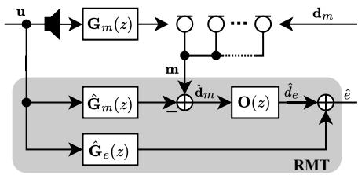
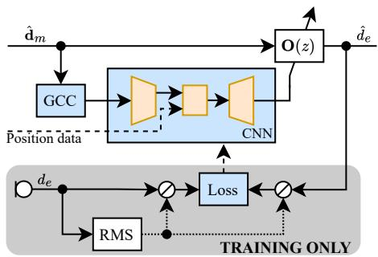
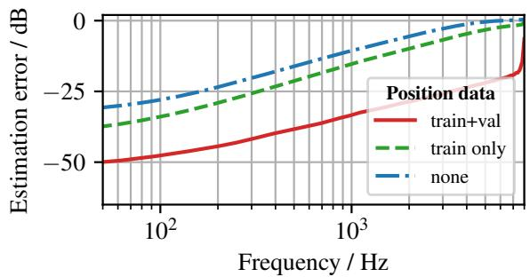

See discussions, stats, and author profiles for this publication at: https://www.researchgate.net/publication/392928626

# Deep observation filter for virtual sensing in local active noise control

Conference Paper · June 2025

CITATIONS

0

READS

63

2 authors:

Felix Holzmüller

University of Music and Performing Arts Graz

5    3

SEE PROFILE

Alois Sontacchi

University of Music and Performing Arts Graz

129    984

SEE PROFILE

# DEEP OBSERVATION FILTER FOR VIRTUAL SENSING IN LOCAL ACTIVE NOISE CONTROL

Felix Holzmuller¨ �Alois Sontacchi

Institute of Electronic Music and Acoustics

University of Music and Performing Arts Graz, Austria

# ABSTRACT

Local active noise control (ANC) algorithms are often based on adaptive filters, requiring an error signal to operate. For optimal performance, this error signal should be captured at a position as close as possible to the desired point of cancellation. However, in many situations, this is not feasible without invading the listener’s space. In such cases, virtual sensing algorithms such as the remote microphone technique (RMT) can be employed to estimate the signal using nearby sensors and domain knowledge. The RMT relies on filters, calculated in a training phase based on recorded scenarios. To ensure sufficient performance under varied acoustic conditions and geometrical configurations, a suitable filter set must be selected during operation from a pre-calculated database encompassing all potential scenarios. This paper proposes a novel approach for an online estimation of the observation filter in the RMT, based on a convolutional neural network. By providing correlation metrics and coordinates as input features, efficient asynchronous computation on external processing units is possible. Handling various acoustic scenarios with variable virtual error microphone position, this approach renders the use of any filter selection logic obsolete.

Keywords: active noise control, virtual sensing, remote microphone technique, convolutional neural network, generalized cross correlation

# 1. INTRODUCTION

Active noise control (ANC) is a widely used technique for noise reduction [1]. Secondary sources emit control signals that mimic the primary disturbances at a point of interest with an inverse phase. When executed properly, this approach can lead to a substantial reduction in noise through destructive interference. While global ANC approaches aim to reduce disturbances throughout the entire space, local ANC targets selected points of cancellation. The latter technique has been shown to control a larger frequency bandwidth with fewer transducers [2]. An inherent issue of local ANC is its limited spatial extent, often referred to as “zone of quiet�[3�], which corresponds to the area where at least 10 dB noise reduction can be achieved. The extent of this region usually scales inversely with the controlled bandwidth in diffuse sound fields [3, 5]. Outside this zone of quiet, the ANC system can actually increase the sound pressure [3]. Another position-dependent issue arises when considering common ANC system architectures. Many implementations are based on adaptive filters [6�] to compensate for slight changes in the scenario during operation. However, adaptive filters for ANC usually require the residual error signals and transfer functions between the secondary sources and the points of cancellation [1, 9]. A mismatch between the estimated and actual error signals or transfer paths can lead to a deterioration in noise reduction performance or even render the system unstable [10, 11].

As it is often not possible to place sensors at the desired points of cancellation without invading the listener’s space [12], so-called virtual sensing techniques [13�5] are employed to estimate the signal of virtual error microphones at the points of cancellation, using signals from nearby physical microphones and domain knowledge. Due to the limited spatial extent of local ANC and the sensitivity of certain virtual sensing algorithms to changes in the

natural_image

Stylized illustration of a lighthouse on a colorful mountain peak (no text or symbols)

# FORUM ACUSTICUM EURONOISE

acoustic scenario [16], a large variety of filters for different situations is calculated in advance and either switched [11] or interpolated [17] during operation to account for timevariant changes.

The dependency on position and acoustic scenario spans a multivariate space, requiring a large database of precomputed filters as well as a filter-selection mechanism during operation. Recently, neural networks have been utilized to handle some of these challenges - for example for modelling secondary paths [18], selecting filters from a database with a classifier network [19], or applying physically informed neural networks for virtual sensing in simple, static acoustic scenarios [20].

We propose a method for the online estimation of the observation filter in the remote microphone technique (RMT) [14] with variable virtual microphone position, based on a lightweight convolutional neural network (CNN). The underlying RMT is explained in section 2 before describing the proposed approach in section 3. It is tested for different source and receiver configurations in sections 4 and 5, followed by a conclusion and outlook in section 6. Code and data are openly accessible [21].

# 2. REMOTE MICROPHONE TECHNIQUE

The RMT [14] is a commonly used technique for virtual sensing. It is based on the assumption that the residual noise ??[??] at the listener’s position can be decomposed into contributions from the primary noise sources $d _ { e } [ n ]$ and the control signals ??[??], filtered by the transfer function $G _ { e } ( z )$ ) between the secondary sources and the listener’s position. The residual error is expressed as

$$
E (z) = D _ {e} (z) + G _ {e} (z) U (z), \tag {1}
$$

with $E ( z ) , D _ { e } ( z )$ , and $U ( z )$ being the ??-transform of $e [ n ]$ , $d _ { e } [ n ]$ , and $u [ n ]$ , respectively. For simplicity, it is assumed that only a single $d _ { e } [ n ] , e [ n ]$ , and $u [ n ]$ exist, forming an acoustic single-input-single-output system.

On the other hand, the ?? physical remote microphones also record a mixture $\begin{array} { r l } { \mathbf { m } [ n ] } & { { } = } \end{array}$ $\left[ m _ { 0 } [ n ] \quad m _ { 1 } [ n ] \quad \ldots \quad m _ { R - 1 } [ n ] \right] ^ { T }$ of primary disturbances $\mathbf { d } _ { m } [ n ] = \left[ d _ { m , 0 } [ n ] \quad d _ { m , 1 } [ n ] \quad \ldots \quad d _ { m , R - 1 } [ n ] \right] ^ { T }$ and control signal ??[??], filtered by the transfer paths $\begin{array} { r l r } { { \bf G } _ { m } ( z ) } & { { } = } & { \left[ G _ { m , 0 } ( z ) \quad G _ { m , 1 } ( z ) \quad \ldots \quad G _ { m , R - 1 } ( z ) \right] ^ { T } } \end{array}$ between the secondary sources and remote microphones. Using these definitions, the remote microphone signals in ??-domain are expressed as

$$
\mathbf {M} (z) = \mathbf {D} _ {m} (z) + \mathbf {G} _ {\mathbf {m}} (z) U (z). \tag {2}
$$

flowchart

```mermaid
graph TD
    u --> A["Amplifier"]
    A --> B["Gm(z)"]
    B --> C["Summing Junction"]
    C --> D["O(z)"]
    D --> E["Summing Junction"]
    E --> F["ê"]
    F --> G["RMT"]
    G --> H["Summing Junction"]
    H --> I["GÌ‚e(z)"]
    I --> J["Summing Junction"]
    J --> K["GÌ‚m(z)"]
    K --> L["Summing Junction"]
    L --> M["O(z)"]
    M --> N["Summing Junction"]
    N --> O["ê"]
    O --> P["RMT"]
    P --> Q["GÌ‚e(z)"]
    Q --> R["Summing Junction"]
    R --> S["GÌ‚m(z)"]
    S --> T["Summing Junction"]
    T --> U["GÌ‚m(z)"]
    U --> V["Summing Junction"]
    V --> W["GÌ‚m(z)"]
    W --> X["Summing Junction"]
    X --> Y["GÌ‚m(z)"]
    Y --> Z["Summing Junction"]
    Z --> AA["GÌ‚m(z)"]
    AA --> AB["Summing Junction"]
    AB --> AC["GÌ‚m(z)"]
    AC --> AD["Summing Junction"]
    AD --> AE["GÌ‚m(z)"]
    AE --> AF["Summing Junction"]
    AF --> AG["GÌ‚m(z)"]
    AG --> AH["Summing Junction"]
    AH --> AI["GÌ‚m(z)"]
    AI --> AJ["Summing Junction"]
    AJ --> AK["GÌ‚m(z)"]
    AK --> AL["Summing Junction"]
    AL --> AM["GÌ‚m(z)"]
    AM --> AN["Summing Junction"]
    AN --> AO["GÌ‚m(z)"]
    AO --> AP["Summing Junction"]
    AP --> AQ["GÌ‚m(z)"]
    AQ --> AR["Summing Junction"]
    AR --> AS["GÌ‚m(z)"]
    AS --> AT["Summing Junction"]
    AT --> AU["GÌ‚m(z)"]
    AU --> AV["Summing Junction"]
    AV --> AW["GÌ‚m(z)"]
    AW --> AX["Summing Junction"]
    AX --> AY["GÌ‚m(z)"]
    AY --> AZ["Summing Junction"]
    AZ --> BA["GÌ‚m(z)"]
    BA --> BB["Summing Junction"]
    BB --> BC["GÌ‚m(z)"]
    BC --> BD["Summing Junction"]
    BD --> BE["GÌ‚m(z)"]
    BE --> BF["Summing Junction"]
    BF --> BG["GÌ‚m(z)"]
    BG --> BH["Summing Junction"]
    BH --> BI["GÌ‚m(z)"]
    BI --> BJ["Summing Junction"]
    BJ --> BK["GÌ‚m(z)"]
    BK --> BL["Summing Junction"]
    BL --> BM["GÌ‚m(z)"]
    BM --> BN["Summing Junction"]
    BN --> BO["GÌ‚m(z)"]
    BO --> BP["Summing Junction"]
    BP --> BQ["GÌ‚m(z)"]
    BQ --> BR["Summing Junction"]
    BR --> BS["GÌ‚m(z)"]
    BS --> BT["Summing Junction"]
    BT --> BU["GÌ‚m(z)"]
    BU --> BV["Summing Junction"]
    BV --> BW["GÌ‚m(z)"]
    BW --> BX["Summing Junction"]
    BX --> BY["GÌ‚m(z)"]
    BY --> BZ["Summing Junction"]
    BZ --> CA["GÌ‚m(z)"]
    CA --> CB["Summing Junction"]
    CB --> CC["GÌ‚m(z)"]
    CC --> CD["Summing Junction"]
    CD --> CE["GÌ‚m(z)"]
    CE --> CF["Summing Junction"]
    CF --> CG["GÌ‚m(z)"]
    CG --> CH["Summing Junction"]
    CH --> CI["GÌ‚m(z)"]
    CI --> CJ["Summing Junction"]
    CJ --> CK["GÌ‚m(z)"]
    CK --> CL["Summing Junction"]
    CL --> CM["GÌ‚m(z)"]
    CM --> CN["Summing Junction"]
    CN --> CO["GÌ‚m(z)"]
    CO --> CP["Summing Junction"]
    CP --> CPT["GÌ‚m(z)"]
    CPT --> CU["Summing Junction"]
    CU --> CV["GÌ‚m(z)"]
    CV --> CW["Summing Junction"]
    CW --> CX["GÌ‚m(z)"]
    CX --> CY["Summing Junction"]
    CY --> CZ["GÌ‚m(z)"]
    CZ --> DA["Summing Junction"]
    DA --> DB["GÌ‚m(z)"]
    DB --> DC["Summing Junction"]
```

Figure 1. Block diagram of the remote microphone technique (RMT).

A block diagram of the RMT is shown in figure 1. By subtracting the filtered control signal from the remote microphone signals, the primary disturbances at the remote positions

$$
\mathbf {D} _ {m} (z) = \mathbf {M} (z) - \mathbf {G} _ {m} (z) U (z) \tag {3}
$$

can be extracted. As the actual secondary paths ${ \bf G } _ { m } ( z )$ are usually unknown, a modelled $\hat { \mathbf { G } } _ { m } ( z )$ is used to calculate $\hat { \bf D } _ { m } ( z )$ . The latter signals are then processed by a so-called observation filter $\begin{array} { r l } { \mathbf { O } ( z ) } & { { } = } \end{array}$ $\left[ O _ { 0 } ( z ) \quad O _ { 1 } ( { z } ) \quad . . . \quad O _ { R - 1 } ( z ) \right]$ to get an estimate for the primary disturbances at the virtual error microphone

$$
\hat {D} _ {e} (z) = \mathbf {O} (z) \hat {\mathbf {D}} _ {m} (z). \tag {4}
$$

Finally, the control signal $U ( z )$ , filtered by a model for the secondary path $\hat { G } _ { e } ( z )$ to the virtual error position, is added to get an estimate for the residual error signal

$$
\hat {E} (z) = \hat {D} _ {e} (z) + \hat {G} _ {e} (z) U (z). \tag {5}
$$

The secondary paths $\hat { \mathbf { G } } _ { m } ( z )$ and $\hat { G } _ { e } ( z )$ can be estimated relatively easily by measuring the transfer function between secondary loudspeakers and the remote microphones or a temporarily placed microphone at the virtual position, respectively. The observation filter is computed in a training phase using recordings of the primary disturbances at the remote and virtual microphone positions. The filters themselves are estimated for example via crosscorrelations [22] or cross spectral densities (CSDs) [23] between remote and virtual error microphones, forming an inverse problem. To cover several virtual microphone positions and acoustic scenarios, different filter sets must be obtained and switched during operation [23].

In the next section, an approach to estimate the observation filter during operation using a CNN is described. The neural network is capable of estimating filter coefficients for variable virtual microphone positions as well as various primary source configurations.

natural_image

Stylized illustration of a lighthouse on a colorful mountain peak (no text or symbols)

# FORUM ACUSTICUM EURONOISE

# 3. NEURAL OBSERVATION FILTER

We propose an approach to estimate the finite impulse response (FIR) coefficients for the observation filter using a CNN. An overview of the system architecture is shown in figure 2.

```mermaid
graph TD
    A["Ä‘m"] --> B["GCC"]
    B --> C["CNN"]
    C --> D["O(z)"]
    D --> E["Ä‘e"]
    F["Position data"] -.-> B
    G["Training Only"] --> H["RMS"]
    H -.-> I["Loss"]
    I --> J["De"]
    J --> K["De"]
    L["De"] --> M["Loss"]
    M --> N["Loss"]
    N --> O["Loss"]
    O --> P["Loss"]
    P --> Q["Loss"]
    Q --> R["Loss"]
    R --> S["Loss"]
    S --> T["Loss"]
    T --> U["Loss"]
    U --> V["Loss"]
    V --> W["Loss"]
    W --> X["Loss"]
    X --> Y["Loss"]
    Y --> Z["Loss"]
    Z --> AA["Loss"]
    AA --> AB["Loss"]
    AB --> AC["Loss"]
    AC --> AD["Loss"]
    AD --> AE["Loss"]
    AE --> AF["Loss"]
    AF --> AG["Loss"]
    AG --> AH["Loss"]
    AH --> AI["Loss"]
    AI --> AJ["Loss"]
    AJ --> AK["Loss"]
    AK --> AL["Loss"]
    AL --> AM["Loss"]
    AM --> AN["Loss"]
    AN --> AO["Loss"]
    AO --> AP["Loss"]
    AP --> AQ["Loss"]
    AQ --> AR["Loss"]
    AR --> AS["Loss"]
    AS --> AT["Loss"]
    AT --> AU["Loss"]
    AU --> AV["Loss"]
    AV --> AW["Loss"]
    AW --> AX["Loss"]
    AX --> AY["Loss"]
    AY --> AZ["Loss"]
    AZ --> BA["Loss"]
    BA --> BB["Loss"]
    BB --> BC["Loss"]
    BC --> BD["Loss"]
    BD --> BE["Loss"]
    BE --> BF["Loss"]
    BF --> BG["Loss"]
    BG --> BH["Loss"]
    BH --> BI["Loss"]
    BI --> BJ["Loss"]
    BJ --> BK["Loss"]
    BK --> BL["Loss"]
    BL --> BM["Loss"]
    BM --> BN["Loss"]
    BN --> BO["Loss"]
    BO --> BP["Loss"]
    BP --> BQ["Loss"]
    BQ --> BR["Loss"]
    BR --> BS["Loss"]
    BS --> BT["Loss"]
    BT --> BU["Loss"]
    BU --> BV["Loss"]
    BV --> BW["Loss"]
    BW --> BX["Loss"]
    BX --> BY["Loss"]
    BY --> BZ["Loss"]
    BZ --> CA["Loss"]
    CA --> CB["Loss"]
    CB --> CC["Loss"]
    CC --> CD["Loss"]
    CD --> CE["Loss"]
    CE --> CF["Loss"]
    CF --> CG["Loss"]
    CG --> CH["Loss"]
    CH --> CI["Loss"]
    CI --> CJ["Loss"]
    CJ --> CK["Loss"]
```

flowchart

Figure 2. Architecture of the proposed deep observation filter.

# 3.1 Input features: GCC-PHAT

Applying a neural network to a raw audio signal is generally associated with high computational complexity [24]. As ANC with virtual sensing is often deployed on embedded and low-power hardware, we chose to pre-process the inputs by calculating the generalized cross-correlation functions (GCC) [25] between all unique combinations of remote microphones. A similar approach is commonly used in acoustic beamforming applications [26]. This approach enables us to update the observation filter coefficients asynchronously to the filter process itself.

The GCC $r _ { x _ { 1 } x _ { 2 } } [ k ]$ with lag ?? between two signals ??1[??] and $x _ { 2 } [ n ]$ is calculated as

$$
r _ {x _ {1} x _ {2}} [ k ] \xleftarrow {\mathrm{IDFT}} \psi (f) S _ {x _ {1} x _ {2}} (f), \tag {6}
$$

where $S _ { x _ { 1 } x _ { 2 } } ( f )$ refers to the CSD between $x _ { 1 } [ n ]$ and $x _ { 2 } [ n ]$ , ?? to a frequency index, and $\stackrel { \mathrm { I D F T } } { \longleftarrow }$ to an inverse discrete Fourier transform (IDFT). $\psi ( f )$ is an additional frequency weighting to sharpen peaks in the GCC [25]. A widely used weighting is the so-called phase transform (GCC-PHAT) [25]

$$
\psi_ {\mathrm{PHAT}} (f) = \frac {1}{\left| S _ {x _ {1} x _ {2}} (f) \right|}. \tag {7}
$$

This measure has proven to be useful in a pilot study [27] and is also applied in the here presented model. To further reduce the number of input parameters for the neural network, only the values of the GCC covering the microphone array aperture around zero lag are considered 1 .

The GCC-PHAT is computed online during operation to account for time-variant changes. Let $\tilde { S } _ { x _ { 1 } x _ { 2 } , t } ( f )$ be the CSD estimated using only the signals in a current time frame ??. An exponentially weighted moving average

$$
\hat {S} _ {x _ {1} x _ {2}, t} (f) = \alpha \tilde {S} _ {x _ {1} x _ {2}, t} (f) + (1 - \alpha) \hat {S} _ {x _ {1} x _ {2}, t - 1} (f) \tag {8}
$$

with smoothing factor ?? is applied to average over a larger time scope as well as to put an emphasis on recent values in order to track time-variant changes.

Additionally, the neural network receives the Cartesian coordinates of the virtual error microphone as well. These coordinates can be obtained for example by head-tracking systems [23, 28] in real-world applications.

# 3.2 Model architecture

The network itself has an encoder-decoder-like architecture. In this publication, four remote microphones with an aperture of less than 30 cm are used for virtual sensing. This means, that six GCCs for the unique microphone combinations with 29 values each 2 are computed and used as input for the neural network.

The encoder consists of four sequential stages, compressing the temporal input dimension while expanding channels. Each stage comprises two 1D convolutional layers with a padding of 1. Kernel size and stride are configured to compress the temporal dimension.

The encoding stage operates independently of the virtual microphone position. To track the virtual microphone’s position, the output of the encoder is flattened and concatenated with the three Cartesian coordinates before being passed to two linear layers. The output of these bottleneck layers is then reshaped and expanded again in the decoder. The latter consist, similarly to the encoder, of four stages with two transposed 1D convolutional layers each. The layer parameters are adjusted such that the output shape corresponds to 4 sets of FIR filters with 65 coefficients each. All layers use leaky ReLU activation functions. An overview of the model architecture with its parameters is provided in table 1. The CNN has in total 366.94 k parameters and requires 1.34 M operations per inference.

natural_image

Stylized illustration of a lighthouse on a colorful mountain peak (no text or symbols)

# FORUM ACUSTICUM EURONOISE

# 4. TRAINING

To train and assess the model, a synthetic dataset is created in pyroomacoustics [29]. Four remote microphones are positioned at the Cartesian coordinates (0.1, 0.1, 0.1), (0.1, �.1, �.1), (�.1, 0.1, �.1), (�.1, �.1, 0.1) m, forming as tetrahedral arrangement with an aperture of 28.3 cm. A single virtual microphone is placed near the origin of coordinates. Its exact position is randomly varied for each scene with a distance of up to 5 cm from the centre of the tetrahedron. A single primary source is positioned at a distance of 1 m with random direction of arrival in free field conditions. The source emits coloured broadband noise with a power spectral density proportional to $^ { 1 / f ^ { \beta } } ,$ ,

Table 1. Structure of the neural network, consisting of 1D convolutional (Conv1d), linear, and transposed 1D convolutional layers (ConvT1d). 

<table><tr><td rowspan="2">Layer</td><td colspan="2">Shape</td><td rowspan="2">Kernel</td><td rowspan="2">Stride</td><td rowspan="2">Pad</td></tr><tr><td>In</td><td>Out</td></tr><tr><td>Conv1d</td><td>6×29</td><td>16×29</td><td>3</td><td>1</td><td>1</td></tr><tr><td>Conv1d</td><td>16×29</td><td>16×14</td><td>4</td><td>2</td><td>1</td></tr><tr><td>Conv1d</td><td>16×14</td><td>32×14</td><td>3</td><td>1</td><td>1</td></tr><tr><td>Conv1d</td><td>32×14</td><td>32×7</td><td>4</td><td>2</td><td>1</td></tr><tr><td>Conv1d</td><td>32×7</td><td>64×7</td><td>3</td><td>1</td><td>1</td></tr><tr><td>Conv1d</td><td>64×7</td><td>64×3</td><td>4</td><td>2</td><td>1</td></tr><tr><td>Conv1d</td><td>64×3</td><td>128×3</td><td>3</td><td>1</td><td>1</td></tr><tr><td>Conv1d</td><td>128×3</td><td>128×3</td><td>3</td><td>1</td><td>1</td></tr><tr><td>Flatten</td><td>128×3</td><td>384</td><td></td><td></td><td></td></tr><tr><td>Linear</td><td>384 + 3</td><td>256</td><td></td><td></td><td></td></tr><tr><td>Linear</td><td>256</td><td>384</td><td></td><td></td><td></td></tr><tr><td>Unflatten</td><td>384</td><td>128×3</td><td></td><td></td><td></td></tr><tr><td>ConvT1d</td><td>128×3</td><td>64×9</td><td>5</td><td>3</td><td>2</td></tr><tr><td>ConvT1d</td><td>64×9</td><td>64×9</td><td>3</td><td>1</td><td>1</td></tr><tr><td>ConvT1d</td><td>64×9</td><td>32×17</td><td>3</td><td>2</td><td>1</td></tr><tr><td>ConvT1d</td><td>32×17</td><td>32×17</td><td>3</td><td>1</td><td>1</td></tr><tr><td>ConvT1d</td><td>32×17</td><td>16×33</td><td>3</td><td>2</td><td>1</td></tr><tr><td>ConvT1d</td><td>16×33</td><td>16×33</td><td>3</td><td>1</td><td>1</td></tr><tr><td>ConvT1d</td><td>16×33</td><td>4×65</td><td>3</td><td>2</td><td>1</td></tr><tr><td>ConvT1d</td><td>4×65</td><td>4×65</td><td>3</td><td>1</td><td>1</td></tr></table>

where $\beta \in [ 0 ; 2 ]$ and the root mean square (RMS) level between �0 dB and �0 dB are randomly selected. All random variables are drawn from uniform distributions. In total, 50 000 scenes were generated, each lasting 10 s at a sample rate of 16 kHz and a speed of sound of $c = 3 4 3 \mathrm { m } / \mathrm { s }$ . The dataset has been split for training and validation with an 80/20 ratio.

The network is trained by minimizing the mean squared error (MSE) loss between the predicted primary disturbances $\hat { d } _ { e } [ n ]$ at the virtual microphone and the known target signal $d _ { e } [ n ]$ . Since the MSE is calculated in time domain, phase errors which are critical for ANC are inherently accounted for. For a level invariant loss [30], the signals are normalized by the target signal’s RMS value.

The CSDs for the GCC are estimated using Welch’s method [31] with a FFT size of 128, 50 % overlap and a Hann window. The GCC estimates are exponentially weighted as described in equation (5) with ?? = 0.01 as all presented scenes are stationary. Given the aperture of the remote microphone arrangement, only the central 29 values of the GCCs between the six unique microphone combinations are used as input for the neural network as described in section 3.2.

The observation filter is modelled as FIR filter using the overlap-save method. For this simple anechoic scenario, a filter length of 65 taps is chosen. The overlap-save algorithm operates with a segment length of 128 samples and a stepsize of 64 samples. Coefficients are updated every 500 ms, meaning that the neural network is inferred twice per second. To enhance robustness, the network is trained to estimate past samples of the primary disturbances instead of the current ones, as seen in the delayed RMT [22, 32]. With a delay of 25 samples, all relevant parts of the FIR coefficients are shifted into a causal region.

The model has been trained using the Adam optimizer [33] at a learning rate of 1e�. A weight decay of 1e� was applied to prevent overfitting and exceedingly large filter coefficients. Training was conducted for 1000 epochs in PyTorch with a batch size of 100, requiring approximately 16 h on a single NVIDIA GeForce RTX 3080 GPU.

natural_image

Stylized illustration of a lighthouse on a colorful mountain peak (no text or symbols)

# FORUM ACUSTICUM EURONOISE

# 5. RESULTS

The presented model is evaluated regarding the influence of position information, as well as for different primary disturbance directions and virtual microphone positions. It is assessed using a normalized mean square error (NMSE)

$$
N M S E = 1 0 \log_ {1 0} \left(\frac {\sum_ {n = 0} ^ {\infty} \epsilon [ n ] ^ {2}}{\sum_ {n = 0} ^ {\infty} d _ {e} [ n ] ^ {2}}\right) \tag {9}
$$

as single-value broadband metric, where

$$
\epsilon [ n ] = d _ {e} [ n ] - \hat {d} _ {e} [ n ]. \tag {10}
$$

The estimation error [23]

$$
E (f) = 1 0 \log_ {1 0} \left(\frac {S _ {\epsilon \epsilon} (f)}{S _ {d _ {e} d _ {e}} (f)}\right), \tag {11}
$$

based on the power spectral densities $S _ { \epsilon \epsilon } ( f )$ and $S _ { d _ { e } d _ { e } } ( f )$ cYanmaGaGenlowb of ?? [??] and ?? [??], respectively, is used to analyse the spectral properties of the presented approach.

# 5.1 Availability of position data

In a first experiment, the potential improvement in estimation accuracy by providing the virtual microphone position is assessed. As mentioned in section 3.2, the position of the virtual error microphone is provided in Cartesian coordinates both during training and validation. As a baseline for comparison, the same model is validated without accurate position data by supplying only the centre coordinates of the microphone arrangement as virtual microphone position, regardless of its actual location. Additionally, another model is trained and validated entirely without valid position data as well. All experiments are performed on the same dataset.

Table 2. Mean validation NMSE in dB with standard deviation (SD) with and without provided coordinates of the virtual microphone. 

<table><tr><td rowspan="2">Position data</td><td colspan="2">NMSE in dB</td></tr><tr><td>Mean</td><td>SD</td></tr><tr><td>train+val</td><td>-33.53</td><td>9.90</td></tr><tr><td>train only</td><td>-17.67</td><td>14.35</td></tr><tr><td>none</td><td>-13.42</td><td>12.24</td></tr></table>

line

| Frequency / Hz | train+val | train only | none |
| -------------- | --------- | ---------- | ---- |
| 10^2           | -50       | -35        | -25  |
| 10^3           | -25       | -15        | -5   |

Figure 3. Validation estimation error in dB for models trained and validated with and without accurate position data of the virtual microphone.

As seen in table 2, the NMSE increases by more than 15 dB when the network is supplied with inaccurate position data during validation. This result is expected, as other authors have demonstrated that accurate tracking of the (virtual) error microphone position can significantly improve ANC performance [11, 13, 23]. If the network is even trained without position data, the mean NMSE rises further, but its variance slightly decreases. The mean estimation error in frequency domain in figure 3 can provide more insights into the model’s characteristics. It performs best towards low frequencies with an estimation error around �0 dB, but still maintains less than �0 dB error even at the upper end of the assessed spectrum. The spectral tilt can be attributed to the spectral distribution of the primary disturbances during training, which emphasises low frequencies, ranging from brown to white noise. The estimation error for the conditions without accurate tracking data exhibits a constant bias across the whole assessed spectrum, indicating that accurate tracking information enhances performance even towards very low frequencies.

# 5.2 Virtual error position

In a second evaluation, the effect of the actual position of the virtual error microphone on estimation performance is investigated. For this analysis, the validation set is divided into five distinct subsets based on the distance ?? of the virtual microphone from the centre of the arrangement. Table 3 shows only a minor decline in estimation performance and a slight increase in variance as the virtual microphone moves away from the centre. The mean NMSE rises by approximately 0.5 dB to 1 dB per cm of distance from the centre. Larger deviations occur at both the start and end of

natural_image

Stylized illustration of a lighthouse on a colorful mountain peak (no text or symbols)

# FORUM ACUSTICUM EURONOISE

the assessed range, meaning the increase of NMSE is not strictly proportional to absolute distance.

Table 3. Mean validation NMSE in dB with standard deviation (SD) for different virtual position distance ?? from the tetrahedron’s centre. 

<table><tr><td rowspan="2">Range</td><td colspan="2">NMSE in dB</td></tr><tr><td>Mean</td><td>SD</td></tr><tr><td> $r \in [0.0, 1.0) \text{ cm}$ </td><td>-35.02</td><td>9.55</td></tr><tr><td> $r \in [1.0, 2.0) \text{ cm}$ </td><td>-34.07</td><td>9.57</td></tr><tr><td> $r \in [2.0, 3.0) \text{ cm}$ </td><td>-33.48</td><td>10.00</td></tr><tr><td> $r \in [3.0, 4.0) \text{ cm}$ </td><td>-33.05</td><td>9.97</td></tr><tr><td> $r \in [4.0, 5.0) \text{ cm}$ </td><td>-32.06</td><td>10.14</td></tr></table>

# 5.3 Primary source direction

Finally, the influence of the primary disturbance direction is examined. Two extreme cases are considered:

1. Sound arriving from the direction of a remote microphone, and   
2. Sound propagating along the normal vector of the tetrahedron’s surfaces.

For both cases, a tolerance margin of 10â—?is applied to the direction of arrival.

As table 4 shows, only minor differences in NMSE are observed depending on the primary source direction. The difference in mean NMSE is not statistically significant $( p = 0 . 7 6 2 )$ according to an independent samples t-test. This suggests that estimation performance is unaffected by the primary disturbance direction.

# 6. CONCLUSION

In this article, a neural network-based method for estimating the observation filter in the remote microphone technique for local active noise control has been presented. It features an encoder-decoder-like architecture implemented as a convolutional neural network.

For efficient operation, the neural network receives GCCs between all remote microphones, along with the coordinates of the virtual microphone, as input features. It computes the FIR coefficients of the observation filter, which can be used in conventional filter architectures. With this structure, filtering can be performed on low-latency hardware while allowing asynchronous coefficient estimation on an external (co-)processor or neural processing unit (NPU) for optimal performance.

Table 4. Mean validation NMSE in dB with standard deviation (SD) for primary sources in direction of a single remote microphone or normally to the tetrahedron surfaces with 10â—?tolerance. 

<table><tr><td rowspan="2">Direction</td><td colspan="2">NMSE in dB</td></tr><tr><td>Mean</td><td>SD</td></tr><tr><td>mic</td><td>-34.31</td><td>9.36</td></tr><tr><td>surface</td><td>-34.58</td><td>9.62</td></tr></table>

It has been demonstrated that supplying the network with accurate position information of the virtual microphone significantly enhances estimation accuracy. The lowest NMSE is achieved when the virtual microphone is positioned near the centre of the tested arrangement, whereas NMSE only slightly increases with distance from the centre. However, no statistically significant differences dependant on the primary source direction could be observed.

In future studies, the presented model will be expanded to handle time-variant scenarios with moving virtual positions and primary disturbances. It is anticipated that recurrent architectures will yield noticeable improvements for these cases. Additionally, the model’s capability to process scenarios with multiple primary sources and narrowband signals will be evaluated, especially in conjunction with an adaptive ANC algorithm to assess noise reduction performance.

# 7. REFERENCES

[1] S. J. Elliott, Signal Processing for Active Control. Signal Processing and Its Applications, Academic Press, 1 ed., 2001.   
[2] J. Cheer, “Active Sound Control in the Automotive Interior,�in Future Interior Concepts (A. Fuchs and B. Brandstatter, eds.), pp. 53�9, Cham: Springer ¨ International Publishing, 2021.   
[3] S. J. Elliott, P. Joseph, A. Bullmore, and P. A. Nelson, “Active cancellation at a point in a pure tone diffuse

natural_image

Stylized illustration of a lighthouse on a colorful mountain peak (no text or symbols)

# FORUM ACUSTICUM EURONOISE

sound field,�J. Sound Vib., vol. 120, pp. 183�89, Jan. 1988.   
[4] J. Garcia-Bonito, S. J. Elliott, and C. C. Boucher, “Generation of zones of quiet using a virtual microphone arrangement,�J. Acoust. Soc. Am., vol. 101, pp. 3498�3516, June 1997.   
[5] B. Rafaely, “Zones of quiet in a broadband diffuse sound field,�J. Acoust. Soc. Am., vol. 110, pp. 296�02, July 2001.   
[6] J. Buck and D. Sachau, “Active headrests with selective delayless subband adaptive filters in an aircraft cabin,�Mech. Syst. Signal Process., vol. 148, p. 107164, Feb. 2021.   
[7] L. Yin, Z. Zhang, M. Wu, Z. Wang, C. Ma, S. Zhou, and J. Yang, “Adaptive parallel filter method for active cancellation of road noise inside vehicles,�Mech. Syst. Signal Process., vol. 193, p. 110274, June 2023.   
[8] C. L. Ferrari, J. Cheer, and M. Mautone, “Investigation of an engine order noise cancellation system in a super sports car,�Acta Acust., vol. 7, p. 1, 2023.   
[9] D. R. Morgan, “An analysis of multiple correlation cancellation loops with a filter in the auxiliary path,�IEEE Trans. Acoust., Speech, Signal Process., vol. 28, pp. 454�67, Aug. 1980.   
[10] C. Boucher, S. J. Elliott, and P. A. Nelson, “Effect of errors in the plant model on the performance of algorithms for adaptive feedforward control,�IEE Proceedings F (Radar and Signal Processing), vol. 138, no. 4, p. 313, 1991.   
[11] C. K. Lai, J. Cheer, and C. Shi, “The effect of headtracking resolution on the stability and performance of a local active noise control headrest system,�J. Acoust. Soc. Am., vol. 157, pp. 766�77, Feb. 2025.   
[12] S. K. Behera, D. P. Das, and B. Subudhi, “Head movement immune active noise control with head mounted moving microphones,�J. Acoust. Soc. Am., vol. 142, pp. 573�87, Aug. 2017.   
[13] D. Moreau, B. Cazzolato, A. Zander, and C. Petersen, “A Review of Virtual Sensing Algorithms for Active Noise Control,�Algorithms, vol. 1, pp. 69�9, Nov. 2008.   
[14] A. Roure and A. Albarrazin, “The remote microphone technique for active noise control,�in INTER-NOISE 1999, (Fort Lauderdale, FL, USA), pp. 1233�244, Dec. 1999.

[15] J. Zhang, S. J. Elliott, and J. Cheer, “Robust performance of virtual sensing methods for active noise control,�Mech. Syst. Signal Process, vol. 152, p. 107453, May 2021.   
[16] S. J. Elliott, W. Jung, and J. Cheer, “Causality and Robustness in the Remote Sensing of Acoustic Pressure, with Application to Local Active Sound Control,�in ICASSP 2019, (Brighton, United Kingdon), pp. 8484�8488, IEEE, May 2019.   
[17] D. J. Moreau, Spatially Fixed and Moving Virtual Sensing Methods for Active Noise Control. PhD thesis, The University of Adelaide, Australia, 2010.   
[18] J. Y. Oh, H. W. Jung, M. H. Lee, K. H. Lee, and Y. J. Kang, “Enhancing active noise control of road noise using deep neural network to update secondary path estimate in real time,�Mech. Syst. Signal Process., vol. 206, p. 110940, Jan. 2024.   
[19] R. Xie, A. Tu, C. Shi, S. Elliott, H. Li, and L. Zhang, “Cognitive Virtual Sensing Technique for Feedforward Active Noise Control,�in ICASSP 2024, (Seoul, Korea), pp. 981�85, Apr. 2024.   
[20] Y. A. Zhang, F. Ma, T. Abhayapala, P. Samarasinghe, and A. Bastine, “An Active Noise Control System Based on Soundfield Interpolation Using a Physics-informed Neural Network,�arXiv:2309.106055 [eess.AS], Sept. 2023.   
[21] F. Holzm¨uller and A. Sontacchi, “Deep Observation Filter - Code.�https://zenodo.org/records/ 15147273, Apr. 2025.   
[22] W. Jung, S. J. Elliott, and J. Cheer, “Local active control of road noise inside a vehicle,�Mech. Syst. Signal Process., vol. 121, pp. 144�57, Apr. 2019.   
[23] W. Jung, S. J. Elliott, and J. Cheer, “Combining the remote microphone technique with head-tracking for local active sound control,�J. Acoust. Soc. Am., vol. 142, pp. 298�07, July 2017.   
[24] H. Purwins, B. Li, T. Virtanen, J. Schl ¨uter, S.-Y. Chang, and T. Sainath, “Deep Learning for Audio Signal Processing,�IEEE J. Sel. Top. Signal Process., vol. 13, pp. 206�19, May 2019.   
[25] C. Knapp and G. Carter, “The generalized correlation method for estimation of time delay,�IEEE Trans. Acoust., Speech, Signal Process., vol. 24, pp. 320�27, Aug. 1976.

natural_image

Stylized illustration of a lighthouse on a colorful mountain peak (no text or symbols)

# FORUM ACUSTICUM EURONOISE

[26] X. Xiao, S. Watanabe, H. Erdogan, L. Lu, J. Hershey, M. L. Seltzer, G. Chen, Y. Zhang, M. Mandel, and D. Yu, “Deep beamforming networks for multichannel speech recognition,�in ICASSP 2016, (Shanghai, China), pp. 5745�749, Mar. 2016.   
[27] F. Holzm¨uller and A. Sontacchi, “Pilot study on virtual sensing for active noise control,�in Annual Meeting on Acosutics - DAS|DAGA 2025, vol. 51, (Copenhagen, Denmark), Mar. 2025.   
[28] Y. Liu, H. Li, H. Zou, Z. Lin, and J. Lu, “Active headrest combined with a depth camera-based ear-positioning system,�J. Acoust. Soc. Am., vol. 157, pp. 519�26, Jan. 2025.   
[29] R. Scheibler, E. Bezzam, and I. Dokmanic, “Pyrooma- ´ coustics: A Python Package for Audio Room Simulation and Array Processing Algorithms,�in ICASSP 2018, (Calgary, Alberta, Canada), pp. 351�55, Apr. 2018.   
[30] S. Braun and I. Tashev, “Data Augmentation and Loss Normalization for Deep Noise Suppression,�in SPECOM2020, (St. Petersburg, Russia), pp. 79�6, 2020.   
[31] P. D. Welch, “The use of fast Fourier transform for the estimation of power spectra: A method based on time averaging over short, modified periodograms,�IEEE Trans. Audio and Electroacoust., vol. 15, no. 2, pp. 70�3, 1967.   
[32] D. Treyer, S. Gaulocher, S. Germann, and E. Curiger, “Towards the implementation of the noise-cancelling office chair: Algorithms and practical aspects,�in ICSV23, (Athens, Greece), July 2016.   
[33] D. P. Kingma and J. Ba, “Adam: A Method for Stochastic Optimization,�arXiv:1412.6980 [cs], Jan. 2017.
