# Dynamic Time Warping for Secondary Path Interpolation in Local Active Noise Control

Felix Holzm ¨uller1 and Alois Sontacchi1

1Institute of Electronic Music and Acoustics, University of Music and Performing Arts Graz, Austria

Corresponding author: Felix Holzmuller (email: holzmueller@iem.at). ¨

ABSTRACT For stable and performant local active noise control (ANC), accurate estimates of the paths between secondary sources and the desired points of cancellation are required. When these paths are recorded prior to operation for a limited number of positions, this poses a problem in scenes with moving points of cancellation. In this article, we propose an interpolation approach for filter coefficients of secondary paths. By applying dynamic time warping (DTW) in an offline analysis, impulse responses are properly aligned before interpolation and de-warping during operation. The system is benchmarked against nearest-neighbor and linear interpolation with and without global time alignment for translation and rotation of a listener’s head. Our DTW-based technique exhibits lower overall system mismatch and extends the frequency range for stable operation, especially for lateral translation and coarse measurement grids. In simulations, higher noise reduction and extended frequency range of stable operation could be observed compared to the other baseline systems. The proposed technique can reduce the required number of measurement positions of secondary paths substantially while increasing the controlled frequency bandwidth for time-variant real-world systems.

INDEX TERMS Active Noise Control, ANC, Dynamic Time Warping, FxLMS, Interpolation, Secondary Path, Time Alignment

# I. INTRODUCTION

A for the reduction of unwanted disturbances. An electro- CTIVE noise control (ANC) is an established technique acoustic transducer, often referred to as secondary source, reproduces a signal that resembles the inverse disturbances. Sound is then reduced through destructive interference [1], [2]. In general, ANC can be implemented as a global or a local system. Whereas the former aims to reduce noise throughout the whole observed space, local ANC targets only a limited number of points of cancellation (PoC). Thus, disturbances can be controlled over a larger bandwidth with a smaller number of secondary sources [3]. To this end, active headrests with built-in transducers are often used in aviation [4], [5] and automotive applications [3], [6], [7]. The tight coupling and small distance allows for suitable performance while not increasing the overall sound level throughout the room substantially [2].

Yet, an inherent issue of local ANC is the limited extent of the zone of quiet (ZoQ), which describes the area where at least $1 0 \mathrm { d B }$ attenuation can be achieved. Several studies assessed the size and shape of the ZoQ for different source

configurations and primary disturbances. Most notably, the ZoQ is spherically shaped with a diameter of $1 / 1 0$ -th of the disturbances’ wavelength in a pure-tone diffuse sound field with secondary sources in the acoustic far-field [8]. For diffuse broadband disturbances, the size of the ZoQ is comparable to that of a pure-tone diffuse sound field with its frequency at the center of the observed broadband signal’s bandwidth [9], [10]. Other studies extended these findings for multiple PoCs [11] and secondary sources in the acoustic near-field [12]–[14].

The control signal, played by the secondary sources, is usually generated by processing an input signal closely related to the disturbances with a control filter. In many cases, the control filter is calculated adaptively by a filteredreference least mean squares (FxLMS) algorithm [2], [15]. This method requires an estimate of the secondary path for adaptation. If a mismatch between estimated and actual secondary path occurs, a deterioration of noise reduction performance or even instability of the whole process can be observed [16]–[18].

Different approaches exist to mitigate these limitations. For specific system configurations and prior assumptions about the signals and filters, the secondary path can be estimated online [19], [20]. However, the requirements to perform online secondary path modeling are not always provided. Additionally, non-linearities in the system or estimation errors of the error signal when relying on virtual sensing [21] might degrade performance of these techniques substantially. In other approaches, the listener’s position is tracked to allow moving PoCs [22], [23]. Based on their location, the model for the secondary path in the FxLMSalgorithm can be updated using a pre-recorded database for multiple positions. In the most simple implementation of this approach, secondary paths are selected via nearestneighbor interpolation [23]. In more elaborate techniques, signals for several positions are calculated in parallel and interpolated afterwards [24]. Recently, studies compared different (higher-order) interpolation approaches as well [25], [26]. However, none of these approaches take the inherent phase shift between positions properly into account. Recently, also neural networks are utilized for online secondary path modeling [7], [27]. While performing well, a considerable amount of data in the training phase as well as a co-processor for online-inference is required. Despite their shortcomings, stability, noise reduction performance, and controlled bandwidth could be increased substantially in all these publications when incorporating position data.

While interpolation of secondary paths in local ANC is still a relatively unattended topic, comparable problems are prevalent in spatial audio. Head-related transfer functions (HRTFs) and head-related impulse responses (HRIRs) are conveniently used to render spatial audio signals for headphone reproduction. They contain information about sound propagation from a specific source position to the ears of a listener. Especially when measuring HRIRs of human subjects, only a limited number of positions can be recorded to ensure a reasonable measurement duration [28]–[30]. Therefore, interpolation is required to produce a dataset dense enough for plausible reproduction [31], [32]. However, adjacent HRIRs usually exhibit different interaural time differences (ITDs), or even different reflection patterns when processing binaural room impulse responses (BRIRs). Direct interpolation in time-domain would yield pre-echo effects and temporal smearing, deteriorating both magnitude and phase response [33]. Interpolation in frequency domain already mitigates some of these issues [33], [34]; however, state-of-the-art techniques aim to align impulse responses in time domain prior to interpolation [33], [35]– [38]. While simple global time alignment can be sufficient for many applications, higher errors can be seen especially for contralateral sources [33] or reflections [39]. Hence, nonlinear alignment strategies can be employed. In their most simple form, individual sound events such as reflections are windowed and moved separately [40]. Other approaches aim to warp the impulse responses to perform time alignment.

Recently, optimal transport has been utilized to that end [41]. Other methods are based on dynamic time warping (DTW) [42], [43], e.g. for interpolation of HRIRs [44], impulse responses for hearing aids [29], (binaural) room impulse responses [39], [45], as well as for the detection of reflections [46]. It has been shown that DTW-based HRIR-interpolation exhibits a lower phase error compared to ordinary time-domain interpolation with and without global alignment [44]. Despite all similarities, it has to be noted that both secondary path modeling in ANC and HRIR interpolation for auralization are focusing on different challenges. While ANC requires high phase accuracy for sufficient performance and stability throughout the whole controlled frequency range [16], mainly magnitude information is required for plausible auralization towards higher frequencies [47]. Therefore, many state-of-the-art techniques for binarual processing discard or simplify phase information for high frequencies to reduce complexity [35], [37].

In this article, we present an approach for the interpolation of secondary paths in local ANC. In an offline analysis, filter coefficients are time-aligned through DTW. During operation, the pre-processed coefficients are interpolated and dewarped, requiring only the target position as input parameter. Hence, secondary paths are interpolated independently of the disturbance signal. As the presented technique estimates only filter coefficients for use in a standard FxLMS algorithm, their calculation can run asynchronously, e.g. only when the position of the listener changes. For coarse measurement grids, our system achieves substantially lower system mismatch and phase error compared to nearest-neighbor or linear interpolation with or without global time alignment. Thus, sparser measurement grids can be used to control a larger frequency range compared to conventional techniques, improving noise reduction performance and minimizing time for acoustical measurements prior to operation. Section II briefly recapitulates the FxLMS algorithm for ANC as well as DTW. In Section III, the proposed DTW-based interpolation approach for an ANC system and the baseline systems are described. For evaluation in Section IV, the proposed system is tested against nearest-neighbor and linear interpolation for lateral movement and head rotation, before concluding in Section V. An implementation in Python and $\mathrm { C } { + + }$ /FAUST is openly accessible1.

# II. BACKGROUND

This section provides a brief overview over the FxLMS algorithm and DTW as fundamental techniques for the presented approach.

# A. FxLMS ALGORITHM

A large number of systems for local ANC are based on the FxLMS algorithm [2], [4], [15], [23]. A brief summary of

the algorithm is given for a real-valued, causal, linear, and discrete-time multiple-input-multiple-output (MIMO) system [48].

Let $\mathbf { e } [ n ] = \left[ e _ { 1 } [ n ] \quad e _ { 2 } [ n ] \quad \ldots \ e _ { N _ { e } } [ n ] \right] ^ { T }$ be the residual error to be minimized at $N _ { e }$ points of cancellation, where $n$ refers to the discrete time index and $\left( \cdot \right) ^ { T }$ to the transpose of a vector or matrix. The signal

$$
\mathbf {e} [ n ] = \mathbf {d} [ n ] + \mathbf {y} [ n ] \tag {1}
$$

consists of the primary disturbances ${ \bf d } [ n ]$ and contributions of the secondary sources ${ \bf y } [ n ]$ at the respective locations. The latter corresponds to the control signals $\mathbf { u } [ n ] =$ $\left[ u _ { 1 } [ n ] \quad u _ { 2 } [ n ] \quad \ldots \quad u _ { \hat { N _ { u } } } [ n ] \right] ^ { T }$ $\boldsymbol { u _ { N _ { u } } [ n ] } \boldsymbol { ] } ^ { T }$ for the $N _ { u }$ secondary sources, convolved with the tensor of secondary path coefficients $\mathbf { g _ { \lambda } } : = \left\{ \mathbf { g _ { i } } \right\} _ { i = 0 } ^ { \infty }$ with taps $i$ and $\mathbf { g } _ { i } \in \mathbb { R } ^ { N _ { e } \times N _ { u } }$ as

$$
\mathbf {y} [ n ] = \sum_ {i = 0} ^ {\infty} \mathbf {g} _ {i} \mathbf {u} [ n - i ] = (\mathbf {g} * \mathbf {u}) [ n ]. \tag {2}
$$

In feedforward systems, control signals ${ \bf u } [ n ]$ are generated by processing $N _ { x }$ reference signals ${ \bf x } [ n ]$ with a $J$ -th order control filter $\mathbf { \bar { w } } : = \left\{ \mathbf { w } _ { j } \right\} _ { j = 0 } ^ { J }$ with taps $j$ and $\mathbf { w } _ { j } \in \mathbb { R } ^ { N _ { u } \times N _ { x } }$ as

$$
\mathbf {u} [ n ] = \sum_ {j = 0} ^ {J} \mathbf {w} _ {j} \mathbf {x} [ n - j ] = (\mathbf {w} * \mathbf {x}) [ n ]. \tag {3}
$$

A popular method for adapting the control filter w is the FxLMS algorithm. In contrast to the standard LMS algorithm, filtered reference signals $\mathbf { r } [ n ] : = \{ \mathbf { r } _ { l } [ n ] \} _ { l = 1 } ^ { N _ { e } }$ with $\mathbf { r } _ { l } [ n ] \in \mathbb { R } ^ { N _ { u } \times N _ { x } }$ are used for adaptation. The update of the filter coefficients is given as

$$
\mathbf {w} _ {j} [ n + 1 ] = \mathbf {w} _ {j} [ n ] - \mu \sum_ {l = 1} ^ {N _ {e}} e _ {l} [ n ] \mathbf {r} _ {l} [ n - j ], \tag {4}
$$

where $\mu$ is the step size for adaptation. The filtered reference signals $\mathbf { r } _ { l } [ n ]$ are obtained by convolving the reference signal with the corresponding secondary path coefficients. As the actual secondary paths $\mathbf { g }$ are usually not known during operation, $I$ -th order estimates $\hat { \mathbf { g } } : = \left\{ \hat { \mathbf { g } } _ { i } \right\} _ { i = 0 } ^ { I }$ are used to calculate the elements of $\hat { \mathbf { r } } _ { l } [ n ]$ with

$$
\hat {r} _ {l, m, k} [ n ] = \sum_ {i = 0} ^ {I} \hat {g} _ {l, m, i} x _ {k} [ n - i ], \tag {5}
$$

where $x _ { k } [ n - i ]$ refers to the $k$ -th reference signal and $\hat { g } _ { l , m , i }$ to the $i$ -th coefficient of the estimated path between the $m$ -th secondary source and the $l$ -th error microphone.

The stability of the system depends both on the selection of $\mu$ and the mismatch between actual and estimated secondary paths g and $\hat { \bf g }$ , respectively [2]. For a singleinput-single-output (SISO) system, the absolute phase error between actual and estimated secondary path must be below $9 0 °$ , whereas the overall plant delay can further reduce stability and convergence time [16]. For MIMO systems, a sufficient criterion [17], [26] is

$$
\Re \left\{\operatorname {e i g} \left[ \hat {\mathbf {G}} ^ {H} (\omega) \mathbf {G} (\omega) \right] \right\} > 0 \quad \forall \omega , \tag {6}
$$

where $\Re \left\{ \mathrm { e i g } \left[ \cdot \right] \right\}$ is the real part of the eigenvalues, $\left( \cdot \right) ^ { H }$ the Hermitian of a matrix, and $\mathbf { G } \left( \omega \right)$ and $\hat { \mathbf { G } } \mathbf { \Pi } ( \omega )$ the Fourier transform of $\mathbf { g }$ and $\hat { \bf g }$ with frequency $\omega$ , respectively. This underlines the need for accurate estimates of the secondary paths for stable ANC systems.

# B. DYNAMIC TIME WARPING

DTW has initially been introduced for temporal warping and time alignment of sequences with different lengths in spoken word recognition [42]. While the following provides only a brief summary of the technique, a more detailed description can be found in literature [42], [43].

neral cas he se ences $A : = \{ A _ { a } \} _ { a = 1 } ^ { N _ { a } }$ and B := {Bb}Nbb=1 $B : = \{ B _ { b } \} _ { b = 1 } ^ { N _ { b } ^ { - } }$ $N _ { a }$ $N _ { b }$ be aligned. At first, the local cost $c \left( A _ { a } , B _ { b } \right)$ between all elements of $A$ and $B$ is calculated, forming a cost matrix $C \left( \boldsymbol { A } , \boldsymbol { B } \right) \in \mathbb { R } ^ { N _ { a } \times N _ { b } }$ . The local cost is usually defined as the absolute difference

$$
C (a, b) = c \left(A _ {a}, B _ {b}\right) = \left| A _ {a} - B _ {b} \right| \tag {7}
$$

between the elements of the sequences.

A warping path $p : = \{ p _ { \ell } \} _ { \ell = 1 } ^ { N _ { \ell } }$ with $p _ { \ell } = ( a _ { \ell } , b _ { \ell } )$ can be found to align the sequences, following three constraints:

1) Boundary conditions:

$$
p _ {1} = (1, 1) \text {a n d} p _ {N _ {\ell}} = \left(N _ {a}, N _ {b}\right)
$$

2) Monotonicity condition:

$$
a _ {\ell} \leq a _ {\ell + 1} \text {a n d} b _ {\ell} \leq b _ {\ell + 1} \forall \ell \in [ 1: N _ {\ell} - 1 ]
$$

3) Continuity condition:

Impose allowed values for $p _ { \ell + 1 } - p _ { \ell } \forall \ell \in [ 1 : N _ { \ell } - 1 ]$

In classical DTW, the continuity condition $p _ { \ell + 1 } ~ - ~ p _ { \ell } ~ \in$ $\{ ( 1 , 0 ) , ( 0 , 1 ) , ( 1 , 1 ) \} \forall \ell \ \in \ [ 1 \ : \ N _ { \ell } \ - \ 1 ]$ is enforced. Additionally, local weightings can be applied to favor or restrict certain steps, e.g. in diagonal direction. A host of variants for the continuity condition and local weighting have been described in the literature [42], [49], some of which will be tested for filter coefficient interpolation in Section IV. However, their exact formulation is omitted in this article for conciseness.

The path

$$
p ^ {*} := \arg \min  _ {p} \sum_ {\ell = 1} ^ {N _ {\ell}} c \left(A _ {a _ {\ell}}, B _ {b _ {\ell}}\right) \tag {8}
$$

which minimizes the total cost is considered an optimal warping path for DTW.

Instead of computing all possible combinations, the ideal warping path is usually calculated iteratively through dynamic programming [42], reducing the computational complexity to $\mathcal { O } \left( N _ { a } N _ { b } \right)$ .

rp sequence have to be e $B$ onto racted $A$ , thom ices. To $\{ b _ { a } \} _ { a = 1 } ^ { N _ { a } }$ $p ^ { * } : = \widehat { \{ ( a _ { \ell } ^ { * } , b _ { \ell } ^ { * } ) \} } _ { \ell = 1 } ^ { N _ { \ell } }$ do so, all matching indices

$$
\underset {B \rightarrow A} {M (a)} = \left\{b _ {\ell} ^ {*} \mid a _ {\ell} ^ {*} = a \right\}, \quad \forall a \in [ 1: N _ {a} ], \ell \in [ 1: N _ {\ell} ] \tag {9}
$$

have to be found in a first step. The updated indices for warping

$$
b _ {a} = \operatorname {r o u n d} \left(\operatorname {m e a n} \binom {M (a)} {B \rightarrow A}\right), \quad \forall a \in [ 1: N _ {a} ] \tag {10}
$$

are extracted by calculating the rounded mean of all possible candidates to handle cases, where several matches are possible. With classical DTW continuity condition, there must be at least one match between each component in $A$ and $B$ . If this condition is not met, e.g. by enforcing other continuity conditions, missing values in $b _ { a }$ are calculated via linear interpolation between adjacent indices.

When the corresponding mapping is found, the sequence $B$ can be warped onto $A$ as

$$
\underset {B \rightarrow A} {B} = \left\{B _ {b _ {a}} \right\} _ {a = 1} ^ {N _ {a}}, \quad \forall a \in [ 1: N _ {a} ]. \tag {11}
$$

# III. METHODOLOGY

For this article, we assume movements with one degree of freedom (DoF). The secondary paths $\hat { \mathbf { g } } \left( \Psi \right)$ are measured at $N _ { \Psi }$ positions $\underline { { \Psi } } ~ : = ~ \{ \Psi _ { f } \} _ { f = 1 } ^ { \overline { { { N _ { \Psi } } } } }$ , while the time-variant secondary path $\tilde { \bf g } [ n ]$ is interpolated based on the current position $\Psi _ { \mathrm { i n t } } [ n ]$ . The following summarizes nearest-neighbor and linear interpolation with and without global time alignment as benchmark, as well as the proposed DTW-based method.

# A. BENCHMARK METHODS

# 1) NEAREST-NEIGHBOR INTERPOLATION

The nearest-neighbor method constitutes the simplest form of secondary path interpolation in ANC [23]. Based on the position $\Psi _ { \mathrm { i n t } } [ n ]$ , the secondary path from the nearest measurement position is chosen. This can be expressed as

$$
\tilde {\mathbf {g}} _ {\mathrm {N N}} [ n ] = \hat {\mathbf {g}} \left(\Psi_ {\mathrm {N N}} [ n ]\right), \quad \text {w h e r e} \tag {12}
$$

$$
\Psi_ {\mathrm {N N}} [ n ] := \underset {\Psi_ {f}} {\arg \min } \left\| \Psi_ {\text {i n t}} [ n ] - \Psi_ {f} \right\| _ {2} \tag {13}
$$

$$
\forall f \in [ 1: N _ {\Psi} ]. \tag {14}
$$

# 2) LINEAR INTERPOLATION

Another relatively simple method is linear interpolation of coefficients [25]. It is assumed that

$$
\Psi_ {-} \leq \Psi_ {\text {i n t}} [ n ] <   \Psi_ {+}, \tag {15}
$$

where $\Psi _ { - } , \Psi _ { + } \in \underline { { \Psi } }$ are two adjacent measurement positions of $\hat { \bf g }$ .

An interpolation factor

$$
\alpha [ n ] := \frac {\Psi_ {\text {i n t}} [ n ] - \Psi_ {-}}{\Psi_ {+} - \Psi_ {-}} \tag {16}
$$

is defined to calculate

$$
\tilde {\mathbf {g}} _ {\mathrm {L I}} [ n ] = (1 - \alpha [ n ]) \hat {\mathbf {g}} (\Psi_ {-}) + \alpha [ n ] \hat {\mathbf {g}} (\Psi_ {+}). \tag {17}
$$

# 3) GLOBAL TIME ALIGNMENT

To compensate for a time offset, filter coefficients can be globally aligned prior to (linear) interpolation [33]. The offset o between two responses at adjacent positions can be found conveniently with cross-correlation-based estimation [50].

The interpolated coefficients are obtained with

$$
\tilde {g} _ {\mathrm {G A}, i} [ n ] = (1 - \alpha [ n ]) \hat {g} _ {i _ {-}} (\Psi_ {-}) + \alpha [ n ] \hat {g} _ {i _ {+}} (\Psi_ {+}), \tag {18}
$$

$$
\forall i \in [ 0: I ], \tag {19}
$$

where

$$
i _ {-} = \operatorname {r o u n d} (i + (1 - \alpha [ n ]) o), \tag {20}
$$

$$
i _ {+} = \operatorname {r o u n d} (i - \alpha [ n ] o). \tag {21}
$$

# B. DTW-BASED INTERPOLATION

The proposed DTW-based method extends linear interpolation. Our approach interpolates one unmodified and one adjacent, DTW-processed response. Similar to (17), the warped, interpolated coefficients

$$
\check {\tilde {\mathbf {g}}} _ {\mathrm {D T W}} [ n ] = (1 - \alpha [ n ]) \hat {\mathbf {g}} _ {-} [ n ] + \alpha [ n ] \hat {\mathbf {g}} _ {+} [ n ] \tag {22}
$$

are calculated, where

$$
\hat {\mathbf {g}} _ {-} [ n ] := \left\{ \begin{array}{l l} \hat {\mathbf {g}} (\Psi_ {-}), & \text {i f} \alpha [ n ] <   0. 5 \\ \hat {\mathbf {g}} (\Psi_ {-}), & \text {e l s e}, \end{array} \right. \tag {23}
$$

and

$$
\hat {\mathbf {g}} _ {+} [ n ] := \left\{ \begin{array}{l l} \hat {\mathbf {g}} (\Psi_ {+}), & \text {i f} \alpha [ n ] \geq 0. 5 \\ \hat {\mathbf {g}} (\Psi_ {+}) , & \text {e l s e .} \end{array} \right. \tag {24}
$$

This ensures that unwarped coefficients are always given more weight than the warped versions to minimize the influence of artifacts.

The obtained coefficients $\breve { \tilde { \mathbf { g } } } _ { \mathrm { D T W } } [ n ]$ are at this point still warped towards $\hat { \bf g } ( \Psi _ { - } )$ or $\hat { \bf g } ( \Psi _ { + } )$ . Hence, they have to be de-warped before usage. When $b _ { i }$ for $i \in [ 0 : I ]$ are the indices used to warp the secondary path coefficients in (23) or (24) (see (9) and (10)), the indices for de-warping are obtained with

$$
\check {b} _ {i} := \left\{ \begin{array}{l l} i + \alpha [ n ] (i - b _ {i}), & \text {i f} \alpha [ n ] <   0. 5 \\ i + (1 - \alpha [ n ]) (i - b _ {i}), & \text {e l s e} \end{array} \right. \tag {25}
$$

through linear interpolation. As the indices $\breve { b } _ { i }$ are not equidistant and $\breve { b } _ { i } \in \mathbf { \mathbb { R } }$ , the de-warped coefficients $\tilde { \bf g } _ { \mathrm { D T W } } [ n ]$ are extracted through cubic spline interpolation [51] at all required integer positions $i \in [ 1 : I - 1 ]$ for use in a discretetime system [29].

The approach can easily be extended for MIMO systems by performing DTW separately for each impulse response. With higher DoF, coefficients of several positions might be warped towards one target position and e.g. interpolated via barycentric interpolation [37] or inverse distance weighting [25].

# C. COMPLEXITY ANALYSIS

A brief analysis of runtime complexity in floating point operations per execution is conducted in Table 1. For simplicity, it is assumed that the relevant interval in $\underline { { \Psi } }$ is already found, and that copying or shifting values does not require additional resources. The proposed DTW-based algorithm uses notably more computational resources, most of which can be accounted for cubic spline interpolation. However, as the method just updates filter coefficients independently of the disturbances, it can easily be outsourced to a co-processor running asynchronously at a lower rate.

TABLE 1. Floating point operations per execution for nearest-neighbor (NN), linear interpolation without (LI) and with global time alignment (GA), and dynamic time warping-based interpolation (DTW).   

<table><tr><td>Method</td><td>Step</td><td>Complexity</td></tr><tr><td>NN</td><td>Overall</td><td>2</td></tr><tr><td rowspan="3">LI</td><td>Overall</td><td>3I + 7</td></tr><tr><td>Calculate α and 1 - α</td><td>4</td></tr><tr><td>Coefficient interpolation</td><td>3I + 3</td></tr><tr><td rowspan="3">GA</td><td>Overall</td><td>3I + 9</td></tr><tr><td>Calculate shift</td><td>2</td></tr><tr><td>Linear interpolation</td><td>3I + 7</td></tr><tr><td rowspan="4">DTW</td><td>Overall</td><td>29I - 3</td></tr><tr><td>Linear interpolation</td><td>3I + 7</td></tr><tr><td>De-warping indices</td><td>3I - 3</td></tr><tr><td>Cubic spline</td><td>23I - 7</td></tr></table>

# IV. EXPERIMENTS

The proposed DTW-based approach is tested and benchmarked against nearest-neighbor and linear interpolation for yaw rotation and lateral movement of a human listener. For yaw rotation, a dataset of HRIRs from a Neumann KU100 artificial head with $1 ^ { \circ }$ resolution with a source on the horizontal plane at a distance of $2 5 \mathrm { c m }$ is used [52]. Data for lateral translation is simulated in TASCAR [53] for a secondary source directly behind a listener with a distance of 25 cm to $1 0 0 \mathrm { c m }$ and 0.5 cm spacing. Impulse responses are generated by a parametric model [54] with additional near-field processing [55]. As the KU100 dataset is recorded with a sample rate of $4 8 \mathrm { k H z }$ which is generally too high for processing of local ANC, it is downsampled by factor 3 to $1 6 \mathrm { k H z }$ using an 8-th order zero-phase Chebyshev type I filter. The dataset for lateral translation is recorded directly at a sample rate of $1 6 \mathrm { k H z }$ . The recorded impulse responses are warped offline using the dtw-python package [56].

# A. PLANT ERROR ASSESSMENT

Before testing the proposed approach in an ANC system, the interpolation accuracy and theoretical stability boundaries are assessed. For each tested position $\Psi$ , the system

mismatch [29]

$$
\operatorname {S M} (\Psi) = 2 0 \log_ {1 0} \left(\frac {\| \mathbf {g} (\Psi) - \tilde {\mathbf {g}} (\Psi) \| _ {2}}{\| \mathbf {g} (\Psi) \| _ {2}}\right) \tag {26}
$$

can be calculated, where $\tilde { \bf g } ( \Psi )$ refers to the interpolated impulse response at position $\Psi$ and $| | \cdot | | _ { 2 }$ to the $L _ { 2 }$ norm. To analyze the performance in frequency domain, the relative magnitude error

$$
\left. \mathbf {E} (\Psi , \omega) \right| _ {\mathrm {d B}} = 2 0 \log_ {1 0} \left(\frac {| \mathbf {G} (\Psi , \omega) - \tilde {\mathbf {G}} (\Psi , \omega) |}{| \mathbf {G} (\Psi , \omega) |}\right) \tag {27}
$$

and the absolute phase error [25]

$$
\left. \mathbf {E} (\Psi , \omega) \right| _ {\angle} = \left| \angle \left(\mathbf {G} (\Psi , \omega) \otimes \overline {{\tilde {\mathbf {G}}}} (\Psi , \omega)\right) \right| \tag {28}
$$

are assessed for the Fourier transforms $\mathbf { G } ( \Psi , \omega )$ and $\tilde { \bf G } ( \Psi , \omega )$ at position $\Psi$ and frequency $\omega$ of measured and interpolated plant responses, respectively. Here, $\overline { { ( \cdot ) } }$ refers to the complex conjugate and $\otimes$ to the Hadamard product.

TABLE 2. Median system mismatch SM with nearest-neighbor (NN), linear interpolation without (LI) and with global time alignment (GA), and dynamic time warping-based interpolation (DTW) with different continuity conditions (Step pattern) for lateral translation $( \Delta \Psi _ { f } = 1 5 \mathrm { c m } )$ and yaw rotation $( \Delta \Psi _ { f } ~ = ~ 3 0 ^ { \circ } )$ ). symmetricX refers to conventional step patterns with diagonal weighting $x ,$ symmetric PX to Sakoe-Chiba patterns with slope constraint PX [42]. The Rabiner-Juang patterns contain type (roman numeral) [49, Table 4.5] and slope weighing (letter) [49, (4.150) to (4.153)].   

<table><tr><td rowspan="2">Method</td><td rowspan="2">Step pattern</td><td colspan="2">SM (dB)</td></tr><tr><td>Translation</td><td>Rotation</td></tr><tr><td>NN</td><td></td><td>2.49</td><td>-6.56</td></tr><tr><td>LI</td><td></td><td>1.78</td><td>-8.31</td></tr><tr><td>GA</td><td></td><td>-9.85</td><td>-10.10</td></tr><tr><td>DTW</td><td>symmetric1</td><td>-17.65</td><td>-13.69</td></tr><tr><td>DTW</td><td>symmetric2</td><td>-16.16</td><td>-12.75</td></tr><tr><td>DTW</td><td>symmetric P0.5</td><td>-16.39</td><td>-13.58</td></tr><tr><td>DTW</td><td>symmetric P1</td><td>-16.90</td><td>-14.10</td></tr><tr><td>DTW</td><td>symmetric P2</td><td>-16.22</td><td>-14.37</td></tr><tr><td>DTW</td><td>Rabiner-Juang II(a)</td><td>-13.40</td><td>-13.03</td></tr><tr><td>DTW</td><td>Rabiner-Juang II(b)</td><td>-17.62</td><td>-14.31</td></tr><tr><td>DTW</td><td>Rabiner-Juang II(c)</td><td>-17.44</td><td>-13.36</td></tr><tr><td>DTW</td><td>Rabiner-Juang II(d)</td><td>-16.90</td><td>-14.10</td></tr><tr><td>DTW</td><td>Rabiner-Juang VI(a)</td><td>-15.74</td><td>-14.24</td></tr><tr><td>DTW</td><td>Rabiner-Juang VI(b)</td><td>-16.54</td><td>-14.24</td></tr><tr><td>DTW</td><td>Rabiner-Juang VI(c)</td><td>-16.84</td><td>-14.30</td></tr><tr><td>DTW</td><td>Rabiner-Juang VI(d)</td><td>-16.22</td><td>-14.37</td></tr></table>

A variety of commonly used continuity conditions [42], [49] is assessed in Table 2 for lateral translation with $\Delta \Psi _ { f } ~ = ~ 1 5 \mathrm { c m }$ spacing and yaw rotation with $\Delta \Psi _ { f } ~ =$ $3 0 ^ { \circ }$ spacing. The proposed DTW-based method provides in any case substantially lower median system mismatch than nearest-neighbor or linear interpolation. Apparently, different continuity conditions achieve optimal results for translation and head rotation. For lateral translation, lowest system mismatch occurs with the classic step pattern (symmetric1),

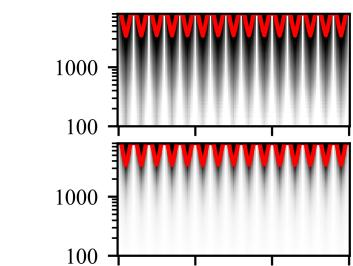  
(a) 5 cm spacing, NN

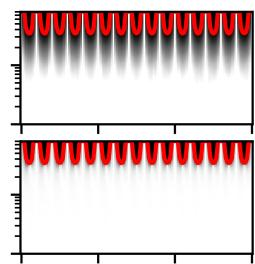  
(b) 5 cm spacing, LI

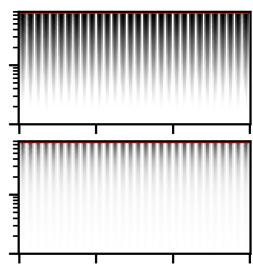  
(c) 5 cm spacing, GA

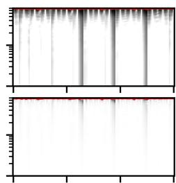  
(d) 5 cm spacing, DTW

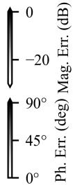

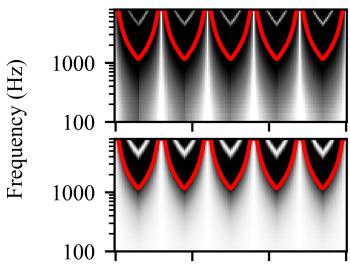  
(e) 15 cm spacing, NN

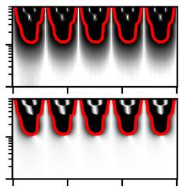  
(f) 15 cm spacing, LI

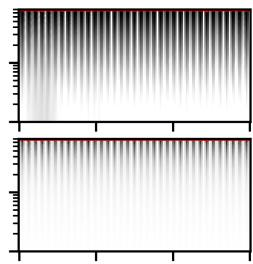  
(g) 15 cm spacing, GA

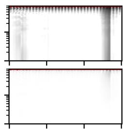  
(h) 15 cm spacing, DTW

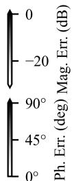

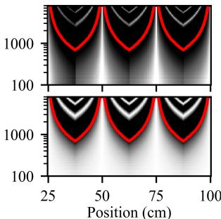  
(i) 25 cm spacing, NN

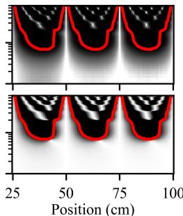  
(j) 25 cm spacing, LI

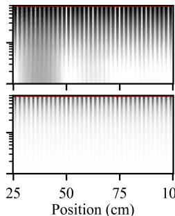  
(k) 25 cm spacing, GA

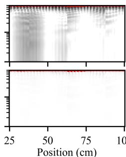  
(l) 25 cm spacing, DTW

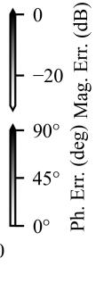  
  
FIGURE 1. Relative magnitude error (Mag. Err.) and absolute phase error (Ph. Err.) at the left ear for nearest-neighbor (NN), linear interpolation without (LI) and with global time alignment (GA), and DTW-based interpolation for lateral translation with different spacings of measurement positions. The red line shows the stability boundary.

emphasizing diagonal steps [43, 4.2.2]. This seems logical, as lateral movement will lead mainly to a global time offset. Sakoe-Chiba patterns with slope constraint (symmetric PX) [42] as well as Rabiner-Juang patterns [49, Table 4.5] allow larger steps, thus reproducing complex variations in yaw rotations of real-world responses more accurately.

Performance in terms of median system mismatch and stable frequency range (lowest stable frequency over all positions) are assessed for different spacings $\Delta \Psi _ { f }$ of measurement positions in Tables 3 and 4 and Figures 1 and 2. In these experiments, the best performing continuity conditions of Table 2 are used. For lateral translation, our proposed DTW-based approach shows the lowest system mismatch. Together with time-aligned linear interpolation, stable operation is possible almost over the whole assessed frequency range, even for coarse spacings. There are overall only minor differences between nearest-neighbor and nontime-aligned linear interpolation. This seems surprising, as nearest-neighbor interpolation performs far inferior in [25]. However, this behavior can be explained as our study ana-

lyzes a larger frequency range, taking high frequency error into account as well.

For yaw rotation in Table 4, our DTW-based approach exhibits lowest median system mismatch in almost all tested cases, especially for corse spacings. Even though system mismatch is also relatively low for $\Delta \Psi _ { f } = 1 0 ^ { \circ }$ , less stable frequency range than with non-time-aligned linear interpolation is established. Figure 2 and Table 4 suggest that for frontal $( - 4 5 ^ { \circ } \leq \Psi < 4 5 ^ { \circ } )$ , dorsal $( 1 3 5 ^ { \circ } \leq \Psi < 2 2 5 ^ { \circ } )$ , and ipsilateral $( 2 2 5 ^ { \circ } \leq \Psi < 3 1 5 ^ { \circ } )$ sources, low error and a large stable frequency range is achieved. However, a small angular range with contralateral sources $( 4 5 ^ { \circ } \leq \Psi < 1 3 5 ^ { \circ } )$ ) produces a relatively large misalignment, limiting the frequency range for stable operation. This can be accounted to the temporal structure of the impulse responses. For contralateral sources, the sound wave can take several paths around the head with different propagation delays, where two distinct peaks are present in the impulse response. For angles around $9 0 °$ , the paths are approximately equally long, resulting in a coinciding peak. Thus, DTW and global time alignment fail

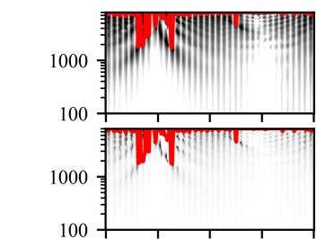  
(a) $1 0 ^ { \circ }$ spacing, NN

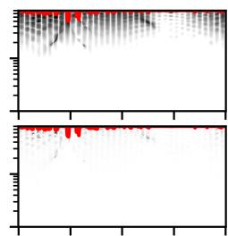  
(b) $1 0 ^ { \circ }$ spacing, LI

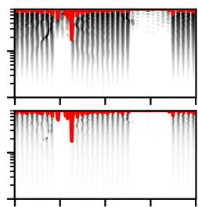  
() $1 0 ^ { \circ }$ spacing, GA

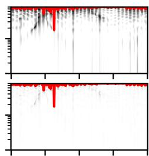  
(d) $1 0 ^ { \circ }$ spacing, DTW

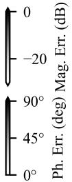

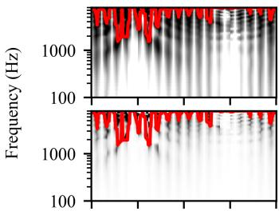  
(e) $2 0 ^ { \circ }$ spacing, NN

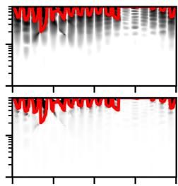  
(f) $2 0 ^ { \circ }$ spacing, LI

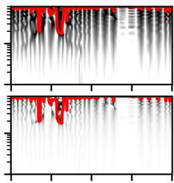  
(g) $2 0 ^ { \circ }$ spacing, GA

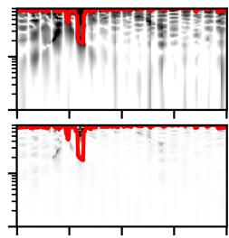  
(h) $2 0 ^ { \circ }$ spacing, DTW

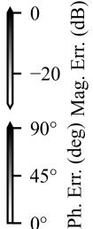

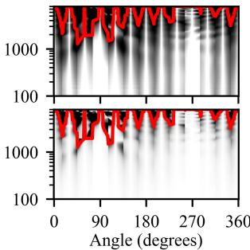  
(i) $3 0 ^ { \circ }$ spacing, NN

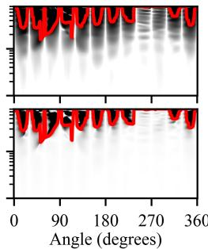  
( $3 0 ^ { \circ }$ spacing, LI

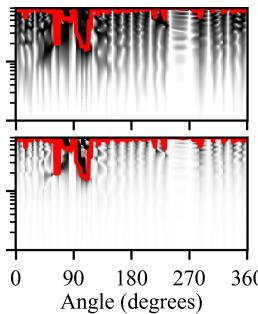  
(k) $3 0 ^ { \circ }$ spacing, GA

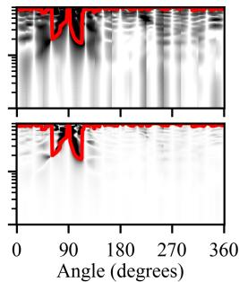  
(l) $3 0 ^ { \circ }$ spacing, DTW

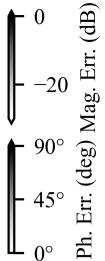  
  
FIGURE 2. Relative magnitude error (Mag. Err.) and absolute phase error (Ph. Err.) at the left ear for nearest-neighbor (NN), linear interpolation without (LI) and with global time alignment (GA), and DTW-based interpolation for yaw rotation with different spacings of measurement positions. The red line shows the stability boundary.

to match the two peaks in the impulse responses at adjacent positions to the single peak at $9 0 ^ { \circ }$ as seen in Figure 3.

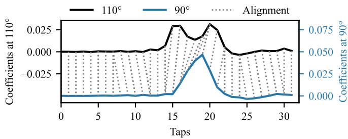  
FIGURE 3. DTW alignment for contralateral sources with yaw rotations of $9 0 ^ { \circ }$ and $1 1 0 ^ { \circ }$ .

# B. DYNAMIC ANC SIMULATION

The proposed approach is further evaluated as a proof of concept in an ANC system with a moving listener. While the circular HRIR dataset in Subsection A has a high

density of measurement directions, it is still discretized, preventing smooth movements. Hence, only lateral translation is evaluated here. Figure 4 shows the geometrical arrangement, resembling a simplified active headrest system as e.g. used in automotive applications. The room has dimensions of (2.5, 1.5, 1.0) m, rendered as second-order image source model. Using default material definitions in TASCAR, the four surrounding walls have reflective properties of a window, while the ceiling and floor are modeled as carpet. A primary source is placed behind the listener at Cartesian coordinates $( - 0 . 5 , 0 , 0 )$ m, while the secondary sources are located at coordinates $( 0 . 2 , \pm 0 . 2 , 0 )$ m. The listener is positioned at $( \Psi _ { x } , 0 , 0 ) \textrm { m }$ , where $\Psi _ { x }$ follows the trajectory outlined in Table 5 with faster motion during each movement periods. Coefficients of $\hat { \bf g }$ are measured for $\underline { { \Psi } } _ { x } = \{ 0 . 4 , 0 . 5 5 , 0 . 7 , 0 . 8 5 , 1 . 0 \} \mathrm { m } .$ To adapt the control filter, the multi-channel FxLMS algorithm [48] is utilized. While the acoustic environment is simulated in TASCAR, FxLMS algorithm and secondary path interpolation are implemented in Faust and $\mathrm { C } { + } { + }$ [57].

TABLE 3. Median system mismatch SM and lowest stable frequency fstab for nearest-neighbor (NN), linear interpolation without (LI) and with global time alignment (GA), and dynamic time warping-based interpolation (DTW) with different spacing $\Delta \Psi _ { f }$ of measurement positions for lateral translation.   

<table><tr><td>Method</td><td>ΔΨf</td><td>SM (dB)</td><td>fstab (Hz)</td></tr><tr><td>NN</td><td>5 cm</td><td>-2.75</td><td>3375</td></tr><tr><td>LI</td><td>5 cm</td><td>-2.94</td><td>3406</td></tr><tr><td>GA</td><td>5 cm</td><td>-11.50</td><td>7906</td></tr><tr><td>DTW</td><td>5 cm</td><td>-16.61</td><td>7594</td></tr><tr><td>NN</td><td>15 cm</td><td>2.49</td><td>1156</td></tr><tr><td>LI</td><td>15 cm</td><td>1.78</td><td>1125</td></tr><tr><td>GA</td><td>15 cm</td><td>-9.85</td><td>7688</td></tr><tr><td>DTW</td><td>15 cm</td><td>-17.65</td><td>7750</td></tr><tr><td>NN</td><td>25 cm</td><td>2.60</td><td>688</td></tr><tr><td>LI</td><td>25 cm</td><td>2.02</td><td>688</td></tr><tr><td>GA</td><td>25 cm</td><td>-9.63</td><td>7656</td></tr><tr><td>DTW</td><td>25 cm</td><td>-16.85</td><td>7531</td></tr></table>

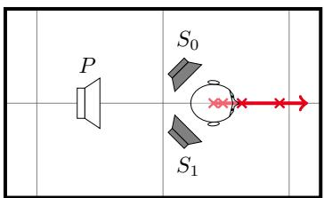  
FIGURE 4. Top view of the arrangement for the ANC simulation with primary source $P$ and secondary sources $S _ { 0 }$ and $S _ { 1 }$ . One division in the grid corresponds to $_ { 1 \textrm { m } }$ , the $\times$ markers refer to the stationary positions in Table 5 and Figure 5.

White noise, post-processed by an 8-th order Butterworth lowpass-filter with a cut-off frequency at $1 \mathrm { k H z }$ , is used as the innovation signal for the primary source and as the reference signal for the control filter. The estimated secondary path is modeled as finite impulse response (FIR) filter with order $I ~ = ~ 1 2 1$ , the control filter with order $J = 2 5 5$ . Filter orders are chosen so that all relevant acoustic information is captured, while still being able to meet realtime processing constraints on an ordinary PC (Ubuntu 22.04, Intel Core i7-13700H CPU, 32 GB RAM). The step size $\mu = 0 . 0 0 1$ for the FxLMS filter has been selected in preliminary simulations to provide reasonably fast yet stable adaptation on the initial position. The recursion of the error signal for the FxLMS filter yields an additional simulation delay of 16 samples, which is taken into account in the adaptation process. For DTW pre-processing, the classical continuity condition (symmetric1) is imposed as it provided lowest system mismatch for lateral translation in Table 2.

Figure 5 shows the mean error signal level in the ANC simulation over 100 realizations of the innovation signal, post-processed by a sliding root mean square (RMS) window with 100 ms length. At the first position with $\Psi _ { x } \in \underline { { \Psi } } _ { x }$ , all methods yield similar results. However, nearest-neighbor interpolation tends to diverge in all tested intermediate

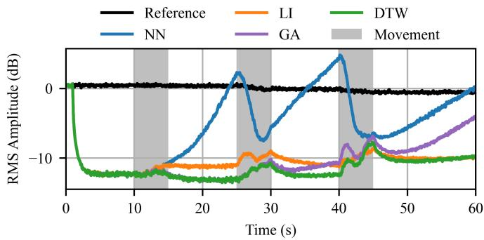  
FIGURE 5. Mean root mean square levels of the error signal in an ANC simulation, processing lowpass-filtered white noise, with nearest-neighbor (NN), linear interpolation without (LI) and with global time alignment (GA), and dynamic time warping-based (DTW) secondary path interpolation.

positions. The two time-aligned techniques perform similarly at first, providing at least as much noise reduction as at the initial position. However, on the last two positions adaptation with global time alignment starts to diverge, presumably through misalignment caused by wall reflections. While DTW-based interpolation exhibits highest noise reduction throughout the whole experiment, non-time-aligned linear interpolation performs surprisingly well and stable. This can be accounted to the limited bandwidth of the primary disturbances, which has been chosen well below the stability boundary of all tested techniques for an anechoic case in Table 3. All methods perform reasonably well during movements, where only slight decrease in noise reduction is observed for faster movements.

# V. CONCLUSION

In this article, we proposed an interpolation technique for secondary paths in local ANC based on dynamic time warping. To interpolate between FIR coefficients, measured at two different positions, impulse responses are aligned temporally through DTW in an offline analysis. During operation, the aligned responses are linearly interpolated and de-warped using cubic spline processing using only the target position as input parameters.

The proposed technique has been benchmarked against nearest-neighbor and linear interpolation with and without global time alignment. It exhibits lower system mismatch especially for sparse measurement grids, potentially reducing measurement time significantly. For lateral translation, a substantially lower system mismatch and extended stable frequency range can be established compared to non-timealigned interpolation, even for relatively coarse measurement grids. A similar trend, although not as pronounced, can be observed for yaw rotation with sparse measurement grids. However, the DTW-based system is on a par or slightly less performant than linear interpolation on dense measurement grids with contralateral sources. In a dynamic ANC simulation with lateral movements of a listener, both highest noise

TABLE 4. Median system mismatch SM and lowest stable frequency $f _ { \mathsf { s t a b } }$ for nearest-neighbor (NN), linear interpolation without (LI) and with global time alignment (GA), and dynamic time warping-based interpolation (DTW) with different spacing $\Delta \Psi _ { f }$ of measurement positions for yaw rotation.   

<table><tr><td rowspan="2">Method</td><td rowspan="2">ΔΨf</td><td colspan="2">Overall</td><td colspan="2">Frontal</td><td colspan="2">Dorsal</td><td colspan="2">Contralateral</td><td colspan="2">Ipsilateral</td></tr><tr><td>SM (dB)</td><td>fstab (Hz)</td><td>SM (dB)</td><td>fstab (Hz)</td><td>SM (dB)</td><td>fstab (Hz)</td><td>SM (dB)</td><td>fstab (Hz)</td><td>SM (dB)</td><td>fstab (Hz)</td></tr><tr><td>NN</td><td>10°</td><td>-15.39</td><td>1719</td><td>-11.39</td><td>6656</td><td>-13.25</td><td>4719</td><td>-17.43</td><td>1719</td><td>-18.14</td><td>4531</td></tr><tr><td>LI</td><td>10°</td><td>-23.01</td><td>5062</td><td>-18.69</td><td>6844</td><td>-20.45</td><td>7094</td><td>-24.40</td><td>5062</td><td>-27.94</td><td>7469</td></tr><tr><td>GA</td><td>10°</td><td>-15.95</td><td>1750</td><td>-10.40</td><td>6219</td><td>-11.05</td><td>6375</td><td>-19.17</td><td>1750</td><td>-27.65</td><td>6219</td></tr><tr><td>DTW</td><td>10°</td><td>-25.70</td><td>1750</td><td>-23.00</td><td>6812</td><td>-25.07</td><td>6781</td><td>-27.40</td><td>1750</td><td>-26.25</td><td>7000</td></tr><tr><td>NN</td><td>20°</td><td>-10.00</td><td>1531</td><td>-7.42</td><td>3406</td><td>-9.15</td><td>4719</td><td>-11.61</td><td>1531</td><td>-12.01</td><td>3844</td></tr><tr><td>LI</td><td>20°</td><td>-12.92</td><td>2000</td><td>-8.28</td><td>3812</td><td>-10.80</td><td>4594</td><td>-14.53</td><td>2000</td><td>-17.72</td><td>4031</td></tr><tr><td>GA</td><td>20°</td><td>-11.81</td><td>1750</td><td>-10.29</td><td>5844</td><td>-11.80</td><td>6750</td><td>-11.33</td><td>1750</td><td>-16.91</td><td>6000</td></tr><tr><td>DTW</td><td>20°</td><td>-19.36</td><td>1750</td><td>-17.66</td><td>6906</td><td>-21.38</td><td>7188</td><td>-18.79</td><td>1750</td><td>-18.39</td><td>7094</td></tr><tr><td>NN</td><td>30°</td><td>-6.56</td><td>1281</td><td>-3.23</td><td>2125</td><td>-4.93</td><td>2844</td><td>-8.83</td><td>1281</td><td>-9.42</td><td>3719</td></tr><tr><td>LI</td><td>30°</td><td>-8.37</td><td>1562</td><td>-3.38</td><td>2750</td><td>-5.31</td><td>3281</td><td>-9.21</td><td>1562</td><td>-12.09</td><td>3812</td></tr><tr><td>GA</td><td>30°</td><td>-10.10</td><td>1562</td><td>-9.52</td><td>5469</td><td>-10.67</td><td>5500</td><td>-8.89</td><td>1562</td><td>-11.92</td><td>5156</td></tr><tr><td>DTW</td><td>30°</td><td>-14.49</td><td>1688</td><td>-13.66</td><td>6125</td><td>-18.28</td><td>6969</td><td>-10.63</td><td>1688</td><td>-14.74</td><td>6969</td></tr></table>

TABLE 5. Time-variant position of the listener in the ANC simulation.   

<table><tr><td>Time</td><td>Position Ψx</td><td>Description</td></tr><tr><td>0 - 1 s</td><td>0.4 m</td><td>ANC off</td></tr><tr><td>1 - 10 s</td><td>0.4 m</td><td>ANC on</td></tr><tr><td>10 - 15 s</td><td>0.4 - 0.475 m</td><td>ANC on, movement</td></tr><tr><td>15 - 25 s</td><td>0.475 m</td><td>ANC on</td></tr><tr><td>25 - 30 s</td><td>0.475 - 0.625 m</td><td>ANC on, movement</td></tr><tr><td>30 - 40 s</td><td>0.625 m</td><td>ANC on</td></tr><tr><td>40 - 45 s</td><td>0.625 - 0.925 m</td><td>ANC on, movement</td></tr><tr><td>45 - 60 s</td><td>0.925 m</td><td>ANC on</td></tr></table>

reduction as well as stable operation is achieved compared to the benchmarked techniques.

This article demonstrated DTW-based interpolation with one degree of freedom. For use in real-world systems, the approach will have to be extended to handle higher DoF. Especially for contralateral sources, prediction accuracy has to be optimized, e.g. by utilizing different continuity conditions. It seems that the Rabiner-Juang type II(b) condition [49, Table 4.5] poses a good compromise for both lateral translation and rotation. As cubic spline interpolation for DTWbased interpolation is computationally relatively complex, alternative reconstruction methods might be required for use on low-power embedded systems. Another interesting usecase of the presented approach could be the application to filters in virtual sensing problems.

# REFERENCES

[1] H. F. Olson and E. G. May, “Electronic Sound Absorber,” J. Acoust. Soc. Am., vol. 25, no. 6, pp. 1130–1136, Nov. 1953.   
[2] S. J. Elliott, Signal Processing for Active Control, 1st ed., ser. Signal Processing and Its Applications. Academic Press, 2001.   
[3] J. Cheer, “Active Sound Control in the Automotive Interior,” in Future Interior Concepts, A. Fuchs and B. Brandstatter, Eds. Cham: Springer ¨ International Publishing, 2021, pp. 53–69.   
[4] J. Buck and D. Sachau, “Active headrests with selective delayless subband adaptive filters in an aircraft cabin,” Mech. Syst. Signal

Process., vol. 148, p. 107164, Feb. 2021.   
[5] D. Mylonas, A. Erspamer, C. Yiakopoulos, and I. Antoniadis, “A Virtual Sensing Active Noise Control System Based on a Functional Link Neural Network for an Aircraft Seat Headrest,” J. Vib. Eng. Technol., vol. 12, no. 3, pp. 3857–3872, Mar. 2024.   
[6] C. Antonanzas, M. Ferrer, M. de Diego, and A. Gonzalez, “Remote ˜ Microphone Technique for Active Noise Control Over Distributed Networks,” IEEE Trans. Audio Speech Lang. Process., vol. 31, pp. 1522–1535, 2023.   
[7] J. Y. Oh, H. W. Jung, M. H. Lee, K. H. Lee, and Y. J. Kang, “Enhancing active noise control of road noise using deep neural network to update secondary path estimate in real time,” Mech. Syst. Signal Process., vol. 206, p. 110940, Jan. 2024.   
[8] S. J. Elliott, P. Joseph, A. J. Bullmore, and P. A. Nelson, “Active cancellation at a point in a pure tone diffuse sound field,” J. Sound Vib., vol. 120, no. 1, pp. 183–189, Jan. 1988.   
[9] B. Rafaely, S. J. Elliott, and J. Garcia-Bonito, “Broadband performance of an active headrest,” J. Acoust. Soc. Am., vol. 106, no. 2, pp. 787– 793, Aug. 1999.   
[10] B. Rafaely, “Zones of quiet in a broadband diffuse sound field,” J. Acoust. Soc. Am., vol. 110, no. 1, pp. 296–302, Jul. 2001.   
[11] S. J. Elliott and J. Garcia-Bonito, “Active cancellation of pressure and pressure gradient in a diffuse sound field,” J. Sound Vib., vol. 186, no. 4, pp. 696–704, Oct. 1995.   
[12] P. Joseph, S. J. Elliott, and P. A. Nelson, “Near Field Zones of Quiet,” J. Sound Vib., vol. 172, no. 5, pp. 605–627, May 1994.   
[13] J. Garcia-Bonito, S. J. Elliott, and C. C. Boucher, “Generation of zones of quiet using a virtual microphone arrangement,” J. Acoust. Soc. Am., vol. 101, no. 6, pp. 3498–3516, Jun. 1997.   
[14] S. J. Elliott and J. Cheer, “Modeling local active sound control with remote sensors in spatially random pressure fields,” J. Acoust. Soc. Am., vol. 137, no. 4, pp. 1936–1946, Apr. 2015.   
[15] D. R. Morgan, “An analysis of multiple correlation cancellation loops with a filter in the auxiliary path,” IEEE Trans. Acoust., Speech, Signal Process., vol. 28, no. 4, pp. 454–467, Aug. 1980.   
[16] C. C. Boucher, S. J. Elliott, and P. A. Nelson, “Effect of errors in the plant model on the performance of algorithms for adaptive feedforward control,” IEE Proceedings F (Radar and Signal Processing), vol. 138, no. 4, p. 313, 1991.   
[17] A. K. Wang and W. Ren, “Convergence analysis of the multi-variable filtered-X LMS algorithm with application to active noise control,” IEEE Trans. Signal Process., vol. 47, no. 4, pp. 1166–1169, Apr. 1999.   
[18] C. K. Lai, J. Cheer, and C. Shi, “The effect of head-tracking resolution on the stability and performance of a local active noise control headrest system,” J. Acoust. Soc. Am., vol. 157, no. 2, pp. 766–777, Feb. 2025.   
[19] M. Hu, J. Wang, J. Xue, and J. Lu, “Inspection of the secondary path modeling in active noise control from the viewpoint of channel

identification in stereo acoustic echo cancellation,” J. Acoust. Soc. Am., vol. 145, no. 5, pp. 3024–3030, May 2019.   
[20] H. Wang, T. Liu, J. Zhang, and W. Zhang, “Multi-Channel ANC with Adaptive Kernel Assisted on-Line Secondary Path Modeling,” in 2025 Asia Pacific Signal and Information Processing Association Annual Summit and Conference (APSIPA ASC), Oct. 2025, pp. 453–458.   
[21] D. Moreau, B. Cazzolato, A. Zander, and C. Petersen, “A Review of Virtual Sensing Algorithms for Active Noise Control,” Algorithms, vol. 1, no. 2, pp. 69–99, Nov. 2008.   
[22] S. J. Elliott, M. Simon-G ´ alvez, J. Cheer, and W. Jung, “Head tracking ´ for local active noise control,” in 12th Western Pacific Acoustics Conference, Singapore, Dec. 2015, https://eprints.soton.ac.uk/388063/.   
[23] W. Jung, S. J. Elliott, and J. Cheer, “Combining the remote microphone technique with head-tracking for local active sound control,” J. Acoust. Soc. Am., vol. 142, no. 1, pp. 298–307, Jul. 2017.   
[24] C. D. Petersen, “Optimal spatially fixed and moving virtual sensing algorithms for local active noise control,” Ph.D. dissertation, The University of Adelaide, Adelaide, Australia, Jun. 2007, https://digital. library.adelaide.edu.au/dspace/handle/2440/47788.   
[25] F. Veronesi, C. K. Lai, and J. Cheer, “Interpolation between plant responses in a head-tracked local active noise control headrest system,” Mech. Syst. Signal Process., vol. 240, p. 113401, Nov. 2025.   
[26] C. K. Lai and J. Cheer, “A Comparison Between Spatial Interpolation Approaches in a Head-Tracked Active Headrest System,” in Proceedings of the 11th Convention of the European Acoustics Association Forum Acusticum / EuroNoise 2025. Malaga, Spain: European´ Acoustics Association, Jun. 2025, pp. 23–30.   
[27] C. Cheng, Z. Liu, W. Chen, X. Li, W. Liao, and C. Lu, “A multichannel active noise control system using deep learning-based method to estimate secondary path and normalized-clustered control strategy for vehicle interior engine noise,” Appl. Acoust., vol. 228, p. 110263, Jan. 2025.   
[28] P. Majdak, P. Balazs, and B. Laback, “Multiple Exponential Sweep Method for Fast Measurement of Head-Related Transfer Functions,” J. Audio Eng. Soc., vol. 55, pp. 623–637, Jul. 2007, https://aes.org/ publications/elibrary-page/?id=14190.   
[29] M. Buerger, S. Meier, C. Hofmann, W. Kellermann, E. Fischer, and H. Puder, “Retrieval of individualized head-related transfer functions for hearing aid applications,” in 25th European Signal Processing Conference (EUSIPCO), Aug. 2017, pp. 6–10.   
[30] S. Li and J. Peissig, “Measurement of Head-Related Transfer Functions: A Review,” Appl. Sci., vol. 10, no. 14, Jul. 2020.   
[31] A. O. T. Hogg, R. Barumerli, R. Daugintis, K. C. Poole, F. Brinkmann, L. Picinali, and M. Geronazzo, “Listener Acoustic Personalization Challenge - LAP24: Head-Related Transfer Function Upsampling,” IEEE Open J. Signal Process., vol. 6, pp. 926–941, 2025.   
[32] A. Lindau and S. Weinzierl, “On the spatial resolution of virtual acoustic environments for head movements in horizontal, vertical, and lateral direction,” in Proceedings of the EAA Symposium on Auralization. Espoo, Finland: European Acoustics Association, Jun. 2009.   
[33] M. J. Evans, J. A. S. Angus, and A. I. Tew, “Analyzing head-related transfer function measurements using surface spherical harmonics,” J. Acoust. Soc. Am., vol. 104, no. 4, pp. 2400–2411, Oct. 1998.   
[34] S. Mehrotra, W.-g. Chen, and Z. Zhang, “Interpolation of combined head and room impulse response for audio spatialization,” in IEEE 13th International Workshop on Multimedia Signal Processing (MMSP). Hangzhou, China: IEEE, Oct. 2011, pp. 1–6.   
[35] M. Zaunschirm, C. Schorkhuber, and R. H ¨ oldrich, “Binaural rendering ¨ of Ambisonic signals by head-related impulse response time alignment and a diffuseness constraint,” J. Acoust. Soc. Am., vol. 143, no. 6, pp. 3616–3627, Jun. 2018.   
[36] J. M. Arend, C. Porschmann, S. Weinzierl, and F. Brinkmann, ¨ “Magnitude-Corrected and Time-Aligned Interpolation of Head-Related Transfer Functions,” IEEE/ACM Trans. Audio Speech Lang. Process., vol. 31, pp. 3783–3799, 2023.   
[37] A. O. T. Hogg, M. Jenkins, H. Liu, I. Squires, S. J. Cooper, and L. Picinali, “HRTF upsampling with a generative adversarial network using a gnomonic equiangular projection,” IEEE/ACM Trans. Audio Speech Lang. Process., pp. 1–15, 2024.   
[38] K. Muller and F. Zotter, “Auralization based on multi-perspective ¨ ambisonic room impulse responses,” Acta Acust., vol. 4, no. 6, p. 25, 2020.

[39] G. Kearney, C. Masterson, S. Adams, and F. Boland, “Dynamic Time Warping for acoustic response interpolation: Possibilities and limitations,” in 17th European Signal Processing Conference (EUSIPCO), Aug. 2009, pp. 705–709, https://ieeexplore.ieee.org/ document/7077851.   
[40] V. Garcia-Gomez and J. J. Lopez, “Binaural room impulse responses interpolation for multimedia real-time applications,” in Proceedings of the 144th AES Convention, Milan, Italy, 2018, p. 10.   
[41] D. Sundstrom, F. Elvander, and A. Jakobsson, “Optimal Transport ¨ Based Impulse Response Interpolation in the Presence of Calibration Errors,” IEEE Trans. Signal Process., vol. 72, pp. 1548–1559, 2024.   
[42] H. Sakoe and S. Chiba, “Dynamic programming algorithm optimization for spoken word recognition,” IEEE Trans. Acoust., Speech, Signal Process., vol. 26, no. 1, pp. 43–49, Feb. 1978.   
[43] M. Muller, ¨ Information Retrieval for Music and Motion. Berlin, Heidelberg: Springer Berlin Heidelberg, 2007.   
[44] J. Bernhard, G. Gomez, and B. Seeber, “Time-domain interpolation of head-related transfer functions with correct reproduction of notch frequencies,” in Fortschritte der Akustik - DAGA 2015, vol. 41. Nuremberg, Germany: DEGA e.V., Mar. 2015, pp. 1126–1127, https: //pub.dega-akustik.de/DAGA 2015/data/articles/000364.pdf.   
[45] C. Masterson, G. Kearney, and F. Boland, “Acoustic Impulse Response Interpolation for Multichannel Systems Using Dynamic Time Warping,” in Proceedings of the 35th Audio Engineering Society International Conference: Audio for Games, vol. 35. London, UK: Audio Engineering Society, 2009, pp. 238–248, https://aes.org/ publications/elibrary-page/?id=15188.   
[46] I. J. Kelly and F. M. Boland, “Detecting Arrivals in Room Impulse Responses With Dynamic Time Warping,” IEEE/ACM Trans. Audio Speech Lang. Process., vol. 22, no. 7, pp. 1139–1147, Jul. 2014.   
[47] C. Schorkhuber, M. Zaunschirm, and R. H ¨ oldrich, “Binaural Ren- ¨ dering of Ambisonic Signals via Magnitude Least Squares,” in Fortschritte Der Akustik - DAGA 2018, vol. 44. Munich, Germany: DEGA e.V., 2018, pp. 339–342, https://pub.dega-akustik.de/DAGA 2018/data/articles/000301.pdf.   
[48] S. Elliott, I. Stothers, and P. Nelson, “A multiple error LMS algorithm and its application to the active control of sound and vibration,” IEEE Trans. Acoust., Speech, Signal Process., vol. 35, no. 10, pp. 1423– 1434, Oct. 1987.   
[49] L. R. Rabiner and B.-H. Juang, Fundamentals of Speech Recognition, ser. Prentice Hall Signal Processing Series. Englewood Cliffs, NJ, US: Pearson, 1993.   
[50] C. Knapp and G. Carter, “The generalized correlation method for estimation of time delay,” IEEE Trans. Acoust., Speech, Signal Process., vol. 24, no. 4, pp. 320–327, Aug. 1976.   
[51] I. J. Schoenberg, “Contributions to the problem of approximation of equidistant data by analytic functions. Part A. On the problem of smoothing or graduation. A first class of analytic approximation formulae,” Quart. Appl. Math., vol. 4, no. 1, pp. 45–99, Apr. 1946.   
[52] C. Porschmann, J. M. Arend, and A. Neidhardt, “A Spherical Near-¨ Field HRTF Set for Auralization and Psychoacoustic Research,” in Proceedings of the 142nd AES Convention, vol. 142. Berlin, Germany: Audio Engineering Society, May 2017, https://aes2.org/publications/ elibrary-page/?id=18697.   
[53] G. Grimm, J. Luberadzka, and V. Hohmann, “A Toolbox for Rendering Virtual Acoustic Environments in the Context of Audiology,” Acta Acust. united Ac., vol. 105, no. 3, pp. 566–578, May 2019.   
[54] C. P. Brown and R. O. Duda, “A structural model for binaural sound synthesis,” IEEE Trans. Speech Audio Process., vol. 6, no. 5, pp. 476– 488, Sep. 1998.   
[55] S. Spagnol, E. Tavazzi, and F. Avanzini, “Distance rendering and perception of nearby virtual sound sources with a near-field filter model,” Appl. Acoust., vol. 115, pp. 61–73, Jan. 2017.   
[56] T. Giorgino, “Computing and Visualizing Dynamic Time Warping Alignments in R: The dtw Package,” J. Stat. Softw., vol. 31, pp. 1–24, Aug. 2009.   
[57] F. Holzmuller, C. Bl ¨ ocher, and A. Sontacchi, “Assessment of Sim- ¨ ulations in FAUST and TASCAR for the Development of Audio Algorithms in Acoustic Environments,” in Proceedings of the 4th International Faust Conference, vol. 4. Torino, Italy: GRAME.CNCM, Nov. 2024, pp. 59–67, https://hal.science/hal-04846518v1.
