# A Robust Adaptive Beamformer for Microphone Arrays with a Blocking Matrix Using Constrained Adaptive Filters

Osamu Hoshuyama, Member, IEEE, Akihiko Sugiyama, Member, IEEE, and Akihiro Hirano, Member, IEEE

Abstract— This paper proposes a new robust adaptive beamformer applicable to microphone arrays. The proposed beamformer is a generalized sidelobe canceller (GSC) with a new adaptive blocking matrix using coefficient-constrained adaptive filters (CCAF’s) and a multiple-input canceller with norm-constrained adaptive filters (NCAF’s). The CCAF’s minimize leakage of target signal into the interference path of the GSC. Each coefficient of the CCAF’s is constrained to avoid mistracking. The input signal to all the CCAF’s is the output of a fixed beamformer. In the multiple-input canceller, the NCAF’s prevent undesirable target-signal cancellation when the target-signal minimization at the blocking matrix is incomplete. The proposed beamformer is shown to be robust to target-direction errors as large as 20 with almost no degradation in interference-reduction performance, and it can be implemented with several microphones. The maximum allowable target-direction error can be specified by the user. Simulated anechoic experiments demonstrate that the proposed beamformer cancels interference by over 30 dB. Simulation with real acoustic data captured in a room with 0.3-s reverberation time shows that the noise is suppressed by 19 dB. In subjective evaluation, the proposed beamformer obtains 3.8 on a five-point mean opinion score scale, which is 1.0 point higher than the conventional robust beamformer.

## I. INTRODUCTION

MICROPHONE arrays have been widely studied forteleconferencing, speech recognition, speech enhance- Lteleconferencing, speech recognition, speech enhancement, and hearing aids. They can suppress interfering signals and have the potential to replace the head-mounted or deskstand microphone for acquiring target speech signals [1]–[17]. Adaptive microphone arrays are especially promising system in terms of interference reduction. They are based on adaptive beamforming, such as a generalized sidelobe canceller (GSC), and can attain high interference-reduction performance with a small number of microphones arranged in small space. Adaptive beamformers extract the signal from the direction of arrival (DOA) specified by the steering vector, which is a parameter of beamforming. However, with classical adaptive beamformers based on the GSC, like the simple Griffiths–Jim beamformer (GJBF) [5], target-signal cancellation occurs in the presence of steering-vector errors. The steering-vector errors are caused by errors in microphone positions, microphone gains, reverberation, and target direction. Therefore, errors in the steering vector are inevitable with actual microphone arrays, and target-signal cancellation is a serious problem. Many signal processing techniques have been proposed to avoid signal cancellation. These techniques are called robust adaptive beamforming since their performance is robust against errors. However, they are not free from degradation in interference-reduction performance, an increase in the number of microphones, or mistracking.

In this paper, a new robust adaptive beamformer to avoid these difficulties is proposed. The proposed beamformer uses a new adaptive blocking matrix, which consists of coefficientconstrained adaptive filters (CCAF’s) using the reference signal from the FBF. It also employs a multiple-input canceller with norm-constrained adaptive filters (NCAF’s), which was proposed by Cox et al. [11]. The CCAF’s adaptively cancel the undesirable influence caused by steering-vector errors, and the NCAF’s prevent target-signal cancellation when the adaptation of the CCAF’s is incomplete. Because the proposed beamformer loses no degrees of freedom for interference reduction, it can be implemented with several microphones.

The following Section describes the conventional robust beamformers based on GSC. In Section III, the structure of the proposed beamformer is derived. Section IV contains simulations to demonstrate the performance of the proposed beamformer using sound data generated by computers and those obtained in a real acoustic environment.

## II. ROBUST BEAMFORMERS BASED ON GENERALIZED SIDELOBE CANCELLER

A structure of the GSC with microphones is shown in Fig. 1. The GSC includes a fixed beamformer (FBF), a multiple-input canceller (MC), and a blocking matrix (BM). The FBF enhances the target signal. The is the output of the FBF at sample index , and $x _ { m } ( k )$ is the output signal of the th microphone $( m = 0 , \ldots , M - 1 )$ . The MC adaptively subtracts the components correlated to the output signals $y _ { m } ( k )$ of the BM from the delayed output signal $d ( k - Q )$ of the FBF, where is the number of delay samples for causality. The BM is a kind of spatial rejection filter. It eliminates the target signal and passes interferences. If the input signals $y _ { m } ( k )$ of MC, which are the output signals of the BM, contain only interferences, the MC rejects the interferences and extracts the target signal. However, if the target signal leaks in $y _ { m } ( k )$ , target-signal cancellation occurs at the MC. The BM in the simple GJBF is sensitive to the steering-vector error and easily leaks the target signal. The vector error is caused by microphone arrangement error, microphone sensitivity error, target-direction error, and so on. In the real situations, the major factor of the steering-vector error is a target-direction error. This is because the target often changes position because of speaker movement. It is impossible to know the exact DOA of the target signal. Thus, signal cancellation is a serious problem [8].

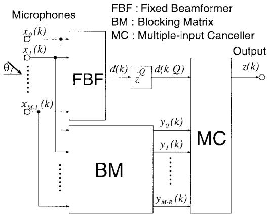  
Fig. 1. Structure of the generalized sidelobe canceller.

Several approaches to inhibit target-signal cancellation have been proposed [9]–[15]. Some robust beamformers introduce constraints to the adaptive algorithm in their MC’s. Adaptive algorithms with leakage [9], noise injection [10], or norm constraint [11] restrain the undesirable signal cancellation. The robust beamformers pass the target signal in the presence of small steering-vector error. However, when they are designed to allow large target-direction error, which is often required for microphone arrays, interference reduction is also restrained.

Some robust beamformers use improved spatial filters in BM [9], [12], [13]. The filters eliminate the target signal in the presence of steering-vector errors. However, they have been developed to allow small target-direction error. When they are designed to allow large target-direction error, the spatial filters lose degrees of freedom for interference reduction. The loss in the degrees of freedom degrades interferencereduction performance or requires an increase in the number of microphones.

Target tracking or calibration is another approach for robust beamforming [14]–[16]. It can allow large steering-vector error without loss in the degrees of freedom and maintain interference-reduction performance. However, mistracking occurs with a burst signal such as speech. Moreover, they have to use matrix products, which require a lot of computations. These problems are surmounted by the proposed robust beamformer, which allows large target-direction error without loss in the degrees of freedom.

## III. PROPOSED ROBUST BEAMFORMER

The structure of the proposed robust beamformer is shown in Fig. 2. The proposed beamformer uses a new BM with CCAF’s and an MC with NCAF’s. The CCAF’s in the BM minimize the output signals of the BM using the reference signal from the FBF. Because of the constraints in the CCAF’s, this minimization leads to minimization of the target-signal leakage at the BM output. The minimization varies the spatial filtering pattern of the BM according to the target DOA, resulting in target tracking. However, in the proposed beamformer, the tracking region is limited by the constraints of the CCAF’s to avoid mistracking. The FBF signal fed to the CCAF’s as the common reference signal enhances the residual of the interference signals, which leads to higher interferencereduction capability. Moreover, the MC uses NCAF’s, as in [11]. The NCAF’s prevent the target-signal cancellation when the target-signal minimization at the BM is incomplete, and there is some residual target-signal at the outputs of the BM.

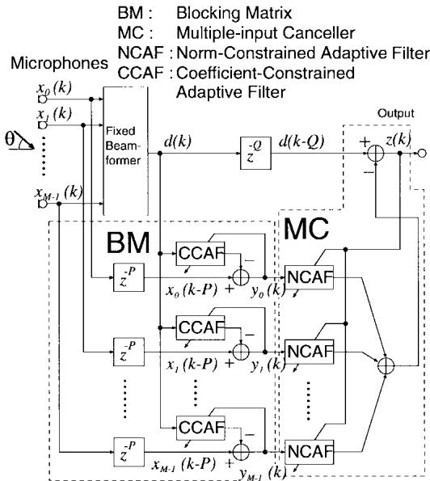  
Fig. 2. Structure of the proposed beamformer.

## A. Signal Processing in Blocking Matrix

In the BM, the CCAF’s are used like adaptive noise cancellers. The input signal of each CCAF is the output signal of the FBF, and the output of the CCAF is subtracted from the delayed microphone signal. The signal relationship in the BM with -tap CCAF’s is described by

$$
y _ {m} (k) = x _ {m} (k - P) - H _ {m} ^ {T} (k) D (k)\tag{1}
$$

$$
H _ {m} (k) \triangleq [ h _ {m, 0} (k), h _ {m, 1} (k), \ldots , h _ {m, N - 1} (k) ] ^ {T}\tag{2}
$$

$$
D (k) \triangleq [ d (k), d (k - 1), \ldots , d (k - N + 1) ] ^ {T}\tag{3}
$$

$$
(m = 0, 1, \dots , M - 1)
$$

where $[ \cdot ] ^ { T }$ denotes vector transpose. The signal $y _ { m } ( k )$ is the th output of the BM, $x _ { m } ( k )$ is the th microphone signal, and $P$ is the number of delay samples for causality. $H _ { m } ( k )$ is the coefficient vector of the th CCAF, and is the signal vector consisting of delayed signals of , which is the output signal of the FBF. The CCAF coefficients $h _ { m } ( k )$ are adapted with coefficient constraints. The adaptation, using the normalized-least-mean-squares (NLMS) algorithm,

is described as

$$
h _ {m, n} ^ {\prime} = h _ {m, n} (k) + \alpha \frac {y _ {m} (k)}{\| D (k) \| ^ {2}} d (k - n)\tag{4}
$$

$$
\begin{array}{l} h _ {m, n} (k + 1) = \left\{ \begin{array}{l l} \phi_ {m, n}, & \text { for } h _ {m, n} ^ {\prime} > \phi_ {m, n} \\ \psi_ {m, n}, & \text { for } h _ {m, n} ^ {\prime} <   \psi_ {m, n} \\ h _ {m, n} ^ {\prime}, & \text { otherwise } \end{array} \right. \\ (m = 0, 1, \dots , M - 1), \quad (n = 0, 1, \dots , N - 1) \end{array} \tag {5}
$$

where $| | \cdot | |$ denotes the Euclid norm. The terms $h _ { \boldsymbol { m } , n } ^ { \prime }$ are temporal coefficients for limiting functions, is the step size for coefficient adaptation, and $\phi _ { m , n }$ and $\psi _ { m , n }$ are the upper and the lower limits for each coefficient. In the output signal, $y _ { m } ( k )$ , which are the components correlated to $d ( k )$ , are cancelled by the CCAF’s.

Each coefficient of the CCAF’s is constrained based on the fact that filter coefficients for target-signal minimization vary significantly with the target DOA. An example of filter-coefficient variation is illustrated in Fig. 3. Because the degrees of freedom with the filters are limited, uniqueness of the optimal filter coefficients for target-signal minimization is guaranteed. In addition, enhancement of the target signal in the FBF increases the difference in the shapes of the optimal filter coefficients for target-signal minimization. A larger difference between the optimal filter coefficients and the constrained region leads to a greater residual interference-signal at the output of the BM, which results in higher interference-reduction capability with the MC. If the target signal is not enhanced, i.e., only a single microphone is used, the difference between the optimal filter coefficients for the target-signal minimization and those for interference minimization is not significantly large. The residual of interference signal becomes small, resulting into lower interference-reduction capability.

By the design of the constrained regions of the CCAF’s, the maximum allowable target-direction error is specified. For example, when the CCAF coefficients are constrained in the hatched region in Fig. 3, an error of up to $2 0 ^ { \circ }$ in target direction could be allowed. Only the signal that arrives from a DOA in the specified DOA region is minimized at the outputs of the BM and remains at the output of the MC. If no interference exists in the region, which is common with microphone arrays, no mistracking occurs.

The adaptation of the CCAF’s is carried out while the signal-to-interference ratio (SIR) is high enough. The adaptation-mode control is analogous to that of echo cancellers with a double-talk detector. For the adaptation algorithm in the BM, the target signal is the desirable signal and the interferences are the undesirable signals. Therefore, SIR should be high in terms of convergence speed and optimality of the coefficients.

## B. Signal Processing in Multiple-Input Canceller

In the MC, NCAF’s subtract the components correlated to $y _ { m } ( k ) , ( m = 0 , \ldots , M )$ from $d ( k - Q )$ . Let be the number of taps in each NCAF and $W _ { m } ( k )$ and $Y _ { m } ( k )$ be the coefficient vector and the signal vector of the th NCAF, respectively.

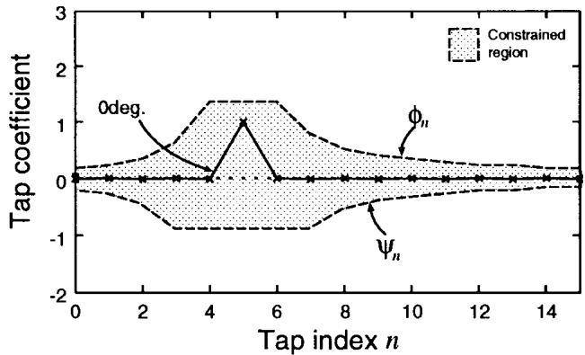

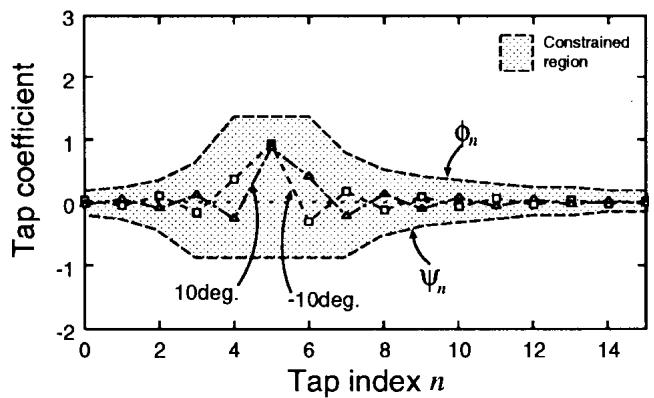

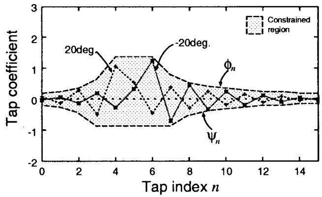

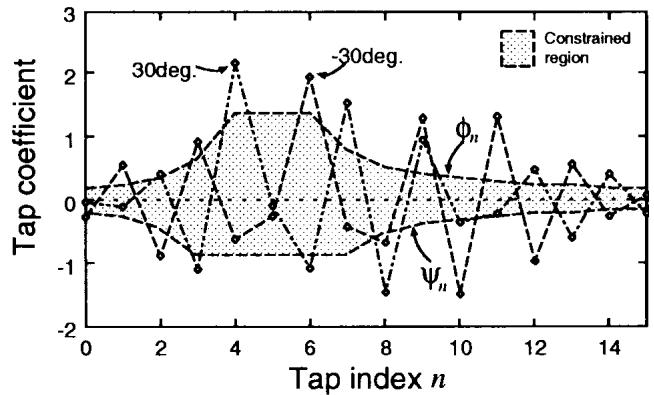  
Fig. 3. Examples of CCAF coefficients to minimize signals from different DOA’s. The hatched regions illustrate the CCAF constraints to allow $\pm 2 0 ^ { \circ }$ error in target DOA.

The signal processing in the MC is described by

$$
z (k) = d (k - Q) - \sum_ {m = 0} ^ {M - 1} W _ {m} ^ {T} (k) Y _ {m} (k)\tag{6}
$$

where

$$
W _ {m} (k) \triangleq [ w _ {m, 0} (k), w _ {m, 1} (k), \ldots , w _ {m, L - 1} (k) ] ^ {T}\tag{7}
$$

$$
Y _ {m} (k) \triangleq [ y _ {m} (k), y _ {m} (k - 1), \ldots , y _ {m} (k - L + 1) ] ^ {T}\tag{8}
$$

$$
(m = 0, 1, \dots , M - 1).
$$

Coefficients of the NCAF’s are updated by an adaptive algorithm with a norm constraint. The adaptation with the NLMS algorithm is described as

$$
W _ {m} ^ {\prime} = W _ {m} (k) + \beta \frac {z (k)}{\sum_ {j = 0} ^ {M - 1} \| Y _ {j} (k) \| ^ {2}} Y _ {m} (k)\tag{9}
$$

$$
\Omega = \sum_ {m = 0} ^ {M - 1} | | W _ {m} ^ {\prime} | | ^ {2}\tag{10}
$$

$$
W _ {m} (k + 1) = \left\{ \begin{array}{l l} \sqrt {\frac {K}{\Omega}} W _ {m} ^ {\prime}, & \text { for } \Omega > K \\ W _ {m} ^ {\prime}, & \text { otherwise } \end{array} \right.\tag{11}
$$

$$
(m = 0, 1, \dots , M - 1)
$$

where

$$
\begin{array}{l l} \beta & \text {step size;} \\ W _ {m} ^ {\prime} & \text {temporal vector for the constraint;} \end{array}
$$

and total squared-norm of $W _ { m } ( k )$ and a threshold. If exceeds , $W _ { m } ( k + 1 )$ are restrained by scaling.

The norm constraint by scaling restrains excess growth of tap coefficients. The restraint inhibits the undesirable target cancellation when the target signal leaks into the NCAF inputs. If the outputs of the BM have no target signal, the MC cancels only the interference signals. In this ideal case, norm constraint in the MC is not needed. However, complete rejection of the target signal is almost impossible in the BM because actual environments have reflection and reverberation. To completely cancel the target signal in a reverberant environment, more than 1000 taps are needed for each CCAF in the BM. Such a large number of taps requires slow convergence, large misadjustment, and increased computations.

Even when a high-speed processor and a fast convergence algorithm can be used, misadjustment with the adaptive filters is inevitable. Adaptation with a low SIR causes additional misadjustment by the interference, which leads to leakage of the target signal at the BM outputs. Therefore, to avoid the target signal cancellation by the leakage, the restraint with the MC such as the NCAF is essential for the proposed method.

The adaptation of the MC is performed during low-SIR periods. Because the purpose of the MC is cancellation of the interference signals, they are the desirable signals for the adaptation algorithm, and the target signal is the undesirable signal in the MC. Therefore, adaptation is performed during low SIR periods. If the MC is adapted during high SIR periods, the large target signal at the MC output causes misadjustment to the filter coefficients in the MC. This misadjustment results in the degradation of interference reduction performance. It also causes modulation in the target signal at the MC, resulting in distortion. Controlling the adaptation of the MC brings about better interference reduction performance with less distortion.

Because the proposed method loses no degrees of freedom for interference reduction in the BM, it is robust to large targetdirection errors with only a small number of microphones.

The proposed robust beamformer has low computational complexity because all the adaptations in the BM can be implemented without matrix product operations. Multiplications in the BM and the MC are approximately $M N { + } M L$ for filtering, for adaptation by the NLMS algorithm, and for scaling in the MC; thus, in total. Including the computations for the FBF, the number of multiplications in the proposed beamformer is about twice as large as that in the norm-constrained method [11]

## IV. EVALUATION

The proposed beamformer was evaluated in a computer simulated anechoic environment and in a real environment with reverberation. In the former environment, it was compared with the conventional beamformers in terms of sensitivity pattern. In the latter environment, it was evaluated objectively by SIR and subjectively by mean opinion score (MOS).

## A. Simulated Anechoic Environment

A four-channel equispaced broadside array was used for these simulations. The spacing between microphones was 4.1 cm (1.6 in). The sampling rate was 8 kHz. The FBF used was a simple beamformer as

$$
d (k) = \frac {1}{M} \sum_ {m = 0} ^ {M - 1} x _ {m} (k).\tag{12}
$$

In the first simulation, sensitivities after convergence as a function of single-signal DOA have been investigated. Bandlimited (0.3–3.7 kHz) Gaussian signals were used, and the assumed target direction was $0 ^ { \circ }$ . The maximum allowable target-direction error was $2 0 ^ { \circ }$ , unless otherwise stated. The adaptations of the CCAF’s in the BM and NCAF’s in the MC were controlled as follows: First, the CCAF’s were adapted for 50 000 iterations, and then, the NCAF’s were adapted for 150 000 iterations. The number of coefficients of all the CCAF’s and all the NCAF’s was 16. The parameters were $P = 5 , Q = 1 0 , K = 1 0 . 0 , \alpha = 0 . 1$ , and $\beta = 0 . 2 .$ The constraints of the CCAF were set based on the arrangement of the simulated array and maximum allowable target-direction errors. The convergence was relatively fast in the beginning and became slow. In a few seconds, after the start of coefficient adaptation, the power of the total output $z ( k )$ of the MC in Fig. 2 was reduced by about 10 dB, and then, it decayed slowly to the final value. Total output powers after convergence normalized by the power of the assumed target direction are plotted in Fig. 4. The plots are of the FBF (FBF), simple GJBF [5], norm constrained method [11] (norm constrained) and the proposed method for the maximum allowable targetdirection error of 20 . The solid line D shows that the proposed beamformer achieves both the robustness against $2 0 ^ { \circ }$ targetdirection error and high interference-reduction performance, which is 30 dB at $\theta = \pm 3 0 ^ { \circ }$

Frequency dependency of the directivity pattern is shown in Fig. 5. In this figure, sensitivities to the frequency component of the target signal are plotted. After the convergence, if a single tone signal arrives from the signal direction, the sensitivity to this signal is shown at the corresponding point of Fig. 5. Frequency dependency of the proposed beamformer is small, and thus, the proposed method is suitable for broadband application such as microphone arrays. The widths of the regions with high sensitivity are almost the same as the allowable target-direction error $( - 2 0 ^ { \circ } ~ < ~ \theta ~ < ~ 2 0 ^ { \circ } )$ , and the sensitivity difference in the region is small. Fig. 5 also illustrates that the proposed beamformer has a ripple of about 3 dB in the frequency response to the target signal source. The ripple is sufficiently small for most applications such as speech communications and voice command systems. In the extensive evaluations, the ripple caused no problem. However, it may cause degradation in some applications that are sensitive to the frequency response, e.g., some speech recognition systems. For a specific system, further evaluation is needed.

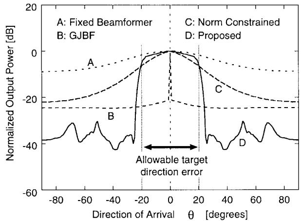  
Fig. 4. Normalized output power after convergence as a function of DOA.

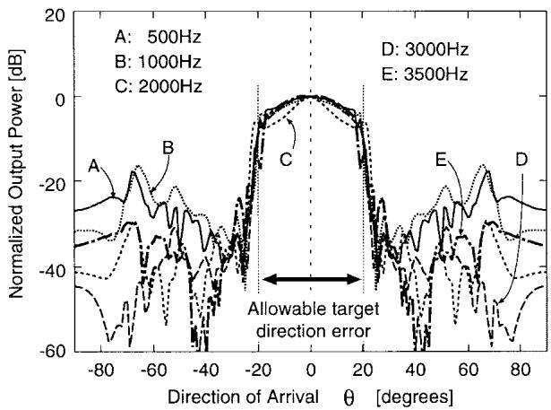  
Fig. 5. Sensitivities after convergence as a function of DOA at different frequencies.

In the second simulation, sensitivities for different SIR’s were investigated. The simulation was performed with amplitude control, which is similar to a realistic scenario. A target signal source generated a bandlimited white Gaussian signal until the 50 000th iteration and then stopped. This is a simple simulation of burst characteristics like speech. Another bandlimited white Gaussian signal, which imitates an interference like airconditioner noise, existed throughout the simulation. The SIR is defined to be the power ratio of the two signals. The target signal source was placed about $1 0 ^ { \circ }$ off the assumed target DOA, and the DOA of the interfering signal source was scanned. The adaptations of the CCAF’s and NCAF’s were controlled in the same way as the first simulation. Fig. 6 shows normalized output power after convergence as a function of interference DOA. Lines G and H have a sharp peak at $\theta \ : = \ : 1 0 ^ { \circ }$ , which indicates that the target signal at the output of the BM is minimized enough for the total robustness. Therefore, when SIR is higher than about 10 dB, which is lower than a typical SIR value expected in teleconferencing, the interference is suppressed even if it arrives from a direction in the allowable target DOA region. When the interference comes from outside the allowable target DOA region, even an SIR about 0 dB causes almost no problem in the proposed beamformer.

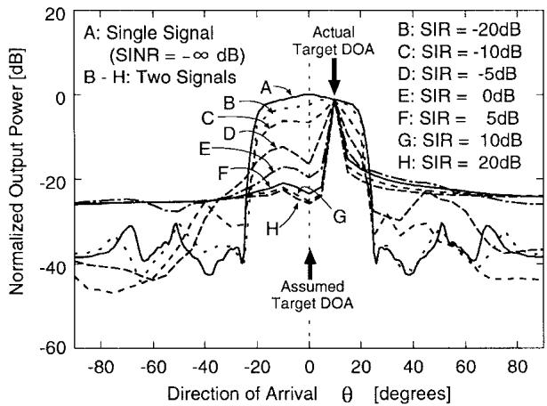  
Fig. 6. Normalized output power after convergence as a function of DOA with different SIR’s.

The third simulation used a colored signal, which was the output of a lowpass filter having a transfer function $F ( z ^ { - 1 } ) =$ $1 / ( 1 { - } 0 . 9 z ^ { - 1 } )$ . The input signal of the filter was a bandlimited white Gaussian signal. Normalized output powers as a function of DOA are plotted in Fig. 7.

In Fig. 7, the DOA region with high sensitivity is wider than that in Fig. 4. This indicates a problem: The allowable target-direction varies with the spectra of the target signal and interferences. The colored interference signal in a DOA near but outside the allowable target-direction range, which is specified for white signals, is not cancelled. This problem is caused by the frequency-dependent signal blocking capability of the BM. To reject the interference in the MC, the interference signal should not be reduced at the BM output signals, which are the reference signals for the MC. However, dominant lowfrequency components are easilly cancelled at the BM because they are highly correlated. Another type of interference signal with high autocorrelation may be partially cancelled by itself in the BM, resulting in less rejection at the MC output.

However, the problem is more serious for the normconstrained method [11] than for the proposed method. For example, in Fig. 7, the width of the DOA region where the power is over 6 dB is $8 0 ^ { \circ } \ ( - 4 0 \leq \theta \leq 4 0 )$ for the normconstrained method. This width is $4 0 ^ { \circ }$ wider than that in Fig. 4. On the other hand, the width for the proposed method in Fig. 7 is $4 8 ^ { \circ } \ ( - 2 4 \leq \theta \leq 2 4 )$ , which is only $8 ^ { \circ }$ wider than in Fig. 4.

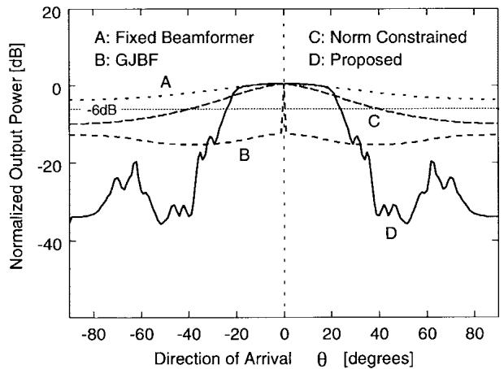  
Fig. 7. Normalized output power after convergence as a function of DOA for a colored signal.

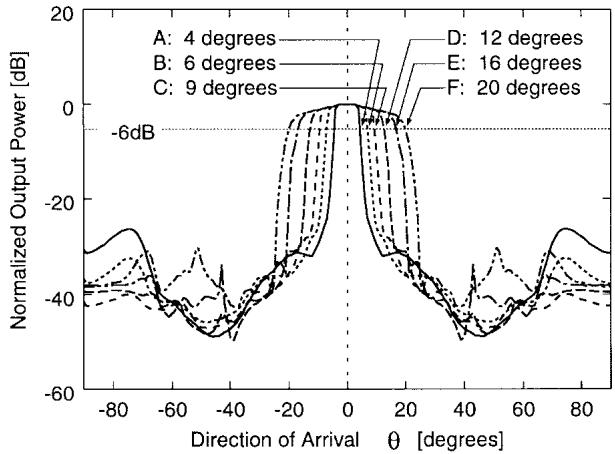  
Fig. 8. Normalized output power after convergence for different allowable target directions.

Finally, Fig. 8 shows the total output powers for various coefficient constraints with the CCAF’s. The signal was bandlimited white Gaussian noise. The allowable target-direction errors are approximately 4, 6, 9, 12, 16, and 20 . These lines demonstrate that the allowable target-direction error can be specified by the user.

## B. Reverberant Environment

Simulations with real sound data captured in a reverberant environment were also performed. The data were acquired with a broadside linear array. Four omni-directional microphones without calibration were mounted on a universal printed circuit board with an equal spacing of 4.1 cm. The signal of each microphone was bandlimited between 0.3 and 3.4 kHz and sampled at 8 kHz. The number of taps was 16 for both the CCAF’s and NCAF’s.

Fig. 9 illustrates the arrangement for sound-data acquisition. The target source was located in front of the array at a distance of 2.0 m. A white noise source was placed about 45 off the target DOA at a distance of 2.0 m. The reverberation time of the room was about 0.3 s, which is common with actual small offices. All the parameters except the step sizes were the same as those in the previous section. The target source used was male speech in English.

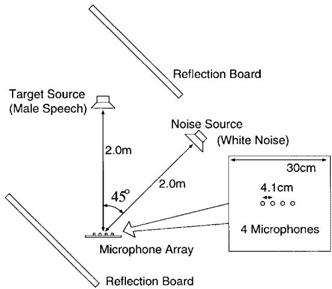  
Fig. 9. Equipment arrangement in experiments.

For comparison, simulations of the FBF, the simple GJBF [5] (GJBF), and the norm-constrained method [11] (norm constrained) were also carried out. The output signals were evaluated objectively comparing the output powers in interferencereduction performance and extracted target-signal quality. Subjective evaluation by mean opinion score (MOS) with loudspeaker listening was also carried out.

1) Objective Evaluation Output powers for all the methods after convergence are shown in Fig. 10. The step-size for the CCAF’s was 0.02, and $\beta$ for the NCAF’s was 0.004. These step sizes were selected so that breathing noise and cancellation of the target signal were sufficiently small subjectively. All other parameters were settled based on the microphone arrangement. If there is any difference between trajectory A and any of B, C, D, E, or F when voice is active (sample index from 1 720 000 to 1 740 000), the target signal corresponding to the trajectory is partially cancelled. The FBF (B) causes almost no target-signal cancellation. With the GJBF (C), cancellation of the target signal is serious. With the the norm-constrained method (D) and the proposed beamformer (E), the cancellation of target signal was 2 dB, which is subjectively small.

The output powers during voice absence (after 1 760 000th sample) indicate interference-reduction ratio (IRR). The IRR of the FBF is 3 dB, and that of the norm-constrained method is 9 dB. On the other hand, with the proposed beamformer (F), the IRR is as much as 19 dB.

The output powers for different step sizes are shown in Fig. 11. In the left half of the figure, convergence and targetsignal cancellation are compared. IRR’s are compared in the right half of the figure. When the step size $\beta$ in the NCAF’s was larger (C) than the standard (B), the interference could be suppressed more rapidly (before the 20 000th sample). However, the breathing noise was increased subjectively. In contrast, when the step-size in the CCAF’s was smaller (D), the breathing noise was decreased. However, cancellation of the target signal was increased in the beginning of the adaptation (sample index from 10 000 to 20 000), and the final IRR became smaller (sample index from 1 760 000 to 1 780 000). Therefore, step-size selection is important for the proposed beamformer in terms of extracted signal quality. A step-size control method or a new adaptation algorithm may be useful.

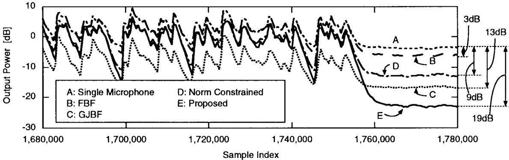  
Fig. 10. Output powers for a male speech and a white noise.

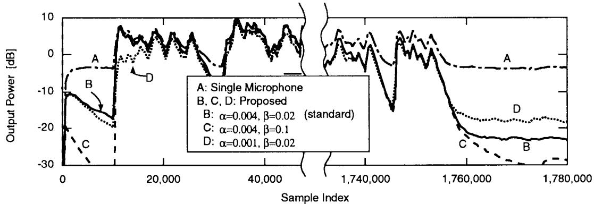  
Fig. 11. Output powers for different step sizes.

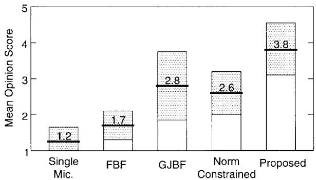  
Fig. 12. Mean opinion score.

2) Subjective Evaluation MOS evaluation by ten nonprofessional subjects was performed based on [18]. As anchors, the signal captured by a single microphone was used for grade 1 and the original male speech without interference for grade 5. Subjects were instructed that target-signal cancellation should obtain a low score. In the subjective listening test, it was noticed that reverberation of the target signal was reduced. This is because the fixed beamformer enhances the target signal through the direct path. Target-signal cancellation was recognized as attenuation of high-frequency components. When the target signal or the noise source moved, breathing noise was observed. However, it disappeared within a few seconds by adaptation.

Evaluation results are shown in Fig. 12. The thick horizontal line on each bar and the number on it represent the score obtained by the corresponding method. The vertical hatched box on each bar indicates one standard deviation. The FBF obtained 1.7 points because the number of microphones is so small that its IRR is low. The GJBF reduced the interference considerably, but target signal cancellation is serious; thus, it scored 2.8 points. The norm-constrained method scored 2.6 points for its 9-dB interference-reduction capability. The proposed beamformer obtained 3.8 points, which is the highest of all the beamformers.

## V. CONCLUSION

A new robust adaptive beamformer applicable to microphone arrays and its evaluations with real acoustic data have been presented. The proposed beamformer is a generalized sidelobe canceller equipped with an adaptive blocking matrix using coefficient-constrained adaptive filters and a multipleinput canceller using norm-constrained adaptive filters. The proposed beamformer can allow large target-direction error with almost no degradation in interference-reduction performance and can be implemented with a small number of additional computations. Simulated anechoic experiments have shown that the proposed beamformer cancels an interference by over 30 dB and that the maximum allowable targetdirection error can be specified up to 20 . Simulations with speech data in a room with 0.3-s reverberation time have demonstrated that the proposed beamformer suppresses interference by 19 dB. MOS evaluation has shown that the proposed beamformer obtained 3.8 points on a five-point scale, which is 1.0 point higher than the conventional robust beamformer. The performance of the proposed beamformer has already been proved by hardware evaluation [19].

## ACKNOWLEDGMENT

The authors would like to thank Dr. T. Nishitani, General Manager, Multimedia Siganl Processing, C&C Media Research Laboratories, NEC Corporation, for his guidance, continuous encouragement, and valuable comments.

## REFERENCES

[1] J. L. Flanagan et al., “Autodirective microphone systems,” Acoustica, pp. 58–71, Feb. 1991.

[2] J. L. Flanagan, J. D. Johnson, R. Zahn, and G. W. Elko, “Computersteered microphone arrays for sound transduction in large rooms,” J. Acoust. Soc. Amer., vol. 78, no. 5, pp. 1508–1518, Nov. 1985.

[3] M. M. Goodwin and G. W. Elko, “Constant beam-width beamforming,” in Proc. IEEE Int. Conf. Acoust., Speech, Signal Process., May 1993, pp. I-169–172.

[4] Y. Kaneda and J. Ohga, “Adaptive microphone-array system for noise reduction,” IEEE Trans. Acoust., Speech, Signal Processing, vol. ASSP-34, pp. 1391–1400, Dec. 1986.

[5] L. J. Griffiths and C. W. Jim, “An alternative approach to linear constrained adaptive beamforming,” IEEE Trans. Antennas Propagat., vol. AP-30, pp. 27–34, Jan. 1982.

[6] M. W. Hoffman, T. D. Trine, K. M. Buckley, and D. J. Tasell, “Robust adaptive microphone array processing for hearing aids: Realistic speech enhancement,” J. Acoust. Soc. Amer., vol. 96, pp. 759–770, Aug. 1994.

[7] A. Wang, K. Yao, R. E. Hudson, D. Korompis, S. F. Soli, and S. Gao, “A high performance microphone array system for hearing aid applications,” in Proc. IEEE Int. Conf. Acoust., Speech, Signal Process., May 1996, pp. 3197–3200.

[8] Y. Grenier, “A microphone array for car environments,” Speech Commun., vol. 12, no. 1, pp. 25–39, Mar. 1993.

[9] I. Claesson and S. Nordholm, “A spatial filtering approach to robust adaptive beamforming,” IEEE Trans. Antennas Propagat., vol. 40, pp. 1093–1096, Sept. 1992.

[10] N. K. Jablon, “Adaptive beamforming with the generalized sidelobe canceller in the presence of array imperfections,” IEEE Trans. Antennas Propagat., vol. AP-34, pp. 996–1012, Aug. 1986.

[11] H. Cox, R. M. Zeskind, and M. M. Owen, “Robust adaptive beamforming,” IEEE Trans. Acoust., Speech, Signal Processing, vol. ASSP-35, pp. 1365–1376, Oct. 1987.

[12] M. H. Er and A. Cantoni, “An unconstrained partitioned realization for derivative constrained broad-band antenna array processors,” IEEE Trans. Acoust., Speech, Signal Processing, vol. ASSP-34, pp. 1376–1379, Dec. 1986

[13] G. L. Fudge and D. A. Linebarger, “Steered response control of the generalized sidelobe canceller,” in Proc. IEEE Int. Conf. Acoust., Speech, Signal Process., May 1995, pp. 3623–3626.

[14] M. H. Er and B. C. Ng, “A new approach to robust beamforming in the presence of steering vector errors,” IEEE Trans. Signal Processing, vol. 42, pp. 1826–1829, July 1994.

[15] G. L. Fudge and D. A. Linebarger, “A calibrated generalized sidelobe canceller for wideband beamforming,” IEEE Trans. Signal Processing, vol. 42, pp. 2871–2875, Oct. 1994.

[16] S. Affes, S. Gazor, and Y. Grenier, “Robust adaptive beamforming via LMS-like target tracking,” in Proc. IEEE Int. Conf. Acoust., Speech, Signal Process., Apr. 1994, pp. IV-269–272.

[17] J. E. Greenberg and P. M. Zurek, “Evaluation of an adaptive beamforming method for hearing aids,” J. Acoust. Soc. Amer., vol. 91, no. 3, pp. 1662–1676, Mar. 1992.

[18] H. R. Silbiger, “Audio subjective test methods for low bit rate codec evaluations,” ISO/IEC JTC1/SC29/WG11/N0981, July 1995.

[19] O. Hoshuyama, B. Begasse, A. Hirano, and A. Sugiyama, “A realtime robust adaptive microphone array controlled by an SNR estimate,” in Proc. IEEE Int. Conf. Acoust., Speech, Signal Process., May 1998, pp. 3605–3678.

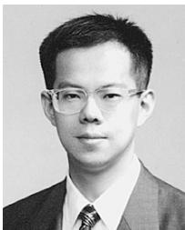

Osamu Hoshuyama (S’92–M’93) received the B.Eng., M.Eng., and Dr.Eng. degrees in electrical engineering from Tokyo University, Tokyo, Japan, in 1991, 1993, and 1999, respectively.

He joined NEC Corporation, Kawasaki, Japan, in 1993 and has been engaged in research on electroacoustics, including adaptive filters and microphone arrays.

Dr. Hoshuyama received the 1997 Academic Encouragement Award from the Institute of Electronics, Information, and Communication

Engineers of Japan (IEICE). He is a member of the IEICE and the Acoustical Society of Japan.

Akihiko Sugiyama (M’85) received the B.Eng., M.Eng., and Dr.Eng. degrees in electrical engineering from Tokyo Metropolitan University, Tokyo, Japan, in 1979, 1981, and 1998, respectively.

He joined NEC Corporation, Kawasaki, Japan, in 1981 and has been engaged in research on signal processor applications to transmission terminals, subscriber loop transmission systems, adaptive filter applications, and high-fidelity audio coding. In the 1987 academic year, he was on leave with the Faculty of Engineering and Computer Science, Concordia University, Montreal, P.Q., Canada, as a Visiting Scientist. From 1989 to 1994, he was involved in the activities of the Audio Subgroup ISO/IEC JTC1/SC29/WG11 (known as MPEG/Audio) for international standardization of high-quality audio data compression as a member of the Japanese delegation. His current interests lie in the area of signal processing and circuit theory. He is a coauthor of International Standards for Multimedia Coding (Yokohama, Japan: Maruzen, 1991), MPEG/International Standards for Multimedia Coding (Yokohama, Japan: Maruzen, 1994), MPEG (Tokyo, Japan: Ohmusha, 1996), and Digital Broadcasting (Tokyo, Japan: Ohmusha, 1996).

Dr. Sugiyama is a Member of the Institute of Electronics, Information, and Communication Engineers (IEICE) of Japan. He served as an associate editor for the IEEE TRANSACTIONS ON SIGNAL PROCESSING from 1994 to 1996. He is also a Member of the Technical Committee for Audio and Electroacoustics of the IEEE Signal Processing Society. He is currently serving as an Associate Editor for the Transactions of the IEICE, Vol. A. He received the 1988 Shinohara Memorial Academic Encouragement Award from IEICE.

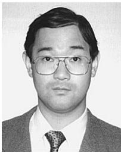

Akihiro Hirano (M’96) received the B.Eng. and M.Eng. degrees in electronics engineering from Kanazawa University, Kanazawa, Japan, in 1987 and 1989, respectively.

sors.

He joined NEC Corporation, Kawasaski, Japan, in 1989, where he had been a Research Engineer in Research and Development Group. Since 1998, he has been a Research Associate with the Faculty of Enginnering, Kanazawa University. He has been engaged in research on digital signal processing, especially echo cancellers and digital signal proces-

Mr. Hirano was awarded the 1995 Academic Encouragement Award by the Institute of Electronics, Information, and Communication Engineers of Japan (IEICE). He is a member of the IEICE.