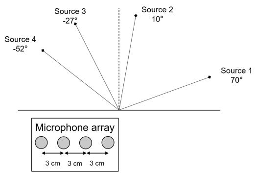
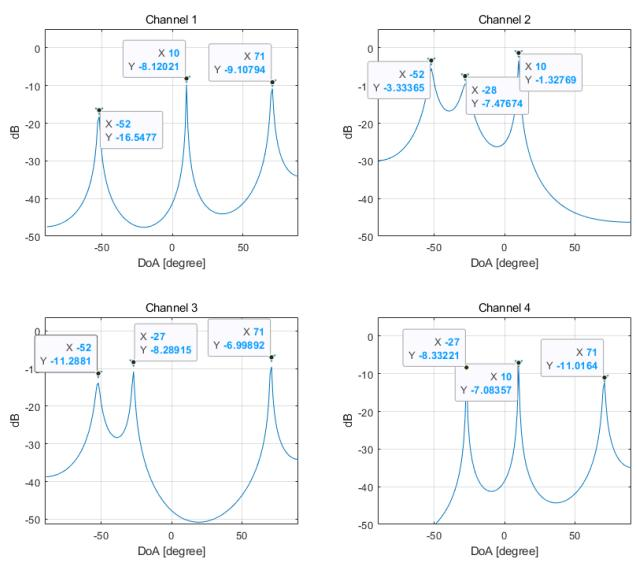
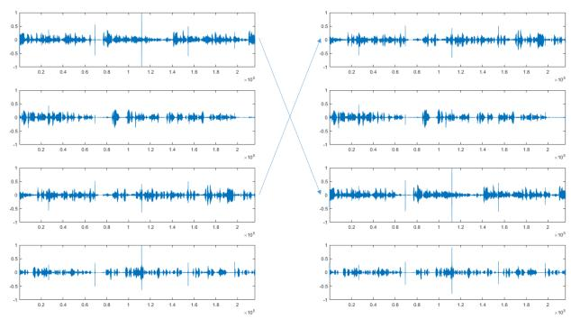
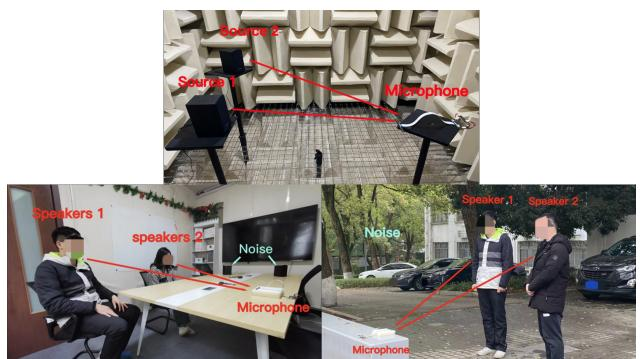
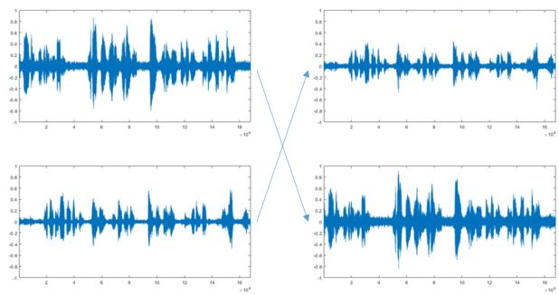
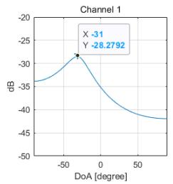
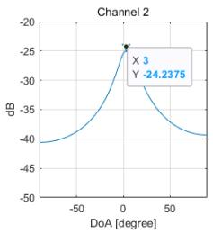
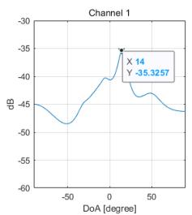
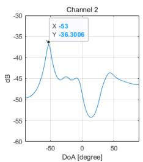

# The performance of GC-AuxIVA-ISS method in a realistic environment

Ziyi Hu

Hunan ChipHearing Semiconductor Co.Ltd.

ChangSha, China

hziyi@chalmers.se

Wang Chen\*

Hunan ChipHearing Semiconductor Co.Ltd.

ChangSha, China

chinongm@gmail.com

Abstract—In this paper, we successfully reproduced the geometrically constrained independent vector analysis with the iterative source steering(GC-AuxIVA-ISS) and tested its performance under simulation and realistic conditions. GC-AuxIVA-ISS is a method that combines three important parts: I. the well known blind source separation method AuxIVA; II. beamforming-based geometrical constraints, which are defined using the spatial information of the sources; III. the ISS method, which does not require matrix inversion, achieves a lower computational complexity per iteration; resulting in the algorithm being faster and more stable than AuxIVA. This new method allows us to achieve distinguished separation performance and be able to obtain the target speech at the desired output channel. The experimental results in simulation and realistic revealed that this method has higher source separation performance and accurate ability of output channel order controlling. However, in a noisy reverberant condition, a single BSS method can hardly deal with such a difficult situation, the separated source is neither clean nor clear and the output sequence control is hard to apply. Some assisted dereverberation and denoise approach are needed in future realistic applications.

Index Terms—Multichannel blind source separation, independent vector analysis, geometric constraints, auxiliary function approach, iterative source steering

## I. INTRODUCTION

In a noisy environment such as a cocktail party [1] or a crowded avenue, it is very hard for hearing-impaired people to capture the desired information and communicate with others even if they wear hearing aids. Blind source separation (BSS) may be an applicable method to solve the challenging and important issues for hearing aid systems [2]. As the name suggests, BSS can separate the individual sound source from a mixture observed by microphones without requiring information on the source signals, the room size or the position of the microphone array based on the assumption that the source signals are statistically independent with each other [3].

In the frequency-domain convolutive BSS, independent vector analysis (IVA) has been considered as one of the most important methods [4], [5]. This method avoid the permutation ambiguity [6] since it “models the whole frequency components as a multivariate variable following a spherical multivariate distribution” [4], [7]. Furthermore, auxiliary function based IVA (AuxIVA) [8] has been proposed and shows a good performance in both online and offline cases with rapid convergence and a low calculation cost [9].

However, the output order of separated sources is inherently undetermined [3], [7]. This problem is known as outer order permutation [10], for example, when we apply IVA for a mixture of guitar and piano, the order of output source could be either ‘first the guitar and second the piano’ or ‘first the piano and then the guitar’ [11]. Li et.al proposed a geometrically constrained AuxIVA (GC-AuxIVA) approach [7], which combines the AuxIVA with beamforming-based geometric constraints. This method successfully solved the outer order permutation problem, we can choose the order of output source based on the Direction-of-arrival (DoA) [12].

The update of traditional AuxIVA (also called AuxIVA-VCD in some papers) requires inversion of the demixing matrix, which is very time consuming and makes numerical computation unstable. To avoid this, iterative source steering (ISS) [13] has been introduced to AuxIVA, which updates the demixing matrix with a rank-1 update. Later, the iterative source steering was also introduced to the GC-AuxIVA method and formed the GC-AuxIVA-ISS algorithm [14] with high performance separation and no requirement in setting step size, faster and more stable in computation, and easy to control the output channel order.

In this paper, we reproduced the state-of-the-art GC-AuxIVA-ISS method and tested its performance in real life under three daily scenes: two people talking in a anechoic chamber; one or two person talking in a noisy meeting room; two people talking in noisy outdoors. The second scene have a highly reverberant (about 600ms) condition while the last one is almost semi-anechoic.

## II. METHOD

## A. GC-AuxIVA

In this paper, we only consider a determined situation where N sources are observed by M microphones (N=M). As eq.1 show, $x _ { n } ( \omega , t )$ denotes the short-time Fourier transform (STFT) coefficients of the signal observed at the n-th microphone and $y _ { m } ( \omega , t )$ denote the m-th estimated sources. The ω and t are the frequency and time indices respectively. We denote the frequency-wise vector representation of the observations and the estimated sources by

$$
\pmb {x} (\omega , t) = [ x _ {1} (\omega , t), \ldots , x _ {N} (\omega , t) ] ^ {\top} \in \mathbb {C} ^ {N}
$$

$$
\pmb {y} (\omega , t) = [ y _ {1} (\omega , t), \dots , y _ {M} (\omega , t) ] ^ {\top} \in \mathbb {C} ^ {M}\tag{1}
$$

where T denotes the transpose. The relationship between the observations and the estimated sources can be expressed with the time-invariant instantaneous mixture model as:

$$
\boldsymbol {y} (\omega , t) = \boldsymbol {W} (\omega) \boldsymbol {x} (\omega , t)\tag{2}
$$

where $\mathbf { } W ( \omega ) = \left[ \pmb { w } _ { 1 } ( \omega ) , \dots , \pmb { w } _ { N } ( \omega ) \right] ^ { \mathrm { H } }$ is an N\*N demixing matrix and H denotes Hermitian transpose.

In the AuxIVA method, the demixing matrices W are estimated by minimizing the following cost function:

$$
J _ {\mathrm{IVA}} (\mathcal {W}) = \sum_ {m = 1} ^ {M} \mathbb {E} \left[ G \left(\boldsymbol {y} _ {m} (t)\right) \right] - \sum_ {\omega = 1} ^ {\Omega} \log | \det \boldsymbol {W} (\omega) |,\tag{3}
$$

where Ω denotes the number of frequency bins. E[] denotes the expectation operator and $y _ { m } ( t )$ is the source-wise vector representation, and G is the contrast function. A very common used contrast function is $G \left( \pmb { y } _ { m } ( t ) \right) = G _ { R } \left( r _ { m } ( t ) \right) , r _ { j } ( t ) =$ $\sqrt { \sum _ { \omega } \left| y _ { m } ( \omega , t ) \right| ^ { 2 } } .$

For brief, the detailed derivation and proof of these functions and related algorithms which can be found in [7], [9] will not be introduced.

The idea of GC-AuxIVA algorithm is to introduce another part that denotes the geometric constraint into the eq.3. The new cost function will become:

$$
J (\mathcal {W}) = J _ {\mathrm{IVA}} (\mathcal {W}) + J _ {c} (\mathcal {W}).\tag{4}
$$

In order to restricts the far-field response of the m-th demixing filter estimated by IVA at the direction θ, the $J _ { c }$ is:

$$
\mathcal {J} _ {c} (\mathcal {W}) = \sum_ {m = 1} ^ {M} \lambda_ {m} \sum_ {\omega = 1} ^ {\Omega} \left| \boldsymbol {w} _ {m} ^ {\mathrm{H}} (\omega) \boldsymbol {d} _ {m} (\omega , \theta) - c _ {m} \right| ^ {2}.\tag{5}
$$

Where the $d _ { m } ( \omega , \theta )$ is the steering vector of the direction $\theta , \ c _ { m }$ is the nonnegative-valued constraint that needs to be adjusted for different conditions, and $\lambda _ { m }$ is a constant that represents the importance of the geometric constraint. The idea comes from the well known beam former method linearly constrained minimum variance (LCMV) [15].

## B. GC-AuxIVA-ISS

Based on the update rule of the GC-AuxIVA algorithm in [7], the matrix inverse at each iteration is computationally expensive and may adversely affect numerical stability [14]. To avoid this problem, the ISS was introduced in and formed the GC-AuxIVA-ISS algorithm.

The main difference of the ISS method is that instead of updating a single row of the demixing matrix $W _ { f }$ alternately and result in a matrix inverse step, ISS performs a rank-1 update [13] for the whole demixing matrix as

$$
W _ {f} \leftarrow W _ {f} - v _ {m f} w _ {m f} ^ {\mathrm{H}}\tag{6}
$$

And the $v _ { m f }$ is the vector we need to calculate. In other words, in the ISS method, we do not estimate the $W _ { f }$ itself but update it by another parameter. The update rule of v should be divided into two cases: m̸=n and m=n.

For the case m̸=n,

$$
v _ {n m} = \frac {\sum_ {t} \varphi (r _ {n t}) y _ {n t} y _ {m t} ^ {*} + 2 \sum_ {\theta \in \Theta} \lambda_ {n \theta} g _ {m \theta} ^ {*} (g _ {n \theta} - c _ {n \theta})}{\sum_ {t} \varphi (r _ {n t}) | y _ {m t} | ^ {2} + 2 \sum_ {\theta \in \Theta} \lambda_ {n \theta} | g _ {m \theta} | ^ {2}}.\tag{7}
$$

Where $g _ { m \theta } = { \pmb w } _ { m } ^ { \mathrm { H } } { \pmb d } _ { \theta } , \varphi \left( r _ { m t } \right) = G _ { R } \left( r _ { m t } \right) ^ { \prime } / r _ { m t }$ , the ’ is the derivative operator.

For the case m=n,

$$
v _ {m m} = \left\{ \begin{array}{l l} 1 - \alpha_ {m} ^ {- 1 / 2} \left(\beta_ {m} = 0\right), \\ 1 - \beta_ {m} ^ {*} \frac {| \beta_ {m} | + \sqrt {| \beta_ {m} | ^ {2} + \alpha_ {m}}}{\alpha_ {m} | \beta_ {m} |} \left(\beta_ {m} \neq 0\right). \end{array} \right.\tag{8}
$$

Where αm = Pt φ (rmt) |ymt|2 + 2 Pθ∈Θ λmθ |gmθ|2 , βm = Pθ∈Θ λmθcmθgmθ.

And with the updated v, we can then get the updating rule of separated source y and steering vector:

$$
\begin{array}{r l} & {\pmb {y _ {t}} \leftarrow \pmb {y _ {t}} - \pmb {v} _ {m} y _ {m t},} \\ & {\pmb {w} _ {n} ^ {\mathrm{H}} \pmb {d} _ {\theta} \leftarrow \pmb {w} _ {n} ^ {\mathrm{H}} \pmb {d} _ {\theta} - v _ {n m} \pmb {w} _ {m} ^ {\mathrm{H}} \pmb {d} _ {\theta}} \end{array}\tag{9}
$$

## C. The DoA estimated by AuxIVA-ISS

In [7], the direction of arrival (DoA) of the source can be obtained from a AuxIVA-ISS system since the BSS system can be considered as a set of beamformers. The DoA of the m-th channel output sources can be given as:

$$
\hat {\theta} _ {m} = \underset {\theta} {\mathrm{argmin}} \sum_ {\omega = 1} ^ {\Omega / 2} \left| w _ {m} ^ {\mathrm{H}} (\omega) d (\omega , \theta) \right|.\tag{10}
$$

## III. EXPERIMENTS AND RESULTS

To evaluate the performance of the algorithm, we set up both simulation and real condition experiments. All the speech signals were sampled at 16 kHz. The STFT was computed using a Hanning window whose length was set at 32 ms, and the window shift was 16 ms.

## A. Simulation

1) Simulation setting: We used samples of 4 speakers’ 15 seconds long speech from [16]. The mixture signals were created by simulating a 4-channel linear microphone array of 4 sources. Fig.1 shows the positions of the sources and microphones. The arranged DoA is Θ=[-52°,-27°,10°,70°] for female English, female Danish, male English and female Danish separately. The interval of microphones was set at 3 cm. The reverberation time (RT60) is 50ms which is equivalent to an anechoic chamber. For simulation, we test its function with following steps: I. Estimate the DoA of the target source by the AuxIVA-ISS method; II. Compare the estimated DoA with the true settings; III. If the estimation is very close to realistic, use these DoAs in GC-AuxIVA-ISS methods to control the output order of separated sources.

  
Fig. 1. The sources and microphone position of simulation

TABLE I  
AVERAGE SIR AND SAR OF SIMULATED CONDITION.

<table><tr><td></td><td>SIR in dB</td><td>SAR in dB</td></tr><tr><td>Aux-IVA-ISS</td><td>11.09</td><td>7.97</td></tr><tr><td>GC-AuxIVA-ISS</td><td>14.82</td><td>8.21</td></tr></table>

2) Results for simulation: Table 1 shows the average SDR [dB] and SIR [dB] of AuxIVA-ISS and GC-AuxIVA-ISS (null constraint) calculated by bss-eval [17]. The GC method increased the separation performance of the algorithm.

The DoA are arranged as $\theta { = } [ 1 0 ^ { \circ } , - 5 2 ^ { \circ } , 7 0 ^ { \circ } , - 2 7 ^ { \circ } ]$ . Fig.2 shows the extracted DoA by AuxIVA-ISS. The degree of each peak is almost equal to what we set. Each peak denotes a suppression in that direction so that the first channel will come out the source from $- 2 7 ^ { \circ }$ (female in Danish), the second channel will come out the $7 1 ^ { \circ }$ (male in Danish), the third and fourth channel will be the $1 0 ^ { \circ }$ (male in English) and - 52°(female in English). The estimated output order is exactly the same as what we heard.

  
Fig. 2. The DoA extracted by AuxIVA-ISS in simulation

Fig.3 shows the ability of the GC-AuxIVA-ISS to control the output channel order. The output order of the left column is $\Theta _ { L } = [ - 2 7 ^ { \circ } , 7 0 ^ { \circ } , 1 0 ^ { \circ } , - 5 2 ^ { \circ } ]$ , which is the same as the output order of AuxIVA-ISS. Then we exchanged the first and third channel by set the $\Theta _ { R } = [ 1 0 ^ { \circ } , 7 0 ^ { \circ } , - 2 7 ^ { \circ } , - 5 2 ^ { \circ } ]$ , the right column shows the corresponding change in the first and third output channel while the second and fourth channel keeps stationary.

  
Fig. 3. The ability of output channel order control by GC-AuxIVA-ISS in simulation

## B. Realistic experiments

Here we applied the GC-AuxIVA-ISS algorithm to data that was recorded in three realistic conditions. The first set of recordings were recorded in anechoic chamber, the second part were recorded in a real meeting room environment and the third were recorded outdoors.The performance of the GC-AuxIVA-ISS in all of these realistic recordings were also tested with the same step as the simulated conditions.

1) Realistic setting: Fig.4 top shows the positions of the sources and microphones in the anechoic chamber. Two loud speakers are placed about 1m away from the microphone array. The interval of microphones was 3.5 cm. These two speakers will play a male chinese speaking and a female danish speaking simultaneously. The data is about 11s long and we only use the data recorded from the middle two microphones since we only have 2 sources but the array has 4 microphones.

  
Fig. 4. The sources and microphone position of realistic condition recordings

Fig.4 bottom left shows the position of the sources and microphones in the meeting room. Two human voices (Male and female Chinese speaking) and two loudspeakers playing with bubble noise from a stationary position were captured by the microphone array. The RT60 of the meeting room is about 600ms and the sound level pressure of the bubble noise is about 70dBA.

Fig.4 bottom right is the outdoor condition. Two human voices (Male Chinese speaking) and some background noise were captured by the microphone array. The outdoor environment is an open ground with very small RT60. The sound pressure level of background noise is about 60dBA.

2) Results for realistic experiments: In the realistic recording, we cannot calculate the SIR and SAR due to the lack of exact true sources’ data. But the output of separated sources shows a good performance of the GC-AuxIVA-ISS, especially in the low reverberation condition (outdoor and anechoic chamber).

a) In the anechoic chamber: Fig.5 shows the DoA estimated by AuxIVA-ISS, the first channel will be the source from $3 ^ { \circ }$ and the second will be -31°. The estimated results are very close to What we set in the test place: the first source comes from about $4 ^ { \circ }$ and the other one comes from -32°. The ability of the GC-AuxIVA-ISS to control the output source order is also confirmed.

  
Fig. 5. The DoA extracted by AuxIVA-ISS in anechoic chamber

b) In the meeting room: In the meeting room,we test the conditions of one or two people with bubble noise. We applied four channels to separate to improve the performance. The first channel outputs the target voice of male and the other channels are just noise. We can easily figure out the voice comes in front and control the output order later. However, for two speakers condition, the AuxIVA-ISS cannot give us a correct estimation of DoA. Only the DoA of the male voice with higher volume can be correctly estimated. When listen to the output channel, we found that the algorithm can still separate the voices but mixed with the bubble noise. The high level of diffused noise and reverberation decreased the performance of AuxIVA, and we cannot have the DoA to control the output order in this condition.

  
Fig. 6. The DoA extracted by AuxIVA-ISS in outdoor  
Fig. 7. The ability of output channel order control by GC-AuxIVA-ISS in outdoor

c) In the outdoor condition: The test in the outdoor environment gives us the best result in the realistic recording part. The peak of DoA estimated by AuxIVA-ISS in Fig.6 is obvious and the output source order is successfully controlled by GC-AuxIVA-ISS with the estimated DoA (as shown in Fig.7). Each separated channel is clean and clear, just mixed with a little background noise which can be easily denoised by some other approach in the post process.

## IV. CONCLUSION

In this paper, we successfully realized the state of art blind source separation method GC-AuxIVA-ISS based on previous research. We test its performance in both simulation and realistic condition. In the simulation, this algorithm shows extraordinary performance in source separation and output channel order control. In the realistic test, the algorithm still shows very good performance in the anechoic chamber and outdoor environment, where the reverberation and noise level is not very high. However, under the high reverberant noisy condition, this method can hardly give us the clearly separated output source and the correct direction of the target source. Based on the conjunction of Robin Scheibler and Nobutaka Ono in [18], the maximum likelihood can choose the strongest sources automatically. The strongest sources have a very non-Gaussian distribution while the mix of the noise and remaining weaker sources have a distribution closer to Gaussian and thus not easy to be extracted. In other words, the noise in real conditions may be not ‘Gaussian’ enough. It can be predicted that some pre- and post-process to dereverberation [19] and denoise [20] is needed to accompany the BSS method in realistic application.

## REFERENCES

[1] S. Haykin and Z. Chen, “The cocktail party problem,” Neural computation, vol. 17, no. 9, pp. 1875–1902, 2005.

[2] M. Sunohara, C. Haruta, and N. Ono, “Low-latency real-time blind source separation with binaural directional hearing aids,” Proc. CHAT, Stockholm, Sweden, pp. 9–13, 2017.

[3] J. V. Stone, “Independent component analysis: an introduction,” Trends in cognitive sciences, vol. 6, no. 2, pp. 59–64, 2002.

[4] A. Hiroe, “Solution of permutation problem in frequency domain ica, using multivariate probability density functions,” in Independent Component Analysis and Blind Signal Separation: 6th International Conference, ICA 2006, Charleston, SC, USA, March 5-8, 2006. Proceedings 6. Springer, 2006, pp. 601–608.

[5] D. Kitamura, N. Ono, H. Sawada, H. Kameoka, and H. Saruwatari, “Determined blind source separation with independent low-rank matrix analysis,” Audio source separation, pp. 125–155, 2018.

[6] Y. Liang, S. Naqvi, and J. Chambers, “Overcoming block permutation problem in frequency domain blind source separation when using auxiva algorithm,” Electronics letters, vol. 48, no. 8, pp. 460–462, 2012.

[7] L. Li and K. Koishida, “Geometrically constrained independent vector analysis for directional speech enhancement,” in ICASSP 2020-2020 IEEE International Conference on Acoustics, Speech and Signal Processing (ICASSP). IEEE, 2020, pp. 846–850.

[8] N. Ono, “Stable and fast update rules for independent vector analysis based on auxiliary function technique,” in 2011 IEEE Workshop on Applications of Signal Processing to Audio and Acoustics (WASPAA). IEEE, 2011, pp. 189–192.

[9] N. Ono and S. Miyabe, “Auxiliary-function-based independent component analysis for super-gaussian sources,” in Latent Variable Analysis and Signal Separation: 9th International Conference, LVA/ICA 2010 St. Malo, France, September 27-30, 2010. Proceedings 9. Springer, 2010, pp. 165–172.

[10] A. Brendel, T. Haubner, and W. Kellermann, “Spatially guided independent vector analysis,” in ICASSP 2020-2020 IEEE International Conference on Acoustics, Speech and Signal Processing (ICASSP). IEEE, 2020, pp. 596–600.

[11] D. Kitamura, “Multichannel blind audio source separation based on independent low-rank matrix analysis (ilrma),” Online, http://dkitamura.net/demo-ILRMA.html, 2016, last accessed: 2023-3-29.

[12] Z. Yang, J. Li, P. Stoica, and L. Xie, “Sparse methods for directionof-arrival estimation,” in Academic Press Library in Signal Processing, Volume 7. Elsevier, 2018, pp. 509–581.

[13] R. Scheibler and N. Ono, “Fast and stable blind source separation with rank-1 updates,” in ICASSP 2020-2020 IEEE International Conference on Acoustics, Speech and Signal Processing (ICASSP). IEEE, 2020, pp. 236–240.

[14] K. Goto, T. Ueda, L. Li, T. Yamada, and S. Makino, “Geometrically constrained independent vector analysis with auxiliary function approach and iterative source steering,” in 2022 30th European Signal Processing Conference (EUSIPCO). IEEE, 2022, pp. 757–761.

[15] J. Bourgeois and W. Minker, “Linearly constrained minimum variance beamforming,” Time-Domain Beamforming and Blind Source Separation: Speech Input in the Car Environment, pp. 27–38, 2009.

[16] J. Fernandez, L. McCormack, P. Hyvarinen, A. Politis, and V. Pulkki,¨ “A spatial enhancement approach for binaural rendering of head-worn microphone arrays,” in ICA 2022 Proceedings, 2022.

[17] E. Vincent, R. Gribonval, and C. Fevotte, “Performance measurement´ in blind audio source separation,” IEEE transactions on audio, speech and language processing, vol. 14, no. 4, pp. 1462–1469, 2006.

[18] R. Scheibler and N. Ono, “Independent vector analysis with more microphones than sources,” in 2019 IEEE Workshop on Applications of Signal Processing to Audio and Acoustics (WASPAA). IEEE, 2019, pp. 185–189.

[19] T. Nakatani, R. Ikeshita, K. Kinoshita, H. Sawada, and S. Araki, “Computationally efficient and versatile framework for joint optimization of blind speech separation and dereverberation.” in INTERSPEECH, 2020, pp. 91–95.

[20] J. Thiemann, M. Muller, D. Marquardt, S. Doclo, and S. Van De Par,¨ “Speech enhancement for multimicrophone binaural hearing aids aiming to preserve the spatial auditory scene,” EURASIP Journal on Advances in Signal Processing, vol. 2016, pp. 1–11, 2016.