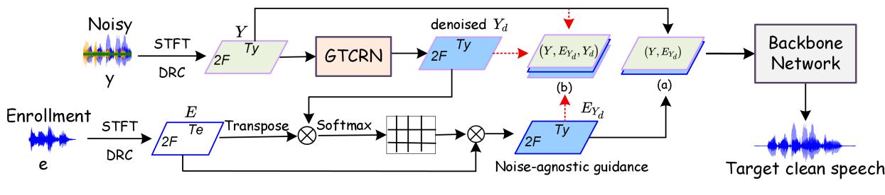
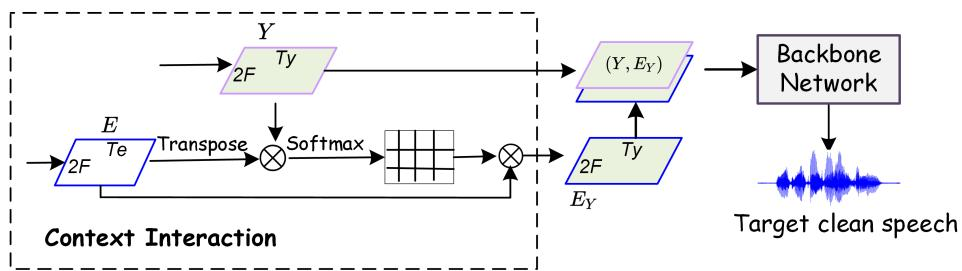
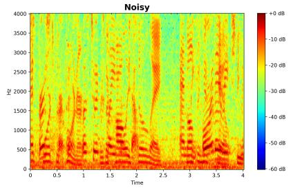
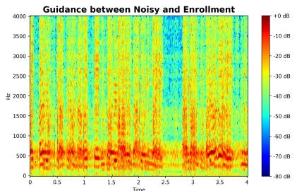
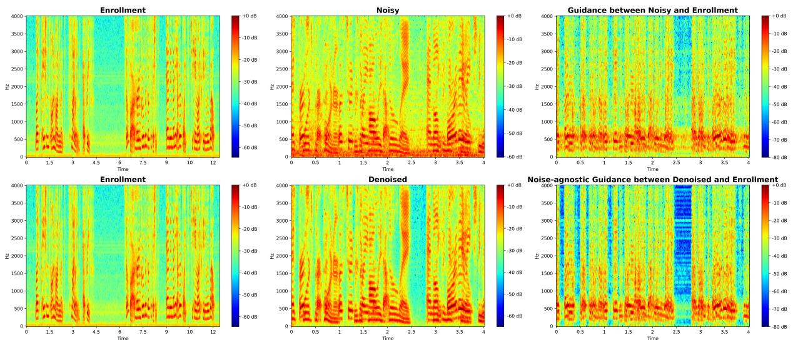
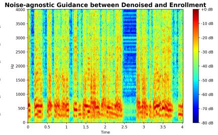

# LIGHTWEIGHT SPEECH ENHANCEMENT GUIDED TARGET SPEECH EXTRACTION INNOISY MULTI-SPEAKER SCENARIOS

Ziling Huang1,2†, Junnan Wu2, Lichun Fan2, Zhenbo Luo2, Jian Luan2, Haixin Guan3, Yanhua Long1,3∗

1Shanghai Normal University, Shanghai, China 2MiLM Plus, Xiaomi Inc., Beijing, China; 3Unisound AI Technology Co., Ltd. Beijing, China

## ABSTRACT

Target speech extraction (TSE) has achieved strong performance in relatively simple conditions such as one-speaker-plus-noise and two-speaker mixtures, but its performance remains unsatisfactory in noisy multi-speaker scenarios. To address this issue, we introduce a lightweight speech enhancement model, GTCRN, to better guide TSE in noisy environments. Building on our competitive previous speaker embedding/encoder-free framework SEF-PNet, we propose two extensions: LGTSE and D-LGTSE. LGTSE incorporates noiseagnostic enrollment guidance by denoising the input noisy speech before context interaction with enrollment speech, thereby reducing noise interference. D-LGTSE further improves system robustness against speech distortion by leveraging denoised speech as an additional noisy input during training, expanding the dynamic range of noisy conditions and enabling the model to directly learn from distorted signals. Furthermore, we propose a two-stage training strategy, first with GTCRN enhancement-guided pre-training and then joint fine-tuning, to fully exploit model potential. Experiments on the Libri2Mix dataset demonstrate significant improvements of 0.89 dB in SISDR, 0.16 in PESQ, and 1.97% in STOI, validating the effectiveness of our approach. Our code is publicly available at https://github.com/isHuangZiling/D-LGTSE.

Index Terms— Target Speech Extraction, Noisy Multi-Speaker Scenario, Noise-agnostic Enrollment Guidance, Speech Distortion

## 1. INTRODUCTION

Target speech extraction (TSE) aims to extract the speech of a desired speaker from mixtures of interferers and background noise using an enrollment utterance, with applications in ASR, hearing aids, and speech communication. While recent methods perform well in simple conditions (e.g., one-speaker-plus-noise, two-speaker mixtures), performance degrades significantly in noisy multi-speaker scenarios. A key challenge lies in the quality of enrollment guidance, as noise-corrupted enrollment can severely mislead the model in identifying the target speaker.

Recent studies on enrollment-guided TSE can be grouped into three categories: 1) speaker embedding/encoder-based approaches [1–7], 2) embedding/encoder-free methods [8–12], and 3) hybrid techniques that combine the two [13]. Embedding/encoder-based methods obtain target speaker embeddings via pretrained embedding models [14, 15], or jointly with the separation backbone using a self-designed speaker encoder [3, 16–19], or using both simultaneously [20]. In contrast, embedding/encoder-free methods avoid explicit embeddings by directly modeling enrollment–mixture interactions, e.g., via iterative attention [8], RNN state summarization [21], or STFT-domain attention [10]. Hybrid methods [13] combine both embeddings and direct interaction to provide richer guidance. While embedding-based and hybrid approaches have achieved impressive results in various TSE tasks, their large size and slow inference limit practical deployment. Therefore, recent research has increasingly shifted toward embedding/encoder-free paradigms, such as CIE-mDPTNet [10], SEF-Net [8] and SEF-PNet [9], which already demonstrate state-of-the-art performance.

Although recent TSE methods have achieved remarkable progress, they still perform poorly in noisy multi-speaker scenarios. For embedding-free approaches, the simultaneous presence of noise and interferers greatly increases task difficulty. Noise not only hinders separation but also severely corrupts enrollment guidance, often leading to target speech distortion. To address this, [22] proposed a jointly trained enhancer to reduce enrollment–noise similarity, however, the resulting guidance remains noise-contaminated since enrollment speech still interacts with mixtures. Other works [17,23–26], employ multi-stage coarse-to-fine extraction, improving robustness but at the cost of nearly doubling the parameters. These challenges highlight the urgent need for lightweight, noise-robust, and distortion-resistant TSE solutions that can operate effectively in real-world noisy multi-speaker environments.

In this paper, we build upon our previous competitive embeddingfree backbone, SEF-PNet [9], and propose two enhanced frameworks for noisy multi-speaker conditions by integrating a lightweight denoiser, GTCRN [27]. The denoiser not only pre-processes noisy speech to provide noise-agnostic enrollment guidance, but also generates distorted variants of speech that are leveraged for training data augmentation. Our main contributions are as follows:

• LGTSE: introduces a lightweight guidance scheme where context interaction is performed between GTCRN-denoised noisy speech and clean enrollment speech in an end-to-end manner. This avoids direct interaction with noisy mixtures and substantially improves TSE performance under noisy multi-speaker scenarios.

• D-LGTSE: further extends LGTSE by exploiting the denoised outputs as additional distorted training data. This augmentation strategy enriches the acoustic variability of noisy inputs and exposes the model to distortion, thereby enhancing robustness.

• Two-stage Training: adopts a progressive training strategy in which the denoiser is first pre-trained, followed by training the TSE backbone, and finally fine-tuning the entire system jointly. This staged optimization yields consistent performance improvements.

(1) Architecture of proposed LGTSE and D-LGTSE  
(a) base concatenation - LGTSE (b) distortion-aware concatenation -D-LGTSE  
  
(2) Architecture of SEF-PNet (Baseline)

  
Fig. 1. Architecture of the proposed LGTSE and D-LGTSE, and the simplified SEF-PNet (baseline).

## 2. PROPOSED METHODS

## 2.1. Architecture

As illustrated in Fig. 1, the proposed LGTSE and D-LGTSE architectures are shown in the upper part, while the simplified SEF-PNet baseline is demonstrated below. In both frameworks, the noisy speech and enrollment speech are fed into the backbone’s front-end context interaction module to generate a guidance feature, which is concatenated with the noisy/denoised feature and passed into the backbone network to extract the target clean speech.

Compared to our previously proposed simplified SEF-PNet, LGTSE introduces a lightweight speech enhancement model (GTCRN) to denoise the noisy speech before interaction with the enrollment speech, effectively preventing noise contamination in the guidance. In addition, D-LGTSE further leverages the denoised speech as an extra distorted input during training, thereby expanding the dynamic range of noisy conditions and enabling distortion-aware training. This operation further improves the model’s robustness against speech distortion. Details of key components in LGTSE and D-LGTSE are presented as follows.

## 2.2. Noise-agnostic Enrollment Guidance Extraction

Directly performing context interaction between enrollment and noisy speech often leads to noise contamination in the enrollmentguided representation. To address this, both LGTSE and D-LGTSE introduce a noise-agnostic enrollment guidance extraction process, which produces a more robust target speaker representation and enables the backbone network to extract higher-quality target speech.

As shown in Fig. 1-(1), the inputs are enrollment speech and noisy speech, which are first transformed into complex timefrequency representations via short-time Fourier transform. Specifically, $\dot { \mathbf { E } ^ { \mathrm { ~ ~ } } } \in \dot { \mathbb { R } } ^ { 2 F \times T _ { \epsilon } }$ and $\textbf { Y } \in \ \mathbb { R } ^ { 2 F \times T _ { y } }$ , where $2 F$ denotes the concatenated real and imaginary parts along the frequency axis, and $T _ { e } , T _ { y }$ represent the number of frames of enrollment and noisy speech, respectively. Dynamic range compression [28] with compression factor $\beta = 0 . 5$ is applied on the magnitude spectrum:

$$
\mathbf {E} = | \mathbf {E} | ^ {\beta} e ^ {j \theta_ {E}}, \quad \mathbf {Y} = | \mathbf {Y} | ^ {\beta} e ^ {j \theta_ {Y}}\tag{1}
$$

If we follow the SEF-PNet baseline (Fig. 1-(2)), the enrollment representation $\mathbf { E } _ { Y }$ is then obtained by directly performing context interaction between the enrollment and noisy features as:

$$
\mathbf {E} _ {Y} = \mathbf {E} \times \mathrm{softmax} \left(\mathbf {E} ^ {\mathrm{T}} \times \mathbf {Y}\right)\tag{2}
$$

where the softmax operation is applied along the enrollment timeframe dimension to measure the correlation between enrollment and noisy frames, the noise contained in Y will inevitably contaminate the resulting guidance EY .

To mitigate this, our method first denoises the noisy speech with a lightweight speech enhancement model GTCRN, and then replaces Y with the denoised $\mathbf { Y } _ { d }$ for the context interaction:

$$
\begin{array}{c} \mathbf {Y} _ {d} = \operatorname{GTCRN} (\mathbf {Y}), \\ \mathbf {E} _ {Y _ {d}} = \mathbf {E} \times \operatorname{softmax} \left(\mathbf {E} ^ {\mathrm{T}} \times \mathbf {Y} _ {d}\right) \end{array}\tag{3}
$$

By using the denoised feature in the context interaction, the target speaker guidance becomes noise-agnostic, effectively suppressing noise interference.

## 2.3. Distortion-aware LGTSE (D-LGTSE)

In multi-speaker TSE, extracted target speech often contains distortions. To improve robustness, D-LGTSE leverages the denoised spectrum $\mathbf { Y } _ { d } ,$ which is not perfectly clean but mildly distorted, as an additional input during training. This exposes the model to distorted speech and increases acoustic variability. Three distortionaware data usages are investigated as follows.

Distortion-aware concatenation: As shown in Fig. 1-(1)-(b), unlike the base concatenation used in LGTSE with only Y and $\mathbf { E } _ { Y _ { d } } ,$ D-LGTSE concatenates the original noisy spectrum Y, the denoised spectrum $\mathbf { Y } _ { d } ,$ and the noise-agnostic guidance $\mathbf { E } _ { Y _ { d } }$ along the channel dimension. This fused representation is then fed into the backbone, enabling joint processing within a single forward pass.

On-the-fly: Each mini-batch B is enlarged by including both the original noisy and the denoised spectrums generated on-the-fly:

$$
\mathcal {B} = \{(\mathbf {Y} _ {i}, \mathbf {E} _ {Y _ {d}} ^ {i}), \mathbf {Y} _ {\text { target }} ^ {i} \} _ {i = 1} ^ {N} \cup \{(\mathbf {Y} _ {d} ^ {i}, \mathbf {E} _ {Y _ {d}} ^ {i}), \mathbf {Y} _ {\text { target }} ^ {i} \} _ {i = 1} ^ {N}\tag{4}
$$

where N is the original mini-batch size, $\mathbf { Y } _ { \mathrm { t a r g e t } } ^ { i }$ is the clean target speech (ground-truth) corresponding to the i-th noisy sample. This lets the model process noisy and mildly distorted speech in parallel.

Offline: The entire noisy dataset D is first processed to obtain denoised dataset $\mathcal { D } _ { d } .$ The two datasets are then merged and shuffled to form a distortion-aware noisy training set $\mathcal { D } _ { \operatorname* { m i x } } .$ , which is paired with enrollment guidance and used to train the model following the LGTSE scheme.

$$
\mathcal {D} _ {\text { mix }} = \text { shuffle } (\mathcal {D} \cup \mathcal {D} _ {d})\tag{5}
$$

The shuffle operation encourages the model to generalize better by exposing it to diverse noisy–denoised pairings. Moreover, compared with distortion-aware concatenation, this offline strategy reduces both computation cost and inference latency.

## 2.4. Two-stage Training Strategy

Both LGTSE and D-LGTSE adopt a two-stage training strategy to fully leverage the pretrained modules. In the first stage (pretraining), GTCRN is trained for speech enhancement only on noisy mixtures (e.g., ‘2-speaker + noise’), and its denoised outputs, together with enrollment speech, are used to pretrain the backbone network from scratch for TSE with noise-agnostic enrollment guidance. In the second stage (joint fine-tuning), GTCRN is unfrozen, and the entire system is fine-tuned jointly in an end-to-end manner, enabling the backbone to exploit denoised speech more effectively and thereby improving robustness and overall TSE performance.

The training objective minimizes the negative scale-invariant signal-to-distortion ratio (SI-SDR). For GTCRN, the ground-truth is the clean 2-speaker mixture speech $\mathbf { y } _ { \mathrm { c l e a n } } ,$ and for the backbone, it is the target speech $\mathbf { y } _ { \mathrm { t a r g e t } } .$ . During end-to-end joint fine-tuning, both losses are combined:

$$
\mathcal {L} = - \text { SI - SDR } (\mathbf {y} _ {d}, \mathbf {y} _ {\text { clean }}) - \text { SI - SDR } (\hat {\mathbf {y}} _ {\text { target }}, \mathbf {y} _ {\text { target }})\tag{6}
$$

where $\mathbf { y } _ { d }$ is the GTCRN denoised speech, and $\hat { \mathbf { y } } _ { \mathrm { t a r g e t } }$ is the backbone’s target estimate. This jointly optimizes denoising and target speech extraction thus enhances the noisy multi-speaker TSE.

## 3. EXPERIMENTS AND RESULTS

## 3.1. Datasets

All our experiments are performed on the Libri2Mix [29] dataset, specifically using the ‘mix both’ condition, which contains mixtures of a target speaker, one interfering speaker, and background noise. For clarity, we refer to this condition as ‘2-speaker + noise’. The training set includes 13,900 utterances from 251 speakers, while both the development and test sets contain 3,000 utterances from 40 speakers each, with all mixtures simulated in the ‘minimum’ mode. Note that only the first speaker is taken as the target speaker during all training mixture data simulation, and all mixtures are resampled to 8 kHz, unless otherwise specified.

## 3.2. Models

GTCRN [27] consists of an encoder, a grouped dual-path recurrent neural network (G-DPRNN) module, and a decoder. The input mixture is first transformed from the STFT domain to ERB bands before being fed into the encoder. The encoder is composed of two convolutional blocks followed by three GT-Conv blocks. The decoder has a symmetric structure to the encoder, where convolutional blocks are replaced with transposed convolutional blocks. Finally, the output is converted back from the ERB domain to the STFT domain.

Table 1. Overall Results. LGTSE and D-LGTSE are both with the SEF-PNet backbone network, while D-LGTSE-mDPTNet denotes the D-LGTSE framework equipped with the CIE-mDPTNet backbone.

<table><tr><td>ID</td><td>Methods</td><td>SI-SDR</td><td>PESQ</td><td>STOI</td></tr><tr><td>E0</td><td>Unprocessed</td><td>-2.03</td><td>1.43</td><td>64.65</td></tr><tr><td>E1</td><td>SEF-PNet [9]</td><td>7.43</td><td>2.14</td><td>80.31</td></tr><tr><td>E2</td><td>LGTSE</td><td>7.88</td><td>2.21</td><td>81.27</td></tr><tr><td>E3</td><td>D-LGTSE (Concat)</td><td>7.96</td><td>2.24</td><td>81.37</td></tr><tr><td>E4</td><td>D-LGTSE (On-the-fly)</td><td>8.10</td><td>2.28</td><td>81.80</td></tr><tr><td>E5</td><td>D-LGTSE (Offline)</td><td>8.32</td><td>2.30</td><td>82.28</td></tr><tr><td>F0</td><td>CIE-mDPTNet [10]</td><td>10.87</td><td>2.73</td><td>87.26</td></tr><tr><td>F1</td><td>D-LGTSE-mDPTNet (Offline)</td><td>11.70</td><td>2.86</td><td>88.83</td></tr></table>

SEF-PNet [9], used as the competitive embedding-free TSE baseline, consists of an encoder, a decoder, a Temporal Convolutional Network (TCN) module, a PyramidBlock, and a Deconv2d layer. It is worth noting that the SEF-PNet baseline used in this study is a simplified version, where the iterative feature integration (IFI) block from the original design [9] is removed to ensure a fair comparison with the proposed LGTSE and D-LGTSE. All other details remain identical to those in [9].

CIE-mDPTNet [10], which has achieved state-of-the-art performance on TSE tasks, is also included as a baseline to further validate the effectiveness and generalization of our proposed methods. The detailed architecture can be found in [10].

## 3.3. Configurations

We use a Hanning analysis window for STFT with a window length of 32 ms and a shift of 8 ms. The model is trained using the Adam optimizer with an initial learning rate of 0.0005. The learning rate is adjusted by multiplying it by 0.98 every two epochs for the first 100 epochs and by 0.9 for the last 20 epochs. Gradient clipping is applied to limit the maximum L2-norm to 1. The training procedure lasts up to 150 epochs. For evaluation, we report SISDR (dB) [30], PESQ [31], and STOI (%) [32].

## 3.4. Results

## 3.4.1. Overall Results

Table 1 presents the overall performance of LGTSE and D-LGTSE compared with the two strong baselines. From E1 to E5, it can be observed that both LGTSE and D-LGTSE achieve consistent improvements over the baseline SEF-PNet across all evaluation metrics. Specifically, LGTSE outperforms SEF-PNet by 0.45 dB in SI-SDR and improves PESQ and STOI from 2.14/80.31 to 2.21/81.27, demonstrating the effectiveness of noise-agnostic enrollment guidance. Among the three distortion-aware data usage mechanisms, D-LGTSE (Offline) yields the best overall performance, boosting the metrics to 8.32/2.30/82.28. This can be attributed to the fact that, during joint training after unfreezing, the denoiser in the concatenation and on-the-fly mechanisms becomes increasingly effective, which reduces the degree of residual distortion and limits the model’s exposure to challenging conditions. In contrast, the offline strategy stores distorted speech in advance, ensuring that such data remain available during the whole training and thus preserving the robustness benefits of distortion-aware learning.

  
Fig. 2. Noise-agnostic enrollment guidance analysis. The top row shows the enrollment guidance from direct context interaction between enrollment and noisy speech, while the bottom row shows the resulting spectrogram with the proposed noise-agonistic enrollment guidance.

Table 2. Model size and computational complexity.

<table><tr><td>Model</td><td>Params (M)</td><td>MACs (G/s)</td></tr><tr><td>GTCRN</td><td>0.05</td><td>0.03</td></tr><tr><td>SEF-PNet</td><td>6.08</td><td>8.50</td></tr><tr><td>D-LGTSE</td><td>6.13</td><td>8.53</td></tr><tr><td>CIE-mDPTNet</td><td>2.87</td><td>22.25</td></tr><tr><td>D-LGTSE-mDPTNet</td><td>2.92</td><td>22.28</td></tr></table>

Beyond SEF-PNet, we further validate our framework on the stronger CIE-mDPTNet backbone. Although our implemented CIE-mDPTNet (F0) baseline already achieves SOTA performance, equipping it with our method, the proposed D-LGTSE-mDPTNet (Offline) delivers additional, sizable gains to 0.83/0.13/1.57 in SI-SDR/PESQ /STOI. Note that absolute metrics under the CIEmDPTNet backbone exceed those with SEF-PNet mainly because CIE-mDPTNet incurs about 3× higher computational cost than our CNN-based SEF-PNet backbone (as summarized in Table 2). These results show that D-LGTSE remains highly effective when integrated with stronger backbones, demonstrating the generalizability of noise-agnostic enrollment guidance and distortion-aware training across architectures.

## 3.4.2. Ablation Study of Model Training Strategy

Table 3 reports the ablation study on different training strategies for D-LGTSE (Offline). In S0, the GTCRN and backbone are pretrained separately, and their combination yields limited performance, indicating that simple stacking without joint optimization is suboptimal. In S1, the pretrained GTCRN is integrated as the front-end, while the backbone is trained from scratch. This closer coupling between modules improves the results to 8.02/2.26/81.41, showing the benefit of tighter integration. Finally, in E5, both GTCRN and the backbone are jointly optimized through a two-stage training scheme, which further enhances performance and achieves the best results. These results demonstrate that progressively deeper integration and endto-end joint training are crucial for fully exploiting the potential of distortion-aware learning in D-LGTSE.

Table 3. Different model training strategy of D-LGTSE(Offline).

<table><tr><td>ID</td><td>Training Method</td><td>SI-SDR</td><td>PESQ</td><td>STOI</td></tr><tr><td>S0</td><td>GTCRN* + backbone*</td><td>7.60</td><td>2.15</td><td>80.64</td></tr><tr><td>S1</td><td>GTCRN* + backbone</td><td>8.02</td><td>2.26</td><td>81.41</td></tr><tr><td>E5</td><td>Two-stage Training</td><td>8.32</td><td>2.30</td><td>82.28</td></tr></table>

## 3.4.3. Visualization of Noise-agnostic Enrollment Guidance

Fig.2 presents the effect of noise-agnostic enrollment guidance. The top row displays the enrollment spectrogram alongside noisy speech and their guidance obtained through direct context interaction. The bottom row shows the enrollment with denoised speech and the corresponding noise-agnostic guidance. By comparing the enrollment under noisy and denoised conditions, the denoising capability of GTCRN is clearly observed. Moreover, a comparison of the guidance spectrogram reveals that leveraging denoised speech for context interaction effectively suppresses noise components, leading to cleaner and more reliable guidance.

## 4. CONCLUSION

In this work, we proposed LGTSE and its distortion-aware extension D-LGTSE for target speech extraction in noisy multi-speaker scenarios. LGTSE leverages noise-agnostic enrollment guidance to prevent corruption of enrollment information, while D-LGTSE enhances robustness against speech distortion through distortion-aware training. A two-stage training strategy is further introduced to jointly optimize denoising and extraction. Experiments on the Libri2Mix 2-speaker+noise benchmark confirm consistent and significant improvements over strong baselines, validating the effectiveness of our approach. In future work, we will extend the proposed framework to broader TSE applications and larger, more diverse datasets to further verify its generalization.

## 5. REFERENCES

[1] J. Yu, H. Chen, Y. Luo, R. Gu, and C. Weng, “High fidelity speech enhancement with band-split rnn,” in Proc. Interspeech, 2023, pp. 2483–2487.

[2] K. Liu, Z. Du, X. Wan, and H. Zhou, “X-SEPFORMER: Endto-end speaker extraction network with explicit optimization on speaker confusion,” in Proc. ICASSP, 2023, pp. 1–5.

[3] J. Han, Y. Long, et al., “DPCCN: Densely-connected pyramid complex convolutional network for robust speech separation and extraction,” in Proc. ICASSP, 2022, pp. 7292–7296.

[4] C. Xu, W. Rao, E. S. Chng, et al., “SpEx: Multi-scale time domain speaker extraction network,” IEEE/ACM Transactions on Audio, Speech, and Language Processing, vol. 28, pp. 1370– 1384, 2020.

[5] M. Ge, C. Xu, L. Wang, E. S. Chng, J. Dang, and H. Li, “SpEx+: A complete time domain speaker extraction network,” in Proc. Interspeech, 2020, pp. 1406–1410.

[6] M. Delcroix, T. Ochiai, K. Zmolikova, et al., “Improving speaker discrimination of target speech extraction with timedomain speakerbeam,” in Proc. ICASSP, 2020, pp. 691–695.

[7] Z. You, Z. Zhou, L. Li, and D. Wang, “An investigation on speaker augmentation for end-to-end speaker extraction,” arXiv preprint arXiv:2505.21805, 2025.

[8] B. Zeng, H. Suo, Y. Wan, and M. Li, “SEF-Net: Speaker embedding free target speaker extraction network,” in Proc. Interspeech, 2023, pp. 3452–3456.

[9] Z. Huang, H. Guan, H. Wei, and Y. Long, “SEF-PNet: Speaker encoder-free personalized speech enhancement with local and global contexts aggregation,” in Proc. ICASSP, 2025, pp. 1–5.

[10] X. Yang, C. Bao, J. Zhou, and X. Chen, “Target speaker extraction by directly exploiting contextual information in the timefrequency domain,” in Proc. Interspeech, 2024, pp. 10476– 10480.

[11] Y. Hu, H. Xu, Z. Guo, H. Huang, and L. He, “SMMA-Net: An audio clue-based target speaker extraction network with spectrogram matching and mutual attention,” in Proc. ICASSP, 2024, pp. 1496–1500.

[12] T. Parnamaa and A. Saabas, “Personalized speech enhance-¨ ment without a separate speaker embedding model,” in Proc. Interspeech, 2024, pp. 4863–4867.

[13] K. Zhang, J. Li, S. Wang, Y. Wei, Y. Wang, Y. Wang, and H. Li, “Multi-level speaker representation for target speaker extraction,” in Proc. ICASSP, 2025, pp. 1–5.

[14] B. Desplanques, J. Thienpondt, and K. Demuynck, “ECAPA-TDNN: Emphasized channel attention, propagation and aggregation in tdnn based speaker verification,” in Proc. Interspeech, 2020, pp. 3830–3834.

[15] K. He, X. Zhang, S. Ren, J. Sun, et al., “Deep residual learning for image recognition,” in Proc. CVPR, 2016, pp. 770–778.

[16] J. Chen, W. Rao, Z. Wang, J. Lin, Y. Ju, S. He, Y. Wang, and Z. Wu, “MC-SpEx: Towards effective speaker extraction with multi-scale interfusion and conditional speaker modulation,” in Proc. Interspeech, 2023, pp. 4034–4038.

[17] Y. Ju, W. Rao, X. Yan, Y. Fu, et al., “TEA-PSE: Tencentethereal-audio-lab personalized speech enhancement system for icassp 2022 dns challenge,” in Proc. ICASSP, 2022, pp. 9291–9295.

[18] Y. Ju, S. Zhang, W. Rao, et al., “TEA-PSE 2.0: Sub-band network for real-time personalized speech enhancement,” in Proc. SLT, 2023, pp. 472–479.

[19] Y. Ju, J. Chen, S. Zhang, et al., “TEA-PSE 3.0: Tencentethereal-audio-lab personalized speech enhancement system for icassp 2023 dns-challenge,” in Proc. ICASSP, 2023, pp. 1–2.

[20] S. He, H. Zhang, W. Rao, K. Zhang, Y. Ju, Y. Yang, and X. Zhang, “Hierarchical speaker representation for target speaker extraction,” in Proc. ICASSP, 2024, pp. 10361–10365.

[21] L. Yang, W. Liu, L. Tan, J. Yang, and H.-G. Moon, “Target speaker extraction with ultra-short reference speech by ve-ve framework,” in Proc. ICASSP, 2023, pp. 1–5.

[22] X. Yang, C. Bao, X. Zhang, and X. Chen, “Target speaker extraction method by emphasizing the active speech with an additional enhancer,” in Proc. APSIPA ASC, 2024, pp. 1–6.

[23] Y. Zhang, H. Zou, and J. Zhu, “A two-stage framework in cross-spectrum domain for real-time speech enhancement,” in Proc. ICASSP, 2024, pp. 12587–12591.

[24] M. Liu, Z. Chen, X. Yan, Y. Lv, X. Xia, C. Huang, Y. Xiao, and L. Xie, “RaD-Net2: A causal two-stage repairing and denoising speech enhancement network with knowledge distillation and complex axial self-attention,” in Proc. Interspeech, 2024, pp. 1700–1704.

[25] H. Schroter, T. Rosenkranz, A. N. Escalante-B., and A. Maier,¨ “DeepFilterNet: Perceptually motivated real-time speech enhancement,” in Proc. Interspeech, 2023.

[26] S. He, J. Liu, H. Li, Y. Yang, F. Chen, and X. Zhang, “3S-TSE: Efficient three-stage target speaker extraction for real-time and low-resource applications,” in Proc. ICASSP, 2024, pp. 421– 425.

[27] X. Rong, T. Sun, X. Zhang, Y. Hu, C. Zhu, and J. Lu, “GTCRN: A speech enhancement model requiring ultralow computational resources,” in Proc. ICASSP, 2024, pp. 971– 975.

[28] A. Li, C. Zheng, R. Peng, and X. Li, “On the importance of power compression and phase estimation in monaural speech dereverberation,” JASA Express Letters, p. 014802, 2021.

[29] J. Cosentino, M. Pariente, S. Cornell, A. Deleforge, and E. Vincent, “LibriMix: An open-source dataset for generalizable speech separation,” arXiv preprint arXiv:2005.11262, 2020.

[30] J. Le Roux, S. Wisdom, H. Erdogan, and J. R. Hershey, “Sdr–half-baked or well done?,” in Proc. ICASSP, 2019, pp. 626–630.

[31] M. Wang, C. Boeddeker, R. Dantas, A. Seelan, et al., “Pesq (perceptual evaluation of speech quality) wrapper for python users,” Zenodo, 2022.

[32] C. H. Taal, R. C. Hendriks, J. Heusdens, and R. Jensen, “A short-time objective intelligibility measure for time-frequency weighted noisy speech,” in Proc. ICASSP, 2010, pp. 4214– 4217.