Received 14 April 2025, accepted 30 April 2025, date of publication 13 May 2025, date of current version 27 May 2025. Digital Object Identifier 10.1109/ACCESS.2025.3569590

RESEARCH ARTICLE

# Real-Time Speech Extraction Based on Rank-Constrained Spatial Covariance Matrix Estimation and Spatially Regularized Independent Low-Rank Matrix Analysis With Fast Demixing Matrix Estimation

YUTO ISHIKAWA 1, (Graduate Student Member, IEEE), TOMOHIKO NAKAMURA 1, (Member, IEEE), NORIHIRO TAKAMUNE 1 DAICHI KITAMURA 2, (Senior Member, IEEE), HIROSHI SARUWATARI 1, (Member, IEEE), YU TAKAHASHI 3, (Member, IEEE), AND KAZUNOBU KONDO 3

1Graduate School of Information Science and Technology, The University of Tokyo, Tokyo 113-8656, Japan 2National Institute of Technology, Kagawa College, Takamatsu, Kagawa 761-8058, Japan

3Yamaha Corporation, Hamamatsu-shi, Shizuoka 430-8650, Japan

Corresponding author: Yuto Ishikawa (yuto\_ishikawa.jp@ieee.org)

This work was supported in part by the JST Moonshot Research and Development (for algorithm development) under Grant JPMJMS2011, in part by the Tateisi Science and Technology Foundation (for numerical experiment), and in part by the Kajima Foundation’s Support Program for International Joint Research Activities (for practical experiment) under Grant 2024-kyodoshin-05.

ABSTRACT Real-time speech extraction is a valuable task and has diverse applications, such as speech recognition in a human-like avatar/robot and hearing aids. In this paper, we propose the real-time extension of a speech extraction method based on independent low-rank matrix analysis (ILRMA) and rank-constrained spatial covariance matrix estimation (RCSCME). It has been reported that, in an offline scenario, the RCSCME-based method (a multichannel blind speech extraction method based on ILRMA and RCSCME) experimentally achieved superior speech extraction performance under diffuse noise conditions. Here, we focus on the facts that the ILRMA output required in RCSCME is only the time-invariant demixing matrix and the entire process of the RCSCME-based method can be divided into two parts: the ILRMA and RCSCME parts. Thus, to perform the RCSCME-based method in real time, we introduce the blockwise batch algorithm into the RCSCME-based method by performing the ILRMA and RCSCME parts in parallel. To improve the real-time speech extraction performance, we introduce a spatial regularization into the ILRMA part and devise two regularizers. For further acceleration and numerical stabilization, we derive new algorithms for vectorwise coordinate descent (VCD) and iterative projection (IP). These algorithms are analytically equivalent to conventional ones. In experiments, we first confirm the effectiveness of the proposed VCD algorithm in terms of both computational time and numerical stability. Next, we show that the proposed real-time framework with the proposed VCD/IP algorithms achieves superior speech extraction performance compared with conventional methods and can function in real time on low computationa resources. Finally, we also demonstrate the effectiveness of the designed regularizers in terms of speech extraction performance and the robustness of the proposed methods to errors in the prior information.

INDEX TERMS Independent low-rank matrix analysis, rank-constrained spatial covariance matrix estimation, real-time speech extraction, spatial regularization.

## I. INTRODUCTION

Multichannel blind speech extraction (BSE) is a technique used to extract the target speech from noisy mixtures

The associate editor coordinating the review of this manuscript and approving it for publication was Yafei Hou

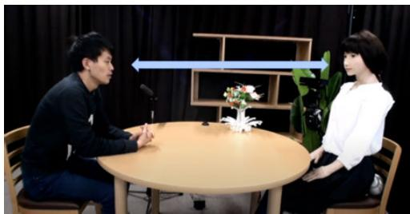  
FIGURE 1. Human (left) and human-like avatar (right) in conversation are depicted. This picture was provided by Kyoto University, Speech and Audio Processing Lab.

recorded by a microphone array without using any prior information [1]. In recent years, BSE has been applied in various fields. For example, it can be applied in human– avatar/robot communication systems, as shown in Fig. 1. In practical (i.e., noisy) environments, BSE can reduce listening effort for the avatar’s operator and improve speech recognition performance for the robot. In such application scenarios, it is important for BSE to function in real time for smooth communication. A processing delay of BSE affects all subsequent processes of the system. In this paper, we address the real-time BSE problem where observed signals consist of a single directional target speech and diffuse background noise.

A simple way to realize a real-time BSE method is to extend existing offline methods to function in real time. We previously proposed a state-of-the-art offline BSE method using independent low-rank matrix analysis (ILRMA) [2] and rank-constrained spatial covariance matrix estimation (RCSCME) [3]. ILRMA is one of the state-of-the-art blind source separation (BSS) [4] methods for a (over-)determined case, that is, the number of microphones is greater than or equal to that of sources, and it estimates a time-invariant demixing matrix to separate the observed signals into each source signal. However, when we use ILRMA under a diffuse noise condition, the separated signal corresponding to the target speech contains residual diffuse noise in principle [5]. On the other hand, the other separated signals exclude the target speech accurately [6]. In RCSCME, these properties are utilized to accurately extract the target speech from the observed mixture signals. We illustrate the flow of the speech extraction method based on ILRMA and RCSCME in Fig. 2. Hereafter, we refer to this speech extraction method as the RCSCME-based method. In [3], the number of to-be-estimated parameters in RCSCME is reduced by utilizing the demixing matrix estimated by ILRMA and a fast estimation algorithm is proposed. Therefore, it is suitable for real-time processing. However, ILRMA requires numerous matrix operations and is computationally much costlier than RCSCME. Thus, it is difficult to straightforwardly perform the RCSCME-based method in real time. In the field of BSS, online extensions of independent vector analysis (IVA) [7], [8], [9] have been proposed and are called Online IVA [10], [11]. Online IVA updates the weighted covariance matrix of the observed signals and the demixing matrix in every time frame, and can function in real time. However, since IVA is a BSS method based on linear demixing filters like ILRMA, Online IVA cannot completely suppress the diffuse noise in principle. Thus, its speech extraction performance under diffuse noise conditions is limited.

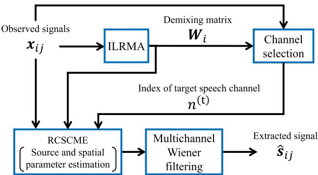  
FIGURE 2. Flow of speech extraction method based on ILRMA and RCSCME.

In this paper, to overcome the above challenge, we propose the real-time extension of the RCSCME-based method in which the blockwise batch algorithm [12], [13] is introduced. Our plan is based on the following facts: the output of ILRMA required in RCSCME is only the time-invariant demixing matrix, resulting in that the entire process can be divided into the ILRMA and RCSCME parts, and unless spatial characteristics (e.g., the position of the target speaker) change suddenly, using the demixing matrix estimated from slightly earlier times will not significantly affect the speech extraction performance of RCSCME. By using the blockwise batch algorithm, we can execute these two parts, the ILRMA and RCSCME parts, in parallel. The ILRMA part can be executed across multiple time frames, whereas the RCSCME part is executed for each frame using the latest demixing matrix. As a result, the proposed method can function in real time.

However, owing to this real-time extension, a new problem arises. Since ILRMA is a fully blind method, we must determine which separated signal obtained by ILRMA corresponds to the target speech. Hereafter, we call this process channel selection. Although channel selection based on the maximum kurtosis criterion [14] is often used in a i l b d h i h d d works well in the offline scenario [3], we experimentally found that it often fails and chooses an incorrect channel in real-time situations. This mischoice significantly degrades the speech extraction performance. To avoid such failures, we utilize spatial prior information and consider replacing the normal ILRMA with the spatially regularized ILRMA [15].

In [15], it is supposed that prior information of all sources is known beforehand. On the other hand, in our supposed scenario (i.e., a single target speaker talks under a diffuse noise condition), we can use only the prior information about the target speech direction. Thus, we cannot use the regularizer used in [15]. To utilize the spatially regularized ILRMA in this situation, we design a new spatial regularizer that matches this situation and derive a parameter estimation algorithm based on vectorwise coordinate descent (VCD) [15], [16]. Unfortunately, VCD is computationally more expensive than iterative projection (IP) [9] used in the normal ILRMA. To apply IP instead of VCD and reduce the computational cost, we modify the regularizer and also derive a parameter estimation algorithm for ILRMA with the new regularizer.

In addition, for the wide application of the proposed method, it should also be performed in real time on computationally weak devices. However, VCD/IP used in the ILRMA part involves numerous matrix operations, which limits devices capable of real-time processing. Furthermore, it is necessary to numerically stabilize the proposed method to prevent errors caused by various acoustic environments. Thus, we propose computationally fast and stable algorithms for VCD/IP, which are analytically equivalent to conventional ones.

Experiments were conducted in the following order. First, we confirmed the effectiveness of our proposed algorithm for VCD through experiments using real-world-simulated speech signals and a toy model. On the basis of the obtained results, we then verified the real-time capability of our proposed RCSCME-based speech extraction method with faster VCD/IP on a CPU. In addition, we demonstrated that our proposed method achieves superior speech extraction performance compared with conventional methods. We also verified that using spatial prior information further improves the speech extraction performance, and one of our proposed regularizers excels in terms of both speech extraction performance and processing time. Then, we confirmed that our proposed real-time speech extraction method can operate on computationally weak devices. We lastly demonstrated the robustness of our proposed methods to errors in the prior direction of the target speech.

This paper is an extended full-paper version of our earlier work [17] and is supplemented by several contributions as follows.

• We derived fast and numerically stable algorithms for VCD/IP, as described in Section IV. We verified the effectiveness of our proposed algorithm for VCD on CPU computation in terms of processing time and numerical stability through experiments using a real-world-simulated speech signal and a toy model, respectively.

• We compared the proposed RCSCME-based speech extraction method with conventional methods using a CPU and confirmed the effectiveness of our method in terms of speech extraction performance under diffuse noise conditions.

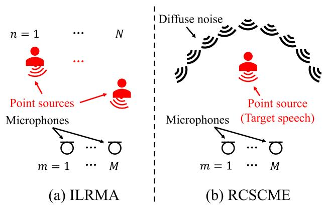  
FIGURE 3. Schematics of supposed situation in ILRMA (left) and RCSCME (right).

• We conducted additional experiments using a CPU or NVIDIA Jetson devices, which are computationally weaker than the NVIDIA RTX-4090 GPU used in our earlier work. From the results of the experiments, we confirmed that the proposed realtime RCSCME-based speech extraction method with fast and numerically stable VCD/IP can function in real time even when we use computationally weak devices.

• We experimentally demonstrated the robustness of the proposed method to errors in the prior direction of the target speech.

The rest of this paper is organized as follows. In Section II, we review related offline works, ILRMA and RCSCME. In Section III, we show the basic framework of our proposed real-time RCSCME-based speech extraction method and its extensions using spatial regularizers to improve the speech extraction performance. For acceleration and numerical stabilization, in Section IV, we present new algorithms for VCD/IP and provide a derivation of the proposed VCD algorithm. In Section V, we first confirm the effectiveness of the proposed VCD algorithm. Then, we experimentally demonstrate that our proposed real-time method with the proposed VCD/IP algorithms can function on computationally low resources and achieve higher speech extraction performance than conventional methods, and one of the designed regularizers excels in terms of both speech extraction performance and processing time. Furthermore, we confirm the robustness of the proposed methods to errors in the prior direction of the target speech. Finally, in Section VI, we conclude and summarize the paper.

## II. RELATED OFFLINE METHODS

In this section, we briefly explain the related offline methods, ILRMA [2] and RCSCME [3].

## A. ILRMA

Let $\pmb { x } _ { i j } = ( x _ { i j 1 } , \dots , x _ { i j M } ) ^ { \mathsf { T } } \in \mathbb { C } ^ { M } , s _ { i j } = ( s _ { i j 1 } , \dots , s _ { i j N } ) ^ { \mathsf { T } }$ ∈ $\mathbb { C } ^ { N }$ , and $\mathbf { y } _ { i j } ~ = ~ ( y _ { i j 1 } , \dotsc , y _ { i j N } ) ^ { \mathsf { T } } ~ \in ~ \mathbb { C } ^ { N }$ be the short-time Fourier transforms (STFTs) of the observed, source, and separated signals, respectively. Here, $i \in \{ 1 , \ldots , I \} , $ $\{ 1 , \dotsc , J \} , m \in \{ 1 , \dotsc , M \}$ , and $n ~ \in ~ \{ 1 , \ldots , N \}$ are the indices of the frequency bins, time frames, microphones, and sources, respectively, and $\intercal$ denotes the transpose. In ILRMA, it is assumed that each source is a point source and the room reverberation is sufficiently shorter than the window of an STFT. With these assumptions, instantaneous mixing in the time-frequency domain approximately holds and the observed signal is represented as

$$
\boldsymbol {x} _ {i j} = \boldsymbol {A} _ {i} \boldsymbol {s} _ {i j},\tag{1}
$$

where $\pmb { A } _ { i } = ( \pmb { a } _ { i 1 } , \dots , \pmb { a } _ { i N } ) \in \mathbb { C } ^ { M \times N }$ is the mixing matrix, which represents time-invariant spatial characteristics of the mixing system, and $\pmb { a } _ { i n }$ is the steering vector of the nth source. $\mathrm { I f } M = N$ and $A _ { i }$ is regular, there exists the inverse matrix of the mixing matrix, $\bar { \mathbf { \psi } } _ { \boldsymbol { i } _ { } } ^ { \mathbf { { \bar { \jmath } } } } = ( \pmb { w } _ { i 1 } , \dots { } , \pmb { w } _ { i N } ) ^ { \mathsf { H } } = \pmb { A } _ { i } ^ { - 1 }$ , where H denotes the Hermitian transpose and the matrix W is called the demixing matrix. In ILRMA, by estimating $W _ { i }$ , we can obtain the separated signals as

$$
\mathbf {y} _ {i j} = \boldsymbol {W} _ {i} \mathbf {x} _ {i j}.\tag{2}
$$

Fig. 3(a) shows a schematic of the supposed situation in ILRMA.

In ILRMA, it is assumed that each element of the separated signal $y _ { i j n }$ follows a univariate complex Gaussian distribution whose mean and time-variant variance are zero and $r _ { i j n } \ >$ 0, respectively. The variance $r _ { i j n }$ is modeled by nonnegative matrix factorization (NMF) [18] as

$$
r _ {i j n} = \sum_ {k} t _ {i k n} v _ {k j n},\tag{3}
$$

where $t _ { i k n } ~ \geq ~ 0$ and $\nu _ { k j n } ~ \geq ~ 0$ are NMF variables, and $k \in \{ 1 , \ldots , K \}$ is an index of the NMF bases. Thus, the cost function ${ \mathcal { T } } _ { \mathrm { I L R M A } }$ is given as a scaled negative log-likelihood of the observed signals as follows:

$$
\begin{array}{c} \mathcal {T} _ {\text {ILRMA}} = \frac {1}{J} \sum_ {i, j, n} \left(\frac {| \boldsymbol {w} _ {i n} ^ {\mathsf {H}} \boldsymbol {x} _ {i j} | ^ {2}}{\sum_ {k} t _ {i k n} v _ {k j n}} + \log \sum_ {k} t _ {i k n} v _ {k j n}\right) \\ - \sum_ {i} \log | \det \boldsymbol {W} _ {i} | ^ {2} + \text {const.}, \end{array}\tag{4}
$$

where const. denotes a term independent of $w _ { i n } , \ t _ { i k n }$ , and $\nu _ { k j n }$ . The cost function ${ \mathcal { T } } _ { \mathrm { I L R M A } }$ is minimized by iteratively updating the demixing matrix $W _ { i }$ and the NMF variables $t _ { i k n }$ and $\nu _ { k j n }$ . For convenient notations, we define additional matrices, $\begin{array} { r } { \stackrel { \triangledown } { X } _ { i } \in \mathbb { C } ^ { M \times J } , Y _ { i } \in \mathbb { C } ^ { N \times J } , { \pmb T } _ { n } \in \mathbb { R } _ { \ge 0 } ^ { I \times K } , { \pmb V } _ { n } \in \mathbb { R } _ { \ge 0 } ^ { K \times J } , } \end{array}$ and $\pmb { R } _ { n } \in \mathbb { R } _ { \geq 0 } ^ { I \times J }$ , as

$$
\boldsymbol {X} _ {i} := (\boldsymbol {x} _ {i 1}, \dots , \boldsymbol {x} _ {i J}),\tag{5}
$$

$$
\boldsymbol {Y} _ {i} := (\boldsymbol {y} _ {i 1}, \dots , \boldsymbol {y} _ {i J}),\tag{6}
$$

$$
[ \boldsymbol {T} _ {n} ] _ {i, k} := t _ {i k n},\tag{7}
$$

Algorithm 1 Update Rule of NMF Variables
1: function NMF ( $T_{n}, V_{n}, Y_{i} (\forall i)$ )
2: Set  $\breve{Y}_{n} \in C^{I \times J}$  as  $[\breve{Y}_{n}]_{i,j} \leftarrow [Y_{i}]_{n,j} (\forall i,j)$ 
3:  $R_{n} \leftarrow T_{n} V_{n}$ 
4:  $T_{n} \leftarrow T_{n} \odot \left| \{(|\breve{Y}_{n}|^{-2} \odot |R_{n}|^{-2}) V_{n}^{\top}\} \oslash \{|R_{n}|^{-1} V_{n}^{\top}\} \right|^{\cdot \frac{1}{2}}$ 
5:  $R_{n} \leftarrow T_{n} V_{n}$ 
6:  $V_{n} \leftarrow V_{n} \odot \left| \{T_{n}^{\top}(|\breve{Y}_{n}|^{-2} \odot |R_{n}|^{-2})\} \oslash \{T_{n}^{\top} |R_{n}|^{-1}\} \right|^{\cdot \frac{1}{2}}$ 
7: return  $T_{n}, V_{n}$ 
8: end function

$$
[ V _ {n} ] _ {k, j} := v _ {k j n},
$$

$$
[ \boldsymbol {R} _ {n} ] _ {i, j} := r _ {i j n},\tag{8}
$$

(9)

where $[ \cdot ] _ { i , j }$ is the (i,j)th element of the matrix. In addition, the upper right script (l) indicates the parameters updated the lth time. Each element of the NMF variables $\pmb { T } _ { n } ^ { ( l ) }$ and $V _ { n } ^ { ( l ) }$ is updated on the basis of the majorizationminimization algorithm [19], and the update rules are given in [20] as

$$
t _ {i k n} ^ {(l)} = t _ {i k n} ^ {(l - 1)} \sqrt {\frac {\sum_ {j} | y _ {i j n} ^ {(l - 1)} | ^ {2} v _ {k j n} ^ {(l - 1)} \big (\sum_ {k ^ {\prime}} t _ {i k ^ {\prime} n} ^ {(l - 1)} v _ {k ^ {\prime} j n} ^ {(l - 1)} \big) ^ {- 2}}{\sum_ {j} v _ {k j n} ^ {(l - 1)} \big (\sum_ {k ^ {\prime}} t _ {i k ^ {\prime} n} ^ {(l - 1)} v _ {k ^ {\prime} j n} ^ {(l - 1)} \big) ^ {- 1}}},\tag{10}
$$

$$
v _ {k j n} ^ {(l)} = v _ {k j n} ^ {(l - 1)} \sqrt {\frac {\sum_ {i} | y _ {i j n} ^ {(l - 1)} | ^ {2} t _ {i k n} ^ {(l)} \big (\sum_ {k ^ {\prime}} t _ {i k ^ {\prime} n} ^ {(l)} v _ {k ^ {\prime} j n} ^ {(l - 1)} \big) ^ {- 2}}{\sum_ {i} t _ {i k n} ^ {(l)} \big (\sum_ {k ^ {\prime}} t _ {i k ^ {\prime} n} ^ {(l)} v _ {k ^ {\prime} j n} ^ {(l - 1)} \big) ^ {- 1}}}.\tag{11}
$$

A pseudocode for updating NMF variables is shown as Algorithm 1, where $| \cdot | ^ { . q }$ for matrices denotes the elementwise absolute and qth-power operations, and ⊙ and ⊘ represent the elementwise multiplication and division for two samedimensional matrices, respectively. Here, in the pseudocode, we remove $( l )$ to represent variable-overwrite. The demixing matrix $W _ { i }$ is updated by IP [9] as follows:

$$
\pmb {D} _ {i n} ^ {(l)} = \frac {1}{J} \sum_ {j} \frac {\pmb {x} _ {i j} \pmb {x} _ {i j} ^ {\mathsf {H}}}{r _ {i j n} ^ {(l - 1)}},\tag{12}
$$

$$
\boldsymbol {b} _ {i n} ^ {(l)} = \left(\boldsymbol {W} _ {i} ^ {(l - 1)} \boldsymbol {D} _ {i n} ^ {(l)}\right) ^ {- 1} \boldsymbol {e} _ {n},\tag{13}
$$

$$
\boldsymbol {w} _ {i n} ^ {(l)} = \frac {\boldsymbol {b} _ {i n} ^ {(l)}}{\sqrt {\left(\boldsymbol {b} _ {i n} ^ {(l)}\right) ^ {\mathsf {H}} \boldsymbol {D} _ {i n} ^ {(l)} \boldsymbol {b} _ {i n} ^ {(l)}}},\tag{14}
$$

where $\boldsymbol { e } _ { n } \in \mathbb { R } ^ { N }$ is a one-hot vector whose nth element is one and the others are zero, $\begin{array} { r } { r _ { i j n } ^ { ( l - 1 ) } = \sum _ { k } t _ { i k n } ^ { ( l - 1 ) } \nu _ { k j n } ^ { ( l - 1 ) } } \end{array}$ , and $w _ { i n ^ { \prime } } ^ { ( l ) } =$ $\pmb { w } _ { i n ^ { \prime } } ^ { ( l - 1 ) } ( n ^ { \prime } \neq n )$

We now discuss the calculation of ${ x _ { i j } } { x _ { i j } ^ { \mathrm { H } } } / r _ { i j n } ^ { ( l - 1 ) }$ in (12). Two approaches can be considered for this calculation: (i) calculate $\pmb { x } _ { i j } \pmb { x } _ { i j } ^ { \sf H }$ first and then divide it by $r _ { i j n } ^ { ( l - 1 ) }$ , or (ii) calculate $x _ { i j } / r _ { i j n } ^ { ( l - 1 ) }$ first and then multiply it by $\boldsymbol { x } _ { i j } ^ { \mathsf { H } }$ from the right side. By simply counting the number of scalar arithmetic operations, we find that method (i) requires $2 N ^ { 2 }$ operations, whereas method (ii) requires $N \ + \ N ^ { 2 }$ operations. Thus, method (ii) is computationally more efficient than method (i). Furthermore, computing (12) using method (ii) is computationally equivalent to the following computations:

Algorithm 2 Update Rule of ILRMA With IP
1: function ILRMA ( $X_{i}$  ( $\forall i$ ))
2: Initialize  $W_{i}$  ( $\forall i$ ),  $T_{n}$ ,  $V_{n}$  ( $\forall n$ )
3:  $Y_{i} \leftarrow W_{i}X_{i}$  ( $\forall i$ )
4: for  $\iota = 1$  to max_iteration do
5:    for n = 1 to N do
6:    $T_{n}, V_{n} \leftarrow \text{NMF}(T_{n}, V_{n}, Y_{i} (\forall i))$ 
7:    $R_{n} \leftarrow T_{n}V_{n}$ 
8:    for i = 1 to I do
9:    $\check{X}_{in} \leftarrow (x_{i1}/r_{i1n}, \ldots, x_{iJ}/r_{iJn})$ 
10:    $D_{in} \leftarrow \check{X}_{in}X_{i}^{\mathsf{H}}/J$ 
11:    $b_{in} \leftarrow (W_{i}D_{in})^{-1}e_{n}$ 
12:    nth row of  $W_{i} \leftarrow b_{in}^{\mathsf{H}}/\sqrt{b_{in}^{\mathsf{H}}D_{in}b_{in}}$ 
13:    end for
14:    end for
15:    $Y_{i} \leftarrow W_{i}X_{i}$  ( $\forall i$ )
16:    end for
17:    return  $W_{i}$  ( $\forall i$ )
18: end function

$$
\breve {\boldsymbol {X}} _ {i n} ^ {(l)} = \left(\frac {\boldsymbol {x} _ {i 1}}{r _ {i 1 n} ^ {(l - 1)}}, \dots , \frac {\boldsymbol {x} _ {i J}}{r _ {i J n} ^ {(l - 1)}}\right),\tag{15}
$$

$$
\pmb {D} _ {i n} ^ {(l)} = \frac {1}{J} \breve {\pmb {X}} _ {i n} ^ {(l)} \pmb {X} _ {i} ^ {\mathsf {H}}.\tag{16}
$$

For these reasons, we replace (12) with (15) and (16). The entire algorithm for ILRMA is shown as Algorithm 2. The update of each variable guarantees the monotonically nonincreasing property of the cost function.

In ILRMA, the scale of $y _ { i j n }$ can vary across the frequency bins [2]. To fix the scales of $y _ { i j n }$ among the frequency bins, the projection back method [21] is applied to $y _ { i j n }$ after estimating $W _ { i }$

## B. RCSCME

RCSCME assumes a situation where a single (point-source) target speaker exists in a diffuse-noise environment, which is different from that assumed in ILRMA. Fig. 3(b) shows a schematic of the supposed situation in RCSCME. If we apply ILRMA to the mixture signals recorded in such a situation with an M-channel microphone array, one separated signal corresponding to the target speech cannot completely exclude diffuse noise in principle [6]. On the other hand, the other $M \ - \ 1$ separated signals contain only diffuse noise and exclude the target speech with high accuracy [5]. RCSCME utilizes this property of the separated signal and accurately extracts the target speech.

In RCSCME, the observed signal $\boldsymbol { x } _ { i j }$ is assumed to follow a multivariate complex Gaussian distribution1 as

$$
p \left(\boldsymbol {x} _ {i j}; \mathbf {0} _ {M}, \mathcal {R} _ {i j} ^ {(x)}\right) = \frac {1}{\pi^ {M} \det \mathcal {R} _ {i j} ^ {(x)}} \exp \left(- \boldsymbol {x} _ {i j} ^ {\mathrm{H}} \left(\mathcal {R} _ {i j} ^ {(x)}\right) ^ {- 1} \boldsymbol {x} _ {i j}\right),\tag{17}
$$

where $\mathbf { 0 } _ { M } \in \mathbb { C } ^ { M }$ is the M-dimensional zero vector and $\mathcal { R } _ { i j } ^ { ( \mathrm { x } ) } \in$ $\mathbb { C } ^ { M \times M }$ is the covariance matrix of the observed signal. ${ \bf \dot { \mathcal { R } } } _ { i j } ^ { ( \mathrm { x } ) }$ is modeled by the time-varying weighted sum of the spatial covariance matrices (SCMs) of the directional target speech and diffuse noise as

$$
\mathcal {R} _ {i j} ^ {\mathrm{(x)}} = r _ {i j} ^ {\mathrm{(t)}} \boldsymbol {a} _ {i} ^ {\mathrm{(t)}} \big (\boldsymbol {a} _ {i} ^ {\mathrm{(t)}} \big) ^ {\mathsf {H}} + r _ {i j} ^ {\mathrm{(n)}} \mathcal {R} _ {i} ^ {\mathrm{(n)}},\tag{18}
$$

where $r _ { i j } ^ { \left( \mathrm { t } \right) } > 0$ and $r _ { i j } ^ { ( \mathrm { n } ) } > 0$ are the time-varying variances of the directional target speech and diffuse noise, respectively, $\pmb { a } _ { i } ^ { ( \mathrm { t } ) } \in \mathbb { C } ^ { M }$ is the time-invariant steering vector for the target speech, and $\mathcal { R } _ { i } ^ { ( \mathrm { n } ) }$ is the time-invariant full-rank SCM of the diffuse noise. Here, ${ \pmb a } _ { i } ^ { ( \mathrm { t } ) } \big ( { \pmb a } _ { i } ^ { ( \mathrm { t } ) } \big ) ^ { \sf H }$ represents the time-invariant rank-1 SCM of the directional target speech. To induce sparsity, we introduce the inverse gamma distribution for a prior distribution of $r _ { i j } ^ { \left( \mathrm { t } \right) }$ as

$$
p (r _ {i j} ^ {\mathrm{(t)}}; \alpha , \beta) = \frac {\beta^ {\alpha}}{\Gamma (\alpha)} \Big (r _ {i j} ^ {\mathrm{(t)}} \Big) ^ {- \alpha - 1} \exp \left(- \frac {\beta}{r _ {i j} ^ {\mathrm{(t)}}}\right),\tag{19}
$$

where $\alpha > 0$ and $\beta > 0$ are the shape and scale parameters of the inverse gamma distribution, respectively, and 0(·) denotes the gamma function. For the time-invariant parameters ${ \pmb a } _ { i } ^ { ( \mathrm { t } ) }$ and ${ \mathcal { R } } _ { i } ^ { ( \mathrm { n } ) }$ , RCSCME utilizes the demixing matrix estimated by ILRMA, $W _ { i } .$ , and the channel index corresponding to the target speech, $n ^ { ( \mathrm { t } ) }$ . That is, $\pmb { a } _ { i } ^ { ( \mathrm { t } ) }$ is obtained as the $n ^ { ( \mathrm { t } ) }$ th column vector of $\boldsymbol { W } _ { i } ^ { - 1 }$ . For $\mathcal { R } _ { i } ^ { ( \mathrm { n } ) }$ , since ILRMA can accurately estimate diffuse noise in $M \mathrm { ~ - ~ } 1$ separated signals, ${ \mathcal { R } } _ { i } ^ { ( \mathrm { n } ) }$ is modeled by a full-rank matrix as

$$
\mathcal {R} _ {i} ^ {\mathrm{(n)}} = \mathcal {R} _ {i} ^ {\prime \mathrm{(n)}} + \lambda_ {i} z _ {i} z _ {i} ^ {\sf H},\tag{20}
$$

$$
\mathcal {R} _ {i} ^ {\prime (\mathrm{n})} = \frac {1}{J} \sum_ {j} \hat {\pmb {u}} _ {i j} \hat {\pmb {u}} _ {i j} ^ {\sf H},\tag{21}
$$

$$
\begin{array}{r} \hat {\boldsymbol {u}} _ {i j} = \boldsymbol {W} _ {i} ^ {- 1} \big (\boldsymbol {w} _ {i 1} ^ {\mathsf {H}} \boldsymbol {x} _ {i j}, \ldots , \boldsymbol {w} _ {i (n ^ {(\mathrm{t})} - 1)} ^ {\mathsf {H}} \boldsymbol {x} _ {i j}, 0, \\ \boldsymbol {w} _ {i (n ^ {(\mathrm{t})} + 1)} ^ {\mathsf {H}} \boldsymbol {x} _ {i j}, \ldots , \boldsymbol {w} _ {i M} ^ {\mathsf {H}} \boldsymbol {x} _ {i j} \big) ^ {\mathsf {T}}, \end{array}\tag{22}
$$

where $\mathcal { R } _ { i } ^ { \prime ^ { ( n ) } } \in \mathbb { C } ^ { M \times M }$ is the rank-(M − 1) component of the diffuse noise SCM, $z _ { i } \in \mathbb { C } ^ { M }$ is a vector that is linearly independent of each column vector of $\mathcal { R } _ { i } ^ { \prime { ( \mathrm { n } ) } } , \lambda _ { i }$ is a scalar variable, and $\hat { \pmb { u } } _ { i j } \in \mathbb { C } ^ { M }$ is the source image of diffuse noise excluding the $n ^ { ( \mathrm { t } ) } { \mathrm { t } }$ h channel. Here, $z _ { i } z _ { i } ^ { \mathsf { H } }$ is a rank-1 matrix that complements the deficient rank-1 component of ${ \mathcal R } _ { i } ^ { ( \mathrm { n } ) }$ and $\lambda _ { i }$ is its weight. z is set to, for example, $\pmb { a } _ { i } ^ { ( \mathrm { t } ) }$ or a unit eigenvector corresponding to zero eigenvalue of $\mathcal { R } _ { i } ^ { \prime { ( \mathrm { n } ) } }$ . Note that since ILRMA is a fully blind method and it is uncertain which of the demixing filters, which are the row vectors of the demixing matrix, $\{ w _ { i n } \} _ { n = 1 , \dots , N }$ estimated by ILRMA corresponds to the target speech, we should determine the channel index corresponding to the target speech, $n ^ { ( \mathrm { t } ) }$ , by some means. In [3], for example, the maximum kurtosis criterion [14], which functions well in the offline scenario, was used.

In RCSCME, the parameters calculated from the estimates of ILRMA $( \mathrm { i . e . , } \ a _ { i } ^ { ( \mathrm { t } ) } , \ \mathcal { R } _ { i } ^ { \prime ( \mathrm { n } ) }$ , and $z _ { i } )$ are fixed, and the tobe-estimated parameters are $r _ { i j } ^ { \left( \mathrm { t } \right) } , \ r _ { i j } ^ { \left( \mathrm { n } \right) }$ , and $\lambda _ { i } .$ . To estimate these parameters on the basis of maximum a posteriori, the cost function TRCSCME is given as the following negative log-posterior of the observed signals with the prior distribution of $r _ { i j } ^ { \left( \mathrm { t } \right) }$ :

$$
\begin{array}{c} \mathcal {T} _ {\mathrm{RCSCME}} = \sum_ {i, j} \left[ \boldsymbol {x} _ {i j} ^ {\mathrm{H}} \left(\mathcal {R} _ {i j} ^ {(\mathrm{x})}\right) ^ {- 1} \boldsymbol {x} _ {i j} + \log \det \mathcal {R} _ {i j} ^ {(\mathrm{x})} \right. \\ \left. + (\alpha + 1) \log r _ {i j} ^ {(\mathrm{t})} + \frac {\beta}{r _ {i j} ^ {(\mathrm{t})}} \right] + \text { const. }, \end{array}\tag{23}
$$

where const. denotes a term independent of $r _ { i j } ^ { ( \mathrm { t } ) } , r _ { i j } ^ { ( \mathrm { n } ) }$ , and $\lambda _ { i }$ .

The update rule of the objective variables $r _ { i j } ^ { ( \mathrm { t } ) } , \ r _ { i j } ^ { ( \mathrm { n } ) }$ , and $\lambda _ { i }$ is derived on the basis of the majorization-equalization algorithm [22] in [3] as follows:

$$
r _ {i j} ^ {\mathrm{(t)}} \leftarrow r _ {i j} ^ {\mathrm{(t)}} \binom{\frac {\sigma_ {i j}}{\left(\lambda_ {i} r _ {i j} ^ {\mathrm{(n)}} + r _ {i j} ^ {\mathrm{(t)}}\right) ^ {2}} + \frac {\beta}{\left(r _ {i j} ^ {\mathrm{(t)}}\right) ^ {2}}}{\frac {1}{\lambda_ {i} r _ {i j} ^ {\mathrm{(n)}} + r _ {i j} ^ {\mathrm{(t)}}} + \frac {\alpha + 1}{r _ {i j} ^ {\mathrm{(t)}}}},\tag{24}
$$

$$
r _ {i j} ^ {\mathrm{(n)}} \leftarrow r _ {i j} ^ {\mathrm{(n)}} \left(\frac {\kappa_ {i j} + \sigma_ {i j} \frac {\lambda_ {i} \left(r _ {i j} ^ {\mathrm{(t)}}\right) ^ {2}}{\left(\lambda_ {i} r _ {i j} ^ {\mathrm{(n)}} + r _ {i j} ^ {\mathrm{(t)}}\right) ^ {2}}}{r _ {i j} ^ {\mathrm{(n)}} \left((M - 1) + \frac {\lambda_ {i} r _ {i j} ^ {\mathrm{(n)}}}{\lambda_ {i} r _ {i j} ^ {\mathrm{(n)}} + r _ {i j} ^ {\mathrm{(t)}}}\right)}\right),\tag{25}
$$

$$
\lambda_ {i} \leftarrow \lambda_ {i} \binom{\sum_ {j} \frac {r _ {i j} ^ {\mathrm{(n)}} \sigma_ {i j}}{\left(\lambda_ {i} r _ {i j} ^ {\mathrm{(n)}} + r _ {i j} ^ {\mathrm{(t)}}\right) ^ {2}}}{\sum_ {j} \frac {r _ {i j} ^ {\mathrm{(n)}}}{\lambda_ {i} r _ {i j} ^ {\mathrm{(n)}} + r _ {i j} ^ {\mathrm{(t)}}}},\tag{26}
$$

where $z _ { i }$ is set to be $\pmb { a } _ { i } ^ { ( \mathrm { t } ) }$ for simplicity, and $\kappa _ { i j }$ and $\sigma _ { i j }$ are defined as

$$
\kappa_ {i j} = \pmb {x} _ {i j} ^ {\mathsf {H}} \breve {\mathcal {R}} _ {i} ^ {(\mathrm{n})} \pmb {x} _ {i j},\tag{27}
$$

$$
\sigma_ {i j} = \left| \pmb {w} _ {i n ^ {\mathrm{(t)}}} ^ {\mathsf {H}} \pmb {x} _ {i j} \right| ^ {2}.\tag{28}
$$

Here, $\breve { \mathcal { R } } _ { i } ^ { ( \mathrm { n } ) } \in \mathbb { C } ^ { M \times M }$ is represented as

$$
\check {\mathcal {R}} _ {i} ^ {(\mathrm{n})} = \left(\boldsymbol {E} _ {M} - \boldsymbol {w} _ {i n ^ {(\mathrm{t})}} \left(\boldsymbol {a} _ {i} ^ {(\mathrm{t})}\right) ^ {\mathsf {H}}\right) \left(\mathcal {R} _ {i} ^ {\prime^ {(\mathrm{n})}}\right) ^ {+} \left(\boldsymbol {E} _ {M} - \boldsymbol {a} _ {i} ^ {(\mathrm{t})} \boldsymbol {w} _ {i n ^ {(\mathrm{t})}} ^ {\mathsf {H}}\right).\tag{29}
$$

The operator $^ +$ for matrices denotes the Moore–Penrose inverse. Note that the parameters κ , $\sigma _ { i j }$ , and $\breve { \mathscr R } _ { i } ^ { ( \mathrm { n } ) }$ are constant during iteration; therefore, they should be calculated only once at the initialization and can be treated as constants throughout the iterative updates.

To stabilize the performance, we initialize the objective variables $r _ { i j } ^ { ( \mathrm { t } ) } , r _ { i j } ^ { ( \mathrm { n } ) }$ , and $\lambda _ { i }$ as

$$
r _ {i j} ^ {\mathrm{(t)}} = \left| \pmb {w} _ {i n ^ {\mathrm{(t)}}} ^ {\mathsf {H}} \pmb {x} _ {i j} \right| ^ {2},\tag{30}
$$

$$
r _ {i j} ^ {\mathrm{(n)}} = \frac {1}{M} \hat {\pmb {u}} _ {i j} ^ {\mathsf {H}} \big (\mathcal {R} _ {i} ^ {\prime^ {\mathrm{(n)}}} \big) ^ {+} \hat {\pmb {u}} _ {i j},\tag{31}
$$

$$
\lambda_ {i} = \varpi \frac {\mathrm{trace} (\mathcal {R} _ {i} ^ {\prime^ {(n)}})}{M},\tag{32}
$$

where $\varpi$ is a scalar value and trace(·) for matrices denotes the trace operator. Note that in [3], $\lambda _ { i }$ is initialized as the minimum nonzero eigenvalue of $\mathcal { R } _ { i } ^ { \prime ^ { ( \mathrm { n } ) } }$ . However, the computation of the minimum nonzero eigenvalue necessitates eigenvalue decomposition, which is computationally costly. To reduce this computational cost, we use the average of the eigenvalues, which is equal to the trace of the matrix divided by the dimension of the matrix. In addition, we introduce the hyperparameter $\varpi$ to improve the speech extraction performance.

After the above parameter estimation, the source image of the directional target speech is extracted using a multichannel Wiener filter as follows:

$$
\begin{array}{r} \hat {\boldsymbol {s}} _ {i j} = r _ {i j} ^ {(t)} \boldsymbol {a} _ {i} ^ {(t)} (\boldsymbol {a} _ {i} ^ {(t)}) ^ {\mathsf {H}} (\mathcal {R} _ {i j} ^ {(x)}) ^ {- 1} \boldsymbol {x} _ {i j} \\ = \frac {r _ {i j} ^ {(t)}}{r _ {i j} ^ {(t)} + \lambda_ {i} r _ {i j} ^ {(n)}} \boldsymbol {a} _ {i} ^ {(t)} \boldsymbol {w} _ {i n ^ {(t)}} ^ {\mathsf {H}} \boldsymbol {x} _ {i j}. \end{array}\tag{33}
$$

By performing matrix operations collectively in the initialization step, RCSCME can execute iterative updates using only scalar operations, resulting in a short computation time per iteration. Additionally, it has also been reported in [3] that the number of iterations required to achieve sufficient speech enhancement performance is small. Therefore, the entire process of RCSCME is fast. It has also been reported in [3] that RCSCME achieves high speech enhancement performance.

## IIL. PROPOSED REAL-TIME FRAMEWORK

In this section, we describe the proposed real-time speech extraction framework and its extension using spatial prior information. In Section III-A, we show the basic framework that does not use any prior information, i.e., under blind conditions. In Section III-B, we discuss a new problem due to the real-time scenario and a strategy to incorporate the spatial prior information into ILRMA. However, the prior information required in a conventional method is unavailable in our application scenario. Therefore, in Section III-C, we propose a regularizer applicable to our situation, and in Section III-D, we further propose another regularizer to reduce computational cost.

## A. REAL-TIME RCSCME-BASED SPEECH EXTRACTION METHOD

A naive approach to performing real-time speech extraction using the RCSCME-based method is to complete the entire process within the shift length of the STFT for each time frame. That is, both ILRMA and RCSCME need to be carried out within a brief time interval. As explained in Section II-B, since the processing of RCSCME is computationally so inexpensive that it can function in real time on modern computers, it fits the frame-by-frame processing. In contrast, ILRMA involves numerous matrix operations and needs a sufficient number of iterations to achieve adequate performance; thus, executing ILRMA within the shift length of the STFT requires excessively high computational resources.

To perform the RCSCME-based method in real time, we focus on the fact that the ILRMA output required in RCSCME is only the demixing matrix $W _ { i }$ , which is a time-invariant parameter related to the spatial characteristics of the mixing system. Consequently, we decompose the RCSCME-based method into the ILRMA and RCSCME parts. If there are no abrupt changes in spatial characteristics (e.g., sudden large movements of the target speaker or microphone positions), the estimated $W _ { i }$ is likely to remain similar across time frames. With this consideration, we can expect that using $W _ { i }$ estimated from slightly previous time frames does not worsen the separation performance considerably. Thus, we execute the ILRMA part in parallel to the RCSCME part by introducing the blockwise batch algorithm [12], [13]. This algorithm repeats a cycle of storing the observed signals for a specified duration and then processing them at constant intervals. Fig. 4 depicts a schematic figure of the proposed real-time speech extraction framework. In the ILRMA part, the demixing matrix $W _ { i }$ and the channel index corresponding to the target speech $n ^ { ( \mathrm { t } ) }$ are estimated from the latest $\tau _ { \mathrm { 1 ^ { - S - l o n g } } }$ (stored) observed signals every $\tau _ { 3 }$ ms. The computation of these processes can span multiple time frames. In parallel, the RCSCME part is executed in the shift length interval, $\tau _ { 4 }$ ms, using the latest $\tau _ { 2 ^ { - } }$ s-long observed signals and the latest $W _ { i }$ and $n ^ { \mathrm { ( t ) } }$ estimated by the ILRMA part. Thanks to this parallelization, the ILRMA part is not required to function within the shift length, which enables the real-time execution of the proposed method in practical computational resources.

## B. UTILIZING PRIOR SPEECH DIRECTION INFORMATION

Although we have thus far discussed the real-time operation of the proposed method, a new problem for channel selection was found through some preliminary experiments. In these experiments, we used the maximum kurtosis criterion, which can be successfully used in an offline scenario, for channel selection. However, in a real-time scenario, since we use only the τ -s-long interval of the observed signals, it is not guaranteed to contain sufficient target speech in this interval. When the $\tau _ { \mathrm { 1 ^ { - S - l o n g } } }$ observed signals do not contain sufficient target speech, we cannot calculate the kurtosis of the target speech with sufficiently high accuracy, which results in the wrong choice of the channel index corresponding to the target speech. We refer to the incorrect selection of the target channel index as channel selection error. Fig. 5 shows spectrograms of the observed signal and the separated signal estimated by the ILRMA part whose channel selection is based on the maximum kurtosis criterion in the realtime scenario. As observed at around 1–3 s in Fig. 5, the target speech components present in the observed signal are lost in the separated signal. This loss is likely to occur especially when the target speaker starts speaking and the target speech contained within the calculation interval is insufficient. To cope with this issue, we utilize spatial prior information, which is commonly available in human– avatar/robot communication systems.

When the target speaker is talking with the avatar/robot, we can assume that the approximate position of the target speaker relative to the microphone array embedded in the avatar/robot (e.g., the target speaker is positioned in front of the avatar/robot, as shown in Fig. 1) is known beforehand. In addition, we often have prior information about the microphone array embedded in the avatar/robot (e.g., the shape of the microphone array). Thus, we can assume that we know beforehand the shape of the microphone array and the approximate position of the target speaker relative to the microphone array, and obtain the approximate steering vector of the target speech. Here, note that precise steering vectors are unavailable in practice because they can be easily influenced by the physical characteristics of the target speaker, slight differences in the position of the target speaker, and the effects of reverberation. To introduce this prior information, we replace the normal ILRMA with its extended version using spatial regularization [15], which utilizes the prior of the demixing matrix based on the null beamformer. Note that the null beamformer requires steering vectors for all the other sources. However, in our supposed situation where the observed signal consists of the single directional target speech and the diffuse noise, we can use only one steering vector for the target speech. Thus, we design two new regularizers using only one steering vector.

## C. SPATIAL REGULARIZATION USING ONLY PRIOR TARGET STEERING VECTOR

First, to construct a regularizer utilizing the steering vector for the target speech, we temporarily assume that the prior $\hat { A } _ { i } =$ $( \hat { \pmb { a } } _ { i 1 } , \dots , \hat { \pmb { a } } _ { i N } ) \in \mathbb { C } ^ { N \times N }$ corresponding to the mixing matrix $A _ { i } \ ( \mathrm { i . e . }$ , steering vectors for all sources) can be obtained. Here, $n ^ { ( \mathrm { t } ) }$ is set to the source index of the target speech in the prior information. That is, the steering vector for the target speech calculated from the prior information is the $n ^ { \mathrm { ( t ) } } \mathrm { t h }$ column vector of $\hat { A } _ { i } , \hat { \pmb { a } } _ { i n ^ { ( \mathrm { t } ) } }$ . Moreover, we define $\hat { W } _ { i } =$ $( \hat { \pmb w } _ { i 1 } , \dots , \hat { \pmb w } _ { i N } ) ^ { \sf H } : = \hat { \pmb A } _ { i } ^ { - 1 }$ as the prior corresponding to $W _ { i } .$

Although the weighted Euclidean distance between $W _ { i }$ and $\hat { \pmb { W } } _ { i }$ is utilized in [15], for simplicity, we temporally assume all weights to be equal and omit them. Thus, the Euclidean distance between $W _ { i }$ and $\hat { \pmb { W } } _ { i }$ is expressed as

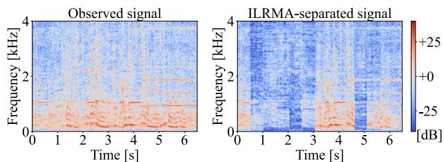

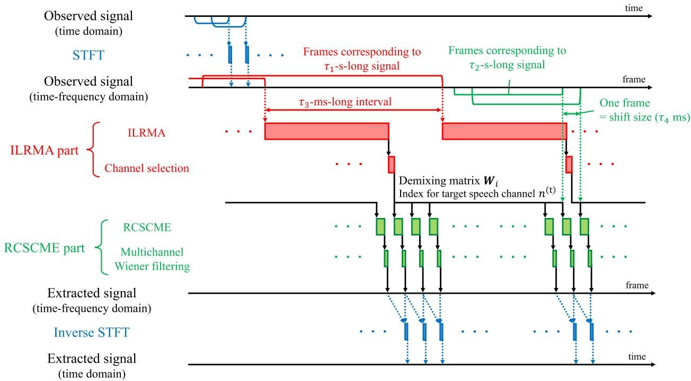  
FIGURE 4. Schematic of parallel processing in real-time RCSCME-based speech extraction method.  
FIGURE 5. Spectrograms of observed signal (left) and ILRMA-separated signal in real-time scenario (right). For channel selection, maximum kurtosis criterion is used.

$$
\sum_ {i} \| \boldsymbol {W} _ {i} - \hat {\boldsymbol {W}} _ {i} \| _ {\mathrm{F}} ^ {2} = \sum_ {i, n} \| \boldsymbol {w} _ {i n} - \hat {\boldsymbol {w}} _ {i n} \| ^ {2}\tag{34}
$$

and added to the cost function of ILRMA, (4), as a regularizer so that $W _ { i }$ approaches $\hat { W } _ { i }$ . Here, $\Vert \cdot \Vert _ { \mathrm { F } }$ and $\| \cdot \|$ denote the Frobenius and Euclidean norms, respectively. In our supposed scenario, since only the steering vector for the target speech is available and the others are unknown, we must determine them as being linearly independent of each other to calculate $\hat { \pmb { W } } _ { i }$ . For example, we can set them to the basis of the orthogonal complementary space of $\hat { \pmb { a } } _ { i n ^ { \mathrm { ( t ) } } }$ . However, using such arbitrarily determined vectors to calculate $\hat { W } _ { i } =$ $\hat { \pmb { A } } _ { i } ^ { - 1 }$ may affect the separation performance. To design a regularizer that uses only the steering vector $\hat { \pmb { a } } _ { i n ^ { \mathrm { ( t ) } } }$ , we first consider using $\hat { A } _ { i }$ as a supervisor instead [23], [24]. (34) can be interpreted as the Mahalanobis distance between $w _ { i n }$ and $\hat { w } _ { i n }$ with the identity matrix as the metric. Here, we consider replacing this metric with $( \hat { \pmb { A } } _ { i } \hat { \pmb { A } } _ { i } ^ { \sf H } ) ^ { - 1 }$ as

$$
\begin{array}{r l} & {\sum_ {i, n} \big (\boldsymbol {w} _ {i n} - \hat {\boldsymbol {w}} _ {i n} \big) ^ {\mathsf {H}} \big (\hat {\boldsymbol {A}} _ {i} \hat {\boldsymbol {A}} _ {i} ^ {\mathsf {H}} \big) \big (\boldsymbol {w} _ {i n} - \hat {\boldsymbol {w}} _ {i n} \big)} \\ & {= \sum_ {i} \| \boldsymbol {W} _ {i} \hat {\boldsymbol {A}} _ {i} - \boldsymbol {E} _ {N} \| _ {\mathrm{F}} ^ {2}} \\ & {= \sum_ {i, n, n ^ {\prime}} | \boldsymbol {w} _ {i n} ^ {\mathsf {H}} \hat {\boldsymbol {a}} _ {i n ^ {\prime}} - \delta_ {n n ^ {\prime}} | ^ {2},} \end{array}\tag{35}
$$

where $\begin{array} { r } { { \cal E } _ { N } ~ \in ~ \mathbb { C } ^ { N \times N } } \end{array}$ and $\delta _ { n n ^ { \prime } }$ denote the N-dimensional identity matrix and Kronecker’s delta, respectively. We then weight each term of (35) with a weight parameter $\mu _ { i n n ^ { \prime } } \geq 0$ as

$$
\sum_ {i, n, n ^ {\prime}} \mu_ {i n n ^ {\prime}} | \pmb {w} _ {i n} ^ {\mathsf {H}} \hat {\pmb {a}} _ {i n ^ {\prime}} - \delta_ {n n ^ {\prime}} | ^ {2}.\tag{36}
$$

Here, we define the weight parameters individually for each index of the frequency bin i, demixing filter n, and source $n ^ { \prime }$ so that the weight of each term can be adjusted independently. For example, by setting $\mu _ { i n \tilde { n } } \left( \forall i , n \right)$ to a small value, we can relax the regularizer for the n˜th source. Next, to eliminate the effects of $\hat { \pmb { a } } _ { i n } ( n \neq n ^ { \mathrm { ( t ) } } )$ , we remove the terms $\mu _ { i n n ^ { \prime } } | \pmb { w } _ { i n } ^ { \sf H } \hat { \pmb { a } } _ { i n ^ { \prime } } -$ $\delta _ { n n ^ { \prime } } | ^ { 2 } ( n ^ { \prime } \ne n ^ { ( \mathrm { t } ) } )$ from the regularizer (36) by setting $\mu _ { i n n ^ { \prime } } =$ $0 ( n ^ { \prime } \neq n ^ { \mathrm { ( t ) } } )$ , resulting in

$$
\sum_ {i, n} \mu_ {i n n ^ {\mathrm{(t)}}} | \boldsymbol {w} _ {i n} ^ {\mathsf {H}} \hat {\boldsymbol {a}} _ {i n ^ {\mathrm{(t)}}} - \delta_ {n n ^ {\mathrm{(t)}}} | ^ {2}.\tag{37}
$$

We refer to the ILRMA with this spatial regularizer (37) as SR-ILRMA, and the cost function of SR-ILRMA, T ,

is defined as

$$
\mathcal {T} _ {\mathrm{SR}} = \mathcal {T} _ {\mathrm{ILRMA}} + \sum_ {i, n} \mu_ {i n} ^ {(\mathrm{SR})} | \boldsymbol {w} _ {i n} ^ {\mathsf {H}} \hat {\boldsymbol {a}} _ {i n ^ {(\mathrm{t})}} - \delta_ {n n ^ {(\mathrm{t})}} | ^ {2},\tag{38}
$$

where $\mu _ { i n } ^ { ( \mathrm { S R } ) } : = \mu _ { i n n ^ { ( \mathrm { t } ) } } \geq 0$ denotes the relabeled weight parameter of the regularizer. Owing to this spatial regularizer, it is expected that the $n ^ { \mathrm { ( t ) . } }$ th separated signal $y _ { i j n ^ { ( \mathrm { t } ) } } = w _ { i n ^ { ( \mathrm { t } ) } } ^ { \mathsf { H } } { x } _ { i j }$ will correspond to the target speech. Therefore, in the channel selection step, we always choose $n ^ { \left( \mathrm { t } \right) }$ as the target source index.

Since the cost function (38) consists of a linear term of $w _ { i n } ,$ the quadratic term of $w _ { i n } ,$ , and the logarithm of the determinant of $W _ { i } ,$ it cannot be optimized by IP as in ILRMA. In this case, instead of IP, we can apply VCD [16], and the update rule for $w _ { i n }$ is as follows:

$$
\breve {\boldsymbol {X}} _ {i n} ^ {(l)} = \left(\frac {\boldsymbol {x} _ {i 1}}{r _ {i 1 n} ^ {(l - 1)}}, \dots , \frac {\boldsymbol {x} _ {i J}}{r _ {i J n} ^ {(l - 1)}}\right),\tag{39}
$$

$$
\tilde {\pmb {D}} _ {i n} ^ {(l)} = \frac {1}{J} \breve {\pmb {X}} _ {i n} ^ {(l)} \pmb {X} _ {i} ^ {\mathsf {H}} + \mu_ {i n} ^ {(\mathrm{SR})} \hat {\pmb {a}} _ {i n ^ {(\mathrm{t})}} \hat {\pmb {a}} _ {i n ^ {(\mathrm{t})}} ^ {\mathsf {H}},\tag{40}
$$

$$
\pmb {\nu} _ {i n} ^ {(l)} = \left(\pmb {W} _ {i} ^ {(l - 1)} \tilde {\pmb {D}} _ {i n} ^ {(l)}\right) ^ {- 1} \pmb {e} _ {n},\tag{41}
$$

$$
\tilde {\pmb {\nu}} _ {i n} ^ {(l)} = \mu_ {i n} ^ {(\mathrm{SR})} \delta_ {n n ^ {(\mathrm{t})}} \big (\tilde {\pmb {D}} _ {i n} ^ {(l)} \big) ^ {- 1} \hat {\pmb {a}} _ {i n ^ {(\mathrm{t})}},\tag{42}
$$

$$
h _ {i n} ^ {(l)} = \left(\pmb {\nu} _ {i n} ^ {(l)}\right) ^ {\mathsf {H}} \tilde {\pmb {D}} _ {i n} ^ {(l)} \pmb {\nu} _ {i n} ^ {(l)},\tag{43}
$$

$$
\tilde {h} _ {i n} ^ {(l)} = \left(\pmb {\nu} _ {i n} ^ {(l)}\right) ^ {\mathsf {H}} \tilde {\pmb {D}} _ {i n} ^ {(l)} \tilde {\pmb {\nu}} _ {i n} ^ {(l)},\tag{44}
$$

$$
\varphi_ {i n} ^ {(l)} = \left\{ \begin{array}{l l} \frac {1}{\sqrt {h _ {i n} ^ {(l)}}}, & (\text {if} \tilde {h} _ {i n} ^ {(l)} = 0) \\ \frac {\tilde {h} _ {i n} ^ {(l)}}{2 h _ {i n} ^ {(l)}} \left(\sqrt {1 + \frac {4 h _ {i n} ^ {(l)}}{| \tilde {h} _ {i n} ^ {(l)} | ^ {2}}} - 1\right), & (\text {otherwise}) \end{array} \right.\tag{45}
$$

$$
\pmb {w} _ {i n} ^ {(l)} = \varphi_ {i n} ^ {(l)} \pmb {\nu} _ {i n} ^ {(l)} + \tilde {\pmb {\nu}} _ {i n} ^ {(l)},\tag{46}
$$

where $\begin{array} { r } { r _ { i j n } ^ { ( l - 1 ) } = \sum _ { k } t _ { i k n } ^ { ( l - 1 ) } \nu _ { k j n } ^ { ( l - 1 ) } } \end{array}$ and $\pmb { w } _ { i n ^ { \prime } } ^ { ( l ) } = \pmb { w } _ { i n ^ { \prime } } ^ { ( l - 1 ) } \left( n ^ { \prime } \neq n \right)$ Since $\tilde { h } _ { i n } ^ { ( l ) }$ may not be exactly zero owing to numerical errors, the conditional branch in (45) is determined by $\begin{array} { r l } { \big | \tilde { h } _ { i n } ^ { ( l ) } \big | } & { { } < } \end{array}$ ϵ using an appropriate threshold value $\epsilon \mathrm { ~  ~ { ~ \gamma ~ } ~ } > \mathrm { ~  ~ { ~ \theta ~ } ~ }$ in the implementation. For the weight parameter of the regularizer, $\mu _ { i n } ^ { ( \mathrm { { S R } ) } }$ , a method of changing $\mathbf { \chi } _ { \mu _ { i n } } ^ { \mathrm { ( S R ) } }$ in every iteration is often used [15]. We call such a method of changing the weight parameter weight scheduling. Thus, $\mu _ { i n } ^ { \left( \mathrm { S R } \right) }$ can be generally regarded as an iteration-dependent parameter. In this paper, for simplicity, we decompose $\mu _ { i n } ^ { ( \mathrm { S R } ) }$ into a relative weight for each frequency bin and source index, $\bar { \mu } _ { i n } ^ { ( \mathrm { S R } ) } \geq 0 .$ , and a weight scheduler depending on the index of iterations, $\varrho ^ { ( l ) } \ge 0$ , as

$$
\mu_ {i n} ^ {\mathrm{(SR)}} = \varrho^ {(l)} \bar {\mu} _ {i n} ^ {\mathrm{(SR)}}.\tag{47}
$$

For $\varrho ^ { ( l ) }$ , the following examples are often used.

• A constant value independent of iteration

• Linearly decreasing value in iteration [15] The entire algorithm for SR-ILRMA is summarized in Algorithm 3. Here, ∗ denotes the complex conjugate,

Algorithm 3 Update Rule of SR-ILRMA With VCD
1: function SR-ILRMA ( $X_{i}, \hat{a}_{in^{(t)}} (\forall i), \bar{\mu}_{in}^{(\mathrm{SR})} (\forall i, n)$ )
2: Initialize  $W_{i} (\forall i), T_{n}, V_{n} (\forall n)$ 
3:  $\Xi_{in} \leftarrow \bar{\mu}_{in}^{(\mathrm{SR})} \hat{a}_{in^{(t)}} \hat{a}_{in^{(t)}}^{\mathsf{H}} (\forall i, n)$ 
4:  $\xi_{in} \leftarrow \bar{\mu}_{in}^{(\mathrm{SR})} \delta_{nn^{(t)}} \hat{a}_{in^{(t)}} (\forall i, n)$ 
5:  $Y_{i} \leftarrow W_{i} X_{i} (\forall i)$ 
6: for  $\iota = 1$  to max_iteration do
7:  $\varrho \leftarrow \text{Weight\_Scheduler}(\iota)$ 
8: for n = 1 to N do
9:  $T_{n}, V_{n} \leftarrow \text{NMF}(T_{n}, V_{n}, Y_{i} (\forall i))$ 
10:  $R_{n} \leftarrow T_{n} V_{n}$ 
11: for i = 1 to I do
12:  $\check{X}_{in} \leftarrow (x_{i1}/r_{i1n}, \ldots, x_{iJ}/r_{iJn})$ 
13:  $\tilde{D}_{in} \leftarrow \check{X}_{in} X_{i}^{\mathsf{H}} / J + \varrho \Xi_{in}$ 
14:  $v_{in} \leftarrow (W_{i} \tilde{D}_{in})^{-1} e_{n}$ 
15:  $\tilde{v}_{in} \leftarrow \varrho \tilde{D}_{in}^{-1} \xi_{in}$ 
16:  $h_{in} \leftarrow v_{in}^{\mathsf{H}} \tilde{D}_{in} v_{in}$ 
17:  $\tilde{h}_{in} \leftarrow v_{in}^{\mathsf{H}} \tilde{D}_{in} \tilde{v}_{in}$ 
18: if  $|\tilde{h}_{in}| &lt; \epsilon$  then
19:  $\varphi_{in} \leftarrow 1 / \sqrt{h_{in}}$ 
20: else
21:  $\varphi_{in} \leftarrow \left( \sqrt{1 + 4 h_{in}/|\tilde{h}_{in}|^{2}} - 1 \right) \tilde{h}_{in}/(2 h_{in})$ 
22: end if
23: nth row of  $W_{i} \leftarrow \varphi_{in}^{*} v_{in}^{\mathsf{H}} + \tilde{v}_{in}^{\mathsf{H}}$ 
24: end for
25: end for
26:  $Y_{i} \leftarrow W_{i} X_{i} (\forall i)$ 
27: end for
28: return  $W_{i} (\forall i)$ 
29: end function

Weight\_Scheduler(·) is a function representing the weight scheduling of $\varrho ^ { ( l ) }$ , and we additionally define $\Xi _ { i n }$ and $\pmb { \xi } _ { i n }$ for convenient notations in Section IV. When we use a constant value in weight scheduling, it is guaranteed that the update of each variable monotonically nonincreases the cost function.

## D. ILRMA WITH NULL-BASED SPATIAL REGULARIZATION

In Section III-C, owing to the existence of the linear term of $w _ { i n } .$ , we cannot use IP for updating $w _ { i n } ;$ therefore, we apply the VCD described in (39)–(46). However, since VCD is computationally costlier than IP, it may prevent the proposed framework described in Section III-A from functioning in real time under limited computational resources. To reduce the computational cost, we modify the regularizer (37) to enable the use of IP.

Then, we design another regularizer by removing the term that satisfies $\delta _ { n n ^ { ( \mathrm { t } ) } } = 1$ in (37), which causes the linear term. This regularizer can be justified by the following reasons: in regularizer (37), the term that satisfies $\delta _ { n n ^ { ( \mathrm { t } ) } } = 1$ is regarded as the regularizer for the scale of the demixing filter for the target speech $w _ { i n } ( \mathfrak { t } )$ . On the other hand, the other terms, which satisfy $\delta _ { n n ^ { ( \mathrm { t } ) } } = 0$ , induce the demixing filters for noise $w _ { i n } \left( n \neq n ^ { \mathrm { ( t ) } } \right)$ to form the null of the prior steering vector for the target speech $\hat { \pmb { a } } _ { i n ^ { \mathrm { ( t ) } } }$ . Here, the term that satisfies $\delta _ { n n ^ { ( \mathrm { t } ) } } = 1$ is less important than the other terms because the scales of the demixing filters can be modified by the projection back method before the channel selection step. As a result, we obtain the following regularizer and call this the nullbased spatial regularizer:

$$
\begin{array}{l} \sum_ {i, n \neq n ^ {(t)}} \mu_ {i n n ^ {(t)}} | \boldsymbol {w} _ {i n} ^ {\mathsf {H}} \hat {\boldsymbol {a}} _ {i n ^ {(t)}} - \delta_ {n n ^ {(t)}} | ^ {2} \\ = \sum_ {i, n} \mu_ {i n n ^ {(t)}} (1 - \delta_ {n n ^ {(t)}}) | \boldsymbol {w} _ {i n} ^ {\mathsf {H}} \hat {\boldsymbol {a}} _ {i n ^ {(t)}} | ^ {2}. \end{array}\tag{48}
$$

We refer to the ILRMA with this null-based spatial regularizer (48) as NSR-ILRMA, and the cost function of NSR-ILRMA, T , is defined as

$$
\mathcal {T} _ {\mathrm{NSR}} = \mathcal {T} _ {\mathrm{ILRMA}} + \sum_ {i, n} \mu_ {i n} ^ {(\mathrm{NSR})} (1 - \delta_ {n n ^ {(t)}}) \big | \boldsymbol {w} _ {i n} ^ {\mathrm{H}} \hat {\boldsymbol {a}} _ {i n ^ {(t)}} \big | ^ {2},\tag{49}
$$

where $\mu _ { i n } ^ { \mathrm { ( N S R ) } } : = \mu _ { i n n ^ { \mathrm { ( t ) } } } \geq 0$ represents the relabeled weight of the regularizer. The channel selection step of NSR-ILRMA is the same as that of SR-ILRMA.

Since this cost function T consists of the quadratic form of $w _ { i n }$ and the logarithm of the determinant of $W _ { i }$ and does not contain the linear term of $w _ { i n }$ , we can apply IP to (49), and the update rule for $w _ { i n }$ is as follows:

$$
\breve {\boldsymbol {X}} _ {i n} ^ {(l)} = \left(\frac {\boldsymbol {x} _ {i 1}}{r _ {i 1 n} ^ {(l - 1)}}, \dots , \frac {\boldsymbol {x} _ {i J}}{r _ {i J n} ^ {(l - 1)}}\right),\tag{50}
$$

$$
\breve {\boldsymbol {D}} _ {i n} ^ {(l)} = \frac {1}{J} \breve {\boldsymbol {X}} _ {i n} ^ {(l)} \boldsymbol {X} _ {i} ^ {\mathsf {H}} + \mu_ {i n} ^ {(\mathrm{NSR})} (1 - \delta_ {n n ^ {(\mathrm{t})}}) \hat {\boldsymbol {a}} _ {i n ^ {(\mathrm{t})}} \hat {\boldsymbol {a}} _ {i n ^ {(\mathrm{t})}} ^ {\mathsf {H}},\tag{51}
$$

$$
\breve {\boldsymbol {b}} _ {i n} ^ {(l)} = \left(\boldsymbol {W} _ {i} ^ {(l - 1)} \breve {\boldsymbol {D}} _ {i n} ^ {(l)}\right) ^ {- 1} \boldsymbol {e} _ {n},\tag{52}
$$

$$
\pmb {w} _ {i n} ^ {(l)} = \frac {\breve {\pmb {b}} _ {i n} ^ {(l)}}{\sqrt {\left(\breve {\pmb {b}} _ {i n} ^ {(l)}\right) ^ {\mathsf {H}} \breve {\pmb {D}} _ {i n} ^ {(l)} \breve {\pmb {b}} _ {i n} ^ {(l)}}}.\tag{53}
$$

As discussed in Section III-C, we also decompose $\mu _ { i n } ^ { ( \mathrm { N S R } ) }$ into a relative weight for each frequency bin and source index, $\bar { \mu } _ { i n } ^ { ( \mathrm { N S R } ) } \geq 0$ , and the weight scheduler $\varrho ^ { ( l ) }$ as

$$
\mu_ {i n} ^ {\mathrm{(NSR)}} = \varrho^ {(l)} \bar {\mu} _ {i n} ^ {\mathrm{(NSR)}}.\tag{54}
$$

The entire algorithm for NSR-ILRMA is summarized in Algorithm 4. When we use a constant value in weight scheduling, it is also guaranteed that the update of each variable monotonically nonincreases the cost function.

Note that in [25], it was experimentally shown that in independent vector analysis [7], [8] with a spatial regularizer using all $\hat { \pmb { a } } _ { i n }$ , the separation performance of the method that removes the regularizer term satisfying $\delta _ { n n ^ { \prime } } = 1$ is equal to or higher than that of the method that uses all the terms.

Algorithm 4 Update Rule of NSR-ILRMA With IP
1: function NSR-ILRMA ( $X_{i}, \hat{a}_{in^{(t)}} (\forall i), \bar{\mu}_{in}^{(\text{NSR})} (\forall i, n)$ )
2: Initialize  $W_{i} (\forall i), T_{n}, V_{n} (\forall n)$ 
3:  $\Xi_{in} \leftarrow \bar{\mu}_{in}^{(\text{NSR})}(1 - \delta_{nn^{(t)}})\hat{a}_{in^{(t)}}\hat{a}_{in^{(t)}}^{\mathsf{H}} (\forall i, n)$ 
4:  $Y_{i} \leftarrow W_{i}X_{i} (\forall i)$ 
5: for  $\iota = 1$  to max_iteration do
6:  $\varrho \leftarrow \text{Weight\_Scheduler}(\iota)$ 
7: for n = 1 to N do
8:  $T_{n}, V_{n} \leftarrow \text{NMF}(T_{n}, V_{n}, Y_{i} (\forall i))$ 
9:  $R_{n} \leftarrow T_{n}V_{n}$ 
10: for i = 1 to I do
11:  $\check{X}_{in} \leftarrow (x_{i1}/r_{i1n}, \ldots, x_{iJ}/r_{iJn})$ 
12:  $\check{D}_{in} \leftarrow \check{X}_{in}X_{i}^{\mathsf{H}}/J + \varrho \Xi_{in}$ 
13:  $\check{b}_{in} \leftarrow (W_{i}\check{D}_{in})^{-1}e_{n}$ 
14: nth row of  $W_{i} \leftarrow \check{b}_{in}^{\mathsf{H}}/\sqrt{\check{b}_{in}^{\mathsf{H}}\check{D}_{in}\check{b}_{in}}$ 
15: end for
16: end for
17:  $Y_{i} \leftarrow W_{i}X_{i} (\forall i)$ 
18: end for
19: return  $W_{i} (\forall i)$ 
20: end function

## IV. TECHNIQUE FOR ACCELERATION A. MOTIVATION

The update rules for both VCD and IP involve numerous matrix operations, leading to high computational costs. These costs limit the computational resources available for executing our proposed method. Furthermore, it has been experimentally confirmed that, depending on the observed signals, the calculation of VCD or IP may become numerically unstable, leading to inappropriate outputs. To reduce the computational cost and numerical instability, we propose new algorithms for both VCD and IP. By reducing the computational cost, we can achieve faster execution on the same computational resources. Consequently, we hereafter focus on the acceleration. In this section, we transform the VCD algorithm in SR-ILRMA given by (39)–(46) and derive a fast and stable algorithm. For IP, we can derive a fast and stable algorithm almost in the same way as for VCD; thus, we omit the derivation process and only show the update algorithm finally derived.

Executing the VCD update rule given by (39)–(46) and Algorithm 3 requires the inversion operations of the different matrices, $( \mathbfcal { W } _ { i } ^ { ( l - 1 ) } \tilde { \mathbfcal { D } } _ { i n } ^ { ( l ) } ) ^ { - 1 }$ and $( \tilde { \pmb { D } } _ { i n } ^ { ( l ) } ) ^ { - 1 }$ , which can be computationally slow. In particular, the inversion operation for the general matrix $( \mathbfit { W } _ { i } ^ { ( l - 1 ) } \tilde { \mathbfit { D } } _ { i n } ^ { ( l ) } ) ^ { - 1 }$ can also cause numerical instability. Furthermore, since the threshold for the conditional branch in (45), ϵ, is a hyperparameter that is determined arbitrarily, the inappropriate setting of ϵ may degrade the separation performance. Thus, an algorithm independent of ϵ is preferable. In this section, we derive a fast and stable algorithm for VCD by applying analytically equivalent transformations to the VCD update rule in (39)–(46).

## B. GENERALIZING NOTATION OF VCD

In this paper, we focus on VCD in SR-ILRMA. However, it is desirable to apply our acceleration techniques to other VCD-type algorithms. For this reason, we generalize the notation for the regularizer. First, as discussed in Section III-C, we decompose the weight of the regularizer into an iteration-independent relative weight and an iteration-dependent weight scheduler. Then, within the range of VCD applicability, we generalize the regularizer for ILRMA as

$$
\varrho^ {(l)} \sum_ {i, n} \left(\boldsymbol {w} _ {i n} ^ {\mathsf {H}} \boldsymbol {\Xi} _ {i n} \boldsymbol {w} _ {i n} - 2 \operatorname{Re} \left(\boldsymbol {\xi} _ {i n} ^ {\mathsf {H}} \boldsymbol {w} _ {i n}\right)\right) + \text { const. },\tag{55}
$$

where $\begin{array} { r l r } { \bar { \bf { z } } _ { i n } } & { { } \in } & { \mathbb { C } ^ { N \times N } } \end{array}$ and $\begin{array} { r l r l } { \pmb { \xi } _ { i n } } & { { } \in } & { \mathbb { C } ^ { N } } \end{array}$ are an iteration-independent positive semidefinite Hermitian matrix and an iteration-independent vector, respectively, Re(·) denotes a function that returns the real part of an input scalar, and const. denotes a term independent of w . Note that in SR-ILRMA, $\Xi _ { i n }$ and $\pmb { \xi } _ { i n }$ are equal to $\bar { \mu } _ { i n } ^ { \mathrm { ( S R ) } } \hat { \mathbf { a } } _ { i n ^ { ( \mathrm { t } ) } } \hat { \mathbf { a } } _ { i n ^ { ( \mathrm { t } ) } } ^ { \sf H }$ and $\bar { \mu } _ { i n } ^ { ( \mathrm { S R } ) } \delta _ { n n ^ { ( \mathrm { t } ) } } \hat { \mathbf { a } } _ { i n ^ { ( \mathrm { t } ) } }$ , respectively. The update rule for SR-ILRMA with the generalized regularizer is obtained by replacing (40) and (42) respectively with

$$
\tilde {\pmb {D}} _ {i n} ^ {(l)} = \frac {1}{J} \breve {\pmb {X}} _ {i n} ^ {(l)} \pmb {X} _ {i} ^ {\mathsf {H}} + \varrho^ {(l)} \pmb {\Xi} _ {i n},\tag{56}
$$

$$
\tilde {\pmb {\nu}} _ {i n} ^ {(l)} = \varrho^ {(l)} \big (\tilde {\pmb {D}} _ {i n} ^ {(l)} \big) ^ {- 1} \pmb {\xi} _ {i n}.\tag{57}
$$

The entire algorithm for SR-ILRMA with the generalized regularizer consists of (39), (56), (41), (57), and (43)–(46). Hereafter, we refer to this algorithm as Normal VCD.

## C. DERIVATION OF PROPOSED ALGORITHM

## 1) TRANSFORMATION (I)

First, we transform (41) to avoid the general matrix inverse operation. One efficient algorithm for calculating the inverse of a general matrix is based on LU decomposition. However, if the input matrix of the inverse operation is a positive definite Hermitian matrix, a more efficient and numerically stable algorithm based on Cholesky decomposition can be applied. The computational cost of matrix inversion based on Cholesky decomposition is approximately half that of LU decomposition [26]. Thus, from the fact that $\tilde { \pmb { D } } _ { i n } ^ { ( l ) }$ is a positive definite Hermitian matrix derived from (39) and (56), we transform (41) into the following:

$$
\boldsymbol {v} _ {i n} ^ {(l)} = \left(\boldsymbol {W} _ {i} ^ {(l - 1)}\right) ^ {\mathsf {H}} \left(\boldsymbol {W} _ {i} ^ {(l - 1)} \tilde {\boldsymbol {D}} _ {i n} ^ {(l)} \left(\boldsymbol {W} _ {i} ^ {(l - 1)}\right) ^ {\mathsf {H}}\right) ^ {- 1} \boldsymbol {e} _ {n}.\tag{58}
$$

Next, we address the issue that different matrix inverse operations, $( \mathbfcal { W } _ { i } ^ { ( l - 1 ) } \tilde { \mathbfcal { D } } _ { i n } ^ { ( l ) } ) ^ { - 1 }$ and $( \tilde { \pmb { D } } _ { i n } ^ { ( l ) } ) ^ { - 1 }$ , are necessary.

In (58), we replace the inverse operation for the general matrix $\bar { \mathbf { W } } _ { i } ^ { ( l - 1 ) } \tilde { \mathbf { D } } _ { i n } ^ { \bar { ( l ) } }$ with that for the positive definite Hermitian matrix $\mathbf { \ddot { \mathbf { W } } } _ { i } ^ { ( l - 1 ) } \tilde { \mathbf { \mathbf { D } } } _ { i n } ^ { ( l ) } ( \mathbf { \mathbf { W } } _ { i } ^ { ( l - 1 ) } ) ^ { \mathsf { H } }$ . Thus, we consider unifying the matrix inverse operations under $( \mathbf { W } _ { i } ^ { ( l - 1 ) } \tilde { \mathbf { D } } _ { i n } ^ { ( l ) } ( \mathbf { W } _ { i } ^ { ( l - 1 ) } ) ^ { \top } ) ^ { - 1 }$ Then, we define the new intermediate variable $\Phi _ { i n } ^ { ( \dot { l } ) }$ as

$$
\boldsymbol {\Phi} _ {i n} ^ {(l)} := \boldsymbol {W} _ {i} ^ {(l - 1)} \tilde {\boldsymbol {D}} _ {i n} ^ {(l)} \left(\boldsymbol {W} _ {i} ^ {(l - 1)}\right) ^ {\mathsf {H}},\tag{59}
$$

and respectively transform (58) and (57) into the following:

$$
\pmb {\nu} _ {i n} ^ {(l)} = \big (\pmb {W} _ {i} ^ {(l - 1)} \big) ^ {\mathsf {H}} \big (\pmb {\Phi} _ {i n} ^ {(l)} \big) ^ {- 1} \pmb {e} _ {n},
$$

$$
\tilde {\pmb {v}} _ {i n} ^ {(l)} = \varrho^ {(l)} \big (\pmb {W} _ {i} ^ {(l - 1)} \big) ^ {\mathsf {H}} \big (\pmb {\Phi} _ {i n} ^ {(l)} \big) ^ {- 1} \pmb {W} _ {i} ^ {(l - 1)} \pmb {\xi} _ {i n}.\tag{60}
$$

(61)

To perform the inverse matrix operation based on Cholesky decomposition, the positive definiteness and Hermitian symmetry of $\tilde { \pmb { D } } _ { i n } ^ { ( l ) }$ and $\Phi _ { i n } ^ { ( l ) }$ are required. However, these properties can be compromised by numerical errors depending on the order of computations. For the first term of (56), as discussed in Section II-A, it is computationally efficient to calculate $\breve { \pmb { X } } _ { i n } ^ { ( l ) }$ first and then multiply it by $X _ { i } ^ { \mathsf { H } }$ from the right side. On the other hand, this compromises the symmetry of the operation, which may violate the Hermitian symmetry or even cause the eigenvalues of $\tilde { \pmb { D } } _ { i n } ^ { ( l ) }$ to become negative owing to the numerical error. Therefore, to guarantee the positive definiteness and Hermitian symmetry of $\tilde { \pmb { D } } _ { i n } ^ { ( l ) }$ and calculate it efficiently, we define the new intermediate variable $\tilde { \mathbf { X } } _ { i n } ^ { ( l ) }$ as

$$
\tilde {\boldsymbol {X}} _ {i n} ^ {(l)} := \bigg (\frac {\boldsymbol {x} _ {i 1}}{\sqrt {r _ {i 1 n} ^ {(l - 1)}}}, \ldots , \frac {\boldsymbol {x} _ {i J}}{\sqrt {r _ {i J n} ^ {(l - 1)}}} \bigg).\tag{62}
$$

Then, (56) is transformed using (62) into

$$
\tilde {\pmb {D}} _ {i n} ^ {(l)} = \frac {1}{J} \tilde {\pmb {X}} _ {i n} ^ {(l)} \Big (\tilde {\pmb {X}} _ {i n} ^ {(l)} \Big) ^ {\mathsf {H}} + \varrho^ {(l)} \pmb {\Xi} _ {i n}.\tag{63}
$$

(60) and (61) enable us to utilize the common inverse of the positive definite Hermitian matrix, which is expected to lead to both acceleration and numerical stability. However, note that the numbers of matrix–matrix and matrix–vector product operations have increased by two and three, respectively. Additionally, (62) and (63) replaced the calculation of the reciprocal of $r _ { i j n } ^ { ( l - 1 ) }$ with that of the inverse square root of $r _ { i j n } ^ { ( l - 1 ) }$ . Although a naive implementation of the inverse square root seems to be computationally costlier than that of the reciprocal, an efficient algorithm has been proposed in [27]. Therefore, although the number of arithmetic calculations can vary depending on the implementation, we assume that the computational cost of calculating the reciprocal and the inverse square root are approximately equivalent. We refer to the update algorithm that consists of (62), (63), (59)–(61), and (43)–(46) as Trans. (i).

## 2) TRANSFORMATION (II)

Next, we focus on (60) and (61), and define the new intermediate variables $\dot { \pmb { \eta } } _ { i n } ^ { ( l ) }$ and $\widetilde { \pmb { \eta } } _ { i n } ^ { ( l ) }$ as

$$
\pmb {\eta} _ {i n} ^ {(l)} := \left(\pmb {\Phi} _ {i n} ^ {(l)}\right) ^ {- 1} \pmb {e} _ {n},\tag{64}
$$

$$
\tilde {\boldsymbol {\eta}} _ {i n} ^ {(l)} := \left(\boldsymbol {\Phi} _ {i n} ^ {(l)}\right) ^ {- 1} \left(\varrho^ {(l)} \boldsymbol {W} _ {i} ^ {(l - 1)} \boldsymbol {\xi} _ {i n}\right).\tag{65}
$$

Then, (60) and (61) are rewritten as

$$
\boldsymbol {\nu} _ {i n} ^ {(l)} = \left(\boldsymbol {W} _ {i} ^ {(l - 1)}\right) ^ {\mathsf {H}} \boldsymbol {\eta} _ {i n} ^ {(l)},\tag{66}
$$

$$
\tilde {\pmb {\nu}} _ {i n} ^ {(l)} = \left(\pmb {W} _ {i} ^ {(l - 1)}\right) ^ {\mathsf {H}} \tilde {\pmb {\eta}} _ {i n} ^ {(l)},\tag{67}
$$

and by substituting (59) and (64)–(67) into (43) and (44), we can obtain the following:

$$
h _ {i n} ^ {(l)} = \pmb {e} _ {n} ^ {\mathsf {H}} \pmb {\eta} _ {i n} ^ {(l)} = \eta_ {i n n} ^ {(l)},\tag{68}
$$

$$
\tilde {h} _ {i n} ^ {(l)} = \pmb {e} _ {n} ^ {\mathsf {H}} \tilde {\pmb {\eta}} _ {i n} ^ {(l)} = \tilde {\eta} _ {i n n} ^ {(l)},\tag{69}
$$

where $\eta _ { i n n } ^ { ( l ) }$ and $\widetilde { \eta } _ { i n n } ^ { ( l ) }$ denote the nth elements of $\pmb { \eta } _ { i n } ^ { ( l ) }$ and $\widetilde { \pmb { \eta } } _ { i n } ^ { ( l ) }$ , respectively. Thus, (45) and (46) can be respectively transformed into

$$
\varphi_ {i n} ^ {(l)} = \left\{ \begin{array}{l l} \frac {1}{\sqrt {\eta_ {i n n} ^ {(l)}}}, & (\text { if   } \tilde {\eta} _ {i n n} ^ {(l)} = 0) \\ \frac {\tilde {\eta} _ {i n n} ^ {(l)}}{2 \eta_ {i n n} ^ {(l)}} \left(\sqrt {1 + \frac {4 \eta_ {i n n} ^ {(l)}}{| \tilde {\eta} _ {i n n} ^ {(l)} | ^ {2}}} - 1\right), & (\text { otherwise }) \end{array} \right.\tag{70}
$$

$$
\boldsymbol {w} _ {i n} ^ {(l)} = \varphi_ {i n} ^ {(l)} \big (\boldsymbol {W} _ {i} ^ {(l - 1)} \big) ^ {\mathsf {H}} \boldsymbol {\eta} _ {i n} ^ {(l)} + \big (\boldsymbol {W} _ {i} ^ {(l - 1)} \big) ^ {\mathsf {H}} \tilde {\boldsymbol {\eta}} _ {i n} ^ {(l)}.\tag{71}
$$

Furthermore, we focus on the fact that each term in (71) is multiplied by $( W _ { i } ^ { ( l - 1 ) } ) ^ { \mathsf { H } }$ from the left side and define the new intermediate variable $\boldsymbol { \xi } _ { i n } ^ { ( l ) }$ as

$$
\boldsymbol {\zeta} _ {i n} ^ {(l)} := \varphi_ {i n} ^ {(l)} \boldsymbol {\eta} _ {i n} ^ {(l)} + \tilde {\boldsymbol {\eta}} _ {i n} ^ {(l)}.\tag{72}
$$

Then, (71) is rewritten using (72) as

$$
\boldsymbol {w} _ {i n} ^ {(l)} = \left(\boldsymbol {W} _ {i} ^ {(l - 1)}\right) ^ {\mathsf {H}} \boldsymbol {\zeta} _ {i n} ^ {(l)}.\tag{73}
$$

As a result of these transformations, two matrix–vector products added in Section IV-C1 and two vector–matrix– vector products are removed, and instead, two memory accesses and one matrix–vector product are added. We refer to the update algorithm that consists of (62), (63), (59), (64), (65), (70), (72), and (73) as Trans. (i)+(ii).

## 3) TRANSFORMATION (III)

Next, we consider the matrix–matrix products added in Section IV-C1. By substituting (2), (62), and (63) into the definition for $\Phi _ { i n } ^ { ( l ) }$ , (59), we define $\tilde { \mathbf { Y } } _ { i n } ^ { ( l ) }$ and transform (59) into

$$
\tilde {\boldsymbol {Y}} _ {i n} ^ {(l)} := \bigg (\frac {\boldsymbol {y} _ {i 1} ^ {(l - 1)}}{\sqrt {r _ {i 1 n} ^ {(l - 1)}}}, \ldots , \frac {\boldsymbol {y} _ {i J} ^ {(l - 1)}}{\sqrt {r _ {i J n} ^ {(l - 1)}}} \bigg),\tag{74}
$$

$$
\boldsymbol {\Phi} _ {i n} ^ {(l)} = \frac {1}{J} \tilde {\boldsymbol {Y}} _ {i n} ^ {(l)} \left(\tilde {\boldsymbol {Y}} _ {i n} ^ {(l)}\right) ^ {\mathsf {H}} + \varrho^ {(l)} \boldsymbol {W} _ {i} ^ {(l - 1)} \boldsymbol {\Xi} _ {i n} \left(\boldsymbol {W} _ {i} ^ {(l - 1)}\right) ^ {\mathsf {H}},\tag{75}
$$

where $\begin{array} { r l r } { { \bf y } _ { i j } ^ { ( l ) } } & { { } = } & { { \bf W } _ { i } ^ { ( l ) } { \bf x } _ { i j } } \end{array}$ . Here, to accommodate these transformations, the separated signals $\mathbf { y } _ { i j } ^ { ( l ) }$ should be updated at each iteration. A simple approach would be to add the update of the separated signals $Y _ { , i } ^ { ( l ) } = ( \mathbf { y } _ { i 1 } ^ { ( l ) } , \dots , \mathbf { y } _ { i J } ^ { ( l ) } )$ after updating the demixing matrix ${ W } _ { i } ^ { ( l ) }$ as

$$
\boldsymbol {Y} _ {i} ^ {(l)} = \boldsymbol {W} _ {i} ^ {(l)} \boldsymbol {X} _ {i}.\tag{76}
$$

However, in the lth iteration, since only the nth row vector of ${ \pmb { W } } _ { i } ^ { ( l - 1 ) } , ( { \pmb { w } } _ { i n } ^ { ( l - 1 ) } ) ^ { \top }$ , is updated, $y _ { i j n ^ { \prime } } ^ { ( l ) } = \overset { \bullet } { y } _ { i j n ^ { \prime } } ^ { ( l - 1 ) }$ (n′ ̸= n) holds. Therefore, it is more efficient to update $\pmb { Y } _ { i } ^ { ( l ) }$ by calculating only the nth row, $( y _ { i 1 n } ^ { ( l ) } , \ldots , y _ { i J n } ^ { ( l ) } )$ , using $\begin{array} { r } { y _ { i j n } ^ { ( l ) } \ = \ ( w _ { i n } ^ { ( l ) } ) ^ { \sf H } { \pmb x } _ { i j } } \end{array}$ Furthermore, by substituting (73) into this $\begin{array} { r } { \mathsf { \check { y } } _ { i j n } ^ { ( l ) } = ( \pmb { w } _ { i n } ^ { ( l ) } ) ^ { \mathsf { H } } \pmb { x } _ { i j } , } \end{array}$ we obtain

$$
\begin{array}{r} y _ {i j n} ^ {(l)} = \left(\boldsymbol {\zeta} _ {i n} ^ {(l)}\right) ^ {\mathsf {H}} \boldsymbol {W} _ {i} ^ {(l - 1)} \boldsymbol {x} _ {i j} \\ = \left(\boldsymbol {\zeta} _ {i n} ^ {(l)}\right) ^ {\mathsf {H}} \boldsymbol {y} _ {i j} ^ {(l - 1)}. \end{array}\tag{77}
$$

Then, the update of $\boldsymbol { Y } _ { i } ^ { ( l ) }$ can be represented as follows:

$$
\boldsymbol {Y} _ {i} ^ {(l)} \leftarrow \boldsymbol {Y} _ {i} ^ {(l - 1)},\tag{78}
$$

$$
n \text { th   row   of } Y _ {i} ^ {(l)} \leftarrow \left(\boldsymbol {\zeta} _ {i n} ^ {(l)}\right) ^ {\mathsf {H}} Y _ {i} ^ {(l - 1)},\tag{79}
$$

where $Y _ { i } ^ { ( 0 ) }$ is initialized as

$$
\pmb {Y} _ {i} ^ {(0)} = \pmb {W} _ {i} ^ {(0)} \pmb {X} _ {i}.\tag{80}
$$

Note that, as a result, the demixing matrix was removed from the update of $\pmb { Y } _ { i } ^ { ( l ) }$ , except for its initialization.

Then, we consider the second term on the right-hand side of (75), $\pmb { W } _ { i } ^ { ( l - 1 ) } \pmb { \Xi } _ { i n } ( \pmb { W } _ { i } ^ { ( l - 1 ) } ) ^ { \sf H }$ . Since only the nth row of ${ \bf W } _ { i } ^ { ( l - 1 ) }$ is updated using $( \pmb { w } _ { i n } ^ { ( l ) } ) ^ { \sf H } = ( \xi _ { i n } ^ { ( l ) } ) ^ { \sf H } \pmb { W } _ { i } ^ { ( l - 1 ) }$ in the lth iteration, the update rule for $\mathbf { \dot { W } } _ { i } ^ { ( l ) }$ is given by

$$
\begin{array}{c} \boldsymbol {W} _ {i} ^ {(l)} = \boldsymbol {W} _ {i} ^ {(l - 1)} - \boldsymbol {e} _ {n} \big (\boldsymbol {w} _ {i n} ^ {(l - 1)} \big) ^ {\mathsf {H}} + \boldsymbol {e} _ {n} \big (\boldsymbol {w} _ {i n} ^ {(l)} \big) ^ {\mathsf {H}} \\ = \Big (\boldsymbol {E} _ {N} + \boldsymbol {e} _ {n} \big (\boldsymbol {\zeta} _ {i n} ^ {(l)} - \boldsymbol {e} _ {n} \big) ^ {\mathsf {H}} \Big) \boldsymbol {W} _ {i} ^ {(l - 1)}. \end{array}\tag{81}
$$

Here, we define $\boldsymbol { F } _ { i n } ^ { ( l ) }$ as

$$
\pmb {F} _ {i n} ^ {(l)} := \pmb {E} _ {N} + \pmb {e} _ {n} \big (\pmb {\zeta} _ {i n} ^ {(l)} - \pmb {e} _ {n} \big) ^ {\mathsf {H}}.\tag{82}
$$

For an arbitrary $N \times N$ matrix $G ,$ multiplying G by $( F _ { i n } ^ { ( l ) } ) ^ { \mathsf { H } }$ from the right side is equivalent to replacing the nth column of G with $\bar { G } \xi _ { i n } ^ { ( l ) }$ , and multiplying G by $\bf \dot { F } _ { i n } ^ { ( l ) }$ from the left side is equivalent to replacing the nth row of G with $( \boldsymbol { \xi } _ { i n } ^ { ( l ) } ) ^ { \sharp } \mathbf { G }$ . Then, we define the new intermediate variable $\Psi _ { i n ^ { \prime } } ^ { ( l ) }$ as

$$
\boldsymbol {\Psi} _ {i n ^ {\prime}} ^ {(l)} := \boldsymbol {W} _ {i} ^ {(l)} \boldsymbol {\Xi} _ {i n ^ {\prime}} \big (\boldsymbol {W} _ {i} ^ {(l)} \big) ^ {\mathsf {H}}.\tag{83}
$$

By using (81) and (82), we can obtain the update of $\Psi _ { i n ^ { \prime } } ^ { ( l ) }$ as

$$
\boldsymbol {\Psi} _ {i n ^ {\prime}} ^ {(l)} = \boldsymbol {F} _ {i n} ^ {(l)} \boldsymbol {\Psi} _ {i n ^ {\prime}} ^ {(l - 1)} \big (\boldsymbol {F} _ {i n} ^ {(l)} \big) ^ {\mathsf {H}},\tag{84}
$$

where $\Psi _ { i n ^ { \prime } } ^ { ( 0 ) }$ is initialized as

$$
\boldsymbol {\Psi} _ {i n ^ {\prime}} ^ {(0)} = \boldsymbol {W} _ {i} ^ {(0)} \boldsymbol {\Xi} _ {i n ^ {\prime}} \big (\boldsymbol {W} _ {i} ^ {(0)} \big) ^ {\mathsf {H}}.\tag{85}
$$

As a result of these transformations, the demixing matrix was removed from the update of $\Psi _ { i n ^ { \prime } } ^ { ( l ) }$ , except for its initialization.

By utilizing the properties of $\boldsymbol { F } _ { i n } ^ { ( l ) }$ , we can express the update rule of $\Psi _ { i n ^ { \prime } } ^ { ( l ) }$ as follows:

$$
\Psi_ {i n ^ {\prime}} ^ {(l)} \leftarrow \Psi_ {i n ^ {\prime}} ^ {(l - 1)},\tag{86}
$$

$$
n \text { th   column   of } \Psi_ {i n ^ {\prime}} ^ {(l)} \leftarrow \Psi_ {i n ^ {\prime}} ^ {(l - 1)} \zeta_ {i n} ^ {(l)},\tag{87}
$$

$$
n \text { th   row   of } \Psi_ {i n ^ {\prime}} ^ {(l)} \leftarrow \left(\boldsymbol {\zeta} _ {i n} ^ {(l)}\right) ^ {\mathsf {H}} \Psi_ {i n ^ {\prime}} ^ {(l - 1)}.\tag{88}
$$

Here, since $\Psi _ { i n ^ { \prime } } ^ { ( l ) }$ is a Hermitian matrix given by (84) and (85), it is more efficient to update only the nth column appropriately and utilize its conjugate transpose for updating the nth row, rather than calculating (87) and (88). Therefore, we define the nth column of $\Psi _ { i n ^ { \prime } } ^ { ( l ) }$ as $\pmb { \rho } _ { i n ^ { \prime } } ^ { ( l ) }$ and update it as

$$
\pmb {\rho} _ {i n ^ {\prime}} ^ {(l)} = \pmb {\Psi} _ {i n ^ {\prime}} ^ {(l - 1)} \pmb {\zeta} _ {i n} ^ {(l)},\tag{89}
$$

nth element of $\pmb { \rho } _ { i n ^ { \prime } } ^ { ( l ) }  \big ( \pmb { \zeta } _ { i n } ^ { ( l ) } \big ) ^ { \sf H } \pmb { \rho } _ { i n ^ { \prime } } ^ { ( l ) } .$

(90)

By using $\pmb { \rho } _ { i n ^ { \prime } } ^ { ( l ) }$ , we can express the updates of $\Psi _ { i n ^ { \prime } } ^ { ( l ) }$ as

$$
\Psi_ {i n ^ {\prime}} ^ {(l)} \leftarrow \Psi_ {i n ^ {\prime}} ^ {(l - 1)},\tag{91}
$$

nth column of $\Psi _ { i n ^ { \prime } } ^ { ( l ) }  \pmb { \rho } _ { i n ^ { \prime } } ^ { ( l ) } ,$

(92)

$$
n \text { th   row   of } \boldsymbol {\Psi} _ {i n ^ {\prime}} ^ {(l)} \leftarrow \left(\boldsymbol {\rho} _ {i n ^ {\prime}} ^ {(l)}\right) ^ {\mathsf {H}}.\tag{93}
$$

Note that a series of updates for $\Psi _ { i n ^ { \prime } } ^ { ( l ) } , ( 8 9 ) \mathrm { - } ( 9 3 )$ , are executed for all $n ^ { \prime }$ .

As a result of these transformations, two matrix–matrix multiplications were removed and replaced with N matrix–vector and N vector–vector multiplications. Here, (75) can be expressed as

$$
\boldsymbol {\Phi} _ {i n} ^ {(l)} = \frac {1}{J} \tilde {\boldsymbol {Y}} _ {i n} ^ {(l)} \left(\tilde {\boldsymbol {Y}} _ {i n} ^ {(l)}\right) ^ {\mathsf {H}} + \varrho^ {(l)} \boldsymbol {\Psi} _ {i n} ^ {(l - 1)}.\tag{94}
$$

Through the above-mentioned transformations, ${ \pmb W } _ { i } ^ { ( l - 1 ) }$ is eliminated from the update for $\pmb { Y } _ { i } ^ { ( l ) }$ and $\Psi _ { i n ^ { \prime } } ^ { ( l ) }$ . Consequently, $\pmb { W } _ { i } ^ { ( l - 1 ) }$ explicitly appears only in the update for $\tilde { \pmb { \eta } } _ { i n } ^ { ( l ) } ,$ (65), and itself, (73). If we could further eliminate ${ \pmb W } _ { i } ^ { ( l - 1 ) }$ from the update of $\tilde { \pmb { \eta } } _ { i n } ^ { ( l ) } , \pmb { W } _ { i } ^ { ( l - 1 ) }$ would only appear explicitly in its own update. Thus, when there is no need to compute ${ \pmb W } _ { i } ^ { ( l ) }$ (e.g., if only the separated signals $\boldsymbol { Y } _ { i } ^ { ( l ) }$ are required as the outputs of SR-ILRMA), we can completely omit the update of $\dot { \boldsymbol W } _ { i } ^ { ( l ) }$ , leading to further acceleration. Then, we consider removing $\pmb { W } _ { i } ^ { ( l - 1 ) }$ from the update for $\widetilde { \pmb { \eta } } _ { i n } ^ { ( l ) }$ , (65). We define the new intermediate variable $\pmb { \Omega } _ { i } ^ { ( l ) } = ( \pmb { \omega } _ { i 1 } ^ { ( l ) } , \dots , \pmb { \omega } _ { i N } ^ { ( l ) } )$ as

$$
\boldsymbol {\Omega} _ {i} ^ {(l)} := \boldsymbol {W} _ {i} ^ {(l)} (\boldsymbol {\xi} _ {i 1}, \dots , \boldsymbol {\xi} _ {i N}).\tag{95}
$$

By substituting (81) and (82) into (95), we update $\pmb { \Omega } _ { i } ^ { ( l ) }$ as

$$
\pmb {\Omega} _ {i} ^ {(l)} = \pmb {F} _ {i n} ^ {(l)} \pmb {\Omega} _ {i} ^ {(l - 1)}.\tag{96}
$$

Also, by utilizing the properties of $\boldsymbol { F } _ { i n } ^ { ( l ) }$ , we can express the update rule for $\bar { \mathbf { \Omega } } \bar { \mathbf { \Omega } } _ { i } ^ { ( l ) }$ as

$$
\boldsymbol {\Omega} _ {i} ^ {(l)} \leftarrow \boldsymbol {\Omega} _ {i} ^ {(l - 1)},\tag{97}
$$

$$
n \text { th   row   of } \boldsymbol {\Omega} _ {i} ^ {(l)} \leftarrow \left(\boldsymbol {\zeta} _ {i n} ^ {(l)}\right) ^ {\mathsf {H}} \boldsymbol {\Omega} _ {i} ^ {(l - 1)},\tag{98}
$$

where $\pmb { \Omega } _ { i } ^ { ( 0 ) }$ is initialized as

$$
\boldsymbol {\Omega} _ {i} ^ {(0)} = \boldsymbol {W} _ {i} ^ {(0)} (\boldsymbol {\xi} _ {i 1}, \dots , \boldsymbol {\xi} _ {i N}).\tag{99}
$$

Using $\pmb { \Omega } _ { i } ^ { ( l ) }$ , we represent the update rule for $\tilde { \eta } _ { i n } ^ { ( l ) } , ( 6 5 )$ , as

$$
\tilde {\pmb {\eta}} _ {i n} ^ {(l)} = \varrho^ {(l)} \big (\pmb {\Phi} _ {i n} ^ {(l)} \big) ^ {- 1} \pmb {\omega} _ {i n} ^ {(l - 1)}.\tag{100}
$$

Owing to the above-mentioned transformations, the only update rule that explicitly contains $\pmb { W } _ { i } ^ { ( l - 1 ) }$ is now (73). Therefore, as mentioned previously, if we do not require ${ \pmb W } _ { i } ^ { ( l ) }$ we can omit (73) and achieve further acceleration. In this paper, since we require the demixing matrix for the RCSCME part, we retain (73) for the VCD algorithm. We also note that the transformation of the update for $\widetilde { \pmb { \eta } } _ { i n } ^ { ( l ) }$ can improve the computational efficiency depending on the regularizer. For example, when using the supposed regularizer for SR-ILRMA, (37), since $\pmb { \xi } _ { i n } = \mathbf { 0 } _ { N }$ and $\pmb { \omega } _ { i n } ^ { ( l ) } \ = \ \mathbf { 0 } _ { N } \ ( n \neq n ^ { (  t ) } )$ hold, the update of $\pmb { \Omega } _ { i } ^ { ( l ) }$ can be simplified to updating the nth element of $\omega _ { i n ^ { ( \mathrm { t } ) } } ^ { ( l - 1 ) }$ with $( \boldsymbol { \xi } _ { i n } ^ { ( l ) } ) ^ { \sharp } \boldsymbol { \omega } _ { i n ^ { ( \mathrm { t } ) } } ^ { ( \dot { l } - 1 ) }$ . This results in the improvement of the computational efficiency.

We refer to the update algorithm that consists of (74), (75), (64), (100), (70), (72), (73), (78), (79), (89)–(93), (97), and (98) as Trans. (i)+(ii)+(iii).

## 4) TRANSFORMATION (IV)

Finally, we aim to integrate the conditional branch in (70). We transform the update rule in the case where $\tilde { \eta } _ { i n n } ^ { ( l ) } \neq $ 0 in (70) into

$$
\varphi_ {i n} ^ {(l)} = \left(\frac {\tilde {\eta} _ {i n n} ^ {(l)}}{| \tilde {\eta} _ {i n n} ^ {(l)} |} \sqrt {| \tilde {\eta} _ {i n n} ^ {(l)} | ^ {2} + 4 \eta_ {i n n} ^ {(l)}} - \tilde {\eta} _ {i n n} ^ {(l)}\right) \frac {1}{2 \eta_ {i n n} ^ {(l)}}.\tag{101}
$$

As a result of this transformation, the division by $\widetilde { \eta } _ { i n n } ^ { ( l ) }$ appears only in $\tilde { \eta } _ { i n n } ^ { ( l ) } / | \tilde { \eta } _ { i n n } ^ { ( l ) } |$ , which can be expressed using the phase of $\widetilde { \eta } _ { i n n } ^ { ( l ) }$ . Since the phase is invariant to scaling by any positive scalar, we introduce the new intermediate variables $\chi _ { i n } ^ { ( l ) } , \bar { \chi } _ { i n } ^ { ( l ) }$ and $\theta _ { i n } ^ { ( l ) }$ as

$$
\chi_ {i n} ^ {(l)} := \frac {\tilde {\eta} _ {i n n} ^ {(l)}}{2 \sqrt {\eta_ {i n n} ^ {(l)}}},\tag{102}
$$

$$
\bar {\chi} _ {i n} ^ {(l)} := | \chi_ {i n} ^ {(l)} |,\tag{103}
$$

$$
\theta_ {i n} ^ {(l)} := \angle \chi_ {i n} ^ {(l)},\tag{104}
$$

where $\angle \chi _ { i n } ^ { ( l ) }$ outputs the phase angle of $\chi _ { i n } ^ { ( l ) }$ and its range is [0, 2π ). Note that $\eta _ { i n n } ^ { ( l ) } > 0$ holds from (64) and the positive definite Hermitian property of $\Phi _ { i n } ^ { ( l ) }$ . Using $\bar { \chi } _ { i n } ^ { ( l ) }$ and $\theta _ { i n } ^ { ( l ) }$ , we can express the update rule for $\varphi _ { i n } ^ { ( l ) } , ( 1 0 1 )$ , as

$$
\varphi_ {i n} ^ {(l)} = e ^ {\mathrm{j} \theta_ {i n} ^ {(l)}} \frac {\sqrt {\left(\bar {\chi} _ {i n} ^ {(l)}\right) ^ {2} + 1} - \bar {\chi} _ {i n} ^ {(l)}}{\sqrt {\eta_ {i n n} ^ {(l)}}},\tag{105}
$$

wherej denotes the imaginary unit. When considering $\tilde { \eta } _ { i n n } ^ { ( l ) } $ 0, $\bar { \chi } _ { i n } ^ { ( l ) }$ approaches 0 and $\theta _ { i n } ^ { ( l ) } \in [ 0 , 2 \pi )$ ) can be arbitrary. Then,

the update rule (105) becomes

$$
\varphi_ {i n} ^ {(l)} = e ^ {\mathrm{j} \theta_ {i n} ^ {(l)}} \frac {1}{\sqrt {\eta_ {i n n} ^ {(l)}}}.\tag{106}
$$

According to [16], the term $e ^ { \mathrm { j } \theta _ { i n } ^ { ( l ) } }$ on the right-hand side of (106) does not affect the cost function value for any $\theta _ { i n } ^ { ( l ) }$ Thus, if we set $\theta _ { i n } ^ { ( l ) } \ = \ 0 .$ , the update rule (106) coincides with (70) for $\tilde { \eta } _ { i n n } ^ { ( l ) } ~ = ~ 0$ . Therefore, (105) represents a consolidated form of the conditional branch in (70).

## 5) RESULTING UPDATE ALGORITHM

By summarizing Sections IV-C1 to IV-C4, we obtain the following update algorithm:

$$
\tilde {\boldsymbol {Y}} _ {i n} ^ {(l)} = \bigg (\frac {\boldsymbol {y} _ {i 1} ^ {(l - 1)}}{\sqrt {r _ {i 1 n} ^ {(l - 1)}}}, \ldots , \frac {\boldsymbol {y} _ {i J} ^ {(l - 1)}}{\sqrt {r _ {i J n} ^ {(l - 1)}}} \bigg),\tag{107}
$$

$$
\boldsymbol {\Phi} _ {i n} ^ {(l)} = \frac {1}{J} \tilde {\boldsymbol {Y}} _ {i n} ^ {(l)} \left(\tilde {\boldsymbol {Y}} _ {i n} ^ {(l)}\right) ^ {\mathsf {H}} + \varrho^ {(l)} \boldsymbol {\Psi} _ {i n} ^ {(l - 1)},\tag{108}
$$

$$
\pmb {\eta} _ {i n} ^ {(l)} = \left(\pmb {\Phi} _ {i n} ^ {(l)}\right) ^ {- 1} \pmb {e} _ {n},
$$

$$
\tilde {\pmb {\eta}} _ {i n} ^ {(l)} = \varrho^ {(l)} \big (\pmb {\Phi} _ {i n} ^ {(l)} \big) ^ {- 1} \pmb {\omega} _ {i n} ^ {(l - 1)},\tag{109}
$$

(110)

$$
\chi_ {i n} ^ {(l)} = \frac {\tilde {\eta} _ {i n n} ^ {(l)}}{2 \sqrt {\eta_ {i n n} ^ {(l)}}},\tag{111}
$$

$$
\bar {\chi} _ {i n} ^ {(l)} = | \chi_ {i n} ^ {(l)} |,\tag{112}
$$

$$
\theta_ {i n} ^ {(l)} = \angle \chi_ {i n} ^ {(l)},\tag{113}
$$

$$
\varphi_ {i n} ^ {(l)} = e ^ {\mathrm{j} \theta_ {i n} ^ {(l)}} \frac {\sqrt {\left(\bar {\chi} _ {i n} ^ {(l)}\right) ^ {2} + 1} - \bar {\chi} _ {i n} ^ {(l)}}{\sqrt {\eta_ {i n n} ^ {(l)}}},\tag{114}
$$

$$
\boldsymbol {\zeta} _ {i n} ^ {(l)} = \varphi_ {i n} ^ {(l)} \boldsymbol {\eta} _ {i n} ^ {(l)} + \tilde {\boldsymbol {\eta}} _ {i n} ^ {(l)},\tag{115}
$$

$$
\boldsymbol {Y} _ {i} ^ {(l)} \leftarrow \boldsymbol {Y} _ {i} ^ {(l - 1)},\tag{116}
$$

nth row of $\pmb { Y } _ { i } ^ { ( l ) }  { ( \pmb { \zeta } _ { i n } ^ { ( l ) } ) } ^ { \mathsf { H } } \pmb { Y } _ { i } ^ { ( l - 1 ) } ,$

(117)

$$
\boldsymbol {W} _ {i} ^ {(l)} \leftarrow \boldsymbol {W} _ {i} ^ {(l - 1)},\tag{118}
$$

nth row of $\pmb { W } _ { i } ^ { ( l ) }  ( \xi _ { i n } ^ { ( l ) } ) ^ { \sf H } \pmb { W } _ { i } ^ { ( l - 1 ) }$

(119)

$$
\boldsymbol {\Omega} _ {i} ^ {(l)} \leftarrow \boldsymbol {\Omega} _ {i} ^ {(l - 1)},\tag{120}
$$

nth row of $\pmb { \Omega } _ { i } ^ { ( l ) } \gets ( \xi _ { i n } ^ { ( l ) } ) ^ { \sf H } \pmb { \Omega } _ { i } ^ { ( l - 1 ) } ,$

(121)

$$
\boldsymbol {\rho} _ {i n ^ {\prime}} ^ {(l)} = \boldsymbol {\Psi} _ {i n ^ {\prime}} ^ {(l - 1)} \boldsymbol {\zeta} _ {i n} ^ {(l)} (\forall n ^ {\prime}),\tag{122}
$$

nth element of $\pmb { \rho } _ { i n ^ { \prime } } ^ { ( l ) }  ( \pmb { \zeta } _ { i n } ^ { ( l ) } ) ^ { \sf H } \pmb { \rho } _ { i n ^ { \prime } } ^ { ( l ) } ( \forall n ^ { \prime } ) ,$

(123)

$$
\Psi_ {i n ^ {\prime}} ^ {(l)} \leftarrow \Psi_ {i n ^ {\prime}} ^ {(l - 1)} (\forall n ^ {\prime}),\tag{124}
$$

nth column of $\Psi _ { i n ^ { \prime } } ^ { ( l ) }  \rho _ { i n ^ { \prime } } ^ { ( l ) } ( \forall n ^ { \prime } ) ,$

(125)

nth row of $\Psi _ { i n ^ { \prime } } ^ { ( l ) }  ( \pmb { \rho } _ { i n ^ { \prime } } ^ { ( l ) } ) ^ { \sf H } ( \forall n ^ { \prime } ) .$

(126)

Here, $Y _ { i } ^ { ( l ) } , \Psi _ { i n ^ { \prime } } ^ { ( l ) }$ , and $\pmb { \Omega } _ { i } ^ { ( l ) }$ are initialized as follows:

$$
\boldsymbol {Y} _ {i} ^ {(0)} = \boldsymbol {W} _ {i} ^ {(0)} \boldsymbol {X} _ {i},\tag{127}
$$

$$
\boldsymbol {\Psi} _ {i n ^ {\prime}} ^ {(0)} = \boldsymbol {W} _ {i} ^ {(0)} \boldsymbol {\Xi} _ {i n ^ {\prime}} \big (\boldsymbol {W} _ {i} ^ {(0)} \big) ^ {\mathsf {H}} (\forall n ^ {\prime}),\tag{128}
$$

$$
\boldsymbol {\Omega} _ {i} ^ {(0)} = \boldsymbol {W} _ {i} ^ {(0)} (\boldsymbol {\xi} _ {i 1}, \dots , \boldsymbol {\xi} _ {i N}).\tag{129}
$$

Algorithm 5 Update Rule of SR-ILRMA With FastVCD 1: function SR-ILRMA\_FastVCD $( X _ { i } , \hat { \pmb { a } } _ { i n ^ { ( \mathrm { t } ) } } \ ( \forall i ) , \bar { \mu } _ { i n } ^ { ( \mathrm { S R } ) } \ ( \forall i , n ) )$ 2: $\mathbf { I n i t i a l i z e } \ W _ { i } \ ( \forall i ) , T _ { n } , V _ { n } \ ( \forall n )$ 3: $\Xi _ { i n } \gets \bar { \mu } _ { i n } ^ { \mathrm { ( S R ) } } \hat { \mathbf { a } } _ { i n ^ { ( \mathrm { t } ) } } \hat { \mathbf { a } } _ { i n ^ { ( \mathrm { t } ) } } ^ { \sf H } \left( \forall i , n \right)$ 4: $\pmb { \xi } _ { i n } \gets \bar { \mu } _ { i n } ^ { \mathrm { ( S R ) } } \delta _ { n n ^ { ( \mathrm { t } ) } } \hat { \pmb { a } } _ { i n ^ { ( \mathrm { t } ) } } \left( \forall i , n \right)$ 5: $Y _ { i } \gets W _ { i } X _ { i } \left( \forall i \right)$ 6: $\pmb { \Omega } _ { i }  \pmb { W } _ { i } ( \pmb { \xi } _ { i 1 } , \dots , \pmb { \xi } _ { i N } ) ( \forall i )$ 7: $\Psi _ { i n }  W _ { i } \Xi _ { i n } W _ { i } ^ { \sf H } ( \forall i , n )$ 8: for ι = 1 to max\_iteration do 9: $\varrho  \mathrm { w e i g h t \_ S c h e d u l e r } ( \iota )$ 10: for n = 1 to N do 11: $T _ { n } , V _ { n } \gets \mathrm { N M F } \big ( T _ { n } , V _ { n } , Y _ { i } ( \forall i ) \big )$ 12: $\pmb { R _ { n } }  \pmb { T _ { n } } \pmb { V _ { n } }$ 13: $\mathbf { f o r } \ i = 1 \ \mathrm { t o } \ I$ do 14: $\tilde { Y } _ { i n } \gets ( y _ { i 1 } / \sqrt { r _ { i 1 n } } , \dots , y _ { i J } / \sqrt { r _ { i J n } } )$ 15: $\Phi _ { i n }  \tilde { Y } _ { i n } \tilde { Y } _ { i n } ^ { \mathsf { H } } / J + \varrho \Psi _ { i n }$ 16: $\pmb { \eta } _ { i n } \gets \pmb { \Phi } _ { i n } ^ { - 1 } \pmb { e } _ { n }$ 17: $\widetilde { \pmb { \eta } } _ { i n } \gets \varrho \Phi _ { i n } ^ { - 1 } \pmb { \omega } _ { i n }$ 18: $\chi _ { i n }  \tilde { \eta } _ { i n n } / ( 2 \sqrt { \eta _ { i n n } } )$ 19: χ¯in ← |χin| 20: θin ← ̸ χin 21: $\varphi _ { i n } \gets e ^ { \mathrm { j } \theta _ { i n } } ( \sqrt { \bar { \chi } _ { i n } ^ { 2 } + 1 } - \bar { \chi } _ { i n } ) / \sqrt { \eta _ { i n n } }$ 22: $\pmb { \zeta } _ { i n } \gets \varphi _ { i n } \pmb { \eta } _ { i n } + \tilde { \pmb { \eta } } _ { i n }$ 23: nth row of $Y _ { i } \gets \xi _ { i n } ^ { \sf H } Y _ { i }$ 24: nth row of $\pmb { W } _ { i } \gets \xi _ { i n } ^ { \sf H } \pmb { W } _ { i }$ 25: nth row of $\pmb { \Omega } _ { i } \gets \xi _ { i n } ^ { \sf H } \pmb { \Omega } _ { i }$ 26: for $n ^ { \prime } = 1$ to N do 27: ρ in′ ← 9 in′ ζ in 28: nth element of $\pmb { \rho } _ { i n ^ { \prime } } \gets \xi _ { i n } ^ { \sf H } \pmb { \rho } _ { i n ^ { \prime } }$ 29: nth column of $\pmb { \psi } _ { i n ^ { \prime } } \gets \pmb { \rho } _ { i n ^ { \prime } }$ 30: nth row of $\Psi _ { i n ^ { \prime } }  \pmb { \rho } _ { i n ^ { \prime } } ^ { \sf H }$ 31: end for 32: end for 33: end for 34: end for 35: return $W _ { i } \left( \forall i \right)$ 36: end function

We call this accelerated and stabilized VCD algorithm that consists of (107)–(126) FastVCD. The entire algorithm for SR-ILRMA with FastVCD is summarized in Algorithm 5.

By substituting $\mathbf { 0 } _ { N }$ for $\xi _ { i n } ,$ we can easily derive a fast and stable algorithm for IP. For example, in NSR-ILRMA, by setting $\Xi _ { i n }$ as $\bar { \mu } _ { i n } ^ { ( \mathrm { N S R } ) } ( 1 - \delta _ { n n ^ { ( \mathrm { t } ) } } ) \hat { \mathbf { a } } _ { i n ^ { ( \mathrm { t } ) } } \hat { \mathbf { a } } _ { i n ^ { ( \mathrm { t } ) } } ^ { \dagger }$ , we can transform the update algorithm for IP in NSR-ILRMA (50)–(53) as

follows:

$$
\tilde {\boldsymbol {Y}} _ {i n} ^ {(l)} = \bigg (\frac {\boldsymbol {y} _ {i 1} ^ {(l - 1)}}{\sqrt {r _ {i 1 n} ^ {(l - 1)}}}, \ldots , \frac {\boldsymbol {y} _ {i J} ^ {(l - 1)}}{\sqrt {r _ {i J n} ^ {(l - 1)}}} \bigg),\tag{130}
$$

$$
\boldsymbol {\Phi} _ {i n} ^ {(l)} = \frac {1}{J} \tilde {\boldsymbol {Y}} _ {i n} ^ {(l)} \left(\tilde {\boldsymbol {Y}} _ {i n} ^ {(l)}\right) ^ {\mathsf {H}} + \varrho^ {(l)} \boldsymbol {\Psi} _ {i n} ^ {(l - 1)},\tag{131}
$$

$$
\pmb {\eta} _ {i n} ^ {(l)} = \left(\pmb {\Phi} _ {i n} ^ {(l)}\right) ^ {- 1} \pmb {e} _ {n},\tag{132}
$$

$$
\boldsymbol {\zeta} _ {i n} ^ {(l)} = \frac {\boldsymbol {\eta} _ {i n} ^ {(l)}}{\sqrt {\eta_ {i n n} ^ {(l)}}},\tag{133}
$$

$$
\boldsymbol {Y} _ {i} ^ {(l)} \leftarrow \boldsymbol {Y} _ {i} ^ {(l - 1)},\tag{134}
$$

nth row of $\pmb { Y } _ { i } ^ { ( l ) }  { ( \pmb { \zeta } _ { i n } ^ { ( l ) } ) } ^ { \sf H } \pmb { Y } _ { i } ^ { ( l - 1 ) } ,$

(135)

$$
\boldsymbol {W} _ {i} ^ {(l)} \leftarrow \boldsymbol {W} _ {i} ^ {(l - 1)},\tag{136}
$$

nth row of $\boldsymbol { W } _ { i } ^ { ( l ) } \gets ( \boldsymbol { \zeta } _ { i n } ^ { ( l ) } ) ^ { \sf H } \boldsymbol { W } _ { i } ^ { ( l - 1 ) } ,$

$$
\pmb {\rho} _ {i n ^ {\prime}} ^ {(l)} = \pmb {\Psi} _ {i n ^ {\prime}} ^ {(l - 1)} \pmb {\zeta} _ {i n} ^ {(l)} (\forall n ^ {\prime}),\tag{137}
$$

nth element of $\pmb { \rho } _ { i n ^ { \prime } } ^ { ( l ) }  ( \xi _ { i n } ^ { ( l ) } ) ^ { \sf H } \pmb { \rho } _ { i n ^ { \prime } } ^ { ( l ) } ( \forall n ^ { \prime } ) ,$

(138)

$$
\Psi_ {i n ^ {\prime}} ^ {(l)} \leftarrow \Psi_ {i n ^ {\prime}} ^ {(l - 1)} (\forall n ^ {\prime}),\tag{139}
$$

(140)

nth column of $\Psi _ { i n ^ { \prime } } ^ { ( l ) }  \rho _ { i n ^ { \prime } } ^ { ( l ) } ( \forall n ^ { \prime } ) ,$

(141)

$$
n \text { th   row   of } \Psi_ {i n ^ {\prime}} ^ {(l)} \leftarrow \left(\boldsymbol {\rho} _ {i n ^ {\prime}} ^ {(l)}\right) ^ {\mathsf {H}} (\forall n ^ {\prime}).\tag{142}
$$

The initializations of $\pmb { Y } _ { i } ^ { ( l ) }$ and $\Psi _ { i n } ^ { ( l ) }$ are the same as (127) and (128), respectively. This update rule in (130)–(142) also performs the matrix inversion based on Cholesky decomposition, instead of LU decomposition, and reduces the computational cost, resulting in both acceleration and stabilization. We call this accelerated and stabilized IP algorithm that consists of (130)–(142) FastIP. We also describe the entire algorithm for NSR-ILRMA with FastIP in Algorithm 6. Additionally, when we set $\Xi _ { i n }$ as the zero matrix, the FastIP algorithm that consists of (130)–(142) for NSR-ILRMA results in that for the normal ILRMA.

## V. EXPERIMENTS

In this section, we show the effectiveness of our proposed methods through some experiments. We first evaluate the computation time and numerical stability of the FastVCD algorithm that consists of (107)–(126) in Sections V-A and V-B, respectively. Then, in Section V-C, we show that the real-time RCSCME-based speech extraction method proposed in Section III-A with FastVCD or FastIP can operate in real time on a CPU and achieve higher speech extraction performance than conventional online methods. In addition, we verify that ILRMAs with the proposed regularizers described in Sections III-C and III-D are effective for real-time speech extraction. In Section V-D, we experimentally show that the proposed speech extraction method using NSR-ILRMA with FastIP for the ILRMA part can operate in real time on computationally low resources. Finally, in Section V-E, we demonstrate the robustness of the proposed speech extraction methods using SR- and

Algorithm 6 Update Rule of NSR-ILRMA With FastIP 1: function NSR-ILRMA\_FastIP $( X _ { i } , \hat { \pmb { a } } _ { i n ^ { ( \mathrm { t } ) } } ~ ( \forall i ) , \bar { \mu } _ { i n } ^ { ( \mathrm { N S R } ) } ~ ( \forall i , n ) )$ 2: $\mathbf { I n i t i a l i z e } \ W _ { i } \ ( \forall i ) , T _ { n } , V _ { n } \ ( \forall n )$ 3: $\Xi _ { i n } \gets \bar { \mu } _ { i n } ^ { \mathrm { ( N S R ) } } ( 1 - \delta _ { n n ^ { ( \mathrm { t } ) } } ) \hat { \pmb { a } } _ { i n ^ { ( \mathrm { t } ) } } \hat { \pmb { a } } _ { i n ^ { ( \mathrm { t } ) } } ^ { \sf H } \left( \forall i , n \right)$ 4: $Y _ { i } \gets W _ { i } X _ { i } \left( \forall i \right)$ 5: $\Psi _ { i n }  W _ { i } \Xi _ { i n } W _ { i } ^ { \sf H } ( \forall i , n )$ 6: for ι = 1 to max\_iteration do 7: ϱ ← Weight\_Scheduler(ι) 8: for n = 1 to N do 9: Tn, Vn ← NMFTn, Vn, Yi (∀i) 10: R ← T V 11: $\mathbf { f o r } \ i = 1 \ \mathrm { t o } \ I$ do 12: Y˜ in ← (yi1/√ri1n, . . . , yiJ /√riJn) 13: $\Phi _ { i n }  \tilde { Y } _ { i n } \tilde { Y } _ { i n } ^ { \mathsf { H } } / J + \varrho \Psi _ { i n }$ 14: $\pmb { \eta } _ { i n } \gets \pmb { \Phi } _ { i n } ^ { - 1 } \pmb { e } _ { n }$ 15: ζ ← η /√ηinn 16: nth row of $Y _ { i } \gets \xi _ { i n } ^ { \sf H } Y _ { i }$ 17: nth row of $\pmb { W } _ { i } \gets \xi _ { i n } ^ { \sf H } \pmb { W } _ { i }$ 18: for $n ^ { \prime } = 1 \mathrm { t o } N$ do 19: $\pmb { \rho } _ { i n ^ { \prime } } \gets \Psi _ { i n ^ { \prime } } \pmb { \zeta } _ { i n }$ 20: nth element of $\pmb { \rho } _ { i n ^ { \prime } } \gets \xi _ { i n } ^ { \sf H } \pmb { \rho } _ { i n ^ { \prime } }$ 21: nth column of $\pmb { \psi } _ { i n ^ { \prime } } \gets \pmb { \rho } _ { i n ^ { \prime } }$ 22: nth row of $\Psi _ { i n ^ { \prime } }  \pmb { \rho } _ { i n ^ { \prime } } ^ { \sf H }$ 23: end for 24: end for 25: end for 26: end for 27: return $W _ { i } \left( \forall i \right)$ 28: end function

NSR-ILRMAs to errors in the prior direction of the target speech.

## A. EVALUATION OF COMPUTATION TIME FOR FASTVCD

We compared Normal VCD, Trans. (i), Trans. (i)+(ii), Trans. (i)+(ii)+(iii), and FastVCD in terms of computation time using real-world-simulated signals. The diffuse noise and impulse responses for the target speech were recorded at the Ito International Research Center, The University of Tokyo. A circular microphone array with a radius of 3.25 cm and equipped with four omnidirectional microphones was placed at a height of 1 m from the floor. During the diffuse noise recording, 10 participants sat 2–4 m apart from the microphone array and talked to other people around them or read a text given to them beforehand. At the same time, music was played from loudspeakers embedded in the ceiling. The impulse responses were recorded under the following conditions: the height of the target speaker was 1.1 m, the horizontal distance between the microphone array and the target speaker was 1 m, and the reverberation time T was around 750 ms. Next, to simulate the supposed application (i.e., human–avatar/robot interactions), a silent interval corresponding to the utterance of the avatar/robot was inserted after each utterance of the target speaker. We concatenated 30 clean speech signals of the same female speaker from the JSUT dataset [28] with 3-s-long silent intervals in between, creating a 226-s-long dry source. Then, the dry source was convolved with the recorded impulse responses and mixed with diffuse noise so that the input SNRs became specified values for the entire signals except for the silent intervals of the dry source. The input SNRs were set to 13 different values: 0, 10, . . . , 120 dB. Subsequently, the first 100 s of the mixed signal was divided into segments of 5 s each, which were used as input signals. As a result, 260 different input signals with a duration of 5 s each were prepared. The sampling rate was 16 kHz.

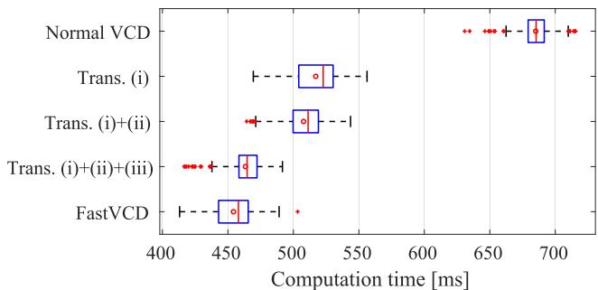  
FIGURE 6. Boxplot of computation time for each method. Each red circle, red vertical line, red cross, left/right sides of blue box, and left/right ends of black whisker denote the average, median, outlier, first/third quantiles, and non-outlier minimum/maximum, respectively, for each method.

We compared the computation times of SR-ILRMA using Normal VCD, Trans. (i), Trans. (i)+(ii), Trans. (i)+(ii)+(iii), and FastVCD. The STFT was performed using a 64-ms-long Hann window with a shift length of 32 ms. The number of NMF bases was set to 10. The relative weight parameter and weight scheduler of the regularizer, $\bar { \mu } _ { i n } ^ { \mathrm { ( S R ) } }$ and $\varrho ^ { ( l ) }$ were set to 0.1 and 1 (constant function independent of the number of iterations), respectively. For Normal VCD, Trans. (i), Trans. (i)+(ii), and Trans. (i)+(ii)+(iii), the threshold for the conditional branch ϵ was 10−10. The supervisor of the steering vector for the target speech, $\hat { \pmb { a } } _ { i n ^ { \mathrm { ( t ) } } }$ was calculated under the following conditions: the height of the virtual source was the same as that of the microphone array; the horizontal distance and relative horizontal angle between the virtual source and the microphone array were set to be the same as those between the target speaker and the microphone array during the real-world impulse response recording; a free field and attenuation according to the distance were assumed. The NMF variables and demixing matrix were initialized with uniform random values in the range of $[ 1 0 ^ { - 1 0 }$ , 1] and the identity matrix, respectively. The number of iterations was 30. The hyperparameters were set to be the same as those in Section V-C for consistency. Under the above conditions, SR-ILRMA was executed, and the computation time, except for the input/output, was evaluated. Note that the computation time includes the update of NMF variables and parameter initialization. The implementation was carried out using Python on a PC equipped with Intel Core i9-13900KF CPU and 128 GB RAM. Only the CPU was used for computations. The data types of the NMF variables and the others were set to bfloat16 and single-precision floating points, respectively.

Fig. 6 shows the boxplot and average for each method. It can be seen that the proposed algorithm, FastVCD, can be executed in about two-thirds of the computation time of the conventional algorithm, Normal VCD. Furthermore, the transformations in Sections IV-C1 and IV-C3 strongly contribute to the acceleration. The contributions of the transformations in each section to the acceleration are discussed on the basis of Fig. 6 as follows.

## 1) Section IV-C1 [Normal VCD→Trans. (i)]

This transformation reduces one matrix inversion for the general matrix, although the numbers of matrix–matrix and matrix–vector products are increased by one and three, respectively. The results of actual experiment show a significant reduction in computation time. This finding suggests that the matrix–matrix and matrix–vector products are computationally less costly than the matrix inversion for the general matrix on the CPU, leading to substantial acceleration.

## 2) Section IV-C2 [Trans. (i)→Trans. (i)+(ii)]

Fig. 6 shows that this transformation contributes to a small acceleration. Compared with the matrix inversion and matrix–matrix product, the reduction in this transformation is slight, which is likely the cause of this result.

3) Section IV-C3 [Trans. (i)+(ii)→Trans. (i)+(ii)+(iii)] This transformation focuses on the fact that only one row vector of the demixing matrix is updated for each iteration and replaces the matrix–matrix products with more computationally efficient iterative updates. This contributes to a significant acceleration.

## 4) Section IV-C4 [Trans. (i)+(ii)+(iii)→FastVCD]

This transformation integrates the conditional branch, and the results in Fig. 6 show a slight improvement in computation time. The updates of $\dot { \varphi } _ { i n } ^ { ( l ) }$ in Trans. (i)+(ii)+(iii), (70), and FastVCD, (114), consist of only scalar operations, except for the existence of the conditional branch. However, the update for $\varphi _ { i n } ^ { ( l ) }$ in FastVCD requires slightly fewer scalar operations than that in Trans. (i)+(ii)+(iii). This is likely the reason for the slight reduction in computation time.

## B. EVALUATION OF NUMERICAL STABILITY FOR FASTVCD

We performed an experiment using a toy model to evaluate the numerical stability of the matrix inverse operation. First, we describe how the input signals $\pmb { x } _ { i j } = \pmb { A } _ { i } \pmb { s } _ { i j }$ were generated. Each element of the mixing matrix $\dot { A _ { i } } \in \mathbb { C } ^ { N \times N }$ was generated from a univariate complex Gaussian distribution with a mean of zero and a variance of one. We generated random numbers $\tilde { r } _ { i j n }$ independently from a gamma distribution with a shape parameter of 10 and a scale parameter of 0.1, and we set the time-variant variance of the source signal, $\hat { r } _ { i j n } , \mathrm { t o } \ \tilde { r } _ { i j n } + 0 . 0 1$ Then, to simulate a numerically unstable environment in terms of matrix inverse operation, we set $\hat { r } _ { i 1 1 } = \hat { r } _ { i 2 2 } = . . . =$ $\hat { r } _ { i N N } = \varsigma$ , where $\varsigma > 0$ is a small control parameter for numerical stability. Each element of a source signal $s _ { i j n }$ is generated from a univariate complex Gaussian distribution with a mean of zero and a variance of $\hat { r } _ { i j n } .$ , and an input signal is created as $\mathbf { \Delta } \mathbf { x } _ { i j } = \mathbf { \nabla } A _ { i } \mathbf { s } _ { i j }$ . For the description of the instability in this toy model, we consider setting the estimated time-varying variance at each iteration, $r _ { i j n } ^ { ( l ) } ,$ as $\hat { r } _ { i j n }$ in an oracle. Since $\hat { r } _ { i j n } ~ = ~ \varsigma ~ ( j ~ = ~ n )$ is very small relative to $\hat { r } _ { i j n } ( j \neq n ) , { \bf { \sigma } } _ { x { i j } } { \bf { x } } _ { i j } ^ { \sf H } / \hat { r } _ { i j n } ( j = n )$ will become dominant over all ${ \pmb x } _ { i j } { \pmb x } _ { i j } ^ { \sf H } / \hat { r } _ { i j n } \left( j \neq n \right)$ and $\tilde { \pmb { D } } _ { i n } ^ { ( l ) }$ will become ill-conditioned. This is expected to degrade the numerical stability of the matrix inverse operation on $\tilde { D } _ { i n } ^ { ( l ) }$ and ${ \mathbf { } } \mathbf { { \mathbf { } } } \mathbf { { \mathbf { } } } \mathbf { { \mathbf { } } } \mathbf { { \mathbf { } } } \mathbf { { \mathbf { } } } \mathbf { { \mathbf { } } } \mathbf { { \mathbf { } } } \mathbf { { \mathbf { } } } \mathbf { { \mathbf { } } } \mathbf { { \mathbf { } } } \mathbf { { \mathbf { } } } \mathbf { { \mathbf { } } } \mathbf { { \mathbf { } } } \mathbf { { \mathbf { } } } \mathbf { { \mathbf { } } } \mathbf { { \mathbf { } } } \mathbf { { \mathbf { } } } \mathbf { { \mathbf { } } } \mathbf { { \mathbf { } } } \mathbf { { \mathbf { } } } \mathbf { { \mathbf { } } } \mathbf { { \mathbf { } } } \mathbf { { \mathbf { } } } \mathbf { { \mathbf { } } } \mathbf { { \mathbf { } } } \mathbf { { \mathbf { } } } \mathbf { { \mathbf { } } } \mathbf { { \mathbf { } } } \mathbf { { \mathbf { } } } \mathbf { { \mathbf { } } } \mathbf { { \mathbf { } } } \mathbf { { \mathbf { } } } \mathbf { { \mathbf { } } } \mathbf { { \mathbf { } } } \mathbf { { \mathbf { } } } \mathbf { { \mathbf { } } } \mathbf { { \mathbf { } } } \mathbf { { \mathbf { } } } \mathbf { { \mathbf { } } } \mathbf { { \mathbf { } } } \mathbf { { \mathbf { } } } \mathbf { { \mathbf { } } } \mathbf { { \mathbf { } } } \mathbf { { \mathbf { } } } \mathbf { { \mathbf { } } } \mathbf { { \mathbf { } } } \mathbf { { \mathbf { } } } \mathbf { { \mathbf { } } } \mathbf { { \mathbf { } } } \mathbf { { \mathbf { } } } \mathbf { { \mathbf { } } } \mathbf { { \mathbf } { } \mathbf { } } \mathbf { { \mathbf { } } } \mathbf { { \mathbf } { \mathbf { } } } \mathbf { } \mathbf { { \mathbf } { } \mathbf { } } \mathbf { } \mathbf { } \mathbf { } \mathbf { } \mathbf { } \mathbf { } \mathbf { } \mathbf { } \mathbf { } \mathbf { } \mathbf { } \mathbf { } \mathbf { } \mathbf { \mathbf { } \mathbf { } \mathbf { } } \mathbf $

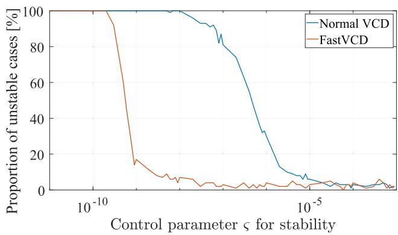  
FIGURE 7. Proportions of unstable cases with respect to control parameter $s$ for stability of input data in each method.

We compared Normal VCD and FastVCD with $\begin{array} { r l } { N } & { { } = } \end{array}$ $M \ = \ 4 , \ I \ = \ 1$ , and $\begin{array} { l l l } { J } & { = } & { 1 0 0 0 } \end{array}$ . The source index of the target speech $n ^ { \left( \mathrm { t } \right) }$ was 1. The relative weight parameter $\bar { \mu } _ { i n } ^ { ( \mathrm { S R } ) }$ and the weight scheduler $\varrho ^ { ( l ) }$ were set to 0.1 and 1 (constant function independent of the number of iterations), respectively. The threshold for the conditional branch ϵ was $1 0 ^ { - 1 0 }$ . The number of iterations was set to 30. We set $r _ { i j n } ^ { ( l ) }$ to $\hat { r } _ { i j n }$ in the oracle and did not update NMF variables. The demixing matrix $\pmb { W } _ { i } ^ { ( l ) }$ was initialized with the identity matrix. The supervisor of the steering vector for the direction of the target speech $\hat { \pmb { a } } _ { i n ^ { \mathrm { ( t ) } } }$ was set to the $n ^ { ( \mathrm { t } ) } \mathrm { t h }$ (i.e., 1st) column of $A _ { i }$ . With the above settings, we updated the demixing matrix using each algorithm and calculated the cost function value at each iteration. By changing a random seed value for $A _ { i } ,$ $\tilde { r } _ { i j n }$ , and $s _ { i j n }$ with 100 different values, we counted the number of trials that any of the following three errors occurred and obtained the proportion.

1) Owing to the inverse matrix calculation of a singular matrix, an error occurs.

2) The cost function value becomes NaN.

3) In a certain iteration, the rate of change in the cost function value from that in the previous iteration exceeds the specified threshold of $1 0 ^ { - 1 0 }$ (i.e., the VCD property of monotonically nonincreasing cost function value was violated).

For each algorithm and control parameter ς, we calculated the proportion of cases in which the computation became numerically unstable. The computing device and data types were the same as those in Section $\mathrm { V } { \cdot } \mathrm { A }$

Fig. 7 shows the proportions of unstable cases for 100 trials at each ς value. Overall, FastVCD has a lower proportion of unstable cases than Normal VCD. We confirmed that the proposed algorithm is more robust to numerically unstable environments than the conventional algorithm.

## C. SPEECH EXTRACTION PERFORMANCE OF REAL-TIME RCSCME-BASED METHOD

In Sections V-A and V-B, we experimentally confirmed that the proposed VCD algorithm, FastVCD, is faster and more numerically stable than the conventional algorithm. Then, in this section, we performed our proposed realtime RCSCME-based method with FastVCD/FastIP and conventional online methods on a CPU and confirmed that our proposed methods achieve higher speech extraction performance than conventional methods. Furthermore, we verified the effectiveness of the spatial regularizers proposed in Sections III-C and III-D.

We first describe the experimental conditions. The diffuse noise, impulse response, dry source, and way to calculate SNR were the same as those in Section V-A. The input SNRs were set to 0, 5, and 10 dB. The sampling rate was 16 kHz, and the STFT was performed using a 64-ms-long Hann window with a shift length of 32 ms. We compared two conventional online BSS methods, Online IVA-IP [10] and Online IVA-ISS [11], and three of our proposed real-time RCSCME-based speech extraction methods using different ILRMA parts: NaiveILRMA with the normal ILRMA [2] (without any spatial prior information) described in Section II-A and the kurtosis-based channel selection method; SR- and NSR-ILRMAs as explained in Sections III-C and III-D, respectively, with the channel selection using $n ^ { ( \mathrm { t } ) }$ . Here, the channel index corresponding to the target speech $n ^ { ( \mathrm { t } ) }$ was set to N. For Online IVA-IP and Online IVA-ISS, we used the same parameters as in [11], except for the STFT conditions. Since both Online IVA-IP and Online IVA-ISS are BSS methods, we must determine the channel index corresponding to the target speech. For a fair comparison with NaiveILRMA, we performed the kurtosis-based channel selection method every 16 frames, which corresponds to 512 ms. For the update of the demixing matrix in the proposed methods, we used FastIP for Naive and NSR-ILRMAs and FastVCD for SR-ILRMA. The RCSCME parts of all the proposed methods were the same. For each proposed method, the ILRMA part was performed at a minimum interval of 512 ms using the most recent 5-s-long observed signals, and the RCSCME part was performed at every 32 ms (the shift length of the STFT) using the most recent 3-s-long observed signals. The number of NMF bases was set to 10. The relative weight parameters of the regularizers in SR- and NSR-ILRMAs, $\overline { { \mu } } _ { i n } ^ { ( \mathrm { S R } ) }$ and $\bar { \mu } _ { i n } ^ { ( \mathrm { N S R } ) }$ , were both set to 0.1, and the weight scheduler $\varrho ^ { ( l ) }$ was set to a constant value of 1. The prior steering vector for the target speech $\hat { \pmb { a } } _ { i n ^ { \mathrm { ( t ) } } }$ was calculated in the same way as in Section V-A. For the inverse gamma distribution used in RCSCME, the shape and scale parameters, α and $\beta ,$ were set to 1.6 and $1 0 ^ { - 1 6 }$ , respectively. The scalar value ϖ in (32) was 0.1. Here, the hyperparameters $\bar { \mu } _ { i n } ^ { ( \mathrm { S R } ) } , ~ \bar { \mu } _ { i n } ^ { ( \mathrm { N S R } ) }$ $\varrho ^ { ( l ) }$ , α, β, and ϖ were experimentally determined in terms of speech extraction performance. The NMF variables were initialized with uniform random values in the range of $[ 1 0 ^ { - 1 0 }$ , 1]. The numbers of iterations for the ILRMA and RCSCME parts were set to 30 and 3, respectively, which were experimentally determined considering the balance between real-time performance and speech extraction performance. For NaiveILRMA, the demixing matrix $W _ { i }$ was initialized to the identity matrix. For SR- and NSR-ILRMAs, W was initialized to the inverse of a matrix whose $n ^ { ( \mathrm { t } ) } \mathrm { t h }$ (i.e., Nth) column was $\hat { \pmb { a } } _ { i n ^ { ( \mathrm { t } ) } }$ and others were the orthonormal bases of the orthogonal complementary space of $\hat { \pmb { a } } _ { i n ^ { ( \mathrm { t } ) } } . ^ { 2 }$ Under the above conditions, we executed Online IVA-IP, Online IVA-ISS, and the proposed speech extraction method with Naive, SR-, and NSR-ILRMAs for the ILRMA part, and compared their performances. These methods were implemented in Python, and the computation was performed on a PC equipped with Intel Core i9-13900KF CPU and 128 GB RAM. All computations were performed on the CPU.

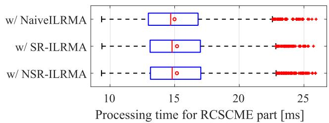  
FIGURE 8. Boxplots of processing times for RCSCME part of all methods. Each red circle, red vertical line, red cross, left/right sides of blue box, and left/right ends of black whisker denote the average, median, outlier, first/third quantiles, and non-outlier minimum/maximum, respectively, for each method.

The evaluation measures were the processing time and the source-to-distortion ratio (SDR) and source-to-interferences ratio (SIR) [29] improvements. The definitions of SDR and SIR are detailed in Appendix A. To evaluate the real-time speech extraction performance, SDR and SIR were calculated in segments as follows. First, the ground truths of the target and noise signals, the observed signal, and the extracted signal output by the RCSCME part, Online IVA-IP, or Online IVA-ISS were prepared. Next, the silent intervals, which were added during the creation of the dry source, were removed, resulting in 50 segments for each signal. Finally, each segment was divided into 1-s-long segments, and SDR and SIR were calculated for each segment. Here, segments shorter than 1 s were removed. As a result, we obtained 119 segments to be evaluated. To process the entire input signal, the RCSCME and ILRMA parts were executed 7088 times and a maximum of 442 times, respectively. We also compared the processing times for the ILRMA and RCSCME parts of each proposed method.

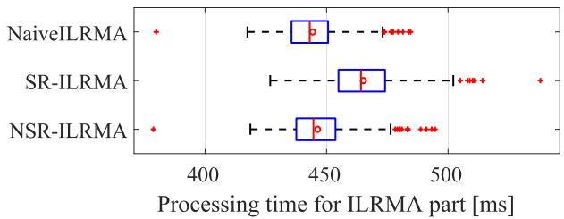  
FIGURE 9. Boxplots of processing times for ILRMA part of all methods. Each red circle, red vertical line, red cross, left/right sides of blue box, and left/right ends of black whisker denote the average, median, outlier, first/third quantiles, and non-outlier minimum/maximum, respectively, for each method.

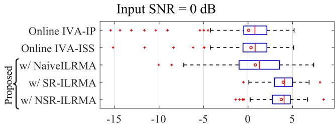  
(a) SDR improvement [dB]

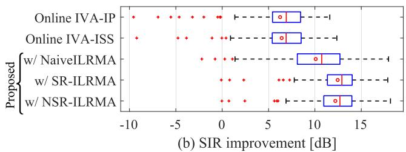  
FIGURE 10. Boxplots of SDR (top panel) and SIR (bottom panel) improvements for each method when input SNR was set to 0 dB. Each red circle, red vertical line, red cross, left/right sides of blue box, and left/right ends of black whisker denote the average, median, outlier, first/third quantiles, and non-outlier minimum/maximum, respectively, for each method.

Figs. 8 and 9 show boxplots of the processing times for the RCSCME and ILRMA parts of each proposed method, respectively. For all the proposed methods together, the maximum processing time for the RCSCME part was 28.1 ms, which is less than the shift length of the STFT (32 ms).

Input SNR = 5 dB  
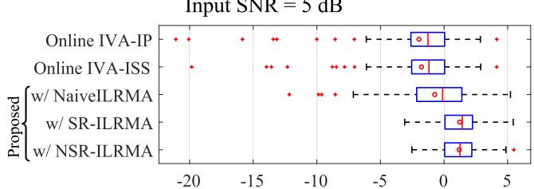  
(a) SDR improvement [dB]

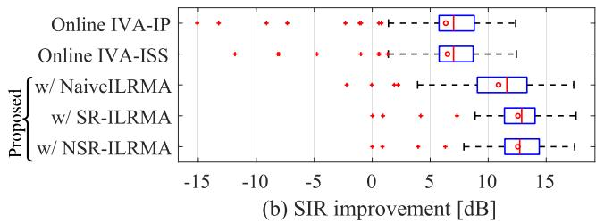  
FIGURE 11. Boxplots of SDR (top panel) and SIR (bottom panel) improvements for each method when input SNR was set to 5 dB. Each red circle, red vertical line, red cross, left/right sides of blue box, and left/right ends of black whisker denote the average, median, outlier, first/third quantiles, and non-outlier minimum/maximum, respectively, for each method.

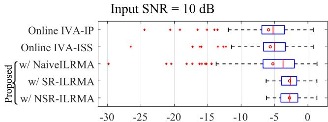

(a) SDR improvement [dB]  
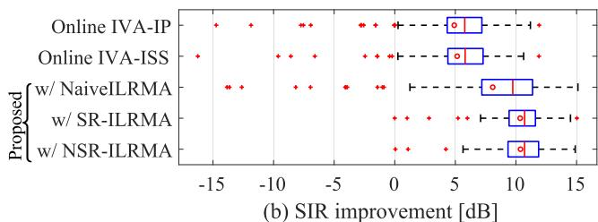  
FIGURE 12. Boxplots of SDR (top panel) and SIR (bottom panel) improvements for each method when input SNR was set to 10 dB. Each red circle, red vertical line, red cross, left/right sides of blue box, and left/right ends of black whisker denote the average, median, outlier, first/third quantiles, and non-outlier minimum/maximum, respectively, for each method.

Therefore, all proposed methods could function in real time. Note that in both Online IVA-IP and Online IVA-ISS, the calculation for each time frame was executed within the shift length of the STFT (32 ms), and thus, the conventional methods could also function in real time. For NaiveILRMA, which has the lowest computational cost among all the proposed methods, the average, standard deviation, and maximum of the processing time for the ILRMA part were 444.3, 13.0, and 484.6 ms, respectively. Since the average processing time for the ILRMA part was much greater than the shift length of the STFT (32 ms), it was necessary to execute the ILRMA part over multiple time frames to achieve real-time operation. As shown in Fig. 9, SR-ILRMA has a longer processing time than Naive and NSR-ILRMAs. This is probably because SR-ILRMA uses FastVCD for parameter updates, leading to a higher computational cost than in the case of Naive and NSR-ILRMAs. In addition, Naive and NSR-ILRMAs show competitive processing times.

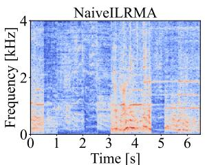

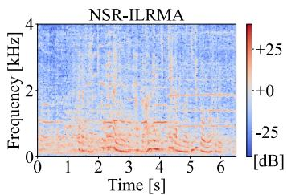  
FIGURE 13. Spectrograms of separated signal corresponding to target speech estimated by ILRMA part of NaiveILRMA (left) and NSR-ILRMA (right) in real-time scenario.

Next, boxplots of the SDR and SIR improvements for each method and input SNR are shown in Figs. 10–12. Under most experimental conditions, the SIR improvement for each proposed method was significantly large, indicating that the proposed framework could more effectively suppress noise than the conventional methods. Neither the proposed speech extraction method with NaiveILRMA nor the conventional methods, Online IVA-IP and Online IVA-ISS, use any spatial prior information. However, the proposed method with NaiveILRMA achieved higher average SDR and SIR improvements than the conventional methods under all mixing conditions. Since Online IVA-IP and Online IVA-ISS are BSS methods based on linear demixing filters, diffuse noise could not be completely excluded from the extracted target speech, which results in lower SIR improvements. On the other hand, the proposed methods include the RCSCME part and can suppress diffuse noise more effectively than Online IVA-IP and Online IVA-ISS. In addition, under all mixing conditions, the proposed speech extraction method with SRor NSR-ILRMAs outperformed that with NaiveILRMA and achieved similar speech extraction performance in terms of both SDR and SIR improvements. There were only a few cases of extremely low SDR improvements when using SR- and NSR-ILRMAs, whereas using NaiveILRMA often showed such cases. Fig. 13 shows spectrograms of the separated signal corresponding to the target speech estimated by the ILRMA part using Naive and NSR-ILRMAs when the input SNR was set to 0 dB. Although we can see the discontinuities in the signal extracted by NaiveILRMA, these were improved when NSR-ILRMA was used. These results suggest that channel selection errors did not occur frequently in SR- and NSR-ILRMAs compared with NaiveILRMA, indicating that the spatial prior information helps reduce the channel selection errors.

TABLE 1. Detailed specifications of each Jetson module.

<table><tr><td></td><td>AGX Xavier 64 GB</td><td>AGX Orin 64 GB</td></tr><tr><td>CPU</td><td>8-core NVIDIA Carmel Arm® v8.2 64-bit CPU, 8-MB L2 + 4-MB L3</td><td>12-core Arm® Cortex®-A78AE v8.2 64-bit CPU, 3-MB L2 + 6-MB L3</td></tr><tr><td>GPU</td><td>512-core NVIDIA Volta architecture GPU with 64 Tensor Cores</td><td>2048-core NVIDIA Ampere architecture GPU with 64 Tensor Cores</td></tr><tr><td>Power</td><td>10–30 W</td><td>15–60 W</td></tr></table>

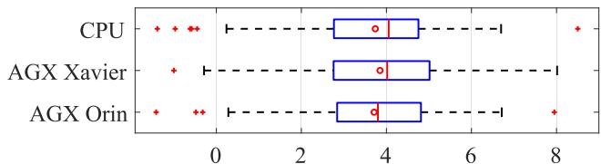  
(a) SDR improvement [dB]

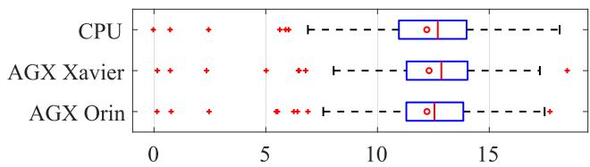  
(b) SIR improvement [dB]  
FIGURE 14. Boxplots of SDR (top panel) and SIR (bottom panel) improvements for each device. Each red circle, red vertical line, red cross, left/right sides of blue box, and left/right ends of black whisker denote the average, median, outlier, first/third quantiles, and non-outlier minimum/maximum, respectively, for each device. We used NSR-ILRMA as ILRMA part and set input SNR to 0 dB.

The results of the experiments described in this section confirmed that the proposed speech extraction method shows superior speech extraction performance compared with the conventional methods under all mixing conditions. Furthermore, it was found that the proposed speech extraction method using NSR-ILRMA for the ILRMA part achieves high speech extraction performance while reducing the processing time of the ILRMA part to almost the same as that when using NaiveILRMA. Therefore, the proposed speech extraction method using NSR-ILRMA for the ILRMA part outperforms the other methods in terms of both processing time and extraction performance.

## D. EXPERIMENTS WITH LOW COMPUTATIONAL RESOURCES

In Section V-C, we experimentally confirmed that the proposed real-time method works on a relatively highperformance CPU. In [17], we previously reported that using a powerful GPU can further improve the computation speed. However, it is not generally easy to use such high computational resources in some application scenarios, and the computation device tends to become large owing to, for example, the systems for cooling the CPU and GPU. Therefore, in this section, we demonstrate the real-time performance of the proposed RCSCME-based speech extraction method using NVIDIA Jetson modules as small and lowcomputational-resource machines.

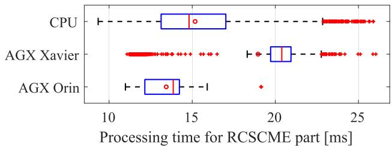  
FIGURE 15. Boxplots of processing times for RCSCME part of all devices. Each red circle, red vertical line, red cross, left/right sides of blue box, and left/right ends of black whisker denote the average, median, outlier, first/third quantiles, and non-outlier minimum/maximum, respectively, for each device.

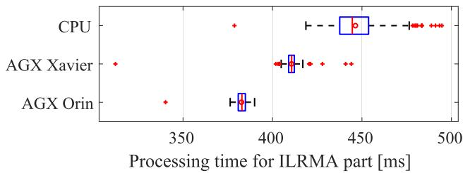  
FIGURE 16. Boxplots of processing times for ILRMA part of all devices. Each red circle, red vertical line, red cross, left/right sides of blue box, and left/right ends of black whisker denote the average, median, outlier, first/third quantiles, and non-outlier minimum/maximum, respectively, for each device.

As the observed signal, we used the signal created as described in Section V-C with the input SNR of 0 dB. The other experimental conditions were the same as those described in Section V-C. In addition, we adopted NSR-ILRMA, which demonstrated excellent speech extraction performance and processing time in the CPU-based experiments described in Section V-C, for the ILRMA part. We examined the speech extraction performance and processing time using three devices: CPU used in Section V-C, NVIDIA Jetson AGX Xavier with Jetpack 5.1, and NVIDIA Jetson AGX Orin with Jetpack 5.1.2. The specifications of each Jetson module are detailed in Table 1. The evaluation measures were the same as those indicated in Section V-C.

Fig. 14 shows boxplots of SDR and SIR improvements for each device. It was confirmed that almost the same speech extraction performance can be achieved using a CPU and Jetson devices. Note that the variation in computational load can cause the ILRMA part to update the demixing matrix at different times, resulting in a slight difference in speech extraction performance for each device.

Figs. 15 and 16 show boxplots of processing times for the RCSCME and ILRMA parts of each device, respectively. The maximum processing time for the RCSCME part was less than the shift length of the STFT (32 ms) for all devices; thus, the proposed method is confirmed to operate in real time even when we use Jetson devices. As can be seen in Fig. 16, the processing times of the ILRMA part are shorter when using Jetson devices than when using the CPU. This is likely due to the fact that the matrix operations mostly involved in the NSR-ILRMA updates can be parallelized and executed efficiently by using GPUs. As shown in Table 1, AGX Orin has superior GPU performance, which is considered the reason for its higher speed than that of AGX Xavier.

## E. EXPERIMENTS ON ROBUSTNESS TO PRIOR SPEECH DIRECTION INFORMATION

In Sections V-A, V-C, and V-D, it was assumed that the prior information on the target speech direction was accurately obtained. However, in practical scenarios, the target speaker is not always positioned directly in front of the microphone array, and it is difficult to obtain the prior information accurately. Therefore, in this section, we investigated the speech extraction performance of the proposed methods with SR- and NSR-ILRMAs using the various prior directions of the target speech.

As the observed signal, we used the signal created as described in Section V-C with the input SNR of 0 dB. The other experimental conditions were the same as those described in Section V-C. To simulate a situation where the target speaker is not positioned directly in front of the microphone array, we compared the various directions of the target speech as the prior information in the proposed methods with SR- and NSR-ILRMAs. When calculating the prior steering vector for the target speech, $\hat { \pmb { a } } _ { i n ^ { \mathrm { ( t ) } } }$ , the relative horizontal angle between the virtual source and the microphone array varied from $- 9 0 ^ { \circ }$ to $9 0 ^ { \circ }$ in 0.5◦ steps, with $0 ^ { \circ }$ representing the actual direction of the target speech. The computing device was the same as that described in Section V-C. To evaluate the real-time speech extraction performance, we first calculated the SDRs and SIRs for each prior direction in segments, as described in Section V-C, and obtained their average values. Then, we evaluated the relative average SDR and SIR to those with the prior direction of 0◦.

Fig. 17 shows the relative average SDR and SIR at each prior direction. The range in which the average SDR and SIR degradations are less than approximately 0.5 dB and 1 dB, respectively, was approximately between −30◦ (left-hand side) and +9◦ (right-hand side) from the center. We call this range the acceptable range. Therefore, the proposed methods can function without significant performance degradation, even when the prior direction has an error approximately within the acceptable range.

In addition, the acceptable range was asymmetric. This is likely due to the recording condition. During diffuse noise recording, the background music from a loudspeaker was louder than the other noise. When we set the prior direction to a positive value, the musical sound from this loudspeaker acted as strong interference and could be confused with the actual target speech. It could be one of the causes of the asymmetric acceptable range. Furthermore, the acceptable ranges of the proposed methods with SR- and NSR-ILRMAs were comparable. These results demonstrated the robustness of the proposed methods with SR- and NSR-ILRMAs to the prior direction.

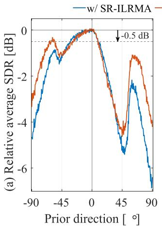

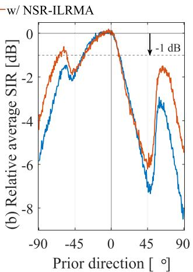  
FIGURE 17. Average SDR (left panel) and SIR (right panel) relative to those with correct prior direction for each method when input SNR was set to 0 dB. Prior direction means horizontal angle between virtual source and microphone array relative to correct angle.

## VI. CONCLUSION

In this paper, we proposed the real-time RCSCME-based speech extraction method under a diffuse noise condition. We focused on the fact that RCSCME uses only the time-invariant demixing matrix and target speech channel index, and introduced the blockwise batch algorithm to the offline RCSCME-based method. Owing to its parallelization, we performed RCSCME at every shift length of the STFT and achieved the real-time execution of RCSCME-based speech extraction. To improve the speech extraction performance, we incorporated the approximate steering vector for the target speaker as the spatial prior information into the proposed method. We utilized this prior information as spatial regularization for ILRMA and designed two regularizers. Furthermore, to accelerate and stabilize the operations in the ILRMA part, we derived the fast and stable algorithms for VCD and IP. In the experiments, we first showed the effectiveness of the proposed FastVCD in terms of both computational time and numerical stability. From the results of the speech extraction experiment on a CPU, we confirmed that all the proposed methods function in real time and show superior speech extraction performance compared with the conventional methods. In addition, we confirmed that the proposed speech extraction method with NSR-ILRMA for the ILRMA part excels in terms of both speech extraction performance and processing time. Moreover, we also confirmed that the proposed real-time method using NSR-ILRMA and FastIP can function in real time on some Jetson devices, which are practical low computational resources. Finally, we demonstrated that the proposed speech extraction method with the spatial regularization is robust to errors in the prior direction of the target speech.

In the proposed method, we applied the blockwise batch algorithm and the demixing matrix was estimated from slightly earlier observed signals. Thus, the speech extraction performance may degrade especially when the spatial characteristics change rapidly (e.g., the target speaker moves quickly). Addressing this issue remains in future work.

## APPENDIX A

## DEFINITIONS OF SDR AND SIR

Let $\boldsymbol { \hat { S } } [ \boldsymbol { c } ]$ and $S _ { n } [ c ]$ be the to-be-evaluated signal and true signal of the nth source in the discrete-time domain, respectively, where $\boldsymbol { \hat { S } } [ \boldsymbol { c } ]$ corresponds to $S _ { \hat { n } } [ c ]$ and nˆ means the target index. Here, $c \in \{ 1 , . . . , C ^ { ( \mathrm { t i m e } ) } \}$ is the discretetime index. To compute the source separation metrics, we decompose $\hat { S } [ c ]$ as

$$
\hat {\mathcal {S}} [ c ] = \hat {\mathcal {S}} ^ {(\mathrm{target})} [ c ] + \hat {\mathcal {S}} ^ {(\mathrm{interf})} [ c ] + \hat {\mathcal {S}} ^ {(\mathrm{artif})} [ c ],\tag{143}
$$

where $\hat { S } ^ { ( \mathrm { t a r g e t } ) } [ c ] , \hat { S } ^ { ( \mathrm { i n t e r f } ) } [ c ]$ , and $\hat { S } ^ { ( \mathrm { a r t i f } ) } [ c ]$ are the target signal, interference, and artifact error components, respectively. To obtain $\hat { S } ^ { ( \mathrm { t a r g e t } ) } [ c ]$ , we first estimate a $C ^ { \mathrm { ( f i l t ) } }$ -tap-long filter, $\mathcal { F } [ c ]$ , as follows:

$$
\mathcal {T} _ {F} = \sum_ {c = 1} ^ {C ^ {\text {(time)}} + C ^ {\text {(filt)}} - 1} \left| \mathcal {S} [ c ] - \sum_ {c ^ {\prime} = 1} ^ {C ^ {\text {(filt)}}} \mathcal {S} _ {\hat {n}} [ c - c ^ {\prime} + 1 ] \mathcal {F} ^ {\prime} [ c ^ {\prime} ] \right| ^ {2},\tag{144}
$$

$$
\{\mathcal {F} [ c ] \} = \underset {\{\mathcal {F} ^ {\prime} [ c ] \}} {\arg \min} \mathcal {T} _ {F},\tag{145}
$$

where, for indices outside the range, all values are set to zero and the same setting is applied hereafter. Then, the target signal component $\hat { S } ^ { ( \mathrm { t a r g e t } ) } [ c ]$ is obtained as

$$
\hat {\mathcal {S}} ^ {(\text { target })} [ c ] = \sum_ {c ^ {\prime} = 1} ^ {C ^ {(\text { filt })}} \mathcal {S} _ {\hat {n}} [ c - c ^ {\prime} + 1 ] \mathcal {F} [ c ^ {\prime} ].\tag{146}
$$

To obtain $\hat { S } ^ { ( \mathrm { i n t e r f } ) } [ c ]$ , we estimate a $C ^ { \mathrm { ( f i l t ) } }$ -tap-long filter for the nth source signal, $\mathcal { G } _ { n } [ c ]$ , as follows:

$$
\mathcal {T} _ {G} = \sum_ {c = 1} ^ {C ^ {\text {(time)}} + C ^ {\text {(filt)}} - 1} \left| \mathcal {S} [ c ] - \sum_ {n = 1} ^ {N} \sum_ {c ^ {\prime} = 1} ^ {C ^ {\text {(filt)}}} \mathcal {S} _ {n} [ c - c ^ {\prime} + 1 ] \mathcal {G} _ {n} ^ {\prime} [ c ^ {\prime} ] \right| ^ {2},\tag{147}
$$

$$
\{\mathcal {G} _ {n} [ c ] \} = \underset {\{\mathcal {G} _ {n} ^ {\prime} [ c ] \}} {\arg \min} \mathcal {T} _ {G}.\tag{148}
$$

By using $\mathcal { G } _ { n } [ c ]$ and $\hat { S } ^ { ( \mathrm { t a r g e t } ) } [ c ]$ , we obtain the interference component $\hat { S } ^ { ( \mathrm { i n t e r f } ) } [ c ]$ as

$$
\hat {\mathcal {S}} ^ {(\text { interf })} [ c ] = \sum_ {n = 1} ^ {N} \sum_ {c ^ {\prime} = 1} ^ {C ^ {(\text { filt })}} \mathcal {S} _ {n} [ c - c ^ {\prime} + 1 ] \mathcal {G} _ {n} [ c ^ {\prime} ] - \hat {\mathcal {S}} ^ {(\text { target })} [ c ].\tag{149}
$$

The artifact error component $\hat { S } ^ { ( \mathrm { a r t i f } ) } [ c ]$ is residual, i.e.,

$$
\hat {\mathcal {S}} ^ {(\text { artif })} [ c ] = \hat {\mathcal {S}} [ c ] - \left(\hat {\mathcal {S}} ^ {(\text { target })} [ c ] + \hat {\mathcal {S}} ^ {(\text { interf })} [ c ]\right).\tag{150}
$$

Finally, we define SDR and SIR for $\boldsymbol { \hat { S } } [ \boldsymbol { c } ]$ with the target index of $\hat { n }$ as $\mathrm { S D R } _ { \hat { n } } ( \hat { S } [ c ] )$ and $\mathrm { S I R } _ { \hat { n } } ( { \hat { S } } [ c ] )$ , respectively. By using $\hat { S } ^ { ( \mathrm { t a r g e t } ) } [ c ] , \ddot { \hat { S } } ^ { ( \mathrm { i n t e r f } ) } [ c ]$ , and $\hat { S } ^ { ( \mathrm { a r t i f } ) } [ c ]$ , we can express $\mathrm { S D R } _ { \hat { n } } ( \hat { S } [ c ] )$ and $\mathrm { S I R } _ { \hat { n } } ( { \hat { S } } [ c ] )$ as follows:

$$
\mathrm{SDR} _ {\hat {n}} \big (\hat {\mathcal {S}} [ c ] \big) := 1 0 \log_ {1 0} \frac {\sum_ {c} \Big | \hat {\mathcal {S}} ^ {(\text { target })} [ c ] \Big | ^ {2}}{\sum_ {c} \Big | \hat {\mathcal {S}} ^ {(\text { interf })} [ c ] + \hat {\mathcal {S}} ^ {(\text { artif })} [ c ] \Big | ^ {2}},\tag{151}
$$

$$
\operatorname{SIR} _ {\hat {n}} \bigl (\hat {\mathcal {S}} [ c ] \bigr) := 1 0 \log_ {1 0} \frac {\sum_ {c} \Bigl | \hat {\mathcal {S}} ^ {(\text { target })} [ c ] \Bigr | ^ {2}}{\sum_ {c} \Bigl | \hat {\mathcal {S}} ^ {(\text { interf })} [ c ] \Bigr | ^ {2}}.\tag{152}
$$

In this paper, we defined the discrete-time-domain observed signal at the reference channel as $\mathcal { X } [ c ]$ and assigned the extracted target speech and the true target source index to $\boldsymbol { \hat { S } } [ \boldsymbol { c } ]$ and $\hat { n } ,$ respectively. Then, we calculated the SDR and SIR improvements of the extracted speech as $\mathrm { S D R } _ { \hat { n } } ( { \hat { S } } [ c ] ) -$ $\mathrm { S D R } _ { \hat { n } } ( { \mathcal X } [ c ] )$ and $\mathrm { S I R } _ { \hat { n } } ( \hat { S } [ c ] ) { - } \mathrm { S I R } _ { \hat { n } } ( \mathcal { X } [ c ] )$ , respectively. Note that the nth true source signal $( n \ \ne \ \hat { n } )$ was set to the true diffuse noise signal.

## ACKNOWLEDGMENT

The authors would like to thank Assistant Prof. Taishi Nakashima and Prof. Nubutaka Ono (Tokyo Metropolitan University) for providing the experimental codes of Online IVA-IP and Online IVA-ISS.

## REFERENCES

[1] A. Cichocki and S. Amari, Adaptive Blind Signal and Image Processing: Learning Algorithms and Applications. Hoboken, NJ, USA: Wiley, 2002.

[2] D. Kitamura, N. Ono, H. Sawada, H. Kameoka, and H. Saruwatari, ‘‘Determined blind source separation unifying independent vector analysis and nonnegative matrix factorization,’’ IEEE/ACM Trans. Audio, Speech, Language Process., vol. 24, no. 9, pp. 1626–1641, Sep. 2016.

[3] Y. Kubo, N. Takamune, D. Kitamura, and H. Saruwatari, ‘‘Blind speech extraction based on rank-constrained spatial covariance matrix estimation with multivariate generalized Gaussian distribution,’’ IEEE/ACM Trans Audio, Speech, Language Process., vol. 28, pp. 1948–1963, 2020.

[4] H. Sawada, N. Ono, H. Kameoka, D. Kitamura, and H. Saruwatari, ‘‘A review of blind source separation methods: Two converging routes to ILRMA originating from ICA and NMF,’’ APSIPA Trans. Signal Inf. Process , yol. 8, no. 1, pp. 1–14. 2019

[5] Y. Takahashi, T. Takatani, K. Osako, H. Saruwatari, and K. Shikano, ‘‘Blind spatial subtraction array for speech enhancement in noisy environment,’’ IEEE Trans. Audio, Speech, Language Process., vol. 17, no. 4, pp. 650–664, May 2009.

[6] S. Araki, S. Makino, Y. Hinamoto, R. Mukai, T. Nishikawa, and H. Saruwatari, ‘‘Equivalence between frequency-domain blind source separation and frequency-domain adaptive beamforming for convolutive mixtures,’’ EURASIP J. Adv. Signal Process., vol. 2003, no. 11, pp. 1–10, Oct. 2003.

[7] A. Hiroe, ‘‘Solution of permutation problem in frequency domain ICA, using multivariate probability density functions,’’ in Proc. Int. Conf. Indep Compon. Anal. Blind Source Sep. (ICA), Jan. 2006, pp. 601–608.

[8] T. Kim, H. T. Attias, S.-Y. Lee, and T.-W. Lee, ‘‘Blind source separation exploiting higher-order frequency dependencies,’’ IEEE Trans. Audio Speech Language Process., vol. 15, no. 1, pp. 70–79, Jan. 2007.

[9] N. Ono, ‘‘Stable and fast update rules for independent vector analysis based on auxiliary function technique,’’ in Proc. IEEE Workshop Appl. Signal Process. Audio Acoust. (WASPAA), Oct. 2011, pp. 189–192.

[10] T. Taniguchi, N. Ono, A. Kawamura, and S. Sagayama, ‘‘An auxiliaryfunction approach to online independent vector analysis for real-time blind source separation,’’ in Proc. 4th Joint Workshop Hands-Free Speech Commun. Microphone Arrays (HSCMA), May 2014, pp. 107–111.

[11] T. Nakashima and N. Ono, ‘‘Inverse-free online independent vector analysis with flexible iterative source steering,’’ in Proc. Asia–Pacific Signal Inf. Process. Assoc. Annu. Summit Conf. (APSIPA ASC), Nov. 2022, pp. 749–753.

[12] R. Mukai, H. Sawada, S. Araki, and S. Makino, ‘‘Blind source separation for MOving speech signals using blockwise ICA and residual crosstalk subtraction,’’ IEICE Trans. Fundam., vol. 87, no. 8, pp. 1941–1948, Aug. 2004.

[13] Y. Mori, H. Saruwatari, T. Takatani, S. Ukai, K. Shikano, T. Hiekata, Y. Ikeda, H. Hashimoto, and T. Morita, ‘‘Blind separation of acoustic signals combining SIMO-Model-Based independent component analysis and binary masking,’’ EURASIP J. Adv. Signal Process., vol. 2006, no. 1, pp. 1–17, Dec. 2006.

[14] Y. Fujihara, Y. Takahashi, S. Miyabe, H. Saruwatari, K. Shikano, and A. Tanaka, ‘‘Performance improvement of higher-order ICA using learning period detection based on closed-form second-order ICA and kurtosis,’’ in Proc. Int. Workshop Acoust. Signal Enhanc. (IWAENC), 2008, p. 4.

[15] Y. Mitsui, N. Takamune, D. Kitamura, H. Saruwatari, Y. Takahashi, and K. Kondo, ‘‘Vectorwise coordinate descent algorithm for spatially regularized independent low-rank matrix analysis,’’ in Proc. IEEE Int. Conf. Acoust., Speech Signal Process. (ICASSP), Apr. 2018, pp. 746–750.

[16] N. Makishima, Y. Mitsui, N. Takamune, D. Kitamura, H. Saruwatari, Y. Takahashi, and K. Kondo, ‘‘Independent deeply learned matrix analysis with automatic selection of stable microphone-wise update and fast sourcewise update of demixing matrix,’’ Signal Process., vol. 178, Jan. 2021, Art. no. 107753.

[17] Y. Ishikawa, K. Konaka, T. Nakamura, N. Takamune, and H. Saruwatari, ‘‘Real-time speech extraction using spatially regularized independent low-rank matrix analysis and rank-constrained spatial covariance matrix estimation,’’ in Proc. IEEE Int. Conf. Acoust., Speech, Signal Process. Workshops (ICASSPW), Apr. 2024, pp. 730–734.

[18] D. D. Lee and H. S. Seung, ‘‘Learning the parts of objects by non-negative matrix factorization,’’ Nature, vol. 401, no. 6755, pp. 788–791, Oct. 1999.

[19] D. R. Hunter and K. Lange, ‘‘Quantile regression via an MM algorithm,’’ J. Comput. Graph. Statist., vol. 9, no. 1, pp. 60–77, Mar. 2000.

[20] C. Févotte, N. Bertin, and J.-L. Durrieu, ‘‘Nonnegative matrix factorization with the itakura-saito divergence: With application to music analysis,’ Neural Comput., vol. 21, no. 3, pp. 793–830, Mar. 2009.

[21] N. Murata, S. Ikeda, and A. Ziehe, ‘‘An approach to blind source separation based on temporal structure of speech signals,’’ Neurocomputing, vol. 41, nos. 1–4, pp. 1–24, Oct. 2001.

[22] C. Févotte and J. Idier, ‘‘Algorithms for nonnegative matrix factorization with the ß-divergence,’’ Neural Comput., vol. 23, no. 9, pp. 2421–2456, Sep. 2011.

[23] L. C. Parra and C. V. Alvino, ‘‘Geometric source separation: Merging convolutive source separation with geometric beamforming,’’ IEEE Trans. Speech Audio Process., vol. 10, no. 6, pp. 352–362, Sep. 2002.

[24] L. Li and K. Koishida, ‘‘Geometrically constrained independent vector analysis for directional speech enhancement,’’ in Proc. IEEE Int. Conf. Acoust., Speech Signal Process. (ICASSP), May 2020, pp. 846–850.

[25] K. Goto, T. Ueda, L. Li, T. Yamada, and S. Makino, ‘‘Geometrically constrained independent vector analysis with auxiliary function approach and iterative source steering,’’ in Proc. 30th Eur. Signal Process. Conf. (EUSIPCO), Aug. 2022, pp. 757–761.

[26] G. H. Golub and C. F. V. Loan, Matrix Computations, 4th ed., Baltimore, MD. USA: Johns Hopkins Univ, Press, 2013.

[27] C. Lomont, ‘‘Fast inverse square root,’’ Nical, Mumbai, India, Tech. Rep. 315, 2003, vol. 32. [Online]. Available: http://www.lomont.org/ Math/Papers/2003/InvSqrt.pdf

[28] S. Takamichi, R. Sonobe, K. Mitsui, Y. Saito, T. Koriyama, N. Tanji, and H. Saruwatari, ‘‘JSUT and JVS: Free Japanese voice corpora for accelerating speech synthesis research,’’ Acoust. Sci. Technol., vol. 41, no. 5, pp. 761–768, 2020.

[29] E. Vincent, R. Gribonval, and C. Fevotte, ‘‘Performance measurement in blind audio source separation,’’ IEEE Trans. Audio, Speech Language Process., vol. 14, no. 4, pp. 1462–1469, Jul. 2006.

YUTO ISHIKAWA (Graduate Student Member, IEEE) received his B.E. degree from The University of Tokyo, Tokyo, Japan, in 2023. He is currently working toward his M.S. degree in information science and technology at The University of Tokyo. He is a Student Member of several organizations, including the IEEE Signal Processing Society (SPS) and the Acoustical Society of Japan (ASJ). His research interests include audio signal processing, source separation,

and speech enhancement.

  
include signal processinginspired deep learning, audio signal processing, and music signal processing.

TOMOHIKO NAKAMURA (Member, IEEE) received the B.S., M.S., and Ph.D. degrees from The University of Tokyo, Japan, in 2011, 2013, and 2016, respectively. In 2016, he joined the SECOM Intelligent Systems Laboratory, as a Researcher, and moved to The University of Tokyo, as a Project Research Associate, in 2019. He is currently a Senior Researcher with the National Institute of Advanced Industrial Science and Technology (AIST). His research interests

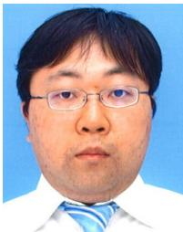

NORIHIRO TAKAMUNE received his B.E. degree in engineering and M.S. degree in information science and technology from The University of Tokyo, Tokyo, Japan, in 2012 and 2015, respectively. He is currently a researcher at The University of Tokyo. His research interests include multichannel audio source separation and machine learning.

DAICHI KITAMURA (Senior Member, IEEE) received the Ph.D. degree from SOKENDAI, Hayama, Japan. He joined The University of Tokyo, Tokyo, Japan, in 2017, as a Research Associate, and moved to the National Institute of Technology, Kagawa Collage, Takamatsu, Japan, in 2018. His research interests include audio source separation, statistical signal processing, and machine learning. He was a recipient of the Awaya Prize Young Researcher Award from the

Acoustical Society of Japan (ASJ), in 2015, the Ikushi Prize from Japan Society for the Promotion of Science, in 2017. the Best Article Award from the IEEE Signal Processing Society, Japan, in 2017, the Itakura Prize Innovative Young Researcher Award from ASJ, in 2018, and the IEEE Signa Processing Society Young Author Best Article Award, in 2019.

HIROSHI SARUWATARI (Member, IEEE) received the B.E., M.E., and Ph.D. degrees from Nagoya University, Nagoya, Japan, in 1991, 1993, and 2000, respectively. In 1993, he joined the SECOM IS Laboratory, Tokyo, Japan, and the Nara Institute of Science and Technology, Ikoma, Japan, in 2000. Since 2014, he has been a Professor with The University of Tokyo, Tokyo. His research interests include statistical audio signal processing, blind source separation, and speech

enhancement. He has put his research into the world’s first commercially available independent-component-analysis-based BSS microphone, in 2007. He was a recipient of several paper awards from IEICE in 2001 and 2006; TAF, in 2004, 2009, 2012, and 2018; IEEE-IROS2005 in 2006; and APSIPA, in 2013 and 2018. He received the DOCOMO Mobile Science Award, in 2011; the Ichimura Award, in 2013; the Commendation for Science and Technology by the Minister of Education, in 2015; the Achievement Award from IEICE, in 2017; and the Hoko-Award, in 2018. He has been professionally involved in various volunteerworks for IEEE, EURASIP, IEICE, and ASJ. Since 2018, he has been an APSIPA Distinguished Lecturer.

YU TAKAHASHI (Member, IEEE) received the B.E. degree in information engineering from the Himeji Institute of Technology, Japan, and the M.E. and Ph.D. degrees in information science from the Nara Institute of Science and Technology, Japan, in 2007 and 2010 respectively. He is currently a researcher with Yamaha corporation. His research interests include statistical signal processing for audio and music.

KAZUNOBU KONDO received the B.E., M.E. and Ph.D. degrees from Nagoya University, Japan, in 1991, 1993, and 2014, respectively. He joined the Electronics Development Center, Yamaha Co., Ltd. in 1993. He is currently a principal engineer of Yamaha Research and Development Division. His research interests include blind source separation, noise reduction, and dereverbetation. He is a member of the IEICE, the Acoustical Society of Japan and the Audio Engineering Society, and an

editorial board member of the Journal of the Audio Engineering Society.