# STFT-Domain Least-Distortion Region-of-Interest Beamforming

Gal Itzhak and Israel Cohen , Fellow, IEEE

Abstract—This paper introduces a new method for maximizing array gain beamforming while focusing on a specific area in space. The main goal is to minimize the distortion of a desired signal when there is uncertainty about its actual direction of arrival. We develop a signal model and establish appropriate constraints and measures. We propose two beamformers that minimize distortion, each optimized for either white noise gain or directivity factor. Both beamformers are controlled by a design parameter that balances array gain and average signal distortion. We conduct extensive simulations to validate our approach. We examine the nature of this parameter across different areas of interest and evaluate its impact on the performance of the proposed beamformers using relevant measures. Finally, we conduct speech-signal experiments in various noisy and reverberant environments and consider different array calibration conditions. Our results show that the proposed approach outperforms recently proposed and traditional methods in terms of speech intelligibility, quality, and mean opinion scores, especially when there are significant deviations in the direction of arrival of the desired signal and when the reverberations are mild.

Index Terms—Microphone arrays, least-distortion beamforming, region-of-interest beamforming, direction-ofarrival deviation, maximum gain.

## I. INTRODUCTION

ICROPHONE array beamforming has been an active recovery of desired signals from noisy observations. Focusing on the attenuation of undesired noise fields, beamformers have been optimized considering a variety of criteria and design constraints. These yielded numerous beamformer derivation techniques applied to different array geometries [1], [2], [3], [4], [5].

The commonly used uniform linear arrays (ULAs) are easy to design, implement, analyze, and monitor. However, this simplicity can lead to limited design flexibility and poor performance in real-world conditions. ULAs tend to perform poorly in reverberant acoustic environments and when the desired signal’s direction of arrival (DOA) differs from the nominal direction [6], [7]. More sophisticated array layouts have been proposed to mitigate these drawbacks. Rectangular arrays (RAs), for example, have performed well considering signals arriving in parallel to one of the array’s axes. Their geometric symmetry also enables optimization considering multiple design criteria at once [8]. Further advantages have been reported for DOA estimation tasks [9], [10] and in closely-positioned microphones’ settings [11], [12].

To enable preferable array steering and DOA mismatch handling in more general scenarios, layouts of a greater symmetry can be used. Circular arrays (CAs) and uniform circular arrays (UCAs), which exhibit perfect symmetry in the x − y plane, allow better control over desired performance measures. They were also demonstrated to attain a frequency-independent spatial response alongside a complete array steering [13], [14], [15]. Concentric circular arrays (CCAs) and uniform concentric circular arrays (UCCAs) generalize these layouts. As a consequence, they may provide further desired attributes, such as a consistent mainlobe beamwidth [16], [17], [18], white noise rejection [19], and potentially compact array size.

Previous methods have attempted to reduce the effects of a desired signal DOA mismatch in various ways. Several approaches have focused on an adaptive mechanism that attempts to estimate and continuously track the DOA, assuming the acoustic environments do not change rapidly and that only a single desired signal exists [20], [21], [22], [23]. They also typically assume prior knowledge or strict assumptions on the nature of the desired signal. Despite performing well in static low-noise scenarios, their performance significantly deteriorates in highly reverberant environments where accumulated estimation errors are common. They also necessitate significant real-time computational complexity that may not be realistic for practical applications. Other approaches focus on a DOA-robust design, in which a nearly distortionless response is attained near the nominal DOA [24], [25], [26], [27]. Although they were shown to perform well with minor DOA mismatches, their performance heavily drops when the DOA mismatch is larger than a few degrees.

To enable tolerance to significant DOA deviations without computationally expensive real-time estimations involved, recent studies have exploited the region-of-interest (ROI) notion. Defined as a continuous region in space from which a desired signal may impinge on the array, this notion entailed various studies that proposed alternative offline beamforming designs and array geometry optimization techniques. Unlike previous methods, these techniques did not require any real-time computations. The study in [28] focused on linear array geometry optimization, aiming to maximize the broadband array directivity for a continuous ROI while maintaining the white noise gain (WNG) over a desired threshold level. With the underlying linear layout at hand, this method could only address small ROIs. It also lacked flexibility for attaining desired array characteristics, such as the mainlobe beamwidth. In [29] an RA was used. It was composed of a uniform layout along one axis and a non-uniform layout along the other. This approach offered more flexibility and ensured a constant mainlobe beamwidth and an aperture-dependent threshold frequency. Nevertheless, it only addressed limited ROIs and required physically large arrays with many microphones.

Successive studies utilized the underlying CCA symmetry to support greater ROIs. In [30], a beamforming method based on the sparse concentric circular array (SCCA) was introduced. The main idea involved optimizing the sparse locations of a small subset of array microphones out of a dense UCCA. The derivation of appropriate weights is then followed by maximizing the resulting array directivity in two distinct ways. Indeed, this approach demonstrated superior performance for greater ROIs. Unfortunately, the derivation method of the beamformer weights was highly suboptimal as it did not directly account for the desired ROI, leaving much room for performance improvements. The study in [31] proposed a joint array geometry and beamformer weights optimization scheme that relied on a sparse circular sector array (SCSA) layout. Compared to previous methods, this approach exhibited superior array directivity when significant DOA deviations were involved. However, its formulation fell short in strictly requiring a distortionless response for all directions within the ROI. Moreover, the SCSA layout, combined with the underlying optimization problem, limited the number of array microphones and their possible locations on the array.

This paper introduces a maximum array gain beamforming approach that minimizes signal distortion across the entire ROI. By generalizing the traditional signal model, we formulate the problem settings to account for all directions within the ROI directly. We derive generalized constraints and performance measures accordingly, including the celebrated directivity factor (DF) and WNG. Two least-distortion beamformers are proposed and optimized with respect to these performance measures; each may be tuned to increase the array gain or reduce the desired signal distortion. This is attained by appropriately configuring a design parameter that depends on the ROI. We perform a series of extensive simulations, including analyzing this design parameter and thoroughly investigating the derived performance measures. We end with rigorous simulations of speech signals in noisy and reverberant environments, considering different array calibration conditions. Compared to recently proposed and traditional methods from the literature, our approach yields superior speech intelligibility. It also exhibits preferable speech quality and deep noise suppression mean opinion scores (DNSMOS), as well as greater robustness to array miscalibration when significant DOA deviations are considered and the level of reverberations is mild.

The rest of the paper is organized as follows. Section II presents the signal model and the basic mathematical notations. In Section III, we formulate the problem to address an entire ROI and define measures and principles accordingly. Section IV is dedicated to deriving the appropriate performance measures considering an ROI. Section V introduces two least-distortion beamformers and discusses the flexibility in tuning their performance. Section VI includes extensive simulations to analyze the proposed beamformers from multiple theoretical perspectives and various noisy and reverberant simulations with speech signals. It additionally covers array miscalibration conditions.

## II. SIGNAL MODEL AND PROBLEM FORMULATION

We consider the following signal model

$$
\begin{array}{r l} & y _ {m} (t) = g _ {m} (t) * x (t) + v _ {m} (t) \\ & \qquad = d _ {m} (t) * x _ {1} (t) + v _ {m} (t) \\ & \qquad = x _ {m} (t) + v _ {m} (t), m = 1, 2, \ldots , M, \end{array}\tag{1}
$$

where $y _ { m } ( t ) , x _ { m } ( t )$ , and $v _ { m } ( t )$ are, respectively, the observation, convolved desired, and additive noise signals at the mth sensor, with M being the number of sensors, and the array geometry is arbitrary. The impulse response from the desired source location to the mth sensor is $g _ { m } ( t )$ , and the corresponding relative impulse response is $d _ { m } ( t )$ , where Sensor 1 is chosen as the reference sensor.

In the STFT domain, (1) can be written as

$$
Y _ {m} (k, r) = X _ {m} (k, r) + V _ {m} (k, r),\tag{2}
$$

where $Y _ { m } ( k , r ) , X _ { m } ( k , r )$ , and $V _ { m } ( k , r )$ are the STFT representations of $y _ { m } ( t ) , x _ { m } ( t )$ and $v _ { m } ( t )$ , respectively, at the subband index $k \in \{ 0 , 1 , \ldots , K - 1 \}$ and the time-frame index r. $X _ { m } ( k , r )$ and $V _ { m } ( k , r )$ are assumed to be zero mean and uncorrelated.

Approximating the relative impulse response $d _ { m } ( t )$ as a noncausal finite-length filter and assuming that the length of the STFT analysis window is sufficiently larger than the effective support of the relative impulse response, we can apply the multiplicative transfer function (MTF) approximation [32] and write the convolved desired signal at the mth sensor as

$$
X _ {m} (k, r) = D _ {m} (k, \theta_ {\mathrm{d}}, \phi_ {\mathrm{d}}) X _ {1} (k, r),\tag{3}
$$

where $D _ { m } ( k , \theta _ { \mathrm { d } } , \phi _ { \mathrm { d } } )$ is the DFT of the truncated FIR version of $d _ { m } ( t )$ . The direction of the desired source, denoted as $( \theta _ { \mathrm { d } } , \phi _ { \mathrm { d } } )$ , is explicitly added as a parameter of $D _ { m }$ to highlight the functional dependence of $d _ { m } ( t )$ on the directional coordinates of the desired source.

Writing the M STFT representations of the sensors’ signals in a vector notation and denoting the transpose operator by the superscript $_ T$ , we have

$$
\begin{array}{r l} & {\mathbf {y} (k, r) = \left[ Y _ {1} (k, r) \quad Y _ {2} (k, r) \quad \dots \quad Y _ {M} (k, r) \right] ^ {T}} \\ & {\qquad = \mathbf {d} (k, \theta_ {\mathrm{d}}, \phi_ {\mathrm{d}}) X _ {1} (k, r) + \mathbf {v} (k, r)} \\ & {\qquad = \mathbf {x} (k, r) + \mathbf {v} (k, r),} \end{array}\tag{4}
$$

where

$$
\begin{array}{c} \mathbf {d} (k, \theta_ {\mathrm{d}}, \phi_ {\mathrm{d}}) = \left[ \begin{array}{c c} D _ {1} (k, \theta_ {\mathrm{d}}, \phi_ {\mathrm{d}}) & D _ {2} (k, \theta_ {\mathrm{d}}, \phi_ {\mathrm{d}}) \\ \dots & D _ {M} (k, \theta_ {\mathrm{d}}, \phi_ {\mathrm{d}}) \end{array} \right] ^ {T}, \end{array}\tag{5}
$$

can be seen as the relative transfer function from the desired source location to the sensor array relative to the reference sensor, and ${ \bf x } ( k , r )$ and $\mathbf { v } ( k , r )$ are defined similarly to ${ \bf y } ( k , r )$

The covariance matrix of $\mathbf { y } ( k , r )$ is

$$
\begin{array}{r l} & {\mathbf {\Phi_ {y}} (k, r) = E \left[ \mathbf {y} (k, r) \mathbf {y} ^ {H} (k, r) \right]} \\ & {\qquad = \mathbf {\Phi_ {x}} (k, r) + \mathbf {\Phi_ {v}} (k, r)} \\ & {\qquad = \phi_ {X _ {1}} (k, r) \mathbf {d} (k, \theta_ {\mathrm{d}}, \phi_ {\mathrm{d}}) \mathbf {d} ^ {H} (k, \theta_ {\mathrm{d}}, \phi_ {\mathrm{d}}) + \mathbf {\Phi_ {v}} (k, r),} \end{array}\tag{6}
$$

where the superscript H is the conjugate-transpose operator, $\phi _ { X _ { 1 } } ( k , r ) = E [ | X _ { 1 } ( k , r ) | ^ { 2 } ]$ is the variance of $X _ { 1 } ( k , r )$ $\Phi _ { \mathbf { x } } ( k , r ) = E [ \mathbf { x } ( k , r ) \mathbf { x } ^ { H } ( k , r ) ]$ is the covariance matrix of ${ \bf x } ( k , r )$ , and $\Phi _ { \mathbf { v } } ( k , r ) = E [ \mathbf { v } ( k , r ) \mathbf { v } ^ { H } ( k , r ) ]$ is the covariance matrix of $\mathbf { v } ( k , r )$

Our objective is to design optimal beamformers in the STFT domain for a given ROI $\Omega ( \phi _ { \mathrm { d } } \in \Phi _ { \Omega } , \theta _ { \mathrm { d } } \in \Theta _ { \Omega } )$ using M complex gains for each subband:

$$
\mathbf {h} (k, r) = \left[ \begin{array}{c c c c} H _ {1} (k, r) & H _ {2} (k, r) & \dots & H _ {M} (k, r) \end{array} \right] ^ {T},\tag{7}
$$

where $\Phi _ { \Omega }$ and $\Theta _ { \Omega }$ are the spatial regions that compose the ROI concerning the azimuth and elevation angles, respectively, and $H _ { m } ( k , r )$ is the complex gain applied to the mth sensor output at the time-frequency bin $( k , r )$ . Note that, as the ROI is defined merely by the azimuth and elevation angles, the following formulation and derivations are suited to describe far-field sources and compact arrays for which the distance is not taken into account explicitly.

## III. REGION-OF-INTEREST BEAMFORMING

In the STFT domain, beamforming with multiplicative gains is performed by applying a complex weight to the output of each sensor at the time-frequency bin $( k , r )$ , and summing across the aperture:

$$
\begin{array}{l} Z (k, r) = \sum_ {m = 1} ^ {M} H _ {m} ^ {*} (k, r) Y _ {m} (k, r) \\ \qquad = \mathbf {h} ^ {H} (k, r) \mathbf {y} (k, r) \\ \qquad = X _ {\mathrm{fd}} (k, r) + V _ {\mathrm{rn}} (k, r), \end{array}\tag{8}
$$

where the superscript ∗ is the complex-conjugate operator,

$$
X _ {\mathrm{fd}} (k, r) = X _ {1} (k, r) \mathbf {h} ^ {H} (k, r) \mathbf {d} (k, \theta_ {\mathrm{d}}, \phi_ {\mathrm{d}})\tag{9}
$$

is the filtered desired signal, and

$$
V _ {\mathrm{rn}} (k, r) = \mathbf {h} ^ {H} (k, r) \mathbf {v} (k, r)\tag{10}
$$

is the residual noise. Hence, the variance of $Z ( k , r )$ is the sum of two variances:

$$
\begin{array}{c} \phi_ {Z} (k, r) = \mathbf {h} ^ {H} (k, r) \boldsymbol {\Phi} _ {\mathbf {y}} (k, r) \mathbf {h} (k, r) \\ = \phi_ {X _ {\mathrm{fd}}} (k, r) + \phi_ {V _ {\mathrm{rn}}} (k, r), \end{array}\tag{11}
$$

where

$$
\begin{array}{c} \phi_ {X _ {\mathrm{fd}}} (k, r) = \mathbf {h} ^ {H} (k, r) \boldsymbol {\Phi} _ {\mathbf {x}} (k, r) \mathbf {h} (k, r) \\ = \phi_ {X _ {1}} (k, r) \left| \mathbf {h} ^ {H} (k, r) \mathbf {d} (k, \theta_ {\mathrm{d}}, \phi_ {\mathrm{d}}) \right| ^ {2} \end{array}\tag{12}
$$

is the variance of $X _ { \mathrm { f d } } ( k , r )$ , and

$$
\phi_ {V _ {\mathrm{m}}} (k, r) = \mathbf {h} ^ {H} (k, r) \boldsymbol {\Phi} _ {\mathbf {v}} (k, r) \mathbf {h} (k, r)\tag{13}
$$

is the variance of $V _ { \mathrm { { r n } } } ( k , r )$

From (9) we see that for a given DOA $( \theta _ { \mathrm { d } } , \phi _ { \mathrm { d } } )$ , the distortionless constraint is

$$
\mathbf {h} ^ {H} (k, r) \mathbf {d} (k, \theta_ {\mathrm{d}}, \phi_ {\mathrm{d}}) = 1.\tag{14}
$$

For a given ROI Ω, we would like to minimize the average distortion over the entire ROI

$$
\begin{array}{l} J _ {\mathrm{d}, \Omega} \left[ \mathbf {h} (k, r) \right] = \frac {1}{| \Omega |} \\ \qquad \times \iint_ {(\theta , \phi) \in \Omega} \left| \mathbf {h} ^ {H} (k, r) \mathbf {d} (k, \theta , \phi) - 1 \right| ^ {2} \sin \theta \mathrm{d} \phi \mathrm{d} \theta \end{array}\tag{15}
$$

where

$$
| \Omega | = \iint_ {(\phi , \theta) \in (\Phi_ {\Omega}, \Theta_ {\Omega})} \sin \theta \mathrm{d} \phi \mathrm{d} \theta .\tag{16}
$$

The ROI-distortion constraint is obtained by taking the gradient of the average distortion over the entire ROI, $J _ { \mathrm { d } , \Omega } [ \mathbf { h } ( k , r ) ]$ ], with respect to the complex conjugate of $\mathbf { h } ( k , r )$ and equating the result to zero. We can rewrite $J _ { \mathrm { d } , \Omega } [ \mathbf { h } ( k , r ) ]$ from (15) as

$$
\begin{array}{c} J _ {\mathrm{d}, \Omega} [ \mathbf {h} (k, r) ] = \mathbf {h} ^ {H} (k, r) \boldsymbol {\Gamma} _ {\mathbf {d}, \Omega} (k) \mathbf {h} (k, r) \\ - \mathbf {h} ^ {H} (k, r) \mathbf {d} _ {\Omega} (k) - \mathbf {d} _ {\Omega} ^ {H} (k, r) \mathbf {h} (k, r) + 1 \end{array}\tag{17}
$$

where

$$
\mathbf {\Gamma} _ {\mathbf {d}, \Omega} (k) = \frac {1}{| \Omega |} \iint_ {(\theta , \phi) \in \Omega} \mathbf {d} (k, \theta , \phi) \mathbf {d} ^ {H} (k, \theta , \phi) \sin \theta \mathrm{d} \phi \mathrm{d} \theta\tag{18}
$$

$$
\mathbf {d} _ {\Omega} (k) = \frac {1}{| \Omega |} \iint_ {(\theta , \phi) \in \Omega} \mathbf {d} (k, \theta , \phi) \sin \theta \mathrm{d} \phi \mathrm{d} \theta .\tag{19}
$$

Therefore, the ROI-distortion constraint for Ω is given by

$$
\mathbf {\Gamma_ {d , \Omega}} (k) \mathbf {h} (k, r) = \mathbf {d} _ {\Omega} (k).\tag{20}
$$

Note that, generally, it is not possible to obtain explicit expressions for $\Gamma _ { \mathbf { d } , \Omega } ( k )$ as defined in (18), and ${ \bf d } _ { \Omega } ( k )$ as defined in (29). However, we can compute them by numerical integration.

## IV. PERFORMANCE MEASURES

This section defines the appropriate performance measures for calculating and studying ROI beamformers with multiplicative gains in the STFT domain.

To begin with, the subband input SNR is defined as

$$
\mathrm{iSNR} (k, r) = \frac {\phi_ {X _ {1}} (k , r)}{\phi_ {V _ {1}} (k , r)}.\tag{21}
$$

The broadband input SNR is obtained by summing the numerator and denominator of $\mathrm { i } \mathrm { S N R } ( k , r )$ over all time-frequency indices. We have

$$
\mathrm{iSNR} = \frac {\sum_ {k , r} \phi_ {X _ {1}} (k , r)}{\sum_ {k , r} \phi_ {V _ {1}} (k , r)},\tag{22}
$$

where $\phi _ { V _ { 1 } } ( k , r ) = E [ | V _ { 1 } ( k , r ) | ^ { 2 } ]$ is the variance of the noise at the reference sensor.

The output SNR quantifies the SNR after beamforming. From (11), we deduce that for a given DOA $( \theta , \phi )$ , the subband output SNR is given by

$$
\begin{array}{l} \text { oSNR } \left[ \mathbf {h} (k, r), \theta , \phi \right] = \frac {\phi_ {X _ {\mathrm{fd}}} (k , r)}{\phi_ {V _ {\mathrm{rn}}} (k , r)} \\ = \frac {\phi_ {X _ {1}} (k , r) \left| \mathbf {h} ^ {H} (k , r) \mathbf {d} (k , \theta , \phi) \right| ^ {2}}{\mathbf {h} ^ {H} (k , r) \boldsymbol {\Phi} _ {\mathbf {v}} (k , r) \mathbf {h} (k , r)}. \end{array}\tag{23}
$$

We can define the subband array gain for $( \theta , \phi )$ accordingly as

$$
\begin{array}{l} \mathcal {G} \left[ \mathbf {h} (k, r), \theta , \phi \right] = \frac {\mathrm{oSNR} \left[ \mathbf {h} (k , r) , \theta , \phi \right]}{\mathrm{iSNR} (\mathrm{k} , \mathrm{r})} \\ = \frac {\left| \mathbf {h} ^ {H} (k , r) \mathbf {d} (k , \theta , \phi) \right| ^ {2}}{\mathbf {h} ^ {H} (k , r) \boldsymbol {\Gamma_ {\mathbf {v}}} (k , r) \mathbf {h} (k , r)}, \end{array}\tag{24}
$$

where $\Gamma _ { \mathbf { v } } ( k , r ) = \Phi _ { \mathbf { v } } ( k , r ) / \phi _ { V _ { 1 } } ( k , r )$ denotes the normalized covariance matrix of $\mathbf { v } ( k , r )$

For a given ROI Ω, the subband output SNR is given by

$$
\begin{array}{l} \text {oSNR} _ {\Omega} \left[ \mathbf {h} (k, r) \right] = \frac {\phi_ {X _ {1}} (k , r)}{\phi_ {V _ {1}} (k , r)} \times \frac {1}{| \Omega |} \\ \quad \times \frac {\iint_ {(\theta , \phi) \in \Omega} \left| \mathbf {h} ^ {H} (k , r) \mathbf {d} (k , \theta , \phi) \right| ^ {2} \sin \theta \mathrm{d} \phi \mathrm{d} \theta}{\mathbf {h} ^ {H} (k , r) \boldsymbol {\Gamma} _ {\mathbf {v}} (k , r) \mathbf {h} (k , r)} \\ = \frac {\phi_ {X _ {1}} (k , r)}{\phi_ {V _ {1}} (k , r)} \times \frac {\mathbf {h} ^ {H} (k , r) \boldsymbol {\Gamma} _ {\mathbf {d} , \Omega} (k) \mathbf {h} (k , r)}{\mathbf {h} ^ {H} (k , r) \boldsymbol {\Gamma} _ {\mathbf {v}} (k , r) \mathbf {h} (k , r)}. \end{array}\tag{25}
$$

Hence, the subband array gain for Ω is

$$
\begin{array}{c} \mathcal {G} _ {\Omega} \left[ \mathbf {h} (k, r) \right] = \frac {\mathrm{oSNR} _ {\Omega} \left[ \mathbf {h} (k , r) \right]}{\mathrm{iSNR} (k , r)} \\ = \frac {\mathbf {h} ^ {H} (k , r) \boldsymbol {\Gamma} _ {\mathbf {d} , \Omega} (k) \mathbf {h} (k , r)}{\mathbf {h} ^ {H} (k , r) \boldsymbol {\Gamma} _ {\mathbf {v}} (k , r) \mathbf {h} (k , r)}. \end{array}\tag{26}
$$

The WNG is defined as the array gain for spatiotemporal white noise. Hence, the subband WNG is given by

$$
\mathcal {W} _ {\Omega} \left[ \mathbf {h} (k, r) \right] = \frac {\mathbf {h} ^ {H} (k , r) \boldsymbol {\Gamma} _ {\mathbf {d} , \Omega} (k) \mathbf {h} (k , r)}{\mathbf {h} ^ {H} (k , r) \mathbf {h} (k , r)}.\tag{27}
$$

Similarly, we may define the broadband WNG by

$$
\begin{array}{l} \mathcal {W} _ {\Omega} ^ {\mathrm{BB}} [ \mathbf {h} ] = \frac {\sum_ {k , r} \phi_ {V _ {1}} (k , r)}{\sum_ {k , r} \phi_ {X _ {1}} (k , r)} \\ \times \frac {\sum_ {k , r} \phi_ {X _ {1}} (k , r) \mathbf {h} ^ {H} (k , r) \boldsymbol {\Gamma} _ {\mathbf {d} , \Omega} (k) \mathbf {h} (k , r)}{\sum_ {k , r} \phi_ {V _ {1}} (k , r) \mathbf {h} ^ {H} (k , r) \mathbf {h} (k , r)}. \end{array}\tag{28}
$$

The DF is defined as the array gain for a spatially diffuse noise field. The pseudo-correlation matrix of diffuse noise is given by

$$
\boldsymbol {\Gamma} _ {0} (k) = \frac {1}{4 \pi} \int_ {0} ^ {\pi} \int_ {0} ^ {2 \pi} \mathbf {d} (k, \theta , \phi) \mathbf {d} ^ {H} (k, \theta , \phi) \sin \theta \mathrm{d} \phi \mathrm{d} \theta .\tag{29}
$$

Hence, the subband DF is given by

$$
\mathcal {D} _ {\Omega} \left[ \mathbf {h} (k, r) \right] = \frac {\mathbf {h} ^ {H} (k , r) \boldsymbol {\Gamma} _ {\mathbf {d} , \Omega} (k) \mathbf {h} (k , r)}{\mathbf {h} ^ {H} (k , r) \boldsymbol {\Gamma} _ {0} (k) \mathbf {h} (k , r)},\tag{30}
$$

and the broadband DF is

$$
\begin{array}{l} \mathcal {D} _ {\Omega} ^ {\mathrm{BB}} \left[ \mathbf {h} \right] = \frac {\sum_ {k , r} \phi_ {V _ {1}} (k , r)}{\sum_ {k , r} \phi_ {X _ {1}} (k , r)} \\ \qquad \times \frac {\sum_ {k , r} \phi_ {X _ {1}} (k , r) \mathbf {h} ^ {H} (k , r) \boldsymbol {\Gamma} _ {\mathbf {d} , \Omega} (k) \mathbf {h} (k , r)}{\sum_ {k , r} \phi_ {V _ {1}} (k , r) \mathbf {h} ^ {H} (k , r) \boldsymbol {\Gamma} _ {0} (k) \mathbf {h} (k , r)}. \end{array}\tag{31}
$$

Describing the spatial response of the beamformer, the power beampattern is defined as

$$
\left| \mathcal {B} [ \mathbf {h} (k, r), \theta , \phi ] \right| ^ {2} = \left| \mathbf {h} ^ {H} (k, r) \mathbf {d} (k, \theta , \phi) \right| ^ {2}.\tag{32}
$$

It may be easily shown that the subband DF is related to the power beampattern by

$$
\mathcal {D} _ {\Omega} \left[ \mathbf {h} (k, r) \right] = \frac {4 \pi \iint_ {(\theta , \phi) \in \Omega} | \mathcal {B} [ \mathbf {h} (k , r) , \theta , \phi ] | ^ {2} \sin \theta \mathrm{d} \phi \mathrm{d} \theta}{| \Omega | \int_ {0} ^ {\pi} \int_ {0} ^ {2 \pi} | \mathcal {B} [ \mathbf {h} (k , r) , \theta , \phi ] | ^ {2} \sin \theta \mathrm{d} \phi \mathrm{d} \theta}.\tag{33}
$$

In practice, most beamformers distort the desired signal. To quantify the level of this distortion, we define the desired signal reduction factor as the ratio of the variance of the desired signal at the reference sensor over the variance of the desired signal at the beamformer output. For a given ROI Ω, the subband desired signal reduction factor is given by

$$
\xi_ {\mathrm{d}, \Omega} [ \mathbf {h} (k, r) ] = \frac {1}{\mathbf {h} ^ {H} (k , r) \boldsymbol {\Gamma} _ {\mathbf {d} , \Omega} (k) \mathbf {h} (k , r)},\tag{34}
$$

and the broadband desired signal reduction factor is

$$
\xi_ {\mathrm{d}, \Omega} ^ {\mathrm{BB}} [ \mathbf {h} ] = \frac {\sum_ {k , r} \phi_ {X _ {1}} (k , r)}{\sum_ {k , r} \phi_ {X _ {1}} (k , r) \mathbf {h} ^ {H} (k , r) \boldsymbol {\Gamma} _ {\mathbf {d} , \Omega} (k) \mathbf {h} (k , r)}.\tag{35}
$$

The closer the value of $\xi _ { \mathrm { d } , \Omega } ( \mathbf { h } )$ is to 1, the less distorted the desired signal.

## V. OPTIMAL LEAST-DISTORTION ROI BEAMFORMERS

This section introduces a methodology for deriving optimal multiplicative gains for ROI beamforming in the STFT domain. Our main goal is to explain how to maximize the array gain for a specific ROI while satisfying the distortion constraint.

## A. Least-Distortion Maximum WNG

The least-distortion maximum WNG (LD-MWNG) beamformer is derived by maximizing the subband WNG subject to the ROI-distortion constraint. In this case, the multiplicative gains $\mathbf { h } ( k , r )$ become independent of the time-frame index r. Hence, the optimization problem of the least-distortion maximum WNG beamformer can be formulated as

$$
\max _ {\mathbf {h} (k)} \frac {\mathbf {h} ^ {H} (k) \boldsymbol {\Gamma} _ {\mathbf {d} , \Omega} (k) \mathbf {h} (k)}{\mathbf {h} ^ {H} (k) \mathbf {h} (k)} \text {s.t.} \boldsymbol {\Gamma} _ {\mathbf {d}, \Omega} (k) \mathbf {h} (k) = \mathbf {d} _ {\Omega} (k).\tag{36}
$$

To solve this problem, let us assume that rank $\left[ \mathbf { T _ { d , \Omega } } ( k ) \right] =$ $P \leq M$ . Using the eigenvalue decomposition, the $M \times M$ Hermitian matrix $\Gamma _ { \mathbf { d } , \Omega } ( k )$ can be diagonalized as

$$
\mathbf {Q} ^ {H} \boldsymbol {\Gamma} _ {\mathbf {d}, \Omega} (k) \mathbf {Q} = \boldsymbol {\Lambda},\tag{37}
$$

where

$$
\mathbf {Q} = \left[ \begin{array}{c c c c} \mathbf {q} _ {1} & \mathbf {q} _ {2} & \dots & \mathbf {q} _ {M} \end{array} \right]\tag{38}
$$

is a unitary matrix, i.e., $\mathbf { Q } ^ { H } \mathbf { Q } = \mathbf { Q } \mathbf { \Lambda } \mathbf { Q } ^ { H } = \mathbf { I } _ { M }$ and

$$
\boldsymbol {\Lambda} = \operatorname{diag} \left(\lambda_ {1}, \lambda_ {2}, \dots , \lambda_ {M}\right)\tag{39}
$$

is a diagonal matrix whose main elements are real and nonnegative. The orthonormal vectors $\mathbf { q } _ { 1 } , \mathbf { q } _ { 2 } , \dots , \mathbf { q } _ { M }$ are the eigenvectors corresponding, respectively, to the eigenvalues $\lambda _ { 1 } , \lambda _ { 2 } , \dots , \lambda _ { M }$ of the matrix $\Gamma _ { \mathbf { d } , \Omega } ( k )$ , where $\lambda _ { 1 } \geq \lambda _ { 2 } \geq \cdot \cdot \cdot \geq$ $\lambda _ { P } > 0$ and $\lambda _ { P + 1 } = \lambda _ { P + 2 } = \cdot \cdot \cdot = \lambda _ { M } = 0$ . It is convenient to break the matrix Q into two parts, corresponding to the nonzero and the zero eigenvalues. Let

$$
\mathbf {Q} = \left[ \begin{array}{c c} \mathbf {Q} _ {1} & \mathbf {Q} _ {2} \end{array} \right],\tag{40}
$$

where the $M \times P$ matrix $\mathbf { Q } _ { 1 }$ contains the eigenvectors corresponding to the nonzero eigenvalues of $\Gamma _ { \mathbf { d } , \Omega } ( k )$ , and the $M \times$ $( M - P )$ matrix $\mathbf { Q } _ { 2 }$ contains the eigenvectors corresponding to the null eigenvalues of $\Gamma _ { \mathbf { d } , \Omega } ( k )$ . We can express $\mathbf { h } ( k )$ as

$$
\begin{array}{c} \mathbf {h} (k) = \mathbf {Q} \mathbf {a} \\ = \mathbf {Q} _ {1} \mathbf {a} _ {1} + \mathbf {Q} _ {2} \mathbf {a} _ {2} \end{array}\tag{41}
$$

where $\mathbf { a } = \left[ \mathbf { a } _ { 1 } ^ { T } \mathbf { a } _ { 2 } ^ { T } \right] ^ { T }$ is the transformed beamformer of length $M , \mathbf { a } _ { 1 }$ - contains the first $P$ elements of a, and $\mathbf { a } _ { 2 }$ contains the remaining $M - P$ elements of a. Instead of optimizing h(k) directly, we can, equivalently, optimize a, since Q is an orthogonal matrix. So when a is obtained, we can easily find h(k) from (41).

Using (37) and (41), we can write the optimization problem of the least-distortion maximum WNG beamformer as

$$
\max _ {\mathbf {a}} \frac {\mathbf {a} ^ {H} \boldsymbol {\Lambda} \mathbf {a}}{\mathbf {a} ^ {H} \mathbf {a}} \mathrm{s.t.} \boldsymbol {\Lambda} \mathbf {a} = \mathbf {Q} ^ {H} \mathbf {d} _ {\Omega} (k),\tag{42}
$$

or equivalently as

$$
\max _ {\mathbf {a}} \frac {\mathbf {a} _ {1} ^ {H} \boldsymbol {\Lambda} _ {1} \mathbf {a} _ {1}}{\mathbf {a} _ {1} ^ {H} \mathbf {a} _ {1} + \mathbf {a} _ {2} ^ {H} \mathbf {a} _ {2}} \mathrm{s.t.} \boldsymbol {\Lambda} _ {1} \mathbf {a} _ {1} = \mathbf {Q} _ {1} ^ {H} \mathbf {d} _ {\Omega} (k),\tag{43}
$$

where $\pmb { \Lambda } _ { 1 } = \mathrm { d i a g } \{ \lambda _ { p } \} _ { p = 1 } ^ { P }$ . Since $\mathbf { \Lambda } _ { \Lambda _ { 1 } }$ is invertible, the constraint in (43) imposes

$$
\mathbf {a} _ {1} = \boldsymbol {\Lambda} _ {1} ^ {- 1} \mathbf {Q} _ {1} ^ {H} \mathbf {d} _ {\Omega} (k),\tag{44}
$$

and maximization of the WNG in (43) under this constraint is obtained for $\mathbf { a } _ { 2 } = \mathbf { 0 }$ . Hence, the least-distortion maximum WNG beamformer is

$$
\begin{array}{c} \mathbf {h} _ {\mathrm{LD-MWNG}} (k) = \mathbf {Q} _ {1} (k)   \boldsymbol {\Lambda} _ {1} ^ {- 1} (k)   \mathbf {Q} _ {1} ^ {H} (k) \mathbf {d} _ {\Omega} (k) \\ = \left[ \sum_ {p = 1} ^ {P} \frac {\mathbf {q} _ {p} (k) \mathbf {q} _ {p} ^ {H} (k)}{\lambda_ {p} (k)} \right] \mathbf {d} _ {\Omega} (k), \end{array}\tag{45}
$$

where the variable k has been added to $Q$ and Λ to highlight their dependence on the subband. We deduce that the corresponding

subband WNG is

$$
\mathcal {W} _ {\Omega} \left[ \mathbf {h} _ {\mathrm{LD-MWNG}} (k) \right] = \frac {\mathbf {d} _ {\Omega} ^ {H} (k) \mathbf {Q} _ {1} (k) \boldsymbol {\Lambda} _ {1} ^ {- 1} (k) \mathbf {Q} _ {1} ^ {H} (k) \mathbf {d} _ {\Omega} (k)}{\mathbf {d} _ {\Omega} ^ {H} (k) \mathbf {Q} _ {1} (k) \boldsymbol {\Lambda} _ {1} ^ {- 2} (k) \mathbf {Q} _ {1} ^ {H} (k) \mathbf {d} _ {\Omega} (k)}.\tag{46}
$$

The least-distortion maximum WNG beamformer, ${ \bf h } _ { \mathrm { L D - M W N G } } ( k )$ , minimizes the average distortion over the entire ROI, $J _ { \mathrm { d } , \Omega } [ \mathbf { h } ( k ) ]$ as defined in (15) or (17). A practical approach that can give a compromise between WNG and desired signal distortion is to limit the summation in (45):

$$
\mathbf {h} _ {\mathrm{LD-MWNG}, K} (k) = \left[ \sum_ {p = 1} ^ {K} \frac {\mathbf {q} _ {p} (k) \mathbf {q} _ {p} ^ {H} (k)}{\lambda_ {p} (k)} \right] \mathbf {d} _ {\Omega} (k)\tag{47}
$$

where $1 \leq K \leq P$ . The WNG that is obtained using ${ \bf h } _ { \mathrm { L D - M W N G } , K } ( k )$ increases as K decreases, but at the cost ofincreasing the average distortion over $\Omega , J _ { \mathrm { d } , \Omega } [ \mathbf { h } _ { \mathrm { L D - M W N G } , K } ( k ) ]$ We have

$$
\begin{array}{c} \lambda_ {1} (k) = \mathcal {W} _ {\Omega} \left[ \mathbf {h} _ {\mathrm{LD-MWNG}, 1} (k) \right] \geq \dots \\ \geq \mathcal {W} _ {\Omega} \left[ \mathbf {h} _ {\mathrm{LD-MWNG}, P} (k) \right], \end{array}\tag{48}
$$

and

$$
J _ {\mathrm{d}, \Omega} \left[ \mathbf {h} _ {\mathrm{LD-MWNG}, 1} (k) \right] \geq \dots \geq J _ {\mathrm{d}, \Omega} \left[ \mathbf {h} _ {\mathrm{LD-MWNG}, P} (k) \right].\tag{49}
$$

The maximum WNG that can be obtained without imposing the ROI-distortion constraint is given by:

$$
\max _ {\mathbf {h} (k)} \frac {\mathbf {h} ^ {H} (k) \boldsymbol {\Gamma} _ {\mathbf {d} , \Omega} (k) \mathbf {h} (k)}{\mathbf {h} ^ {H} (k) \mathbf {h} (k)}.\tag{50}
$$

Hence, the unconstrained maximum subband WNG beamformer is

$$
\mathbf {h} _ {\max} (k) = \varsigma (k) \mathbf {q} _ {1} (k),\tag{51}
$$

where $\varsigma ( k ) \ne 0$ is an arbitrary complex number, and the maximum subband WNG is

$$
\mathcal {W} _ {\Omega} \left[ \mathbf {h} _ {\max} (k) \right] = \lambda_ {1} (k).\tag{52}
$$

Substituting (51) into (17), taking the derivative of $J _ { \mathrm { d } , \Omega } [ \mathbf { h } _ { \operatorname* { m a x } } ( k ) ]$ with respect ${ \mathrm { t o ~ } } \varsigma ( k )$ and equating the result to zero yields the unconstrained maximum WNG beamformer that minimizes the average distortion over Ω:

$$
\mathbf {h} _ {\max, 1} (k) = \frac {\mathbf {q} _ {1} (k) \mathbf {q} _ {1} ^ {H} (k) \mathbf {d} _ {\Omega} (k)}{\lambda_ {1} (k)}.\tag{53}
$$

We see that $\mathbf { h } _ { \mathrm { L D - M W N G } , P } ( k ) = \mathbf { h } _ { \mathrm { L D - M W N G } } ( k ) .$ hL $\mathbf { D } \mathbf { - } \mathrm { M W N G } , 1  \big ( k \big ) = \mathbf { h } _ { \operatorname* { m a x } , 1 } ( k )$

When the ROI Ω is reduced to a single DOA $( \theta _ { \mathrm { d } } , \phi _ { \mathrm { d } } )$ , the optimization problem in (36) simplifies to

$$
\min _ {\mathbf {h} (k)} \mathbf {h} ^ {H} (k) \mathbf {h} (k) \text { s.t. } \mathbf {h} ^ {H} (k) \mathbf {d} (k, \theta_ {\mathrm{d}}, \phi_ {\mathrm{d}}) = 1,\tag{54}
$$

and the least-distortion maximum WNG beamformer reduces to the delay-and-sum beamformer:

$$
\mathbf {h} _ {\mathrm{DS}} (k, \theta_ {\mathrm{d}}, \phi_ {\mathrm{d}}) = \frac {\mathbf {d} (k , \theta_ {\mathrm{d}} , \phi_ {\mathrm{d}})}{\mathbf {d} ^ {H} (k , \theta_ {\mathrm{d}} , \phi_ {\mathrm{d}}) \mathbf {d} (k , \theta_ {\mathrm{d}} , \phi_ {\mathrm{d}})}.\tag{55}
$$

The corresponding WNG is given by

$$
\mathcal {W} \left[ \mathbf {h} _ {\mathrm{DS}} \left(k, \theta_ {\mathrm{d}}, \phi_ {\mathrm{d}}\right) \right] = \mathbf {d} ^ {H} (k, \theta_ {\mathrm{d}}, \phi_ {\mathrm{d}}) \mathbf {d} (k, \theta_ {\mathrm{d}}, \phi_ {\mathrm{d}}).\tag{56}
$$

## B. Least-Distortion Maximum DF

To find the least-distortion maximum DF (LD-MDF) beamformer, we need to maximize the subband DF in (30) subject to the ROI-distortion constraint in (20), i.e.,

$$
\max _ {\mathbf {h} (k)} \frac {\mathbf {h} ^ {H} (k) \boldsymbol {\Gamma} _ {\mathbf {d} , \Omega} (k) \mathbf {h} (k)}{\mathbf {h} ^ {H} (k) \boldsymbol {\Gamma} _ {0} (k) \mathbf {h} (k)} \text { s.t. } \boldsymbol {\Gamma} _ {\mathbf {d}, \Omega} (k) \mathbf {h} (k) = \mathbf {d} _ {\Omega} (k).\tag{57}
$$

Since $\mathbf { \Gamma } \Gamma _ { 0 } ( k )$ has full rank, the two Hermitian matrices $\Gamma _ { \mathbf { d } , \Omega } ( k )$ and $\Gamma _ { 0 } ( k )$ can be jointly diagonalized via the GEVD as follows:

$$
\mathbf {T} ^ {H} \boldsymbol {\Gamma} _ {\mathbf {d}, \Omega} (k) \mathbf {T} = \boldsymbol {\Lambda},\tag{58}
$$

$$
\mathbf {T} ^ {H} \boldsymbol {\Gamma} _ {0} (k) \mathbf {T} = \mathbf {I} _ {M},\tag{59}
$$

where $\mathbf { T } = [ \mathbf { t } _ { 1 } \quad \mathbf { t } _ { 2 } \quad \cdot \cdot \cdot \quad \mathbf { t } _ { M } ]$ is a full-rank matrix containing the generalized eigenvectors, and $\pmb { \Lambda } = \mathrm { d i a g } \{ \lambda _ { p } \} _ { p = 1 } ^ { M }$ is a diagonal matrix containing the corresponding real and nonnegative generalized eigenvalues sorted in a decreasing order as $\lambda _ { 1 } \geq \lambda _ { 2 } \geq \cdots \geq \lambda _ { P } > \lambda _ { P + 1 } = \cdots = \lambda _ { M } = 0$ . We express $\mathbf { h } ( k )$ as

$$
\mathbf {h} (k) = \mathbf {T a}\tag{60}
$$

where a is the transformed beamformer of length M. Then, we can write the optimization problem of the least-distortion maximum DF beamformer as

$$
\max _ {\mathbf {a}} \frac {\mathbf {a} ^ {H} \boldsymbol {\Lambda} \mathbf {a}}{\mathbf {a} ^ {H} \mathbf {a}} \text {s.t.} \boldsymbol {\Lambda} \mathbf {a} = \mathbf {T} ^ {H} \mathbf {d} _ {\Omega} (k),\tag{61}
$$

which is similar to the optimization problem in (42). Following the same derivation of the least-distortion maximum WNG beamformer, we obtain that the least-distortion maximum DF beamformer is

$$
\begin{array}{l} \mathbf {h} _ {\mathrm{LD-MDF}} (k) = \mathbf {T} _ {1} (k) \boldsymbol {\Lambda} _ {1} ^ {- 1} (k) \mathbf {T} _ {1} ^ {H} (k) \mathbf {d} _ {\Omega} (k) \\ \qquad = \left[ \sum_ {p = 1} ^ {P} \frac {\mathbf {t} _ {p} (k) \mathbf {t} _ {p} ^ {H} (k)}{\lambda_ {p} (k)} \right] \mathbf {d} _ {\Omega} (k), \end{array}\tag{62}
$$

where the variable k has been added to T and Λ to highlight their dependence on the subband, the $M \times P$ matrix $\mathbf { T } _ { 1 } ( k )$ contains the P generalized eigenvectors corresponding to the nonzero generalized eigenvalues, and $\Lambda _ { 1 } ( k ) = \bar { \mathrm { d i a g } } \{ \lambda _ { p } ( k ) \} _ { p = 1 } ^ { P }$ . We deduce that the corresponding subband DF is

$$
\mathcal {D} _ {\Omega} \left[ \mathbf {h} _ {\mathrm{LD-MDF}} (k) \right] = \frac {\mathbf {d} _ {\Omega} ^ {H} (k) \mathbf {T} _ {1} (k) \boldsymbol {\Lambda} _ {1} ^ {- 1} (k) \mathbf {T} _ {1} ^ {H} (k) \mathbf {d} _ {\Omega} (k)}{\mathbf {d} _ {\Omega} ^ {H} (k) \mathbf {T} _ {1} (k) \boldsymbol {\Lambda} _ {1} ^ {- 2} (k) \mathbf {T} _ {1} ^ {H} \mathbf {d} _ {\Omega} (k)}.\tag{63}
$$

The least-distortion maximum DF beamformer, ${ \bf h } _ { \mathrm { L D - M D F } } ( k )$ , minimizes the average distortion over the entire ROI, $J _ { \mathrm { d } , \Omega } [ \mathbf { h } ( k ) ]$ as defined in (15). A compromise between DF and desired signal distortion is obtained by using

$$
\mathbf {h} _ {\mathrm{LD-MDF}, K} (k) = \left[ \sum_ {p = 1} ^ {K} \frac {\mathbf {t} _ {p} (k) \mathbf {t} _ {p} ^ {H} (k)}{\lambda_ {p} (k)} \right] \mathbf {d} _ {\Omega} (k)\tag{64}
$$

where $1 \leq K \leq P .$ We see that ${ \bf h } _ { \mathrm { L D - M D F } , P } ( k ) =$ ${ \bf h } _ { \mathrm { L D - M D F } } ( k )$ , and for $K = 1$ , we obtain the unconstrained maximum DF beamformer that minimizes the average distortion over Ω:

$$
\mathbf {h} _ {\mathrm{LD-MDF}, 1} (k) = \frac {\mathbf {t} _ {1} (k) \mathbf {t} _ {1} ^ {H} (k) \mathbf {d} _ {\Omega} (k)}{\lambda_ {1} (k)}.\tag{65}
$$

The DF that is obtained using ${ \bf h } _ { \mathrm { L D - M D F } , K } ( k )$ increases as K decreases, but at the cost of increasing the average distortion over $\Omega , J _ { \mathrm { d } , \Omega } [ \mathbf { h } _ { \mathrm { L D - M D F } , K } ] ( k )$ . We have

$$
\lambda_ {1} (k) = \mathcal {D} _ {\Omega} \left[ \mathbf {h} _ {\mathrm{LD-MDF}, 1} (k) \right] \geq \dots \geq \mathcal {D} _ {\Omega} \left[ \mathbf {h} _ {\mathrm{LD-MDF}, P} (k) \right]\tag{66}
$$

and

$$
J _ {\mathrm{d}, \Omega} \left[ \mathbf {h} _ {\mathrm{LD-MDF}, 1} (k) \right] \geq \dots \geq J _ {\mathrm{d}, \Omega} \left[ \mathbf {h} _ {\mathrm{LD-MDF}, P} (k) \right].\tag{67}
$$

When the ROI Ω is reduced to a single DOA $( \theta _ { \mathrm { d } } , \phi _ { \mathrm { d } } )$ , the optimization problem in (57) simplifies to

$$
\min _ {\mathbf {h} (k)} \mathbf {h} ^ {H} (k) \boldsymbol {\Gamma} _ {0} (k) \mathbf {h} (k) \text { s.t. } \mathbf {h} ^ {H} (k) \mathbf {d} (k, \theta_ {\mathrm{d}}, \phi_ {\mathrm{d}}) = 1,\tag{68}
$$

and the least-distortion maximum DF beamformer reduces to the distortionless maximum DF beamformer:

$$
\mathbf {h} _ {\mathrm{MDF}} (k, \theta_ {\mathrm{d}}, \phi_ {\mathrm{d}}) = \frac {\boldsymbol {\Gamma} _ {0} ^ {- 1} (k) \mathbf {d} (k , \theta_ {\mathrm{d}} , \phi_ {\mathrm{d}})}{\mathbf {d} ^ {H} (k , \theta_ {\mathrm{d}} , \phi_ {\mathrm{d}}) \boldsymbol {\Gamma} _ {0} ^ {- 1} (k) \mathbf {d} (k , \theta_ {\mathrm{d}} , \phi_ {\mathrm{d}})},\tag{69}
$$

whose corresponding DF is given by

$$
\mathcal {D} \left[ \mathbf {h} _ {\mathrm{MDF}} (k, \theta_ {\mathrm{d}}, \phi_ {\mathrm{d}}) \right] = \mathbf {d} ^ {H} (k, \theta_ {\mathrm{d}}, \phi_ {\mathrm{d}}) \boldsymbol {\Gamma} _ {0} ^ {- 1} (k) \mathbf {d} (k, \theta_ {\mathrm{d}}, \phi_ {\mathrm{d}}).\tag{70}
$$

In the following, we omit the explicit dependence on the subband index k for notational simplicity. For instance, ${ \bf h } _ { \mathrm { L D - M D F } , 1 } ( k )$ is denoted as ${ \bf h } _ { \mathrm { L D - M D F } , 1 }$

## VI. EXPERIMENTAL RESULTS

In this section, we analyze the performance of the proposed approach from several perspectives and compare it to common and recently presented methods from the literature. The approach presented in the previous sections is general and may be applied to any array geometry. Nevertheless, in this work, we focus on the array geometry suggested in [33] that is composed of a concentric circular array (CCA) placed on the $\mathsf { x } - \mathsf { y }$ plane and a ULA placed on the z-axis. In particular, we assume the CCA to be uniform, consisting of 3 equally spaced rings with 8 uniformly distributed microphones on each. Setting additional 7 uniformly spaced microphones on the z-axis results in an array of $M = 3 1$ microphones. More specifically, we set both the interelement spacing for the ULA along the z-axis and the radius of the innermost ring as 3 cm. An illustration of the employed array geometry is depicted in Fig. 1, where $\delta _ { z }$ denotes the interelement spacing of the ULA along the z-axis and

$$
\psi_ {i} = \frac {\pi (i - 1)}{4}\tag{71}
$$

denotes the angle between the i-th microphone and the positive x-axis direction, with $i = 1 , \dots , 8$

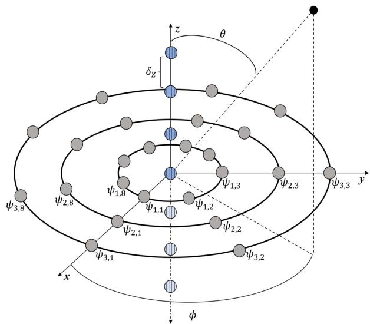  
Fig. 1. Illustration of the employed array geometry containing $M = 3 1$ microphones. Solid gray circles indicate the UCCA microphones placed on the $\times - \mathsf { y }$ plane, and striped blue-shaded circles indicate the ULA microphones placed on the z-axis on, beneath, and above the $\times - \mathsf { y }$ plane.

## A. Analysis ofthe Parameter K

Next, we are interested in investigating K and its relation to the ROI Ω. For example, when the ROI Ω is reduced to a single DOA, we have $K = P = 1$ as $\Gamma _ { \mathbf { d } , \Omega } ( k )$ reduces to a rank-1 matrix. In contrast, when a continuous ROI is considered, the rank of $\Gamma _ { \mathbf { d } , \Omega } ( k )$ is larger than 1. Fig. 2 depicts the dB-scaled eigenvalues of $\Gamma _ { \mathbf { d } , \Omega } ( k )$ with respect to $\mathbf { h } _ { \mathrm { L D - M W N G } }$ and ${ \bf h } _ { \mathrm { L D - M D F } }$ with the employed array geometry for three distinct ROIs: $[ - 3 0 ^ { o } , 3 0 ^ { o } ]$ and $\Theta _ { \Omega } = 9 0 ^ { o } , \ \Phi _ { \Omega } = [ - 4 5 ^ { o } , 4 5 ^ { o } ]$ and $\Theta _ { \Omega } = 9 0 ^ { o }$ , and $\Phi _ { \Omega } = [ - 4 5 ^ { o } , 4 5 ^ { o } ]$ and $\Theta _ { \Omega } = [ 6 0 ^ { o } , 1 0 5 ^ { o } ]$ Note that while the first two ROIs consider desired signals impinging from the x − y-plane and may apply, for example, to conference room scenarios where all speakers sit around a table, the third ROIs may apply to standing-speaker scenarios as well. First, we observe that the larger the ROI, the greater the number of high-valued eigenvalues. This is a consequence of an increasing rank of $\Gamma _ { \mathbf { d } , \Omega } ( k )$ as the integration bounds in (18) expand. Additionally, it is evident that with all ROIs, the number of high-valued eigenvalues associated with ${ \bf h } _ { \mathrm { L D - M D F } }$ is slightly greater than those associated with $\mathbf { h } _ { \mathrm { L D - M W N G } }$ . Nevertheless, considering the largest ROI and the entire frequency spectrum, we observe a significant value drop for $p > 7 ,$ , particularly for low frequencies, implying that a frequency-independent value of K may be set similarly. On the other hand, with the two smaller ROIs, the first three eigenvalues include the vast majority of the spectral energy, indicating low significance of the additional eigenvectors.

To evaluate the influence of the parameter K on the proposed beamformers and provide an additional performance-oriented perspective, we focus on the three broadband measures, namely $\bar { \mathcal { W } } _ { \Omega } ^ { \mathrm { B } \bar { \mathrm { B } } } , \mathcal { D } _ { \Omega } ^ { \mathrm { B B } }$ , and $\xi _ { \mathrm { d } , \Omega } ^ { \mathrm { B B } }$ . We consider the three discussed ROIs for a broad range of K values between 1 and 9, and assume the desired signal and noise to be white and stationary. The results are depicted in Fig. 3. First, we notice that hLD−MDF,K is more sensitive to desired signal reduction than hLD−MWNG,K for the three ROIs, whereas the larger the ROI, the greater the potential signal reduction. For the largest ROI, no signal reduction is apparent for $K > 7$ , implying that this should serve as the upper bound for the selection of K. In contrast, for the smallest ROI, this is already attained for $K > 3 .$ . Accounting for the broadband gain measures, decreasing the desired signal reduction entails a noticeable decline in both the WNG and DF. We infer that the desired value of K is highly dependent on the scenario settings (e.g., the ROI), and should be selected according to the desired tradeoff between signal reduction and array gain, which are typically application dependent.

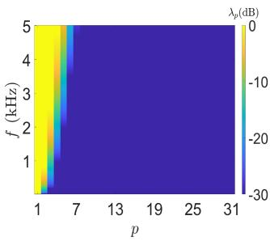

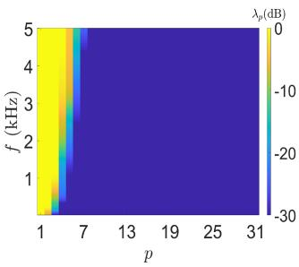

(a)  
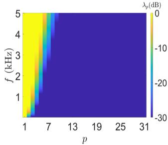

(b)  
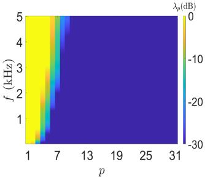

(c)  
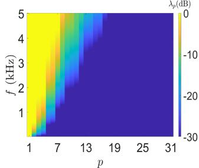  
(e)

(d)  
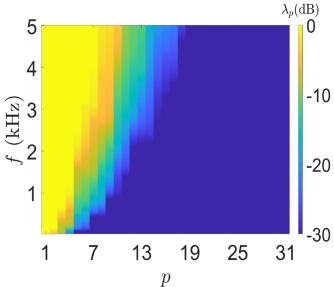  
(f)  
Fig. 2. Descendingly ordered dB-scaled eigenvalues of $\Gamma _ { \mathbf { d } , \Omega } ( k )$ with respect to $\mathbf { h } _ { \mathrm { L D - M W N G } }$ and ${ \bf h } _ { \mathrm { L D - M D F } }$ as a function of the frequency considering three distinct regions of interest. (a) h with $\bar { \Phi } _ { \Omega } = [ - 3 0 ^ { o } , 3 0 ^ { o } ]$ and $\Theta _ { \Omega } = 9 0 ^ { o } , { \bf \bar { \Omega } } ( { \bf b } )$ h with $\Phi _ { \Omega } = [ - 3 0 ^ { o }$ , 30o] and ${ \Theta } \bar { \Omega } = 9 0 ^ { o }$ , (c) hLD−MWNG with $\Phi _ { \Omega } = [ - 4 5 ^ { o } , 4 5 ^ { o } ]$ and $\dot { \Theta } _ { \Omega } = 9 0 ^ { o }$ , (d) hLD−MDF with $\Phi _ { \Omega } = [ - 4 5 ^ { o }$ , 45o] and $\Theta _ { \Omega } = 9 0 ^ { o }$ , (e) hLD−MWNG with $\Phi _ { \Omega } = [ - 4 5 ^ { o } , 4 5 ^ { o } ]$ and $\Theta _ { \Omega } = [ 6 0 ^ { o } , 1 \bar { 0 } 5 ^ { o } ]$ , and (f) hLD−MDF with $\Phi _ { \Omega } = [ - 4 5 ^ { o } , 4 5 ^ { o } ]$ and $\Theta _ { \Omega } =$ [60o, 105o].

## B. Performance Evaluation

Let us now consider the subband performance measures presented in Section IV. We focus on the largest ROI out of the three previously discussed, i.e., $\Phi _ { \Omega } = [ - 4 5 ^ { o } , 4 5 ^ { o } ]$ and $\Theta _ { \Omega } = [ 6 0 ^ { o } , 1 0 5 ^ { o } ]$ , and evaluate the subband WNG, DF, and desired signal reduction factor. Fig. 4 depicts the performance of both beamformers for three distinct values of K selected in accordance with the previous part: 1, 4, and 7. It is clear that regardless of $K , { \bf h } _ { \mathrm { L D - M W N G } , K }$ is superior in terms of the WNG, whereas ${ \bf h } _ { \mathrm { L D - M D F } , K }$ is superior in terms of the DF. However, the tradeoffcontrolled by $K$ is expressed by comparing both gain measures to the distortion measure: the lower K is, the higher are the WNG and DF, and so is the desired signal reduction factor. Considering the latter measure, we deduce that for $K = 1$ significant array directivity is achieved with ${ \bf h } _ { \mathrm { L D - M D F } , K }$ , but at the expense of substantial desired signal distortion. Note that this result highly correlates with the broadband performance measures discussed above.

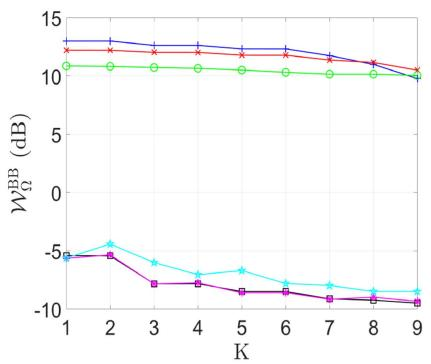  
(a)

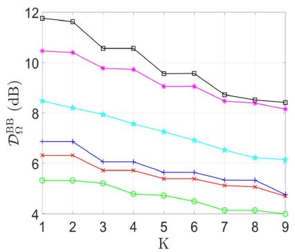  
(b)

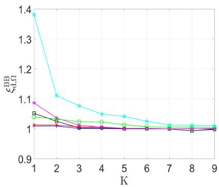  
(c)  
Fig. 3. Broadband WNG, DF, and desired signal reduction factor of ${ \bf h } _ { \mathrm { L D - M W N G } , K }$ and ${ \bf h } _ { \mathrm { L D - M D F } , K }$ as a function of K for the three discussed ROIs. (a) WNG, (b) DF, and (c) desired signal reduction factor.

On top of the three theoretical measures, we assess the beampatterns of the two proposed beamformers. Specifically, to obtain a complete spatial visualization, we consider the three-dimensional (3-D) beampatterns, which exhibit the beamformers’ spatial response concerning every possible direction in space. The 3-D beampatterns are plotted in Fig. 5 for ${ 3 \mathrm { k H z } } ,$ around which the human ear sensitivity is known to reach its peak [34]. We observe that K substantially impacts the beampatterns of both beamformers. For example, when $K = 1$ , directions outside the ROI are significantly attenuated, indicating high array directivity. This is particularly true with hLD−MDF,1. However, slight attenuation is apparent within the ROI, primarily around its edges, which indicates some desired signal reduction for signals impinging on the array from these edge directions. As K increases, the level of attention corresponding to the edge directions is minimized, yet adjacent directions outside of the ROI are attenuated to a lesser extent.

To illustrate this K-controlled tradeoff from another perspective, Figs. 6 and 7 depict the azimuth and elevation beampatterns of the proposed beamformers for a wide spectral range, respectively. We observe that for distinct values of K and considering both angles, the beampatterns’ mainlobes follow the desired ROI. Nevertheless, considering the azimuth angle for $K = 1$ reveals a mild spatial-response attenuation near the edges of the

ROI. This is particularly stressed with $\mathbf { h } _ { \mathrm { L D - M D F } } ,$ 1 and to some degree with $\mathbf { h } _ { \mathrm { L D - M W N G } , 1 }$ . In contrast, for $K = 4$ , the beampatterns’ sidelobes appear more dominant, indicating reduced array directivity. Considering the elevation angle, we notice that with $\mathbf { h } _ { \mathrm { L D - M W N G } }$ , comparable spatial responses are obtained within and near the ROI for both values of $K .$ . In contrast, $\mathbf { h } _ { \mathrm { L D } }$ −MDF,1 exhibits a mild spatial-response attenuation around the lower ROI edge at $\theta = 6 0 ^ { o }$ as of a lower frequency than ${ \bf h } _ { \mathrm { L D - M D F } , 4 } $

## C. Speech-Signal Simulations in Noisy and Reverberant Environments

In this section, we analyze the performance of the proposed beamformers on actual speech-signal samples in various noisy and reverberant scenarios that include DOA deviations. The simulations are performed as follows. We use a room impulse response (RIR) generator [35] based on the image method [36] to simulate the reverberant noise-free signal received by each microphone while using the same array geometry and parameters described above.

To demonstrate the performance of the proposed approach for different ROIs, we employ both the smallest and largest ROIs discussed in Section VI-A with three appropriate values for each: $K = 1 , 2 ,$ 3 for $\Phi _ { \Omega } = [ - 3 0 ^ { o } , 3 0 ^ { o } ]$ and $\Theta _ { \Omega } = 9 0 ^ { o }$ , and $K = 1 , 4 , 7$ for $\Phi _ { \Omega } = [ - 4 5 ^ { o } , 4 5 ^ { o } ]$ and $\Theta _ { \Omega } = [ 6 0 ^ { o } , 1 0 5 ^ { o } ]$ ]. In addition, we compare the proposed approach to four existing beamformers from the literature. The first two are the classical maximum directivity factor (MDF), $\mathbf { h } _ { \mathrm { M D F } } .$ , and delay-and-sum (DS), $\mathbf { h } _ { \mathrm { D S } }$ , beamformers [6] applied to the same array geometry and steered towards the center of the ROI. The next beamformer is the recently proposed $\mathbf { f } _ { \mathrm { M W N G / M D F } }$ [30] that was shown to be valuable when significant DOA deviations of the desired speech were taken into account. It is constructed using 4 replicas of an 8-microphone and 2-ring SCCA optimized out of 24 equally spaced microphone locations – yielding an array of 32 microphones. The radius of the innermost ring is set to 1.5 cm, whereas the distance between the origins oftwo adjacent replicas is set to 4 cm. The fourth and final beamformer is the robust adaptive beamformer proposed by Vorobyov et al. [24]. Denoted by $\mathbf { w } _ { \mathrm { r o b u s t } } ,$ this beamformer is applied to a 31-microphone ULA whose interelement spacing is 5 mm and its associated design parameters (namely, the diagonal loading coefficient and DOA mismatch vector norm boundary) are optimized with respect to the scenarios described below.

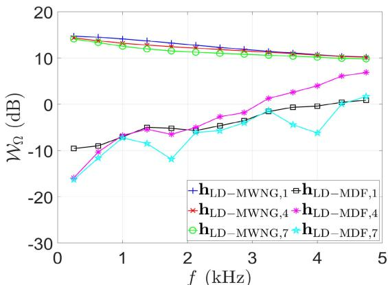  
(a)

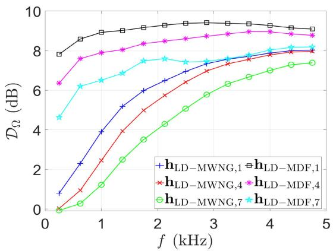  
(b)

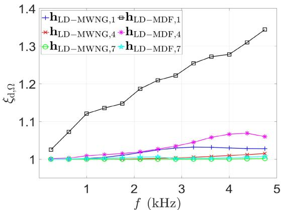  
(c)  
Fig. 4. Subband WNG, DF, and desired signal reduction factor of hLD−MWNG,K and h $\mathrm { L D - M D F } , K$ for different values of K. (a) WNG, (b) DF, and (c) desired signal reduction factor. For the ROI, we set $\Phi _ { \Omega } = [ - 4 5 ^ { o } , 4 5 ^ { o } ]$ and $\Theta _ { \Omega } = [ 6 0 ^ { o } , \bar { 1 } 0 5 ^ { o } ]$

Considering all described beamformers, the x − y-plane to which the arrays are aligned is set to the $z = 1$ m plane, with the origin set to $( x , y , z ) = ( 3 , 3 , 1 )$ m coordinate of an $8 \times 7 \times 3$ m room. The RIR is simulated for two distinct values of $T _ { 6 0 } ,$ , 200 msec and 600 msec, where $T _ { 6 0 }$ is defined by the Sabin-Franklin’s formula [37]. In addition, two simulated noise fields are present: a white thermal Gaussian noise and a spherically-isotropic diffuse noise, as well as two directional interferences that impinge on the arrays from the positive z-axis direction and the $\phi = 1 3 5 ^ { o }$ direction on the $\mathsf { x } - \mathsf { y } _ { \mathsf { - p l a n e } }$ . The two interferences and the diffuse noise are equally powerful, whereas the white thermal noise is 30 dB weaker than each. The broadband input SNR is set to $\mathrm { i S N R } = 3 \mathrm { d B }$ . The desired speech signal, $x ( t )$ , is a concatenation of 24 speech signals (12 speech signals per gender) with varying dialects that are taken from the TIMIT database [38] and sampled at a sampling rate of $f _ { \mathrm { s } } = 1 / T _ { \mathrm { s } } = 1 6 \mathrm { k H z }$ . The speech signal enhancement is performed in the short-time Fourier transform (STFT) domain using 75% overlapping time frames and a Hamming analysis window of length 512 (32 msec). We employ the far-field and free field steering vector [6] for the DFT of the relative impulse response between the desired source and the array microphones, hence avoiding its direct approximation.

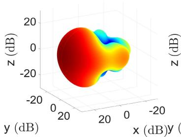

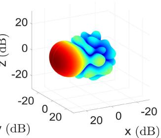  
(b)

(a)  
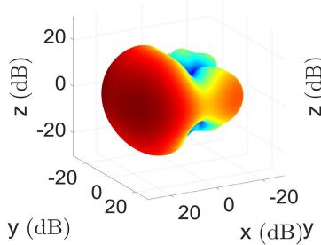

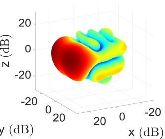  
(d)

(c)  
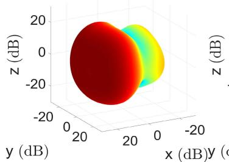  
(e)

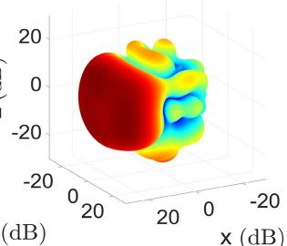  
x (dB)  
(f)  
Fig. 5. 3-D beampatterns of $\mathbf { h } _ { \mathrm { L D } }$ −MWNG,K and $\mathbf { h } _ { \mathrm { L D } } .$ −MDF,K for different values of K. (a) hLD−MWNG,1, (b) hLD−MDF,1, (c) hLD−MWNG,4, (d) $\mathbf { h } _ { \mathrm { L D } }$ −MDF,4, (e) hLD−MWNG,7, and $\mathrm { ( f ) \ h _ { L D - M D F } , 7 }$ . The frequency is set to 3 kHz.

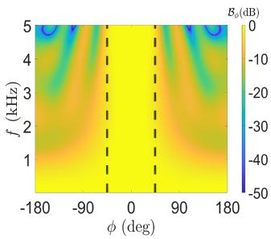  
(a)

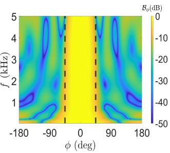

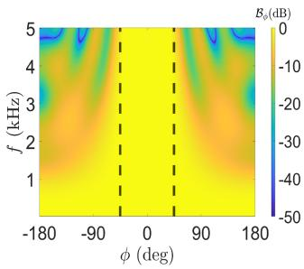  
(c)

(b)  
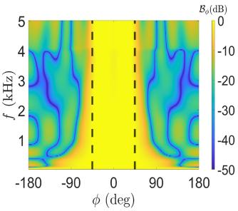  
(d)

Fig. 6. Azimuth beampatterns of $\mathbf { h } _ { \mathrm { L D } } .$ −MWNG,K and $\mathbf { h } _ { \mathrm { L D } } .$ −MDF,K as a function of the frequency. (a) $\mathbf { h } _ { \mathrm { L D } } .$ −MWNG,1, (b) $\mathbf { h } _ { \mathrm { L D } }$ −MDF,1, (c) $\mathbf { h } _ { \mathrm { L D } }$ −MWNG,4, and (d) ${ \bf h } _ { \mathrm { L D - M D F } , 4 } .$ . The dashed black vertical lines indicate the specified ROI.  
(a)  
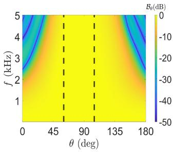

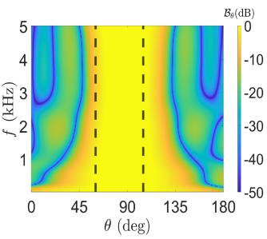

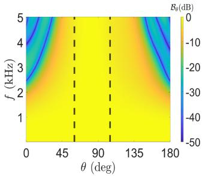  
(c)

(b)  
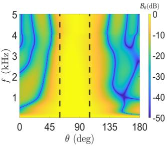  
(d)  
Fig. 7. Elevation beampatterns of ${ \bf h } _ { \mathrm { L D - M W N G } , K }$ and hLD−MDF,K as a function of the frequency. (a) ${ \bf h } _ { \mathrm { L D - M W N G } , 1 } ,$ (b) $\mathbf { h } _ { \mathrm { L D } }$ −MDF,1, (c) ${ \bf h } _ { \mathrm { L D - M W N G } , 4 } ,$ and (d) ${ \bf h } _ { \mathrm { L D - M D F } , 4 }$ . The dashed black vertical lines indicate the specified ROI.

We evaluate and compare the perceptual evaluation of speech quality (PESQ) [39] and short-time objective intelligibility (STOI) [40]. In Table I, we present the performances of the described methods for the smallest ROI mentioned earlier and $T _ { 6 0 } = 2 0 0$ msec. Considering the PESQ, it is notable that with no desired signal DOA deviation, that is, $( \theta _ { \mathrm { d } } , \phi _ { \mathrm { d } } ) = ( 9 0 ^ { o } , 0 ^ { o } )$

fMWNG/MDF performs best. However, in the presence of the desired signal DOA deviation (as apparent in the two remaining scenarios), the proposed approach attains a preferable performance. The performance gap is particularly accentuated for $( \theta _ { \mathrm { d } } , \phi _ { \mathrm { d } } ) = ( 9 0 ^ { o } , 2 0 ^ { o } )$ with h $\mathrm { \_ D - M D F { , } 3 }$ . Considering the STOI, the proposed ${ \bf h } _ { \mathrm { L D - M D F } , 1 }$ and ${ \bf h } _ { \mathrm { L D - M D F , 2 } }$ outperform all other beamformers in the simulated scenarios, having $\mathbf { h } _ { \mathrm { L D } }$ −MDF,3 perform equally in the $( \theta _ { \mathrm { d } } , \phi _ { \mathrm { d } } ) = ( 9 0 ^ { o } , 2 0 ^ { o } )$ scenario. Increasing $T _ { 6 0 }$ to 600 msec and maintaining all other settings, Table II describes the PESQ and STOI in a more severe reverberation environment. Although the proposed beamformers do not perform as well as the existing ones in terms of PESQ, they still exhibit superior performance regarding STOI. That is, the proposed ${ \bf h } _ { \mathrm { L D - M D F } , + }$ 1 and ${ \bf h } _ { \mathrm { L D - M D F , 2 } }$ exhibit highly preferable scores considering the three simulated scenarios.

Tables III and IV present the PESQ and STOI scores for the largest referred ROI, with $T _ { 6 0 }$ set to 200 msec and 600 msec, respectively. As mentioned in Section VI-A, we consider values of $K = 1 , 4 , 7$ for the proposed beamformers using this ROI. Firstly, regarding the PESQ scores, we observe that the proposed beamformer ${ \bf h } _ { \mathrm { L D - M D F } , 7 }$ is preferable in scenarios characterized by significant deviations in the DOA and moderate levels of reverberation. This is particularly evident in the case of $( \theta _ { \mathrm { d } } , \phi _ { \mathrm { d } } ) = ( 6 5 ^ { \circ } , 4 0 ^ { \circ } )$ with $T _ { 6 0 } = 2 0 0$ msec. In all other scenarios, the combination ofa large ROI and reverberations, alongside relatively small DOA deviations, results in inferior performance compared to alternative approaches. However, when considering the STOI, the proposed method significantly outperforms the other options. It is important to note that for both sets ofscenarios $( \mathrm { i . e . }$ , for both values of $T _ { 6 0 } )$ , the superior performance of the proposed approach is observed at higher values of $K ,$ , particularly when more significant DOA deviations are taken into account. Specifically, ${ \bf h } _ { \mathrm { L D - M D F } , 1 }$ is preferred in the scenario where $( \theta _ { \mathrm { d } } , \phi _ { \mathrm { d } } ) = ( 8 0 ^ { \circ } , 0 ^ { \circ } )$ . Meanwhile, $\mathbf { h } _ { \mathrm { L D } }$ −MDF,4 is the best choice for the scenario $( \theta _ { \mathrm { d } } , \phi _ { \mathrm { d } } ) = ( 8 0 ^ { \circ } , 2 0 ^ { \circ } )$ , and $\mathbf { h } _ { \mathrm { L D } }$ −MDF,7 performs better in the scenario $( \theta _ { \mathrm { d } } , \phi _ { \mathrm { d } } ) = ( 6 5 ^ { \circ } , 4 0 ^ { \circ } )$

## D. Evaluation of Speech Quality Under Array Calibration Conditions Using DNSMOS

Finally, it is essential to evaluate the performance of the proposed approach in more practical scenarios, accounting for further non-idealities and implementation limitations. We focus on planar array geometries that may be easier to implement in practice and consist of the least number of array microphones. Specifically, we consider $\mathbf { h } _ { \mathrm { L D - M D F } , 1 } , \ \mathbf { h } _ { \mathrm { L D - M D F } , 3 } ,$ $\mathbf { h } _ { \mathrm { L D - M W N G , 1 } } , \mathbf { h } _ { \mathrm { L D - M W N G , 3 } }$ , h and $\mathbf { h } _ { \mathrm { D S } }$ , all implemented over the same UCCA array geometry described above and located on the x − y-plane, whereas $\mathbf { f } _ { \mathrm { M W N G / M D F } }$ utilizes 3 optimal SCCA replicas that are identical to those discussed in the previous subsection (rather than 4). Note that this entails beamformers of 24 microphones each. We use a similar simulation environment with the smallest discussed ROI and $T _ { 6 0 } = 2 0 0$ msec, and set $\mathbf { i S N R } = 1 0 \mathbf { d B }$ . Additionally, we consider two common artifacts of array miscalibration: microphone position offsets and gain mismatches. The former are simulated as additive independent zero-mean normally distributed random variables, whose variance with respect to each axis is denoted by $\sigma _ { \mathrm { p o s } } ^ { 2 }$ . The latter are simulated as zero-mean normally distributed microphone gain skews, whose variance $\sigma _ { \mathrm { g a i n } } ^ { 2 }$ is proportionally set as a divergence from the ideally identical gain across all array microphones.

TABLE I  
PESQ AND STOI SCORES OF THE NOISY AND ENHANCED SIGNALS WITH THE PROPOSED AND EXISTING APPROACHES

<table><tr><td></td><td colspan="3">PESQ</td><td colspan="3">STOI</td></tr><tr><td> $(\theta_{\mathrm{d}}, \phi_{\mathrm{d}}) =$ </td><td> $(90^{\circ}, 0^{\circ})$ </td><td> $(90^{\circ}, 10^{\circ})$ </td><td> $(90^{\circ}, 20^{\circ})$ </td><td> $(90^{\circ}, 0^{\circ})$ </td><td> $(90^{\circ}, 10^{\circ})$ </td><td> $(90^{\circ}, 20^{\circ})$ </td></tr><tr><td>Noisy</td><td>1.06</td><td>1.06</td><td>1.06</td><td>0.70</td><td>0.73</td><td>0.72</td></tr><tr><td> $h_{LD-MDF,1}$ </td><td>1.37</td><td>1.37</td><td>1.38</td><td>0.93</td><td>0.93</td><td>0.91</td></tr><tr><td> $h_{LD-MDF,2}$ </td><td>1.37</td><td>1.38</td><td>1.43</td><td>0.93</td><td>0.93</td><td>0.91</td></tr><tr><td> $h_{LD-MDF,3}$ </td><td>1.29</td><td>1.35</td><td>1.63</td><td>0.90</td><td>0.90</td><td>0.91</td></tr><tr><td> $h_{LD-MWNG,1}$ </td><td>1.30</td><td>1.31</td><td>1.32</td><td>0.82</td><td>0.83</td><td>0.83</td></tr><tr><td> $h_{LD-MWNG,2}$ </td><td>1.30</td><td>1.31</td><td>1.32</td><td>0.82</td><td>0.83</td><td>0.83</td></tr><tr><td> $h_{LD-MWNG,3}$ </td><td>1.26</td><td>1.27</td><td>1.29</td><td>0.79</td><td>0.81</td><td>0.82</td></tr><tr><td> $h_{MDF}$ </td><td>1.24</td><td>1.31</td><td>1.38</td><td>0.74</td><td>0.80</td><td>0.74</td></tr><tr><td> $h_{DS}$ </td><td>1.37</td><td>1.36</td><td>1.34</td><td>0.82</td><td>0.83</td><td>0.83</td></tr><tr><td> $f_{MWNG/MDF} [30]$ </td><td>2.19</td><td>1.15</td><td>1.13</td><td>0.85</td><td>0.67</td><td>0.62</td></tr><tr><td> $w_{robust} [24]$ </td><td>1.36</td><td>1.34</td><td>1.35</td><td>0.83</td><td>0.84</td><td>0.85</td></tr></table>

For the Proposed Approach, We Simulate Different Values of K and set $\Phi _ { \Omega } = [ - 3 0 ^ { \circ } , 3 0 ^ { \circ } ] ; \Theta _ { \Omega } = 9 0 ^ { \circ }$ . Simulation Settings: iSNR = 3 dB and $T _ { 6 0 } = 2 0 0 \ { \mathrm { m s e c } } .$

TABLE II  
PESQ AND STOI SCORES OF THE NOISY AND ENHANCED SIGNALS WITH THE PROPOSED AND EXISTING APPROACHES

<table><tr><td></td><td colspan="3">PESQ</td><td colspan="3">STOI</td></tr><tr><td> $(\theta_{\mathrm{d}}, \phi_{\mathrm{d}}) =$ </td><td> $(90^{\circ}, 0^{\circ})$ </td><td> $(90^{\circ}, 10^{\circ})$ </td><td> $(90^{\circ}, 20^{\circ})$ </td><td> $(90^{\circ}, 0^{\circ})$ </td><td> $(90^{\circ}, 10^{\circ})$ </td><td> $(90^{\circ}, 20^{\circ})$ </td></tr><tr><td>Noisy</td><td>1.06</td><td>1.06</td><td>1.05</td><td>0.59</td><td>0.61</td><td>0.62</td></tr><tr><td> $\mathbf{h}_{\mathrm{LD-MDF},1}$ </td><td>1.22</td><td>1.19</td><td>1.05</td><td>0.81</td><td>0.80</td><td>0.79</td></tr><tr><td> $\mathbf{h}_{\mathrm{LD-MDF},2}$ </td><td>1.21</td><td>1.18</td><td>1.24</td><td>0.81</td><td>0.80</td><td>0.79</td></tr><tr><td> $\mathbf{h}_{\mathrm{LD-MDF},3}$ </td><td>1.13</td><td>1.15</td><td>1.24</td><td>0.73</td><td>0.76</td><td>0.78</td></tr><tr><td> $\mathbf{h}_{\mathrm{LD-MWNG},1}$ </td><td>1.19</td><td>1.21</td><td>1.31</td><td>0.69</td><td>0.70</td><td>0.71</td></tr><tr><td> $\mathbf{h}_{\mathrm{LD-MWNG},2}$ </td><td>1.19</td><td>1.22</td><td>1.19</td><td>0.69</td><td>0.70</td><td>0.71</td></tr><tr><td> $\mathbf{h}_{\mathrm{LD-MWNG},3}$ </td><td>1.19</td><td>1.22</td><td>1.19</td><td>0.66</td><td>0.68</td><td>0.69</td></tr><tr><td> $\mathbf{h}_{\mathrm{MDF}}$ </td><td>1.33</td><td>1.37</td><td>1.46</td><td>0.64</td><td>0.66</td><td>0.65</td></tr><tr><td> $\mathbf{h}_{\mathrm{DS}}$ </td><td>1.24</td><td>1.26</td><td>1.21</td><td>0.70</td><td>0.71</td><td>0.70</td></tr><tr><td> $\mathbf{f}_{\mathrm{MWNG/MDF}}$  [30]</td><td>1.69</td><td>1.44</td><td>1.21</td><td>0.72</td><td>0.66</td><td>0.64</td></tr><tr><td> $\mathbf{w}_{\mathrm{robust}}$  [24]</td><td>1.19</td><td>1.19</td><td>1.20</td><td>0.71</td><td>0.72</td><td>0.73</td></tr></table>

For the Proposed Approach, We Simulate Different Values of K and set $\Phi _ { \Omega } = [ - 3 0 ^ { o } , 3 0 ^ { o } ] ; \Theta _ { \Omega } = 9 0 ^ { o }$ . Simulation Settings: iSNR = 3 dB and $T _ { 6 0 } = 6 0 0 \mathrm { ~ m s e c } .$

TABLE III  
PESQ AND STOI SCORES OF THE NOISY AND ENHANCED SIGNALS WITH THE PROPOSED AND EXISTING APPROACHES

<table><tr><td></td><td colspan="3">PESQ</td><td colspan="3">STOI</td></tr><tr><td> $(\theta_{\mathrm{d}}, \phi_{\mathrm{d}}) =$ </td><td> $(80^{\circ}, 0^{\circ})$ </td><td> $(80^{\circ}, 20^{\circ})$ </td><td> $(65^{\circ}, 40^{\circ})$ </td><td> $(80^{\circ}, 0^{\circ})$ </td><td> $(80^{\circ}, 20^{\circ})$ </td><td> $(65^{\circ}, 40^{\circ})$ </td></tr><tr><td>Noisy</td><td>1.06</td><td>1.08</td><td>1.07</td><td>0.76</td><td>0.78</td><td>0.77</td></tr><tr><td> $\mathbf{h}_{\mathrm{LD-MDF},1}$ </td><td>1.59</td><td>1.27</td><td>1.06</td><td>0.93</td><td>0.84</td><td>0.72</td></tr><tr><td> $\mathbf{h}_{\mathrm{LD-MDF},4}$ </td><td>1.24</td><td>1.29</td><td>1.19</td><td>0.87</td><td>0.90</td><td>0.88</td></tr><tr><td> $\mathbf{h}_{\mathrm{LD-MDF},7}$ </td><td>1.33</td><td>1.32</td><td>1.30</td><td>0.88</td><td>0.85</td><td>0.88</td></tr><tr><td> $\mathbf{h}_{\mathrm{LD-MWNG},1}$ </td><td>1.27</td><td>1.26</td><td>1.17</td><td>0.86</td><td>0.84</td><td>0.82</td></tr><tr><td> $\mathbf{h}_{\mathrm{LD-MWNG},4}$ </td><td>1.22</td><td>1.25</td><td>1.19</td><td>0.84</td><td>0.83</td><td>0.82</td></tr><tr><td> $\mathbf{h}_{\mathrm{LD-MWNG},7}$ </td><td>1.20</td><td>1.20</td><td>1.18</td><td>0.83</td><td>0.81</td><td>0.81</td></tr><tr><td> $\mathbf{h}_{\mathrm{MDF}}$ </td><td>1.41</td><td>1.53</td><td>1.28</td><td>0.86</td><td>0.81</td><td>0.83</td></tr><tr><td> $\mathbf{h}_{\mathrm{DS}}$ </td><td>1.20</td><td>1.33</td><td>1.22</td><td>0.86</td><td>0.84</td><td>0.79</td></tr><tr><td> $\mathbf{f}_{\mathrm{MWNG/MDF}} [30]$ </td><td>2.26</td><td>1.26</td><td>1.24</td><td>0.90</td><td>0.65</td><td>0.80</td></tr><tr><td> $\mathbf{w}_{\mathrm{robust}} [24]$ </td><td>1.33</td><td>1.35</td><td>1.20</td><td>0.86</td><td>0.86</td><td>0.80</td></tr></table>

For the Proposed Approach, We Simulate Different Values of K and set ΦΩ = [−-450, 450]; ΘΩ = [600, 1050]. Simulation Settings: iSNR = 3 dB and $T _ { 6 0 } = 2 0 0$ msec

TABLE IV  
PESQ AND STOI SCORES OF THE NOISY AND ENHANCED SIGNALS WITH THE PROPOSED AND EXISTING APPROACHES

<table><tr><td></td><td colspan="3">PESQ</td><td colspan="3">STOI</td></tr><tr><td> $(\theta_{\text{d}}, \phi_{\text{d}}) =$ </td><td> $(80^{\circ}, 0^{\circ})$ </td><td> $(80^{\circ}, 20^{\circ})$ </td><td> $(65^{\circ}, 40^{\circ})$ </td><td> $(80^{\circ}, 0^{\circ})$ </td><td> $(80^{\circ}, 20^{\circ})$ </td><td> $(65^{\circ}, 40^{\circ})$ </td></tr><tr><td>Noisy</td><td>1.05</td><td>1.07</td><td>1.06</td><td>0.63</td><td>0.64</td><td>0.64</td></tr><tr><td> $h_{LD-MDF,1}$ </td><td>1.28</td><td>1.12</td><td>1.07</td><td>0.82</td><td>0.68</td><td>0.62</td></tr><tr><td> $h_{LD-MDF,4}$ </td><td>1.08</td><td>1.11</td><td>1.08</td><td>0.72</td><td>0.74</td><td>0.72</td></tr><tr><td> $h_{LD-MDF,7}$ </td><td>1.15</td><td>1.16</td><td>1.11</td><td>0.72</td><td>0.67</td><td>0.76</td></tr><tr><td> $h_{LD-MWNG,1}$ </td><td>1.12</td><td>1.15</td><td>1.11</td><td>0.73</td><td>0.70</td><td>0.68</td></tr><tr><td> $h_{LD-MWNG,4}$ </td><td>1.12</td><td>1.15</td><td>1.12</td><td>0.70</td><td>0.68</td><td>0.68</td></tr><tr><td> $h_{LD-MWNG,7}$ </td><td>1.11</td><td>1.13</td><td>1.19</td><td>0.69</td><td>0.67</td><td>0.68</td></tr><tr><td> $h_{MDF}$ </td><td>1.28</td><td>1.48</td><td>1.27</td><td>0.72</td><td>0.69</td><td>0.72</td></tr><tr><td> $h_{DS}$ </td><td>1.20</td><td>1.22</td><td>1.16</td><td>0.74</td><td>0.70</td><td>0.66</td></tr><tr><td> $f_{MWNG/MDF} [30]$ </td><td>1.73</td><td>1.30</td><td>1.20</td><td>0.77</td><td>0.61</td><td>0.68</td></tr><tr><td> $w_{robust} [24]$ </td><td>1.16</td><td>1.21</td><td>1.11</td><td>0.75</td><td>0.73</td><td>0.68</td></tr></table>

For the Proposed Approach, We Simulate Different Values of K and set ΦΩ = [−450, 450]; ΘΩ = [600, 1050]. Simulation Settings: iSNR = 3 dB and $\mathrm { T } _ { 6 0 } = 6 0 0$ msec.

TABLE V  
DNSMOS OF THE NOISY AND ENHANCED SIGNALS WITHOUT ARRAY MISCALIBRATION

<table><tr><td> $(\theta_{\text{d}}, \phi_{\text{d}}) =$ </td><td colspan="4">(90°, 0°)</td><td colspan="4">(90°, 20°)</td></tr><tr><td>DNSMOS</td><td>SIG</td><td>BAK</td><td>OVRL</td><td>P.808</td><td>SIG</td><td>BAK</td><td>OVRL</td><td>P.808</td></tr><tr><td>Noisy</td><td>2.60</td><td>1.68</td><td>1.65</td><td>2.75</td><td>2.68</td><td>1.67</td><td>1.70</td><td>2.93</td></tr><tr><td>hLD-MDF,1</td><td>3.07</td><td>2.91</td><td>2.40</td><td>3.39</td><td>3.33</td><td>3.02</td><td>2.63</td><td>3.30</td></tr><tr><td>hLD-MDF,3</td><td>2.53</td><td>2.31</td><td>2.01</td><td>3.21</td><td>3.16</td><td>3.22</td><td>2.58</td><td>3.39</td></tr><tr><td>hLD-MWNG,1</td><td>2.48</td><td>2.09</td><td>1.86</td><td>3.18</td><td>2.47</td><td>1.95</td><td>1.87</td><td>3.28</td></tr><tr><td>hLD-MWNG,3</td><td>2.60</td><td>2.19</td><td>1.93</td><td>3.10</td><td>2.45</td><td>1.99</td><td>1.87</td><td>3.30</td></tr><tr><td>hMDF</td><td>3.46</td><td>3.25</td><td>2.76</td><td>3.15</td><td>3.23</td><td>2.95</td><td>2.51</td><td>2.72</td></tr><tr><td>hDS</td><td>2.71</td><td>2.49</td><td>2.12</td><td>3.31</td><td>2.99</td><td>2.48</td><td>2.26</td><td>3.23</td></tr><tr><td>fMWNG/MDF [30]</td><td>2.91</td><td>3.65</td><td>2.48</td><td>3.19</td><td>1.77</td><td>1.52</td><td>1.42</td><td>2.65</td></tr></table>

Simulation Settings: iSNR = 10 dB, ${ \sigma } _ { \mathrm { p o s } } = 0 , { \sigma } _ { \mathrm { g a i n } } = 0 \% ,$ , and T60 = 200 msec

TABLE VI  
DNSMOS OF THE NOISY AND ENHANCED SIGNALS WITH ARRAY MISCALIBRATION

<table><tr><td> $(\theta_{\text{d}}, \phi_{\text{d}}) =$ </td><td colspan="4">(90°, 0°)</td><td colspan="4">(90°, 20°)</td></tr><tr><td>DNSMOS</td><td>SIG</td><td>BAK</td><td>OVRL</td><td>P.808</td><td>SIG</td><td>BAK</td><td>OVRL</td><td>P.808</td></tr><tr><td>Noisy</td><td>2.36</td><td>1.52</td><td>1.54</td><td>2.67</td><td>2.73</td><td>1.72</td><td>1.72</td><td>2.92</td></tr><tr><td>hLD-MDF,1</td><td>3.11</td><td>2.41</td><td>2.25</td><td>3.32</td><td>3.53</td><td>3.11</td><td>2.70</td><td>3.19</td></tr><tr><td>hLD-MDF,3</td><td>1.79</td><td>1.54</td><td>1.48</td><td>3.07</td><td>3.28</td><td>2.76</td><td>2.50</td><td>3.30</td></tr><tr><td>hLD-MWNG,1</td><td>2.29</td><td>1.94</td><td>1.77</td><td>3.24</td><td>2.67</td><td>2.05</td><td>1.95</td><td>3.25</td></tr><tr><td>hLD-MWNG,3</td><td>2.09</td><td>1.82</td><td>1.63</td><td>3.16</td><td>2.28</td><td>1.90</td><td>1.74</td><td>3.17</td></tr><tr><td>hMDF</td><td>2.69</td><td>2.25</td><td>1.98</td><td>2.99</td><td>3.08</td><td>2.09</td><td>2.02</td><td>2.67</td></tr><tr><td>hDS</td><td>2.00</td><td>1.81</td><td>1.61</td><td>3.31</td><td>2.27</td><td>1.90</td><td>1.79</td><td>3.17</td></tr><tr><td>fMWNG/MDF [30]</td><td>3.23</td><td>3.10</td><td>2.50</td><td>3.17</td><td>1.36</td><td>1.20</td><td>1.15</td><td>2.28</td></tr></table>

Simulation Settings: iSNR = 10 dB, ${ \sigma } _ { \mathrm { p o s } } = 3 , { \sigma } _ { \mathrm { g a i n } } = 3 \% ,$ and T60 = 200 msec.

Then, to provide a comprehensive assessment, we utilize DNSMOS non-intrusive estimators, which serve as subjective (“pseudo-objective”) metrics to evaluate the quality of the enhanced signals. This recently proposed approach for speech quality evaluation leverages deep learning models trained on numerous audio clips of diverse types of noise manually labeled by subjective listeners on a scale of 1 to 5 according to the International Telecommunication Union (ITU-T) standards. For each enhanced signal, we compute both the DNSMOS P.808 score [41], and the SIG, BAK, and OVRL scores that are associated with the P.835 standard [42]. The results, considering the smallest ROI described above, with the absence of array miscalibration and with an array miscalibration of $\sigma _ { \mathrm { p o s } } = 3$ mm and $\sigma _ { \mathrm { g a i n } } = 3 \%$ , are described in Tables V and VI, respectively. We observe that in the absence of desired signal deviation, namely for $( \theta _ { \mathrm { d } } , \phi _ { \mathrm { d } } ) = ( 9 0 ^ { o } , 0 ^ { o } )$ , the beamformers hMDF and $\mathbf { f } _ { \mathrm { M W N G / M D F } }$ perform best considering the SIG, BAK, and OVRL scores. In particular, the performance of the latter is shown to be robust to array miscalibration. Considering the DNSMOS P.808 score, we reveal that the proposed ${ \bf h } _ { \mathrm { L D - M D F } , 1 }$ outperforms the other beamformers regardless of the array calibration condition. In contrast, when desired signal deviation is taken into account, that is, for $( \theta _ { \mathrm { d } } , \phi _ { \mathrm { d } } ) = ( 9 0 ^ { o } , 2 0 ^ { o } )$ , the proposed approach exhibits superior results to the rest in terms of both the DNSMOS P.808 and P.835 scores. We notice that in these scenarios, the performance gap is significant; particularly, the performances of both $\mathbf { h } _ { \mathrm { L D } }$ −MDF,1 and $\mathbf { h } _ { \mathrm { L D } }$ −MWNG,1 exhibit higher robustness to array miscalibration compared to the existing beamformers.

## VII. CONCLUSION

We have developed a beamforming approach that minimizes distortion of the desired signal across an ROI while maximizing the array gain in the presence of either spatiotemporal white noise or a spatially diffuse noise field. By formulating a signal model that describes and constrains the spatial response for the entire region, our method extends the standard single-direction formulation. We have defined general terms, specifically $\Gamma _ { \mathbf { d } , \Omega } ( k )$ and $\mathbf { d } _ { \Omega } ( k )$ , as well as generalized performance measures, including subband and broadband WNG, DF, and desired signal reduction factor. By taking into account the average signal distortion over the entire ROI, we derived and proposed two least-distortion beamformers: the least-distortion maximum DF beamformer $\mathbf { h } _ { \mathrm { L D - M D F } , K }$ and the least-distortion maximum WNG beamformer ${ \bf h } _ { \mathrm { L D - M W N G } , K } .$ . Considering both beamformers, we demonstrated that the tradeoff between array gain and average signal distortion is directly controlled through a design parameter K. We then conducted a series of simulations to validate our proposed approach using an array geometry consisting of a UCCA located in the $\mathsf { x } - \mathsf { y }$ plane and a ULA positioned along the z-axis. Initially, we focused on the parameter K and examined its relationship with the desired ROI, the eigenvalue spectrum of $\Gamma _ { \mathbf { d } , \Omega } ( k )$ , and the broadband performance measures. Following this, rigorous performance evaluations were carried out, analyzing the tradeoffs and spatial responses of the proposed method from both 2-D and 3-D perspectives. Finally, we performed extensive experiments using recorded speech signals across various noise and reverberation scenarios. Compared to several existing methods, our proposed approach achieved superior performance in terms of the STOI metric and the DNSMOS P.808. Additionally, it proved to be more favorable regarding the PESQ, especially when significant deviations in the DOA of the desired signal were considered and under mild reverberation conditions. Under these conditions, the proposed approach further demonstrated significantly preferable DNSMOS P.835 SIG, BAK, and OVRL scores, along with higher robustness to array miscalibration. In future work, we wish to extend the scope to handle source distance variations [43], [44], [45] and address collinear sources.

## REFERENCES

[1] M. Parchami, W.-P. Zhu, B. Champagne, and E. Plourde, “Recent developments in speech enhancement in the short-time Fourier transform domain,” IEEE Circuits Syst. Mag., vol. 16, no. 3, pp. 45–77, ThirdQuarter 2016.

[2] G. Itzhak, J. Benesty, and I. Cohen, “Quadratic approach for single-channel noise reduction,” EURASIP J. Audio Speech Music Process., vol. 2020, 2020, Art. no. 7.

[3] D. H. Johnson and D. E. Dudgeon, Array Signal Processing: Concepts and Techniques. New York, NY, USA: Simon and Schuster, Inc., 1992.

[4] G. Richard et al., “Audio signal processing in the 21st century: The important outcomes of the past 25 years,” IEEE Signal Process. Mag., vol. 40, no. 5, pp. 12–26, Jul. 2023.

[5] A. M. Elbir, K. V. Mishra, S. A. Vorobyov, and R. W. Heath, “Twenty-five years of advances in beamforming: From convex and nonconvex optimization to learning techniques,” IEEE Signal Process. Mag., vol. 40, no. 4, pp. 118–131, Jun. 2023.

[6] J. Benesty, I. Cohen, and J. Chen, Fundamentals ofSignal Enhancement and Array Signal Processing. New York, NY, USA: Wiley-IEEE Press, 2018.

[7] J. Jin, G. Huang, X. Wang, J. Chen, J. Benesty, and I. Cohen, “Steering study of linear differential microphone arrays,” IEEE/ACM Trans. Audio Speech Lang. Process., vol. 29, pp. 158–170, 2021.

[8] G. Itzhak and I. Cohen, “Differential and constant-beamwidth beamforming with uniform rectangular arrays,” in Proc. 17th Int. Workshop Acoustic Signal Enhancement, Sep. 2022, pp. 1–5.

[9] M. D. Zoltowski, M. Haardt, and C. P. Mathews, “Closed-form 2-D angle estimation with rectangular arrays in element space or beamspace via unitary ESPRIT,” IEEE Trans. Signal Process., vol. 44, no. 2, pp. 316–328, Feb. 1996.

[10] P. Heidenreich, A. M. Zoubir, and M. Rubsamen, “Joint 2-D DOA estimation and phase calibration for uniform rectangular arrays,” IEEE Trans. Signal Process., vol. 60, no. 9, pp. 4683–4693, Sep. 2012.

[11] G. Itzhak, I. Cohen, and J. Benesty, “Robust differential beamforming with rectangular arrays,” in Proc. 29th Eur. Signal Process. Conf., Aug. 2021, pp. 246–250.

[12] G. Itzhak, J. Benesty, and I. Cohen, “Multistage approach for steerable differential beamforming with rectangular arrays,” Speech Commun., vol. 142, pp. 61–76, 2022.

[13] J. Benesty, J. Chen, and I. Cohen, Design of Circular Differential Microphone Arrays. Cham, Switzerland: Springer, 2017.

[14] Y. Buchris, I. Cohen, and J. Benesty, “Frequency-domain design of asymmetric circular differential microphone arrays,” IEEE/ACM Trans. Audio Speech Lang. Process., vol. 26, no. 4, pp. 760–773, Apr. 2018.

[15] X. Wang, G. Huang, I. Cohen, J. Benesty, and J. Chen, “Robust steerable differential beamformers with null constraints for concentric circular microphone arrays,” in Proc. IEEE Int. Conf. Acoust., Speech Signal Process., 2021, pp. 4465–4469.

[16] R. Sharma, I. Cohen, and B. Berdugo, “Controlling elevation and azimuth beamwidths with concentric circular microphone arrays,” IEEE/ACM Trans. Audio, Speech, Lang. Process., vol. 29, pp. 1491–1502, 2021.

[17] A. Kleiman, I. Cohen, and B. Berdugo, “Constant-beamwidth beamforming with concentric ring arrays,” Special Issue Sensors Sensors Indoor Positioning Syst., vol. 21, pp. 7253–7271, 2021.

[18] A. Kleiman, I. Cohen, and B. Berdugo, “Constant-beamwidth beamforming with nonuniform concentric ring arrays,” IEEE/ACM Trans. Audio, Speech, Lang. Process., vol. 30, pp. 1952–1962, 2022.

[19] G. Huang, J. Benesty, and J. Chen, “Design of robust concentric circular differential microphone arrays,” J. Acoust. Soc. America, vol. 141, no. 5, pp. 3236–3249, 2017.

[20] K. L. Bell, Y. Ephraim, and H. L. V. Trees, “Robust adaptive beamforming under uncertainty in source direction-of-arrival,” in Proc. 8th Workshop Stat. Signal Array Process., 1996, pp. 546–549.

[21] K. L. Bell, Y. Ephraim, and H. L. V. Trees, “A Bayesian approach to robust adaptive beamforming,” IEEE Trans. Signal Process., vol. 48, no. 2, pp. 386–398, Feb. 2000.

[22] A. Khabbazibasmenj, S. A. Vorobyov, and A. Hassanien, “Robust adaptive beamforming based on steering vector estimation with as little as possible prior information,” IEEE Trans. Signal Process., vol. 60, no. 6, pp. 2974–2987, Jun. 2012.

[23] Y. Huang, M. Zhou, and S. A. Vorobyov, “New designs on MVDR robust adaptive beamforming based on optimal steering vector estimation,” IEEE Trans. Signal Process., vol. 67, no. 14, pp. 3624–3638, Jul. 2019.

[24] S. A. Vorobyov, A. B. Gershman, and L. Zhi-Quan, “Robust adaptive beamforming using worst-case performance optimization: A solution to the signal mismatch problem,” IEEE Trans. Signal Process., vol. 51, no. 2, pp. 313–324, Feb. 2003.

[25] J. Li, P. Stoica, and W. Zhisong, “On robust capon beamforming and diagonal loading,” IEEE Trans. Signal Process., vol. 51, no. 7, pp. 1702–1715, Jul. 2003.

[26] R. G. Lorenz and S. P. Boyd, “Robust minimum variance beamforming,” IEEE Trans. Signal Process., vol. 53, no. 5, pp. 1684–1696, May 2005.

[27] C. Y. Chen and P. P. Vaidyanathan, “Quadratically constrained beamforming robust against direction-of-arrival mismatch,” IEEE Trans. Signal Process., vol. 55, no. 8, pp. 4139–4150, Aug. 2007.

[28] Y. Konforti, I. Cohen, and B. Berdugo, “Array geometry optimization for region-of-interest broadband beamforming,” in Proc. 17th Int. Workshop Acoustic Signal Enhancement, Sep. 2022, pp. 1–5.

[29] G. Itzhak and I. Cohen, “Region-of-interest oriented constant-beamwidth beamforming with rectangular arrays,” in Proc. IEEE Workshop Appl. Signal Process. Audio Acoust., 2023, pp. 1–5.

[30] G. Itzhak and I. Cohen, “Kronecker-product beamforming with sparse concentric circular arrays,” IEEE Open J. Signal Process., vol. 5, pp. 64–72, 2024.

[31] G. Itzhak, S. Doclo, and I. Cohen, “Joint optimization of microphone array geometry and region-of-interest beamforming with sparse circular sector arrays,” in Proc. 18th Int. Workshop Acoustic Signal Enhancement, Sep. 2024, pp. 135–139.

[32] Y. Avargel and I. Cohen, “On multiplicative transfer function approximation in the short-time Fourier transform domain,” IEEE Signal Process. Lett., vol. 14, no. 5, pp. 337–340, May 2007.

[33] G. Itzhak and I. Cohen, “Robust beamforming for multispeaker audio conferencing under doa uncertainty,” IEEE/ACM Trans. Audio, Speech Lang. Process., vol. 33, pp. 139–151, 2025.

[34] H. Fastl and E. Zwicker, Psychoacoustics. Berlin, Germany: Springer, 2007.

[35] E. A. P. Habets, “Room impulse response (RIR) generator,” 2008. [Online]. Available: https://www.audiolabs-erlangen.de/fau/professor/ habets/software/rir-generator

[36] J. B. Allen and D. A. Berkley, “Image method for efficiently simulating small-room acoustics,” J. Acoust. Soc. America, vol. 65, no. 4, pp. 943–950, 1979.

[37] A. Pierce, Acoustics: An Introduction to Its Physical Principles and Applications. Switzerland: Springer, 2019.

[38] “Darpa timit acoustic phonetic continuous speech corpus cdrom,” 1993.

[39] A. W. Rix, J. G. Beerends, M. P. Hollier, and A. P. Hekstra, “Perceptual evaluation of speech quality (PESQ)-a new method for speech quality assessment of telephone networks and codecs,” in Proc. IEEE Int. Conf. Acoust., Speech, Signal Process., 2001, pp. 749–752.

[40] C. H. Taal, R. C. Hendriks, R. Heusdens, and J. Jensen, “An algorithm for intelligibility prediction of time–frequency weighted noisy speech,” IEEE Trans. Audio, Speech, Lang. Process., vol. 19, no. 7, pp. 2125–2136, Sep. 2011.

[41] C. K. A. Reddy, V. Gopal, and R. Cutler, “Dnsmos: A non-intrusive perceptual objective speech quality metric to evaluate noise suppressors,” in Proc. IEEE Int. Conf. Acoust., Speech Signal Process., 2021, pp. 6493–6497.

[42] C. K. A. Reddy, V. Gopal, and R. Cutler, “Dnsmos: A non-intrusive perceptual objective speech quality metric to evaluate noise suppressors,” in Proc. IEEE Int. Conf. Acoust., Speech Signal Process., 2022, pp. 886–890.

[43] T. Chen, M. Itani, S. E. Eskimez, T. Yoshioka, and S. Gollakota, “Hearable devices with sound bubbles,” Nature Electron., vol. 7, no. 11, pp. 1047–1058, 2024.

[44] S. Conti, “Programmable sound bubble headsets,” Nature Rev. Elect. Eng., vol. 1, no. 12, pp. 766–766, 2024.

[45] D. Ma, “Creating sound bubbles with intelligent headsets,” Nature Electron., vol. 7, no. 11, pp. 952–953, 2024.

Gal Itzhak received the B.Sc. degree in electrica engineering and physics, and the Ph.D. degree (direct track) in electrical engineering from the Technion – Israel Institute of Technology, Haifa, Israel, in 2012 and 2021, respectively.

From 2012 to 2018, he was an Algorithm Engineer, Researcher, and a Consultant with the Ministry of Defense, primarily focusing on digital communication and high-speed logic design. From 2018 to 2021, he was a Senior Researcher and an Advisor with private sector, specializing in statistical and machinelearning based models for wireless-device fingerprinting. Since 2021, he has been the Principal Data Scientist, and then a Data Science Research Manager with Palo Alto Networks, focusing on the design of large-scale data models for security threats detection and prioritization. Since 2023, he has been a Visiting Lecturer with the Technion and a Research Fellow with the Carl von Ossietzky University of Oldenburg, Oldenburg, Germany. His research interests include array signal processing, speech enhancement, machine learning, and cyber security.

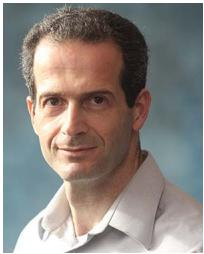

Israel Cohen (Fellow, IEEE) received the B.Sc. degree (Summa Cum Laude), M.Sc., and Ph.D. degrees in electrical engineering from the Technion – Israe Institute of Technology, Haifa, Israel, in 1990, 1993, and 1998, respectively.

From 1990 to 1998, he was a Research Scientist with RAFAEL Research Laboratories, Haifa, Israel Ministry of Defense. From 1998 to 2001, he was a Postdoctoral Research Associate with Computer Science Department, Yale University, New Haven, CT, USA. In 2001, he joined the Electrical Engineering

Department, Technion. He is currently a Louis and Samuel Seidan Professor of electrical and computer engineering with the Technion Israel Institute of Technology. He is the coeditor of Multichannel Speech Processing Section of the Springer Handbook ofSpeech Processing (Springer, 2008), and the coauthor of Fundamentals ofSignal Enhancement and Array Signal Processing (Wiley-IEEE Press, 2018). His research interests include array processing, statistical signal processing, deep learning, analysis and modeling of acoustic signals, speech enhancement, noise estimation, microphone arrays, source localization, blind source separation, system identification, and adaptive filtering. Dr. Cohen was awarded an Honorary Doctorate from Karunya Institute of Technology and Sciences, Coimbatore, India in 2023, Norman Seiden Prize for Academic Excellence in 2017, SPS Signal Processing Letters Best Paper Award in 2014, Alexander Goldberg Prize for Excellence in Research in 2010, and the Murie and David Jacknow Award for Excellence in Teaching in 2009. He was an Associate Editor for IEEE TRANSACTIONS ON AUDIO, SPEECH, AND LANGUAGE PROCESSING and IEEE SIGNAL PROCESSING LETTERS, Member of the IEEE Audio and Acoustic Signal Processing Technical Committee and the IEEE Speech and Language Processing Technical Committee, and a Distinguished Lecturer of the IEEE Signal Processing Society.