Review

# A Review of Artificial Intelligence-Driven Active Vibration and Noise Control

Zongkang Jiang 1 , Hongtao Xue 1,2, Huiyu Yue 1,2,\* , Xiaoyi Bao 1, Junwei Zhu 1 , Xuan Wang 1 and Liang Zhang 1

1 School of Automotive and Traffic Engineering, Jiangsu University, Zhenjiang 212013, China; jzk@stmail.ujs.edu.cn (Z.J.); xueht@ujs.edu.cn (H.X.); baoxiaoyi@stmail.ujs.edu.cn (X.B.); zhujw@stmail.ujs.edu.cn (J.Z.); wangx@stmail.ujs.edu.cn (X.W.); zhangliang@stmail.ujs.edu.cn (L

2 International Joint Laboratory on Mobility Equipment and Artificial Intelligence for IT Operations, Zhenjiang 212013, China

Correspondence: yuehuiyu@ujs.edu.cn

## Abstract

The core objective of Active Vibration and Noise Control (AVNC) is to enhance system performance by generating real-time counter-phase signals of equal amplitude to cancel out vibration and noise interference from mechanical or structural systems. As the demand for low-noise, low-vibration environments grows in fields such as new energy vehicles (NEVs), aerospace, and high-precision manufacturing, traditional AVNC methods—which rely on precise linear models and have poor adaptability to nonlinear and time-varying conditions—struggle to meet the dynamic requirements of complex engineering scenarios. However, with advancements in artificial intelligence (AI) technology, AI-driven Active Vibration and Noise Control (AI-AVNC) technology has garnered significant attention from both industry and academia. Based on a thorough investigation into the state-of-the-art AI-AVNC methods, this survey has made the following contributions: (1) Introducing the theoretical foundations of AVNC and its historical development; (2) Classifying existing AI-AVNC methods from the perspective of control strategies; (3) Analyzing engineering applications of AI-AVNC; (4) Discussing current technical challenges and future development trends of AI-AVNC.

Academic Editor: Davide Astolfi

Received: 26 August 2025 Revised: 29 September 2025 Accepted: 29 September 2025 Published: 13 October 2025

Citation: Jiang, Z.; Xue, H.; Yue, H.; Bao, X.; Zhu, J.; Wang, X.; Zhang, L. A Review of Artificial Intelligence-Driven Active Vibration and Noise Control. Machines 2025, 13, 946. https://doi.org/10.3390/ machines13100946

Copyright: © 2025 by the authors. Licensee MDPI, Basel, Switzerland. This article is an open access article distributed under the terms and conditions of the Creative Commons Attribution (CC BY) license (https://creativecommons.org/ licenses/by/4.0/).

Keywords: artificial intelligence-driven active vibration and noise control (AI-AVNC); active vibration and noise control (AVNC); artificial intelligence (AI); control strategy; optimizing method

## 1. Introduction

Vibration and noise are common physical phenomena in the operation of mechanical systems and engineering structures, and their adverse effects have a significant impact on critical industrial sectors such as aerospace, new energy vehicles, and high-precision equipment manufacturing. For example, in the aerospace sector, high-frequency vibrations from helicopter rotors not only reduce cabin comfort but may also accelerate component aging [1,2]; resonance during the deployment of spacecraft solar panels may lead to struc tural fatigue failure [3]; in the new energy vehicle industry, electromagnetic vibrations and high-frequency noise generated by hub motors directly affect the riding experience. Experimental data shows that the uncontrolled motor noise may have a variation of 20 to 30 decibels in a single howling order [4–6]; in the high-precision manufacturing sector, vibration components during the machining process of precision machine tools can contribute over 67% of surface roughness variations [7–10], while vibration imbalance in rotating machinery is the primary cause of equipment failures, accounting for approximately 70% of total failures [11]. Additionally, prolonged exposure to noise levels exceeding 85 decibels increases the risk of hearing damage by threefold [12]. Therefore, how to effectively control vibration and noise has long been an urgent and critical issue requiring resolution [13,14].

In the face of the increasingly prominent nonlinear, time-varying, and large-scale characteristics of modern engineering systems, traditional AVNC methods are no longer sufficient to meet the control requirements of complex engineering scenarios. Traditional AVNC methods integrate adjustable actuator-sensor closed-loop systems with advanced control algorithms (e.g., Linear Quadratic Regulator (LQR), H-infinity (H∞) and Least Mean Squares (LMS)) to establish a time-varying parameter dynamic optimization mechanism, achieving real-time control with a wide frequency range and strong robustness, particularly demonstrating significant advantages in the low-frequency domain [15]. However, traditional active control algorithms rely on precise linear system models, making them ill-suited for complex engineering scenarios such as random changes in road surface excitation during vehicle operation, degradation of mechanical structure stiffness, and global vibrations caused by aerodynamic coupling in large wind turbine clusters. Research indicates that when modeling errors or phase mismatches reach a certain magnitude, the control perfor mance of traditional AVNC algorithms deteriorates sharply, potentially leading to system instability [16,17], severely limiting their application in complex engineering scenarios.

To overcome the technical limitations of traditional active control methods in complex engineering scenarios, the introduction of AI technology offers a new solution. Its core transformative feature lies in breaking free from the reliance on precise physical models inherent in traditional methods. Instead, it employs data-driven nonlinear mapping mechanisms to achieve efficient modeling of the dynamic characteristics of complex systems. For example, neural networks can directly fit the complex relationship between vibration modes and control parameters [18]; the advantages of deep learning (DL) [19–21] in handling non-stationary signals effectively address control challenges related to impact noise and wide-frequency vibrations. For instance, convolutional neural networks (CNNs) [22–26] can effectively capture the transient characteristics of aerodynamic noise through timefrequency spectrum analysis [27,28]; while the dynamic decision-making mechanism of reinforcement learning (RL) can adapt to changing operating conditions in real time, such as by continuously interacting with the environment to optimize suspension damping parameters to adapt to different road conditions [29–31]. The characteristics of these AI technologies have driven AVNC methods from traditional model-driven approaches toward a new intelligent control paradigm combining data-driven and knowledge-guided methods, opening up entirely new possibilities for achieving high-precision control under extreme operating conditions [32,33].

In recent years, many excellent review papers have emerged in the field of AVNC. For instance, in 2021, Lu et al. [34] conducted a comprehensive investigation on the ANC method for linear systems. In 2022, El et al. [35] systematically reviewed the vibration control strategies for high-rise buildings. In 2023, Cunha et al. [36] reviewed the application of machine learning in structural dynamics and vibrational acoustics. In 2024, Liu and Lei [37] reviewed the ANC adaptive algorithm in impulse noise scenarios. In 2025, Liu et al. [38] summarized the ANC algorithm driven by neural networks. However, most of these reviews focus on a specific technical branch or a single application scenario, lacking a systematic and comprehensive integrated analysis of the emerging field of AI-AVNC. To fill the research gap in this field, this paper systematically reviews the AI-AVNC field from a brand-new perspective and with a multi-dimensional analytical framework. Different from the simple classification of previous reviews based on algorithm types or application scenarios, starting from the essence of control strategies, this paper divides the AI-AVNC method into four technical paths: (1) AI-based input shaping parameter optimization, (2) AI-based system identification and modeling, (3) AI-based controller parameter optimization, (4) AI-based controller modeling. In addition, this paper discusses the typical applications of AI-AVNC in multiple fields, analyzes the current technical challenges and future development trends, and explores the research progress in this field more comprehensively and deeply from five aspects: theory, methods, applications, challenges and trends, aiming to provide references for subsequent theoretical research and engineering practice.

The subsequent structure of this paper is arranged as follows: Section 2 discusses the physical mechanisms of vibration noise and the structure of AVNC systems, outlining the development trajectory of traditional and AI-driven AVNC technologies; Section 3 specifically analyzes the four major technical pathways of AI-AVNC; Section 4 discusses the engineering applications of AI-AVNC in new energy vehicles, aerospace, and high-precision equipment manufacturing; Section 5 explores the current challenges facing AI-AVNC and outlines future trends; finally, Section 6 provides a summary.

## 2. Overview of AI-AVNC

In this section, we first briefly analyze the principles and characteristics of vibration and noise generation, then introduce the basic principles of AVNC, and finally review the development history of traditional AVNC technology and AI-AVNC technology, laying the foundation for subsequent analysis of the technical path and applications of AI-AVNC.

## 2.1. The Physical Mechanism of Vibration and Noise

Vibration and noise are common phenomena of energy transmission in mechanical systems during operation, with its generation mechanisms including unbalanced rotating components, gear meshing impacts, structural resonance, and airflow excitation, among others [39–44]. Vibration energy propagates through structures (e.g., vehicle frames, aircraft fuselages, and machine tool beds) in the form of elastic waves (longitudinal waves, transverse waves, and bending waves) [45,46]. The stiffness, mass, and damping characteristics of a structure determine its natural frequency, modal shapes, and energy transmission pathways [47,48]. When the vibrating structure’s surface couples with the surrounding fluid (typically air), it causes fluctuations in fluid pressure, which in turn generate audible sound waves (noise). Noise radiation efficiency is influenced by multiple factors, such as vibration frequency, structural surface area, mode shape distribution, and the acoustic properties of the fluid [49–53]. From a propagation perspective, vibration noise exhibits significant multi-domain characteristics: in the frequency domain, it can be categorized into narrowband (e.g., single-frequency humming from rotating machinery) and broadband (e.g., turbulent noise); in the time domain, it exhibits non-stationarity (e.g., transient vibra tions caused by impact loads); and in the spatial domain, it exhibits coupling of propagation paths (e.g., coupling between structural sound paths and aerodynamic noise paths in the interior of NEVs) [54–57].

## 2.2. System Architecture of AVNC

AVNC differs from passive control in that its core lies in the construction of a closedloop control system. This system typically consists of three main components: sensors, actuators, and controllers. Based on the functional implementation of the control system, active vibration and noise control systems can be classified into feedforward systems, feedback systems, and hybrid systems. Table 1 summarizes the structure and characteristics of these three types of control systems.

Table 1. AVNC Systems.

<table><tr><td></td><td>Feedforward Control System</td><td>Feedback Control System</td><td>Hybrid Control System</td></tr><tr><td>Structure</td><td></td><td></td><td></td></tr><tr><td>Advantages</td><td>It can respond in advance before interference affects the system, improving control efficiency; it works well under periodic or predictable noise.</td><td>No reference signal is required, and the system structure is simple; it has strong adaptability to changes in system parameters and external interference.</td><td>Combining the advantages of feedforward and feedback, it has good control performance, strong adaptability, and robustness.</td></tr><tr><td>Disadvantages</td><td>Highly dependent on reference signals and system model quality; poor control effectiveness against sudden or non-periodic interference.</td><td>High gain can easily cause system instability, especially in the high frequency domain, where control failure is likely to occur; control effectiveness is limited for high frequency interference.</td><td>The system structure is complex, which can easily cause coupling interference; hardware requirements are high, and the deployment and optimization process is cumbersome.</td></tr></table>

The feedforward control system collects the excitation signals related to the primary in terference through reference sensors placed near the interference source [58]. This signal is input into the controller, where the built-in adaptive algorithm (e.g., the FXLMS algorithm) generates a secondary control signal in real time with the same amplitude and opposite phase as it, and drives the actuator (e.g., the actuator or speaker) to produce a cancellation effect, ultimately achieving the cancellation interference of vibration and noise in the target area [59]. The core advantage of this structure lies in its ability to predict interference in advance. Therefore, its control effect on periodic or narrowband signals is particularly significant. Theoretically, it can achieve simultaneous control of wide and narrow band interference, and the system stability is relatively good. However, its performance is constrained by the “secondary path feedback” problem [60]. The secondary signals generated by the actuator may propagate back to the reference sensor, contaminating the reference signal and thereby affecting the system performance or even causing instability.

Unlike feedforward control systems, feedback control systems do not require independent reference signals. It only relies on the error sensor located in the control area to detect the residual vibration noise, and the controller directly adjusts according to this error signal [61]. This structure avoids the limitation of difficulty in obtaining reference signals and is particularly suitable for dealing with sudden or random broadband interference. However, according to the Bode integral theorem of control theory, there is an inherent contradiction among the stability, performance and bandwidth of feedback systems [62]. Excessively high gain can easily cause system oscillation, so it is usually more suitable for controlling narrowband interference with relatively fixed or predictable frequency components, or as a compensation measure in scenarios where reference sensors cannot be installed.

To simultaneously leverage the advantages of both feedforward and feedback control systems, the hybrid control system integrates the two structures into one [63]. In this system, the reference sensor provides forward-looking information, enabling the feedforward unit to focus on offsetting the predictable major interfering components. The error sensor, on the other hand, guides the feedback unit to suppress the remaining random disturbances and enhance the system’s robustness to model uncertainties and environmental changes [64].

By carefully designing coordination strategies and dynamically adjusting the filter weight coefficients of the feedforward and feedback controllers using adaptive algorithms, the hybrid system can achieve better comprehensive performance than a single structure under more complex working conditions [65]. Of course, this performance improvement is also accompanied by an increase in system complexity and the difficulty of controller design.

## 2.3. The Development History of Traditional AVNC Technology

The development history of traditional AVNC technology is shown in Figure 1. In 1878, British physicist Rayleigh [66] published his work “The Theory of Sound”, which sys tematically proposed the theories of sound wave interference, superposition, and standing waves for the first time. This laid the direct physical foundation for the principles of active noise control (ANC); In 1936, German physicist Lueg [67] obtained the pioneering patent for ANC titled “Process of silencing sound oscillations”, marking the birth of the concept of active noise control; In 1953, Fogel [68] obtained a patent for noise reduction in helicopter cockpits. In 1957, Casali et al. [69] created a practical model of earcup ANC, with an active attenuation bandwidth of approximately 50–500 Hz and a maximum attenuation of approximately 20 dB, advancing the engineering implementation of ANC systems; In the 1960s, Conover [70] proposed a novel control concept, marking the first engineering implementation of using the electrical signal itself (rather than sound field detection signals) as the reference input source for ANC systems, thereby pioneering the modern feedforward ANC architecture; In the 1970s, Widrow et al. [71] proposed adaptive noise cancellation structures and the LMS algorithm, driving a shift from model-driven to data-driven param eter adjustment mechanisms; In the field of mechanical and structural vibration control, Karnopp et al. [72] proposed the "Skyhook" semi-active suspension concept in 1973, establishing an engineering path for achieving vehicle suspension vibration suppression using variable stiffness elements; To address the limitation of traditional LMS algorithms in handling dynamic characteristics of the control path, Morgan [73] proposed the Filtered-x LMS (FxLMS) algorithm in the 1980s; Subsequently, Singer and Seering [74] systematized the feedforward shaping idea for suppressing residual vibration of flexible structures as input shaping (IS) in 1990, which has become a classic method for suppressing overshoot and residual vibration in underdamped systems; In 1991, Hagood and Von Flotow [75] proposed piezoelectric shunt damping, which achieved efficient broadband vibration sup pression by coupling smart materials with passive electrical networks, promoting the rapid development of smart structures; Between 2000 and 2020, AVNC technology entered a phase of engineering refinement and system integration, expanding from single-channel to multi-channel, multi-scenario, and practical systems, and gradually developing con trol strategies adapted to complex structures and multi-physics coupling characteristics. Preumont [76] published his work “Vibration Control of Active Structures: An Introduction”, comprehensively summarizes the feedback control theory and engineering implementa tion of light damped flexible structures. These efforts have significantly enhanced the practicality and scalability of active and semi-active vibration suppression technologies in fields such as aerospace, precision engineering, and vehicles; In 2012, Kajikawa et al. [77] published a review paper that first expanded the application scope of active control to emerging fields such as electric vehicles, smart wearables, and spatial sound fields. The paper also explicitly pointed out the existing contradictions between real-time performance, adaptability, and energy consumption in current engineering deployments.

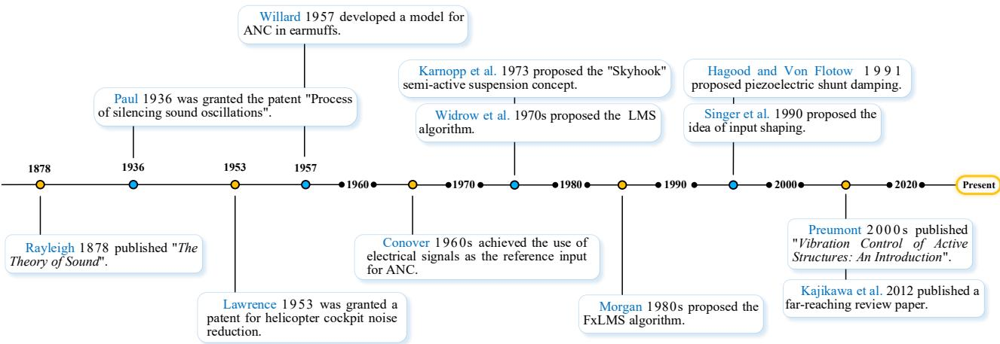  
Figure 1. Development history of traditional AVNC technology. Adapted from [66–77]: Rayleigh (1878) [66]; Paul (1936) [67]; Lawrence (1953) [68]; Willard (1957) [69]; Conover (1960s) [70]; Widrow et al. (1970s) [71]; Karnopp et al. (1973) [72]; Morgan (1980s) [73]; Singer and Seering (1990) [74]; Hagood and Von Flotow (1991) [75]; Preumont (2000s) [76]; Kajikawa et al. (2012) [77].

## 2.4. The Development History of AI-AVNC Technology

With the continuous development of modern engineering systems, traditional modelbased AVNC methods have gradually revealed their inadequacy in addressing system nonlinearity, time-varying characteristics, and large-scale coupling issues. To address this challenge, researchers began exploring the integration of AI technology into the ANC field in the late 1980s.

As shown in Figure 2, in 1995, Snyder and Tanaka [78] first applied neural networks to AVC systems, demonstrating the potential of neural networks in handling the complex characteristics of nonlinear acoustic systems and laying the foundation for AI-driven active control technology. In 1999, Bouchard et al. [79] proposed an improved training algorithm based on an extended backpropagation scheme, significantly enhancing the learning rate of neural network control structures. In 2000, Bosse et al. [80] combined modal filters with neural networks for adaptive vibration control, pioneering a new approach to multi-modal neural network control. In 2002, Jha and Rower [81] conducted experimental research on active vibration control using neural networks and piezoelectric actuators, systematically validating the practical application effectiveness of neural networks in intelligent structural vibration control for the first time. In 2006, Zhang et al. [82] applied adaptive recursive fuzzy neural networks to ANC, demonstrating the powerful potential of integrating fuzzy logic with neural networks. In 2007, Chen et al. [83] achieved the comprehensive application of multi-layer perceptron (MLP) neural networks, radial basis function (RBF) neural networks, cerebellar model joint controllers (CMAC) neural networks, and fuzzy neural networks in an isolation platform, marking the diversified development of intelligent control methods in the field of vibration control. In 2014, Xie et al. [84] first applied deep belief networks to the feature learning of high-speed train vibration signals, pioneering the application of DL in vibration signal analysis. In 2016, Huang et al. [85] used deep belief networks to achieve sound quality prediction of vehicle interior noise, demonstrating the application prospects of DL in the field of acoustic vibration control. In 2018, Liu and Yang [86] proposed a CNN-based vibration frequency prediction method, achieving the first direct prediction of frequency from vibration image sequences using DL, and exploring new directions for the application of DL in the field of vibration measurement. In 2019, Febvre et al. [87] first applied deep reinforcement learning (DRL) to active vibration control, enabling autonomous online learning of control strategies and environment-adaptive optimization, thereby enhancing the system’s environmental adaptability. In 2022, Han and

Liang [88] proposed a vibration control strategy based on the Proximal Policy Optimization (PPO) algorithm for application in vehicle semi-active suspension systems, achieving an intelligent control strategy that dynamically adjusts the reward function based on road conditions. In 2023, Chen et al. [89] first adopted the Transformer architecture for noise removal in mechanical vibration signals, significantly improving signal denoising quality through a multi-head attention mechanism. In 2024, physical information neural networks (PINNs) began to be introduced into noise prediction and control. For example, Zhang et al. [90] designed a PINN-assisted sound field interpolation ANC system, which simulates the sound field under limited microphone conditions guided by the acoustic wave equation, achieving better ROI noise suppression. In the same year, Tollardo et al. [91] proposed DeepF-fNet for vibration-based structural optimization, which rapidly identifies optimal vibration suppression parameters by integrating data and control physical laws, outperforming traditional genetic algorithms in terms of speed and effectiveness. In 2025, Bai et al. [92] proposed WaveNet-Volterra Neural Networks, as a causal-preserving time domain ANC framework, combining nonlinear Volterra coefficients with the WaveNet architecture, achieving superior performance compared to existing deep neural network (DNN) methods and traditional algorithms.

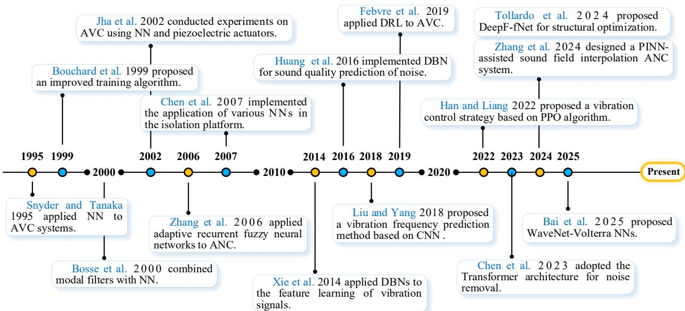  
Figure 2. Development timeline of AI-AVNC technology. Adapted from [78–92]: Snyder and Tanaka (1995) [78]; Bouchard et al. (1999) [79]; Bosse et al. (2000) [80]; Jha and Rower (2002) [81]; Zhang et al. (2006) [82]; Chen et al. (2007) [83]; Xie et al. (2014) [84]; Huang et al. (2016) [85]; Liu and Yang (2018) [86]; Febvre et al. (2019) [87]; Han and Liang (2022) [88]; Chen et al. (2023) [89]; Zhang et al. (2024) [90]; Tollardo et al. (2024) [91]; Bai et al. (2025) [92].

## 3. Technical Path Classification of AI-AVNC

In this section, we conduct a systematic classification study of the current state-of-theart AI-AVNC methods from a control strategy perspective, as shown in Table 2. AI-AVNC can primarily be categorized into four major technical pathways: (1) AI-based input shaping (IS) parameter optimization, which achieves system response optimization by adjusting the time-frequency characteristics of the feedforward control sequence; (2) AI-based system identification and modeling, using AI algorithms to identify and model key components of vibration noise control systems (e.g., secondary path models, structural dynamics models, etc.); (3) AI-based controller parameters optimization, which adjusts the gain coefficients of the feedback control law using AI algorithms; (4) AI-based controller modeling, which directly implements the controller functions of traditional control systems using AI algorithms. Additionally, in the following tables, we summarize the main features of the methods proposed under each technical pathway and explain their structural frameworks and characteristic descriptions.

Table 2. Four technical paths for AI-AVNC.

<table><tr><td>Technical Paths</td><td>Classification</td><td>Methods</td></tr><tr><td rowspan="3">Input shaping parameter optimization</td><td>Neural network-based methods</td><td>ANN-UMZV (Ramli et al., 2018), NN-ZVD (Ur Rehman et al., 2022), NNUMZV (Ramli et al., 2020), ResNN-ZVD (Yang et al., 2024), PINN-IS (Li and Xiao, 2025)</td></tr><tr><td>Reinforcement learning-based methods</td><td>RL-SI (Xu et al., 2020), RL-IS (Gulde et al., 2019), DRL-IS (Zhang et al., 2023)</td></tr><tr><td>Metaheuristics-based methods</td><td>GA-IS (Mohammed et al., 2019), PSO-ZVD (Xu et al., 2022), ACO-THEI (Fu et al., 2024)</td></tr><tr><td rowspan="3">System identification and modeling</td><td>Secondary path modeling</td><td>DNN (Im et al., 2023, Oh et al., 2024, Cheng et al., 2025), DNoiseNet (Cha et al., 2023)</td></tr><tr><td>Structural dynamics modeling</td><td>NARX (Song et al., 2022), PIDynNet (Liu and Meidani 2023), Neural ODE (Lai et al., 2021), PINN (Teloli et al., 2025), GNN (Li et al., 2023)</td></tr><tr><td>Incentive Perturbation Source Modeling</td><td>LSTM (Kwon et al., 2022), TNResNet (Yang et al., 2024), NARX (Zhang et al., 2018), DNN (Redonnet et al., 2024), DDPG (Ma et al., 2024)</td></tr><tr><td rowspan="4">Adaptive optimization of controller parameters</td><td>Linear feedback controller</td><td>PSO-PID (Yatim and Darus 2014, Silva et al., 2024), GA-LQR (Huang et al., 2024), CS-PID (Syafiqah et al., 2024), RL-PID (Lakhani et al., 2021)</td></tr><tr><td>Adaptive controller</td><td>ANFN-LMS (Nguyen et al., 2025), ANN-FxLMS (Le et al., 2017), PSO-FLC (Zorić et al., 2014), ACNF (Jafarzadeh et al., 2023)</td></tr><tr><td>Robust controller</td><td>GESO-SMC (Wang et al., 2024), RL-AFS (Mu et al., 2022), RBFNN-SMC (Sun and Zhao 2020)</td></tr><tr><td>Model Predictive Controller</td><td>MPSO-MPC (Zhao and Zhu 2019), ESN-MPC (Ogawa and Takahashi 2021), NARX-NMPC (Kalaycioglu and Ding 2024)</td></tr><tr><td>Controller modeling</td><td>DL/GF/DRL/ANFN controller</td><td>Deep MCANC (Zhang and Wang 2023), GFANC (Luo et al., 2023), DRL-ANC (Ryu et al., 2024), ANFN-HANC (Nguyen et al., 2025)</td></tr></table>

## 3.1. AI-Based Input Shaping Parameter Optimization

Input shaping (IS) is a typical feedforward open-loop control technique used for vibration suppression [93]. It not only achieves efficient and easy-to-implement characteristics by directly shaping input commands, but also avoids the high-cost equipment required for measuring output commands in feedback control [94]. On the other hand, it also does not incur the structural mass burden caused by increasing damping and stiffness. Typical shapers include Zero Vibration (ZV), Zero Vibration Derivative (ZVD), and Extra Insensitivity (EI) shapers, which are commonly used in applications such as cranes, robotic arms, and precision positioning.

## 3.1.1. IS Theory

As a feedforward open-loop control method, the input shaper consists of a series of timed pulses, which reduce vibration by convolving the original command and then applying it to the system. The basic principles and process of shaping are shown in Figure 3.

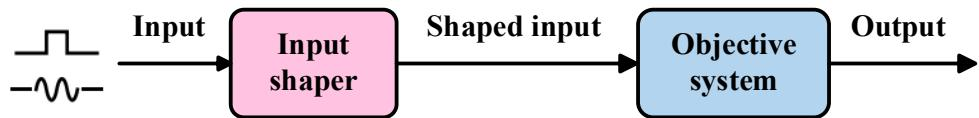

(a) A block diagram of IS control. The input command passing through the input shaper is convolved with the impulse sequence to drive the system.

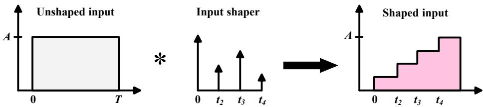  
(b) The shaping process of input shaper.  
Figure 3. The basic rule and shaping process of IS.

Since any system dominated by a single order vibration mode can be approximated by a second-order system, the transfer function can be expressed as

$$
G (s) = \frac {\omega_ {n} ^ {2}}{s ^ {2} + 2 \zeta \omega_ {n} s + \omega_ {n} ^ {2}}\tag{1}
$$

where s is a complex variable, $\omega _ { n }$ is the undamped natural frequency, $\zeta$ is the damping ratio. Note that the shapers need to identify these two modal parameters in advance and the traditional methods are: (1) Establishing the system dynamic model and solving the dynamic equation; (2) Hammer method or other modal experiments; (3) Finite element analysis method [95]. Thus, the unit impulse input response [96] is given as

$$
\omega (t) = \frac {\omega_ {n}}{\sqrt {1 - \zeta^ {2}}} e ^ {- \zeta \omega_ {n} (t - t _ {n})} \sin \omega_ {d} (t - t _ {n})\tag{2}
$$

where $\omega _ { d }$ is the damping frequency, $\omega _ { d } = \omega _ { n } \sqrt { 1 - \zeta ^ { 2 } }$ . The mathematical equation for input shaper is given as

$$
F (s) = \sum_ {i = 1} ^ {n} A _ {i} e ^ {- t _ {i} s}\tag{3}
$$

where $A _ { i }$ and $t _ { i }$ are the amplitude and time locations of the impulses, and n is the number of pulses in the pulse sequence. To obtain the system response, under the conversion of trigonometric function difference formula and trigonometric auxiliary angle, it can be expressed as

$$
y (t) = \frac {\omega_ {n}}{\sqrt {1 - \zeta^ {2}}} e ^ {- \zeta \omega_ {n} t} \times s i n (\omega_ {d} t - \varphi) \sqrt {\left(\sum_ {i = 1} ^ {n} A _ {i} e ^ {\zeta \omega_ {n} t _ {i}} \cos \omega_ {d} t _ {i}\right) ^ {2} + \left(\sum_ {i = 1} ^ {n} A _ {i} e ^ {\zeta \omega_ {n} t _ {i}} \sin \omega_ {d} t _ {i}\right) ^ {2}}\tag{4}
$$

where $\varphi$ is given as

$$
\varphi = \arctan \frac {\sum_ {i = 1} ^ {n} A _ {i} e ^ {\zeta \omega_ {n} t _ {i}} \sin \omega_ {d} t _ {i}}{\sum_ {i = 1} ^ {n} A _ {i} e ^ {\zeta \omega_ {n} t _ {i}} \cos \omega_ {d} t _ {i}}\tag{5}
$$

Note that the addition of impulse response becomes the total system response. The residual vibration ratio [97] (the ratio of (4) to (2)) that results from a sequence of impulses is defined as

$$
V (\zeta , \omega_ {n}) = e ^ {- \zeta \omega_ {n} t _ {n}} \sqrt {C ^ {2} (\zeta , \omega_ {n}) + S ^ {2} (\zeta , \omega_ {n})}\tag{6}
$$

where $C \left( \zeta , \omega _ { n } \right)$ and $S \left( \zeta , \omega _ { n } \right)$ are given as

$$
\left\{ \begin{array}{l} C (\zeta , \omega_ {n}) = \sum_ {i = 1} ^ {n} A _ {i} e ^ {\zeta \omega_ {n} t _ {i}} \cos \omega_ {d} t _ {i} \\ S (\zeta , \omega_ {n}) = \sum_ {i = 1} ^ {n} A _ {i} e ^ {\zeta \omega_ {n} t _ {i}} \sin \omega_ {d} t _ {i} \end{array} \right.\tag{7}
$$

If Equation (7) is set to zero, the impulse sequence that satisfies this equation is called zero vibration (ZV) shaper; further, if the first derivative with respect to frequency is also set to zero, a more robust zero vibration and derivative (ZVD) shaper can be obtained [98]. However, to avoid meaningless or engineering-infeasible solutions, additional constraints such as gain constraints, non-negative impulse constraints, and minimization of total time are usually required [99]. The following section will detail the AI-based input shapers.

## 3.1.2. Artificial Intelligence Method

Parameter optimization of input shapers based on AI algorithms, as an advanced control strategy, achieves synergistic optimization of system vibration suppression and response performance by intelligently adjusting the time-frequency characteristics of feedforward control sequences. This approach has demonstrated significant application potential and development prospects in the field of AVNC. Compared to traditional methods, AI approaches can effectively learn parameter changes in complex nonlinear systems [100], and achieve real-time control [101]. As shown in Table 3, the commonly used artificial intelligence algorithms in input shapers primarily include: (1) neural networks; (2) RL; (3) meta-heuristic algorithms.

Table 3. AI-based IS Parameter Optimization.  
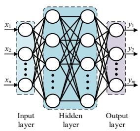  
(a) ANN

Neural Network  
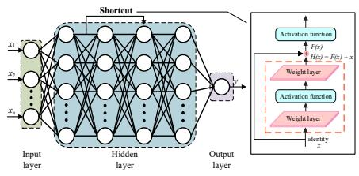

It uses the residual oscillation response characteristics of the system, such as displacement and acceleration spectrum, as input and leverages the powerful nonlinear mapping capabilities of neural networks to directly learn the complex relationship between vibration characteristics and optimal shaper parameters, such as damping ratio and natural frequency, replacing the traditional parameter tuning process that relies on precise mathematical models.

(b) ResNet  
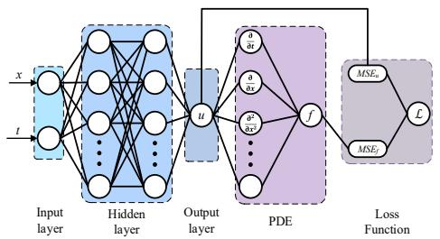  
(c) PINN

It utilizes a cross-layer jump connection structure to effectively capture multi-scale features in vibration signals. Through a deep network, it extracts the coupling relationship between high-frequency oscillations and low-frequency modes, directly mapping residual vibration responses to optimal shaping parameters. Compared to ordinary neural networks, its deep architecture avoids the gradient vanishing problem, significantly improving the parameter prediction accuracy of nonlinear systems (such as robotic arms with variable joint friction) under wide-band disturbances.

It embeds the control equations of the vibration system as a regularization term in the loss function, forcing the network to follow the laws of physical conservation during training. By jointly optimizing the network weights and the residuals of the vibration differential equations, it directly outputs the optimal shaping parameters that satisfy the energy constraints, achieving high-precision generalization with a small number of samples.

<table><tr><td colspan="3">Neural Network</td></tr><tr><td>(d) RL</td><td>(e) Q-table learning</td><td>(f) Deep Q-Network(DQN)</td></tr><tr><td>It models the vibration system as a Markov decision process (MDP): real-time vibration spectrum as the state, shaping parameters as actions, and negative residual vibration energy as rewards. Through continuous interaction between the intelligent agent and the environment, it autonomously learns the optimal control strategy.</td><td>It discretizes the vibration system into finite states, quantizes the shaping parameters into discrete actions, and allows the agent to select actions at each time step according to a certain strategy. Based on the reward signals returned by the environment, the agent updates the values of the corresponding state-action pairs in the Q-table, gradually learning the optimal strategy.</td><td>It uses deep neural networks to fit Q-value functions, breaking through the limitations of traditional Q-table learning, which requires the state-action space to be discrete. It can directly process high-dimensional continuous vibration spectrum features. Parameters are obtained through empirical replay and target network mechanisms, enabling efficient learning of optimal strategies under time-varying operating conditions from complex state spaces.</td></tr><tr><td colspan="3">Heuristic Algorithm</td></tr><tr><td colspan="3">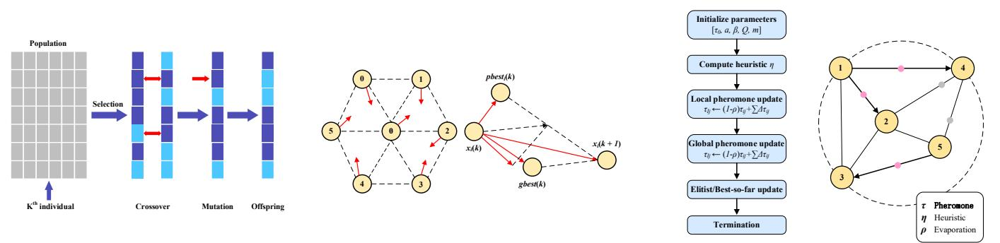</td></tr><tr><td>(g) GA</td><td>(h) PSO</td><td>(i) ACO</td></tr><tr><td>It encodes the parameters of the shaper into chromosome genes and iteratively evolves the population through selection, crossover, and mutation operations. It then performs a global search for the optimal solution using residual vibration energy as the fitness function.</td><td>It considers the optimization problem as an objective function, and represents the solutions as particles which are randomly initialized as a swarm. Besides, each particle has its own velocity and position, and iteratively searches for the optimal solution by interacting with other particles in the swarm.</td><td>It views optimization as path finding by multiple randomly initialized ants on a solution-space graph; ants transition probabilistically based on pheromone trails and heuristic cues and apply evaporation and reinforcement updates. Leveraging pheromone-driven stigmergic cooperation, the colony iteratively converges to a optimal solution.</td></tr></table>

Table 3. Cont.

configuration of pulse intervals and amplitudes, thereby maintaining low residual vibration and short shaping durations even under conditions of model inaccuracy or parameter changes due to operating conditions. Ramli et al. [104] proposed an ANN-based unit amplitude zero vibration (UMZV) input shaper, which uses a particle swarm optimization (PSO) training process to enable the shaper to predict and update pulse parameters in real time, thereby enhancing vibration suppression while shortening shaping duration. This addresses the issue of traditional shapers failing due to time-varying parameters such as load lifting and mass changes in bridge cranes. This study verified the effectiveness of the method through simulation and physical experiments. However, the experimental scale was limited (only a single load variation scenario), and its generalization ability still needs to be further verified in a more complex multi-disturbance environment. Zhang et al. [105] proposed a post-processing deep neural network (DNN) input shaper for residual vibration suppression. This shaper establishes a fully connected layer ANN trained using multiple sets of excitation trajectory samples and employs an adaptive forgetting factor to update the recursive least squares (RLS) algorithm, improving the shaper’s tracking performance in non-stationary environments and addressing time cost issues in scenarios with varying trajectories.

In recent years, research has expanded from feedforward fully connected networks to more capable architectures such as adaptive online neural networks, residual networks (ResNet), and physically informed neural networks (PINN), further enhancing the ability to handle uncertainty and multimodal vibrations. Ur Rehman et al. [106] proposed an adaptive ZVD shaper based on an ANN, which addresses factors such as cable length changes and parameter uncertainties through online learning, achieving swing suppression for a five-degree-of-freedom tower crane under various disturbances and uncertainties. Ramli et al. [107] proposed a hybrid method combining predictive neural-network-based unity-magnitude ZV (NNUMZV) and neural network-like (APIDLNN) adaptive PID con trollers, achieving real-time swing control of a bridge crane under synchronous lifting and external disturbances. Yang et al. [108] proposed an Extended Kalman Filter (EKF)-based ResNet Input Shaping (ERS) model: the EKF is used for online estimation of modeling errors, and the residual network is cascaded with the EKF to eliminate residual observa tion errors, achieving significant vibration control performance in flexible column beam experiments. Li and Xiao [109] proposed a PINN-based input reshaping method, which achieves effective suppression of multi-modal residual vibrations in flexible robotic arms through two-stage training using a loss function that balances physical model constraints and modal conditions. Experimental results show that this method outperforms traditional input reshaping methods in terms of computational efficiency and performance, and holds great potential for complex control tasks in flexible robotic systems. However, its training relies on a two-stage optimization process, which requires a large amount of offline compu tation. Moreover, the introduction of physical constraints increases the model’s complexity, and its feasibility in practical engineering applications needs further verification.

(2) Reinforcement learning: RL is a typical discrete behavior learning model that reformulates the traditional IS design problem, which is traditionally solved using analytical or optimization equations, into sequential decision-making. The intelligent agent uses residual vibration, overshoot, and settling time as observation signals, continuously interacting with the dynamic environment to learn and adaptively search for the optimal shaping sequence, thereby balancing vibration suppression effectiveness and response efficiency. Xu et al. [110] proposed an RL-based control method for specific insensitive input shapers (SI), which utilizes an RL agent to seek the maximum reward function (i.e., the optimal parameters with the smallest vibration amplitude) to achieve better vibration control performance and robustness. This study verified the effectiveness of the method based on a simulation environment, but it lacks physical experiment support. Its general ization ability and safety in actual vibration systems have not been verified. Additionally, the design of the reward function is highly dependent on prior knowledge and lacks systematic analysis of reward shaping. The paper also does not quantify sample efficiency and convergence stability. Gulde et al. [111] proposed an RL-based method for compensating machine tool shaft vibrations, compensating for vibrations in dynamic drive systems with unknown prior system parameters, and validated the method’s feasibility in engineering through real experiments. With the development of DL technology, research on DRL-based input shapers has further broken through the limitations of traditional RL in terms of state dimensions and feature extraction. By combining DL models such as CNN and recurrent neural networks (RNN) with the RL framework, effective shaping parameter optimization strategies can be learned directly from raw sensor data or high-dimensional system states, demonstrating superior performance in complex scenarios such as multimodal vibration systems and time-varying systems. Zhang et al. [112] proposed a DRL-based input shaping (RLIS) optimization method, which improves learning efficiency and simplifies the design process through a state value-based selection mechanism and a fuzzy reward system. However, this research did not take into account the time delay and sensor noise in the actual system, and its engineering maturity is relatively low.

(3) Meta-heuristic algorithms: Meta-heuristic algorithms are a class of global optimization algorithms inspired by natural heuristic processes. Common meta-heuristic algorithms include genetic algorithms (GA) [113,114], particle swarm optimization (PSO) [115,116] and ant colony optimization (ACO). These methods simulate intelligent behaviors such as biological evolution and group foraging in nature, transforming the optimization of IS parameters into an extremum search problem for objective functions (e.g., residual vibra tion energy, motion overshoot). They feature no need for gradient information and strong global optimization capabilities. Mohammed et al. [117] proposed an optimization input shaper based on a multi-objective GA strategy, which achieves motion control optimization by inputting multiple acceleration step signals, addressing the issue of minimizing residual vibrations caused by non-zero initial conditions and load position transfers. However, this research has not been experimentally verified, and the optimization process is computationally expensive and does not take real-time requirements into account, making it difficult to be directly applied to online control scenarios. Xu et al. [118] proposed a PSO-based automatic parameter selection ZVD shaping algorithm, which can automatically calculate the optimized amplitude and time position of pulses required for common ZVDs, enabling motion control in underactuated nonlinear systems with minimal modeling effort and enhancing the vibration suppression effectiveness of the ZVD algorithm. Fu et al. [119] proposed an improved design method for the two-hump extra-insensitive (THEI) input shaper, using the ACO algorithm to solve design variables and update the pulse amplitude of the improved THEI input shaper to achieve optimal insensitivity.

Overall, ANN-based shapers (e.g., UMZV [104], DNN [105]) possess strong nonlinear approximation capabilities and relatively fast inference speeds, enabling online pulse shaping under parameter drift conditions. Experimental data indicates that, in the case of a 40% mismatch in the system’s natural frequency, the use of ANN shapers can reduce overall vibration and residual amplitude by at least 50%. For the same controlled object, compared with the traditional post-adaptive shaping scheme, DNN input shaping can further reduce the residual amplitude by 21.6–36.9% and shorten the shaping time by 23.7–28.4%; when an adaptive forgetting mechanism is introduced, the amplitude reduction can be increased to 28.3–36.9%. However, their performance is highly dependent on task-specific datasets, and robustness may significantly decline when the training data distribution is exceeded or sensor bias exists. Usually, online identification [108] (e.g., EKF, UKF) or the introduction of physical constraints [109] (e.g., PINN) is combined to shrink the hypothesis space and enhance generalization ability. RL-based shapers [110–112] do not rely on explicit gradient models and can directly search for control laws in the policy space, making them suitable for complex conditions such as non-stationary and high-dimensional scenarios. However, their performance is sensitive to the design of the reward function, and they generally suffer from low sample efficiency and insufficient safety in hardware exploration. In the actual online shaping process, such methods typically require approximately $8 . 5 \times 1 0 ^ { 5 }$ interaction steps to achieve stable convergence. In contrast, meta-heuristic methods [113,118] have global search capabilities and do not require gradient information, making them relatively easy to deploy; however, the obtained pulse sequences often face a trade-off between robustness and shaping duration, and usually, hot-starting or embedding low-dimensional analytical structures is adopted to ensure online real-time performance.

## 3.2. AI-Based System Identification and Modeling

System identification and modeling, as a core component of AVNC, essentially involves establishing mathematical models that accurately describe the dynamic characteristics of a system based on input-output data [120]. The accuracy of the model directly determines the performance of the control system; an inaccurate model can lead to slower convergence, increased steady-state residuals, and even system instability [121–123]. In recent years, with the improvement of computational capabilities and the refinement of algorithmic theories, AI algorithms have achieved breakthrough progress in applications such as propagation path modeling, structural dynamics modeling, and excitation disturbance source modeling [124–126]. The introduction of AI algorithms has significantly enhanced modeling accuracy and efficiency, expanding the application boundaries of active control systems to enable them to address more complex and demanding engineering environments [127]. The following sections will discuss the latest research progress of AI algorithms in system identification and modeling from these three aspects, and Table 4 summarizes the structural framework and feature descriptions of the proposed methods.

## 3.2.1. AI-Based Secondary Path Modeling

In terms of propagation path modeling, the primary path represents the acoustic and vibration propagation characteristics between the reference signal and the error sensor, while the secondary path characterizes the acoustic and vibration transmission relationship between the control source and the error sensor. Accurate identification of propagation paths is a necessary condition for achieving convergence of the adaptive filtering algorithm and ensuring system stability. Errors in estimating the secondary path can lead to reduced convergence speed or divergence of the control algorithm, causing performance degradation or even instability in the control system. AI algorithms, with their powerful nonlinear fitting capabilities and online learning characteristics, can effectively overcome the limitations of traditional FIR/IIR filters in handling nonlinear, spatially non-uniform, and time-varying characteristics. In particular, DL methods have become an important technical means for improving the performance of adaptive control algorithms such as FxLMS. Im et al. [128] proposed a DL-assisted secondary path update technique, which trains a DNN to estimate the secondary path in real time based on changing boundary conditions. Experiments show that this method remains highly adaptive even under rapidly changing boundary conditions. However, this experiment was conducted in a controllable laboratory environment; it has not been tested in real vehicles or complex acoustic environments, and the data scale and diversity are lacking, and its engineering feasibility remains to be verified. Cha et al. [129] proposed a DL-based ANC algorithm named DNoiseNet, incorporating a secondary path estimator based on a MLP neural network to enhance DNoiseNet’s performance. This method overcomes the reliance of feedback control systems on reference signals, improving robustness in highly nonlinear and nonstationary noise scenarios, and breaking through the limitations of traditional ANC. Oh et al. [130] proposed a method for real-time updating of secondary path estimation using DNN in dynamic environments. This method maintains low model error and steadily improves noise reduction performance in time-varying acoustic environments, and the importance of real-time updating of secondary path estimation for maintaining ANC performance was verified in real vehicle scenarios. The experimental design was rigorous, but the computational complexity and delay budget were not fully discussed. The repeatability of the experiment depends on a specific hardware platform. Cheng et al. [131] proposed an ANC algorithm based on DL and normalized clustering control strategy. The normalized clustering control strategy balances the system’s convergence speed and steady-state error, while the deep learning prediction model estimates the secondary path, reducing the interference of dynamic environments on modeling accuracy and ensuring the noise reduction performance of the control strategy.

It can be seen from this that the DL-based secondary path modeling methods show significant potential in dealing with the nonlinearity and time-varying characteristics of the system. However, there are slight differences in performance among various methods. From the basic DNN [128] to more complex architectures such as DNoiseNet [129] and SPD-ANC [131], the enhancement of model expression ability brings better nonlinear fitting accuracy and operational adaptability, but this comes at the cost of sacrificing realtime performance and increasing computational complexity. In the time-varying duct experiment, the lightweight DNN can still achieve a broadband noise reduction effect of approximately 10 dB under the sudden change of boundary conditions caused by the variation of the error sensor position, demonstrating good engineering applicability. In contrast, although schemes such as SPD-ANC that adopt dual-network decoupling significantly enhance stability under nonlinear working conditions, their computational cost also increases accordingly. Therefore, their practicality in real engineering scenarios is still severely constrained by factors such as computational resources, real-time requirements, and hardware platform dependencies.

## 3.2.2. AI-Based Structural Dynamics Modeling

Structural dynamics modeling aims to establish a mapping relationship between exci tation forces and structural vibration responses, including identifying modal parameters (e.g., natural frequencies, damping ratios, mode shapes), constructing frequency response function matrices, and predicting transient or steady-state responses. High-precision, controllable models directly determine the stability margin and robustness assessment of controllers, controllability and observability distributions, and the ability to avoid high frequency overflow causing reverse excitation; This is critical for vibration controller design, actuator and sensor optimization layout, and control overflow suppression. AI algorithms demonstrate unparalleled advantages over traditional modal analysis and finite element methods in handling structural nonlinearities (geometric nonlinearity, material nonlinearity, contact nonlinearity), modal coupling, parameter uncertainty, and high-dimensional degree-of-freedom systems: it can directly learn low-order identifiable models related to control from data under noisy or sparse measurement conditions, reducing reliance on fine meshes and extensive parameter tuning, significantly lowering modeling complexity; it can suppress extrapolation divergence issues through physical constraints and regulariza tion while supporting online dynamic updates; it achieves smaller prediction errors and stronger parameter robustness under the same sensor configuration, thereby expanding the effective vibration suppression bandwidth, reducing control energy consumption, and improving vibration suppression performance. Song et al. [132] proposed a NARX neural network-based identification method for cantilever structures for AVC and verified it effectiveness in the cantilever structure experiment. This method effectively reduces identi fication errors by increasing the order of the input nodes, achieving efficient and accurate online identification and nonlinear vibration suppression of flexible mechanisms However, the training data of the experiment came from a specific excitation mode and was not tested under variable loads, which led to doubts about its generalization ability. Liu and Meidani [133] proposed a novel physical information neural network (PIDynNet) method for identifying nonlinear structural systems and demonstrated its application in multi-physics scenarios where damping terms are controlled by decoupled dynamical equations. This method improves the estimation of nonlinear structural system parameters by integrat ing loss terms based on auxiliary physics (one for structural dynamics and one for heat transfer), demonstrating robust performance and generalization capability for predicting nonlinear responses to unknown ground excitations. Lai et al. [134] proposed a structure identification method based on physics-informed neural ordinary differential equations (Physics-informed Neural ODEs), which is constrained by domain knowledge such as structural dynamics and has the advantage of directly approximating control dynamics, providing a general and flexible framework for residual modeling in structure identification problems. However, during the simulation and experimental processes, the training is sensitive to the initial values and hyperparameters, and this research lacks uncertainty quantification and real-time performance evaluation, with insufficient engineering maturity. Teloli et al. [135] proposed a structure parameter identification method based on PINN, which introduces control equations as physical constraints in the loss function, enabling it to effectively simplify complex structural analysis in cases where boundary conditions are unclear. This method not only enhances the reliability of parameter identification but also expands the application boundaries of computational mechanics in engineering practice. Li et al. [136] proposed an automated modal identification method based on graph neural networks (GNN), which discretizes engineering structures into graph structures and uses the power spectral density (PSD) of sparse vibration measurements as node features. The GNN is trained to simultaneously regress natural frequencies, damping ratios, and mode shapes, achieving rapid identification and transfer application for structural populations. Experiments show that it outperforms the classical frequency domain decomposition (FDD) and MLP baselines in terms of identification accuracy and speed, and demonstrates robust ness to measurement noise and sparse deployment, making it suitable for structural health monitoring (SHM) scenarios involving large populations.

From the above research progress in AI-based structural dynamics modeling, it can be seen that various methods present clear performance trade-offs among interpretability, generalization ability, and computational efficiency. NARX-ANN [132] effectively captures weak nonlinear dynamic behaviors at a low parameter cost and supports online identification. In the vibration test bench, the RMSE of this method is only $3 . 6 8 \times 1 0 ^ { - 3 } \mathrm { g } ,$ reducing the identification error by approximately 50% compared to traditional methods. It is suitable for medium and low-dimensional flexible components with AVC as the target; however, its extrapolation robustness under cross-load and cross-condition scenarios is rel atively limited. In contrast, PINN [135] and neural differential equations [134] significantly enhance the model’s transferability and interpretability in small sample, multi-physics field coupling, and multi-modal scenarios by embedding physical priors such as control equa tions, boundary conditions, and initial conditions into the loss function. However, the cost is a higher demand for training computing power and sensitivity to the initial value setting and loss weight hyperparameters. On the other hand, the automated modal identification method based on GNN [136] is oriented towards structural groups and can achieve fast and transferable operational modal analysis under sparse power spectral density measurements. Even with only 18% of the nodes equipped with acceleration sensors in a sparse sensing configuration, this method can still stably identify the first few modes of the structure. Additionally, in the same CPU environment, batch identification of 100 truss samples takes 39.95 s with the traditional FDD method, while the GNN method only requires about 2.5 s. However, its performance depends on the reasonable construction of the graph structure and effective domain adaptation strategies.

## 3.2.3. AI-Based Incentive Disturbance Source Modeling

Accurate modeling of incentive sources requires not only identifying the amplitude, frequency, and phase characteristics of disturbances but also capturing their statistical prop erties, time-varying patterns, and multi-source coupling effects [137–139]. This forms the foundation for designing feedforward controllers, predicting control performance bound aries, and optimizing control strategies. AI algorithms, particularly deep generative models and temporal prediction networks, demonstrate unique advantages in modeling complex excitation patterns (e.g., non-stationary random excitation, periodic and random mixed excitation, and sudden impact excitation). They can learn the underlying distribution patterns of excitation from historical data, enabling accurate prediction of future distur bances, and provide reliable reference signals and feedforward compensation basis for active control systems. Kwon et al. [140] proposed an ANC algorithm based on long short term memory networks (LSTM) [141]. This method generates control signals by predicting reference noise signals to minimize residual noise, demonstrating excellent noise reduction capabilities in narrowband, broadband, and pulse noise environments. Compared with the traditional FxLMS algorithm, it does not significantly increase computational costs or system complexity, making it highly feasible for practical deployment. Yang et al. [142] proposed a deep learning-based tire noise recognition residual network (TNResNet) aimed at capturing and utilizing time-frequency information in tire noise signals for road terrain recognition. Compared with traditional machine learning techniques (e.g., decision trees, k-nearest neighbors, and support vector machines) and advanced deep learning models (e.g., LSTM and CNN), TNResNet achieves higher accuracy. Zhang et al. [143] proposed a road profile reconstruction method based on nonlinear autoregressive networks (NARX) and wavelet decomposition: the vehicle inertial response signal is processed using wavelet decomposition technology, and then an NARX with external input is introduced to recon struct the road elevation profile, enabling high-precision estimation of the road profile. Redonnet et al. [144] proposed a deep learning-based wing profile self-noise prediction method, investigating the sensitivity of DNNs to training data. This method demonstrates significantly greater robustness and accuracy compared to traditional semi-empirical pre diction models (BPM). Ma et al. [145] proposed a control method for unmanned aerial vehicles (UAVs) to resist wind disturbances by integrating online wind field modeling with DRL. This method estimates the wind field in real-time based on wind speed and direction data through a parameterized wind field model, and simultaneously embeds the estimated wind field state into the observation space and reward function of the DRL agent to train a control strategy with wind disturbance suppression capability. In both simulation and physical flight experiments, this method demonstrated excellent trajectory tracking and attitude stability. Additionally, it can quickly adapt to complex wind conditions such as gusts and wind shear, and has a certain tolerance for wind field model mismatch.

From the perspective of practical application, temporal models have demonstrated excellent computational efficiency. For instance, the ANC algorithm based on LSTM [140] can control the single inference time within 20 milliseconds, which has a clear advantage in resource-constrained embedded systems. However, its reliance on the completeness of historical data limits its application boundaries in scenarios with sudden disturbances. In contrast, deep architectures like TNResNet [142] achieve higher modeling accuracy through multi-level feature extraction, but this performance improvement comes at the cost of increased model complexity and computational overhead. Even more groundbreaking is the integration of wind farm online modeling and DRL. By building a closed-loop interaction between environmental dynamics and control strategies [145], this solution achieves proactive response to time-varying disturbances and has unique advantages in coping with complex and changing environments.

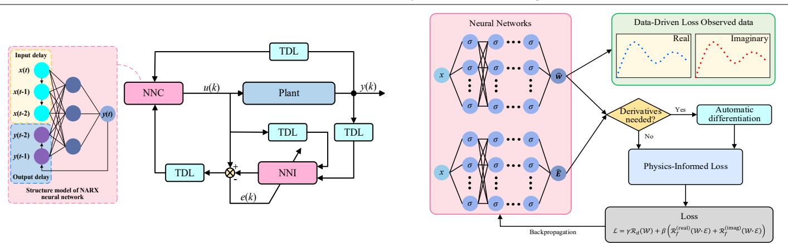  
AI-Based Structural Dynamics Modeling  
(b) Block diagram of dynamic inverse control based on NARX neural network  
(c) Block diagram of a PINN framework for structural identification

Table 4. AI-based System Identification and Modeling.  
AI-Based Secondary Path Modeling  
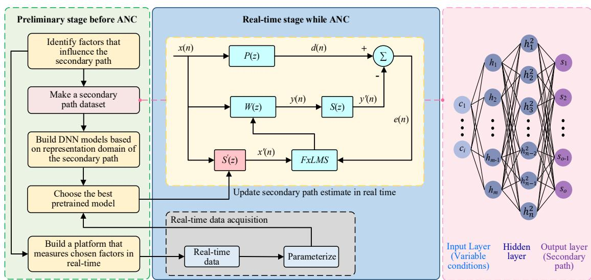  
(a) Block diagram of FxLMS algorithm with DL-based, real-time secondary path estimate updates.

It first builds a secondary-path dataset offline and pretrains a DNN (steps shown in the left figure). At runtime, real operating conditions are used to update the secondary-path estimate online, and the updated estimate then drives FxLMS to achieve real-time adaptive noise cancellation. This method typically assesses performance using ERLE, with the time taken to reach the target ERLE serving as an indicator of convergence speed. Robustness is evaluated based on performance degradation under conditions such as sensor position changes, secondary path gain or delay drift [128–131].

Table 4. Cont.

## AI-Based Secondary Path Modeling

The NARX neural network incorporates time delays and feedback, thereby enhancing its memory of historical data. In the figure, NNI means neural network identifier, NNC means neural network controller. Set their structures similar. The online single data weight updating method is used to identify the dynamic inverse model of the control object. At the same time, the weight matrix of the neural network is transferred to the inverse model controller NNC. Based on this method, the identifier can dynamically identify the system parameters and improve the accuracy. This method is usually evaluated for accuracy by the RMSE of displacement or acceleration prediction, for convergence speed by the number of samples or time required for the weights to enter the steady state, and for robustness by the rate of increase of RMSE under different excitation spectra, amplitude variations, and measurement signal-to-noise ratios [132].

The neural network takes the spatial position x as input and outputs the estimated displacement and the complex elastic modulus. Observed data define a data-driven loss; when higher-order derivatives are needed, they are obtained via automatic differentiation. This is then combined with a physics-based loss derived from the structural mechanics equations to form a weighted total loss. Finally, the total loss is minimized by backpropagation, simultaneously identifying the parameters and reconstructing the displacement. This method typically assesses accuracy by the RMSE of displacement or acceleration prediction, measures convergence speed by the number of iterations or time required for the physical loss to drop to a set threshold, and evaluates robustness by the growth of RMSE and physical residuals under scenarios such as boundary condition changes, load variations, or sparse training samples [135].

AI-Based Incentive Disturbance Source Modeling  
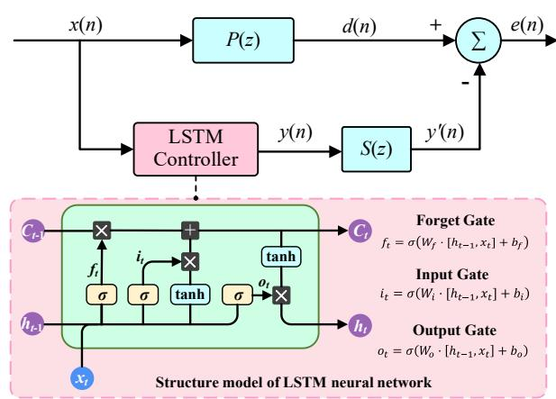  
(d) Block diagram of deep neural network filters with LSTM

LSTM is a type of recurrent neural network designed for managing long sequence data, consisting of three gates that regulate the flow of information: the forget gate, the input gate, and the output gate. The ANC controller based on LSTM layers is suitable for predicting reference noise and generating control signals to minimize residual noise. This method typically assesses performance using MSE and ERLE, measures convergence speed by the time required for the system to reach the target performance from startup, and evaluates robustness by the ability to maintain performance under conditions such as changes in noise spectrum characteristics, secondary path drift, or data frame loss [140].

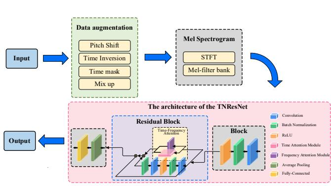  
(e) Block diagram of road terrain recognition based on TNResNet

It begins with data augmentation techniques, followed by converting the data into Mel spectrograms that are input into the TNResNet model for feature extraction through the network’s convolutional layers. Residual blocks are used to improve training efficiency, and a time-frequency attention module focuses on relevant features. The final output is the classification of different terrain categories based on the extracted features. This method is typically evaluated in terms of Top-1 accuracy for performance, end-to-end inference time for convergence speed, and the ability to maintain recognition accuracy under various conditions such as different signal-to-noise ratios and changes in sensor installation positions for robustness [142].

## 3.3. AI-Based Controller Parameter Optimization

Conventional controller architectures (e.g., linear feedback controllers, adaptive con trollers, and robust controllers) are widely used in AVNC systems [146]. The basic principle of these controllers is based on classical control algorithms (as shown in Table 5), which manually adjust controller parameters (e.g., proportional, integral and derivative gains) to effectively suppress noise sources or vibration sources [147–149]. However, these traditional control methods have limitations when dealing with complex nonlinear systems, time-varying systems, or environments with uncertainties. In such cases, conventional controllers often fail to achieve optimal control performance, especially when the parameters of the control system need to be adjusted in real-time according to environmental changes, which may affect the performance of traditional controllers. By incorporating AI optimization algorithms, particularly technologies such as DRL and neural networks [150], controller parameters can be dynamically adjusted according to different operating conditions and environmental changes, ensuring the system maintains optimal suppression performance across various vibration and noise scenarios. The following sections will detail the latest research advancements in AI algorithms for controller parameter optimization across four aspects based on different controller types, with the structural frameworks and feature descriptions of the proposed methods summarized in Table 6.

Table 5. Classic control algorithms.

<table><tr><td>Control Algorithm</td><td>Expression</td><td>Variable Description</td></tr><tr><td>PID</td><td>Continuous:  $u(t) = K_{p}e(t) + K_{i}\int_{0}^{t} e(\tau)d\tau + K_{d}\dot{e}(t)$ Discrete:  $u[k] = K_{p}e[k] + K_{i}T_{s}\sum_{i=0}^{k} e[i] + K_{d}\frac{e[k] - e[k-1]}{T_{s}}$ </td><td> $K_{p}, K_{i}, K_{d}$ : P/I/D gains, $T_{s}$ : sampling period,e: error</td></tr><tr><td>LMS</td><td>Filter output:  $y[k] = w^{\top}[k]x[k]$ Error:  $e[k] = d[k] - y[k]$ Update:  $w[k+1] = w[k] + \mu e[k]x[k]$ </td><td>W[k]: adaptive weights, $d[k]$ : measurement,e: error, $\mu$ : step size</td></tr><tr><td>Fuzzy control (Sugeno)</td><td>Rule activation:  $w_{i} = \prod_{j} \mu_{A_{ij}}(x_{j})$ Defuzzification:  $u = \frac{\sum_{i=1}^{N} w_{i}(a_{i}^{\top}x+c_{i})}{\sum_{i=1}^{N} w_{i}}$ </td><td> $\mu_{A_{ij}}$ : membership functions, $w_{i}$ : rule firing strength, $a_{i}, c_{i}$ : consequent params</td></tr><tr><td>LQR</td><td>System:  $\dot{x} = Ax + Bu$ Cost:  $J = \int_{0}^{\infty} (x^{\top}Qx + u^{\top}Ru)dt$ Optimal law:  $u = -Kx, K = R^{-1}B^{\top}P$ CARE:  $A^{\top}P + PA - PBR^{-1}B^{\top}P + Q = 0$ </td><td>x: state,u: control,A, B: system matrices,Q, R: weights,P: Riccati solution,K: LQR gain</td></tr><tr><td>H∞</td><td>Disturbed plant:  $\dot{x} = Ax + Bu + Ew$ perf. Output:  $z = \begin{bmatrix} Q^{1/2}x \\ R^{1/2}u \end{bmatrix}$ Goal:  $\| G_{w \to z} \|_{\infty} < \gamma$ Sufficient condition: if  $\exists X \succ 0$  s.t. $A^{\text{T}}X + XA + Q - XBR^{-1}B^{\text{T}}X + \frac{1}{\gamma^{2}} XEE^{\text{T}} \prec 0$ ,then  $u = -Kx, K = R^{-1}B^{\text{T}}X$ </td><td>w: disturbance,E: disturbance matrix,z: performance output,Q, R: weights, $\gamma$ : bound,K: feedback gain</td></tr></table>

Table 5. Cont.

<table><tr><td>Control Algorithm</td><td>Expression</td><td>Variable Description</td></tr><tr><td>Sliding-Mode Control (SMC)</td><td>Sliding surface:  $s = \dot{e} + \Lambda e$ Control:  $u = u_{\text{eq}} - K_s \text{sat}(s/\phi)$ Reaching law:  $\dot{s} = -\eta \text{sgn}(s)$ </td><td> $e$ : tracking error, $s$ : sliding variable, $\Lambda$ : surface params, $u_{eq}$ : equivalent control, $K_s$ : switching gain, $\phi$ : boundary layer, $\eta$ : reaching rate</td></tr><tr><td>Model Predictive Control (MPC)</td><td>Prediction model:  $x_{k+1} = Ax_k + Bu_k$  $y_k = Cx_k$ </td><td> $x_k, u_k, y_k$ : state, control, output, $A, B, C$ : discrete model matrix</td></tr></table>

Table 6. AI-based controller parameters optimization.

## AI-Based Linear Feedback Controller

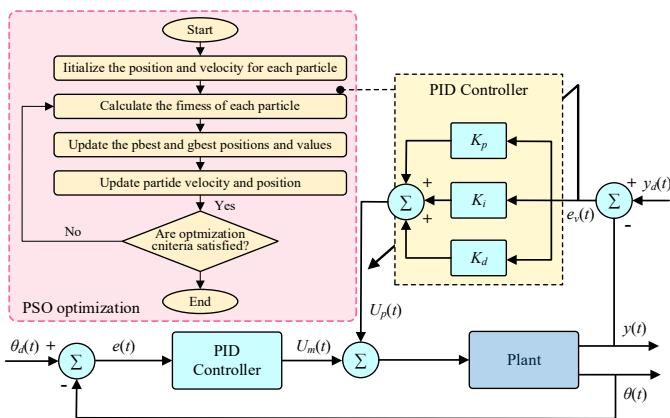  
(a) Block diagram of PSO-PID control structure

It encodes PID parameters (Kp, Ki, Kd) as the positions of individuals in a particle swarm and iteratively searches for the optimal solution through group collaboration. Using system performance indicators (such as ISE and ITAE) as the fitness function, particles dynamically update their positions based on individual and group optimal experiences, ultimately outputting the globally optimal PID parameter combination.

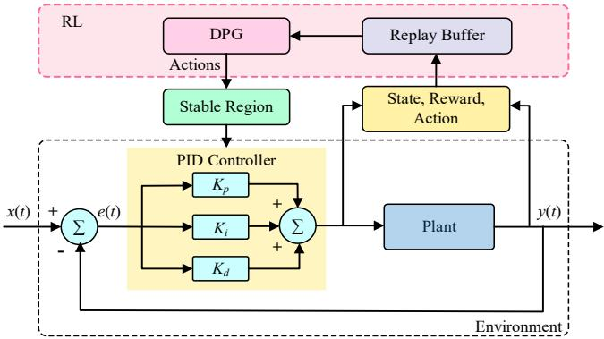  
(b) Block diagram of RL-PID control structure

It parameterizes the PID gain vector as the continuous action of the DPG agent and iteratively updates it in a closed-loop environment in a state-action-reward cycle; the reward is composed of trajectory-based performance metrics, which are used to measure the tuning quality and drive policy improvement. To ensure safety, a supervisor monitors the running reward at each step. Once the degradation exceeds the threshold set by a conservative baseline PID, it reverts to the baseline controller.

## AI-BasedAdaptiveController

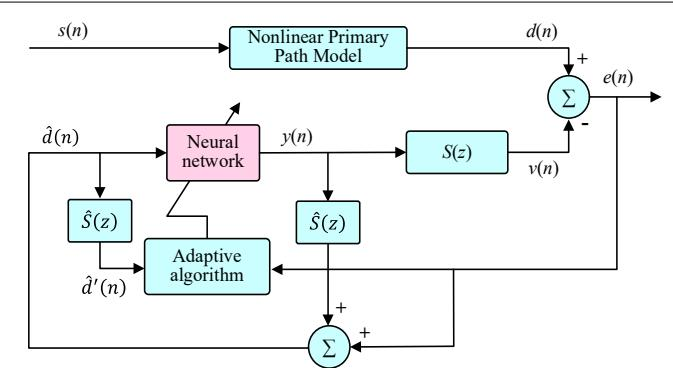  
(c) Block diagram of Adaptive neural network feedback ANC system

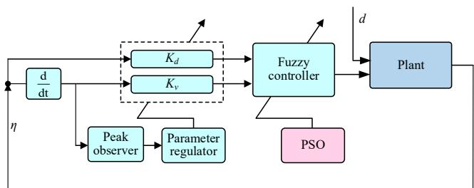  
(d) Block diagram of PSO-FLC control structure

Table 6. Cont.

## AI-Based Linear Feedback Controller

It replaces the linear FIR controller with a neural network, uses LMS to update the neural network weights, and introduces a variable step size strategy to make the learning rate adapt online according to the error energy. During the large error stage, the learning rate is increased to accelerate convergence, and during the small error stage, the step size is reduced to suppress instability.

It encodes the shape parameters of membership functions (such as the vertex position of trigonometric functions and the mean and variance of Gaussian functions) as particle swarm positions. Through iterative optimization using swarm intelligence, the fitness function is defined as the control system performance index, and the antecedent or consequent membership functions of fuzzy rules are dynamically adjusted.

AI-BasedRobustController  
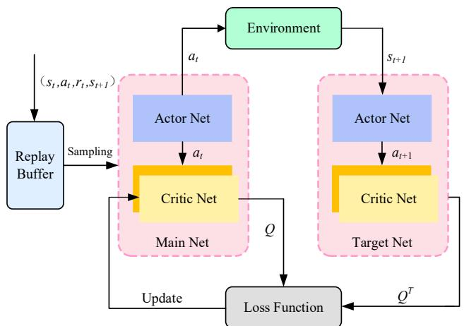  
(e) Block diagram of DCDDPG-GESO Control Method

It models GESO gain tuning as continuous action RL: using position and velocity errors as states, the actor outputs key gains online; rewards are constructed based on observation errors, with dual critics taking min-Q to suppress overestimation, and experience replay and soft updates to stabilize training; after convergence, the agent can adaptively adjust gains according to operating conditions.

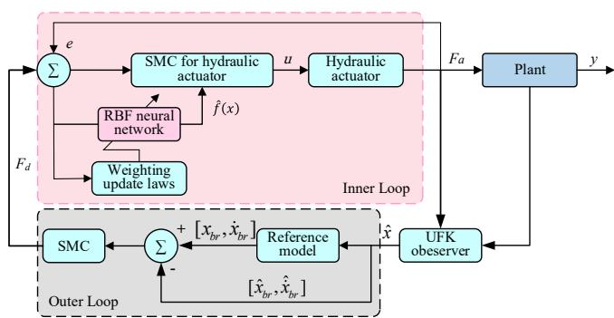

## (f) Block diagram of RBFNN-SMC Control Method

It uses RBFNN to approximate the unknown nonlinearity and time-varying uncertainty of the actuator online, and derives the weight self-tuning law and saturation convergence law based on Lyapunov to suppress vibration. This ensures that the sliding surface converges and the force tracking error is bounded.

## AI-BasedModelPredictiveController

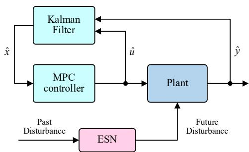  
(g) Block diagram of ESN-MPC Control Method

It uses ESN to predict time-varying disturbances such as engine torque in multiple steps ahead of each sampling cycle, and writes the prediction sequence directly into the output prediction and cost function of MPC to form a constrained QP for online solution of the optimal control sequence.

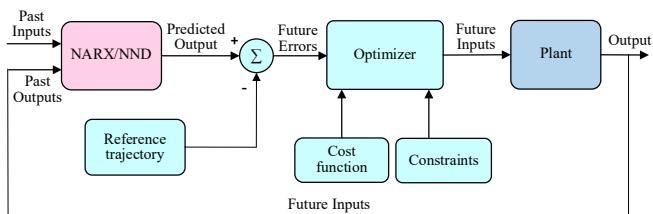

## (h) Block diagram of NMPC-NARX Control Method

NMPC solves for the optimal PZT actuation with constraints in the rolling time domain; NARX learns the nonlinearity of the object using historical or online data and corrects prediction errors online. Working together, the two enable the system to converge faster and provide more robust vibration suppression performance even under model uncertainty and external disturbances.

## 3.3.1. AI-Based Linear Feedback Controller

Linear feedback controllers are the most fundamental and widely used control strate gies. They achieve closed-loop control by feeding back a linear combination of system outputs or state variables to the input. PID [151] controllers eliminate errors through a combination of proportional, integral, and derivative components, while LQR controllers are designed based on the principle of minimizing quadratic performance metrics to achieve optimal state feedback laws. The performance of such controllers is highly dependent on parameter selection: the three gain coefficients $\mathrm { K } _ { \mathrm { p } } , \mathrm { K } _ { \mathrm { i } } ,$ and $\mathrm { K _ { d } }$ of the PID controller determine the system’s response speed and stability, while the weight matrices Q and R of the LQR controller balance state regulation accuracy and control energy consumption. AI algorithms construct a multi-objective optimization framework to convert performance requirements such as transient response metrics, steady-state error, control energy con sumption, and robustness margin into fitness functions. By leveraging global search and adaptive learning mechanisms, they overcome the limitations of traditional Ziegler-Nichols rules [152] and Riccati equations [153] for parameter estimation, enabling online self-tuning and real-time optimization of control parameters. Yatim and Darus [154] proposed a self-tuning PID controller based on PSO for vibration suppression in flexible robotic arm structures. By utilizing PSO’s global search capabilities to optimize PID controller gains, significant suppression of structural vibrations at the robotic arm’s end effector can be achieved. Huang et al. [155] proposed a GA-based parameter optimization method for partially damped composite material ANC, with optimized parameters better meeting the system’s control requirements and tracking accuracy. Compared to manual parameter tun ing methods, GAs can find optimal solutions more quickly. Syafiqah et al. [156] proposed a PID controller optimization method based on the raven search algorithm (PID-CS), which can find optimal solutions in both local and global searches with fewer tuning parameters, outperforming traditional Ziegler-Nichols (ZN) tuning methods. Silva et al. [157] proposed an experimental loop-based tuning (EITL) method. The EITL method achieves rapid and efficient parameter tuning without any numerical models using a PSO-based algorithm, opening new avenues for rapid and efficient AVC tuning. Lakhani et al. [158] proposed an RL-PID auto-tuning framework with stability maintenance. By introducing a conservative baseline PID controller and combining it with an online supervisor to monitor the running reward in real time, it can maintain system stability throughout the entire exploration phase. Moreover, it uses layer normalization to alleviate the gradient problem caused by action saturation, achieving a faster convergence speed.

Overall, meta-heuristic algorithms represented by PSO, GA, and CS [154–157] can systematically coordinate multiple objective requirements such as response speed, steadystate accuracy, and robustness. They have demonstrated significant global optimization capabilities in the parameter tuning of linear controllers like PID and LQR. In the task of suppressing vibrations of flexible plates, the PID controller optimized by PSO can further reduce the vibration amplitude by approximately 40.37% compared to the traditional ZN tuning method. Under similar objects and working conditions, the PID controller based on the CS algorithm can achieve attenuation effects of 44.75 dB for the first-order mode under single sinusoidal excitation and 42.74 dB under measured disturbances, which are significantly better than traditional methods. In the LQR weight optimization, the PSO LQR achieved a reduction of over 50% in displacement and acceleration amplitudes in the experiments of composite beams and cantilever beams, while also balancing control performance and energy consumption. However, the optimization effect of these methods highly depends on the reasonable design of the fitness function, and the iterative search process incurs high computational costs, making it difficult to adapt to sudden dynamic changes in the system. In contrast, the RL-PID automatic tuning framework with stability maintenance [158] has a lower risk of instability during the exploration phase and converges faster. However, it is sensitive to reward shaping and baseline selection, and its reliability and generalization ability for online applications still need further verification.

## 3.3.2. AI-Based Adaptive Controller

Adaptive controllers do not rely on precise mathematical models of the system but instead directly utilize input-output data to adjust control strategies online. Adaptive filters (e.g., LMS and RLS algorithms) track the time-varying characteristics of the system by recursively updating filter coefficients, while fuzzy controllers convert expert experience into control decisions based on fuzzy logic rules and membership functions. The key parameters of such controllers include: the step size µ and forgetting factor λ of adaptive filtering, which balance convergence speed and steady-state accuracy; and the shape, cen ter position, and rule weights of fuzzy control membership functions, which determine the smoothness and response characteristics of the control surface. AI algorithms utilize online learning mechanisms and gradient optimization strategies to automatically extract optimal parameter update patterns from input-output data streams, resolving the trade-off between convergence speed and steady-state error in traditional LMS and RLS algorithms, as well as the reliance on expert experience in rule set design in fuzzy control. This enables autonomous evolution of controller parameters and continuous performance improvement. Nguyen et al. [159] proposed a novel adaptive neural fuzzy network (ANFN) controller for feedforward nonlinear ANC systems, dynamically calculating the learning gain of the LMS algorithm via the adaptive neural fuzzy network to enhance the system’s suppres sion capability against nonlinear noise, demonstrating significant stability. Le et al. [160] proposed a feedback ANC system based on a nonlinear neural network with variable step size parameters (VSSP). This method uses a neural network as the controller to process complex noise signals in the main and secondary paths of the ANC system and updates the controller parameters online. This method can be implemented without any offline learning phase and achieves faster convergence speed and better noise cancellation effects. Zori´c et al. [161] proposed a PSO-based self-tuning fuzzy logic controller (FLC) for active free vibration control of composite beams; this method uses Mamdani and zero-order Takagi-Sugeno-Kang fuzzy inference methods to construct a hybrid inference engine, and applies the PSO algorithm to optimize membership function parameters, improving control accuracy and significantly enhancing system performance and robustness. However, the membership functions and rule bases optimized by PSO carry the risk of overfitting, and changes in input scale can undermine the validity of the rules, making it difficult to handle load spectrum migration. Jafarzadeh et al. [162] proposed an adaptive neural chaotic fuzzy control system based on a Type-2 fuzzy system. This system employs a MLP neural network to real-time estimate completely unknown structural dynamic parameters and introduces a fractional-order PID controller (f-PID) to enhance the system’s seismic robust ness, effectively suppressing the seismic response of multi-layer structures equipped with active tuned mass dampers (ATMDs). Although this architecture has the advantage of high integration, its parameter dimension significantly increases and the coupling relationship becomes complex, greatly reducing the system’s identifiability and the adjustability of parameters, and it faces considerable challenges in actual engineering deployment

AI-based adaptive controllers effectively improve the trade-off between convergence speed and steady-state accuracy of traditional algorithms by dynamically adjusting the step size or optimizing the rule weights. However, the performance gains and costs of different methods vary significantly. For instance, the ANFN-LMS [159] reduces the residual spectral peak by approximately 40–60 dB compared to the traditional LMS, and converges faster. However, its performance improvement comes at the cost of higher parameter dimensions and implementation complexity. To adapt to strong nonlinear environments, the FIR order often needs to be increased to 64. In contrast, the FLC with PSO-optimized membership functions [161] can achieve lower free vibration residuals in objects such as composite beams, but its performance is sensitive to the shape of the membership functions and the input normalization strategy, and there is a risk of overfitting to specific load spectra. In extreme conditions where strong uncertainty and strong nonlinearity coexist, the adaptive neuro-fuzzy chaotic control system based on type-2 fuzzy systems [162] shows outstanding performance in the ATMD multi-earthquake condition assessment, with an average re sponse reduction of 85–90% across all layers, significantly outperforming traditional control methods. However, its multi-module coupling design and online estimation mechanism bring significant computational burdens and repeatability challenges.

## 3.3.3. AI-Based Robust Controller

Robust controllers are specifically designed to handle system model uncertainties and external disturbances, ensuring system stability and acceptable performance levels even under worst-case conditions. H∞ control suppresses disturbance effects by minimizing the infinite norm of the closed-loop transfer function, µ-synthesis considers structured uncertainties in controller design, and SMC uses variable structure control laws to force the system state to move along a predetermined sliding surface. The parameter optimization of such controllers involves several key elements: the selection of the frequency-weighted functions $W _ { 1 } , W _ { 2 }$ and $W _ { 3 }$ in H∞ determines the performance requirements at different frequency bands; the D-scales matrix in $\mu \cdot$ -synthesis influences the trade-off between robustness and performance; and the switching gain k and boundary layer thickness in sliding mode control need to be balanced between chattering suppression and robustness; AI algorithms, through their multi-objective optimization and constraint handling capabili ties, can automatically find the Pareto optimal solution between conservatism and control performance, avoiding the over-conservatism of traditional LMI methods and the local convergence issues of iterative D-K algorithms, thereby achieving adaptive adjustment and online optimization of robust controller parameters. Wang et al. [163] proposed an SMC method based on a generalized extended state observer (GESO) and a dual critic deep deterministic policy gradient (DCDDPG) algorithm. The improved DCDDPG algorithm achieves dynamic self-tuning of GESO parameters, avoiding the complex parameter tuning process of GESO and significantly improving the observation accuracy of nonlinear friction. Mu et al. [164] addressed the challenge of controller parameter tuning for high-dimensional aerodynamic servo-elastic systems such as flexible aircraft, proposing an active flutter suppression control method based on machine learning. This method achieves optimal control parameter synthesis strategies through continuous interaction between the en vironment and the agent, avoiding the cumbersome and subjective manual parameter tuning process in traditional H∞ controller design, and realizing stable control across all operating conditions in the transonic region. However, the transonic region features dense modes and complex dynamic characteristics. Although full-condition stable control in the transonic region has been achieved, a single global strategy is prone to degradation under aerodynamic parameter drift. The long-term effectiveness of this strategy in real flight envi ronments remains to be verified. Sun and Zhao [165] proposed an adaptive neural network sliding mode controller based on an observer to enhance the control performance of active suspension systems. This method adopts a dual-loop control architecture, introduces an adaptive neural network to adjust weight vectors online to ensure the robustness of the control system against uncertainties, and combines advanced observation techniques to effectively improve suspension performance

By comparing the benefits and costs of representative AI-robust control schemes, different schemes exhibit distinct performance characteristics. The sliding mode control scheme combining GESO and DRL significantly improves system performance [163]. Experiments show that this scheme increases the observation accuracy of nonlinear friction by 82.6% and the vibration suppression accuracy by 69.1%. However, this performance improvement comes at a high implementation cost: the dual critic architecture and online exploration mechanism require more training samples and computing resources. Secondly, the active flutter suppression method based on machine learning [164], through continuous interac tion between the environment and the agent, increases the critical flutter speed by approximately 36.6% in numerical simulations compared to the open-loop system, outperforming the traditional H∞ control method. However, the long-term stability of a single strategy in the modal dense scenario at transonic speeds still needs experimental verification.

## 3.3.4. AI-Based Model Predictive Controller

MPC is based on a predictive model of the system, solving a finite-time-domain openloop optimization problem at each sampling instant to obtain the control sequence and implement the first control action. Through a rolling optimization strategy, it achieves feedback control, making it particularly suitable for handling multi-variable, constrained, and nonlinear systems; The control performance of MPC depends on the coordinated configuration of multiple key parameters: the prediction time horizon $\mathrm { N } _ { \mathrm { p } }$ determines the ability to anticipate future dynamics, the control time horizon $\mathrm { N _ { c } }$ affects computational complexity and control degrees of freedom, the output weight matrix Q and control weight matrix R balance tracking accuracy and control smoothness, and the terminal weight P and constraint relaxation variable ε relate to recursive feasibility and stability guarantees. AI algorithms establish a mapping relationship between performance metrics and MPC parameters, utilize machine learning to predict optimal parameter combinations, dynamically adjust the time domain length via RL, and optimize weight matrices using meta-heuristic algorithms. This approach overcomes the inefficiency of traditional empirical rules and grid search, enabling adaptive configuration and online updating of MPC parameters. Zhao and Zhu [166] proposed an MPC controller based on the multi-objective particle swarm optimization (MPSO) algorithm for nonlinear electro-hydraulic suspension systems to effectively suppress deterministic road disturbances. This method optimizes suspension stiffness and damping coefficients by constructing a multi-objective optimization model, achieving effective suppression of vertical vibrations and improved vehicle road adaptability. However, the paper does not conduct sensitivity and robustness tests on the Pareto optimal solution of the framework, which makes the optimal solution highly vulnerable to disturbances in the model and working conditions. Even slight disturbances may cause a sudden drop in performance. Ogawa and Takahashi [167] proposed a hybrid electric vehicle (HEV) powertrain active vibration control method based on an echo state network (ESN). This method regards ESN as a feedforward perturbation predictor and significantly reduces the online computational cost through a linear readout control law, breaking through the limitation that traditional MPC is difficult to optimize in real time. Kalaycioglu and Ding [168] proposed a new method integrating nonlinear model predictive control (NMPC) with NARX deep learning models for vibration control of satellite flexible beam antennas. By regulating piezoelectric (PZT) actuators and sensors, the method achieves high-precision coordinated control of coupled attitude and structural dynamics

A comprehensive comparison reveals that AI-based MPC offers different trade-offs among performance, real-time capability, and robustness. The parameter tuning method using MPSO [166] significantly improves system performance under multi-load conditions, reducing the maximum body acceleration by 39–82% and the dynamic tire load by 23–41%. However, this performance enhancement comes with an increase in the suspension dynamic travel, which can reach 19–39% in some conditions. To meet real-time requirements, the fusion architecture of ESN and MPC [167] creates time margins through forward-looking predictions, stabilizing the optimization calculation time at approximately 1.2 milliseconds, which is significantly better than the 2.2–3.4 milliseconds of traditional methods, effectively avoiding phase drift and amplitude distortion of control signals. Nevertheless, this method’s reliance on the predictability of disturbances and the coverage of training data limits its applicability in unknown conditions. For the control problem of high-dimensional flexible structures, the combination of nonlinear MPC and NARX neural networks [168] demonstrates the advantages of rapid modal damping and smooth actua tor force distribution in simulations. However, its real-time feasibility in actual systems remains to be verified.

## 3.4. AI-Based Controller Modeling

AI-based controller modeling is the latest technical approach in the field of AVNC, which directly implements the controller functions of traditional control systems through AI algorithms [169]. Compared to previous control strategies, this approach has fun damental structural differences. It eliminates reliance on the architecture of traditional control strategies and no longer follows the complex model derivation and parameter tuning processes of classical control theory. Instead, it leverages the powerful self-learning and pattern recognition capabilities of AI algorithms to directly extract patterns from sys tem input or output data and operational status information, generating tailored control commands. As shown in Table 7, this new architecture breaks free from the stringent requirements of traditional control strategies for precise mathematical models, significantly simplifying the control system design process. It opens up a more flexible and efficient active control path for addressing complex, dynamic, and difficult-to-model vibration and noise environments. Zhang and Wang [170] proposed a deep multi-channel ANC method (Deep MCANC) based on DL, which encodes the optimal control parameters of the controller and generates noise cancellation signals by training a convolutional recurrent network (CRN), achieving complex sound field mapping and robustness against untrained noise. However, the paper does not take into account the end-to-end delay. Due to the frame-block processing, the window length, frame shift, and the time consumed by neural network inference are superimposed, which will directly enter the error channel phase. In scenarios with high sampling rates and small phase margins, narrowband instability or high-frequency mismatch may occur. Luo et al. [171] proposed a generative fixed-filter active noise control (GFANC) method, which combines a perfect reconstruction filter bank with a lightweight 1D-CNN [172]. With only a small amount of prior data (a pre-trained broadband control filter), it can automatically generate control filters adapted to various types of noise, effectively addressing the adaptability challenges of traditional methods in dynamic noise environments. Ryu et al. [173] proposed a model-free active noise control (DRL-ANC) method based on DRL, specifically for narrowband noise suppression. By redefining the state space and action space of the RL agent, it effectively solved the credit allocation problem caused by secondary channel delays. Nguyen et al. [174] proposed a hybrid active noise control (HANC) system based on adaptive neural fuzzy networks (ANFN), which combines the advantages of neural networks and fuzzy logic to signifi cantly improve noise suppression performance in complex environments. However, this type of neuro-fuzzy hybrid architecture may pose some risks in applications: when the number of rules and the dimension of membership functions are large and the noise is non-stationary, the probability of parameter non-identifiability and overfitting increases; in addition, its online weight adaptive mechanism is prone to gain mismatch and even induce

Deep MCANC

closed-loop oscillation when facing actuator saturation, secondary path drift, and sensor noise interference. This architecture is sensitive to computational overhead and may face challenges in practical applications.

Table 7. AI-based controller modeling.  
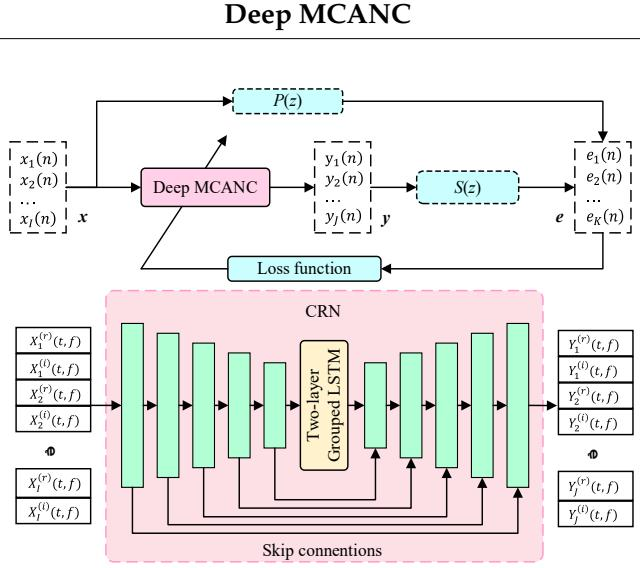  
(a) Block diagram of CRN based deep MCANC system

GFANC  
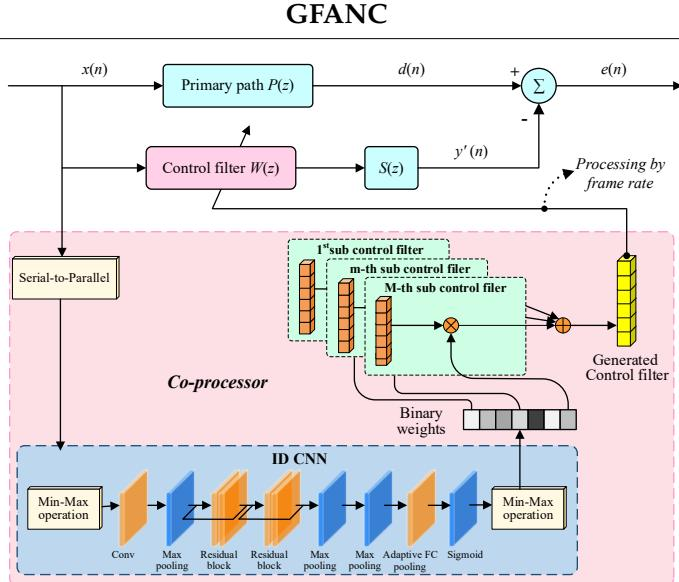  
(b) Block diagram of GFANC Method

It uses a hybrid structure of convolutional and recurrent layers to generate multiple noise control signals end-to-end: the convolutional layer extracts local spectral and phase clues of the reference signal in the short-time frequency domain, while the recurrent layer models long-term dependencies and operational evolution across frames. The two layers work together to perform complex spectrum mapping, directly outputting the real and imaginary control signals for multiple speakers to maintain cross-channel coherence.

It uses a lightweight 1D-CNN to extract features from the original noisy frame, assigns binary weights to the stator filter, and performs an inner product to synthesize the control filter, thereby bypassing online optimization and cumbersome tuning. This framework does not rely on error feedback adaptation and requires only minimal prior knowledge to achieve fast response and high noise reduction for multiple types of non-stationary noise.

DRL-ANC  
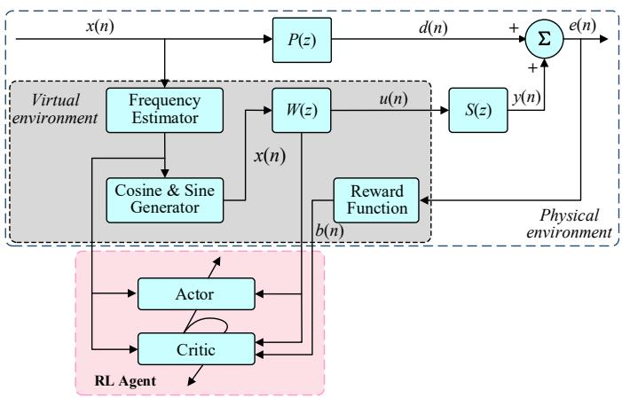  
(c) Block diagram of DRL-ANC Method

ANFN-HANC  
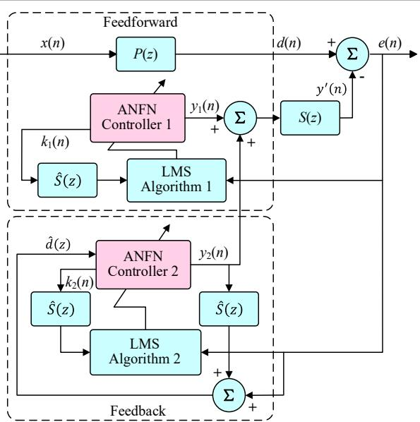  
(d) Block diagram of ANFN-HANC system

Table 7. Cont.

<table><tr><td>Deep MCANC</td><td>GFANC</td></tr><tr><td>DRL-ANC allows the intelligent agent to act directly as a controller: it removes the secondary path mathematical model and uses the actor-critic structure of DDPG to learn control laws from data through interaction with the physical environment. It uses the main noise frequency as the state, outputs two-parameter control filter coefficients as actions from the strategy end-to-end, and multiplies them by the sine and cosine bases to generate anti-noise. It uses error energy as the reward to drive strategy updates, thereby maintaining robust control.</td><td>In hybrid ANC, two adaptive neuro-fuzzy networks directly replace traditional linear controllers. Control laws are learned online from data and error signals rather than relying on precise models. The output layer of ANFN adjusts weights online under FxLMS to minimize residuals, and Lyapunov conditions are used to provide a learning gain range to ensure closed-loop stability.</td></tr></table>

Specifically, the Deep MCANC method [170] shows significant advantages in multi speaker configurations. When the number of speakers increases from 1 to 3, the average noise suppression effect in the quiet zone improves from −9.45 dB to −14.38 dB. Moreover, this method demonstrates good robustness against device nonlinearity, with its performance remaining almost unchanged under speaker saturation nonlinearity conditions. However, its performance shows a saturation phenomenon as the number of virtual error microphones increases, thus requiring a balance between training complexity and microphone placement strategy in engineering applications. The GFANC method [171], which requires low prior knowledge, adopts a lightweight 1D-CNN architecture and achieves an accuracy of 97.2% in weight prediction, improving the noise reduction effect by approximately 7 dB and 12 dB compared to SFANC and FxLMS, respectively. Its advantage lies in not relying on error feedback, reducing the risk of divergence and computational burden. However, its block-level update mechanism causes an initial delay that limits the suppression effect on transient noise. Compared with end-to-end CRN-based methods, DRL-ANC [173] has stronger robustness across different operating conditions and better adaptability to operational constraints, but it does not have an advantage in the ultimate noise reduction capability under steady-state conditions. DRL-ANC does not rely on prior filter design and has stronger online adaptive capabilities, but this also brings problems such as low sample efficiency and sensitivity to hyperparameters, and requires additional safety mechanisms to constrain the online exploration process. Its inference and storage costs are significantly higher than those of lightweight DNN solutions. Additionally, the ANFN-HANC method [174], which integrates fuzzy logic and neural networks, outperforms traditional methods in various non-stationary noise environments. Under the same conditions, its steady-state active noise reduction level can reach approximately −16 dB, significantly better than FxLMS (about −14 dB) and pure ANN methods (about −5 dB). Within the 0–0.2 kHz frequency band, its main spectral peak is further reduced by approximately 10–15 dB, demonstrating its ability to simultaneously suppress narrowband and broadband noise components.

## 3.5. Evaluation Metrics

In the field of AI-AVNC, evaluation metrics are fundamental tools for comprehensively measuring the performance of models and control strategies, covering multiple aspects such as modeling and prediction, closed-loop control, and engineering deployment. Common accuracy metrics, such as root mean square error (RMSE), mean square error (MSE), relative absolute error (RAE), and coefficient of determination (R2), can effectively quantify the fitting ability of system identification and data-driven models on specific datasets and provide objective bases for model parameter selection and structure optimization. At the same time, metrics focusing on control performance and real-time aspects are also crucial, such as noise reduction and vibration suppression performance, convergence, system delay, and stability. Additionally, to fully assess the engineering feasibility of methods, computational complexity should also be taken into account. Table 8 summarizes the specific evaluation metrics mentioned above and their mathematical definitions.

Table 8. Summary of evaluation metrics.

<table><tr><td>Evaluation Metrics</td><td>Equation &amp; Description</td></tr><tr><td> $\delta_i$ </td><td> $\delta_i = \frac{|t_i - \hat{t}_i|}{t_i}$ The absolute error ratio [104].</td></tr><tr><td>PA</td><td> $PA = 100\% - \frac{1}{n}\sum_{i=1}^{n}\frac{|t_i - \hat{t}_i|}{t_i} \times 100\%$ The prediction accuracy [104].</td></tr><tr><td> $R^2$ </td><td> $R^2 = 1 - \frac{\sum_{i=1}^{n}(t_i - \hat{t}_i)^2}{\sum_{i=1}^{n}(t_i - T)^2}$ The coefficient of determination [175].</td></tr><tr><td>RMSE</td><td> $RMSE = \sqrt{\frac{1}{n}\sum_{i=1}^{n}(t_i - \hat{t}_i)^2}$ The root mean square error [176].</td></tr><tr><td>MSE</td><td> $MSE = \frac{1}{n}\sum_{i=1}^{n}(t_i - \hat{t}_i)^2$ The maximum transient swing [112].</td></tr><tr><td>RAE</td><td> $RAE = \frac{\sum_{i=1}^{n}|t_i - \hat{t}_i|}{\sum_{i=1}^{n}|t_i - T|}$ The relative absolute errors [164].</td></tr><tr><td>Transient response time</td><td>The time required for the system to reach steady state from disturbance [177].</td></tr><tr><td>Settling time</td><td>The time required for the system to reach and maintain within a given error band in its state after disturbance [178].</td></tr><tr><td>ERLE</td><td> $ERLE(k) = 10\log_{10}\left(\frac{\mathbb{E}\{d^2(k)\}}{\mathbb{E}\{e^2(k)\}}\right)$ The echo return loss enhancement [179]</td></tr><tr><td> $T_{e2e}$ </td><td> $T_{e2e} = T_{sense} + T_{frame} + T_{proc} + T_{I/O} + T_{act} + T_{path}$ The end-to-end latency (Zhang and Pandey 2023)</td></tr><tr><td>MTS</td><td> $MTS = max\{|A(t_i)|\}$ The maximum transient swing [112].</td></tr><tr><td>Robustness</td><td>Robustness is used to evaluate the ability of controllers to resist external interference such as uncertainty, disturbance, and noise [177].</td></tr><tr><td>FLOPs</td><td>The total number of floating-point operations (addition, subtraction, multiplication, and division) required to execute the algorithm [180].</td></tr><tr><td>Params</td><td>The total number of parameters (e.g., weights and biases) that need to be trained in the model [180].</td></tr></table>

## 3.6. Section Summary

This section systematically reviews the four core technical approaches of AI-AVNC from a control strategy perspective, revealing the diverse application modes and technical characteristics of AI algorithms in vibration and noise suppression. These technical pathways evolve from parameter optimization to model construction and then to autonomous controller generation, illustrating the progressive evolution of AI in AVNC from auxiliary optimization to core decision-making. They address the bottlenecks of traditional control technologies in complex scenarios from different levels, driving the deepening application and performance breakthroughs of AI-AVNC technology in engineering practice.

## 4. Typical Engineering Application Scenarios

AI-AVNC is an efficient and practical method with a wide range of applications in various engineering fields, particularly in NEVs, aerospace and high-precision equipment manufacturing, where it demonstrates technical advantages that traditional control methods cannot match [181–188]. Detailed characteristics and corresponding specific methods are shown in Table 9.

## 4.1. New Energy Vehicle Sector

With the rapid development of the new energy vehicle (NEV) industry, vehicle NVH (Noise, Vibration, and Harshness) performance has become a key factor influencing user experience and product competitiveness [189]. Compared to traditional internal combustion engine vehicles, NEVs have eliminated engine noise, but issues such as high-frequency whining from the electric drive system, increased road noise, and vibration transmission due to lightweight design have become increasingly prominent. In recent years, the rapid advancement of AI technology has provided new solutions for active vibration and noise control. The application of AI-AVNC in the NEV sector primarily focuses on three areas: active control of road noise inside the vehicle, suppression of vibration and noise from the electric drive system, and active vibration reduction in the suspension and seats [190].

(1) Active control of road noise inside the vehicle: Road noise inside the vehicle is one of the primary sources of NVH issues in NEVs [191,192], primarily caused by tire-road interactions transmitted through the suspension and vehicle structure into the interior cavities [193]. It has a wide frequency band and exhibits strong time-varying and coupled characteristics [194]. AI technology can significantly enhance road noise suppression through adaptive algorithms and intelligent modeling. Oh et al. [130] utilized DNN to real-time update secondary path estimates, enhancing active control of road noise. Liang et al. [195] developed a novel network named STFNet to predict raw noise near the passenger’s ear and integrated filters into the headrest speakers, effectively controlling non-stationary noise inside the vehicle. Jia et al. [196] employed a hybrid model combining a CNN and support vector regression (SVR) to improve the prediction accuracy and control capability of mid-to-low-frequency road noise.

(2) Vibration and noise suppression in electric drive systems: The electric drive system is a core component of NEVs, and the electromagnetic vibrations and noise (EVN) it generates during operation are primarily influenced by radial electromagnetic force waves (REFW) and their harmonic amplitudes [197], making it a significant component of NVH issues in new energy vehicles. AI technology can achieve efficient suppression of electric drive system vibration and noise through high-precision modeling and dynamic control strategy optimization. Rao et al. [198] applied an ANN to construct a physics-based highfidelity stator model, improving the NVH performance of the electric drive system. Li et al. [199] applied a backpropagation neural network to sensorless control of an internal permanent magnet synchronous motor (IPMSM), effectively reducing current harmonics caused by injected signals and thereby lowering torque ripple. Ahmed et al. [200] applied the Multi-Agent Critic-Deterministic Policy Gradient (MAC-DDPG) algorithm to flexible rotor active control. This method can find the optimal control strategy without knowing the system dynamics to reduce synchronous vibrations caused by rotor imbalance.

(3) Active vibration control of suspension seats: The suspension and seat systems directly impact occupant comfort [201–203]. AI-AVNC technology can adjust suspension and seat parameters in real-time based on vehicle driving conditions and passenger needs, providing a comfortable riding experience. Han et al. [88] applied the PPO algorithm to a vehicle semi-active suspension control system, combining road dynamic changes with a reward function to effectively enhance semi-active suspension performance. Wang et al. [204] applied DRL technology to active suspension control, significantly improving ride comfort and demonstrating excellent generalization performance on different road surfaces. Nhu et al. [205] employed the deep deterministic policy gradient (DDPG) algorithm to obtain optimal dynamic control for the active suspension system, which outperforms passive suspension systems in terms of vehicle ride comfort and stability.

## 4.2. Aerospace Sector

Aerospace equipment exhibits strong coupling, strong time variability, wide bandwidth, and multi-source superposition characteristics in terms of vibration and noise. Aerospace equipment primarily focuses on aerodynamic noise in atmospheric environments and cabin comfort control, while space equipment prioritizes structural vibration in vacuum environments and micro-vibration suppression of precision instruments. AI-AVNC technology employs strategies such as adaptive learning, nonlinear modeling, and multi-objective cooperative optimization to significantly enhance the vibration and noise suppression performance, system reliability, and control accuracy of aerospace equipment in complex environments.

(1) Aviation field: AI-AVNC technology is primarily applied to vibration suppression and cabin noise control in fixed-wing aircraft and rotorcraft. With the enhancement of onboard computing capabilities and advancements in sensor technology, AI-based control systems have demonstrated superior real-time performance and adaptability. Yu et al. [206] applied RL technology to the vibration control system of helicopter trailing edge flaps (TEF), achieving delay compensation and disturbance suppression with excellent practi cality and robustness. Yuan et al. [207] applied neural networks and GAs to optimize the selection of sensors and actuators, forming an efficient and coordinated sensor and actuator placement scheme. Mylonas et al. [208] proposed a novel ANC algorithm to mitigate sound pressure around the headrest of a tiltrotor aircraft seat. By applying a functional chain neural network, the algorithm improved sound pressure attenuation performance while maintaining low computational complexity.

(2) Aerospace field: AI-AVNC technology is mainly applied in key tasks such as vibration suppression of large flexible spacecraft and micro-vibration control of space optical instruments. Due to the unique nature of the space environment and the high precision requirements of the mission, AI-based control technologies play an irreplaceable role in enhancing system reliability and adaptability. Wang et al. [209] developed an adaptive neural network controller with an improved performance function (AN-IPPC) using an Actor-Critic neural network, addressing system uncertainties and disturbances in microgravity vibration isolation for space stations. Fu [210] applied neural networks to the control of spacecraft with a rigid central hub and two flexible attachments, proposing a composite control strategy based on hybrid lumped-parameter and distributed-parameter modeling to suppress vibrations in the hub and flexible attachments. Kalaycioglu and Ding [168] applied DL and NMPC to the vibration control of flexible beam-type satellite antennas, addressing the precise vibration suppression of highly flexible antennas under low signal-to-noise ratio conditions.

Table 9. Summary of AI-AVNC in Engineering.

<table><tr><td>Application</td><td>Characteristics &amp; Specific AI-AVNC</td></tr><tr><td rowspan="3">(a) NEVs</td><td>Interior road noise: Tires-Road excitation transmitted into the vehicle interior through the suspension or body; wide frequency band, strong time variation.Methods: DNN for real-time secondary-path update [130]; STFNet-headrest ANC to predict ear-side reference and cancel in-cabin noise [195]; CNN-SVR hybrid prediction improving mid-/low-frequency control [196].</td></tr><tr><td>Vibration and noise in electric drive systems: Radial electromagnetic force waves (REFW) and sideband harmonics induce narrowband “whine” and couple with structure/gear meshing.Methods: ANN-based high-fidelity stator model for NVH improvement [198]; BPNN sensorless IPMSM control reducing current harmonics or torque ripple [199]; MAC-DDPG suppressing synchronous vibration of a flexible rotor without prior dynamics [200].</td></tr><tr><td>Suspension and seat vibration: Road conditions and load variability, multiple constraints.Methods: PPO for semi-active suspension [88]; DRL for active suspension improving ride comfort and generalization [204]; DDPG for optimal active suspension control [205].</td></tr><tr><td rowspan="2">(b) Aerospace</td><td>Aviation: Pneumatic noise and structural vibration coupling, strong time variation; Equal emphasis on cabin local sound pressure and overall aircraft vibration.Methods: RL for helicopter trailing-edge flap control with delay compensation and disturbance rejection [206]; NN-GA for sensor/actuator co-placement [207]; FLNN-based ANC reducing seat-headrest sound pressure in a tilt-rotor aircraft with low compute cost [208].</td></tr><tr><td>Space: Lightweight flexible structures with large uncertainty; Vacuum and thermoelastic conditions induce parameter drift.Methods: Actor-Critic NN with improved prescribed-performance function for microgravity isolation under uncertainties [209]; Hybrid lumped and distributed parameter modeling and NN control [211]; DL-NMPC for precise vibration suppression of a flexible satellite antenna at low SNR [168].</td></tr><tr><td>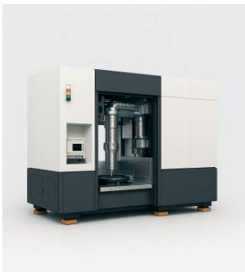(c) High-precision</td><td>High-precision manufacturing: Nano-scale accuracy and millisecond-level responsiveness; Hysteresis/friction/structural resonances and machining chatterMethods: SAC (soft actor-critic) driving bonded piezo actuators to suppress chatter in peripheral milling of large flexible plates [212]; NN-SORC (NN-based switched output regulation controller) compensating hysteresis and reducing residual vibration on high-speed nanopositioning stages [213].</td></tr></table>

(c) High-precision manufacturing

## 4.3. High-Precision Equipment Manufacturing Sector

High-precision equipment manufacturing encompasses fields such as semiconductor lithography equipment, ultra-precision CNC machine tools, and aircraft engine manufacturing [211]. These devices require nanometer-level control precision, millisecond-level real-time response capabilities, and strong robustness. Compared to traditional control methods, AI-AVNC technology, with its powerful nonlinear mapping capabilities and adaptive capabilities, can achieve precise suppression of multi-source disturbances, signifi cantly improving the processing precision and response speed of high-precision equipment manufacturing devices. Nasiri and Moradi [212] proposed a RL-based soft participant-critic (SAC) method to drive piezoelectric actuators attached to flexible thin plate workpieces, addressing the issue of vibration suppression during peripheral milling of large-sized flexible low-frequency workpieces. Sun et al. [213] developed a neural network-based switch output regulation controller (NN-SORC) to compensate for the hysteresis nonlinearity issues in high-speed nano-positioning platforms, achieving residual vibration control under high-speed scanning conditions.

## 5. Technical Challenges and Future Development Trends

## 5.1. Technical Challenges

Despite the continuous progress of AI-AVNC technology, there are still some intractable problems and difficulties. For instance, the ANC controller based on DL often causes closed-loop instability due to excessive computational delay when dealing with non-stationary noise [214]; in real control tasks such as vehicle suspension, the RL controller has a significant data efficiency bottleneck, and many continuous control problems often require more than a million interaction samples to converge [215,216]; and when there is sensor noise or out-of-distribution disturbance, the neural network controller without robustness and safety constraint design is prone to be misled to generate unpredictable large control instructions, causing actuator saturation or system oscillation [217,218]. These cases highlight that AI-AVNC technology still faces severe challenges in moving towards practical engineering applications, which can be summarized as follows:

(1) The trade-off between real-time performance and computational complexity: The feedforward and feedback loops of AVNC systems are extremely sensitive to end-to-end latency. Secondary channels and electronic or computational delays directly reduce available bandwidth and stability margins. Moreover, DL models [219], especially in multi-channel broadband applications, generate inference computational load and memory overhead that fundamentally conflict with target sampling rates, control bandwidth, and real-time control cycles. Under this background, four types of technical paths present different trade-off characteristics and applicable boundaries under the constraint of real-time performance and computational complexity: AI-based input shaping has the lightest online computational burden and is easy to meet hard real-time requirements. However, its effectiveness highly depends on the accuracy of modal frequency and damping. When the model has deviations or the environment causes parameter drift, the shaping pulse is prone to mismatch or even induce reverse excitation. Robust shapers need to extend the pulse sequence to improve tolerance to modal deviations, which inevitably introduces additional instruction delay [220,221]. AI-based system identification and modeling face heavy computational pressure under kHz-level sampling and multi-channel conditions. Although AI algorithms can effectively improve the accuracy of nonlinear modeling, the computational cost required for training and online updates is huge [222]. In practice, frequency band masks, dimensionality reduction techniques, and causal prior constraints are often used to compress the identification process within a limited control cycle, but this often comes at the expense of model accuracy and generalization ability. AI-based

Controller Parameters Optimization heavily relies on large-scale samples for offline training and multi-objective optimization, making it difficult to directly iterate online. The key bot tleneck lies in the fact that such methods need to complete multiple rounds of constrained optimization solutions within an extremely short control cycle, which not only involves a large amount of computation but also makes the worst-case runtime unpredictable and uncontrollable, severely restricting real-time performance. For example, although the ESN-MPC [164] and NARX-NMPC [165] proposed in Chapter 3 partially alleviate the real-time optimization difficulty of traditional MPC through disturbance prediction mechanisms, their actual deployment is still strictly constrained by the scale of the QP problem and the sampling period budget. Finally, AI-based controller modeling usually requires strictly limiting the strategy reasoning delay within 10–20% of the sampling interval. Although computational delay can be reduced through techniques such as network distillation and quantization compression, there is still a significant conflict between model complexity and real-time performance in multi-channel broadband control scenarios [223], especially when computational resources fluctuate or the system encounters out-of-distribution in puts, which can easily lead to performance degradation or instability due to reasoning timeouts. In recent years, low-latency deep AVNC research has significantly reduced algo rithm latency by introducing time-domain attention mechanisms, overlap-and-add (OLA) frame processing strategies [214] and strict causal network structure designs. However, achieving stable real-time performance under high-bandwidth, multi-channel conditions still relies on substantial computational power and meticulous engineering optimization. Additionally, model compression for edge computing, specialized compiler optimizations, and hardware-software co-design [224], as well as embedding lightweight AI at the sensor end, can further reduce inference latency and energy consumption. However, there remains a significant technical gap in reliably applying these technologies to high-bandwidth active control systems.

(2) Lack of Interpretability and Trustworthiness of Models: Based on the transparency of the internal mechanism, the control models applied to the four technical paths can be classified into black-box models and grey-box models. Although black-box models (e.g., DNN and RL) are good at representing complex nonlinearities and couplings, they are difficult to provide auditable evidence regarding closed-loop stability, controllability, observability, and constraint satisfaction [225]. The cognitive uncertainties and accidental uncertainties generated during the system identification and controller learning processes are often passed on to the control decision-making stage without adequate calibration and quantification, resulting in a lack of clear confidence boundaries and quantified margins for controller parameters (such as step size, filter weights, gain coefficients, etc.) and safety constraints, thereby affecting the reliability and credibility of the system [226]. In contrast, grey-box models (e.g., PINN) are more conducive to stability analysis and verification due to the integration of physical mechanisms, but they are highly sensitive to the accuracy of the prior model and the continuous identifiable excitation (PE) [227]. When there is a mismatch in the prior or insufficient excitation, problems such as limited extrapolation robustness and generalization ability may arise. In recent years, explainable artificial intelligence (XAI) has become a key requirement for establishing trustworthy AI control strategies [228], especially in safety-critical engineering applications, where learned control strategies need to have explainable mechanisms, verifiable stability and safety, and uncertainty quantification. Existing XAI techniques are categorized into four main dimensions [229]: data interpretability, model interpretability, post hoc interpretability, and explanation evaluation, but there are still challenges in effectively applying these generalized methods to the engineering domain: firstly, stability validation is difficult to achieve, and learning certificate methods such as neural Lyapunov functions [230,231], although they can provide proof of safety, need to impose stringent constraints on the structure of the network, which limiting the model expressiveness. Formal verification relies on expensive solvers such as SOS, MIP, or SMT that are not feasible in real-time control, and even advanced Neural Lyapunov learning certificates are still difficult to learn and verify for complex systems with large state spaces [232]. Secondly uncertainty quantification is difficult to implement, and while Bayesian deep learning methods [233] can estimate cognitive uncertainty, the introduction of probabilistic inference in the control loop significantly increases the computational burden. More critically, control systems need to quantify the uncertainty boundaries of cumulative error, transient response, and long-term stability, rather than focusing only on prediction uncertainty. Finally, there is a lack of domain-specific evaluation criteria. Most XAI studies rely on anecdotal evidence rather than stable quantitative metrics.

(3) Insufficient cross-domain generalization capability: In AI-based input shaping, the design of the shaper heavily relies on the modal parameters of the controlled object. Such methods are typically optimized and validated under specific loads and fixed dynamic configurations. Once applied to scenarios with varying loads, sudden changes in joint flexibility, or unmodeled dynamics, the pre-tuned pulse sequences will fail due to system modal shifts, leading to intensified residual vibrations and a lack of online adaptability to dynamic drifts [88,234]. For AI-based system identification, its generalization performance is directly limited by the range and excitation conditions covered by the training data. If the training data does not sufficiently include diverse frequency components, amplitude variations, and non-stationary excitations, the learned model will experience a sharp drop in prediction accuracy under out-of-distribution conditions (e.g., large-amplitude random excitations or harmonic component changes caused by variable speeds). More critically, in accurate estimations of secondary paths or state-space models will rapidly spread through closed-loop control, potentially causing algorithm divergence [235,236]. In AI-based con troller parameter optimization, whether it is offline optimization or RL strategies, their “optimality” is highly dependent on the objective function and environment interaction model used during training. Once the dynamic characteristics or noise statistical properties of the actual system deviate from the distribution (e.g., actuator saturation, sensor char acteristic changes, or variations in the statistical properties of external disturbances), the original parameter set will no longer maintain optimal performance [237,238]. For AI-based controller modeling (especially end-to-end DRL controllers), their strategies are heavily dependent on the state-action distribution during training. When the actual environment presents observation noises, delay characteristics, or dynamic obstacles not seen during training, the policy network may output abnormal control instructions, and due to the lack of explicit physical constraints and safety barriers, it can easily lead to a sharp decline in control performance or even instability [239]. Overall, the generalization challenges of AI-AVNC systems primarily stem from two aspects: first, the distribution drift of sound sources, propagation paths, and acoustic environments; second, cross-domain variations in operating conditions, signal amplitudes, and system nonlinearity strengths. When the nonlinear characteristics of primary and secondary paths are enhanced, or when there are significant differences in amplitude range and power spectral density distribution between training and testing phases, the theoretical upper bounds of optimal performance for both neural network controllers and linear controllers are significantly reduced. Although multi condition training strategies can effectively enhance system robustness, they inevitably face the trade-off between coverage and single-point performance. In practical applications, fixed filter schemes based on selection or generation [171] can maintain good real-time performance and control performance under intra-class variation conditions. However, when faced with extremely uneven input power spectral density distributions or noise generation mechanisms outside the training set, their performance still degrades significantly. Time-invariant learning approaches (e.g., IRM [240]) and time-series OOD invariant prediction frameworks (e.g., FOIL [241])) can mitigate the impact of spectral drift caused by factors such as speed, load, and temperature changes on the control front end by extracting time-stable causal representations. However, subsequent research [242] has shown that invariant learning domain generalization methods are highly sensitive to environmental partitioning and thus lack robustness in engineering practice.

## 5.2. Future Development Trends

In response to the aforementioned technical challenges, the future development of AI-AVNC should focus on the following three main areas:

(1) Low-latency, deployable hybrid AI-AVNC system: Current research is shifting from pure end-to-end networks toward a hybrid paradigm that integrates short-frame-length time-domain networks, fixed or semi-fixed filtering, and lightweight online calibration. This approach addresses the issues of excessive algorithm latency and convergence instability in multi-channel and time-varying environments. Recently, the introduction of short-frame-length attention recurrent networks (ARN) [214] and “predict-delay compen sation” training has successfully compressed the algorithmic latency of deep ANC to an engineering-practical range; Generative selective fixed filters (e.g., GFANC [171]) achieve rapid matching to noise distributions through pre-training or generative control filters, effectively addressing issues such as slow convergence and output jitter in traditional online adaptive methods. These technological advancements provide a solid foundation for future hybrid solutions. In the future, further optimization of algorithm-hardware co-design is needed, such as constructing an end-to-end mapping model from system input to output based on logic gate networks, optimizing logic gate circuits via AI algorithms, and deeply integrating computer architecture theory with intelligent control theory to overcome the contradiction between real-time performance and computational complexity in traditional control architectures.

(2) Trustworthy and Verifiable AI-AVNC system: As AI-AVNC technology is increasingly applied in engineering fields, incorporating stability and safety into a verifiable framework has become a core requirement for ensuring reliable system operation. However, traditional DL methods face fundamental challenges in safety-critical applications, including insufficient interpretability, lack of stability guarantees, and weak adversarial robustness, necessitating the establishment of a trustworthy AI control framework. In re cent research, Safe Reinforcement Learning (Safe-RL) [243] integrates hard constraints and risk metrics into policy optimization through mechanisms such as CMDP, Lyapunov [229], and Control Barrier Functions (CBF) [244], achieving an executable safety assurance layer and formal stability proofs. By integrating interpretability methods with causal reasoning mechanisms, it achieves complementary advantages between model-driven and datadriven approaches. While ensuring performance upper bounds, it endows AI systems with verifiable safety boundaries, predictable behavioral patterns, and auditable, trustworthy decision-making bases, thereby providing verifiable and controllable institutional safeguards for large-scale applications in safety-critical domains.

(3) Cross-scenario transferable AI-AVNC system: Faced with the performance cliff issue in cross-device, cross-condition, and cross-task transfer of current AI-AVNC, the de velopment direction of AI-AVNC should shift from single-scenario optimization to global adaptive control. Current research is advancing along multiple paths: time series foundation models and self-supervised pre-training to construct a unified representation space across tasks [245], combined with parameter-efficient adaptation techniques (e.g., LoRA) to significantly reduce the cold-start cost for new devices [246]; Test-Time Adaptation (TTA)

and Test-Time Training (TTT) enable online correction of statistical drift under unlabeled conditions [247], enhancing robustness during deployment; domain-invariant and robust optimization methods (e.g., IRM [239], DRO [248]) mitigate out-of-distribution (OOD) mismatch by explicitly learning constraints. Future efforts should focus on establishing comprehensive benchmark datasets covering multiple devices and operating conditions, developing physics-guided domain adaptation mechanisms, and embedding domain knowledge such as modal parameters and transfer functions into transfer learning frame works to ensure physical consistency of control strategies across different systems [227,249]; simultaneously advancing multi-scale transfer learning [250], establishing hierarchical transfer and online calibration mechanisms to enable algorithms to seamlessly switch between tasks of varying complexity while maintaining stable margins and performance lower bounds.

## 6. Conclusions

As industrial applications evolve toward intelligent and high-precision directions, AI-AVNC technology has garnered increasing attention. Unlike traditional AVNC methods, which rely on precise linear models, AI-AVNC overcomes limitations in handling nonlinear, time-varying systems, and complex coupled vibration noise. This paper provides a comprehensive review of the latest research advancements in AI-AVNC methods, spanning theoretical approaches to engineering applications. We first introduce the physical mechanisms of vibration noise and the structure of active control systems, outlining the technological evolution from traditional AVNC to AI-AVNC. Subsequently, we conduct a detailed discussion of the four core technical pathways of AI-AVNC: AI-based IS parameter optimization, AI-based system identification and modeling, AI-based controller parameters optimization and AI-based controller modeling. We then analyzed the engi neering applications of AI-AVNC in three major fields: NEVs, aerospace and high-precision equipment manufacturing, and verified its technical advantages. Finally, we explored the technical challenges faced in this field, such as the contradiction between real-time performance and computational complexity, insufficient model interpretability, and limited cross-domain generalization capabilities, and proposed future development directions such as low-latency hybrid architectures, trustworthy and verifiable frameworks, and cross scenario transfer learning. We hope this comprehensive review provides researchers and engineers with a systematic reference, driving deeper research and large-scale application of AI-AVNC technology in more industrial fields, thereby accelerating the development of vibration and noise control toward intelligent, adaptive, and efficient directions, and contributing to the realization of low-noise, low-vibration operating environments for industrial equipment.

Author Contributions: Conceptualization, Z.J., H.X. and H.Y.; methodology, Z.J., H.X. and X.B.; formal analysis, Z.J. and X.W.; investigation, L.Z. and H.Y.; resources, Z.J.; writing—original draft preparation, Z.J., J.Z. and X.B.; writing—review and editing, H.Y. and H.X.; supervision, H.X. All authors have read and agreed to the published version of the manuscript.

Funding: This research was funded by the Jiangsu Province Science and Technology Plan Special Project (International Science and Technology Cooperation Program), grant number BZ2024028 and the Project of Natural Science Foundation of Jiangsu Province, grant number BK20240872.

Conflicts of Interest: The authors declare no conflicts of interest.

## References

1. Scheidler, J.J. A review of noise and vibration control technologies for rotorcraft transmissions. In Proceedings of the INTER-NOISE and NOISE-CON Congress and Conference Proceedings, Hamburg, Germany, 21–24 August 2016; Volume 253, pp. 2986–2997.

2. Zhang, Y.; Zhao, Z.; Li, X.; Xue, Z.; Jin, M.; Deng, B. Near-infrared-based measurement method of mass flow rate in grain vibration feeding system. Agriculture 2024, 14, 1476. [CrossRef]

3. Li, Y.; Yang, Y.; Li, M.; Liu, Y.; Huang, Y. Dynamics analysis and wear prediction of rigid-flexible coupling deployable solar array system with clearance joints considering solid lubrication. Mech. Syst. Signal Process. 2022, 162, 108059. [CrossRef]

4. Kusano, T.; Shige, K.; Inoue, T.; Oba, Y.; Takeda, N.; Terashima, O.; Yamada, S. Active Noise Control for Noise Generated by Electric Vehicle HVAC Systems Using Virtual Sensing. Int. J. Automot. Eng. 2025, 16, 27–32. [CrossRef] [PubMed]

5. Tao, Y.; Ge, C.; Feng, H.; Xue, H.; Yao, M.; Tang, H.; Liao, Z.; Chen, P. A novel approach for adaptively separating and extracting compound fault features of the in-wheel motor bearing. ISA Trans. 2025, 159, 337–351. [CrossRef]

6. Zhu, J.; Ouyang, X.; Jiang, Z.; Xu, Y.; Xue, H.; Yue, H.; Feng, H. In-Wheel Motor Fault Diagnosis Method Based on Two-Stream 2DCNNs with DCBA Module. Sensors 2025, 25, 4617. [CrossRef]

7. Feng, H.; Tao, Y.; Feng, J.; Zhang, Y.; Xue, H.; Wang, T.; Xu, X.; Chen, P. Fault-tolerant collaborative control of four-wheel-drive electric vehicle for one or more in-wheel motors’ faults. Sensors 2025, 25, 1540. [CrossRef]

Chamble, P.; Bharath, M.R.; Lokesha, K.; Ezhil Singh, S.C. Machine tool vibration on dimensional accuracy and surface roughness during milling operation of Al6082 with indexable carbide inserts. J. Appl. Res. Technol. 2020, 18, 69–76. [CrossRef]

9. Yuan, W.; Cheung, C.F. Characterization of surface topography variation in the ultra-precision tool servo-based diamond cutting of 3d microstructured surfaces. Micromachines 2021, 12, 1448. [CrossRef] [PubMed]

10. Grigorută, C.; Grigorută, L.-C.; Simon, I.; Chitariu, D.-F.; Edutanu, F.-D.; Horodincă, M. Considerations on the Accuracy and Precision of Machine Tools: A Review; Gheorghe Asachi Technical University of Iasi: Iasi, Romania, 2025.

11. Pan, X.; Zhang, X.; Jiang, Z.; Bin, G. Real-time intelligent diagnosis of co-frequency vibration faults in rotating machinery based on lightweight-convolutional neural networks. Chin. J. Mech. Eng. 2024, 37, 41. [CrossRef]

12. Li, Z.; Zhang, H.; Wang, N.; Zhang, S.; Luo, Z.; Xuan, X.; Liu, M.; Chen, X.; Li, X.; Xue, L.; et al. Effects of air pollution and noise exposure on occupational hearing loss in oil workers: A prospective cohort study. BMC Public Health 2025, 25, 1–21. [CrossRef]

13. Qian, P.; Lu, T.; Shen, C.; Chen, S. Influence of vibration on the grain flow sensor during the harvest and the difference elimination method. Int. J. Agric. Biol. Eng. 2021, 14, 149–162. [CrossRef]

14. Ma, Z.; Zhang, Z.; Zhang, Z.; Song, Z.; Liu, Y.; Li, Y.; Xu, L. Durable testing and analysis of a cleaning sieve based on vibration and strain signals. Agriculture 2023, 13, 2232. [CrossRef]

15. Wang, X.; Hong, T.; Fang, W.; Chen, X. Optimized design for vibration reduction in a residual film recovery machine frame based on modal analysis. Agriculture 2024, 14, 543. [CrossRef]

16. Chun-Sheng, S.; Xue-Chun, X.; Bo-Yuan, C.; Gang, D.U. An Active Vibration Control Method Based on NARX Neural Network. Noise Vib. Control 2024, 44, 1.

17. Lopes, P.A.C.; Piedade, M.S. The behavior of the modified FX-LMS algorithm with secondary path modeling errors. IEEE Signal Process. Lett. 2004, 11, 148–151. [CrossRef]

18. Wang, Y.; Feng, H.; Xu, N.; Zhong, J.; Wang, Z.; Yao, W.; Jiang, Y.; Laima, S. A data-driven model for predictive modeling of vortex-induced vibrations of a long-span bridge. Appl. Sci. 2024, 14, 2233. [CrossRef]

19. Zhou, X.; Sun, J.; Tian, Y.; Lu, B.; Hang, Y.; Chen, Q. Hyperspectral technique combined with deep learning algorithm for detection of compound heavy metals in lettuce. Food Chem. 2020, 321, 126503. [CrossRef] [PubMed]

20. Chen, C.; Zhu, W.; Steibel, J.; Siegford, J.; Han, J.; Norton, T. Classification of drinking and drinker-playing in pigs by a video-based deep learning method. Biosyst. Eng. 2020, 196, 1–14. [CrossRef]

21. Tian, Y.; Sun, J.; Zhou, X.; Yao, K.; Tang, N. Detection of soluble solid content in apples based on hyperspectral technology combined with deep learning algorithm. J. Food Process. Preserv. 2022, 46, e16414. [CrossRef]

22. Tao, K.; Wang, A.; Shen, Y.; Lu, Z.; Peng, F.; Wei, X. Peach flower density detection based on an improved CNN incorporating attention mechanism and multi-scale feature fusion. Horticulturae 2022, 8, 904. [CrossRef]

23. Li, H.; Luo, X.; Haruna, S.A.; Zareef, M.; Chen, Q.; Ding, Z.; Yan, Y. Au-Ag OHCs-based SERS sensor coupled with deep learning CNN algorithm to quantify thiram and pymetrozine in tea. Food Chem. 2023, 428, 136798. [CrossRef]

24. Guo, Z.; Zou, Y.; Sun, C.; Jayan, H.; Jiang, S.; El-Seedi, H.R.; Zou, X. Nondestructive determination of edible quality and watercore degree of apples by portable Vis/NIR transmittance system combined with CARS-CNN. J. Food Meas. Charact. 2024, 18, 4058–4073. [CrossRef]

25. Zhang, T.; Zhou, J.; Liu, W.; Yue, R.; Shi, J.; Zhou, C.; Hu, J. SN-CNN: A Lightweight and Accurate Line Extraction Algorithm for Seedling Navigation in Ridge-Planted Vegetables. Agriculture 2024, 14, 1446. [CrossRef]

26. Wang, Y.; Li, T.; Chen, T.; Zhang, X.; Taha, M.F.; Yang, N.; Mao, H.; Shi, Q. Cucumber downy mildew disease prediction using a CNN-LSTM approach. Agriculture 2024, 14, 1155. [CrossRef]

27. Heller, N.; Anderson, D.; Baker, M.; Juffer, B.; Papanikolopoulos, N. Convolutional neural networks for aircraft noise monitoring. arXiv 2018, arXiv:1806.04779. [CrossRef]

28. Cabrera-Ponce, A.A.; Martinez-Carranza, J.; Rascon, C. Detection of nearby UAVs using CNN and Spectrograms. In Proceedings of the International Micro Air Vehicle Conference and Competition (IMAV) (Madrid), Madrid, Spain, 30 September–4 October 2019; p. 29.

29. Wang, C.; Cui, X.; Zhao, S.; Zhou, X.; Song, Y.; Wang, Y.; Guo, K. Enhancing vehicle ride comfort through deep reinforcement learning with expert-guided soft-hard constraints and system characteristic considerations. Adv. Eng. Inform. 2024, 59, 102328. [CrossRef]

30. Dridi, I.; Hamza, A.; Ben Yahia, N. A new approach to controlling an active suspension system based on reinforcement learning. Adv. Mech. Eng. 2023, 15. [CrossRef]

31. Wang, Y.; Wang, C.; Zhao, S.; Guo, K. Research on deep reinforcement learning control algorithm for active suspension considering uncertain time delay. Sensors 2023, 23, 7827. [CrossRef]

32. Chen, J.; Zhang, Z.; Li, Y.; Guan, Z.; Tang, X. Research on following suction and discharging motion control method of vacuumvibration precision seeding manipulator. Appl. Eng. Agric. 2022, 38, 873–883. [CrossRef]

33. Liao, C.; Chen, J.; Geng, F.; Tang, X. Airflow basin structure numerical optimisation analysis and suction nozzle characteristics experimental study of vacuum-vibration tray precision seeder. J. Agric. Eng. 2022, 53. [CrossRef]

34. Lu, L.; Yin, K.-L.; de Lamare, R.C.; Zheng, Z.; Yu, Y.; Yang, X.; Chen, B. Active noise control techniques for nonlinear systems. arXiv 2021, arXiv:2110.09672. [CrossRef]

35. El Ouni, M.H.; Abdeddaim, M.; Elias, S.; Kahla, N.B. Review of vibration control strategies of high-rise buildings. Sensors 2022, 22, 8581. [CrossRef]

36. Cunha, B.Z.; Droz, C.; Zine, A.-M.; Foulard., S.; Ichchou, M. A review of machine learning methods applied to structural dynamics and vibroacoustic. Mech. Syst. Signal Process. 2023, 200, 110535. [CrossRef]

37. Liu, Y.; Lei, Z. Review of advances in active impulsive noise control with focus on adaptive algorithms. Appl. Sci. 2024, 14, 1218. [CrossRef]

38. Liu, R.; Liu, Q.; Wang, Y.; Yu, W.; Cheng, G. Neural network-based ANC algorithms: A review. J. Vibroengineering 2025. [CrossRef] 39. Ibraheem, A.A.; Ghazaly, N.M.; Abd el-Jaber, G. Review of rotor balancing techniques. Am. J. Ind. Eng. 2019, 6, 19.

40. Åkerblom, M. Gear Noise and Vibration: A Literature Survey; TRITA-MMK 2001:11; KTH Royal Institute of Technology: Stockholm, Sweden, 2001; 25p, Available online: https://www.diva-portal.org/smash/get/diva2:139878/FULLTEXT01.p (accessed on 1 October 2025).

41. Fu, Z.F.; He, J. Modal Analysis; Elsevier: Amsterdam, The Netherlands, 2001.

42. Lin, H.; Xu, P.; Sun, L.; Bi, X.; Zhao, J.; Cai, J. Identification of eggshell crack using multiple vibration sensors and correlative information analysis. J. Food Process Eng. 2018, 41, e12894. [CrossRef]

43. Xi, T.; Li, C.; Qiu, W.; Wang, H.; Lv, X.; Han, C.; Ahmad, F. Droplet deposition behavior on a pear leaf surface under wind-induced vibration. Appl. Eng. Agric. 2020, 36, 913–926. [CrossRef]

44. Blevins, R.D. Flow-Induced Vibration; Academic Press: New York, NY, USA, 1977.

45. Auld, B.A. Acoustic Fields and Waves in Solids; Ripol Klassik: Moscow, Russia, 1973.

46. Faheem, M.; Liu, J.; Chang, G.; Abbas, I.; Xie, B.; Shan, Z.; Yang, K. Experimental research on grape cluster vibration signals during transportation and placing for harvest and post-harvest handling. Agriculture 2021, 11, 902. [CrossRef]

47. Rao, S.S. Vibration of Continuous Systems; John Wiley & Sons: Hoboken, NJ, USA, 2019.

48. Faheem, M.; Liu, J.; Chang, G.; Ahmad, I.; Peng, Y. Hanging force analysis for realizing low vibration of grape clusters during speedy robotic post-harvest handling. Int. J. Agric. Biol. Eng. 2021, 14, 62–71. [CrossRef]

49. Putra, A.; Thompson, D.J. Radiation efficiency of unbaffled and perforated plates near a rigid reflecting surface. J. Sound Vib. 2011, 330, 5443–5459. [CrossRef]

50. Gao, Y.; Yang, Y.; Fu, S.; Feng, K.; Han, X.; Hu, Y.; Zhu, Q.; Wei, X. Analysis of vibration characteristics of tractor–rotary cultivator combination based on time domain and frequency domain. Agriculture 2024, 14, 1139. [CrossRef]

51. Gao, Y.; Yang, Y.; Hu, Y.; Han, X.; Feng, K.; Li, P.; Wei, X.; Zhai, C. Study on Operating Vibration Characteristics of Different No-Tillage Planter Row Units in Wheat Stubble Fields. Agriculture 2024, 14, 1878. [CrossRef]

52. Gao, Y.; Hu, Y.; Yang, Y.; Feng, K.; Han, X.; Li, P.; Zhu, Y.; Song, Q. Optimization of operating parameters for straw returning machine based on vibration characteristic analysis. Agronomy 2024, 14, 2388. [CrossRef]

53. Xu, B.; Liu, J.; Jin, Y.; Yang, K.; Zhao, S.; Peng, Y. Vibration–Collision Coupling Modeling in Grape Clusters for Non-Damage Harvesting Operations. Agriculture 2025, 15, 154. [CrossRef]

54. Santos Fernandes, L.; Housman, J.A.; Stich, G.-D.; Duensing, J. Fan Noise Predictions of the NASA Source Diagnostic Test Using Unsteady Simulations with LAVA Part II–Tonal and Broadband Noise Assessment. In Proceedings of the 30th AIAA/CEAS Aeroacoustics Conference, Rome, Italy, 4–7 June 2024; p. 3228. [CrossRef]

55. Qian, K.; Hou, Z.; Liang, J.; Liu, R.; Sun, D. Interior sound quality prediction of pure electric vehicles based on transfer path synthesis. Appl. Sci. 2021, 11, 4385. [CrossRef]

56. Ji, K.; Li, Y.; Liu, Y.; Yu, Z.; Cheng, J. Vibration signal extraction and analysis of combine harvester based on low-pass filter-eemd combination. Eng. Agrícola 2024, 44, e20240006. [CrossRef]

57. Bortolotti, P.; Branlard, E.; Platt, A.; Moriarty, P.; Sucameli, C.; Bottasso, C.L. Aeroacoustics Noise Model of OpenFAST; National Renewable Energy Lab. (NREL): Golden, CO, USA, 2020. [CrossRef]

58. Nelson, P.A.; Elliott, S.J. Active Control of Sound; Academic Press: Cambridge, MA, USA, 1991.

59. Shi, D.; Gan, W.-S.; Lam, B.; Wen, S. Feedforward selective fixed-filter active noise control: Algorithm and implementation. IEEE/ACM Trans. Audio Speech Lang. Process. 2020, 28, 1479–1492. [CrossRef]

60. Akhtar, M.T.; Tufail, M.; Abe, M.; Kawamata, M. Acoustic feedback neutralization in active noise control systems. IEICE Electron. Express 2007, 4, 221–226. [CrossRef]

61. Elliott, S.J.; Nelson, P.A. Active noise control. IEEE Signal Process. Mag. 2002, 10, 12–35. [CrossRef]

62. Martins, N.C.; Dahleh, M.A. Feedback control in the presence of noisy channels:“Bode-like” fundamental limitations of perfor mance. IEEE Trans. Autom. Control 2008, 53, 1604–1615. [CrossRef]

63. Streeter, A.D.; Ray, L.R.; Collier, R.D. Hybrid feedforward-feedback active noise control. Proc. Am. Control. Conf. IEEE 2004, 3, 2876–2881. [CrossRef]

64. Ma, Y.; Xiao, Y.; Ma, L.; Khorasani, K. A robust feedforward hybrid active noise control system with online secondary-path modelling. IET Signal Process. 2023, 17, e12183. [CrossRef]

65. Bai, T.; Kijimoto, S.; Ishikawa, S.; Koba, Y. A new feedforward hybrid active noise control system using an adaptive notch filter bank and its application to fan noise. Appl. Acoust. 2025, 231, 110492. [CrossRef]

66. Rayleigh, J.W.S.B. The Theory of Sound; Macmillan: New York, NY, USA, 1896.

67. Leug, P. Process of Silencing Sound Oscillations. U.S. Patent 2,043,416, 9 June 1936.

68. Fogel, L.J. Apparatus for Improving Intelligence under High Ambient Noise Levels. U.S. Patent 2,966,549, 27 December 1960.

69. Casali, J.; Robinson, G.; Urquhart, R. Evaluation of an Improved Active Noise Reduction Microphone Using Speech Intelligibility and Performance-Based Testing; Virginia Polytechnic Institute and State University: Blacksburg, VI, USA, 2010.

70. Conover, W.B. Fighting noise with noise. Noise Control. 1956, 2, 78–92. [CrossRef]

71. Widrow, B.; Glover, J.R.; McCool, J.M.; Kaunitz, J.; Williams, C.S.; Hearn, R.H.; Zeidler, J.R.; Dong, J.E.; Goodlin, R.C. Adaptive noise cancelling: Principles and applications. Proc. IEEE 1975, 63, 1692–1716. [CrossRef]

72. Karnopp, D.; Crosby, M.J.; Harwood, R.A. Vibration control using semi-active force generators. J. Eng. Ind. 1974, 96, 619–626. [CrossRef]

73. Morgan, D.R. An analysis of multiple correlation cancellation loops with a filter in the auxiliary path. IEEE Trans. Accoustics Speech Signal Process. 1987, 36, 145–152. [CrossRef]

74. Singer, N.C.; Seering, W.P. Preshaping command inputs to reduce system vibration. J. Dyn. Syst. Meas. Control. 1990, 112, 76–82. [CrossRef]

75. Hagood, N.W.; Von Flotow, A. Damping of structural vibrations with piezoelectric materials and passive electrical networks. J. Sound Vib. 1991, 146, 243–268. [CrossRef]

76. Preumont, A. Vibration Control of Active Structures: An Introduction; Springer Netherlands: Dordrecht, The Netherlands, 2002.

77. Kajikawa, Y.; Gan, W.S.; Kuo, S.M. Recent advances on active noise control: Open issues and innovative applications. APSIPA Trans. Signal Inf. Process. 2012, 1, e3. [CrossRef]

78. Snyder, S.D.; Tanaka, N. Active control of vibration using a neural network. IEEE Trans. Neural Netw. 1995, 6, 819–828. [CrossRef]

79. Bouchard, M.; Paillard, B.; Le Dinh, C.T. Improved training of neural networks for the nonlinear active control of sound and vibration. IEEE Trans. Neural Netw. 1999, 10, 391–401. [CrossRef] [PubMed]

80. Bosse, A.: Lim, T.W.: Shelley, S. Modal filters and neural networks for adaptive vibration control. I. Vib. Control 2000, 6, 631–648 [CrossRef]

81. Jha, R.; Rower, J. Experimental investigation of active vibration control using neural networks and piezoelectric actuators. Smart Mater. Struct. 2001, 11, 115. [CrossRef]

82. Zhang, Q.Z.; Gan, W.S.; Zhou, Y. Adaptive recurrent fuzzy neural networks for active noise control. J. Sound Vib. 2006, 296, 935–948. [CrossRef]

83. Chen, K.T.; Chou, C.H.; Chang, S.H.; Liu, Y.H. Intelligent active vibration control in an isolation platform. Appl. Acoust. 2008, 69, 1063–1084. [CrossRef]

84. Xie, J.; Li, T.; Yang, Y.; Jin, W. Learning features from high speed train vibration signals with deep belief networks. In Proceedings of the 2014 International Joint Conference on Neural Networks (IJCNN), Beijing, China, 6–11 July 2014; IEEE: Piscataway, NJ, USA, 2014; pp. 2205–2210. [CrossRef]

85. Huang, H.B.; Huang, X.R.; Li, R.X.; Lim, T.C.; Ding, W.P. Sound quality prediction of vehicle interior noise using deep belief networks. Appl. Acoust. 2016, 113, 149–161. [CrossRef]

86. Liu, J.; Yang, X. Learning to see the vibration: A neural network for vibration frequency prediction. Sensors 2018, 18, 2530. [CrossRef]

87. Febvre, M.; Rodriguez, J.; Chesne, S.; Collet, M. Artificial intelligence for active vibration control optimization on smart structures. Smart Materials, Adaptive Structures and Intelligent Systems. Am. Soc. Mech. Eng. 2023, 857523, V001T04A001. [CrossRef]

88. Han, S.Y.; Liang, T. Reinforcement-learning-based vibration control for a vehicle semi-active suspension system via the PPO approach. Appl. Sci. 2022, 12, 3078. [CrossRef]

89. Chen, H.; Yu, Y.; Li, P. Transformer-based denoising of mechanical vibration signals. arXiv 2023, arXiv:2308.02166. [CrossRef]

90. Zhang, Y.A.; Ma, F.; Abhayapala, T.D.; Samarasinghe, P.N.; Bastine, A. An active noise control system based on soundfield interpolation using a physics-informed neural network. In Proceedings of the ICASSP 2024—2024 IEEE International Conference on Acoustics, Speech and Signal Processing (ICASSP), Seoul, Republic of Korea, 14–19 April 2024; IEEE: Piscataway, NJ, USA 2024; pp. 506–510. [CrossRef]

91. Tollardo, A.; Cadini, F.; Giglio, M.; Lomazzi, L. DeepF-fNet: A physics-informed neural network for vibration isolation optimization. arXiv 2024, arXiv:2412.21132. [CrossRef]

92. Bai, L.; Li, M.; Lian, S.; Chen, K.; Lu, J. WaveNet-Volterra Neural Networks for Active Noise Control: A Fully Causal Approach. arXiv 2025, arXiv:2504.04450. [CrossRef]

93. Engelberg, S. Input shaping: A tutorial introduction [lecture notes]. IEEE Control Syst. Mag. 2021, 41, 45–51. [CrossRef]

94. Liu, D.X.; Zhang, J.C.; Li, Y.; Fang, J.J. Research on adaptive input shaping control of fruits and vegetable harvesting robot arm. Control Theory Appl. 2022, 39, 1043–1050.

95. Pham, M.-N.; Hazel, B.; Hamelin, P.; Liu, Z. Vibration control of flexible joint robots using a discrete-time two-stage controller based on time-varying input shaping and delay compensation. J. Dyn. Syst. Meas. Control. 2021, 143, 101001. [CrossRef]

96. Njåstad, E.B.; Tysse, G.O.; Egeland, O. Residual vibration control for robotic 3D scanning with application to inspection of marine propellers. Model. Identif. Control. A Nor. Res. Bull. 2021, 42, 83–98. [CrossRef]

97. Singhose, W. Command shaping for flexible systems: A review of the first 50 years. Int. J. Precis. Eng. Manuf. 2009, 10, 153–168. [CrossRef]

98. Singh, T.; Singhose, W. Input shaping/time delay control of maneuvering flexible structures. In Proceedings of the 2002 American Control Conference (IEEE Cat. No. CH37301), Anchorage, AK, USA, 8–10 May 2002; IEEE: Piscataway, NJ, USA, 2002; Volume 3, pp. 1717–1731. [CrossRef]

99. Stein, A.; Singh, T. Input shaped control of a gantry crane with inertial payload. In Proceedings of the 2022 American Contro Conference (ACC), Atlanta, GA, USA, 8–10 June 2022; IEEE: Piscataway, NJ, USA, 2022; pp. 4127–4132. [CrossRef]

100. Wang, T.; Zhang, T.; Song, A.; Zhang, Y. An input shaping based active vibration control and adaptive RBF impedance control fo suppressing the myospasm in upper-limb rehabilitation. Appl. Soft Comput. 2020, 95, 106380. [CrossRef]

101. Vu, M.; Newman, D.; Vaughan, J. Designing input shapers using reinforcement learning. In Proceedings of the 2018 Annual American Control Conference (ACC), Milwaukee, WI, USA, 27–29 June 2018; IEEE: Piscataway, NJ, USA, 2018; pp. 228–233. [CrossRef]

102. El-Sharkawy, M.; Li, J.; Kamal, N.; Mahmoud, E.; Omara, A.E.-D.; Du, D. Assessing and predicting soil quality in heavy metal-contaminated soils: Statistical and ANN-based techniques. J. Soil Sci. Plant Nutr. 2023, 23, 6510–6526. [CrossRef]

103. Zhao, S.; Jiao, T.; Adade, S.Y.-S.S.; Wang, Z.; Wu, X.; Li, H.; Chen, Q. Based on vis-NIR combined with ANN for on-line detection of bacterial concentration during kombucha fermentation. Food Biosci. 2024, 60, 104346. [CrossRef]

104. Ramli, L.; Mohamed, Z.; Jaafar, H.I. A neural network-based input shaping for swing suppression of an overhead crane under payload hoisting and mass variations. Mech. Syst. Signal Process. 2018, 107, 484–501. [CrossRef]

105. Zhang, T.; Kang, Z.; Zou, Y.; Liao, C. Deep neural network input shaper for residual vibration suppression. J. S. China Univ. Technol. (Nat. Sci. Ed.) 2021, 49, 103–112.

106. Ur Rehman, S.F.; Mohamed, Z.; Husain, A.R.; Jaafar, H.I.; Shaheed, M.H.; Abbasi, M.A. Input shaping with an adaptive scheme for swing control of an underactuated tower crane under payload hoisting and mass variations. Mech. Syst. Signal Process. 2022, 175, 109106. [CrossRef]

107. Ramli, L.; Mohamed, Z.; Efe, M.; Lazim, I.M.; Jaafar, H.I. Efficient swing control of an overhead crane with simultaneous payload hoisting and external disturbances. Mech. Syst. Signal Process. 2020, 135, 106326. [CrossRef]

108. Yang, W.; Li, S.; Luo, X. Robust input shaping vibration control via extended Kalman filter-incorporated residual neural network. arXiv 2024, arXiv:2408.12126. [CrossRef]

109. Li, T.; Xiao, T. Physics-Informed Neural Network-Based Input Shaping for Vibration Suppression of Flexible Single-Link Robots. Actuators 2025, 14, 14. [CrossRef]

110. Xu, J.; Cao, J.; Zhang, Y. Vibration suppression of picking device with improved input shaping algorithm. J. Northeast For. Univ. 2020, 48, 79–84.

111. Gulde, R.; Tuscher, M.; Csiszar, A.; Riedel, O.; Verl, A. Reinforcement learning approach to vibration compensation for dynamic feed drive systems. In Proceedings of the 2019 Second International Conference on Artificial Intelligence for Industries (AI4I), Laguna Hills, CA, USA, 25–27 September 2019; IEEE: Piscataway, NJ, USA, 2019; pp. 26–29. [CrossRef]

112. Zhang, T.; Chu, H.; Zou, Y.; Liu, T. A deep reinforcement learning-based optimization method for vibration suppression of articulated robots. Eng. Optim. 2023, 55, 1189–1206. [CrossRef]

113. Mohammed, A.; Altuwais, H.; Alghanim, K. An optimized shaped command of overhead crane nonlinear system for rest-to-rest maneuver. J. Eng. Res. 2023, 11, 548–554. [CrossRef]

114. Alam, M.S.; Tokhi, M.O. Designing feedforward command shapers with multi-objective genetic optimisation for vibration control of a single-link flexible manipulator. Eng. Appl. Artif. Intell. 2008, 21, 229–246. [CrossRef]

115. Maghsoudi, M.J.; Mohamed, Z.; Sudin, S.; Buyamin, S.; Jaafar, H.I.; Ahmad, S.M. An improved input shaping design for an efficient sway control of a nonlinear 3D overhead crane with friction. Mech. Syst. Signal Process. 2017, 92, 364–378. [CrossRef]

116. Tang, W.; Ma, R.; Wang, W.; Gao, H. Optimization-based input-shaping swing control of overhead cranes. Appl. Sci. 2023, 13, 9637. [CrossRef]

117. Mohammed, A.; Alghanim, K.; Andani, M.T. An optimized non-linear input shaper for payload oscillation suppression of crane point-to-point maneuvers. Int. J. Dyn. Control 2019, 7, 567–576. [CrossRef]

118. Xu, B.; Wang, R.; Peng, B.; Alqurashi, F.A.; Salama, M. Automatic parameter selection ZVD shaping algorithm for crane vibration suppression based on particle swarm optimisation. Appl. Math. Nonlinear Sci. 2022, 7, 73–82. [CrossRef]

119. Fu, W.; Tao, Y.; Han, X.; Hu, J.; Zhang, J.; Li, S.; Pei, W. Improved THEI input shaper for the vibration suppression of flexible systems under variable loads. J. Vib. Shock 2024, 43, 113–120.

120. Lu, L.; Yin, K.L.; de Lamare, R.C.; Zheng, Z.; Yu, Y.; Yang, X.; Chen, B. A survey on active noise control in the past decade—Part I: Linear systems. Signal Process. 2021, 183, 108039. [CrossRef]

121. Moon, S.P.; Chang, T.G. The derivation of the stability bound of the feedback ANC system that has an error in the estimated secondary path model. Appl. Sci. 2018, 8, 210. [CrossRef]

122. Akhtar, M.T. Narrowband feedback active noise control systems with secondary path modeling using gain-controlled additive random noise. Digit. Signal Process. 2021, 111, 102976. [CrossRef]

123. Guo, R.; Wei, X.K.; Gao, J. Extended filtered-x-least-mean-squares algorithm for an active control engine mount based on acceleration error signal. Adv. Mech. Eng. 2017, 9, 1687814017724350. [CrossRef]

124. Park, U.; Kang, Y.J. Operational transfer path analysis based on neural network. J. Sound Vib. 2024, 579, 118364. [CrossRef]

125. Liang, R.; Liu, W.; Fu, Y.; Ma, M. Physics-informed deep learning for structural dynamics under moving load. Int. J. Mech. Sci. 2024, 284, 109766. [CrossRef]

126. Mostafavi, A.; Cha, Y.J. Deep learning-based active noise control on construction sites. Autom. Constr. 2023, 151, 104885. [CrossRef]

127. Martinez, Y.; Rojas, L.; Peña, A.; Valenzuela, M.; Garcia, J. Physics-Informed Neural Networks for the Structural Analysis and Monitoring of Railway Bridges: A Systematic Review. Mathematics 2025, 13, 1571. [CrossRef]

128. Im, S.; Kim, S.; Woo, S.; Jang, I.; Han, T.; Hwang, U.; Ohm, W.-S.; Lee, M. Deep learning-assisted active noise control in a time-varying environment. J. Mech. Sci. Technol. 2023, 37, 1189–1196. [CrossRef]

129. Cha, Y.J.; Mostafavi, A.; Benipal, S.S. DNoiseNet: Deep learning-based feedback active noise control in various noisy environments. Eng. Appl. Artif. Intell. 2023, 121, 105971. [CrossRef]

130. Oh, J.Y.; Jung, H.W.; Lee, M.H.; Lee, K.H.; Kang, Y.J. Enhancing active noise control of road noise using deep neural network to update secondary path estimate in real time. Mech. Syst. Signal Process. 2024, 206, 110940. [CrossRef]

131. Cheng, C.; Liu, Z.; Chen, W.; Li, X.; Liao, W.; Lu, C. A multi-channel active noise control system using deep learning-based method to estimate secondary path and normalized-clustered control strategy for vehicle interior engine noise. Appl. Acoust. 2025, 228, 110263. [CrossRef]

132. Song, H.; Shan, X.; Zhang, L.; Wang, G.; Fan, J. Research on identification and active vibration control of cantilever structure based on NARX neural network. Mech. Syst. Signal Process. 2022, 171, 108872. [CrossRef]

133. Liu, T.; Meidani, H. Physics-informed neural networks for system identification of structural systems with a multiphysics damping model. J. Eng. Mech. 2023, 149, 04023079. [CrossRef]

134. Lai, Z.; Mylonas, C.; Nagarajaiah, S.; Chatzi, E. Structural identification with physics-informed neural ordinary differential equations. J. Sound Vib. 2021, 508, 116196. [CrossRef]

135. Teloli, R.d.O.; Tittarelli, R.; Bigot, M.; Coelho, L.; Ramasso, E.; Le Moal, P.; Ouisse, M. A physics-informed neural networks framework for model parameter identification of beam-like structures. Mech. Syst. Signal Process. 2025, 224, 112189. [CrossRef]

136. Li, Q.; Wang, Z.; Li, L.; Hao, H.; Chen, W.; Shao, Y. Machine learning prediction of structural dynamic responses using graph neural networks. Comput. Struct. 2023, 289, 107188. [CrossRef]

137. Pang, J.; Li, Y.; Ji, J.; Xu, L. Vibration excitation identification and control of the cutter of a combine harvester using triaxial accelerometers and partial coherence sorting. Biosyst. Eng. 2019, 185, 25–34. [CrossRef]

138. Chen, S.; Zhou, Y.; Tang, Z.; Lu, S. Modal vibration response of rice combine harvester frame under multi-source excitation. Biosyst. Eng. 2020, 194, 177–195. [CrossRef]

139. Ding, Z.; Tang, Z.; Zhang, B.; Ding, Z. Vibration response of metal plate and shell structure under multi-source excitation with welding and bolt connection. Agriculture 2024, 14, 816. [CrossRef]

140. Kwon, S.; Kim, B.S.; Park, J. Active Noise Reduction with Filtered Least-Mean-Square Algorithm Improved by Long Short-Term Memory Models for Radiation Noise of Diesel Engine. Appl. Sci. 2022, 12, 10248. [CrossRef]

141. Nunekpeku, X.; Zhang, W.; Gao, J.; Adade, S.Y.S.S.; Li, H.; Chen, Q. Gel strength prediction in ultrasonicated chicken mince: Fusing near-infrared and Raman spectroscopy coupled with deep learning LSTM algorithm. Food Control 2025, 168, 110916. [CrossRef]

142. Yang, D.; Zhang, D.; Yuan, Y.; Lei, Z.; Ding, B.; Bo, L. Road terrain recognition based on tire noise for autonomous vehicle. Sci. Rep. 2024, 14, 30913. [CrossRef]

143. Zhang, Z.; Sun, C.; Bridgelall, R.; Sun, M. Road profile reconstruction using connected vehicle responses and wavelet analysis. J. Terramechanics 2018, 80, 21–30. [CrossRef]

144. Redonnet, S.; Bose, T.; Seth, A.; Li, L.K. Airfoil self-noise prediction using deep neural networks. Eng. Anal. Bound. Elem. 2024, 159, 180–191. [CrossRef]

145. Ma, Q.; Wu, Y.; Shoukat, M.U.; Yan, Y.; Wang, J.; Yang, L.; Yan, F.; Yan, L. Deep reinforcement learning-based wind disturbance rejection control strategy for uav. Drones 2024, 8, 632. [CrossRef]

146. Beijen, M.A.; Heertjes, M.F.; Butler, H.; Steinbuch, M. H∞ feedback and feedforward controller design for active vibration isolators. IFAC-Pap. 2017, 50, 13384–13389. [CrossRef]

147. Zhang, S.; Schmidt, R.; Qin, X. Active vibration control of piezoelectric bonded smart structures using PID algorithm. Chin. J. Aeronaut. 2015, 28, 305–313. [CrossRef]

148. Vasques, C.M.A.; Rodrigues, J.D. Active vibration control of smart piezoelectric beams: Comparison of classical and optimal feedback control strategies. Comput. Struct. 2006, 84, 1402–1414. [CrossRef]

149. Awada, A.; Younes, R.; Ilinca, A. Optimized active control of a smart cantilever beam using genetic algorithm. Designs 2022, 6, 36. [CrossRef]

150. Febvre, M.; Rodriguez, J.; Chesne, S.; Collet, M. Deep reinforcement learning for tuning active vibration control on a smart piezoelectric beam. J. Intell. Mater. Syst. Struct. 2024, 35, 1149–1165. [CrossRef]

151. Song, X.; Li, H.; Chen, C.; Xia, H.; Zhang, Z.; Tang, P. Design and experimental testing of a control system for a solid-fertilizer dissolving device based on fuzzy PID. Agriculture 2022, 12, 1382. [CrossRef]

152. Ziegler, J.G.; Nichols, N.B. Optimum settings for automatic controllers. Trans. Am. Soc. Mech. Eng. 1942, 64, 759–765. [CrossRef]

153. Kalman, R.E. Contributions to the theory of optimal control. Bol. Soc. Mat. Mex. 1960, 5, 102–119.

154. Yatim, H.; Darus, I.Z.M. Self-tuning active vibration controller using particle swarm optimization for flexible manipulator system. WSEAS Trans. Syst. Control 2014, 9, 55–66.

155. Huang, Z.; Cheng, Y.; Wang, X.; Wu, N. Active Vibration Control and Parameter Optimization of Genetic Algorithm for Partially Damped Composites Beams. Biomimetics 2024, 9, 584. [CrossRef]

156. Syafiqah Shaari, A.N.; Hadi, M.S.; Abdul Wahab, A.M.; Ab Talib, M.H.; Yatim, H.M.; Mat Darus, I.Z.; Tokhi, M.O. Intelligent proportional-integral-derivate controller using metaheuristic approach via crow search algorithm for vibration suppression of flexible plate structure. J. Low Freq. Noise Vib. Act. Control. 2024, 43, 560–574. [CrossRef]

157. Silva, T.M.; Balasubramanian, P.; Franchini, G.; Buabdulla, A.; Amabili, M. Experiment-in-the-Loop system for fast and effective tuning of active vibration controllers. Int. J. Mech. Sci. 2024, 284, 109753. [CrossRef]

158. Lakhani, A.I.; Chowdhury, M.A.; Lu, Q. Stability-preserving automatic tuning of PID control with reinforcement learning. arXiv 2021, arXiv:2112.15187. [CrossRef]

159. Nguyen, T.T.T.; Zhang, F.; Na, J.; Nguyen, L.T.; Li, G.; Ahmed, A.A.M. A Variable Step-Size FxLMS Algorithm for Nonlinear Feedforward Active Noise Control. Sensors 2025, 25, 2569. [CrossRef]

160. Le Thai, N.; Wu, X.; Na, J.; Guo, Y.; Tin, N.T.; Le, P.X. Adaptive variable step-size neural controller for nonlinear feedback active noise control systems. Appl. Acoust. 2017, 116, 337–347. [CrossRef]

161. Zori´c, N.D.; Simonovi´c, A.M.; Mitrovi´c, Z.S.; Stupar, S.N.; Obradovi´c, A.M.; Luki´c, N.S. Free vibration control of smart composite beams using particle swarm optimized self-tuning fuzzy logic controller. J. Sound Vib. 2014, 333, 5244–5268. [CrossRef]

162. Jafarzadeh, O.; Mousavi Ghasemi, S.A.; Zahrai, S.M.; Mohammadzadeh, A.; Vafaei Poursorkhabi, R. Online adaptive neurochaotic fuzzy controller design to reduce the seismic response of buildings equipped with active tuned mass damper system. Int. J. Intell. Syst. 2023, 2023, 8460498. [CrossRef]

163. Wang, A.; Feng, X.; Liu, H.; Yao, M. Design of sliding mode controller for servo feed system based on generalized extended state observer with reinforcement learning. Sci. Rep. 2024, 14, 24976. [CrossRef] [PubMed]

164. Mu, X.; Huang, R.; Zou, Q.; Hu, H. Machine learning-based active flutter suppression for a flexible flying-wing aircraft. J. Sound Vib. 2022, 529, 116916. [CrossRef]

165. Sun, J.; Zhao, K. Adaptive neural network sliding mode control for active suspension systems with electrohydraulic actuator dynamics. Int. J. Adv. Robot. Syst. 2020, 17, 1729881420941986. [CrossRef]

166. Zhao, Q.; Zhu, B. Multi-objective optimization of active suspension predictive control based on improved PSO algorithm. J. Vibroengineering 2019, 21, 1388–1404. [CrossRef]

167. Ogawa, H.; Takahashi, Y. Echo state network based model predictive control for active vibration control of hybrid electric vehicle powertrains. Appl. Sci. 2021, 11, 6621. [CrossRef]

168. Kalaycioglu, S.; Ding, D. NMPC and Deep Learning-Based Vibration Control of Satellite Beam Antenna Dynamics Using PZT Actuators and Sensors. arXiv 2024, arXiv:2412.16805. [CrossRef]

169. Schöning, J.; Pfisterer, H.J. Safe and trustful AI for closed-loop control systems. Electronics 2023, 12, 3489. [CrossRef]

170. Zhang, H.; Wang, D.L. Deep MCANC: A deep learning approach to multi-channel active noise control. Neural Netw. 2023, 158, 318–327. [CrossRef]

171. Luo, Z.; Shi, D.; Shen, X.; Ji, J.; Gan, W.-S. Deep generative fixed-filter active noise control. In Proceedings of the ICASSP 2023 IEEE International Conference on Acoustics, Speech and Signal Processing (ICASSP), Rhodes Island, Greece, 4–10 June 2023; IEEE: Piscataway, NJ, USA, 2023; pp. 1–5. [CrossRef]

172. Ouyang, Q.; Fan, Z.; Chang, H.; Shoaib, M.; Chen, Q. Analyzing TVB-N in snakehead by Bayesian-optimized 1D-CNN using molecular vibrational spectroscopic techniques: Near-infrared and Raman spectroscopy. Food Chem. 2025, 464, 141701. [CrossRef] [PubMed]

173. Ryu, S.; Lim, J.; Lee, Y.S. Narrowband Active Noise Control with DDPG Based on Reinforcement Learning. Int. J. Automot. Technol. 2024, 25, 1389–1397. [CrossRef]

174. Nguyen, T.T.T.; Na, J.; Wang, X. Neuro-Fuzzy Network-Based Nonlinear Hybrid Active Noise Control Systems. Entropy 2025, 27, 138. [CrossRef] [PubMed]

175. Miao, X.; Yang, L.; Ouyang, H. Artificial-neural-network-based optimal Smoother design for oscillation suppression control of underactuated overhead cranes with distributed mass beams. Mech. Syst. Signal Process. 2023, 200, 110497. [CrossRef]

176. Li, L.; Zhang, Q.; Zhang, T.; Zou, Y. Vibration suppression of ball-screw drive system based on flexible dynamics model. Eng Appl. Artif. Intell. 2023, 117, 105506. [CrossRef]

177. Ghorbani, H.; Alipour, K.; Tarvirdizadeh, B.; Hadi, A. Comparison of various input shaping methods in rest-to-rest motion of the end-effecter of a rigid-flexible robotic system with large deformations capability. Mech. Syst. Signal Process. 2019, 118, 584–602. [CrossRef]

178. Jallouli-Khlif, R.; Maalej, B.; Melchior, P.; Derbel, N. Control of prosthetic hand based on input shaping combined to fractional PI controller. In Proceedings of the 2021 9th International Conference on Systems and Control (ICSC), Caen, France, 24–26 November 2021; IEEE: Piscataway, NJ, USA, 2021; pp. 449–454.

179. Cutler, R.; Saabas, A.; Pärnamaa, T.; Purin, M.; Indenbom, E.; Ristea, N.-C.; Gužvin, J.; Gamper, H.; Braun, S.; Aichner, R. ICASSP 2023 acoustic echo cancellation challenge. IEEE Open J. Signal Process. 2024, 5, 675–685. [CrossRef]

180. Fernandez, J.; Kahn, J.; Na, C.; Bisk, Y.; Strubell, E. The framework tax: Disparities between inference efficiency in nlp research and deployment. arXiv 2023, arXiv:2302.06117. [CrossRef]

181. Yang, W.; Li, S.; Luo, X. Data driven vibration control: A review. IEEE/CAA J. Autom. Sin. 2024, 11, 1898–1917. [CrossRef]

182. He, T.; Su, W. Co-design of active vibration control and optimal sensor and actuator placement for a flexible wing using reinforcement learning. Proc. Inst. Mech. Eng. Part G J. Aerosp. Eng. 2023, 237, 2240–2251. [CrossRef]

183. Zhang, W.; Wang, A.; Lv, Z.; Gao, Z. Nondestructive measurement of kiwifruit firmness, soluble solid content (SSC), titratable acidity (TA), and sensory quality by vibration spectrum. Food Sci. Nutr. 2020, 8, 1058–1066. [CrossRef]

184. Liu, J.; Yuan, Y.; Gao, Y.; Tang, S.; Li, Z. Virtual model of grip-and-cut picking for simulation of vibration and falling of grape clusters. Trans. ASABE 2019, 62, 603–614. [CrossRef]

185. Tahir, H.E.; Xiaobo, Z.; Jianbo, X.; Mahunu, G.K.; Jiyong, S.; Xu, J.-L.; Sun, D.-W. Recent progress in rapid analyses of vitamins, phenolic, and volatile compounds in foods using vibrational spectroscopy combined with chemometrics: A review. Food Anal. Methods 2019, 12, 2361–2382. [CrossRef]

186. Qiu, Z.; Yang, Y.; Zhang, X. Reinforcement learning vibration control of a multi-flexible beam coupling system. Aerosp. Sci. Technol. 2022, 129, 107801. [CrossRef]

187. Xie, S.; Ren, J. Recurrent-neural-network-based predictive control of piezo actuators for trajectory tracking. IEEE/ASME Trans. Mechatron. 2019, 24, 2885–2896. [CrossRef]

188. Oh, C.S.; Kang, J.; Kim, J.K. Active Noise Control with Head Tracking System. SAE Tech. Pap. 2025. [CrossRef]

189. Hua, X.; Thomas, A.; Shultis, K. Recent progress in battery electric vehicle noise, vibration, and harshness. Sci. Prog. 2021, 104, 00368504211005224. [CrossRef]

190. Xu, L.; Chai, X.; Gao, Z.; Li, Y.; Wang, Y. Experimental study on driver seat vibration characteristics of crawler-type combine harvester. Int. J. Agric. Biol. Eng. 2019, 12, 90–97. [CrossRef]

191. Forssén, J.; Hoffmann, A.; Kropp, W. Auralization model for the perceptual evaluation of tyre–road noise. Appl. Acoust. 2018, 132, 232–240. [CrossRef]

192. Yang. H.: Shi, W.: Xu. M.: Yang, X.: Yang. D.: Xin, L. Analysis and control of gearbox whine of a heayy commercial vehicle based on planet phasing theory and bench test. Proc. Inst. Mech. Eng. Part K J. Multi-Body Dyn. 2025, 239, 214–233. [CrossRef]

193. Dai, D.; Chen, D.; Wang, S.; Li, S.; Mao, X.; Zhang, B.; Wang, Z.; Ma, Z. Compilation and Extrapolation of Load Spectrum of Tractor Ground Vibration Load Based on CEEMDAN-POT Model. Agriculture 2023, 13, 125. [CrossRef]

194. Wang, B.; Que, K.; Tang, Z.; Sun, M.; Lian, Y.; Wang, H. Multivariate Structural Vibration Coupling Response of the Self-Propelled Straw Pickup Baler Under Time-Varying Loads. Agriculture 2024, 14, 1960. [CrossRef]

195. Liang, Z.; Wang, H.; Yang, Y.; Zhang, W.; Abhayapala, T.D. Active Road Noise Control Based on Data-Driven Predictions of Passenger Ear Noise Signal. In Proceedings of the 2024 18th International Workshop on Acoustic Signal Enhancement (IWAENC), Aalborg, Denmark, 9–12 September 2024; IEEE: Piscataway, NJ, USA, 2024; pp. 424–428. [CrossRef]

196. Jia, X.; Zhou, L.; Huang, H.; Pang, J.; Yang, L. Improving Electric Vehicle Structural-Borne Noise Based on Convolutional Neural Network-Support Vector Regression. Electronics 2023, 13, 113. [CrossRef]

197. Lou, X.; Zhang, S.; Chen, X.; Gao, Y.; Ji, W. Improvement and application of electromagnetic vibration and noise suppression method for electric vehicle motor. Heliyon 2023, 9, e20900. [CrossRef]

198. Rao, B.R.; Gautam, G.S.J.; He, S. High-Fidelity NVH Model Development for Electric Motors Using Deep Learning and Machine Learning Algorithms. SAE Tech. Pap. 2025. [CrossRef]

199. Li, Y.; Chen, Z.; Sun, X.; Gao, C.; Liu, X.; Guo, Y. Back propagation neural network-based torque ripple reduction strategy for high frequency square-wave voltage injection-based interior permanent magnet synchronous motor sensorless control. IET Electr. Power Appl. 2023, 17, 195–205. [CrossRef]

200. Ahmed, M.H.; AboHussien, A.; El-Shafei, A.; Darwish, A.M.; Abdel-Gawad, A.H. Active control of flexible rotors using deep reinforcement learning with application of multi-actor-critic deep deterministic policy gradient. Eng. Appl. Artif. Intell. 2023, 124, 106593. [CrossRef]

201. Chen, Y.; Chen, L.; Wang, R.; Xu, X.; Shen, Y.; Liu, Y. Modeling and test on height adjustment system of electrically-controlled air suspension for agricultural vehicles. Int. J. Agric. Biol. Eng. 2016, 9, 40–47. [CrossRef]

202. Cui, L.; Mao, H.; Xue, X.; Ding, S.; Qiao, B. Optimized design and test for a pendulum suspension of the crop spray boom in dynamic conditions based on a six DOF motion simulator. Int. J. Agric. Biol. Eng. 2018, 11, 76–85. [CrossRef]

203. Cui, L.; Xue, X.; Le, F.; Mao, H.; Ding, S. Design and experiment of electro hydraulic active suspension for controlling the rolling motion of spray boom. Int. J. Agric. Biol. Eng. 2019, 12, 72–81. [CrossRef]

204. Wang, C.; Cui, X.; Zhao, S.; Zhou, X.; Song, Y.; Wang, Y.; Guo, K. A deep reinforcement learning-based active suspension control algorithm considering deterministic experience tracing for autonomous vehicle. Appl. Soft Comput. 2024, 153, 111259. [CrossRef]

205. Nhu, A.N.; Le, N.-A.; Li, S.; Truong, T.D. Physics-guided reinforcement learning system for realistic vehicle active suspension control. In Proceedings of the 2023 International Conference on Machine Learning and Applications (ICMLA), Jacksonville, FL, USA, 15–17 December 2023; IEEE: Piscataway, NJ, USA, 2023; pp. 422–429. [CrossRef]

206. Yu, C.; Qun, Z.; Jinna, L.I. Data-driven active vibration control for helicopter with trailing-edge flaps using adaptive dynamic programming. Chin. J. Aeronaut. 2024, 37, 151–166. [CrossRef]

207. Yuan, Y.; Lu, Y.; Sun, J.; Wang, C. Research on the optimal selection method of sensors/actuators in active structural acoustic control for helicopter based on machine learning. Measurement 2025, 245, 116631. [CrossRef]

208. Mylonas, D.; Erspamer, A.; Yiakopoulos, C.; Antoniadis, I. A virtual sensing active noise control system based on a functional link neural network for an aircraft seat headrest. J. Vib. Eng. Technol. 2024, 12, 3857–3872. [CrossRef]

209. Wang, A.; Wang, S.; Xia, H.; Ma, G.; Zhang, L.; Liu, W. Adaptive neural control of microgravity active vibration isolation system subject to output constraint and unexpected disturbance. Acta Astronaut. 2023, 213, 168–176. [CrossRef]

210. Fu, Y. Neural network–based active control of a rigid–flexible spacecraft with bounded input. J. Vib. Control 2024, 30, 1117–1132. [CrossRef]

211. Li, Y.; Xu, L.; Gao, Z.; Lu, E.; Li, Y. Effect of vibration on rapeseed header loss and optimization of header frame. Am. Soc. Agric. Biol. Eng. 2021, 64, 1247–1258. [CrossRef]

212. Nasiri, K.; Moradi, H. Chatter suppression in nonlinear milling of a flexible plate-workpiece with attached piezoelectric actuators: Comparison of soft-actor-critic-based controller vs optimized type-2 fuzzy controller. Mech. Syst. Signal Process. 2025, 224, 112198. [CrossRef]

213. Sun, H.; Xing, N.; Zou, J.; Rong, Y.; Shi, Y.; Ding, H.; Zhang, H.-T. Neural Network-Based Switching Output Regulation Control for High-Speed Nano-Positioning Stages. Engineering 2025, in press. [CrossRef]

214. Zhang, H.; Pandey, A. Low-latency active noise control using attentive recurrent network. IEEE/ACM Trans. Audio Speech Lang. Process. 2023, 31, 1114–1123. [CrossRef] [PubMed]

215. Shen, D. A Study on Active Suspension System with Reinforcement Learning; University of Technology Sydney: Sydney, Australia, 2022.

216. Wang, W.; Zhang, Y.; Gao, J.; Jiang, Y.; Yang, Y.; Zheng, Z.; Zou, W.; Li, J.; Zhang, C.; Cao, W. GOPS: A general optimal control problem solver for autonomous driving and industrial control applications. Commun. Transp. Res. 2023, 3, 100096. [CrossRef]

217. Gleave, A.; Dennis, M.; Wild, C.; Kant, N.; Levine, S.; Russell, S. Adversarial policies: Attacking deep reinforcement learning. arXiv 2019, arXiv:1905.10615. [CrossRef]

218. Zhang, H.; Chen, H.; Xiao, C.; Li, B.; Liu, M.; Boning, D.; Hsieh, C.-J. Robust deep reinforcement learning against adversarial perturbations on state observations. Adv. Neural Inf. Process. Syst. 2020, 33, 21024–21037.

219. Zhang, H.; Wang, D.L. Deep ANC: A deep learning approach to active noise control. Neural Netw. 2021, 141, 1–10. [CrossRef] [PubMed]

220. Lau, M.A.; Pao, L.Y. Input shaping and time-optimal control of flexible structures. Automatica 2003, 39, 893–900. [CrossRef]

221. Kuo, S.M.; Morgan, D.R. Active noise control: A tutorial review. Proc. IEEE 2002, 87, 943–973. [CrossRef]

222. Moslemi, A.; Briskina, A.; Dang, Z.; Li, J. A survey on knowledge distillation: Recent advancements. Mach. Learn. Appl. 2024, 18, 100605. [CrossRef]

223. Weng, O. Neural network quantization for efficient inference: A survey. arXiv 2021, arXiv:2112.06126. [CrossRef]

224. Ngo, D.; Park, H.C.; Kang, B. Edge Intelligence: A Review of Deep Neural Network Inference in Resource-Limited Environments. Electronics 2025, 14, 2495. [CrossRef]

225. Garcıa, J.; Fernández, F. A comprehensive survey on safe reinforcement learning. J. Mach. Learn. Res. 2015, 16, 1437–1480.

226. Guo, C.; Pleiss, G.; Sun, Y.; Weinberger, K.Q. On calibration of modern neural networks. In Proceedings of the International Conference on Machine Learning, PMLR, Sydney, Australia, 6–11 August 2017; pp. 1321–1330.

227. Karniadakis, G.E.; Kevrekidis, I.G.; Lu, L.; Perdikaris, P.; Wang, S.; Yang, L. Physics-informed machine learning. Nat. Rev. Phys. 2021, 3, 422–440. [CrossRef]

228. Linardatos, P.; Papastefanopoulos, V.; Kotsiantis, S. Explainable ai: A review of machine learning interpretability methods. Entropy 2020, 23, 18. [CrossRef]

229. Ali, S.; Abuhmed, T.; El-Sappagh, S.; Muhammad, K.; Alonso-Moral, J.M.; Confalonieri, R.; Guidotti, R.; Del Ser, J.; Díaz Rodríguez, N.; Herrera, F. Explainable Artificial Intelligence (XAI): What we know and what is left to attain Trustworthy Artificial Intelligence. Inf. Fusion 2023, 99, 101805. [CrossRef]

230. Yang, L.; Dai, H.; Shi, Z.; Hsieh, C.-J.; Tedrake, R.; Zhang, H. Lyapunov-stable neural control for state and output feedback: A novel formulation for efficient synthesis and verification. arXiv 2024. [CrossRef]

231. Richards, S.M.; Berkenkamp, F.; Krause, A. The lyapunov neural network: Adaptive stability certification for safe learning of dynamical systems. In Proceedings of the Conference on Robot Learning, PMLR, Beijing, China, 29–31 October 2018; pp. 466–476.

232. Abdar, M.; Pourpanah, F.; Hussain, S.; Rezazadegan, D.; Liu, L.; Ghavamzadeh, M.; Fieguth, P.; Cao, X.; Khosravi, A.; Acharya, U.R. A review of uncertainty quantification in deep learning: Techniques, applications and challenges. Inf. Fusion 2021, 76, 243–297. [CrossRef

233. Lin, Y.; Zhang, Q.; Gao, B.; Tang, J.; Yao, P.; Li, C.; Huang, S.; Liu, Z.; Zhou, Y.; Liu, Y. Uncertainty quantification via a memristor Bayesian deep neural network for risk-sensitive reinforcement learning. Nat. Mach. Intell. 2023, 5, 714–723. [CrossRef]

234. Boscariol, P.; Richiedei, D.; Tamellin, I. Residual vibration suppression in uncertain systems: A robust structural modification approach to trajectory planning. Robot. Comput.-Integr. Manuf. 2022, 74, 102282. [CrossRef]

235. Billings, S.A.; Guo, Y.; Guo, L.; Wei, H. Identification of nonlinear systems with non-persistent excitation using an iterative forward orthogonal least squares regression algorithm. Int. J. Model. Identif. Control. 2015, 23, 1–7. [CrossRef]

236. De Persis, C.; Tesi, P. On persistency of excitation and formulas for data-driven control. In Proceedings of the 2019 IEEE 58th Conference on Decision and Control (CDC), Nice, France, 11–13 December 2019; IEEE: Piscataway, NJ, USA, 2019; pp. 873–878. [CrossRef]

237. Dulac-Arnold, G.; Levine, N.; Mankowitz, D.J.; Li, J.; Paduraru, C.; Gowal, S.; Hester, T. Challenges of real-world reinforcement learning: Definitions, benchmarks and analysis. Mach. Learn. 2021, 110, 2419–2468. [CrossRef]

238. Fujimoto, T.; Suetterlein, J.; Chatterjee, S.; Ganguly, A. Assessing the impact of distribution shift on reinforcement learning performance. arXiv 2024, arXiv:2402.03590. [CrossRef]

239. Xia, B.; Kong, Y.; Chang, Y.; Yuan, B.; Li, Z.; Wang, X.; Liang, B. Deer: A delay-resilient framework for reinforcement learning with variable delays. arXiv 2024, arXiv:2406.03102. [CrossRef]

240. Arjovsky, M.; Bottou, L.; Gulrajani, I.; Lopez-Paz, D. Invariant risk minimization. arXiv 2019, arXiv:1907.02893. [CrossRef]

241. Liu, H.; Kamarthi, H.; Kong, L.; Zhao, Z.; Zhang, C.; Prakash, B.A. Time-series forecasting for out-of-distribution generalization using invariant learning. arXiv 2024, arXiv:2406.09130. [CrossRef]

242. Kamath, P.; Tangella, A.; Sutherland, D.; Srebro, N. Does invariant risk minimization capture invariance? In Proceedings of the International Conference on Artificial Intelligence and Statistics, PMLR, Virtual, 13–15 April 2021; pp. 4069–4077.

243. Gu, S.; Yang, L.; Du, Y.; Chen, G.; Walter, F.; Wang, J.; Knoll, A. A review of safe reinforcement learning: Methods, theories and applications. IEEE Trans. Pattern Anal. Mach. Intell. 2024, 46, 11216–11235. [CrossRef]

244. Guerrier, M.; Fouad, H.; Beltrame, G. Learning control barrier functions and their application in reinforcement learning: A survey. arXiv 2024, arXiv:2404.16879. [CrossRef]

245. Ye, J.; Yu, Y.; Zhang, W.; Wang, L.; Li, J.; Tsung, F. A survey of time series foundation models: Generalizing time series representation with large language model. arXiv 2024, arXiv:2405.02358. [CrossRef]

246. Hu, E.J.; Shen, Y.; Wallis, P.; Allen-Zhu, Z.; Li, Y.; Wang, S.; Wang, L.; Chen, W. Lora: Low-rank adaptation of large language models. ICLR 2022, 1, 3.

247. Wang, D.; Shelhamer, E.; Liu, S.; Olshausen, B.; Darrell, T. Tent: Fully test-time adaptation by entropy minimization. arXiv 2020, arXiv:2006.10726. [CrossRef]

248. Kuhn, D.; Shafiee, S.; Wiesemann, W. Distributionally robust optimization. Acta Numer. 2025, 34, 579–804. [CrossRef]

249. Söyleyici, C.; Ünver, H.Ö. A Physics-Informed Deep Neural Network based beam vibration framework for simulation and parameter identification. Eng. Appl. Artif. Intell. 2025, 141, 109804. [CrossRef]

250. Antoniadis, A.; Gaucher, S.; Goude, Y. Hierarchical transfer learning with applications to electricity load forecasting. Int. J. Forecast. 2024, 40, 641–660. [CrossRef]

Disclaimer/Publisher’s Note: The statements, opinions and data contained in all publications are solely those of the individual author(s) and contributor(s) and not of MDPI and/or the editor(s). MDPI and/or the editor(s) disclaim responsibility for any injury to people or property resulting from any ideas, methods, instructions or products referred to in the content.