# Lightweight speech enhancement with state-space model and depthwise separable convolution

Chen Jiang a,1, Dai Gao b,1, Sirui Wang a, Chengxuan Zou a, Jie Liu a,∗

a School of Computer Science and Technology, Beijing Jiaotong University, Beijing, 100044, China

b School of Future Science and Engineering, Soochow University, Suzhou, 215200, China

## a r t i c l e i n f o

Keywords: Speech enhancement Li htwei ht framework State-space model Multi-scale feature learning Classifier loss

## a b s t r a c t

S eech enhancement is critical for im rovin intelli ibilit and ualit in real-world nois environments. However, existing methods often sufer from high computational complexity, limited contextual modeling, and poor robustness to voice interference. To address these challenges, we propose a lightweight framework for eficient and robust speech enhancement. Our approach synergizes a State-Space Model (SSM) with depthwise separable convolutions, combining eficient long-range temporal modeling with precise local feature extraction. We introduce an Auditor Ins ired S ectral Com ressor (AISC) that mimics the non-linear fre uenc resolution of the human ear, selectively preserving perceptually relevant information while significantly reducing computational redundanc . Furthermore an Atrous S atial P ramid Poolin (ASPP) module is em lo ed to ca ture multi-scale context, allowing the model to adapt to diverse noise patterns. To tackle the dificult problem of human-voice interference, we propose a Classifier Loss that enforces feature discriminability to efectively suppress competing human-voice interference. Experiments on multiple datasets demonstrate that our model outperforms state-ofthe-art baselines in both objective and subjective evaluations, achieving significantly lower computational cost and better generalization.

## 1. Introduction

In everyday life, voice communication is widely used across numerous domains, including hearing aids, automatic speech recognition, and conference systems. However, in real-world environments, speech sig- nals are often subject to various forms of noise, leading to diminished clarity and intelligibility. This not only compromises call quality and auditor ex erience but also de rades the erformance of downstream tasks such as automatic speech recognition (ASR). Consequently, speech enhancement technology plays a pivotal role in modern communication and audio processing systems, with its core objective being the efective suppression of background noise through technical means to improve the quality and clarity of noisy speech [1]. With the rapid advancement of deep learning techniques, data-driven speech enhancement methods have progressively surpassed traditional signal processing approaches, demonstrating superior performance and broad application potential.

Traditional speech enhancement methods primarily rely on signal processing techniques [2]. However, in complex, unknown, or nonstationary noise scenarios, such approaches often struggle to accurately distinguish noise from clean speech, leading to distorted enhanced audio. As demands for speech processing applications continue to grow, the limitations of traditional methods in complex environments have become increasingly apparent, prompting researchers to explore more advanced solutions.

In recent years, the rapid advancement of deep learning has injected new vitality into speech enhancement technology. Inspired by fields such as speech recognition and speaker identification, deep learning- based speech enhancement research has centred on advanced neural network architecture design, eficient training strategies, and model op- timisation for com lex noise environments. While these a roaches effectively address challenges unattainable by traditional signal processing, they commonly face a trade-of between performance and computational com lexit . For instance, hi h- erformin architectures such as FullSubNet [3] and SEMamba [4] require upwards of 30 G MACs, imposing a heavy computational burden that is prohibitive for realtime applications on mobile phones and TWS earbuds. Furthermore, under severe acoustic interference, such as non-stationary noise at -5 dB SNR, the intelligibility of processed speech often degrades significantly without robust contextual modeling. This limitation is particularly evident in real-world applications; on challenging benchmarks like the CHiME-4 dataset, the Word Error Rate (WER) of state-of-the-art ASR s s-tems can surge to over 40% in noisy conditions [5], demonstrating the critical need for enhancement that not only improves perceptual quality but also preserves the fidelity required for downstream tasks. This balance is critical for real-time processing, as required by applications on mobile hones, embedded s stems, and true wireless stereo (TWS) earbuds, sparking significant interest in developing eficient models [5].

Methods based on CNNs [6] demonstrate si nificant advanta es in training eficiency and parameter control. However, constrained by the local receptive fields of convolutional operations, they exhibit limitations in modelling global dependencies within speech sequences, thereby afecting the holistic perception of speech structure and overall enhancement erformance. In contrast RNN [7] models based on LSTM [8] demonstrate superior sequence modelling capabilities through their recurrent architecture, efectively capturing the temporal dynamics of speech signals and excelling at speech enhancement tasks that involve lon -term de endencies. Transformer models [9] advance further by enabling global perception of speech sequences via self-attention mechanisms, achieving state-of-the-art enhancement quality under ideal conditions [10]. Such attention-based mechanisms have also roven effective for com lex tasks like multivariate time series classification [11]. However, the sequential computation nature of RNNs and the quadratic com utational com lexit of Transformers lead to hi h inference latency and substantial resource consumption during practical deploy- ment, making them ill-suited for the stringent resource constraints of edge devices. This trade-of between performance and eficiency has become a core bottleneck hindering the practical application of advanced s eech enhancement technolo ies.

This paper focuses on achieving high-performance speech enhancement with low computational complexity, proposing a lightweight model. Addressing the dual characteristics of local stationarity and lobal correlation in s eech si nals, we em lo dilated convolutions combined with deep separable convolutions [12] to efectively expand the receptive field without significantly increasing the parameter count. To further enhance modelling capabilities for long-sequence speech, we incorporate the SSM [4] model. Their superior performance has also been demonstrated in biological signal analysis, such as electrocardioram (ECG) classification [13]. This achieves eficient s eech se uence modelling under linear computational complexity while maintaining robust performance in complex noise scenarios. Through this integration, our model strikes an optimal balance between computational eficiency and speech quality.

In summary, this study presents the following key contributions:

• Lightweight framework: We propose a novel lightweight framework that innovativel combines the State-S ace model with de thwise se arable convolution maintainin excellent erformance while si nificantl reducin the number of arameters and com u tational com lexit .

• Multi-scale feature extraction: We develo an Atrous S atial P ramid Pooling (ASPP) module to capture multi-scale contextual features from the speech signal by synchronously capturing long-term de endencies and local information.

• Auditory inspired and eficient speech preprocessing: We introduce an Auditory Inspired Spectral Compressor (AISC) that mimics human hearing for dimensionality reduction, coupled with the Grifin-Lim Algorithm (GLA) for eficient phase reconstruction. This preprocessing step significantly reduces the computational cost and complexity of the subsequent learning task.

• Classifier loss for speaker-aware enhancement: We propose a Classifier loss function with an auxiliar s eaker classifier to enhance speech reconstruction in multi-speaker noise. By ensuring the model focuses on the target speaker, our method minimizes artifacts and achieves superior voice fidelity.

## 2. Related studies

## 2.1. Foundational architectures in speech enhancement

Convolutional neural networks: CNNs serve as a foundational building block in speech enhancement due to their exceptional ability to extract local time-frequency patterns from spectrograms. Modern architectures, such as the U-Net framework used in models like FullSubNet [3] and the perceptually motivated DeepFilterNet3 [14], demonstrate that stacked convolutions can efectively capture hierarchical features. Furthermore, recent works such as E-CDNN-GRU [15] demonstrate the continued relevance of CNNs for eficient, real-time enhancement. However, the core limitation of CNNs remains their finite receptive field, which makes them inherently ill-suited to modeling the long-range temporal dependencies required to suppress complex, nonstationary noise.

Recurrent neural networks: To address the long-range modeling limitations of CNNs, Recurrent Neural Networks, particularly those using LSTM or GRU cells, were introduced. Influential modern exam-ples such as TF-GridNet [16] and KS-Net [17] demonstrate this hybrid approach, efectively combining convolutional feature extraction with LSTM-based sequential modeling. Furthermore, foundational recurrent architectures continue to evolve, with recent ro osals like xLSTM [18] aiming to overcome the scalability limitations of traditional LSTMs. Despite these strengths and ongoing innovations, RNNs face challenges such as potential gradient vanishing and, more critically, their inherently sequential nature prevents eficient parallelization, often leading to higher inference latency.

Attention-based networks: Attention mechanisms have emerged as a owerful alternative for ca turin lobal de endencies directl without recurrent connections. This approach has been successfully ap- lied in advanced s eech enhancement models; for instance, HTHFA-U2Net [19] levera es so histicated attention mechanisms to model relationshi s across both time and fre uenc axes. Other architectures, such as DBT-Net [20] and DPT-FSNet [21], have also demonstrated the efectiveness of attention in capturing complex spectral patterns. However, the com utational com lexit of standard self-attention scales uadratically with the sequence length. This quadratic scaling poses a significant barrier for real-time processing of long audio signals on resourceconstrained devices, makin it com utationall rohibitive.

State-space models: State-S ace Models have recentl emer ed as an up-and-coming solution, ofering the global context modeling capabilities of Transformers but with linear or near-linear com lexit . Build-ing upon the seminal S4 model [22], this architecture has been successfully adapted for speech enhancement tasks. For instance, some works have explored multidimensional S4 approaches to process spectrograms directl [23] while others such as S ikin S4 [24] have inte rated S4 with spiking neural networks for improved eficiency. More recent dual-path architectures have also levera ed S4 to model both ma ni-tude and phase spectra [25] efectively. However, many of these ap-proaches either increase complexity by processing multiple dimensions or still require significant architectural overhead to manage the 2D nature of spectrograms, potentially disrupting the seamless capture of local spectral structures. Raw-waveform SSMs like aTENNuate [26] sufer from massive sequence lengths, while multidimensional SSMs such as SICRN [27] rely on maintaining expensive full-resolution maps.

## 2.2. Lightweight methods in speech enhancement

Knowledge distillation: Knowled e Distillation rovides an efective model compression strategy by training a smaller “student” model to imitate the behavior of a larger, pre-trained “teacher” model. This aradi m extends be ond sim l matchin the final out ut; recent advancements focus on transferring richer, intermediate knowledge. For instance, some methods distill knowled e b matchin similarities between student and teacher feature maps, proving particularly efective in high-compression scenarios [28]. Others propose dynamic, frequency-adaptive strategies that adjust the distillation loss based on the characteristics of diferent frequency bands to better suit the speech enhancement task [29]. Furthermore, self-distillation techniques have been developed that enable a model to distill knowledge into its own representations, leveraging auxiliary branches or feature enhancement networks to refine them without requiring a separate, larger teacher model [30].

Network pruning and quantization: These techniques aim to reduce model complexity by removing redundant parameters and lowering the numerical precision of weights and activations. Modern ap- proaches have shifted towards hardware-aware strategies that optimize models for specific hardware constraints, such as those on FPGAs, by adaptively pruning the network based on hardware architecture-specific details [31]. Dynamic methods, such as dynamic channel pruning, have also been introduced to the audio domain, identifying and bypassing unnecessary convolutional channels at runtime and adapting the model’s computational cost to the input signal’s complexity [32]. For quanti- zation, recent eforts focus on quantization-aware training, which simulates the efects of low-precision arithmetic during training, allowing models to ada t and maintain hi h erformance even with 8-bit or lower integer-only representations [33].

Eficient network architectures: A si nificant trend involves designing neural networks that are lightweight from the ground up, rather than com ressin a lar er model. This is often achieved b develo - in novel eficient buildin blocks within established frameworks such as the U-Net. Recent models showcase the use of depthwise separable convolutions to reduce computational cost drastically and parameter count while eficiently extracting features [34,35]. Other works focus on creating ultra-lightweight U-Net variants by leveraging neural architecture search to automatically discover optimal configurations of eficient convolutional blocks for resource-constrained devices [36]. These ap- proaches aim to strike an optimal balance between performance, model size, and real-time rocessin ca abilit .

## 3. Preliminaries

This section provides a brief overview of the Structured State-Space model (S4), which underpins our approach. S4 ofers a principled framework for modeling long-range dependencies via continuous-time linear time-invariant (LTI) systems. Formally, the S4 model is defined by the following state-space equations:

$$
\begin{array}{l} \dot {\mathbf {x}} (t) = \mathbf {A x} (t) + \mathbf {B u} (t) \\ y (t) = \mathbf {C x} (t) \end{array}\tag{1}
$$

where �̇ (�) is the time derivative, $\mathbf { x } ( t ) \in \mathbb { R } ^ { H }$ is the hidden state, �(�), �(�) ∈ ℝ are input or output signals, and $\mathbf { A } \in \mathbb { R } ^ { H \times H } , \mathbf { B } \in \mathbb { R } ^ { H \times 1 } , \mathbf { C } \in \mathbb { R } ^ { 1 \times H }$ are system matrices.

To obtain a discrete-time implementation, we discretize the continuous-time LTI system using the Zero-Order Hold (ZOH) principle. This process introduces a learnable sampling step size $\Delta \in \mathbb { R } _ { > 0 } ,$ which represents the time interval between consecutive discrete steps. Consequently, the continuous system matrix � is scaled by Δ to map the dynamics to the discrete domain:

$$
\begin{array}{l} \overline {{\mathbf {A}}} = \exp (\Delta \mathbf {A}) \\ \overline {{\mathbf {B}}} = (\mathbf {A}) ^ {- 1} (\overline {{\mathbf {A}}} - \mathbf {I}) \mathbf {B} \\ \overline {{\mathbf {C}}} = \mathbf {C} \end{array}\tag{2}
$$

where $\mathbf { \overline { { A } } } \in \mathbb { R } ^ { H \times H } , \ \mathbf { \overline { { B } } } \in \mathbb { R } ^ { H \times 1 }$ , and $\overline { { \mathbf { C } } } \in \mathbb { R } ^ { 1 \times H }$ denote the discrete-time system matrices, $\mathbf { I } \in \mathbb { R } ^ { H \times H }$ is the identit matrix, and $\Delta \in \mathbb { R } .$ is a learnable timescale parameter.

The recurrence gives the resulting discrete-time dynamics

$$
\begin{array}{r} \mathbf {x} _ {k} = \overline {{\mathbf {A}}} \mathbf {x} _ {k - 1} + \overline {{\mathbf {B}}} u _ {k} \\ y _ {k} = \overline {{\mathbf {C}}} \mathbf {x} _ {k} \end{array}\tag{3}
$$

where � indexes discrete time steps, $\mathbf { x } _ { k } , \mathbf { x } _ { k - 1 } \in \mathbb { R } ^ { H }$ are the hidden states, and $u _ { k } , y _ { k } \in \mathbb { R }$ are the scalar input and output, respectively.

For training eficiency, by assuming a zero initial state $\mathbf { x } _ { - 1 } = 0 ,$ this recurrence can be unrolled and equivalently expressed as a global convolution operation $y = \mathbf { K } * u ,$ governed by the state-space kernel:

$$
\mathbf {K} = \left(\overline {{\mathbf {C B}}}, \overline {{\mathbf {C A B}}}, \dots , \overline {{\mathbf {C A}}} ^ {L - 1} \overline {{\mathbf {B}}}\right)
$$

where � is the sequence length and $\mathbf { K } \in \mathbb { R } ^ { L }$ represents the discrete im-pulse response of the system. This formulation allows for parallel computation via Fast Fourier Transform (FFT), enabling the model to capture long-range dependencies eficiently.

(4)

## 4. Methodology

## 4.1. Network overview

This section outlines a lightweight speech enhancement network that synergizes the State-Space Model with depthwise separable convolutions in a modular framework. The network comprises an encoderdecoder built with depthwise separable convolutions and a dual-path lightS4 Featuremask module, designed to capture comprehensive timefrequency domain information. As shown in Fig. 1, the model first ap plies the Short-Time Fourier Transform (STFT) to the noisy waveform. In our digital implementation, this is computed via the FFT, producing a discrete time-frequency representation (spectrogram) where the frequency axis consists of discrete bins. The magnitude is first subjected to power-law compression with a compression coeficient of 0.5, then compressed using an Auditory Inspired Spectral Compressor (AISC). The processed magnitude is fed into a multi-scale encoder that employs depthwise separable convolutions and an Atrous Spatial Pyramid Pooling (ASPP) module to extract multi-resolution contextual features, further enhanced by a low-mid-high feature fusion mechanism. Subsequently, a parallel lightS4 module processes features along time and frequency axes to ca ture cross-domain de endencies and enerate a Featuremask. The predicted masks are integrated into two parallel branches: (1) a decoder path comprising transposed convolutions and a spectral compression module to reconstruct enhanced feature representations; and (2) a Classifier branch dedicated to speaker identification, where an auxiliary classification loss provides indirect supervision to refine the enhancement further. The enhanced ma nitude is then combined with the phase spectrum estimated using the Grifin-Lim Algorithm (GLA) [37]–and converted back to a time-domain waveform using the inverse short-time Fourier transform (iSTFT).

## 4.2. Auditory inspired spectral compressor (AISC)

A key challenge in speech enhancement is balancing perceptual quality with computational cost. Common spectrally uniform strategies face a clear trade-of: aggressive full-band compression discards perceptually vital information, especially in speech-critical low frequencies. At the same time, full-resolution processing is computationally wasteful and ignores the non-uniform nature of the human auditory system.

To address these limitations, we propose the Auditory Inspired Spectral Compression (AISC) module. Unlike industrial standard psychoacoustic models such as PEAQ or PEMO , which involve complex nonlinear bio-acoustic simulations that are computationally prohibitive for real-time inference, AISC is designed as a streamlined, parameter-free dimensionality reduction module. It is positioned directly after the mag- nitude compression stage and takes the compressed magnitude $\left( X _ { m } \right) ^ { c } \in$ $\mathbb { R } ^ { B \times 1 \times F \times T }$ as its input.

The foundation of AISC lies in its non-uniform frequency decomosition based on the E uivalent Rectan ular Bandwidth (ERB) scale, which accurately models the frequency response of the human cochlea. By integrating expert knowledge of the cochlea’s non-linear frequency resolution the conversion between linear fre uenc and the ERB scale follows the established psychoacoustic relationships:

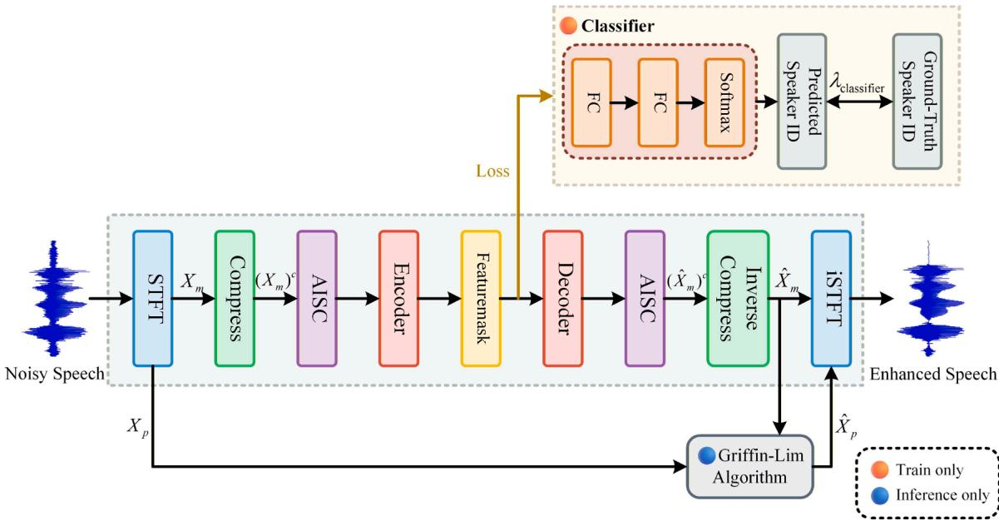  
Fig. 1. Overall structure of our proposed model.

$$
\operatorname{ERB} (f) = 2 1. 4 \log_ {1 0} (0. 0 0 4 3 7 f + 1)\tag{5}
$$

$$
f (\mathrm{ERB}) = \frac {1 0 ^ {\frac {\mathrm{ERB}}{2 1 . 4}} - 1}{0 . 0 0 4 3 7}\tag{6}
$$

where � represents frequency in Hz.

The operational principle of AISC involves a sequence of diferentiable transformations. First, the input spectrogram $\left( X _ { m } \right) ^ { c }$ is partitioned along the frequency axis into a low-frequency component $X _ { \mathrm { l o w } } \in$ $\mathbb { R } ^ { B \times 1 \times F _ { L } \times T }$ (containin fre uencies below 1.5 kHz, which includes essential speech information such as harmonics and formants) and a high-frequenc component $X _ { \mathrm { h i g h } } \in \mathbb { R } ^ { B \times 1 \times F _ { H } \times T }$ . The critical low-frequency region $X _ { \mathrm { l o w } }$ is preserved at full resolution to ensure high fidelity where human hearing is most sensitive. Although speech intelligibility relies heavily on consonants, which are often located in the high-frequency ran e, the human auditor s stem perceives these sounds not throu h fine spectral resolution but via energy integration within critical bands. The AISC module addresses this by applying a perceptually-motivated compression strategy. Specifically, it projects high-frequency components onto the ERB scale. This projection, implemented using a fixed ERB filter bank matrix, aligns with the non-linear frequency selectivity of the human cochlea. By selectively preserving the spectral envelope information crucial for consonant erce tion while reducin the dimensionality of the high-frequency representations, AISC facilitates both efficient computation and the retention of perceptually relevant features, which is essential for ensuring high speech quality.

The core com ression is a lied to the hi h-fre uenc com onent. This is achieved using a fixed, non-trainable triangular ERB filter bank matrix $W _ { \mathrm { E R B } } \in \mathbb { R } ^ { F _ { \mathrm { E R B } } \times F _ { H } }$ , where $F _ { \mathrm { E R B } } \ll F _ { H }$ is the number of bands on the ERB scale. The matrix multiplication $X _ { \mathrm { E R B , h i g h } } = W _ { \mathrm { E R B } } \times X _ { \mathrm { h } }$ igh projects the high-frequency details onto the perceptually-relevant ERB scale, simulating the frequency masking efects where the auditory system aggregates energy within critical bands. The final output of the AISC module is $X _ { \mathrm { E } } \ = [ X _ { \mathrm { l o w } } , \ X _ { \mathrm { E R B , h i g h } } ] \in \mathbb { R } ^ { B \times 1 \times ( F _ { L } + F _ { \mathrm { E R B } } ) \times T }$ . This opera-tion reduces the efective frequency dimension from the original � bins to a significantly smaller size $F ^ { \prime } = F _ { L } + F _ { \mathrm { E R B } }$ . Since the computational complexity of the subsequent Encoder (comprising depthwise separable convolutions) scales linearl with the in ut feature size this dimensionality reduction directly translates to a significant decrease in the overall number of multiply-accumulate operations (MACs), enabling eficient processing without architectural simplification.

This “expert-driven” dimensionality reduction achieves a significant reduction in feature dimensionality without increasing the neural network’s parameter count. By ofloading the task of learning perceptual frequency resolution from the neural backbone to this fixed-parameter module, we achieve substantial savings in computational complexity while maintaining superior speech intelligibility.

After the decoder, the process is reversed via transposed projection: $\hat { X } _ { \mathrm { h i g h } } = W _ { \mathrm { E R B } } ^ { T } \times X _ { \mathrm { E R B , h i g h } }$ . The diferentiabilit of these o erations enables seamless end-to-end training with stable gradient propagation.

## 4.3. Depthwise separable convolutional encoder with atrous spatial pyramid pooling (ASPP)

The encoder module rocesses the com ressed ma nitude s ectrum $X _ { \mathrm { E R B } }$ from the AISC module to produce multi-scale features for speech-noise separation. As illustrated in Fig. 2, the encoder employs a hierarchical architecture based on Depthwise Separable Convolutions (DSConv2D) with Atrous S atial P ramid Poolin (ASPP).

The encoder takes as input $X _ { \mathrm { E R B } } \in \mathbb { R } ^ { B \times 1 \times F ^ { \prime } \times T }$ , where $F ^ { \prime } = F _ { L } + F _ { \mathrm { E R B } }$ denotes the compressed frequency dimension from AISC.

The core DSConv2D operation decomposes standard convolution into depthwise and pointwise components. The depthwise convolution performs spatial filtering:

$$
\operatorname{DWConv2D} (\mathbf {W}, X) _ {(i, j, k)} = \sum_ {u = 0} ^ {U - 1} \sum_ {v = 0} ^ {V - 1} \mathbf {w} _ {(u, v, k)} \cdot \mathbf {x} _ {(i + u, j + v, k)}\tag{7}
$$

where $\mathrm { D W C o n v 2 D } ( \mathbf { W } , X ) _ { ( i , j , k ) }$ denotes the output at spatial position $( i , j )$ and channel $k , \mathbf { W } \in \mathbb { R } ^ { U \times V \times C _ { \mathrm { i n } } }$ is the wei ht tensor, $U \times V$ are the s atial dimensions of the convolution kernel, and $C _ { \mathrm { i n } }$ is the number of input channels.

The pointwise convolution handles channel fusion:

PWConv2D(�,

$$
X) _ {(i, j, q)} = \sum_ {k = 0} ^ {C _ {\mathrm{in}} - 1} \mathbf {w} _ {(k, q)} \cdot \mathbf {x} _ {(i, j, k)}\tag{8}
$$

where PWCon ${ \mathcal { \prime } } 2 \mathbf { D } ( \mathbf { W } , X ) _ { ( i , j , q ) }$ is the output at position $( i , j )$ of the $q \mathrm { t h }$ out-put channel, $\mathbf { W } \in \mathbb { R } ^ { C _ { \mathrm { i n } } \times C _ { \mathrm { o u t } } }$ is the weight matrix, and $C _ { \mathrm { o u t } }$ i h b of output channels.

The complete DSConv2D operation combines these components:

$$
\mathrm{DSConv2D} (X) = \mathrm{PWConv2D} (\mathrm{DWConv2D} (X))\tag{9}
$$

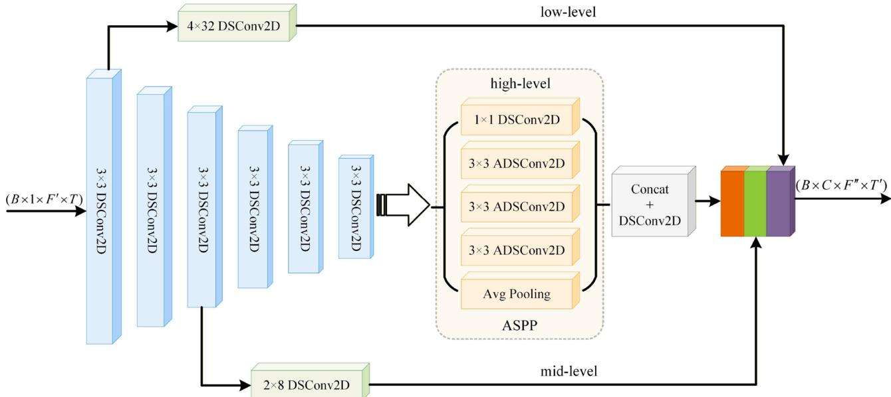  
Fig. 2. Internal architecture of the encoder module

This factorization reduces computational complexity from $O ( K ^ { 2 } \cdot C _ { \mathrm { i n } }$ $C _ { \mathrm { o u t } } )$ to $O ( K ^ { 2 } \cdot C _ { \mathrm { i n } } + C _ { \mathrm { i n } } \cdot C _ { \mathrm { o u t } } ) _ { 3 } $ , where $K \times K$ i th k l i

In this module, the encoder comprises six cascaded DSConv2D blocks with progressive channel expansion. The ASPP module employs atrous depthwise separable convolutions (ADSConv2D) with multiple dilation rates. The atrous de thwise convolution is defined as:

$$
\operatorname{ADWConv2D} (\mathbf {W}, X, r) _ {(i, j, k)} = \sum_ {u = 0} ^ {U - 1} \sum_ {v = 0} ^ {V - 1} \mathbf {w} _ {(u, v, k)} \cdot \mathbf {x} _ {(i + r \cdot u, j + r \cdot v, k)}\tag{10}
$$

where ADWConv2D(�, $X , r ) _ { ( i , j , k ) }$ denotes the output at position $( i , j )$ and channel � with dilation rate $r ,$ which controls the spacing between kernel elements to expand the receptive field without increasing parameters.

The complete ADSConv2D operation combines atrous depthwise with pointwise convolution:

$$
\operatorname{ADSConv2D} (X, r) = \operatorname{PWConv2D} (\operatorname{ADWConv2D} (X, r))\tag{11}
$$

In our implementation, the ASPP module contains four parallel branches, includin a 1 × 1 DSConv2D and three 3 × 3 ADSConv2D branches with dilation rates of $r \in \{ 2 , 4 , 8 \}$ . These rates are specifically optimized to match the hierarchical spectro-temporal characteristics of speech: $r = 2$ captures the fine harmonic structures by focusing on the fundamental fre uenc and its harmonics; � = 4 matches the bandwidth of formant envelopes, which is crucial for vowel intelligibility; � = 8 provides a wider receptive field to cover syllabic-level long-term context, aidin in the su ression of non-stationar noise.

Com ared to traditional s eech-s ecific ramids that rel on com-putationally expensive dense convolutions or complex multi-scale hierarchies, our use of ADSConv2D within the ASPP framework ofers a superior balance between performance and eficiency. By decoupling spatial and channel-wise operations and utilizing sparse sampling via dilation, this structure captures multi-scale context with minimal MACs. This makes it significantly more suitable for real-time 1D/2D audio processing on resource-constrained edge devices than heavy hierarchical pyramids.

Features from three hierarchical sta es (low-level after the first DSConv2D, mid-level after the third DSConv2D, and high-level after the ASPP) are channel-ali ned and concatenated. The encoder out uts the final feature representation $X _ { \mathrm { E n c } } \in \mathbb { R } ^ { B \times C \times F ^ { \prime \prime } \times T ^ { \prime } }$ to the FeatureMask module, achievin an o timal balance between feature richness and computational eficiency.

## 4.4. Featuremask

Featuremask is a critical module that estimates a mask matrix to enhance speech signals by suppressing noise-dominated time-frequency units. The module takes the feature representation $X _ { \mathrm { E n c } } \in \mathbb { R } ^ { B \times C \times F ^ { \prime \prime } \times \bar { T ^ { \prime } } }$ from the encoder.

The multiplicative masking approach is motivated by its physical interpretation in speech enhancement. Unlike additive operations, element-wise multi lication reserves the relative s ectral relationshi s while suppressing noise-dominated components. This corresponds to estimating an ideal ratio mask that scales each time-frequency unit based on speech presence probability, maintaining the harmonic structure and energy distribution critical for perceptual quality.

To accurately estimate this mask, the model must capture long-range dependencies in the speech signal, which is essential for distinguishing between speech and noise components across time and frequency. While the State-Space Sequence (S4) model, introduced in Section 3, provides a theoretical framework for modeling such dependencies, its application to lightweight speech enhancement encounters practical hurdles. S ecificall , the ori inal S4 relies on the Normal Plus Low-Rank (NPLR) decom osition to a roximate the continuous-time transition matrix. Although this approach theoretically reduces complexity, the resulting kernel com utation involves intricate o erations—such as Cauch kernel matrix-vector multiplication—that impose significant implementation overhead and memory costs compared to simple element-wise operations. Furthermore, directly applying the standard S4 parameterization to multidimensional time-frequency features significantly increases the parameter count, which contradicts the design goal of a compact, realtime framework Fi . 4.

To overcome these limitations while preserving the long-range modeling capability, we introduce a light Structured State-Space Sequence model (li htS4) within the FeatureMask module. The core innovation of li htS4 is a dia onal constraint on the state transition matrix �, formulated as:

$$
\mathbf {A} = - \mathrm{diag} (\exp (\mathbf {A} _ {\log}))\tag{12}
$$

where $\mathbf { A } _ { \mathrm { l o g } }$ is a learnable parameter vector. This design guarantees stable negative eigenvalues and serves as the foundation for a more eficient and robust im lementation. The dia onal structure enables several ivotal advantages that collectively enhance the model’s practicality.

The diagonal structure allows for an exact and stable discretization using the Zero-Order Hold (ZOH) method without computationally expensive matrix operations. The matrix exponential simplifies to an element-wise operation:

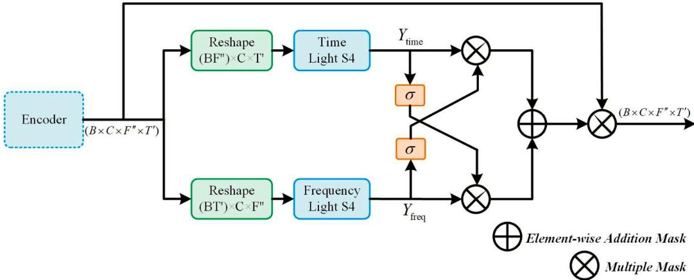  
Fig. 3. Internal architecture of the featuremask module.

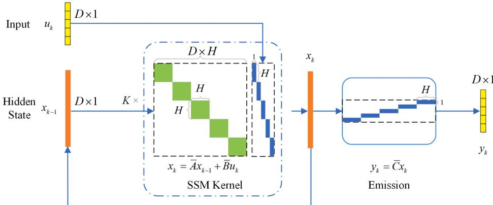  
Fig. 4. Internal architecture of the lightS4 module.

$$
\overline {{\mathbf {A}}} = \exp (\Delta \mathbf {A}) = \operatorname{diag} \left(\exp \left(\Delta \mathbf {A} _ {1 1}\right), \exp \left(\Delta \mathbf {A} _ {2 2}\right), \dots , \exp \left(\Delta \mathbf {A} _ {H H}\right)\right)\tag{13}
$$

Similarly, the discretization of � is computed exactly and eficiently. The standard ZOH formula, $\overline { { \mathbf { B } } } = ( \exp ( \Delta \mathbf { A } ) - \mathbf { I } ) \mathbf { A } ^ { - 1 } \mathbf { B }$ , simplifies to a nu merically stable element-wise calculation:

$$
\overline {{{\mathbf {B}}}} = (\overline {{{\mathbf {A}}}} - \mathbf {I}) \odot \mathbf {A} ^ {- 1} \odot \mathbf {B}\tag{14}
$$

Furthermore, the model avoids iterative computations by directly eneratin the full SSM convolutional kernel $\mathbf { K } \in \mathbb { R } ^ { C \times L }$ . Based on the continuous-time parameters, the kernel is eficiently calculated in a sin-gle vectorized step and implemented as a global convolution using the Fast Fourier Transform (FFT). This drastically reduces the computational complexity for processing long sequences and high-dimensional features.

As shown in Fig. 3, the Featuremask module leverages the lightS4 (see Fig. 4) design through a dual-path architecture that processes the time and frequency axes independently. Specifically, the input tensor is reshaped and fed into two parallel branches: one capturing long-range temporal dependencies and the other modeling frequency dependencies. The outputs of both paths are then intelligently combined using a cross-gating mechanism. Specifically, the output from the temporal path $( Y _ { \mathrm { t i m e } } )$ and the frequency path $( Y _ { \mathrm { f r e q } } )$ are used to modulate each other to produce a fused representation $Y _ { \mathrm { f u s e d } } \mathrm { : }$

$$
G _ {\mathrm{time}} = \sigma (Y _ {\mathrm{time}} + b _ {t})
$$

$$
G _ {\mathrm{freq}} = \sigma (Y _ {\mathrm{freq}} + b _ {f})\tag{15}
$$

(16)

$$
Y _ {\mathrm{fused}} = (Y _ {\mathrm{time}} \odot G _ {\mathrm{freq}}) + (Y _ {\mathrm{freq}} \odot G _ {\mathrm{time}})\tag{17}
$$

where $\sigma ( \cdot )$ is the si moid function, and $b _ { t }$ and $b _ { f }$ are learnable biases. The final mask matrix � is obtained by applying a sigmoid activation to the fused features, $M = \sigma ( Y _ { \mathrm { f u s e d } } )$ . The enhanced features are then obtained by $X _ { \mathrm { m a s k } } = X _ { \mathrm { E n c } } \odot M _ { \mathrm { : } }$ which are assed to the decoder for s eech reconstruction and to the Classifier for auxiliary tasks.

This integrated approach achieves accurate speech enhancement with high computational eficiency. The choice of incorporating lightS4 over traditional TCNs or RNNs is strategic. Unlike TCNs, which require deep stacking of dilated layers to achieve a global receptive field, lightS4 captures global context in a single layer with linear complexity. Furthermore, unlike RNNs, lightS4 allows for parallelizable training via FFT convolution. This complements the local feature extraction of the encoder’s depthwise separable convolutions, creating a computationally eficient hybrid architecture. Consequently, The lightS4-based Featuremask efectively captures long-range dependencies essential for mask estimation, while the diagonal constraint ensures numerical stability throughout the enhancement pipeline.

## 4.5. Decoder and phase refinement

The decoder reconstructs the enhanced magnitude spectrum from the feature representation $X _ { \mathrm { m a s k } }$ generated by the Featuremask module. A d il d i ${ \mathrm { F i g . ~ } } 5 ,$ the decoder em lo s an eficient architecture alternatin between de thwise se arable convolutions (DSConv2D) and trans osed convolutions (DSTransConv2D).

The decoder processes the input $X _ { \mathrm { m a s k } } \in \mathbb { R } ^ { B \times C \times F ^ { \prime \prime } \times T ^ { \prime } }$ through five se uential la ers to roduce the enhanced ma nitude s ectrum $\hat { X } _ { m } \in \mathbb { R } ^ { B \times 1 \times F ^ { \prime } \times T }$ . Each convolutional layer uses batch normalization and ReLU activation, with a final ReLU to ensure non-negative outputs.

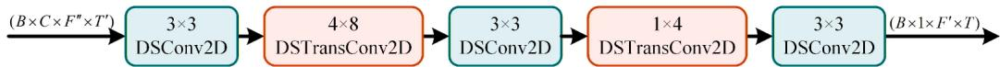  
Fig. 5. Internal architecture of the decoder module.

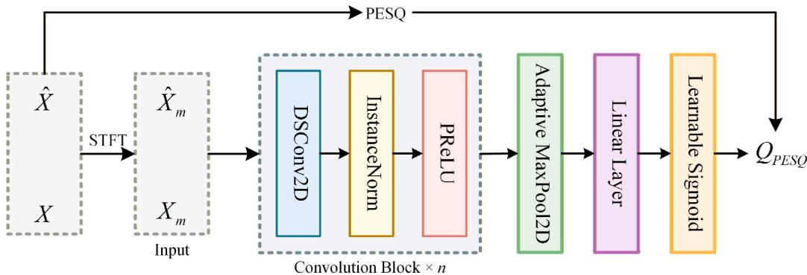  
Fig. 6. Internal architecture of the metric discriminator.

To achieve high-quality speech reconstruction, the enhanced mag- nitude spectrum $\hat { X } _ { m }$ must be combined with an appropriate phase estimate. Rather than directly using the noisy phase, we employ the Grifin-Lim Algorithm (GLA) [37] as a post-processor to refine the phase spectrum iteratively.

The choice of GLA over modern phase-aware methods, such as complex-domain networks or deep Grifin-Lim architectures, is driven by the need for extreme computational eficiency. While modern methods often require specialized phase decoders and process complexvalued spectra, leading to a significant surge in parameters and MACs, GLA is a arameter-free iterative al orithm. It levera es the consistency constraints of the signal to refine the phase without increasing the model’s weight or learning burden, making it exceptionally suitable for li htwei ht framework.

Given the enhanced magnitude spectrum $\hat { X } _ { m }$ and initial noisy phase $X _ { p } ^ { ( 0 ) }$ , GLA optimizes the phase through an iterative process. Each iteration � involves three steps:

$$
\hat {X} ^ {(k)} = \hat {X} _ {m} \odot e ^ {j \cdot X _ {p} ^ {(k)}}\tag{18}
$$

where ${ \hat { X } } ^ { ( k ) }$ is the complex spectrum estimate at iteration $k ,$ combining the enhanced ma nitude with the current hase estimate.

$$
y ^ {(k)} = \mathrm{iSTFT} (\hat {X} ^ {(k)})\tag{19}
$$

where $y ^ { ( k ) }$ is the reconstructed time-domain signal.

$$
X _ {p} ^ {(k + 1)} = \angle \mathrm{STFT} (y ^ {(k)})\tag{20}
$$

where $X _ { p } ^ { ( k + 1 ) }$ is the updated phase spectrum for the next iteration.

After $K$ iterations, the algorithm converges to the final estimated phase spectrum:

$$
\hat {X} _ {p} = X _ {p} ^ {(K)}\tag{21}
$$

where $\hat { X } _ { p }$ represents the optimized phase spectrum.

The final enhanced speech signal is then obtained by combining the enhanced magnitude spectrum with the optimized phase spectrum:

$$
\hat {y} = \mathrm{iSTFT} (\hat {X} _ {m} \odot e ^ {j \cdot \hat {X} _ {p}})\tag{22}
$$

This approach provides superior perceptual quality compared to using the noisy phase directly, while maintaining computational eficiency suitable for li htwei ht framework.

## 4.6. Metric discriminator

Direct optimization of non-diferentiable perceptual metrics, such as PESQ, remains a fundamental challenge in speech enhancement. To address this, we introduce a metric discriminator module inspired by MSLD-SENet [38] . As shown in Fig. 6, this module learns a diferentiable proxy of the perceptual quality function through adversarial training.

The discriminator takes as input pairs of complex spectrograms, formed by concatenating their real and imaginary components along the channel dimension. The architecture comprises a series of convolutional blocks that extract hierarchical features, each employing spectrally- normalized depthwise separable convolutions for stability, followed by instance normalization and parametric activations. Adaptive pooling then handles variable-length inputs, and fully connected layers map the features to a normalized quality score in [0, 1]. This diferentiable surro-gate efectively bridges the gap between non-diferentiable metrics and gradient-based optimization.

During training, the discriminator learns to assign a perfect score to clean-clean pairs while approximating the actual PESQ score for cleanenhanced pairs. This approach enables direct optimization of the generator towards higher perceptual quality by maximizing the predicted score.

## 4.7. Loss function

The overall objective function is formulated within an adversarial trainin framework, consistin of both enerator and discriminator objectives. Specifically, the generator loss integrates five distinct components to ensure comprehensive enhancement quality:

Magnitude spectrum loss: The magnitude spectrum loss $\mathcal { L } _ { \mathrm { M a g } }$ minimizes the error between the compressed target and estimated magnitude spectra. The loss is defined as:

$$
\mathcal {L} _ {\mathrm{Mag}} = \mathbb {E} _ {(X, \hat {X})} \left[ \left\| (X _ {m}) ^ {c} - (\hat {X} _ {m}) ^ {c} \right\| _ {F} ^ {2} \right]\tag{23}
$$

where $\mathbb { E } _ { ( X , \hat { X } ) }$ denotes the expectation over pairs of clean and enhanced complex spectra; $X _ { m }$ and $\hat { X } _ { m }$ are the target and estimated magnitude spectra, respectively; (⋅)� denotes the power-law compression; and ‖ ⋅ ‖ is the Frobenius norm.

STFT consistency loss: The consistenc loss ${ \mathcal { L } } _ { \mathrm { C o n } }$ enalizes inconsistencies between the enhanced spectrum $\hat { X }$ and its re-synthesized version $\widetilde { X }$ to ensure a valid waveform and reduce artifacts. The loss is defined as:

$$
\mathcal {L} _ {\mathrm{Con}} = \mathbb {E} _ {\hat {X}} \left[ \| \mathcal {R} _ {\mathrm{con}} \| _ {F} ^ {2} + \| \mathcal {I} _ {\mathrm{con}} \| _ {F} ^ {2} \right]\tag{24}
$$

where $\mathbb { E } _ { \hat { X } }$ denotes the expectation over a batch of enhanced complex spectra $\tilde { \hat { X } } ; \tilde { X } = { \mathrm { S T F T } } ( { \mathrm { i S T F T } } ( \hat { X } ) )$ ) is the consistently projected spectrum;

$\mathcal { R } _ { \mathtt { C o n } } = \mathtt { R e } ( \hat { X } ) - \mathtt { R e } ( \widetilde { X } )$ is the diference matrix of the real parts; and $T _ { \mathrm { c o n } } = \mathrm { I m } ( \hat { X } ) - \mathrm { I m } ( \widetilde { X } )$ is the diference matrix of the imaginary parts.

Complex spectrum loss: The complex spectrum loss ${ \mathcal { L } } _ { \mathrm { C o m } }$ improves speech quality by enforcing a consistent STFT pair rather than perform ing explicit phase estimation. The loss is defined as:

$$
\mathcal {L} _ {\mathrm{Com}} = \mathbb {E} _ {(X, \hat {X})} \big [ \| \mathcal {R} _ {\mathrm{com}} \| _ {F} ^ {2} + \| \mathcal {I} _ {\mathrm{com}} \| _ {F} ^ {2} \big ]\tag{25}
$$

Where $\mathbb { E } _ { ( X , \hat { X } ) }$ denotes the expectation over pairs of clean and enhanced complex spectra; � and �̂ are the target and enhanced complex spectra, respectively; $\mathcal { R } _ { \mathrm { c o m } } = \mathrm { R e } ( X ) - \mathrm { R e } ( \hat { X } )$ is the diference matrix of the real components; and $T _ { \mathrm { c o m } } = \mathrm { I m } ( X ) - \mathrm { I m } ( \hat { X } )$ ) is the diference matrix of the imaginary components.

Metric loss: The metric loss guides the model to generate higherquality speech, thereby achieving a higher PESQ score. The loss is defined as:

$$
\mathcal {L} _ {\mathrm{Metric}} = \mathbb {E} _ {(x, \hat {x})} \left[ \| D (x, \hat {x}) - 1 \| _ {F} ^ {2} \right]\tag{26}
$$

Classifier loss: Recent studies have emphasized the importance of advanced feature representation for robust speech processing in adverse environments. For instance, ca sule-enhanced networks [39] and intelli ent fusion strate ies [40] have roven efective in extractin resilient features against acoustic interference. Drawing inspiration from these approaches to enforce feature discriminability, and based on previous research [41], identifying speaker-related features enables the model to adapt to specific acoustic characteristics, thereby improving separation performance. To leverage this, we introduce a speaker classification module consisting of two fully connected layers followed by a softmax activation that outputs a probability distribution over speakers, as illustrated in Fig. 1.

Our proposed Classifier Loss , which integrates an auxiliary speaker classifier, enhances speech reconstruction through two distinct yet comlementar mechanisms.

First, in scenarios involving vocal interference, the Classifier Loss provides explicit speaker-discriminative guidance by exploiting the principle of acoustic coherence. Although the speakers are unseen during inference, the classification task during training forces the encoder to capture universal acoustic signatures that define a single vocal identity. This e ui s the framework with a hei htened sensitivit to the tem-poral and spectral continuity of a specific voice. During inference, the model acts as a perceptual filter: it identifies the most dominant timbre signature and uses it as an “acoustic anchor” to group coherent spectral components while discarding disjointed interference. Furthermore, Classifier Loss encourages identity-aware energy allocation in the feature space. By concentrating energy on the discriminative harmonic patterns of the target speaker, the model can efectively suppress competing voices even within overla in fre uenc bands.

Second, in the presence of non-human noise, Classifier Loss as a powerful structural regularizer. By jointly optimizing for enhancement and identification, the model is guided to prioritize the reconstruction of the fundamental harmonic structures and phonetic integrity inherent to human speech. This prior knowledge prevents the model from overfitting to unstructured or stationary environmental noise patterns. While it efectively suppresses such background noise by recognizing they lack human-like acoustic coherence, the relative improvement is lower than in vocal scenarios because non-human noise already exhibits significant spectral disparity from speech, making the discriminative advantage of the classifier a secondary factor rather than a primary driver for separation.

The Classifier is optimized using the cross-entropy loss:

$$
\mathcal {L} _ {\mathrm{Classifier}} = - \frac {1}{N} \sum_ {i = 1} ^ {N} \sum_ {j = 1} ^ {C} g _ {i, j} \log (p _ {i, j})\tag{27}
$$

where � is the number of sam les in the batch, � is the total number of speakers, $g _ { i , j }$ is the ground-truth label (1 if sample � belongs to speaker �, 0 otherwise), and $p _ { i , j }$ is the predicted probability that sample � belongs to speaker �.

Final loss function: The total generator loss is formulated as a weighted combination of the five aforementioned loss components:

$$
\mathcal {L} _ {G} = \lambda_ {1} \mathcal {L} _ {\mathrm{Mag}} + \lambda_ {2} \mathcal {L} _ {\mathrm{Con}} + \lambda_ {3} \mathcal {L} _ {\mathrm{Com}} + \lambda_ {4} \mathcal {L} _ {\mathrm{Metric}} + \lambda_ {5} \mathcal {L} _ {\mathrm{Classifier}}\tag{28}
$$

And the weight of the above loss is: $\lambda _ { 1 } = 0 . 9 , \lambda _ { 2 } = 0 . 1 , \lambda _ { 3 } = 0 . 1 , \lambda _ { 4 } = 0 . 0 5 ,$ $\lambda _ { 5 } = 0 . 1$ . These values were determined through comparative experiments and found to yield optimal performance across various evaluation metrics.

Additionally, the discriminator loss follows the framework [38]. It is defined as:

$$
\mathcal {L} _ {D} = \mathbb {E} _ {x} \left[ \| D (x, x) - 1 \| _ {F} ^ {2} \right] + \mathbb {E} _ {(x, \hat {x})} \left[ \left\| D (x, \hat {x}) - Q _ {\text { PESQ }} \right\| _ {F} ^ {2} \right]\tag{29}
$$

where � represents the metric discriminator and $Q _ { \mathrm { P E S Q } } \in [ 0 , 1 ]$ refers to the normalized PESQ score.

## 5. Experiments

## 5.1. Datasets

VoiceBank+DEMAND dataset: The VoiceBank [42]+DE-MAND [43] dataset used in this study includes 28 speakers’ speech as the training set and 2 speakers’ speech as the testing set. During the training phase, speech was mixed with 10 types of noise at four signal-to-noise ratios of 0, 5, 10, and 15 dB, generating 11,572 noisy samples. To verify the model’s robustness as a general-purpose speech enhancement system, these noise types cover a comprehensive range of acoustic categories. These include low-frequency noise , broadband stationary noise , and highly non-stationary or periodic noise . This diversity ensures the model is not limited to specific interference patterns but is capable of handling complex, real-world acoustic environments. During the testing phase, five types of noise-free speech were used to mix approximately 800 sentences at signal-to-noise ratios of 2.5, 7.5, 12.5, and 17.5 dB, forming a test set of 824 samples. All speakers and noise used in testing were not present in the training set. We use it for training and evaluating our model, comparing it with existin models and conductin ablation studies.

WSJ0-SI84 dataset: The WSJ0-SI84 Dataset [44] contains the speech of 140 speakers and is divided into a training set, a develop- ment test set, and an evaluation test set. The training set consists of 92 speakers, each contributin 90 sentences; The development test set and evaluation test set are from another 48 speakers, each contributing 40 sentences. The vocabulary scope of the test sentence is limited to a subset containin 5000 words which ori inates from a lar e vocabulary of 64,000 words. In addition, all speakers recorded 18 sentences specifically for the model’s adaptive training. During the training phase, we randomly selected 60 noise types from the Perception and Neurody- namics Laborator . We mixed them with trainin s eech at multi le signal-to-noise ratios ranging from -5 dB to 5 dB to construct the training set. In the testing phase, we selected three highly challenging types of noise. We mixed them under the same si nal-to-noise ratio conditions to com are with existin models and evaluate the robustness and generalizability of our model.

LibriSpeech dataset: The LibriSpeech dataset [45] comprises a substantial collection of En lish audiobooks and is widel used for s eech processing tasks. The dataset is partitioned into standard training, development, and test sets. The training sets ofer a large number of high-quality utterances; the development and test sets provide corresponding clean speech for evaluation. For the training phase, we randomly selected 1200 clean utterances from the trainin set. We mixed them with 15 types of noise from the Non-Speech Sounds and NOISEX-92 databases at signal-to-noise ratios ranging from -5 dB to 5 dB, resulting in a noisy trainin set. For the testin hase we selected 300 clean utterances from the test set and mixed them with three challenging types of noise. These were combined under the same signal-to-noise ratio conditions to evaluate the robustness and generalizability of our model rigorously.

ICASSP SSI challenge dataset: The SSI Test Set is constructed by aggregating 1500 authentic audio recordings from the 2023 ICASSP SSI [46] and the 2024 ICASSP SSI [47]. These challenges focus on enhancing audio quality for real-time communication. Specifically, the collection includes 500 samples from the 2024 ICASSP SSI test set, combined with 1000 samples from the 2023 ICASSP SSI challenge (split equally between the blind test and standard test sets). All samples represent five unique categories of speech signal degradation. This dataset is utilized to evaluate the model’s performance via subjective assessment in real-world scenarios.

## 5.2. Parameters setting

This study follows a standardized data preprocessing pipeline. All input si nals are resampled from 48 kHz to 16 kHz to ensure consistency. During training, the audio data are segmented into 2-s clips to meet the model’s input requirements and reduce computational load. In contrast, the test data remain untruncated at their original lengths. For time-frequency analysis, a discrete STFT is performed. We utilize a 400- point Hanning window with a 100-point hop size, and the spectrum is calculated using a 400-point FFT. The model is optimized using Adam with an initial learning rate of 5 × 10−4. The learning rate is dynamically adjusted by an exponential decay scheduler that multiplies the current rate by 0.99 at the end of each epoch. The model is trained for 150 epochs with a batch size of 32 on a single NVIDIA A800 GPU.

## 5.3. Evaluation metrics

To comprehensively evaluate the performance of speech enhancement algorithms, this study employs a set of widely recognised objective metrics that provide a multidimensional analysis. The assessment encompasses speech quality, intelligibility, auditory perception, and com-putational eficiency, thereby balancing enhanced speech quality with practical deployment requirements. Specifically, the Perceptual Evaluation of Speech Quality (PESQ) [48] and the Short-Time Objective Intelligibility (STOI) [49] measures are adopted. PESQ predicts the subjective quality by comparing the perceptual diferences between the enhanced and clean reference signals, with scores ranging from -0.5 to 4.5. STOI evaluates intelligibility by measuring the spectral correlation between the clean and processed speech in short-time se ments, ieldin a value between 0 and 1; it is particularly suitable for assessing performance in noisy conditions.

Furthermore to rovide a finer- rained assessment of the enhancement efect, we use a set of composite Mean Opinion Score (MOS) predictors: CSIG [50] quantifies signal distortion, CBAK [50] estimates background noise intrusion, and COVL [50] represents overall perceptual ualit . These metrics t icall ran e from 1 to 5, allowin for a multifaceted characterization of the output speech.

To complement these measures with modern subjective estimation, we also incorporate SigMOS [51]. Based on the ITU-T P.804 standard, Si MOS rovides a robust estimate of subjective assessment scores using a deep learning-based approach. It can predict both Signal (SIG) and Overall Speech Quality (OVRL), along with five key dimensions: Noise (BAK), Coloration (COL.), Discontinuity (DISC.), Reverberation (REVERB.), and Loudness (LOUD.). Crucially, SigMOS serves as a scalable proxy for human listening tests, providing reliable subjective qual ity insights while avoiding the high costs and time requirements associated with lar e-scale manual evaluations.

Re ardin com utational eficienc and model com lexit we report the number of multiply-accumulate (MACs) operations, the number of trainable parameters (Params) in millions (M), and the Real-Time Factor (RTF). MACs reflect the theoretical com utational com lexit . Params indicate the model size, where fewer parameters lead to a lighter model. RTF measures the practical inference speed, representing the ratio of processing time to the duration of the input audio. These metrics collectively evaluate the suitability for embedded and real-time deploy- ment.

## 6. Results

## 6.1. Comparison with existing models

To comprehensively evaluate the performance of our proposed model, we conducted extensive comparisons against a wide range of state-of-the-art (SOTA) speech enhancement models on the Voice-Bank+DEMAND dataset and WSJ0-SI84 dataset.

The results on the VoiceBank+DEMAND dataset, presented in Ta ble 1 hi hli ht the eficienc of our ro osed model. In this table, our model is benchmarked against a wide range of state-of-the rt b lin –in l din SSM-b d (SEM mb [4]) C nf rm r-b d (DeConformer-SENet [52]), and other lightweight models–using a comprehensive suite of metrics such as PESQ, STOI, and COVL. When com ared to li htwei ht architectures and those em lo in knowled e dis till ti h U t16 53 h d t t l d vanta e. While knowled e distillation efectivel reduces model size by transferring information from a large teacher to a student, our results suggest that intrinsic architectural optimization can yield superior eficienc . Althou h Unet16 is extremel com act with a arameter count of 1.10M, our model achieves si nificantl hi her s eech ualit with 1.65M arameters. S ecificall it raises the PESQ from 3.17 to 3.32 and the COVL from 3.90 to 4.10. Notabl our model is over 4.5 times faster in terms of computational execution, requiring only 0.50G MACs com ared to the 2.27G MACs re uired b Unet16. This indicates that our ’eficienc -b -desi n’ strate which inte rates State S ace Models with de thwise se arable convolutions rovides a more favorable trade-of between computational cost and performance than distillation-based compression, avoidin the complexit of trainin auxili h k Si il d b d h b h k in a ainst Dee FilterNet3 [14]. Des ite the ultra-low com utational demand of 0.36G MACs for Dee FilterNet3 our model rovides a sub stantial performance boost by improving the PESQ score from 3.17 to 3.32. This roves that our architecture achieves a more o timal trade of between hardware eficiency and perceptual quality. In comparison with attention-based architectures, our ro osed framework exhibits su-perior performance and significantly lower computational overhead. Re cent methods such as DPHT-ANetD [54] and MFFR-Net [55], which rel on com lex multi-frame fusion and attention mechanisms are consis tentl sur assed b our model in ke metrics includin PESQ, CSIG, and COVL. Furthermore when measured a ainst the Conformer-based DeConformer-SENet [52] our a roach delivers com arable enhancement erformance while achievin a substantial reduction in com uta tional com lexit . These results su est that our desi n levera in the i h d f S S M d l i i l i f t r m r f tiv l th n tr diti n l lf- tt nti n l r M t imortantl b ado tin the SSM-based aradi m our model inherentl avoids the uadratic com lexit t icall associated with Transformer lik t t hil i t i i hi h f A th St t S Model (SSM) gains prominence in speech enhancement, our framek t d t f it i t ti l fi i ithi thi paradigm. As shown in Table 1, we compared our model against rep- resentative SSM-based architectures includin S4NDU-Net [23] Dual S4D [25] S ikin -S4 [24] and SEMamba [4]. Com ared to recent SSM based architectures such as SEMamba [4], our model ofers a si nifi cantl more com act alternative. While SEMamba [4] achieves a hi her PES f 3 52 it i i t ti l t f 32 73G MACs. In shar contrast our model delivers a com etitive PESQ of 3.32 with a minimal requirement of onl 0.50G MACs, achievin a complexit reduction of over 60 times. Furthermore com ared to Dual-S4D [25] which utilizes 10.8M arameters and 18.43G MACs our model is si nificantl li hter and faster while achievin su erior s eech ualit , imrovin the PESQ score from 2.55 to 3.32. These results confirm that combining a lightweight SSM-based module with depthwise separable convolutions ofers a more viable approach for ed e-device deplo ment than existing heavy-duty SSM variants.

Table 1  
Com arison with existin models on the VoiceBank+DEMAND Dataset. The ex erimental setu is consistent with the description in Section 5.1. The symbol “↑” indicates that higher values are better, while $^ { \dag } \downarrow ^ { \dag }$ indicates lower values are better. “–” denotes the unreported results.

<table><tr><td>Model</td><td>Year</td><td>Params[M]↓</td><td>MACs [G]↓</td><td>PESQ↑</td><td>STOI ↑</td><td>CSIG↑</td><td>CBAK ↑</td><td>COVL↑</td></tr><tr><td>Noisy</td><td>-</td><td>-</td><td>-</td><td>1.97</td><td>0.91</td><td>3.35</td><td>2.44</td><td>2.63</td></tr><tr><td>FullSubNet [3]</td><td>2021</td><td>5.64</td><td>30.73</td><td>2.77</td><td>0.94</td><td>3.94</td><td>3.44</td><td>3.35</td></tr><tr><td>DeepFilterNet [56]</td><td>2022</td><td>1.78</td><td>0.35</td><td>2.81</td><td>0.94</td><td>4.14</td><td>3.31</td><td>3.46</td></tr><tr><td>DeepFilterNet2 [57]</td><td>2022</td><td>2.31</td><td>0.36</td><td>3.08</td><td>0.94</td><td>4.30</td><td>3.40</td><td>3.70</td></tr><tr><td>SSI-Net [58]</td><td>2023</td><td>5.23</td><td>7.22</td><td>3.14</td><td>0.95</td><td>4.31</td><td>3.62</td><td>3.74</td></tr><tr><td>DeepFilterNet3 [14]</td><td>2023</td><td>2.31</td><td>0.36</td><td>3.17</td><td>0.94</td><td>4.34</td><td>3.61</td><td>3.77</td></tr><tr><td>S4NDU-Net [23]</td><td>2023</td><td>0.75</td><td>-</td><td>3.15</td><td>-</td><td>4.52</td><td>3.62</td><td>3.85</td></tr><tr><td>Dual-S4D [25]</td><td>2023</td><td>10.8</td><td>18.43</td><td>2.55</td><td>0.93</td><td>3.94</td><td>3.00</td><td>3.23</td></tr><tr><td>DPHT-ANetD [54]</td><td>2024</td><td>2.55</td><td>2.25</td><td>3.19</td><td>0.95</td><td>4.38</td><td>3.71</td><td>3.90</td></tr><tr><td>MFFR-Net [55]</td><td>2024</td><td>3.25</td><td>2.65</td><td>3.21</td><td>0.95</td><td>4.36</td><td>3.69</td><td>3.91</td></tr><tr><td>CTSE-Net [59]</td><td>2024</td><td>1.49</td><td>2.58</td><td>3.18</td><td>0.95</td><td>4.30</td><td>3.68</td><td>3.92</td></tr><tr><td>SEMamba [4]</td><td>2024</td><td>2.25</td><td>32.73</td><td>3.52</td><td>0.96</td><td>4.75</td><td>3.98</td><td>4.26</td></tr><tr><td>Spiking-S4 [24]</td><td>2024</td><td>0.53</td><td>0.75</td><td>3.39</td><td>-</td><td>4.92</td><td>2.64</td><td>4.31</td></tr><tr><td>Unet16 [53]</td><td>2025</td><td>1.10</td><td>2.27</td><td>3.17</td><td>0.95</td><td>4.49</td><td>3.79</td><td>3.90</td></tr><tr><td>DeConformer-SENet [52]</td><td>2025</td><td>1.57</td><td>3.05</td><td>3.24</td><td>0.96</td><td>4.51</td><td>3.84</td><td>3.92</td></tr><tr><td>Proposed</td><td>2025</td><td>1.65</td><td>0.50</td><td>3.32</td><td>0.96</td><td>4.70</td><td>3.41</td><td>4.10</td></tr></table>

Table 2  
Comparison with existing models on the WSJ0-SI84 Dataset. Performance is measured under Multi-talker Babble Street and Cafeteria noise at +5 dB SNR. The s mbol “↑” indicates that hi her values are better while “↓” indicates lower values are better. “–” denotes the unreported results.

<table><tr><td>Model</td><td>Year</td><td>Params [M]↓</td><td>MACs [G]↓</td><td>PESQ ↑</td><td>STOI ↑</td></tr><tr><td>Noisy</td><td>-</td><td>-</td><td>-</td><td>1.73</td><td>0.68</td></tr><tr><td>FullSubNet [3]</td><td>2021</td><td>5.64</td><td>31.35</td><td>2.55</td><td>0.74</td></tr><tr><td>CTSNet [60]</td><td>2021</td><td>4.35</td><td>5.57</td><td>2.86</td><td>0.82</td></tr><tr><td>GaGNet [61]</td><td>2022</td><td>5.94</td><td>1.63</td><td>2.86</td><td>0.83</td></tr><tr><td>MDNet [62]</td><td>2022</td><td>8.36</td><td>2.70</td><td>2.88</td><td>0.83</td></tr><tr><td>CDNN-GRU [15]</td><td>2023</td><td>1.96</td><td>0.60</td><td>2.88</td><td>0.84</td></tr><tr><td>E-CDNN-GRU [15]</td><td>2023</td><td>2.01</td><td>0.65</td><td>2.91</td><td>0.85</td></tr><tr><td>BSDB-Net [63]</td><td>2024</td><td>9.78</td><td>1.68</td><td>2.92</td><td>0.85</td></tr><tr><td>Proposed</td><td>2025</td><td>1.65</td><td>0.50</td><td>3.01</td><td>0.87</td></tr></table>

The results on the WSJ0-SI84 dataset are resented in Table 2. Our ro osed framework achieves state-of-the-art erformance while remaining the most eficient among all tested models. Specifically, it sets a new performance benchmark by reaching a PESQ of 3.01 and an STOI of 0.87, which surpasses previous leading baselines such as BSDB-Net [63] and E-CDNN-GRU [15]. This top-tier performance is achieved with un-paralleled eficiency, as our model maintains the lowest parameter count of 1.65M and a minimal computational complexity of 0.50G MACs. These results underscore its superior suitability for resource-constrained a lications.

To assess practical deployability, we measured the inference speed on the Core i5-1135G7@2.4GHz CPU. Our model achieves a Real-Time Factor (RTF) of 0.13, confirming its high eficiency and suitability for real-time speech processing on consumer-grade hardware.

In summar these results underscore the efectiveness of our ro-posed li htwei ht framework. The innovative inte ration of the State-S ace Model within de thwise se arable convolution enables our model to efectively capture complex temporal and spectral features, rivaling much larger, more complex architectures. This design achieves an exceptional balance between signal quality and computational eficiency, hi hli htin its otential for a wide ran e of a lications.

## 6.2. Ablation study

To systematically evaluate the contribution of each core component, we conducted a com rehensive ablation stud on the VoiceBank+DE-

Table 3  
Ablation study on the VoiceBank+DEMAND dataset. The experimental setup is consistent with the description in Section 5.1. The s mbol $^ { \dag } \uparrow ^ { \dag }$ indicates that hi her values are better while “↓” indicates lower values are better.

<table><tr><td>Model</td><td>Params[M]↓</td><td>MACs[G]↓</td><td>PESQ↑</td><td>STOI↑</td></tr><tr><td>Proposed</td><td>1.65</td><td>0.50</td><td>3.32</td><td>0.956</td></tr><tr><td>w/o ASPP (ratio [2, 4, 8])</td><td>1.33</td><td>0.47</td><td>3.12</td><td>0.948</td></tr><tr><td>w/ ASPP (ratio [2, 4, 6])</td><td>1.65</td><td>0.50</td><td>3.20</td><td>0.951</td></tr><tr><td>w/ ASPP (ratio [2, 6, 8])</td><td>1.65</td><td>0.50</td><td>3.22</td><td>0.951</td></tr><tr><td>w/ Featuremask (S4)</td><td>1.69</td><td>0.53</td><td>3.22</td><td>0.952</td></tr><tr><td>w/ Featuremask (S5)</td><td>1.91</td><td>0.59</td><td>3.26</td><td>0.954</td></tr><tr><td>w/ Featuremask (Mamba)</td><td>2.65</td><td>0.70</td><td>3.35</td><td>0.957</td></tr><tr><td>w/ Featuremask (LSTM)</td><td>2.60</td><td>0.60</td><td>3.02</td><td>0.944</td></tr><tr><td>w/ Featuremask (GRU)</td><td>2.19</td><td>0.49</td><td>3.06</td><td>0.946</td></tr><tr><td>w/ Featuremask (Conformer)</td><td>1.52</td><td>1.65</td><td>3.15</td><td>0.949</td></tr><tr><td>w/ Featuremask (Transformer)</td><td>1.77</td><td>2.51</td><td>3.18</td><td>0.950</td></tr><tr><td>w/o GLA</td><td>1.65</td><td>0.50</td><td>3.24</td><td>0.953</td></tr><tr><td>GLA (k=1)</td><td>1.65</td><td>0.50</td><td>3.27</td><td>0.954</td></tr><tr><td>GLA (k=2)</td><td>1.65</td><td>0.50</td><td>3.30</td><td>0.955</td></tr><tr><td>GLA (k=3)</td><td>1.65</td><td>0.50</td><td>3.32</td><td>0.956</td></tr><tr><td>GLA (k=4)</td><td>1.65</td><td>0.50</td><td>3.32</td><td>0.956</td></tr><tr><td>w/o AISC</td><td>1.63</td><td>1.32</td><td>3.28</td><td>0.955</td></tr><tr><td>w/AISC(500HZ)</td><td>1.65</td><td>0.34</td><td>2.87</td><td>0.937</td></tr><tr><td>w/AISC(1KHZ)</td><td>1.65</td><td>0.42</td><td>3.20</td><td>0.951</td></tr><tr><td>w/AISC(2KHZ)</td><td>1.65</td><td>0.59</td><td>3.32</td><td>0.956</td></tr><tr><td>w/o DSConv2D</td><td>9.63</td><td>4.53</td><td>3.26</td><td>0.954</td></tr></table>

MAND dataset, focusin on both s eech enhancement ualit and model eficiency. The significance of each module is first intuitively demont t d th h th i l i i Fi 7 h th h d spectrograms and waveforms of the full model show a clearer restoration of speech structures compared to the ablation variants. These qualitative observations are further supported by the quantitative results in Table 3, which details the objective metrics and computational complexity, and Table 4, which highlights the specialized impact of the Classifier. Collectively, both the visual evidence and numerical data clearly indicate that each com onent is indis ensable for achievin o timal erformance.

The ualitative advanta es of our framework are intuitivel substantiated by the visual comparisons in Fig. 7. Specifically, the spectrograms and waveforms corresponding to the variants without the Featuremask (Fig. 7g, j) and ASPP (Fig. 7h, k) modules exhibit significant residual noise and noticeable distortions in the speech regions. In the s ectro rams, the absence of these modules leads to blurred harmonic structures and the loss of fine- rained s ectral details whereas our full

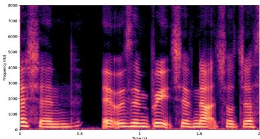  
(a) Clean spectrogram

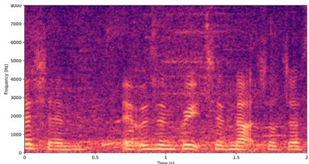  
(b) Noisy spectrogram

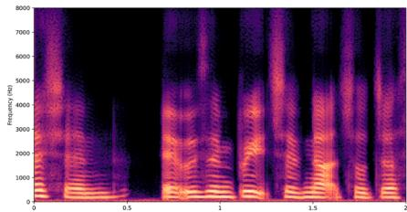  
(c) Enhanced spectrogram

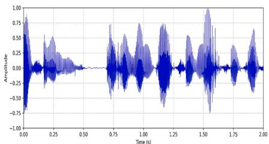  
(d) Clean waveform

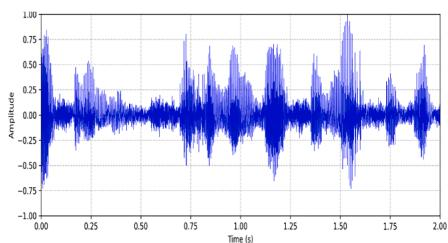  
(e) Noisy waveform

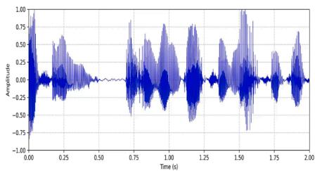  
(f) Enhanced waveform

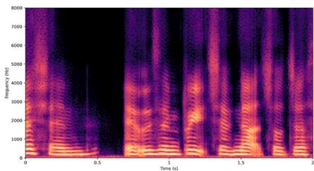  
(g) $\mathrm { w / o }$ Featuremask

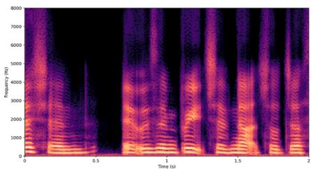  
(h) $\mathrm { w / o }$ ASPP

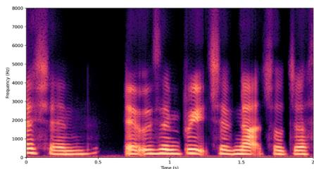  
(i) $\mathrm { w / o }$ GLA

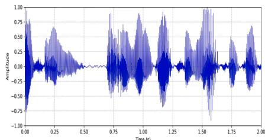  
(j) $\mathrm { w / o }$ Featuremask

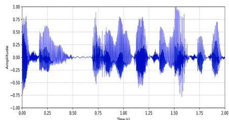  
(k) $\mathrm { w } / \mathrm { o }$ ASPP

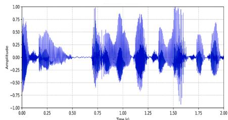  
(1) $\mathrm { w } / \mathrm { o }$ GLA  
Fig. 7. Visualization of the spectrum and waveform in ablation study on the VoiceBank+DEMAND dataset. The experimental setup is consistent with the description in Section 5.1.

Analysis of Classifier Loss under Diferent Noise Conditions on the VoiceBank+DEMAND dataset. Performance is re orted as the avera e across one s ecific noise t e for each scenario: PRESTO i d f r With V l Int rf r n whil DLIVING is used for Without Vocal Interference. The s mbol ↑ indicates that hi her values are better while indicates lower values are better.

<table><tr><td>Scenario</td><td>Model</td><td>PESQ↑</td><td>STOI↑</td></tr><tr><td rowspan="2">With Vocal Interference</td><td>Proposed</td><td>3.18</td><td>0.946</td></tr><tr><td>w/o  $\mathcal{L}_{Classifier}$ </td><td>3.02</td><td>0.940</td></tr><tr><td rowspan="2">Without Vocal Interference</td><td>Proposed</td><td>3.46</td><td>0.968</td></tr><tr><td>w/o  $\mathcal{L}_{Classifier}$ </td><td>3.39</td><td>0.965</td></tr></table>

model (Fig. 7c, f) restores clear pitch streaks and sharp spectral transitions that closely resemble the clean speech. Similarly, the time-domain waveforms reveal that the ablation variants fail to accuratel reconstruct the speech envelopes, resulting in visible noise floor interference. These visual findings provide robust evidence that each component is indis-pensable for suppressing complex noise while preserving the integrity of the target speech.

The quantitative results in Fig. 7 provide a rigorous validation of our desi n choices. For the ASPP module, we evaluated diferent confi urations and found that employing parallel dilated convolution branches with dilation rates of 2, 4, and 8, combined with lobal avera e oolin , ielded the hi hest PESQ. This architecture allows the model to ca ture multi-scale features and lon -ran e de endencies more efectivel than a single-scale receptive field. Regarding the Featuremask module, we conducted an extensive replacement study where the lightS4 was substituted with other state-of-the-art temporal modeling units. While using Mamba achieved slightly higher enhancement performance, it significantly increased both the parameter count and computational complexity. Compared to other sequence models such as S4, S5, Transformers, d GRU th li htS4 b d F t k d t t d l d tage by maintaining a much smaller memory footprint and lower MACs while outperforming them in speech quality metrics. This selection rep resents a trade-of to ensure the model remains eficient enou h for di verse real-world a lications. Furthermore we investi ated the im act of the Grifin-Lim Al orithm (GLA) for hase reconstruction. The ex er imental data shows that while the baseline performance is established with minimal iterations, the enhancement quality steadily increases as the number of iterations rows to 3. Be ond this oint the erfor mance reaches a lateau, confirmin that 3 iterations ofer the most eficient balance between phase accuracy and inference speed, justify in the inte ration of this al orithm into our ost- rocessin i eline. Crucially, Fig. 7 reveals an interesting finding regarding DSConv2D: its integration not only reduces the parameter count from 9.63M to 1.65M but also leads to a slight improvement in enhancement metrics. This suggests that by reducing redundant parameters, DSConv2D acts as a re ularizer that revents overfittin , thereb enhancin the model’s generalization and eficiency simultaneously. Finally, the Auditory In s ired S ectral Com ressor (AISC) module is demonstrated to be essen tial for o timizin the trade-of between com utational eficienc and enhancement ualit . Reco nizin that the human auditor s stem ri oritizes information within the lower frequency bands, we evaluated various spectral compression thresholds to determine the optimal cutof fre uenc . To determine the o timal cutof fre uenc we conducted a sensitivit anal sis resented in Table 3. Ex erimental results indi cate that while a 500 Hz threshold leads to a si nificant de radation in s eech ualit , reducin the PESQ score to 2.87 due to the loss of critical acoustic information a 1.5 kHz threshold ofers the most effective balance. This configuration preserves a suficient range of perceptually significant components while simultaneously mitigating the redundant com utational overhead associated with a 2 kHz threshold which increases the MACs to 0.59G without im rovin the PESQ score of 3.32. Furthermore the com lete omission of the AISC module re sults in inferior enhancement quality compared to the 1.5 kHz setting. This observation su ests that b strate icall compressin the hi h fre uenc s ectrum, the AISC module efectivel su resses redundan noise com onents that mi ht otherwise im ede the restoration rocess. In terms of com utational eficienc this desi n is instrumental in reventin a 164% increase in MACs which would otherwise escalate from 0.50G to 1.32G. Consequently, the AISC module ensures high-fidelity reconstruction by focusing resources on the most informative frequency bands.

The uantitative im act of the Classifier Loss is summarized in Table 4. The results corroborate our theoretical analysis: the inclusion of $L _ { C l a s s i f i e r }$ leads to a significant performance gain, particularly in scenarios with vocal interference, where the PESQ increases from 3.02 to 3.18. This confirms the module’s ability to leverage acoustic coherence to anchor the target voice amidst competing speakers, efectively resolving s ectral overla throu h identit -aware ener allocation. Additionall , the improvement in non-vocal noise (from 3.39 to 3.46 PESQ) validates its role as a re ularizer that enhances the model’s focus on structured human speech patterns, allowing it to suppress unstructured environ mental noise that lacks consistent vocal characteristics.

## 6.3. Robustness evaluation

The robustness of our proposed model was rigorously evaluated throu h a series of com rehensive tests across three distinct datasets: WSJ0-SI84, LibriSpeech, and VoiceBank+DEMAND. These evaluations were designed to assess the model’s stability under both seen and uni diti ll it t i d f di acoustic environments.

As detailed in Tables 5 and $^ { 6 , }$ the ro osed model demonstrates substantial and consistent improvements over the noisy baseline across all tested conditions. The erformance ains are articularl remarkable in challenging low-SNR environments, underscoring the model’s efectiveness in extremely adverse scenarios. For instance, under the demanding condition of Restaurant noise at −5 dB SNR, the PESQ score improved from a baseline of 1.35 to 3.05 (seen) and 2.94 (unseen), representing a relative improvement of over 100%.Furthermore, the results reveal outstanding generalization capability, with the performance on unseen noises remainin notabl close to that on seen conditions. A clear example is observed in the STOI scores for Babble noise at 5 dB SNR, which increased from a baseline of 77.5% to 91.4% (seen) and 89.4% (unseen). This minimal performance gap indicates that our model has learned generalized speech enhancement features rather than simply memorizing training noise patterns. Additionally, the data suggests a particular advantage in handling specific spectral characteristics; for example, at 0 dB SNR, the unseen PESQ score for Restaurant noise reached 3.15, outperforming its scores in Babble (2.69) and Street (2.81) noise at the same SNR level.

To evaluate the consistent efectiveness of our framework across different acoustic conditions, we performed extensive tests on the LibriSpeech dataset [45]. As detailed in Tables 7 and $^ { 8 , }$ the results confirm the model’s high stability and robust performance across distinct recording environments. The model delivers substantial performance gains, particularly in challenging low-SNR conditions. A striking example is observed under Babble noise at −5 dB SNR, where the STOI score dramatically improves from a baseline of 56.1% to 79.5% (seen) and 77.3% (unseen). This absolute improvement of over 20 percenta e oints demonstrates a remarkable abilit to restore s eech intelli-gibility even in extremely adverse scenarios. Furthermore, the model exhibits excellent adaptability with minimal performance degradation on unseen noise t es. For instance at 5 dB SNR the PESQ score for the unseen condition (3.08) remains highly competitive with its seen counterpart (3.16). This narrow gap, consistently observed across various noise types and SNR levels, indicates that the model architecture efectivel learns robust eneral- ur ose enhancement features rather than overfitting to specific noise profiles. Additionally, the results sug- gest a particular proficiency in handling specific spectral characteristics; the model achieves notably high scores in F16 noise conditions, where the unseen PESQ at 0 dB SNR reaches 2.82, out erformin the scores obtained in Airport (2.81) and Babble (2.78) noise at the same SNR level.

The average performance across various noise types is summarized in Figs. 8 and 9. Both figures exhibit consistent trends, indicating that the proposed model substantially outperforms the noisy baseline across ll v l t d nditi n A x t d rf rm n f r b th m tri imroves monotonicall with the increase of SNR. Notabl the erformance curves for seen and unseen conditions remain nearly parallel with a marginal gap across all SNR levels. This consistency demonstrates the model’s robust environmental adaptability and efective resistance to overfitting. Furthermore, the small variability observed across diferent noise types–particularly at higher SNRs–indicates high output stability, further underscorin the model’s robustness in handlin diverse acoustic interference. This low performance variance, evidenced by the tight error bars, combined with the clear and substantial mar in of im rovement across all conditions, provides strong evidence that our model’s superiority is statistically significant.

To further validate the model’s erformance under more diverse and realistic noise conditions, we conducted a final comprehensive evaluation usin a dense continuous distribution of noise conditions. As illustrated in Fi . 10 the model demonstrates consistent and substantial im rovements across all tested sam les. S ecificall the model achieves remarkable average gains, increasing the mean PESQ score from 1.96 to 3.30 and the mean STOI score from 0.8502 to 0.9396. Notabl , the enhancement is more pronounced for signals with poorer initial quality, as evidenced b the stee er slo e of the avera e trend curve in the lower score regions.

Collectivel , these com rehensive results, obtained from a test set with a finely spaced SNR distribution, confirm the robustness and effectiveness of our proposed architecture across a wide range of realistic noise conditions, establishing a solid foundation for the comparative anal sis a ainst state-of-the-art methods.

Table 5  
PESQ scores with three example noises on the WSJ0-SI84 Dataset. Performance is evaluated under two distinct scenarios: (i) Seen conditions, where the test noises (Babble, Street, and Restaurant) are part of the 60 noise types used during training; and (ii) Unseen conditions, where the model is evaluated on the same three noise types that were strictly excluded from the training set. The evaluation covers SNRs ranging fr m dB t dB

<table><tr><td rowspan="2">SNR</td><td colspan="5">Babble noise</td><td colspan="5">Street noise</td><td colspan="5">Restaurant noise</td></tr><tr><td>-5 dB</td><td>-2 dB</td><td>0 dB</td><td>2 dB</td><td>5 dB</td><td>-5 dB</td><td>-2 dB</td><td>0 dB</td><td>2 dB</td><td>5 dB</td><td>-5 dB</td><td>-2 dB</td><td>0 dB</td><td>2 dB</td><td>5 dB</td></tr><tr><td>Noisy</td><td>1.46</td><td>1.60</td><td>1.73</td><td>1.85</td><td>2.02</td><td>1.54</td><td>1.59</td><td>1.67</td><td>1.81</td><td>2.01</td><td>1.35</td><td>1.44</td><td>1.53</td><td>1.68</td><td>1.82</td></tr><tr><td>Enhanced (seen)</td><td>2.63</td><td>2.74</td><td>2.84</td><td>2.95</td><td>3.08</td><td>2.59</td><td>2.86</td><td>2.93</td><td>2.99</td><td>3.07</td><td>3.05</td><td>3.16</td><td>3.24</td><td>3.33</td><td>3.43</td></tr><tr><td>Enhanced (unseen)</td><td>2.45</td><td>2.58</td><td>2.69</td><td>2.82</td><td>2.97</td><td>2.45</td><td>2.73</td><td>2.81</td><td>2.89</td><td>2.98</td><td>2.94</td><td>3.06</td><td>3.15</td><td>3.24</td><td>3.35</td></tr></table>

Table 6

STOI (%) scores with three example noises on the WSJ0-SI84 Dataset. Performance is evaluated under two distinct scenarios: (i) Seen conditions, where the test noises (Babble, Street, and Restaurant) are part of the 60 noise types used during training; and (ii) Unseen conditions, where the model is evaluated on the same three noise t pes that were strictl excluded from the trainin set. The evaluation covers SNRs ranging from −5 dB to 5 dB..

<table><tr><td rowspan="2">SNR</td><td colspan="5">Babble noise</td><td colspan="5">Street noise</td><td colspan="5">Restaurant noise</td></tr><tr><td>-5 dB</td><td>-2 dB</td><td>0 dB</td><td>2 dB</td><td>5 dB</td><td>-5 dB</td><td>-2 dB</td><td>0 dB</td><td>2 dB</td><td>5 dB</td><td>-5 dB</td><td>-2 dB</td><td>0 dB</td><td>2 dB</td><td>5 dB</td></tr><tr><td>Noisy</td><td>54.4</td><td>61.5</td><td>66.0</td><td>70.9</td><td>77.5</td><td>57.2</td><td>64.7</td><td>69.2</td><td>73.9</td><td>80.8</td><td>53.8</td><td>60.6</td><td>65.4</td><td>69.5</td><td>75.2</td></tr><tr><td>Enhanced (seen)</td><td>74.3</td><td>83.5</td><td>85.1</td><td>88.0</td><td>91.4</td><td>80.1</td><td>85.7</td><td>88.2</td><td>90.6</td><td>91.4</td><td>80.7</td><td>86.2</td><td>88.9</td><td>91.3</td><td>92.8</td></tr><tr><td>Enhanced (unseen)</td><td>71.5</td><td>81.8</td><td>82.6</td><td>85.7</td><td>89.4</td><td>77.6</td><td>83.4</td><td>86.2</td><td>88.9</td><td>89.9</td><td>78.9</td><td>85.5</td><td>87.4</td><td>90.0</td><td>91.7</td></tr></table>

Table 7

PES ith th l i th Lib iS h D t t P f i l t d d t di ti t i (i) S diti where the test noises (Airport, Babble, and F16) are part of the 15 noise types used during training; and (ii) Unseen conditions, where the model is evaluated on the same three noise t pes that were strictl excluded from the trainin set. The evaluation covers SNRs ran in from −5 dB to 5 dB..

<table><tr><td rowspan="2">SNR</td><td colspan="5">Airport noise</td><td colspan="5">Babble noise</td><td colspan="5">F16 noise</td></tr><tr><td>-5 dB</td><td>-2 dB</td><td>0 dB</td><td>2 dB</td><td>5 dB</td><td>-5 dB</td><td>-2 dB</td><td>0 dB</td><td>2 dB</td><td>5 dB</td><td>-5 dB</td><td>-2 dB</td><td>0 dB</td><td>2 dB</td><td>5 dB</td></tr><tr><td>Noisy</td><td>1.52</td><td>1.65</td><td>1.77</td><td>1.89</td><td>2.01</td><td>1.60</td><td>1.77</td><td>1.94</td><td>2.11</td><td>2.27</td><td>1.87</td><td>1.98</td><td>2.09</td><td>2.22</td><td>2.35</td></tr><tr><td>Enhanced (seen)</td><td>2.55</td><td>2.74</td><td>2.93</td><td>3.05</td><td>3.16</td><td>2.53</td><td>2.71</td><td>2.91</td><td>3.03</td><td>3.14</td><td>2.63</td><td>2.80</td><td>2.94</td><td>3.08</td><td>3.19</td></tr><tr><td>Enhanced (unseen)</td><td>2.41</td><td>2.61</td><td>2.81</td><td>2.95</td><td>3.08</td><td>2.37</td><td>2.56</td><td>2.78</td><td>2.91</td><td>3.04</td><td>2.50</td><td>2.68</td><td>2.82</td><td>2.99</td><td>3.12</td></tr></table>

STOI (%) scores with three example noises on the LibriSpeech Dataset. Performance is evaluated under two distinct scenarios: (i) Seen conditions, where the test noises (Air ort, Babble, and F16) are art of the 15 noise t es used durin trainin ; and (ii) Unseen conditions, where the model is evaluated on the same three noise t pes that were strictl excluded from the trainin set. The evaluation covers SNRs ranging from −5 dB to 5 dB..

<table><tr><td rowspan="2">SNR</td><td colspan="5">Airport noise</td><td colspan="5">Babble noise</td><td colspan="5">F16 noise</td></tr><tr><td>-5 dB</td><td>-2 dB</td><td>0 dB</td><td>2 dB</td><td>5 dB</td><td>-5 dB</td><td>-2 dB</td><td>0 dB</td><td>2 dB</td><td>5 dB</td><td>-5 dB</td><td>-2 dB</td><td>0 dB</td><td>2 dB</td><td>5 dB</td></tr><tr><td>Noisy</td><td>58.8</td><td>62.8</td><td>65.4</td><td>69.7</td><td>77.1</td><td>56.1</td><td>61.9</td><td>67.7</td><td>72.8</td><td>78.0</td><td>56.7</td><td>62.2</td><td>67.6</td><td>72.7</td><td>77.8</td></tr><tr><td>Enhanced (seen)</td><td>78.0</td><td>84.2</td><td>88.6</td><td>90.3</td><td>94.1</td><td>79.5</td><td>82.9</td><td>86.1</td><td>89.6</td><td>92.3</td><td>77.1</td><td>81.5</td><td>86.2</td><td>89.7</td><td>92.3</td></tr><tr><td>Enhanced (unseen)</td><td>75.5</td><td>81.9</td><td>86.6</td><td>88.6</td><td>90.7</td><td>77.3</td><td>80.9</td><td>84.3</td><td>88.0</td><td>90.9</td><td>74.1</td><td>78.7</td><td>83.7</td><td>87.4</td><td>90.3</td></tr></table>

## 6.4. Subjective evaluation in real-world scenarios

To bridge the gap between objective metrics and human auditory perception, we conducted a subjective evaluation using the ICASSP SSI Challenge Dataset. This dataset comprises real-world recordings cap- turing diverse acoustic environments and degradation types. Instead of labor-intensive human listening tests, we employed SigMOS, which is a robust dee learnin -based rox for the ITU-T P.804 standard to redict Mean Opinion Scores across multiple dimensions, including specific degradations like reverberation (REVERB.) and background noise (BAK).

The com arative results resented in Table 9 demonstrate that our proposed lightweight framework achieves the highest OVERALL score of 0.657 and an OVRL score of 3.424. This erformance out erforms state-of-the-art baselines(STOA) includin Dee FilterNet3 [14] with an OVRL score of 3.351 and an OVERALL score of 0.632 and SSI-Net which scored 3.231 and 0.608 [58]. This metric averages the Overall Speech Qualit and Si nal Qualit , indicatin that our model delivers the most balanced and leasin listenin ex erience in com lex real-world scenarios. S ecificall , the model excels in si nal reservation, achievin a SIG score of 3.775, which is the highest among all compared methods. This su eriorit is further reflected in the detailed distortion metrics where the model achieves a Coloration score of 3.618, suggesting it preserves the original timbre and spectral characteristics of the speaker better than com etitors like SSI-Net [58]. Additionall the Discontinuity (DISC) score of 4.323 provides strong evidence of the efectiveness of the Grifin-Lim Al orithm (GLA) in hase reconstruction. Unlike modern complex-domain decoders that require significant computational overhead, our approach leverages the iterative consistency of GLA to ensure temporal smoothness. This high DISC score confirms that our model effectivel minimizes hase-induced artifacts and musical noise, achieving a level of signal continuity that is often challenging for lightweight frameworks.

It should be noted that while our model achieves su erior si nal fidelit it exhibits a sli htl lower score in the Back round Noise com onent of 3.913 compared to aggressive suppressors such as SSI-Net [58], which reached 4.577 and Dee FilterNet3 [14] at 4.261. This observation ali ns with the objective results discussed earlier and hi hli hts a

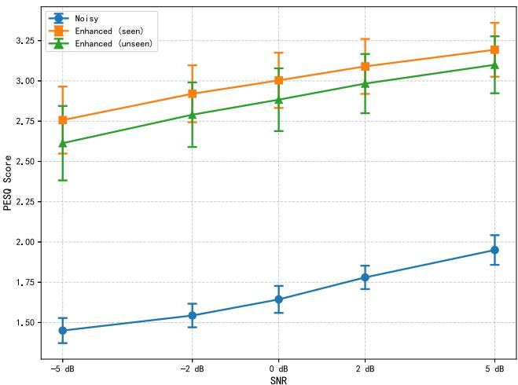  
(a) WSJO-SI84 PESQ

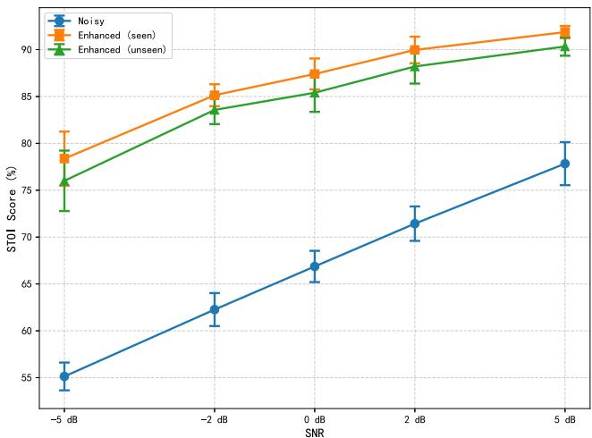  
(b) WSJO-SI84 STOI

Fig. 8. Comparison in Seen and Unseen Noise Environment on the WSJ0-SI84 Dataset. Performance is reported for both seen and unseen noise conditions. The colors represent diferent experimental groups: green denotes the proposed model under seen conditions, orange denotes the proposed model under unseen conditions, and blue represents the noisy baseline. The error bars indicate the standard deviation (�) of the evaluation metrics across various noise types at each SNR level, quantifying the output stability and dispersion under identical acoustic conditions.  
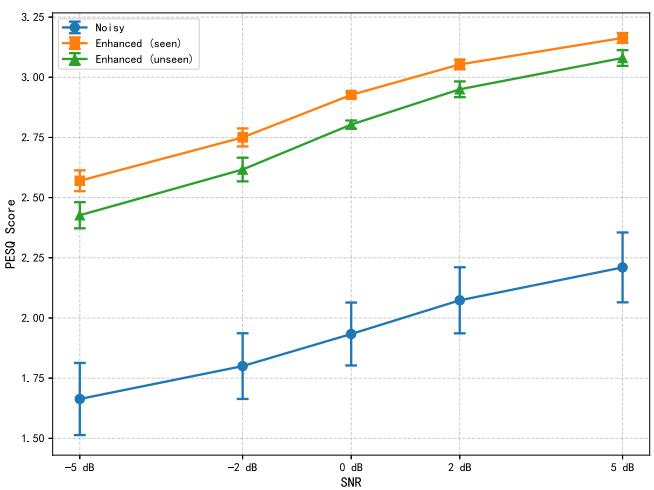  
(a) LibriSpeech PESQ

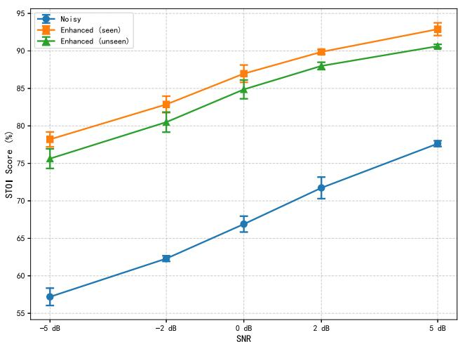  
(b) LibriSpeech STOI  
Fig. 9. Comparison in Seen and Unseen Noise Environment on the LibriSpeech Dataset. Performance is reported for both seen and unseen noise conditions. The colors represent diferent experimental groups: green denotes the proposed model under seen conditions, orange denotes the proposed model under unseen conditions, and blue re resents the nois baseline. The error bars indicate the standard deviation (�) of the evaluation metrics across various noise t es at each SNR level, quantifying the output stability and dispersion under identical acoustic conditions.

## Table 9

Comparison of SigMOS on SSI Test Set using diferent speech enhancement models. The experimental setup is consistent with the descri tion in Section 5.1. OVERALL. re resents the avera e of normalized OVRL and normalized SIG oferin a more intuitive ortra al of the model’s enhancement efects on s eech si na and overall ualit . The s mbol “↑” indicates that hi her values are better, while “↓” indicates lower values are better.

<table><tr><td rowspan="2">Method</td><td>OVERALL.↑</td><td>OVRL↑</td><td>SIG↑</td><td>BAK↑</td><td>COL.↑</td><td>DISC.↑</td><td>REVERB.↑</td><td>LOUD.↑</td></tr><tr><td>MOS</td><td>MOS</td><td>MOS</td><td>MOS</td><td>MOS</td><td>MOS</td><td>MOS</td><td>MOS</td></tr><tr><td>Noisy</td><td>0.411</td><td>2.361</td><td>2.927</td><td>3.219</td><td>2.728</td><td>3.733</td><td>3.652</td><td>2.903</td></tr><tr><td>FullSubNet [3]</td><td>0.482</td><td>2.729</td><td>3.130</td><td>3.901</td><td>3.286</td><td>3.919</td><td>4.032</td><td>3.398</td></tr><tr><td>DeepFilterNet3 [14]</td><td>0.632</td><td>3.351</td><td>3.706</td><td>4.261</td><td>3.644</td><td>4.267</td><td>4.238</td><td>4.185</td></tr><tr><td>SSI-Net [58]</td><td>0.608</td><td>3.231</td><td>3.635</td><td>4.577</td><td>3.550</td><td>4.140</td><td>4.322</td><td>4.060</td></tr><tr><td>aTENNuate [64]</td><td>0.553</td><td>3.027</td><td>3.400</td><td>3.899</td><td>3.485</td><td>3.975</td><td>4.136</td><td>3.764</td></tr><tr><td>Proposed</td><td>0.657</td><td>3.424</td><td>3.775</td><td>3.913</td><td>3.618</td><td>4.323</td><td>4.336</td><td>4.188</td></tr></table>

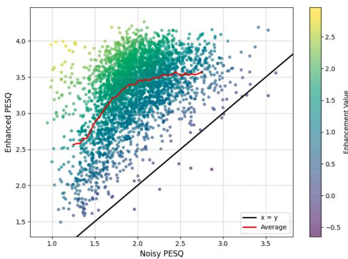  
(a) PESQ enhancement

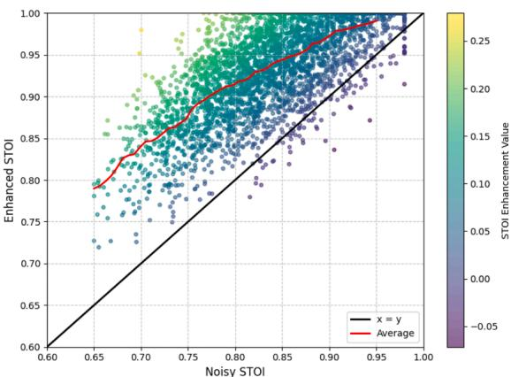  
(b) STOI enhancement  
Fig. 10. Visualization Results for Robustness Validation. Scatter plots of PESQ and STOI performance are evaluated on a synthesized test set, where noise from the DEMAND database is manuall added to the clean VoiceBank test set at various levels. The evaluation covers a dense ran e of SNRs from 2.5 dB to 17.5 dB in 0.1 dB increments. The black dashed line represents the identity line (� = �), while the red curve indicates the average enhancement trend. The color bar denotes the ma nitude of im rovement with warmer colors indicatin reater ains. The ronounced u ward shift relative to the identit line es eciall at lower initial scores demonstrates the model’s consistent efectiveness in challenging acoustic environments.

deliberate design trade-of where our framework prioritizes the preservation of speech naturalness and fine-grained details over the aggressive removal of background noise which often introduces speech distortion. Des ite this the Reverb and Loudness scores remain hi hl com etitive confirming that the model efectively handles reverberant environments and maintains consistent energy levels. In summary, the SigMOS evaluation confirms that our proposed method not only excels in standard objective metrics but also generates perceptually superior speech in realworld applications, ofering an optimal balance between noise reduction and speech fidelity.

## 7. Conclusion

This study presents a novel lightweight speech enhancement framework that synergizes the State-Space Model with depthwise separable convolutions. We design the Atrous Spatial Pyramid Pooling (ASPP) to capture multi-scale contextual features. Furthermore, we include advanced strategies, such as the Auditory Inspired Spectral Compressor (AISC) and the Grifin-Lim Algorithm (GLA), to balance computational eficiency with high-quality speech recovery. Additionally, a Classifier loss is proposed to address the challenge of recovering speech in noise with human-voice interference.

Our model with onl 1.65 million arameters and 0.50 G MACs demonstrates su eriorit over several stron baseline methods in comrehensive evaluations on standard datasets includin FullSubNet [3] DeepFilterNet [56], and SSI-Net [58]. On the VoiceBank+DEMAND dataset, the model achieves outstanding perceptual quality and intelligibilit ith PES f 3 32 d STOI f 0 96 Si il l th WSJ0 SI84 dataset, it outperforms baseline methods such as FullSubNet [3] and CTSNet [60], achieving a PESQ of 3.01 and a STOI of 0.87. Moreover, robustness evaluations on the VoiceBank+DEMAND WSJ0-SI84 and LibriS eech Datasets demonstrated the model’s efective eneralization and anti-interference abilities a ainst unseen noise.

However, a minor limitation is observed in the marginally lower CBAK and BAK metric, suggesting a potential trade-of: a strong focus on speech quality may constrain background noise suppression.

Lookin ahead to the future the develo ment trend of li htwei ht speech enhancement technology will focus on the following aspects: 1) end-to-end o timization: further ex loration of li htwei ht models directly from waveform to waveform, avoiding information loss and com lexit of intermediate re resentations such as STFT; 2) Cross modal learning: using multimodal information such as visual or textual data to assist speech enhancement under extremely low signal-to-noise ratio conditions; 3) Adaptive and Personalized: Enable lightweight models to dynamically adapt to diferent users, devices, and acoustic environments. However these trends are also accom anied b challen es including how to maintain model performance at extremely low computational budgets, how to overcome the inherent trade-of between speech preservation and background noise suppression to improve CBAK and BAK metrics without compromising quality, and how to ensure model generalization ability in unseen environments.

In summar this research rovides an eficient and ractical solution for lightweight speech enhancement, successfully balancing performance with computational eficiency, and holds considerable theoretical and ractical value.

## Funding

This research did not receive any specific grant from funding agencies in the ublic, commercial, or not-for- rofit sectors.

## CRediT authorship contribution statement

Chen Jiang: Writing – original draft, Methodology, Investigation, Resources; Dai Gao: Writing – original draft, Conceptualization, Methodology, Validation; Sirui Wang: Writing – review & editing, Visualization, Project administration; Chengxuan Zou: Writing – original draft, Visualization; Jie Liu: Project administration.

## Data availability

Data will be made available on request.

## Declaration of interests

The authors declare that the have no known com etin financial interests or personal relationships that could have influenced the work reported in this paper.

## Acknowledgements

The author wishes to ex ress sincere ratitude to the ioneers in speech coding. We stand on the shoulders of giants; their remarkable achievements have not onl advanced the field but also served as a continuin ins iration.

## References

[1] J. Benest S. Makino J. Chen S eech enhancement S rin er Science & Business Media 2006.

[2] S. Boll, Suppression of acoustic noise in speech using spectral subtraction, IEEE Trans. Acoust. 27 (2) (2003) 113–120.

[3] X. Hao X. Su R. Horaud X. Li Fullsubnet: a full-band and sub-band fusion model for real-time sin le-channel s eech enhancement in: ICASSP 2021-2021 IEEE International Conference on Acoustics S eech and Si nal Processin (ICASSP) IEEE 2021 . 6633–6637.

[4] R. Chao W.-H. Chen M. La Quatra S.M. Siniscalchi C.-H.H. Yan S.-W. Fu Y. Tsao, An investi ation of incor oratin mamba for s eech enhancement, in: 2024 IEEE Spoken Language Technology Workshop (SLT), IEEE, 2024, pp. 302–308.

[5] A. Pandey, D. Wang, On cross-corpus generalization of deep learning based speec enhancement, IEEE/ACM Trans. Audio S eech Lan . Process. 28 (2020) 2489–2499.

[6] N. Saleem, T.S. Gunawan, S. Dhahbi, S. Bourouis, Time domain s eech enhancement with CNN and time-attention transformer, Di it Si nal Process. 147 (2024) 104408.

[7] D. Takeuchi, K. Yatabe, Y. Koizumi, Y. Oikawa, N. Harada, Real-time speech enhancement using equilibriated RNN, in: ICASSP 2020-2020 IEEE International Conference on Acoustics, S eech and Si nal Processin (ICASSP), IEEE, 2020, . 851–855.

[8] F. Wenin er, H. Erdo an, S. Watanabe, E. Vincent, J. Le Roux, J.R. Hershe , B. Schuller S eech enhancement with LSTM recurrent neural networks and its a li cation to noise-robust ASR in: International Conference on Latent Variable Anal sis and Signal Separation, Springer, 2015, pp. 91–99.

[9] K. Wang, B. He, W.-P. Zhu, TSTNN: Two-stage transformer based neural network for speech enhancement in the time domain, in: ICASSP 2021-2021 IEEE International Conference on Acoustics, Speech and Signal Processing (ICASSP), IEEE, 2021, pp. 7098–7102.

[10] J. Lee, H.-G. Kang, Real-time neural speech enhancement based on temporal refinement network and channel-wise gating methods, Digit Signal Process. 133 (2023) 103879.

[11] Z. Xiao H. Xin R. Qu H. Li H. Ton S. Luo J. Son L. Fen Q. Wan Knowled e aggregation transformer network for multivariate time series classification, IEEE Trans. Bi Data 11 (2025) 3413–3429.

[12] A. Sullivan, X. Lu, ASPP: a new family of oncogenes and tumour suppressor genes, BrJ.Cancer 96 (2) (2007).196–200

[13] Z. Xiao, Q. Wan, H. Tong, H. Xing, Attentional knowledge-based state-space model for electrocardio ram si nal classification IEEE Trans. Instrum. Meas. 74 (2025) 1 1 h d i 1 11 2 2 2

[14] H. Schröter, T. Rosenkranz, A.N. Escalante-B, A. Maier, Deepfilternet: perceptually motivated real-time speech enhancement, arXiv:2305.08227 (2023).

[15] F.E. Wahab, Z. Ye, N. Saleem, R. Ullah, Compact deep neural networks for real- time s eech enhancement on resource-limited devices S eech Commun. 156 (2024) 103008.

[16] Z.-Q. Wan , S. Cornell, S. Choi, Y. Lee, B.-Y. Kim, S. Watanabe, TF-GridNet: intei f ll d b b d d li f h i IEEE ACM T A di S h L P 31 2023 3221 3236

[17] G. Yu, R. Han, C. Xu, H. Zhao, N. Li, C. Zhan , X. Zhen , C. Zhou, Q. Huan , B. Y KS N M l i b d i h i d h k f 2024 ICASSP SSI challenge, in: 2024 IEEE International Conference on Acoustics, Speech and Si nal Processin Worksho s (ICASSPW), IEEE, 2024, . 33–34.

[18] M. Beck, K. Pöppel, M. Spanring, A. Auer, O. Prudnikova, M. Kopp, G. Klambauer, J. B d S H h i Xl d d l h Ad N l Inf. Process. S st. 37 (2024) 107547–107603.

[19] Z. Zhan , S. Xu, X. Zhuan , Y. Qian, L. Zhou, M. Wan , Half-temporal and halffrequency attention u 2 net for speech signal improvement, in: ICASSP 2023-2023 IEEE International Conference on Acoustics, Speech and Signal Processing (ICASSP), IEEE, 2023, . 1–2.

20 G Y A Li H W Y W Y K C Zh DBT N D l b h f d i m nit d nd h tim ti n with tt nti n-in- tt nti n tr n f rm r f r m n - ral s eech enhancement IEEE/ACM Trans. Audio S eech Lan . Process. 30 (2022) 2629–2644.

[21] F. Dan H. Chen P. Zhan DPT-FSNet: Dual- ath transformer based full-band and sub-band fusion network for s eech enhancement in: ICASSP 2022-2022 IEEE International Conference on Acoustics S eech and Si nal Processin (ICASSP) IEEE 2022 . 6857–6861.

[22] A. Gu K. Goel C. Ré Eficientl modelin lon se uences with structured state spaces, arXiv:2111.00396 (2021).

[23] P.-J. Ku C.-H.H. Yan S.M. Siniscalchi C.-H. Lee A multi-dimensional dee struc tured state s ace a roach to s eech enhancement usin small-foot rint models arXiv:2306.00331 (2023).

[24] Y. Du X. Liu Y. Chua S ikin structured state s ace model for monaural s eech h i ICASSP 2024 2024 IEEE I i l C f A i S eech and Si nal Processin (ICASSP) IEEE 2024 . 766–770.

[25] L. Sun S. Yuan A. Gon L. Ye E.S. Chn Dual-branch modelin based on statespace model for speech enhancement, IEEE/ACM Trans. Audio Speech Lang. Process. 32 2024 1457 1467

[26] Y.R. Pei R. Shrivastava F. Sidharth O timized real-time s eech enhancement with d di i P I h 202 1

[27] C. Zhao S. He X. Zhan Sicrn: advancin s eech enhancement throu h state s ace model and in lace convolution techni ues in: ICASSP 2024-2024 IEEE International Conference on Acoustics S eech and Si nal Processin (ICASSP) IEEE 2024 . 10506 10510

28 R D N h M K l M S i T k l d di ill i f i h h i ICASSP 2024 2024 IEEE I i l C

ference on Acoustics, Speech and Signal Processing (ICASSP), IEEE, 2024, . 10141–10145.

[29] X. Yuan, S. Liu, H. Chen, L. Zhou, J. Li, J. Hu, D namic fre uenc -ada tive knowled e distillation for s eech enhancement, in: ICASSP 2025-2025 IEEE Internati n l C nf r n n A ti S h nd Si n l Pr in (ICASSP) IEEE 2025 pp. 1–5.

[30] S.-W. Fu, K.-H. Hung, Y. Tsao, Y.-C.F. Wang, Self-supervised speech quality estimation and enhancement usin onl clean s eech arXiv:2402.16321 (2024).

[31] S. Abdullah, M. Zamani, A. Demosthenous, Hardware eficient speech enhancement with noise aware multi-target deep learning, IEEE Open J. Circuits Syst. 5 (2024) 141–152

[32] R. Miccini, C. Laroche, T. Piechowiak, L. Pezzarossa, Scalable speech enhancement with dynamic channel pruning, in: ICASSP 2025-2025 IEEE International Conference on Acoustics, Speech and Signal Processing (ICASSP), IEEE, 2025, pp. 1–5.

[33] E. Cohen H.V. Habi A. Netzer Towards full uantized neural networks for s eech enhancement in: Proc. Inters eech 2023 2023 . 181–185.

[34] L. Yan W. Liu R. Men G. Lee S. Baek H.-G. Moon FSPEN: an ultra-li htwei ht network for real time s eech enahncment in: ICASSP 2024-2024 IEEE International Conference on Acoustics, Speech and Signal Processing (ICASSP), IEEE, 2024, pp. 10671–10675.

[35] B. Wen, T.-P. Tan, EfiFusion-GAN: eficient fusion generative adversarial network for s eech enhancement arXiv:2508.14525 (2025).

[36] X. Rong, D. Wang, Y. Hu, C. Zhu, K. Chen, J. Lu, UL-UNAS: ultra-lightweight U-nets for real-time s eech enhancement via network architecture search arXiv:2503.00340 (2025).

[37] D.W. Grifin Si nal estimation from modified short-time Fourier transfrom IEEE ASSP 32 (1984) 2.

[38] Y. Zhan , G. Wei, J. Fan , C. Li, S. Li, MSLD-SENet: time–fre uenc multi-Dconv h l h fl d i i h li h i h dil d d f l h enhancement, Di it Si nal Process. 168 (2025) 105502.

[39] H. Zhan , H. Huan , P. Zhao, X. Zhu, Z. Yu, CENN: Ca sule-enhanced neural network with innovative metrics for robust speech emotion recognition Knowl, Based S st. 304 (2024) 112499.

[40] H. Zhang, P. Zhao, G. Tang, Z. Li, Z. Yuan, Reproducible and generalizable speech emotion recognition via an intelligent fusion network, Biomed. Signal Process. Conl 109 2025 107996

[41] H. Din , Y. Wan , H. Li, C. Zhao, G. Wan , W. Xi, J. Zhao, UltraS eech: s eech enhancement b interaction between ultrasound and s eech, Proc. ACM on Interact. Mobile, Wearable Ubiquitous Technol. 6 (3) (2022) 1–25.

[42] C. Veaux, J. Yamagishi, S. King, The voice bank corpus: design, collection and data analysis of a large regional accent speech database, in: 2013 International C f O i t l COCOSDA H ld J i tl ith 2013 C f A i Spoken Language Research and Evaluation (O-COCOSDA/CASLRE), IEEE, 2013, . 1–4.

[43] J. Thiemann N. Ito E. Vincent The Diverse Environments Multi-channel Acoustic Noise Database (DFMAND): a database of multichannel environmental noise recordin s in: Proceedin s of Meetin s on Acoustics ICA2013 19 (2013) 035081.

[44] C. Corpus, The design for the wall street journal-based, in: Speech and Natural Lan-guage: Proceedings of a Workshop Held at Harriman, New York, February 23–26, 1992, Morgan Kaufmann Publishers, 1992, p. 357.

[45] V. Panayotov, G. Chen, D. Povey, S. Khudanpur, Librispeech: an asr corpus based on ublic domain audio books in: 2015 IEEE International Conference on Acoustics S eech and Si nal Processin (ICASSP) IEEE 2015 . 5206–5210.

[46] R. Cutler A. Saabas B. Naderi N.-C. Ristea S. Braun S. Branets ICASSP 2023 S eech si nal im rovement challen e IEEE O en J. Si nal Process. 5 (2024) 662–674.

[47] N.-C. Ristea B. Naderi A. Saabas R. Cutler S. Braun S. Branets ICASSP 2024 S eech si nal im rovement challen e IEEE O en J. Si nal Process. 6 (2025) 238–246.

[48] A.W. Rix J.G. Beerends M.P. Hollier A.P. Hekstra Perce tual evaluation of s eech ualit (PESQ)-a new method for s eech ualit assessment of tele hone networks and codecs, in: 2001 IEEE International Conference on Acoustics, S eech, and Si nal Processin . Proceedin s (Cat. No. 01CH37221) 2 IEEE 2001 . 749–752.

[49] C.H. Taal R.C. Hendriks R. Heusdens J. Jensen An al orithm for intelli ibilit rediction of time–fre uenc wei hted nois s eech IEEE Trans. Audio S eech Lan . P 19 7 2011 2125 2136

[50] Y. Hu, P.C. Loizou, Evaluation of objective ualit measures for s eech enhancet IEEE T A di S h L P 16 (1) (2007) 229 238

[51] B. Naderi, R. Cutler, N.-C. Ristea, Multi-dimensional speech quality assessment in crowdsourcin , in: ICASSP 2024-2024 IEEE International Conference on Acoustics, S h nd Si n l Pr in (ICASSP) IEEE 2024 696–700

[52] M. Li Y. Liu L. Zhou DeConformer-SENet: an eficient deformable conformer speech enhancement network, Digit Signal Process. 156 (2025) 104787.

[53] K N H T N C hit t k l d di till ti f h hancement: from CMGAN to unet Neurocom utin 649 (2025) 130798.

[54] N. Saleem, S. Bourouis, H. Elmannai, A.D. Algarni, DPHT-ANet: Dual-path high- order transformer-style fully attentional network for monaural speech enhancement, A l. Acoustics 224 (2024) 110131.

[55] N. Saleem S. Bourouis MFFR-Net: multi-scale feature fusion and attentive recalibration network for dee neural s eech enhancement Di it Si nal Process. 156 (2025) 104870

[56] H. Schroter A.N. Escalante-B T. Rosenkranz A. Maier Dee FilterNet: a low com-plexity speech enhancement framework for full-band audio based on deep filtering, in: ICASSP 2022-2022 IEEE International Conference on Acoustics S eech and Si - nal Processin (ICASSP) IEEE 2022 . 7407–7411.

[57] H. Schröter, A. Maier, A.N. Escalante-B, T. Rosenkranz, Deepfilternet2: towards realtime s eech enhancement on embedded devices for full-band audio, in: 2022 Inter national Worksho on Acoustic Si nal Enhancement (IWAENC), IEEE, 2022, . 1–5.

[58] W. Zhu, Z. Wang, J. Lin, C. Zeng, T. Yu, SSI-Net: a multi-stage speech signal improvement system for icassp 2023 ssi challenge, in: ICASSP 2023-2023 IEEE International Conference on Acoustics, Speech and Signal Processing (ICASSP), IEEE, 2023, pp. 1–2.

[59] N. Saleem, S. Bourouis, H. Elmannai, A.D. Algarni, CTSE-Net: Resource-eficient con volutional and TF-transformer network for s eech enhancement Knowl. Based S st 317(2025).113452

[60] A. Li, W. Liu, C. Zheng, C. Fan, X. Li, Two heads are better than one: a two-stage complex spectral mapping approach for monaural speech enhancement, IEEE/ACM Trans. Audio S eech Lan . Process. 29 (2021) 1829–1843.

[61] A. Li, C. Zheng, L. Zhang, X. Li, Glance and gaze: a collaborative learning framework for single-channel speech enhancement, Appl. Acoustics 187 (2022) 108499.

[62] A. Li, C. Zheng, Z. Zhang, X. Li, MDNet: learning monaural speech enhancement from dee rior radient, arXiv:2203.07179 (2022).

[63] C. Fan E. Liu A. Li J. Tao J. Zhou J. Li C. Zhen Z. Lv BSDB-Net: band-s lit dual-branch network with selective state spaces mechanism for monaural speech enhancement in: Proceedin s of the AAAI Conference on Artificial Intelli ence 39 2025, pp. 23850–23858.

[64] Y.R. Pei, R. Shrivastava, F. Sidharth, Raw speech enhancement with deep state space modelin arXiv e- rints: arXiv–2409 (2024)