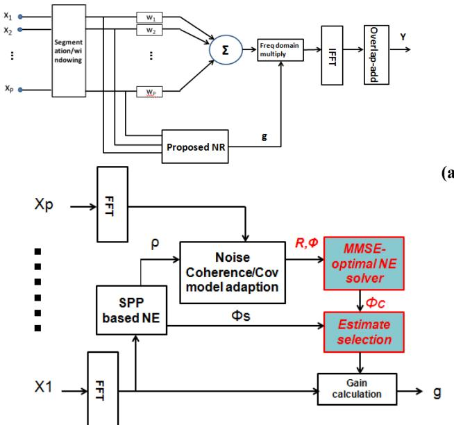
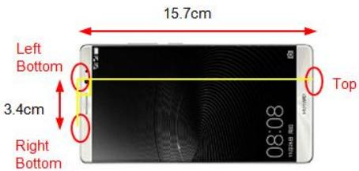
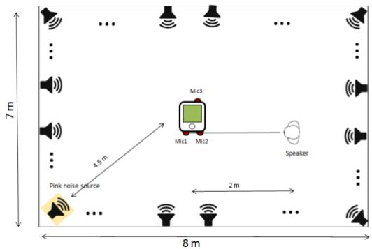

# MULTI-CHANNEL NOISE REDUCTION FOR HANDS-FREE VOICE COMMUNICATIONON MOBILE PHONES

Wenyu Jin, Mohammad J. Taghizadeh, Kainan Chen, Wei Xiao

Huawei European Research Center, Munich, Germany

## ABSTRACT

Noise reduction technologies have been applied to enhance the intelligibility of voice communications. However, existing methods are vulnerable to complex non-stationary noisy conditions, which are commonly encountered in real world hands-free scenarios. Additionally, the existing methods do not fully take the advantage of the deployment of multi-channel microphone arrays on the burgeoning high-end mobile phones. In this paper, we propose a noise estimation method based on a hybrid of efficient single channel and globally optimized multichannel microphone noise estimation using adaptive noise coherence models. Evaluation results on real-world recordings collected via a smartphone confirm its superior effectiveness to suppress the fast-varying noises compared to the state-of-the-art baseline methods.

Index Terms— Multi-channel noise reduction, Nonstationary noise , Adaptive noise variance estimation

## 1. INTRODUCTION

Microphone array processing has been recognized as an effective tool to alleviate adverse noise, interference and reverberation in various applications, including robust speech recognition, teleconferencing and etc [1,2]. Multi-channel processing is particularly more essential to enable hands-free voice communication, where the signal-to-noise ratio (SNR) is often much lower, and the noise variations are more complex compared to the hand-held scenarios.

One key part of a noise reduction (NR) algorithm is the reliable estimate of noise power spectral density (PSD). The majority of existing NR methods is optimized for near-end speech enhancement and deploys only one microphone [3-7]. However, the performance of single channel algorithms is not satisfactory in complex noisy environments. The employment of more than one microphone facilitates a better differentiation between the desired speech signal and the complex background noise, which further leads to more effective non-stationary noise suppression [8].

Promising NR performance has been obtained exploiting the power level difference using two microphones [9-11]. However, the developed algorithms can only operate in handheld scenarios that feature a high power level difference between the primary and secondary microphones. The goal of the present work is to improve multi-channel non-stationary noise estimation (NE) and NR for high-quality distant speech acquisition. Prior works along this line consider distortion-less spatial filtering, also referred to as beamforming, followed by post-filtering to obtain the optimal estimation of the distant talking speech in mean square sense. Zelinski [12] and

McCowan [13] explored the possibility of noise estimation using multiple microphones assuming a prior knowledge on the noise coherence model. These assumptions include either the spatially white (incoherent) [12] or fully diffuse coherence model [13]. Hence, they cannot deal with time-varying noise properties. Moreover, the methods are shown to be inefficient at low frequencies as the coherence of speech and noise are high, thus noise PSD estimation is inaccurate, especially for close microphone distances [14].

To address these drawbacks, Nelke et al. proposed a noise estimation method that features a combination of a singlechannel and multiple-channel microphone noise estimation [8]. More specifically, at low frequencies, the noise PSD is estimated using the speech presence probability (SPP) based method of [7] using the single channel primary microphone. At higher frequencies, noise estimation is based on a multi-channel adaptive coherence model that requires adaption for both speech and noise coherence model. The final noise estimate is integration of the estimates at low and high frequencies based on a fixed frequency threshold. However, this integration method is not optimal as the coherence models for speech and noise can be inevitably entangled at complex low SNR scenarios and the static split frequency is prone to be vulnerable to separate the effective frequency ranges. Naturally, it also leads to high complexity for real-time implementation due to the double adaptive coherence function derivations.

Importantly, the above-mentioned methods [8, 12-14] only use the average of pairwise microphones noise estimates, which does not lead to mathematically optimal solution for the multimicrophone case. In [15], the authors present a post-filtering algorithm that formulates a least-squares solution over all microphones to globally estimate white, diffuse and point source noises. However, the method still deploys the ideal diffuse noise coherence function and requires accurate localizations of both speech and interference sources, which are difficult to realize in practice.

In this work, we use the inspiration from [8] and [15] to propose an adaptive estimation method for efficient noise reduction, especially under non-stationary noise conditions. The proposed formulation aims at finding a more effective combination of a single and multiple microphone noise estimation method by adaptively varying the split-frequency between high and low frequency ranges. Additionally, the system also optimizes the noise variances to the closest solution in MMSE sense for multi-channel microphone setup. The estimation model adapts to diffuse noise and white noise with fast variations. The results on real-world implementations using practical mobile phones verify that the proposed method outperforms the existing algorithms in various practical nonstationary noisy scenarios.

(a)

## 2. SYSTEM OVERVIEW

The microphone signal $X _ { p } ( \mathfrak { t } )$ captured at pth microphone is given by a superposition of the speech signal $S _ { p } ( \mathrm { t } )$ and the noise signal $\Nu _ { p } \left( \mathrm { t } \right)$ . While the noise signals are assumed to be homogeneous and diffuse, the speech signals $S _ { p } ( \mathrm { t } )$ are versions of the original speech signal S(t) filtered with the impulse responses $\mathrm { h } _ { p } ( \mathfrak { t } )$ from the source to the pth microphone:

$$
X _ {p} (t) = S (t) * h _ {p} (t) + N _ {p} (t).\tag{1}
$$

Using this model, Simmer et al. [14] demonstrate how the optimal broadband Minimum Mean Square Error (MMSE) filter solution can be expressed as a single-channel Wiener filter operating on the output of a classical Minimum Variance Distortion less Response (MVDR) beamformer. Similarly, the proposed system in this work features a multi-channel NR performing on the output of a MVDR beamformer (Fig.1 (a)), where P is the number of the employed microphones.

The proposed noise reduction system is realized in an overlap-add structure and is shown in Fig. 1(b). After segmentation and windowing, the multi-channel noisy input signals $X _ { p } ( \mathrm { t } )$ are transformed to the frequency domain using the Fast Fourier Transform (FFT) to yield $X _ { p } ( \tau , \omega )$ with τ as the frame index and ω as the discrete frequency bin. The first stage of the proposed NR method is realized is the single microphone speech presence probability (SPP) based noise estimation method [5] (see Sec. 3.1), which derives the estimate of the noise PSD $\widehat { \Phi _ { s } } ( \tau , \omega )$ at the low frequency range.

The SPP ρ(τ,ω) of the first stage and the input signals $X _ { 1 } ( \tau , \omega ) \dots X _ { P } ( \tau , \omega )$ are fed to the coherence based adaptive NE for the second stage, which then derives the final integrated noise PSD estimate $\widehat { \Phi _ { n } } ( \tau , \omega )$ (see Sec. 3.2). Given the estimated noise PSD $\widehat { \Phi _ { n } } ( \tau , \omega )$ the NR gain can be calculated using existing single channel NR methods. The enhanced spectrum $\mathrm { Y } ( \tau , \omega )$ is given by the multiplication of the coefficients $X _ { 1 } ( \tau , \infty )$ with the spectral weighting gains. The novel concept presented in this paper is highlighted with solid filled blocks in Fig. 1(b).

## 3. NOISE ESTIMATION

Motivated by the discussed disadvantages among the existing NE technologies in Sec. 1, we propose a method that solves these issues by deploying a convergence of a single-channel and multiple-channel microphone noise estimates based on an adaptively varying split-frequency. In this section, the singlechannel and multi-channel based estimation methods and the selection procedures between the two estimates are introduced.

## 3.1. Single Channel SPP-Based NE

At low frequencies, we use the SPP based method [7] on the primary microphone for each of the frame to estimate the noise PSD $\widehat { \Phi _ { s } } ( \tau , \omega )$ . The method proposed in [7] estimates the noise PSD of a single microphone speech signal following a soft decision voice activity detection (VAD). A criterion to distinguish between speech pauses and speech activity is given by the SPP ρ , between 0 and 1, which is defined as [7]:

  
Fig. 1 (a) Filter-sum beamformer with proposed NR (b) Proposed speech enhancement system

(b)

$$
\rho (\tau , \omega) = (1 + (1 + \xi_ {\mathrm{opt}}) \exp (- \frac {| X _ {1} (\tau , \omega) | ^ {2}}{\widehat {\Phi_ {s}} (\tau - 1 , \omega)} \frac {\xi_ {\mathrm{opt}}}{\xi_ {\mathrm{opt}} + 1})) ^ {- 1}\tag{2}
$$

where 1 indicates complete speech presence , $\widehat { \Phi _ { s } } ( \tau - 1 , \omega )$ is the noise estimate of the previous frame and $\xi _ { \mathrm { o p t } }$ is the fixed optimal a priori SNR. The SPP can then be used to update the noise estimate as a smoothed sum of the noisy input and the noise estimate from the previous frame as [7]

$$
\widehat {\Phi_ {s}} (\tau , \omega) = \rho (\tau , \omega) \cdot \widehat {\Phi_ {s}} (\tau - 1, \omega) + (1 - \rho (\tau , \omega)) | X _ {1} (\tau , \omega) | ^ {2}\tag{3}
$$

More details on this SPP based method can be found in [7].

## 3.2. Coherence Based Noise Estimation

At higher frequencies, the NE is based on a multi-channel adaptive noise coherence model. The coherence function $| \gamma _ { p q } | \leq 1$ is essentially a normalized measure of the correlation that exists between the signals at two discrete points $p$ and $q$ in a noise field. The noise coherence function between the pth and qth microphone with the diffuse noise model is given as:

$$
\gamma_ {p q} = \operatorname{sinc} \left(\frac {2 * \pi * f * d _ {p q}}{c}\right)\tag{4}
$$

where f is the frequency, $d _ { p q }$ is the distance between points $p$ and q and c is the speed of sound [17]. However, this condition is not fulfilled in many practical scenarios. For example, reflections and the non-omnidirectional characteristic of microphones being mounted into mobile phones have impact on the coherence properties of noise signals [14], leading to deviations of actual coherence functions from the theoretical model in Eq. (4). Therefore, it is more appropriate in practice to initialize the noise coherence model with Eq. (4) and adaptively update as following

$$
\begin{array}{r l} & {\gamma_ {p q} (\tau , \omega) = \alpha_ {\gamma} \gamma_ {p q} (\tau - 1, \omega) + (1 - \alpha_ {\gamma}) * \frac {\Phi_ {p q}}{\sqrt {\Phi_ {p p} \Phi_ {q q}}} \quad ,} \\ & {\rho (\tau , \omega) <   0. 1} \end{array}\tag{when}
$$

(5)

where $\phi _ { p p } ( \tau , \omega ) , \phi _ { q q } ( \tau , \omega )$ and $\phi _ { p q } ( \tau , \omega )$ are the recursivelysmoothed auto and cross PSD, respectively. The posteriori SPP index for the current frame ρ can be estimated from Sec. 3.1, $\alpha _ { \gamma }$ is a smoothing factor of the coherence function adaption, which is selected to be 0.9. For the sake of brevity the frame frequency indices and are omitted in the following equations. With the threshold set by $\rho ,$ as in practice, we propose to only update $\gamma _ { p q }$ during time intervals where speech is absent. For the auto- and cross-PSDs which are needed in the short-term estimates are calculated by recursive smoothing of the input signals as:

$$
\Phi_ {p q} (\tau) = \alpha \Phi_ {p q} (\tau - 1) + (1 - \alpha) X _ {p} \cdot X _ {q} ^ {*}\tag{6}
$$

where $X _ { p }$ and $X _ { q }$ are the FFT coefficients of pth and qth channel for the current frame, is a smoothing factor, which is selected to be 0.8 in this work.

Similarly, the noise covariance matrix $R _ { n } \ ( \mathrm { P } { \times } \mathrm { P } )$ can be recursively updated for each of the frequency bin as

$$
\pmb {R} _ {n} (\tau) = \alpha \pmb {R} _ {n} (\tau - 1) + (1 - \alpha) \mathbf {x} ^ {T} c o n j (\mathbf {x}), \mathrm{when} \rho <   0. 1\tag{7}
$$

where $\textbf { x } \ ( 1 { \times } \mathrm { P } )$ is the FFT coefficients set of the input microphone signals.

Provided that the noise covariance matrix $\scriptstyle { R _ { n } }$ and the adaptive coherence model of the noise $\gamma _ { p q }$ are derived, it leads to [17]

$$
\mathbf {R} = \boldsymbol {\Phi} \boldsymbol {\sigma},\tag{8}
$$

where ${ \bf R } = \left[ \begin{array} { c } { { d i a g ( R _ { n } ) } } \\ { { o d i a g ( R _ { n } ) } } \end{array} \right] ( { \bf P } ^ { 2 } \times 1 ) , \sigma = \left[ \begin{array} { c c } { { \sigma _ { c } ^ { 2 } } } \\ { { \sigma _ { w } ^ { 2 } } } \end{array} \right] . \sigma _ { c } ^ { 2 }$ represents the variance of coherent diffuse noise and the $\sigma _ { w } ^ { 2 }$ is the variance of incoherent noise component. and represents the diagonal and off-diagonal elements written in vector form, respectively, i.e., $\pmb { a } \pmb { g } ( \pmb { R _ { n } } ) = [ \pmb { R _ { n } } ( 1 , 1 ) \dots \pmb { R _ { n } } ( P , P ) ] ^ { T }$ and odiag $( R _ { n } ) = [ R _ { n } ( 1 , 2 ) , \ldots , R _ { n } ( 1 , P ) , R _ { n } ( 2 , 1 ) , \ldots , R _ { n } ( P , P$ $1 ) ] ^ { T }$ . Φ $( P ^ { 2 } \times 2 )$ is derived based on the adaptive coherence models between pairs of microphones:

$$
\boldsymbol {\Phi} = \left[ \begin{array}{c c} d i a g (\gamma_ {n}) & \mathbf {1} ^ {*} \\ o d i a g (\gamma_ {n}) & \mathbf {0} ^ {*} \end{array} \right]\tag{9}
$$

where $\begin{array}{c} \gamma _ { n } = \binom { \gamma _ { 1 1 } } { \vdots } \quad \ddots \quad \vdots  \\ { \gamma _ { P 1 } } & { \cdots \quad \gamma _ { P P } } \end{array} ) , 1 ^ { * } = 1 _ { P \times 1 }$ and ${ \bf 0 } ^ { * } = { \bf 0 } _ { P ( P - 1 ) \times 1 } .$ Therefore, the optimal least-squares solution in the MMSE sense can be derived by

$$
\widehat {\boldsymbol {\sigma}} = \operatorname{real} \left(\boldsymbol {\Phi} ^ {\ddagger} \mathbf {R}\right)\tag{10}
$$

where $\Phi ^ { \ddagger }$ is the Moore-Penrose pseudo inverse of Φ. Therefore, the overall noise PSD estimator is $\widehat \Phi _ { c } = \sigma _ { c } ^ { 2 }$

## 3.3 Noise Estimate Selection

In order to converge both the low and high frequency into the final noise estimate more effectively, it is suggested to actively adjust the split frequency between the single microphone and multi-channel microphone noise estimate. We propose the following scheme to combine the noise PSD as

$$
\widehat {\Phi} _ {n} (\tau , \omega) = \left\{ \begin{array}{l l} \widehat {\Phi} _ {s} (\tau , \omega), & \omega <   m i n (f _ {1 2}, \dots .. f _ {p q}) 2 \pi \\ \widehat {\Phi} _ {c} (\tau , \omega), & \omega \geq m i n (f _ {1 2}, \dots .. f _ {p q}) 2 \pi \end{array} \right.\tag{11}
$$

where $f _ { p q }$ represents the frequency where the magnitude squared value of updated coherence function in (5) for $p , q$ th microphone pair is 0.5. Note that $f _ { p q }$ is varing accordingly with the adaptive coherence model $\gamma _ { n , p q }$ .The split frequency $\omega _ { s }$ is the lowest frequency among various microphone pairs where the magnitude squared value of coherence function is 0.5 [14]. Under this condition, it is more feasible to distinguish between speech and noise based on the updated coherence and the high similarity between speech and noise coherence function can be consistently avoided for each of the microphone pair.

Given the estimated noise PSD $\widehat { \Phi _ { n } } ( \tau , \omega )$ the noise reduction can be achieved using existing noise reduction methods. In this work, we use the single-channel magnitude DFT estimation procedure under the generalized gamma-model for the DFT magnitudes proposed in [18].

## 4. SYSTEM EVALUATION

This section presents the experimental analysis on the performance of the proposed NR system using the real data collected at Huawei’s German Research Center (GRC) media lab in Munich.

  
Fig. 2 Three microphones on Huawei Mate 8

## 4.1 Experimental Setup

We implement a three-omnidirectional-microphone setup distributed on a Huawei Mate8 smartphone, as depicted in Fig.2. Two microphones (Mic1 and Mic2) located at the bottom of the smartphone with the distance of 3.4 cm, and one microphone (Mic3) located at the top of the smartphone with distance of 15.7 cm from Mic2. The microphone array is positioned on the horizontal planar area. A speaker is located at the distance of 2 m from the smartphone microphone array in the line connecting Mic1 and Mic2, at the broadside (0 degree angle) (Fig. 3). The duration of the noisy speech recordings from the speaker is truncated to 20 sec, and it is used for the system evaluation in this work. Note that the main focus of this work is to investigate the performance of speech acquisition using the microphone array on practical mobile phones. The majority of existing public databases are recorded using linear omnidirectional microphone arrays, which is not consistent with our goal. The original recordings can be provided upon request.

  
Fig. 3 Experimental setup in Huawei GRC.

The noise field signal was generated in two scenarios as follows:

(1) A point pink noise source is generated at the same horizontal plane as the smartphone. The noise source is located at the distance of 4.5 m in broadside (135 degree angle, Fig. 3) and SNR=3 dB. We take the average SNR of three microphones as the baseline SNR.

(2) A real-world non-stationary noise recording using Eigenmike at Marienplatz, Muich during rush hours, which features complex non-stationary diffuse, babble and interference noises. The recording was coded by ambisonics codec and played back via a 22.2 speaker array. The distance from the smartphone to the loudspeaker array is more than 3 m, which ensures that the diffuseness of the noise field [19] (see Fig. 3) with SNR=5 dB.

The testing room has been acoustically treated and the reverberation time $R T _ { 6 0 } = 0 . 2 { \pm } 0 . 1$ s within the frequency range 125 Hz – 8 kHz. In all evaluation scenarios, the speaker location is known for beamformer steering. The recording sampling rate is 16 kHz and the signal is processed in short frames of 512 samples using Hamming window, and 50% overlapping. The speech coherence is assumed to be 1. We compare the performance of MVDR beamforming followed by five speech enhancement techniques of Zelinski [10], McCowan [11], the single channel NR method in [2], the NR method proposed by Nelke et al [6] and the proposed method. Note that the proposed method and the method in [6] employ the same NR gain calculation method given the active noise estimates. Three metrics are used for objective evaluation, namely, the Weighed Spectral Slop (WSS) [20] [21], Perceptual Evaluation of Speech Quality (PESQ) [22], that is classical objective method for the speech quality metrics and Signal to Distortion Ratio (SDR) [23]. The Loizou’s Matlab code [24] is used for PESQ measurement.

## 4.2 Evaluation Results

Table 1 shows results of the speech enhancement using the listed technologies in the pink noise (point source) scenario. Note that Nelke’s NR method [8] was optimized for two microphones, but it can be theoretically extended by averaging the speech PSD estimates between various pairs of microphones. We can see that method in [8] and the proposed method show a significant improvement in all objective evaluation quality, comparing with Zelinski and McCowan postfilters. This is because these two methods only assume the noise is either spatially white or fully diffuse and the combination of the single/multi channel based estimates facilities more efficient NR and offers higher output PESQ. The single channel NR method in [4] results in a relatively higher noise suppression at the expenses of a lower score of PESQ.

Table 1: speech enhancement in pink noise scenario

<table><tr><td>Method</td><td>WSS</td><td>PESQ</td><td>SDR(dB)</td></tr><tr><td>Beamforming (BF)</td><td>93.07</td><td>1.78</td><td>4.27</td></tr><tr><td>BF + Single channel NR [4]</td><td>92.18</td><td>1.91</td><td>4.38</td></tr><tr><td>BF + Zelinski postfilter [12]</td><td>81.47</td><td>1.93</td><td>5.23</td></tr><tr><td>BF + McCowan postfilter [13]</td><td>81.66</td><td>1.933</td><td>5.29</td></tr><tr><td>BF + Nelke’s NR [8]</td><td>78.65</td><td>2.05</td><td>7.21</td></tr><tr><td>BF + Proposed NR</td><td>76.13</td><td>2.15</td><td>7.47</td></tr></table>

Then, we consider the results for the real Marienplatz recording sound field, which is a difficult non-stationary noise scenario. Once again, the proposed method outperforms Zelinski and McCowan postfilters and the single channel method is shown to be vulnerable in this scenario. Comparing with [8], which also applies the active coherence model adaption, the proposed method still prevails noticeably. The results show that the globally optimized NE over all the employed microphones fully takes the advantage of multiple microphones, which provide a better suppression of noise with complex conditions.

Table 2: Speech enhancement in Marienplatz scenario

<table><tr><td>Method</td><td>WSS</td><td>PESQ</td><td>SDR(dB)</td></tr><tr><td>BF</td><td>96.85</td><td>1.25</td><td>1.63</td></tr><tr><td>BF + Single channel NR [4]</td><td>100.23</td><td>1.43</td><td>3.50</td></tr><tr><td>BF + Zelinski postfilter [12]</td><td>104.85</td><td>1.49</td><td>1.72</td></tr><tr><td>BF + McCowan postfilter [13]</td><td>104.38</td><td>1.51</td><td>1.73</td></tr><tr><td>BF + Nelke&#x27;s NR [8]</td><td>80.01</td><td>1.76</td><td>5.46</td></tr><tr><td>BF + Proposed NR</td><td>80.36</td><td>1.83</td><td>5.84</td></tr></table>

Finally, it is noteworthy that these objective performance evaluation results are consistent with the subjective evaluation conducted by a small number of expert listeners on the four noise reduction techniques.

## 5. CONCLUSSION

In this paper, we have presented a novel NR algorithm for hands-free microphone array applications on mobile phones. Comparing with the existing post-filtering/NR techniques, the proposed method can address the non-stationary noises better. Moreover it is a mathematically optimal solution that exploits the information collected by a microphone array more efficiently. The advantage of the proposed technique over existing methods was verified and quantified on real data in various acoustic scenarios.

## 6. REFERENCES

[1] A. Asaei, M. Golbabaee, H. Bourlard and V. Cevher, “Structured sparsity models for reverberant speech separation”, IEEE/ACM Trans on Audio, Speech, and Language Processing, 22(3): pp. 620-633, 2014

[2] C.T. Do, M.J. Taghizadeh and P.N. Garner,” Combining cepstral normalization and cochlear implant-like speech processing for microphone array-based speech recognition” ,IEEE Spoken Language Technology Workshop (SLT): pp. 137-142, 2012

[3] M. Berouti, R. Schwartz and J. Makhoul, “Enhancement of speech corrupted by acoustic noise”, Proc IEEE ICASSP, 1979, 4, pp.208-211.

[4] Y. Ephraimand and D. Malah,”Speech enhancement using a minimum mean-square error log-spectral amplitude estimator” IEEE Trans Acoustics Speech and Signal Processing, 33(2): pp.443-445, Apr 1985

[5] R. Martin, “Noise power spectral density estimation based on optimal smoothing and minimum statistics,” IEEE Trans. Speech Audio Process. vol. 9, no. 5, pp. 504–512, 2001.

[6] R.C. Hendriks, R. Heusdens, and J. Jensen, “MMSE based noise PSD tracking with low complexity,” in Proc. of IEEE Intern. Conf. on Acoustics, Speech, and Signal Process. (ICASSP), Dallas, Texas, USA, 2010.

[7] T. Gerkmann and R. Hendriks, “Noise power estimation based on the probability of speech presence,” in Proc. of IEEE Workshop on Applications of Signal Processing to Audio and Acoustics (WASPAA), New Paltz, NY, USA, 2011.

[8] C. M. Nelke, C. Beaugeant and P. Vary, "Dual microphone noise PSD estimation for mobile phones in hands-free position exploiting the coherence and speech presence probability," 2013 IEEE International Conference on Acoustics, Speech and Signal Processing, Vancouver, BC, 2013, pp. 7279-7283.

[9] M. Jeub, C. Herglotz, C. M. Nelke, C. Beaugeant and P. Vary, “Noise Reduction for Dual-Microphone Mobile Phones Exploiting Power Level Differences, ”, Proceedings of IEEE (ICASSP), pp. 1693–1696, Kyoto, Japan, Mar. 2012.

[10] N. Yousefian, A. Akbari and M. Rahmani, “Using power level difference for near field dual-microphone speech enhancement,”Applied Acoustics, vol. 70, pp.1412–1421, 2009.

[11] J. Hu and M. Lee, “Speech Enhancement for Mobile Phones Based on the Imparity of Two-Microphone Signals,” Proceedings of the 2009 IEEE International Conference on Information and Automation, pp. 606–611, Zhuhai/Macau, China, 2009

[12] R. Zelinski, “A microphone array with adaptive postfiltering for noise reduction in reverberant rooms,” in Proc. IEEE (ICASSP), Apr. 1988, vol. 5, pp. 2578–2581.

[13] I. A. McCowan and H. Bourlard, “Microphone array postfilter based on noise field coherence,” IEEE Trans. Speech Audio Proc., vol. 11, pp. 709–716, Nov. 2003.

[14] M. Jeub, C.M. Nelke, C. Beaugeant, and P. Vary, “Blind estimation of the coherent-to-diffuse energy ratio from noisy speech signals,” in Proc. of European Signal Processing Conf. (EUSIPCO), Barcelona, Spain, 2011.

[15] Y. A. Huang, A. Luebs, J. Skoglund and W. B. Kleijn, "Globally optimized least-squares post-filtering for microphone array speech enhancement," 2016 IEEE International Conference on Acoustics, Speech and Signal Processing (ICASSP), Shanghai, 2016, pp. 380-384.

[16] K. U.K. Uwe Simmer, J. Bitzer, and C. Marro, “Postfiltering techniques,” in Microphone Arrays, M. Brandstein and D. Ward, Eds. New York: Springer, 2001, ch. 3, pp. 36–60.

[17] G. W. Elko, “Spatial coherence functions for differential microphones in isotropic noise fields,” in Microphone Arrays, M. Brandstein and D. Ward, Eds., chapter 4, pp. 61–85. Springer-Verlag, Berlin, Germany, 2001.

[18] J.S. Erkelens, R.C. Hendriks, and R. Heusdens, “On the estimation of complex speech DFT coefficients without assuming independent real and imaginary parts,” Signal Processing Letters, IEEE, vol. 15, pp. 213 –216, 2008.

[19] M.J. Taghizadeh, P.N. Garner, and H. Bourlard,” Enhanced diffuse field model for ad hoc microphone array calibration”, , Elsevier, Signal Processingpp.242-255, 2014

[20] Yi Hu and Philipos C Loizou, “Evaluation of objective quality measures for speech enhancement,” Transactions on audio, speech, and language processing, IEEE, vol. 16, pp. 229– 238, 2008.

[21] Dennis Klatt, “Prediction of perceived phonetic distance from critical-band spectra: A first step,” IEEE International Conference on Acoustics, Speech, and Signal Processing, IEEE, vol. 7, pp. 1278–1281, 1982.

[22] A. Rix, J. Beerends, M. Hollier and A. Hekstra “Perceptual evaluation of speech quality (PESQ)-a new method for speech quality assessment of telephone networks and codecs,” IEEE International Conference on Acoustics, Speech, and Signal Processing, IEEE, vol. 2, pp. 749–752, 2001.

[23] Valentin Emiya, Emmanuel Vincent, Niklas Harlander and Volker Hohmann “Subjective and objective quality assessment of audio source separation,” Transactions on audio, speech, and language processing, IEEE, vol. 19, pp. 2046–2057, 2011.

[24] Yi Hu and Philipos C Loizou, “Matlab software for PESQ”, http://ecs.utdallas.edu/loizou/speech/software