# A low-complexity permutation alignment method for frequency-domain blind source separation

Fang Kang a,c, Feiran Yang a,b,c,∗, Jun Yang a,b,c

a Key Laboratory of Noise and Vibration Research, Institute of Acoustics, Chinese Academy of Sciences, Beijing 100190, China

b State Key Laboratory of Acoustics, Institute of Acoustics, Chinese Academy of Sciences, Beijing 100190, China

c School of Electronic, Electrical and Communication Engineering, University of Chinese Academy of Sciences, Beijing 100049, China

## a r t i c l e i n f o

Keywords: Blind source separation (BSS) Permutation problem Local permutation alignment Global correction Computational complexity

## a b s t r a c t

Frequency-domain blind source separation is an efective way to separate the signals from convolutive mixtures. The independence component analysis (ICA) is commonly employed to separate signals in each frequency bin, resulting in the well-known permutation problem. To resolve this problem, we present a low-complexity permutation alignment method based on the inter-frequency dependence of signal power ratio. A bin-wise permutation alignment is first carried out across all the frequency bins by measuring the correlation between the current frequency bin and the previous one, but only the permutation with a high confidence is fixed. The permutation with low confidence is then determined by maximizing the correlation between the current frequency bin and a local centroid, which is calculated from a set of determined frequency bins with high confidence. By so doing, the permutation for most frequency bins is aligned without iterations. Finally, a clustering algorithm with centroids is adopted to achieve the fine global optimization in the fullband with only a few iterations. Experiment results show that the proposed method achieves a comparable performance with the state-of-the-art permutation alignment schemes, but the new method achieves a significant computational saving.

## 1. Introduction

The goal of blind source separation (BSS) is to estimate the source signals from their mixtures without any prior information about the sources and the mixing processing. One interesting application of BSS is audio source separation, where the signal picked up at the sensors is the convolution of the room impulse response and the source signals in a reverberant environment (Makino et al., 2007). Such a convolutive mixture case is more dificult to handle than the instantaneous system. Various approaches have been proposed to solve the convolutive BSS problem, e.g., frequency-domain independent component analysis (ICA) (Anemller and Kollmeier, 2000; Murata et al., 2001; Sawada et al., 2007a, 2007b), independent vector analysis (IVA) (Hiroe, 2006; Kim et al., 2006, 2007), non-negative matrix factorization (NMF) (Cichocki et al., 2009; Lee and Seung, 1999; Mirzaei et al., 2016; Virtanen, 2007) and deep neural network (Araki et al., 2015; Dadvar and Geravanchizadeh, 2019; Huang et al., 2015; Narayanan and Wang, 2015; Wang and Wang, 2013). Among these methods, the ICA approach has been extensively investigated in the literature (Comon et al., 1991; Herault and Jutten, 1986; Jutten and Herault, 1991), and we will focus on the frequencydomain ICA in this paper.

However, the frequency domain ICA leads to the well-known permutation problem because the separation is performed in each frequency bin independently. To address this problem, various strategies were proposed to align the permutation. In (Nesta et al., 2008; Sawada et al., 2004), the spatial information, e.g., the direction of arrival (DOA) of the source signals at each frequency bin is estimated from the separation matrix, and then is employed to align the permutations by clustering the estimated directions. The DOA approach is robust because the alignment in one frequency bin does not rely on the permutation results in other frequencies (Sawada, Mukai, Araki, Makino, 2004). This method, however, is found to be very sensitive to the reverberations. The second interesting approach is to make the separation matrix smooth in the frequency domain (Asano et al., 2001; Smaragdis, 1998) or exploit the spectral continuity of the separation filters (Servière, Pham, 2006) such that the permutation problem can be resolved. For speech and audio signals, it is common that the signals have high correlations across frequencies when they belong to the same source (Anemller and Kollmeier, 2000; Murata et al., 2001; Wang, 2014; Wang et al., 2011), and, accordingly, the inter-frequency dependence of separated signals across frequencies has been fully exploited for the permutation alignment. The dependence can be measured by the correlation coeficient of signal envelops (Murata, Ikeda, Ziehe, 2001), which is exhibited for neighboring frequencies. To measure the dependence more clearly, a new measurement was then proposed in (Sawada et al., 2007), where the correlation coeficient is calculated using the power ratio sequences of separated signals instead of the signal envelops. Often, both the local optimization and the global optimization techniques are adopted in the literature to provide a satisfactory performance (Sawada et al., 2007; Wang, 2014). In (Wang, Ding, Yin, 2011), a region-growing (RG) algorithm was proposed, where the bin-wise permutation alignment is conducted across all the frequencies and then the region-wise permutation alignment is performed to reduce the misalignment spread. The limitation is that the permutation in the frequency bin with low correlation is not well handled, leading to a poor stability. In (Sawada et al., 2007), a global optimization is first performed, and then a fine local optimization is used to further improve the performance. In (Wang, 2014), a global optimization is carried out in the fullband, and a multiband multi-centroid clustering (MBMC) algorithm is adopted to improve the precision.

To the best of our knowledge, the permutation alignment algorithms proposed in (Sawada et al., 2007; Wang, 2014) achieve the best perfor mance. However, their computational complexities are high because the one-centroid clustering scheme requires many iterations to converge. In this paper, we thus propose a low-complexity alignment method to efficiently solve the permutation problem. A bin-wise permutation alignment is first carried out across all the frequency bins based on the high correlation between the adjacent frequency bins, while the frequency bin with low correlation is not aligned in this stage. We then resolve the permutation in the undetermined frequency by measuring the correlation between the current bin and a local centroid, which is calculated using the already fixed frequency bins. This step could avoid a large misalignment spread due to the permutation error at an isolated frequency bin. Finally, a global optimization is carried out with a one-centroid clustering method. The complexity of the last step in our method is quite low compared with the methods in (Sawada et al., 2007; Wang, 2014). This is because the first two steps have already provided a good ini tialization for the global permutation alignment. Computer simulations are conducted to evaluate the performance of the proposed permutation alignment method.

## 2. Frequency-domain BSS

We assume that the number of sources and sensor observations are N and M with $N \leq M .$ Let $s _ { 1 } ( t ) , s _ { 2 } ( t ) , \ldots , s _ { N } ( t )$ be the sources and $x _ { 1 } ( t ) , x _ { 2 } ( t ) , \ldots , x _ { M } ( t )$ be the observed signals, where t is the time index. The mixture signal at the jth sensor is

$$
x _ {j} (t) = \sum_ {i = 1} ^ {N} \sum_ {p = 0} ^ {P - 1} h _ {j i} (p) s _ {i} (t - p), j = 1, 2, \dots , M,\tag{1}
$$

where $h _ { j i } ( t )$ represents the finite impulse response of a length P from the ith source to the jth sensor. Applying the L-point short-time Fourier transformation (STFT) to both side of (1), we then obtain the frequencydomain representation of model (1) as

$$
X _ {j} (l, f) = \sum_ {i = 1} ^ {N} H _ {j i} (f) S _ {i} (l, f),\tag{2}
$$

where l represents the block index with $l = 0 , 1 , \ldots , B - 1$ , B is the total numbers of frames, f represents the frequency index with $f \in F ,$ $F = \{ 0 , ( 1 / L ) f _ { s } , \dots , ( L / 2 ) f _ { s } \} , f _ { s }$ is the sampling rate, and $X _ { j } ( l , f ) , H _ { j i } ( f )$ and $S _ { i } ( l , f )$ are the frequency-domain representations of $x _ { j } ( t ) , h _ { j i } ( t )$ and $s _ { i } ( t ) _ { i }$ , respectively. By so doing, we have transformed the convolutive model (1) into the instantaneous model (2). The frame size I. should be suficiently long such that the main part of the impulse responses is covered by the window.

Eq. (2) can be rewritten in a more compact way

$$
\mathbf {x} (l, f) = \mathbf {H} (f) \mathbf {s} (l, f),\tag{3}
$$

where $\mathbf { x } ( l , f ) = [ X _ { 1 } ( l , f ) , X _ { 2 } ( l , f ) , \ldots , X _ { M } ( l , f ) ] ^ { T }$ is the observed frequency-domain vector, $\mathbf { s } ( l , f ) = [ S _ { 1 } ( l , f ) , S _ { 2 } ( l , f ) , \ldots , S _ { N } ( l , f ) ] ^ { T }$ is the source frequency-domain vector, $[ \cdot ] ^ { T }$ denotes vector transpose, and H(f) is the M × N mixing matrix whose ith column is $[ H _ { 1 i } , H _ { 2 i } , \dots , H _ { M i } ] ^ { T }$

The aim of the BSS is to recover the sources only using the observation signals. A separation matrix is applied to the observed vector to estimate the source signals

$$
\mathbf {y} (l, f) = \mathbf {W} (f) \mathbf {x} (l, f),\tag{4}
$$

where W(f) is the N× M unmixing matrix, and $\mathbf { y } ( l , f ) =$ $[ Y _ { 1 } ( l , f ) , Y _ { 2 } ( l , f ) , \dots , Y _ { N } ( l , f ) ] ^ { T }$ is the separated signal vector. The complex-valued instantaneous $\operatorname { I C A } , \mathbf { e } . { g } .$ ., FastICA (Hyvrinen, 1999) and information-maximization (Bell, Sejnowski, 1995), could be employed to calculate the separation matrix. In the ideal case, the separation matrix W(f) should satisfy

$$
\mathbf {W} (f) \mathbf {H} (f) = \mathbf {I},\tag{5}
$$

where I denotes the identity matrix. However, due to the scaling and permutation ambiguities that are rooted in the ICA solution, the following operation is required

$$
\mathbf {y} (l, f) \leftarrow \boldsymbol {\Lambda} (f) \mathbf {P} (f) \mathbf {y} (l, f),\tag{6}
$$

where $\mathbf { P } ( f )$ is a permutation matrix to align the source orders, and $\pmb { \Lambda } ( f )$ is a diagonal matrix for correcting the amplitude.

The scaling ambiguity can be solved by using the minimal distortion principle (MDP) (Matsuoka, Nakashima, 2001), i.e., the scaling matrix $\mathbf { \boldsymbol { \Lambda } } ( f )$ can be calculated by

$$
\boldsymbol {\Lambda} (f) = \operatorname{diag} (\mathbf {W} ^ {- 1} (f)),\tag{7}
$$

where $( \cdot ) ^ { - 1 }$ denotes inversion or pseudo inversion of a matrix, and diag( · ) denotes retaining elements on the diagonal of a matrix. Calculating the permutation matrix $\mathbf { P } ( f )$ , however, is a more important but challenging problem for the frequency-domain BSS, which will be discussed in detail later.

Finally, the time-domain separated signals $y _ { i } ( t )$ are obtained by the inverse SFTFs of the separated frequency-domain signals.

## 3. Proposed permutation alignment method

## 3.1. Measurement for inter-frequency dependence

Though many methods have been proposed for solving the permutation problem, the approach based on the inter-frequency dependence of the separated signals achieves a satisfactory performance. Because the proposed method is also based on the inter-frequency correlation, we will briefly review an excellent measure that represents the dependence of the separated signals (Sawada et al., 2007).

At the frequency binf, let $\mathbf { A } ( f )$ be the estimation of the mixing matrix which is the inverse of the unmixing matrix W(f)

$$
\mathbf {A} (f) = \left[ \mathbf {a} _ {1} (f), \dots , \mathbf {a} _ {N} (f) \right] = \mathbf {W} ^ {- 1} (f),\tag{8}
$$

where $\mathbf { a } _ { i } ( f ) = [ a _ { 1 i } ( f ) , a _ { 2 i } ( f ) , \dots , a _ { M i } ( f ) ] ^ { T }$ is the ith column vector of the matrix $\mathbf { A } ( f ) .$ . The observed signals can then be expressed as a combination of the estimated source signals

$$
\mathbf {x} (l, f) = \mathbf {A} (f) \mathbf {y} (l, f) = \sum_ {i = 1} ^ {N} \mathbf {a} _ {i} (f) Y _ {i} (l, f).\tag{9}
$$

A power ratio that represents the proportion of power occupied by each separated signal in the mixture signals is given by Sawada et al., 2007

$$
v _ {i} (l, f) = \frac {\| \mathbf {a} _ {i} (f) Y _ {i} (l , f) \| ^ {2}}{\sum_ {k = 1} ^ {N} \| \mathbf {a} _ {k} (f) Y _ {k} (l , f) \| ^ {2}},\tag{10}
$$

where the denominator $\begin{array} { r l } { } & { { \sum _ { k = 1 } ^ { N } | | \mathbf { a } _ { k } ( f ) Y _ { k } ( l , f ) | | ^ { 2 } } } \end{array}$ represents the total power of the observed signals x(l, f), and $\| \mathbf { a } _ { i } ( f ) Y _ { i } ( l , f ) \| ^ { 2 }$ represents the power of the ith separated signal. The value of v (l, f) is between 0 and 1. The correlation coeficient between two power ratio sequences for diferent frequency bins is defined by

$$
\rho (\mathbf {v} _ {i} (f _ {1}), \mathbf {v} _ {j} (f _ {2})) = \frac {r _ {i j} (f _ {1} , f _ {2}) - \mu_ {i} (f _ {1}) \mu_ {j} (f _ {2})}{\sigma_ {i} (f _ {1}) \sigma_ {j} (f _ {2})},\tag{11}
$$

where $\mathbf { v } _ { i } ( f ) = [ v _ { i } ( 0 , f ) , v _ { i } ( 1 , f ) , \ldots , v _ { i } ( B - 1 , f ) ] ^ { T }$ is a B × 1 vector constructed by the ith signal power ratio $\nu _ { i } ( l , f )$ for the frequency bin $f ,$ $r _ { i j } ( f _ { 1 } , f _ { 2 } ) = \operatorname { E } [ \mathbf { v } _ { i } ( f _ { 1 } ) \odot \mathbf { v } _ { j } ( f _ { 2 } ) ] ,$ ⊙ denotes the point-wise multiplication, $\mu _ { i } ( f ) = \operatorname { E } [ \mathbf { v } _ { i } ( f ) ] , \sigma _ { i } ( f ) = { \sqrt { \operatorname { E } [ \mathbf { v } _ { i } ( f ) \odot \mathbf { v } _ { i } ( f ) ] - \mu _ { i } ^ { 2 } ( f ) } }$ , and E[ · ] denotes ex pectation. The correlation coeficient $\rho ( \mathbf { v } _ { i } ( f _ { 1 } ) , \mathbf { v } _ { j } ( f _ { 2 } ) )$ is a good measure for the inter-frequency dependence. In general, the value of $\rho$ becomes high if the two sequences come from the same source especially for neighboring frequency bins.

## 3.2. Proposed method

The computational burden is a major concern for most practical application, and hence it is appealing to develop a low-complexity permutation alignment solution for BSS. We found that the permutation alignment algorithms in (Sawada et al., 2007; Wang, 2014) provide the state-of-the-art performance, but the limitation is that they are computationally ineficient. Because the global optimization is computationally demanding, it is desired to reduce the number of iterations for the global optimization. This can be realized if a good initialization is available. Fortunately, it is found that the low-complexity bin-wise permutation alignment procedure could be performed firstly and provide the required initialization. The proposed alignment algorithm is summarized in detail as follows.

First of all, the power ratios $\nu _ { i } ( l , f )$ for all the frequency bins and all the separated signals are calculated using (10), which are then used for the correlation evaluation.

In the first stage, the bin-wise permutation alignment is carried out across all the frequency bins such that the permutation could be aligned bin by bin from $f _ { 2 }$ to $f _ { L / 2 + 1 }$ . To this end, the correlation coeficients of the power ratio sequences between the current bin f and the previous bin $f - 1$ are calculated using (11). Assuming that the permutation of the previous frequency bin $\prod _ { f - 1 }$ is known and correct, the permutation of the current frequency bin $\prod _ { f } : 1 , 2 , \dotsc , N ^ { ^ { \prime } }  1 , 2 , \dotsc , N$ can then be determined by maximizing the sum of correlation coeficients between adjacent frequency bins:

$$
\prod_ {f} \leftarrow \arg \max _ {\prod} \sum_ {k = 1} ^ {N} \rho (\mathbf {v} _ {i} (f), \mathbf {v} _ {i ^ {\prime}} (f - 1)) | _ {i = \prod_ {f} (k), i ^ {\prime} = \prod_ {f - 1} (k)}.\tag{12}
$$

In (12), we fully exploit the property that the speech signal exhibits a high correlation for neighboring frequency bins. So the permutation at most frequency bins can be fixed via (12). However, such an inter frequency dependence may not be always reliable even for close frequencies because the time structure of speech signals is quite complex and it may change across frequencies. To avoid the permutation error, we prefer to only determine the permutation when the bin-wise correlation in (12) is suficiently high. To do this, the average correlation coeficient $\rho _ { f }$ for the current permutation $\Pi _ { f }$ is calculated by

$$
\rho_ {f} = \frac {1}{N} \sum_ {k = 1} ^ {N} \rho (\mathbf {v} _ {i} (f), \mathbf {v} _ {i ^ {\prime}} (f - 1)) | _ {i = \prod_ {f} (k), i ^ {\prime} = \prod_ {f - 1} (k)}.\tag{13}
$$

When $\rho _ { f } \ge U _ { t h }$ is satisfied $( U _ { t h }$ being a threshold), it is believed that the permutation $\Pi _ { f }$ is reliable and the permutation at the frequency bin f is aligned according to $\Pi _ { f } .$ . Otherwise, we do not determine the permutation of the current frequency bin in this stage.

In the second stage, our aim is to determine the permutation with a low correlation $\rho _ { f } < U _ { t h }$ , which could be achieved by measuring the correlation between the current unfixed frequency bin and a local centroid. A set of reliable frequency bins $F _ { l }$ should be chosen from the already aligned ones with a high confidence for each source, e.g.,

$$
\forall f \in F _ {l}, \quad \text { s.t. } \quad \rho_ {f} > U _ {t h}.\tag{14}
$$

The local centroid for the kth source can then obtained by averaging the power ratios in the set $F _ { l }$

$$
\mathbf {m} _ {k} = \frac {1}{N _ {l}} \sum_ {f \in F _ {l}} \left. \mathbf {v} _ {i} (f) \right| _ {i = \prod_ {f} (k)}, \quad k = 1, 2, \dots , N,\tag{15}
$$

where $k \in [ 1 , 2 , \dots , N ]$ and $N _ { l }$ is the number of elements in $F _ { l } .$ . Then, the new permutation $\Pi _ { f }$ can be obtained by maximizing the sum of correlation coeficients between ${ \bf v } _ { i } ( f )$ and the local centroid ${ \bf m } _ { k }$

$$
\prod_ {f} \leftarrow \arg \max _ {\prod} \sum_ {k = 1} ^ {N} \rho (\mathbf {v} _ {i} (f), \mathbf {m} _ {k}) | _ {i = \prod_ {f} (k)}.\tag{16}
$$

In the third stage, a global optimization technique is adopted to further improve the overall performance. We choose the one-centroid clustering method. The centroid $\mathbf { C } _ { k }$ for the kth source is calculated with the current permutation $\Pi _ { f }$ as follows

$$
\mathbf {C} _ {k} = \frac {1}{N _ {F}} \sum_ {f \in F} \left. \mathbf {v} _ {i} (f) \right| _ {i = \prod_ {f} (k)}, \quad k = 1, 2, \dots , N,\tag{17}
$$

where $N _ { F }$ is the number of elements in the set F.

The centroid $\mathbf { C } _ { k }$ can be treated as a global time-activity reference for the permutation alignment. The permutation is optimized such that the correlation coeficient between ${ \bf v } _ { i } ( f )$ and the centroid is maximized:

$$
\prod_ {f} \leftarrow \arg \max _ {\prod} \sum_ {k = 1} ^ {N} \rho (\mathbf {v} _ {i} (f), \mathbf {C} _ {k}) | _ {i = \prod_ {f (k)}}, \quad \forall f \in F.\tag{18}
$$

The operations in (17) and (18) are iterated until the algorithm is con vergent.

The above alignment method can provide a robust and lowcomplexity separation scheme, which is achieved by two novel approaches. On one hand, we first perform the local optimization and then adopt the global optimization. Since the local optimization has already provided a good initialization for the global optimization, only a small number of iterations can guarantee the convergence of the global opti mization in the third stage. But the algorithms in (Sawada et al., 2007; Wang, 2014) perform the global optimization in the first step without a good initialization. The required number of iterations for global optimization in our method is much smaller than that in (Sawada et al. 2007; Wang, 2014). Therefore, the computational cost of the proposed method is greatly reduced compared to the methods in (Sawada et al., 2007; Wang, 2014). On the other hand, the complexity reduction of the new method is achieved without sacrificing the performance. This is because many eforts have been taken in the bin-wise permutation alignment operations. Specifically, the permutations of a small part of frequency bins with low confidence are not decided roughly by the interfrequency correlation in (12), but they are fixed based on the correlation between its time-activity sequence and the local centroid. The combination of the first and second stages could then provide a more robust solution than just one. Finally, the permutation alignment performance is again enhanced by the one-centroid clustering method in the third stage.

## 3.3. Computational complexity analysis

In this section, we evaluate the computational complexity of the proposed algorithm. Recall that L denotes the length of STFT and B is the total frames of the data. Assume that the number of sources N is equal to the number of sensors M. For simplicity, we only consider the multipli cation operation. The complex-valued multiplication is four times than the real-valued multiplication. Also, one division and one square-root operations are counted by 20 and 40 real-valued multiplication operations for a general digital signal processor, respectively. Table 1 summarizes the required real-valued multiplication operations of the main operations, where $N _ { p }$ represents the number of iterations for ICA.

Table 1 Real-valued multiplications of the main operations.

<table><tr><td>Step</td><td>Computations</td></tr><tr><td>1. STFT</td><td> $C_1 = 4(L/2)NB\log_2(L)$ </td></tr><tr><td>2. ICA</td><td> $C_2 = 4LN_pN^2B$ </td></tr><tr><td>3. Power ratio</td><td> $C_3 = (L/2)NB(8N + 28)$ </td></tr><tr><td>4. Permutation</td><td> $C_4 = (L/2)N!N(3B + 108)$ </td></tr></table>

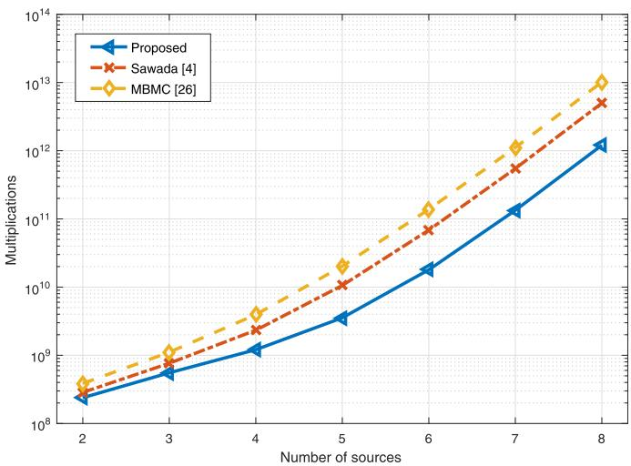  
Fig. 1. Computational complexity comparison.

The required number of multiplications for Sawada’s method is (Sawada et al., 2007)

$$
C _ {\mathrm{Sawada}} = C _ {1} + C _ {2} + C _ {3} + (N _ {r} + R) C _ {4} + N _ {r} N B,\tag{19}
$$

where R is the length of the set of selected frequencies including adjacent frequencies and harmonic frequencies, and $N _ { r }$ represents the number of iterations for global clustering to reach the convergence. In (Sawada et al 2007) R = 12 is used

The required number of multiplications for the MBMC method is (Wang, 2014)

$$
\begin{array}{c} C _ {\mathrm{MBMC}} = C _ {1} + C _ {2} + C _ {3} + (N _ {o} + N _ {m} N _ {c} + 2 / L (N _ {b} - 1)) C _ {4} \\ + B N (N _ {o} + N _ {b}) + N N _ {m} C _ {\text { kmeans }}, \end{array}\tag{20}
$$

where $N _ { o }$ and $N _ { m }$ are the number of iterations for one-centroid clustering and multi-centroid clustering to reach the convergence, respectively, $N _ { c }$ is the center number of each source, $N _ { b }$ is the number of subbands, and $C _ { \mathrm { k m e a n s } }$ is the required multiplications for the K-means algorithm.

The required number of multiplications for the proposed algorithm is

$$
C _ {\mathrm{Proposed}} = C _ {1} + C _ {2} + C _ {3} + (1 + \theta + N _ {q}) C _ {4} + B N (N _ {q} + L / 2),\tag{21}
$$

where the parameter � represents the ratio of the unfixed frequency bins to all the frequency bins in the first stage with $0 \leq \theta \leq 1$ , and $N _ { q }$ is the number of iterations for global one-centroid clustering until convergence. Often,

$N _ { q }$ is much smaller than $N _ { r }$ and $N _ { o }$ as mentioned before. Thus, in our method, it generally requires less than five iterations for the global correction.

Fig. 1 presents the complexity of the three algorithms, where we have used the following parameters $L = 2 0 4 8 , B = 2 0 0 ^ { 1 } , N _ { p } = 2 0 , N _ { r } = 1 5$ $N _ { o } = 1 5 , N _ { m } = 5 , N _ { q } = 5 , N _ { c } = 8 , N _ { b } = 8$ in (Wang, 2014) and � = 1. The value $N _ { q } = 5$ is obtained by averaging the experiment results. It can be seen from Fig. 1 that the proposed method achieves the lowest complexity among the involved algorithms, which becomes more pronounced as the number of sources increases.

Table 2  
The execution time of diferent methods.

<table><tr><td>Method</td><td>ICA</td><td>RG</td><td>Sawada</td><td>MBMC</td><td>Proposed</td><td>ILRMA</td></tr><tr><td>Run time</td><td>3.0 s</td><td>6.1 s</td><td>42.3 s</td><td>54.2 s</td><td>10.3 s</td><td>29.8 s</td></tr></table>

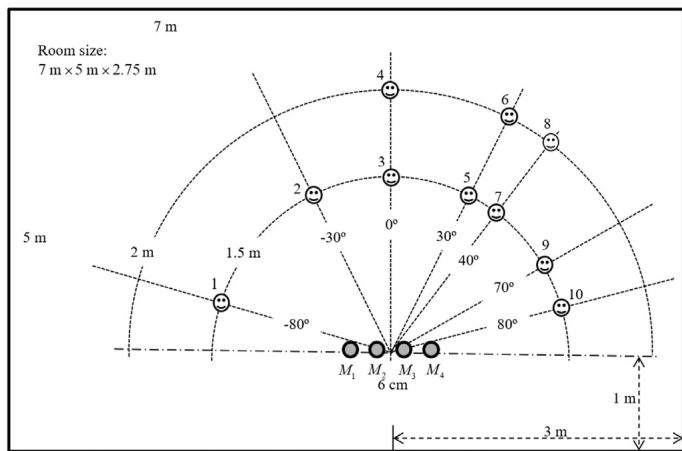  
Fig. 2. Simulated room environment.

To compare the computation complexity of various algorithms intuitively, we present the execution time of the five BSS algorithms, $\mathrm { i . e . , }$ the RG method (Wang, Ding, Yin, 2011), the independent low-rank matrix analysis (ILRMA) algorithm (Kitamura et al., 2015, 2016; Makino, 2018), Sawada’s method (Sawada et al., 2007), the MBMC algorithm (Wang, 2014) and the proposed method. The programs are coded in Matlab and run on Intel 7700HQ CPU @ 2.8 GHz. The reverberation time is $\mathrm { R T } _ { 6 0 } = 1 0 0 \ \mathrm { m s }$ , and the number of sources is $N = 4 ,$ . The test data is 10 s with the sampling rate $f _ { s } = 8 0 0 0 \ : \mathrm { H z }$ . As shown in Table 2, the ICA operation costs 3.0 s, while the permutation operations in the RG, Sawada’s, MBMC and the proposed methods require 3.1 s, 39.3 s, 51.2 s and 7.3 s, respectively. This means that the computation for the permutation operation is not negligible compared with that for the ICA operation. Among the five methods, the execution time of the proposed method is only inferior to the RG method and far less than the other methods.

## 4. Experiment results

In this section, we carry out a series of experiments to verify the performance of the proposed method. The simulation environment is shown in Fig. 2. The room size is 7 × 5 × 2.75 m. The height of all microphones and sources is 1.5 m. We set the reverberation time from 100 to 700 ms. The proposed method was tested with 180 10-s-long test files which were composed of 450 sentences selected from the TIMIT database. These speeches are sampled at 8000 Hz. The mixed signals are male and female speeches of 10 seconds each for $2 \times 2 ,$ 3 × 3 and 4 × 4 cases with 0 dB, -3 dB and -5 dB input signal-to-interference ratio (SIR), respectively.

Because our aim is to evaluate the performance of diferent permutation alignment methods, the same instantaneous ICA algorithm has been adopted. A Hanning window is used for analysis with 75% overlap. We use $L = 2 0 4 8$ for $\mathrm { R T } _ { 6 0 } = 1 0 0$ , 200, 300 ms, and $L = 4 0 9 6$ for $\mathrm { R T } _ { 6 0 } = 5 0 0$ and 700 ms. Microphones $M _ { 1 } , M _ { 2 }$ and $M _ { 3 }$ are used for $3 \times 3$ case. All microphones are used for 4 × 4 case. The performance is measured by the SIR and the perceptual estimation of the speech quality (PESQ) (Rix et al., 2001; Smaragdis, 1998). The SIR is calculated by

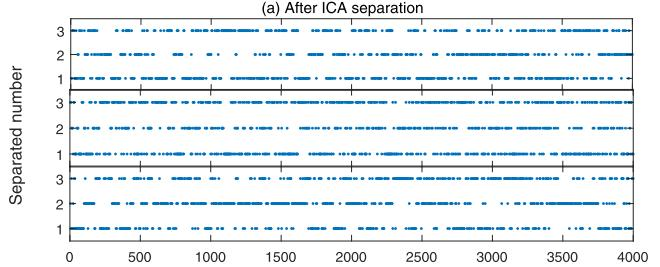

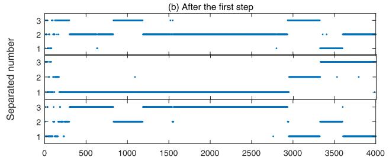

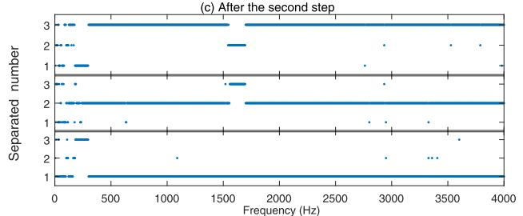

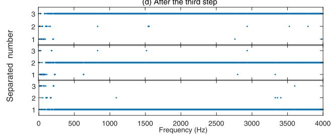  
Fig. 3. Permutation result of the proposed algorithm, (a) after the ICA separation, (b) after the first step, (c) after the second step and (d) after the third step.

$$
\mathrm{SIR} _ {\mathrm{in}} ^ {i} = 1 0 \log \frac {\sum_ {f , l} \left| H _ {i i} (f) S _ {i} (l , f) \right| ^ {2}}{\sum_ {f , l} \sum_ {j \neq i} \left| H _ {i j} (f) S _ {j} (l , f) \right| ^ {2}},
$$

$$
\mathrm{SIR} _ {\mathrm{out}} ^ {i} = 1 0 \log \frac {\sum_ {f , l} \left| J _ {i i} (f) S _ {i} (l , f) \right| ^ {2}}{\sum_ {f , l} \sum_ {j \neq i} \left| J _ {i j} (f) S _ {j} (l , f) \right| ^ {2}},\tag{22}
$$

where $J _ { i j } ( f )$ is the element at the ith row and the jth column of J(f) with i ≠j, and $\mathbf { J } ( f ) = \mathbf { W } ( f ) \mathbf { H } ( f )$

## 4.1. Permutation alignment experiment

To give a better understanding of the alignment processing, the permutation results at each frequency bin of four steps in the proposed method are shown in Fig. 3, i.e., (a) after ICA separation, (b) after the first step, (c) after the second step, and (d) after the third step. The ex periment is carried out with sources 1, 2 and $^ { 5 , }$ and the reverberation time is $\mathrm { R T } _ { 6 0 } = 2 0 0$ ms. The mixed signals are composed of two male and one female speeches. The permutation result is calculated using the method proposed in ()Ikram, Morgan, 2000. The true source order at each frequency bin of the ith separated signal is obtained by

$$
\operatorname{perm} _ {i} = \arg \max _ {j} | J _ {i j} (f) |.\tag{23}
$$

As shown in Fig. 3(a), the permutation after ICA is ambiguous severely. The permutation ambiguity is mitigated after the bin-wise permutation alignment in the first step as shown in Fig. 3(b), but there are still large misalignments. The permutations in frequency bins with low confidence are well fixed in the second step, and it is apparent from Fig. 3(c) that the permutations are aligned for most frequency bins. The permutation result is further improved by the global optimization in the third step as observed from Fig. 3(d). Also, it is noted that the permutations change slightly before and after the third step. This indicates that the global operation just fine tunes permutations within only a few iterations, which is attributed to the good initialization provided by the second step.

We also present the final permutation results of the other three methods in Fig. 4. As can be seen from Fig. 4(a), the permutation ambiguity is still severe in many frequency bins for the RG method, which explains why the RG method performs worst in all the involved methods. Sawada’s method and the MBMC method shown in Fig. 4(b)–(c) have a similar result to the proposed method in Fig. 3(d).

## 4.2. Separation experiments in diferent conditions

Tables 3 and 4 present the output SIRs and PESQs of five algorithms by averaging 20 various combinations of test files. The reverberation time is $\mathrm { R T } _ { 6 0 } = 1 0 0$ ms for all diferent mixture scenarios. The ILRMA al gorithm has the best performance in the most cases, but its performance is inferior to the other algorithms for sources $1 , 2 ,$ 5 and sources 1, 2, 7, 9. The RG method achieves a comparable performance with the other three ICA-based methods when the sources are far apart from each other. However, the RG method performs much worse when the sources are closely spaced, $\mathbf { e . g . }$ , the sources $^ { 9 , }$ 10 and sources $^ { 5 , }$ 6. This is because the threshold that determines the partitioning of the regions is chosen empirically, and some frequencies with a lower correlation coeficient are not considered in the region-wise permutation correlation procedure. The proposed method, Sawada’s method and the MBMC method have similar performance for most cases, except that the performance of the MBMC method is lower for the sources 2, 3, 5, 7. As shown in Tables 3 and $^ { 4 , }$ the separation performance for all the algorithms becomes worse when the sources are located closely, e.g., sources 9, 10 and sources 5, 6. Extensive experiment results (not shown here) further verified this observation. This phenomenon was also mentioned in (Kim et al., 2007; Wang et al., 2011). To the best of our knowledge, a theoretical explanation is not well established, and it is left as our future work.

Table 3  
Average $\mathrm { S I R } _ { \mathrm { o u t } }$ (dB) for diferent source locations and numbers

<table><tr><td>Source locations</td><td>1, 10</td><td>2, 7</td><td>9, 10</td><td>5, 6</td><td>1, 2, 5</td><td>4, 6, 8</td><td>1, 2, 7, 9</td><td>2, 3, 5, 7</td></tr><tr><td>ILRMA (Kitamura, Ono, Sawada, Kameoka, Saruwatari, 2016)</td><td>24.8</td><td>29.2</td><td>10.8</td><td>12.1</td><td>15.6</td><td>14.4</td><td>8.5</td><td>15.5</td></tr><tr><td>RG (Wang, Ding, Yin, 2011)</td><td>21.4</td><td>23.8</td><td>8.1</td><td>8.8</td><td>20.2</td><td>10.6</td><td>14.3</td><td>13.1</td></tr><tr><td>Sawada (Sawada et al., 2007)</td><td>21.7</td><td>23.9</td><td>11.8</td><td>12.0</td><td>20.1</td><td>11.1</td><td>14.5</td><td>13.2</td></tr><tr><td>MBMC (Wang, 2014)</td><td>21.8</td><td>23.7</td><td>11.9</td><td>12.0</td><td>20.1</td><td>10.9</td><td>15.0</td><td>6.2</td></tr><tr><td>Proposed</td><td>21.8</td><td>23.9</td><td>11.4</td><td>11.9</td><td>19.9</td><td>11.0</td><td>14.3</td><td>13.1</td></tr></table>

Table 4  
Average output PESQ for diferent source locations and numbers

<table><tr><td>Source locations</td><td>1, 10</td><td>2, 7</td><td>9, 10</td><td>5, 6</td><td>1, 2, 5</td><td>4, 6, 8</td><td>1, 2, 7, 9</td><td>2, 3, 5, 7</td></tr><tr><td>ILRMA (Kitamura, Ono, Sawada, Kameoka, Saruwatari, 2016)</td><td>3.35</td><td>3.65</td><td>2.75</td><td>2.86</td><td>2.84</td><td>2.90</td><td>2.36</td><td>2.85</td></tr><tr><td>RG (Wang, Ding, Yin, 2011)</td><td>3.34</td><td>3.48</td><td>2.44</td><td>2.51</td><td>3.23</td><td>2.77</td><td>2.90</td><td>2.82</td></tr><tr><td>Sawada (Sawada et al., 2007)</td><td>3.38</td><td>3.47</td><td>2.75</td><td>2.79</td><td>3.22</td><td>2.84</td><td>2.90</td><td>2.33</td></tr><tr><td>MBMC (Wang, 2014)</td><td>3.37</td><td>3.48</td><td>2.75</td><td>2.79</td><td>3.19</td><td>2.83</td><td>2.93</td><td>2.33</td></tr><tr><td>Proposed</td><td>3.38</td><td>3.48</td><td>2.74</td><td>2.78</td><td>3.20</td><td>2.83</td><td>2.90</td><td>2.79</td></tr></table>

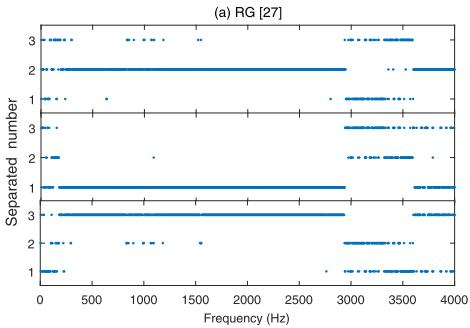

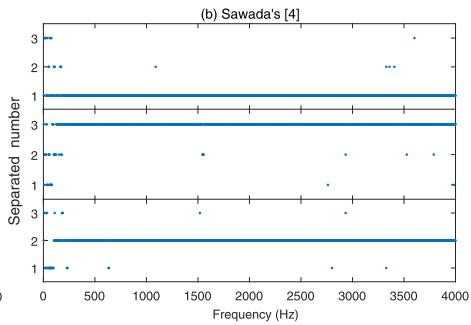

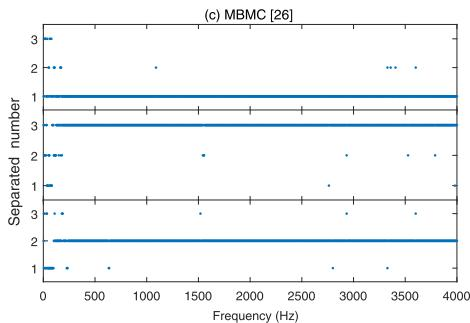  
Fig. 4. Final permutation results of the three existing methods, (a) the RG, (b) the Sawada’s and (c) the MBMC algorithms.

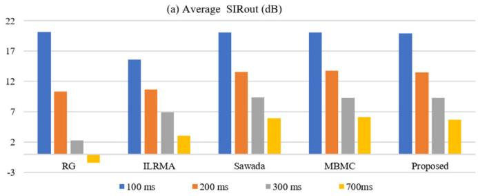

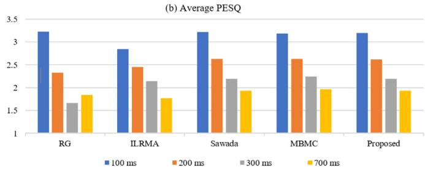  
Fig. 5. Separation performance of five algorithms with diferent reverberation times, (a) average $\operatorname { S I R } _ { \operatorname { o u t } }$ (dB) and (b) average PESQ.

Fig. 5 evaluates the efect of the reverberation time on the separation performance. The reverberation time is set as $\mathrm { R T } _ { 6 0 } = 1 0 0 , 2 0 0$ , 300 and 700 ms, respectively. The 3 × 3 case with sources 1, 2, 5 is considered. Note that the separation performance is degraded for all the involved algorithms as the reverberation time increases. The RG method has the worst performance especially for $\mathrm { R T } _ { 6 0 } = 7 0 0$ ms. The performance of the ILRMA algorithm is better than the RG method but slightly worse than other mentioned methods. The MBMC method, the Sawada’s method and the proposed method still work and have approximately 9 dB improvement in $\mathrm { R T } _ { 6 0 } = 7 0 0$ ms. They achieve the similar performance for all the four cases, while the proposed algorithm has the least complexity.

## 4.3. Selection of the threshold $\mathrm { U } _ { \mathrm { t h } }$

We now investigate the selection of the threshold $U _ { t h }$ and its efect on the overall performance and the complexity. The experiment environment is shown in Fig. 2, and we use $\mathrm { R T } _ { 6 0 } = 3 0 0$ ms. The pairs of source locations are given in Table 3. The separation performance and computation complexity are measured by the output SIR and the number of iterations for the one-centroid clustering, respectively. We set 0 ≤ $U _ { t h } \leq 0 . 9$ with the incremental step size 0.1. The result is obtained by averaging 20 cases.

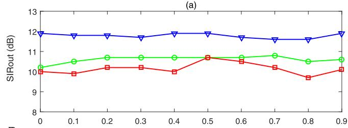

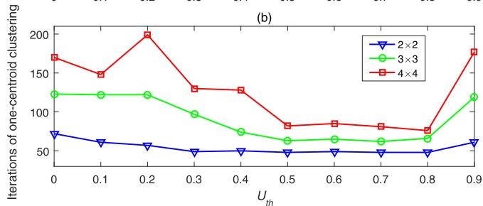  
Fig. 6. The average $\operatorname { S I R } _ { \operatorname { o u t } }$ and number of iterations for the one-centroid clustering as a function of the threshold $U _ { t h } ,$ (a) the average $\mathrm { \ S I R } _ { \mathrm { o u t } }$ (dB) and (b) the average number of iterations for the one-centroid clustering.

As we can see from Fig. 6, the separation performance is not sensi tive to the threshold $U _ { t h }$ . This is because the global optimization in the third stage can align the permutations well for most cases. However, the parameter $U _ { t h }$ has a significant efect on the computational complexity because it determines the initialization of the global optimization. $\operatorname { f } U _ { t h }$ is too small, some permutations with a low correlation which may be incorrect are used to calculate the local centroid in (15). If $U _ { t h }$ is too large, many permutations with a high correlation are ignored for the calculation of the local centroid. That is, a too small or too big $U _ { t h }$ will lead to a somewhat poor initialization of the global optimization and, hence, more iterations should be adopted for the one-centroid clustering. Note from Fig. $6 , 0 . 5 \leq U _ { t h } \leq 0 . 7$ could provide a good balance between the performance and the complexity.

## 5. Conclusion

This paper has presented a computationally eficient scheme to solve the permutation problem for the frequency-domain BSS. The interfrequency correlation is employed as an efective measurement to align the permutations. The proposed permutation alignment approach includes a local optimization and a fine global optimization. The local op timization is based on the bin-wise permutation and further followed by a local centroid correction, which can prevent the misalignment spread efectively. A fine global optimization is finally employed to correct the permutation and improve the robustness. It turned out that the noniterative local scheme provides an excellent initialization for the global optimization and hence greatly reduces the complexity. Computer simulations demonstrated that the proposed method achieved a comparable separation performance with the state-of-the-art permutation alignment algorithms in (Sawada et al., 2007; Wang, 2014), but the complexity of the proposed method is much lower especially as the number of sources increases.

## Declaration of Competing Interest

The authors declare that they have no known competing financial interests or personal relationships that could have appeared to influence the work reported in this paper.

## Acknowledgments

This work was supported by National Key R & D Program of China under Grant 2017YFC0804900, Youth Innovation Promotion Association of Chinese Academy of Sciences under Grant 2018027, IACAS Young Elite Researcher Project QNYC201812 and the Strategic Priority Research Program of Chinese Academy of Sciences under Grant no. XDC02020400.

## References

Anemller, J., Kollmeier, B., 2000. Amplitude modulation decorrelation for convolutive blind source separation. In: Proc. ICA, pp. 215–220.

Araki, S., Hayashi, T., Delcroix, M., Fujimoto, M., Takeda, K., Nakatani, T., 2015. Exploring multichannel features for denoising-autoencoder-based speech enhancement. In: Proc. IEEE ICASSP, pp. 116–120.

Asano, F., Ikeda, S., Ogawa, M., Asoh, H., Kitawaki, N., 2001. A combine approach of array processing and independent component analysis for blind separation of acoustic signals. In: Proc. IEEE ICASSP, pp. 2729–2732.

Bell, A.J., Sejnowski, T.J., 1995. An information-maximization approach to blind separa tion and blind deconvolution Neural Comput, 7 (6). 1129–1159

Cichocki, A., Zdunek, R., Phan, A.H., Amari, S., 2009. Nonnegative Matrix and Tensor Factorizations: Applications to Exploratory Multi-Way Data Analysis and Blind Source Separation. Wiley.

Comon, P., Jutten, C., Herault, J., 1991. Blind separation of sources, part II: Problems statement. Signal Process. 24 (1), 11–20.

Dadvar, P., Geravanchizadeh, M., 2019. Robust binaural speech separation in adverse conditions based on deep neural network with modified spatial features and training target Speech Commun. 108 41–52

Herault, J., Jutten, C., 1986. Space or time adaptive signal processing by neural network models In: Proc, AIP Conf 151 pp 206–211

Hiroe, A., 2006. Solution of permutation problem in frequency domain ICA using multivariate probability density functions. In: Proc. ICA. Springer, pp. 601–608.

Huang, P.-S., Kim, M., Hasegawa-Johnson, M., Smaragdis, P., 2015. Joint optimization of masks and deep recurrent neural networks for monaural source separation. IEEE/ACM Trans. Audio Speech Lang. Process. 23 (12), 2136–2147.

Hyvrinen, A., 1999. Fast and robust fixed-point algorithm for independent componen analysis. IEEE Trans. Neural Netw. 10 (3), 626–634.

Ikram, M.Z., Morgan, D.R., 2000. Exploring permutation inconsistency in blind separation of speech signals in a reverberant environment. In: Proc. IEEE ICASSP, 2, pp. 1041–1044.

Jutten, C., Herault, J., 1991. Blind separation of sources, part I: An adaptive algorithm based on neuromimetic architecture. Signal Process. 24 (1), 1–10.

Kim, T., Attias, H.T., Lee, S.Y., Lee, T.W., 2007. Blind source separation exploiting higher-order frequency dependencies. IEEE Trans. Audio Speech Lang. Process. 15 (1), 70–79.

Kim, T., Eltoft, T., Lee, T.W., 2006. Independent vector analysis: an extension of ICA to multivariate components. In: Proc. ICA, pp. 165–172.

Kitamura, D., Ono, N., Sawada, H., Kameoka, H., Saruwatari, H., 2015. Eficient multichannel nonnegative matrix factorization exploiting rank-1 spatial model. In: Proc. IEEE ICASSP, pp. 276–280.

Kitamura, D., Ono, N., Sawada, H., Kameoka, H., Saruwatari, H., 2016. Determined blind source separation unifying independent vector analysis and nonnegative matrix fac torization. IEEE/ACM Trans. Audio Speech Lang. Process. 24 (9), 1626–1641.

Lee, D.D., Seung, H.S., 1999. Learning the parts of objects by non-negative matrix factorization. Nature 401 (6755), 788–791.

Makino, S., 2018. Audio Source Separation. Springer

Makino, S., Lee, T.W., Sawada, H., 2007. Blind Speech Separation. Springer.

Matsuoka, K., Nakashima, S., 2001. Minimal distortion principle for blind source separa tion. In: Proc. ICA, pp. 722–727.

Mirzaei, S., Hamme, H.V., Norouzi, Y., 2016. Under-determined reverberant audio source separation using Bayesian non-negative matrix factorization. Speech Commun 81, 129–137.

Murata, N., Ikeda, S., Ziehe, A., 2001. An approach to blind source separation based on temporal structure of speech signals. Neurocomputing 41. 1–24

Narayanan, A., Wang, D.L., 2015. Improving robustness of deep neural network acoustic models via speech separation and joint adaptive training. IEEE/ACM Trans. Audio Speech Lang. Process. 23 (1), 92–101.

Nesta, F., Omologo, M., Svaizer, P., 2008. Multiple TDOA estimation by using a state coherence transform for solving the permutation problem in frequency-domain BSS. In: Proc. MLSP, pp. 43–48.

Rix, A., Beerends, J., Hollier, M., 2001. Perceptual evaluation of speech quality (PESQ) - a new method for speech quality assessment of telephone networks and codecs. In: Proc. JEEE ICASSP. 2, pp. 749–752

Sawada, H., Araki, S., Makino, S., 2007. MLSP 2007 data analysis competition: frequency-domain blind source separation for convolutive mixtures of speech/audio signals. In: Proc. MLSP, pp. 45–50.

Sawada, H., Araki, S., Makino, S., 2007. Measuring dependence of bin-wise separated sig nals for permutation alignment in frequency-domain BSS. In: Proc. ISCAS. 3247–3250.

Sawada, H., Mukai, R., Araki, S., Makino, S., 2004. A robust and precise method for solving the permutation problem of frequency-domain blind source separation. IEEE Trans. Audio Speech Lang. Process. 12 (5), 530–538.

Servière, C., Pham, D.T., 2006. Permutation correction in the frequency domain in blind separation of speech mixtures. EURASIP J. Appl. Signal Process. 2006 (1), 1–16.

Smaragdis, P., 1998. Blind separation of convolved mixtures in the frequency domain. Neurocomputing 22 (1–3), 21–34.

Virtanen, T., 2007. Monaural sound source separation by nonnegative matrix factorization with temporal continuity and sparseness criteria. IEEE Trans. Audio Speech Lang. Process15 (3).1066–1074

Wang, L., 2014. Multi-band multi-centroid clustering based permutation alignment for frequency-domain blind speech separation. Digital Signal Process. 31, 79–92.

Wang, L., Ding, H., Yin, F., 2011. A region-growing permutation alignment approach in frequency-domain blind source separation of speech mixtures. IEEE Trans. Audio Speech Lang. Process. 19 (3), 549–557.

Wang, Y., Wang, D.L., 2013. Towards scaling up classification-based speech separation. IEEE Trans. Audio Speech Lang. Process. 21 (7), 1381–1390.