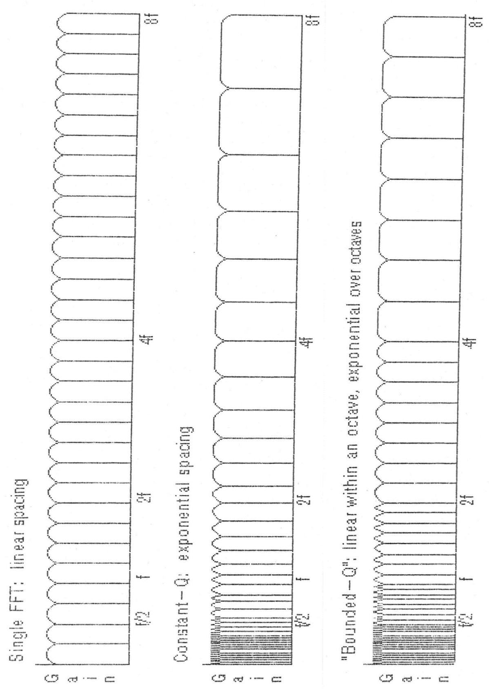
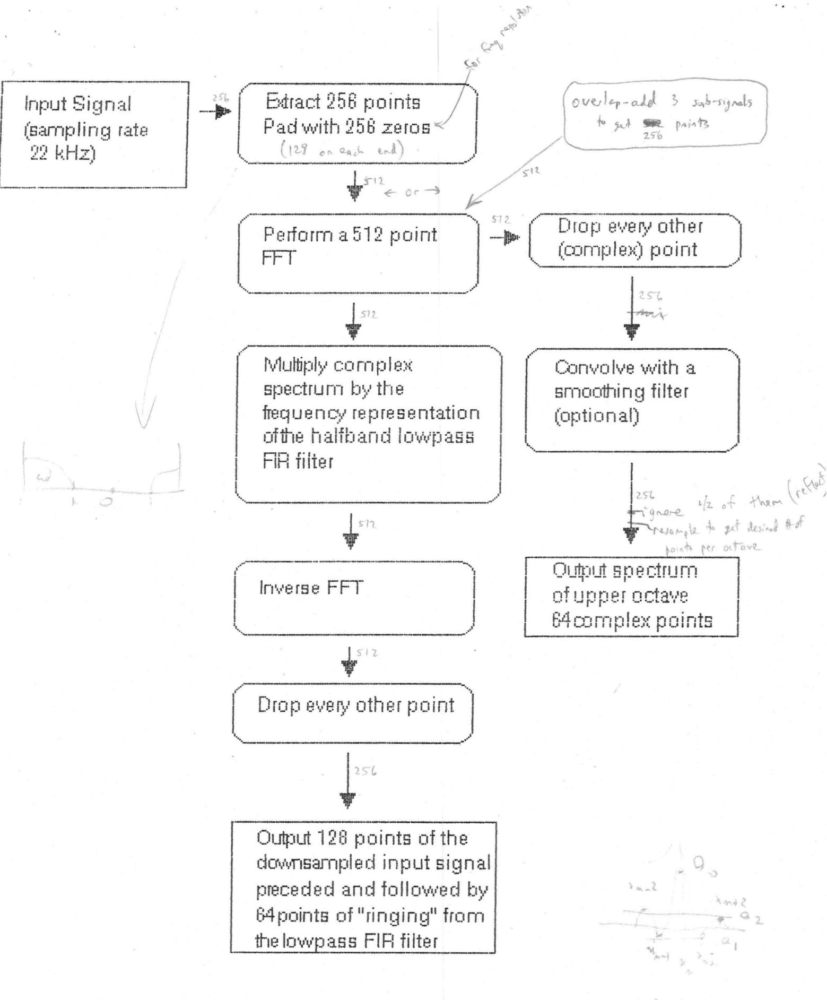
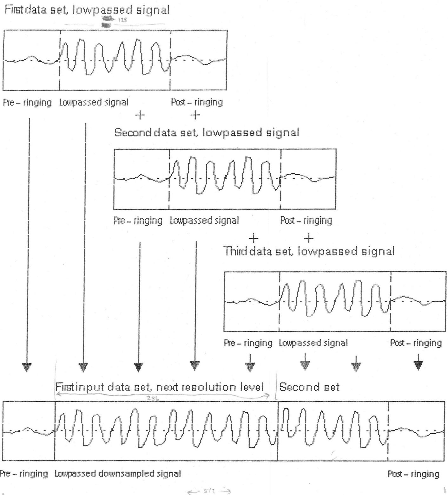
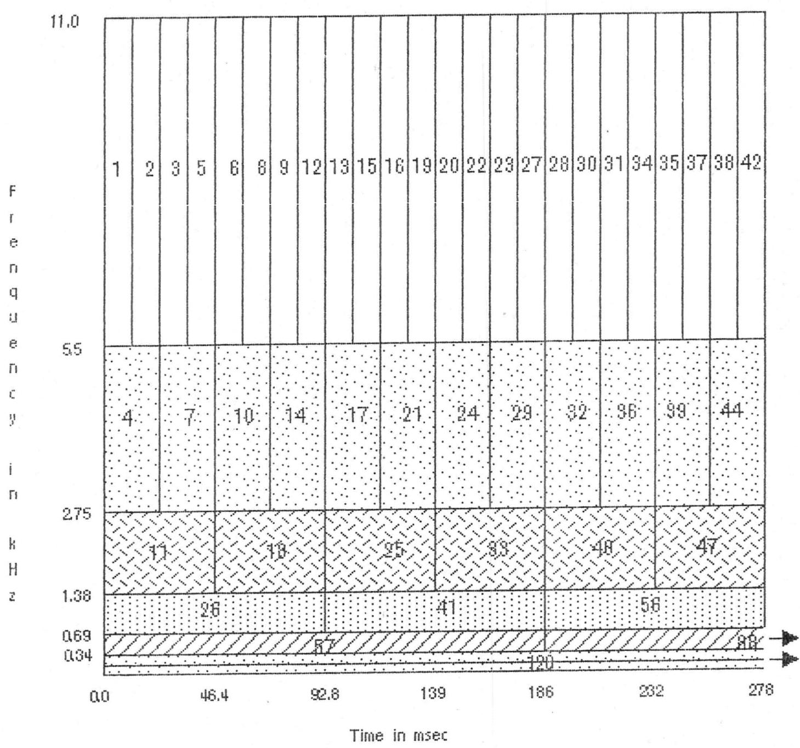

Here's a copy of the paper. I'm leaving early social weeks. Do you think, they might be included in

The Bounded-Q Frequency Transform
Department of Music Report STAN-M-28, 1985

by Kyle L. Kashima and Bernard Mont-Reynaud
Center for Computer Research in Music and Acoustics
Department of Music, Stanford University

Introduction

Transcription of digitally recorded polyphonic music requires the use of a technique to determine notes. The algorithm presented here is based upon a signal processing techniques capable of handling multiple voice. Some success has been achieved using modern spectrum analysis techniques for pitch segmentation, attack determination, and pitch tracking for single line melodies[1]. When these techniques are applied to polyphonic Western music, either the computation exceeds reasonable bounds or the output does not have sufficient resolution to allow clear note identification. The presence of overlapping partials, time varying spectra, and time varying tempi combine to make analysis a difficult problem. The method presented in this paper was developed as a front end of an intelligent system for music transcription developed at CCRMA (Center for Computer Research in Music and Acoustics) at Stanford University[2]. It is based upon the FFT (Fast Fourier Transform) and produces short time spectral information at a variety of resolutions. It is hope that the information generated by the algorithm will allow effective note determination by the music analysis system.

Basis for the Algorithm

Audio signals can be analyzed by breaking them down into sinusoidal waves of arbitrary onset and decay. An ideal algorithm would generate an exact frequency/time map and require very little computational effort. Most likely the algorithm would be a filter bank composed of many narrow band filters which span the audible range. The time window of the filters should be sufficiently small to precisely delineate note attacks and decays. Unfortunately there are limits to the quality of resolution and computational efficiency an algorithm can achieve. Furthermore extremely fine resolution of the entire spectrum may provide too much information for the computational cost. The algorithm should be structured to extract the required information at low cost without excessive extraneous information. To this end it is beneficial to examine the spectral and timing characteristics of the digitized music we use for input.

In this project we concentrated on polyphonic Western music generated by harmonic instruments using a 12-tone chromatic scale. The information in the frequency spectrum of this music is not evenly distributed. The critical information for note determination lies in the frequencies of the fundamentals and partials generated by the instruments when playing scale tones.

In the well-tempered 12-tone chromatic scale, the fundamentals of the notes are exponentially spaced by a multiplicative factor of $2^{n/12}$ , where $n$ is an integer. Other tuning system are used in Western music, such as the just tuning and mean tuning. This system are based on integral ratios but share the precise 2:1 interval of the octave with the well-tempered system.

If we examine a harmonic tone, it contains partials at approximately integral multiples of the fundamental frequency. It can be shown that the partials relatively closely match the scale frequencies, i.e. within a few percent of a semitone $^{1}$ . Therefore it should be sufficient to concentrate on generating a filter bank to distinguish the scale tones.

It would seem logical to organize the filters in the bank so that they are centered on the well-tempered scale. One might try an exponential spacing by powers of $2^{1/12}$ , one filter per semitone. Unfortunately, we do not know prior to the analysis to what absolute pitch the music will be tuned. Notes may excite two more neighboring filters and provide ambiguous frequency results. Furthermore spectral smearing or noise may occur. To handle these effects we opted for about a minimum of three filters per semitone.

It is desirable that the filter bank should span the spectrum. The easiest arrangement, which we chose, is to have the filter cover the desired range but not overlap each other. If the filters are exponentially spaced apart as mentioned previously, this requirement forces the bandwidth of each filter to be a proportional to the center frequency of the filter. This type of filter bank, a constant fractional bandwidth filter bank is called a constant- $Q^{2}$ filter bank. Since bandwidth and time window size are inversely related, the scaling of the bandwidth results in inversely exponentially sized windows, i.e. a smaller window for a filter with a higher frequency. Fortunately this scaling of the window size is exactly what we want. In harmonic instruments the high frequencies attack and decay faster than the low frequencies. Smaller windows are required to the accurately identify the occurrences of the high frequencies.

Based upon this discussion, it would seem that a constant-Q filter bank is the best solution for our problem. Unfortunately, current implementations of the constant-Q filter bank are not computationally efficient enough for us to process our data quickly.

The implementation of a constant-Q filter bank requires separate calculation of each filter response. This arises out of the fact that each of the windows for the filters are different sizes. Current implementations of constant-Q filter banks are essentially DFTs (Discrete Fourier Transforms) with exponentially spaced windowing. The input signal must be separately convolved with each of the windowed sinusoids. The DFT method can be slow and computationally expensive to run on a serial processing computer $^{3}$ . If parallel processing is available, shorter processing times can be achieved $^{[3]}$ . At our location parallel processing was not easily obtained, so the DFT implementation was not attractive. There have been attempts to simulate a constant-Q short-time filter bank using frequency warping of a single FFT or using the chirp z transform $^{[3]}$ . Neither of these methods seemed to be easily applicable to the requirements particular to our situation.

## The Algorithm

We decided develop a new algorithm which is similar to the constant-Q transform but achieves greater computational efficiency through the FFT (Fast Fourier Transform). The algorithm we generated is a compromise between the linear spacing of the filters of a single FFT and the exponential spacing of the constant-Q. In our arrangement the filters are linearly space within an octave, but from octave to octave the filters are in a 2:1 ratio (see figure 1). In this way filters which are exactly an octave apart have the same Q. The Q values extend through a fixed range. Hence the name "bounded-Q."

The algorithm centers around an iterative procedure described as follows: an FFT is taken of a fixed number of input samples and then the signal is downsampled by a factor of two (see figure 2). The upper half of the FFT, one octave, is output to the music analysis system. The procedure is repeated for two more sets of input data. Again the upper half of the FFTs are sent to the music analysis system. The three downsampled signals are now dovetailed into one signal (see figure 3). The procedure is now used on the downsampled data. Because the downsampling eliminated the highest octave of the spectrum, the output of the FFT is now the next second highest octave of the spectrum (see figure 4). The input window is twice as large and the frequency resolution is twice as fine. The procedure is applied further to provide short-time spectra over the desired time interval and desired octaves.

  
FIGURE 1. Comparison of filter spacings

A Detailed Description of the Procedure

In our implementation the input signal is grouped into sets of 256 points. The sampling rate is 22028 Hz. The first time window window is 11.62 milliseconds. A 512-point FFT is performed on the data with zeros filling in the 256 other points. The padding of zeros is to prevent aliasing during the downsampling. No windowing $^{4}$ nor weighting is performed on the data prior to the FFT because it would make the downsampling more difficult. The output spectrum is every other point from the upper half of the spectrum, 32 complex points. The 32 point linear spacing is equivalent to 2.72 filters per semitone at the low end and 5.28 filters per semitone on the high end.

The next step is lowpassing and downsampling the original data by a factor of 2. We first lowpass the signal with a halfband filter to prevent aliasing when we downsample. Normally we would convolve the input signal with an FIR filter to accomplish this, but since we have the

  
FIGURE 2. Central procedure of the algorithm

  
FIGURES. Dovetailing of downsampled signals

  
FIGURE4. Diagram of algorithm output (numbers indicate order of execution)

FFT available we can simple complex multiply the FFT by the complex frequency response of the lowpass filter. This new spectrum is changed back to the time domain by an inverse FFT. The computational savings are significant. The filter we used is the frequency response of a 256-point symmetric non-causal FIR filter with about an 80 dB cutoff. If we were to implement the same filter in the time domain it would require 256x256 or 65,536 real multiplications for the convolution. This method requires 257 complex multiplications for the lowpass filter plus (512/2)log $_{2}$ 512 or 2304 butterflies for the inverse FFT. This totals 2561 complex operations, a significant savings. Because the filtering process spreads the energy of the input signal ahead and behind the original signal, the extra zeros we placed in the FFT prevent them from overlapping or aliasing. The pre-"ringing" and post-"ringing" are saved and combined with the appropriate downsampled data from previous and following iterations (see figure 3). This energy spread is the same as that which would occur if we were using an FIR filter in the time domain. Downsampling is now performed on lowpassed signal and the ringing by dropping every other point.

The procedure is repeated to cover the entire input signal and also to cover the desired number of octaves. Since the downsampling halves the sampling rate but we keep doubling the window size the number of samples used in the FFT remain fixed. The hop size in our implementation is one full data group of 256 points. Better time resolution could be achieved if we halved the hop size, but computations would double.

Due to the sharp cutoff that we are able to achieve with the lowpass filter, the algorithm has the added benefit of the ability to invert the process and reconstruct the original signal nearly distortion free.

## A Discussion on Computational Efficiency

How many computations does the algorithm require to produce a spectrum on the average per data set interval? In our implementation an 512 point FFT is taken. The number of complex operations for an FFT is $n/2 \log_2 n$ . In this case it means 2304 operations. The lowpass filtering requires $n/2 + 1$ or 257 operation. The inverse FFT takes another 2304 operations. Each iteration of the procedure takes 4865 or $n \log_2 n + n + 1$ operations.

Since we are examining the number of computations on the average over a fixed time period, the number of computations for each new octave of resolution requires half as many computations. Therefore we can approximate the average number of computations as $[1 + 1/2 + 1/4 + \ldots]$ 4865 or $2 * 4865 = 9730$ operations per data set interval.

The equivalent DFT filter bank has 32 filters per octave. If we assume six octaves of information are in the music, there needs to be 192 filters. The DFT takes on the order of $n^2$ operations to perform. Since we looking for the average operations per data set interval the number of operations is given by $192(256^2)$ or $12.6 \times 10^6$ operations. It is significantly more expensive.

Downsampling can be used to reduce the number of computations in the DFT implementation. Using the same logic as above, the total number of operations for a DFT with downsampling once per octave for the same configuration is $[32(256^{2}) + L][1 + 1/2 + 1/4 + \ldots] = 4.2 \times 10^{6} + 2L$ . Even if the number of lowpass filtering is inexpensive, the cost is still significantly more than the bounded-Q approach.

Conclusion

We have presented here an efficient alternative to current constant-Q implementations. The advantages of this "bounded-Q" transform is that it effectively uses current FFT techniques and provides relevant information for musical analysis. Further work will determine whether the information generated by this algorithm will be sufficient to accurately transcribe polyphonic Western music. Further work may expand into other types of music. There are plans to implement this algorithm on a Lisp workstation with the intelligent music analysis system.

## Acknowledgements

The authors would like to heartily thank Julius O. Smith for his helpful insights and guidance. Thanks to Chris Chafe and Andrew Schloss for their assistance and comments. Also thanks to David Jaffe and Phil Gossett. This research was conducted at the Center for Computer Research in Music and Acoustics at Stanford University under the sponsorship of the National Science Foundation. This material is based on the work supported by the National Science Foundation under contracts NSF MCS-8012476 and DCR-8214350.

## Footnotes

1 One can compare the exponential tuning of a well-tempered scale to integral ratios of partial. The following table list the first 11 partials and the corresponding well-tempered scale note.

Partial Ratio Well-Tempered Interval
1 2:1  $2^{(12/12)} = 2:1$  p8va
2 3:1  $2^{(19/12)} = 2.99661:1$  p12th = 8va + 5th
3 4:1  $2^{(24/12)} = 4:1$  p15th = 28va
4 5:1  $2^{(28/12)} = 5.03968:1$  M17th = 28va + M3rd

5 6:1 $2^{(31/12)} = 5.99323:1$ p19th = 2 8va + p5th  
6 7:1 $2^{(34/12)} = 7.12719:1$ m21st = 2 8va + m7th  
7 8:1 $2^{(36/12)} = 8:1$ p22st = 3 8va  
8 9:1 $2^{(38/12)} = 9.97970:1$ M23rd = 3 8va + M2nd  
9 10:1 $2^{(40/12)} = 10.07937:1$ M24th = 3 8va + M3rd  
- --:- $2^{(41/12)} = 10.67872:1$ p25th = 3 8va + p4th  
10 11:1 ---- ----  
- --:- $2^{(42/12)} = 11.31371:1$ d26th = 3 8va + d5th  
11 12:1 $2^{(43/12)} = 11.98646:1$ p26th = 3 8va + p5th

One can notice that not until we get to the 10th partial does a large difference occur. For example if the narrow band filters are centered on the scale tones and have a bandwidth of a 1/3 of a semitone they will easily capture most of the partials.

2 The Q value of a filter is the ration of the bandwidth to the center frequency. A constant-Q filter bank is a set of filters in which all the Q values are equal.

3 No window is the same as a rectangular window in this case. If windowing is required convolution by the frequency representation of the filter can be performed on the FFT complex spectrum. Some example of such window are the three point Hamming window [0.23, 0.54, 0.23] and the Blackman (second order Hamming) window [-0.0492125, 0.2992125, 0.5, 0.2992125, -0.0492125]. These filters smooth the sidelobes effects. In our implementation of the FFT is causal so that zero time corresponds to the first data sample. In order for the smoothing window to be centered over the data window it is necessary to rotate the windows by a phase factor of pi. The Hamming window is a raised cosine, so it becomes [-0.23, 0.54, -0.23]. The Blackman window is a raised cosine with another cosine of twice the frequency as a correction factor, so it becomes [-0.0492125, -0.2992125, 0.5, -0.2992125, -0.0492125].

## References

1. Foster, S., Schloss, W. A., and Rockmore, A. J. "Toward an Intelligent Editor of Digital Audio: Signal Processing Methods." Computer Music Journal, 6(1): 42-51. 1982.

2. Chafe, C., et al. "Techniques for Note Identification in Polyphonic Music." Proceedings of the ICMC 1985.

3. Schwede, G. "An Algorithm and Architecture for Constant-Q Spectrum Analysis." Proceedings IEEE ICASSP 1983.

4. Chowning, J., et al. "Intelligent Systems for the Analysis of Digitized Acoustic Signals." Department of Music Report No. Stan-M-15, CCRMA, January 1984.

5. Tucker, W. H., and Bates, R. H. T. "A Pitch Estimation Algorithm for Speech and Music." IEEE Trans. ASSP. Vol. ASSP-26, No. 6, December 1978.

6. Gambardella, G. "A Contribution to the Theory of Short-Time Spectral Analysis with Nonuniform Bandwidth Filters." IEEE Trans. on Circuit Theory. Vol. CT-18, No. 4, July 1971.

7. Bracewell, R. "The Fourier Transform and its Applications." McGraw-Hill, 1978.

8. Oppenheim, A., and Schafer, R. "Digital Signal Processing." Prentice-Hall, 1975.

9. Rabiner, L., and Gold, B. "Theory and Application of Digital Signal Processing." Prentice-Hall, 1975.

10. Hamming, R. W. "Digital Filters." Prentice-Hall, 1983.