RESEARCH

Open Access

# Low-complexity artificial noise suppression methods for deep learning-based speech enhancement algorithms

Yuxuan Ke1,2, Andong Li1,2, Chengshi Zheng1,2, Renhua Peng1,2\* and Xiaodong Li1,2

## Abstract

Deep learning-based speech enhancement algorithms have shown their powerful ability in removing both stationary and non-stationary noise components from noisy speech observations. But they often introduce artificial residual noise, especially when the training target does not contain the phase information, e.g., ideal ratio mask, or the clean speech magnitude and its variations. It is well-known that once the power of the residual noise components exceeds the noise masking threshold of the human auditory system, the perceptual speech quality may degrade. One intuitive way is to further suppress the residual noise components by a postprocessing scheme. However, the highly non-stationary nature of this kind of residual noise makes the noise power spectral density (PSD) estimation a challenging problem. To solve this problem, the paper proposes three strategies to estimate the noise PSD frame by frame, and then the residual noise can be removed effectively by applying a gain function based on the decision-directed approach. The objective measurement results show that the proposed postfiltering strategies outperform the conventional postfilter in terms of segmental signal-to-noise ratio (SNR) as well as speech quality improvement. Moreover, the AB subjective listening test shows that the preference percentages of the proposed strategies are over 60%.

Keywords: Speech enhancement, Artificial residual noise, Postprocessing scheme

## 1 Introduction

In the last decade, the huge success of deep learning has been witnessed in the field of speech enhancement. Typical deep neural networks (DNNs) contain fully connected networks (FCNs) [1], recurrent neural networks (RNNs), e.g., networks consist of long short-term memory (LSTM) layers [2–4], and convolutional neural networks (CNNs) [5–7]. Generally, CNNs require much less trainable parameters than FCNs and RNNs because of its weight sharing mechanism [5]. Among all the CNNs, the convolutional encoder-decoder (CED) networks which are also referred to as U-Net architectures are the most popular and widely used for their promising speech enhancement performance [8–11].

However, the typical deep learning-based speech enhancement methods often introduce artificial residual noise, especially when the phase information is neglected in the training target [12], e.g., ideal ratio mask [13, 14], or the magnitude of the clean speech and its variations [10, 11, 15]. Usually, this kind of noise is highly non-stationary, and its power remains considerable in the middle-high frequency band where the speech power spectral density (PSD) is relatively low. According to the human hearing model which is widely used in wideband audio coding [16–19], when the residual noise PSD exceeds the noise masking threshold, it will be audible and annoying to a human listener. Although many great efforts have been made to suppress the residual noise either by combining multiple dilated CNN layers, such as gated residual networks with dilated convolutions (GRN) in [8] and recursive network with dynamic attention (DARCN) in [10], or by adopting sub-pixel convolution, e.g., densely connected neural network (DCN) in [20], the residual noise problem has not been completely solved.

There are several DNN-based studies aiming to improve speech quality by introducing perceptual metrics as a loss function, i.e., the perceptual evaluation of speech quality (PESQ)-based objective function [21, 22], because PESQ score has been proven to show high correlation with the speech quality rated by humans [23]. However, these approaches focus on the improvement of only one objective metric, but the other metrics may have a degradation [22]. Other studies employ phase-dependent targets such as complex ratio mask (CRM) [24] and the complex spectrum [25, 26] to improve the perceptual quality of speech. In these methods, the real and the imaginary components of the targets need to be trained separately or jointly, which can increase the network complexity as well as the computational complexity in some degree.

This paper considers introducing some very lowcomplexity schemes to suppress the artificial residual noise components, so that speech quality can be improved at a very low cost. It is well-known that, compared with DNN-based methods, many conventional monaural speech enhancement have much lower computational complexity [27–30], and their performance is highly dependent on the estimation accuracy of the noise PSD.

Classical noise PSD estimation methods include minimum statistics (MS)-based methods [31, 32], minima controlled recursive averaging (MCRA)-based methods [33– 35], minimum mean-square error (MMSE)-based methods [36, 37], and so on. Among those methods, the unbiased MMSE-based noise PSD estimator proposed by [37] is well-known for its low complexity and low tracking delay, which has shown brilliant noise PSD tracking performance even in non-stationary noise scenarios. The core component of this method is speech presence probability (SPP) estimation, which can determine the estimation accuracy of noise PSD. However, the accuracy of SPP estimation can be degraded when the non-stationary property of the residual noise is remarkable.

To solve this problem, we consider three strategies to estimate the SPP that can achieve faster noise tracking than conventional unbiased MMSE-based noise PSD estimator. The first strategy is utilizing the original noisy speech signal to estimate SPP directly. The second strategy regards the DNN framework as a gain function with respect to the a posteriori signal-to-noise ratio (SNR), from which the SPP is deduced. Both of the two methods solve the SPP overestimation problem by avoiding estimating the residual noise PSD directly from the enhanced speech signals of DNNs. In contrast, the third strategy takes advantage of the residual noise PSD to extract the potential priori knowledge of SPP, and thus, an adaptive a priori SPP can be obtained. Notably, this strategy is conducted frame-by-frame without introducing any unnecessary latency.

Numerous objective and subjective experiments are conducted to compare the proposed postfiltering strategies with the conventional postfilter. The objective evaluation results indicate that the proposed strategies have the larger amount of noise reduction and better perceptual speech quality than the conventional method. The subjective listening test results also show that the proposed posterfiltering strategies are more acceptable.

## 2 Problem formulation

## 2.1 Signal model

Assuming that the monaural noisy signal at the nth discrete time index is modeled as $x ( n ) = s ( n ) + d ( n )$ , where s(n) denotes the clean speech, d(n) denotes the additive noise, and the noise is uncorrelated to the clean speech, then with short-time Fourier transform (STFT), we have

$$
X (k, l) = S (k, l) + D (k, l),\tag{1}
$$

where k and l denote the frequency index and the time frame index, respectively. $X ( k , l ) , S ( k , l )$ , and $D ( k , l )$ denote the complex spectral coefficients of the noisy speech, the clean speech and the noise, respectively. If we regard the NN-based speech enhancement algorithms as nonlinear mapping functions, then the enhanced speech signal can be expressed as

$$
Y (k, l) = \mathcal {G} (X (k, l)),\tag{2a}
$$

$$
= \mathcal {G} (S (k, l) + D (k, l)),\tag{2b}
$$

$$
= \widehat {S} (k, l) + \widetilde {D} (k, l),\tag{2c}
$$

where ( ) denotes the nonlinear mapping function for a certain DNN model, and $\widehat { S } ( k , l )$ and $\tilde { \widetilde { \cal D } } ( k , l )$ denote the speech component and the noise component of the enhanced speech signal, respectively. Notably, (·) is a nonlinear mapping function but not a linear gain function, so that $\hat { S } ( k , l ) \neq \mathcal { G } ( S ( k , l ) )$ and $\tilde { \cal D } \neq \mathcal { G } ( \bar { \cal D } ( k , l ) )$ . As mentioned above, the residual noise generated by DNNs is highly non-stationary, and its power is considerable in the middle-high frequency band, which may severely degrade the perceptual speech. This phenomenon will be demonstrated and analyzed in the following part.

## 2.2 Analysis of the residual noise generated by DNNs

In this part, we tested the noise reduction performances of several state-of-the-art and typical DNN models such as CRN [9], GRN [8], DCN [20], and DARCN [10] and investigated the residual noise generated by these neural networks through a psychoacoustic model.

## 2.2.1 Dataset generation and setups for training

The DNNs to be tested were fed in with the same input feature, i.e., the noisy spectrum X(k, l) , and the same target, i.e., the clean spectrum S(k, l) . Moreover, they shared the same dataset as well. To obtain the simulated data, we selected 4856, 800, and 100 utterances from TIMIT [38] corpus for the training, validation, and test sets, respectively. Besides, 130 types of noises in accordance with [10] were selected for the training and validation sets, where 115 types were taken from [39], 9 types (birds, casino, cicadas, computer keyboard, eating chips, frogs, jungle, machine guns, and motorcycles) were selected from [40], 3 types (destroyer engine, factory1, and pink) were selected from NOISEX-92 [41], and other 3 types of noise (aircraft, bus, and cafeteria) were selected from a large sound library (available at https:// freesound.org). The Gaussian white noise was used for the test set to investigate the noise reduction performance as comprehensively as possible, because of its stationarity on over time in fullband. The SNRs of training and validation sets were chosen in the range from 5 dB to 10 dB with a resolution of 1 dB and that of the test set were chosen from 5, 0, 5, 10 dBs. The simulated noisy signals were obtained by mixing the clean utterances with a certain noise under a certain SNR. Note that the noise signals were trimmed from a random start point and had the same length with the clean speech signals. Finally, 40,000, 4000, and 800 noisy-clean pairs in total were generated for training, validation, and testing, respectively.

The sampling rate for all speech signals was set at 16 kHz, and the speech signals were transformed into the frequency domain using a 20-ms Hamming window, which is widely used as it has lower worst-case side lobe than Hann window and rectangular window. The frame shift parameter was set to 10 ms. All the models were trained using stochastic gradient descent with ADAM optimizer [42], with mean-square error (MSE) as the loss function. The learning rate was initialized at 0.001, which was halved if the validation loss increased 3 consecutive times. If the validation loss increased 10 consecutive times, the training was then stopped early. In addition, the maximum training epoches was set at 50, and the minibatch was set at 4.

## 2.2.2 Results and analysis

Speech spectrograms before and after DNN-based speech enhancement processing are presented in Fig. 1, where the speech was randomly chosen from the test set, and the background noise was white Gaussian noise with SNR = 0 dB. Figure 1a and b are the clean and noisy and speech spectrograms, respectively. Figure 1 c, d, e, and f are the enhanced speech spectrograms of CRN, DCN, GRN and DARCN, respectively. By comparing Fig. 1a with $\mathrm { c } , \mathrm { d } , \mathrm { e } ,$ and f, it can be observed that the residual noise components of the four DNNs are all obvious, where the enhanced speech spectra are blurred along both the time axis and the frequency axis. Notably, during a large speech absence segment, i.e., from 1.2 s to 1.5 s, the residual noise components of the four DNNs have strong energies. By comparing Fig. 1b with c, d, e, and f, it is obvious that the stationary white noise became highly non-stationary after the processing of DNNs, so that this kind of noise is referred to as artificial noise. Herein, a log-spectral distortion (LSD) measurement was conducted to test the speech quality degradation, where the LSD was calculated as [43]

$$
L S D = \left[ \frac {1}{K L} \sum_ {k = 1} ^ {K} \sum_ {l = 1} ^ {L} \left| \mathcal {L S} (k, l) - \mathcal {L} \widehat {\mathcal {S}} (k, l) \right| ^ {2} \right] ^ {1 / 2},\tag{3}
$$

where $\mathcal { L } S ( k , l ) ~ = ~ \operatorname* { m a x } \big \{ 2 0 \log ( | S ( k , l ) | ) , \delta \big \} , ~ \mathcal { L } \widehat { S } ( k , l ) ~ =$ max $\big \{ 2 0 \log ( | \widehat { S } ( k , l ) | ) , \delta \big \}$ , and $\delta = \mathrm { m a x } _ { k , l } \left\{ 2 0 \mathrm { l g } ( | S ( k , l ) | ) \right\} -$ 50. K is the number of frequency bins, and L is the number of frames. The LSD measurement result showed that the log-spectral distortion of CRN, DCN, GRN, and DARCN were 2.50, 2.71, 4.84, and 2.86, respectively, indicating the 4 typical DNNs could cause significant speech quality degradation. To the best of our knowledge, the existence of this artificial noise is a common phenomenon of most DNN-based speech enhancement methods, especially when the training target does not contain the phase information.

To further analyze and validate that the residual noise of the aforementioned DNNs is disturbing to a human listener, a psychoacoustic model was introduced to calculate the noise masking threshold of the enhanced speech signals. By taking consideration of the frequency selectivity and the masking property of the human ear, the noise masking threshold was calculated as in [18]. The noise masking threshold as well as the speech spectrum of the clean speech and that of the enhanced speech are given in Fig. 2, where the tested sentence and other setups were the same as Fig. 1 and DCN was chosen as an example of typical DNNs. Particularly, the time and the frequency were fixed at 0.96 s in Fig. 2a and 4500 Hz in Fig. 2b, respectively. One can see from Fig. 2a that during the speech presence frame and in some frequency bands, e.g., from 2000 Hz to 3000 Hz and from 4000 Hz to 5000 Hz, the speech PSD is relative low, but the residual noise PSD is over 10 dB larger than the noise masking threshold on average. As for Fig. 2b, it can be observed that the residual noise is highly non-stationary. Notably, during a large speech absence segment, i.e., from 1.2 s to 1.5 s, the noise PSD far exceeds the noise masking threshold, i.e., about 50 dB on average. According to psychoacoustics, once the noise PSD is larger than the noise masking threshold, the noise can be audible to a human listener, so one can see that the perceptual quality of the enhanced speech could be severely degraded.

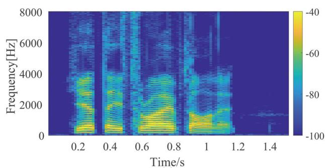  
(a)

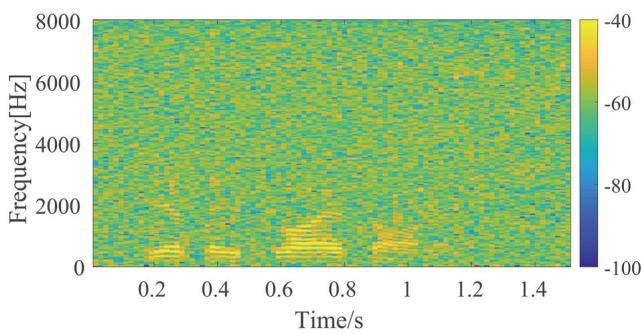  
(b)

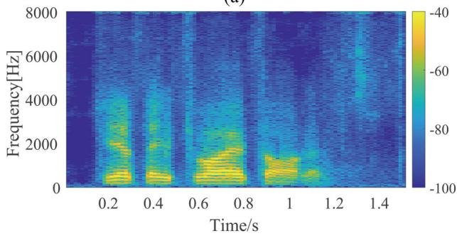

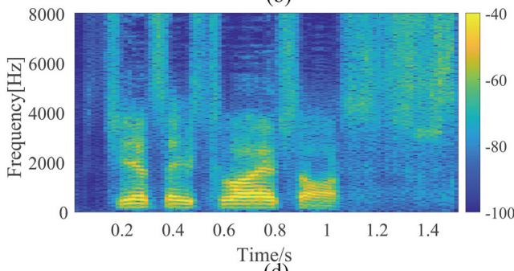

(c)  
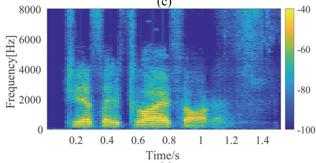  
(e)

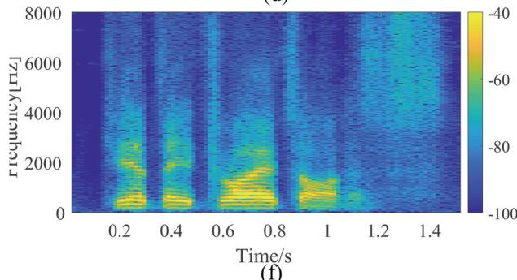  
(f)  
Fig. 1 Speech spectrograms. a Clean speech. b Noisy speech. c Speech enhanced by CRN. d Speech enhanced by DCN. e Speech enhanced by GRN. f Speech enhanced by DARCN

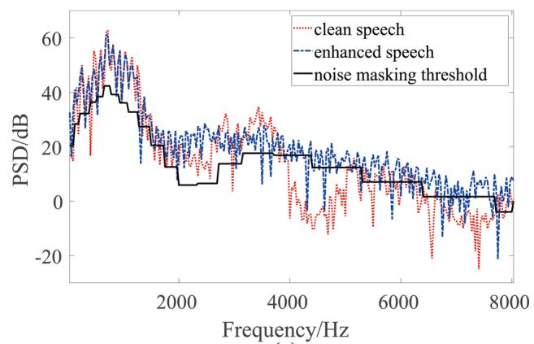  
(a)

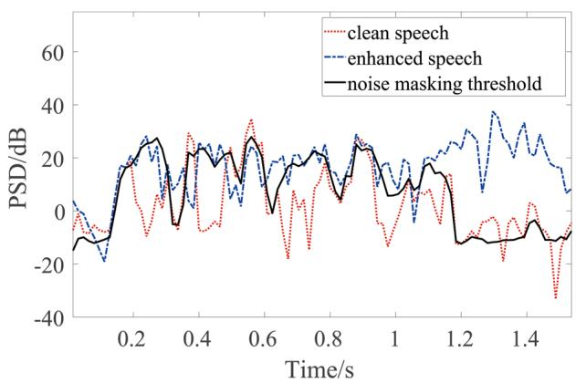  
(b)  
Fig. 2 Speech spectrums and the corresponding noise masking thresholds. a Mask threshold at 0.96 s. b Mask threshold at 4500 Hz

It should be noted that, many state-of-the-art DNNs like GRN [8], DARCN [10], and DCN [20] have already taken the artifacts into consideration and adjusted their networks by either combining multiple dilated convolutional layers or adopting sub-pixel convolution procedures, but the artificial residual noise problem still remained and influenced the auditory perception seriously. As conventional monaural speech enhancement methods are well-known for their low computational complexity and effectiveness [37], this paper utilizes conventional speech enhancement method as postprocessing for those DNN models.

The most crucial and challenging component of conventional monaural speech enhancement method is the noise PSD estimation. Once the noise PSD is estimated, then the a priori SNR can be deduced via decision-directed (DD) approach [27], and the gain function can be obtained as

$$
G (k, l) = \frac {\widehat {\xi} _ {\mathrm{DD}} (k , l)}{1 + \widehat {\xi} _ {\mathrm{DD}} (k , l)},\tag{4}
$$

where $\widehat { \xi } _ { \mathrm { D D } }$ is the estimated a priori SNR. Finally, the postfiltered signal $Z ( k , l )$ can be obtained by applying the gain function on the enhanced speech signal, namely $Z ( k , l ) =$ $G ( k , l ) Y ( k , l )$ . In the following section, the proposed noise PSD estimation methods will be illustrated.

## 3 Noise PSD estimation methods

## 3.1 MMSE-based noise PSD estimation method

When applying the unbiased MMSE-based noise PSD estimator on the enhanced speech spectrum $Y ( k , l )$ of DNNs, two hypotheses $\mathcal { H } _ { 0 } ( k , l )$ and $\mathcal { H } _ { 1 } ( k , l )$ which indicate speech absence and presence in the kth frequency bin of the lth frame, respectively, are assumed as [37]

$$
\mathcal {H} _ {0} (k, l): Y (k, l) = \widetilde {D} (k, l),\tag{5a}
$$

$$
\mathcal {H} _ {1} (k, l): Y (k, l) = \widehat {S} (k, l) + \widetilde {D} (k, l).\tag{5b}
$$

And the a posteriori probability of speech presence can be calculated using Bayes’ theorem:

$$
P \left(\mathcal {H} _ {1} | Y\right) = \left(1 + \frac {P \left(\mathcal {H} _ {0}\right)}{P \left(\mathcal {H} _ {1}\right)} \left(1 + \xi_ {\mathcal {H} _ {1}}\right) \exp \left(- \frac {| Y | ^ {2}}{\widehat {\sigma} _ {\widetilde {D}} ^ {2}} \frac {\xi_ {\mathcal {H} _ {1}}}{1 + \xi_ {\mathcal {H} _ {1}}}\right)\right) ^ {- 1},\tag{6}
$$

where the speech and noise spectral coefficients are supposed to be subject to a complex circular-symmetric Gaussian distribution, and their PSDs are defined by $\sigma _ { \widehat { S } } ^ { 2 } =$ $E \{ | \widehat { S } | ^ { 2 } \}$ and $\sigma _ { \widetilde { D } } ^ { 2 } \ = \ E \{ | \widetilde { D } | ^ { 2 } \}$ , respectively; $\xi _ { \mathcal { H } _ { 1 } }$ is a fixed a priori SNR, and $P ( \mathcal { H } _ { 0 } )$ and $P ( \mathcal { H } _ { 1 } )$ denote the a priori speech absence and presence probability, respectively. For notational convenience, the time-frame index l and the frequency index k has been discarded. As in [37], the optimal value of the a priori SNR is equal to 15 dB, which is obtained by minimizing the total probability of error when assuming the true a priori SNR ξ is uniformly distributed between 0 and 100 dB. Besides, the fixed a priori SNR can also guarantee that the two models for speech presence and speech absence differ and thus enables a posteriori SPP estimates close to zero in speech absence. Both $P ( \mathcal { H } _ { 0 } )$ and $P ( \mathcal { H } _ { 1 } )$ are set to 0.5 under the worst case assumption. Accordingly, under speech presence uncertainty, an MMSE estimator for the raw noise PSD can be obtained as

$$
E \left\{| \widetilde {D} | ^ {2} \big | Y \right\} = (1 - P (\mathcal {H} _ {1} | Y)) \left| Y \right| ^ {2} + P (\mathcal {H} _ {1} | Y) \widehat {\sigma} _ {\widetilde {D}} ^ {2},\tag{7}
$$

where $\widehat { \sigma } _ { \widetilde { D } } ^ { 2 }$ is estimated from the previous frame, i.e., $\widehat { \sigma } _ { \widetilde { D } } ^ { 2 } =$ $\widehat { \sigma } _ { \widetilde { D } } ^ { 2 } ( k , l - 1 )$ . Thus, the estimated noise PSD can be calculated using the estimated raw noise PSD by recursive averaging

$$
\widehat {\sigma} _ {\widetilde {D}} ^ {2} (k, l) = \eta \widehat {\sigma} _ {\widetilde {D}} ^ {2} (k, l - 1) + (1 - \eta) E \left\{| \widetilde {D} | ^ {2} \right| Y \},\tag{8}
$$

where $\eta = 0 . 8$ is a smoothing factor.

Once the noise PSD is very small or strongly underestimated, one can see from Eq. (6) that the SPP will be highly overestimated. Consequently, the raw noise PSD in $\operatorname { E q } .$ (7) will not be updated anymore. To avoid stagnation, the estimated SPP is calculated by recursively smoothing illustrated in [37]. Through this way, the delay of noise tracking can be effectively reduced. But even then, it still is significant, especially when dealing with highly nonstationary noise, e.g., the artificial residual noise of the enhanced speech signals of DNNs. To solve this problem, this paper presents three noise estimation strategies that can further speed up noise tracking on the base of the conventional unbiased MMSE-based noise PSD estimator.

## 3.2 Proposed noise PSD estimation methods

## 3.2.1 SPP estimation using original noisy spectrum

The first strategy is to estimate the SPP from the original noisy spectrum, $X ( k , l )$ , instead of the enhanced speech spectrum of DNNs, $Y ( k , l )$ . Namely, the notations $Y ( k , l )$ and $\widehat { \sigma } _ { \widetilde { D } } ^ { 2 }$ in Eq. (6) are substituted by $X ( k , l )$ and ${ \widehat { \sigma } } _ { D } ^ { 2 } ,$ , respectively, where ${ \widehat { \sigma } } _ { D } ^ { 2 } \ = \ E \{ | D | ^ { 2 } \}$ is the estimated noise PSD of the original noisy observation. The two hypotheses of speech absence and presence are respectively denoted as

$$
\mathcal {H} _ {0} ^ {(1)}: X (k, l) = D (k, l),\tag{9a}
$$

$$
\mathcal {H} _ {1} ^ {(1)}: X (k, l) = S (k, l) + D (k, l).\tag{9b}
$$

Thus, the a posteriori SPP can be written as

$$
\begin{array}{l} P \left(\mathcal {H} _ {1} ^ {(1)} | X\right) \\ = \left(1 + \frac {P \left(\mathcal {H} _ {0} ^ {(1)}\right)}{P \left(\mathcal {H} _ {1} ^ {(1)}\right)} (1 + \xi_ {\mathcal {H} _ {1}}) \exp \left(- \frac {| X | ^ {2}}{\widehat {\sigma} _ {D} ^ {2}} \frac {\xi_ {\mathcal {H} _ {1}}}{1 + \xi_ {\mathcal {H} _ {1}}}\right)\right) ^ {- 1}, \end{array}\tag{10}
$$

where $P ( \mathcal { H } _ { 0 } ^ { ( 1 ) } )$ and $P ( \mathcal { H } _ { 1 } ^ { ( 1 ) } )$ denote the a priori speech absence and presence probability, respectively. Similarly, we also let $P ( \mathcal { H } _ { 0 } ^ { ( 1 ) } ) = P ( \mathcal { H } _ { 1 } ^ { ( 1 ) } ) = 0 . 5$ . Subsequently, substitute $P ( \mathcal { H } _ { 1 } ^ { ( 1 ) } | X )$ for $P ( \mathcal { H } _ { 1 } | Y )$ in Eq. (7), then the estimated noise PSD can be obtained using Eq. (8). This strategy is motivated by the fact that, on the one hand, for the same speech corrupted by different types of noise, the SPP should keep consistency. On the other hand, the original noisy spectrum is relatively more stationary than that of the residual noise of DNNs, and thus, the SPP overestimation problem can be mitigated.

## 3.2.2 SPP estimation using gain functions ofDNNs

As illustrated above in Eq. (2a), if the DNN-based speech enhancement processing can be considered as a nonlinear mapping function, then the original noisy speech signal can be expressed as $X ( k , l ) ~ = ~ Y ( k , l ) + V ( k , l )$ , where $V ( k , l )$ denotes the removed noise by a certain DNN that is independent with $Y ( k , l )$ . Accordingly, the two hypotheses of speech absence and presence can be written as

$$
\mathcal {H} _ {0} ^ {(2)}: X (k, l) = V (k, l),\tag{11a}
$$

$$
\mathcal {H} _ {1} ^ {(2)}: X (k, l) = Y (k, l) + V (k, l),\tag{11b}
$$

and the time-frequency (T-F) mask $M ( k , l )$ can be deduced as

$$
\begin{array}{c} M (k, l) = \frac {E \left\{| Y (k , l) | ^ {2} \right\}}{E \left\{| X (k , l) | ^ {2} \right\}} \approx \frac {E \left\{| X (k , l) | ^ {2} \right\} - E \left\{| V (k , l) | ^ {2} \right\}}{E \left\{| X (k , l) | ^ {2} \right\}} \\ = \frac {\gamma (k , l) - 1}{\gamma (k , l)}, \end{array}\tag{12}
$$

where $\gamma ( k , l ) = E \left\{ | X ( k , l ) | ^ { 2 } \right\} / E \left\{ | V ( k , l ) | ^ { 2 } \right\}$ denotes the a posteriori SNR. In reality, $E \big \{ | Y ( \dot { k } , l ) | ^ { 2 } \big \}$ and $E \left\{ | X ( k , l ) | ^ { 2 } \right\}$ can not be obtained, so the transient T-F mask is used instead, $\mathrm { i . e . , } \overline { { M } } ( k , l ) = | Y ( k , l ) | ^ { 2 } / | X ( k , l ) | ^ { 2 }$ . According to Eq. (12), the a posteriori SNR can be calculated as

$$
\gamma (k, l) = \frac {1}{1 - \min \left(\overline {{M}} (k , l) , 0 . 9 9 9\right)},\tag{13}
$$

where the upper bound of mask $\overline { { M } } ( k , l )$ is set at 0.999 to avoid division by zero. By substituting the item $| X | ^ { 2 } / \widehat { \sigma } _ { D } ^ { 2 }$ using γ in Eq.(10), the estimated SPP based on the DNN gain function can be obtained as

$$
P \left(\mathcal {H} _ {1} ^ {(2)} | \gamma\right) = \left(1 + \frac {P \left(\mathcal {H} _ {0} ^ {(2)}\right)}{P \left(\mathcal {H} _ {1} ^ {(2)}\right)} (1 + \xi_ {\mathcal {H} _ {1}}) \exp \left(- \gamma \frac {\xi_ {\mathcal {H} _ {1}}}{1 + \xi_ {\mathcal {H} _ {1}}}\right)\right) ^ {- 1},\tag{14}
$$

where $P \left( \mathcal { H } _ { 0 } ^ { ( 2 ) } \right)$ and $P \left( \mathcal { H } _ { 1 } ^ { ( 2 ) } \right)$ denote the a priori speech absence and presence probability, respectively. Both of them are set to 0.5. Subsequently, by substituting Eq. (14) in Eqs. (7) and (8), the noise PSD can be obtained.

## 3.2.3 SPP estimation using potential prior knowledge of residual noise

The first two strategies replace the a posteriori SNR, $| Y | ^ { 2 } / \widehat { \sigma } _ { \widetilde { D } ^ { 3 } } ^ { 2 }$ , in Eq. (6) by $| X | ^ { \hat { 2 } } / \widehat { \sigma } _ { D } ^ { 2 }$ and $\gamma ,$ respectively. In this way, SPP overestimation can be mitigated when $\widehat { \sigma } _ { \widetilde { D } } ^ { 2 }$ was strongly underestimated. However, the a priori SPP $P \left( \mathcal { H } _ { 1 } ^ { ( 1 ) } \right)$ and $P \left( \mathcal { H } _ { 1 } ^ { ( 2 ) } \right)$ are set to 0.5 under the worst case assumption. Differently, the third strategy takes advantage of the relationship between the residual noise PSD and the SPP, and deduces an adaptive a priori speech presence probability, i.e., $P \left( \mathcal { H } _ { 1 } ^ { ( 3 ) } \right)$

In this strategy, we exploit the priori probability of speech presence information from the ratio between the PSDs of the original noisy speech and the enhanced speech, which is defined as

$$
\zeta (k, l) = \frac {E \left\{| X (k , l) | ^ {2} \right\}}{E \left\{| Y (k , l) | ^ {2} \right\}}.\tag{15}
$$

Assuming the clean speech and the original noise are mutually independent, and the speech component and the noise component of the enhanced speech signal are also mutually independent, then the corresponding two hypotheses of speech absence and speech presence can be expressed as

$$
\mathcal {H} _ {0} ^ {(3)}: \zeta_ {\mathcal {H} _ {0}} (k, l) = \frac {E \left\{| D (k , l) | ^ {2} \right\}}{E \left\{| \widetilde {D} _ {\mathcal {H} _ {0}} (k , l) | ^ {2} \right\}},\tag{16a}
$$

$$
\mathcal {H} _ {1} ^ {(3)}: \zeta_ {\mathcal {H} _ {1}} (k, l) = \frac {E \left\{| S (k , l) | ^ {2} \right\} + E \left\{| D (k , l) | ^ {2} \right\}}{E \left\{| \widehat {S} (k , l) | ^ {2} \right\} + E \left\{| \widetilde {D} _ {\mathcal {H} _ {1}} (k , l) | ^ {2} \right\}},\tag{16b}
$$

where $\zeta _ { \mathcal { H } _ { 0 } } ( k , l )$ and $\zeta _ { \mathcal { H } _ { 1 } } ( k , l )$ denote the PSD ratios under hypotheses $\mathcal { H } _ { 0 } ^ { ( 3 ) }$ and $\mathcal { H } _ { 1 } ^ { ( 3 ) }$ , respectively. $\vert \widetilde { D } _ { \mathcal { H } _ { 0 } } ( k , l ) \vert$ and $| \widetilde { D } _ { \mathcal { H } _ { 1 } } ( k , l ) |$ denote the residual noise spectra during speech absence and speech presence, respectively. Supposing $E \{ | \widehat { S } ( k , l ) | ^ { 2 } \} \approx \mathbf { \bar { \Gamma } } E \{ | S ( k , l ) | ^ { 2 } \}$ , then Eq. (16b) can be approximated by

$$
\zeta_ {\mathcal {H} _ {1}} (k, l) \approx \frac {1 + \xi^ {- 1} (k , l)}{1 + \widetilde {\xi} ^ {- 1} (k , l)},\tag{17}
$$

where $\xi ( k , l ) = E \left\{ | S ( k , l ) | ^ { 2 } \right\} / E \left\{ | D ( k , l ) | ^ { 2 } \right\}$ denotes the a priori SNR of original noisy speech, and $\widetilde { \xi } ( \boldsymbol { k } , l ) ~ =$

$E \{ | S ( k , l ) | ^ { 2 } \} / E \{ | \widetilde { D } _ { \mathcal { H } _ { 1 } } ( k , l ) | ^ { 2 } \}$ denotes the a priori SNR of the enhanced speech processed by DNNs. Mostly, the residual noise PSD is lower than the original noise PSD, $\mathrm { i . e . , } \widetilde { \xi } ( k , l ) \geq \xi ( k , l )$ , then we have

$$
\zeta_ {\mathcal {H} _ {1}} (k, l) \leq \frac {\widetilde {\xi} (k , l)}{\xi (k , l)} = \frac {E \{| D (k , l) | ^ {2} \}}{E \{| \widetilde {D} _ {\mathcal {H} _ {1}} (k , l) | ^ {2} \}}.\tag{18}
$$

Moreover, the residual noise PSDs in the speech absence segments are prevalently lower than that in the speech presence segments, i.e. $\dot { E } \left( | \widetilde { D } _ { \mathcal { H } _ { 0 } } | ^ { 2 } \right) \leq E \left( | \widetilde { D } _ { \mathcal { H } _ { 1 } } | ^ { 2 } \right)$ , because DNN-based speech enhancement methods tend to protect the speech from distortion during the speech presence segments by sacrificing the noise reduction amount. Thus, by comparing Eq. (16a) and Eq. (18), we can conclude that $\zeta _ { \mathcal { H } _ { 0 } } ( k , l ) \ \geq \ \zeta _ { \mathcal { H } _ { 1 } } ( k , l )$ with a high probability. Namely, the larger the value of $\zeta ( k , l )$ , the greater the probability of speech absence. Accordingly, we utilize the generalized sigmoid function as the a priori probability of speech absence $P \left( \mathcal { H } _ { 0 } ^ { ( 3 ) } \right)$ , which is defined by

$$
P \left(\mathcal {H} _ {0} ^ {(3)}\right) = \frac {1}{1 + \exp (- \alpha \zeta (k , l) + \beta)},\tag{19}
$$

where α and $\beta$ are two non-negative parameters, which satisfy $\alpha = 1 . 1 8$ and $\beta = 0 . 5 ,$ , respectively. Note that $\beta$ is set to be non-negative to limit the value of $P ( \mathcal { H } _ { 0 } )$ , so that speech distortion can be reduced. By substituting Eq. (19) in Eq. (6), the SPP based on priori knowledge of speech presence can be obtained as

$$
\begin{array}{l} P \left(\mathcal {H} _ {1} ^ {(3)} | Y\right) \\ = \left(1 + \frac {P \left(\mathcal {H} _ {0} ^ {(3)}\right)}{P \left(\mathcal {H} _ {1} ^ {(3)}\right)} \left(1 + \xi_ {\mathcal {H} _ {1}}\right) \exp \left(- \frac {| Y | ^ {2}}{\widehat {\sigma} _ {\widetilde {D}} ^ {2}} \frac {\xi_ {\mathcal {H} _ {1}}}{1 + \xi_ {\mathcal {H} _ {1}}}\right)\right) ^ {- 1}, \end{array}\tag{20}
$$

where $P \left( \mathcal { H } _ { 1 } ^ { ( 3 ) } \right) = 1 - P \left( \mathcal { H } _ { 0 } ^ { ( 3 ) } \right)$ . Similarly, the estimate noise PSD can be estimated by substituting Eq. (20) into $\operatorname { E q . } \left( 7 \right)$ and Eq. (8).

Finally, we substitute the noise PSD estimated from each noise PSD estimator described above into Eq. (6), and by applying the MCRA method [33], a smoother noise PSD can be estimated, which is beneficial for avoiding speech distortion as well as music noise.

## 3.3 Computational complexity comparison

In this part, the computational complexity of the aforementioned 4 typical DNN-based speech enhancement algorithms and the 3 proposed postfiltering methods are evaluated and compared. Their floating point operations (FLOPs) per frame are summarized in Table 1. As shown in Table 1, the FLOPs of the proposed 3 postfiltering methods are far lower than that of the 4 typical DNN-based speech enhancement methods, indicating that when using the proposed 3 postfiltering methods, there is almost no additional amount of computation.

## 4 Experiments and discussion

## 4.1 Noise tracking and reduction performance

Section 3.2 presents three strategies of noise PSD estimation to solve the SPP overestimation problem. In this section, numerous experiments were conducted to demonstrate the negative effects of SPP overestimation by using the conventional MMSE-based noise PSD estimation method and to validate the perceptual speech quality improvement by using the three proposed SPP estimation strategies. In the following, postfiltering based on conventional MMSE noise PSD estimation is referred to as SPP-MMSE, and the postfilters proposed in Sections 3.2.1, 3.2.2, and 3.2.3, using $P \left( \mathcal { H } _ { 1 } ^ { ( 1 ) } | X \right) , P \left( \mathcal { H } _ { 1 } ^ { ( 2 ) } | \gamma \right)$ , and $P \left( \mathcal { H } _ { 1 } ^ { ( 3 ) } | Y \right)$ , are referred to as SPP-proposed-1, SPP-proposed-2, and SPP-proposed-3, respectively.

To compare the noise PSD estimation performance of the conventional MMSE-based noise PSD estimation method and that of the proposed three strategies, the residual noise PSD needs to be calculated first. Assuming the speech component and the noise component in Eq. (2c) are mutually uncorrelated, then we have $E \left\{ | \dot { Y ( k , l ) } | ^ { 2 } \right\} = E \left\{ | \widehat { S } ( k , l ) | ^ { 2 } \right\} + E \left\{ | \widetilde { D } ( k , l ) | ^ { 2 } \right\}$ . If we rewrite Eq. (12) as

$$
\begin{array}{c} E \left\{| Y (k, l) | ^ {2} \right\} = M (k, l) E \left\{| X (k, l) | ^ {2} \right\} \\ \approx M (k, l) \left(E \left\{| S (k, l) | ^ {2} \right\} + E \left\{| D (k, l) | ^ {2} \right\}\right), \end{array}\tag{21}
$$

then the approximate residual noise PSD can be obtained as ${ \cal E } \left\{ | \widetilde D ( \bar { k } , \bar { l } ) | ^ { 2 } \right\} ~ \approx ~ { \cal M } ( k , l ) { \cal E } \left\{ | D ( k , l ) | ^ { 2 } \right\}$ . As $M ( k , l )$ is hard to know in reality, the transient mask $\overline { { \boldsymbol { M } } } ( \boldsymbol { k } , \boldsymbol { l } ) \ =$ $| Y ( k , l ) | ^ { 2 } / | X ( k , l ) | ^ { 2 }$ was used instead. Figure 3 plots their noise PSD estimation results under white noise and babble noise. Figure 3a and b show the enhanced speech PSDs of DCN [20], the corresponding residual noise PSDs and the estimate noise PSDs of different noise estimation methods at 800 Hz and 4500 Hz, respectively, where the background noise was white Gaussian noise with SNR set at 0 dB. Figure 3c and d show the results under babble noise with the same SNR.

Table 1 The FLOPs per frame of CRN, DCN, GRN, DARCN, and the 3 proposed posterfiltering methods

<table><tr><td rowspan="2">Method</td><td colspan="4">DNNs</td><td colspan="3">Postfiltering methods</td></tr><tr><td>CRN</td><td>DCN</td><td>GRN</td><td>DARCN</td><td>SPP-proposed-1</td><td>SPP-proposed-2</td><td>SPP-proposed-3</td></tr><tr><td>MFLOPs</td><td>32.22</td><td>46.68</td><td>10.40</td><td>64.66</td><td>0.014</td><td>0.0098</td><td>0.016</td></tr></table>

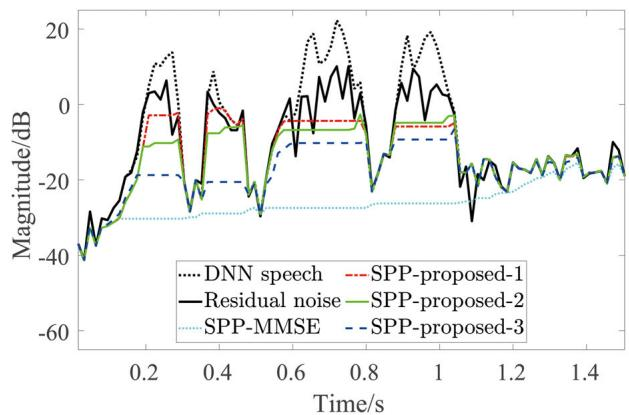  
(a)

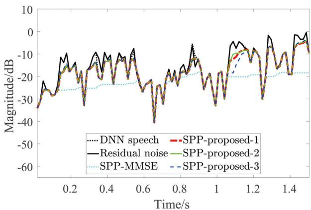  
(b)

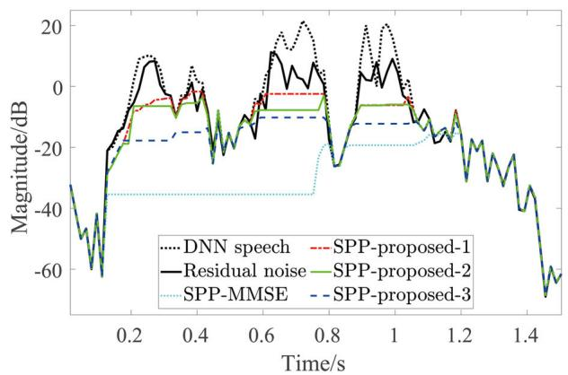  
(c)

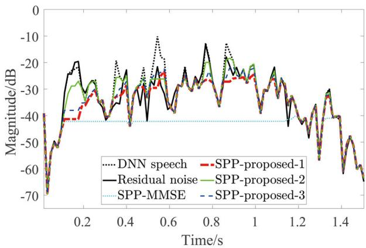  
(d)  
Fig. 3 Noise PSD estimate results. a Noise PSD estimate results at 800 Hz under white noise. b Noise PSD estimate results at 4500 Hz under white noise. c Noise PSD estimate results at 800 Hz under babble noise. d Noise PSD estimate results at 4500 Hz under babble noise

As shown in Fig. 3, the noise tracking performance of the conventional MMSE-based noise PSD estimation method named as SPP-MMSE is the worst one under the two types of noise scenarios. This is because the SPP was overestimated. In contrast, the noise PSD estimation methods proposed in this paper show better noise tracking performances than SPP-MMSE. As shown in Fig. 3a and c, among the proposed methods, SPP-proposed-3 can not track the noise PSD as fast as the others, because this method is based on the SPP $P ( \mathcal { H } _ { 1 } ^ { ( 3 ) } | Y )$ , which uses the same a posteriori SNR as SPP-MMSE and has the SPP overestimation problem as well. By comparing Fig. 3b and d, it can be seen that when the background noise is white noise and the frequency is equal to 4500 Hz, SPP-proposed-1 has the fastest noise tracking capability, and thus shows the most impressive noise PSD estimation performance. But when the background noise is babble noise, SPP-proposed-2 outperforms SPP-proposed-1.

This is because the babble noise has more energy in the low-frequency band than that in the high-frequency band, so the a posteriori SNR at high frequency bins, e.g., 4500 Hz, is relatively high. When using the original noisy signal to estimate the SPP, the noise tracking can be impacted. In contrast, as SPP-proposed-2 utilizes the enhanced speech signals obtained from the DNN-based methods to calculate the a posteriori SNR, the resulting noise energy is almost uniform after the processing of DNNs. As a result, SPP-proposed-2 shows faster noise tracking than SPPproposed-1 under babble noise. Notably, when SNR is relatively high, e.g., more than 10 dB during 0.6 s and 0.8 s, all the noise PSD estimators may underestimate the noise PSD. This is because during the time interval with high SNR, the estimated SPPs of these estimators approach to 1, and thus the noise PSD will not update anymore. This property is helpful to reduce the speech distortion.

To intuitively observe the noise reduction performance of the post-filters, we demonstrated the speech spectrograms before and after postfiltering in Fig. 4, where the tested speech was the same with Fig. 1 and the DARCN was chosen as an example of typical DNNs. Figure 4a is the clean speech. Figure 4b is the enhanced speech processed by DARCN. Figure 4c–f illustrate the postprocessed speech spectrograms using conventional MMSEbased noise PSD estimation method and the proposed three strategies, respectively. It can be seen from Fig. 4c that considerable residual noise remains, this is due to the overestimated SPP of the conventional unbiased MMSEbased noise PSD estimator impacting the noise tracking. In contrast, the proposed three methods have better noise reduction performance, whereas the results of the three proposed methods are similar. In order to observe and compare these postfiltering methods more comprehensively, numerous objective and subjective experiments were conducted in the following part.

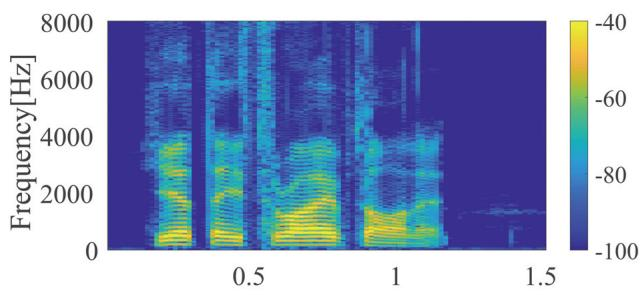  
(a)

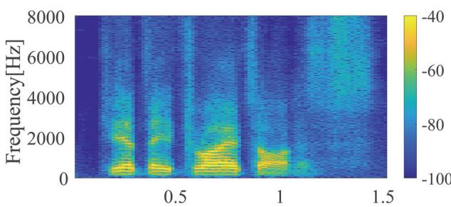  
Time/s  
(b)

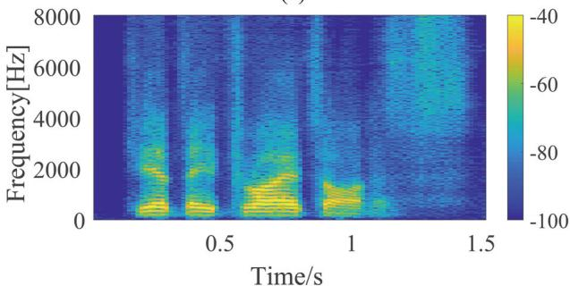

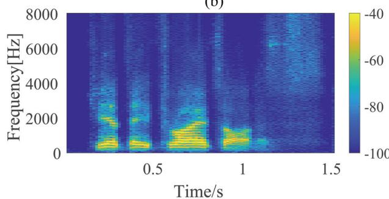

(c)  
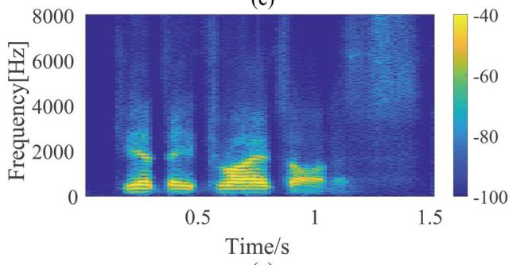  
(e)

(d)  
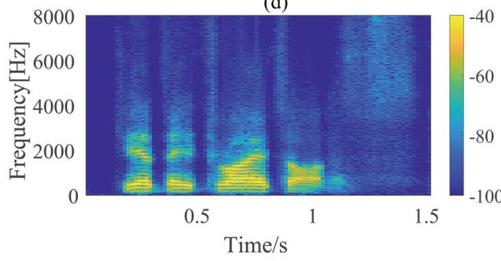  
(f)  
Fig. 4 Speech spectrograms before and after postprocessing. a Clean speech. b Speech enhanced by DARCN. c DARCN with postfiltering based on SPP-MMSE. d DARCN with postfiltering based on SPP-proposed-1. e DARCN with postfiltering based on SPP-proposed-2. f DARCN with postfiltering based on SPP-proposed-3

## 4.2 Objective evaluation

We utilized the perceptual evaluation of speech quality (PESQ) [23], the segmental SNR (segSNR) [44], and the short-time objective intelligibility (STOI) [45] to evaluate the speech quality improvement, the noise reduction performance, and the speech intelligibility improvement of the aforementioned postfiltering methods. Table 2 gives the average PESQ scores of the noisy speech, the enhanced speech of typical DNNs, and the postfiltered speech signals with SNR set at 5 dB, 0 dB, 5 dB, and 10 dB. Under each SNR, 10 utterances of the same test set with the Section 2.2 were chosen, and the background noise for each clean speech signal was chosen randomly from NOISEX-92.

From Table 2, it is obvious that through postfiltering, the speech quality of the enhanced speech processed by typical DNNs such as CRN, DCN, GRN, and DARCN can be remarkably improved. Besides, all the proposed postfiltering strategies show better performance than the conventional MMSE-based postfilter. Among the proposed methods, SPP-proposed-1 can obtain the highest average PESQ score. One can see that when applying SPP-proposed-1 on GRN with the SNR equal to 10 dB, the PESQ score could be improved up to 0.18, that was 0.12 higher than SPP-MMSE, indicating its prominent speech quality improvement ability. By comparing SPPproposed-2 and SPP-proposed-3, it can be observed that when dealing with the enhanced speech signals of CRN, DCN, and GRN, SPP-proposed-2 showed slightly better performance than SPP-proposed-3, but when dealing with the enhanced speech signals of DARCN, SPP-proposed-3 gained more PESQ scores than SPP-proposed-2. This is because SPP-proposed-3 tended to underestimate noise PSD than other two strategies as shown in Fig. 3, and the residual noise PSD of DARCN may be smaller than that of other DNNs [10], making SPP-proposed-3 fits DARCN better than SPP-proposed-2.

Table 2 The average PESQ scores with and without postfiltering for the typical DNN-based speech enhancement methods

<table><tr><td>SNR/dB</td><td>-5</td><td>0</td><td>5</td><td>10</td><td>Aver.</td><td>SNR/dB</td><td>-5</td><td>0</td><td>5</td><td>10</td><td>Aver.</td></tr><tr><td>Noisy</td><td>1.32</td><td>1.66</td><td>2.00</td><td>2.40</td><td>1.85</td><td>Noisy</td><td>1.32</td><td>1.66</td><td>2.00</td><td>2.40</td><td>1.85</td></tr><tr><td>CRN</td><td>1.94</td><td>2.55</td><td>2.78</td><td>3.10</td><td>2.59</td><td>DCN</td><td>1.89</td><td>2.46</td><td>2.75</td><td>3.06</td><td>2.54</td></tr><tr><td>SPP-MMSE</td><td>2.00</td><td>2.59</td><td>2.83</td><td>3.19</td><td>2.65</td><td>SPP-MMSE</td><td>1.90</td><td>2.48</td><td>2.79</td><td>3.12</td><td>2.57</td></tr><tr><td>SPP-proposed-1</td><td>2.03</td><td>2.70</td><td>2.94</td><td>3.28</td><td>2.74</td><td>SPP-proposed-1</td><td>1.99</td><td>2.58</td><td>2.93</td><td>3.23</td><td>2.68</td></tr><tr><td>SPP-proposed-2</td><td>2.03</td><td>2.68</td><td>2.92</td><td>3.27</td><td>2.73</td><td>SPP-proposed-2</td><td>2.01</td><td>2.57</td><td>2.90</td><td>3.22</td><td>2.68</td></tr><tr><td>SPP-proposed-3</td><td>2.03</td><td>2.69</td><td>2.90</td><td>3.23</td><td>2.71</td><td>SPP-proposed-3</td><td>1.96</td><td>2.57</td><td>2.86</td><td>3.19</td><td>2.65</td></tr><tr><td>GRN</td><td>1.96</td><td>2.57</td><td>2.75</td><td>2.94</td><td>2.56</td><td>DARCN</td><td>1.97</td><td>2.65</td><td>2.86</td><td>3.15</td><td>2.66</td></tr><tr><td>SPP-MMSE</td><td>1.95</td><td>2.59</td><td>2.77</td><td>3.00</td><td>2.58</td><td>SPP-MMSE</td><td>1.96</td><td>2.70</td><td>2.90</td><td>3.22</td><td>2.70</td></tr><tr><td>SPP-proposed-1</td><td>2.03</td><td>2.71</td><td>2.89</td><td>3.12</td><td>2.69</td><td>SPP-proposed-1</td><td>2.00</td><td>2.80</td><td>3.00</td><td>3.33</td><td>2.78</td></tr><tr><td>SPP-proposed-2</td><td>2.03</td><td>2.71</td><td>2.86</td><td>3.11</td><td>2.68</td><td>SPP-proposed-2</td><td>1.96</td><td>2.74</td><td>2.95</td><td>3.27</td><td>2.73</td></tr><tr><td>SPP-proposed-3</td><td>2.01</td><td>2.70</td><td>2.85</td><td>3.06</td><td>2.66</td><td>SPP-proposed-3</td><td>1.99</td><td>2.80</td><td>2.96</td><td>3.31</td><td>2.77</td></tr></table>

Table 3 gives the average segSNRs of the noisy speech signals, the enhanced speech signals of typical DNNs and the postfiltered speech signals with SNR set at 5 dB, 0 dB, 5 dB, and 10 dB, respectively. The simulated data was in accordance with Table 2. As shown in Table 3, the conventional MMSE-based postfiltering method had already improved the segmental SNR of the enhanced speech signals of typical DNNs, and the proposed postfiltering strategies showed better performance than SPP-MMSE. Among the three proposed strategies, SPP-proposed-1 and SPP-proposed-3 obtained more segmental SNRs than SPP-proposed-2. Note that, when the SNRs were equal to 5 dB and 5 dB, SPP-proposed-1 could mostly gain higher segmental SNR than SPP-proposed-3. In contrast, when the SNRs were equal to 0 dB and 10 dB, SPP-proposed-3 gained higher segmental SNR than SPPproposed-1.

Table 4 gives the average STOIs of the noisy speech signals, the enhanced speech signals of typical DNNs and the postfiltered speech signals with SNR set at 5 dB, 0 dB, 5 dB, and 10 dB, respectively. From Table 4, it can be seen that almost all the postfiltering processing might reduce the speech intelligibility. This is because the 4 state-of-the-art DNN models were very excellent in speech intelligibility improvement, especially when the input SNR was relatively low, and although the postfiltering processing could reduce the residual noise, it also introduced some speech distortion as well. As the

Table 3 The average segSNRs with and without postfiltering for the typical DNN-based speech enhancement methods

<table><tr><td>SNR/dB</td><td>-5</td><td>0</td><td>5</td><td>10</td><td>Aver.</td><td>SNR/dB</td><td>-5</td><td>0</td><td>5</td><td>10</td><td>Aver.</td></tr><tr><td>Noisy</td><td>-7.00</td><td>-4.06</td><td>-0.85</td><td>2.69</td><td>-2.31</td><td>Noisy</td><td>-7.00</td><td>-4.06</td><td>-0.85</td><td>2.69</td><td>-2.31</td></tr><tr><td>CRN</td><td>-0.03</td><td>3.61</td><td>5.62</td><td>9.18</td><td>4.60</td><td>DCN</td><td>-0.28</td><td>3.25</td><td>5.68</td><td>8.82</td><td>4.37</td></tr><tr><td>SPP-MMSE</td><td>0.46</td><td>4.10</td><td>6.14</td><td>9.71</td><td>5.10</td><td>SPP-MMSE</td><td>0.26</td><td>3.65</td><td>6.14</td><td>9.40</td><td>4.86</td></tr><tr><td>SPP-proposed-1</td><td>1.34</td><td>4.50</td><td>6.75</td><td>9.95</td><td>5.64</td><td>SPP-proposed-1</td><td>1.34</td><td>4.28</td><td>6.79</td><td>9.70</td><td>5.53</td></tr><tr><td>SPP-proposed-2</td><td>1.27</td><td>4.38</td><td>6.60</td><td>9.76</td><td>5.50</td><td>SPP-proposed-2</td><td>1.30</td><td>4.15</td><td>6.59</td><td>9.50</td><td>5.39</td></tr><tr><td>SPP-proposed-3</td><td>1.25</td><td>4.62</td><td>6.68</td><td>10.05</td><td>5.65</td><td>SPP-proposed-3</td><td>1.32</td><td>4.29</td><td>6.64</td><td>9.76</td><td>5.50</td></tr><tr><td>GRN</td><td>0.11</td><td>3.99</td><td>6.02</td><td>9.28</td><td>4.85</td><td>DARCN</td><td>0.67</td><td>3.99</td><td>6.13</td><td>9.10</td><td>4.97</td></tr><tr><td>SPP-MMSE</td><td>0.57</td><td>4.28</td><td>6.33</td><td>9.62</td><td>5.20</td><td>SPP-MMSE</td><td>1.10</td><td>4.46</td><td>6.48</td><td>9.37</td><td>5.35</td></tr><tr><td>SPP-proposed-1</td><td>1.66</td><td>4.79</td><td>6.97</td><td>9.90</td><td>5.83</td><td>SPP-proposed-1</td><td>1.73</td><td>4.66</td><td>6.69</td><td>9.40</td><td>5.62</td></tr><tr><td>SPP-proposed-2</td><td>1.53</td><td>4.67</td><td>6.80</td><td>9.76</td><td>5.69</td><td>SPP-proposed-2</td><td>1.35</td><td>3.98</td><td>5.87</td><td>8.34</td><td>4.89</td></tr><tr><td>SPP-proposed-3</td><td>1.57</td><td>4.91</td><td>6.87</td><td>9.93</td><td>5.82</td><td>SPP-proposed-3</td><td>1.73</td><td>4.85</td><td>6.75</td><td>9.60</td><td>5.73</td></tr></table>

Table 4 The average STOIs (%) with and without postfiltering for the typical DNN-based speech enhancement methods

<table><tr><td>SNR/dB</td><td>-5</td><td>0</td><td>5</td><td>10</td><td>Aver.</td><td>SNR/dB</td><td>-5</td><td>0</td><td>5</td><td>10</td><td>Aver.</td></tr><tr><td>Noisy</td><td>60.12</td><td>73.29</td><td>85.89</td><td>91.30</td><td>77.65</td><td>Noisy</td><td>60.12</td><td>73.29</td><td>85.89</td><td>91.30</td><td>77.65</td></tr><tr><td>CRN</td><td>77.46</td><td>86.82</td><td>93.93</td><td>95.70</td><td>88.48</td><td>DCN</td><td>79.46</td><td>86.10</td><td>93.78</td><td>95.73</td><td>88.77</td></tr><tr><td>SPP-MMSE</td><td>76.95</td><td>86.55</td><td>93.67</td><td>95.71</td><td>88.22</td><td>SPP-MMSE</td><td>78.92</td><td>85.61</td><td>93.59</td><td>95.79</td><td>88.48</td></tr><tr><td>SPP-proposed-1</td><td>75.28</td><td>84.70</td><td>92.76</td><td>95.46</td><td>87.05</td><td>SPP-proposed-1</td><td>76.89</td><td>84.06</td><td>92.72</td><td>95.56</td><td>87.31</td></tr><tr><td>SPP-proposed-2</td><td>75.42</td><td>84.84</td><td>92.41</td><td>95.03</td><td>86.93</td><td>SPP-proposed-2</td><td>77.56</td><td>84.28</td><td>92.17</td><td>95.37</td><td>87.34</td></tr><tr><td>SPP-proposed-3</td><td>75.51</td><td>85.65</td><td>93.62</td><td>95.83</td><td>87.65</td><td>SPP-proposed-3</td><td>77.27</td><td>85.21</td><td>93.46</td><td>95.91</td><td>87.96</td></tr><tr><td>GRN</td><td>79.52</td><td>87.93</td><td>94.23</td><td>95.71</td><td>89.35</td><td>DARCN</td><td>79.44</td><td>88.99</td><td>94.02</td><td>95.64</td><td>89.52</td></tr><tr><td>SPP-MMSE</td><td>79.36</td><td>87.79</td><td>94.03</td><td>95.66</td><td>89.21</td><td>SPP-MMSE</td><td>79.26</td><td>88.92</td><td>93.89</td><td>95.63</td><td>89.43</td></tr><tr><td>SPP-proposed-1</td><td>77.34</td><td>85.94</td><td>93.15</td><td>95.60</td><td>88.01</td><td>SPP-proposed-1</td><td>76.95</td><td>86.73</td><td>92.83</td><td>95.37</td><td>87.97</td></tr><tr><td>SPP-proposed-2</td><td>77.61</td><td>86.28</td><td>92.67</td><td>94.97</td><td>87.88</td><td>SPP-proposed-2</td><td>77.54</td><td>86.41</td><td>91.51</td><td>93.75</td><td>87.30</td></tr><tr><td>SPP-proposed-3</td><td>77.94</td><td>87.06</td><td>94.08</td><td>95.86</td><td>88.74</td><td>SPP-proposed-3</td><td>77.65</td><td>87.37</td><td>93.74</td><td>95.58</td><td>88.59</td></tr></table>

DNN-based speech enhancement algorithms have already improved the speech intelligibility obviously, the STOI improvement performance of the postfiltering processing is not that important. In the following, we mainly analyze the influences of the proposed three strategies on the PESQ scores and the segSNRs.

As shown in Tables 2 and 3, the PESQ scores and the segSNRs can be affected by the type of the DNN models and the input SNRs. To investigate how the DNN model and the input SNR affect the average PESQ scores and the segSNRs, we analyzed the data of Tables 2 and 3 through a two-way analysis of variances (ANOVA) [46]. The testing result showed that, on the one hand, both the input SNR and the DNN model had significant effects on PESQ scoring. Their F values were $F ( 3 , 8 0 ) \ = \ 1 3 2 4 . 4 2 2 \ ( p \ <$ 0.001) and F(3, 80) 12.195 (p < 0.001), respectively. Moreover, the effect of SNR depended on the effect of DNN model [ F(9, 80) = 3.866, p < 0.001]. On the other hand, the input SNR was of statistical significance to segSNR [ F(3, 80) 256.048, p < 0.001], but the DNN model had no significant difference in segSNR [ F(3, 80)  1.799, p  0.156]. Besides, there was no inter-action effect between SNR and DNN model on segSNR [ F(9, 80) 0.930, p 0.506]. It can be seen that the SNR has significant effect on both PESQ scoring and segSNR when using the same DNN model.

As the background noise was randomly chosen from NOISEX-92 dataset under different SNRs, the types of noise under each SNR were not uniformly distributed. In order to investigate how the type of noise can affect the PESQ score and the segSNR, 4 types of noise with SNR 5, 0, 5, 10 dBs were further tested and compared, including white noise, babble noise, factory noise and f16 noise. The average improvement of segSNRs and PESQ scores are shown in Table 5, where PESQ and segSNR mean PESQ score increment and segSNR increment, respectively. From Table 5, it can be seen that the PESQ score improvement was highly correlated with the type of noise. When the background noise was babble noise or factory noise, SPP-proposed-2 could obtain the highest PESQ score improvement. Moreover, SPPproposed-1 and SPP-proposed-3 showed impressive performance when the background noise was white noise and f16, respectively. As for segSNR, SPP-proposed-3 outperformed others in most cases. But the segSNR metric seemed related to the type of DNN model. For example, when using CRN and DCN models, SPP-proposed-1 could obtain higher segSNR than SPP-proposed-3.

Similarly, we utilized a two-way ANOVA to investigate how important of the effects of DNN model and the noise type on the average PESQ score and segSNR improvements, and the result showed that the noise type had significant effects on both the PESQ $[ F ( 3 , 8 0 ) ~ =$ 211.550, p < 0.001] and the segSNR improvements [ F(3, 80) = 31.311, p < 0.001]. Moreover, the DNN model has significant difference for PESQ scoring [ F(3, 80) = 30.209, p < 0.001], but has no significant difference for segSNR [ F(3, 80) 3.742, p 0.015]. Besides, there is an interaction effect between the noise type and the DNN model on PESQ scoring [ F(9, 80) = 3.879, p  0.001] and segSNR improvement [ F(9, 80) 3.979, p 0.001]. By combining Table 5 with the result of the two-way ANOVA, it can be seen that the three proposed postfiltering methods fit different types of background noise in terms of PESQ and segSNR. But the effect of noise type on both PESQ and segSNR depends on that of the DNN model. Among the 4 tested typical DNN models, DARCN showed the best performance of speech quality improvement.

Overall, we can draw a conclusion that, all the proposed strategies have better performance than the conventional MMSE-based noise PSD estimator. Moreover, the performances of the three proposed strategies depend heavily on the input SNR and the noise type in terms of PESQ scoring and segSNR improvement. As shown in Table 2, SPP-proposed-1 which only relies on the original noisy speech outperforms others in terms of PESQ in most cases, followed by SPP-proposed-3. As shown in Table 3, SPP-proposed-3 outperforms others in terms of segSNR in most cases. Besides, DARCN can obtain higher PESQ scores and segSNRs than other 3 typical DNN models in most cases.

Table 5 The average PESQ scores increment and segSNRs increment with and without postfiltering for the typical DNN-based speech enhancement methods under the assigned types of noise

<table><tr><td rowspan="2">Objective metrics Noise type</td><td colspan="4">ΔPESQ</td><td colspan="4">ΔsegSNR</td></tr><tr><td>White</td><td>Babble</td><td>f16</td><td>Factory</td><td>White</td><td>Babble</td><td>f16</td><td>Factory</td></tr><tr><td>CRN</td><td>1.02</td><td>0.53</td><td>0.71</td><td>0.74</td><td>6.63</td><td>4.58</td><td>4.35</td><td>4.96</td></tr><tr><td>SPP-MMSE</td><td>1.08</td><td>0.55</td><td>0.75</td><td>0.75</td><td>7.39</td><td>5.22</td><td>5.00</td><td>5.75</td></tr><tr><td>SPP-proposed-1</td><td>1.16</td><td>0.61</td><td>0.89</td><td>0.81</td><td>7.83</td><td>5.58</td><td>5.69</td><td>6.07</td></tr><tr><td>SPP-proposed-2</td><td>1.16</td><td>0.64</td><td>0.88</td><td>0.85</td><td>7.85</td><td>5.59</td><td>5.59</td><td>6.18</td></tr><tr><td>SPP-proposed-3</td><td>1.17</td><td>0.6</td><td>0.86</td><td>0.81</td><td>8.00</td><td>5.72</td><td>5.68</td><td>6.34</td></tr><tr><td>DCN</td><td>0.83</td><td>0.54</td><td>0.75</td><td>0.68</td><td>5.37</td><td>4.82</td><td>5.17</td><td>5.34</td></tr><tr><td>SPP-MMSE</td><td>0.90</td><td>0.56</td><td>0.79</td><td>0.69</td><td>5.77</td><td>5.31</td><td>5.95</td><td>5.99</td></tr><tr><td>SPP-proposed-1</td><td>0.99</td><td>0.61</td><td>0.90</td><td>0.72</td><td>6.48</td><td>5.71</td><td>6.69</td><td>6.32</td></tr><tr><td>SPP-proposed-2</td><td>0.98</td><td>0.65</td><td>0.89</td><td>0.79</td><td>6.44</td><td>5.76</td><td>6.55</td><td>6.41</td></tr><tr><td>SPP-proposed-3</td><td>1.02</td><td>0.59</td><td>0.87</td><td>0.74</td><td>6.52</td><td>5.76</td><td>6.61</td><td>6.56</td></tr><tr><td>GRN</td><td>1.02</td><td>0.6</td><td>0.77</td><td>0.67</td><td>6.64</td><td>5.01</td><td>5.21</td><td>5.57</td></tr><tr><td>SPP-MMSE</td><td>1.07</td><td>0.61</td><td>0.8</td><td>0.67</td><td>6.89</td><td>5.28</td><td>5.8</td><td>5.86</td></tr><tr><td>SPP-proposed-1</td><td>1.18</td><td>0.69</td><td>0.90</td><td>0.72</td><td>7.65</td><td>5.77</td><td>6.50</td><td>6.22</td></tr><tr><td>SPP-proposed-2</td><td>1.18</td><td>0.71</td><td>0.88</td><td>0.78</td><td>7.64</td><td>5.81</td><td>6.39</td><td>6.35</td></tr><tr><td>SPP-proposed-3</td><td>1.20</td><td>0.67</td><td>0.89</td><td>0.73</td><td>7.78</td><td>5.86</td><td>6.51</td><td>6.47</td></tr><tr><td>DARCN</td><td>1.06</td><td>0.71</td><td>0.92</td><td>0.86</td><td>6.42</td><td>5.29</td><td>5.76</td><td>5.76</td></tr><tr><td>SPP-MMSE</td><td>1.15</td><td>0.71</td><td>0.95</td><td>0.88</td><td>6.88</td><td>5.72</td><td>6.48</td><td>6.43</td></tr><tr><td>SPP-proposed-1</td><td>1.17</td><td>0.80</td><td>1.02</td><td>0.92</td><td>7.32</td><td>5.98</td><td>6.88</td><td>6.65</td></tr><tr><td>SPP-proposed-2</td><td>1.13</td><td>0.76</td><td>0.95</td><td>0.90</td><td>6.89</td><td>5.59</td><td>6.42</td><td>6.30</td></tr><tr><td>SPP-proposed-3</td><td>1.20</td><td>0.78</td><td>1.01</td><td>0.93</td><td>7.52</td><td>6.12</td><td>6.98</td><td>6.92</td></tr></table>

## 4.3 Subjective evaluation

## 4.3.1 Participants and listening test procedure

In this subsection, the perceptual speech quality of the proposed postfiltering strategies were investigated through AB listening tests follows the procedures in [45]. The experiment was conducted in a quiet room, and 16 audiologically normal-hearing subjects aged from 25 to 35 years old participated in the listening tests; all of them were graduate students or teachers at the Institute of Acoustics, Chinese Academy of Sciences. Each listening test consisted of stimuli pairs played back blindly and in randomized order over a closed circumaural headphone at a comfortable listening level, and the participants were presented with three options on a computer, where the first two options indicated a preference for the corresponding stimuli, the third option denoted a similar preference for both stimuli. Participants were told to grade those stimulus in terms of the speech naturalness. The stimuli awarded in each test listening was given a score of

1, and the other was given a 0. For the similar preference pairs, each stimuli was given a score of 0.5.

In the implementation, the same stimulus with Section 4.2 were used, where for each of the four typical DNNs including CRN, DCN, GRN, and DARCN, 4 SNRs including 5 dB, 0 dB, 5 dB, and 10 dB were considered, and for each SNR, 5 utterances were chosen to be tested. Three proposed noise PSD estimators including SPP-proposed-1, SPP-proposed-2, and SPP-proposed-3 were compared with SPP-MMSE and DNNs as well as the clean speech signals to validate the effectiveness of the proposed methods. For each stimuli pair, 3 of 5 different sentences to be played back under a certain SNR were randomly chosen in a random order. Namely, there are 45 (3 sentences 15 pairs) stimuli pairs in total provided to every participant. Note that the type of DNNs within each stimuli pair was kept consistent but was independent with other pairs, which was randomly chosen from CRN, DCN, GRN, and DARCN. Finally, the preference scoring results were given in terms of percentages.

## 4.3.2 Results ofsubjective listening tests

Figure 5 gives the boxplot of the subjective listening test, where the scoring percentages indicate the average preferences of the participants and “DNN” is referred to the aforementioned four typical DNN models. It can be

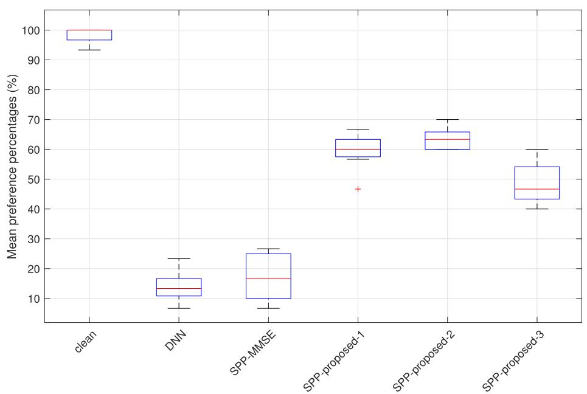  
Fig. 5 Mean subjective preference scores (%) for different methods

seen from Fig. 5 that the clean speech has the highest preference score while the enhanced speech with DNNs has the lowest scores. This was caused by the artificial noise contained in the enhanced speech signals. The score of SPP-MMSE was slightly higher than DNN, which means that the performance of the conventional MMSEbased postfiltering method could be degraded a lot when dealing with the enhanced speech signals of DNNs. On the contrast, the proposed three methods gained much higher preference scores than SPP-MMSE, indicating the validity of the proposed noise PSD estimation strategies. Among the three strategies, SPP-proposed-1 and SPPproposed-2 outperformed SPP-proposed-3, and both of their preference percentages were over 60%. Even though SPP-proposed-3 could not perform as well as the other two proposed strategies, its scoring percentages was 30% higher than SPP-MMSE. Notably, the improvements of PESQ as well as segSNR in Section 4.2 were not that significant, but the subjective evaluation showed an impressive improvement, indicating there was a gap between the subjective and objective evaluation. This is because on the one hand, the segSNR metric that shows the noise reduction amount is weakly related to humans’ auditory perception. On the other hand, PESQ is also limited that has been proven to have considerable difference from the mean opinion score (MOS) in [47], where the subjective evaluation showed a strong improvement, but the PESQ scoring showed a degradation, so that even though the improvement of PESQ scores and the segSNRs were small, the subjective evaluation could still have a significant improvement.

## 5 Conclusion

This paper firstly analyzed the common properties of the artificial residual noise of DNN-based speech enhancement methods and found that the residual noise was non-stationary and had considerable energy that often exceeded the noise masking threshold, making the enhanced speech signals annoying to a human listener. The conventional postfiltering method could not reduce the residual noise effectively due to the overestimation of the speech presence probability. To solve this problem, three postfiltering strategies based on MMSE noise PSD estimation method were proposed. The first two strategies estimated the speech presence probability by using the redefined a posteriori SNRs, and the third strategy estimated the speech presence probability by using the estimated adaptive priori speech presence probability. The objective evaluation experiments validated the effectiveness of the proposed methods. Moreover, the subjective listening tests showed that the preference percentages of the proposed strategies are over 60%.

## Abbreviations

PSD: Power spectral density; SNR: Signal-to-noise ratio; DNN: Deep neural network; FCN: Fully connected network; RNN: Recurrent neural network; LSTM: Long short-term memory; CNN: Convolutional neural network; CED: Convolutional encoder-decode; PESQ: Perceptual evaluation of speech quality; STOI: Short-time objective intelligibility; GRN: Gated residual network; DARCN: Dynamic attention recursive convolutional network; DCN: Densely

connected neural network; CRN: Convolutional recurrent neural network; CRM: Complex ratio mask; MS: Minimum statistics; MCRA: Minima controlled recursive averaging; MMSE: Minimum mean-square error; SPP: Speech presence probability; DD: Decision-directed; segSNR: Segmental SNR

## Acknowledgements

The authors thank the associate editor and the anonymous reviewers for their constructive comments and useful suggestions.

## Authors’ contributions

The authors’ contributions are equal. All authors read and approved the final manuscript.

## Funding

This research was supported by the National Science Funds of China under grant number 61571435 and number 61801468.

## Availability of data and materials

The datasets used and/or analyzed during the current study are available from the corresponding author on reasonable request.

## Declarations

## Competing interests

The authors declare that they have no competing interests.

Received: 3 September 2020 Accepted: 12 March 2021

Published online: 12 April 2021

## References

1. Y. Wang, A. Narayanan, D. Wang, On training targets for supervised speech separation. IEEE/ACM Trans. Audio Speech Lang. Process. 22(12), 1849–1858 (2014)

2. J. Chen, Y. Wang, S. E. Yoho, D. Wang, E. W. Healy, Large-scale training to increase speech intelligibility for hearing-impaired listeners in novel noises. J. Acoust. Soc. Am. 139(5), 2604–2612 (2016)

3. X. Li, R. Horaud, in Interspeech 2020. International speech communication association (ISCA). Online monaural speech enhancement using delayed subband lstm, (Shanghai, 2020), pp. 2462–2466

4. N. L. Westhausen, B. T. Meyer, in Interspeech 2020. International speech communication association (ISCA). Dual-signal transformation lstm network for real-time noise suppression, (Shanghai, 2020), pp. 2477–2481

5. D. Wang, J. Chen, Supervised speech separation based on deep learning: an overview. IEEE/ACM Trans. Audio Speech Lang. Process. 26(10), 1702–1726 (2018)

6. Y. Hu, Y. Liu, S. Lv, M. Xing, S. Zhang, Y. Fu, J. Wu, B. Zhang, L. Xie, in Interspeech 2020. International speech communication association (ISCA). Dccrn: Deep complex convolution recurrent network for phase-aware speech enhancement, (Shanghai, 2020), pp. 2472–2476

7. M. Strake, B. Defraene, K. Fluyt, W. Tirry, T. Fingscheidt, in Interspeech 2020 International speech communication association (ISCA). A fully convolutional recurrent network (fcrn) for joint dereverberation and denoising, (Shanghai, 2020), pp. 2467–2471

8. K. Tan, J. Chen, D. Wang, Gated residual networks with dilated convolutions for monaural speech enhancement. IEEE/ACM Trans. Audio Speech Lang. Process. 27(1), 189–198 (2018)

9. K. Tan, D. Wang, in Interspeech 2018. International speech communication association (ISCA). A convolutional recurrent neural network for real-time speech enhancement, (Hyderabad, 2018), pp. 3229–3233

10. A. Li, C. Zheng, C. Fan, R. Peng, X. Li, A recursive network with dynami attention for monaural speech enhancement, (Shanghai, 2020), pp. 2422–2426

11. A. Li, M. Yuan, C. Zheng, X. Li, Speech enhancement using progressive learning-based convolutional recurrent neural network. Appl. Acoust. 166, 107347 (2020)

12. K. Paliwal, K. Wójcicki, B. Shannon, The importance of phase in speech enhancement. Speech Comm. 53(4), 465–494 (2011)

13. X. Wang, C. Bao, Speech enhancement methods based on binaural cue coding. EURASIP J. Audio Speech Music Process. 2019(20), 1687–4722 (2019)

14. Y. Zhao, Z. Wang, D. Wang, Two-stage deep learning for noisy-reverberant speech enhancement. IEEE/ACM Trans. Audio Speech Lang. Processing. 27(1), 53–62 (2019)

15. K. Tan, X. Zhang, D. Wang, in 2019 IEEE International Conference on Acoustics, Speech and Signal Processing (ICASSP). Real-time speech enhancement using an efficient convolutional recurrent network for dual-microphone mobile phones in close-talk scenarios, (Brighton, 2019), pp. 5751–5755

16. J. D. Johnston, Transform coding of audio signals using perceptual noise criteria. IEEE J. Sel. Areas Commun. 6(2), 314–323 (1988)

17. M. R. Schroeder, B. S. Atal, H. J. L, Optimizing digital speech coders by exploiting masking properties of the human ear. J. Acoust. Soc. Am. 66(6), 1647–1652 (1979)

18. N. Virag, Single channel speech enhancement based on masking properties of the human auditory system. IEEE Trans. Speech Audio Process. 7(2), 126–137 (1999)

19. D. Sinha, A. H. Tewfik, Low bit rate transparent audio compression using adapted wavelets. IEEE Trans. Signal Process. 41(12), 3463–3479 (1993)

20. A. Pandey, D. Wang, in 2020 IEEE International Conference on Acoustics, Speech and Signal Processing (ICASSP). Densely connected neural network with dilated convolutions for real-time speech enhancement in the time domain (IEEE, Virtual Barcelona, 2020), pp. 6629–6633

21. J. M. Martin-Doñas, A. M. Gomez, J. A. Gonzalez, A. M. Peinado, A deep learning loss function based on the perceptual evaluation of the speech quality. IEEE Signal Process. Lett. 25(11), 1680–1684 (2018)

22. S. Fu, C. Liao, Y. Tsao, Learning with learned loss function: speech enhancement with quality-net to improve perceptual evaluation of speech quality. IEEE Signal Process. Lett. 27, 26–30 (2020)

23. A. W. Rix, J. G. Beerends, M. P. Hollier, A. P. Hekstra, in 2001 IEEE International Conference on Acoustics, Speech and Signal Processing (ICASSP). Perceptual evaluation of speech quality (pesq)-a new method for speech quality assessment of telephone networks and codecs, vol. 2 (IEEE, Salt Lake City, Utah, 2001), pp. 749–752

24. D. S. Williamson, Y. Wang, D. Wang, Complex ratio masking for monaural speech separation. IEEE/ACM Trans. Audio Speech Lang. Process. 24(3), 483–492 (2016)

25. K. Tan, D. Wang, in 2019 IEEE International Conference on Acoustics, Speech and Signal Processing (ICASSP). Complex spectral mapping with a convolutional recurrent network for monaural speech enhancement, (Brighton, 2019), pp. 6865–6869

26. K. Tan, D. Wang, Learning complex spectral mapping with gated convolutional recurrent networks for monaural speech enhancement IEEE/ACM Trans. Audio Speech Lang. Process. 28, 380–390 (2020)

27. Y. Ephraim, D. Malah, Speech enhancement using a minimum-mean square error short-time spectral amplitude estimator. IEEE Trans. Acoust. Speech Signal Process. 32(6), 1109–1121 (1984)

28. I. Cohen, Optimal speech enhancement under signal presence uncertainty using log-spectral amplitude estimator. IEEE Signal Process. Lett. 9(4), 113–116 (2002)

29. P. J. Wolfe, S. J. Godsill, Efficient alternatives to the ephraim and malah suppression rule for audio signal enhancement. EURASIP J. Adv. Signal Process., 1043–1051 (2003)

30. G. Itzhak, J. Benesty, I. Cohen, Nonlinear kronecker product filtering fo multichannel noise reduction. Speech Comm. 114, 49–59 (2019). https:// doi.org/10.1016/j.specom.2019.10.001

31. R. Martin, Noise power spectral density estimation based on optimal smoothing and minimum statistics. IEEE Trans. Speech Audio Process. 9(5), 504–512 (2001)

32. G. Itzhak, J. Benesty, I. Cohen, Quadratic approach for single-channel noise reduction. EURASIP J. Audio Speech Music Process. 2020(7), 1687–4722 (2020)

33. I. Cohen, B. Berdugo, Noise estimation by minima controlled recursive averaging for robust speech enhancement. IEEE Signal Process. Lett. 9(1), 12–15 (2002)

34. I. Cohen, Noise spectrum estimation in adverse environments: improved minima controlled recursive averaging. IEEE Trans. Speech Audio Process. 11(5), 466–475 (2003)

35. S. Rangachari, P. C. Loizou, A noise-estimation algorithm for highly non-stationary environments. Speech Commun. 48(2), 220–231 (2006)

36. R. C. Hendriks, R. Heusdens, J. Jensen, in 2010 IEEE International Conference on Acoustics, Speech and Signal Processing (ICASSP). Mmse based noise psd tracking with low complexity (IEEE, Dallas, Texas, 2010), pp. 4266–4269

37. T. Gerkmann, R. C. Hendriks, Unbiased MMSE-based noise power estimation with low complexity and low tracking delay. IEEE Trans. Audio Speech Lang. Process. 20(4), 1383–1393 (2011)

38. J. S. Garofolo, L. F. Lamel, W. M. Fisher, J. G. Fiscus, D. S. Pallett, DARPA TIMIT acoustic-phonetic continous speech corpus CD-ROM. NIST speech disc 1-1.1. NASA STI/Recon Technical Report N. 93 (1993)

39. Y. Xu, J. Du, L. R. Dai, C. H. Lee, A gressive approach to speech enhancement based on deep neural networks. IEEE/ACM Trans. Audio Speech Lang. Process. 23(1), 7–19 (2014)

40. Z. Duan, G. Mysore, P. Snaragdis, in Interspeech 2012. International speech communication association (ISCA). Speech Enhancement by Online Non-negative Spectrogram Decompositionin Nonstationary Noise Environments, (Portland, 2012), pp. 595–598

41. A. Varga, The NOISEX-92 study on the effect of additive noise on automatic speech recognition. Technical Report, DRA Speech Research Unit (1992)

42. D. P. Kingma, J. Ba, Adam: A method for stochastic optimization. (International Conference on Learning Representations (ICLR), San Diego, 2015), pp. 1–13

43. A. Prodeus, I. Kotvytskyi, in 2017 IEEE 4th International Conference Actua Problems ofUnmanned Aerial Vehicles Developments (APUAVD). On reliability of log-spectral distortion measure in speech quality estimation (Kyiv, 2017), pp. 121–124

44. Y. Hu, P. C. Loizou, Evaluation of objective quality measures for speech enhancement. IEEE Trans. Audio Speech Lang. Process. 16(1), 229–238 (2007)

45. K. Paliwal, B. Schwerin, K. Wójcicki, Speech enhancement using a minimum mean-square error short-time spectral modulation magnitude estimator. Speech Commun. 54(2), 282–305 (2012)

46. H. Scheffe, The Analysis of Variance. (Wiley, New York, 1959)

47. J.-M. Valin, U. Isik, N. Phansalkar, R. Giri, K. Helwani, A. Krishnaswamy, in Interspeech 2020. International speech communication association (ISCA). A perceptually-motivated approach for low-complexity, real-time enhancement of fullband speech, (Shanghai, 2020), pp. 2482–2486

## Publisher’s Note

## Submit your manuscript to a SpringerOpen® journal and benefit from:

▶Convenient online submission

▶Rigorous peer review

▶Open access: articles freely available online

▶High visibility within the field

▶Retaining the copyright to your article

Submit your next manuscript atspringeropen.com