# A lightweight speech enhancement network fusing bone- and air-conducted speech

Kelan Kuang,' (® Feiran Yang,>® (® and Jun Yang'? (®®

'Key Laboratory of Noise and Vibration Research, Institute of Acoustics, Chinese Academy of Sciences, Beijing 100190, China

\*University of Chinese Academy of Sciences, Beijing 100049, China

3State Key Laboratory of Acoustics, Institute of Acoustics, Chinese Academy of Sciences, Beijing 100190, China

# ABSTRACT:

Air-conducted (AC) microphones capture the high-quality desired speech and ambient noise, whereas boneconducted (BC) microphones are immune to ambient noise but only capture band limited speech. This paper proposes a speech enhancement model that leverages the merits of BC and AC speech. The proposed model takes the spectrogram of BC and AC speech as input and fuses them by an attention-based feature fusion module. The backbone network of the proposed model uses the fused signals to estimate mask of the target speech, which is then applied to the noisy AC speech to recover the target speech. The proposed model adopts a lightweight design of densely gated convolutional attention network (DenGCAN) as the backbone network, which contains encoder, bottleneck layers, and decoder. Furthermore, this paper improves an attention gate and integrates it into skipconnections of DenGCAN, which allows the decoder to focus on the key areas of the feature map extracted by the encoder. As the DenGCAN adopts self-attention mechanism, the proposed model has the potential to improve noise reduction performance at the expense of an increased input-output latency. Experimental results demonstrate that the enhanced speech of the proposed model achieves an average 1.870 wideband-PESQ improvement over the noisy AC speech. © 2024 Acoustical Society of America. https://doi.org/10.1121/10.0028339

(Received 29 March 2024; revised 18 July 2024; accepted 7 August 2024; published online 26 August 2024)

[Editor: Paavo Alku]

Pages: 1355-1366

# I. INTRODUCTION

Air-conducted microphones (ACMs) have been commonly used for capturing speech signals. In noisy environment, ACMs capture not only the desired speech but also ambient noise, which reduces the speech quality and intelligibility. Speech enhancement (SE) based on ACMs has been extensively studied for over the past six decades (Bianco et al., 2019; Zheng et al., 2023), but it still remains a challenging problem, particularly at very low signal-to-noise ratio (SNR) scenarios with limited computing resources (Healy et al., 2023).

To better handle the SE at low SNR scenarios, multimodal approaches are considered. One such approach is the integration of visual and audio information, known as audio-visual speech enhancement. Although audio-visual SE systems outperform their audio-only counterpart for very low SNR (Michelsanti et al., 2021), additional visual information should be provided. Recently, bone-conducted (BC) speech has been introduced into the field of speech signal processing. In contrast to conventional ACM, boneconducted microphone (BCM) captures vibration signals from human bones and tissues. Figure 1 presents the spectrograms of speech signals captured by the ACM and BCM, respectively. It can be observed that the spectrogram of BC speech has two primary limitations. First, human bones or tissues through which BC speech is transmitted act as a lowpass filter. Consequently, mid- and high-frequency components of BC speech are missing. Second, BCMs are unable to capture unvoiced consonant that rely on turb fia irflows and cause minimal vibrations in the tissue of the speaker. These limitations result in poor quality and intelligibility of BC speech. In addition, Pollard et al. (2015, 2017) indicate that skull morphology has an impact on BC speech intelligj= bility, and this impact varies with the position of the skul However, notice that BC speech is insensitive to ambient noise, which is a preferred acoustic characteristic for the SE task in very low SNR conditions.

Speech enhancement methods that use BC speech can be divided into two categories: blind ration with only BC speech and fusion enhancement oth BC and airconducted (AC) speech. Blind restoration of BC speech aims to recover the target AC speech directly from the BC speech, which is a difficult task due to the limited bandwidth and the nonlinear distortion of the BC speech (Li et al., 2024b). Many approaches are dedicated t in an equalization filter or spectral mapping using sta al methods or deep learning-based models, which are then applied to BC speech signals to restore the speech quality (Huang et al., 2017; Liu et al., 2018; Zheng et al., 2019, 2022). To handle the limited parallel AC and BC speech training data, a hierarchical extreme learning machine approach is proposed in Hussain et al. (2021), which employs an unsupervised autoencoder for feature extraction and then performs supervised regression. Recently, artificial intelligence generated content based blind restoration methods are developed. In Li et al. (2024b), a two-stage approach that incorporation bandwidth extension and speech vocoder is proposed to restore the uality of BC speech. The bandwidth extension reconstructs -band waveform from the narrow-band BC magnitude spectrogram, and the speech vocoder can guarantee the generalization to unknown speakers. However, these blind restoration approaches generally require a large number of parameters and have a very high computational burden.

Spectrogram of clean speech   
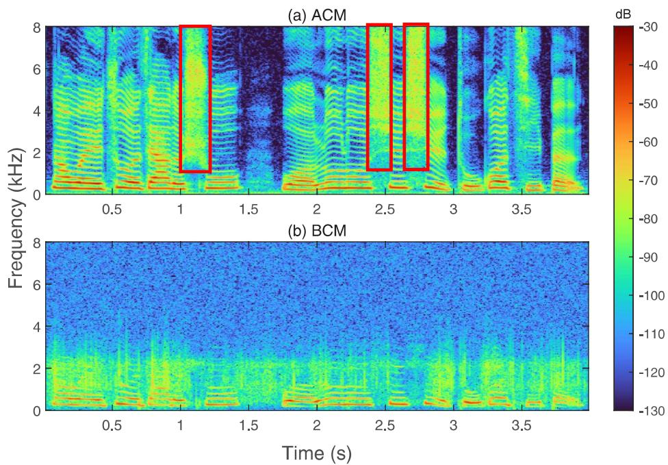

<details>
<summary>heatmap</summary>

| Panel | Time (s) | Frequency (kHz) | Amplitude (dB) |
|-------|----------|-----------------|----------------|
| (a) ACM | 0.5 | 8 | -30 |
| (a) ACM | 1.0 | 1 | -40 |
| (a) ACM | 1.5 | 2 | -60 |
| (a) ACM | 2.0 | 3 | -70 |
| (a) ACM | 2.5 | 4 | -80 |
| (a) ACM | 3.0 | 5 | -90 |
| (a) ACM | 3.5 | 6 | -100 |
| (b) BCM | 0.5 | 8 | -130 |
| (b) BCM | 1.0 | 9 | -120 |
| (b) BCM | 1.5 | 10 | -110 |
| (b) BCM | 2.0 | 11 | -100 |
| (b) BCM | 2.5 | 12 | -90 |
| (b) BCM | 3.0 | 13 | -80 |
| (b) BCM | 3.5 | 14 | -70 |
| (b) BCM | 4.0 | 15 | -60 |
| (b) BCM | 4.5 | 16 | -50 |
| (b) BCM | 5.0 | 17 | -40 |
| (b) BCM | 5.5 | 18 | -30 |
| (b) BCM | 6.0 | 19 | -20 |
| (b) BCM | 6.5 | 20 | -10 |
| (b) BCM | 7.0 | 21 | 0 |
| (b) BCM | 7.5 | 22 | 10 |
| (b) BCM | 8.0 | 23 | 20 |
| (b) BCM | 8.5 | 24 | 30 |
| (b) BCM | 9.0 | 25 | 40 |
| (b) BCM | 9.5 | 26 | 50 |
| (b) BCM | 10.0 | 27 | 60 |
| (b) BCM | 10.5 | 28 | 70 |
| (b) BCM | 11.0 | 29 | 80 |
| (b) BCM | 11.5 | 30 | 90 |
| (b) BCM | 12.0 | 31 | 100 |
| (b) BCM | 12.5 | 32 | 110 |
| (b) BCM | 13.0 | 33 | 120 |
| (b) BCM | 13.5 | 34 | 130 |
The image contains two panels: (a) ACM and (b) BCM. The y-axis represents frequency in kHz, and the x-axis represents time in seconds. The color scale indicates dB values ranging from -130 to -30 dB. The chart displays frequency bands for each frequency band, with red boxes highlighting specific frequency bands at specific times. The data is presented in a grid format with color intensity reflecting the magnitude of the measured signal or response at each frequency band.
</details>

FIG. 1. (Color online) Spectrogram of speech signal captured by (a) ACM and (b) BCM.

The fusion enhancement methods leverage both BC speech and noisy AC speech to estimate the target AC speech. Typically, fusion enhancement models have fewer parameters and lower computational complexity than the aforementioned blind restoration networks. Apple and Bose have field patents related to the application of accelerometer-based BCM in wearable devices, such as earbuds and smart glasses (Dusan et al., 2016; Wax and Shay, 2022). A fusion enhancement method is to utilize BC speech as the auxiliary information to estimate the statistics of the ambient noise and/or the AC speech. In Lee et al. (2018), the BC speech is used to support the estimation of the speech presence probability, which improves the accuracy of the noise power spectral density estimation. Recently, several deep learning based fusion enhancement methods have been proposed, which typically treat the BC speech as an additional modality. In Yu et al. (2020), two ensemble-learning-based BC and AC fusion strategies, namely, early fusion and late fusion, are proposed to perform time-domain multi-modal SE on a fully convolutional network (FCN). In Wang et al. (2022a), an attention-based feature fusion method is proposed to fuse AC and BC speech, and the fused feature is concatenated with the oracle BC and AC spectrograms as input to a densely connected convolutional recurrent network (DC-CRN) for SE, which is more effective than a direct concatenation. In Wang et al. (2022b), a multimodal involutional neural network (MMINet) is presented to estimate a mask of the target speech in the time domain. However, the computational demands of existing fusion models are still high and may not suitable for embedded devices.

This paper proposes a lightweight fusion enhancement model sing both bone- and air-conducted speech. An iterati ntion-based feature fusion module is used to fuse the input AC and BC speech. The fused signal is fed with AC and BC speech into to the backbone, namely, DenGCAN, which consists of an encoder, bottleneck layers, and a decoder. The DenGCAN extracts features of the input through the encoder and characterizes temporal dependencies of feature maps in the bottleneck layer. The mask of the target speech is then estimated by the decoder and two fully connected layers. The lightweight backbone network incorporates dense layers in the encoder and decoder as the dense layer encourages feature reuse and significantly reduces model parameters. Additionally, an attention gate (AG) is employed in the skip-connection of DenGCAN to efficiently utilize the BC speech. The bottleneck layer of DenGCAN adopts an squeezed Conformer (sConformer) (Kuang et al., 2023) with self-attention mechanism, which can efficiently model long-term dependencies of the feature extracted by the encoder and offers the potential to improve performance at the expense of an increased input-output latency. Experimental results on BC speech data recorded from multiple positions with 109 individuals validate the effectiveness of the proposed model.

# Il. SIGNAL MODEL

Let $\mathbf { y } _ { A C } ( t ) = [ Y _ { A C } ( t , 1 ) , . . . , \underline { { Y } } _ { A C } ( t , F ) ] ^ { T } \in \mathbb { C } ^ { F \times 1 }$ and $\mathbf { y } _ { B C } ( t )$ $= [ Y _ { B C } ( t , \overset { \land } { 1 } ) , . . . , \overset { } { Y _ { B C } } ( t , F ) ] ^ { T } \in \mathbb { C } ^ { F \times 1 }$ denote the short-time

Fourier transform of the speech signals received by the ACM and BCM, where $t \in \{ 1 , . . . , T \}$ and $f \in \{ 1 , . . . , F \}$ denote the time frame index and the frequency bin index, respectively. It is usually assumed that the BC speech $Y _ { B C } ( t , f )$ is not affected by the ambient noise, and it only contains the self-noise $V _ { s } ( t , f )$ due to the resonance and friction between the BCM and the skin of the speaker. In contrast, the AC speech $Y _ { A C } ( t , f )$ is susceptible to the ambient noise $V _ { b } ( t , f )$ i.e.,

$$
Y _ {A C} (t, f) = S (t, f) + V _ {b} (t, f),
$$

$$
Y _ {B C} (t, f) = \phi (S (t, f)) + V _ {s} (t, f), \tag {1}
$$

where $S ( t , f )$ is the target speech signal, and ¢(-) denotes the nonlinear mapping function from AC speech to BC speech. However, the BC speech can be affected by the ambient noise to a lesser extent, which will be considered in the following experiments.

The proposed deep neural network (DNN) model aims to estimate the complex ratio mask (cRM) (Williamson et al., 2015) of the target speaker by using both BC and AC signals at frame ¢. The estimated cRM is then applied to the noisy AC speech to recover the speech signal of interest

$$
\mathbf {m} (t) = \mathcal {F} \{\mathbf {y} _ {A C} (t), \mathbf {y} _ {B C} (t) \},
$$

$$
\hat {\mathbf {s}} (t) = \mathbf {m} (t) \otimes \mathbf {y} _ {A C} (t), \tag {2}
$$

where m(¢) € C\*! $\mathbf { m } ( t ) \in \mathbb { C } ^ { F \times 1 }$ is the estimated cRM, $\hat { \mathbf { s } } ( t ) = [ \hat { S } ( t , 1 )$ , $\ldots , \hat { S } ( t , F ) ] ^ { T } \in \mathbb { C } ^ { F \times 1 }$ denotes the enhanced speech signal, $\mathcal F \{ \cdot \}$ is the mapping function, and ® denotes element-wise product. For notational convenience, the time frame index (r) will be left out, unless necessary for clarification.

# lll. PROPOSED METHOD

The proposed model consists of a feature fusion module, a backbone network DenGCAN, and an output mapping, as shown in Fig. 2. The BC speech $\mathbf { y } _ { B C }$ and the AC speech $\mathbf { y } _ { A C }$ are first fused by the feature fusion module. The fused signal $\mathbf { y } _ { A F } ,$ as well as original BC and AC speech, is then used for the feature extraction in the backbone network

$$
\mathbf {y} _ {A F} = \mathcal {F} _ {\text { fusion }} \{\mathbf {y} _ {A C}, \mathbf {y} _ {B C} \}, \tag {3}
$$

$$
\tilde {\mathbf {x}} = \mathcal {F} _ {\text { backbone }} \left\{\operatorname{cat} (\mathbf {y} _ {A F}, \mathbf {y} _ {A C}, \mathbf {y} _ {B C}) \right\}, \tag {4}
$$

where $\mathcal { F } _ { f u s i o n } \{ \cdot \}$ and $\mathcal { F } _ { b a c k b o n e } \{ \cdot \}$ denote the mapping function of the feature fusion module and the backbone network, respectively, and cat(-) represents tensor concatenation. The feature map extracted by the backbone network $\tilde { \mathbf { x } } \in \mathbb { C } ^ { F \times 1 }$ s then divided into the real component $\widetilde { \mathbf { X } } _ { r }$ and the imaginary component $\tilde { \mathbf { X } } _ { i } .$ Each component passes through a fully connected layer to get the real and imaginary components of the cRM of the target speech, respectively

$$
\mathbf {m} = \mathbf {W} _ {r} \tilde {\mathbf {x}} _ {r} + j \mathbf {W} _ {i} \tilde {\mathbf {x}} _ {i} \tag {5}
$$

where W, € RF\*F $\mathbf { W } _ { r } \in \mathbb { R } ^ { F \times F }$ and $\mathbf { W } _ { i } \in \mathbb { R } ^ { F \times F }$ denote the fully connected layers. Once the cRM is obtained, the target speech § can be calculated by Eq. (2).

The feature fusion module and the backbone network are described in Secs. III A and III B, respectively.

# A. Feature fusion

Motivated by Wang et al. (2022a, 2022b), BC and AC speech are considered as different modalities and they are fused by an attention-based feature fusion module. The proposed model uses an iterative attentional feature fusion (1AFF) (Dai et al., 2021) to generate attention coefficients twice, which are then assigned to both the BC and AC speech signals to obtain a fused signal. Element-wise summation is chosen as integration. The structure of the iAFF is presented in Fig. 3(a), where the two modal signals are coarsely fused followed by refined fusion. In the coarse fusion, the BC and AC speech are integrated and fed into a channel attention module to obtain attention coefficients $\alpha ^ { \prime } \in \mathbb { R } ^ { F \times 1 }$ ! The coarsely fused signal $\mathbf { y } _ { A F } ^ { \prime }$ reads

$$
\alpha^ {\prime} = \mathcal {F} _ {a 1} \left\{\mathbf {y} _ {A C} + \mathbf {y} _ {B C} \right\}
$$

$$
\mathbf {y} _ {A F} ^ {\prime} = \alpha^ {\prime} \otimes \mathbf {y} _ {A C} + (1 - \alpha^ {\prime}) \otimes \mathbf {y} _ {B C}, \tag {6}
$$

where $\mathcal { F } _ { a 1 } \{ \cdot \}$ represents the mapping function of the first channel attention module, illustrated in Fig. 3(b). The channel attention module averages the local context (ie.,R frequency bins) within a frame of the input signal to obtain the global context. The local and global contexts separately pass through two layers of pointwise convolution (PWConv), followed by batch normalization (BN) and parametric rectified linear unit (PReLLU) activation functions for further feature extraction. Finally, the context information is aggregated, and then attention coefficients are calculated by a sigmoidal activation.

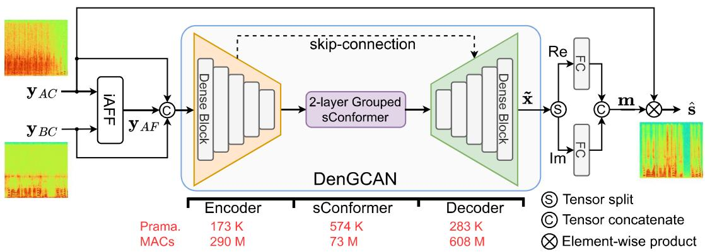

<details>
<summary>flowchart</summary>

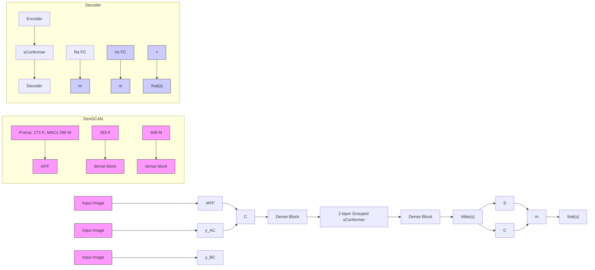
</details>

FIG. 2. (Color online) The structural diagram of the proposed model, containing a feature fusion module iAFF, a backbone network DenGCAN, and an output mapping consisting of two full connected layers.

The coarsely fused signal $\mathbf { y } _ { A F } ^ { \prime }$ is passed through another channel attention module to generate a set of attention coefficients a for refined fusion. The refined fused signal $\mathbf { y } _ { A F }$ is

$$
\alpha = \mathcal {F} _ {a 2} \{\mathbf {y} _ {A F} ^ {\prime} \}
$$

$$
\mathbf {y} _ {A F} = \alpha \otimes \mathbf {y} _ {A C} + (1 - \alpha) \otimes \mathbf {y} _ {B C}, \tag {7}
$$

where $\mathcal { F } _ { a 2 } \{ \cdot \}$ represents the mapping function of the second channel attention module. To effectively utilize both crossmodal features and individual modal features, the fused signal $\mathbf { y } _ { A F }$ is concatenated with $\mathbf { y } _ { A C }$ and $\mathbf { y } _ { B C } .$ This concatenated representation is fed into the encoder of the subsequent backbone network. In Dai ef al. (2021), it is pointed out that the initial integration of received features is a bottleneck in attention-based feature fusion. Compared to the feature fusion method used in Wang et al. (2022a), the presented FF introduces a refined fusion stage on top of the coarse sion. This additional refined fusion can alleviate the bottleneck caused by low initial fusion quality.

# B. DenGCAN

The backbone network with a densely connected architecture, DenGCAN, is designed building upon our previous work, GCAN (Kuang et al., 2023). The DenGCAN adopts a convolutional encoder-decoder structure, wherein two layers of sConformer act as bottleneck layers between the encoder and decoder. These sConformer modules characterize temporal dependencies of the features extracted by the encoder. Specifically, the encoder and decoder of DenGCAN consist of a cascade of five dense blocks, which adds a densely connected layer before the gated convolution/deconvolution. The bottleneck layer employs a grouping strategy with feature rearrangement (Gao et al., 2018) between each layer of sConformer. Additionally, AG skip-connections are employed between the dense blocks in encoder and corresponding dense blocks of the decoder. More details of the dense block and AG skip-connection will be presented in the following.

# 1. Dense block

The structure of the dense block in the encoder of DenGCAN is illustrated in Fig. 4, which consists of the dense layer and gated layer. The input of the dense block $\mathbf { X } _ { l - 1 } \in \dot { \mathbb { R } } ^ { C _ { l - 1 } \times D _ { l - 1 } }$ g sequentially passed through a dense layer and a gated layer to obtain the output $\breve { \mathbf { X } _ { l } } \in \mathbb { R } ^ { C _ { l } \times D _ { l } }$ , where the subscript $l = 2 , . . . , 5$ represents the layer index of the dense block. The input of the first dense block ${ \bf X } _ { 0 } = \mathrm { c a t } ( { \bf y } _ { A F } , { \bf y } _ { A C } , { \bf y } _ { B C } )$ 18 @ concatenation of the fused signal, BC, and AC signal, as shown in Eq. (4).

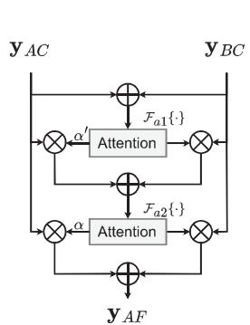

<details>
<summary>flowchart</summary>

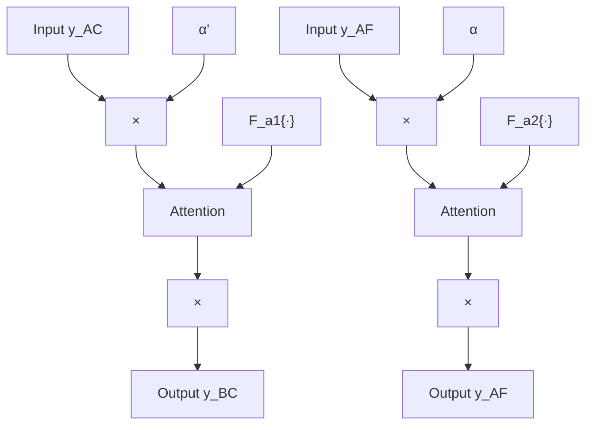
</details>

(a) iAFF

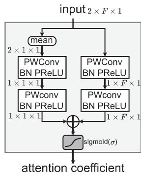

<details>
<summary>flowchart</summary>

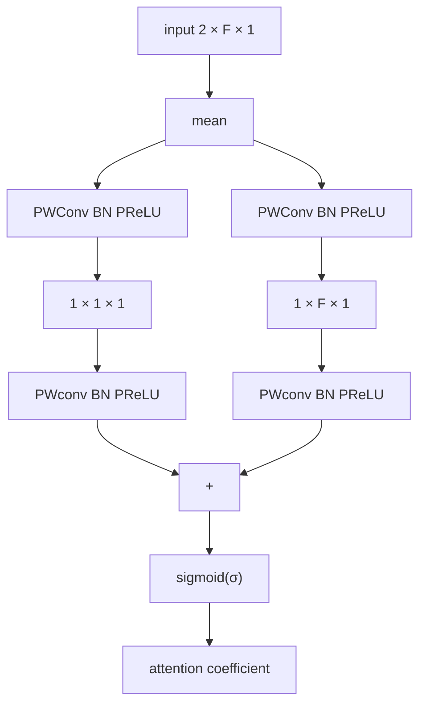
</details>

(b) attention module   
FIG. 3. Iterative attentional feature fusion module. (a) Coarse and refined fusion of bone-conducted and air-conducted speech. The complex spectrogram $\mathbf { y } _ { A C }$ and $\mathbf { y } _ { B C }$ are regarded as real tensors of shape 2 x T x F. (b) Attention module for generating attention coefficients in the iAFF.

The presented dense layer of dense block consists of four convolution layers. Each convolution layer is followed by a BN and a PReLU activation function. Note that each convolution layer of the dense layer takes all the feature maps extracted by the preceding convolution layers as input, and its output serves as input for all subsequent convolution layers. The dense connect has proven to be very effective in SE tasks (Wang et al., 2022a). The output of i-th convolution layer $\mathbf { \bar { X } } _ { l } ^ { ( i ) } \in \mathbb { R } ^ { C _ { d } \times D _ { l - 1 } }$ follows

$$
\mathbf {X} _ {l} ^ {(i)} = \operatorname{conv} _ {l} ^ {(i)} \left(\operatorname{cat} \left(\mathbf {X} _ {l} ^ {(0)}, \dots , \mathbf {X} _ {l} ^ {(i - 1)}\right)\right), \quad i = 1, \dots , 4, \tag {8}
$$

where $\mathrm { c o n v } _ { l } ^ { ( i ) } ( \cdot )$ denotes the mapping function of the i-th convolution layer in the dense layer. The matrix X§°) $\mathbf { X } _ { I } ^ { ( 0 ) } \in \mathbb { R } ^ { C _ { l - 1 } \times D _ { l - 1 } }$ denotes the input of the I-th dense block, ie., $\mathbf { X } _ { l } ^ { ( 0 ) } = \mathbf { X } _ { l - 1 }$ . The outputs of all convolution layers in the dense layer are concatenated and used as the input for the gated layer. This concatenated input then goes through a gated convolution unit, followed by BN and PReLU, to obtain the output of /-th dense block Xl c RC[XD[ $\mathbf { X } _ { l } \in \mathbb { R } ^ { C _ { l } \times D _ { i } }$

$$
\begin{array}{l} \mathbf {X} _ {l} = \mathcal {F} _ {\mathrm{BN} - \mathrm{PReLU}} \left\{\operatorname{conv} _ {l} ^ {1} \left(\operatorname{cat} \left(\mathbf {X} _ {l} ^ {(0)}, \dots , \mathbf {X} _ {l} ^ {(4)}\right)\right) \right. \\ \left. + \sigma \left(\operatorname{conv} _ {l} ^ {2} \left(\operatorname{cat} \left(\mathbf {X} _ {l} ^ {(0)}, \dots , \mathbf {X} _ {l} ^ {(4)}\right)\right)\right) \right\}, \tag {9} \\ \end{array}
$$

where $\mathcal { F } _ { \mathrm { B N - P R e L U } } \{ \cdot \}$ denotes the mapping function of BN with PReLU, conv} (-) and conv?(-) denote two convolutions of gated layer, and ¢ represents the sigmoid function.

In the encoder of the DenGCAN, each dense block reduces the dimensionality of the feature maps to efficiently extract feature maps. Conversely, the dense blocks of the decoder should restore the feature dimension. As a result, the convolutions in the gated layer of the decoder’s dense blocks are substituted with transposed convolutions for upsampling. Note that th t dense block in the decoder excludes BN and PReLLU.

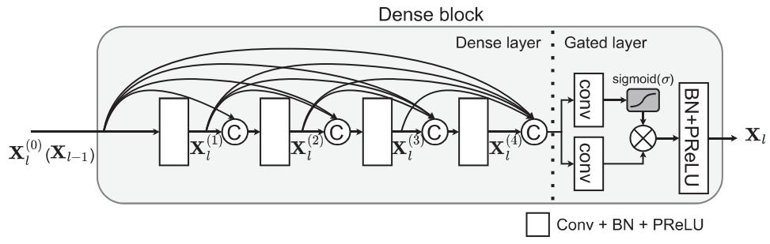

<details>
<summary>flowchart</summary>

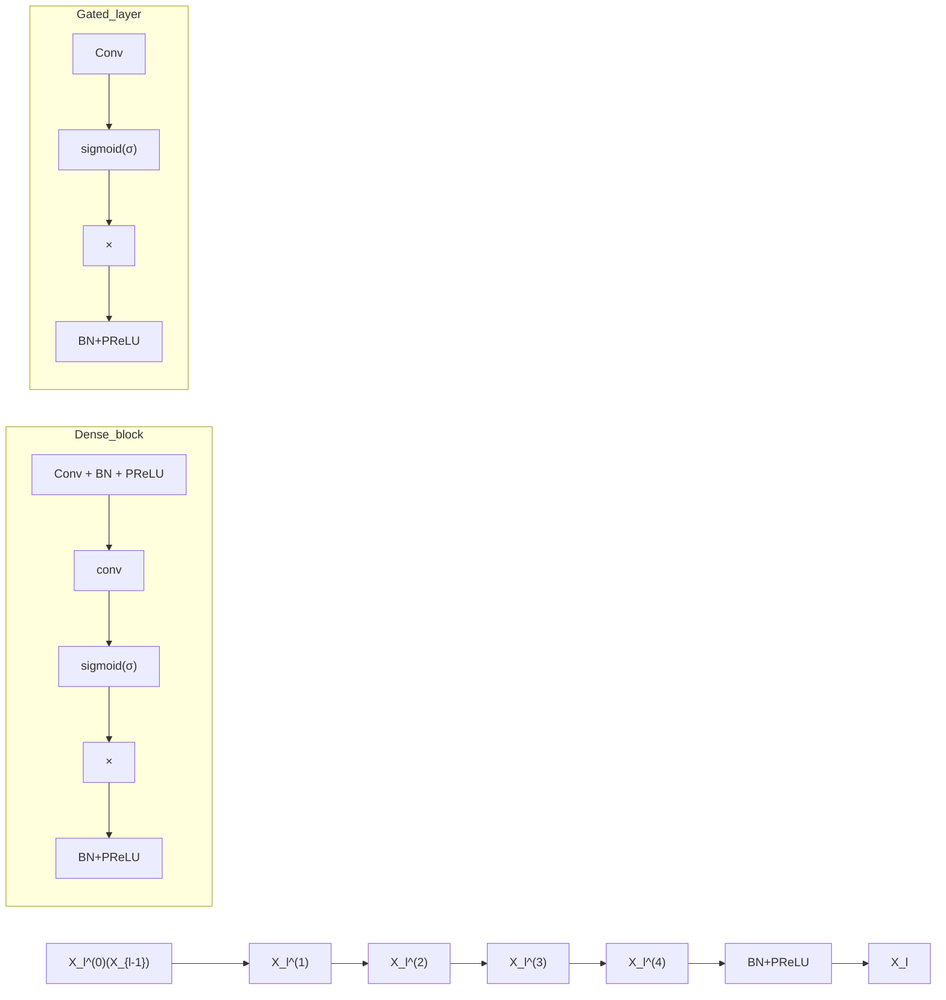
</details>

FIG. 4. Structure of the dense block employed by the encoder of DenGCAN.

# 2. AG skip-connection

In DNN models that follow an encoder-decoder architecture, skip-connections are often added between the encoder and decoder. These skip-connections can alleviate the gradient vanishing problem while allowing high-level and low-level features extracted by the encoder to be reused in the decoder. Concatenation based skip-connections directly concatenate the respective encoder outputs with the decoder inputs, as illustrated in Fig. 5(a). The PWConvbased skip-connection is shown in Fig. 5(b), which adds a PWConv operation to the skip-connection as an efficient way to boost feature fusion compared to simple concatenations (Wang et al., 2022a).

The AG allows DNNs to selectively focus on relevant spectral features, thereby significantly improved the model performance. Hence, the AG is employed in the skip-R connection of DenGCAN. As illustrated in Fig. 5(c), the /-th AG takes the feature map of the I-th encoder $\mathbf { X } _ { l } \in \mathbb { R } ^ { C _ { l } \times D _ { l } }$ and the (/+ 1)-th decoder $\mathbf { G } _ { l + 1 } \in \mathbb { R } ^ { C _ { l } \times D _ { l } }$ gg input, where $C _ { l }$ and $D _ { l }$ denote the number of channels and features of the feature map, respectively. The output of AG and $\mathbf { G } _ { l + 1 }$ is concatenated and then served as the input of the /-th decoder. In Oktay et al. (2018) and Wahab et al. (2024), pixel-wise AG skip-connections are adopted. Motivated by this, an AG that considers both local and global features is proposed in this study, as shown in Fig. 6. The AG uses PWConv to compute attention coefficients. Let $\mathbf { x } _ { d } \in \mathbb { R } ^ { C _ { l } \times 1 }$ and $\mathbf { g } _ { d } \in \mathbb { R } ^ { C _ { l } \times 1 }$ represent the d-th feature in the inputs $\mathbf { X } _ { l }$ and $\mathbf { G } _ { l + 1 }$ of the AG, respectively. The AG initially fuses the $\mathbf { X } _ { d }$ and $\mathbf { g } _ { d } ,$ followed by two separate PWConv operations to extract local and global information from the fused features. The local and global information is then fused again and passed through a sigmoid activation function, which results in an attention coefficient $a _ { d }$

$$
\bar {\mathbf {x}} = \frac {1}{D _ {l}} \sum_ {k = 1} ^ {D _ {l}} (\mathbf {x} _ {k} + \mathbf {g} _ {k}),
$$

$$
a _ {d} = \sigma \{\mathbf {W} _ {l} ^ {T} (\mathbf {x} _ {d} + \mathbf {g} _ {d}) + \mathbf {W} _ {g} ^ {T} \bar {\mathbf {x}} \}, \tag {10}
$$

where X is the global information, and $\mathbf { W } _ { l } \in \mathbb { R } ^ { C _ { l } \times 1 }$ and $\mathbf { W } _ { g } \in \mathbb { R } ^ { C _ { l } \times 1 }$ denote projection matrices corresponding to PWConvs for extracting local and global features, respectively. The scaled vector $a _ { d } \mathbf { X } _ { d }$ is then passed through the third PWConv to obtain the output of the AG

$$
\hat {\mathbf {x}} _ {d} = \mathbf {W} ^ {T} (a _ {d} \mathbf {x} _ {d}),, \tag {11}
$$

where $\mathbf { W } \in \mathbb { R } ^ { C _ { l } \times C _ { l } }$ represents the projection matrix of the third PWConv.

# IV. EXPERIMENTS

# A. Dataset

BC speech characteristics vary across different positions on the head (Mcleod and Culling, 2017; Stenfelt ez al., 2000; Tran et al., 2013). We synchronously recorded a dataset of AC and 4-point BC speech including throat, overhead, temporal bone (condyle), and external auditory canal, namely, air and 4 bone-conducted speech (A4BS). The A4BS consists of recordings from 109 speakers, with each speaker reading for an hour in Mandarin Chinese. The total duration of the dataset is approximately 107 h. To guarantee the comprehensiveness and diversity of syllables, phonemes, and tones, the transcription of the A4BS dataset contains aspects of everyday conversations, novels, press releases, totaling about 960,000 words. The four collection positions for the bone-conducted speech are illustrated in Fig. 7(a), and the corresponding BCMs are shown in Fig. 7(b). Also, we present a data collection snapshot in Fig. 7(c). For overhead, external auditory canal, and condyle, Articom Company’s (Zhongshan, Guangdong Province, China) ATM-1401-P1 BCM is used, while BC speech at throat is captured by Transound Company’s (Dongguan, Guangdong Province, China) TSV-1205A02F5 BCM. All these BCMs are accelerometer-based sensors.

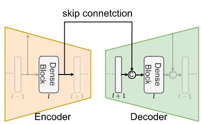

<details>
<summary>flowchart</summary>

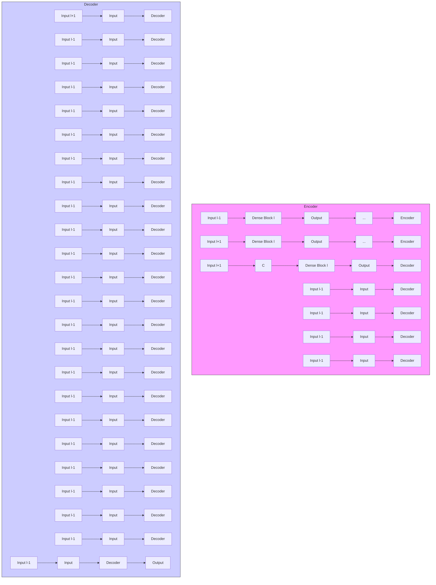
</details>

(a) Concatenate-based

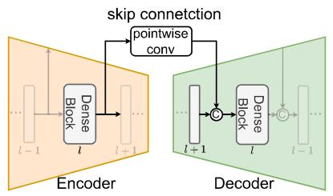

<details>
<summary>flowchart</summary>

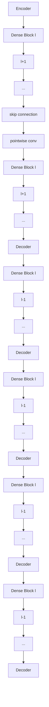
</details>

(b) Pointwise Convolution-based

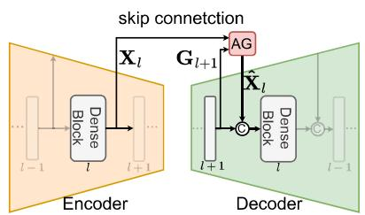

<details>
<summary>flowchart</summary>


</details>

(c) Attention gate-based   
FIG. 5. (Color online) (a)—(c) Three types of skip-connections at layer / in Encoder and Decoder.

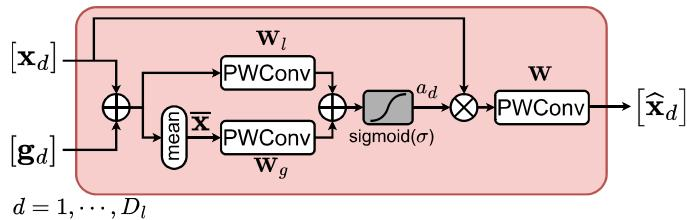

<details>
<summary>flowchart</summary>

```mermaid
graph TD
    A["[x_d"]] --> B["+"]
    C["[g_d"]] --> B
    B --> D["PWConv"]
    D --> E["+"]
    F["mean"] --> G["PWConv"]
    G --> H["+"]
    I["sigmoid(σ)"] --> J["×"]
    K["W"] --> L["PWConv"]
    L --> M["[x̂_d"]]
    N["d = 1, ..., D_l"] --> B
    O["a_d"] --> J
```
</details>

FIG. 6. (Color online) The structure of proposed skip-connection with AG.

Audio clips used for model training, validation, and testing are synthesized from the speech in the A4BS dataset and open-source noise data. All speech is resampled to 16kHz and divided into 4-s clips. Noisy AC speech clip yac(n) and corresponding BC speech clip ygc(n) are synthesized by

$$
y _ {A C} (n) = s (n) + \lambda v _ {A C} (n),
$$

$$
y _ {B C} (n) = x (n), \tag {12}
$$

where s(n) and x(n) are recorded AC and BC speech from the A4BS corpus, and the parameter A is used to adjust the SNR at the ACM. For the training and validation sets, the SNR of noisy AC speech is sampled from uniform distribution [ —15dB, 10dB], and [ —15dB, 10dB] for the test set. Speech signals from 22 individuals out of 109 in A4BS are randomly selected, which are then divided equally into validation and test set. The remaining 87 individuals are used for the training set. Noise clips for training and validation are sourced from ICASSP2022 DNS Challenge (Dubey et al., 2022), QUT Noise (Dean et al., 2010), Environmental Background Noise dataset (Saki et al., 2016), and music data in MUSAN (Snyder et al., 2015). Noise clips for the test set are selected from Nonespeechl115 (Hu and Wang, 2010), NOISEX-92 (Varga and Steeneken, 1993), CHiME-3 (Barker et al., 2015), and MUSAN. These noise datasets encompass a diverse range of noise sources, including technical noises like dial tones, environmental background sounds such as car idling, thunder, and footsteps, as well as babble noise, among various other types. In total, about 200h of training set, 25 h of validation set, and 25h of test set are synthesized.

# B. Model details

A 20-ms Hanning window with 50% overlap is used. Accordingly, 320-point fast Fourier transform is utilized, leading to 161-dimensional one-sided spectral features. Under this configuration, if the hardware platform can meet the computational needs of the model, the input-output latency of the proposed model can be considered as 30 ms. The convolution layers in the dense block utilize 2D convolution or transpose convolution. In the dense layer, the 2D convolution hyperparameters for kernel size, stride, and number of channels are set as (1, 3), (1, 1), and 8, respectively. The kernel size and stride are set as (1, 4) and (1, 2) in the convolution of gated layer, to avoid the checkerboard effect (Odena et al., 2016) that occurs in the deconvolution. In the encoder, the number of channels for the gated layer convolution is set as 16, 32, 48, 64, 64, while in the decoder it is set as 64, 48, 32, 16, 2. The input and output tensors for each layer of the backbone network DenGCAN are summarized in Table 1.

# C. Training objectives

A combined loss function is adopted during training, which weights the loss of the real and imaginary components as well as the loss of magnitude

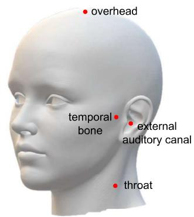

<details>
<summary>text_image</summary>

• overhead
temporal
bone
• external
auditory canal
• throat
</details>

(a) Collection positions for the bone-conducted speech

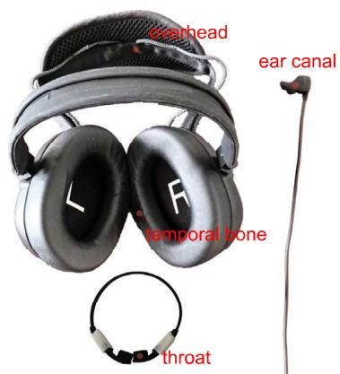

<details>
<summary>text_image</summary>

earhead
ear canal
temporal bone
throat
</details>

(b) Locations of BCMs

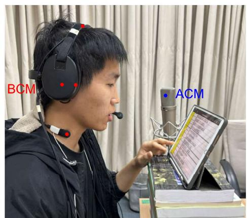

<details>
<summary>text_image</summary>

BCM
ACM
</details>

(c) Data collection snapshot   
FIG. 7. (Color online) (a)—(c) Schematic overview of the A4BS dataset acquisition. Red dots represent bone-conducted microphones. Blue dot represents air-conducted microphone.

TABLE 1. Details of backbone network DenGCAN. The input and output sizes of each layer are specified in the (channels x frames X features). 

<table><tr><td>Layer name</td><td>Input size</td><td>Output size</td></tr><tr><td>Dense block 1 in encoder</td><td>6 × T × 161</td><td>16 × T × 79</td></tr><tr><td>Dense block 2 in encoder</td><td>16 × T × 79</td><td>32 × T × 38</td></tr><tr><td>Dense block 3 in encoder</td><td>32 × T × 38</td><td>48 × T × 18</td></tr><tr><td>Dense block 4 in encoder</td><td>48 × T × 18</td><td>64 × T × 8</td></tr><tr><td>Dense block 5 in encoder</td><td>64 × T × 8</td><td>64 × T × 3</td></tr><tr><td>Reshape</td><td>64 × T × 3</td><td>T × 192</td></tr><tr><td>Grouped sConformer 1</td><td>T × 192</td><td>T × 192</td></tr><tr><td>Grouped sConformer 2</td><td>T × 192</td><td>T × 192</td></tr><tr><td>Reshape</td><td>T × 192</td><td>64 × T × 3</td></tr><tr><td>Dense block 5 in decoder</td><td>128 × T × 3</td><td>64 × T × 8</td></tr><tr><td>Dense block 4 in decoder</td><td>128 × T × 8</td><td>48 × T × 18</td></tr><tr><td>Dense block 3 in decoder</td><td>96 × T × 18</td><td>32 × T × 38</td></tr><tr><td>Dense block 2 in decoder</td><td>64 × T × 38</td><td>16 × T × 79</td></tr><tr><td>Dense block 1 in decoder</td><td>32 × T × 79</td><td>2 × T × 161</td></tr></table>

$$
\mathcal {L} _ {R I} = | | \hat {\mathbf {S}} _ {r} - \mathbf {S} _ {r} | | _ {F} + | | \hat {\mathbf {S}} _ {i} - \mathbf {S} _ {i} | | _ {F},
$$

$$
\mathcal {L} _ {M a g} = | | | \hat {\mathbf {S}} | - | \mathbf {S} | | | _ {F},
$$

$$
\mathcal {L} _ {R I - M a g} = 0. 5 \mathcal {L} _ {R I} + 0. 5 \mathcal {L} _ {M a g}, \tag {13}
$$

where $| | \cdot | | _ { F }$ denotes Frobenius norm, and subscript r and i denote the real and imaginary components of a complex spectrogram. Adam optimizer with weight decay is used in training. During the first ten epochs of the training, the learning rate rises linearly from 2e-5 to 2e-4, i.e., warm-up. Subsequently, a cosine decay strategy is employed to adjust the learning rate to 2e-5. The proposed models are trained for 250 epochs. If validation loss does not decrease for 20 consecutive epochs, the training would early stop.

# V. RESULTS AND DISCUSSION

In this section, the performance of the proposed DenGCAN model on the test set of A4BS dataset is evaluated. Wideband perceptual evaluation speech quality (wb-PESQ) (Rix et al., 2001) and extended short-time objective intelligibility (eSTOI) (Jensen and Taal, 2016) are adopted as objective metrics. The following experiments utilized data from the throat position.

# A. Ablation study

Ablation experiments are conducted to evaluate the effects of AG skip-connection, feature fusion module iAFF, and sConformer on the overall performance. The effectiveness of AG is verified by modifying the type of skipconnection in DenGCAN. Two variations, namely, DenGCAN-C and DenGCAN-P, are created by replacing the AG skip-connection with concatenation-based and PWConv-based skip-connection, respectively, as shown in Figs. 5(a) and 5(b). The wb-PESQ and eSTOI results for three skip-connection forms of DenGCAN are shown in Table II, and it is noted that DenGCAN and DenGCAN-P show moderate improvements compared to DenGCAN-C, as the average wb-PESQ of DenGCAN and DenGCAN-P is 0.053 and 0.030 higher than that of DenGCAN-C, respectively.

TABLE II. Model parameters and MACs of ablation models. 

<table><tr><td>Model name</td><td>Parameter (M)/ MACs (G)</td></tr><tr><td>DenGCAN-C</td><td>1.021/0.844</td></tr><tr><td>DenGCAN-P</td><td>1.033/0.858</td></tr><tr><td>DenGCAN</td><td>1.033/0.859</td></tr><tr><td>Without iAFF</td><td>1.032/0.853</td></tr><tr><td>Without sConformer</td><td>0.771/0.850</td></tr></table>

Experiments are then conducted to evaluate the effectiveness of the feature fusion module iAFF and sConformer by removing them individually, labeled as -w/o iAFF and -w/o sConformer in Fig. 8, where the multiply-accumulate operations per second (MAG:s) are listed in Table II. The absence of feature fusion model in DenGCAN leads to a noticeable decreased wb-PESQ, particularly at lower SNRs. When sConformer is replaced with long short-term memory (LSTM), a significant decrease in the average wb-PESQ metric is observed by 0.114. This may be attributed to the fact that LSTM has approximately 25% fewer model parameters compared to sConformer, leading to a reduction in the modeling capability.

# B. Comparison with existing models

# 1. Competitive models

The following models are involved for the performance comparison: Glance and Gaze Network (GaGNet) (Li ef al., 2022) for single-channel AC speech enhancement, DPT-EGNet (Zheng et al., 2022) and a U-Net-like model (Li et al., 2024a) for blind BC speech restoration, and three fusion enhancement models, i.e., FCN (Yu et al., 2020), MMINet (Wang et al., 2022b), and DC-CRN (Wang ef al., 2022a). The detailed information of the involved models is shown in Table III. MMINet and DC-CRN are adjusted to have similar computational complexity or parameters to the proposed DenGCAN for a fair comparison. The timefrequency (T-F) domain models DenGCAN and DC-CRN share the same fast Fourier transform parameters, feature fusion module, and loss function.

# 2. Objective test

Figure 9 depicts wb-PESQ and eSTOI scores of all the models. It can be observed that conventional ACM-only model GaGNet (Li et al., 2022) works well in high SNR scenarios, but its performance is significantly degraded as the SNR decreases. The BC speech is not affected by ambient noise, and the enhanced speech quality of BCM-only blind restoration models, i.e., DPT-EGNet (Zheng et al., 2022) and U-Net-like model (Li et al., 2024a), does not change much with SNRs. Hence, those two models performs better than the ACM-only model GaGNet (Li et al., 2022) in low SNR conditions. Fusion enhancement models (FCN, MMINet, DC-CRN, and DenGCAN) can incorporate the strengths of both AC and BC signals, which are expected to perform much better than that only considers one modal. However, it is found that the time-domain fusion models, i.e., FCN (Yu et al., 2020) and MMINet (Wang et al., 2022b), do not exhibit a satisfactory performance and are inferior to the single-sensor counterparts in average. The T-F-domain fusion methods, i.e., DC-CRN (Wang et al., 2022a) and the proposed DenGCAN, outperform all the other models in terms of both speech quality and computational efforts. Their median, mean, the first quartile, and the third quartile are higher than the competitive models. The performance of the proposed model is slightly better (or comparable to) than the DC-CRN, but the former exhibits a lower complexity as shown later due to the presented structural advantages. As the proposed model takes the AG as the skip-connection, the decoder can selectively focus on relevant features extracted by the encoder and improves the parametric efficiency. Also, the proposed model adopts the sConformer in the bottleneck layers, which has shown a superior capability in modeling longterm dependencies than the LSTM used in the DC-CRN (Wang et al., 2022a). Across the entire test set, the average wb-PESQ and average eSTOI scores of the proposed model are 3.036 and 86.74%, respectively, i.e., an improvement of 1.870 in wb-PESQ and 31.66% in eSTOI over the noisy AC speech.

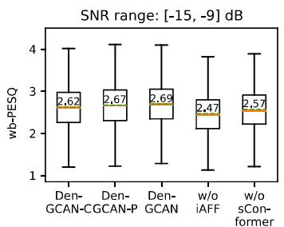

<details>
<summary>boxplot</summary>

| Model              | w-PESQ |
| ------------------ | ------ |
| Den-GCAN-CGNC-P    | 2.62   |
| Den-GCAN           | 2.67   |
| Den-GCAN           | 2.69   |
| w/o iAFF           | 2.47   |
| w/o sConformer     | 2.57   |
</details>

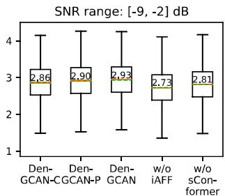

<details>
<summary>boxplot</summary>

| Method           | Median SNR |
| ---------------- | ---------- |
| Den-GCAN-CGCAN-P | 2.86       |
| Den-GCAN         | 2.90       |
| Den-GCAN         | 2.93       |
| w/o iAFF         | 2.73       |
| w/o sConformer   | 2.81       |
</details>

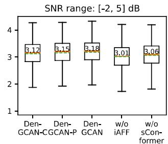

<details>
<summary>boxplot</summary>

| Method           | Median SNR |
| ---------------- | ---------- |
| Den-GCAN-CGCAN-P | 3.15       |
| Den-GCAN         | 3.18       |
| w/o iAFF         | 3.01       |
| w/o sConformer   | 3.06       |
</details>

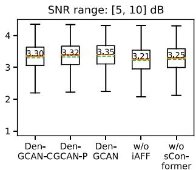

<details>
<summary>boxplot</summary>

| Method           | Median SNR |
| ---------------- | ---------- |
| Den-GCAN-CGCAN-P | 3.30       |
| Den-GCAN         | 3.32       |
| Den-GCAN         | 3.35       |
| w/o iAFF         | 3.21       |
| w/o sConformer   | 3.25       |
</details>

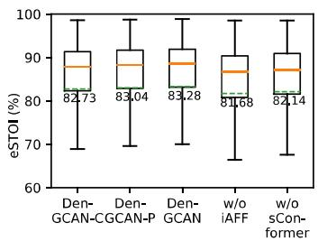

<details>
<summary>boxplot</summary>

| Model               | eSTOI (%) |
| ------------------- | --------- |
| Den-GCAN-CGCAN-P    | 82.73     |
| Den-GCAN            | 83.04     |
| Den-GCAN            | 83.28     |
| w/o iAFF            | 81.68     |
| w/o sConformer      | 82.14     |
</details>

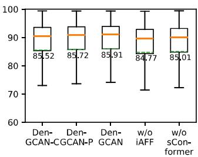

<details>
<summary>boxplot</summary>

| Model             | Value  |
| ----------------- | ------ |
| Den-GCAN-CGCAN    | 85.52  |
| Den-GCAN-P        | 85.72  |
| Den-GCAN          | 85.91  |
| w/o iAFF          | 84.77  |
| w/o sConformer    | 85.01  |
</details>

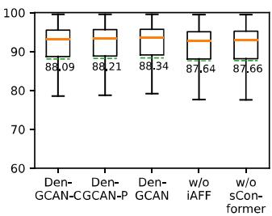

<details>
<summary>boxplot</summary>

| Model             | Value  |
| ----------------- | ------ |
| Den-GCAN-CGCAN    | 88.09  |
| Den-GCAN-P        | 88.21  |
| Den-GCAN          | 88.34  |
| w/o iAFF          | 87.64  |
| w/o sConformer    | 87.66  |
</details>

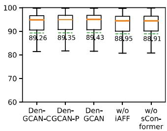

<details>
<summary>boxplot</summary>

| Model             | Value  |
| ----------------- | ------ |
| Den-GCAN-CGCAN    | 89.26  |
| Den-GCAN          | 89.35  |
| Den-GCAN          | 89.43  |
| w/o iAFF          | 88.95  |
| w/o sConformer    | 88.91  |
</details>

FIG. 8. (Color online) Box plots of ablation experiment results on DenGCAN, where w/o iAFF represents the removal of the iAFF feature fusion module and w/o sConformer represents replacing the sConformer with an LSTM. The box extends from the first quartile to the third quartile of the data, with an orange line at the median and a green dashed line at the mean.

We have indeed evaluated the performance of the proposed method using the data from other three positions, i.e., overhead, external auditory canal, and condyle. It is found that the proposed model performs (slightly) better than the six competitive models for a fixed BCM position, but the results are not shown here due to the space limit.

# 3. Subjective test

Absolute category rating experiments are conducted, and the results of this subjective test are expressed in terms of mean opinion scores. In the training phase of the absolute category rating experiment, target AC speech (excellent, 5) and noisy AC speech (bad, 1) are used to equalize the subjective range of intelligibility ratings of all listeners. Thirty Chinese listeners with no hearing impairment participated in the subjective test. Seven enhanced speech samples in each SNR interval of Table IV are randomly selected for subjective testing, and the results are shown in Fig. 10. As seen, the proposed model obtains the highest mean opinion scores among the models involved in the comparison.

# 4. Enhanced results for real-world environments

The simulated test set in Sec. V A cannot completely represent real-world conditions since it does not consider the effect of the ambient noise on the BC speech. However, as two reviewers pointed out, the effect of the ambient noise on the BC speech may not be ignored, particularly in a very low SNR condition. To address this issue, we record 7-h AC noise $v _ { A C }$ and BC noise $v _ { B C }$ from 20 individuals in an artificial noisy environment, where the speaker keeps quiet and the noise level is around 80dB Z at the ACM. We then create another dataset that is used to fine-tune the DNN models. Specifically, the noisy AC speech $y _ { A C }$ and BC speech ypc are synthesized by

TABLE III. Details of the competitive models. 

<table><tr><td>Model name</td><td>Modality</td><td>Domain</td><td>Causal</td><td>Parameter (M)</td><td>MACs (G)</td></tr><tr><td>GaGNet (Li et al., 2022)</td><td>AC</td><td>T-F</td><td>Yes</td><td>5.95</td><td>1.652</td></tr><tr><td>DPT-EGNet (Zheng et al., 2022)</td><td>BC</td><td>T</td><td>No</td><td>0.52</td><td>13.876</td></tr><tr><td>U-Net-like model (Li et al., 2024a)</td><td>BC</td><td>T</td><td>No</td><td>12.94</td><td>5.300</td></tr><tr><td>FCN (Yu et al., 2020)</td><td>AC&amp;BC</td><td>T</td><td>No</td><td>1.03</td><td>9.435</td></tr><tr><td>MMINet (Wang et al., 2022b)</td><td>AC&amp;BC</td><td>T</td><td>Yes</td><td>1.49</td><td>3.055</td></tr><tr><td>DC-CRN (Wang et al., 2022a)</td><td>AC&amp;BC</td><td>T-F</td><td>Yes</td><td>1.34</td><td>1.119</td></tr><tr><td>DenGCAN (proposed)</td><td>AC&amp;BC</td><td>T-F</td><td>Yes</td><td>1.03</td><td>0.859</td></tr></table>

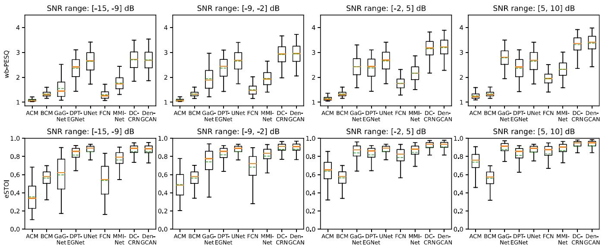  
FIG. 9. (Color online) Box plots of wb-PESQ and eSTOI of the proposed model DenGCAN and other compared models. The box extends from the first quartile to the third quartile of the data, with an orange line at the median and a green dashed line at the mean.

$$
y _ {A C} (n) = s (n) + \lambda v _ {A C} (n)
$$

$$
y _ {B C} (n) = x (n) + \lambda v _ {B C} (n), \tag {14}
$$

where s(n) and x(n) are recorded AC and BC speech without ambient noise as described in Section IV A, and the parameter A is used to adjust the SNR at the AC microphone. total of 38 h of noisy speech clips are synthesized using Eq. (14). In addition, another 112h of noisy speech clips synthesized using Eq. (12) are also included in the dataset to avoid model overfitting.

We now evaluate the performance of models in a real noise environment. The spectrograms of enhanced speech are presented in Fig. 11 with different SNRs, where F16

TABLE IV. MACs and RTF value of models on ARM and x86 platform. 

<table><tr><td rowspan="2">Model name</td><td rowspan="2">MACs (G)</td><td colspan="2">RTF</td></tr><tr><td>ARM</td><td>x86</td></tr><tr><td>GaGNet (Li et al., 2022)</td><td>1.652</td><td>0.740</td><td>0.114</td></tr><tr><td>DPT-EGNet (Zheng et al., 2022)</td><td>13.876</td><td>15.260</td><td>3.118</td></tr><tr><td>U-Net-like model (Li et al., 2024a)</td><td>5.300</td><td>2.546</td><td>0.336</td></tr><tr><td>FCN (Yu et al., 2020)</td><td>9.435</td><td>2.242</td><td>0.303</td></tr><tr><td>MMINet (Wang et al., 2022b)</td><td>3.055</td><td>1.802</td><td>0.185</td></tr><tr><td>DC-CRN (Wang et al., 2022a)</td><td>1.119</td><td>0.865</td><td>0.072</td></tr><tr><td>DenGCAN (proposed)</td><td>0.859</td><td>0.649</td><td>0.068</td></tr></table>

fast-jet cockpit noise is used. As is evident from Figs. 11(1) and 11(q), the BC speech is affected by the ambient noise at certain frequencies, and the residual noise in the enhanced speech from the DCCRN and DenGCAN models is clearly observed from Figs. 11(h), 11(i), 11(m), 11(n), 11(r), and 11(s). After the DenGCAN is fine-tuned with the dataset synthesized by Eqgs. (14) and (12), the residual noise level of enhanced speech is substantially reduced. This indicates that more AC and BC data under a wider variety of noise conditions should be collected in the future.

# C. Effect of algorithm latencies

The future contextual information is helpful for acoustic modeling (Li et al., 2018). Both GCRN and DC-CRN employ an RNN-based structure in the bottleneck layers, which cannot use future information due to the inherent iterative structure. However, self-attention based bottleneck layers can flexibly adjust the number of future frames used in modeling temporal dependencies. As the proposed model adopts self-attention in bottleneck layers, the denoising performance can be improved by using future information. Therefore, the impact of using different numbers of future frames on the performance of the proposed model is evaluated. Figure 12 presents the wb-PESQ and eSTOI results of DenGCAN with additional algorithmic latencies of 0, 40, 80, 120, and 160ms. Notice that the performance of DenGCAN improves noticeably as the algorithmic latency increases, which provides a potential means to improve the speech quality and intelligibility.

# D. Computational speed on different platforms

Real-time factor (RTF) is defined as the ratio of processing time to the duration of the audio. An RTF value less than 1 indicates that the computational resources meet the needs of the model, i.e., the latency of the model can be considered as 30 ms. Table IV presents the RTF values of seven

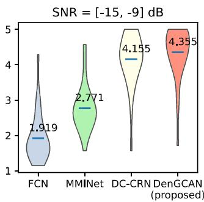

<details>
<summary>violin</summary>

| Method       | Value  |
| ------------ | ------ |
| FCN          | 1.919  |
| MMINet       | 2.771  |
| DC-CRN       | 4.155  |
| DenGCAN (proposed) | 4.355  |
</details>

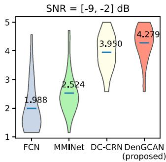

<details>
<summary>violin</summary>

| Model       | Value  |
|-------------|--------|
| FCN         | 1.988  |
| MMINet      | 2.524  |
| DC-CRN      | 3.950  |
| DenGCAN (proposed) | 4.279 |
</details>

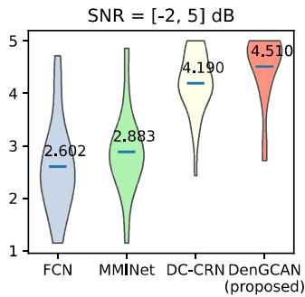

<details>
<summary>violin</summary>

| Method       | Value  |
| ------------ | ------ |
| FCN          | 2.602  |
| MMINet       | 2.883  |
| DC-CRN       | 4.190  |
| DenGCAN (proposed) | 4.510  |
</details>

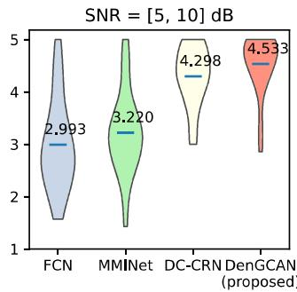

<details>
<summary>violin</summary>

| Method       | Value  |
| ------------ | ------ |
| FCN          | 2.993  |
| MMINet       | 3.220  |
| DC-CRN       | 4.298  |
| DenGCAN (proposed) | 4.533  |
</details>

FIG. 10. (Color online) Mean opinion scores of the proposed model and other three fusion enhancement models. Blue bars represent average of the scores.

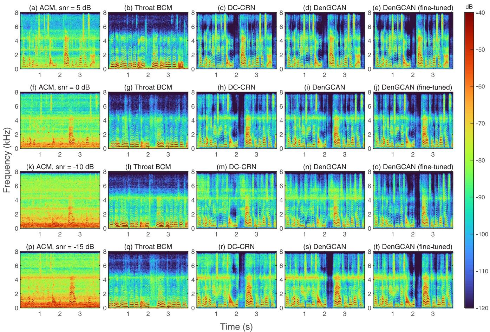

FIG. 11. (Color online) Enhanced speech of DC-CRN, DenGCAN, and DenGCAN (fine-tuned) under an artificial noisy environment, where noise type is F16 aircraft noise. (a)—(e) SNR =5 dB. (f)-(j) SNR =0dB. (k)—(0) SNR =-10dB. (p)-(t) SNR =   
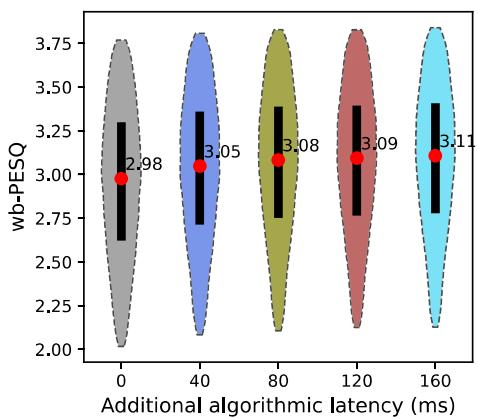

<details>
<summary>violin</summary>

| Additional algorithmic latency (ms) | wb-PESQ |
| ------------------------------------ | ------- |
| 0                                    | 2.98    |
| 40                                   | 3.05    |
| 80                                   | 3.08    |
| 120                                  | 3.09    |
| 160                                  | 3.11    |
</details>

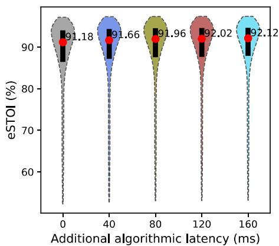

<details>
<summary>violin</summary>

| Additional algorithmic latency (ms) | eSTOI (%) |
| ----------------------------------- | --------- |
| 0                                   | 91.18     |
| 40                                  | 91.66     |
| 80                                  | 91.96     |
| 120                                 | 92.02     |
| 160                                 | 92.12     |
</details>

FIG. 12. (Color online) Wb-PESQ and eSTOI results of the DenGCAN with additional algorithmic latencies. The algorithmic latency increases 10 ms for every future frame used. Black bars spanning from the first quartile to the third quartile represent the interquartile range of the data. Red dots represent median values.

TABLE V. Detailed information on selected x86 and ARM platforms. 

<table><tr><td></td><td>ARM platform</td><td>x86 platform</td></tr><tr><td>CPU core</td><td>ARM Cortex-A53</td><td>Intel Kaby Lake</td></tr><tr><td>CPU model</td><td>Allwinner H618</td><td>Intel Core i5-8250U</td></tr><tr><td>Cores</td><td>4</td><td>4</td></tr><tr><td>Clock speed</td><td>1.5 GHz</td><td>3.0 GHz</td></tr><tr><td>Memory</td><td>4 GB</td><td>16 GB</td></tr></table>

models on both x86 and ARM platforms, with detailed information in Table V. It can be observed that the RTF values of blind restoration models (DPT-EGNet and U-Net-like model) and time-domain fusion models (FCN and MMINet) are significantly higher than that of other models. The proposed DenGCAN achieves the lowest RTF among all the models, making it suitable for real-time applications.

# VI. CONCLUSION

This paper has proposed a lightweight speech enhancement model that leverages the merits of BC and AC speech to provide high-quality enhanced speech even in low SNR conditions. The proposed model uses an iterative attentionbased feature fusion module to fuse the AC and BC speech inputs, and employs a lightweight designed network DenGCAN as the backbone. The DenGCAN adopts our improved AGs and sConformer as skip-connections and bottleneck layer, respectively. The AGs can selectively focus on relevant features of input, while the sConformer can efficiently model long-term dependencies and offers the potential to improve performance at the expense of an increased input-output latency. Experiments conducted on our recorded A4BS dataset validates the superiority of the proposed model. Compared to existing models, the proposed model exhibits a very good noise reduction performance and a low RTF on both x86 and ARM platform.

# ACKNOWLEDGMENTS

This work was supported in part by Beijing Natural Science Foundation Grant No. 4242013, in part by National Natural Science Foundation of China Grant No. 62171438, and in part by IACAS Frontier Exploration Project QYTS202111.

# AUTHOR DECLARATIONS

# Conflict of Interest

The authors declare that they have no known competing financial interests or personal relationships that could have appeared to influence the work reported in this paper.

# DATA AVAILABILITY

Data will be made available on request.

Barker, J., Marxer, R., Vincent, E., and Watanabe, S. (2015). “The third ‘chime’ speech separation and recognition challenge: Dataset, task and

baselines,” in Proceedings of IEEE Workshop on Automatic Speech Recognition and Understanding (ASRU) (IEEE, Piscataway, NJ), pp. 504511.   
Bianco, M. J., Gerstoft, P., Traer, J., Ozanich, E., Roch, M. A., Gannot, S., and Deledalle, C.-A. (2019). “Machine learning in acoustics: Theory and applications,” J. Acoust. Soc. Am. 146(5), 3590-3628.   
Dai, Y., Gieseke, F., Oehmcke, S., Wu, Y., and Barnard, K. (2021). “Attentional feature fusion,” in Proceedings of the IEEE/CVF Winter Conference on Applications of Computer Vision (IEEE, Piscataway, NJ), pp- 3560-3569.   
Dean, D., Sridharan, S., Vogt, R., and Mason, M. (2010). “The qut-noisetimit corpus for evaluation of voice activity detection algorithms,” in Proceedings of the 11th Annual Conference of the International Speech Communication Association, pp. 3110-3113.   
Dubey, H., Gopal, V., Cutler, R., Aazami, A., Matusevych, S., Braun, S., Eskimez, S. E., Thakker, M., Yoshioka, T., Gamper, H., and Aichner, R. (2022). “ICASSP 2022 deep noise suppression challenge,” in Proceedings of IEEE International Conference on Acoustics, Speech and Signal Processing (ICASSP) (IEEE, Piscataway, NI), pp. 9271-9275.   
Dusan, S. V., Lindahl, A., and Andersen, E. B. (2016). “System and method of mixing accelerometer and microphone signals to improve voice quality in a mobile device,” U.S. patent 9,363,596.   
Gao, F., Wu, L., Zhao, L., Qin, T., Cheng, X., and Liu, T.-Y. (2018). “Efficient sequence learning with group recurrent networks,” in Proceedings of the 2018 Conference of the North American Chapter of the Association for Computational Linguistics: Human Language Technologies, Volume 1 (Long Papers) (Curran Associates, Inc., Red Hook, NY), pp. 799-808.   
Healy, E. W., Johnson, E. M., Pandey, A., and Wang, D. (2023). “Progress made in the efficacy and viability of deep-learning-based noise reduction,” J. Acoust. Soc. Am. 153(5), 2751-2751.   
Hu, G., and Wang, D. (2010). “A tandem algorithm for pitch estimation and voiced speech segregation,” IEEE/ACM Trans. Audio Speech Lang. Process. 18(8), 2067-2079.   
Huang, B., Gong, Y., Sun, J., and Shen, Y. (2017). “A wearable boneconducted speech enhancement system for strong background noises,” in Proceedings of 18th International Conference on Electronic Packaging Technology (ICEPT) (1IEEE, Piscataway, NJ), IEEE, pp. 1682-1684.   
Hussain, T., Tsao, Y., Siniscalchi, S. M., Wang, J.-C., Wang, H.-M., and Liao, W.-H. (2021). “Bone-conducted speech enhancement using hierarchical extreme learning machine,” in Proceedings of Increasing Naturalness and Flexibility in Spoken Dialogue Interaction: 10th International Workshop on Spoken Dialogue Systems (Springer, New York) pp. 153-162.   
Jensen, J., and Taal, C. H. (2016). “An algorithm for predicting the intelligibility of speech masked by modulated noise maskers,” IEEE/ACM Trans. Audio Speech Lang. Process. 24(11), 2009-2022.   
Kuang, K., Yang, F,, Li, J., and Yang, J. (2023). “Three-stage hybrid neural beamformer for multi-channel speech enhancement,” J. Acoust. Soc. Am. 153(6), 3378-3389.   
Lee, C.-H., Rao, B. D., and Garudadri, H. (2018). “Bone-conduction sensor assisted noise estimation for improved speech enhancement,” in Proceedings of Interspeech (Curran Associates, Inc., Red Hook, NY), p. 1180.   
Li, A., Zheng, C., Zhang, L., and Li, X. (2022). “Glance and gaze: A collaborative learning framework for single-channel speech enhancement,” Appl. Acoust. 187, 108499.   
Li, C., Yang, F., and Yang, J. (2024a). “Restoration of bone-conducted speech with U-net-like model and energy distance loss,” IEEE Signal Process. Lett. 31, 166—-170.   
Li, C, Yang, F., and Yang, J. (2024b). “A two-stage approach to quality restoration of bone-conducted speech,” IEEE/ACM Trans. Audio Speech Lang. Process. 32, 818—829.   
Li, J., Wang, X., Zhao, Y., and Li, Y. (2018). “Gated recurrent unit based acoustic modeling with future context,” in Proceedings of INTERSPEECH (Curran Associates, Inc., Red Hook, NY), pp. 1788-1792.   
Liu, H.-P., Tsao, Y., and Fuh, C.-S. (2018). “Bone-conducted speech enhancement using deep denoising autoencoder,” Speech Commun. 104, 106-112.   
Mcleod, R. W., and Culling, J. F. (2017). “Measurements of inter-cochlear level and phase differences of bone-conducted sound,” J. Acoust. Soc. Am. 141(5), 3421-3429.

Michelsanti, D., Tan, Z.-H., Zhang, S.-X., Xu, Y., Yu, M., Yu, D., and Jensen, J. (2021). “An overview of deep-learning-based audio-visual speech enhancement and separation,” IEEE/ACM Trans. Audio Speech Lang. Process. 29, 1368-1396.   
QOdena, A., Dumoulin, V., and Olah, C. (2016). “Deconvolution and checkerboard artifacts,” Distillation.   
Oktay, O., Schlemper, J., Folgoc, L. L., Lee, M., Heinrich, M., Misawa, K., Mori, K., McDonagh, S., Hammerla, N. Y., Kainz, B., Glocker, B., and Rueckert, D., (2018). “Attention U-net: Learning where to look for the pancreas,” arXiv:1804.03999.   
Pollard, K. A., Tran, P. K., and Letowski, T. (2015). “The effect of vocal and demographic traits on speech intelligibility over bone conduction,” J. Acoust. Soc. Am. 137(4), 2060-2069.   
Pollard, K. A., Tran, P. K., and Letowski, T. (2017). “Morphological differences affect speech transmission over bone conduction,” J. Acoust. Soc. Am, 141(2), 936944,   
Rix, A. W., Beerends, J. G., Hollier, M. P., and Hekstra, A. P. (2001). “Perceptual evaluation of speech quality (PESQ)—a new method for speech quality assessment of telephone networks and codecs,” in Proceedings of IEEE International Conference on Acoustics, Speech, and Signal Processing (ICASSP) (IEEE, Piscataway, NI), Vol. 2, pp. 749-752.   
Saki, F., Sehgal, A., Panahi, I, and Kehtarnavaz, N. (2016). “Smartphone-based real-time classification of noise signals using subband features and random forest classifier,” in Proceedings of IEEE International Conference on Acoustics, Speech and Signal Processing (ICASSP) (IEEE, Piscataway, NJ), PD- 2204-2208.   
Snyder, D., Chen, G., and Povey, D. (2015). “Musan: A music, speech, and noise corpus,” arXiv:1510.08484.   
Stenfelt, S., Hikansson, B., and Tjellstrom, A. (2000). “Vibration characteristics of bone conducted sound in vitro,” J. Acoust. Soc. Am. 107(1), 422431.   
Tran, P. K., Letowski, T. R., and McBride, M. E. (2013). “The effect of bone conduction microphone placement on intensity and

spectrum of transmitted speech items,” J. Acoust. Soc. Am. 133(6), 3900-3908.   
Varga, A., and Steeneken, H. J. (1993). “Assessment for automatic speech recognition: II. noisex-92: A database and an experiment to study the effect of additive noise on speech recognition systems,” Speech Commun. 12(3), 247-251.   
Wahab, F. E., Ye, Z., Saleem, N., and Ullah, R. (2024). “Compact deep neural networks for real-time speech enhancement on resource-limited devices,” Speech Commun. 156, 103008.   
Wang, H., Zhang, X., and Wang, D. (2022a). “Fusing bone-conduction and air-conduction sensors for complex-domain speech enhancement,” IEEE/ ACM Trans. Audio Speech Lang. Process. 30, 3134-3143,   
Wang, M., Chen, J., Zhang, X., Huang, Z., and Rahardja, S. (2022b). “Multi-modal speech enhancement with bone-conducted speech in time domain,” Appl. Acoust. 200, 109058.   
Wax, A. J., and Shay, M. (2022). “Wearable mixed sensor array for selfvoice capture,” U.S. patent 11,335,362,   
Williamson, D. S., Wang, Y., and Wang, D. (2016). “Complex ratio masking for monaural speech separation,” IEEE/ACM Trans. Audio Speech Lang. Process. 24(3), 483-492.   
Yu, C., Hung, K.-H., Wang, S.-S., Tsao, Y., and Hung, J.-w. (2020). “Timedomain multi-modal bone/air conducted speech enhancement,” IEEE Signal Process. Lett. 27, 1035-1039.   
Zheng, C., Cao, T., Yang, J., Zhang, X., and Sun, M. (2019). “Spectra restoration of bone-conducted speech via attention-based contextual information and spectro-temporal structure constraint,” IEICE Trans. Fundam. E102.A(12), 2001-2007.   
Zheng, C., Xu, L., Fan, X., Yang, J., Fan, J., and Huang, X. (2022). “Dualpath transformer-based network with equalization-generation components prediction for flexible vibrational sensor speech enhancement in the time domain,” J. Acoust. Soc. Am. 151(5), 2814-2825.   
Zheng, C., Zhang, H., Liu, W., Luo, X,, Li, A,, Li, X., and Moore, B. C. (2023). “Sixty years of frequency-domain monaural speech enhancement: From traditional to deep learning methods,” Trends Hear. 27, 23312165231209913.
