# Eficient Neural Networks for Tiny Machine Learning: A Comprehensive Review

MINH TRI LÊ, Université Grenoble Alpes, Inria, CNRS, Grenoble INP, LJK, Grenoble, France

PIERRE WOLINSKI, Université Grenoble Alpes, Inria, CNRS, Grenoble INP, LJK, Grenoble, France and LAMSADE, Paris-Dauphine University, PSL University, CNRS, Paris, France

JULYAN ARBEL, Université Grenoble Alpes, Inria, CNRS, Grenoble INP, LJK, Grenoble, France

The field of Tiny Machine Learning (TinyML) has gained significant atention due to its potential to enable intelligent applications on resource-constrained devices. This review provides an in-depth analysis of the advancements in eficient neural networks and the deployment of deep learning models on ultra-low-power microcontrollers (MCUs) for TinyML applications. It introduces neural networks and discusses their architectures and resource requirements. It explores MEMS-based applications on ultra-low-power MCUs, highlighting their potential for enabling TinyML on resource-constrained devices. The review focuses on eficient neural networks for TinyML. It covers techniques such as model compression, quantization, and low-rank factorization, which optimize neural network architectures for minimal resource utilization on MCUs. The article then delves into the deployment of deep learning models on ultra-low-power MCUs, addressing challenges such as limited computational capabilities and memory resources. Techniques such as model pruning, hardware acceleration, and algorithm-architecture co-design are discussed. Lastly, the review provides an overview of current limitations in the field, including the tradeof between model complexity and resource constraints. Overall, this review article presents a comprehensive analysis of eficient neural networks and deployment strategies for TinyML on ultra-low-power MCUs. It identifies future research directions for unlocking the potential of TinyML applications on resource-constrained devices.

CCS Concepts: • General and reference → Surveys and overviews; • Computing methodologies → Neural networks; • Hardware → Power and energy;

Additional Key Words and Phrases: Deep Learning, Tiny Machine Learning, Compression, Pruning, Quantization, Eficient Neural Networks

## ACM Reference format:

Minh Tri Lê, Pierre Wolinski, and Julyan Arbel. 2026. Eficient Neural Networks for Tiny Machine Learning: A Comprehensive Review. ACM Trans. Intell. Syst. Technol. 17, 4, Article 86 (April 2026), 41 pages. https://doi.org/10.1145/3798276

## 1 Introduction

AI. Over the last decade, AI has revolutionized our daily experiences and technological advancements, empowering machines to perform tasks that traditionally require human-like intelligence, such as recognizing objects or speech or playing advanced games like Go. Machine learning (ML) is the most prominent AI approach, which trains computers to learn paterns and representations from data without explicit programming. Deep learning (DL) is an advanced subset of ML inspired by the organization ofthe brain, using artificial neural networks (NNs) to model and solve complex problems in a wide variety of fields, including language processing, protein generation, or automation.

Sensors and Microcontrollers (MCUs). Simultaneously, there has been an increase in the adoption and development of the Internet of Things (IoT), bringing new devices and applications into our daily lives. Micro-Electro-Mechanical Systems (MEMS) and microcontroller units are essential hardware components of IoT, which allows hardware devices to collect and process information (movement, voice, temperature, pressure) directly at the source, in their local environment, excluding the need for additional resources or external communication. Local and autonomous data processing optimizes the flow of information but inherently poses power constraints. Some applications also require continuous data processing, which puts additional power constraints. MEMS and MCUs serve as the interface to sense information between the analog and the digital world. These devices are found in a wide range of applications, including mobiles, cars, wearables, environmental monitoring, and healthcare systems. Their consumer market scales to several billion in annual sales, so a slight deviation in power constraints can result in significant costs.

Tiny Machine Learning (TinyML). The convergence of ML and IoT has sparked significant interest in both research and industry, enabling embedded hardware to process data locally and interact intelligently with their environments. This intersection has given rise to the emerging field of TinyML, a term first coined in 2019 by [77]; see Figure 1.

At its core, TinyML focuses on bringing the power of ML to resource-constrained devices such as MCUs, allowing intelligent inference close to the data source with ultra-low power consumption. This paradigm unlocks applications such as gesture recognition, predictive maintenance, keyword spoting, and environmental monitoring on devices like home appliances, smartphones, wearables, and augmented reality glasses.

The key pillars ofTinyML research can be summarized as follows:

—EficientModel Design: Developing NN architectures and algorithms that minimize memory and compute requirements while preserving accuracy. Techniques include pruning, quantization, knowledge distillation (KD), and weight sharing.

—Hardware-Aware Deployment: Adapting models to the heterogeneous landscape of embedded hardware, taking into account the severe constraints in memory, compute power, and support for operations such as fixed-point arithmetic.

—Toolchains and Frameworks: Providing end-to-end workflows that facilitate the translation of trained ML models into deployable binaries optimized for a variety of MCU platforms.

—Applications at the Edge: Leveraging TinyML for real-world use cases that benefit from local, always-on, low-latency inference under strict power budgets.

In this context, TinyML research seeks to reduce the power consumption of NNs at inference time, a notion we refer to as eficiency. Eficiency is driven primarily by minimizing memory footprint, as models must fit into highly constrained hardware, and by reducing compute operations to meet energy budgets. Typically, smaller models require less computation, making aggressive model compression and optimization essential.

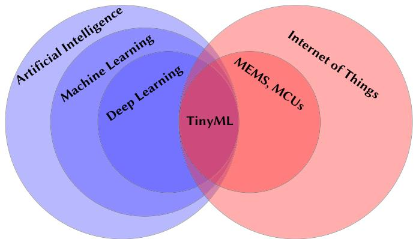  
Fig. 1. TinyML as the intersection between AI and embedded systems. TinyML, Tiny Machine Learning.

Despite its promise, TinyML faces significant challenges. The exponential growth of DL has been driven by advances in powerful hardware, such as GPUs, which enable large-scale models with billions of parameters. In contrast, running DL at the edge requires fundamentally diferent strategies to address the tight resource constraints of MCUs. The diversity of embedded platforms further complicates deployment, demanding hardware-aware methods and frameworks.

Overall, TinyML represents a rapidly evolving interdisciplinary field that bridges embedded systems and ML. It presents not only technical challenges but also exciting opportunities for innovation in both algorithms and hardware, with the goal of enabling pervasive, intelligent, low-power devices.

Contributions and Outline. The recent increase in research atention toward applying eficient DL techniques for ultra-low-power devices has led to the emergence of several review articles, which can essentially be divided into two categories.

The first category addresses methodological aspects:

—Guo [74] presents an early but detailed theoretical and methodological account of quantization approaches for deep NNs, accompanied by a brief overview of NNs themselves. However, their scope is primarily focused on quantization as a mathematical concept and algorithm rather than the broader TinyML context, and it predates some of the most recent advances and deployment challenges specific to ultra-low-power MCUs.

—Gholami et al. [64] provide a more comprehensive and up-to-date survey of quantization methods for deep NNs, covering topics such as quantization-aware training (QAT), posttraining quantization (PTQ), and mixed-precision techniques. Nonetheless, their focus remains limited to quantization and lacks discussion on other crucial model compression techniques like pruning, distillation, or architectural considerations for TinyML deployments.

—Gou et al. [70] ofer an in-depth analysis of KD approaches, categorizing and comparing various KD frameworks and applications. Importantly, this survey does not address the TinyML context or constraints, and does not cover the deployment or hardware aspects required for eficient inference on MCUs.

—Hoefler et al. [87] thoroughly review sparsity-inducing methods, especially pruning techniques, and discuss their impact on eficiency and accuracy tradeofs. However, their analysis largely assumes deployment on general-purpose hardware (such as GPUs and mobile devices) and does not consider the extreme constraints of MCU platforms or integration with other eficiency techniques like quantization or fixed-point arithmetic.

—Alqahtani et al. [4] give a broader overview of NN compression techniques beyond pruning and quantization, but it lacks a clear integration of NN fundamentals, MCU hardware characteristics, and practical deployment pipelines specific to TinyML. Their review also does not provide an entry point for readers unfamiliar with NNs.

The second category emphasizes applications:

—Han and Siebert [77] synthesize works on TinyML applications and identify general trends, datasets, and benchmarks. Their review serves more as a meta-analysis than a technical introduction or methodological guide.

—Ray et al. [167] and Schizas et al. [177] provide rich catalogs of TinyML application domains (e.g., healthcare, industrial monitoring), existing hardware platforms, and deployment frameworks. However, these surveys primarily cater to readers interested in application landscapes and deployment ecosystems and ofer litle insight into NN architectures, optimization methods, or tradeofs at the algorithmic level.

Our review begins with a general introduction to NNs in Section 2, outlining their fundamental principles and architectures. It explores the evolution of NNs and their applications in various domains, highlighting their computational requirements and the challenges they pose for resourcelimited devices.

Then, Section 3 presents a comprehensive overview of MEMS-based applications on ultralow-power MCUs. It discusses the advancements in MEMS technology and its integration with MCUs, enabling the development of power-eficient sensing and actuation systems. The potential of MEMS-based applications in enabling TinyML on resource-constrained devices is emphasized.

The core of the review, Section 4, focuses on eficient NNs for TinyML. This section examines various techniques and methodologies that aim to optimize NN architectures and reduce their computational and memory requirements. It explores model compression, quantization, and lowrank factorization techniques, among others, showcasing their efectiveness in achieving highperformance inference on MCUs while maintaining minimal resource utilization.

Following the discussion on eficient NNs, Section 5 delves into the deployment of DL models on ultra-low-power MCUs. It investigates the challenges associated with porting complex models onto MCUs with limited computational capabilities and memory resources. The section explores techniques such as model pruning, hardware acceleration, and co-design of algorithms and architectures, shedding light on strategies to enable eficient deployment of DL models for TinyML applications.

An overview ofthe current limitations in the field ofTinyML is presented in Section 6. This section discusses the challenges faced by researchers and practitioners, including the tradeof between model complexity and resource constraints, the need for benchmark datasets and evaluation metrics specific to TinyML, and the exploration of novel hardware architectures optimized for TinyML workloads. Finally, Section 7 concludes and provides open challenges as well as insights into emerging trends and technologies that may impact the field of TinyML.

This review article provides a comprehensive analysis of the advancements in eficient NNs and deployment strategies for TinyML on ultra-low-power MCUs. It highlights the current state of the field and identifies future research directions necessary to unlock the full potential of TinyML applications on resource-constrained devices.

## 2 NNs

We introduce NNs (Section 2.1), then we motivate how their theoretical properties (Section 2.2) and modern architectures (Section 2.3) are of interests in TinyML, and finally explain their implications for our work (Section 2.4).

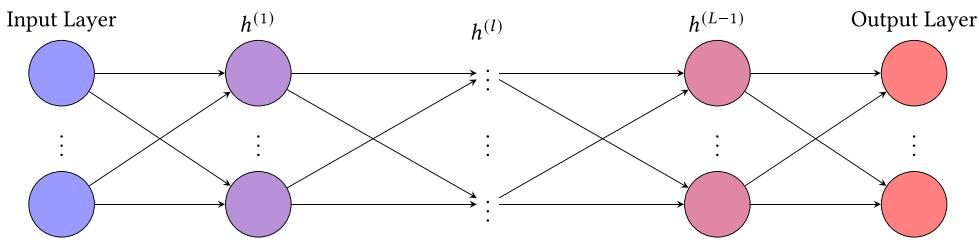  
Fig. 2. Feedforward NN.

## 2.1 Feedforward NNs

The concept of artificial NNs was introduced by McCulloch and Pits [144] as a mathematical model to simulate the human biological neural system but was limited in its ability to learn. This laid the foundation for the perceptron model, which was the first neural model capable of learning and classifying linearly separable data [170]. In turn, the backpropagation [171] and gradient descent algorithms [11, 118] were developed to allow eficient training of multi-layer perceptron (MLP) that is able to classify non-linear inputs. The MLP is a type of feedforward NN that consists of alternatively stacking multiple layers 𝐿 of neurons and non-linear functions 𝜙 [91, 171] as represented in Figure 2. These layers include an input layer, one or more hidden layers, and an output layer. Stochastic gradient descent (SGD) and backpropagation algorithms, and progress in hardware computation have enabled the revolution in the field of NNs, leading to the modern era of DL algorithms [117], for example, capable of achieving state-of-the-art performance on ImageNet [109].

Formally, a NN can be defined as a function 𝑓 and a directed, weighted graph composed of nodes (neurons) and edges (connections between neurons) with associated weight parameters 𝑊 , bias 𝐵, where inputs 𝑥 are propagated forward in the graph to produce an output 𝑦. The objective of the NN 𝑓 defined as:

$$
\begin{array}{r l} & h ^ {(0)} = x, \quad y = f (x) = h ^ {(L)}, \\ & h ^ {(l)} = \phi^ {(l)} \left(W ^ {(l)} h ^ {(l - 1)} + B ^ {(l)}\right) \quad \mathrm{for} l = 1, \ldots , L, \end{array}\tag{1}
$$

is to approximate some function $f ^ { * }$ mapping an input vector 𝑥 to an output vector 𝑦 by learning the weight matrices $W ^ { ( l ) }$ and the bias vectors $B ^ { ( l ) }$ [69].

NNs have interesting theoretical and practical properties, as we will see in the next sections.

## 2.2 Properties

NNs possess powerful theoretical properties that stand out from standard ML approaches, making them of great interest for a wide range of applications.

Expressiveness and Generalization. NNs are universal approximators: Cybenko [42] and Hornik et al. [88] have theorized that a suficiently wide hidden layer is able to approximate any continuous function on a compact set to an arbitrary level of precision. More recent work by Lin and Jegelka [129] has extended the universal approximation theorem to residual neural networks (ResNets) [80], proving that a suficiently deep NN with one-neuron hidden layers with residual connections has enough expressive power to approximate any continuous function.

Another crucial property of NNs, related to generalization in statistical learning theory [202, 205], is their ability to generalize to new data with fewer examples than parameters, even with very large models [102, 122], and they are even capable of labeling random data [222]. This overparameterization results in a highly dimensional non-convex space and redundancy, but results also in higher quality and quantity of local minima [37]. This implies that the optimization process has a higher chance of not geting stuck in a bad local minimum compared to small-size networks.

Table 1. Summary of Standard Architectures Used in Modern DL

<table><tr><td>Layer and Definition</td><td>Strength</td><td>Weakness</td></tr><tr><td>FC: Connects all neurons in-between layers</td><td>High-level aggregations</td><td>Overfitting, not specialized</td></tr><tr><td>CNN: Conv. operations with shared parameters</td><td>Local and global spatial patterns</td><td>Struggles with sequences</td></tr><tr><td>RNN: Processes sequences with a hidden state</td><td>Temporal dependencies</td><td>Struggles with spatial patterns</td></tr><tr><td>ResNets: Deep nets with residual connections</td><td>Eases training deep networks</td><td>Large model size, expensive</td></tr><tr><td>Transformers: Self-attention for input relationships</td><td>Long-term local and global patterns</td><td>Large training data and power footprint</td></tr></table>

Over the recent years, research has revealed that enlarging the model size beyond the quantity of training examples can lead to a peculiar trend in test error: it may initially peak at a certain point of model complexity, then unexpectedly begin to decline again. This intriguing behavior has been termed double-descent by [17], who demonstrated its presence across various ML models, including a two-layer NN. Further investigation into this phenomenon has been conducted by [151], who extensively explored double-descent in deep NN models. They found that this trend can manifest when altering the model width or the number of optimization iterations. Additionally, they observed instances of the double-descent phenomenon being influenced by dataset size: larger datasets sometimes leads to inferior test performance.

Despite these findings, the underlying reasons behind the occurrence of double-descent in ML models and the specific inductive biases responsible for it remain incompletely understood. Nonetheless, it is crucial to consider this phenomenon when devising strategies aimed at enhancing generalization capabilities.

Issues with Expressiveness and Generalization Properties of TinyML. These useful properties are mainly verified for large NNs. For instance, a two-layer NN is ensured to be a universal approximator if its hidden layer is wide enough. On the generalization side, experimental and theoretical findings tend to show that larger models generalize beter. However, in the TinyML setup, the NNs are far from these large, well-studied models. Therefore, obtaining good training and generalization results in TinyML is very challenging.

After this brief overview of the theoretical properties of DL, we will now explore which modern DL architectures are commonly used in practice and why.

## 2.3 Modern DL Architectures

Although in the modern DL era, the hardware progress can allow supporting the given high volume of computation and data, the design of the architecture is critical to the final performance and depends on the applications.

Developing and finding new NN architectures is of great interest in research to surpass the state-of-the-art. Most of these state-of-the-art architectures are variations and combinations of the ones we present below. Table 1 provides a summary of standard architectures used in modern DL, and their strengths and weaknesses.

Fully Connected (FC) Layers. FC layers, also known as dense layers were the first type of layers used in NNs, specifically in MLPs as presented in Section 2.1 and depicted in Figure 2. In an FC layer, each neuron is connected to all the neurons in the next layer and processes each input independently by applying a non-linear transformation. They are often used toward the end of the model to aggregate the higher-level features from the previous layers and make the final predictions. The simplest form of an FC layer is a weighted sum, which makes them very general and not specialized to any particular application. Thus, they are building blocks of modern

DL architectures. However, they are prone to overfiting, and may poorly perform on spatial or temporal data.

Convolutional Neural Networks (CNNs). CNNs are commonly used as feature extractors, showing their strength in processing spatial structures, such as images [109], videos [181], or signal processing [3, 68]. As the name suggests, they consist of applying convolutional operations using filters, also called kernels on the input in 1D, 2D, or 3D, and are shared across the spatial dimensions. They are often stacked all together with max-pooling, to summarize a group of values by their maximum [109], batchnorm to normalize activations and facilitate training [96], and ReLU activation function. Compared to FC layers, this design allows CNNs to eficiently learn spatial hierarchical structures and detect local to global paterns, such as edges, shapes, and textures. In addition, the weight-sharing aspect reduces the number of parameters and makes them more robust to spatial translations and distortions. Some classic CNN architectures are AlexNet [109], VGGNet [182], or GoogleLeNet [191], each using increasing network depths, thereby large model size.

Thus, in modern DL architectures, CNNs are often found in the early stages of the network serving as powerful feature extractors, but they have shown limitations in learning with sequential data structure or modeling long-range dependencies [132, 181].

Recurrent Neural Networks (RNNs). RNNs are specialized layers for modeling sequential data [47, 171], such as signals [3, 72], speech [224], or text [10]. Compared to CNNs, they are able to model longer temporal contexts by keeping a description of previous contexts because each output directly depends on previous inputs. This is of particular interest for sensor-based applications that inherently deal with sequential data.

The building block of a RNN can be defined as follows [47]:

$$
h _ {t} = \phi_ {h} (W _ {h} [ h _ {t - 1}, x _ {t} ] + b _ {h}), y _ {t} = \phi_ {y} (W _ {y} h _ {t} + b _ {y}),\tag{2}
$$

where $x _ { t }$ is the input, $h _ { t }$ is a shared internal state, serving as a memory at time $t , b _ { h }$ and $b _ { y }$ are bias terms, and $\phi _ { h } , \phi _ { b }$ are activation functions. However, they are dificult to train because of the efects of the vanishing or exploding gradient when the sequence is long [19]. Then long-short term memory (LSTM) [62, 63, 86] and gated-recurrent units (GRU) [40] layers have been designed to alleviate the limitations of the simple RNN.

They are based on two kinds of memory updates:

—Leak memory updates, that are progressive updates of the current memory: $h _ { t + 1 } = h _ { t } { + } \phi ( h _ { t } , x _ { t } )$ —Gate memory updates, that are context-dependent updates of the memory: $h _ { t + 1 } = \alpha h _ { t } + ( 1 - $ $\alpha ) \phi ( h _ { t } , x _ { t } )$

where $\alpha$ can be a scalar or the output of a gated function $g ( h _ { t } , x _ { t } ) \in [ 0 , 1 ]$ as in GRU or LSTM. Note that the “gated” mechanism is a specific form of the atention mechanism [203], allowing it to focus its atention on specific inputs depending on the context.

In particular, LSTM has three gates (input, forget, and output) and has two hidden temporal streams, one corresponding to the RNN stream of Equation (2), and another auxiliary stream used to compute 𝛼, thus controlling the number of updates.

GRU is a simplified version of LSTM (update and forget) as well as one hidden temporal stream $h _ { t }$ , which has shown performance close to LSTM with a lower power footprint [28].

However, RNNs are limited in handling spatially structured data and processing sequences in parallel. This is because RNNs process input one timestep at a time, Equation (2).

ResNets. ResNets were introduced in He et al. [80]. They provide each layer with direct feedback from distant previous layers to minimize the loss of gradient information during the backpropagation in deep networks. Although ResNets have shown state-of-the-art performance in computer vision [103], they are typically on the scale of millions of parameters [147] and are more commonly applied on deep networks, which is not suitable for TinyML hardware.

Table 2. Reference Table of Standard Activation Functions

<table><tr><td>Name</td><td>Definition</td><td>Notes</td></tr><tr><td>ReLU</td><td> $f(x) = \begin{cases} x, & \text{if } x \geq 0 \\ 0, & \text{otherwise} \end{cases}$ </td><td>Returns identity if positive, else 0</td></tr><tr><td>Leaky ReLU</td><td> $f(x) = \begin{cases} x, & \text{if } x \geq 0 \\ \alpha x, & \text{otherwise} \end{cases}$ </td><td>Allows small negative values</td></tr><tr><td>PReLU</td><td> $f(x) = \begin{cases} x, & \text{if } x \geq 0 \\ \alpha_i x, & \text{otherwise} \end{cases}$ </td><td>Per-neuron learnable  $\alpha_i$  values</td></tr><tr><td>ELU</td><td> $f(x) = \begin{cases} x, & x \geq 0 \\ \alpha (e^x - 1), & x < 0 \end{cases}$ </td><td>Exponential smoothing,  $\alpha > 0$ </td></tr><tr><td>GELU</td><td> $f(x) = x \Phi(x)$ </td><td>Smooth approximation of ReLU</td></tr><tr><td>Mish</td><td> $f(x) = x \tanh(\ln(1 + e^x))$ </td><td>Smooth and non-monotonic</td></tr><tr><td>Swish</td><td> $f(x) = x \sigma(x)$ </td><td>Smooth, non-monotonic</td></tr><tr><td>Hard Swish</td><td> $f(x) = x \frac{\max(0, \min(6, x+3))}{6}$ </td><td>Efficient Swish variant for TinyML</td></tr><tr><td>Tanh</td><td> $f(x) = \frac{e^x - e^{-x}}{e^x + e^{-x}}$ </td><td>Returns value in range (-1, 1)</td></tr><tr><td>Sigmoid</td><td> $f(x) = \frac{1}{1 + e^{-x}}$ </td><td>Returns value in range (0, 1)</td></tr><tr><td>Hard Sigmoid</td><td> $f(x) = \max(0, \min(1, \frac{x+1}{2}))$ </td><td>Fast approximation of sigmoid</td></tr><tr><td>Softmax</td><td> $f(x_i) = \frac{e^{x_i}}{\sum_{j=1}^{K} e^{x_j}}$ </td><td>Returns class probabilities</td></tr></table>

Φ represents the standard Gaussian cumulative distribution function.

Transformers and Atention-Based Models. Transformers are atention-based models introduced in Vaswani et al. [203] that surpass state-of-the-art performance on large-scale natural language processing tasks or computer vision tasks [131]. They allow the models to focus their atention on each token of the input sequence (local) with respect to other tokens (global). This design addresses the limitations of CNNs and RNNs as stated previously because Transformers can process long-term dependencies and sequences in parallel. Although they are a great success and generate interest, they require a large amount of data, and a power footprint for both training and inference, even more than ResNets, which makes them dificult candidates for TinyML. However, Transformer and atention-based models are increasingly used in TinyML: recent works have explored various strategies to adapt Transformers for TinyML, including their application in anomaly detection for IoT and embedded systems [16, 179], optimizing deployment on low-power MCUs [100, 216], employing quantization and KD to reduce model size and improve eficiency [190], and investigating linear Transformer architectures tailored for constrained hardware [176].

Activation Functions. Activation functions in DL introduce non-linearity to the model, enabling DL models to achieve higher levels of expressiveness and create more complex decision boundaries. This non-linearity is essential for processing real-world data, characterized by diverse and often non-linear features, efectively capturing intricate relationships within the data. Table 2 references standard activations used in modern DL.

Regularization. In Section 2.2, we have seen that NNs possess interesting generalization properties. We will now explore popular regularization choices that help with generalization in practice.

As in standard ML, regularization can help NNs to generalize beter to unseen data, and make them less complex. Regularization techniques can either be of two forms, based on whether or not they directly alter the objective function:

Explicit Regularization:

— $L _ { 1 }$ penalizes the absolute values of the weights, encouraging sparsity, and thus simpler models;

$- L _ { 2 }$ penalizes the squared values of the weights, constraining their magnitude, and thus encourages smoother and simpler models.

## Implicit Regularization:

—Dropout [188] as an average of probabilistic architectures, where each dropout-realization results in a diferent sub-network [57];

—Batch normalization limits the range of values and adds noise to the activation, preventing the model from memorizing the training data too well [23, 96];

—Early-stopping prevents the model from becoming too specialized during training [22, 184];

—Data augmentation increases the size and diversity of the training set, which helps the model learn more robust features [180];

—Random noise injected into the input (also a form of data augmentation) [69];

—Noise introduced by SGD optimization [161, 162].

Most of these regularization methods add negligible computation cost and help with generalization performance. In this section, we provided a brief overview of the layers used in modern DL and discussed which have the most potential for low-power hardware applications.

## 2.4 From Large DL Models to TinyML

In this section, we give an overview of the recent trends of DL model sizes, then we explicit the challenges of TinyML based on the NN theory (Section 2.2) and practices (Section 2.3), and motivate our interest to use them for TinyML.

Trend in DL Models. Since the first AlexNet model was trained on a GPU [109], we entered the modern era of DL where the limits of the state-of-the-art are regularly pushed on numerous complex tasks. Meanwhile, DL models are geared toward exponential increases in model size. As of 2023, the GPT4 model [157] is said to be even larger than the GPT3 model with 175 billion parameters (≈800 GB) [25], being about 2,800 times larger than AlexNet size in just over 8 years. Although model performance can benefit from overparameterization, large NNs have been shown to have high redundancy [53, 78]. Denil et al. [45] estimated that in some cases only about 5% of the total parameters are critical to the final output decision. Thus, we can see that these models fail in terms of algorithm eficiency, where the objective is to achieve a task with minimal efort. This raises questions on how to train more eficient models and also suggests the existence of smaller but viable models.

Trend in Eficient DL Models. A new wave of eficient DL models emerged, such as SqueezeNet [94], MobileNet V1, V2, and V3 [89, 90, 174], or EficientNet [193], ranging from one to five million parameters, entering the scale of the feasibility on mobile devices. These new models can achieve up to a 510-time model size reduction compared to AlexNet [193] with equal performance. In general cases, model sizes are of the order of at least $1 0 ^ { 6 }$

Table 3. Comparison of Representative DL Model Sizes across Cloud, Mobile, and MCU Platforms

<table><tr><td>Platform</td><td>Model</td><td>Parameters</td><td>Model Size</td></tr><tr><td>Cloud</td><td>Inception-v3</td><td> $>10^{7}$ </td><td>&gt;100 MB</td></tr><tr><td>Mobile</td><td>MobileNet-v3</td><td> $10^{6}$ </td><td>&gt;1 MB</td></tr><tr><td>MCU</td><td>MCUNet</td><td> $<10^{6}$ </td><td>&lt;1 MB</td></tr></table>

Trend in Ultra-Low-Power DL Models. Although mobile-sized models show a great shift toward eficient DL architectures, they are still too large for deployment on MCUs [14, 126, 130]. DL on MCUs [199] is an alternative paradigm that is still at an earlier stage compared to mobile-size research, where the term TinyML has been first appearing in 2019 [77]. However, there has been a success in the deployment of NNs on MCUs on audio classification tasks [51, 130, 224] by using eficient CNNs, RNNs, or neural architecture search (NAS) [14]. In Lin et al. [130], they succeeded in deploying a person detection model with less than 1 MB memory. In general cases, model sizes must be of the order of less than $1 0 ^ { 6 }$ and less than 1 MB. These models reach a memory size of under 512 kB or even 256 kB, entering the scale of microcontroller hardware. The severe resource limitation of MCUs presents unique requirements and needs the design of dedicated workflows and tools to enable end-to-end DL pipelines. Table 3 provides a summary of example model sizes for each platform we reviewed.

Motivations. NNs are powerful algorithms that can operate with an end-to-end approach in terms of algorithm design: labeled data, automated feature extraction and modeling, and deployment, for a wide range of applications. This makes them a great class of algorithm candidates for MEMS-based applications relying on signal processing. Unfortunately, the expressiveness and generalization ability of NNs are dependent on their size, which makes them inherently complex and “black box” functions that are analytically dificult to interpret and design. However, they are mostly composed of very primitive operations, see Equation (1): multiplications and additions, which are accessible to any MCUs. Concerning the non-linear activations, some are very straightforward, such as ReLU [56, 150] or LeakyReLU [142], while other activations like tanh or sigmoid pose more challenges due to their computational complexity.

Moreover, prior literature has shown that it is possible, albeit challenging, to design and deploy small enough NNs on resource-constrained MCUs. Therefore, following the trend of eficient DL models to reduce their inherent power footprint, we are interested in pushing the state-of-the-art of low-power footprint models to make them viable to MCUs, without degrading performance. Additionally, DL models in practice are commonly overparameterized [45], so the field of DL will benefit from more contributions to the design and deployment of more eficient and accessible NNs.

To summarize, we provided background on NN theory and practice, their limitations and challenges, and why they are a great research interest for MEMS-based applications running in ultralow-power setings.

Next, we explore the literature on specialized methods to design eficient DL models for TinyML in Section 4, but we must first provide the necessary background on embedded hardware, which we will reference throughout our work in Section 3.

## 3 MEMS-Based Applications on Ultra-Low-Power MCUs

We provide a brief overview of MEMS and MCU hardware technology (Section 3.1) to understand the scope of applications (Section 3.2) and their intrinsic challenges for DL (Section 3.3).

Table 4. Comparison of Hardware for Cloud, Mobile, and TinyML Platforms [14, 172]

<table><tr><td>Platform</td><td>Architecture</td><td>Memory</td><td>Storage</td><td>Frequency</td><td>Power</td><td>FLOPS</td><td>Price</td></tr><tr><td>CloudNvidia V100S</td><td>GPNVIDIA Volta</td><td>HBM32 GB</td><td>SSD/DiskTB-PB</td><td>1.2-1.3 GHz</td><td>250 W</td><td>~16.4G</td><td>14,500$</td></tr><tr><td>MobileGalaxy Note 20</td><td>CUPKryo 585</td><td>DRAM8 GB</td><td>Flash128 GB</td><td>1.8-3.1 GHz</td><td>~8 W</td><td>1.2T</td><td>550$</td></tr><tr><td>TinyML</td><td>MCUCortex-M7</td><td>SRAM384 kB</td><td>eFlash/ROM2,048 kB</td><td>300 MHz</td><td>0.3 W</td><td>~432M</td><td>5$</td></tr><tr><td>SAMG55J19</td><td>Cortex-M4</td><td>160 kB</td><td>512 kB</td><td>120 MHz</td><td>0.1 W</td><td>~180M</td><td>3$</td></tr><tr><td>Newport</td><td>Cortex-M0+</td><td>8 kB</td><td>16 kB</td><td>6.14 MHz</td><td>70 μW</td><td>N/A</td><td>1$</td></tr><tr><td>Newport</td><td>eDMPv1</td><td>4 kB</td><td>16 kB</td><td>6.14 MHz</td><td>66 μW</td><td>N/A</td><td>1$</td></tr><tr><td>HiFive1 Rev B</td><td>RISC-V RV32IMAC</td><td>16 kB</td><td>512 kB</td><td>320 MHz</td><td>0.14 W</td><td>~215M</td><td>50$</td></tr><tr><td>VEGAboard</td><td>RISC-V RV32IMC</td><td>8 kB</td><td>64 kB</td><td>100 MHz</td><td>0.1 W</td><td>~80M</td><td>20$</td></tr></table>

The three architectures studied in Section 6 are highlighted in blue.

## 3.1 Overview

MEMS and MCUs. MEMS are miniaturized (microscale dimensions) sensors and actuators omnipresent in a wide range of electronic devices, as they convert physical and analog information into digital inputs about their local environment [113, 229], that can be processed by MCUs in real-time. Some examples of MEMS are accelerometers, microphones, or pressure sensors. Table 5 provides examples of diferent sensor types and their applications. Thus, they provide an interface to sense real-world information from hardware to software.

MCUs are miniaturized computers that are non-invasive (∼1 mm2 silicon area), cheap (∼1\$), low-power (≤0.5 W), and are dedicated to performing one task for months or even years within a device [14, 60]. MCUs are composed of connectors, input/output interface, on-chip storage (ROM), volatile memory (SRAM) for intermediate data, and a CPU with a frequency usually below the 103 MHz range [14]. With over 250 billion MCUs already in use, forecasts predict a volume of 38.2 billion in 2023 alone [130]. In this context, we emphasize that even a small diference in the power footprint between low-power hardware targets can translate to several billions of dollars in savings for the consumer market. This is exemplified by the 2\$ diference observed between the low-end of MCUs in Table 4. Even between MCUs, there are several orders of magnitude in terms of low power (Table 4). For example, the Cortex-M4 only consumes 0.1 W, yet it still represents a target that is 1,500 times more power-hungry and 20 times more memory (SRAM) capacity compared to the Cortex-M0+. Additionally, it is three times more costly for consumers. Consequently, it is important to highlight the strong industrial incentive to target the low-cost and low-power consumer market as much as possible with tiny hardware targets. By focusing on the power scale between these targets, we can realize billions in cost savings and other benefits that low-power MCUs ofer for the consumer market.

Applicability. Sensing data at the edge allows for ofline operations, as opposed to using online cloud computing, always-on and real-time processing, no network latency, limited energy overhead, and inherent privacy. MCUs are ubiquitous in modern electronic devices, including cars, mobiles, TVs, and cameras. Their high volume in the consumer market and wide applicability reinforce the significance of research and industry eforts in TinyML applications.

ARM processors dominate TinyML deployments thanks to their mature ecosystem, widespread availability, and extensive software support. However, RISC-V is emerging as an atractive alternative due to its open, extensible instruction set architecture (ISA) that allows hardware customization for specific TinyML workloads (e.g., specialized instructions or accelerators). While ARM ofers excellent performance, power eficiency, and broad toolchain support out of the box, RISC-V provides greater flexibility for application-specific optimizations but requires more efort in ecosystem development and toolchain maturity.

Table 5. Example of Sensor Applications and Their Target MCU Devices

<table><tr><td>Sensor Types</td><td>Applications</td><td colspan="2">Target Devices</td></tr><tr><td>Accelerometer, gyroscope, magnetometer</td><td>HAR, gesture recognition, motion detection, voice detection, predictive maintenance</td><td>ARM</td><td>Cortex-M0+</td></tr><tr><td>Pressure</td><td>Fingerprint detection</td><td>ARM</td><td>Cortex-M0+, Cortex-M4</td></tr><tr><td>Microphone</td><td>Sound classification, keyword spotting</td><td>ARM</td><td>Cortex-M4, Cortex-M7</td></tr></table>

The three architectures studied in Section 6 are highlighted in blue.

A number of PhD theses recently considered using RISC-V in TinyML: Gao [59] presents Lite-QAIRISC, a customizable RISC-V emulation for TinyML, while Maras [143] develops fine-grained mixed-precision RISC-V ISA extensions; additionally, Scherer [175] demonstrates hardware-software co-design on RISC-V for TinyML inference. A surge of research articles were also devoted to the use of RISC-V in TinyML in the recent years: Zoni and Galimberti [229] propose a fixed-point cost-efective solution for RISC-V MCUs; Garofalo and Benini [61] leverage RISC-V extensibility for flexible TinyML SoCs; Verma et al. [204] propose Extrem-Edge, a RISC-V-based architecture for energy-eficient ML inference; Hassan and Sagahyroon [79] provide a comprehensive review of RISC-V’s role in AI-IoT; Jung et al. [100] optimize Tiny Transformers on RISC-V MCUs; Huang et al. [220] present RIOT-ML benchmarking on RISC-V and ARM; Beltrán-Escobar et al. [140] review TinyML vision systems on RISC-V vs. ARM; Otaviano et al. [158] introduce Cheshire, a lightweight customizable RISC-V platform for TinyML accelerators.

While the open ISA of RISC-V promotes design freedom, its software ecosystem remains comparatively immature relative to ARM. In practice, developers still face limitations in compiler optimizations, peripheral driver support, and integrated development environments for embedded AI. Frameworks such as TensorFlow Lite Micro (TFLM) [44, 210] and Tensor Virtual Machine (TVM) [32] have recently begun adding native RISC-V back-ends, yet their coverage of instruction extensions (e.g., Digital Signal Processing, vector, and bit-manipulation) is partial. Consequently, eficient TinyML deployment on RISC-V currently requires low-level toolchain customization or hardware-software co-design. Nonetheless, this flexibility also provides a unique opportunity for research into specialized micro-architectural extensions tailored for inference, such as custom multiply-accumulate pipelines or quantization-aware operators.

In comparison, ARM-based MCUs benefit from a long-established toolchain and ecosystem maturity, including standardized Cortex Microcontroller Software Interface Standard for Neural Networks (CMSIS-NN) [112] libraries, optimized kernels, and broad support across mainstream frameworks. As a result, porting and benchmarking TinyML workloads are typically faster and more predictable on ARM. However, the openness of RISC-V encourages collaborative innovation among academia and industry, making it a fertile ground for exploring new accelerator topologies and instruction-set extensions. Future work could benchmark identical TinyML models across both architectures, quantifying diferences in latency, energy per inference, and model size to beter characterize the tradeof between ecosystem maturity and architectural flexibility.

In this review, we target the most extreme low-end range of MCUs, with less than 8 kB of RAM and 10 MHz processing speed for extreme low-power DL inference. Therefore, we aim to push the hardware limit that is currently not considered in the state-of-the-art for embedded DL. In particular, we focus on the common ARM Cortex-M series MCUs, and particularly the Cortex-M0+ and M4 (Table 4), or the eDMPv1 depending on the application.

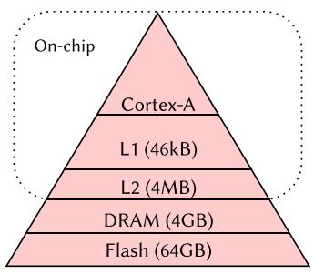  
(a) Mobile processor

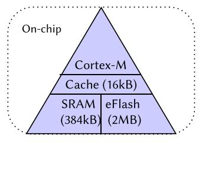  
(b) ARM Cortex-M7 microcontroller  
Fig. 3. Illustration of memory hierarchies for (a) a mobile processor and (b) an ARM Cortex-M7 microcontroller (right). The MCUs process all computation and data transfer on-chip.

Variety ofMCU Platforms. A key challenge for general TinyML solutions is the heterogeneity of embedded hardware platforms. MCUs vary widely in compute capabilities, memory capacity, support for floating-point versus fixed-point arithmetic, ISAs (e.g., ARM Cortex-M series vs. RISC-V cores), and availability of hardware accelerators. As a result, models and deployment pipelines often need careful tuning and customization to match the specific constraints of a given target device. This hardware diversity limits the portability of TinyML solutions and complicates the development of universally applicable frameworks and tools, underscoring the need for adaptive techniques and hardware-aware optimization methods.

## 3.2 Scope of Applications

As previously stated, the ability to embed NNs at the edge can already benefit a wide variety of applications and can potentially lead to completely new types of products [101].

Common applications are image detection and gesture recognition, such as human activity recognition (HAR), or keyword spoting. Note that these are all wireless applications, that must operate in real-time and are always-on. In this context, the device returns a decision at all times, so it is expected to provide a seamless user experience (e.g., not missing any user intention (false negatives) or over-triggering (false positives)). Their sensor types and target devices are specified in Table 5.

## 3.3 Challenges of Ultra-Low-Power Hardware

Compared to mobile devices, the all-on-chip design, as shown in Figure 3, allows the processing of data at the closest location to the source, resulting in lower communication latency and lower power consumption. Thus, this is ideal for real-time and low-power constraints. However, it also makes them inherently constrained because additional memory cannot be extended with an SD card for example.

Moreover, Table 4 highlights that the Cortex-M0+ and M4 are among the most resourceconstrained devices, with the Cortex-M0+ lacking support for floating-point operations. Consequently, we restrict to fixed-point (in contrast to floating point) values (Figure 4) and arithmetic which approximates real-values and computations [145], to comply with the inherent hardware and energy constraints of MCUs. Floating-point to fixed-point conversion requires a scaling factor of a power of two, which can be inferred as a simple bit shift and rounding as follows:

<table><tr><td>(31)</td><td>(30 29 28 27 26 25 24 23)</td><td>(22 21 20 19 18 17 16 15 14 13 12 11 10 9 8 7 6 5 4 3 2 1 0)</td></tr><tr><td>sign (1-bit)</td><td>exponent (8-bits)</td><td>significand (23-bits)</td></tr></table>

(a) Single precision floating-point 32-bit representation from IEEE754 [95].

<table><tr><td>(31 30 29 28 27 26 25 24 23 22 21 20 19 18 17 16)</td><td>(15 14 13 12 11 10 9 8 7 6 5 4 3 2 1 0)</td></tr><tr><td>integer part (m-bits)</td><td>fractional part (n-bits)</td></tr></table>

(b) Fixed-point Q16.16 (Qm.n) on 32-bit representation.  
Fig. 4. Floating-point representation from IEEE754 [95] and fixed-point 32-bit representation. Floatingpoint (a) allows a dynamic range (minimal to maximal possible value) of roughly $[ - 1 0 ^ { 3 8 } , 1 0 ^ { 3 8 } ]$ , compared to fixed-point (b) $[ - 2 ^ { m - 1 } , 2 ^ { m - 1 } - 2 ^ { - n } ] \approx [ - 2 ^ { 1 5 } , 2 ^ { 1 6 } ]$ , which is approximately a $\bar { 1 } 0 ^ { 3 \bar { 3 } }$ smaller range [154]. The smallest resolution (step between each consecutive representable value) of floating-point is ${ \approx } 1 0 ^ { - 3 8 }$ while it is $\left[ 2 ^ { - n } \right] \approx 1 0 ^ { - 5 }$ for $n = 1 6$ for fixed-point.

$$
Q (F, n) = \left\lfloor F * 2 ^ {n} \right\rceil , \quad F (Q, n) = Q * 2 ^ {- n},\tag{3}
$$

where 𝑄 and 𝐹 are the fixed point and floating point numbers, respectively, and 𝑛 is the number of bits. In practice, this means that we are limited to integer-only operations. Thus, only primitive operations like bit-manipulation, Boolean operators, and basic additions or multiplications are supported in contrast to computationally intensive operations, such as explicit division or exponentiation. Additionally, the memory is typically the first botleneck, so we seek lower-bit precision parameters than 32-bits, but this may increase the risk of overflow, or numerical precision loss and thus erroneous inference. From a hardware point-of-view, restricting to integer-only inference removes the need for a floating-point unit, which saves silicon area for each embedded chip, and thus billions of dollars of annual savings.

After a comprehensive review of the literature, the Cortex-M0+ and eDMPv1 appear to be one of the most resource-constrained platforms on which successful implementation of state-of-the-art DL has been reported [14, 172, 224]. Zhang et al. [224] deployed a 70 kB keyword spoting application on an Arm Cortex M7, while Banbury et al. [14] deployed the same application on an Arm Cortex-M4 with a higher accuracy.

Furthermore, embedded hardware has a very heterogeneous ecosystem because specifications may difer from one manufacturer to another, and even between new series of the same brand, making it challenging to find common tools and approaches that are widely supported.

Therefore, the ultra-low-power hardware context presents a unique set of challenges due to their inherent resource limitations. Addressing these challenges poses high research and industry potential value and can lead to transformative advancements in real-time and low-power applications across numerous domains.

To summarize, in Sections 2 and 3 we provided background on NNs, and low-power sensors and motivated the challenges and objectives of our TinyML. We will now examine the literature on methods (Section 4) and tools (Section 5) to design and deploy eficient NNs for MEMS-based applications.

## 4 Eficient NNs for TinyML

Building upon the concepts and motivations surrounding NNs and embedded systems introduced in the previous sections, we now turn our atention to their intersection: TinyML.

This emerging field aims to combine the powerful benefits of NNs with the cost-efectiveness of ultra-low-power devices with limited power, memory, and processing capabilities. Given the constraints of TinyML, developing eficient NN architectures and algorithms is essential. In light of the growing eforts in this area, there is an increasing need for methods that can efectively scale to the most challenging embedded hardware, particularly in the context of MEMS-based applications.

In this section, we explore the methods available to train and design eficient NNs for deployment on MCUs, enabling the deployment of intelligent applications on low-cost devices. In particular, we emphasize that quantization is the most critical method since it is a mandatory step in deploying models on MCUs.

Eficient RNNs. Sensor applications mainly process time-related data continuously, so we are naturally interested in standard RNN layers, such as RNN [47, 171], GRU [40], and LSTM [86]. Arık et al. [8], Bhardwaj et al. [21], and Lu et al. [139] have used convolutional recurrent neural networks (CRNNs) with a GRU or LSTM as the recurrent layer for keyword spoting or motion recognition applications for low-power and real-time inference, which matches our target applications and environment. The CRNN architecture ofers strengths both in feature extraction, and time sequence processing, as well as compatible size for our target hardware [21].

In particular, Arık et al. [8] empirically showed that GRU layers ofer beter size-performance tradeof over LSTM in keyword spoting applications, which is our most demanding use case.

Moreover, there have been research eforts to find eficient alternatives to standard RNNs, such as minimal RNN [31], minimal gated unit (MGU) [226], MGU1, MGU2, and MGU3 [84]. The MGUs difer from GRUs by reusing the gates, removing the bias term or the weight matrix completely, or a combination, detailed as follows:

$$
\begin{array}{l l} \text {MGU1:} & f _ {t} = \phi \left(U _ {f} h _ {t - 1} + b _ {f}\right), \\ \text {MGU2:} & f _ {t} = \phi \left(U _ {f} h _ {t - 1}\right), \\ \text {MGU3:} & f _ {t} = \phi \left(b _ {f}\right), \end{array}\tag{4}
$$

where $f _ { t }$ is the unique gate of the recurrent unit with weight parameters $U _ { f } ,$ , bias $b _ { f } ,$ and $h _ { t - 1 }$ the previous hidden state. We notice that the MGU1, MGU2, and MGU3 variants do not directly gate the current input $x _ { t }$ , but instead, they indirectly gate the previous input $x _ { t - 1 }$ by gating the previous state $h _ { t - 1 }$ , that has processed the previous input $x _ { t - 1 }$ . Zhou et al. [226] and Heck and Salem [84] suggest that these alternatives are competitive with GRU in terms of accuracy with a smaller parameter budget and thus should be more low-power friendly.

Next, we explore the methods that apply directly to models in order to reduce their power footprints.

Model Compression Techniques. Model compression is a set of methods aiming to address the growing power footprint and costs associated with the deployment of NNs in terms of size and computation on resource-constrained devices [87, 152], such as MCUs. In the following sections, we will provide an overview of the most commonly used techniques, which essentially encompass five methods: KD, pruning, quantization, weight-sharing, and low-rank matrix decomposition [152].

## 4.1 KD

KD is a high-level approach to model compression, first explored in Buciluǎ et al. [26] to reduce the model size by learning a small (student) model from an ensemble of models (teacher). Then Hinton et al. [85] popularized KD for NNs where a small model (student) is trained from the supervision of a larger and overparameterized trained model (teacher) that has learned “dark knowledge.” The idea is to leverage the latent knowledge the large teacher has captured and transfer it to the student during the training process. The loss encompasses both the original student loss (e.g., cross-entropy) and the diference between the teacher and student distribution, expressed as follows:

$$
L _ {\mathrm{KD}} (x, y) = \alpha L _ {\mathrm{S}} (x, y) + (1 - \alpha) \mathrm{D} _ {\mathrm{KL}} \left(\operatorname{softmax} \left(\frac {T (x , y)}{\text { temp }}\right), \operatorname{softmax} \left(\frac {S (x , y)}{\text { temp }}\right)\right),\tag{5}
$$

where $L _ { S }$ is the student loss function, $S ( x , y )$ is the output of the student model, $T ( x , y )$ is the output of the teacher model, $\mathrm { D } _ { \mathrm { K L } }$ is the Kullback–Leibler (KL) divergence, $\alpha \in [ 0 , 1 ]$ is a hyperparameter that controls the amount of distillation given by the teacher to the student, and temp is another hyperparameter that softens the probability distributions of the output models.

In practice, we must choose and train one teacher and one student architecture. Hinton et al. [85] showed promising results across general computer vision tasks and sequential data. However, the disadvantages are that it requires empirical knowledge to find good teacher and student models, as well as additional computations to train the teacher and the forward pass of the teacher during the student’s training. Although the design of the teacher would consist of training an overparameterized model, which works well in practice, the student should be the size of our target model. Moreover, we can bypass the additional forward pass of the teacher by storing its output along with the training set.

Therefore, the general framework design of KD is flexible for our case and has proven promising performance in a wide range of applications.

## 4.2 Model Pruning

While KD involves training a new smaller model, pruning focuses on removing less important parts of a model. From a neuroscience perspective, the human brain has a pruning mechanism that removes redundant connections or irrelevant information from past experiences [152, 208]. In the case of DL models, they are notoriously overparameterized (Section 2.2), which provides them with a large degree of freedom. In fact, it has been found that only a small fraction of the total parameters are critical [45]. Model pruning is a very active research area at the intersection of promoting eficient DL and understanding NN training and generalization ability, where new methods emerge continuously [4, 54, 87]. Recent comprehensive surveys classify and discuss a large number of pruning strategies, including [33, 82, 200]. In contrast, our review narrows the discussion to pruning approaches that have demonstrated feasibility for ultra-low-power inference on MCUs, highlighting implementation aspects, dataset scale, and compatibility with current TinyML toolchains such as CMSIS-NN [112] and TFLM [44, 210].

Han et al. [78] and Ullrich et al. [198] made a major breakthrough for model compression in the modern DL era, where they combined pruning, quantization (Section 4.3) and Hufman encoding [93] to reduce a CNN model by 49 times its size with less than 0.5% accuracy loss on the ImageNet dataset.

Seminal work by Frankle and Carbin [53] and Liu et al. [134] provided more theoretical understanding; the lottery ticket hypothesis (LTH) states that there exists a sparse subnetwork (winning ticket) that can be trained from scratch with the same initialized weights and reach the performance of the original network (10 times larger). In this view, a large model has a greater chance of containing a good subnetwork. They suggest that the network architecture itself is more critical than keeping the values of the weights in the original trained network. In practice, Frankle and Carbin [53] require iterative pruning trials of subnetworks to find the winning ticket, which is computationally expensive. Further work extended the LTH, showing that universal tickets could be reused across other applications [27, 52]. In particular, Ramanujan et al. [165] generalized the LTH to the strong lottery ticket hypothesis (SLTH) where the subnetwork performs well with the randomly initialized parameters and thus does not require re-training.

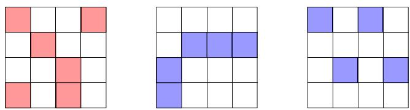  
Fig. 5. Unstructured pruning (left panel) versus structured pruning (middle and right panels).

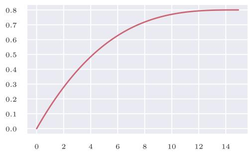  
Fig. 6. Pruning rate over epochs with a polynomial schedule function [228] with $s _ { f } = 0 . 8 , s _ { 0 } = 0 , t _ { 0 } = 0 ,$ $n = 1 3 \small { , } 2 6 0$ , and $\Delta t = 1 0 0$ (Equation (6)).

Additionally, Burkholz et al. [27] demonstrate that SLTH can also yield universal tickets across other applications. Consequently, the SLTH promises that training DL models could be replaced by eficient NN pruning [52]. Alternatively, pruning can be seen as a form of NAS [48], aiming to find Pareto-optimal architectures [134]. Moreover, it is also a form of regularization because it reduces the complexity of the model, similar to dropout, but the efect remains permanent.

There are essentially two types of pruning: unstructured and structured pruning, referring to how the pruning is performed in a weight matrix of a model, as illustrated in Figure 5.

Unstructured Pruning. Unstructured pruning refers to the removal of fine-grained weights in contrast to a group of weights. It is the simplest and most sparsity-inducing type of pruning because trained NNs are less sensitive to one weight than a specific block.

The most intuitive pruning scheme is to remove weights based on their absolute values, which is the simplest form of magnitude-based pruning, so it does not require any data. This simple approach has been studied early [76] and is very efective [58, 78, 87, 228]. In general, it involves re-training to adapt the model to its new architecture.

While there are a plethora of pruning algorithms, Gale et al. [58] suggested that magnitude-based pruning provides state-of-the-art or comparable performance to other pruning methods [138, 228].

In particular, Zhu and Gupta [228] introduced a gradual sparsity technique using a polynomial during the training schedule as follows:

$$
s _ {t} = s _ {f} + (s _ {0} - s _ {f}) \left(1 - \frac {t - t _ {0}}{n \Delta t}\right) ^ {3},\tag{6}
$$

for $t \in \left\{ t _ { 0 } , t _ { 0 } + \Delta t , \dots , t _ { 0 } + n \Delta t \right\}$ , where $s _ { t }$ and 𝑡 are the current sparsity and step, $s _ { f }$ is the target sparsity, $s _ { 0 }$ and $t _ { 0 }$ are the initial sparsity and training step (usually 0), 𝑛 is the number of pruning steps, and $\Delta t$ is the pruning step frequency. In other words, at every $\Delta t ,$ , a gradual number of weights is set to zero based on their magnitude until we reach the desired sparsity level. The objective of the polynomial schedule is to prune quickly and early when there is the most redundancy, and then slow down the pruning rate as there is litle remaining redundancy, see Figure 6 [226].

Noting that pruning is a form of regularization, Golatkar et al. [66] found that the early regularization phase is the most critical to performance and that late regularization can even worsen the results, thus supporting the efectiveness of polynomial schedule.

The advantage of magnitude-based pruning is that it is model- and task-agnostic, can seamlessly incorporate within training, and is easy to implement. Moreover, progressive pruning [228] is natively supported by the TensorFlow framework [1]. Additionally, they demonstrate a 90% sparsity rate with acceptable accuracy loss and found that their approach on large-sparse networks performs beter than their smaller-dense counterpart. An explanation of this is that larger models are easier to prune because the magnitude of single weights becomes smaller as the model grows larger when the model has converged [152]. However, the biggest disadvantage is that unstructured pruning results in sporadically induced weights, which may be dificult to eficiently leverage on embedded hardware, but previous work demonstrated that it is possible to leverage high sparsity with practical encoding [78].

Structured Pruning. Structured pruning alters the architecture of the NN in blocks, such as neurons, filters, or an entire row or column of a weight matrix. Structured pruning can be induced by using a systematic criterion based on redundancy, as in Srinivas and Babu [186], where neurons were removed in NNs by identifying duplicate pairs of neurons, performing a recovery step to compensate for removal. Another common approach is to use regularization penalty to encourage pruning at the channel level in CNN models [83, 133], by neurons [5], or layers [211], resulting in models with 60% sparsity without significant loss. The clear advantage of structured pruning is that it is hardware eficient because it may allow skipping entire filters or rows during a matrix multiplication, as suggested in Figure 5. However, block-based pruning techniques have strict compression rules that make them more dificult to achieve without degrading performance and require a certain amount of block sparsity to obtain a faster runtime than baseline [194]. However, recent research suggests that wider and sparser networks generalize beter than their smaller dense counterparts designed by structured pruning [12, 67, 123, 197, 228].

Pruning Based on Bayesian Methods. Among all, Bayesian inference can be used to promote sparsity in the model. Bayesian methods provide the posterior distribution over the parameters of the model, given the dataset and a prior distribution. As a result, this posterior distribution encompasses more information than a simple vector of optimal parameters: variance of the parameters, thickness of their tails, and so on. Besides, by tuning the prior distribution, the user can impose some structure to the posterior distribution, which can be used to encourage sparsity in the model.

A popular and intuitive prior is the spike-and-slab prior, introduced by [148] and used in NNs by [187], for instance. This prior is a mixture between a Dirac at 0 (the spike) and a distribution with a continuous density (the slab), e.g., a zero-mean Gaussian distribution:

$$
p (x) = p _ {0} \delta (x) + (1 - p _ {0}) (2 \pi \sigma_ {0} ^ {2}) ^ {- 1 / 2} \exp \left(- x ^ {2} / (2 \sigma_ {0} ^ {2})\right),
$$

with $p _ { 0 } \in ( 0 , 1 ) , \sigma _ { 0 } > 0$ . That way, the spike-and-slab prior pushes the parameters toward 0. More complex, the Horseshoe prior [30, 65] has been designed to have an infinite density at 0 and Cauchy-like tails:

$$
\begin{array}{r} X _ {i} \mid \lambda_ {i}, \tau \sim \mathcal {N} (0, \lambda_ {i} ^ {2} \tau^ {2}), \\ \lambda_ {i} \sim \mathcal {C} ^ {+} (0, a), \\ \tau \sim \mathcal {C} ^ {+} (0, b), \end{array}
$$

with $a > 0 , \ b > 0 ;$ , and where $C ^ { + } ( 0 , a )$ is the half-Cauchy distribution with scale parameter 𝑎. Thus, the horseshoe prior encourages the parameters to be exactly 0 while allowing extreme values.

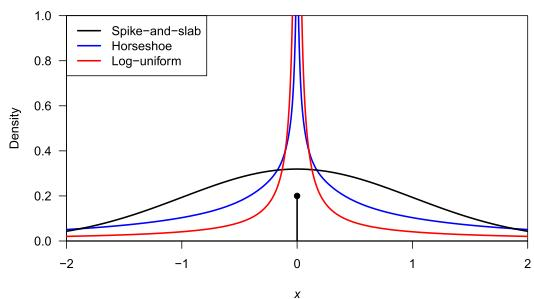  
Fig. 7. Prior densities promoting sparsity illustrated with the following hyperparameters: Spike-and-slab with $ p _ { 0 } = 0 . 2$ and $\sigma _ { 0 } = 1$ ; Horseshoe with $a = b = 1 ;$ Proper log-uniform with $a = 1 0 ^ { - 5 }$ and $b = 2 .$

Another regularization technique, the dropout [189], has led to the development of the log-uniform prior by [153]. Although improper, this prior is designed to be agnostic about the order of magnitude of the parameters. As a result, its density tends to infinity at 0, so small values are encouraged. However, to make the log-uniform prior proper, it is common to set its density to 0 outside an interval spanning several orders of magnitude, as described follows:

$$
p (x) = (2 | x | \log (b / a)) ^ {- 1} 1 _ {[ a, b ]} (| x |),
$$

with $0 < a < b .$ . These densities are illustrated in Figure 7.

Beyond the choice of the prior, one should pay atention to the choice of the approximate Bayesian method and the search space of the approximate posterior. In fact, it is usually too costly to compute the exact posterior distribution of the parameters of large models such as NNs [7, 159]. Therefore, one has to choose an approximate Bayesian method and a search space of the posterior distribution. For instance, it is common to use variational inference [71] and look for an approximate posterior consisting of independent Gaussian distributions over the set of parameters (where their mean and variance are trained). In [187], the candidate posterior distributions for one parameter $\theta$ are the mixtures between the Dirac at 0 and $N ( \mu , \sigma ^ { 2 } )$ , with mixture parameter $g \colon$ the trained parameters are then 𝑔, 𝜇, 𝜎. In that case, the value of 𝑔 is directly related to the sparsity: if $g = 0$ , then $\theta = 0$ , so 𝜃 can be pruned.

Summary. In summary, pruning has strong theoretical and practical incentives that make it a high-potential and relevant choice. Unstructured pruning approaches are more flexible across diverse architectures and yield the highest sparsity rate, while structured pruning approaches are more hardware eficient.

Moreover, multiple works have shown that combining pruning with other model compression methods, such as quantization, can produce a high compression rate without significant performance loss [78, 201, 223].

## 4.3 Quantization

A diferent perspective on model compression is quantization. It is a method mapping input values from a larger set (often continuous) to a smaller set (often discrete) [64] to find lossless approximations of numerical input values, and can be seen in related work dating back to the 1,800 s in the foundations of calculus (e.g., least-squares, approximation of integrals) [64, 73].

Specifically, fixed-point atempts to represent continuous values (larger set) with a fixed amount of precision (smaller set); thus, quantization is a mandatory method to meet the low-power requirements of fixed-point arithmetic inference on MCUs, as stated in Section 3.3.

Recent work on NN quantization builds upon prior work but presents unique challenges due to the high power footprint and overparameterized nature of DL models. The inherent redundancy in DL models allows for some leniency in quantization errors, limiting accuracy loss [64, 74]. Consequently, very small models, that can be found in TinyML, should be more sensitive to quantization.

Minimizing quantization performance loss can be seen as an optimization problem, where the objective is to find a discrete distribution (quantized weights) that is closest to the original distribution (real weights, activations, or data). In practice, this translates by rounding or truncating the model’s parameters (weights, activations) and data from floating points (e.g., 32-bits) to integer values (e.g., 8-bits).

Compared to pruning, quantization often results in less accuracy loss because weights lose precision but are not removed, hence a lower level of information loss [172]. For reviews of quantization techniques, one can refer to Liang et al. [124] and Rokh et al. [169]. Unlike these works, which focus on general-purpose or mobile-level quantization methods, our review specifically addresses quantization under the extreme memory and compute constraints of sub-100 kB MCUs, emphasizing practical deployment tradeofs and framework-level support within the TinyML ecosystem.

Quantization approaches can be characterized by several factors: the stage of the quantization process as QAT or PTQ, the type of quantization steps as uniform or non-uniform, and the arrangement of quantization levels around the zero-point 𝑍 as symmetric or asymmetric (Equation (7)).

QAT. QAT involves integrating quantization into the training process or fine-tuning the model by simulating the efects of quantization during the forward or backward pass. However, the quantized function is not diferentiable (Equation (7)) and can result in zero-gradients in low bit-precisions, making it dificult to train the model. Prior works have quantized values in the forward pass and used real values during the backward pass such as the straight-through estimator [18, 41, 97], or other approximations [136, 218]. In addition, Choi et al. [35] learn to optimize the range of activation clipping values and then linearly quantize both weights and activations to 4-bits, while Bhalgat et al. [20] use a gradient estimate to learn scaling factors of weights and activations. Alternatively, Darabi et al. [43] employ regularization to force the weights to converge to binary values during training, which is generalized in Lê et al. [115] to any bit-precision and using a schedule for progressive quantization during training. The objective of QAT is to obtain a stabilized quantized model by the end of training. These methods enable below 8-bit quantization and even down to 1-bit weights or activations [41, 92, 135, 164, 166] with competitive results compared to full precision networks and PTQ. Additionally, AskariHemmat et al. [9] found that quantization is a form of regularization, where the induced quantization noise can help improve generalization, and particularly to 8-bits on several computer vision tasks. However, QAT often requires a lot of tuning, additional computation, and access to the dataset to re-train the model, especially for low-bit quantization.

PTQ. PTQ is the simplest and fastest approach, where quantization can be applied to any trained model without re-training or access to the dataset [15, 29, 38, 49, 78]. Previous work corrected the mean and variance of quantized weights [15, 64], or minimized the mean squared error between the quantized and full-precision distributions [38], allowing 4-bit quantization with acceptable performance. Another approach used piecewise linear functions to partition the quantization range into non-overlapping regions for each weight in order to minimize the quantization error [49].

The most widely used quantization method for MCUs is uniform afine PTQ to int8 because it is straightforward and supported by MCUs [64, 107, 172]. Moreover, uniform PTQ with int8 provides suficient performance compared to the original full-precision 32-bit model for a wide variety of

NNs [49, 107, 119]. However, PTQ may lead to a more significant loss in accuracy, especially for quantization below 8 bits [15, 64].

(Non-)Uniform Quantization. In uniform quantization, the quantization steps are evenly spaced, so it is the most straightforward type of quantization while being natively supported in all embedded hardware [172].

In contrast, non-uniform quantization may beter capture the original distribution, thus yielding higher accuracy [64]. For example, Miyashita et al. [149] and Zhou et al. [225] use a logarithmic distribution with exponential quantized steps instead of linear steps. Alternatively, Fu et al. [55] quantize activations and gradients by finding optimal quantization points that fit their full-precision distributions based on their Weibull prior properties [206, 207], and obtained competitive results compared to the full precision training using less bits than their uniform-based counterpart [55].

However, non-uniform quantization schemes are challenging to deploy on embedded hardware because they require a custom implementation to eficiently exploit their specific distribution, in contrast to uniform quantization which is deployable out of the box. Therefore, we restrict the scope of our review to uniform quantization schemes for a wide hardware support.

(A-)Symmetric Quantization. In symmetric quantization, the lower and upper bounds of the quantization range are equidistant from the zero-point, and $Z = 0 .$ , which simplifies as follows:

$$
Q (r) = \mathrm{int} (r / S) - Z,\tag{7}
$$

where $Q$ is the quantization function, 𝑟 the value to quantize, 𝑆 a scaling factor, 𝑍 represents the zero-point value in the integer discrete space, $\alpha , \beta$ denote the lower and upper bounds $( \alpha < \beta )$ respectively, of the clipping range where we constrain 𝑟, and 𝑏 is the bit-width.

The scaling factor for symmetric and asymmetric quantization is computed as follows:

$$
S _ {\mathrm{sym}} = \frac {\max (| \alpha | , | \beta |)}{2 ^ {b - 1} - 1}, \quad S _ {\mathrm{asym}} = \frac {\max (| \alpha | , | \beta |)}{\left(2 ^ {b} - 1\right) / 2}.\tag{8}
$$

Asymmetric quantization schemes consider the full range of quantized values, $\mathbf { e . g . , } \left[ - 1 2 8 , + 1 2 7 \right]$ in contrast to [−127, +127]. This provides a slightly larger range to minimize quantization error but is a more complicated implementation due to the zero point $Z \neq 0$ in Equation (7), and may lead to more computational overhead [213].

Quantization Based on Bayesian Methods. Similarly to the case of pruning, Bayesian inference can be used to reduce the number of bits necessary to encode a continuous parameter. For instance, Van Baalen et al. [201] have proposed a method in the variational inference framework [71]: each parameter of a NN is decomposed as a sum of gated residuals:

$$
x = z _ {2} (x _ {2} + z _ {4} (\epsilon_ {4} + z _ {8} (\epsilon_ {8} + z _ {1 6} (\epsilon_ {1 6} + z _ {3 2} \epsilon_ {3 2})))),
$$

where $x _ { 2 }$ is the basic 2-bits approximation of $x ,$ the $\epsilon _ { n }$ are the 𝑛-bits residuals of 𝑥, and the $z _ { i }$ are the corresponding gates. In this example, 𝑥 is allowed to be pruned or approximated on $2 ^ { n }$ -bits for $n \in \{ 1 , 2 , 3 , 4 , 5 \}$ . The $( z _ { i } ) _ { i }$ are dependent Bernoulli random variables whose parameters are trained: if all $z _ { i }$ tend to become 0, then 𝑥 can be pruned; if $z _ { 2 }$ tend to be always 1 and the others 0, then 𝑥 can be eficiently approximated by its 2-bits part; if all $z _ { i }$ tend to be always 1, then 𝑥 should remain coded on 32 bits. In this setup, the optimal level of quantization (in a Bayesian sense) is discovered progressively during training and can be heterogeneous across the parameters. Moreover, the allowed quantization levels span a large interval, from the usual 32-bits quantization to pruning.

Also, the entire posterior distribution provided by Bayesian inference can be used to improve quantization methods. For instance, Yang et al. [217] have developed a quantization method that can be applied to a model for which a posterior distribution is already known for each of its parameters.

In this work, the posterior distribution of each parameter is transformed by a function, which is the CDF of the prior distribution. Then, the mode of the resulting function is quantized with precision depending on its width: if the mode has a large width, then a few bits are necessary to encode it. With this setup, the partition used for quantization is, at least, adapted to the prior distribution, and leads to a more eficient quantization when applied to posterior distributions. Finally, Meng et al. [146] train binary NNs using the Bayesian learning rule [104], an algorithm inspired by the Bayesian paradigm. This approach enables uncertainty quantification while providing state-of-the-art results.

Summary. In summary, quantization methods have a long history and exist in many flavors to achieve lossless approximations in the most constrained setings. QAT emerges as a superior option in below 8-bit setings, but is more complex and requires more computations than PTQ.

However, uniform PTQ with lower bit quantization is more sensitive due to the distributional properties of weight, which are clustered around zero (Gaussian or Laplacian) [78, 128], and few of them are in a long tail (Sub-Weibull) [206, 207]. Consequently, uniform quantization maps too few quantization levels to small weights and too many to large ones, leading to performance loss [49]. However, overparameterized models are less sensitive to PTQ due to having more degrees of freedom [152] in contrast to smaller models. Thus, we would favor uniform 8-bit PTQ due to its simplicity and acceptable results until we need lower-bit precision for more power footprint reduction.

## 4.4 Weight-Sharing

Weight-sharing is the simplest form of model compression, involving sharing weights values in diferent parts of the model, so it imposes a model architecture prior to training [152]. We could set the amount and location of weight-sharing in a strategic way in the model, such as in rows or columns of the weight matrix, for eficient inference. However, manual weight-sharing design may be dificult because we cannot predict the final performance, even if redundancy is part of the design of DL models.

Prior works have used an automated approach, such as clustering weights with k-means that shares the centroid value among weight clusters with re-training [214], where they compressed a CNN model by a factor of three without significant loss, or by using a penalty term to encourage grouping weight [156, 198].

In particular, quantization is a form of weight-sharing because lowering the bit-precision of parameters forces them to be aggregated into a common set of values.

## 4.5 Low-Rank Matrix and Tensor Decompositions (TDs)

Since NN weight parameters are essentially matrix or tensors, we can apply approximation methods from linear algebra such as single value decomposition or its generalization to TD [152]. The weight matrix is then replaced by a product of two lower-rank matrices [6, 155, 173, 215]. In particular, Alvarez and Salzmann [6] obtained a compression rate of up to 96% compared to the original model.

However, these methods require additional hyperparameter tuning [116], as well as trial and error to find the optimal rank, which may not generalize between applications. Furthermore, for MCUs, it is crucial to consider that the incorporation of additional products from the lower-rank matrix may not always lead to increased eficiency and reduced power consumption, so further evaluation of the device is required.

## 4.6 Summary

In summary, we have provided a comprehensive overview of the key methods to design and train eficient TinyML models, accompanied by their related theoretical concepts and practical implications. These methods have generated growing interest, as they bridge the gap between DL theory and the deployment of eficient NNs.

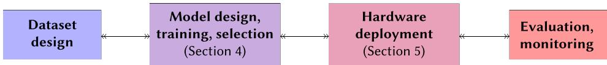  
Fig. 8. TinyMLOps pipeline.

Specifically, model pruning, KD, and quantization have demonstrated very promising compression rates, particularly in larger-scaled networks (Mobile or Cloud size) that are more robust to model adjustments. Furthermore, some model compression methods are also forms of regularization that can even help the model to generalize beter. Thus, these approaches show high potential to meet the ultra-low-power requirements MCUs.

In practice, since TinyML is at an early stage, tools and processes are not mature enough yet to evaluate and truly leverage the high compression rate of existing methods for ultra-low-power MCUs, so we will review practical TinyML tools and aspects of the deployment of compressed NNs in the next section.

## 5 Deploying DL Models on Ultra-Low-Power MCUs

In this section, we define and review existing tools and methods for the end-to-end deployment of eficient NNs on ultra-low-power MCUs.

TinyMLOps. The first framework for training DL models was developed in 2008 [196], with TensorFlow [1] and PyTorch [160] following suit in 2015 and 2016, respectively. These frameworks enabled the large-scale development and deployment of DL models, which in turn led to the emergence of Machine Learning Operations (MLOps) [106]. MLOps consolidates best practices and outlines steps for mitigating technical debt [178] during the development and deployment of ML systems.

In contrast, the earliest known publication on TinyML dates back to 2019 [77], and the first dedicated DL framework for MCUs, TFLM, was also released in 2019 [44, 210]. As TinyML gained traction in the industry, MLOps naturally expanded to include TinyMLOps as a subset [114, 120], focusing on refining the process of deploying ML on embedded devices, as depicted in Figure 8. In the context of TinyML, deployment refers to the process of taking a trained model and enabling it to run on an embedded system, such as compiling the model, firmware integration, and verification of the solution on the target device.

Consequently, the TinyMLOps ecosystem is still in an earlier stage than MLOps, with challenges yet to be fully addressed. We detail here the challenges faced by TinyMLOps tools and methods in practice, as well as existing solutions.

## 5.1 Eficient Methods and Deployment

In the context of edge inference, quantization is a mandatory step for all methods to ensure eficient deployment on resource-constrained devices. Consequently, the specific details of quantization are not reported separately here. This section reviews the following model compression techniques in practice, echoing their presentation in Section 4: KD, pruning, weight sharing, and low-rank matrix and TD, which are employed to create eficient TinyML models suitable for edge devices.

KD. TinyBERT [99] utilized KD on a large language model, resulting in a model that is 7.5 times smaller and 9.4 times faster. However, it remains too large for microcontroller deployment with 14.5 million parameters. Polino et al. [163] trained a quantized student model from a full precision teacher, producing a small student model with 77.92% accuracy and 450 KB memory usage on CIFAR-10, making it 46 times smaller than the teacher. Using a medium-sized student model, they achieved 84.22% accuracy, though it was almost three times the size of the small student model. Zein et al. [221] combined standard KD with PTQ, achieving 69.5% accuracy and an 81 KB model size on CIFAR-10.

Despite these promising results, there is limited use of KD for deployment on MCUs in the existing literature. This may be atributed to the simplicity of pruning and quantization methods and the more stringent size constraints compared to mobile-sized models (approximately less than 1 MB).

Pruning. In practice, all structured pruning methods can be applied prior to deployment, benefiting eficient TinyML models. Consequently, many previous works already utilize structured pruning as an efective compression method, which can be well adapted to the TinyML context.

Structured pruning, as demonstrated in [50] with Bayesian compression [137] via variational inference, approximates the weight posterior by a certain distribution. They achieved an 80-fold reduction in parameter count while maintaining an accuracy of 98.64%, resulting in a 2.77 KB model using 1.96 KB RAM on MNIST. Similarly, Liberis and Lane [127] used structured pruning to achieve 91.98% accuracy on CIFAR-10 with a 256 KB model, and up to 96.03% accuracy on Google Speech Commands v2-12 with models as large as 115 KB.

While structured pruning is efective out of the box, unstructured pruning poses challenges in fully leveraging its benefits for edge inference, making it an area for future development.

Weight Sharing. Weight sharing can be seen as a loose form of quantization since parameters are approximated into a finite set of values and thus are merged into the same quantized value. Han et al. [78] combined pruning, weight sharing, and quantization, achieving 98.42% accuracy on MNIST with a model size of 27 KB, compared to the original 1,070 KB model. Though weight sharing shows potential for eficient model deployment it has not been widely adopted for TinyML models.

Low-Rank Matrix and TD. Kusupati et al. [111] combined sparse matrix decomposition and quantization, achieving 92.21% accuracy on Google Speech Commands v2-12 with a model size of 57 KB. Despite being less straightforward than other approaches, these methods are under exploration for eficient inference.

## 5.2 Challenges for TinyML Tools

The fundamental characteristic of TinyML is the tight dependency between software and hardware components. In fact, failure to adapt the delivered ML software to the constraints of particular hardware renders it unusable, resulting in wasted eforts in previous TinyMLOps steps. Additionally, the diverse landscape of embedded hardware further complicates the task of developing a versatile software base capable of supporting a wide range of embedded hardware platforms [120], resulting in a manual and iterative approach to the design of new models. As a result, designing new models that work on diferent hardware remains a manual and iterative approach (diferent firmware, debugging interfaces). The challenge of TinyMLOps is to improve the entire pipeline, from design to deployment, from data to computation.

Even though TinyML shares some tools with traditional ML (e.g., TensorFlow, PyTorch, Tensorboard), its more recent emergence means that specialized tools are not yet created or are less mature in providing comprehensive solutions. As the TinyML community continues to grow, greater awareness and adoption of tools will lead to faster innovation and the development of comprehensive solutions.

## 5.3 TinyML Tools

We restrict TinyML frameworks to the one that supports TensorFlow models as input due to its wide adoption in the industry and that also targets Arm Cortex-M MCUs for inference.

We essentially consider these two common approaches to TinyML frameworks [183]:

(1) Using a runtime that loads the model from read-only device memory at runtime (e.g., TFLM);

(2) Using a transcompiler that converts and compiles models to C or C++ code that then can be built within a project (neural network on microcontroller (NNoM), Edge Impulse, 𝜇TVM).

## 5.3.1 Low-Level Library.

CMSIS-NN. CMSIS-NN is a low-level library specifically developed by Arm [112] for the Cortex-M microcontroller ecosystem (Table 4). It provides a collection of eficient NN core functions for low-level acceleration. These functions include optimized operations for common NN operations, such as FC layers, convolutions, and activation functions (ReLU, sigmoid, tanh). CMSIS-NN has been shown to provide a 4.6x speedup and 4.9x energy savings over non-optimized convolutional models [112, 172].

## 5.3.2 TinyML Frameworks.

TFLM. This framework is an extension of the TensorFlow ecosystem, specifically designed for deploying NNs on low-power MCUs such as ARM Cortex-M [44, 167, 172, 183, 210]. TFLM emphasizes portability by discarding uncommon features, data types, and operations and avoids reliance on specialized libraries or operating systems, thereby achieving memory eficiency and support for a wide range of hardware. It converts and quantizes a 32-bit floating-point TensorFlow model to a compressed flat bufer file (.tflite) using 8-bit integers for weights and 32-bit integers for activations and data. TFLM uses an interpreter-based approach to process the NN graph at runtime and consists of three primary components: operator resolver, memory stack pre-allocation, and interpreter [177, 185]. The operator resolver links only essential operations to the model binary file, and the memory stack is used for initialization and storing runtime variables. The interpreter resolves the network graph at runtime, allocates the memory stack, and performs runtime calculations. More technical details are provided in David et al. [44] and Schizas et al. [177].

However, TFLM has limitations, such as missing support of some layers or operations (GRU, Conv1D, some important activation functions), arbitrary bit-widths of weights, and activations. Moreover, TFLM lacks target-specific optimizations during compilation because it relies on a graphlevel representation that does not include device-specific function kernels and execution details [177, 185], and can result in larger memory usage, so it may not meet our extreme memory requirements. Moreover, it does not provide built-in tools to measure power footprint metrics such as inference time or memory usage. Moreover, the interpreter-based approach at runtime makes it dificult to debug and extend, compared to standard compiled code, which hinders research eforts. Despite these limitations, TFLM remains the most popular choice for microcontroller-based DL applications.

NNoM. This open source framework [141] relies on a C code generation approach with a set of function calls. It is flexible, easy to debug, and supports a wide range of MCUs, but only supports models created using TensorFlow. The project includes a compiler that converts and quantizes a TensorFlow model to plain C code with 8-bit weights and 32-bit activations and data. Additionally, the NNoM compiler supports CMSIS-NN to generate optimized code for ARM Cortex-M processors [183]. It does support all RNN layers including GRU, in contrast to TensorFlow. However, it does not support lower bit-width quantization and has a smaller community and adoption compared to TFLM, so this hinders the development of new features.

Edge Impulse. Lastly, Edge Impulse [98] is a closed-source cloud service that develops TinyML ML models for edge devices and supports AutoML for mobile and MCUs [167, 172]. Edge Impulse provides a complete end-to-end model deployment solution, including data collection, feature extraction, training, and deployment [172], with an intuitive graphical interface and a friendly no-code approach. The training is carried out in the cloud and the learned model can be exported to an edge device using a data-forwarding capable connection [177].

For model deployment, Edge Impulse uses an interpreter-less edge-optimized neural compiler, which directly compiles the model into C++ source code. This approach eliminates the need to store unused ML operators, resulting in reduced memory requirements at the expense of portability compared to TFLM. Studies have shown that the EON compiler can run the same model with 25%–55% less SRAM and 35% less flash memory than TFLM [172].

In conclusion, TinyML brings together the embedded systems and ML communities, which have traditionally operated independently. Both academia and industry have developed several software frameworks for TinyML to streamline the deployment of ML models on MCUs. In particular, we are interested in TFLM because it integrates with TensorFlow and provides a complete toolchain for deploying low-power models MCUs. We are also interested in NNoM because it provides a flexible and simple approach to quantizing and deploying models from plain C code and CMSIS-NN support for Arm Cortex-M MCUs. Moreover, these two frameworks are open source, which makes them accessible as well as potentially extendable. However, these frameworks are still in the early stages of development, with some missing features and functionality. Despite their limitations, the current first generation of TinyML tools can transition the state-of-the-art ML models to ultra-low-power environments.

## 5.4 Algorithm-Hardware Co-Design

Even though the diversity of TinyML hardware makes designing new models dificult, working at a low level allows us to design new processors adapted to specific tasks. A complete algorithmhardware co-design workflow with extension of the ISA RISC-V has been proposed by Verma et al. [204]. It involves all the stages between hardware design and commonly used ML libraries such as PyTorch or TensorFlow. Specifically, on the software side, they use a compiler to translate into C the functions defined in ML libraries, and, on the hardware side, they use the generated C code to design a processor, along with a Software Development Kit (SDK) and a specific set of instructions. As a result, they obtained a 17.63× speed-up for the general vector–matrix multiplication kernel by using a 16 × 16 custom Vector–Matrix Multiply instruction and specific functional hardware.

For more details about hardware and software acceleration in IoT, one can refer to [2, 121].

## 5.5 Experimental Results

An important benchmark involving TinyML has been proposed by Reddi et al. [168]. Its purpose is to evaluate the latency and energy when performing inference on one single input, for a given model on a given MCU. The benchmark consists of five diferent combinations of tasks/models, which represent typical usages of TinyML:

—Keyword Spoting: Speech Commands dataset [209], Depth-Separable CNN model [36];

—Anomaly Detection: ADMOS Toy Car dataset [105], FC AutoEncoder;

—Person Detection: COCO (visual wakeword) dataset [39], MobileNetV1 (0.25x) [90];

—Image Classification: CIFAR-10 dataset [108], ResNet-V1 model [81].

The latency and energy consumption are measured after checking that the tested model meets a certain level of accuracy, determined by the benchmark. For instance, the ResNet-V1 model must achieve at least 85% accuracy on CIFAR-10.

Table 6. Latency (in ms) and Energy (in µJ) of Each Model at Inference on Two MCUs for a Single Input

<table><tr><td rowspan="2">Processor32-Bit ARM</td><td colspan="2">DS-CNN</td><td colspan="2">FC AutoEncoder</td><td colspan="2">MobileNetV1 (0.25x)</td><td colspan="2">ResNet-V1</td></tr><tr><td>Lat.</td><td>Ener.</td><td>Lat.</td><td>Ener.</td><td>Lat.</td><td>Ener.</td><td>Lat.</td><td>Ener.</td></tr><tr><td>Cortex-M4</td><td>88.36</td><td>1,376</td><td>42.01</td><td>2,965</td><td>816</td><td>165.7</td><td>24.48</td><td>5,090</td></tr><tr><td>Cortex-M7</td><td>23.16</td><td>1,820</td><td>11.25</td><td>3,895</td><td>190.1</td><td>203.37</td><td>6.06</td><td>6,919</td></tr></table>

The models have been previously trained on specific tasks to meet a given level of accuracy. Reported metrics have been measured on the version 1.2 of the benchmark. Full results have been published by ML Commons (https://mlcommons.org/benchmarks/inference-tiny/).

A rapid comparison of the Cortex M4 and M7 in Table 6 shows that, for a trained model, the energy consumption of the M4 is lower than that of the M7, while having a higher latency. These experimental results are consistent with Table 4, showing that the Cortex-M7 has both a higher frequency and consumption than the Cortex-M4.

While benchmarking eforts such as MLPerf Tiny have standardized latency and energy evaluation, other practical aspects of deployment remain less explored. In particular, the design of lightweight preprocessing pipelines on-device, covering tasks such as denoising, normalization, and fixed-point feature extraction, plays a crucial role in ensuring reliable model performance under tight memory and latency budgets. These preprocessing steps are often performed ofline or are inconsistently implemented, making reproducibility across platforms dificult. Furthermore, TinyML evaluation metrics should extend beyond accuracy to incorporate end-to-end latency, memory footprint, energy per inference, and model size, reflecting the actual constraints of embedded devices. Developing unified, open benchmarking methodologies that integrate these dimensions would enable consistent cross-platform comparison and guide future optimization of both models and hardware for real-world TinyML applications.

## 6 Limitations of TinyML

In this section, we assess the limitations of current TinyML models when applied to standard datasets, with a specific focus on their memory size. The emphasis is on memory size rather than other metrics such as latency, as memory size is the primary constraint to overcome for deploying TinyML models. Latency is considered as secondary and is less frequently reported in the literature. Consequently, memory size is crucial in determining the range of MCUs that can be selected, which is critical for industrial applications. Our primary objective is to identify the most eficient models that strike the optimal balance between performance and memory usage. By doing so, we aim to ofer valuable insights to researchers and industry professionals, shedding light on the scale of TinyML models. Furthermore, our analysis aims to pinpoint the most suitable models among widely adopted options and various hardware platforms for their respective applications.

We focus here on the most common datasets found in TinyML model benchmarks for the following three tasks:

—Image Classification: MNIST is a basic dataset for image classification of handwriten digits. We also use ImageNet, a more challenging image classification dataset than MNIST due to its larger and more diverse images and labels, thus requiring more complex models.

—Image Recognition: Visual Wake Word (VWW) is focused on the visual presence recognition of a person or an object in images.

—Speech Recognition: Google Speech Commands v2-12 consists of short audio clips of spoken word commands with 12 classes to recognize.

MNIST. For MNIST, we find that 𝜇NAS [125] clearly ofers the best size-accuracy tradeof and is below the Cortex M0+ memory limitation. The large LeNet [78] has slightly beter accuracy but is over the memory threshold. Then, the two versions of Sparse CNN [50] are both below the extreme low-power threshold, but their accuracies are still lower than 𝜇NAS. However, ProtoNN [75] and Bonsai [110] display the least favorable tradeof, but ProtoNN is below the Cortex M0+ threshold.

ImageNet. We observe that ImageNet models require the largest models of all studied here, mostly above the ultra-low-power MCUs (Cortex M4 and M7) threshold. In particular, the large MCUNet [130] has the best accuracy tradeof and is right below the Cortex M7 memory threshold. Both versions of SqueezeNet [94] and MNasNet [192] have low accuracy, so they are unsuitable for practical application.

VWW. We notice that no models are below the Cortex M0+ memory threshold, but the size of the RaScaNet models [219] shows that it would be reachable with further research. In the ultra-low-power range, MSNet [34] clearly provides the optimal size-performance tradeof, but one could deploy the large RaScaNet for even lower power and acceptable accuracy. In comparison, the performance of MNasNet is less favorable. We also see that MobileNetV1 [14, 90] and MicroNet [14] display the worst size-performance tradeof.

Google Speech Commands v2-12. In the extremely low-power range, we note that FastGRNN [111] ofers the best tradeof, while in the ultra-low-power range, 𝜇NAS displays once again the best tradeof. ConvGRU 4-bits [115], ShallowRNN [46], Hello Edge DS-CNN [224], TinySpeech-Z [214], LSTM-KP [195], LMU-4 [24], FastRNN [111], DS-CNN [13], and all have acceptable performance, but are still less favorable than 𝜇NAS. In contrast, all versions of MicroNet present the least optimal performance once more, where the large MicroNet is even above the Cortex M4 threshold.

Preprocessing Considerations. Preprocessing plays a critical role in TinyML performance evaluation, especially under strict memory and computation constraints. For the datasets reviewed here, typical preprocessing steps include resizing images (e.g., ImageNet and VWW resized to 96 × 96 or smaller resolutions), grayscale normalization (e.g., for MNIST), and basic feature normalization or feature extraction for speech datasets like Google Speech Commands v2-12. These preprocessing steps standardize input dimensions and dynamic ranges across models, ensuring fair comparisons. Consistent preprocessing is essential for reproducibility, allowing researchers and practitioners to benchmark models reliably and replicate performance results under comparable conditions, particularly when deployed on ultra-low-power devices with limited preprocessing capabilities.

Beyond Accuracy: Additional Metrics for TinyML. While accuracy remains the most commonly reported metric for evaluating TinyML models, several additional metrics are critical for assessing real-world feasibility in resource-constrained environments. Latency measures the time required for inference, which directly impacts the responsiveness of an embedded system. Power consumption quantifies the energy required for inference, afecting batery life and thermal characteristics. Inference eficiency, often expressed as operations-per-second or energy-per-inference, provides a holistic view of resource utilization. Although these metrics are not consistently reported across the literature reviewed, they are essential for a complete evaluation. Future research would benefit from systematically reporting these measures to support fair and comprehensive benchmarking of TinyML solutions.

Interpretation. We summarize the key tradeofs between accuracy, model size, and hardware feasibility through a series of plots in Figure 9. These plots present accuracy versus flash model size for the above common TinyML benchmark datasets, overlaid with vertical lines representing memory limits for diferent microcontroller classes (Cortex-M0+, M4, and M7). Figure 9 conveys the performance and compactness of each as well as their feasibility with respect to typical hardware constraints, allowing practitioners to directly assess which models can be deployed on specific platforms. It also shows the interplay between accuracy, model footprint, and MCU capabilities, helping guide eficient TinyML design decisions.

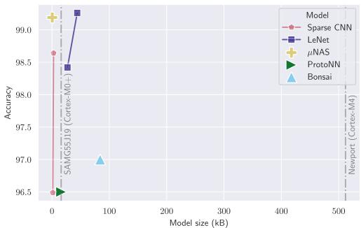  
(a) MNIST

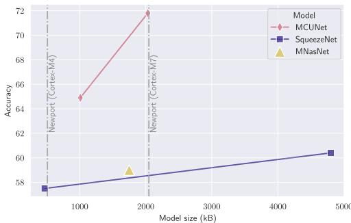  
(b) ImageNet

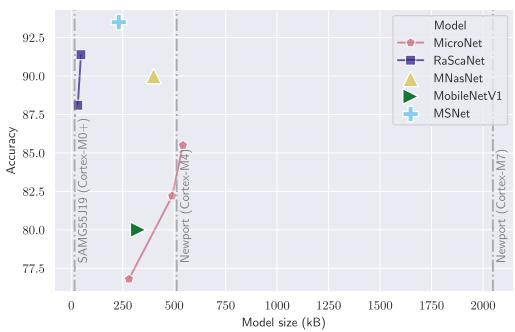  
(c) Visual Wake Word

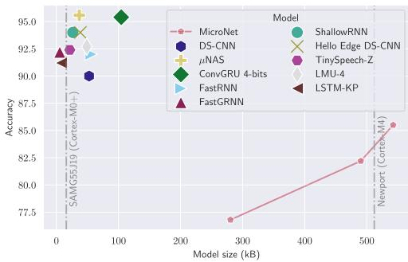  
(d) Google Speech Commands v2-12  
Fig. 9. Flash model size versus accuracy on the four considered datasets. Vertical grey dashed lines indicate hardware storage limits for Cortex-M0+, Cortex-M4 and Cortex-M7 (see Table 4).

Among the standard datasets, TinyML models are able to comply with extreme-low power constraints as low as 8 kB for a speech recognition task and a simple image classification dataset, with a given tradeof on accuracy. In this regard, further research eforts are required for an image recognition task and a more complex image classification problem. Otherwise, Cortex M4 is suficient to run most models for all tasks with the best accuracy.

The industrial cost ofexceeding a hardware memory threshold is high. Emphasizing the successful deployment of models on the most constrained MCUs is crucial, given the substantial economic impact. Even though microcontroller power classes (extreme low-power and ultra-low-power) have minor price diferences (ranging from 1 to 3 dollars) and are inexpensive, the price significance magnifies when considering the billions of annual unit market sales, resulting itself in billions of yearly savings. Thus, designing eficient models is critical for the TinyML industry, and inherently comes with a price tradeof.

## 7 Conclusion and Discussion

Summary. In Section 2, we presented the state of NNs and motivated our interest in them for our applications, then we provided an overview of MEMS-based applications, emphasized the opportunities and challenges of our extremely low-power constraints, reinforcing the need for more TinyML research eforts in Section 3. In Section 4, we presented the existing methods to design eficient NNs on ultra-low-power MCUs, and in Section 5, we provided an overview of existing tools to deploy NNs to enable TinyML applications. Finally, we examined the current limitations in the field of TinyML in Section 6.

Open Challenges and Research Directions. TinyML is faced with a number of open challenges, where concrete research directions can be pursued. Ensuring the robustness ofTinyML models against adversarial atacks remains a significant challenge. Adversarial atacks can manipulate input data to mislead the model, posing security risks in critical applications. Research could explore adapting adversarial training techniques to constrained devices, such as lightweight adversarial example generation and robust regularization during training, balancing robustness with resource limitations. Inference-time defenses, such as input sanitization or lightweight anomaly detectors tailored for MCU hardware, are promising directions.

TinyML devices often operate in dynamic environments with fluctuating resource availability. To address this, future research could develop adaptive resource management frameworks where models adjust their computational and memory footprints on-the-fly. Example approaches include dynamically adjusting quantization levels, using scalable neural architectures (e.g., early exit networks) that can trade accuracy for latency under tight power budgets, and developing NAS for TinyML that produces models optimized for heterogeneous or dynamically constrained devices. Another important challenge is the lack of standardized benchmarking for comparing performance across diverse TinyML platforms and deployments. Future work should aim to define common evaluation protocols and shared datasets reflecting realistic, application-specific constraints (e.g., latency, memory, energy).

Concrete Future Research Directions. Beyond these aspects, advancing TinyML will require closer hardware-algorithm co-design, extending beyond ARM architectures to include RISC-V and other heterogeneous low-power accelerators. The open and modular nature of RISC-V ofers opportunities to explore instruction-level optimization, specialized neural operators, and energy-aware scheduling directly at the hardware level. At the software layer, establishing standardized preprocessing pipelines for sensor-rich data (e.g., MEMS, Inertial Measurement Unit, and audio streams) is essential to ensure reproducible and comparable performance across deployments. Furthermore, the definition of composite evaluation metrics, combining accuracy, latency, memory footprint, and energy per inference, will be critical to evaluate tradeofs and guide hardware-aware optimization. Finally, future TinyML systems should integrate on-device learning, adaptive quantization, and privacypreserving mechanisms, enabling continuous, secure, and eficient intelligence directly at the edge. These research directions collectively aim to bridge the gap between theoretical eficiency and real-world deployment, unlocking the full potential of TinyML across hardware platforms and application domains.

Emerging Trends and Technologies. Several emerging trends and technologies are likely to impact the future of TinyML and could serve as enablers for addressing these challenges.

Edge AI and edge computing continue to grow, and new research could focus on collaborative TinyML approaches where multiple heterogeneous devices at the edge cooperate to share computational loads eficiently, for example through distributed inference or federated TinyML learning frameworks.

Quantum computing may ofer opportunities in the longer term to accelerate TinyML model optimization and compression processes during training phases in the cloud before deployment. Research could investigate hybrid quantum-classical workflows for compressing NNs to a size suitable for ultra-constrained deployment.

Custom hardware accelerators optimized for TinyML workloads remain an active area. Designing co-optimized hardware/software stacks, including MCU-specific instruction set extensions or specialized dataflow accelerators for sparse and quantized operations, can dramatically improve inference performance and energy eficiency. A promising research direction is to co-design lightweight TinyML models together with these emerging hardware accelerators using algorithmhardware co-design methodologies.

These concrete directions highlight the need for continued interdisciplinary research spanning algorithms, systems, and hardware design, to unlock the full potential of TinyML applications on resource-constrained platforms.

## References

[1] Martín Abadi, Ashish Agarwal, Paul Barham, Eugene Brevdo, Zhifeng Chen, Craig Citro, Greg S. Corrado, Andy Davis, Jefrey Dean, Mathieu Devin, et al. 2016. TensorFlow: Large-scale machine learning on heterogeneous systems. arXiv:1603.04467. Retrieved from https://arxiv.org/abs/1603.04467

[2] Giovanni Agosta, Andrea Galimberti, and Davide Zoni. 2025. Deep learning on RISC-V platforms at the edge: A perspective on the hardware and software support. ACM Computing Surveys 58, 5 (2025), 1–37.

[3] Norah Alnaim and Maysam F. Abbod. 2019. Mini gesture detection using neural networks algorithms. International Journal of Machine Learning and Computing 9, 6 (2019), 782–787. DOI: https://doi.org/10.18178/ijmlc.2019.9.6.873

[4] Ali Alqahtani, Xianghua Xie, and Mark W. Jones. 2021. Literature review of deep network compression. Informatics 8, 4 (2021).

[5] Jose M. Alvarez and Mathieu Salzmann. 2016. Learning the number of neurons in deep networks. In Proceedings of the Advances in Neural Information Processing Systems, Vol. 29. Curran Associates, Inc.

[6] Jose M. Alvarez and Mathieu Salzmann. 2017. Compression-aware training of deep networks. In Proceedings ofthe Advances in Neural Information Processing Systems, Vol. 30. Curran Associates, Inc.

[7] Julyan Arbel, Konstantinos Pitas, Mariia Vladimirova, and Vincent Fortuin. 2024. A primer on Bayesian neural networks: Review and debates. Statistical Science (2024)

[8] Sercan Ö. Arık, Markus Kliegl, Rewon Child, Joel Hestness, Andrew Gibiansky, Ryan Prenger, and Adam Coates. 2017. Convolutional recurrent neural networks for small-footprint keyword spoting. arXiv:1703.05390. Retrieved from https://arxiv.org/abs/1703.05390

[9] MohammadHossein AskariHemmat, Reyhane Askari Hemmat, Alex Hofman, Ivan Lazarevich, Ehsan Saboori, Olivier Mastropietro, Sudhakar Sah, Yvon Savaria, and Jean-Pierre David. 2022. QReg: On regularization efects of quantization. arXiv:2206.12372. Retrieved from https://arxiv.org/abs/2206.12372

[10] Dzmitry Bahdanau, Kyunghyun Cho, and Yoshua Bengio. 2015. Neural machine translation by jointly learning to align and translate. In Proceedings of the 3rd International Conference on Learning Representations (ICLR ’15). Conference Track Proceedings.

[11] P. Baldi. 1995. Gradient descent learning algorithm overview: A general dynamical systems perspective. IEEE Transactions on Neural Networks 6, 1 (1995), 182–195.

[12] CamilleBallas. 2022. Inducing Sparsity in Deep Neural Networks through Unstructured Pruning for Lower Computational Footprint. Ph.D. Dissertation. Dublin City University.

[13] Colby Banbury, Vijay Janapa Reddi, Peter Torelli, Jeremy Holleman, Nat Jefries, Csaba Kiraly, Pietro Montino, David Kanter, Sebastian Ahmed, Danilo Pau, et al. 2021. MLPerf tiny benchmark. In Proceedings ofthe Neural Information Processing Systems Track on Datasets and Benchmarks.

[14] Colby Banbury, Chuteng Zhou, Igor Fedorov, Ramon Matas, Urmish Thakker, Dibakar Gope, Vijay Janapa Reddi, Mathew Matina, and Paul Whatmough. 2021. MicroNets: Neural network architectures for deploying TinyML applications on commodity microcontrollers. In Proceedings of Machine Learning and Systems, Vol. 3, 517–532.

[15] Ron Banner, Yury Nahshan, and Daniel Soudry. 2019. Post training 4-bit quantization of convolutional networks for rapid-deployment. In Proceedings ofthe Advances in Neural Information Processing Systems, Vol. 32.

[16] Luca Barbieri, Matia Brambilla, Mario Stefanuti, Ciro Romano, Niccolò De Carlo, and Manuel Roveri. 2023. A tiny transformer-based anomaly detection framework for IoT solutions. IEEE Open Journal ofSignal Processing 4 (2023), 462–478.

[17] Mikhail Belkin, Daniel Hsu, Siyuan Ma, and Soumik Mandal. 2019. Reconciling modern machine-learning practice and the classical bias–variance trade-of. Proceedings ofthe National Academy ofSciences 116, 32 (2019), 15849–15854

[18] Yoshua Bengio, Nicholas Léonard, and Aaron C. Courville. 2013. Estimating or propagating gradients through stochastic neurons for conditional computation. arXiv:1308.3432. Retrieved from https://arxiv.org/abs/1308.3432

[19] Y. Bengio, P. Simard, and P. Frasconi. 1994. Learning long-term dependencies with gradient descent is dificult. IEEE Transactions on Neural Networks 5, 2 (1994), 157–166.

[20] Yash Bhalgat, Jinwon Lee, Markus Nagel, Tijmen Blankevoort, and Nojun Kwak. 2020. LSQ+: Improving low-bit quantization through learnable ofsets and beter initialization. In Proceedings of the IEEE/CVF Conference on Computer Vision and Patern Recognition Workshops, 696–697.

[21] Katyayani Bhardwaj Aryan and Ravindra Yadav. 2022. Single input-based CNN-LSTM and CNN-GRU based HAR using wearable sensors. In Proceedings of the 2nd International Conference on Advancement in Electronics and Communication Engineering (AECE ’22)

[22] Christopher Bishop. 1995. Regularization and complexity control in feed-forward networks. In Proceedings ofthe International Conference on Artificial Neural Networks (ICANN ’95), Vol. 1. EC2 et Cie, 141–148.

[23] Nils Bjorck, Carla P. Gomes, Bart Selman, and Kilian Q. Weinberger. 2018. Understanding batch normalization. In Proceedings ofthe Advances in Neural Information Processing Systems, Vol. 31. Curran Associates, Inc.

[24] Peter Blouw, Gurshaant Malik, Benjamin Morcos, Aaron Voelker, and Chris Eliasmith. 2020. Hardware aware training for eficient keyword spoting on general purpose and specialized hardware. In Proceedings of the Research Symposium on Tiny Machine Learning.

[25] Tom Brown, Benjamin Mann, Nick Ryder, Melanie Subbiah, Jared D. Kaplan, Prafulla Dhariwal, Arvind Neelakantan, Pranav Shyam, Girish Sastry, Amanda Askell, et al. 2020. Language models are few-shot learners. In Proceedings of the Advances in Neural Information Processing Systems, Vol. 33. Curran Associates, Inc., 1877–1901.

[26] Cristian Buciluǎ, Rich Caruana, and Alexandru Niculescu-Mizil. 2006. Model compression. In Proceedings ofthe 12th ACM SIGKDD International Conference on Knowledge Discovery and Data Mining (KDD ’06). ACM, 535.

[27] Rebekka Burkholz, Nilanjana Laha, Rajarshi Mukherjee, and Alkis Gotovos. 2022. On the existence of universal lotery tickets. In Proceedings of the 10th International Conference on Learning Representations (ICLR ’22), Virtual Event.

[28] Roberto Cahuantzi, Xinye Chen, and Stefan Gütel. 2023. A comparison of LSTM and GRU networks for learning symbolic sequences. In Proceedings of the Science and Information Conference. Springer, 771–785.

[29] Yaohui Cai, Zhewei Yao, Zhen Dong, Amir Gholami, Michael W. Mahoney, and Kurt Keutzer. 2020. ZeroQ: A nove zero shot quantization framework. In Proceedings of the 2020 IEEE/CVF Conference on Computer Vision and Patern Recognition (CVPR), 13166–13175.

[30] Carlos M. Carvalho, Nicholas G. Polson, and James G. Scot. 2009. Handling sparsity via the horseshoe. In Proceedings ofthe 12th International Conference on Artificial Intelligence and Statistics (AISTATS ’09). PMLR, 73–80.

[31] Minmin Chen. 2018. MinimalRNN: Toward more interpretable and trainable recurrent neural networks. arXiv:1711.06788. Retrieved from https://arxiv.org/abs/1711.06788

[32] Tianqi Chen, Thierry Moreau, Ziheng Jiang, Lianmin Zheng, Eddie Yan, Haichen Shen, Meghan Cowan, Leyuan Wang, Yuwei Hu, and Luis Ceze. 2018. TVM. An automated end-to-end optimizing compiler for deep learning. In Proceedings ofthe 13th USENIX Symposium on Operating Systems Design and Implementation (OSDI ’18), 578–594.

[33] Hongrong Cheng, Miao Zhang, and Javen Qinfeng Shi. 2024. A survey on deep neural network pruning: Taxonomy, comparison, analysis, and recommendations. IEEE Transactions on Patern Analysis and Machine Intelligence 46, 12 (2024), 10558–10578. DOI: https://doi.org/10.1109/TPAMI.2024.3447085

[34] Hsin-Pai Cheng, Tunhou Zhang, Yukun Yang, Feng Yan, Harris Teague, Yiran Chen, and Hai Li. 2019. MSNet: Structural wired neural architecture search for internet of things. In Proceedings of the 2019 IEEE/CVF International Conference on Computer Vision Workshop (ICCVW), 2033–2036.

[35] Jungwook Choi, Zhuo Wang, Swagath Venkataramani, Pierce, I-Jen Chuang, Vijayalakshmi Srinivasan, and Kailash Gopalakrishnan. 2018. PACT: Parameterized clipping activation for quantized neural networks. arXiv:1805.06085. Retrieved from https://arxiv.org/abs/1805.06085

[36] François Chollet. 2017. Xception: Deep learning with depthwise separable convolutions. In Proceedings ofthe IEEE Conference on Computer Vision and Patern Recognition, 1251–1258

[37] Anna Choromańska, Mikael Henaf, Michaël Mathieu, Gérard Ben Arous, and Yann LeCun. 2014. The loss surfaces of multilayer networks. In Proceedings ofthe International Conference on Artificial Intelligence and Statistics.

[38] Yoni Choukroun, Eli Kravchik, Fan Yang, and Pavel Kisilev. 2019. Low-bit quantization of neural networks for eficient inference. In Proceedings of the 2019 IEEE/CVF International Conference on Computer Vision Workshop (ICCVW), 3009–3018.

[39] Aakanksha Chowdhery, Pete Warden, Jonathon Shlens, Andrew Howard, and Rocky Rhodes. 2019. Visual wake words dataset. arXiv:1906.05721. Retrieved from https://arxiv.org/abs/1906.05721

[40] Junyoung Chung, Caglar Gulcehre, KyungHyun Cho, and Yoshua Bengio. 2014. Empirical Evaluation of Gated Recurrent Neural Networks on Sequence Modeling. arXiv:1412.3555. Retrieved from https://doi.org/10.48550/arXiv. 1412.3555

[41] Mathieu Courbariaux, Yoshua Bengio, and Jean-Pierre David. 2015. BinaryConnect: Training deep neural networks with binary weights during propagations. In Proceedings of the Advances in Neural Information Processing Systems, Vol. 28.

[42] G. Cybenko. 1989. Approximation by superpositions of a sigmoidal function. Mathematics ofControl, Signals, and Systems 2, 4 (1989), 303–314.

[43] Sajad Darabi, Mouloud Belbahri, Mathieu Courbariaux, and Vahid Partovi Nia. 2018. Regularized binary network training. arXiv:1812.11800. Retrieved from https://arxiv.org/abs/1812.11800

[44] Robert David, Jared Duke, Advait Jain, Vijay Janapa Reddi, Nat Jefries, Jian Li, Nick Kreeger, Ian Nappier, Meghna Natraj, Tiezhen Wang, et al. 2021. TensorFlow Lite Micro: Embedded machine learning on TinyML systems. In Proceedings ofMachine Learning and Systems, Vol. 3, 800–811.

[45] Misha Denil, Babak Shakibi, Laurent Dinh, MarcAurelio Ranzato, and Nando de Freitas. 2013. Predicting parameters in deep learning. In Proceedings ofthe Advances in Neural Information Processing Systems, Vol. 26. Curran Associates, Inc.

[46] Don Dennis, Durmus Alp Emre Acar, Vikram Mandikal, Vinu Sankar Sadasivan, Venkatesh Saligrama, Harsha Vardhan Simhadri, and Prateek Jain. 2019. Shallow RNN: Accurate time-series classification on resource constrained devices. In Proceedings ofthe Advances in Neural Information Processing Systems, Vol. 32. Curran Associates, Inc.

[47] Jefrey L. Elman. 1990. Finding structure in time. Cognitive Science 14, 2 (1990), 179–211.

[48] Thomas Elsken, Jan Hendrik Metzen, and Frank Huter. 2019. Neural architecture search. In Automated Machine Learning: Methods, Systems, Challenges. Frank Huter, Lars Kothof, and Joaquin Vanschoren (Eds.), Springer International Publishing, Cham, 63–77.

[49] Jun Fang, Ali Shafiee, Hamzah Abdel-Aziz, David Thorsley, Georgios Georgiadis, and Joseph H. Hassoun. 2020. Post-training piecewise linear quantization for deep neural networks. In Proceedings of the European Conference on Computer Vision (ECCV ’20), Vol. 12347. Springer International Publishing, Cham, 69–86.

[50] Igor Fedorov, Ryan P. Adams, Mathew Matina, and Paul Whatmough. 2019. Sparse: Sparse architecture search for CNNs on resource-constrained microcontrollers. In Proceedings ofthe Advances in Neural Information Processing Systems, Vol. 32.

[51] Igor Fedorov, Marko Stamenovic, Carl Jensen, Li-Chia Yang, Ari Mandell, Yiming Gan, Mathew Matina, and Paul N. Whatmough. 2020. TinyLSTMs: Eficient neural speech enhancement for hearing aids. In Proceedings ofthe 21st Annual Conference of the International Speech Communication Association (INTERSPEECH ’20). ISCA, 4054–4058.

[52] Jonas Fischer and Rebekka Burkholz. 2022. Plant ‘n’ seek: Can you find the winning ticket? In Proceedings of the 10th International Conference on Learning Representations (ICLR ’22), Virtual Event.

[53] Jonathan Frankle and Michael Carbin. 2018. The lotery ticket hypothesis: Finding sparse, trainable neural networks. In Proceedings of the International Conference on Learning Representations.

[54] Pedro J. Freire, Antonio Napoli, Bernhard Spinnler, Michael Anderson, Diego Argüello Ron, Wolfgang Schairer, Thomas Bex, Nelson Costa, Sergei K. Turitsyn, and Jaroslaw E. Prilepsky. 2023. Reducing computational complexity of neural networks in optical channel equalization: From concepts to implementation. Journal ofLightwave Technology 41, 14 (2023), 4557–4581. DOI: https://doi.org/10.1109/JLT.2023.3234327

[55] Fangcheng Fu, Yuzheng Hu, Yihan He, Jiawei Jiang, Yingxia Shao, Ce Zhang, and Bin Cui. 2020. Don’t waste your bits! Squeeze activations and gradients for deep neural networks via TinyScript. In Proceedings of the International Conference on Machine Learning. PMLR, 3304–3314.

[56] Kunihiko Fukushima. 1975. Cognitron: A self-organizing multilayered neural network. Biological Cybernetics 20, 3 (1975), 121–136.

[57] Yarin Gal and Zoubin Ghahramani. 2016. Dropout as a Bayesian approximation: Representing model uncertainty in deep learning. In Proceedings ofthe 33rd International Conference on International Conference on Machine Learning (ICML ’16), Vol. 48. JMLR.org, New York, NY, 1050–1059.

[58] Trevor Gale, Erich Elsen, and Sara Hooker. 2019. The state of sparsity in deep neural networks. arXiv:1902.09574. Retrieved from https://arxiv.org/abs/1902.09574

[59] YiminGao. 2022. LiteQAIRISC: System-level Emulation of RISC-V Processor with AI and Mixed-precision Quantization Extensions. Ph.D. Dissertation. University of Virginia.

[60] Thomas Garbay, Khalil Hachicha, Petr Dobias, Wilfried Dron, Pedro Lusich, Imane Khalis, Andrea Pinna, and Bertrand Granado. 2022. Accurate estimation of the CNN inference cost for TinyML devices. In Proceedings ofthe 2022 IEEE 35th International System-on-Chip Conference (SOCC), 1–6.

[61] Angelo Garofalo and Luca Benini. 2025. Leveraging RISC-V for HW/SW codesign of flexible and eficient TinyML SoCs. IEEE Design & Test 42, 5 (2025), 8–26. DOI: https://doi.org/10.1109/MDAT.2025.3573686

[62] F. A. Gers, J. Schmidhuber, and F. Cummins. 1999. Learning to forget: Continual prediction with LSTM. In Proceedings of the 1999 9th International Conference on Artificial Neural Networks (ICANN ’99) (Conf. Publ. No. 470), Vol. 2, 850–855.

[63] Felix A. Gers, Nicol N. Schraudolph, and Jürgen Schmidhuber. 2003. Learning precise timing with LSTM recurrent networks. Journal of Machine Learning Research 3 (2003), 115–143.

[64] Amir Gholami, Sehoon Kim, Zhen Dong, Zhewei Yao, Michael W. Mahoney, and Kurt Keutzer. 2022. A survey of quantization methods for eficient neural network inference. In Proceedings ofthe Low-Power Computer Vision. Chapman and Hall/CRC, 291–326.

[65] Soumya Ghosh, Jiayu Yao, and Finale Doshi-Velez. 2019. Model selection in Bayesian neural networks via horseshoe priors. Journal of Machine Learning Research 20, 182 (2019), 1–46.

[66] Aditya Sharad Golatkar, Alessandro Achille, and Stefano Soato. 2019. Time maters in regularizing deep networks: Weight decay and data augmentation afect early learning dynamics, mater litle near convergence. In Proceedings ofthe Advances in Neural Information Processing Systems, Vol. 32. Curran Associates, Inc.

[67] Anna Golubeva, Guy Gur-Ari, and Behnam Neyshabur. 2021. Are wider nets beter given the same number of parameters? In Proceedings ofthe International Conference on Learning Representations.

[68] Yuan Gong and Christian Poellabauer. 2018. Impact of aliasing on deep CNN-based end-to-end acoustic models. In Proceedings of the 19th Annual Conference of the International Speech Communication Association (INTERSPEECH ’18), 2698–2702.

[69] Ian J. Goodfellow, Yoshua Bengio, and Aaron Courville. 2016. Deep Learning. MIT Press, Cambridge, MA.

[70] Jianping Gou, Baosheng Yu, Stephen J. Maybank, and Dacheng Tao. 2021. Knowledge distillation: A survey. International Journal ofComputer Vision 129, 6 (2021), 1789–1819.

[71] Alex Graves. 2011. Practical variational inference for neural networks. In Proceedings ofthe Advances in Neural Information Processing Systems, Vol. 24. Curran Associates, Inc.

[72] Alex Graves and Navdeep Jaitly. 2014. Towards end-to-end speech recognition with recurrent neural networks. In Proceedings ofthe 31st International Conference on Machine Learning. Proceedings of Machine Learning Research, Vol. 32, PMLR, Bejing, China, 1764–1772.

[73] R. M. Gray and D. L. Neuhof. 1998. Quantization. IEEE Transactions on Information Theory 44, 6 (1998), 2325–2383.

[74] Yunhui Guo. 2018. A survey on methods and theories of quantized neural networks. arXiv:1808.04752. Retrieved from https://arxiv.org/abs/1808.04752

[75] Chirag Gupta, Arun Sai Suggala, Ankit Goyal, Harsha Vardhan Simhadri, Bhargavi Paranjape, Ashish Kumar, Saurabh Goyal, Raghavendra Udupa, Manik Varma, and Prateek Jain. 2017. ProtoNN: Compressed and accurate kNN for resource-scarce devices. In Proceedings ofthe 34th International Conference on Machine Learning. Proceedings of Machine Learning Research, Vol. 70, PMLR, 1331–1340.

[76] M. Hagiwara. 1993. Removal of hidden units and weights for back propagation networks. In Proceedings of 1993 International Conference on Neural Networks (IJCNN ’93), Vol. 1, 351–354.

[77] Hui Han and Julien Siebert. 2022. TinyML: A systematic review and synthesis of existing research. In Proceedings of the 2022 International Conference on Artificial Intelligence in Information and Communication (ICAIIC), 269–274.

[78] Song Han, Huizi Mao, and William J. Dally. 2016. Deep compression: Compressing deep neural networks with pruning, trained quantization and Hufman coding. In Proceedings of the 4th International Conference on Learning Representations (ICLR ’16). Conference Track Proceedings.

[79] Qusay F. Hassan and Assim Sagahyroon. 2025. RISC-VA Comprehensive Overview of an Emerging ISA for the AI-IoT Era. Advances in the Internet of Things. Retrieved from https://www.taylorfrancis.com/chapters/edit/10. 1201/9781003506638-15/risc-qusay-hassan-assim-sagahyroon

[80] Kaiming He, Xiangyu Zhang, Shaoqing Ren, and Jian Sun. 2015. Deep residual learning for image recognition. arXiv:1512.03385. Retrieved from https://arxiv.org/abs/1512.03385

[81] Kaiming He, Xiangyu Zhang, Shaoqing Ren, and Jian Sun. 2016. Deep residual learning for image recognition. In Proceedings ofthe IEEE Conference on Computer Vision and Patern Recognition, 770–778.

[82] Yang He and Lingao Xiao. 2024. Structured pruning for deep convolutional neural networks: A survey. IEEE Transactions on Patern Analysis and Machine Intelligence 46, 5 (2024), 2900–2919. DOI: https://doi.org/10.1109/ TPAMI.2023.3334614

[83] Yihui He, Xiangyu Zhang, and Jian Sun. 2017. Channel pruning for accelerating very deep neural networks. In Proceedings ofthe 2017 IEEE International Conference on Computer Vision (ICCV), 1398–1406.

[84] Joel C. Heck, Fathi, and M. Salem. 2017. Simplified minimal gated unit variations for recurrent neural networks. In Proceedings of the 2017 IEEE 60th International Midwest Symposium on Circuits and Systems (MWSCAS). IEEE, 1593–1596.

[85] Geofrey Hinton, Oriol Vinyals, and Jef Dean. 2015. Distilling the knowledge in a neural network. arXiv:1503.02531. Retrieved from https://arxiv.org/abs/1503.02531

[86] Sepp Hochreiter and Jürgen Schmidhuber. 1997. Long short-term memory. Neural Computation 9, 8 (1997), 1735–1780.

[87] Torsten Hoefler, Dan Alistarh, Tal Ben-Nun, Nikoli Dryden, and Alexandra Peste. 2021. Sparsity in deep learning: Pruning and growth for eficient inference and training in neural networks. The Journal of Machine Learning Research 22, 1 (2021), 10882–11005.

[88] Kurt Hornik, Maxwell Stinchcombe, and Halbert White. 1989. Multilayer feedforward networks are universal approximators. Neural Networks 2, 5 (1989), 359–366.

[89] Andrew Howard, Mark Sandler, Grace Chu, Liang-Chieh Chen, Bo Chen, Mingxing Tan, Weijun Wang, Yukun Zhu, Ruoming Pang, Vijay Vasudevan, Quoc V. Le, and Hartwig Adam. 2019. Searching for MobileNetV3. arXiv:1905.02244. Retrieved from https://arxiv.org/abs/1905.02244

[90] Andrew G. Howard, Menglong Zhu, Bo Chen, Dmitry Kalenichenko, Weijun Wang, Tobias Weyand, Marco Andreeto, and Hartwig Adam. 2017. MobileNets: Eficient convolutional neural networks for mobile vision applications. arXiv:1704.04861. Retrieved from https://arxiv.org/abs/1704.04861

[91] Yanbo Huang. 2009. Advances in artificial neural networks—Methodological development and application. Algorithms 2, 3 (2009), 973–1007.

[92] Itay Hubara, Mathieu Courbariaux, Daniel Soudry, Ran El-Yaniv, and Yoshua Bengio. 2016. Binarized neura networks. In Proceedings of the 30th International Conference on Neural Information Processing Systems (NIPS ’16). Curran Associates Inc., Red Hook, NY, 4114–4122.

[93] David A. Hufman. 2006. A method for the construction of minimum-redundancy codes. Resonance 11, 2 (2006), 91–99.

[94] Forrest N. Iandola, Mathew W. Moskewicz, Khalid Ashraf, Song Han, William J. Dally, and Kurt Keutzer. 2016. SqueezeNet: AlexNet-level accuracy with 50x fewer parameters and <0.5MB model size. arXiv:1602.07360. Retrieved from https://arxiv.org/abs/1602.07360

[95] IEEE. 2019. IEEE Standardfor Floating-Point Arithmetic. IEEE Std 754-2019 (Revision of IEEE 754-2008), 1–84.

[96] Sergey Iofe and Christian Szegedy. 2015. Batch normalization: Accelerating deep network training by reducing internal covariate shift. In Proceedings of the 32nd International Conference on International Conference on Machine Learning (ICML ’15), Vol. 37. JMLR.org, 448–456.

[97] Benoit Jacob, Skirmantas Kligys, Bo Chen, Menglong Zhu, Mathew Tang, Andrew Howard, Hartwig Adam, and Dmitry Kalenichenko. 2018. Quantization and training of neural networks for eficient integer-arithmetic-only inference. In Proceedings ofthe IEEE Conference on Computer Vision and Patern Recognition, 2704–2713.

[98] Vijay Janapa Reddi, Alexander Elium, Shawn Hymel, David Tischler, Daniel Situnayake, Carl Ward, Louis Moreau, Jenny Plunket, Mathew Kelcey, Mathijs Baaijens, et al. 2023. Edge impulse: An MLOps platform for tiny machine learning. In Proceedings of Machine Learning and Systems.

[99] Xiaoqi Jiao, Yichun Yin, Lifeng Shang, Xin Jiang, Xiao Chen, Linlin Li, Fang Wang, and Qun Liu. 2020. TinyBERT: Distilling BERT for natural language understanding. In Findings ofthe Association for Computational Linguistics: EMNLP 2020. Trevor Cohn, Yulan He, and Yang Liu (Eds.), Association for Computational Linguistics, 4163–4174. DOI: https://doi.org/10.18653/v1/2020.findings-emnlp.372

[100] Victor J. B. Jung, Alessio Burrello, Moritz Scherer, Francesco Conti, and Luca Benini. 2024. Optimizing the deployment of tiny transformers on low-power MCUs. IEEE Transactions on Computers 74, 2 (2024), 526–541.

[101] Eiman Kanjo. 2022. Sensing on the edge: Smartening up sensors. In Proceedings ofthe 2022 7th International Conference on Fog and Mobile Edge Computing (FMEC), 1.

[102] Kenji Kawaguchi and Jiaoyang Huang. 2019. Gradient descent finds global minima for generalizable deep neura networks of practical sizes. In Proceedings of the 2019 57th Annual Allerton Conference on Communication, Control, and Computing (Allerton), 92–99.

[103] Asifullah Khan, Anabia Sohail, Umme Zahoora, and Aqsa Saeed Qureshi. 2020. A survey of the recent architectures of deep convolutional neural networks. Artificial Intelligence Review 53, 8 (2020), 5455–5516.

[104] Mohammad Emtiyaz Khan and Håvard Rue. 2023. The Bayesian learning rule. Journal ofMachine Learning Research 1, 4 (2023), 5.

[105] Yuma Koizumi, Shoichiro Saito, Hisashi Uematsu, Noboru Harada, and Keisuke Imoto. 2019. ToyADMOS: A dataset of miniature-machine operating sounds for anomalous sound detection. In Proceedings ofthe 2019 IEEE Workshop on Applications ofSignal Processing to Audio and Acoustics (WASPAA). IEEE, 313–317.

[106] Dominik Kreuzberger, Niklas Kühl, and Sebastian Hirschl. 2022. Machine learning operations (MLOps): Overview, definition, and architecture. IEEE Access 11 (2022), 31866–31879.

[107] Raghuraman Krishnamoorthi. 2018. Quantizing deep convolutional networks for eficient inference: A whitepaper. arXiv:1806.08342. Retrieved from https://arxiv.org/abs/1806.08342

[108] Alex Krizhevsky. 2009. Learning Multiple Layers ofFeatures From Tiny Images. University of Toronto.

[109] Alex Krizhevsky, Ilya Sutskever, and Geofrey E. Hinton. 2012. ImageNet classification with deep convolutional neural networks. In Proceedings ofthe Advances in Neural Information Processing Systems, Vol. 25. Curran Associates, Inc.

ACM Transactions on Intelligent Systems and Technology, Vol. 17, No. 4, Article 86. Publication date: April 2026.

[110] Ashish Kumar, Saurabh Goyal, and Manik Varma. 2017. Resource-eficient machine learning in 2 KB RAM for the internet of things. In Proceedings of the 34th International Conference on Machine Learning (Proceedings of Machine Learning Research, Vol. 70). PMLR, 1935–1944

[111] Aditya Kusupati, Manish Singh, Kush Bhatia, Ashish Kumar, Prateek Jain, and Manik Varma. 2018. FastGRNN. A fast. Accurate. Stable and tiny kilobyte sized gated recurrent neural network. In Proceedings ofthe 32nd International Conference on Neural Information Processing Systems (NIPS ’18). Curran Associates Inc., Red Hook, NY, 9031–9042.

[112] Liangzhen Lai, Naveen Suda, and Vikas Chandra. 2018. CMSIS-NN: Eficient neural network kernels for arm Cortex-M CPUs. arXiv:1801.06601. Retrieved from https://arxiv.org/abs/1801.06601

[113] Gerhard Lammel. 2015. The future of MEMS sensors in our connected world. In Proceedings of the 2015 28th IEEE International Conference on Micro Electro Mechanical Systems (MEMS), 61–64.

[114] Minh Tri Lê and Julyan Arbel. 2023. TinyMLOps for real-time ultra-low power MCUs applied to frame-based event classification. In Proceedings ofthe 3rd Workshop on Machine Learning and Systems, 148–153.

[115] Minh Tri Lê, Etienne de Foras, and Julyan Arbel. 2023. Regularization for hybrid n-bit weight quantization of neura networks on ultra-low power microcontrollers. In Proceedings ofthe International Conference on Artificial Neural Networks. Springer, 435–446.

[116] Vadim Lebedev, Yaroslav Ganin, Maksim Rakhuba, Ivan V. Oseledets, and Victor S. Lempitsky. 2015. Speeding-up convolutional neural networks using fine-tuned CP-decomposition. In Proceedings ofthe 3rd International Conference on Learning Representations (ICLR ’15). Conference Track Proceedings.

[117] Yann LeCun, Yoshua Bengio, and Geofrey Hinton. 2015. Deep learning. Nature 521, 7553 (2015), 436–444.

[118] Y. Lecun, L. Botou, Y. Bengio, and P. Hafner. 1998. Gradient-based learning applied to document recognition. Proceedings ofthe IEEE 86, 11 (1998), 2278–2324.

[119] Jun Haeng Lee, Sangwon Ha, Saerom Choi, Won-Jo Lee, and Seungwon Lee. 2018. Quantization for rapid deployment of deep neural networks. arXiv:1810.05488. Retrieved from https://arxiv.org/abs/1810.05488

[120] Sam Leroux, Pieter Simoens, Meelis Lootus, Kartik Thakore, and Akshay Sharma. 2022. TinyMLOps. Operational challenges for widespread edge AI adoption. In Proceedings of the 2022 IEEE International Parallel and Distributed Processing Symposium Workshops (IPDPSW). IEEE, 1003–1010.

[121] Guoqing Li, Rengang Li, Tuo Li, Tinghuan Chen, Meng Zhang, and Henk Corporaal. 2025. Algorithm-hardware co-design for accelerating depthwise separable CNNs. ACM Transactions on Design Automation ofElectronic Systems 30, 2 (2025), 1–22.

[122] Yuanzhi Li and Yingyu Liang. 2018. Learning overparameterized neural networks via stochastic gradient descent on structured data. In Proceedings of the 32nd International Conference on Neural Information Processing Systems (NIPS ’18). Curran Associates Inc., Red Hook, NY, 8168–8177.

[123] Zhuohan Li, Eric Wallace, Sheng Kevin Lin, Kurt Keutzer, Dan Klein, and Joey Gonzalez. 2020. Shen Train big. Then compress. Rethinking model size for eficient training and inference of transformers. In Proceedings of the International Conference on Machine Learning. PMLR, 5958–5968.

[124] Tailin Liang, John Glossner, Lei Wang, Shaobo Shi, and Xiaotong Zhang. 2021. Pruning and quantization for deep neural network acceleration: A survey. Neurocomputing 461 (2021), 370–403. DOI: https://doi.org/10.1016/j.neucom. 2021.07.045

[125] Edgar Liberis, Łukasz Dudziak, and Nicholas D. Lane. 2021. 𝜇NAS: Constrained neural architecture search for microcontrollers. In Proceedings ofthe 1st Workshop on Machine Learning and Systems (EuroMLSys ’21). ACM, New York, NY, 70–79.

[126] Edgar Liberis and Nicholas D. Lane. 2020. Neural networks on microcontrollers: Saving memory at inference via operator reordering. arXiv:1910.05110. Retrieved from https://arxiv.org/abs/1910.05110

[127] Edgar Liberis and Nicholas D. Lane. 2023. Diferentiable neural network pruning to enable smart applications on microcontrollers. Proceedings of the ACM on Interactive, Mobile, Wearable and Ubiquitous Technologies 6, 4 (2023), 1–19.

[128] Darryl D. Lin, Sachin S. Talathi, and V. Sreekanth Annapureddy. 2016. Fixed point quantization of deep convolutiona networks. In Proceedings ofthe 33rd International Conference on International Conference on Machine Learning (ICML ’16), Vol. 48. JMLR.org, New York, NY, 2849–2858.

[129] Hongzhou Lin and Stefanie Jegelka. 2018. ResNet with one-neuron hidden layers is a universal approximator. In Proceedings of the 32nd International Conference on Neural Information Processing Systems (NIPS ’18). Curran Associates Inc., Red Hook, NY, 6172–6181.

[130] Ji Lin, Wei-Ming Chen, Yujun Lin, John Cohn, Chuang Gan, and Song Han. 2020. MCUNet. Tiny deep learning on IoT devices. In Proceedings ofthe Advances in Neural Information Processing Systems, Vol. 33. Curran Associates, Inc., 11711–11722.

[131] Tianyang Lin, Yuxin Wang, Xiangyang Liu, and Xipeng Qiu. 2022. A survey of transformers. AI Open 3 (2022), 111–132.

[132] Yijia Liu, Wanxiang Che, Bing Qin, and Ting Liu. 2020. Exploring segment representations for neural semi-Markov conditional random fields. IEEE/ACM Transactions on Audio, Speech, and Language Processing 28 (2020), 813–824.

[133] Z. Liu, J. Li, Z. Shen, G. Huang, S. Yan, and C. Zhang. 2017. Learning eficient convolutional networks through network slimming. In Proceedings of the 2017 IEEE International Conference on Computer Vision (ICCV). IEEE Computer Society, Los Alamitos, CA, 2755–2763.

[134] Zhuang Liu, Mingjie Sun, Tinghui Zhou, Gao Huang, and Trevor Darrell. 2018. Rethinking the value of network pruning. In Proceedings ofthe International Conference on Learning Representations.

[135] Zechun Liu, Baoyuan Wu, Wenhan Luo, Xin Yang, Wei Liu, and Kwang-Ting Cheng. 2018. Bi-Real net: Enhancing the performance of 1-bit CNNs with improved representational capability and advanced training algorithm. In Proceedings of the European Conference on Computer Vision (ECCV ’18). Springer International Publishing, Cham, 747–763.

[136] Christos Louizos, Mathias Reisser, Tijmen Blankevoort, Efstratios Gavves, and Max Welling. 2018. Relaxed quantization for discretized neural networks. In Proceedings ofthe 7th International Conference on Learning Representations (ICLR ’19).

[137] Christos Louizos, Karen Ullrich, and Max Welling. 2017. Bayesian compression for deep learning. In Proceedings of the Advances in Neural Information Processing Systems, Vol. 30.

[138] Christos Louizos, Max Welling, and Diederik P. Kingma. 2018. Learning sparse neural networks through L regularization. In Proceedings ofthe 6th International Conference on Learning Representations (ICLR ’18). Conference Track Proceedings.

[139] Limeng Lu, Chuanlin Zhang, Kai Cao, Tao Deng, and Qianqian Yang. 2022. A multichannel CNN-GRU model for human activity recognition. IEEE Access: Practical Innovations, Open Solutions 10 (2022), 66797–66810.

[140] M. Beltrán-Escobar, T. E. Alarcón, J. Y. Rumbo-Morales, S. López, G. Ortiz-Torres, and F. D. Sorcia-Vázquez. 2024. A review on resource-constrained embedded vision systems-based TinyML for robotic applications. Algorithms 17, 11 (2024), 476. Retrieved from https://www.mdpi.com/1999-4893/17/11/476

[141] Ma Jianjia. 2020. A Higher-Level Neural Network Library on Microcontrollers (NNoM). Zenodo.

[142] Andrew L. Maas, Awni Y. Hannun, and Andrew Y. Ng. 2013. Rectifier nonlinearities improve neural network acoustic models. In Proceedings ofthe International Conference on Machine Learning, Vol. 30, 3.

[143] AlexisMaras. 2024. Extending RISC-V ISA for Fine-Grained Mixed-Precision in Neural Networks. Ph.D. Dissertation. National Technical University of Athens. Retrieved from https://dspace.lib.ntua.gr/xmlui/handle/123456789/59804

[144] Warren S. McCulloch and Walter Pits. 1943. A logical calculus of the ideas immanent in nervous activity. The Bulletin ofMathematical Biophysics 5, 4 (1943), 115–133.

[145] Daniel Menard, Daniel Chillet, and Olivier Sentieys. 2006. Floating-to-fixed-point conversion for digital signa processors. EURASIP Journal on Advances in Signal Processing 2006, 1 (2006), 096421.

[146] Xiangming Meng, Roman Bachmann, and Mohammad Emtiyaz Khan. 2020. Training binary neural networks using the Bayesian learning rule. In Proceedings of the International Conference on Machine Learning. PMLR, 6852–6861.

[147] Gaurav Menghani. 2023. Eficient deep learning: A survey on making deep learning models smaller, faster, and beter ACM Computing Surveys 55, 12, Article 259 (2023), 1–37.

[148] Toby J. Mitchell and John J. Beauchamp. 1988. Bayesian variable selection in linear regression. Journal ofthe American Statistical Association 83, 404 (1988), 1023–1032.

[149] Daisuke Miyashita, Edward H. Lee, and Boris Murmann. 2016. Convolutional neural networks using logarithmic data representation. arXiv:1603.01025. Retrieved from https://arxiv.org/abs/1603.01025

[150] Vinod Nair and Geofrey E. Hinton. 2010. Rectified linear units improve restricted Boltzmann machines. In Proceedings ofthe 27th International Conference on International Conference on Machine Learning (ICML ’10). Omnipress, Madison, WI, 807–814.

[151] Preetum Nakkiran, Gal Kaplun, Yamini Bansal, Tristan Yang, Boaz Barak, and Ilya Sutskever. 2021. Deep double descent: Where bigger models and more data hurt. Journal ofStatistical Mechanics: Theory and Experiment 2021, 12 (2021), 124003.

[152] James O’Neill. 2020. An overview of neural network compression. arXiv:2006.03669. Retrieved from https://arxiv. org/abs/2006.03669

[153] Kirill Neklyudov, Dmitry Molchanov, Arsenii Ashukha, and Dmitry P. Vetrov. 2017. Structured Bayesian pruning via log-normal multiplicative noise. In Proceedings ofthe Advances in Neural Information Processing Systems, Vol. 30.

[154] Pierre-Emmanuel Novac, Ghouthi Boukli Hacene, Alain Pegatoquet, Benoît Miramond, and Vincent Gripon. 2021. Quantization and deployment of deep neural networks on microcontrollers. Sensors 21, 9 (2021), 2984.

[155] Alexander Novikov, Dmitrii Podoprikhin, Anton Osokin, and Dmitry P. Vetrov. 2015. Tensorizing neural networks. In Proceedings ofthe Advances in Neural Information Processing Systems, Vol. 28.

[156] Steven J. Nowlan and Geofrey E. Hinton. 1992. Simplifying neural networks by soft weight-sharing. Neural Computation 4, 4 (1992), 473–493.

[157] OpenAI. 2023. GPT-4 technical report. arXiv:2303.08774. Retrieved from https://arxiv.org/abs/2303.08774

[158] Alessandro Otaviano, Thomas Benz, Paul Schefler, and Luca Benini. 2023. Cheshire: A lightweight, Linux-capable RISC-V host platform for domain-specific accelerator plug. IEEE Transactions on Circuits and Systems II: Express Briefs 70, 10 (2023), 3777–3781.

[159] Theodore Papamarkou, Maria Skoularidou, Konstantina Palla, Laurence Aitchison, Julyan Arbel, David Dunson, Maurizio Filippone, Vincent Fortuin, Philipp Hennig, Aliaksandr Hubin, et al. 2024. Position paper: Bayesian deep learning in the age of large-scale AI. arXiv:2402.00809. Retrieved from https://arxiv.org/abs/2402.00809

[160] Adam Paszke, Sam Gross, Francisco Massa, Adam Lerer, James Bradbury, Gregory Chanan, Trevor Killeen, Zeming Lin, Natalia Gimelshein, Luca Antiga, et al. 2019. PyTorch. An imperative style. High-performance deep learning library. In Proceedings of the Advances in Neural Information Processing Systems, Vol. 32. Curran Associates, Inc., 8024–8035.

[161] Tomaso Poggio, Andrzej Banburski, and Qianli Liao. 2020. Theoretical issues in deep networks. Proceedings of the National Academy ofSciences ofthe United States ofAmerica 117, 48 (2020), 30039–30045.

[162] Tomaso Poggio, Qianli Liao, and Andrzej Banburski. 2020. Complexity control by gradient descent in deep networks. Nature Communications 11, 1 (2020), 1027.

[163] Antonio Polino, Razvan Pascanu, and Dan Alistarh. 2018. Model compression via distillation and quantization. In Proceedings ofthe International Conference on Learning Representations.

[164] Haotong Qin, Ruihao Gong, Xianglong Liu, Xiao Bai, Jingkuan Song, and Nicu Sebe. 2020. Binary neural networks: A survey. Patern Recognition 105 (2020), 107281.

[165] Vivek Ramanujan, Mitchell Wortsman, Aniruddha Kembhavi, Ali Farhadi, and Mohammad Rastegari. 2020. What’s hidden in a randomly weighted neural network? In Proceedings of the 2020 IEEE/CVF Conference on Computer Vision and Patern Recognition (CVPR), 11890–11899.

[166] Mohammad Rastegari, Vicente Ordonez, Joseph Redmon, and Ali Farhadi. 2016. XNOR-Net: ImageNet classification using binary convolutional neural networks. In Proceedings ofthe European Conference on Computer Vision (ECCV ’16). Springer International Publishing, Cham, 525–542.

[167] Partha Pratim Ray. 2022. A review on TinyML: State-of-the-art and prospects. Journal of King Saud University— Computer and Information Sciences 34, 4 (2022), 1595–1623.

[168] Vijay Janapa Reddi, Christine Cheng, David Kanter, Peter Matson, Guenther Schmuelling, Carole-Jean Wu, Brian Anderson, Maximilien Breughe, Mark Charlebois, William Chou, et al. 2020. MLperf inference benchmark. In Proceedings ofthe 2020 ACM/IEEE 47th Annual International Symposium on Computer Architecture (ISCA). IEEE, 446–459.

[169] Babak Rokh, Ali Azarpeyvand, and Alireza Khanteymoori. 2023. A comprehensive survey on model quantization for deep neural networks in image classification. ACM Transactions on Intelligent Systems and Technology 14, 6 (2023), 1–50.

[170] Frank Rosenblat. 1958. The perceptron: A probabilistic model for information storage and organization in the bra. Psychological Review 65, 6 (1958), 386.

[171] David E. Rumelhart, Geofrey E. Hinton, and Ronald J. Williams. 1986. Learning representations by back-propagating errors. Nature 323, 6088 (1986), 533–536.

[172] Swapnil Sayan Saha, Sandeep Singh Sandha, and Mani Srivastava. 2022. Machine learning for microcontroller-class hardware: A review. IEEE Sensors Journal 22, 22 (2022), 21362–21390.

[173] Tara N. Sainath, Brian Kingsbury, Vikas Sindhwani, Ebru Arisoy, and Bhuvana Ramabhadran. 2013. Low-rank matrix factorization for deep neural network training with high-dimensional output targets. In Proceedings of the 2013 IEEE International Conference on Acoustics, Speech and Signal Processing, 6655–6659.

[174] Mark Sandler, Andrew Howard, Menglong Zhu, Andrey Zhmoginov, and Liang-Chieh Chen. 2018. Mobilenetv2: Inverted residuals and linear botlenecks. In Proceedings ofthe IEEE Conference on Computer Vision and Patern Recognition, 4510–4520.

[175] Martin Scherer. 2024. Hardware-Software Co-Design for Energy-Eficient Neural Network Inference at the Extreme Edge. Ph.D. Dissertation. ETH Zurich. Retrieved from https://www.research-collection.ethz.ch/handle/20.500.11850/698281

[176] Moritz Scherer, Cristian Cioflan, Michele Magno, and Luca Benini. 2024. Work in progress. linear transformers for TinyML. In Proceedings ofthe Design, Automation and Test in Europe Conference and Exhibition (DATE). IEEE, 1–2.

[177] Nikolaos Schizas, Aristeidis Karras, Christos Karras, and Spyros Sioutas. 2022. TinyML for ultra-low power AI and large scale IoT deployments: A systematic review. Future Internet 14, 12 (2022), 363.

[178] D. Sculley, Gary Holt, Daniel Golovin, Eugene Davydov, Todd Phillips, Dietmar Ebner, Vinay Chaudhary, Michael Young, Jean-François Crespo, and Dan Dennison. 2015. Hidden technical debt in machine learning systems. In Proceedings ofthe Advances in Neural Information Processing Systems, Vol. 28. Curran Associates, Inc.

[179] Iman Sharifirad, Jalil Boudjadar, and Peter Gorm Larsen. 2025. TinyML for computation-aware transformer-based anomaly detection in internal combustion systems. In Proceedings of the 2025 IEEE 23rd World Symposium on Applied Machine Intelligence and Informatics (SAMI). IEEE, 000141–000146.

[180] Connor Shorten and Taghi M. Khoshgoftaar. 2019. A survey on image data augmentation for deep learning. Journal ofBig Data 6, 1 (2019), 60.

[181] Karen Simonyan and Andrew Zisserman. 2014. Two-stream convolutional networks for action recognition in videos. In Proceedings of the 27th International Conference on Neural Information Processing Systems (NIPS ’14), Vol. 1. MIT Press, Cambridge, MA, 568–576.

[182] Karen Simonyan and Andrew Zisserman. 2015. Very deep convolutional networks for large-scale image recognition. In Proceedings of the 3rd International Conference on Learning Representations (ICLR ’15). Conference Track Proceedings.

[183] Tuomo Sipola, Janne Alatalo, Tero Kokkonen, and Mika Rantonen. 2022. Artificial intelligence in the IoT era: A review of edge AI hardware and software. In Proceedings ofthe 2022 31st Conference ofOpen Innovations Association (FRUCT), 320–331.

[184] J. Sjöberg and L. Ljung. 1992. Overtraining, regularization, and searching for minimum in neural networks. IFAC Proceedings Volumes 25, 14 (1992), 73–78

[185] Max Sponner, Bernd Waschneck, and Akash Kumar. 2020. Compiler toolchains for deep learning workloads on embedded platforms. In Proceedings ofthe Research Symposium on Tiny Machine Learning.

[186] Suraj Srinivas and R. Venkatesh Babu. 2015. Data-free parameter pruning for deep neural networks. In Proceedings of the British Machine Vision Conference (BMVC).

[187] Suraj Srinivas, Akshayvarun Subramanya, and R. Venkatesh Babu. 2017. Training sparse neural networks. In Proceedings ofthe IEEE Conference on Computer Vision and Patern Recognition Workshops, 138–145.

[188] Nitish Srivastava, Geofrey Hinton, Alex Krizhevsky, Ilya Sutskever, and Ruslan Salakhutdinov. 2014. Dropout: A simple way to prevent neural networks from overfiting. Journal ofMachine Learning Research 15, 56 (2014), 1929–1958.

[189] Nitish Srivastava, Geofrey Hinton, Alex Krizhevsky, Ilya Sutskever, and Ruslan Salakhutdinov. 2014. Dropout: A simple way to prevent neural networks from overfiting. The Journal ofMachine Learning Research 15, 1 (2014), 1929–1958.

[190] Thanaphon Suwannaphong, Ferdian Jovan, Ian Craddock, and Ryan McConville. 2025. Optimising TinyML with quantization and distillation of transformer and mamba models for indoor localisation on edge devices. Scientific Reports 15, 1 (2025), 10081.

[191] Christian Szegedy, Wei Liu, Yangqing Jia, Pierre Sermanet, Scot Reed, Dragomir Anguelov, Dumitru Erhan, Vincent Vanhoucke, and Andrew Rabinovich. 2015. Going deeper with convolutions. In Proceedings ofthe IEEE Conference on Computer Vision and Patern Recognition (CVPR).

[192] Mingxing Tan, Bo Chen, Ruoming Pang, Vijay Vasudevan, Mark Sandler, Andrew Howard, and Quoc V. Le. 2019. MnasNet: Platform-aware neural architecture search for mobile. In Proceedings of the IEEE/CVF Conference on Computer Vision and Patern Recognition (CVPR).

[193] Mingxing Tan and Quoc V. Le. 2019. EficientNet. Rethinking model scaling for convolutional neural networks. In Proceedings ofthe International Conference on Machine Learning. PMLR, 6105–6114.

[194] Urmish Thakker, Jesse Beu, Dibakar Gope, Ganesh Dasika, and Mathew Matina. 2020. Rank and run-time aware compression of NLP applications. In Proceedings of SustaiNLP: Workshop on Simple and Eficient Natural Language Processing. Association for Computational Linguistics, 8–18.

[195] Urmish Thakker, Igor Fedorov, Chu Zhou, Dibakar Gope, Mathew Matina, Ganesh Dasika, and Jesse Beu. 2021. Compressing RNNs to kilobyte budget for IoT devices using Kronecker products. Journal of Emerging Technologies in Computing Systems 17, 4, Article 46 (July 2021), 18 pages.

[196] Theano Development Team. 2016. Theano: A Python framework for fast computation of mathematical expressions. arXiv:1605.02688. Retrieved from https://arxiv.org/abs/1605.02688

[197] Lukas Timpl, Rahim Entezari, Hanie Sedghi, Behnam Neyshabur, and Olga Saukh. 2022. Understanding the efect of sparsity on neural networks robustness. arXiv:2206.10915. Retrieved from https://arxiv.org/abs/2206.10915

[198] Karen Ullrich, Edward Meeds, and Max Welling. 2016. Soft weight-sharing for neural network compression. In Proceedings ofthe International Conference on Learning Representations.

[199] Hasan Unlu. 2020. Eficient neural network deployment for microcontroller. arXiv:2007.01348. Retrieved from https://arxiv.org/abs/2007.01348

[200] Sunil Vadera and Salem Ameen. 2022. Methods for pruning deep neural networks. IEEE Access 10 (2022), 63280–63300. DOI: https://doi.org/10.1109/ACCESS.2022.3182659

[201] Mart Van Baalen, Christos Louizos, Markus Nagel, Rana Ali Amjad, Ying Wang, Tijmen Blankevoort, and Max Welling. 2020. Bayesian bits. Unifying quantization and pruning. In Proceedings of the Advances in Neural Information Processing Systems, Vol. 33, 5741–5752.

[202] Vladimir Vapnik. 2013. The Nature ofStatistical Learning Theory. Springer Science & Business Media.

[203] Ashish Vaswani, Noam Shazeer, Niki Parmar, Jakob Uszkoreit, Llion Jones, Aidan N. Gomez, Łukasz Kaiser, and Illia Polosukhin. 2017. Atention is all you need. In Proceedings of the Advances in Neural Information Processing Systems, Vol. 30.

[204] Vishesh Verma, Thomas Tracy, II, and Michael R. Stan. 2022. EXTREM-EDGE—Extensions to RISC-V for energyeficient ml inference at the edge of IoT. Sustainable Computing: Informatics and Systems 35 (2022), 100743. DOI: https://doi.org/10.1016/j.suscom.2022.100743

[205] Mathukumalli Vidyasagar. 2013. Learning and Generalisation: With Applications to Neural Networks. Springer Science & Business Media

[206] Mariia Vladimirova, Julyan Arbel, and Stéphane Girard. 2021. Bayesian neural network unit priors and general ized Weibull-tail property. In Proceedings of the Asian Conference on Machine Learning (ACML ’21), Virtual Event. Proceedings ofMachine Learning Research, Vol. 157, PMLR, 1397–1412.

[207] Mariia Vladimirova, Jakob Verbeek, Pablo Mesejo, and Julyan Arbel. 2019. Understanding priors in Bayesian neura networks at the unit level. In Proceedings of the 36th International Conference on Machine Learning (ICML ’19). Proceedings ofMachine Learning Research, Vol. 97, PMLR, 6458–6467.

[208] Christopher A. Walsh. 2013. Peter Hutenlocher (1931–2013). Nature 502, 7470 (2013), 172–172.

[209] Pete Warden. 2018. Speech commands. A dataset for limited-vocabulary speech recognition. arXiv:1804.03209. Retrieved from https://arxiv.org/abs/1804.03209

[210] P. Warden and D. Situnayake. 2020. TinyML: Machine Learning with TensorFlow Lite on Arduino and Ultra-Low-Power Microcontrollers. O’Reilly.

[211] Wei Wen, Chunpeng Wu, Yandan Wang, Yiran Chen, and Hai Li. 2016. Learning structured sparsity in deep neural networks. In Proceedings ofthe 30th International Conference on Neural Information Processing Systems (NIPS ’16). Curran Associates Inc., Red Hook, NY, 2082–2090

[212] Alexander Wong, Mahmoud Famouri, Maya Pavlova, and Siddharth Surana. 2020. TinySpeech: Atention condensers for deep speech recognition neural networks on edge devices. arXiv:2008.04245. Retrieved from https://arxiv.org/ abs/2008.04245

[213] Hao Wu, Patrick Judd, Xiaojie Zhang, Mikhail Isaev, and Paulius Micikevicius. 2020. Integer quantization for deep learning inference: Principles and empirical evaluation. arXiv:2004.09602. Retrieved from https://arxiv.org/abs/2004. 09602

[214] Junru Wu, Yue Wang, Zhenyu Wu, Zhangyang Wang, Ashok Veeraraghavan, and Yingyan Lin. 2018. Deep k-means: Re-training and parameter sharing with harder cluster assignments for compressing deep convolutions. In Proceedings of the International Conference on Machine Learning. PMLR, 5363–5372.

[215] Jian Xue, Jinyu Li, and Yifan Gong. 2013. Restructuring of deep neural network acoustic models with singular value decomposition. In Proceedings of the 14th Annual Conference of the International Speech Communication Association (INTERSPEECH ’13).

[216] Jianlei Yang, Jiacheng Liao, Fanding Lei, Meichen Liu, Junyi Chen, Lingkun Long, Han Wan, Bei Yu, and Weisheng Zhao. 2023. TinyFormer: Eficient transformer design and deployment on tiny devices. arXiv:2311.01759. Retrieved from https://arxiv.org/abs/2311.01759

[217] Yibo Yang, Robert Bamler, and Stephan Mandt. 2020. Variational Bayesian quantization. In Proceedings of the International Conference on Machine Learning. PMLR, 10670–10680.

[218] Penghang Yin, Shuai Zhang, Jiancheng Lyu, Stanley J. Osher, Yingyong Qi, and Jack Xin. 2018. BinaryRelax: A relaxation approach for training deep neural networks with quantized weights. SIAM Journal on Imaging Sciences 11, 4 (2018), 2205–2223.

[219] Jaehyoung Yoo, Dongwook Lee, Changyong Son, Sangil Jung, ByungIn Yoo, Changkyu Choi, Jae-Joon Han, and Bohyung Han. 2021. RaScaNet: Learning tiny models by raster-scanning images. In Proceedings ofthe IEEE/CVF Conference on Computer Vision and Patern Recognition (CVPR), 13673–13682.

[220] Z. Huang, K. Zandberg, K. Schleiser, and E. Baccelli. 2025. RIOT-ML: Toolkit for over-the-air secure updates and performance evaluation of TinyML models. Annals ofTelecommunications 80, 3 (2025), 283–297. DOI: https://doi. org/10.1007/s12243-024-01041-5

[221] Hadi Al Zein, Mohamad Aoude, and Youssef Harkous. 2022. Implementation and optimization of neural networks for tiny hardware devices. In Proceedings of the 2022 International Conference on Smart Systems and Power Management (IC2SPM), 191–196. DOI: https://doi.org/10.1109/IC2SPM56638.2022.9988992

[222] Chiyuan Zhang, Samy Bengio, Moritz Hardt, Benjamin Recht, and Oriol Vinyals. 2021. Understanding deep learning (still) requires rethinking generalization. Communications ofthe ACM 64, 3 (2021), 107–115

[223] Xinyu Zhang, Ian Colbert, Kenneth Kreutz-Delgado, and Srinjoy Das. 2021. Training deep neural networks with joint quantization and pruning of weights and activations. arXiv:2110.08271. Retrieved from https://arxiv.org/abs/ 2110.08271

[224] Yundong Zhang, Naveen Suda, Liangzhen Lai, and Vikas Chandra. 2018. Hello edge. Keyword spoting on microcontrollers. arXiv:1711.07128. Retrieved from https://arxiv.org/abs/1711.07128

[225] Aojun Zhou, Anbang Yao, Yiwen Guo, Lin Xu, and Yurong Chen. 2017. Incremental network quantization: Towards lossless CNNs with low-precision weights. In Proceedings of the 5th International Conference on Learning Representations (ICLR ’17). Conference Track Proceedings.

[226] Guo-Bing Zhou, Jianxin Wu, Chen-Lin Zhang, and Zhi-Hua Zhou. 2016. Minimal gated unit for recurrent neural networks. International Journal ofAutomation and Computing 13, 3 (2016), 226–234.

[227] Jianxiong Zhu, Xinmiao Liu, Qiongfeng Shi, Tianyiyi He, Zhongda Sun, Xinge Guo, Weixin Liu, Othman Bin Sulaiman, Bowei Dong, and Chengkuo Lee. 2020. Development trends and perspectives of future sensors and MEMS/NEMS. Micromachines 11, 1 (2020), 7.

[228] Michael Zhu and Suyog Gupta. 2017. To prune, or not to prune: Exploring the eficacy of pruning for model compression. arXiv:1710.01878. Retrieved from https://arxiv.org/abs/1710.01878

[229] Davide Zoni and Andrea Galimberti. 2022. Cost-efective fixed-point hardware support for RISC-V embedded systems. Journal ofSystems Architecture 126 (2022), 102476.

Received 17 October 2024; revised 15 January 2026; accepted 26 January 2026