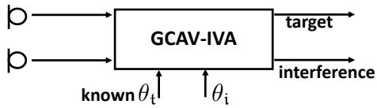
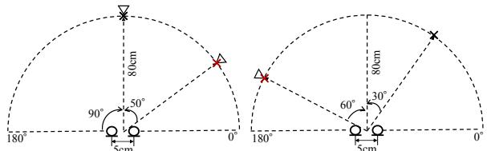
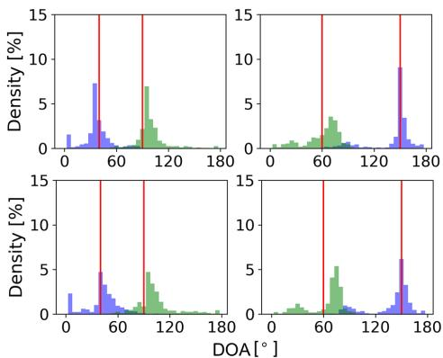

# GEOMETRICALLY CONSTRAINED INDEPENDENT VECTOR ANALYSIS FOR DIRECTIONAL SPEECH ENHANCEMENT

Li Li1, Kazuhito Koishida2

1 University of Tsukuba, Japan 2 Microsoft Corporation, USA

## ABSTRACT

This paper addresses the multichannel directional speech enhancement problem with geometrically constrained independent vector analysis (GCIVA), where we aim to combine the high separation performance from blind source separation and the capability of directional focus from beamforming. The proposed method exploits geometric constraints composed from the spatial information of sources to guide the target speech to the desired output channel. A convergenceguaranteed parameter estimation algorithm is derived from the framework of auxiliary function-based IVA (AuxIVA) to take advantage of fast convergence, low computational cost, and no step-size tuning. We propose a dual-microphone speech enhancement system based on the proposed method and investigate its effectiveness with objective metrics. The experimental evaluations revealed that the proposed system outperformed the conventional beamforming and the standard AuxIVA in a large margin in terms of source-to-distortion and source-to-interference ratios.

Index Terms— Speech enhancement, independent vector analysis, geometric constraints, multichannel, auxiliary function approach

## 1. INTRODUCTION

Speech enhancement is a crucial technology for extracting the target speech from recorded noisy signals since the presence of diffuse noise and directional interference can significantly degrade the performances of many speech processing applications. Various speech enhancement algorithms [1] have been developed with the goal of overcoming this problem.

Blind source separation (BSS) is one promising approach, which copes with multichannel scenarios. BSS algorithms, including a variety of independent component analysis (ICA) methods [2, 3, 4, 5], estimate source signals using only the observed signals based on the assumption that source signals are statistically independent with each other. Independent vector analysis (IVA) [3, 4] is one such method, which models the whole frequency components as a multivariate variable following a spherical multivariate distribution so that permutation ambiguity can be avoided by exploiting higher-order dependencies of signals. Owing to the high separation performance, IVA has attracted much attention and been widely studied, which promotes the practicability of the approach in various scenarios. A fast and stable algorithm based on the auxiliary function approach, referred to as AuxIVA [6], has been recently developed and experimentally demonstrated to perform well in both offline and online cases with low computational costs [7, 8, 9, 10]. However, when considering a practical application of speech enhancement, an additional process is necessary for selecting the target speech after the separation, which is typically performed by utilizing the spatial information, i.e., the direction of arrival (DOA) of the target. Moreover, it is reported that block permutation problem [11] occurs between the low- and high-frequency bands in IVA, which results in the degradation of the performance.

To improve the performance of BSS algorithms and avoid the permutation problem, exploiting spatial information to guide the demixing matrices is one promising method. [12] derives IVA in a maximum a posteriori (MAP) fashion so that a spatially informed prior of demixing matrices can be incorporated into the optimization. Another well-known framework is the geometrically constrained BSS [13, 14, 15, 16]. In this framework, beamforming-based geometric constraints derived from prior spatial information of source signals and the sensor geometry are combined with the optimization problem of BSS, which makes it possible to manually control the spatial and frequency responses of the demixing filter estimated by BSS. In [17], a penalty term restricting the Euclidean angle between the separation filter and the far-field steering vector calculated from the desired source DOA is combined with IVA to force the desired signal always being outputted at the corresponding channel, which has been shown to improve the performance of IVA in directional speech enhancement. However, there are two drawbacks to prevent this method from a wide adoption to real applications. Firstly, a relatively large number of microphones are needed to meet the constraints of forming a sharp beam and suppressing interferences at the same time. Secondly, the step-size parameter of the gradient-based algorithm must be carefully tuned to make the system work under different real use cases.

In this paper, we propose an approach of geometrically constrained IVA (GCIVA), which combines linear constraints that restrict far-field responses of demixing filters [13] with IVA. To preserve the advantages of fast convergence and no step-size tuning from AuxIVA, we derive a convergenceguaranteed algorithm based on the auxiliary function approach with adopting the idea of vectorwise coordinate descent (VCD) [18] to obtain the closed-form solution. The proposed method is called “GCAV (Geometrically Constrained Auxiliary-function with VCD)-IVA”. We introduce a dualmicrophone system based on the proposed method. In the system, the interference channel is constrained in such a way that a null is formed toward the target direction which is assumed known. Regarding the constraint on the target channel, it is found that a null constraint toward the estimated interference DOA is the best option, where the standard Aux-IVA is used for this DOA estimation purpose. Experimental results show that the proposed GCAV-IVA system can offer higher performance than the conventional beamforming and the standard AuxIVA in the dual-microphone setting.

## 2. FORMULATION OF GEOMETRICALLY CONSTRAINED IVA

Let us consider a determined situation where I sources are observed by I microphones. Let $x _ { i } ( \omega , t )$ and $y _ { j } ( \omega , t )$ denote the short-time Fourier transform (STFT) coefficients of the signal observed at the i-th microphone and the j-th estimated sources, respectively. Here ω and t are the frequency and time indices, respectively. We denote the frequency-wise vector representation of the observations and the estimated sources by

$$
\boldsymbol {x} (\omega , t) = [ x _ {1} (\omega , t), \dots , x _ {I} (\omega , t) ] ^ {\mathsf {T}} \in \mathbb {C} ^ {I},\tag{1}
$$

$$
\pmb {y} (\omega , t) = [ y _ {1} (\omega , t), \dots , y _ {J} (\omega , t) ] ^ {\mathsf {T}} \in \mathbb {C} ^ {J},\tag{2}
$$

where $\textit { J } = \textit { I }$ and $( \cdot ) ^ { \intercal }$ denotes the transpose. When the STFT window length is sufficiently longer than the impulse responses between sources and microphones, the relationship between the observations and the estimated sources can be expressed with the time-invariant instantaneous mixture model as:

$$
\boldsymbol {y} (\omega , t) = \boldsymbol {W} (\omega) \boldsymbol {x} (\omega , t),\tag{3}
$$

where $W ( \omega ) = [ \pmb { w } _ { 1 } ( \omega ) , \dots , \pmb { w } _ { I } ( \omega ) ] ^ { \sf H }$ is an $I \times I$ demixing matrix and $( \cdot ) ^ { \sf H }$ denotes Hermitian transpose.

IVA assumes that sources follow a multivariate distribution and thus dependencies over frequency components can be exploited to avoid the permutation problem. The demixing matrices $\mathcal { W } = \{ { \pmb { W } } ( \omega ) \} _ { \omega } ^ { \pmb { \imath } }$ are estimated by minimizing the following objective function

$$
J _ {\mathrm{IVA}} (\mathcal {W}) = \sum_ {j = 1} ^ {J} \mathbb {E} [ G (\boldsymbol {y} _ {j} (t)) ] - \sum_ {\omega = 1} ^ {\Omega} \log | \det \boldsymbol {W} (\omega) |,\tag{4}
$$

where Ω denotes the number of frequency bins. $\mathbb { E } [ \cdot ]$ denotes the expectation operator and ${ \mathbf { } } y _ { j } ( t )$ is the source-wise vector representation defined as

$$
\boldsymbol {y} _ {j} (t) = \left[ y _ {j} (1, t), \dots , y _ {j} (\Omega , t) \right] ^ {\mathsf {T}} \in \mathbb {C} ^ {\Omega}.\tag{5}
$$

Here, $G ( \pmb { y } _ { i } ( t ) )$ is the contrast function having a relationship of $G ( \pmb { y } _ { j } ( t ) ) = - \log p ( \pmb { y } _ { j } ( t ) )$ , where $p ( \pmb { y } _ { j } ( t ) )$ represents a multivariate probability density function of the j-th source. One typical choice of the contrast function is using spherical multivariate distribution [3, 4, 6], which is expressed as

$$
G (\boldsymbol {y} _ {j} (t)) = G _ {R} (r _ {j} (t)),\tag{6}
$$

$$
r _ {j} (t) = | | \boldsymbol {y} _ {j} (t) | | _ {2} = \sqrt {\sum_ {\omega} | y _ {j} (\omega , t) | ^ {2}}.\tag{7}
$$

Here, $| | \cdot | | _ { 2 }$ denotes $L _ { 2 }$ norm of a vector.

Now, let us consider a geometric constraint [13] that restricts the far-field response of the j-th demixing filter estimated by IVA at the direction θ, which is described as

$$
\mathcal {J} _ {c} (\mathcal {W}) = \sum_ {j = 1} ^ {J} \lambda_ {j} \sum_ {\omega = 1} ^ {\Omega} | \boldsymbol {w} _ {j} ^ {\mathsf {H}} (\omega) \boldsymbol {d} _ {j} (\omega , \theta) - c _ {j} | ^ {2}.\tag{8}
$$

Here, $d _ { j } ( \omega , \theta )$ is the steering vector pointing to the direction θ, $c _ { j }$ is the nonnegative-valued constraint, and $\lambda _ { j } \ \geq \ 0$ is a parameter weighing the importance of the constraint. This concept is used in the linearly constrained minimum variance (LCMV) beamformer [19]. Note that (8) with $c _ { j } = 1$ forces the spatial filter to form a conventional delay-and-sum beamformer steering at the direction θ to preserve the target source while a small value of $c _ { j }$ essentially creates a spatial null towards the target direction θ aiming at suppressing the target source and preserving all other sources. The null constraint on the target direction can also serve as a blocking matrix (BM) [20], so that the corresponding channel can produce good estimate of interference and noise. Such estimate would have potential benefit of better handling under/overdetermined cases compared to traditional BSS methods. The objective function of the proposed GCIVA is summarized as

$$
J (\mathcal {W}) = J _ {\mathrm{IVA}} (\mathcal {W}) + J _ {c} (\mathcal {W}).\tag{9}
$$

## 3. INFERENCE ALGORITHM WITHAUXILIARY FUNCTION APPROACH

In this section, we derive an iterative algorithm for parameter estimation of (9) with the auxiliary function approach [21], which has already been employed in IVA and yielded the fast convergence and stable performance. In the approach, an auxiliary function $J ^ { + } ( \mathcal { W } , \bar { \mathcal { V } } )$ is designed in such a way that $J ( \mathcal { W } ) = \mathrm { m i n } _ { \mathcal { V } } J ^ { + } ( \mathcal { W } , \mathcal { V } )$ is satisfied. Then, instead of directly optimizing the original objective function (9), which is difficult to be analytically solved, the auxiliary function $J ^ { + } ( \mathcal { W } , \mathcal { V } )$ is minimized in terms of W and V alternatingly. Since the geometric constraints are linear, we can simply obtain the auxiliary function that upper-bounds (9) by combining the original AuxIVA’s auxiliary function [6] with these linear constraints:

$$
\begin{array}{c} J ^ {+} (\mathcal {W}, \mathcal {V}) \stackrel {{c}} {{=}} \sum_ {j = 1} ^ {J} \sum_ {\omega = 1} ^ {\Omega} \Big \{\frac {1}{2} \sum_ {j} \boldsymbol {w} _ {j} ^ {\mathsf {H}} (\omega) \boldsymbol {V} _ {j} (\omega) \boldsymbol {w} _ {j} (\omega) \\ - \log | \det \boldsymbol {W} (\omega) | \Big \} + J _ {c} (\mathcal {W}), \end{array}\tag{10}
$$

where $V _ { j } ( \omega )$ is the weighted covariances expressed as

$$
\boldsymbol {V} _ {j} (\omega) = \mathbb {E} \left[ \frac {G _ {R} ^ {\prime} (r _ {j} (t))}{r _ {j} (t)} \boldsymbol {x} (\omega) \boldsymbol {x} ^ {\mathsf {H}} (\omega) \right]\tag{11}
$$

and $= ^ { c }$ denotes equality up to constant terms. Here, $( \cdot ) ^ { \prime }$ denotes the derivative operator.

The update rule for V is obtained straightforwardly by applying (7) into (11). Here we focus on deriving the update rule for W. The indices of ω and θ are omitted hereafter for the notation simplicity. Due to the linear constraint terms, the equation $\partial J ^ { + } ( \dot { \mathcal { W } } , \mathcal { V } ) \dot { / } \partial \pmb { w } _ { i } ^ { * } = 0$ cannot be solved as Hybrid Exact-Approximate Joint Diagonalization (HEAD) problem anymore, where $( \cdot ) ^ { * }$ denotes the complex conjugate. To obtain the optimal ${ \pmb w } _ { j }$ of (10) with fixed V, inspired by the vectorwise coordinate descent (VCD) method [18], we embrace the idea of arranging the term log | det W| by using the property of cofactor expansion

$$
\boldsymbol {B} = \left[ \boldsymbol {b} _ {1}, \dots , \boldsymbol {b} _ {J} \right] \stackrel {\text { def }} {=} (\det \boldsymbol {W}) \boldsymbol {W} ^ {- 1},\tag{12}
$$

where $b _ { j }$ is the j-th column of the adjugate matrix of $W$ de-

fined as

$$
\pmb {B} _ {p q} = (- 1) ^ {p + q} \tilde {\pmb {W}} _ {q p}.\tag{13}
$$

Here, the index pq denotes the $( p , q )$ entry of B and ${ \tilde { W } } _ { q p }$ is the $( q , p )$ minor determinant of W. We can then obtain det $W = w _ { i } ^ { \mathsf { H } } b _ { j }$ . The partial derivative of (10) w.r.t. $\boldsymbol { w } _ { j } ^ { * }$ is calculated as

$$
\frac {\partial J ^ {+} (\mathcal {W} , \mathcal {V})}{\partial \boldsymbol {w} _ {j} ^ {*}} = \boldsymbol {D} _ {j} \boldsymbol {w} _ {j} - \frac {\boldsymbol {b} _ {j}}{\boldsymbol {w} _ {j} ^ {\mathrm{H}} \boldsymbol {b} _ {j}} - \lambda_ {j} c _ {j} \boldsymbol {d} _ {j},\tag{14}
$$

where $D _ { j } = V _ { j } + \lambda _ { j } d _ { j } d _ { i } ^ { \sf H }$ . Note that (14) has the same form with the equation (13) in [18], whose closed-form solution can be derived in the same procedure introduced in [18]. We omit the derivation here due to the space limitation. The update rules of ${ \pmb w } _ { j }$ are summarized as follow:

$$
\boldsymbol {u} _ {j} = \boldsymbol {D} _ {j} ^ {- 1} \boldsymbol {W} ^ {- 1} \boldsymbol {e} _ {j},\tag{15}
$$

$$
\hat {\boldsymbol {u}} _ {j} = \lambda_ {j} c _ {j} \boldsymbol {D} _ {j} ^ {- 1} \boldsymbol {d} _ {j},\tag{16}
$$

$$
h _ {j} = \pmb {u} _ {j} ^ {\mathsf {H}} \pmb {D} _ {j} \pmb {u} _ {j},\tag{17}
$$

$$
\hat {h} _ {j} = \boldsymbol {u} _ {j} ^ {\mathsf {H}} \boldsymbol {D} _ {j} \hat {\boldsymbol {u}} _ {j},\tag{18}
$$

$$
\boldsymbol {w} _ {j} = \left\{ \begin{array}{l} \frac {1}{\sqrt {h _ {j}}} \boldsymbol {u} _ {j} + \hat {\boldsymbol {u}} _ {j} (\text {   if   } \hat {h} _ {j} = 0), \\ \frac {\dot {h} _ {j}}{2 h _ {j}} \Big [ - 1 + \sqrt {1 + \frac {4 h _ {j}}{| \hat {h} _ {j} | ^ {2}}} \Big ] \boldsymbol {u} _ {j} + \hat {\boldsymbol {u}} _ {j} (\text {   o.w.   }). \end{array} \right.\tag{19}
$$

Here, $e _ { j }$ is the j-th column of the $I \times I$ identity matrix. These update rules are equivalent to those employed in Aux-IVA when $\lambda _ { j } = 0$ . It is noteworthy that the algorithm takes benefits of the auxiliary function approach, namely, no stepsize tuning and fast convergence. Moreover, the algorithm having similar updating procedures with AuxIVA allows us to adopt autoregressive estimation [9] to develop online systems, which is indispensable in real-time and low-latency applications. In the following sections, we adopt the proposed GCAV-IVA method to a dual-microphone system and evaluate the effectiveness via simulation.

## 4. SYSTEM FOR A DUAL-MICROPHONE CASE

To develop a dual-mirophone system, we take the following conditions into consideration:

• The correct DOA of the target speaker $\theta _ { \mathrm { { t } } }$ is known;

• Null constraints are employed, i.e. $c _ { j } ~ = ~ 0$ or close to zero. It is a practical choice since only two microphones are available.

Fig. 1 shows an overview of the proposed system. Under the conditions above, we always apply a null constraint to the interference channel, where the null is formed toward the target speaker direction. For the target channel, we evaluate three options in the next section.

1. No constraint.

2. Null constraint at the interference direction from the oracle in 2-speaker case or at a dummy interference direction in 1-speaker case. This option is only for reference purpose.

3. Null constraint at the interference direction estimated by a separate AuxIVA system.

  
Fig. 1. Basic system structure.

The motivation of third option is that, as demonstrated in Section 5, we find that the constraining both channels can lead to a higher enhancement performance. In this option, the interference DOA is obtained from a separate AuxIVA system. Since a BSS system can be interpreted as a set of adaptive null-beamformers [22], the directional nulls, which can be identified from the directivity patterns, usually point out the directions where the sources come from [14, 23, 24]. In the system, the DOA of the j-ch output sources is given as

$$
\hat {\theta} _ {j} = \underset {\theta} {\operatorname{argmin}} \sum_ {\omega = 1} ^ {\Omega / 2} | \boldsymbol {w} _ {j} ^ {\mathsf {H}} (\omega) \boldsymbol {d} (\omega , \theta) |.\tag{20}
$$

The interference DOA $\widehat { \theta } _ { \mathrm { i } }$ can then be obtained by selecting the one far away from the target DOA $\theta _ { \mathrm { { t } } }$ :

$$
\hat {\theta} _ {i} = \underset {\hat {\theta} _ {j}} {\operatorname{argmax}} \left[ | \hat {\theta} _ {j} - \theta_ {t} | \right], j = 1, 2\tag{21}
$$

## 5. EXPERIMENTAL EVALUATIONS

## 5.1. Data and settings

To evaluate the effectiveness of the proposed GCAV-IVA method and the dual-microphone system, we conducted speech enhancement experiments in two situations: 2-speaker case where both target and interference speaker exist and 1- speaker case where only the target speaker exists.

We used speech samples of 4 speakers (2 females and 2 males) excerpted from Voice Conversion Challenge 2018 (VCC2018) database [25], which included 81 sentences for each speaker. The audio files were about 3-7 seconds long. The mixture signals were created by simulating two-channel recordings of two sources where the room impulse responses (RIRs) were synthesized using the image method [26]. Fig. 2 shows the positions of the sources and microphones. The interval of microphones was set at 5 cm. 2 DOA settings were investigated in the 2-speaker case, and 3 settings were investigated in the 1-speaker case. We tested two different reverberant conditions where the reverberation time $( R T _ { 6 0 } )$ was about 200 ms and 470 ms, which were controlled by setting the reflection coefficient of the walls at 0.4 and 0.8. To simulate the more realistic acoustic environment, 4 types of diffuse noise excerpted from DEMAND database [27], including park, office, cafeteria, and metro, were added to reverberant speech signals. We generated 1920 and 960 test samples for the 2-speaker and 1-speaker cases with various target-tointerference energy ratios and speech-to-noise energy ratios. The signal-to-noise ratios (SNRs) of the test samples in the 2-speaker case and 1-speaker case were between [-2, 6] dB and [0, 6] dB, respectively.

All the speech signals were sampled at 16 kHz. The STFT was computed using a Hanning window whose length was set at 32 ms, and the window shift was 16 ms. We compared the minimum power distortionless response (MPDR) beamformer [28] calculated with the far-field steering vectors, the AuxIVA using $G _ { R } ( r _ { j } ( t ) ) = r _ { j } ( t )$ , and the GCAV-IVA method with various constraints. The specific settings of the tested systems are summarized in Table 1. Source-todistortion ratios (SDR), source-to-interferences ratios (SIR) and sources-to-artifacts ratios (SAR) [29] were computed to evaluate the enhancement performance. For MPDR and GCAV-IVA, we evaluated the output from the target channel, whereas for AuxIVA, we evaluated outputs from all the channels and took the best score as the result.

  
Fig. 2. Configurations of sources and microphones, where $" \times "$ and $^ { 6 6 } \triangle ^ { , 9 }$ denote source positions used for 2-speaker and 1-speaker case, respectively. Red $^ { 6 6 } \times \vec { } ^ { , 9 }$ denotes the target.

Table 1. Summary of tested GCAV-IVA systems.

<table><tr><td>System #</td><td> $\theta_i$ </td><td> $c_0$ </td><td> $c_1$ </td><td> $\lambda_0$ </td><td> $\lambda_1$ </td></tr><tr><td>(1)</td><td>No constraint</td><td colspan="4">—</td></tr><tr><td>(2)</td><td rowspan="2">Known</td><td>0</td><td>0</td><td rowspan="4">2</td><td rowspan="4">10</td></tr><tr><td>(3)</td><td>0.5</td><td>0.2</td></tr><tr><td>(4)</td><td rowspan="2">Estimated by AuxIVA</td><td>0</td><td>0</td></tr><tr><td>(5)</td><td>0.5</td><td>0.2</td></tr></table>

  
Fig. 3. DOA estimation results achieved by performing Aux-IVA update for 3 times under reverberant conditions where $R T _ { 6 0 } = 2 0 0$ ms (upper) and $R T _ { 6 0 } = 4 7 0$ ms (bottom). Red lines show true DOAs. Blue and green graphs are estimated DOA histograms for two directions.

## 5.2. DOA estimation results

First we investigated the potential of the standard AuxIVA as a DOA estimator. The AuxIVA had 3 update iterations and the DOA range was set at [0◦, 180◦] with an interval of $5 ^ { \circ }$ Fig. 3 shows the estimation results in a histogram format, which were calculated from the 2-speaker dataset. It is revealed that more than 60% of the estimated directions is located in the range of ±20◦ against the true DOA. In the next subsection, we will demonstrate the benefit of the DOA estimation in speech enhancement experiments.

Table 2. SDR, SIR, and SAR [dB] of 2-speaker case.

<table><tr><td rowspan="2">Method</td><td colspan="3"> $RT_{60}$ =200 ms</td><td colspan="3"> $RT_{60}$ =470 ms</td></tr><tr><td>SDR</td><td>SIR</td><td>SAR</td><td>SDR</td><td>SIR</td><td>SAR</td></tr><tr><td>unproc</td><td>1.46</td><td>1.61</td><td>23.02</td><td>0.78</td><td>1.47</td><td>12.11</td></tr><tr><td>MPDR</td><td>3.82</td><td>4.89</td><td>12.30</td><td>3.55</td><td>5.33</td><td>9.95</td></tr><tr><td>AuxIVA</td><td>7.12</td><td>8.98</td><td>14.05</td><td>4.96</td><td>7.42</td><td>10.51</td></tr><tr><td>GCAV-IVA(1)</td><td>8.42</td><td>11.19</td><td>13.33</td><td>6.47</td><td>10.33</td><td>9.86</td></tr><tr><td>GCAV-IVA(2)</td><td>8.71</td><td>11.50</td><td>13.53</td><td>6.51</td><td>10.34</td><td>9.89</td></tr><tr><td>GCAV-IVA(3)</td><td>8.75</td><td>11.62</td><td>13.49</td><td>6.55</td><td>10.50</td><td>9.84</td></tr><tr><td>GCAV-IVA(4)</td><td>8.72</td><td>11.52</td><td>13.52</td><td>6.53</td><td>10.36</td><td>9.93</td></tr><tr><td>GCAV-IVA(5)</td><td>8.80</td><td>11.69</td><td>13.51</td><td>6.57</td><td>10.50</td><td>9.88</td></tr></table>

Table 3. SDR, SIR, and SAR [dB] of 1-speaker case.

<table><tr><td rowspan="2">Method</td><td colspan="3"> $RT_{60}$ =200 ms</td><td colspan="3"> $RT_{60}$ =470 ms</td></tr><tr><td>SDR</td><td>SIR</td><td>SAR</td><td>SDR</td><td>SIR</td><td>SAR</td></tr><tr><td>unproc</td><td>3.03</td><td>3.37</td><td>21.61</td><td>2.14</td><td>3.06</td><td>12.48</td></tr><tr><td>MPDR</td><td>1.29</td><td>2.79</td><td>9.50</td><td>2.14</td><td>4.03</td><td>8.98</td></tr><tr><td>AuxIVA</td><td>6.04</td><td>8.00</td><td>13.12</td><td>4.07</td><td>6.65</td><td>10.04</td></tr><tr><td>GCAV-IVA(1)</td><td>7.00</td><td>10.20</td><td>11.73</td><td>5.47</td><td>10.20</td><td>8.76</td></tr><tr><td>GCAV-IVA(2)</td><td>7.37</td><td>10.33</td><td>12.23</td><td>5.60</td><td>10.30</td><td>8.90</td></tr><tr><td>GCAV-IVA(3)</td><td>7.32</td><td>10.40</td><td>12.20</td><td>5.55</td><td>10.36</td><td>8.75</td></tr><tr><td>GCAV-IVA(4)</td><td>7.39</td><td>10.27</td><td>12.37</td><td>5.71</td><td>10.41</td><td>9.03</td></tr><tr><td>GCAV-IVA(5)</td><td>7.43</td><td>10.41</td><td>12.31</td><td>5.73</td><td>10.56</td><td>8.93</td></tr></table>

## 5.3. Speech enhancement results

Table 2 and Table 3 summarize the speech enhancement results. The proposed GCAV-IVA method exceeded the conventional MPDR in terms of all criteria and achieved higher scores than AuxIVA in terms of SDRs and SIRs, which confirmed the advantage of the geometric constraints. Comparing the results achieved by system (1) with other systems, we found that constraining two channels led to higher enhancement performances, even in the situation where any interference speaker doesn’t exist, i.e., 1-speaker case. The results also indicate that carefully tuned $c _ { j }$ was able to produce slightly higher SDR and SIR scores. Interestingly, the system exploiting interference DOA estimation outperformed the one using true DOAs. One possible reason is that, since the DOA estimate coming from the AuxIVA points out the direction including the most statistically independent components, suppressing that direction can result in a higher SIR.

## 6. CONCLUSIONS

In this paper, we proposed a geometrically constrained BSS method called GCAV-IVA, which combines IVA with a set of linear constraints restricting the far-field response of the demixing filter. We derived a convergence-guaranteed algorithm with the auxiliary function approach and showed the update rules of the parameter estimation by exploiting the idea introduced in the VCD method. A dual-microphone system, including GCAV-IVA for speech enhancement and AuxIVA for DOA estimation, was introduced and experimentally investigated. The experimental results confirmed that the proposed method outperformed the conventional MPDR beamformer and AuxIVA.

## 7. REFERENCES

[1] P. C. Loizou, “Speech enhancement: Theory and practice,” CRC press, 2013.

[2] P. Smaragdis, “Blind separation of convolved mixtures in the frequency domain,” Neurocomputing, vol. 22, no. 1–3, pp. 21–34, 1998.

[3] T. Kim, T. Eltoft, and T.-W. Lee, “Independent vector analysis: An extension of ICA to multivariate components,” in Proc. ICA, pp. 165–172, 2006.

[4] A. Hiroe, “Solution of permutation problem in frequency domain ICA using multivariate probability density functions,” in Proc. ICA, pp. 601–608, 2006.

[5] D. Kitamura, N. Ono, H. Sawada, H. Kameoka, and H. Saruwatari, “Determined blind source separation with independent low-rank matrix analysis,” in Audio Source Separation, pp. 125–155, 2018.

[6] N. Ono, “Stable and fast update rules for independent vector analysis based on auxiliary function technique,” in Proc. WASPAA, pp. 189–192, 2011.

[7] N. Ono, “Fast stereo independent vector analysis and its implementation on mobile phone,” in Proc. IWAENC, pp. 1–4, 2012.

[8] N. Ono, “Blind source separation on iphone in real environment,” in Proc. EUSIPCO, pp. 1–5, 2013.

[9] T. Taniguchi, N. Ono, A. Kawamura, and S. Sagayama, “An auxiliary-function approach to online independent vector analysis for real-time blind source separation,” in Proc. HSCMA, pp. 107–111, 2014.

[10] M. Sunohara, C. Haruta, and N. Ono, “Low-latency realtime blind source separation for hearing aids based on time-domain implementation of online independent vector analysis with truncation of noncausal components,” in Proc. ICASSP, pp. 216–220, 2017.

[11] Y. Liang, SM Naqvi, and J Chambers, “Overcoming block permutation problem in frequency domain blind source separation when using AuxIVA algorithm,” Electronics letters, vol. 48, no. 8, pp. 460–462, 2012.

[12] A. Brendel, T. Haubner, and W. Kellermann, “Spatially informed independent vector analysis,” eprint arXiv:1907.09972, 2019.

[13] L. C Parra and C. V Alvino, “Geometric source separation: Merging convolutive source separation with geometric beamforming,” IEEE Trans. SAP, vol. 10, no. 6, pp. 352–362, 2002.

[14] H. Saruwatari, T. Kawamura, T. Nishikawa, A. Lee, and K. Shikano, “Blind source separation based on a fastconvergence algorithm combining ICA and beamforming,” IEEE Trans. ASLP, vol. 14, no. 2, pp. 666–678, 2006.

[15] M. Knaak, S. Araki, and S. Makino, “Geometrically constrained independent component analysis,” IEEE Trans. ASLP, vol. 15, no. 2, pp. 715–726, 2007.

[16] Y. Zheng, K. Reindl, and W. Kellermann, “Analysis of dual-channel ICA-based blocking matrix for improved

noise estimation,” EURASIP journal on Advances in Signal Processing, vol. 2014, no. 1, pp. 26, 2014.

[17] A. H Khan, M. Taseska, and E. AP Habets, “A geometrically constrained independent vector analysis algorithm for online source extraction,” in Proc. LVA/ICA, pp. 396–403, 2015.

[18] Y. Mitsui, N. Takamune, D. Kitamura, H. Saruwatari, Y. Takahashi, and K. Kondo, “Vectorwise coordinate descent algorithm for spatially regularized independent low-rank matrix analysis,” in Proc. ICASSP, pp. 746– 750, 2018.

[19] J. Bourgeois and W. Minker, Eds., “Linearly constrained minimum variance beamforming,” pp. 27–38, 2009.

[20] S. Gannot, E. Vincent, S. Markovich-Golan, and A. Ozerov, “A consolidated perspective on multimicrophone speech enhancement and source separation,” IEEE/ACM Trans. ASLP, vol. 25, no. 4, pp. 692–730, 2017.

[21] D. R Hunter and K. Lange, “A tutorial on MM algorithms,” The American Statistician, vol. 58, no. 1, pp. 30–37, 2004.

[22] S. Araki, S. Makino, Y. Hinamoto, R. Mukai, T. Nishikawa, and H. Saruwatari, “Equivalence between frequency-domain blind source separation and frequency-domain adaptive beamforming for convolutive mixtures,” EURASIP Journal on Applied Signal Processing, vol. 2003, pp. 1157–1166, 2003.

[23] A. Lombard, T. Rosenkranz, H. Buchner, and W. Kellermann, “Multidimensional localization of multiple sound sources using averaged directivity patterns of blind source separation systems,” in Proc. ICASSP, pp. 233– 236, 2009.

[24] Y. Zheng, A. Lombard, and W. Kellermann, “An improved combination of directional BSS and a source localizer for robust source separation in rapidly timevarying acoustic scenarios,” in Proc. HSCMA, pp. 58– 63, 2011.

[25] J. Lorenzo-Trueba, J. Yamagishi, T. Toda, D. Saito, F. Villavicencio, T. Kinnunen, and Z. Ling, “The voice conversion challenge 2018: Promoting development of parallel and nonparallel methods,” eprint arXiv:1804.04262, 2018.

[26] J, B Allen and D. A Berkley, “Image method for efficiently simulating small-room acoustics,” The Journal of the Acoustical Society of America, vol. 65, no. 4, pp. 943–950, 1979.

[27] J. Thiemann, N. Ito, and E. Vincent, “DEMAND: a collection of multi-channel recordings of acoustic noise in diverse environments,” Supported by Inria under the Associate Team Program VERSAMUS, June 2013.

[28] H. L. Van Trees, “Optimum array processing,” John Wiley & Sons, 2002

[29] E. Vincent, R. Gribonval, and C. Fevotte, “Performance´ measurement in blind audio source separation,” IEEE Trans.ASLP, vol. 14, no. 4, pp. 1462–1469, 2006.