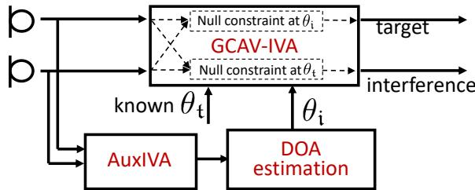
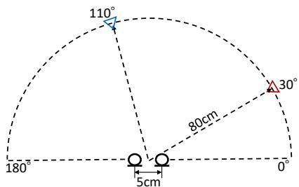
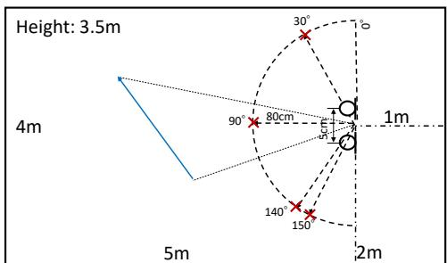
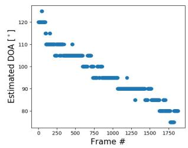
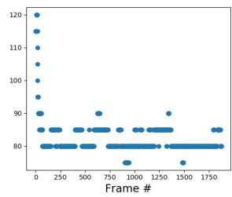

# Online directional speech enhancement using geometrically constrained independent vector analysis

Li Li1, Kazuhito Koishida2, Shoji Makino1

1University of Tsukuba

2Microsoft Corporation

{lili@mmlab.cs, maki@tara}.tsukuba.ac.jp, kazukoi@microsoft.com

## Abstract

This paper proposes an online dual-microphone system for directional speech enhancement, which employs geometrically constrained independent vector analysis (IVA) based on the auxiliary function approach and vectorwise coordinate descent. Its offline version has recently been proposed and shown to outperform the conventional auxiliary function approach-based IVA (AuxIVA) thanks to the properly designed spatial constraints. We extend the offline algorithm to online by incorporating the autoregressive approximation of an auxiliary variable. Experimental evaluations revealed that the proposed online algorithm could work in real-time and achieved superior speech enhancement performance to online AuxIVA in both situations where a fixed target was interfered by a spatially stationary or dynamic interference.

Index Terms: multichannel speech enhancement, geometric constraint, independent vector analysis (IVA), online, real-time

## 1. Introduction

With the fast spread of voice-controlled applications, speech enhancement technology for extracting the target speech from recorded noisy signals becomes more important since the presence of noise and interference can significantly degrade the performance of those speech processing applications. Especially for real-time applications, e.g., real-time speech recognition interfaces, hearing-aid devices, and teleconference systems, it is necessary to develop speech enhancement systems that not only perform well but also function in real-time.

Several techniques extended from non-real-time offline versions of independent component analysis (ICA) are such methods, which can be categorized into online and blockwise approaches [1, 2, 3]. Online approaches update the separation parameters, i.e., demixing matrices, each time a new frequency analysis frame arrives, while blockwise approaches update the parameters for every block containing multiple frames arrives. Online approaches are usually preferred in low-delay scenarios since the estimation delay increases with larger block sizes. However, the separation performance of online approaches tends to be inferior to those of blockwise approaches due to insufficient statistics [2, 3]. One promising approach to take both advantages is the online blockwise approach, which computes statistics using the arrived current frame and several past frames.

Both offline and online ICA-based approaches suffer from the permutation problem. Namely, the order of the separated signals in each frequency bin has ambiguity. Independent vector analysis (IVA) [4, 5] is one promising method that solves source separation and permutation problem simultaneously by modeling the whole frequency components as a multivariate variable following a spherical multivariate distribution. Owing to the high separation performance, IVA has attracted much attention, which promotes the study and practicability of the approach in various scenarios, including online algorithms [6, 7]. In [7], an online version of IVA based on auxiliary function approach (AuxIVA) [8] has been proposed and shown to perform stably in both spatially stationary and nonstationary conditions. Moreover, taking advantage of the auxiliary function approach [9], AuxIVA is notable in its convergence speed and no requirement of the step-size parameter, which makes it more suitable for practical applications. However, when considering speech enhancement applications, an additional process is necessary for selecting the target speech after the ICA-/IVA-based separation, which is typically performed by utilizing the spatial information, i.e., the direction of arrival (DOA) of the target [10]. Furthermore, it is reported that block permutation occasionally occurs between the low- and high-frequency bands in AuxIVA [11], which results in performance degradation. To address the drawback of AuxIVA and preserve the benefit of auxiliary function approach, we have recently proposed a geometrically constrained IVA method that uses the auxiliary function approach and vectorwise coordinate descent (VCD), which we refer to as “GCAV-IVA” [12]. GCAV-IVA exploits spatial information to guide the target channel and avoid block permutation by considering a joint optimization problem, which combines linear constraints restricting far-field responses [13] of demixing matrices with the objective function of IVA. By adopting the idea of VCD [14], a fast algorithm has been successfully derived based on the auxiliary function approach.

Towards practical applications, in this paper, we propose an online version of GCAV-IVA by approximating the auxiliary variables in the auxiliary function with an autoregressive estimation of related statistics. This extension has been adopted in online AuxIVA [7], where the derived online algorithm outperformed the blockwise algorithm, which motivates us to believe the proposed method could perform reasonably well even in an online update manner. We investigate a dual-microphone system that employs the proposed online algorithm and evaluate the speech enhancement performance of the system in the situation where a fixed target was interfered by a spatially fixed or moving interference.

## 2. Offline GCAV-IVA method

## 2.1. Problem formulation

Let us consider a determined situation where I sources are observed by I microphones. Let xi(ω, t) and $y _ { j } ( \omega , t )$ denote the short-time Fourier transform (STFT) coefficients of the signal observed at the i-th microphone and the j-th estimated sources, respectively. Here ω and t are the frequency and time indices, respectively. We denote the frequency-wise vector representation of the observations and the estimated sources by

$$
\pmb {x} (\omega , t) = [ x _ {1} (\omega , t), \ldots , x _ {I} (\omega , t) ] ^ {\mathsf {T}} \in \mathbb {C} ^ {I},
$$

$$
\pmb {y} (\omega , t) = [ y _ {1} (\omega , t), \dots , y _ {J} (\omega , t) ] ^ {\mathsf {T}} \in \mathbb {C} ^ {J},\tag{1}
$$

(2)

where $J = I$ and $( \cdot ) ^ { \intercal }$ denotes the transpose. When the STFT window length is sufficiently longer than the impulse responses between sources and microphones, the relationship between the observations and the estimated sources can be expressed with the time-invariant instantaneous mixture model as:

$$
\boldsymbol {y} (\omega , t) = \boldsymbol {W} (\omega) \boldsymbol {x} (\omega , t),\tag{3}
$$

where $W ( \omega ) = [ \pmb { w } _ { 1 } ( \omega ) , \dots , \pmb { w } _ { I } ( \omega ) ] ^ { \sf H }$ is an $I \times I$ demixing matrix and $( \cdot ) ^ { \mathsf { H } }$ denotes Hermitian transpose.

IVA assumes that sources follow a multivariate distribution and thus dependencies over frequency components can be exploited to avoid the permutation problem. The demixing matrices $W = \{ W ( \omega ) \} _ { \omega }$ are estimated by minimizing the following objective function

$$
J _ {\mathrm{IVA}} (\mathcal {W}) = \sum_ {j = 1} ^ {J} \mathbb {E} [ G (\boldsymbol {y} _ {j} (t)) ] - \sum_ {\omega = 1} ^ {\Omega} \log | \det \boldsymbol {W} (\omega) |,\tag{4}
$$

where Ω denotes the number of frequency bins. $\mathbb { E } [ \cdot ]$ denotes the expectation operator and ${ \pmb y } _ { j } ( t )$ is the source-wise vector representation defined as

$$
\boldsymbol {y} _ {j} (t) = [ y _ {j} (1, t), \dots , y _ {j} (\Omega , t) ] ^ {\mathsf {T}} \in \mathbb {C} ^ {\Omega}.\tag{5}
$$

Here, $G ( \pmb { y } _ { i } ( t ) )$ is the contrast function having a relationship of $G ( \pmb { y } _ { j } ( t ) ) \overset { \cdot } { = } - \log p ( \pmb { y } _ { j } ( t ) )$ , where $p ( \pmb { y } _ { j } ( t ) )$ ) represents a multivariate probability density function of the j-th source. One typical choice of the contrast function is using spherical multivariate distribution [4, 5, 8], which is expressed as

$$
G (\boldsymbol {y} _ {j} (t)) = G _ {R} (r _ {j} (t)),\tag{6}
$$

$$
\begin{array}{c} r _ {j} (t) = | | \boldsymbol {y} _ {j} (t) | | _ {2} = \sqrt {\sum_ {\omega} | y _ {j} (\omega , t) | ^ {2}} \\ = \sqrt {\sum_ {\omega} | \boldsymbol {w} _ {j} ^ {\mathsf {H}} (\omega) \boldsymbol {x} (\omega , t) | ^ {2}}. \end{array}\tag{7}
$$

Here, $| | \cdot | | _ { 2 }$ denotes $L _ { 2 }$ norm of a vector.

Now, let us consider a geometric constraint [13, 15] that restricts the far-field response of the j-th demixing filter estimated by IVA at the direction θ, which is described as

$$
J _ {c} (\mathcal {W}) = \sum_ {j = 1} ^ {J} \lambda_ {j} \sum_ {\omega = 1} ^ {\Omega} | \boldsymbol {w} _ {j} ^ {\mathrm{H}} (\omega) \boldsymbol {d} _ {j} (\omega , \theta) - c _ {j} | ^ {2}.\tag{8}
$$

Here, $d _ { j } ( \omega , \theta )$ is the steering vector pointing to the direction $\theta ,$ $c _ { j }$ is a nonnegative-valued constraint, and $\dot { \lambda } _ { j } \geq 0$ is a parameter weighing the importance of the constraint. This concept is used in the linearly constrained minimum variance (LCMV) beamformer [16]. Note that (8) with $c _ { j } = 1$ forces the spatial filter to form a conventional delay-and-sum beamformer steering at the direction $\theta$ to preserve the target source while a small value of $c _ { j }$ essentially creates a spatial null towards the target direction θ aiming at suppressing the target source and preserving all other sources. The null constraint on the target direction can also serve as a blocking matrix (BM) [17], so that the corresponding channel can produce good estimate of interference and noise. Such estimate would have potential benefit of better handling under/overdetermined cases compared to traditional BSS methods. The objective function of GCAV-IVA is summarized as

$$
J (\mathcal {W}) = J _ {\mathrm{IVA}} (\mathcal {W}) + J _ {c} (\mathcal {W}).\tag{9}
$$

## 2.2. Update rules of GCAV-IVA

To explore the benefits of fast convergence and no requirement of step-size parameter, the inference algorithm of GCAV-IVA is derived based on the auxiliary function approach [9]. In the approach, an auxiliary function $J ^ { + } ( \mathcal { W } , \mathcal { V } )$ is designed in such a way that $J ( \mathcal { W } ) = \mathrm { m i n } _ { \mathcal { V } } J ^ { + } ( \mathcal { W } , \mathcal { V } )$ is satisfied. Then, instead of directly optimizing the original objective function (9), which is difficult to be analytically solved, the auxiliary function $J ^ { + } ( \mathcal { W } , \mathcal { V } )$ is minimized in terms of W and V alternatingly.

Since the geometric constraints are linear, the auxiliary function that upper-bounds (9) can be easily obtained by combining the original AuxIVA’s auxiliary function [8] with the constraint terms:

$$
\begin{array}{c} J ^ {+} (\mathcal {W}, \mathcal {V}) \stackrel {{c}} {{=}} \sum_ {j = 1} ^ {J} \sum_ {\omega = 1} ^ {\Omega} \Big \{\frac {1}{2} \sum_ {j} \boldsymbol {w} _ {j} ^ {\mathsf {H}} (\omega) \boldsymbol {V} _ {j} (\omega) \boldsymbol {w} _ {j} (\omega) \\ - \log | \det \boldsymbol {W} (\omega) | \Big \} + J _ {c} (\mathcal {W}), \end{array}\tag{10}
$$

where $V _ { j } ( \omega )$ is the weighted covariances expressed as

$$
\pmb {V} _ {j} (\omega) = \mathbb {E} \Big [ \frac {G _ {R} ^ {\prime} (r _ {j} (t))}{r _ {j} (t)} \pmb {x} (\omega) \pmb {x} ^ {\mathsf {H}} (\omega) \Big ]\tag{11}
$$

and $= ^ { c }$ denotes equality up to constant terms. Here, $( \cdot ) ^ { \prime }$ denotes the derivative operator. When using source model $G _ { R } ( r _ { j } ( t ) ) =$ $r _ { j } ( t )$ , the $V _ { j } ( \omega )$ can be expressed as $\mathbb { E } [ { \pmb x } { \pmb x } ^ { \mathsf { H } } / r _ { j } ( t ) ]$

The update rule for V is obtained straightforwardly by applying (7) into (11) whereas the update rule for W is derived by embracing the idea adopted in vectorwise coordinate descent (VCD) that arranges the term log | det W| with the property of cofactor expansion [14]. With omitting the indices of $\omega$ and θ for notation simplicity, the derived update rules are summarized as follow:

$$
\boldsymbol {u} _ {j} = \boldsymbol {D} _ {j} ^ {- 1} \boldsymbol {W} ^ {- 1} \boldsymbol {e} _ {j},
$$

$$
\hat {\boldsymbol {u}} _ {j} = \lambda_ {j} c _ {j} \boldsymbol {D} _ {j} ^ {- 1} \boldsymbol {d} _ {j},\tag{12}
$$

$$
h _ {j} = \pmb {u} _ {j} ^ {\mathsf {H}} \pmb {D} _ {j} \pmb {u} _ {j},\tag{13}
$$

$$
\hat {h} _ {j} = \boldsymbol {u} _ {j} ^ {\mathsf {H}} \boldsymbol {D} _ {j} \hat {\boldsymbol {u}} _ {j},\tag{14}
$$

(15)

$$
\boldsymbol {w} _ {j} = \left\{ \begin{array}{l} \frac {1}{\sqrt {h _ {j}}} \boldsymbol {u} _ {j} + \hat {\boldsymbol {u}} _ {j} \text {(if} \hat {h} _ {j} = 0 \text {)}, \\ \frac {\hat {h} _ {j}}{2 h _ {j}} \Big [ - 1 + \sqrt {1 + \frac {4 h _ {j}}{| \hat {h} _ {j} | ^ {2}}} \Big ] \boldsymbol {u} _ {j} + \hat {\boldsymbol {u}} _ {j} \text {(o.w.)}. \end{array} \right.\tag{16}
$$

Here, $D _ { j } = V _ { j } + \lambda _ { j } d _ { j } d _ { j } ^ { \sf H }$ and $e _ { j }$ is the j-th column of the $I \times I$ identity matrix. Note these update rules are equivalent to those employed in AuxIVA when $\bar { \lambda _ { j } } = 0$

## 3. Proposed online algorithm and dual-microphone system

## 3.1. Online GCAV-IVA

In the offline GCAV-IVA, only (11) requires all the observed samples over time $t = 1 , \dots , { \dot { T } }$ so this equation is the point of formulation for the online algorithm. We can modify the update rule of $V _ { j }$ to online blockwise version as

$$
\boldsymbol {V} _ {j} (\omega , t) = \frac {1}{L} \sum_ {\tau = t - L + 1} ^ {t} \Big [ \frac {G _ {R} ^ {\prime} (r _ {j} (t))}{r _ {j} (t)} \boldsymbol {x} (\omega , t) \boldsymbol {x} ^ {\mathsf {H}} (\omega , t) \Big ],\tag{17}
$$

where $V _ { j } ( \omega , t )$ denotes the calculated $V _ { j } ( \omega )$ at time $t , \ L$ denotes the block size, and $r _ { j } ( t )$ is calculated by (7) with ${ \pmb w } _ { j } ( \omega ) ~ = ~ { \pmb w } _ { j } ( \omega , t )$ . If we directly employ (17) to obtain sufficient statistics $V _ { j } ( \omega , t )$ , the past observation with relatively large L needs to be retained and the summation must be calculated at every new frame arrives, which is highly costconsuming. On the other hand, if we set a small value to $L$ for reducing the complexity, the insufficient statistics may lead to severe performance degradation.

  
Figure 1: Structure of proposed system with DOA estimation (system (c)).

To reduce computational cost and properly compute the statistics, we propose applying autoregressive calculation of $V _ { j } ( \omega , t ) \left[ 7 \right]$ that uses the previously calculated $V _ { j } ( \omega , t - L )$ as follows:

$$
\begin{array}{l} \boldsymbol {V} _ {j} (\omega , t) = \alpha \boldsymbol {V} _ {j} (\omega , t - L) + \\ (1 - \alpha) \frac {1}{L} \sum_ {\tau = t - L + 1} ^ {t} \left[ \frac {G _ {R} ^ {\prime} (r _ {j} (t))}{r _ {j} (t)} \boldsymbol {x} (\omega , t) \boldsymbol {x} ^ {\mathsf {H}} (\omega , t) \right]. \end{array}\tag{18}
$$

Here, $0 \leq \alpha < 1$ is a forgetting factor, which controls how much statistics of past signals is considered. Sufficient statistics can then be computed with a small value of L. Note (18) reduces to (17) when $\alpha = 0 .$ . Since a longer interval of past samples is considered through the recursion, it is expected that this approximation can improve separation performance in the fixed source situation with a large α. In contrast, separation performance in moving source situation is expected to improve with a small $\alpha ,$ where any change in source positions can be reflected quickly via the blockwise term.

## 3.2. Dual-microphone system

In this paper, we develop a dual-microphone system to investigate the proposed online algorithm, which takes accounts of following conditions:

• DOA of the target speaker $\theta _ { \mathrm { t } }$ is known;

• DOA of the interference speaker $\theta _ { \mathrm { i } }$ is (a) unknown where no constraint is adopted to the target channel; (b) known or (c) to be estimated, which are corresponding to the three systems, respectively.

• Null constraints are employed, i.e. $c _ { j } = 0$ or close to zero. It is a practical choice since only two microphones are available.

To obtain interference DOAs in the system (c), we employ a separate online AuxIVA system. Since a BSS system can be interpreted as a set of adaptive null-beamformers [18], the directional nulls, which can be identified from the directivity patterns, usually point out the directions where the sources come from [19, 20]. In the system, the DOA of the j-ch output sources is given as

$$
\hat {\theta} _ {j} = \underset {\theta} {\mathrm{argmin}} \sum_ {\omega = 1} ^ {\Omega / 2} | \pmb {w} _ {j} ^ {\mathsf {H}} (\omega) \pmb {d} (\omega , \theta) |.\tag{19}
$$

The interference DOA $\widehat { \theta } _ { \mathrm { i } }$ can then be obtained by selecting the one far away from the target DOA $\theta _ { \mathrm { t } }$ :

$$
\hat {\theta} _ {i} = \underset {\hat {\theta} _ {j}} {\operatorname{argmax}} \left[ | \hat {\theta} _ {j} - \theta_ {t} | \right], j = 1, 2\tag{20}
$$

An overview of the proposed system with estimating the interference DOA is shown in Fig. 1.

## 4. Experimental evaluations

## 4.1. Data and settings

To evaluate the effectiveness of the proposed online GCAV-IVA method in the dual-microphone system, we conducted speech enhancement experiments in two situations: 2 spatially fixed sources and 1 fixed target source with 1 moving interference source.

We used speech samples of 4 speakers (2 females and $2$ males) excerpted from Voice Conversion Challenge 2018 (VCC2018) database [21], which included 81 sentences for each speaker. The audio files were about 3-7 seconds long. Clean signals for the simulation were generated by concatenating utterances spoken by a single speaker in random order, whose length was about 30 seconds long. For 2 spatially fixed sources, the mixture signals were created by simulating twochannel recordings of two sources where the room impulse responses (RIRs) were synthesized using the image method [22]. Fig. 2 shows the positions of microphones and a pair of sources. The interval of microphones was set at 5 cm. We tested 5 pairs of DOA settings involving (30◦, 110◦), (70◦, 100◦), (150◦, 60◦), (40◦, 90◦), (90◦, 150◦), where the former and latter angles are target and interference positions, respectively. For the spatially nonstationary situation, we first generated reverberant signals of moving interference sources using “signal genera-$\mathrm { t o r } ^ { \circ , \mathrm { ~ l ~ } }$ . Then we mixed the generated signals with the reverberant target signals. 4 positions of the target signal were tested, namely, $3 0 ^ { \circ } , 9 0 ^ { \circ }$ , 140◦, and 150◦. More configuration details are available in Fig. 3. We tested two different reverberant conditions. To meet the instantaneous mixing model assumption, the reverberation times $( R T _ { 6 0 } )$ were set at 78 ms and 200 ms, which were controlled by setting the reflection coefficient of the walls at 0.2 and 0.4, respectively. To simulate the realistic background noise, 4 types of diffuse noise excerpted from DEMAND database [23], including park, office, cafeteria, and metro, were also added to reverberant speech signals to generate “noisy” datasets. We refer to the dataset without/with diffuse noise as “S+I” and “S+I+N”, respectively. The energy ratio of target-to-interference was set at 0 dB and the input signal-todistortion ratio (SDR) [24] of noisy speech was about [-3, 0] dB.

All the speech signals were sampled at 16 kHz. The STFT was computed using a Hanning window whose length was set at 32 ms, and the window shift was 16 ms. We compared the proposed online GCAV-IVA (oGCAV-IVA) method using $L = 1$ with online AuxIVA (oAuxIVA) that also adopts (18) with $L \ = \ 1$ We run these two algorithms for 5 iterations with the first 5 frames to initialize demixing matrices. To update demixing matrices every frame, we run the algorithms for 2 iterations. The forgetting factor α was set at 0.96 for both oAuxIVA and oGCAV-IVA. λ was set at 1 for both channels or only the interference channel in the system (a). We set $c$ at 0.5 for the target channel and 0.2 for the interference channel. For DOA estimation, the range was set at $[ 0 ^ { \circ }$ , 180◦] with an interval of 5◦. Besides SDR, source-to-interferences ratios (SIR) and sources-to-artifacts ratios (SAR) [24] were computed to evaluate the enhancement performance. For each concatenated utterance, we evaluated signals every second, then computed the average scores over 30 seconds as the results. For GCAV-IVA, we evaluated the output from the target channel, whereas for AuxIVA, we evaluated outputs from all the channels and took the best score as a result.

  
Figure 2: Configurations of microphones and a pair offixed sources, where red and blue marks denote target and interference positions, respectively

  
Figure 3: Configurations of sources and microphones. Red mark and blue line denote fixed target source and the trace of moving interference, respectively.

## 4.2. Results of spatially fixed sources

Table 1 shows speech enhancement results. The proposed algorithm significantly outperformed oAuxIVA without regard to diffuse noise. Comparing with the GCAV-IVA system using true DOA of the interference, system (c) that adopts DOA estimation achieved a further improvement of more than 4 dB, which was impressive. One possible reason is that, since the DOA estimate coming from the separate AuxIVA points out the direction involving the most statistically independent components, suppressing that direction can result in a higher SIR. Moreover, we found the proposed method was also able to improve the performance in the “noisy” situation, where the determined condition did not hold. oAuxIVA almost failed to enhance the speech with only achieving SDR score of 1.7 dB, whereas the proposed method exploiting geometric information still achieved SDR score of about 6.8 dB.

## 4.3. Results of spatially moving sources

Table 2 shows the results of enhancing signals against moving sources. As with the fixed source case, the proposed method outperformed oAuxIVA, where oGCAV-IVA achieved more than 1.5 dB and 2.9 dB improvement in the situation without/with diffuse noise, respectively. These results confirmed the effectiveness of geometric constraints in improving speech enhancement performance. The system adopting no constraint outperformed the one using DOA estimation in terms of SDR and SIR, which was different from the fixed source case. One possible reason is the accuracy of DOA estimation.

Table 1: SDR, SIR, SAR scores [dB] obtained in spatially stationary condition.

<table><tr><td rowspan="2">Method</td><td colspan="3">S+I</td><td colspan="3">S+I+N</td></tr><tr><td>SDR</td><td>SIR</td><td>SAR</td><td>SDR</td><td>SIR</td><td>SAR</td></tr><tr><td>oAuxIVA</td><td>8.37</td><td>12.57</td><td>12.06</td><td>1.70</td><td>4.06</td><td>8.81</td></tr><tr><td>oGCAV-IVA (a)</td><td>11.77</td><td>15.72</td><td>14.51</td><td>6.07</td><td>8.48</td><td>12.06</td></tr><tr><td>oGCAV-IVA (b)</td><td>10.03</td><td>12.50</td><td>14.96</td><td>4.29</td><td>5.81</td><td>12.86</td></tr><tr><td>oGCAV-IVA (c)</td><td>14.19</td><td>18.40</td><td>16.73</td><td>6.86</td><td>9.18</td><td>13.60</td></tr></table>

Table 2: SDR, SIR, SAR scores [dB] obtained in spatially nonstationary condition.

<table><tr><td rowspan="2">Method</td><td colspan="3">S+I</td><td colspan="3">S+I+N</td></tr><tr><td>SDR</td><td>SIR</td><td>SAR</td><td>SDR</td><td>SIR</td><td>SAR</td></tr><tr><td>oAuxIVA</td><td>3.77</td><td>6.51</td><td>9.34</td><td>0.12</td><td>1.96</td><td>8.13</td></tr><tr><td>oGCAV-IVA (a)</td><td>6.83</td><td>9.21</td><td>11.66</td><td>3.51</td><td>5.33</td><td>10.50</td></tr><tr><td>oGCAV-IVA (c)</td><td>5.36</td><td>6.90</td><td>12.33</td><td>3.05</td><td>4.42</td><td>11.41</td></tr></table>

  
Figure 4: Examples ofestimated DOAfor moving source.

The trace of the moving source was designed to move with a uniform speed from 120◦ to about 80◦, which was controlled by setting the positions of the start and endpoint, as shown in Fig. 3. Fig. 4 shows examples of the estimated interference DOA. The left figure shows an example of successful interference DOA estimation by oAuxIVA, while an example of failure cases can be seen in the right figure. In situations where oAux-IVA fails to estimate the interference DOA, the inappropriate constraint may degrade the performance.

All the experiments were run using an Intel (R) Core i7- 7800X CPU@3.5 GHz. The measured average computational time was less than 16 ms, which was the length of window shift, namely, about 5 ms for the system (a) and (b), and about 15 ms for the system (c). These results indicated that the proposed algorithm could work in a real-time manner.

## 5. Conclusions

In this paper, we proposed an online speech enhancement algorithm, which is an extension of the offline version of GCAV-IVA with an autoregressive estimation of variables. GCAV-IVA is a geometrically constrained IVA algorithm that is derived based on the auxiliary function approach and VCD to solve a joint optimization problem that combines beamforming-based linear constraints with the objective function of IVA. We investigated the proposed online algorithm and compared it with online Aux-IVA using a dual-microphone system. The results revealed that the proposed method could perform in real-time and was superior to online AuxIVA in both spatially static and dynamic conditions.

## 6. References

[1] A. Koutvas, E. Dermatas, and G. Kokkinakis, “Blind speech sep aration of moving speakers in real reverberant environments,” in Proc. ICASSP, pp. 1133–1136, 2000.

[2] R. Mukai, H. Sawada, S. Araki, and S. Makino, “Blind source separation for moving speech signals using blockwise ICA and resid ual crosstalk subtraction,” IEICE Trans. Fundamental, vol. 87, no. 8, pp. 1941–1948, 2004.

[3] B. Sallberg, N. Grbic, and I. Claesson, “Complex-valued independent component analysis for online blind speech extraction,” IEEE Trans. ASLP, vol. 16, no. 8, pp. 1624–1632, 2008.

[4] T. Kim, T. Eltoft, and T.-W. Lee, “Independent vector analysis: An extension of ICA to multivariate components,” in Proc. ICA, pp. 165–172, 2006.

[5] A. Hiroe, “Solution of permutation problem in frequency domain ICA using multivariate probability density functions,” in Proc. ICA, pp. 601–608, 2006.

[6] T. Kim, “Real-time independent vector analysis for convolutive blind source separation,” IEEE Trans. on Circuit and Systems, vol. 57, no. 7, pp. 1431–1438, 2010.

[7] T. Taniguchi, N. Ono, A. Kawamura, and S. Sagayama, “An auxiliary-function approach to online independent vector analysis for real-time blind source separation,” in Proc. HSCMA, pp. 107– 111, 2014.

[8] N. Ono, “Stable and fast update rules for independent vector analysis based on auxiliary function technique,” in Proc. WASPAA, pp. 189–192, 2011.

[9] D. R. Hunter and K. Lange, “A tutorial on MM algorithms,” The American Statistician, vol. 58, no. 1, pp. 30–37, 2004.

[10] H. Sawada, S. Araki, R. Mukai, and S. Makino, “Blind separa tion and localization of speeches in a meeting situation,” in Proc. ACSSC, pp. 1407–1411, 2006.

[11] Y. Liang, SM Naqvi, and J Chambers, “Overcoming block permutation problem in frequency domain blind source separation when using AuxIVA algorithm,” Electronics letters, vol. 48, no. 8, pp. 460–462, 2012.

[12] L. Li and K. Koishida, “Geometrically constrained independent vector analysis for directional speech enhancement,” in Proc. ICASSP, pp. 846–850, 2020.

[13] L. C Parra and C. V Alvino, “Geometric source separation: Merg ing convolutive source separation with geometric beamforming,” IEEE Trans. SAP, vol. 10, no. 6, pp. 352–362, 2002.

[14] Y. Mitsui, N. Takamune, D. Kitamura, H. Saruwatari, Y. Takahashi, and K. Kondo, “Vectorwise coordinate descent algorithm for spatially regularized independent low-rank matrix analysis,” in Proc. ICASSP, pp. 746–750, 2018.

[15] K. Reindl, S. Markovich-Golan, H. Barfuss, S. Gannot, and W. Kellermann, “Geometrically constrained TRINICON-based relative transfer function estimation in underdetermined scenarios,” in Proc. WASPAA, pp. 1–4, 2013.

[16] J. Bourgeois and W. Minker, (Eds.), “Linearly constrained mini mum variance beamforming,” pp. 27–38, Springer, Boston, 2009.

[17] S. Gannot, E. Vincent, S. Markovich-Golan, and A. Ozerov, “A consolidated perspective on multimicrophone speech enhance ment and source separation,” IEEE/ACM Trans. ASLP, vol. 25, no. 4, pp. 692–730, 2017.

[18] S. Araki, S. Makino, Y. Hinamoto, R. Mukai, T. Nishikawa, and H. Saruwatari, “Equivalence between frequency-domain blind source separation and frequency-domain adaptive beamforming for convolutive mixtures,” EURASIP Journal on Applied Signal Processing, vol. 2003, pp. 1157–1166, 2003.

[19] H. Saruwatari, T. Kawamura, T. Nishikawa, A. Lee, and K. Shikano, “Blind source separation based on a fast convergence algorithm combining ICA and beamforming,” IEEE Trans. ASLP, vol. 14, no. 2, pp. 666–678, 2006.

[20] A. Lombard, T. Rosenkranz, H. Buchner, and W. Kellermann, “Multidimensional localization of multiple sound sources using averaged directivity patterns of blind source separation systems,” in Proc. ICASSP, pp. 233–236, 2009.

[21] J. Lorenzo-Trueba, J. Yamagishi, T. Toda, D. Saito, F. Villavicencio, T. Kinnunen, and Z. Ling, “The voice conversion challenge 2018: Promoting development of parallel and nonparallel methods,” eprint arXiv:1804.04262, 2018.

[22] J, B Allen and D. A Berkley, “Image method for efficiently simulating small-room acoustics,” The Journal of the Acoustical Society ofAmerica, vol. 65, no. 4, pp. 943–950, 1979.

[23] J. Thiemann, N. Ito, and E. Vincent, “DEMAND: A collection of multi-channel recordings of acoustic noise in diverse environments,” in Proc. Meetings Acoust, 2013.

[24] E. Vincent, R. Gribonval, and C. Fevotte, “Performance mea-´ surement in blind audio source separation,” IEEE Trans. ASLP, vol. 14, no. 4, pp. 1462–1469, 2006