# DIRECTION-OF-ARRIVAL DEPENDENCY OF ACTIVE NOISE CANCELLATIONHEADPHONES

Stefan Liebich1

1 Institute of Communication Systems

RWTH Aachen University

Aachen, 52056

Germany

Email: liebich@iks.rwth-aachen.de

Jan-Gerrit Richter2

Johannes Fabry1, Christopher Durand1

Janina Fels2, Peter Jax1

1 Institute of Communication Systems

2 Institute of Technical Acoustics

RWTH Aachen University

Aachen, 52056

Germany

Email1: {fabry,durand,jax}@iks.rwth-aachen.de

Email2: {Jan.Richter,Janina.Fels}@akustik.rwth-aachen.de

# ABSTRACT

The evolving field of ear-mounted hearing devices manifests in more people wearing headphones, hearing aids or hearables in daily life. One of their purposes is to reduce the increasing burden of ambient noise. Their passive attenuation of noise can be supplemented by using Active Noise Cancellation (ANC). It uses acoustic anti-phase compensation. The occurring ambient noises in daily life can have a highly time-variant nature, e.g. with varying direction of arrival. In this contribution, we investigate the direction-dependency of ANC systems based on acoustic device-specific head related transfer functions (DHRTF). The DHRTF were measured with a fast measurement system for HRTF. We focus on in-ear headphones as the acoustic front-end. The headphones comprise two microphones; an outer microphone for ambient sounds and an inner microphone, which faces the eardrum. The transfer function between these two microphones is called the primary path. For the ANC system, we investigate optimal time-invariant feedforward filtering that depends on the primary path. Therefore, changes in the primary path due to varying directions of arrival may degrade the performance. The DHRTF measurements reveal differences in magnitude and phase of the primary path. Evaluations show that the attenuation performance depends on the direction of arrival.

# 1 Introduction

The degrading effect of environmental noise on human health is a widely debated topic [1]. Avoiding the causes for environmental noise or directly tackling it at the source is certainly the preferred approach. However, as this might be very costly and sometimes not possible, one other approach is to tackle it at the individual receiving end, the human ear. Ear-mounted hearing devices, such as headphones, headsets or hearing aids already offer certain passive attenuation, especially at high frequencies. Foremost, in-ear headphones are becoming more popular as they achieve a high attenuation of environment noise by occluding the ear canal. The methods of Active Noise Cancellation (ANC) offer an appealing supplement to also tackle low frequency noise. ANC works by the principles of acoustic anti-phase compensation [2]. Furthermore, ANC approaches become more feasible due to developments of integrated circuits (ICs) with ANC functionality included, by manufacturers such as Analog Devices or Qualcomm. These solutions mostly work with time-invariant filtering, specifically optimized for the given headphone. Thus, they barely adjust to time-variant environments, as e.g. appearing in traffic. Especially, as we are dealing with ear-mounted devices and head movements, the direction-of-arrival (DOA) will be highly time-variant. Considering the research field of head

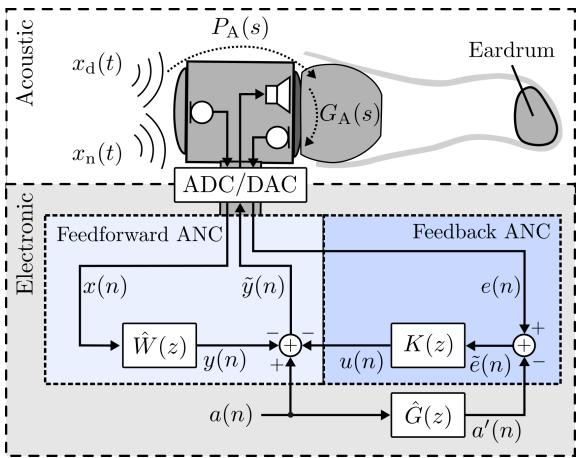  
FIGURE 1: Acoustic front-end with desired ambient sounds, $x _ { \mathrm { d } } ( t )$ and noise $x _ { \mathrm { n } } ( t )$ connected to the electronic back-end.

related transfer functions (HRTF) [3], which describe the DOA dependency of human hearing, we also expect a certain DOA dependency of ANC headphones. The addition of communication functionality to enhance the headphone to a headset, holds additional challenges as the occlusion effect, e.g. [4], [5] that shall be considered, but are not the focus of this paper.

The direction dependency for on-ear ANC headphones has, e.g., been investigated by Guldenschuh in [6] and [7]. In his publications he showed significant deviations from the mean frequency response due to DOA for frequencies below $2 0 0 \mathrm { H z }$ and above 1 kHz. He suggested an adaptive approach based on components determined by the principle component analysis (PCA) for a comprehensive and effective representation of the optimal filters for 336 different DOAs. In our contribution we are further investigating in-ear headphones. They are expected to have less DOA dependency, as the proximity of the two microphones in the headphone is closer and the whole housing is more compact.

We are going to describe the design of a time-invariant ANC system and give a novel view on the required accuracy of the antinoise signal to achieve a certain attenuation. Thereafter, we will introduce the measurement setup for the investigation on DOA dependency of the primary path, which is the relation between the outer and the inner microphone of the headphone. These measurements are analyzed and interpreted. Finally, another set of measurements with the different active settings of the ANC system is shown and described.

# 2 Active Noise Cancellation

The active cancellation of noise requires additional components within the headphone, including two extra microphones, as well as an electronic back-end with digital signal processing (DSP) capabilities as illustrated in Fig. 1. For the acoustic frontend we are focusing on an in-ear headphone. In addition to

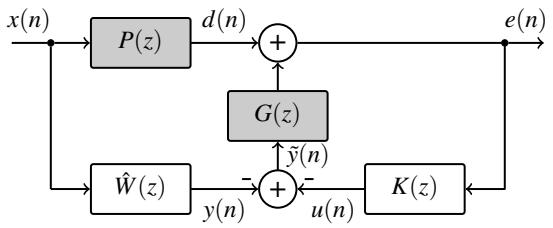  
FIGURE 2: Discrete ANC model with feedforward and feedback filter $\hat { W } ( z )$ and $K ( z )$ .

the inner loudspeaker, it includes two microphones, one facing the outer side, recording the ambient sound, and one facing the eardrum, recording the in-ear sound. Of special interest for any ANC system are the two transmission paths, the primary path $P ( z )$ and the secondary path $G ( z )$ . $P ( z )$ describes the transmission from the outer to the inner microphone. For headphones the characteristic is expected to be depending upon the A similar to human hearing. We are further investigating this assumption in the following. $G ( z )$ on the other hand describes the transmission from the inner loudspeaker to the inner microphone. The path is typically described by one filter model, which involves the influence of digital-analog conversion (DAC), loudspeaker characteristic, acoustic transmission from loudspeaker to microphone, microphone characterstic and analog-digital conversion (ADC). In Fig. 1 we visualized the acoustic secondary path $G _ { \mathrm { A } } ( s )$ that is depending upon the housing and the fitting of the headset as well as the individual ear canal.

The electronic back-end, visualized in the lower half of Fig. 1, includes the AD- and DA-conversion and the algorithm, which is implemented on a digital signal processor (DSP). ANC can be realized as a feedforward and feedback system, depending upon which of the two microphone signals is used to create the digital cancellation signal $\tilde { y } ( n )$ . The feedforward system uses a digital version of the outer microphone signal $x ( n )$ and relies on causality to attenuate the inner disturbance signal $d ( n )$ [7]. The feedback system uses the inner microphone signal $e ( n )$ and feeds a filtered version back into the ear via the loudspeaker. The feedback system reacts to changes inside the ear canal and is by principle not delayless between recording and interference.

Fig. 2 shows a digital model of the ANC system. It includes the discrete models for the primary path $P ( z )$ and the secondary path $G ( z )$ in gray. The outer disturbance signal $x ( n )$ is filtered by the primary path $P ( z )$ and results in the inner disturbance signal $d ( n )$ . This inner disturbance signal is interfered with the compensation signal $\tilde { y } ( n )$ filtered by the secondary path $G ( z )$ .

# 2.1 Feedforward ANC

For feedforward systems it is important to interfere the disturbing sound $d ( n )$ with an anti-sound that matches the amplitude and the inverse phase of $d ( n )$ as accurate as possible. This gets

clearer when further observing the relation between $e ( n )$ and $x ( n )$ in the z-Domain solely for the FF system $( K ( z ) = 0 )$ :

$$
\frac {E (z)}{X (z)} = P (z) - G (z) \hat {W} (z). \tag {1}
$$

For a large attenuation, relation (1) needs to take small values. Therefore, the optimal filter would be

$$
\hat {W} _ {\text {o p t}} (z) = \frac {P (z)}{G (z)}. \tag {2}
$$

However, the secondary path $G ( z )$ is non-minimum-phase, as it contains the acoustic component $G _ { \mathrm { A } } ( s )$ . Therefore, the calculation of $\hat { W } _ { \mathrm { o p t } } ( z )$ results in an anti-causal system, when the latency of the acoustic primary path $P _ { \mathrm { A } } ( s )$ is larger than the latency of acquisition, processing and replaying the cancellation signal. The delay to create the cancellation signal is described by the concatenation of the cancellation filter $\hat { W } ( z )$ and the secondary path model $G ( z )$ .

To determine a causal approximation of $\hat { W } _ { \mathrm { o p t } } ( z )$ in the minimum mean-square error sense, we are using the FIR-solution of the Wiener-Hopf-Equation [8]:

$$
\hat {w} = \Psi_ {g, g} ^ {- 1} \cdot \boldsymbol {\varphi} _ {p, g}, \tag {3}
$$

with $\Psi _ { g , g }$ being the auto-correlation matrix for the filter impulse response $g ( n )$ and $\pmb { \varphi } _ { p , g }$ being the cross-correlation vector between $p ( n )$ and $g ( n )$ .

# 2.2 Feedback ANC

The feedback system relies on low latency from recording the disturbing sound to interfering the waves with the anti-sound. The latency is contained in the concatenation of $K ( z )$ and $G ( z )$ and is also known as the open loop transfer function. The active attenuation of the feedback system is described by the sensitivity function

$$
S _ {\mathrm {F B}} (z) = \frac {E (z)}{D (z)} = \frac {1}{1 + G (z) K (z)}. \tag {4}
$$

It relates the $e ( n )$ to $d ( n )$ in the z-domain. To obtain an error signal with low power, (4) has to become small. Thus, the controller $K ( z )$ has to become large without creating instability. Methods for designing a feedback controller $K ( z )$ are, e.g., the mixed sensitivity $\mathcal { H } _ { \infty }$ -controller design method, as described in [5]. Feedback systems are not depending upon $P ( z )$ , but only on $G ( z )$ . As loudspeaker and inner microphone have fixed positions and are in

direct proximity to each other, secondary path $G ( z )$ is not expected to have a DOA dependency. Only the $d ( n )$ will change depending upon the direction. Thus, feedback ANC systems are expected to have no DOA dependency. This assumption is further investigated in Sec. 5.

# 2.3 Bound on attenuation

The goal is to get a quantitative expression for the attenuation that is achieved by anti-phase compensation for a given magnitude and phase deviation of $\tilde { y } ( n )$ in relation to $d ( n )$ for tonal signals. In order to analytically derive the necessary accuracy for an antiphase signal, we are regarding the substraction of a sinusoidal disturber $\scriptstyle A \cdot \cos ( \omega t )$ with a compensation signal $\boldsymbol { B } \cdot \cos ( \omega t + \Delta \phi )$ . The absolute amplitude deviation is defined as $\Delta { } A = A - B$ . We are interested in the real part of the difference between the disturbance and the compensation, which can be described for convenience as:

$$
\begin{array}{l} D _ {\mathrm {R}} (t) = A \cdot \cos (\omega t) - B \cdot \cos (\omega t + \Delta \phi) (5) \\ = \operatorname {R e} \left\{A \cdot e ^ {j \omega t} - B \cdot e ^ {j (\omega t + \Delta \phi)} \right\} (6) \\ = \operatorname {R e} \left\{\left(A - B e ^ {j \Delta \phi}\right) \cdot e ^ {j \omega t} \right\}. (7) \\ \end{array}
$$

This relation is visualized in Fig. 3. Using Euler’s formula $e ^ { j \theta } = $ $\cos ( \theta ) + j \sin ( \theta )$ and looking at the real part, we get

$$
\begin{array}{l} D _ {\mathrm {R}} (t) = \left(A - B \cos (\Delta \phi)\right) \cos (\omega t) + B \sin (\Delta \phi) \sin (\omega t) (8) \\ = C \cos (\omega t) + \tilde {B} \sin (\omega t) (9) \\ \end{array}
$$

We can see that the real part of the difference vector has a cosine and a sine component that is depending upon time t.

Overall, we are interested in the attenuation of the distur-

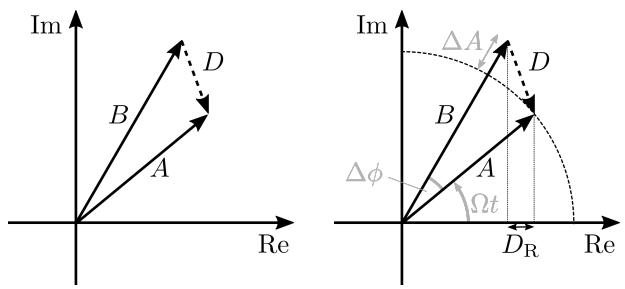  
FIGURE 3: Substractive compensation of disturbance phasor $A \cdot e ^ { j \omega t }$ with compensation phasor $B \cdot e ^ { j ( \omega t + \Delta \phi ) }$ .

bance:

$$
A t t = \frac {\sum_ {n = 0} ^ {N} d ^ {2} (n)}{\sum_ {n = 0} ^ {N} (d (n) - y (n)) ^ {2}}, \tag {10}
$$

for a total number of $N$ samples. In continuous domain the attenuation can be formulated in integral form over one period $T$ from an arbitrary beginning $t _ { 0 }$ for power signals:

$$
A t t = \frac {\frac {1}{T} \int_ {t _ {0}} ^ {t _ {0} + T} d ^ {2} (t)}{\frac {1}{T} \int_ {t _ {0}} ^ {t _ {0} + T} (d (t) - y (t)) ^ {2}}. \tag {11}
$$

To evaluate the denominator of (11), we are regarding the root-mean-square (RMS) or effective value $D _ { \mathrm { R , R M S } }$ $D _ { \mathrm { R } }$ of the continuous signal $D _ { \mathrm { R } } ^ { 2 } ( t )$ , given by

$$
D _ {\mathrm {R}, \mathrm {R M S}} = \sqrt {\frac {1}{T} \int_ {t _ {0}} ^ {t _ {0} + T} D _ {\mathrm {R}} ^ {2} (t) d t}, \tag {12}
$$

with (9) and using the trigonometry rules $\sin ^ { 2 } ( \omega t ) \ =$ $\frac { 1 } { 2 } \left( 1 + \cos ( 2 \omega t ) \right)$ , and $\cos ^ { 2 } ( \omega t ) \stackrel { \textstyle } { = } \frac { 1 } { 2 } \left( 1 - \cos ( 2 \omega t ) \right)$ , as well as $\begin{array} { r } { \bar { \cos } ( \omega t ) \sin ( \omega t ) = \frac { 1 } { 2 } \sin ( 2 \omega t ) } \end{array}$ .

$$
D _ {\mathrm {R}} ^ {2} (t) = \frac {C ^ {2}}{2} (1 - \cos (2 \omega t)) + \frac {\tilde {B} ^ {2}}{2} (1 + \cos (2 \omega t)) + \frac {C \tilde {B}}{2} \sin (2 \omega t). \tag {13}
$$

The integral over a full period of a sine or cosine is zero $\begin{array} { r } { \left( \int _ { t _ { 0 } } ^ { t _ { 0 } + T } \sin ( \omega t ) d t = 0 \right) } \end{array}$ , thus, (12) together with (13) results in

$$
D _ {\mathrm {R}, \mathrm {R M S}} = \sqrt {\frac {C ^ {2}}{2} + \frac {\tilde {B} ^ {2}}{2}}. \tag {14}
$$

Observing the squared RMS-value and reinserting the substituted $C$ and $\tilde { B }$ leads to

$$
D _ {\mathrm {R}, \mathrm {R M S}} ^ {2} = \frac {C ^ {2} + \tilde {B} ^ {2}}{2} = \frac {1}{2} \left(A ^ {2} - 2 A B \cos (\Delta \phi) + B ^ {2}\right). \tag {15}
$$

The numerator of (11), determined by the RMS-value of the disturbance signal using trigonometry rules, yields

$$
A _ {\mathrm {R}, \mathrm {R M S}} ^ {2} = \sqrt {A ^ {2} \cdot \frac {1}{T} \int_ {t _ {0}} ^ {t _ {0} + T} \cos^ {2} (\omega t) d t} = \sqrt {\frac {A ^ {2}}{2}}. \tag {16}
$$

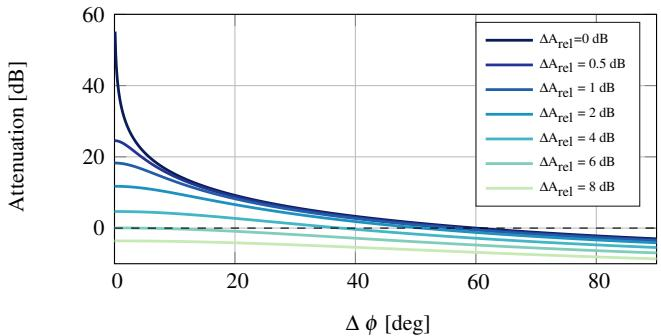  
FIGURE 4: Attenuation depending upon the phase deviation ∆φ and relative amplitude deviation $\Delta { { A _ { r e l } } }$ .

The overall gain, the inverse of the attenation $( G a i n = A t t ^ { - 1 }$ ) given in (11), is

$$
\begin{array}{l} G a i n = \frac {D _ {\mathrm {R} , \mathrm {R M S}} ^ {2}}{A _ {\mathrm {R} , \mathrm {R M S}} ^ {2}} = 1 - 2 \frac {B}{A} \cos (\Delta \phi) + \frac {B ^ {2}}{A ^ {2}} (17) \\ = 1 - 2 \Delta A _ {\mathrm {r e l}} \cos (\Delta \phi) + \Delta A _ {\mathrm {r e l}} ^ {2}, (18) \\ \end{array}
$$

with the relative amplitude deviation

$$
\Delta A _ {\text {r e l}} = \frac {B}{A} = \frac {A - \Delta A}{A}. \tag {19}
$$

The square function in (18) results in the following solution for the relative amplitude deviation $\Delta { { A _ { \mathrm { { r e l } } } } }$ depending upon the phase deviation $\Delta \phi$ and the Gain:

$$
\Delta A _ {\mathrm {r e l}} = \cos (\Delta \phi) \pm \sqrt {\cos^ {2} (\Delta \phi) - (1 - G a i n)}. \tag {20}
$$

Note that (19) as well as (20) are independent of $\omega$ .

Fig. 4 shows the attenuation as a function of the phase deviation $\Delta \phi$ for different relative amplitude deviations $\Delta \mathrm { A _ { r e l } }$ , as given in (18). Attenuation values below 0 dB indicate an amplification of the overall sound by the anti-sound. When observing a case with exact amplitude matching $\mathbf { \Delta } \mathbf { \Delta } \mathbf { A } _ { \mathrm { r e l } } = 0$ dB), it is possible to achieve significant attenuation with low phase deviation. However, a phase deviation of $\Delta \phi > 6 0 ^ { \circ }$ results in an amplification. With a perfect phase matching $( \Delta \phi = 0 ^ { \circ }$ ), a relative amplitude deviation of $\Delta \mathrm { A } _ { \mathrm { r e l } } > 2 0 \log _ { 1 0 } ( 2 ) = 6 . 0 2$ dB leads to an amplification.

Based on (20), we can determine bounds for different target attenuations depending upon a combined amplitude and phase deviation. These bounds are visualized in the following Fig. 5 for $A t t = \{ 0 , 5 , 1 0 , 1 5 \mathrm { a n d } 2 0 \}$ dB. All deviations below the curves result in an attenuation, all deviations above result in an unwanted amplification. Note that a high attenuation of 20 dB requires a

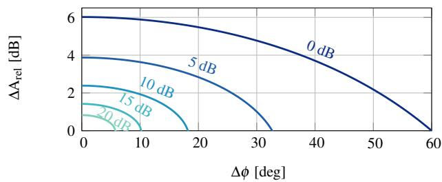  
FIGURE 5: Attenuation boundary curves. For deviations $( \Delta { { A _ { r e l } } }$ and $\Delta \phi$ ) matching the curve, you achieve the indicated attenuation of $\{ 0 , 5 , 1 0 , 1 5 , 2 0 \}$ dB

precise anti-phase compensation with less than 0.83 dB relative amplitude deviation and less than $5 . 7 6 ^ { \circ }$ phase deviation. However, when encountering a constant time delay $\Delta t$ of the cancellation signal, the problem of phase deviation increases with rising frequency, as the need to transform the time delay in a phase deviation. These observations give already a good idea of the principles as well as the limitations of ANC. The results are consistent to previously presented qualitative arguments, e.g. in [7].

# 3 Measurement Setup

The measurements are conducted in a measurement setup for fast acquisition of individual head-related transfer functions visualized in Fig. 6. The setup was constructed at the Institute of Technical Acoustics, RWTH Aachen University and was built with the intention to keep the interference of the system on the measured system minimal [3]. The system houses $6 4 ~ 1 ^ { \circ }$ loudspeakers on an incomplete half circle in vertical direction. The loudspeakers are located every $2 . 5 ^ { \circ }$ , from $\varphi = 1 . 2 5 ^ { \circ }$ at the top of the subject, to $\varphi = \mathrm { s } 1 6 0 ^ { \circ }$ at the bottom. The subject is standing with the ears at $2 \mathrm { m }$ height on a rotating platform, in distance of $1 . 2 \mathrm { m }$ of the loudspeakers. Either continuous or step-wise azimuth rotation can be used, depending upon the time constraints of the measurement [9]. The measurements itself are based on FFT measurement techniques. To speed up the measurements, the multiple exponential sweep method is used [10] with optimized sweep rates for the room and system [11]. The delay between sweeps is set to 30 ms and the sweep rate is set to $8 . 6 ~ \frac { o c t . } { s }$ . The measurements were performed at a sampling rate of $f _ { \mathrm { s } } = 4 8 \ : \mathrm { k H z }$ .

As the system is designed to measure HRTFs, which do not carry much information at low frequency, and because of the size of the loudspeakers, the frequency range of the measurements has a lower band limit of $3 5 0 \mathrm { H z }$ . As this limitation will impact the investigation of the active performance of the ANC system, a second set of measurements is conducted with a single loudspeaker (Neumann KH120A, linear magnitude spectrum from $5 2 \mathrm { H z }$ to $2 1 \mathrm { k H z } \pm 3 \mathrm { d B }$ ) and the rotating platform to obtain low frequency information on the horizontal plane. The setup is shown in Fig. 7. For this measurement the loudspeaker is positioned at $2 \mathrm { m }$ height

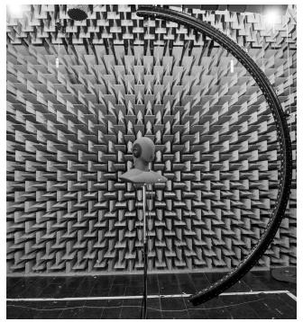  
FIGURE 6: ITA HRTF Measurement system with a Head Acoustics Dummyhead wearing Bose QC20 headphones in the center position ( $_ { 1 . 2 m }$ distance).

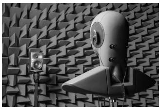  
FIGURE 7: Horizontal plane measurement with Neumann KH120 loudspeaker for enhanced low frequency range (1.5 m distance).

and $1 . 5 \mathrm { m }$ distance to the head.

For reproducible measurements a Head Acoustics dummyhead with integrated ear simulator (HMS II.3 with 6460 MFE VI amplifier, HEAD Acoustics GmbH, Herzogenrath, Germany) is used. A Bose QC20 in-ear headphone without the Bose electronics [12] is used as the acoustic front-end and placed firmly in the ears of the dummyhead. As we are including the headphone device microphones in the measurement, we refer to this measurement as a device-specific head related transfer function (DHRTF). Sine sweep measurements are conducted in the frequency range of $2 0 \mathrm { H z }$ and $3 5 0 \mathrm { H z }$ to $2 4 \mathrm { k H z }$ for single loudspeaker and the HRTF measurement, respecitvely.

For both measurements the head is rotated and measured every 5 degree on the horizontal plane with a frequency range of $2 0 \mathrm { H z }$ to $2 4 \mathrm { k H z }$ . This results in a total number of $M = 4 6 0 8$ different directions for the HRTF and $M = 7 2$ different directions for the single loudspeaker measurement. The measurement and post-processing procedures are part of the open source ITA Toolbox [13, 14] which is developed at the Institute of Technical Acoustics, RWTH Aachen University. The measurements have been postprocessed with a hann window in the time domain to cancel the dominant reflection in the impulse responses due to the concrete floor of the semi-anechoic chamber visible in Fig. 6. The windows have been chosen to start at a cutoff time of 7.2 ms reaching the stopband at $7 . 5 \mathrm { m s }$ for all DHRTF and 12.2 ms and 12.6 ms respectively for the single loudspeaker measurements. The timing of the first reflection is depending upon the minimum distance to the floor of the setup. Note that this time filtering limits the resolution at low frequencies. The lowest frequency still fitting into the given cutoff time periods would be $1 3 9 \mathrm { H z }$ and $8 2 \mathrm { H z }$ , respectively.

The coordinate system definition used in the following, is

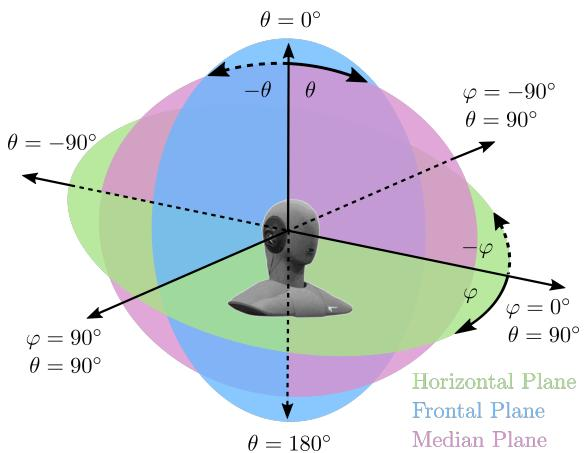  
FIGURE 8: Coordinate system definition of measurements with azimuth angle $\varphi$ and elevation angle θ . Including Horizontal, Frontal and Median Plane.

shown in Fig. 8.

As we are investigating an ANC system, which has its largest impact at low frequencies, we are concentrating on frequencies below $4 0 0 0 \mathrm { H z }$ . The lower cut-off frequency for the semi-anechoic room is $1 0 0 \mathrm { H z }$ . Below we would get acoustic modes and thus no reliable acoustic measurements.

# 4 Analysis of Primary Path Measurements

To show the range of the measured primary paths $P _ { i } ( z )$ in the frequency domain, we introduce a percentile line plot, which is a line-based version inspired by the well-known box-and-whisker plots [15]. The giving definition is purely data dependent. It contains the median ( ), the $2 5 \%$ and $7 5 \%$ percentile ( ), the $2 . 5 \%$ and $9 7 . 5 \%$ percentile ( ), as well as the overall minimum and maximum of the selected directions in each frequency bin ( ). Note that in the range of the $2 5 \%$ and $7 5 \%$ percentile ) contains $50 \%$ of the values and in the range of the $2 . 5 \%$ and $9 7 . 5 \%$ percentile ( ) $9 5 \%$ of the values are covered. The second type of plot we will be showing is a colored 2-D plot depending upon frequency and angle in the selected plane (horizontal, frontal, median). The color describes the z-value (here: magnitude or phase) that is evaluated at a selected frequency and angle. We will refer to it as a surface plot. Third, we will show the standard and the maximum deviation from the mean value depending on the frequency to show the variations in a condensed form.

In the following, we are further investigating the deviations of the primary paths $P _ { i } ( z )$ from the nominal primary path $P _ { \mathrm { n } } ( z )$ , where i describes the selected directions,. The nominal primary path has been selected as the lateral left direction for the left ear of the dummyhead $\theta = 9 0 ^ { \circ }$ , $\varphi = - 9 0 ^ { \circ } .$ ). We only visualize the left side signals, as the measurements indicated symmetry between left and right ear for the case of the dummyhead.

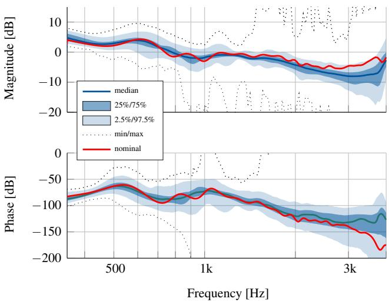  
FIGURE 9: Percentile line plot for the DHRTF measurements $( M = 4 6 0 8$ ), including the nominal primary path $P _ { n } ( z )$ .

The optimal feedforward filter $\hat { W } ( z )$ given by (2) as well as its causal approximation in (3) are depending upon the primary path $P ( z )$ . Therefore, we will examine the deviation of the primary paths from the selected nominal primary path in magnitude and phase. As motivated earlier, the magnitude and phase deviation of the anti-noise is defining the achievable attenuation. When using an optimal feedforward controller for one direction, we are thus expecting a degrading of the attenuation, which could be estimated with the argumentation in Sec. 2.3.

The relative magnitude deviation, similar to (19) is calculated in the complex domain:

$$
\Delta P _ {\text {r e l}} (z) = \left| \frac {P _ {i} (z) - P _ {\mathrm {n}} (z)}{P _ {\mathrm {n}} (z)} \right| \quad \text {w i t h} \quad i \in \text {S e l e c t i o n}. \tag {21}
$$

The phase deviation is determined from the unwrapped phase $\angle P _ { i } ( z ) =$ unwrap $\left( \arg ( P _ { i } ( z ) ) \right)$ of the individual directions:

$$
\Delta \angle P (z) = | \angle P _ {i} (z) - \angle P _ {\mathrm {n}} (z) | \quad \text {w i t h} \quad i \in \text {S e l e c t i o n .} \tag {22}
$$

These deviations will be visualized in the surface plots.

# 4.1 Full sphere DHRTF measurement

The DHRTF measurements with the $M = 4 6 0 8$ different directions allow for a comprehensive view on the DOA dependency of the primary path $P ( z )$ above $3 5 0 \mathrm { H z }$ . The visualization will be limited to the range from $3 5 0 \mathrm { H z }$ to $4 0 0 0 \mathrm { H z }$ to concentrate on the effective working frequency range of ANC. Fig. 9 shows the percentile line plot for the complete DHRTF dataset. As a reference we can refer to the median ( ) as well as the selected nominal primary path $P _ { \mathrm { n } } ( z )$ from lateral left direction ( ). For

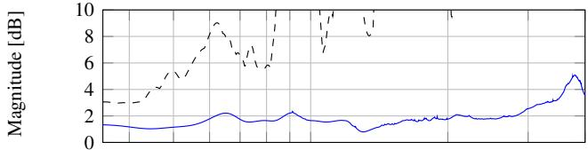

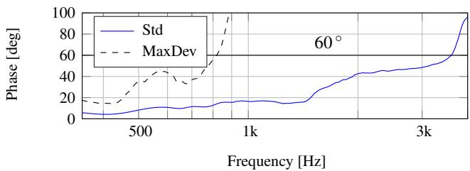  
FIGURE 10: Standard deviation (Std) and maximum deviation (MaxDev) from the mean primary path $\begin{array} { r } { \overline { { P } } ( z ) = \frac { 1 } { M } \sum _ { i = 0 } ^ { M } P _ { i } ( z ) f } \end{array}$ or the DHRTF measurements with $M = 4 6 0 8$ directions.

most the frequencies we can see that the selected nominal path lies within the $50 \%$ percentile in the bounds of $( \sqsubset \sqsupset$ . However, it further deviates for frequencies above $1 \mathrm { k H z }$ . Observing the percentiles in comparison to the median, the illustration suggests a rather small deviation of 1-2 dB in the magnitude and $1 0 { - } 2 0 ^ { \circ }$ in the phase for the $50 \%$ quantile, within the bounds of $( \sqsubset \sqsupset$ The $9 5 \%$ quantile $( \sqsubset \sqsupset )$ indicates a deviation of up to 5 dB in the magnitude and up to $3 0 ^ { \circ }$ in the phase. The minimum and maximum deviations ( ) show large deviations from ${ 8 0 0 } \mathrm { H z }$ on. In general the spread is increasing with increasing frequency. Especially the phase deviation $\Delta \angle P ( z )$ is expected to have a large impact on the performance of the ANC system.

The standard and maximum deviation from the mean primary path for the full sphere, based on the DHRTF measurements, is visualized in Fig. 10. The graph shows that the standard deviation (Std) of the magnitude is very low with less than 2 dB up to $3 \mathrm { k H z }$ and Std of the phase is well below $2 0 ^ { \circ }$ below 1 kHz. The primary path deviations for on-ear headphones in [6] show comparable results. Note that we are considering the full sphere in Fig. 10 and did not separate the different planes.

To get further insight, Fig. 11a to Fig. 11c shows the angle depending deviations from the nominal path for the horizontal, frontal and median plane following Fig. 8. Especially, the large maximum deviations visible in Fig. 10 are getting clearer within the surface plots. For a comprehensible illustration we are concentrating on those three planes. All three planes, show up to 0 dB relative magnitude deviation and up to $3 0 ^ { \circ }$ phase deviation for frequencies below 1 kHz.

For the horizontal plane in Fig. 11a, we can clearly see the nominal path at $\theta = 9 0 ^ { \circ }$ and $\varphi = - 9 0 ^ { \circ }$ as a blue minimum in the magnitude and phase. We can also see resonance effects on the opposite head side starting at roughly $\varphi = 5 0 ^ { \circ }$ and $\varphi = 1 3 5 ^ { \circ }$ from $1 . 2 \mathrm { k H z }$ on. These large deviations from the nominal path

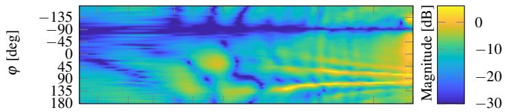  
(a) Horizontal Plane (DHRTF)

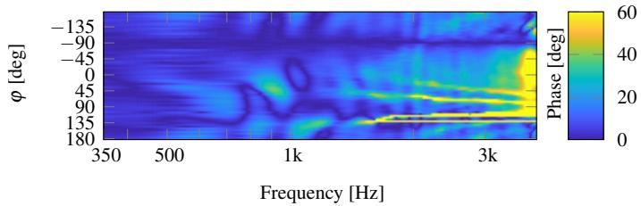

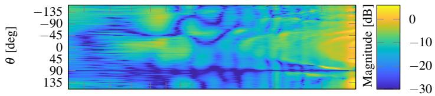  
(b) Frontal Plane (DHRTF)

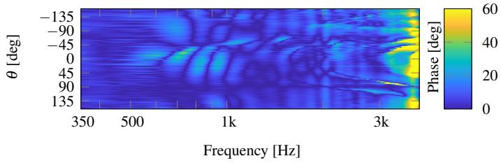

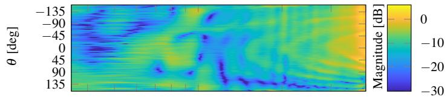  
(c) Median Plane (DHRTF)

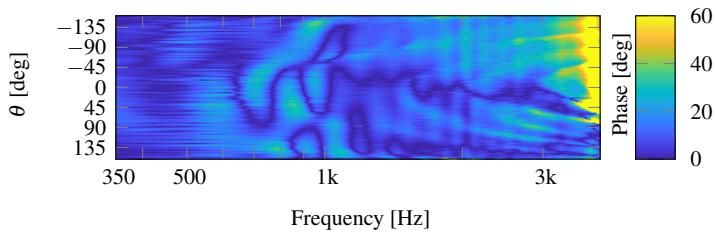  
FIGURE 11: Relative Deviation of $P _ { i } ( z )$ with $i \in$ Select Plane from the nominal path primary $P _ { n } ( z )$ .

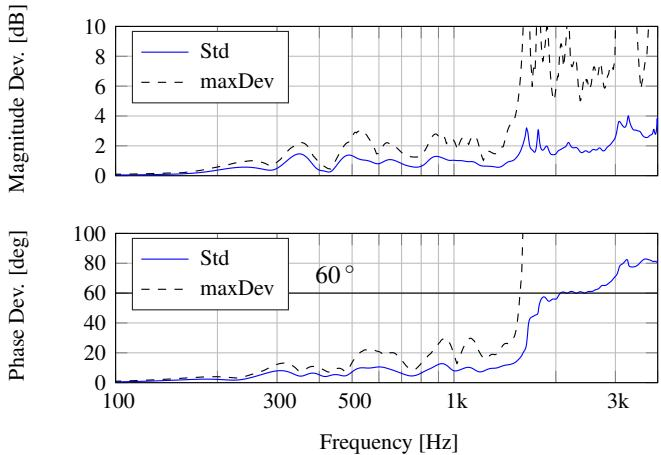  
FIGURE 12: Standard deviation (Std) and maximum deviation (MaxDev) from the mean primary path $\begin{array} { r } { \overline { { P } } ( z ) = \frac { 1 } { M } \sum _ { i = 0 } ^ { M } P _ { i } ( z ) } \end{array}$ for the single loudspeaker measurements with $M = 7 2$ directions.

are slightly shifting towards the right side at $\varphi = 9 0 ^ { \circ }$ finally reaching $\varphi = 8 0 ^ { \circ }$ and $\varphi = 1 0 0 ^ { \circ }$ for $f = 4 \mathrm { k H z }$ . These resonance effects were reproducible with repositioning headphones and are the reason for the large maximum deviations in Fig. 9 and Fig. 10. Consistent effects are visible in the phase deviation. The straight line at $\varphi = 1 3 0 ^ { \circ }$ is an unwrapping effect. Similar observations can be made in the frontal plane in Fig. 11b and the median plane in Fig. 11b.

# 4.2 Horizontal plane with KH120A

To expand the view on the directional dependency to frequencies below $3 5 0 \mathrm { H z }$ we also conducted measurements with a single loudspeaker (Neumann KH120A). This is important as ANC systems typically achieve their best performance at low frequencies. For this setup we only acquired $M = 7 2$ measurements in the horizontal plane for $\theta = 9 0 ^ { \circ }$ . We expected low to no DOA dependency for low frequencies below $2 0 0 \mathrm { H z }$ , which is well supported by the measurements. This indicates that amplifications due to mismatch in magnitude and phase in the horizontal plane, are expected to appear above $1 0 0 0 \mathrm { H z }$ , where ANC systems have very limited effect. Fig. 12 shows the standard and maximum deviation from the mean primary path for the horizontal plane, based on the single loudspeaker measurements with an extended low frequency span ranging from $1 0 0 \mathrm { H z }$ to $4 0 0 0 \mathrm { H z }$ . We expected low to no DOA dependency for low frequencies below $2 0 0 \mathrm { H z }$ , which is well supported by the measurements. Furthermore, the resonance effects that lead to the large maximum deviation in Fig. 12, are appearing at frequencies above $1 \mathrm { k H z }$ in the horizontal plane.

# 4.3 Conclusion on DOA dependency of primary paths

The DHRTF as well as the single loudspeaker measurements reveal the DOA dependency of the primary paths. For frequencies

below $2 0 0 \mathrm { H z }$ the paths can be regarded as approximately DOA independent. Similar to [7] the deviation in magnitude and phase are becoming severe above 1 kHz. However, considering the full sphere in Fig. 10 revealed larger deviations than mentioned by Guldenschuh already at low frequencies. The large maximum deviations in magnitude and phase can be argued with a effect angle- and frequencies-wise limited effects as visible in Fig. 11a, expected to be resonance effect of the headphone. Due to the DOA dependency of the primary paths we expect that the achievable attenuation of an ANC system realized with time-invariant filters is depending upon the DOA.

# 5 Active measurements

To verify the DOA dependent attenuation, we conducted a third set of measurements under the same acoustical conditions as before, but activated different ANC settings. For these measurements, we used the single loudspeaker setup with the Neumann KH120A and rotated the dummyhead with inserted headphones in $5 ^ { \circ }$ steps. The dummyhead microphones were used in the measurements at these discrete azimuth angles. As we assume all filtering operations to be time-invariant, we used exponential sweeps as the excitation signal.

We considered the passive usage without any active compensation, as well as four different settings of active processing: Only a feedback controller (FB) [16] (Fig. 13b), only a feedforward controller (FF) introduced in (3) (Fig. 13c), a combined system with feedback and feedforward controller (FFFB) (Fig. 13d), and a commercially available solution with the original Bose QC20 Electronics (BoseElec) (Fig. 13e). Additionally to all these settings, we did one measurement with open ears to have a reference for the passive attenuation of the headphones (Fig. 13a).

For the settings (FB), (FF) and (FFFB) the Bose QC20 inear headphone was connected to a dSPACE DS1005 real-time system with DS2004 and DS2102 extension boards. Excluding the acoustics, the dSPACE system has a round trip delay of 1 sample at a sampling rate of $f _ { s } = 4 8 \mathrm { k H z }$ . We are using the implementation as described in Sec. 2. For the setting (BoseElec) the Bose QC20 in-ear headphone was connected to the original Bose QC20 electronics. To guarantee the highest possible degree of comparability, fitting and setup were not changed during the whole measurements. To acquire the passive attenuation of the headphones we related (passive) to (open) measurement. For the other cases, we related the active setting (FB, FF, FFFB, BoseElec) to the (passive) setting to solely observe the active attenuation. In the plots we will be visualizing the frequency dependent Gain, which is the inverse of the attenuation. Thus, a value below 0 dB corresponds to an attenuation and a value above 0 dB corresponds to an amplification introduced by the system. The passive attenuation is to a large degree DOA independent, as visible in Fig. 13a. For frequencies above $2 \mathrm { k H z }$ there seem to be a few outliers, visible as a wider spread in the data. It

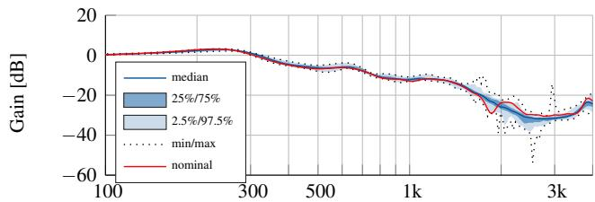  
(a) Passive Attenuation

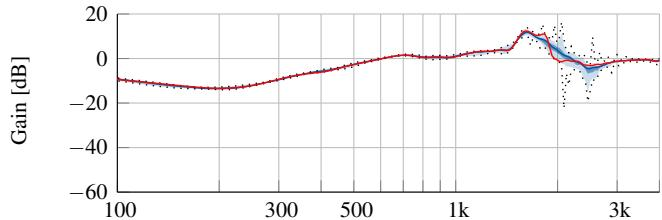  
(b) Active Attenuation FB

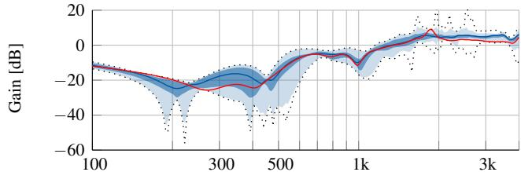  
(c) Active Attenuation FF

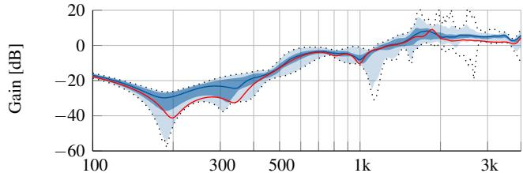  
(d) Active Attenuation FFFB

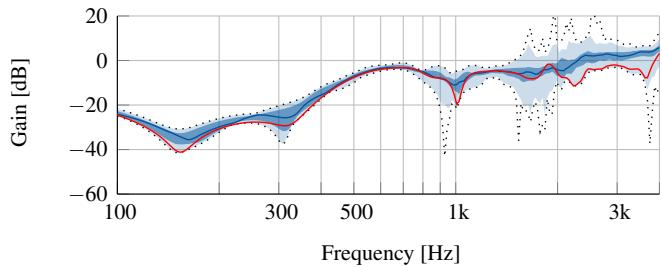  
(e) Active Attenuation Bose Electronics   
FIGURE 13: Percentile line plot of passive and active attenuation.

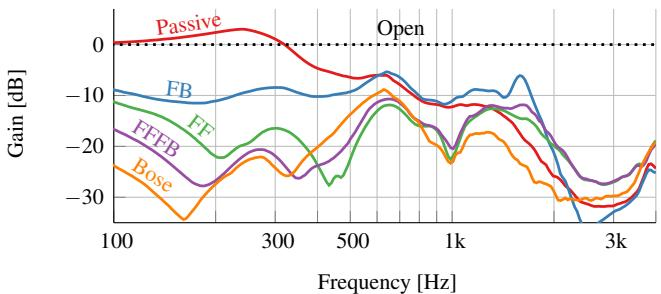  
FIGURE 14: Median overall gain with active and passive attenuation for all cases.

introduces a slight amplification of up to 3 dB around $2 0 0 \mathrm { H z }$ and increasingly attenuates sound from $3 0 0 \mathrm { H z }$ on. At 2 kHz the attenuation surpasses 26 dB.

In the following active attenuations, the passive attenuation has already been compensated for. Thus, to get the overall attenuation of the headphone, one would need to add up the passive and active attenuation. As argued in Sec. 2.2, the feedback controller performance is expected to be DOA independent, which is supported by the measurements shown in Fig. 13b. The feedback controller reaches the highest attenuation of $1 3 \mathrm { d B }$ around $2 0 0 \mathrm { H z }$ . For feedback control systems an attenuation at one frequency range requires the amplification at other frequencies. This effect is called the waterbed effect [17] and is visible as an amplification of $1 2 \mathrm { d B }$ around $1 . 6 \mathrm { k H z }$ . The DOA-wise more interesting case is the feedforward controller depicted in Fig. 13c. It shows a significant deviation from the median already for frequencies above $1 4 0 \mathrm { H z }$ . Between the $2 5 \%$ and the $7 5 \%$ percentile the attenuation already has a spread of more than 10 dB. When you compare the nominal direction ) with the others, it is remarkable that the feedforward controller specifically designed for this nominal direction, can achieve better performance in other directions. The first aspect that stands out when comparing the combined system (FFFB) in Fig. 13d to the (FF) system in Fig. 13c is the decreased DOA dependency in the frequency range below $1 \mathrm { k H z }$ of the combined system. The feedback controller has a stabilizing effect on the feedforward controller, additional to the desired increase in attenuation at low frequencies. When finally comparing the combined system (FFFB) to the original (BoseElec) in Fig. 13e. We can deduce that the Bose system incorporates a slightly higher attenuation as well as a lower DOA dependency. Note that the feedforward filters were not designed for minimum DOA dependency, but this contribution analyses a typical design procedure for such filters.

The following Fig. 14 shows the median overall gain with active and passive attenation of all cases, to allow for a more precise comparison. It is clearly visible that the commercial Bose system has an advantage below $2 0 0 \mathrm { H z }$ , which will large be due to a larger attenuation of their feedback controller. The feedback controller we used for this evaluation has been designed for the

special purpose of occlusion reduction [5] and still has potential for higher performance. The presented FFFB system shows better performance from ${ 5 0 0 } \mathrm { H z }$ to $7 0 0 \mathrm { H z }$ .

# 6 Conclusion

In the course of this paper we very briefly described the design of time-invariant feedforward controller based on the Wiener-Hopf equation and time-invariant feedback controllers. A novel analytical expression for the achievable attenuation for a given relative amplitude deviation and phase deviation of the anti-noise signal has been derived. This expression gives a deeper insight into the required accuracy for anti-phase compensation. We presented an analysis of direction-of-arrival (DOA) dependent primary paths acquired with a fast HRTF measurement system (64 angles in elevation and 72 angles in azimuth) and a single loudspeaker setup (72 angles in azimuth). A significant variation in magnitude and phase has been observed. These variations result in a DOA dependent attenuation of an ANC system with a time-invariant feedforward filter. Within a third measurement set, different settings of the active system have been related to passive and open measurements. As expected, the passive attenuation and the active feedback system have shown to be largely DOA-independent. The anticipated DOA dependency of the feedforward controller could be verified with the measurements. However, it is remarkable that the combined feedforward-feedback system shows a slightly reduced DOA-dependency. The system has also been compared to the original Bose electronic. In future work, we will investigate ways to enhance the attenuation and decrease the DOA dependency.

# REFERENCES

[1] Institute for Health and Consumer Protection Historical Collection, Burden of disease from environmental noise: Quantification of healthy life years lost in Europe. WHO Regional Office for Europe, 2011.   
[2] C. Hansen, S. Snyder, X. Qiu, L. Brooks, and D. Moreau, Active control of noise and vibration. CRC Press, 2012.   
[3] J.-G. Richter, G. Behler, and J. Fels, “Evaluation of a fast HRTF measurement system,” 140th Audio Eng. Soc. Conv., p. 9498, 2016.   
[4] M. Sunohara, K. Watanuki, and M. Tateno, “Occlusion reduction system for hearing aids using active noise control technique,” Acoustical Science and Technology, vol. 35, no. 6, pp. 318–320, 2014.   
[5] S. Liebich, P. Jax, and P. Vary, “Active cancellation of the occlusion effect in hearing aids by time invariant robust feedback,” in Speech Communication; 12. ITG Symposium, 2016, pp. 1–5.   
[6] M. Guldenschuh, “New approaches for active noise con-

trol headphones,” Dissertation, University of Music and Performing Arts Graz, Graz, Austria, 2014.   
[7] — —, “Least-mean-square weighted parallel iir filters in active-noise-control headphones,” in 2014 22nd European Signal Processing Conference (EUSIPCO), 2014, pp. 1367– 1371.   
[8] S. S. Haykin, Adaptive filter theory, 3rd ed., ser. Prentice Hall information and system sciences series. Upper Saddle River, N.J.: Prentice Hall, 1996.   
[9] J.-G. Richter and J. Fels, “On the influence of continuous subject rotation during HRTF measurements,” J. Acoust. Soc. Am., vol. 141, no. 5, pp. 3986–3986, may 2017. [Online]. Available: http://asa.scitation.org/doi/10.1121/1.4989115   
[10] P. Majdak, P. Balazs, and B. Laback, “Multiple exponential sweep method for fast measurement of head-related transfer functions,” J. Audio Eng. Soc, vol. 55, no. 7/8, pp. 623—-637, 2007. [Online]. Available: http://www.aes.org/e-lib/browse.cfm?elib=14190   
[11] P. Dietrich, B. Masiero, and M. Vorlander, “On the¨ optimization of the multiple exponential sweep method,” J. Audio Eng. Soc, vol. 61, no. 3, pp. 113–124, 2013. [Online]. Available: http://www.aes.org/e-lib/browse.cfm?elib=16672   
[12] K. P. Annunziato, J. Harlow, M. Monahan, A. Parthasarathi, R. C. Silvestri, and E. M. Wallace, “In-ear active noise reduction earphone,” Patent US8 682 001 B2, 2014. [Online]. Available: https://www.google.com/patents/US8682001   
[13] P. Dietrich, M. Guski, M. Pollow, B. Masiero, M. Muller- ¨ Trapet, R. Scharrer, and M. Vorlander, “ITA-Toolbox - An ¨ Open Source MATLAB Toolbox for Acousticians,” in DAGA 2012, 38. Jahrestagung fur Akust. 19. - 22. M ¨ arz 2012 Darm- ¨ stadt. Wiss / ed. Holger Hanselka. Deutsche Gesellschaft fur Akustik e.V., 2012, pp. 151–152. ¨   
[14] M. Berzborn, R. Bomhardt, J. Klein, J.-G. Richter, and M. Vorlander, “The ITA-Toolbox : An Open Source MAT- ¨ LAB Toolbox for Acoustic Measurements and Signal Processing,” in Fortschritte der Akust. - DAGA 2017 43. Dtsch. Jahrestagung fur Akust. ¨ , 2017, pp. 222–225.   
[15] J. W. Tukey, Exploratory data analysis, ser. Addison-Wesley series in behavioral science : quantitative methods. Reading, Mass. [u.a.]: Addison-Wesley, 1977.   
[16] S. Liebich, C. Anemuller, P. Vary, P. Jax, D. R¨ uschen, and¨ S. Leonhardt, “Active noise cancellation in headphones by digital robust feedback control,” in 2016 24th European Signal Processing Conference (EUSIPCO), 2016, pp. 1843– 1847.   
[17] S. Skogestad and I. Postlethwaite, Multivariable feedback control: analysis and design. John Wiley & Sons, 2005.
