# Occlusion Effect Cancellation in Headphones and Hearing Devices—The Sister of Active Noise Cancellation

Stefan Liebich , Member, IEEE, and Peter Vary , Life Fellow, IEEE

Abstract—The perception of one’s own voice influences the acceptance of hearing devices, such as headphones, headsets or hearing aids. When these devices fully or partially occlude the ear canal, the wearer’s own voice sounds boomy or like talking in a barrel. This is called occlusion effect. Occluding the ear canal results in an amplification of body-conducted sounds, mainly at low frequencies, and an attenuation of air-conducted sounds, predominantly at high frequencies, compared to the open ear. This contribution provides a comprehensive treatment of Occlusion Effect Cancellation (OEC) and its relation to Active Noise Cancellation (ANC) using digital signal processing. A novel effective filter structure is presented which offers some degree of adaptability and adjustability. Furthermore, digitally opening and closing the ear is evaluated by listening tests and objective measurements.

Index Terms—Active Noise Cancellation, acoustic signal processing, filter design, occlusion effect, occlusion effect cancellation.

## I. INTRODUCTION

common complaints of hearing users are not being satisfied with the sound of their own voice (27%) as well as with the sound of chewing and swallowing (36%), while only few reported physical discomfort with their device (13%). Furthermore, the own voice perception is among the top ten factors correlated with the overall user satisfaction (correlation coefficient r = 0.6). This paper addresses the aspect of unnatural perception and not the physical discomfort with the device.

When the ear canal is fully or partially occluded, the own voice perception is subjectively described as hollow [2]. It especially appears with in-ear devices and hearing aids with earmolds inserted into the external ear canal (closed fitting earpieces). Objectively, this effect can be measured as amplification of low-frequency and attenuation of high-frequency components when comparing the sound pressure within the occluded ear vs. within the open ear. This effect is known as the occlusion effect. The amplified low frequencies originate from body-conducted sounds (e.g. own voice, chewing, swallowing, footfall sounds) emitted into the ear canal via the vibrating ear canal walls [3]. The air-conducted sounds, on the other hand, are attenuated by the earpiece with stronger reduction at higher frequencies than at lower frequencies. Passive approaches to reduce this effect are open fittings (dome tips) or ventilation holes in the earpiece as well as deep insertion of the earpiece into the ear canal. Open fittings or ventilation holes, however, come with various disadvantages, e.g., an increased risk of acoustic feedback, limited amplification gain and almost no suppression of ambient noise. Deep insertion on the other hand may cause physical discomfort. An overview of these techniques is provided, e.g., in [4].

Active cancellation of the occlusion effect seeks to avoid the disadvantages of passive approaches and provide larger amplification gains and clearer sound for the user. These techniques require additional microphones, for providing information about the amplified low frequencies and the attenuated high frequencies. Typically, an inner microphone picks up the inner signal including the body-conducted sounds within the ear canal and an outer microphone records the air-conducted sound before entering the ear canal. These two microphone signals are filtered and create a compensation signal that is emitted via the loudspeaker. This active occlusion effect cancellation (OEC) is closely related to active noise cancellation (ANC), as they share similar principles of filtering and have similar requirements for latency and knowledge about the acoustic system. However, there are major differences and design constraints. While ANC aims at maximum attenuation of ambient sounds, OEC targets at natural perception of one’s own voice. For this, OEC needs to balance air-conducted and body-conducted components.

This article gives first an overview of the principle of ANC in Section II, then explains the occlusion effect including measurements and modeling in Section III, and provides an overview of the OEC system in Section IV. Then ANC and OEC are compared in Section IV-G, followed by an evaluation of the proposed solution in Section V and a conclusions.

The objectives of this paper are a comprehensive joint treatment of both OEC and ANC including differing constraints and common principles, such as the combination of feedforward and feedback filters, filter design and optimization. Furthermore, implementation aspects are addressed and previous subjective results of OEC are complimented by objective measurements.

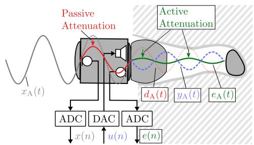  
Fig. 1. Principal signals in an ANC headphone with two microphones. (t = continuous-time, n = discrete-time).

This paper is an extension of two conference papers which address separately OEC [5] and ANC [6]. The main added value of this journal paper is the joint consideration and optimization of both the concepts of ANC and OEC, as well as further improvements made beyond the conference presentations, including flexible switching between ANC and OEC, analysis of the interaction of different sound contributions (ambient sound, body-conducted sound, desired audio signal), implications due to different measurement procedures for the occlusion effect, as well as measurements and discussion of occlusion functions for different settings in the listening test.

## II. ACTIVE NOISE CANCELLING (ANC) PRINCIPLE

Active noise cancelling is a wide-spread and popular technique in modern headphones. The target is to cancel ambient sound, which is considered as disturbance. This is achieved by emitting a phase-inverse compensation signal via the headphone loudspeaker which requires information about the disturbance. Fig. 1 shows the principle of an ANC headphone with two microphones. Information about the disturbance can either be acquired as an outer microphone signal $x _ { \mathrm { A } } ( t )$ before the outer disturbance is passively attenuated by the headphone, or as an inner microphone signal $e _ { \mathrm { A } } ( t )$ , which provides information about the inner disturbance. A discrete-time control signal $u ( n )$ is determined by digital signal processing (DSP), which results in a continuous-time acoustic compensation signal $y _ { \mathrm { A } } ( t )$ emitted by the loudspeaker. For a deactivated ANC system, the inner microphone only picks up the acoustic disturbance signal $d _ { \mathrm { A } } ( t )$ which is a passively attenuated version of $x _ { \mathrm { A } } ( t )$ , yielding

$$
e _ {\mathrm{A}} (t) | _ {\mathrm{ANCoff}} = d _ {\mathrm{A}} (t).\tag{1}
$$

For an activated ANC system, the acoustic inner disturbance signal $d _ { \mathrm { A } } ( t )$ is superimposed with an acoustic compensation signal $y _ { \mathrm { A } } ( t )$ played back via the loudspeaker:

$$
\left. e _ {\mathrm{A}} (t) \right| _ {\text { ANC   on }} = d _ {\mathrm{A}} (t) + y _ {\mathrm{A}} (t).\tag{2}
$$

Precise knowledge of the involved transfer functions is crucial. Fig. 2 illustrates these transfer functions for an in-ear headphone. It distinguishes analog components described in continuous-time t and in the s-domain $( \mathrm { e . g . ~ } h _ { \mathrm { A } } ( t )$ and $H _ { \mathrm { A } } ( s ) )$ 1 and digital models in discrete-time n and the z-domain $( \mathrm { e . g . } h ( n )$ and $H ( z ) )$ . The digital models represent the perspective of the controller. They include analog anti-aliasing filters, sampling and quantization by analog-to-digital converters (ADCs) for the input and digital-to-analog converters (DACs) with analog postfilters for the output. The important analog transfer functions in Fig. 2 are the primary path $P _ { \mathrm { A } } ( s )$ , the secondary path $G _ { \mathrm { A } } ( s )$ and the acoustic feedback path $F _ { \mathrm { A } } ( s )$ with the corresponding discrete-time models P(z), G(z) and $F ( z )$

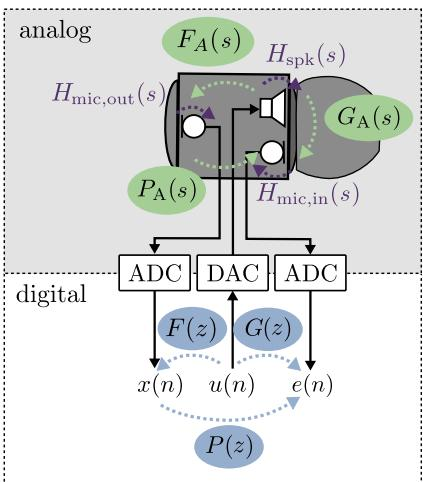

Fig. 2. Relevant transfer functions for an ANC headphone with two microphones.  
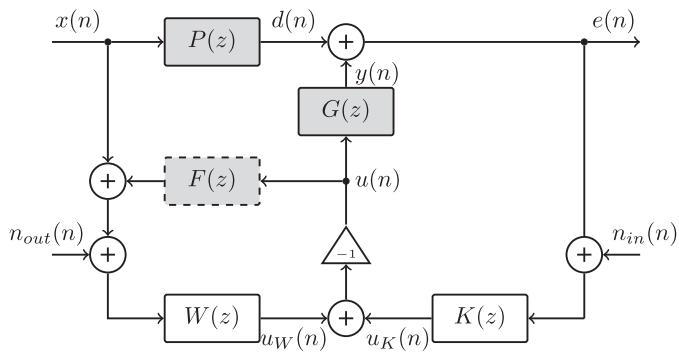  
Fig. 3. Combined feedforward-feedback control structure with measurement noise. Digital filters (white) and discrete-time models of acoustic paths (gray).

## A. Feedback and Feedforward ANC

Based on the ANC description in Fig. 2, a discrete-time model for an ANC system is shown in Fig. 3 for a feedforward-feedback control system including the influence of additive measurement noise $n _ { i n } ( n )$ and $n _ { o u t } ( n )$ of the inner and the outer microphone, due to microphones, amplifiers and ADCs. The feedforward control signal $u _ { W } ( n )$ and the feedback control signal $u _ { K } ( n )$ are calculated using the feedforward filter $W ( z )$ and the feedback controller $K ( z )$ . They are then summed up and inverted to form the control signal $u ( n )$ . This control signal can be described in the z-domain by (leaving out the dependencies on z for readability)

$$
U = - \left(U _ {W} + U _ {K}\right)\tag{3}
$$

$$
= - W \cdot (X + F U + N _ {o u t}) - K \cdot (E + N _ {i n})\tag{4}
$$

$$
\Leftrightarrow U = - \frac {W \cdot (X + N _ {o u t}) + K \cdot (E + N _ {i n})}{1 + W F}.\tag{5}
$$

and the error signal $E ( z )$ becomes

$$
E = \frac {\left(P - \frac {G W}{1 + F W}\right) X - \left(\frac {G}{1 + F W}\right) (W N _ {o u t} + K N _ {i n})}{1 + G K \frac {1}{1 + F W}}.\tag{6}
$$

When neglecting the acoustic feedback $( F ( z ) = 0 )$ , we get

$$
E = \left(\frac {P - G W}{1 + G K}\right) X - \left(\frac {G W}{1 + G K}\right) N _ {\text { out }} - \left(\frac {G K}{1 + G K}\right) N _ {\text { in }}.\tag{7}
$$

The acoustic feedback can usually be neglected when the inear devices or hearing aid are occluding the ear canal, as the acoustic feedback transfer function $F _ { \mathrm { A } } ( s )$ and its digital model $F ( z )$ are typically kept small by mechanical design. (7) shows that the measurement noise $n _ { o u t } ( n )$ at the outer microphone is shaped by the feedforward controller $W _ { i }$ , by the secondary path G, and by the so-called feedback controller sensitivity

$$
S = \frac {1}{1 + G K}.\tag{8}
$$

The measurement noise $n _ { i n } ( n )$ at the inner microphone is filtered by the so-called complementary sensitivityfunction

$$
T = \frac {G K}{1 + G K}.\tag{9}
$$

Sensitivity S and complementary sensitivity $T$ are essential terms in feedback control. When S is small, outer disturbances $x ( n )$ and noise $n _ { o u t } ( n )$ at the outer microphone are attenuated and when $T$ is small, noise $n _ { i n } ( n )$ at the inner microphone is attenuated. They pose restrictions on the achievable performance as

$$
S + T = 1\tag{10}
$$

needs to be fulfilled for all frequencies. This means that both S and $T$ cannot be small at the same time. The outer disturbance signal $x ( n )$ is filtered according to the well known equation of a combined feedforward-feedback system (with $N _ { i n } ( z ) = 0$ and $N _ { o u t } ( z ) = 0 ) \left[ 7 \right]$

$$
E = \left(\frac {P - G W}{1 + G K}\right) X.\tag{11}
$$

## B. Feedforward Filter Design W(z)

For designing the feedforward filter $W ( z )$ , the goal is to suppress the disturbance $x ( n )$ , which can be formulated as $\begin{array} { r } { \frac { E ( z ) } { X ( z ) } \overset { ! } { = } 0 } \end{array}$ . Using (11), one can deduce the ideal filter

$$
W (z) = \frac {P (z)}{G (z)}.\tag{12}
$$

This filter is typically not realizable, as $G ( z )$ involves some latency and may have non-minimum-phase characteristics. Therefore, the inverse system $G ^ { - 1 } ( z )$ would be anti-causal and may become instable. When the primary path $P ( z )$ also involves latency, this helps the filter design of $W ( z )$ , as causality becomes less of a problem. A causal approximation $\hat { \mathbf { \Omega } } \hat { w } =$ $[ w _ { 0 } \quad w _ { 1 } \quad \ldots \quad w _ { L - 1 } ] ^ { T }$ as a finite impulse response (FIR) filter of length L of the ideal filter $W ( z )$ in the time-domain can be deduced by using the Wiener Hopf equation following

$$
\hat {\boldsymbol {w}} = \boldsymbol {R} _ {g g} ^ {- 1} \cdot \boldsymbol {\varphi} _ {p g}.\tag{13}
$$

The calculation requires the impulse response vectors $p =$ $\left[ p _ { 0 } \quad p _ { 1 } \quad \ldots \quad p _ { L - 1 } \right] ^ { T }$ and $\pmb { g } = [ g _ { 0 } \quad g _ { 1 } \quad \ldots \quad g _ { L - 1 } ] ^ { T }$ and uses the inverse of the autocorrelation matrix $R _ { g g }$ of g as well as the cross-correlation vector $\varphi _ { p g }$ between p and g to determine the approximation as, e.g. described in [8] or [9].

The representations of $P ( z )$ and $G ( z )$ used for the filter design are denoted as the nominal versions $P _ { \mathrm { n } } ( z )$ and $G _ { \mathrm { n } } ( z )$ . They should contain representative cases and are, e.g., often chosen as averaged versions of various measurements. The acoustic feedback path $F ( z )$ needs to be considered in the filter design as shown in [10], if it is not sufficiently providing attenuation due to the acoustic design of the headphone.

## C. Feedback Controller Design K(z)

Feedback controller design is more challenging, as it aims at achieving performance under the premise of avoiding instability. Typical methods for feedback controller design involve $\mathcal { H } _ { \infty } \mathrm { - d e s i g n }$ from robust control theory, e.g. [11], or minimum variance control $( \mathcal { H } _ { 2 } ) , \mathrm { e . g . }$ . [12]. In [13], the authors presented an approach based on mixed-sensitivity $\mathcal { H } _ { \infty } \mathrm { - d e s i g n }$ in the sdomain. This design method requires a model of the secondary path $G ( z )$ , as well as constraints for performance and stability in form of minimum-phase transfer functions. The controller design considers uncertainty in the secondary path in order to create a robust controller $K ( z )$ , which remains stable for all systems covered by the uncertainty margins. For the complete design procedure, the interested reader is referred to [13]. An example feedback controller $K ( z )$ is shown later in Fig. 12 together with the sensitivity $S ( z )$ and the secondary path $G ( z )$

## D. Required Accuracy of Magnitude and Phase

ANC tries to achieve destructive interference in the acoustic domain. But how accurate does the system need to be in magnitude and phase to achieve a certain performance? To get a quantitative idea, we consider a simple experiment [6] using a continuous-time sinusoid $d ( t ) = A \cdot \cos ( \omega _ { 0 } t )$ with $\begin{array} { r } { \omega _ { 0 } = \frac { 2 \pi } { T } } \end{array}$ and a compensation sinusoid $y ( t ) = B \cdot \cos ( \omega _ { 0 } t + \pi - \omega _ { 0 } \hat { \tau } )$ with a relative magnitude deviation

$$
\Delta A _ {\mathrm{rel}} = 2 0 \log_ {1 0} \left(\frac {B}{A}\right)
$$

and phase deviation

$$
\Delta \phi = - \omega_ {0} \tau .
$$

To acquire a metric of the attenuation $A t t ,$ the power of the remaining error signal

$$
e (t) = d (t) + y (t)\tag{14}
$$

$$
= A \cdot \cos (\omega_ {0} t) + B \cdot \cos (\omega_ {0} t + \pi - \omega_ {0} \tau)\tag{15}
$$

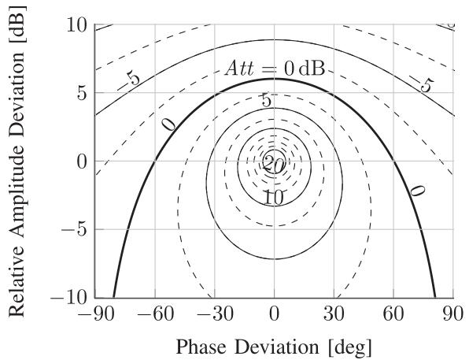  
Fig. 4. Attenuation contours depending on the relative deviations in amplitude $\Delta \bar { A } _ { \mathrm { r e l } }$ and deviation in phase $\Delta \bar { \phi }$ of a compensating sine.

is related to the power of the disturbance $d ( t )$ such that

$$
A t t = \frac {\frac {1}{T} \int_ {0} ^ {T} d ^ {2} (t) d t}{\frac {1}{T} \int_ {0} ^ {T} [ d (t) + y (t) ] ^ {2} d t}.\tag{16}
$$

Fig. 4 shows the attenuation of the sinusoid depending on the relative magnitude deviation $\Delta A _ { \mathrm { r e l } }$ and the phase deviation $\Delta \phi .$ For a desired attenuation of $A t t > 1 0 0 \widehat { \equiv } 2 0 \mathrm { d B }$ , the compensation signal $y ( n )$ needs to have a magnitude deviation $\Delta A _ { \mathrm { r e l } } < 1$ dB and a phase deviation $| \Delta \phi | < 6 ^ { \circ }$ . The lower bound for achieving attenuation at all is visible in the 0 dB contour. With perfect phase estimation $\Delta \phi = 0 ^ { \circ }$ , the relative amplitude deviation needs to be below $\Delta A _ { \mathrm { r e l } } \approx 6 \mathrm { d } \mathrm { B }$ . For perfect amplitude estimation $\Delta A _ { \mathrm { r e l } } = 0 ~ \mathrm { d B }$ , the phase deviation needs to be below $| \Delta \phi | = 6 0 ^ { \circ }$ . When the amplitude is underestimated, i.e., $\Delta A _ { \mathrm { r e l } } < 0$ dB, an attenuation can also be achieved for phase deviations larger than $| \Delta \phi | = 6 0 ^ { \circ }$ . This illustrates the high demands for accuracy that is needed for the compensation signal $y ( t )$

## E. Variations and Uncertainties of Acoustic Conditions

One major challenge for ANC headphones are the different acoustic conditions $( \mathrm { e . g . }$ . fitting, ear canal physiology, etc.) under which it should operate. These variations can change the transfer functions $P ( z ) , G ( z )$ and $F ( z )$ . In the following, typical conditions are explained and their influence is estimated based on a mathematical model.

The analysis of the acoustic primary path $P _ { \mathrm { A } } ( z )$ , which describes the transmission from outer to inner microphone, reveals a dependency on the direction-of-arrival (DOA) ofthe disturbing sound [6]. Fig. 5 shows the variation of the primary path of a Bose QC20 in-ear headphone without ANC electronics worn by a dummy head (HEAD Acoustics HMS II.3) for $N _ { \mathrm { d i r } } = 4 6 0 8$ different directions in elevation and azimuth. The primary paths were measured in a semi-anechoic chamber with a fast acquisition HRTF measurement system [14]. The dummy head was mounted at 2 m height, in distance of 1.2m for the loudspeakers. To speed up the measurements, the multiple exponential sweep method was used [15] with optimized sweep rates for the room and the loudspeaker array [16]. The measurements were performed at a sampling rate of $f _ { \mathrm { s } } = 4 8 ~ \mathrm { k H z }$ . To derive the primary path $P ( z )$ from the measurements, the FFT-based spectral division between outer and inner microphone spectra was applied. The variations, shown in Fig. 5 underline that strictly speaking the headphone design should consider the current direction-of-arrival as well as the fitting of the headphone to achieve optimal attenuation. However, this is so far an unsolved problem. For the secondary path $G ( z )$ , the variations also depend on the acoustic load coupled to the headphone. This, especially, includes the fitting with the associated leakage as well as the ear canal geometry. Both vary between different users, however, the fitting may also vary over time for one user. Fig. 6 shows the mean secondary path for different fittings, acquired from 23 subjects for both ears (46 measurements) during the listening test described in Section V. Fitting classes contain varying number of measurements. Apart from these use cases where the headphone was inserted into the ear, the plots also show handling cases that occur, e.g., during insertion of the headphone. The handling cases need to be tested for stability reasons, especially the case closed, e.g. during insertion, and the case open when the headphone is in free field conditions.

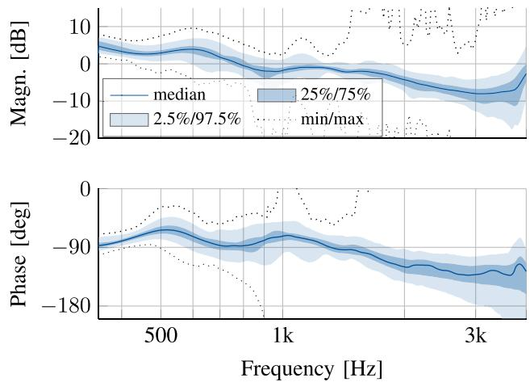

Fig. 5. Percentile plot of magnitude and phase of the primary path $P ( z )$ for ${ \tilde { N _ { \mathrm { d i r } } } } =$ 4608 different directions for the Bose QC20 in-ear headphone without ANC electronics worn by a dummy head [6].  
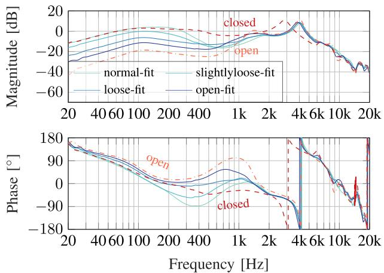  
Fig. 6. Mean secondary paths of 23 subjects for both ears (46 measurements) classified according to different fittings (different number of measurements per fitting).

These variations lead to uncertainties w.r.t. $P ( z )$ and $G ( z )$ which have a deteriorating effect on the ANC performance. They can formally be described by a deviation of the actual path $P ( z )$ from the nominal path $P _ { \mathrm { n } } ( z )$ , used for the designs of $W ( z )$ and $K ( z )$ . A convenient representation of this uncertainty is the multiplicative frequency-dependent deviations $\Delta _ { P } ( z )$ and $\Delta _ { G } ( z )$ by amplitude and phase. For the primary path this results in

$$
P (z) = \Delta A _ {P} (z) \cdot e ^ {j \Delta \varphi_ {P} (z)} \cdot P _ {\mathrm{n}} (z) = \Delta_ {P} (z) \cdot P _ {\mathrm{n}} (z),\tag{17}
$$

and for the secondary path this yields

$$
G (z) = \Delta A _ {G} (z) \cdot e ^ {j \Delta \varphi_ {G} (z)} \cdot G _ {\mathrm{n}} (z) = \Delta_ {G} (z) \cdot G _ {\mathrm{n}} (z).\tag{18}
$$

Inserting these expressions into (11) together with the optimum feedforward filter design $W ( z )$ in (12) results in:

$$
\frac {E (z)}{X (z)} = P (z) \cdot \frac {\left(1 - \frac {\Delta_ {G} (z)}{\Delta_ {P} (z)}\right)}{1 + \Delta_ {G} (z) G (z) K (z)}\tag{19}
$$

$$
= P (z) \cdot S (z) \cdot \left(1 - \frac {\Delta_ {G} (z)}{\Delta_ {P} (z)}\right),\tag{20}
$$

In order to achieve attenuation, the error signal $E ( z )$ needs to be smaller than the disturbance signal $X ( z )$ . Thus, the goal is to achieve $| \frac { E ( z ) } { X ( z ) } | < 1$ with $z = e ^ { \mathrm { j } \Omega }$ for all $\begin{array} { r } { \Omega = 2 \pi { \frac { f } { f _ { \mathrm { s } } } } } \end{array}$ where $f _ { \mathrm { s } }$ is the sampling frequency. Checking the numerator in (19), this results in

$$
\Leftrightarrow \left| P (z) \left(1 - \frac {\Delta_ {G} (z)}{\Delta_ {P} (z)}\right) \right| <   1\tag{21}
$$

$$
\stackrel {| P (z) | \neq 0} {\Rightarrow} \left| 1 - \frac {\Delta_ {G} (z)}{\Delta_ {P} (z)} \right| <   \left| \frac {1}{P (z)} \right|.\tag{22}
$$

For frequencies where $| P ( z ) |$ becomes large, $\big | \frac { 1 } { P ( z ) } \big |$ becomes small and therefore the ratio of the devations $\frac { \Delta _ { G } ( z ) } { \Delta _ { P } ( z ) }$ should approach 1 according to (22).

Considering the denominator in (19) as well, one can conclude that for all frequencies where the feedback controller $K ( z )$ achieves attenuation $( | S ( z ) | < 1 )$ , it also reduces the influences of the deviation in the numerator. For frequencies where the feedback controller results in an amplification $( | S ( z ) | > 1 )$ , the influence of the deviations in $P ( z )$ and $G ( z )$ becomes worse.

An approach to account for these variations is to adapt the coefficients of $W ( z )$ and $K ( z )$ to the current acoustic conditions [17]. Fully adaptive systems, which not only switch between different filter sets, are currently rarely found in products, due to limited capabilities of the digital signal processors used in headsets. Therefore, solutions with time-variant filters $W ( z )$ and $K ( z )$ are not considered further here.

## III. THE OCCLUSION EFFECT

Following the explanation of the principles of ANC, we are now further observing the problem addressed in this article, the occlusion effect (OE). The OE is perceived subjective as a boomy sensation of one’s own voice or like talking in a barrel. Objectively, there is an audiological and a technical understanding [18]. The audiological understanding only considers the amplification of body-conducted sounds at low frequencies, whereas the technical understanding considers the attenuation of air-conducted sounds in addition. Investigation of this effect ${ \bf g 0 }$ back to as far as 1965 [19] and has been subject to a wide range of publications and discussions [4], [20].

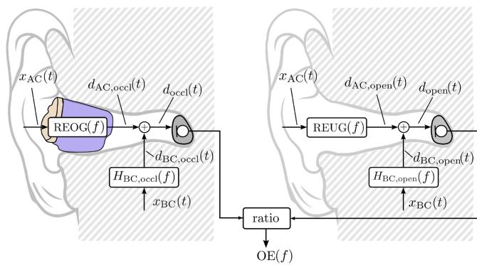  
Fig. 7. OE measurement approach at two different times, once occluded and once open.

## A. Measurements

Measuring the OE frequency characteristics $O E ( f )$ of one’s own voice is not straightforward. The excitation signal used for its measurement is a self-vocalized sound. One would desire a broadband excitation in order to acquire a good estimate of $O E ( f )$ . Typical approaches involve vocalization of single phones such as [i:], sweeping a phone from low to high frequencies or reading a standardized text to acquire an average OE. An alternative is using a bone-conduction transducer, which couples vibration into the body.

Strictly speaking, $O E ( f )$ would be the ratio between the measured magnitude spectra at the eardrum for the open case $D _ { \mathrm { o p e n } } ( f )$ and the occluded case $D _ { \mathrm { o c c l } } ( f )$ . The procedure is visualized in Fig. 7. The frequency-dependent occlusion effect $O E ( f )$ could then be formulated as (dependency on $( f )$ is left out for readability):

$$
O E = \frac {\left| D _ {\mathrm{occl}} \right|}{\left| D _ {\mathrm{open}} \right|} = \frac {\left| \mathrm{REOG} \cdot X _ {\mathrm{AC}} + H _ {\mathrm{BC,occl}} \cdot X _ {\mathrm{BC}} \right|}{\left| \mathrm{REUG} \cdot X _ {\mathrm{AC}} + H _ {\mathrm{BC,open}} \cdot X _ {\mathrm{BC}} \right|},\tag{23}
$$

with the air-conducted (AC) component $X _ { \mathrm { A C } } ( f )$ and the bodyconducted (BC) component $X _ { \mathrm { B C } } ( f )$ of one’s own voice. The transmission from a reference point in front of the ear to the eardum is described by the real-ear occluded gain $\operatorname { R E O G } ( f )$ for an occluded ear and the real-ear unoccluded gain REUG(f) for an open ear. Similarily, the BC sound transmission for occluded and open case are described by $H _ { \mathrm { B C , o c c l } } ( f )$ and $H _ { \mathrm { B C , o p e n } } ( f )$ respectively. Strictly speaking, these two measurements would require the exact repeatibility of the excitation signal, which cannot be assured with voice sounds produced by test persons.

To assure a reliable and consistent estimate, the measurement is typically done with an inner and an outer microphone, which record the own voice sounds simultaneously. Fig. 8 visualizes this measurement technique, including the involved transfer functions. The resulting measurable occlusionfunction $\widetilde { O E } ( f )$ is determined by relating the magnitude spectra of the inner and outer microphone signals $e ( t )$ and $x ( t )$ (dependency on $( f )$ is left out for readability) [5]:

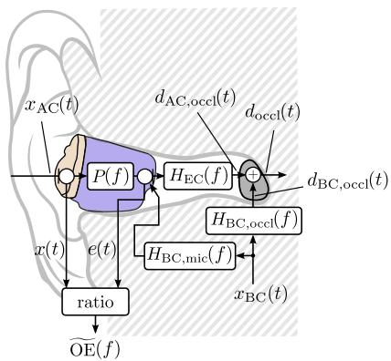

Fig. 8. OE measurement approach with inner and outer microphone.  
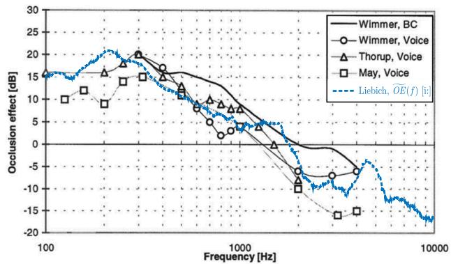  
Fig. 9. Occlusion effect measurements $\widetilde { O E }$ from various studies with vocalized or bone transducer excitation [22], overlayed with own measurement of one subject vocalizing an [i:] (blue dashed line) wearing a deactivated Bose QC20.

$$
\widetilde {O E} = \frac {| E |}{| X |} = \frac {| P \cdot X _ {\mathrm{AC}} + H _ {\mathrm{BC,mic}} \cdot X _ {\mathrm{BC}} |}{| X _ {\mathrm{AC}} |},\tag{24}
$$

with the primary path $P ( f )$ , the transfer function between outer and inner microphone, and the transfer function $H _ { \mathrm { B C , m i c } } ( f )$ from the BC signal $x _ { \mathrm { B C } } ( t )$ to the inner microphone. This method is widely used in the field of hearing aids, often with two probe microphones, one bypassing the earpiece to record the in-ear signal and one fixed outside [3].

Two assumptions are made when acquiring $\widetilde { O E } ( f )$ as described in (24), rather than $O E ( f )$ , as indicated in (23). First, the body-conducted sound component in the open ear canal is neglected $( H _ { \mathrm { B C , o p e n } } ( f ) \cdot X _ { \mathrm { B C } } ( f ) \approx 0 )$ . According to [21], the magnitude response of the BC component in the open ear is by 15–40 dB lower than the magnitude response of the AC component in the range from 300 Hz to 6 kHz. Therefore, this is a valid assumption. Second, the transfer function between inner microphone and eardrum is neglected $( H _ { \mathrm { E C } } \approx 1 )$ . This assumption ignores resonance characteristics of the open ear canal, which are typically in the range of 2 – 3 kHz [20]. Thus, $\widetilde { O E } ( f )$ provides a reasonable estimate of $O E ( f )$ for the frequencies below the resonance, which are most significant for low frequency amplificiation due to occlusion. Fig. 9 compares measurements of the occlusion effect from various studies and one own $\widetilde { O E } ( f )$ measurement based on the inner and outer microphone signal (according to Fig. 8) of a deactivated Bose QC20 (blue dashed line). The studies had the following setups: Wimmer [23]: 4 subjects, ear impression material full concha earmold, Thorup [24]: 16 subjects, acrylic full concha earmold, May [25]: 10 subjects, skeleton earmold. All measurements show the typical low frequency amplification and the high frequency attenuation.

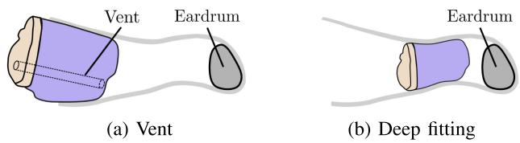  
Fig. 10. Passive occlusion reduction approaches for hearing aids.

## B. Passive Approaches for OE Reduction

Hearing aid manufacturers apply two passive approaches to reduce the occlusion effect, a ventilation hole in the earmold (see Fig. 10(a)), typically known as vent, which for very large dimensions corresponds to an open fitting hearing aid, and deep fitting (see Fig. 10(b)). Vents tackle the occlusion effect by changing the acoustic impedance $Z _ { \mathrm { o c c l } } ( f )$ of the occluded ear canal to closer match the open ear canal $Z _ { \mathrm { o p e n } } ( f )$ . However, they suffer from an increased risk of acoustic feedback and the signficantly reduced energy a loudspeaker can provide at low frequencies. With deep fitting, the device covers the vibrating part of the ear canal walls, the cartilaginous part and, thus, mainly tackles the source for the body-conducted sound inside the ear canal. It prevents body-conducted sound to a large extend from entering the occluded ear canal and therefore reduces the amplification of low frequency components. Hearing aid manufacturers have investigated and launched a few products with this technique, however, users often complain about physical discomfort created by the device. An overview of these passive measures is, e.g., given in [4].

## IV. APPROACHES FOR OCCLUSION EFFECT CANCELLATION(OEC)

For solving the OE problem we now exploit ANC methods as introduced in Section II.

From a signal processing perspective, the OE can be separated into two subproblems. Body-conducted sounds are amplified by the occlusion, mainly affecting low frequency components. Airconducted sounds are attenuated through the earpiece, especially at high frequencies. In the following, an active approach called occlusion effect cancellation (OEC) is presented, which tackles these problems by a compensation signal y(n).

## A. Concept

In the following, an OE cancellation approach is presented using combined feedforward-feedback control for tackling both problems, the amplified BC sounds and the attenuated AC sounds [5]. The problem of the amplified BC sounds $d _ { \mathrm { B C } } ( n )$ requires attenuation of sound pressure within the ear canal.

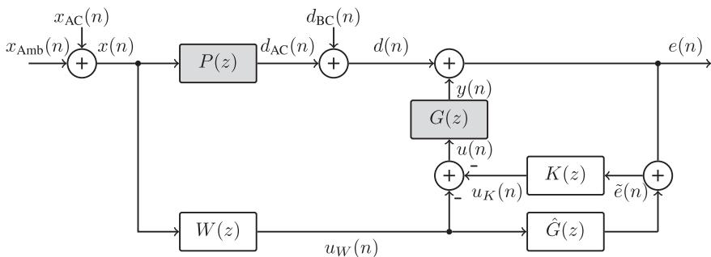  
Fig. 11. Basic structure for occlusion effect cancellation (OEC) with feedback controller input correction by $u _ { W } ( n ) * G [ n ] ( n )$ $W ( z ) { \mathrm { ; } }$ : Feedforward filter, $K ( z ) { \mathrm { ; } }$ : Feedback controller, $P ( z )$ : Primary path, $G ( z )$ : Secondary path, $\hat { G } ( z )$ : Correction filter.

This can be achieved with a feedback control system. It uses an inner microphone to acquire information about amplified components. The problem of attenuated AC sounds of one’s own voice $x _ { \mathrm { A C } } ( n )$ , is solved using an outer microphone and a feedforward filter $W ( z )$ . This solution is typically known as hear-through or transparency. A discrete-time model of the approach is shown in Fig. 11. Note the similarity with the combined feedforward-feedback ANC structure shown in Fig. 3. The outer microphone captures the combination of the air-conducted own voice sound $x _ { \mathrm { A C } } ( n )$ and ambient sound $x _ { \mathrm { A m b } } ( n )$ as

$$
x (n) = x _ {\mathrm{AC}} (n) + x _ {\mathrm{Amb}} (n).\tag{25}
$$

This signal experiences the passive attenuation via the primary path $P ( z )$ and is combined with the BC sounds of the own voice as $d ( n ) = d _ { \mathrm { A C } } ( n ) + d _ { \mathrm { B C } } ( n )$ . This signal $d ( n )$ interferes with a control signal $u ( n )$ that is filtered with the secondary path $G ( z )$ to create the compensation signal $y ( n )$ . The control signal $u ( n )$ is calculated by combining and inverting a hear-through signal $u _ { W } ( n )$ and the feedback control signal $u _ { K } ( n )$ . The hear-through signal $u _ { W } ( n )$ is created by filtering the outer microphone signal $x ( n )$ with the hear-through filter $W ( z )$ . In order to decouple the feedback attenuation of the BC components and the hearthrough equalization of the AC components as much as possible, a correction filter $\hat { G } ( z )$ is inserted in Fig. 11. The insertion of the correction filter is the main difference in comparison to Fig. 3. The feedback control signal $u _ { K } ( n )$ is created by a corrected version of the inner microphone signal $e ( n )$ . The corrected error signal $\tilde { e } ( n )$ equals the sum of the error signal $e ( n )$ and the correction hear-through signal, which is $u _ { W } ( n )$ filtered with the correction filter $\boldsymbol { \hat { G } } ( \boldsymbol { z } )$ . A comparable correction filter $\hat { G } ( z )$ has been proposed by Kuo in [17] in chapter 6.6.1 embedded in a hybrid feedforward-feedback system. However, in Kuo’s book, the input of the correction filter $\hat { G } ( z )$ is not the hear-through signal $u _ { W } ( n )$ , but the control signal $u ( n )$ . It also decouples the feedforward filtering (here hear-through) from the feedback loop, but alters the feedback loop behavior, which requires a different feedback controller. The overall transfer function for Fig. 11 yields (dependency on (z) is left out for readability)

$$
E = \underbrace {X \left(\frac {P}{1 + K G}\right)} _ {\text { primary   AC   contr. }} - \underbrace {X \left(G W \frac {1 + K \hat {G}}{1 + K G}\right)} _ {\text { equalized   AC   contr. }} + \underbrace {D _ {\mathrm{BC}} \left(\frac {1}{1 + K G}\right)} _ {\text { BC   contr. }}\tag{26}
$$

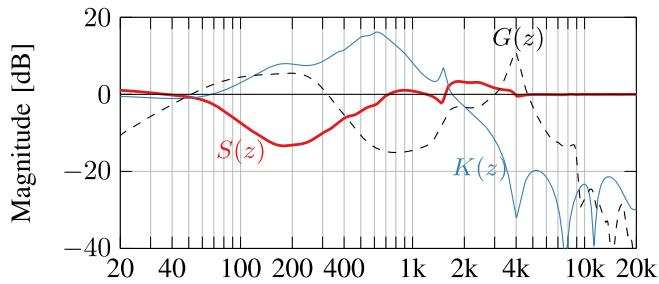  
Fig. 12. Feedback controller $K ( z )$ and sensitivity $S ( z )$

The first two terms describe the air-conducted contribution $X ( z )$ , while the third term describes the body-conducted contribution $D _ { \mathrm { B C } } ( z )$ . The design of the hear-through filter $W ( z )$ can be decoupled from the feedback controller $K ( z )$ if the correction filter fulfills the condition ${ \hat { G } } ( z ) = G ( z )$ , as visible in the second term in (26). This decoupling by the change in the numerator from $P - G W$ in (11) to $P - G W ( 1 + K { \hat { G } } )$ in (26) is the major advantage ofthis new structure. The body-conducted contribution $D _ { \mathrm { B C } }$ is attenuated by the feedback loop only. Note that the primary air-conducted contribution, the first term in (26), is both influenced (and mainly attenuated) by the primary path $P ( z )$ as well as by feedback loop. Therefore, it can be neglected for the perception.

## B. Feedback Controller Design $K ( z )$

We are first considering the feedback controller $K ( z )$ , for compensating the amplified low frequency components of the occlusion effect shown in Fig. 9. A dedicated OEC design procedure for $K ( z )$ uses robust control design methods, specifically the $\mathcal { H } _ { \infty }$ -controller synthesis [26]. The resulting feedback controller $K ( z )$ is shown together with the sensitivity $S ( z )$ and the underlying secondary path $G ( z )$ in Fig. 12. Fig. 12 gives some idea how the feedback controller $K ( z )$ and the secondary path $G ( z )$ interact with each other to achieve the sensitivity $S ( z )$ . This sensitivity shows the desired attenuation in the low frequency range 50–700 Hz, where the occlusion effect is most prominent, as shown in the $\widetilde { O E } ( f )$ measurement in Fig. 9. Furthermore, some slight unavoidable amplification is observed in the range 1.5–4 kHz, due to the waterbed effect [27]. This amplification is not critical and is taken into account in the design of the filter $W ( z )$

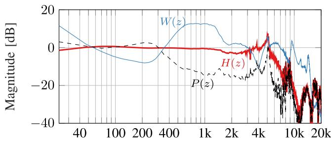  
Fig. 13. Hear-through filter $W ( z )$ and the resulting overall transfer function $\bar { H ( z ) }$

## C. Hear-Through Filter Design $W ( z )$

Overall, the feedforward-feedback control structure of Occlusion Effect Cancellation (OEC) is similar to the Active Noise Cancellation (ANC). However, where ANC aims at silence, OEC aims at natural own voice perception. The objective of the hear-through filter design is a transparent transmission of air-conducted sounds, including both $x _ { \mathrm { A C } } ( n ) x _ { \mathrm { A m b } } ( n ) [ 5 ] , [ 2 8 ]$ Therefore, the target transfer function from outer microphone signal to inner microphone signal is should be chosen to $\begin{array} { r } { \frac { E } { X } \stackrel { ! } { = } } \end{array}$ $z ^ { - \tau }$ . Using ${ \hat { G } } ( z ) = G ( z )$ , this results in the following filter design specifications:

$$
W (z) = \frac {P (z) S (z) - z ^ {- \tau}}{G (z)}.\tag{27}
$$

$W ( z )$ can be realized for a given $P ( z ) , G ( z )$ and $K ( z )$ with the Wiener Hopf equation by replacing the impulse response vector $_ p$ in (13) with a vector r containing the impulse response of length L of $R ( z ) = P ( z ) S ( z ) - z ^ { - \tau } \ [ 5 ]$ . Fig. 13 shows the hear-through filter $W ( z )$ with the primary path $P ( z )$ as reference. In addition, the overall transfer function $H ( z )$ including the correction filter $\hat { G } ( z )$ is given by

$$
H (z) = \frac {E (z)}{X (z)} = \frac {P (z) - G (z) W (z) (1 + K (z) \hat {G} (z))}{1 + K (z) G (z)}\tag{28}
$$

$$
\stackrel {\hat {G} (z) = G (z)} {=} P (z) S (z) - G (z) W (z).\tag{29}
$$

Comparing the hear-through filter $W ( z )$ and the primary path $P ( z )$ in Fig. 13, one can see that $W ( z )$ is qualitatively inverse to $P ( z )$ for a wide frequency range. Thus, $W ( z )$ amplifies the previously attenuated air-conducted frequency components.

## D. Adaptive Factor αfor Feedback Control

The robust feedback controller $K ( z )$ is designed as a timeinvariant filter considering predefined uncertainty bounds. However, in practical applications, the individual paths $P ( z )$ and $G ( z )$ vary and may not exploit or may even surpass the uncertainty bounds. Therefore, some adaptivity is introduced for fine-tuning individual performance and for increasing stability depending on the current situation. The adaptivity is realized as an adaptive factor α [5]. It scales the feedback loop gain by a factor $\alpha$ based on the correlation between the corrected error signal $\tilde { e } ( n )$ and an estimated compensation signal ${ \hat { y } } ( n ) =$ ${ \hat { g } } ( n ) * u _ { K } ( n )$ , calculated in the background. We estimate the correlation $\varphi _ { e \hat { y } } ( n , \kappa ) = \mathrm { E } \{ e ( n ) \cdot \hat { y } ( n - \kappa ) \}$ } for lag zero $( \kappa =$

0) by a first order IIR filter (exponential smoother) with the smoothing parameter $\beta ( { \bf e . g . } \ \beta = 0 . 9 9 9$ at $f _ { s } = 4 8$ kHz):

$$
\hat {\varphi} _ {e \hat {y}} (n) = \beta \cdot \hat {\varphi} _ {e \hat {y}} (n - 1) + (1 - \beta) \cdot e (n) \cdot \hat {y} (n).\tag{30}
$$

This provides a measure for the similarity of error $e ( n )$ and estimated compensation signal ${ \hat { y } } ( n )$ . For calculating the adaptive factor $\alpha$ the cross-correlation is normalized by the, similarily estimated, autocorrelations $\hat { \varphi } _ { e e } ( n )$ and $\hat { \varphi } _ { \hat { y } \hat { y } } ( n )$

$$
\alpha = 1 - \frac {\hat {\varphi} _ {e \hat {y}} (n)}{\sqrt {\hat {\varphi} _ {e e} (n) \hat {\varphi} _ {\hat {y} \hat {y}} (n)}} = 1 - \hat {\Psi} _ {e \hat {y}} (n).\tag{31}
$$

Using this, values are restricted $\mathrm { t o - 1 } \leq \hat { \Psi } _ { e \hat { y } } ( n ) \leq 1$ and thus $0 \leq \alpha \leq 2$ . The structural integration is visualized in Fig. 14 for an adjustable system introduced in the next subsection. Fig. 15 shows the influence of α on the sensitivity $S _ { \alpha } ( z ) =$ $\frac { 1 } { 1 + G ( z ) \alpha K ( z ) }$ of the feedback loop. The adaptive factor improves stability for $0 \leq \alpha < 1$ and increases performance for $1 < \alpha \leq 2$ of the feedback control loop.

## E. Adjustment for Personal Preference

Measurements of the occlusion effect typically show a certain degree ofvariations. These variations depend on parameters such as earpiece fitting, the physiological geometry of the individual ear canal and certainly also on parameters such as pitch frequency. Therefore, fine-tuning the OEC system according to personal perception is desired. Fig. 14 shows an adjustable OEC system, including the three manual gains $g _ { \mathrm { F B } } , g _ { \mathrm { H T } }$ and $g _ { \mathrm { A } }$ They individually control the different sound contributions to the users perception, with $g _ { \mathrm { F B } }$ influencing the attenuation of bodyconducted sound, gHT adjusting the perception of air-conducted sounds and $g _ { \mathrm { A } }$ controlling the level of audio signal $a ( n )$ $\mathrm { e . g . }$ music or voice calls. The structure is an improved version of Fig. 11.

Including an audio signal $a ( n )$ with a compensation filter $\hat { G } ( z )$ has previously been proposed by Foo in [29], where he used it to compensate the influence of an adaptive feedback controller on an audio signal $a ( n )$ . This approach decouples the audio signal from the feedback controller. However, the applied feedback structure requires in comparison to our approach a different feedback controller, which is the same as in the hybrid ANC system in [17]. Furthermore, Foo’s proposal does not include a feedforward component for the external signal $x ( n )$

The overall transmission for the system in Fig. 14 from $x ( n ) , d _ { \mathrm { B C } } ( n )$ and $a ( n )$ to the error signal $e ( n )$ is described by the following equation (leaving out the dependency on z for readability):

$$
\begin{array}{l} E = \underbrace {X \left(\frac {P}{1 + g _ {\mathrm{FB}} K \alpha G}\right)} _ {\text { primary   contribution }} - \underbrace {X \left(g _ {\mathrm{HT}} G W \frac {1 + g _ {\mathrm{FB}} K \alpha \hat {G}}{1 + g _ {\mathrm{FB}} K \alpha G}\right)} _ {\text { equalized   contribution }} \\ + \underbrace {D _ {\mathrm{BC}} \left(\frac {1}{1 + g _ {\mathrm{FB}} K \alpha G}\right)} _ {\text { body - conducted   contribution }} + \underbrace {A \left(g _ {\mathrm{A}} G W _ {\mathrm{a}} \frac {1 + g _ {\mathrm{FB}} K \alpha \hat {G}}{1 + g _ {\mathrm{FB}} K \alpha G}\right)} _ {\text { desired   audio   contribution }} \end{array} \tag {32}\tag{32}
$$

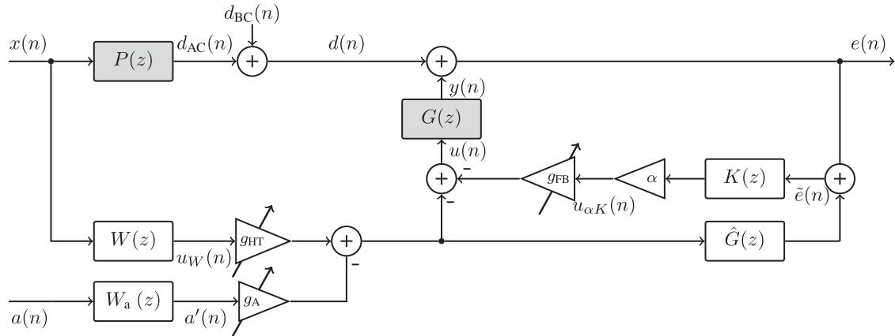  
Fig. 14. Adjustable occlusion effect cancellation system.

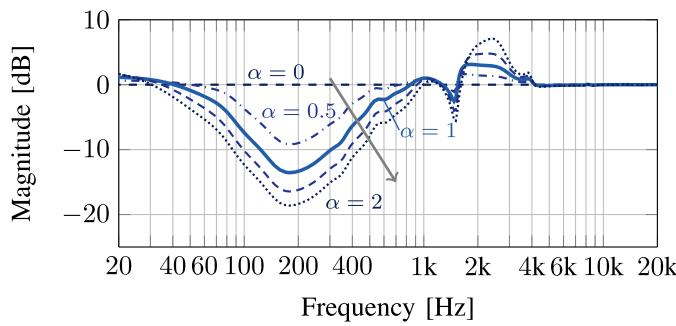  
Fig. 15. Influence of the adaptive factor α on the sensitivity $S ( z )$ for an example design of $K ( z )$ and a plant G(z) measured with the real-time system.

Note the similarity to (26) and that for ${ \hat { G } } ( z ) = G ( z )$ the feedback controller $K ( z )$ has no influence on the equalized contribution by $g _ { \mathrm { H T } } X ( z ) G ( z ) W ( z )$ as well as on the desired audio contribution by $g _ { \mathrm { A } } A ( z ) G ( z ) W _ { \mathrm { a } } ( z )$ . This structure is used for the evaluation in Section V.

## F. Design of Audio Equalizer $W _ { \mathrm { a } }$

The filter $W _ { \mathrm { a } } ( z )$ is an equalization filter for the audio signal $a ( n )$ , which is designed for a desired frequency characteristic $U ( z ) , \mathrm { e . g }$ . flat magnitude response, bass boost or the Harman curve [30].

$$
g _ {\mathrm{A}} G W _ {\mathrm{a}} \frac {1 + g _ {\mathrm{FB}} K \alpha \hat {G}}{1 + g _ {\mathrm{FB}} K \alpha G} \stackrel {!} {=} U\tag{33}
$$

Solving this equation for $W _ { \mathrm { a } }$ results in

$$
W _ {\mathrm{a}} = \frac {U}{g _ {\mathrm{A}} G} \cdot \frac {1 + g _ {\mathrm{FB}} K \alpha G}{1 + g _ {\mathrm{FB}} K \alpha \hat {G}}\tag{34}
$$

and for $\hat { G } = G$ and $g _ { \mathrm { A } } = 1$ this collapses to

$$
W _ {\mathrm{a}} = \frac {U}{G}.\tag{35}
$$

Note that this is the theoretical target function and designing a realizable filter requires some approximation, especially of the term $G ^ { - 1 }$ , as $G ( z )$ might have non-minimum phase and/or notches. This can, e.g., be achieved by adopting (13).

A related paper is [31] which also applies to the audio signal $a ( n )$ a correction filter, which is based on a secondary path estimate $\hat { G } ( z )$ . However, this takes place in the background as the audio signal $a ( n )$ , which is fed to the loudspeakers is not processed by the ANC filters. The secondary path estimate $\hat { G } ( z )$ is only used to cancel the influence of the audio signal $a ( n )$ on the adaptation of the feedforward ANC filters.

## G. Switching Between ANC and OEC

The signal processing principles used for ANC and OEC are very similar. The targets, however, of the two approaches differ substantially. Noise cancellation aims to attenuate and suppress all ambient sounds. Occlusion effect cancellation aims to provide natural perception of one’s own voice and ambient sounds. Both systems ideally use a combination of a feedback filter $K ( z )$ using an inner microphone signal $e ( n )$ and a feedforward filter $W ( z )$ using an outer microphone signal $x ( n )$ to calculate a control signal $u ( n )$

In an ANC system, the feedback controller $K _ { \mathrm { A N C } } ( z )$ aims at the highest possible feedback loop gain and thus a resulting maximum attenuation $| S ( z ) |$ in a desired frequency range. The feedforward filter $W ( z )$ should create a control signal $u _ { W } ( n )$ that exactly matches the magnitude and the inverse phase of the ambient sound signal inside the ear canal.

In an OEC system, the feedback controller $K _ { \mathrm { O E C } } ( z )$ should attenuate sound within the ear canal and specifically the sensitivity $S ( z )$ should correspond to the inverse of the occlusion function $\overset { \sim } { O E } ( z )$ to solve amplification of the occlusion effect [26]. The feedforward filter $W ( z )$ of the OEC system, the hear-through, is designed to provide transparent transmission via the earpiece.

The system as shown in Fig. 14 can be switched between the operation modes ANC and OEC by exchanging filter coefficients as indicated in Table 1. Both systems require similar ultra-low latency processing in the range of $2 0 { - } 4 0 ~ \mu \mathrm { s }$

## H. Literature Review

In the field of active noise and active occlusion cancellation, a lot of research is done by industry, as it is directly linked to products such as hearing aids or headphones for virtual reality.

TABLE I  
SWITCHING THE SYSTEM IN FIG. 14 BETWEEN ANC AND OEC

<table><tr><td rowspan="2" colspan="2"></td><td colspan="2">Operation Mode</td></tr><tr><td>ANC</td><td>OEC</td></tr><tr><td rowspan="3">Filter</td><td>W(z)</td><td> $\frac{P(z)}{G(z)}$ </td><td> $\frac{P(z)S(z)-z^{-\tau}}{G(z)}$ </td></tr><tr><td>K(z)</td><td> $K_{\text{ANC}}(z)$ </td><td> $K_{\text{OEC}}(z)$ </td></tr><tr><td> $\hat{G}(z)$ </td><td>0</td><td>G(z)</td></tr></table>

Therefore, details of working solutions are often not published. This brief overview presents the accessible and well described results in the area ofactive occlusion effect cancellation. In 2004, Mejia, Dillon and Fisher claimed an acoustically transparent occlusion reduction system [32]. They described a feedback control approach, either fixed or adaptive, with a digital implementation using oversampling to achieve low latency. The results were published in 2008 in a broader journal article [33]. In 2010, Zurbrügg and Stirnemann investigated a feedback controller for reducing vibrations within the ear canal as well as decreasing the variation of the secondary path [34]. They used a simple time-invariant 2nd order phase-lag filter. Zurbrügg summarized his work in his dissertation [3], including a comprehensive description of physical modeling of the occlusion effect [35] as well as a fixed feedback controller approach with an extensive evaluation within a listening test [36]. In 2013 Borges et al. published a paper describing an adaptive feedback control system based on the LMS algorithm [37]. They also included an equalized hear-through signal and demonstrated the subjective improvement in a listening test. At roughly the same time, Bernier and Voix investigated an active hearing protection for musicians, see [38] and [39]. The authors incorporated an analog lead lag feedback controller for the occlusion reduction. In these publications, they did not indicate the design methods, neither for the occlusion reduction nor for the hear-through with adjustable attenuation. For the analog feedback controller, an adjustment of the loop gain was possible. This limits the capabilities ofindividualizing the occlusion reduction. Sunohara et al. (RION) focused on a specific balanced armature (BA) driver design, with a stacked miniature microphone to minimize the group delay [40], [41]. They also proposed an algorithm to avoid clipping artifacts, when the BA driver is overloaded. Borges further investigated the possibility of cancelling the occlusion effect by a feedforward approach in [42] and [43]. He is considering a model for transmission of speech via AC and via BC sound and uses an adaptive feedforward ANC approach to cancel the occlusion effect. In his contribution he described the filter design, implemented the solution on DSP and conducted a small listening test, which indicated an improvement of own voice perception. Similar to Bernier et al., Albrecht et al. worked on a active hearing protection for musicians with an integrated OEC system [44]. They used an analog second-order low-pass filter with a cut-off frequency of 1.1 kHz for the feedback loop. They included two sources for the outer signal: binaural microphones attached to the outside of the headphone, and monitor microphones attached to the instrument. The binaural microphones are equalized considering the loudspeaker characteristic, the passive attenuation of the earpiece as well as the shift in the resonances. For the monitor microphones, the loudspeaker characteristic and as well as HRTF and reverberation filter were considered. The HRTF provides a better perception of direction as well as a natural coloration of the signal. The reverberation especially helps with externalization the of monitor signal. All filters where hand-tuned. The overall system was evaluated with seven professional musicians.

Concerning the attenuated air-conducted sounds, various researchers are focusing on the implementation of hear-through filters. The main fields, where this research resides is for hearing aids as well as for acoustic virtual reality. An example is the group from Oldenburg [45], [28], the group of Prof. Gan [46] or the group from Aalto university [47]. Often, the hear-through solutions deal with an approach to avoid comb-filter effects due to latency of the digital signal processing system. Ultra-low latency DSPs, which are the basis for ANC headphones and are used in this thesis, mitigate these problems and lead to neglectable comb-filter effects.

## V. EVALUATION

The following section shows subjective ratings and objective measurements of the OEC system as well as an evaluation of different ANC operation modes, which can be activated by exchanging filter coefficients according to Table I. Based on observing capabilites of integrated circuits for ANC headphones (e.g. ADI ADAU 1777), the complexity of the presented approaches is comparable to current state of the art solutions in leading industry products.

## A. OEC Performance

For the evaluation of the OEC approach, the authors conducted a listening test with 23 participants (normal-hearing, 20 male, 3 female) ages ranging from 21 to 61 with an average of 31. The test’s design was previously described in [3]. The formal test as reported below was conducted with a dSPACE DS1005 real-time system with the DS2004 and DS2102 extension boards. In addition, informal listening tests were carried out with a real-time implementation on the Analog Devices ADAU 1777 signal processing chip. The presented evaluation results are partly taken from [5]. The test is designed as a full factorial paired comparison scaling test, where participants rated the naturalness of their own voice while reading three standardized sentences aloud (sa1, sx32, and sx198 from the TIMIT acoustic-phonetic speech corpus [48]). The listening test was conducted in an acoustic booth (STUDIOBOX Premium) with an average attenuation from outside to inside of 44dB. The test consisted of three parts.

In part one (T1) of the test, four different settings (see Table I) of the OEC system were evaluated.

The two components that can be activated separately are the hear-through (HT), which uses the outer microphone to reamplify higher frequencies of air-conducted sounds, and feedback control (FB), using the inner microphone to attenuate lower frequencies mainly of body-conducted sounds. For each comparison, they were asked to rate the own voice naturalness on a 5-point Likert scale from -2 to +2. In total, the participants had to do 12 comparisons in a blind, randomized fashion. To acquire the mean score distance with respect to the reference, here, the off-case, an over-determined set of 12 linear equations, was compiled for each participant and solved via least squares. The statistical significance of the differences in rating was tested by multiple paired t-tests.

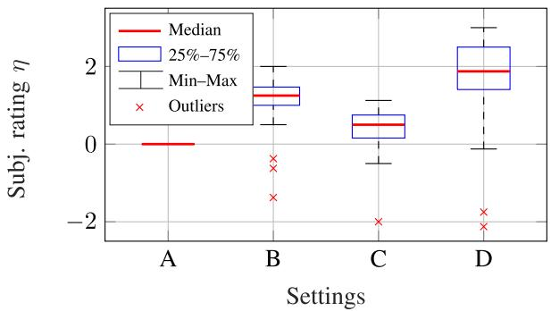  
(a) (T1) with default settings for all participants.

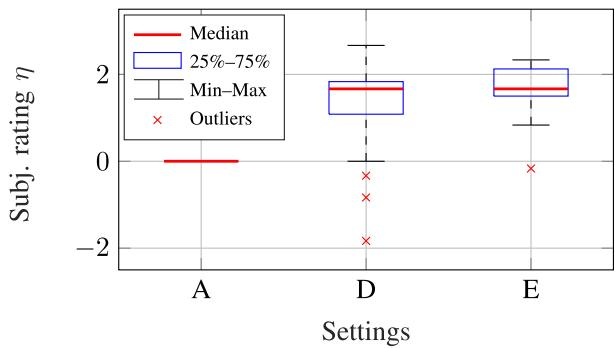  
(b) (T2) including individually tuned setting E.  
Fig. 16. Scores from part (T1) and (T2) of the listening test [5]. Settings A – D according to Table 2 Ratings: 0=equal, 1=better, 2=much better

TABLE II  
CONDITIONS EVALUATED IN THE FIRST PART OF THE LISTENING TEST

<table><tr><td rowspan="2" colspan="2"></td><td colspan="2">Hear-Through</td></tr><tr><td>off</td><td>on</td></tr><tr><td rowspan="2">FB</td><td>off</td><td>A</td><td>B</td></tr><tr><td>on</td><td>C</td><td>D</td></tr></table>

In part two (T2), the occlusion effect cancellation system was fine tuned by the participants by individually adjusting the hear-through gain $( g _ { \mathrm { H T } } )$ and the feedback loop gain $( g _ { \mathrm { F B } } )$ . After the participants found their preferred configuration, they did another randomized, blind-paired comparison test between this new setting E and the default settings A and D.

In part three (T3), objective measurements of the occlusion function $\widetilde { O E } ( f )$ were done by recording the inner and outer microphone signal. The participants read a standardized text (sa1, sx32, and sx198 from the TIMIT acoustic-phonetic speech corpus [48]) while the signals were recorded for each of the five settings. In total 46 different $\widetilde { O E } ( f )$ were calculated for each of the five settings.

The system parameters for the listening test were: sampling rate $f _ { \mathrm { s } } = 4 8$ kHz, smoothing factor of the adaptive factor $\beta =$ 0.999 and adaptive factor boundaries $0 \leq \alpha \leq 2$ . For the settings A–D the feedback loop gain and the hear-through gain were set to gFB = 1 and $g _ { \mathrm { H T } } = 1$ , respectively.

1) Subjective Evaluation of OEC: The results of the subjective ratings in parts (T1) and (T2) are shown in the two boxplots in Fig. 16(a) and Fig. 16(b). For more information about t-tests and the p-value the interested reader is referred to [49]. Fig. 16(a) visualizes the subjective ratings for the default settings B, C and D w.r.t. reference A as a boxplot. Activating the hear-through in setting B was rated to significantly improve the naturalness of one’s own voice (mean score increase $\overline { { \Delta \eta } } = 1 . 0 2$ p-value $< 0 . 0 0 0 0 0 5 )$ . 20 out of 23 subject rated setting B higher than A. Only activating the feedback controller in setting C resulted only in a marginal higher rating than for A $( \overline { { \Delta { \eta } } } = 0 . 3 7 0$ $p \mathrm { - v a l u e < 0 . 0 1 2 7 ) }$ . Combining hear-through and feedback functionality in setting D, another significant increase in the rating over the hear-through setting B is achieved $( \overline { { \Delta \eta } } = 0 . 5 7 6 .$ $p \mathrm { - v a l u e < 0 . 0 0 8 ) }$ . 18 out of 23 subjects rated setting D higher than B. The overall improvement of setting D over A results in significant improvement $( \overline { { \Delta \eta } } = 1 . 5 9 2 , p \mathrm { - v a l u e < 0 . 0 0 0 0 0 8 ) }$ .

Fig. 16(b) shows the results of part (T2) and the effect of the individual tuning (setting E). Here only setting A, D and E were compared. The improvement from A to D is consistent with test (T1) $( \overline { { \Delta \eta } } = 1 . 2 9 $ , p-value $< 0 . 0 0 0 0 0 8 )$ . With fine tuning by the participants (setting E) another signficant increase in naturalness can be achieved $( \overline { { \Delta \eta } } = 0 . 3 7 7 , p \mathrm { - v a l u e < 0 . 0 2 7 ) }$ , where 16 out of 23 subjects rated setting E higher than D. Overall, 22 out of 23 subjects rated setting E higher than A with significant improvements in score $( \overline { { \Delta \eta } } = 1 . 6 6 7 , p \mathrm { - v a l u e < 9 \cdot 1 0 ^ { - 1 3 } ) }$ .

The results of the subjective ratings indicate that only solving the problem of amplified body-conducted sounds via the feedback controller and not talking care of attenuated air-conducted sound via the hear-through (setting C) - does not achieve natural own voice perception. Only when combining both components and carefully balancing them (setting E), the naturalness can be approached. An additional psychological benefit due to the self tuned settings cannot be completely precluded, although the paired comparison was still randomized and blind.

For the few outliers which are visible in the box plots, two reasons could be identified. First, the hear-through (setting B, D, E) introduced some audible noise, especially in comparison to the off-case (setting A), where the system was deactivated. This noise likely results from the limited dynamic range of the ADCs (16bits) and microphone amplifiers in the dSPACE system. The high frequency boost of the hear-through filtering renders this noise more audible. Second, the gain of the feedback loop turned out to be too large for two of the subjects in combination with the adaptive factor in the default setting $( g _ { \mathrm { F B } } = 1 , 0 \leq \alpha \leq 2 )$ Especially, when the adaptive factor approached $\alpha = 2$ during speaking, signs of beginning instability where audible as high frequency ringing. The individual tuning (setting E) allowed for correction, which is reflected by the smaller spread of the rating in Fig. 16(b).

(a) Setting A - Passive Earplug  
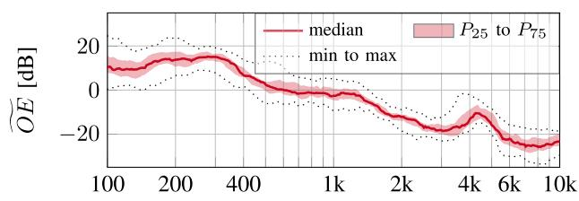

(b) Setting B - Only HT  
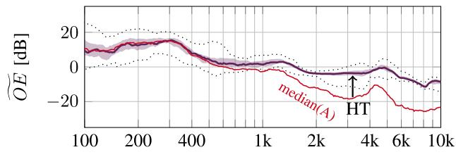

(c) Setting C - Only FB  
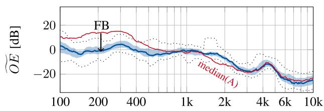

(d) Setting E - FB+HT tuned  
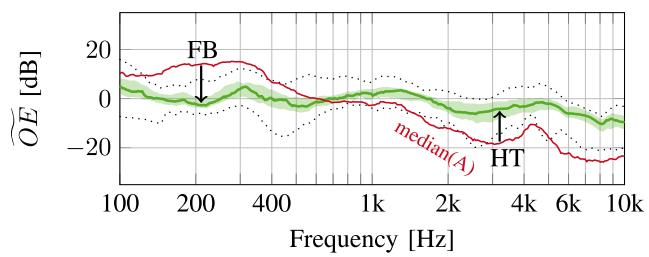  
Fig. 17. Occlusion functions $\widetilde { O E } ( f )$ for left ears of test part (T3) (with ${ \frac { 1 } { 3 } } \cdot$ - octave band smoothing).

2) Objective Evaluation ofOEC: In the third part (T3) of the listening test, measurements of the occlusion function $\widetilde { O E } ( f )$ were acquired for each of the five settings.

The following plots in Fig. 17 show the resulting occlusion function $\widetilde { O E } ( f )$ for setting A (passive earplug), setting B (only HT), setting C (only FB), and setting E (tuned FB and HT). Fig. 17(a) (setting A) represents a deactivated system corresponding to a passive earplug. It shows the typical amplification at low frequencies and attenuation at high frequencies, as earlier presented in Section III-A. Fig. 17(b) (setting B) visualizes the influence of the activated hear-through. It raises the magnitude of $\widetilde { O E } ( f )$ above 1 kHz towards 0 dB. For comparison the median of setting A is included. Fig. 17(c) (setting C) shows the influence of the feedback controller, with a significant reduction in the range of 100–400 Hz. Finally, Fig. 17(d) (setting E) contains the measurements for the complete system (FB+HT) after the individual tuning. It reveals an attenuation at low frequencies and an amplification at high frequencies towards a more spectrally flat $\widetilde { O E } ( f )$ . The low-frequency amplification and the high-frequency attenuation of the occlusion effect have been compensated for, to a large extend.

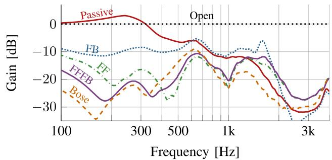  
Fig. 18. Overall ANC gain including active and passive attenuation for according to Fig. 14 and Table 1. Median of 72 directions measured with a dummy head [6].

## B. ANC Performance

To complete the evaluation of the adjustable system shown in Fig. 14, objective measures of the ANC performance are presented in the following. ANC headphone are typically evaluated using dummy heads and an excitation signal, e.g. broadband noise or sweeped tonal sounds such as a logarithmic sweep (used here), emitted externally via one or more loudspeakers. The metric we observe is the overall frequency-dependent gain for ambient sounds, where the magnitude spectrum of a dummy head eardrum microphone signal is related for two consecutive measurements with open ears and with different operation modes wearing the headphone. The active case is typically related to the open ears. Therefore, the overall gain includes active as well as passive attenuation of the earpiece. The method is comparable to measuring the OE as indicated in Fig. 7.

Fig. 18 shows the median overall gain for different modes based on 72 directions on a horizontal plane measured with a dummy head [6]. The gain as illustrated in Fig. 18, represents the magnitude spectra recorded by the dummy head’s eardrum microphone and normalized w.r.t. the open ear case. The passive measurement shows a slight Helmholtz resonance characterstic ofthe Bose QC20 at roughly 230 Hz and the expected attenuation above 300 Hz. In comparison to the passive case, the feedback controller (FB, $W ( z ) = 0 )$ attenuates sound below 600 Hz and has the typical amplification due to the waterbed effect between 1 and 2 kHz, while the feedforward controller (FF, $K ( z ) = 0 )$ attenuates sound below 1.3 kHz. However, the combined feedforward-feedback approach (FFFB, $W ( z ) , K ( z )$ and $\hat { G } ( z )$ according to Table 1) yields a better performance than the individual solutions FB and FF especially at frequencies below 400 Hz. For reference a measurement with the manufacturers ANC electronics, which have been reconnected to the headphone without removing it from the dummy head, is shown as well (Bose). The commercial solution shows a better performance below 330 Hz and above 700 Hz. While our FFFB solution provides a somewhat stronger attenuation in the range between 330 Hz and 700 Hz. These differences might be explained by different design targets and optimization procedures.

## VI. CONCLUSION

This paper provided a comprehensive treatment of occlusion effect cancellation (OEC) and its relations to active noise cancellation (ANC), as known from noise cancelling headphones. While the objective of ANC is to cancel ambient noise, OEC compensates the unnatural sound of one’s own voice due to occlusion of the ears by e.g. a communication headset. Both approaches use an inner and an outer microphone, feedforwardfeedback control, and ultra-low latency digital signal processing. It is shown how the knowledge of the mechanisms of ANC can be exploited to derive a solution for the OEC problem, taking the requirements of OEC, which are contrary to ANC, into account. The detailed discussion is comprising acoustic measurements, design constraints, synergies, system structures, filter design as well as subjective and objectives evaluations. Optimization of robust filters is described, taking typical variations and uncertainties of the individual ear canals and variable fittings ofthe ear pieces into account. The major advantage ofthe proposed OEC structure is that the design and the performance of the feedforward and the feedback filters are almost decoupled. Furthermore, the structure offers some adaptability and personal adjustability for enhancing performance and stability. The system can be switched between OEC and ANC operation modes by exchanging filter coefficients. OEC listening tests with 23 normal-hearing participants, confirm a significant improvement of naturalness of the participants’ own voice perception. ANC measurements indicate a performance comparable to commercial solutions.

## ACKNOWLEDGMENT

The authors would like to thank Johannes Fabry and Raphael Brandis for fruitful discussions, valuable suggestions and for contributions to simulations, real-time implementation and listening tests.

## REFERENCES

[1] S. Kochkin, “MarkeTrak VIII: Consumer satisfaction with hearing aids is slowly increasing,” Hear. J., vol. 63, no. 1, pp. 19–20, 2010.

[2] M. C. Killion, “The hollow voice occlusion effect,” in Proc. 13th Danavox Symp., 1988, pp. 231–241.

[3] T. Zurbrügg, “Active control mitigating the ear canal occlusion effect caused by hearing aids,” Ph.D. dissertation, École Polytechnique Fédérale de Lausanne, 2014.

[4] A. Winkler, M. Latzel, and I. Holube, “Open versus closed hearing-aid fittings: A literature review of both fitting approaches,” Trends Hear., vol. 20, no. 2, 2016, Art. no. 2331216516631741.

[5] S. Liebich, R. Brandis, J. Fabry, P. Jax, and P. Vary, “Active occlusion cancellation with hear-through equalization for headphones,” in Proc. IEEE Int. Conf. Acoust., Speech Signal Process., 2018, pp. 241–245.

[6] S. Liebich, J.-G. Richter, J. Fabry, C. Durand, J. Fels, and P. Jax, “Direction-of-arrival dependency of active noise cancellation headphones,” in Proc. 47th Int. Congr. Expo. Noise Control Eng., Washington, DC, USA: The Institute of Noise Control Engineering of the USA, Inc., 2018, Art. no. V001T08A003.

[7] S. Elliott, Signal Processing for Active Control. New York, NY, USA, Academic, 2000.

[8] S. S. Haykin, Adaptive Filter Theory, 5th ed. Upper Saddle River, NJ, USA: Pearson, 2014.

[9] J. Fabry, F. König, S. Liebich, and P. Jax, “Acoustic equalization for headphones using a fixed feed-forward filter,” in Proc. IEEE Int. Conf. Acoust., Speech, Signal Process., 2019, pp. 980–984.

[10] C. Hansen, S. Snyder, X. Qiu, L. Brooks, and D. Moreau, Active Control ofNoise and Vibration. Boca Raton, FL, USA: CRC Press, 2012.

[11] M. S. Bai et al., “Implementation of an active headset by using the H-infinity robust control theory,” J. Acoust. Soc. Amer., vol. 102, no. 4, pp. 2184–2190, 1997.

[12] P. R. Benois, P. Nowak, and U. Zoelzer, “Hybrid active noise control structures: A short overview,” in Proc. Speech Commun., 13th ITG- Symp., 2018, pp. 1–5.

[13] S. Liebich, D. Rüschen, C. Anemüller, P. Vary, P. Jax, and S. Leonhardt, “Active noise cancellation in headphones by digital robust feedback control,” in Proc. 24th Eur. Signal Process. Conf., 2016, pp. 1843–1847.

[14] J.-G. Richter, G. Behler, and J. Fels, “Evaluation of a fast HRTF measurement system,” in Proc. 140th Audio Eng. Soc. Conv., 2016, Art. no. 9498.

[15] P. Majdak, P. Balazs, and B. Laback, “Multiple exponential sweep method for fast measurement of head-related transfer functions,” J. Audio Eng. Soc., vol. 55, no. 7/8, pp. 623–637, 2007.

[16] P. Dietrich, B. Masiero, and M. Vorländer, “On the optimization of the multiple exponential sweep method,” J. Audio Eng. Soc., vol. 61, no. 3, pp. 113–124, 2013.

[17] S. M. Kuo and D. Morgan, Active Noise Control Systems: Algorithms and DSP Implementations. Hoboken, NJ, USA: Wiley, 1996.

[18] M. Hansen and M. Stinson, “Air conducted and body conducted sound produced by own voice,” Can. Acoust., vol. 26, no. 2, pp. 11–19, 1998.

[19] D. P. Goldstein and C. S. Hayes, “The occlusion effect in bone conduction hearing,” J. Speech Hear. Res., vol. 8, no. 2, pp. 137–148, Jun. 1965.

[20] H. Dillon, Hearing Aids, 2nd ed. Turramurra, NSW, Australia: Boomerang Press, 2012.

[21] C. Pörschmann, “Influences of bone conduction and air conduction on the sound of One’s own voice,” Acta Acustica United Acustica, vol. 86, no. 6, pp. 1038–1045, 2000.

[22] M. Hansen, “Occlusion effects Part I: Hearing aid users experiences of the occlusion effect compared to the real ear sound level,” Ph.D. dissertation, Tech. Univ. Denmark, Kopenhagen, 1997.

[23] V. H. Wimmer, “The occlusion effect from earmolds,” Hear. Instrum., vol. 37, no. 12, pp. 19–58, 1986.

[24] A. Thorup, “Okklusion,” M.S. thesis, Dept. Acoust. Technol., Tech. Univ. of Denmark, Lyngby, Denmark, 1996.

[25] A. May and H. Dillon, “Comparison of physical measurements of the occlusion effect with subjective reports,” in Australian J. Audiology, Barossa Valley, South Australia, May. 1992.

[26] S. Liebich, P. Jax, and P. Vary, “Active cancellation of the occlusion effect in hearing aids by time invariant robust feedback,” in Proc. Speech Commun., 12th. ITG Symp., 2016, pp. 1–5.

[27] S. Skogestad and I. Postlethwaite, Multivariable Feedback Control: Analysis and Design. Hoboken, NJ, USA: Wiley, 2007.

[28] F. Denk, H. Schepker, S. Doclo, and B. Kollmeier, “Equalization filter design for achieving acoustic transparency in a semi-open fit hearing device,” in Proc. Speech Commun., 13th ITG- Symp., 2018, pp. 1–5.

[29] Say-Wei Foo, T. N. Senthilkumar, and C. Averty, “Active noise cancellation headset,” Proc. IEEE Int. Symp. Circuits Syst., vol. 1, pp. 268–271, 2005.

[30] S. Olive, T. Welti, and O. Khonsaripour, “A statistical model that predicts listeners’ preference ratings of around-ear and on-ear headphones,” in Audio Engineering Society Convention 144, May. 2018.

[31] S. M. Kuo, H. Chuang, and P. P. Mallela, “Integrated automotive signal processing and audio system,” IEEE Trans. Consum. Electron., vol. 39, no. 3, pp. 522–532, Aug. 1993.

[32] J. Mejia, H. Dillon, and M. Fisher, “Acoustically transparent occlusion reduction system and method,” U.S. Patent WO2 006 037 156 A1, 2004.

[33] J. Mejia, H. Dillon, and M. Fisher, “Active cancellation of occlusion: An electronic vent for hearing aids and hearing protectors,” J. Acoust. Soc. Amer., vol. 124, no. 1, pp. 235–240, Jul. 2008.

[34] T. Zurbrügg and A. Stirnemann, “Active control in hearing aids reducing low-frequency variations,” in 36th Jahrestagung Für Akustik (DAGA), 2010.

[35] T. Zurbrügg, A. Stirnemann, M. Kuster, and H. Lissek, “Investigations on the physical factors influencing the ear canal occlusion effect caused by hearing aids,” Acta Acustica United Acustica, vol. 100, no. 3, pp. 527–536 May. 2014.

[36] T. Zurbrügg, A. Stirnemann, M. Kuster, and H. Lissek, “Objective and subjective validation of an active control approach to reduce the occlusion effect in hearing aids,” Acta Acustica united Acustica, vol. 101, no. 3, pp. 502–509, May 2015.

[37] R. Borges, M. Costa, J. Cordioli, and L. Assuiti, “An adaptive occlusion canceller for hearing aids,” in Proc. IEEE Workshop Appl. Signal Process. Audio Acoust., 2013, pp. 1–5.

[38] A. Bernier and J. Voix, “An active hearing protection device for musicians,” in Proc. Meetings Acoust., vol. 19, no. 1, 2013, Art. no. 040015.

[39] A. Bernier and J. Voix, “Active Musician’s hearing protection device forenhanced perceptual comfort,” in Proc. EuroNoise, 2015, pp. 1773–1778.

[40] M. Sunohara, K. Watanuki, and M. Tateno, “Occlusion reduction system for hearing aids using active noise control technique,” Acoustical Sci. Technol., vol. 35, no. 6, pp. 318–320, 2014.

[41] M. Sunohara, M. Osawa, T. Hashiura, and M. Tateno, “Occlusion reduction system for hearing aids with an improved transducer and an associated algorithm,” in Proc. 23rd Eur. Signal Process. Conf., 2015, pp. 285–289.

[42] R. Borges and M. H. Costa, “A feed forward adaptive canceller to reduce the occlusion effect in hearing aids,” Comput. Biol. Med., vol. 79, pp. 266–275, 2016.

[43] R. Borges, W. Parreira, and M. Costa, “Design guidelines for feedforward cancellation of the occlusion-effect in hearing aids,” in Proc. 41st Annu. Int. Conf. IEEE Eng. Med. Biol. Soc., Jul. 2019, pp. 607–610.

[44] R. Albrecht et al., “Electronic hearing protection for musicians,” in Proc. 14th Sound Music Comput. Conf., 2017, pp. 306–313.

[45] F. Denk, S. Vogl, H. Schepker, B. Kollmeier, M. Blau, and S. Doclo, “The acoustically transparent hearing device: Towards integration of individualized sound equalization, electro-acoustic modeling and feedback cancellation,” in Int. Workshop Challenges Hear. Assistive Technol., 2017, pp. 89–94.

[46] R. Gupta,et al. “On the use of closed-back headphones for active hearthrough equalization in augmented reality applications,” in Audio Engineering Society Conf.: AES Int. Conf. Audio Virtual Augmented Reality. Audio Engineering Society, 2018.

[47] J. Rämö and V. Välimäki, “An allpass hear-through headset,” in Proc. 22nd Eur. Signal Process. Conf., 2014, pp. 1123–1127.

[48] J. S. Garofolo, “TIMIT: Acoustic-phonetic continuous speech corpus LDC93S1,” Linguistic Data Consortium, Philadelphia, PA USA, 1993.

[49] R. L. Wasserstein and N. A. Lazar, “The ASAs statement on P-values: Context, process, and purpose,” Amer. Statistician, vol. 70, no. 2, pp. 129–133, Apr. 2016.

Stefan Liebich (Member, IEEE) received the M.Sc. degree in electrical engineering from the RWTH Aachen University, Germany, in 2013. He also received the Dr.-Ing. degree from RWTH Aachen University, Aachen, Germany, in 2021, under the supervision of Prof. Dr.-Ing. Peter Vary. After finishing the Dr.-Ing., he co-founded the Elevear GmbH, which is working in the field of technology licensing for headphones and hearing aids. For his studies he was the recipient of the Otto-Junker Award and the Springorum Medal.

His major research interests include the area ofactive noise cancellation, active occlusion cancellation and generally the own voice perception while wearing headphones or hearing aids.

Peter Vary (Fellow, IEEE) received the Dipl.-Ing. degree in electrical engineering from the Technical University of Darmstadt, Germany, in 1972, and the Dr.-Ing. degree from the University of Erlangen-Nuernberg, Germany, in 1978. In 1980, he joined Philips Communication Industries (PKI), Nuremberg, Germany. Since 1988, he has been a Professor with RWTH Aachen University, Aachen, Germany, and the Head of the Institute of Communication Systems. His main research interests are wireless communications, including speech coding, join

source-channel coding, error concealment, and speech enhancement for mobile phones and digital hearing aids. Peter Vary is a Fellow of the IEEE Signa Processing Society, of the EURASIP Signal Processing Society and of the German ITG.