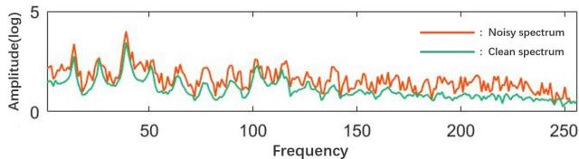
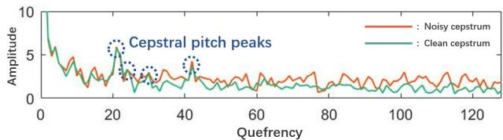
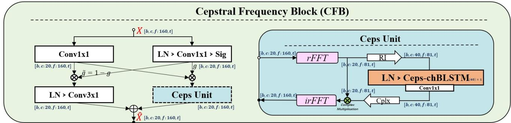
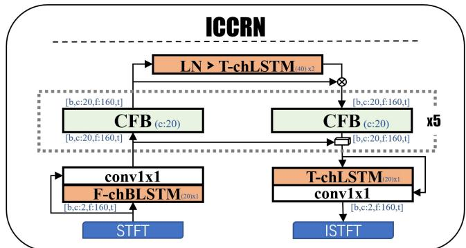
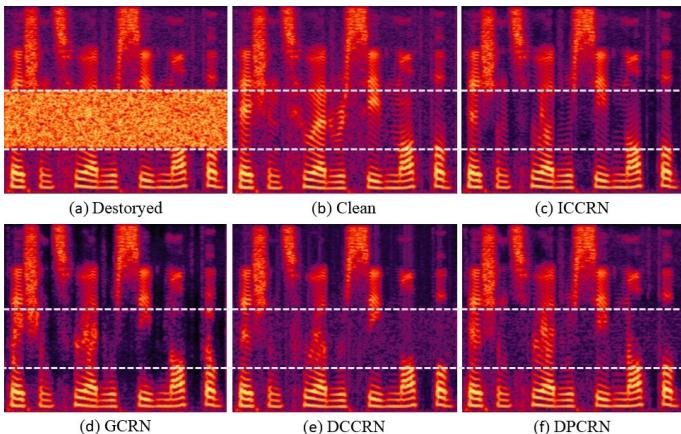

# ICCRN: INPLACE CEPSTRAL CONVOLUTIONAL RECURRENT NEURAL NETWORKFOR MONAURAL SPEECH ENHANCEMENT

Jinjiang Liu, Xueliang Zhang

College of Computer Science, Inner Mongolia University, China jetliu1994@foxmail.com, cszxl@imu.edu.cn

## ABSTRACT

According to the mechanism of speech production, speech can be decomposed into excitation and vocal tract which are sparsely represented in cepstral domain. In this study, we propose a neural network for monaural speech enhancement on time-frequency cepstral space that is implemented by inserting a cepstral frequency block into our inplace convolutional recurrent network. The proposed method has a good ability of restoring the speech masked by noise. Experimental results show that the proposed ICCRN model significantly outperforms the baseline system, particularly under low SNR conditions.

Index Terms— speech enhancement, inplace cepstral convolutional recurrent neural network, deep learning

## 1. INTRODUCTION

Speech is like radio waves, in which the vocal tract modulates slowly varying semantic information onto broadband carrier waves emitted by the vocal cords [1]. Because the carrier wave has perfect harmonic fine structures, speech is harmonious in human perception. However, when noise interferes with speech signals, the harmonic structure is corrupted, resulting in reduced perceptual quality and intelligibility. If the noise envelope masks the speech envelope, the semantic information can be lost, further reducing speech intelligibility. Speech enhancement aims to restore clean speech as much as possible, thereby improving speech intelligibility and perceptual quality.

The choice of processing domain is crucial for better performance, particularly when the target signal’s energy distribution is sparse or exhibits clear, simple patterns in specific domains. In the case of speech signals, the majority of the energy is concentrated in the harmonic fine structures of the spectrum, making the timefrequency (TF) domain a popular choice for both traditional algorithms and deep learning methods. Zhang and Liu [2] used comb filters in the TF domain to segregate harmonic speech components from background noise based on the harmonicity principle and the amplitude modulation (AM) criterion.

Recently, TF-domain deep learning methods have made significant progress. The CRN uses down-sampling in the frequency dimension to achieve full-band perceptual modeling [3][4]. DPCRNlike models, on the other hand, employ LSTMs to better capture frequency patterns [5][6][7]. The DCCRN, which focuses on phase estimation in the complex field, achieves better results than previous models [8][9]. As noise in different domains exhibits distinct patterns of energy distribution and sparsity [10], the DBNet proposes a speech enhancement approach that works across both time and frequency domains.

As the harmonics of speech signals exhibit periodic structures in the frequency dimension, it is easy to realize that the harmonics can be sparsely represented by the further frequency analysis to the TF-domain, i.e. the pitch peaks in the cepstral domain [11]. Fig. 1 shows a moderately white noise corrupted spectrum and its cepstrum. As we can see, there are few cepstral peaks representing the spectrum harmonics, and the noise components barely change those peaks. This indicate that there could be more effective approaches for harmonic modeling and recovery in cepstral domain. However, there are few traditional speech enhancement algorithms based on it. This is because the energy distribution of harmonics and envelope, while sparse in the cepstral domain, exhibits complex patterns that are difficult to model with traditional signal processing approaches. Data-driven deep learning methods, on the other hand, are effective in modeling such distributions. Recently, some deep learning-based algorithms have benefited from cepstral analysis. In [12], TF-domain neural comb filters are learned adaptively while constraining the cepstral pitch-peak loss. Through cepstrum analysis, [13][14] decomposed the spectrum enhancement task into enhancing the excitation spectrum and vocal tract spectrum.

  
Fig. 1: Harmonics in the frequency domain are sparsely represented by several pitch peaks in the cepstrum domain.

The IGCRN is our previous work on multi-channel speech enhancement[15]. As the traditional beamforming shows that the spatial information exists in each frequency bin of the array signal spectrum[16], we discard the CRN downsampling operation in frequency dimension to preserve spatial cues and using LSTM independently processing channel dimension of each frequency bin, which is similar to the beamforming, we call it channel-wise LSTM. The IGCRN has also been successfully applied to mono acoustic echo cancellation (AEC) [17] and stereo AEC[18], thanks to its high spectral detail fidelity for both the received signal and far-end signal. However, canceling the frequency downsampling also severely limits the full-band modeling capability of IGCRN, so it degrade significantly when exposed to severe reverberation.

Therefore, this paper focuses on improving the single-channel speech enhancement performance of the inplace CRN model. By achieving better spectral modeling, the performance of multichannel speech enhancement and AEC systems can also be expected to improve. Besides, recent studies have shown the weakness of the downsampling encoder in high-frequency information modeling, and the internal friction in alleviating the upsampling-caused checkerboard effect during the training procedure [19]. Moreover, recent speech enhancement neural networks also tend to reduce downsampling operations [5][6][7][20]. Inspired by those trend, this paper aim to abandon the downsampling operation and implement monaural speech enhancement in the cepstral space, which may be the key to further improving the performance of speech enhancement.

## 2. ALGORITHM

## 2.1. Algorithm objectives and loss function

In the TF-domain, a noisy speech signal X can be modeled as

$$
X [ k ] = S [ k ] + N [ k ]
$$

where S, and N represent the spectrum of target clean speech and ambient noise, respectively, and k is the frame index of spectra. The

(1)

  
Conv FxT: Conv2D, kernel size={F:Frequency , T: time }; Ceps-chBLSTM(c)×n: BLSTM processing on cepstral bin sequence in a frame (c: hidden size for each direction, n:layer num); Sig: sigmoid function; LN: LayerNorm on channel and frequency dimension; [b, c, f,t: dimension size={b: batch, c: channel, f: frequency t:time}  
Fig. 2: The proposed cepstral frequency block (CFB) and cepstral unit.

ICCRN speech enhancement model aims to estimate S from the noisy spectrum X. In this study, the ICCRN model directly maps the real and imaginary parts of the noisy spectrum to the clean spectrum. The L1 norm is used to measure the real part, imaginary part, and amplitude errors between the estimated spectrum and the target spectrum respectively. Their weighted sum is used as the loss function, as follows

$$
\mathcal {L} = \left\| \mathcal {R} (\hat {S}) - \mathcal {R} (S) \right\| _ {1} + \left\| \mathcal {I} (\hat {S}) - \mathcal {I} (S) \right\| _ {1} + \alpha \left\| | \hat {S} | - | S | \right\| _ {1}\tag{2}
$$

where, S and $\hat { S }$ are the target and estimated spectra, respectively. The estimated spectrum is first converted into the time domain and then converted back to the TF domain to calculate the spectrum loss, which helps alleviate the STFT consistency problem [21]. R(·) and $\mathcal { T } ( \cdot )$ are the operation to extract the real and imaginary components for a complex spectrum, and $\left\| \cdot \right\| _ { 1 }$ is the L1 norm. Due to the spectrum amplitude contributing more to both speech intelligibility and quality, an factor α is applied to the amplitude error, here we set it to 2.

## 2.2. Mechanisms and motivations

The main difference of ICCRN compared with our previous IGCRN is that we replace the Gated Linear Units (GLU) with Cepstral Frequency Block (CFB), which is shown in Fig. 2. As an in-place model, the ICCRN does not involve any frequency downsampling operations, and therefore, the frequency dimension of the model remains unchanged at $f ~ = ~ 1 6 0$ , and all convolution layers share the same convolution output channel size of $c \ = \ 2 0 .$ Here we demonstrate the featured mechanisms and motivations of the ICCRN model.

## 2.2.1. Sparse representation of speech in cepstral space

We define the further frequency analysis of the TF domain feature map as the cepstral space. More specifically, we apply the realvalued fast Fourier transform to each channel of each frame in the TF-domain feature map. The major difference from traditional cepstrum analysis is that, it proposed on TF-domain neural network features instead of TF-domain spectrum of original signal. In the cepstral space, the energy of the spectral envelope, which contains most of the semantic information and timbre, is concentrated in the narrow low cepstral band. Harmonics are the densely and periodically distributed energy in frequency domain, can be represented in higher cepstral band with several sparely distributed peaks [11]. Due to all the harmonic energy being concentrated in those few cepstral peaks[12], those peaks are distinguishably high and not easy to be masked by noise components. Since most noises do not have the same spectral envelope or harmonics, the sparsity of speech cepstrum can be effectively used to identify and extract speech components from noisy cepstrum in cepstrum space.

## 2.2.2. Speech enhancement in cepstral space

Since different quefrency bands correspond to different spectral frequency structures, the different quefrency bands of speech have significantly different energy distributions and structural patterns. This means, for different cepstral bin, we need first to design a proper normalization mechanism to compensate and smooth the statistics covariate shift and bias of the cepstral space feature maps, and then design a neural module that can model those different patterns in the different cepstral bands.

Based on the significant differences in the energy distribution of different quefrency, the normalization operation in the cepstral space should meet two basic requirements. The first is to be able to individually adjust the energy of each cepstral bin, and the second is to ensure the stability of the statistics. Therefore, we propose the following normalization approach for a cepstral space feature map x.

$$
L N (\mathbf {x}) = \frac {\mathbf {x} - E _ {c , f} [ \mathbf {x} ]}{\sqrt {V a r _ {c , f} [ \mathbf {x} ] + \epsilon}} \odot \gamma + \beta\tag{3}
$$

We first consider the channel and cepstral dimensions as a whole to calculate stabilized mean $E _ { c , f }$ and variance V $\lceil a r _ { c , f } ,$ which are used to normalize x to a standard normal distribution. And then we use a wight matrix $\boldsymbol { \gamma } \in \mathbb { R } ^ { c \times f }$ and bias matrix $\boldsymbol { \beta } \in \mathbb { R } ^ { c \times f }$ to individually adjust every cepstral bin in every channel, the ⊙ is the elementwise multiplication operator. The adaptively learned affine parameters could smooth the energy distribution different and without interrupt detailed cepstral patterns for neural network to process. Apparently, the cepstral space normalization mathematically coincides with the form of the well-known layer normalization (LN). Another crucial insight for the cepstral space element-wise affine parameters is that, as multiplication in the frequency domain is equivalent to a corresponding convolution in the original domain, the elementwise weighting operation by γ in the cepstral space is equivalent to a group of full-size filters in the frequency domain. Therefore, the well-trained cepstral normalization affine parameters can effectively filter speech components, even without any densely connected neural layers. This will be demonstrated quantitatively in the later experiment. It should also be noted that we have employed layer normalization in the frequency domain using the same approach.

After the feature map is been normalized, an appropriate neural network module is needed in the cepstral space. Although cepstral normalization eliminate the statistic different to an extent, there are still structural pattern differences among the different cepstral bands. So we need to design a neural module that can aware different cepstrum bands and model them differently. We use LSTM to achieve this function, the cepstral channel-wise LSTM takes the cepstrum frequency bins as time series. Therefore the LSTM knows which cepstrum band it is currently processing and filter it with corresponding different patterns. Although same performance can be achieved by split cepstrum into 10 more subbands and processing with different $\dot { 3 } \times 1$ convolutional layers, the model complexity will increase significantly.

## 2.2.3. Cross domain modeling

Cross-time-frequency domain enhancement has proven to be an effective approach to filter out different noise [10]. We also find crossfrequency-cepstral space is a promising way to identify speech or noise, since speech energy is sparse in cepstral space, while some noise is more concentrated in frequency domain. As Fig. 2. shown, the model use the frequency domain as foundation, the input TFdomain feature map is first projected by a Conv1 × 1 layer, and also a task split gate is generated by a $L N ^ { ' } > C o n v 1 \times 1 \stackrel { < } { > } S i g$ module. The Ceps Unit process the gated feature map in cepstral space, and the TF-domain $\updownarrow N > C o n v 3 \times 1$ 1 module process the residual of the gated feature. Their final result is added as CF Block output feature.

  
Fig. 3: The implemented ICCRN architecture

## 2.2.4. High efficiency space transformation using FFT

Many neural networks utilize learnable space transformation module to build up cross space communication and achieve good result [10][22][23]. However, there are some advanced features of FFT seem to be ignored. Firstly, DFT is an orthogonal transformation, its coefficients are independent and do not cause information loss or distortion. While the data-driven transformation inevitably involves dataset bias and may lead to weak generalizability to unseen data. Secondly, the DFT spectrum has clear and well-defined physical theoretical foundations. The frequency components are ordered from low to high-frequency bins. This key feature enables better visualization, analysis, and tuning of both traditional and deep learning algorithms. Finally, the classic FFT is the most optimized implementation of DFT[24]. Its linearithmic computational complexity makes it extremely low-cost for space transformation. And the neural transformations are in quadratic complexity. In this work, the FFT costs only 0.15G multiply-accumulate (MAC) , while the DFT or the neural-based transformation could cost 0.95G MAC. Moreover, the FFT is parameterless, and the neural transformations need to store neural transformation parameters.

## 2.3. ICCRN construction and details

The ICCRN follows the common U-Net structure with skip connections as shown in Fig. 3. The real and imaginary part of the complex STFT spectrum are stacked in channel dimension as input feature with a shape of [Batch, Channel, Frequency, Time]. Since projecting raw data to higher dimensions is crucial for both neural network methods and traditional algorithms like support vector machines (SVM), we use channel-wise BLSTM (F-chBLSTM) to project the input channel dimension to higher dimension. After the input projection, the feature is processed by 5 sequential CFBs. Then a 2-layer channel-wise LSTM (T-chLSTMx2) would calculate a mask for encoder output, its hidden size is set to 2c. In the decoding stage, the masked feature map is stacked with skip connection and passes through 5 cascaded CFB, and then processed by a time dimension channel-wise LSTM. Finally, the channel dimension is compressed to 2 channels by a 1x1 convolutional layer as the real part and imaginary part of the estimated STFT spectrum.

## 3. EXPERIMENT AND EVALUATION

Due to the rapid development of neural network algorithms, their performance in high SNR condition is hard to perceive. This experiment train and evaluate algorithms for the low SNR condition. For an intuitive and convincing evaluation of our algorithm, we keep the same experimental design as [4, 10] recently proposed. Two commonly accepted objective metrics, short-time objective intelligibility (STOI) [25] and perceptual evaluation of speech quality (PESQ) [26], are used as evaluation metrics in this work. Generally, the perceived quality depends on the clarity of the frequency fine structure, the speech intelligibility is relays on the time variation of frequency envelops. Both fine structures and envelops in the frequency domain can be sparsely represented in the cepstral domain. So, properly designed neural cepstral mechanisms could definitely better improve both intelligibility and perceptual quality.

## 3.1. Experimental setup

In this experiment, the WSJ0 SI-84 dataset [27] is utilized as a speech corpus. We use the utterances of 77 speakers from them for training, and the rest 6 for a generalizability evaluation test on unseen speakers. To ensure the diversity of noise characteristics, about 126 hours with a total of 10000 kinds of high-quality nonspeech sounds (available at https://www.sound-ideas.com) are used as training noise. And -5 dB NOISEX-92 [28] (except babble noise) are used as validation noise. Random and uniformly sampled SNRs from -5dB, -4dB, -3dB, -2dB, -1dB, 0dB are used for training noise gain control. During the training stage, selected speech is mixed with random kinds of noise, and then zero padding or clip it to 7s. In the testing stage, the babble and cafeteria noise from the sound event database Auditec CD (available at http://www.auditec.com) are utilized for the generalization test. The noisy test evaluation mixtures are generated at each SNR of -5dB, 0dB, and unseen 5dB. All models are trained using the AdamW optimizer with a fixed learning rate of 0.001. The training batch size is set to 24, and we use the DDP training framework with the PyTorch backend.

## 3.2. Baselines and ablation models

We first conduct general comparisons with currently well-accepted and validated neural networks as follows. (1) IGCRN: our previous neural network for multi-channel speech enhancement[15]. In this experiment, we set all the GLU channel sizes to 32 and channelwise LSTM to 64. (2) IGCRN(DIL): dilated convolution version of IGCRN model, which achieves full band perception field. (3) GCRN: A well-accepted and implemented CRN model, we keep its original setting [4]. (4) DCCRN: A SOTA complex-valued CRN neural network has been broadly compared, we keep its original best hyperparameter configuration [8]. (5) DPCRN: A neat designed DPRNN-based CRN model with SOTA performance, we keep its best configuration [5]. For a fair comparison, we also compare their performance in complex spectrum mapping (CSM) with same loss function. All systems are causal, no reference to future frames is allowed, and all algorithms use 50%frame shift STFT.

And the following ablation studies were conducted to examine the effectiveness of these carefully designed mechanisms. (1) IC-CRN : The proposed ICCRN model with the CFB channel size c set to 20, using 20 ms hamming window STFT with total 160 frequency size f. (2) ICCRN(-freq) : the frequency convolution module LN > Conv3 × 1 in the CF Block is been short-circuited. (3) ICCRN(-ceps) : the ceps unit in CF Block is been short-circuited. (4) ICCRN(cepsLN) : the Ceps-chBLSTM is removed in the cepsunit, and the cepstral space feature is only processed by a cepstral layer normalization module and directly transforms the TF-domain without complex mask procedure.

## 4. EXPERIMENTAL RESULTS AND ANALYSIS

## 4.1. Comparisons and analysis

The experimental results are shown in Table 1. Since IGCRN was originally designed for multi-channel speech enhancement, its weakness in full-band spectral modeling lead to poor performance in the monaural case. When we use dilated convolution, the IGCRN(DIL) performance is slightly improved. Its performance is still weak compared with the GCRN model in -5dB SNR condition, but is better in high SNR condition for its inplace nature. When it comes to DCCRN and DPCRN, they both perform better under complex mapping (CSM). The DPCRN(CSM) significantly outperforms DC-CRN(CSM) in Babble noise in the terms of STOI, the DPRNN module makes it excel at extracting long-term frequency structure. And the DCCRN could achieve better performance in most cases of high SNR conditions, especially with the best performance in the terms of PESQ. This is because the STFT magnitude is could be accurately estimated in high SNR conditions. In this situation, the inaccurately estimated phase could have a significant effect on local spectral energy distribution and clarity, and the complex-valued neural network could better phase estimation. However, as the magnitude is more important, when SNR is very low as -5 dB and the estimated magnitude is not correct enough, the DCCRN performance is significantly degraded.

When our inplace model evolves from IGCRN to ICCRN, modeling speech both in the frequency domain and cepstral space, significant improvements are realized in the terms of STOI and PESQ compared with our original IGCRN in all SNR and noise conditions. In particular, the most significant ∆7.1% STOI improvement and ∆0.278 PESQ improvement is achieved in -5dB Babble noise condition. Compare with other baseline algorithms, the STOI of ICCRN performance is consistently significantly better, especially in -5dB low SNR conditions. When we remove the TF-domain 3x1 convolution, the ICCRN(-freq) STOI metrics are still slightly higher than all baseline models. As speech intelligibility is mostly related to the spectral envelope, this result indicates that the cepstral space could be an effective choice to recover envelop-based information such as semantics and timbre. The most direct evidence of cepstral space enhancement playing a far more important role is the much more significant degradation of ICCRN(-ceps) compared with ICCRN(- freq) in all test scenarios. And most interesting improvement comes from the ICCRN(cepsLN), When we add the cepstral space branch to the ICCRN(-ceps) and only propose a cepstral domain normalization, i.e. the Layer normalization, without any LSTM or CNN like densely connected neural modules, vast improvements are realized compare with ICCRN(-ceps) in all test setup, especially in -5dB Babble noise condition, with 78.35/74.12 for STOI, and 1.947/1.793 for PESQ. Such a big improvement is may not easy to understand in the view of neural network practice, but is easy to explain it using the theory of traditional signal processing. As we have already briefly discussed, the element-wise affine parameter γ of cepstrum space, although not strictly, is equivalent to a set of frequency-domain fullsize (160 in this work) circular convolution kernels.

Table 1: Comparisons between different approach in the terms of STOI, PESQ in -5dB, 0dB, and 5dB SNR condition.

<table><tr><td>Noise</td><td colspan="6">Babble</td><td colspan="6">Cafeteria</td></tr><tr><td>Metrix</td><td colspan="3">STOI (%)</td><td colspan="3">PESQ</td><td colspan="3">STOI (%)</td><td colspan="3">PESQ</td></tr><tr><td>SNR</td><td>-5dB</td><td>0dB</td><td>5dB</td><td>-5dB</td><td>0dB</td><td>5dB</td><td>-5dB</td><td>0dB</td><td>5dB</td><td>-5dB</td><td>0dB</td><td>5dB</td></tr><tr><td>Mixture</td><td>58.50</td><td>70.35</td><td>81.18</td><td>1.537</td><td>1.819</td><td>2.119</td><td>57.52</td><td>69.86</td><td>81.06</td><td>1.464</td><td>1.767</td><td>2.122</td></tr><tr><td>IGCRN</td><td>77.38</td><td>88.98</td><td>94.25</td><td>1.953</td><td>2.612</td><td>3.067</td><td>75.73</td><td>88.32</td><td>93.84</td><td>1.984</td><td>2.609</td><td>3.054</td></tr><tr><td>IGCRN(DIL)</td><td>78.88</td><td>89.80</td><td>94.66</td><td>1.992</td><td>2.629</td><td>3.088</td><td>77.07</td><td>89.29</td><td>94.23</td><td>2.048</td><td>2.658</td><td>3.085</td></tr><tr><td>GCRN</td><td>80.98</td><td>90.74</td><td>94.64</td><td>2.014</td><td>2.594</td><td>3.059</td><td>77.95</td><td>89.17</td><td>94.08</td><td>1.936</td><td>2.557</td><td>3.015</td></tr><tr><td>DCCRN</td><td>80.52</td><td>89.82</td><td>94.12</td><td>2.177</td><td>2.747</td><td>3.084</td><td>79.25</td><td>89.14</td><td>93.66</td><td>2.221</td><td>2.732</td><td>3.072</td></tr><tr><td>DPCRN</td><td>80.30</td><td>90.42</td><td>94.80</td><td>2.174</td><td>2.816</td><td>3.199</td><td>75.87</td><td>88.80</td><td>94.07</td><td>2.013</td><td>2.680</td><td>3.139</td></tr><tr><td>DCCRN(CSM)</td><td>81.72</td><td>91.03</td><td>94.93</td><td>2.216</td><td>2.827</td><td>3.265</td><td>80.30</td><td>90.39</td><td>94.57</td><td>2.241</td><td>2.857</td><td>3.235</td></tr><tr><td>DPCRN(CSM)</td><td>83.21</td><td>91.76</td><td>95.39</td><td>2.212</td><td>2.814</td><td>3.212</td><td>80.03</td><td>90.36</td><td>94.68</td><td>2.226</td><td>2.759</td><td>3.164</td></tr><tr><td>ICCRN</td><td>84.48</td><td>92.36</td><td>95.81</td><td>2.231</td><td>2.818</td><td>3.242</td><td>80.73</td><td>90.84</td><td>94.95</td><td>2.257</td><td>2.737</td><td>3.172</td></tr><tr><td>ICCRN(-freq)</td><td>83.21</td><td>91.91</td><td>95.62</td><td>2.134</td><td>2.752</td><td>3.217</td><td>80.14</td><td>90.54</td><td>94.83</td><td>2.085</td><td>2.689</td><td>3.126</td></tr><tr><td>ICCRN(-ceps)</td><td>74.12</td><td>86.82</td><td>93.19</td><td>1.793</td><td>2.455</td><td>2.973</td><td>72.76</td><td>86.25</td><td>92.72</td><td>1.900</td><td>2.491</td><td>2.949</td></tr><tr><td>ICCRN(cepsLN)</td><td>78.35</td><td>89.57</td><td>94.45</td><td>1.947</td><td>2.625</td><td>3.079</td><td>76.17</td><td>88.52</td><td>93.73</td><td>1.961</td><td>2.578</td><td>3.017</td></tr></table>

  
Fig. 4: Recovering the destroyed spectrum, the speech signal in 1kHz to 3kHz is removed and replaced with -5 dB white noise.

We notice that a convincing work using Fast Fourier Convolution (FFC-SE) has just been published[29]. We compare the differences between our work and FFC-SE as follows. Firstly, this work is an improvement work of our IGCRN by utilizing the idea of cepstral analysis from traditional speech signal processing, and FFT-SE is inspired by fast Fourier convolution (FFC) in computer vision task. Secondly, FFT-SE uses 1x1 convolution in FFT domain, which works for image processing but may be limited for speech spectrum modeling. The image content can be completely different, there is much fewer shared spectral patterns, and that’s the reason they use the 1x1 kernel in computer vision task. But the speech spectrum can be viewed as images with highly similar content, the cepstral pattern of speech thus has pretty fixed patterns which can not be described with 1x1 CNN layer. The cepstral space BLSTM instead could model it as a series with similar patterns in both the short-term and long-term. Furthermore, while FFC-SE uses batch normalization, we demonstrate that layer normalization is better suited to the distributions of cepstral features. Finally, our system is causal, based on short windows, and uses channel-wise LSTM for better time dimension modeling, whereas FFC-SE different in those aspect.

## 4.2. Comparisons in recovering destroyed speech spectrum

To trigger and visualize the significant different characteristics of the cepstral space based ICCRN model and frequency domain based baseline models, we create a destroyed speech. We first remove the 1kHz to 3kHz frequency component of the clean speech, replace it with -5dB white noise. So there is no speech components exists in that bandwidth, if any speech components is recovered it is completely estimated by the spectral context.

As shown in Fig. 4, all of these models are based on complex mappings and have the ability to artificially make up for the destroyed spectrum band, especially for those frames with very clear and strong spectral context. However, the frequency domain-based models failed in those faint areas. The ICCRN can make more precise estimations for fine structures because of the sparsity and distinctness of pitch peaks in the cepstral domain. The visualized test provides compelling evidence of the effectiveness and advantages of utilizing neural cepstral space for harmonics modeling. Since many have speculated that, neural networks can use the spectral context to artificially synthesize speech spectra in some extremely noisy conditions, this open-ended test can be a convincing demonstration.

Table 2: Comparisons of algorithms in the terms of MAC and total parameters.

<table><tr><td>Model</td><td>GCRN</td><td>DPCRN</td><td>DCCRN</td><td>ICCRN</td></tr><tr><td>MAC(G)</td><td>2.42</td><td>3.18</td><td>5.59</td><td>2.09</td></tr><tr><td>Param(M)</td><td>9.77</td><td>0.81</td><td>3.67</td><td>0.46</td></tr></table>

## 4.3. Model Complexity Comparison

Due to the model computational complexity has a decisive impact on performance, we strictly control the MAC of the ICCRN model lower than other model with total 2.09G MAC, nearly two-thirds of DPCRN MAC and one-third of DCCRN MAC. The neural part of ICCRN cost 1.94G MAC and the FFT domain transformation part only cost 0.15G MAC. The ICCRN is also the most compact model with only total 0.46M parameter consumption, which is nearly one eighth of DCCRN total parameters, and half of DPCRN parameters. This is another advantage of inplace model. Due to the absent of down-sampling convolution, the channel dimension don’t need be expended which makes it extremely compact.

## 5. CONCLUSIONS

In this paper, we report our studies on end-to-end speech enhancement in the cepstral space. After the detailed analysis of the speech representation in the cepstral domain, the full use of the cepstral domain features is achieved through the corresponding model design. The inplace speech enhancement model is significantly improved to the top-tier level. We will further explore the ICCRN effectiveness in multi-channel speech enhancement and acoustics echo cancellation.

## 6. REFERENCES

[1] H. Dudley, “The carrier nature of speech,” Bell System Technical Journal, vol. 19, pp. 495–515, 10 1940.

[2] X. Zhang and W. Liu, “Monaural voiced speech segregation based on pitch and comb filter,” in Proc. Interspeech 2011, pp. 1741–1744, 2011.

[3] K. Tan, X. Zhang, and D. Wang, “Real-time speech enhancement using an efficient convolutional recurrent network for dual-microphone mobile phones in close-talk scenarios,” in IEEE International Conference on Acoustics, Speech and Signal Processing (ICASSP), pp. 5751–5755, IEEE, 2019.

[4] K. Tan and D. L. Wang, “Learning complex spectral mapping with gated convolutional recurrent networks for monaural speech enhancement,” IEEE/ACM Transactions on Audio, Speech, and Language Processing, vol. 28, pp. 380–390, 2019.

[5] X. Le, H. Chen, K. Chen, and J. Lu, “DPCRN: Dual-Path Convolution Recurrent Network for Single Channel Speech Enhancement,” in Proc. Interspeech 2021, pp. 2811–2815, 2021.

[6] H.-S. Choi, S. Park, J. H. Lee, H. Heo, D. Jeon, and K. Lee, “Real-time Denoising and Dereverberation wtih Tiny Recurrent U-Net,” in ICASSP 2021-2021 IEEE International Conference on Acoustics, Speech and Signal Processing (ICASSP), pp. 5789–5793, IEEE, 2021.

[7] J. Liu and X. Zhang, “DRC-NET: Densely connected recurrent convolutional neural network for speech dereverberation,” in ICASSP 2022-2022 IEEE International Conference on Acoustics, Speech and Signal Processing (ICASSP), pp. 166–170, IEEE, 2022.

[8] Y. Hu, Y. Liu, S. Lv, M. Xing, S. Zhang, Y. Fu, J. Wu, B. Zhang, and L. Xie, “DCCRN: Deep Complex Convolution Recurrent Network for Phase-Aware Speech Enhancement,” in Proc. Interspeech 2020, pp. 2472–2476, 2020.

[9] S. Lv, Y. Fu, M. Xing, J. Sun, L. Xie, J. Huang, Y. Wang, and T. Yu, “S-DCCRN: Super wide band DCCRN with learnable complex feature for speech enhancement,” in ICASSP 2022- 2022 IEEE International Conference on Acoustics, Speech and Signal Processing (ICASSP), pp. 7767–7771, IEEE, 2022.

[10] K. Zhang, S. He, H. Li, and X. Zhang, “DBNet: A Dual-Branch Network Architecture Processing on Spectrum and Waveform for Single-Channel Speech Enhancement,” in Proc. Interspeech 2021, pp. 2821–2825, 2021.

[11] M. Skowronski, R. Shrivastav, and E. Hunter, “Cepstral peak sensitivity: A theoretic analysis and comparison of several implementations,” Journal ofVoice, vol. 29, 05 2015.

[12] V. Parvathala, S. Andhavrapu, G. Pamisetty, and K. Murty, “Neural comb filtering using sliding window attention network for speech enhancement,” Circuits, Systems, and Signal Processing, 08 2022.

[13] W. Jiang, Z. Liu, K. Yu, and F. Wen, “Speech enhancement with neural homomorphic synthesis,” in ICASSP 2022-2022 IEEE International Conference on Acoustics, Speech and Signal Processing (ICASSP), pp. 376–380, IEEE, 2022.

[14] S. He, W. Rao, J. Liu, J. Chen, Y. Ju, X. Zhang, Y. Wang, and S. Shang, “Speech enhancement with intelligent neural homomorphic synthesis,” arXiv preprint arXiv:2210.15853, 2022.

[15] J. Liu and X. Zhang, “Inplace Gated Convolutional Recurrent Neural Network for Dual-Channel Speech Enhancement,” in INTERSPEECH 2021, pp. 1852–1856, 2021.

[16] W. Liu and S. Weiss, Wideband Beamforming — Concepts and Techniques. 01 2010.

[17] C. Zhang, J. Liu, and X. Zhang, “A complex spectral mapping with inplace convolution recurrent neural networks for acoustic echo cancellation,” in ICASSP 2022-2022 IEEE International Conference on Acoustics, Speech and Signal Processing (ICASSP), pp. 751–755, IEEE, 2022.

[18] C. Zhang, J. Liu, and X. Zhang, “LCSM: A Lightweight Complex Spectral Mapping Framework for Stereophonic Acoustic Echo Cancellation,” in Proc. Interspeech 2022, pp. 2523–2527, 2022.

[19] L. Tang, W. Shen, Z. Zhou, Y. Chen, and Q. Zhang, “Defects of convolutional decoder networks in frequency representation,” arXiv preprint arXiv:2210.09020, 2022.

[20] Z.-Q. Wang, S. Cornell, S. Choi, Y. Lee, B.-Y. Kim, and S. Watanabe, “TF-GridNet: Integrating Full-and Sub-Band Modeling for Speech Separation,” arXiv preprint arXiv:2211.12433, 2022.

[21] J. Le Roux, N. Ono, and S. Sagayama, “Explicit consistency constraints for stft spectrograms and their application to phase reconstruction.,” in SAPA@ INTERSPEECH, pp. 23–28, Citeseer, 2008.

[22] T.-A. Hsieh, H.-m. Wang, X. lu, and Y. Tsao, “WaveCRN: An efficient convolutional recurrent neural network for end-to-end speech enhancement,” IEEE Signal Processing Letters, vol. PP, pp. 1–1, 11 2020.

[23] Y. Luo and N. Mesgarani, “Conv-TasNet: Surpassing ideal time-frequency magnitude masking for speech separation,” IEEE/ACM Transactions on Audio, Speech, and Language Processing, vol. PP, pp. 1–1, 05 2019.

[24] M. Frigo and S. Johnson, “The Design and implementation of FFTW3,” Proceedings of the IEEE, vol. 93, pp. 216 – 231, 03 2005.

[25] C. H. Taal, R. C. Hendriks, R. Heusdens, and J. Jensen, “An algorithm for intelligibility prediction of time–frequency weighted noisy speech,” IEEE Transactions on Audio and Speech Language Processing, vol. 19, no. 7, pp. 2125–2136, 2011.

[26] A. W. Rix, J. G. Beerends, M. P. Hollier, and A. P. Hekstra, “Perceptual evaluation of speech quality (PESQ)-a new method for speech quality assessment of telephone networks and codecs,” in IEEE International Conference on Acoustics, 2002.

[27] D. B. Paul and J. M. Baker, “The design for the Wall Street Journal-based CSR corpus,” in Speech and Natural Language: Proceedings of a Workshop Held at Harriman, New York, February 23-26, 1992, 1992.

[28] A. Varga and H. Steeneken, “Assessment for automatic speech recognition: Ii. noisex-92: A database and an experiment to study the effect of additive noise on speech recognition systems,” Speech Communication, vol. 12, pp. 247–251, 07 1993.

[29] I. Shchekotov, P. Andreev, O. Ivanov, A. Alanov, and D. Vetrov, “FFC-SE: Fast fourier convolution for speech enhancement,” in Proc. Interspeech 2022, pp. 1188–1192, 09 2022.