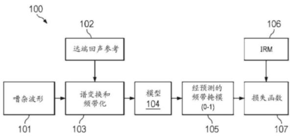
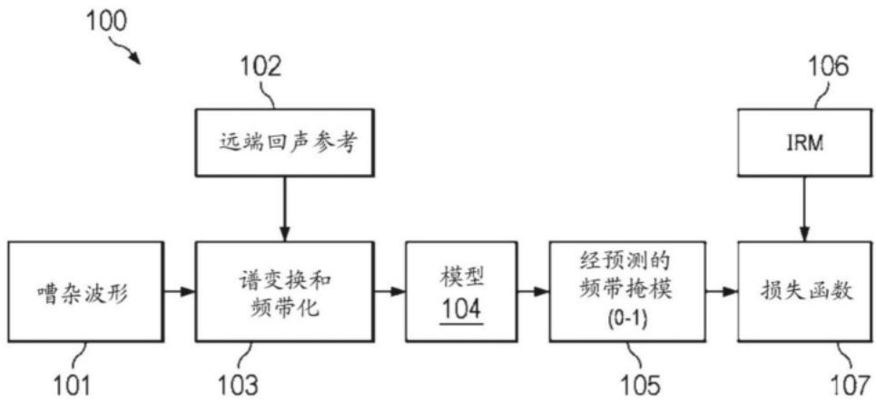
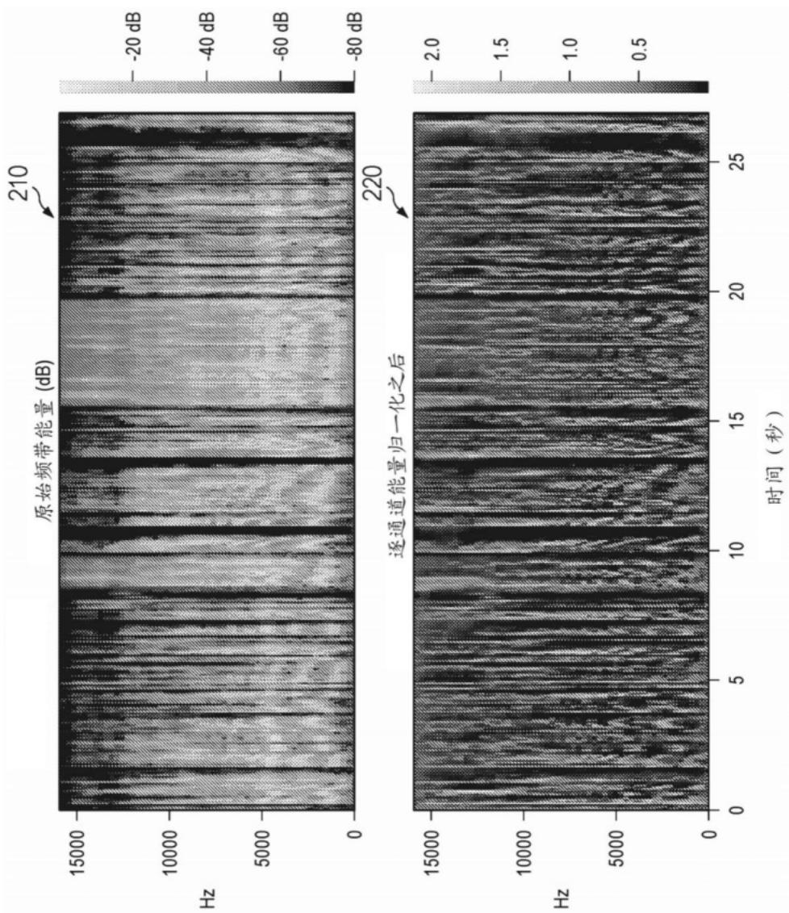
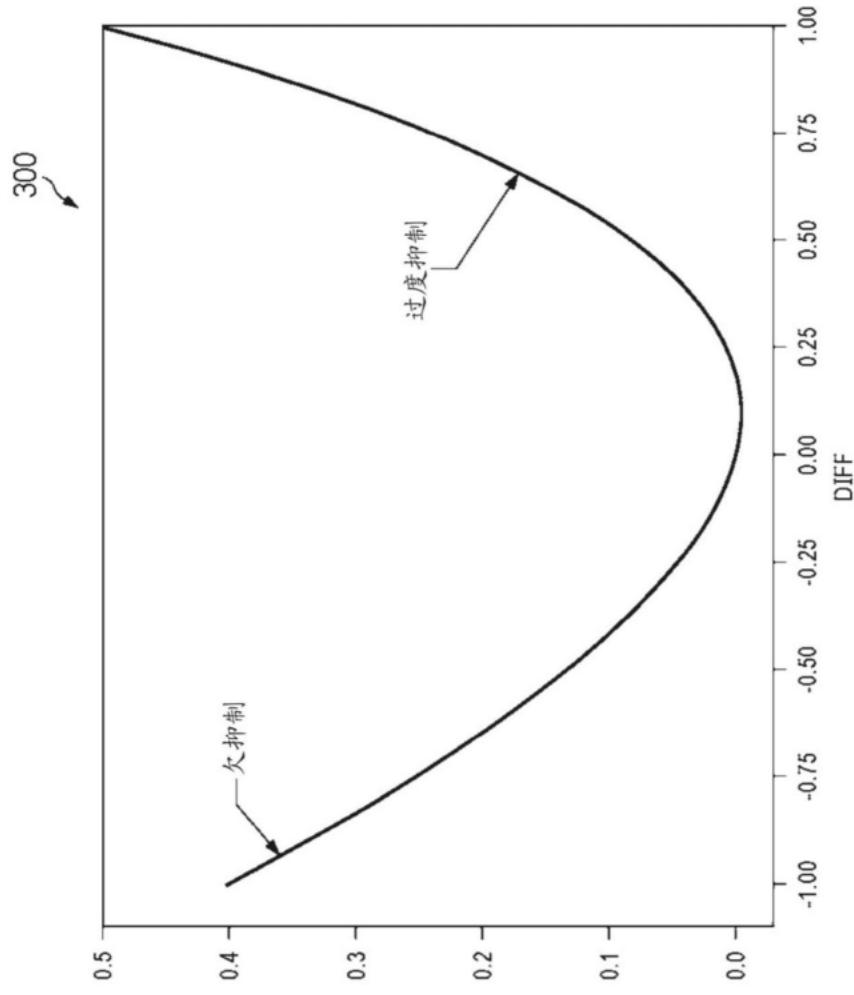
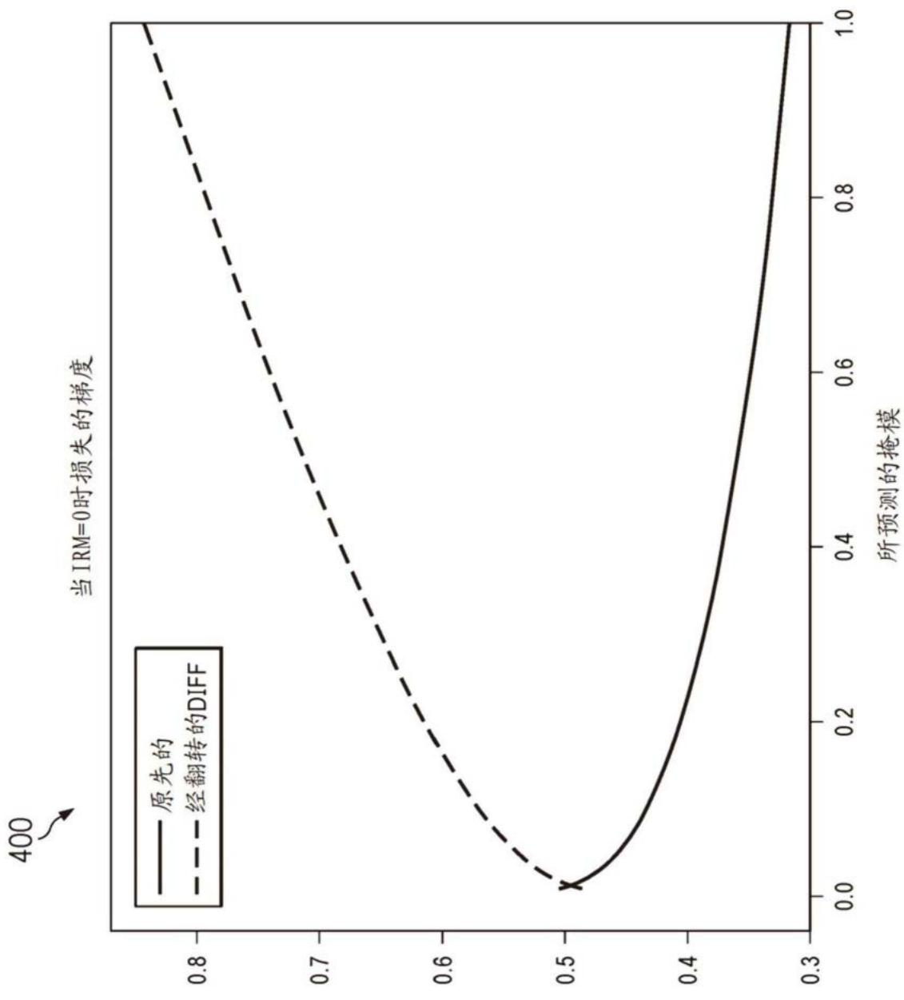
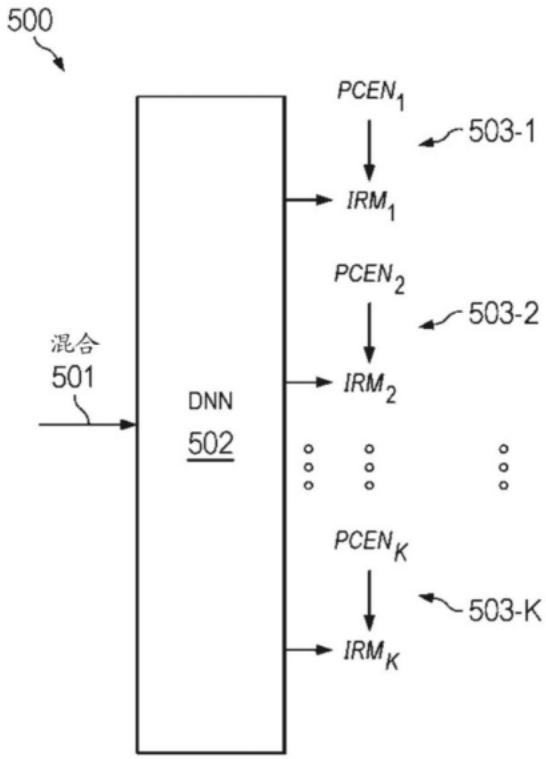
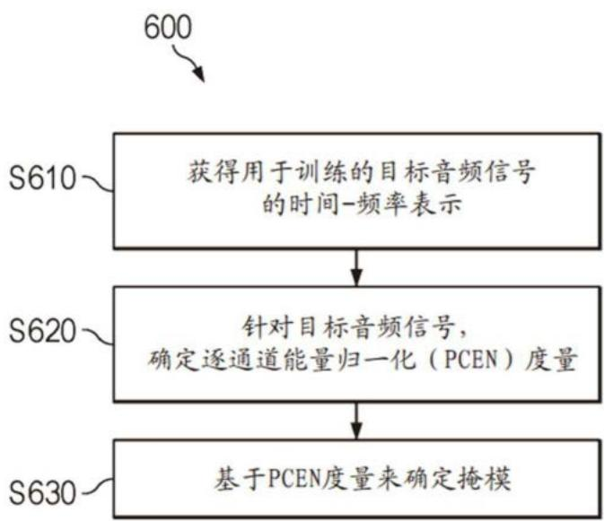
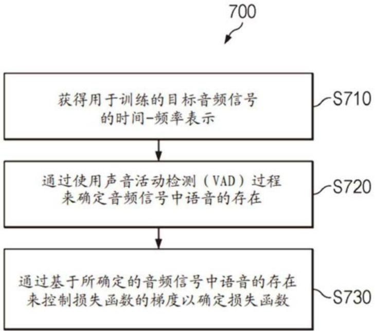
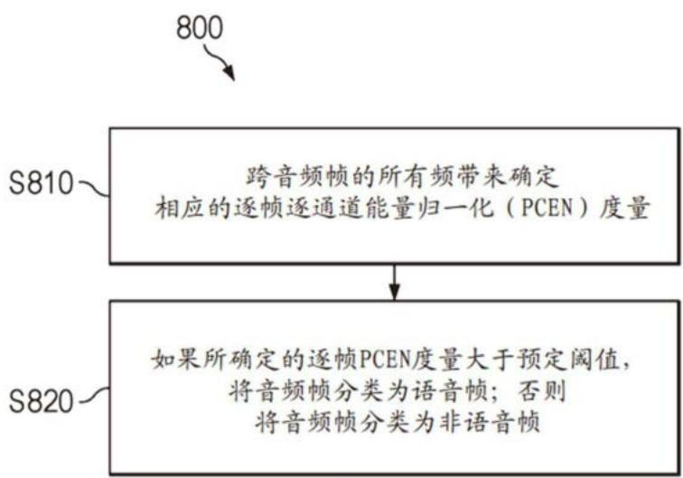
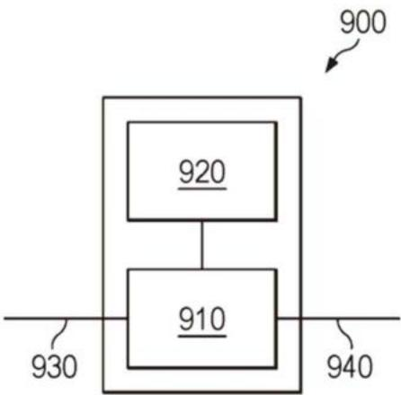

## (12)发明专利申请

(21)申请号 202380048431 .2

(22)申请日 2023.04.19

(30)优先权数据63/437 ,273 2023.01 .05 US63/493,979 2023.04.03 US

(66)本国优先权数据PCT/CN2022/087983 2022.04.20 CN

(85)PCT国际申请进入国家阶段日2024 .12.19

(86)PCT国际申请的申请数据PCT/US2023/019105 2023.04.19

(87)PCT国际申请的公布数据WO2023/205240 EN 2023.10.26

(71)申请人 杜比实验室特许公司地址 美国加利福尼亚州

## (54)发明名称

用于训练基于DNN的语音增强模型的基于PCEN的掩模阈值化和声音活动检测

## (57)摘要

本公开描述了确定至少一个掩模的方法，其用于训练基于深度神经网络(DNN)的基于掩模的音频处理模型。特别地，该方法可以包括获得用于训练的目标音频信号的时间‑频率表示。该方法还可以包括针对目标音频信号来确定逐通道能量归一化(PCEN)度量。该方法也可以进一步包括基于PCEN度量来确定至少一个掩模。

(10)申请公布号 CN 119404249 A

(43)申请公布日 2025.02.07

(72)发明人 刘晓宇 R·M·菲金 周聪 李凯

(74)专利代理机构 北京市汉坤律师事务所11602专利代理师 魏小薇 吴丽丽

(51)Int.Cl. (2006.01) (2006.01)

权利要求书3页 说明书20页 附图6页

1.一种确定至少一个掩模的方法，所述至少一个掩模用于训练基于深度神经网络DNN的基于掩模的音频处理模型，所述方法包括：

获得用于所述训练的目标音频信号的时间‑频率表示；

确定所述目标音频信号的逐通道能量归一化PCEN度量；以及

基于所述PCEN度量来确定所述至少一个掩模。

2.根据权利要求1所述的方法，其中所述目标音频信号包括语音和/或音乐。

3.根据权利要求1或2所述的方法，其中所述目标音频信号用作所述训练的基准真值。

4.根据前述权利要求中一者所述的方法，其中所述目标音频信号包括干净的音频分量和诸如录音噪声和/或房间噪声的平稳噪声分量。

5.根据前述权利要求中一者所述的方法，其中所述PCEN度量基于所述目标音频信号的时间‑频率能量度量与所述目标音频信号的所述时间‑频率能量度量的运行平均值的比值而被确定。

6.根据前述权利要求中一者所述的方法，其中所述方法还包括：

基于所述目标音频信号来获得音频混合，其中所述音频混合除了所述目标音频信号之外还包括音频伪影；以及

其中基于所述PCEN度量来确定所述至少一个掩模包含：

基于所述目标音频信号和所述音频混合来确定至少一个理想比值掩模IRM度量；以及

基于所述PCEN度量来调整所述至少一个IRM度量以获得所述至少一个掩模。

7.根据权利要求6所述的方法，其中所述音频伪影包括以下至少一种：噪声、回声或混响。

8.根据权利要求6或7所述的方法，其中所述IRM度量被确定为所述目标音频信号的时间‑频率能量度量对包括所述音频伪影的所述音频混合的时间‑频率能量度量的比值。

9.根据权利要求6至8中任一项所述的方法，其中所述所述PCEN度量和IRM度量的相应值针对所述目标音频信号的每个时间‑频率带而被确定；并且

其中，所述IRM度量的调整包含：

针对每个时间‑频率带，如果相应的PCEN度量值小于第一预定阈值，则将所述时间‑频率带的相应的IRM度量值设置为0。

10.根据前述权利要求中一者所述的方法，其中所述方法还包括：

将所述目标音频信号分类为语音帧或非语音帧；以及

针对每个音频帧，进一步基于语音帧或非语音帧的分类来确定所述至少一个掩模。

11.根据权利要求10所述的方法，其中针对所述目标音频信号的每个音频帧，所述将所述目标音频信号分类为语音帧或非语音帧包含：

跨所述音频帧的所有频带来确定相应的逐帧PCEN度量；以及

如果被确定的逐帧PCEN度量大于第二预定阈值，则将所述音频帧分类为语音帧；否则将所述音频帧分类为非语音帧。

12.根据权利要求10或11在其依赖于权利要求6到9中的任一项时所述的方法，其中基于语音帧或非语音帧的所述分类来确定所述至少一个掩模包含：

将所有非语音帧的相应的IRM度量值设置为0。

13.根据前述权利要求中一者所述的方法，其中针对每个时间‑频率带，所述PCEN度量

根据以下公式被确定：

$$
P C E N (t, f) = \left(\frac {S (t , f)}{(\varepsilon + M (t , f)) ^ {\alpha}} + \delta\right) ^ {r} - \delta^ {r},
$$

其中S(t，f)是所述目标音频信号的时间‑频率能量，ε、α、δ和r是预定常数，并且M(t，f)是S(t，f)的运行平均值，被定义为：

$$
\mathrm{M} (t, f) = (1 - s) \cdot \mathrm{M} (t - 1, f) + s \cdot S (t, f),
$$

其中s是预定平滑因子。

14.根据前述权利要求中一者所述的方法，其中所述基于DNN的基于掩模的音频处理模型是被配置为被训练用于预测多个掩模的多任务模型，所述多个掩模各自与相应的音频处理方面相对应，并且其中所述方法包含：

针对每个音频处理方面，获得相应的目标音频信号；

针对每个目标音频信号，确定相应的PCEN度量；以及

基于所述PCEN度量来确定相应的掩模。

15.一种确定语音感知的损失函数的方法，所述语音感知的损失函数用于训练基于深度神经网络DNN的音频处理模型，所述方法包括：

获得用于所述训练的目标音频信号的时间‑频率表示；

通过使用声音活动检测VAD过程来确定所述目标音频信号中语音的存在；以及

通过基于被确定的所述目标音频信号中语音的存在来控制所述损失函数的梯度以确定所述损失函数。

16.根据权利要求15所述的方法，其中所述VAD过程包含：

确定所述目标音频信号中语音的逐帧存在和/或逐频带存在；以及

其中基于被确定的所述目标音频信号中语音的存在来控制所述损失函数的所述梯度包含：

针对非语音帧和/或非语音频带，增加所述损失函数的相应梯度使得在所述非语音帧和/或非语音频带中更加积极地抑制音频伪影。

17.根据权利要求16所述的方法，其中针对所述目标音频信号的每个音频帧，确定所述目标音频信号中语音的所述逐帧存在包含：

跨相应的音频帧的所有频带来确定逐帧逐通道能量归一化PCEN度量；以及

如果被确定的逐帧PCEN度量大于预定阈值，则确定所述相应的音频帧含有语音。

18.根据权利要求16或17所述的方法，其中针对所述目标音频信号的每个语音帧，确定所述目标音频信号中语音的所述逐频带存在包含：

针对所述语音帧的每个频带确定相应的逐频带PCEN度量；以及

如果被确定的逐频带PCEN度量小于第二预定阈值，则将所述语音帧的相应频带确定为非语音频带。

19.根据权利要求15至18中任一项所述的方法，其中所述损失函数以如下方式被确定：使得在所述目标音频信号中对语音的过度抑制的惩罚大于对噪声的欠抑制的惩罚。

20.根据权利要求15至19中任一项所述的方法，其中针对每个时间‑频率带，所述损失函数被定义为：

$$
\mathrm{loss} = \mathrm{a} ^ {\mathrm{diff}} - \mathrm{diff} - 1,
$$

其中a为预定常数，并且diff指示针对所述目标音频信号被确定的理想比值掩模IRM度量与由所述基于DNN的音频处理模型所预测的经估计的掩模mask 之间的差值。 $\mathrm { \dot { \ell } _ { e s t } }$

21.根据权利要求20所述的方法，其中，针对语音帧，所述diff被定义为：

$$
d i f f = I R M ^ {\gamma} - m a s k _ {e s t} ^ {\gamma}, \mathrm{并且}
$$

针对非语音帧，所述diff被定义为：

$$
d i f f = m a s k _ {e s t} ^ {\gamma},
$$

其中 γ 为预定常数。

22.根据权利要求20或21所述的方法，其中所述IRM度量是通过使用根据权利要求1至14中任一项所述的方法来确定的掩模。

23.根据权利要求15至22中任一项所述的方法，其中确定所述损失函数包含：

针对语音帧和非语音帧，确定相应的损失函数；以及

对所有时间‑频率带的所述损失函数求均值，从而获得最终的损失函数。

24.一种训练基于深度神经网络DNN的音频处理模型的方法，其中所述基于DNN的音频处理模型基于以下内容被训练：

通过使用根据权利要求1至14中任一项所述的方法来确定的所述掩模，和/或

通过使用根据权利要求15至23中任一项所述的方法来确定的所述损失函数。

25.一种将目标音频信号分类为语音帧或非语音帧的方法，针对所述目标音频信号的每个音频帧，所述方法包括：

跨所述音频帧的所有频带来确定相应的逐帧逐通道能量归一化PCEN度量；以及

如果被确定的逐帧PCEN度量大于预定阈值，则将所述音频帧分类为语音帧；否则将所述音频帧分类为非语音帧。

26.一种装置，所述装置包括处理器和耦接到所述处理器的存储器，其中所述处理器适于使得所述装置执行根据前述权利要求中任一项所述的方法。

27.一种包括指令的程序，所述指令当由处理器执行时，使得所述处理器执行根据权利要求1至25中任一项所述的方法。

28.一种存储有根据权利要求27所述的程序的计算机可读存储介质。

# 用于训练基于DNN的语音增强模型的基于PCEN的掩模阈值化和声音活动检测

[0001] 相关申请的交叉引用

[0002] 本申请要求获得下列优先权申请的优先权：于2023年4月3日提交的申请号为63/493,979的美国临时申请、于2023年1月5日提交的申请号为63/437,273美国临时申请、以及于2022年4月20日提交的申请号为PCT/CN2022/087983的国际申请，其中的每个申请均以其整体并入于此。

## 技术领域

[0003] 本公开针对音频处理的一般领域，更具体地说，针对使用神经网络的语音增强。

## 背景技术

[0004] 一般而言，与语音增强相关的处理通常旨在从嘈杂波形中去除一个或多个不需要的伪影并保留干净的语音。近来，此类语音增强过程也倾向于利用基于机器学习的技术，如深度神经网络(DNN)等。

[0005] 从广义上讲，在示例性的基于DNN的系统中，可以通过谱变换和(可选的)频带化(banding)来处理嘈杂波形，嘈杂波形可以是干净语音、噪声、回波(echo)、混响(reverberation)以及远端回波参考信号等的混合，。随后，DNN可以将混合频带能量作为输入，并试图预测每个时间‑频率带(time‑frequency band)的掩模。掩模值通常在0到1之间，这通常表示存在于混合中的语音的(估计的/预测的)程度。在训练过程中，DNN可能暴露于一个大的混合的数据集，该数据集例如可以是通过随机地添加所有信号分量或类似方法而手动创建。在一些可能的实施方式中，对于每个样本，可以根据以下公式定义理想的掩模—比如理想比率掩模(ideal ratio mask ,IRM)：

[0006]

$$
I R M (t, f) = \frac {S (t , f)}{S (t , f) + N (t , f) + E (t , f)}\tag{1}
$$

[0007] 其中，S(t，f)、N(t，f)以及E(t，f)一般分别是干净语音、噪声和回声的时间‑频率带能量。然后，如技术人员可以理解并认识到的，DNN的权重将以最小化损失函数为方向进行更新，该函数通常测量预测掩模和理想掩模之间的差异。

[0008] 然而，上述基于理想掩模的技术可能存在一些问题。首先，收集大量的演播室质量的干净语音信号通常可能具有挑战性。很多时候，(在训练中添加额外的噪声之前，例如，针对去噪声任务)“干净”的信号可能会带有一定程度的平稳(stationary)噪声，如录音噪声、房间噪声等。因此，IRM通常大于其应有的大小，并且利用这种IRM进行训练的模型通常不能去除关联的平稳噪声。此外，在干净的语音信号中，可能存在一些其能量相对较小(例如，低于某一阈值)的时间‑频率带。省略这些频带可能感知上并不明显。然而，需要一个算法来仔细挑选阈值以避免将有意义的语音归零。此外，在一些可能的情况下，语音增强DNN可能还需要(至少隐式地)学习声音活动检测器(voice activity detector ,VAD)的行为，例如为了能够保留语音并去除语音区域中的噪声，同时(积极地)去除非语音区域中不需要的伪

影。

[0009] 鉴于上述部分或全部问题，一般来说，需要存在执行用于训练基于DNN的语音增强模型的声音活动检测和/或掩模阈值化(thresholding)的技术和/或机制。

## 发明内容

[0010] 鉴于上述内容，本公开整体上提供了：一种确定至少一个掩模的方法，该至少一个掩模用于训练基于深度神经网络(DNN)的基于掩模的音频处理模型；一种确定语音感知的损失函数的方法，该损失函数用于训练基于DNN的音频处理模型；一种将目标音频信号分类为语音帧或非语音帧的方法；对应的设备、程序以及计算机可读存储介质，其具有相应独立权利要求的特征。

[0011] 根据本公开的第一方面，提供了一种确定至少一个掩模(例如，一个或多个掩模)的方法，该掩模用于训练基于DNN的基于掩模的音频处理模型。该模型可以被训练用于执行任何合适的音频相关处理，例如(但肯定不限于)语音增强(例如，去噪声、去除伪影等)等。同样如技术人员能理解并认识到的，取决于各种实施方式和/或应用，可以使用任何合适的DNN(或更一般地，任何合适的神经网络)实施方式而无论实际的架构。

[0012] 特别地，该方法可以包括获得用于训练的目标音频信号的时间‑频率表示。一般而言，特别是在本公开的技术上下文中，除非另有说明，否则术语“目标音频信号”通常用于指代基于DNN的模型所针对进行训练以执行相应的音频处理的音频信号。作为易于理解的说明性(非限制性)示例，在模型被训练为从嘈杂音频混合中只保留干净的音频信号(例如，通过去除所有不需要的伪影)的某些情况下，则目标音频信号可以是干净的音频(例如，语音)信号(例如，由专业人员所收集)。在模型被训练为从嘈杂音频混合中不去除混响(但去除所有其他伪影)的其他一些情况下，则目标音频信号可以是混响音频信号(即，具有混响)。因此，在某些可能的情况下，此类目标音频信号也可以被理解为表示训练的基准真值(groundtruth)。

[0013] 该方法还可以包括针对目标音频信号确定逐通道能量归一化(PCEN)度量。如下面将更详细地讨论的，可以将PCEN视为一种用来对谱图(spectrogram)中的每个频率通道的能量进行归一化的音频信号处理技术。从广义上说，基于PCEN的技术可以通过将谱图中每个频率通道的能量除以与该通道随时间的平均能量成比例的量来寻求对该通道的能量进行归一化。这有助于减少背景噪声和跨不同频率通道的信号水平变化的影响。

[0014] 相应地，该方法还可以包括基于PCEN度量来确定至少一个掩模。

[0015] 以上述方式进行配置，所提出的方法可以总体上提供一种高效、灵活但可靠的机制，用于确定可能在之后用于训练基于DNN的音频处理(例如，语音增强)模型的掩模。具体来说，如上所述，针对训练所收集的“干净”语音信号(例如，上述公式(1)中的S(t,f))往往会有一定程度的平稳噪声，这可能导致利用常规IRM进行训练的DNN无法成功并彻底地去除此类平稳噪声。现在，特别是通过在过程中引入如上文所提出的PCEN度量，可以通过也能够在很大程度上(在某些情况下甚至完全)去除此类平稳噪声(通常嵌入在“干净”信号中)的方式来确定(一个或多个)掩模，从而显著提高后续训练过程的性能，进而，也能在真正实践中(即，模型已被训练后)显著地提高最终性能。附带地，还需要注意的是，与常规技术相比，本公开中提出的PCEN度量通常仅在训练阶段使用而不在测试时使用。

[0016] 在一些示例实施方式中，目标音频信号可以包括语音和/或音乐。如上所述，如上所述，如技术人员所能理解并认识到的，取决于不同的实施方式和/或应用，目标音频信号可以包括音频信号的任何其他合适形式。

[0017] 在一些示例实施方式中，目标音频信号可以作为训练的基准真值来使用。

[0018] 在一些示例实施方式中，目标音频信号可以包括干净的音频分量和平稳噪声分量，例如录音噪声和/或房间噪声。如上所述，在某些可能的情况下，例如在演播室生产期间，所获得的“干净”信号可能(有时不可避免地)包括某种程度的平稳噪声，该平稳噪声可能包括(但肯定不限于)录音噪声(例如，录音设备的机械噪声)、(背景)房间噪声(例如，气流声等)。然而，值得一提的是，同样如技术人员所能理解并认识到的，特别是在本公开的技术上下文中，此类平稳噪声应该与那些可能以训练(例如，去噪声)为目的而已经具体地甚至刻意地被插入或添加到“干净”信号的(例如，人造的/人为生成的)噪声相区分。此外，可能值得再次强调的是，(在“干净”的音频信号被用作基准真值的情况下)训练过程本身通常是为了消除那些人造的/人为生成的噪声；而在另一方面，本发明提出的技术通常是为了去除这些平稳噪声(其可能已经存在于用作训练的基准真值的“干净”音频信号中)的作用或影响，从而提高整体训练的性能。

[0019] 在一些示例实施方式中，PCEN度量可以基于目标音频信号的时间‑频率能量度量与目标音频信号的时间‑频率能量度量的运行平均值之间的比率来确定。如技术人员所能理解并认识到的，类似于时间‑频率表示的情况，在这里也可以根据各种实施方式和/或情况来使用任何合适的时间‑频率能量度量。例如，在某些可能的情况下，时间‑频率能量度量可以作为频带能量来实施。在一些其他可能的情况下，例如当不使用频带化时，时间‑频率能量度量可以替代地使用例如分箱(bin)能量来实现。当然，这种一般性应用于任何合适的变换(例如，快速傅里叶变换(FFT)、调制离散变换(MDXT)、复正交镜像滤波器(CQMF)等)和/或频带化类型。

[0020] 在一些示例实施方式中，该方法还可以包括基于目标音频信号来获得音频混合(或有时也称为音频混录)。特别地，除了目标音频信号之外，音频混合可以包括音频伪影——例如，噪声、(远端)回波、混响等。取决于不同的情况，音频混合可以被预先收集(例如，从一个或多个可用的数据库)或生成(例如，手动地或自动地)。如技术人员所能理解并认识到的，可以以符合相应的训练为目的(对应于相应的音频处理方面)来生成音频混合。作为一个说明性(非限制性)示例，当为了去除噪声(去噪声)而进行训练的情况下，音频混合可以用包括各种合适的(例如，人工生成的)噪声的形式进行生成。类似地，作为另一个说明性(非限制性)示例，当为了消除混响而进行训练的情况下，音频混合可以用包括各种合适的(例如，人工生成的)混响的形式进行生成。更具体地，基于PCEN度量来确定至少一个掩模可以包含基于目标音频信号和音频混合来确定至少一个理想比率掩模(IRM)度量；以及调整至少一个IRM度量以基于PCEN度量来获得至少一个掩模。换句话说，可以理解，本公开所建议的技术可以将IRM度量作为起点，并且通过基于PCEN度量来合适地且恰当地调整IRM度量(该特征(与其他因素一起)减少或消除了隐藏在干净的基准真值音频信号中的可能的平稳噪声的影响)，得出可用于后续训练过程的最终掩模。如技术人员所能理解并认识到的，IRM度量可以根据上述公式(1)或通过使用任何其他合适的实施方式来确定。

[0021] 在一些示例实施方式中，音频伪影可以包括以下中的至少一种：噪声、回波或混响。如上所述，这种类似伪影的噪声要与可能隐藏在干净的基准真值音频信号中的上述平稳噪声相区分。当然，如技术人员所能理解并认识到的，也可以考虑将任何其他合适的音频伪影作为训练的目的。

[0022] 在一些示例实施方式中，诸如根据以上定义的公式(1)，可以将IRM度量确定为目标音频信号的时间‑频率能量度量与包括音频伪影的音频混合的时间‑频率能量度量的比率。如上所示，可以考虑将时间‑频率能量度量的任何合适实施方式用于此类计算。当然，根据各种实施方式和/或应用，也可以采用任何其他合适方式来确定(计算)。

[0023] 在一些示例实施方式中，可以针对目标音频信号的每个时间‑频率带来确定PCEN和IRM度量的相应值。因此，IRM度量的调整可以包括：对于每个时间‑频率带，如果相应的PCEN度量值小于第一预定(或预配置)阈值(例如， $\cdot 1 0 ^ { - 5 } )$ ，则将该时间‑频率带的相应IRM度量值设置为0。特别是，通过将具有平稳噪声的频带的IRM度量设置为0，可以将模型训练到能够学会完全去除此类(平稳)噪声(通过其他方式可能难以识别和/或去除该噪声)。此外，通过将小能量语音带的IRM度量设置为0来省略该小能量语音带，可以减少训练目标的可变性，并且也可能使模型能够专注于有意义的语音带。更具体地，由于考虑到PCEN度量通常代表了目标信号的平滑版本，因此PCEN后的能量动态范围将相对较窄(与不采用PCEN的技术相比)。因此，可以适当地确定全局常数作为阈值。例如，在一些可能的(非限制性的)实施方式中，可以通过生成许多经PCEN处理的语音带能量的直方图并选择不会零输出语音的(有意义的)小边界值来获得该阈值。

[0024] 在一些示例实施方式中，该方法可以进一步包括将目标音频信号分类为语音帧或非语音帧。因此，该方法还可以包括，针对每个音频帧，进一步基于语音帧或非语音帧的分类来确定至少一个掩模。

[0025] 在一些示例实施方式中，针对目标音频信号的每个音频帧，将目标音频信号分类为语音帧或非语音帧可以包含：跨该音频帧的所有频带来确定相应的逐帧PCEN度量；如果所确定的逐帧PCEN度量大于第二预定阈值，则将该音频帧分类为语音帧；否则，将该音频帧分类为非语音帧。如技术人员所能理解并认识到的，(前面所提到的)PCEN度量和逐帧PCEN度量和/或第一和第二预定阈值可以(但肯定不必须)是相同的或以不同方式来计算。在一些可能的实施方式中，可以凭经验将第二预定阈值确定为第一预定阈值乘以帧中频带的数量(例如，平均值)。

[0026] 在一些示例实施方式中，进一步基于语音帧或非语音帧的分类来确定至少一个掩模可以包含将所有非语音帧的相应IRM度量值设置为0。换句话说，如果帧能量低于第二阈值，则该帧可以被分类为非语音帧，因此，可以将该帧中所有频带的相应IRM值设置为0，这可以有助于进一步减少训练目标的可变性。

[0027] 在一些示例实施方式中，针对每个时间‑频率带，可以根据以下公式来确定PCEN度量：

$$
P C E N (t, f) = \left(\frac {S (t , f)}{(\varepsilon + M (t , f)) ^ {\alpha}} + \delta\right) ^ {r} - \delta^ {r},\tag{[0028]}
$$

[0029] 其中S(t,f)是目标音频信号的时间‑频率能量， $\varepsilon _ { \setminus } 0 _ { \setminus }$ 、δ和r是预定常数， $\mathrm { { M } ( t , f ) }$ 是S$( \mathrm { t } , \mathrm { f } )$ 的运行平均值，其被定义为：

$$
\mathrm{M} (t, f) = (1 - s) \cdot \mathrm{M} (t - 1, f) + s \cdot S (t, f),
$$

[0031] 其中，s是预定平滑因子。需要指出的是，该计算仅作为说明性示例被给出，而不应被理解为任何形式的限制。当然，如技术人员所能理解并认识到的，根据各种实施方式和或应用，也可以使用任何其他合适的方式来确定或计算PCEN度量。

[0032] 在一些示例实施方式中，基于DNN的基于掩模的音频处理模型可以是多任务模型，其被配置为针对预测多个掩模来进行训练，该多个掩模中的每一个对应于相应的音频处理方面。也就是说，在一些可能的实施方式中，基于DNN的模型可以被训练来预测K组标记。作为说明性示例，一个掩模可以被定义为用来去除任何伪影(如噪声、混响、回声等)，而第二掩模可以被训练为不去除混响(但去除所有其他伪影)，并且最后，第三掩模可以用于保留音乐和语音。因此，该方法可以包括以下步骤：针对每个音频处理方面获得相应的目标音频信号；针对每个目标音频信号确定相应的PCEN度量；以及基于PCEN度量来确定相应的掩模。然而需要注意的是，在广义上，上面所示出的一个或多个基于PCEN的阈值可以应用于一组或多组掩模。换句话说，一些掩模可以(但不一定必须)使用所提出的基于PCEN的技术，而另一些则不使用。

[0033] 根据本发明的第二方面，提供了一种确定语音感知的损失函数的方法，该语音感知的损失函数用于训练基于DNN的基于掩模的音频处理模型。可以训练该模型来执行任何合适的音频相关处理，诸如(但肯定不限于)语音增强(例如，去噪声、去除伪影等)等，如技术人员所能理解并认识到的，取决于各种实施方式和/或应用，无论实际的体系结构如何，都可以使用任何合适的DNN(或者更一般的说，神经网络)实施方式。

[0034] 特别地，该方法可以包括获得用于训练的目标音频信号的时间‑频率表示。一般而言，特别是在本公开的技术上下文中，除非另有说明，否则术语“目标音频信号”通常用于指代为了执行相应的音频处理，基于DNN的模型训练所针对的音频信号。作为易于理解的说明性(非限制性)示例，在模型被训练为从嘈杂音频混合只保留干净的音频信号(例如，通过去除所有不需要的伪影)的某些情况下，则目标音频信号可以是干净的音频(例如，语音)信号(例如，由专业人员所收集)。在模型被训练为从有噪声的音频混合不去除混响(但去除所有其他伪影)的其他一些情况下，则目标音频信号可以是混响音频信号(即，具有混响)。

[0035] 该方法还可以包括通过使用声音活动检测(VAD)过程来确定音频信号中语音的存在。如技术人员所能理解并认识到的，可以使用任何合适的(现有或新的)VAD技术。现有VAD技术的一个说明性(非限制性)示例可以是传统的WebRTC VAD技术。

[0036] 该方法还可以包括基于所确定的目标音频信号中语音的存在来确定损失函数。特别地，如技术人员所能理解并认识到的，通常通过在所有模型权重中对梯度进行反向传播以使用梯度下降来最小化损失。因此，基于所确定的目标音频信号中语音的存在，可以通过控制损失函数的梯度来实现确定损失函数。

[0037] 在一些示例实施方式中，VAD过程可以包含确定目标音频信号中语音的逐帧存在和/或逐频带存在。此外，基于所确定的目标音频信号中语音的存在来控制损失函数的梯度可以包含增加非语音帧和/或非语音频带的损失函数的相应梯度，从而在非语音帧和/或非语音频带中更积极地抑制音频伪影。也就是说，在一些可能的实施方式中，可以控制梯度使得能够积极地将所预测的掩模向0驱动，从而去除非语音帧中不需要的伪影。

[0038] 以上述方式进行配置，所提出的方法可以总体上提供一种高效、灵活但可靠的机制来确定损失函数，该函数可以在之后用于训练基于DNN的音频处理(例如，语音增强)模型。具体地，根据上面所提出的技术，可以以如下设计方式来确定损失函数：(在语音帧中)相较于去除噪声，为保留语音分配更高的优先级；而在非语音帧中，则可以尽可能积极地抑制噪声(和其他不需要的伪影，诸如回声等)。因此，可以显著地提高训练过程的性能，并进而在真正实践中(即，在模型经过训练后)显著地提高最终性能。

[0039] 在一些示例实施方式中，对于目标音频信号的每个音频帧，确定目标音频信号中语音的逐帧存在包含：跨相应的音频帧的所有频带确定逐帧逐通道能量归一化(Per‑Channel Energy Normalization，PCEN)度量；并且如果所确定的逐帧PCEN度量大于预定阈值，则确定相应的音频帧含有语音。可以以任何合适的方式确定(例如，计算)逐帧PCEN，例如，与上文关于本公开的第一方面所描述的方式相似或不同。

[0040] 在一些示例实施方式中，对于目标音频信号的每个语音帧，确定音频信号中语音的逐频带存在可以包含：对于该语音帧的每个频带，确定相应的逐频带PCEN度量；并且如果所确定的逐频带PCEN度量小于第二预定阈值，则将该语音帧的相应频带确定为非语音频带。与上述内容类似，可以用与上文关于本公开的第一方面所描述的方式相同或不同的方式来确定或计算逐频带PCEN度量。

[0041] 在一些示例实施方式中，可以确定损失函数，使得在目标音频信号中对语音的过度抑制的惩罚大于对噪声的欠抑制的惩罚。一般来说，其主要原因之一是：(语音增强相关的)DNN通常是被训练来在语音区域中保留语音并去除噪声(常常倾向于保留语音)，而在非语音区域中积极地去除不需要的伪影(而不关心过度抑制语音)。

[0042] 在一些示例实施方式中，针对每个时间‑频率带，可以将损失函数损失定义为：

$$
[ 0 0 4 3 ] \quad \text { loss } = a ^ {\text { diff }} - \text { diff } - 1
$$

[0044] 其中a为预定的常数，并且diff指示针对目标音频信号所确定的理想比率掩模(IRM)度量与由基于DNN的音频处理模型所预测的估计掩模 $\mathrm { \ m a s k _ { \mathrm { e s t } } }$ 之间的差值。当然，如技术人员所能理解并认识到的，取决于各种实施方式和/或应用，可以确定/设计任何合适的损失函数。

[0045] 在一些示例实施方式中，针对语音帧，可以将diff定义为：

[0046]

[0047] 并且针对非语音帧，可以将diff定义为：

$$
[ 0 0 4 8 ] d i f f = m a s k _ {e s t} ^ {\gamma},
$$

[0049] 其中 γ 是预定常数。如上所述，根据各种实施方式和/或应用，也可以采用任何其他合适的方式来进行确定或计算。

[0050] 在一些示例实施方式中，IRM度量可以是通过使用根据关于本公开的第一方面所提出的任何一个示例实施方式所述的方法来确定的掩模。

[0051] 在一些示例实施方式中，确定损失函数可以包括：对于语音帧和非语音帧，确定相应的损失函数；以及，对所有时间‑频率带的损失函数求均值，从而获得最终的损失函数。当然，如上所述，根据各种实施方式和/或应用，可以采用任何其他合适的方法来确定或计算损失函数。

[0052] 根据本发明的第三个方面，提供了一种训练基于深度神经网络(DNN)的音频处理模型的方法。特别地，可以基于掩模和/或(语音感知的)损失函数来训练基于DNN的音频处理模型，其中，所述掩模是通过使用根据关于本公开的第一方面所提出的任何一个示例实施方式所述的方法来确定的，所述(语音感知的)损失函数是通过使用根据关于本公开的第二方面所提出的任何一个示例实施方式所述的方法来确定的。

[0053] 根据本发明的第四方面，提供了一种将目标音频信号分类为语音帧或非语音帧的方法。特别地，针对目标音频信号的每个音频帧，该方法可以包括：跨该音频帧的所有频带来确定相应的逐帧逐通道能量归一化(Per‑Channel Energy Normalization，PCEN)度量；并且如果所确定的逐帧PCEN度量大于预定阈值，则将该音频帧分类为语音帧；否则将该音频帧分类为非语音帧。

[0054] 根据本发明的第五方面，提供了一种包括处理器和耦接到该处理器的存储器的装置。处理器可适于使装置执行根据在前述方面中所描述的任何示例方法和其中任何示例实施方式的所有步骤。

[0055] 根据本发明的第六方面，提供了一种计算机程序。计算机程序可以包括指令，该指令当由处理器执行时使得该处理器执行本公开全文所描述的示例方法的所有步骤。

[0056] 根据本发明的第七方面，提供了一种计算机可读存储介质。该计算机可读存储介质可以存储前述的计算机程序。

[0057] 应当认识到的是，装置特征和方法步骤可以以多种方式互换。特别地，如技术人员所能理解的，所公开的(一个或多个)方法的细节可以通过对应的装置(或系统)来实现，反之亦然。此外，关于(一个或多个)方法的上述任何陈述都被应理解为同样适用于对应的装置(或系统)，反之亦然。

## 附图说明

[0058] 下面将参照附图来解释本公开的示例实施例，其中类似的参考编号指示类似或相似的元素，并且其中：

[0059] 图1是示出了基于深度神经网络(DNN)的示例音频处理系统的示意图，

[0060] 图2是示出了具有平稳噪声的语音信号的示例频带能量与其基于逐通道能量归一化(per‑channel energy normalization ,PCEN)的版本之间的比较的示意图，

[0061] 图3是示出了根据本公开的实施例的损失函数示例实施方式的示意图，

[0062] 图4是示出了根据本公开的实施例的另一个损失函数示例实施方式的示意图，

[0063] 图5是示出了根据本公开的实施例的被配置用于训练多任务模型的示例DNN的图示的示意图，

[0064] 图6是示出了根据本公开的实施例的确定至少一个掩模的示例方法的示意性流程图，该至少一个掩模用于训练基于DNN的基于掩模的音频处理模型，

[0065] 图7是示出了根据本公开的实施例的确定语音感知损失函数的示例方法的示意性流程图，该语音感知损失函数用于训练基于DNN的音频处理模型，

[0066] 图8是示出了根据本公开的实施例的将目标音频信号分类为语音帧或非语音帧的示例方法的示意性流程图，以及

[0067] 图9是根据本公开的实施例的用于执行方法的示例装置的示意框图。

## 具体实施方式

[0068] 如上所指，除非另有所指，否则本公开中相同或类似的参考编号可以指代相同或相似的元素，以便出于简要的原因而可以省略对其重复描述。

[0069] 特别地，图和下面的描述仅通过示意形式与优选的实施例相关。应该注意的是，从下面的讨论中，将很容易认识到本文所公开的结构和方法的替代实施例是在不偏离所要求保护的原理的情况下可被采用的可行替代方式。

[0070] 现在将参照若干实施例进行详细说明，其示例在附图中被示出。应当注意的是，在切实可行的情况下，相似或类似的参考编号可在附图中被使用，并可以表示相似或类似的功能。附图仅以说明为目的对所公开的系统(或方法)的实施例进行描述。本领域的技术人员将很容易地从下面的描述中认识到，在不偏离本文所描述的原理的情况下，可以使用本文所示的结构和方法的替代实施例。

[0071] 此外，在附图中，诸如实线、虚线或箭头等连接元素用于说明两个或多个其他示意元素之间的连接、关系或关联，任何此类连接元素的缺失并不意味着暗示不存在连接、关系或关联。换句话说，一些元素之间的连接、关系或关联没有在附图中示出，以免模糊本发明。此外，为了便于说明，单个连接元素用来表示元素之间的多个连接、关系或关联。例如，当连接元素表示信号、数据或指令的通信时，本领域的技术人员应该理解，此类元素表示(如可能所需的)影响通信的一个或多个信号路径。

[0072] 一般来说，与语音增强相关的处理通常旨在从嘈杂波形中去除一个或多个不需要的伪影并保留干净的语音。近来，此类语音增强过程也倾向于利用基于机器学习的技术，如深度神经网络(DNN)等。应当注意的是，虽然本公开可能频繁对语音增强等作出引述，但可以理解，这些仅仅作为一般意义上音频处理的可能示例，并且本公开不应被解释为仅限于语音增强。

[0073] 现在参考图1，其示意性地说明了根据本公开实施例的基于DNN的示例音频处理系统100的示意图。特别地，可以通过谱变换(Spectral Transform)和(可选地)频带化(Banding)103来处理嘈杂波形101和远端回声参考信号102，嘈杂波形101可以是干净语音、噪声、回声、混响等。随后，DNN 104可以将混合频带能量作为输入，并尝试预测每个时间‑频率带105的掩模。掩模值通常在0到1之间，这通常表示音频混合中语音的(估计的/预测的)存在程度。在训练阶段，DNN模型可能暴露于一个大的混合的数据集，该数据集例如可以通过随机地添加所有信号分量(或以类似方法)来手动创建。在一些可能的实施方式中，对于每个样本，可以定义理想的掩模，例如根据上述公式(1)的理想比率掩模(IRM)106。然后，如技术人员可以理解并认识到的，DNN权重将以最小化损失函数107为方向进行更新，最小化损失函数107通常测量预测掩模和理想掩模之间的差异。

[0074] 然而，正如上面已经简要讨论过的那样，此类系统在某些情况下可能会遇到若干潜在的问题。

[0075] 首先，通常认为收集大量的演播室质量的干净语音信号可能具有相当大的挑战性。很多时候，(在以针对相应的音频处理任务进行训练为目的添加额外的噪声之前)“干净”的信号可能会带有一定程度的平稳噪声，如录音噪声、房间噪声等。因此，常规的IRM度量常常大于其应有的大小，并且利用此类IRM进行训练的模型通常不能去除关联的平稳噪声。

[0076] 其次，在干净的语音信号中，通常可能存在某个(某些)时间‑频率带，其能量相对较小(例如，低于某一阈值)。具体来说，省略这些频带可能不会被最终用户感知到。考虑到这一点，在某些可能的情况下，简单地将这些频带的IRM值设置为0因此可能是安全的。对于基于DNN的训练的情况，通常认为将IRM值设置为0是有利的，因为这看上去有助于减少目标的可变性，使模型更容易专注于其他更有意义的语音频带。然而，需要算法来仔细地选择阈值，从而避免将有意义的语音归零。

[0077] 第三，在某些可能的情况下，语音增强DNN可能还需要学习(至少隐式地)两种行为。也就是说，在语音区域中，DNN可能需要尝试保留语音并去除噪声，通常会倾向于保留语音。另一方面，在非语音区域，DNN可能需要尝试积极地去除不需要的伪影，而不需要担心过度抑制语音。因此，可以看到DNN模型要内在地学习声音活动检测器(VAD)的行为。因此，在某些可能的情况下，可能需要在损失函数中包含一个手工制作的VAD，以促进对于何时要改变模型的积极性(语音帧vs.非语音帧)的学习。

[0078] 有鉴于此，从广义上说，本公开总体上寻求提出为了训练基于DNN的语音增强模型而执行掩模阈值化和/或声音活动检测的技术/机制。

[0079] 在详细介绍本公开的可能的示例实施例之前，可能值得先对逐通道能量归一化(PCEN)技术进行简要介绍，可以将该技术理解为用来对谱图中每个频率通道的能量进行归一化的音频信号处理技术。该技术可以用于各种领域和/或应用，诸如为鲁棒关键字定位处理前端特征等。从广义上说，基于PCEN的技术可以通过将谱图中每个频率通道的能量除以与该通道随时间的平均能量成比例的量来寻求对该通道的能量进行归一化。这有助于减少背景噪声和跨不同频率通道的信号水平变化的影响。

[0080] 更具体地说，在一些可能的实施方式中，给定语音信号的频带能量谱图S(t，f)，独立地对于每个频带f(视为t的函数)，可以根据以下公式计算PCEN度量：

[0081]

$$
P C E N (t, f) = \left(\frac {S (t , f)}{(\varepsilon + M (t , f)) ^ {\alpha}} + \delta\right) ^ {r} - \delta^ {r}\tag{2}
$$

[0082] 其中 $\mathtt { \Lambda } _ { \mathtt { E } } = 1 0 \overset { \mathtt { - 6 } } { \ , } \mathtt { d } = 0 . 9 8 \cdot \delta = 2 \vec { \mathbb { F } } \mathbb { H } \mathtt { r } = 0 . 5$ (或任何其他合适的值)是(预定的)常数，并且可以根据以下公式计算S(r，f)的运行平均值M(t，f)：

$$
[ 0 0 8 3 ] \quad \mathrm{M} (\mathrm{t}, \mathrm{f}) = (1 - \mathrm{s}) \cdot \mathrm{M} (\mathrm{t} - 1, \mathrm{f}) + \mathrm{s} \cdot \mathrm{S} (\mathrm{t}, \mathrm{f}) \tag {3}
$$

[0084] 其中s是平滑因子，可以将其设置为0.2或类似的值。

[0085] 当然，需要注意的是，如上述公式(2)和(3)中所定义的PCEN度量的示例性计算只是作为说明性示例来提供的，而不应被视为任何形式的限制。如技术人员所能理解并认识到的，也可以实施和采用任何其他合适的PCEN度量。

[0086] 此外，需要注意的是，本公开全文中所提出的算法既可以应用于频带能量(例如，如上所示)，又或者，如果在某些可能的情况下没有使用频带化，也可以应用于分箱能量等。此外，本公开全文中所提出的算法也可以适用于各种合适的变换(例如，快速傅里叶变换(FFT)、调制离散变换(MDXT)、复正交镜像滤波器(CQMF)等)和频带化类型。

[0087] 现在，参照附图，将更详细地讨论本公开中所提出的技术/机制，其中可以包括(但不限于)基于PCEN的掩模阈值化和声音活动检测，以改进掩模(例如，IRM等)和基于掩模的语音增强模型训练的损失函数。

[0088] 首先，将讨论与基于PCEN的掩模阈值化相关的技术。特别地，提出这些技术主要是针对上述所讨论的常规技术的第一和第二问题。如在上文的第一问题中所述，上述公式中的“干净”语音信号S(t,f)(有时也可以被理解为训练的基准真值)可能经常伴随某种平稳噪声(例如，来自录音设备、录音环境等)，在某些情况下，这可能会导致利用如上述公式(1)中所定义的IRM进行训练的DNN无法完全去除此类平稳噪声。

[0089] 然而，通常理解，对于每个频段f(当视为t的函数时)，语音分量的变化常常可能比平稳噪声分量的变化快得多。因此，在对于每个频带f的目标语音S(t,f)的PCEN度量的计算中(例如，根据上述公式(2)和(3))，由于分母项M(t,f)的平滑效果，可以将其视为起到了低通滤波器的功能。

[0090] 此外，如果将公式(2)中的 $\frac { S ( t , f ) } { ( \varepsilon + M ( t , f ) ) ^ { \alpha } }$ 项重写为 $\exp ( \mathrm { l o g } ( \mathrm { S ( t , f ) } ) - \mathbf { a } \bullet \mathrm { l o g } ( \mathbf { \varepsilon } + \mathrm { M ( t  }$

f)))，那么可以将PCEN视为对数能量域中的高通滤波器，其通常会减去缓慢变化的分量M(t,f)，并且在每个频带f中，很可能M(t,f)主要包含平稳噪声分量。

[0091] 图2示意性地示出了具有平稳噪声的语音信号的示例频带能量210与其基于PCEN的版本220之间的比较。

[0092] 特别地，在图2的示例中，如在上半图210中所示的PCEN前的频带能量看上去包含了低程度的平稳噪声(例如，大约在15到20秒之间)。相比之下，如在下半图220中所示，在PCEN处理后，看上去或多或少地(完整地/完全地)移除了平稳噪声(在15到20秒之间)。

[0093] 需要注意的是，可以将高通滤波的效果理解为在很大程度上由上述公式(3)中的平滑因子s所控制。具体地，一个较小的s可能导致去除更多的噪声，但同时也可能严重模糊语音谐波。因此，取决于不同的实施方式和/或应用，可能需要仔细地选择合适的平滑因子(例如，基于实验或模拟)。例如，在某些可能的情况下，凭经验可以观察到s＝0.2(而不是常规技术中的0.025)在某些应用中产生更好的结果。

[0094] 虽然在某些情况下可能需要仔细选择平滑因子s，但通常可以理解，PCEN在某些情况下仍可能导致语音丢失(例如，如在图2的下半图220中所示意性示出的那样)。

[0095] 因此，需要注意的是，本公开中所提出的技术不使用经PCEN处理的语音来定义理想掩模(或者换句话说，只是用经计算的PCEN版本来替换公式(1)中的S(t，f))。相反，所提出的技术一般使用经PCEN处理的语音信号来确定阈值。具体来说，如果S(t，f)的经计算的PCEN(t，f)小于阈值，则一个选项可以是简单地且直接地将IRM(t，f)设为0；否则，IRM度量可以保持与公式(1)中所定义的相同。

[0096] 通过将具有平稳噪声的频带的IRM设置为0，可以训练所提出的模型以学习完全去除此类平稳噪声，从而帮助解决上文所讨论的第一问题(即，涉及隐藏在“干净”信号中的可能的平稳噪声)。

[0097] 此外，如上述第二问题所述，通过将小能量的语音频带的相应IRM设置为0来省略小能量的语音频带，可以有助于减少训练目标的可变性，从而使模型能够专注于有意义的语音频带。

[0098] 然而，如在图2的上半图210中所示意性示出的那样，语音能量分布作为(t，f)的函数可能变化很大(特别是在某些可能的情况中作为f的函数，由于常常认为低频频带要比高频频带响得多)。因此，使用常规的简单方法(如全局方法或基于频带的均值方法)来确定阈值而不首先将S(t,f)的响度进行归一化，可能会导致语音的过度抑制(特别是在高频频

带)。

[0099] 相比之下，由于PCEN计算中的M(t，f)项通常是S(t，f)的平滑版本，因此上述公式(2)中的除法可以将每个频带的响度进行归一化。因此，如图2的下半图220中所示，PCEN后的能量动态范围看上去要窄得多，并且每个频带看上去都具有某种程度上相似的水平。因此，全局常数可以作为阈值——例如，通过生成许多经PCEN处理的语音频带能量的直方图，并且选择不会零输出语音的小边界值。在一些可能的实施设置中，可以使用阈值 $\mathrm { T H } _ { \mathrm { b a n d } } { = } 1 0$ (或类似的)。当然，如技术人员所能理解并认识到的，取决于各种实施方式和/或应用，可以用任何合适的方法来确定(例如，计算)该阈值，并且相应地可以设置任何合适的值。

[0100] 为便于理解，在上文所提出的基于PCEN的掩模阈值化算法可总结如下：

基于 PCEN 的掩模阈值化算法:
给定干净的语音频带能量  $S(t, f)$  、噪声和其他可能的伪影，进行如下步骤:
• 步骤 1: 按公式 (1) 中的定义计算  $IRM(t, f)$ 。
• 步骤 2: 按公式 (2) 和 (3) 中的定义计算  $PCEN(t, f)$ ，其中  $\varepsilon = 10^{-6}$ 、 $\alpha = 0.98$ 、 $\delta = 2$ 、r = 0.5，并且 s = 0.2。
• 步骤 3: 针对每一个  $(t, f)$ ，如果  $PCEN(t, f) &lt; TH_{band}$ ，则设置  $IRM(t, f) = 0$ ，其中  $TH_{band} = 10^{-5}$ 。

[0101]

[0102] 需要指出的是，同样如技术人员所能理解并认识到的，上述算法步骤(包括其中使用的参数/常数)只是以说明为目的被提供，而不应被理解为任何类型的限制。当然，取决于各种实施方式和/或应用，可以适当地调整步骤和/或参数/常数。

[0103] 接下来，将讨论与基于PCEN的声音活动检测(VAD)相关的技术。特别地，如上述关于第三问题所讨论的，在某些可能的情况下，可能希望帮助模型来学习语音帧与非语音帧和/或语音频带与非语音频带中的不同行为。具体地，对于语音帧，相较于去除噪声，可能需要将损失函数设计为将更高的优先级赋予保留语音；而在非语音帧中，则可能需要尽可能积极地抑制噪声(也可能还有其他不需要的伪影，如回声等)。因此，为了实现此类语音感知的训练，可能需要VAD以及可选的由VAD指导的损失函数。如技术人员所能理解并认识到的，可以使用任何合适的(现有的或新的)VAD技术并将其集成到语音感知的损失实施中。例如，现有VAD技术的说明性(非限制性)示例可以是传统的WebRTC VAD技术。

[0104] 在一些可能的实施方式中，可以将简单的基于PCEN的VAD建立在上文所提出的频带级PCEN阈值之上。即，给定目标语音S(t，f)，对于每一帧t，可以将系统配置为首先计算帧能量，例如以该帧中的频带能量之和的形式。随后，在一些可能的示例中，可以将系统配置为将语音帧级/非语音帧级(或逐帧 $\left( \mathrm { f r a m e ^ { - } w i s e } \right) ,$ )阈值凭经验设置为：

$$
\mathrm{TH} _ {\text {frame}} \approx \mathrm{TH} _ {\text {band}} \cdot \mathrm{N} \tag {4}\tag{[0105]}
$$

[0106] 其 $\mathrm { \mathbb { H } T H } _ { \mathrm { b a n d } }$ 可以是先前定义的频带级PCEN语音阈值，并且N可以是每一帧中的频带数量。例如，在一些可能的实施方式中，可以基于例如我们系统中的N＝56个频带乘以 $\mathrm { T H } _ { \mathrm { b a n d } }$ $= 1 0 ^ { ^ { - 5 } }$ 来设置出TH $_ { \mathrm { f r a m e } } { = } 0 . 0 0 0 5$ 。当然，类似于上述基于PCEN的阈值化，还应到注意，上述公式(4)中所定义的帧级阈值的示例性计算仅被提供为说明性示例，并且决不应被视为任何类型的限制。如技术人员所能理解并认识到的，也可以采用任何其他合适的实施方式。

[0107] 相应地，如果帧能量低于该逐帧阈值，则该帧可以凭经验被分类为非语音帧；因此，可以将该帧中所有频带的IRM值设置为0，这可以理解为能够进一步减少训练目标的可变性。

[0108] 此外，在一些可能的实施方式中，可以将用于训练DNN模型的损失函数设计为使得对语音的过度抑制的惩罚大于对不充分的噪声去除的惩罚。作为一个说明性(非限制性)示例，可以将损失函数(针对每个时间‑频率带来定义，但在以下公式中省略)定义为：

$$
\text { loss } = a ^ {\text { diff }} - \text { diff } - 1 \tag {5}\tag{[0109]}
$$

[0110] 其中，在某些可能的情况下，可以将diff理解为用来将IRM和来自DNN的经估计的掩模 $\mathrm { \ m a s k _ { \mathrm { e s t } } }$ 之间的差异表示为：

[0111]

$$
d i f f = I R M ^ {\gamma} - m a s k _ {e s t} ^ {\gamma},\tag{6}
$$

[0112] 其中， $\mathrm { a } = 2$ .7和 $\gamma = 0 . 5$ (或任何其他合适的值)可凭经验确定。

[0113] 在一些可能的实施方式中，可以使用幂律将IRM和上述公式(5)和(6)中所提出的经估计的掩模都转换为可感知的尺度；因此，可以将损失视为它们差异的指数函数。

[0114] 图3示意性地示出了以diff的函数的形式来绘制该loss的示例实施方式的图300。一般来说，在所示出的示例实施方式中的损失函数被设计为通过更大的梯度值来使得对语音的过度抑制的惩罚大于对噪声的欠抑制的惩罚。

[0115] 特别地，在示例图300中，在对应于模型对语音过度抑制(因为IRM大于根据上述公式(6)所预测的掩模)的正侧(即，其中diff＞0处)，损失函数更陡，相比于发生噪声的欠抑制的负侧(即，其中diff＜0处)的损失函数具有更大的梯度(更大的斜率)。由于与梯度下降相关的技术通常用于通过在所有模型权重中对该梯度进行反向传播来最小化损失，因此，相比于从另一侧，模型权重将更快地从过度抑制侧向最优点进行更新。

[0116] 然而，该损失函数看上去并不能区分语音帧和非语音帧。更具体地说，在非语音帧(例如，由PCEN‑VAD或任何其他合适的VAD过程所估计)中，因为如上文所述的那样，IRM被设置为0，通常不会发生语音的过度抑制(因为通常由s型函数(sigmoid function)在模型的最后一层来实施所预测的掩模，其通常大 $\mp 0 )$ 。因此，在一些可能的实施方式中，可以建议使用更大的梯度来积极地抑制这些(非语音)帧中的噪声。例如，在一些可能的示例中，该更大的梯度可以通过简单地翻转(反转)在上述公式(6)中所定义的diff函数中的两个项的顺序来实现：

$$
d i f f _ {n o n s p e e c h} = m a s k _ {e s t} ^ {\gamma} - I R M ^ {\gamma} = m a s k _ {e s t} ^ {\gamma},\tag{7}
$$

[0118] 因为如上所述，IRM度量已(有意地)被设置为0。

[0119] 因为d ${ \mathrm { i f f } } _ { \mathrm { n o n s p e e c } }$ 将总是处于损失函数的正侧(参见图3中的图300)，相较于公式(6)中原先的diff，(新的)损失函数将具有更大的梯度，而公式(6)中的diff是负的，并因此具有更小的梯度。

[0120] 图4示意性地示出了图400，图400绘制了新提出的损失函数关于非语音帧的预测掩码的梯度(其中通过上述PCEN‑VAD过程将IRM设置为0)，从中可以看到，仅仅通过翻转diff的符号便使更大的斜率(相比于图3中的情况)得以可能。由此，所预测的掩模将被积极地向0驱动以删除非语音帧中不需要的伪影。

[0123]

[0121] 然而，需要注意的是，如技术人员所能理解并认识到的，此类翻转diff的符号的方法只是作为说明性示例来提供的。取决于不同的实施方式和/或应用，可以考虑任何其他例如用于增加梯度的机制。例如，针对语音和非语音区域的计算，可以分别在上述公式(5)(7)中使用的不同的a和 γ 值。例如，对于语音帧，可以使用 $\mu _ { \mathrm { s p e e c } } = 2$ .7和 $\gamma _ { \mathrm { \ s p e e c h } } = 0 . 5 \bar  $ 或类似的值，这可以在语音保留和噪声抑制之间提供权衡。另一方面，对于非语音帧，可以替代地使用a $_ \mathrm { n o n s p e e c h } { > } 2$ .7和 $\gamma _ { \mathrm { \ n o n s p e e c h } } { < } 0$ .5或类似的值，因为在非语音帧的损失函数中，更大的a和更小的 γ 通常可以提供更大的梯度来更积极地去除噪声。当然，这些示例，包括所提及的值，都不应被理解为任何形式的限制。

[0122] 与上述内容类似，针对基于PCEN的VAD和语音感知的损失函数的所提出的算法可以总结如下：

基于PCEN的VAD和语音感知的损失函数：
给定干净的语音频带的能量 $S(t,f)$ 、噪声和其他可能的伪影，进行如下步骤：
- 步骤1：按公式（1）中的定义计算 $IRM(t,f)$ 。
- 步骤2：按公式（2）和（3）中的定义计算用于 $S(t,f)$ 的 $PCEN(t,f)$ ，其中 $\varepsilon=10^{-6}$ 、 $\alpha=0.98$ 、 $\delta=2$ 、r=0.5并且s=0.2。
- 步骤3：针对每一帧t，以 $E(t)=\sum_{f}PCEN(t,f)$ 来计算帧能量，并且如果 $E(t)&gt;TH_{frame}$ （语音帧），则设 $PCEN\_VAD(t)=1$ ，否则设为0。
- 步骤4：针对每一帧t，如果 $PCEN\_VAD(t)=0$ ，则将所有频带f的 $IRM(t,f)$ 设为0。
- 步骤5：针对语音和非语音帧，分别计算
$diff_{speech}=IRM^{\gamma}-mask_{est}^{\gamma}$ 和
$diff_{nonspeech}=mask_{est}^{\gamma}-IRM^{\gamma}=mask_{est}^{\gamma}$ 。
- 步骤6：针对语音帧和非语音帧，使用公式（5）来计算损失，并对所有 $(t,f)$ 频带的损失求平均以得到最终的损失。

[0124] 值得一提的是，同样如技术人员能理解并认识到的，上述算法步骤(包括其中使用的参数/常数)只是以说明为目的而提供的，而不应被理解为任何类型的限制。当然，取决于各种实施方式和/或应用，可以适当地调整步骤和/或参数/常数。

[0125] 例如，VAD控制的损失函数的一般思路可以进一步扩展到如上所述的特定损失函数之外。也就是说，可以使得其他合适的损失函数在语音区域对比非语音区域中具有更多或更少的积极性，例如，可以基于VAD值。在一些可能的实施方式中，基于VAD的损失函数可以使用时间信息以用于纯噪声段的不同处理策略。具体来说，通常由于语音信号的稀疏特性，即使在语音存在段(speech presence segment)期间，在某些可能的频带中也可能存在纯噪声。

[0126] 因此，在一些实施方式中，可以在训练期间在损失函数中使用例如子带语音存在概率估计。然后可以将上述经VAD控制的损失函数扩展到经子带语音存在概率控制的损失函数。在此类情况中，可以在损失函数的实施方式中使用任何合适的(现有的或新的)语音存在概率(speech presence probability ,SPP)估计方法或机制。作为该泛化的说明性示例，上述公式(7)中描述的符号翻转损失定义不仅可以应用于非语音帧(例如，由PCEN‑VAD所确定)，而且还可以应用于语音帧中的非语音频带(例如，由频带级PCEN阈值所确定)。

[0127] 此外，在一些可能的实施方式中，可以在实践中只使用算法/技术(即基于PCEN的掩模阈值化、基于PCEN的VAD、语音感知的损失函数)中的一种，或者在实践中同时使用更多算法/技术。

[0128] 例如，在某些可能的情况下，当使用所有上述所提出的技术时，可以首先运行PCEN掩模阈值化来将非语音频带的IRM设置为0(但这些帧可以是语音帧)。接下来，可以进行基于PCEN的VAD来将非语音帧的IRM设置为0。需要注意的是，在这两种算法中，对PCEN的输入都是原始的干净语音S(t，f)。进一步的，在某些可能的情况下，可以使用相同的PCEN参数，并由此可以对PCEN度量只进行一次计算。当然，在其他一些可能的情况下，相对于帧级决断，也可能可以针对频带级语音/非语音决断来使用不同的PCEN参数。最后，可以通过更新模型权重来最小化语音感知的损失。根据经验可以理解，与只使用其中一种技术/算法相比，使用上述所有技术/算法将获得最好的性能，导致更多的噪声和(特别是)回波被去除。

[0129] 需要注意的是，一般来说，无论其架构如何，用于预测IRM的任何合适的DNN都可以受益于本公开全文中所提出的算法，可以将之用于例如改进针对训练此类模型的IRM和损失函数的实施方式。

[0130] 例如，在一些可能的实施方式中，可以将所提出的PCEN‑阈值和PCEN‑VAD技术扩展到训练多任务模型。图5是示出了根据本公开的实施例的被配置用于训练多任务模型的示例DNN 500的示意图。

[0131] 特别地，如图5所示，可以将模型502训练为：采用音频混合501作为输入，预测K组IRM 503‑1、503‑2…503‑K。例如，可以定义一个IRM(例如，503‑1)以去除任何伪影(例如噪声、混响、回波等)，另一个IRM(例如，503‑2)可能不会去除混响(在这种情况下S(t，f)将是混响语音)，而第三个IRM(例如，503‑K)可能会以保留音乐或语音(在这种情况下S(t，f)将是音乐或语音)为目标。因此，可以将一个或多个PCEN阈值和PCEN‑VAD应用于一组或多组IRM。也就是说，基于PCEN的技术可以(但不必须)应用于IRM任务中的某一些(或全部)。

[0132] 如前所述，本公开全文中所提出的算法既可以应用于频带能量(例如，如上所示)，又或者如果在某些可能的情况中没有使用频带化，则也可以应用于分箱能量等。此外，本公开全文中所提出的算法还可以适用于各种合适的变换(例如，MDXT、CQMF等)和频带化类型。

[0133] 图6是示出了根据本公开的实施例的确定至少一个掩模(例如，一个或多个掩模)的方法600的示意性流程图，该至少一个掩模用于训练基于DNN的基于掩模的音频处理模型。如前所述，可以训练模型用于执行任何合适的音频相关处理，例如(但肯定不限于)语音增强(例如，去噪声、去除伪影等)等。同样如技术人员所能理解并认识到的，取决于各种实施方式和/或应用，无论实际的架构如何，总可以使用任何合适的DNN(或更一般地，神经网络)实施方式。

[0134] 特别地，如图6所示的方法600可以通过获得用于训练的目标音频信号的时间‑频率表示而从步骤S610开始。一般而言，特别是在本公开的技术上下文中，除非另有说明，否则术语“目标音频信号”通常用于指代基于DNN的模型所针对进行训练以执行相应的音频处理的音频信号。作为易于理解的说明性(非限制性)示例，在模型被训练为从嘈杂音频混合中仅保留干净的音频信号(例如，通过去除所有不需要的伪影)的某些情况下，则目标音频信号可以是干净的音频(例如，语音)信号(例如，由专业人员所收集)。在模型被训练为从嘈杂音频混合中不去除混响(但去除所有其他伪影)的其他一些情况下，则目标音频信号可以是混响音频信号(即，具有混响)。

[0135] 随后，在步骤S620处，方法600可以包括确定针对目标音频信号的PCEN度量。正如下面将更详细地讨论的，可以将PCEN视为一种用来对谱图中的每个频率通道的能量进行归一化的音频信号处理技术。从广义上说，基于PCEN的技术可以通过将谱图中每个频率通道的能量除以与该通道随时间的平均能量成比例的量来寻求对该通道的能量进行归一化。这有助于减少背景噪声和跨不同频率通道的信号水平变化的影响。

[0136] 因此，方法600还可以在步骤S630处包括基于PCEN度量来确定掩模。

[0137] 以上述方式进行配置，所提出的方法可以总体上提供一种高效、灵活但可靠的机制，用于确定可能在之后用于训练基于DNN的音频处理(例如，语音增强)模型的掩模。具体来说，如上所述，针对训练所收集的“干净”语音信号(例如，上述公式(1)中的S(t，f))往往会有一定程度的平稳噪声，这可能导致利用常规IRM进行训练的DNN无法成功并彻底地去除此类平稳噪声。现在，特别是通过在过程中引入如上文所提出的PCEN度量，可以通过也能够在很大程度上(在某些情况下甚至完全)去除此类平稳噪声(通常嵌入在“干净”信号中)的方式来确定(一个或多个)掩模，从而显著提高后续训练过程的性能，进而，也能在真正实践中(即，模型已被训练后)显著地提高最终性能。附带地，还需要注意的是，与常规技术相比，本公开中提出的PCEN度量通常仅在训练阶段使用而不在测试时使用。

[0138] 图7是示出了根据本公开的实施例的确定语音感知损失函数的示例方法700的示意性流程图，该语音感知损失函数用于训练基于DNN的音频处理模型。

[0139] 特别地，如图7所示的方法700可以通过获得用于训练的目标音频信号的时间‑频率表示而从步骤S710开始。随后，在步骤S720中，方法700可包括通过使用VAD过程来确定音频信号中语音的存在。如技术人员可以理解并认识到的，可以使用任何合适的(现有或新的)VAD技术。最后，方法700还可以进一步在步骤S730处包括基于所确定的目标音频信号中语音的存在来确定损失函数。特别地，如技术人员所能理解并认识到的，通常通过在所有模型权重中对梯度进行反向传播以使用梯度下降来最小化损失。因此，基于所确定的目标音频信号中语音的存在，可以通过控制损失函数的梯度来实现损失函数的确定。

[0140] 以上述方式进行配置，所提出的方法可以总体上提供一种高效、灵活但可靠的机制来确定损失函数，该函数可以在之后用于训练基于DNN的音频处理(例如，语音增强)模型。具体地，根据上面所提出的技术，可以以如下设计方式来确定损失函数：(在语音帧中)相较于去除噪声，为保留语音分配更高的优先级；而在非语音帧中，则可以尽可能积极地抑制噪声(和其他不需要的伪影，诸如回声等)。因此，可以显著地提高训练过程的性能，并进而也可以在真正实践中(即，在模型经过训练后)显著地提高最终性能。

[0141] 图8是示出了根据本公开的实施例的将目标音频信号分类为语音帧或非语音帧的示例方法800的示意性流程图。

[0142] 特别地，如图8中所示的方法800可以通过如下方式在步骤S810处开始：针对目标音频信号的每个音频帧，跨该音频帧的所有频带来确定相应的逐帧PCEN度量。随后，在步骤

S820处，方法800可以包括：如果所确定的逐帧PCEN度量大于预定阈值，则将该音频帧分类为语音帧；否则，将该音频帧分类为非语音帧。

[0143] 最后，本公开同样涉及用于执行本公开全文中所描述的方法和技术的装置。图9总体上示出了此类装置900的一个示例。特别地，设备900包括处理器910和耦接到处理器910的存储器920。存储器920可以存储有用于处理器910的指令。取决于各种用例和/或实施方式，处理器910还可以接收(但不限于)合适的输入数据930(例如，音频信号)。取决于各种用例和/或实施方式，处理器910可以适于执行本公开全文中所描述的方法/技术(参照上述图6至图8中所述的方法600、700、800中的任一种)，并适于生成对应的输出数据940(例如，掩模、损失函数等)。

## [0144] 解释

[0145] 实施上述技术的计算设备可以具有下述示例架构。其他架构——包括具有更多或更少组件的架构——也是可能的。在一些实施方式中，示例架构包括一个或多个处理器(例如，双核 处理器)、一个或多个输出设备(例如，LCD)、一个或多个网络接口、一个或多个输入设备(例如，鼠标、键盘、触摸感应显示器)和一个或多个计算机可读介质(例如，RAM、ROM、SDRAM、硬盘、光盘、闪速存储器等)。这些组件可以通过一个或多个通信信道(例如，总线)来对通信和数据进行交换，其中可以利用各种硬件和软件来促进组件之间的数据和控制信号的传输。

[0146] 术语“计算机可读介质”指代参与向处理器提供用以执行的指令的介质，包括但不限于：非易失性介质(如光盘或磁盘)、易失性介质(如存储器)和传输介质。传输介质包括但不限于同轴电缆、铜线和光纤。

[0147] 计算机可读介质还可以包括操作系统(例如， 操作系统)、网络通信模块、音频接口管理器、音频处理管理器和实时内容分发器。操作系统可以是多用户、多处理、多任务处理、多线程、实时的。操作系统执行基本任务，包括但不限于：识别来自网络接口和/或设备的输入并向其提供输出；对计算机可读介质(如存储器或存储设备)上的文件和目录保持跟踪和管理；控制外围设备；以及管理一个或多个通信通道上的流量。网络通信模块包括用于建立和维护网络连接的各种组件(例如，用于实施诸如TCP/IP、HTTP等通信协议的软件)。

[0148] 架构可以在并行处理或点对点基础设施中实施，或者可以在具有一个或多个处理器的单个设备上实施。软件可以包括多个软件组件，或者可以是单体代码。

[0149] 可以在执行于可编程系统的一个或多个计算机程序中有利地实施所述特征，其中可编程系统包括被耦接以从数据存储系统接收数据和指令并向数据存储系统发送数据和指令的至少一个可编程处理器、至少一个输入设备和至少一个输出设备。计算机程序是可以在计算机中直接或间接地用来执行某些活动或导致某些结果的一组指令。计算机程序可以以任何形式的编程语言(例如， $\mathrm { 0 b j e c t i v e - C \cdot J a v a ) }$ —包括经编译的或经解释的语言—来进行编写，并且可以以任何形式来部署，包括作为独立程序或作为模块、组件、子程序、基于浏览器的web应用程序或适合在计算环境中使用的其他单元。

[0150] 用于执行指令的程序的合适处理器包括例如通用和专用微处理器两者，以及任何类型的计算机的唯一处理器或多个核或多个处理器中的一个。一般来说，处理器将从只读存储器或随机访问存储器或同时从两者接收指令和数据。计算机的基本元素是用于执行指令的处理器和用于存储指令和数据的一个或多个存储器。一般来说，计算机还会包括一个或多个存储数据文件的大容量存储设备；此类设备包括磁盘，诸如内部硬盘和可移动磁盘；磁光盘；和光盘。适合于有形地体现计算机程序指令和数据的存储设备包括所有形式的非易失性存储器，包括例如半导体存储器设备，诸如EPROM、EEPROM和闪速存储器设备；磁盘，诸如内部硬盘和可移动磁盘；磁光盘；以及CD‑ROM和DVD‑ROM光盘。处理器和存储器可以由ASIC(特定应用集成电路)来补充或被包含其中。

[0151] 为了提供与用户的交互，可以在具有显示器设备——诸如用来向用户显示信息的视网膜显示器设备或CRT(阴极射线管)或LCD(液晶显示)显示器——的计算机上实施特征。计算机可以具有触摸表面输入设备(例如，触摸屏)或键盘和诸如鼠标或轨迹球的指向设备，用户可以通过其向计算机提供输入。计算机可以具有用于接收来自用户的语音命令的语音输入设备。

[0152] 可以在包括后端组件(诸如数据服务器)或包括中间件组件(诸如应用服务器或互联网服务器)或包括前端组件(诸如具有图形用户界面或互联网浏览器的客户端计算机)或其任何组合的计算机系统中实施特征。系统的组件可以通过数字数据通信的任何形式或媒介(诸如通信网络)来连接。通信网络的示例包括例如局域网、广域网、以及构成因特网的计算机和网络。

[0153] 计算系统可以包括客户端和服务器。客户端和服务器一般彼此远离并且一般通过通信网络进行交互。客户端和服务器之间的关系是由于在相应的计算机上运行并且彼此具有客户端‑服务器关系的计算机程序而生成的。在一些实施例中，服务器将数据(例如，HTML页面)传输到客户端设备(例如，用于向与客户端设备交互的用户显示数据并从其接收用户输入)。在服务器处可以从客户端设备接收在客户端设备上生成的数据(例如，用户交互的结果)。

[0154] 一个或多个计算机的系统可以通过在该系统上安装在运行时使得该系统执行特定操作的软件、固件、硬件或其组合而被配置为执行该操作。一个或多个计算机程序可以通过包括当由数据处理装置执行时使得该装置执行特定操作的指令而被配置为执行该操作。

[0155] 虽然本说明书包含许多特定的实施细节，但其不应被解释为对权利要求或任何发明范围的限制，而是作为对于针对特定发明的特定实施例的特征的描述。在本说明书中，在分开的实施例的上下文中所描述的某些特征也可以在单个实施例中结合实施。相反地，在单个实施例的上下文中描述的各个特征也可以在多个实施例中单独地或以任何合适的次级组合形式来实施。此外，尽管特征可以在上述内容中被描述为以某些组合起作用，并且甚至在一开始被声明如此，但在某些情况下，所声明的组合中的一个或多个特征可以从该组合中删除，并且所声明的组合可以指代次级组合或次级组合的变型。

[0156] 类似地，虽然在附图中以特定次序来描述操作，但这不应被理解为要求以所示出的特定次序或以顺序方式来执行所示出的操作或者要求执行所有示出的操作来达到期望的结果。在某些情况下，多任务处理和并行处理可能是有利的。此外，上述实施例中的不同系统组件的分离不应被理解为在所有实施例中都需要这样的分离，并且应该理解，所描述的程序组件和系统通常可以集成在单个软件产品中或打包到多个软件产品中。

[0157] 除非另有特别说明，否则从以下讨论中可以明显看出，本发明全文的使用诸如“处理”、“估算”、“计算”、“确定”、“分析”等术语的讨论涉及将以物理量(诸如电子化)来表示的数据操纵和/或转换为以物理量来类似地表示的其他数据的计算机或计算系统，或类似的电子计算设备的操作和/或处理。

[0158] 本发明全文的对“一个示例实施例”、“一些示例实施例”或“示例实施例”引用是指与示例实施例相关联描述的特定特征、结构或特性被包含在本发明的至少一个示例实施例中。因此，本发明全文各处所出现的短语“在一个示例实施例中”、“在某些示例实施例中”或“在示例实施例中”并不一定都是指同一示例实施例。此外，如普通技术人员所能从本发明中看到的那样，特定特征、结构或特征可以以任何合适的方式进行组合。

[0159] 如本文所用，除非另有所指，否则使用顺序形容词“第一”、“第二”、“第三”等来描述一个共同的对象，仅仅表明涉及相似对象的不同实例，而并不意味着是在暗示以此描述的对象必须以时间、空间、排名，或以任何其他方式来处于给定的顺序中。

[0160] 同时，应当理解，在本文所使用的措辞和术语是为了描述的目的而不应被视为限制。“包含”、“包括”、“具有”及其变型的使用旨在包括(encompass)其后所列的项目及其等价物以及附加项目。除非另有指明或限制，否则术语“安装”、“连接”、“支撑”和“耦接”及其变型被广义地使用，包括直接和间接安装、连接、支撑和耦接。

[0161] 在以下的权利要求和本文的描述中，术语“包括”、“被包括”或“其包括”中的任何一个都是意味着至少包括后面的要素/特征但不排除其他要素的开放术语。因此，当在权利要求中使用时，术语“包括”不应被解释为限于其后所列的手段或要素或步骤。例如，“包括A和B的设备”的表达范围不应限于仅由元素A和B组成的设备。如本文所用，术语“包括”或“其包括”或“其包含”中的任何一个也都是意味着至少包括该术语之后的元素/特征但不排除其他术语的开放术语。因此，“包括”与“包含”是同义的。

[0162] 应当理解，在上面对本发明的示例实施例的描述中，本发明的不同特征有时被组合在单个示例实施例、附图或其描述中，以简化本发明并帮助对一个或多个不同的发明方面的理解。然而，这种发明方法不应被解释为反映权利要求需要的特征比在每个权利要求中所明确提到的特征更多的意图。相反，如下文权利要求所反映的，创造性方面在于少于单个上述示例实施例的所有特征。因此，特此以每个权利要求单独作为本发明的单独示例实施例的形式将说明书之后的权利要求明确纳入本说明书。

[0163] 此外，如本领域技术人员将理解的，虽然本文描述的一些示例实施例包括其他示例实施例中所包括的一些特征但不包括其中的其他特征，但不同的示例实施例的特征的组合也旨在落入本发明的范围内，并形成了不同的示例实施例。例如，在下文的权利要求中，任何所声明的示例实施例可以以任何组合来使用。

[0164] 在本文所提供的描述中，提出了许多具体的细节。然而，可以理解，可以在没有这些具体细节的情况下实践本发明的示例实施例。但另一方面，没有对为人所熟知的方法、结构和技术进行详细说明以避免模糊对本说明书的理解。

[0165] 因此，虽然相信已经对本发明的最佳模式进行了描述，但本领域技术人员将认识到可以在不背离本发明的主旨的情况下进行其他和进一步修改，并且本发明意在对落入本发明范围的所有变化或修改进行声明。例如，上文所给出的任何公式都仅仅代表了可以使用的过程。功能可以在框图中被添加或被删除，并且操作也可以在功能块之间交换。可以在本公开的范围内所描述的方法中添加或删除步骤。

[0166] 上文已经关于用于确定音频输入的音频质量的指示的方法和系统来描述了本公

开的枚举示例实施例(Enumerated example embodiment“, EEE”)。因此，本发明的实施例可以涉及如下所枚举的一个或多个示例：

[0167] EEE 1.利用针对目标的基于PCEN的掩模阈值化来训练语音增强网络。

[0168] EEE 2.使用VAD(诸如所提出的PCEN‑VAD)来训练语音增强网络以控制损失函数的积极性。

[0169] EEE 3.一种特定的语音感知的损失函数，其包含了VAD信息并通过翻转所预测的误差的符号来控制语音帧/非语音帧中损失的积极性。

[0170] EEE 4.一种处理音频的方法，包括：

[0171] 利用针对目标的基于逐通道能量归一化(PCEN)的掩模阈值化来训练神经网络；

[0172] 使用声音活动检测(VAD)来控制神经网络的损失函数的积极性；

[0173] 基于理想比率掩模(IRM)和来自神经网络的经估计的掩模来确定用于神经网络的损失函数；以及

[0174] 针对语音增强提供经训练的神经网络。

[0175] EEE 5.根据EEE 4所述的方法，其中VAD包括帧级决策或基于频带的语音存在概率中的至少一个。

[0176] EEE 6.根据EEE 4或5中的任何一项所述的方法，包括训练多任务模型来预测多个IRM，每个IRM与语音增强的相应方面相对应。

[0177] EEE 7 .根据EEE4至6中的任一项所述方法，其中多个IRM包括以下至少一者：

[0178] 第一IRM，其被配置为去除包括混响的伪影；

[0179] 第二IRM，其被配置为去除除混响之外的伪音；或

[0180] 第三IRM，其被配置为保留音乐和语音。

[0181] EEE 8.一种处理音频的方法，包括：

[0182] 利用针对目标的基于逐通道能量归一化(PCEN)的掩模阈值化来训练神经网络；和[0183] 针对语音增强提供经训练的神经网络。

[0184] EEE 9.根据EEE 4到8中任一项所述的方法，其中训练神经网络包括：

[0185] 针对每个时间‑频率带，基于用于干净的语音的时间‑频率带能量、用于噪声的时间‑频率带能量以及用于回声的时间‑频率带能量来计算相应的理想比率掩模(IRM)；

[0186] 针对每个时间‑频率带，基于用于干净的语音的时间‑频率带能量来计算相应的PCEN滤波器；

[0187] 针对每个时间‑频率带，如果用于该时间‑频率带的对应PCEN滤波器满足PCEN阈值，则调整相应的IRM。

[0188] EEE 10.一种处理音频的方法，包括：

[0189] 训练神经网络，包括使用声音活动检测(VAD)来控制神经网络的损失函数的积极性；以及

[0190] 针对语音增强提供经训练的神经网络。

[0191] EEE 11.根据EEE 4到10中的任一项所述的方法，其中VAD是基于逐通道能量归一化(PCEN)的VAD，其中基于PCEN的VAD通过执行以下步骤来操作：

[0192] 针对每一帧，跨该每一帧的频带以基于语音能量来计算相应的帧能量；和

[0193] 基于相应的帧能量是否满足PCEN语音阈值，将每一帧分类为语音或非语音。

[0194] EEE 12.根据EEE 4到11中的任一项所述的方法，其中由VAD控制的损失函数包括经子带语音存在概率控制的损失函数。

[0195] EEE 13.根据EEE 4到12中任一种项所述的方法，其中损失函数包括语音存在概率(SPP)估计函数。

[0196] EEE 14.一种处理音频的方法，包括：

[0197] 基于理想比率掩模(IRM)和来自神经网络的经估计的掩模来确定神经网络的损失函数，其中针对语音帧和非语音帧或语音频带和非语音频带，损失函数有不同的表述；以及

[0198] 针对语音增强提供经训练的神经网络。

[0199] EEE 15.一种系统，包括一个或多个处理器，其被配置为执行根据EEE 4到14中任一项所述的操作。

[0200] EEE 16.一种计算机程序产品，被配置为使得一个或多个处理器执行根据EEE 4到14中任一项所述的操作。

  
图1

  
图2

  
图3

  
图4

图5  
  
图6

图7  
  
图8

  
图9