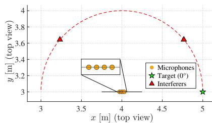
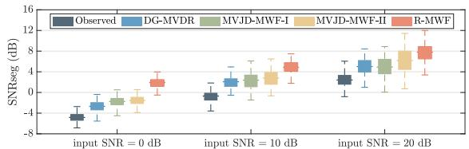
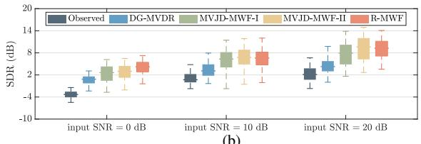
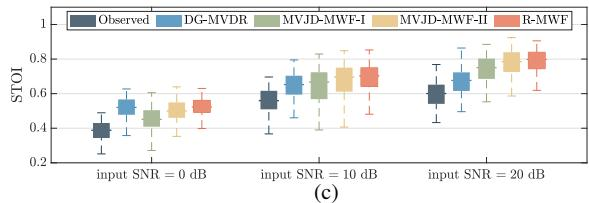

# SPATIAL COVARIANCE MATRIX RECONSTRUCTION FOR SPEECH ENHANCEMENT IN REVERBERANT MULTI-SOURCE ENVIRONMENTS

Wei Liu1,4, Xueqin Luo2, Jilu Jin2, Gongping Huang1, Jingdong Chen2, Jacob Benesty3, Shoji Makino4

1School of Electronic Information, Wuhan University, Wuhan, Hubei 430072, China 2CIAIC, Northwestern Polytechnical University, Xi’an, Shaanxi, China 3INRS-EMT, University of Quebec, Montreal, QC H5A 1K6, Canada 4Graduate School of Information, Production and Systems, Waseda University, 808-0135, Japan

## ABSTRACT

Accurate estimation of the noise covariance matrix is critical yet challenging in multichannel speech enhancement. In this work, we propose a spatial covariance matrix (SCM) reconstruction method for speech enhancement using compact microphone arrays in reverberant, multi-source environments. At each time–frequency bin, the normalized SCM of the array observations is modeled as a linear combination of predefined coherence matrices representing individual sources, late reverberation, and ambient noise. The combination coefficients, termed variance ratios, are estimated by minimizing the Frobenius norm between the modeled and observed normalized SCMs, subject to nonnegativity and unity-sum constraints. An adaptive algorithm is introduced to efficiently estimate these ratios, and the reconstructed SCMs are subsequently used in the multichannel Wiener filter. Simulation and experimental results show that the proposed SCM estimation method enables the multichannel Wiener filter to achieve robust and effective speech enhancement.

Index Terms— Microphone arrays, speech enhancement, spatial covariance matrix reconstruction, multi-source scenario.

## 1. INTRODUCTION

Microphone arrays are widely employed across numerous applications [1–3]. The array observations typically contain not only the direct-path component of the target source but also reflections, interference, and ambient noise, all of which can significantly degrade speech quality. To address these challenges, a range of signal enhancement methods have been developed, including fixed and adaptive beamforming [4–8] as well as the multichannel Wiener filter (MWF) [9, 10]. The effectiveness of these approaches, however, largely depends on the accurate and robust estimation of key acoustic parameters, particularly the spatial covariance matrices (SCMs) of the sources, noise, and reverberation.

A common approach to SCM estimation uses time–frequency masks predicted by neural networks [11–14]. In this approach, a neural separator first generates soft masks indicating the proportion of speech, noise, or other components in each time–frequency bin of the mixture. These masks are then applied as weights to average the spatial correlations of the microphone signals over time, producing separate SCMs for speech and noise. However, such methods are generally offline due to their model size and computational complexity [15]. More recently, lightweight alternatives have been proposed, including directional-gain-based methods [16, 17], which estimate noise SCMs using a few fixed beamformers; their resolution, however, remains limited by the array geometry.

In general, an SCM can be decomposed into a variance term and a coherence matrix that captures the spatial structure. The coherence matrix is typically assumed to be known or pre-estimated: for example, from direction-of-arrivals (DOAs) or relative transfer functions (RTFs) for sources, or using diffuse-field models for reverberation [18–20]. Consequently, much research has focused on estimating the variance component, including reverberation variance [18, 21, 22] and noise variance [23–25]. Furthermore, several studies have investigated joint estimation of source variances and RTFs to better capture spatial characteristics [26–29].

In this work, we propose an online method for SCM reconstruction. The observation covariance is first normalized by its trace and then modeled as a linear combination of predefined spatial coherence matrices representing multiple sources, late reverberation, and ambient noise. The corresponding combination weights, referred to as variance ratios, reflect the relative contributions of these components to the noisy observation. The ratios are estimated by minimizing the Frobenius norm between the modeled and observed normalized SCMs, subject to nonnegativity and unity-sum constraints. We further introduce an adaptive algorithm to efficiently estimate the variance ratios online. The reconstructed SCMs are subsequently used to derive a multichannel Wiener filter (MWF), which is evaluated using both simulations and experiments. Results demonstrate that the proposed method provides a practical solution for multichannel speech enhancement, making it suitable for real-time applications.

## 2. SIGNAL MODEL AND PROBLEM FORMULATION

Consider a compact planar microphone array with M elements in a reverberant and noisy environment containing I acoustic point sources. Without loss of generality, the first microphone is chosen as the reference. In the short-time Fourier transform (STFT) domain, the array observation vector is given by

$$
\begin{array} { l } { \displaystyle \mathbf { y } \left( k , n \right) = \left[ \begin{array} { l l l l } { Y _ { 1 } \left( k , n \right) } & { Y _ { 2 } \left( k , n \right) } & { \cdots } & { Y _ { M } \left( k , n \right) } \end{array} \right] ^ { T } } \\ { \displaystyle \quad = \sum _ { i = 1 } ^ { I } \mathbf { x } _ { i } \left( k , n \right) + \mathbf { r } \left( k , n \right) + \mathbf { v } \left( k , n \right) , } \end{array}\tag{1}
$$

where $Y _ { m } ( k , n )$ is the signal at the mth microphone, k and n denote the frequency-bin and time-frame indices, respectively, T is the transpose operator, $\mathbf { x } _ { i } \left( k , n \right) = \mathbf { a } _ { i } \left( k , n \right) S _ { i } \left( k , n \right) , S _ { i } \left( k , n \right)$ represents the early signal component from the source i at the reference microphone, ${ \bf { a } } _ { i } \left( k , n \right)$ is the RTF vector of the source i, whose mth entry is the RTF from the reference microphone to the mth microphone, $\mathbf { r } ( k , n )$ is the late reverberation vector, and $\mathbf { v } ( k , n )$ is the additive noise vector. In general, $\mathbf { x } _ { i } ( k , n ) , \mathbf { r } ( k , n )$ , and $\mathbf { v } ( k , n )$ are zero-mean, mutually uncorrelated random vectors.

If the reverberation is modeled as a diffuse sound field and the noise is assumed to be spatially white, the SCM of the array observations can be expressed as

$$
\begin{array} { l } { \Phi _ { \mathbf { y } } \left( k , n \right) = E \left[ \mathbf { y } \left( k , n \right) \mathbf { y } ^ { H } \left( k , n \right) \right] } \\ { \displaystyle = \sum _ { i = 1 } ^ { I } \Phi _ { i } \left( k , n \right) + \Phi _ { \mathbf { r } } \left( k , n \right) + \Phi _ { \mathbf { v } } \left( k , n \right) , } \end{array}\tag{2}
$$

where the superscript $H$ represents the conjugate-transpose operator,

$$
\begin{array} { c } { { \Phi _ { i } \left( k , n \right) = E \left[ { { \bf { x } } _ { i } } \left( { k , n } \right) { \bf { x } } _ { i } ^ { H } \left( { k , n } \right) \right] } } \\ { { = \phi _ { i } \left( { k , n } \right) { \bf { T } } _ { i } \left( { k , n } \right) } } \end{array}\tag{3}
$$

is the SCM of the source $i ,$ with $\phi _ { i } \left( k , n \right) = E \left[ \left| S _ { i } \left( k , n \right) \right| ^ { 2 } \right]$ and

$$
{ { \Gamma } _ { i } } \left( { k , n } \right) = { { \bf { a } } _ { i } } \left( { k , n } \right) { { \bf { a } } _ { i } ^ { H } } \left( { k , n } \right)\tag{4}
$$

being the rank-one normalized covariance matrix corresponding to the source $i , E \left( \cdot \right)$ represents the expectation operator, and

$$
\Phi _ { \mathbf { r } } \left( k , n \right) = E \left[ \mathbf { r } \left( k , n \right) \mathbf { r } ^ { H } \left( k , n \right) \right] = \phi _ { R } \left( k , n \right) \Gamma _ { \mathrm { d } } \left( k \right) ,\tag{5}
$$

$$
\Phi _ { \mathbf { v } } \left( k , n \right) = E \left[ \mathbf { v } \left( k , n \right) \mathbf { v } ^ { H } \left( k , n \right) \right] = \phi _ { V } \left( k , n \right) \mathbf { I } _ { M }\tag{6}
$$

are, respectively, the SCM of the late reverberation and noise, with ϕR $\begin{array} { r } { \mathrm { \mathrm {  ~ \psi ~ } } _ { \mathrm {  ~ \psi ~ } } ( \mathrm {  ~ \psi ~ } , n ) \ = \ \dot { \mathrm {  ~ \psi ~ } } _ { \mathrm { \tiny ~ M } } \mathrm { t r } \left[ \Phi _ { \mathrm { \bf r } } \left( k , n \right) \right] \ = \ E \left[ | R _ { 1 } \left( k , n \right) | ^ { 2 } \right] } \end{array}$ , ϕV $( k , n ) ~ =$ ${ \textstyle \frac { 1 } { M } } \mathrm { t r } \left[ \Phi _ { \mathbf { v } } \left( k , n \right) \right] = E \left[ | V _ { 1 } \left( k , n \right) | ^ { 2 } \right] , R _ { 1 } \left( k , n \right)$ and $V _ { 1 } \left( k , n \right)$ being the late reverberation component and noise component received by the reference microphone, IM being the identity matrix of size ${ \dot { M } } \times M ,$ , and $\mathbf { \Gamma } \Gamma _ { \mathrm { d } } \left( k \right)$ being the normalized SCM of the late reverberation. Considering a spherically isotropic noise field, the $( i , j ) \mathfrak { t }$ h element of $\mathbf { \Gamma } \Gamma _ { \mathrm { d } } \left( k \right)$ can be written as

$$
\left[ \Gamma _ { \mathrm { d } } \left( k \right) \right] _ { i j } = \operatorname { s i n c } \left( \frac { 2 \pi f _ { \mathrm { s } } k \delta _ { i j } } { K c } \right) , \forall i , j \in \{ 1 , 2 , \ldots , M \} ,\tag{7}
$$

where $\begin{array} { r } { \mathrm { s i n c } ( x ) = \frac { \sin { x } } { x } , f _ { \mathrm { s } } } \end{array}$ is the sampling rate, and $\delta _ { i j }$ represents the distance between microphones i and j.

The normalized SCM of the array observation can be written as

$$
\Gamma _ { \mathbf { y } } \left( k , n \right) \triangleq \frac { \Phi _ { \mathbf { y } } \left( k , n \right) } { \phi _ { Y } \left( k , n \right) } ,\tag{8}
$$

where $\begin{array} { r } { \phi _ { Y } \left( k , n \right) \overset { \triangle } { = } \frac { 1 } { M } \operatorname { t r } \left[ \Phi _ { \mathbf { y } } \left( k , n \right) \right] = E \left[ \left| Y _ { 1 } \left( k , n \right) \right| ^ { 2 } \right] } \end{array}$ . For the sake of simplicity, we will disregard the dependence on k in the following content when it is evident from the context.

Substituting (3), (5), (6), and (2) into (8) , we obtain

$$
{ { \bf { r } } _ { \bf { y } } } \left( n \right) = \sum _ { i = 1 } ^ { I } { { { \psi } _ { i } } \left( n \right) { { \bf { \cal { { r } } } } _ { i } } \left( n \right) } + { { \psi } _ { R } } \left( n \right) { { \bf { \cal { { r } } } } _ { \bf { { d } } } } + { { \psi } _ { V } } \left( n \right) { { \bf { \cal { { I } } } } _ { M } } ,\tag{9}
$$

where $\begin{array} { r } { \psi _ { i } \left( n \right) \overset { \triangle } { = } \frac { \phi _ { i } ( n ) } { \phi _ { Y } ( n ) } , \psi _ { R } \left( n \right) \overset { \triangle } { = } \frac { \phi _ { R } ( n ) } { \phi _ { Y } ( n ) } } \end{array}$ , and $\begin{array} { r } { \psi _ { V } \left( n \right) \stackrel { \triangle } { = } \frac { \phi _ { V } \left( n \right) } { \phi _ { Y } \left( n \right) } } \end{array}$ are referred to as variance ratios. As mentioned above, for a compact microphone array, $\psi _ { i } ( n ) , \psi _ { R } ( n ) , \psi _ { V } ( n )$ , and $\psi _ { Y } \left( n \right)$ correspond, respectively, to the variances of the early signal component from the source i, the late reverberation component, the noise component, and the noisy signal received at the reference microphone. Accordingly, we have ψi $( n ) \ge 0 , \psi _ { R } \left( n \right) \ge 0 , \psi _ { V } \left( n \right) \ge 0 ,$ and

$$
\sum _ { i = 1 } ^ { I } \psi _ { i } \left( n \right) + \psi _ { R } \left( n \right) + \psi _ { V } \left( n \right) = 1 .\tag{10}
$$

According to $( 9 ) , \mathbf { T _ { y } } \left( n \right)$ can be decomposed into a linear combination of several matrices, namely $\Gamma _ { i } ( \bar { n ) } , \ \Gamma _ { \mathrm { d } } ,$ and the identity matrix ${ \mathbf { I } } _ { M }$ The matrix $\mathbf { { T } } _ { i } \left( \boldsymbol { n } \right)$ can be obtained in two ways: (i) from (4) by estimating the RTF vector $\mathbf { a } _ { i } ( n ) , \mathbf { e . g . }$ , through calibration or data-driven approaches [26, 27]; or (ii) from a known DOA $\theta _ { i }$ using $\boldsymbol { \Gamma } _ { i } \ : = \ : \mathbf { d } \left( \widehat { \theta _ { i } } \right) \mathbf { d } ^ { H } \left( \theta _ { i } \right)$ when a suitable DOA estimator is available [30], with d $\left( \theta _ { i } \right)$ being the steering vector of the planar array [2]. In this manner, all covariance matrices can be pre-modeled, and the problem of SCM reconstruction reduces to estimating the variance ratios $\{ \psi _ { i } \left( n \right) \} _ { i = 1 } ^ { I } , \psi _ { R } \left( n \right)$ , and $\psi _ { V } \left( n \right)$

## 3. SPATIAL COVARIANCE MATRIX RECONSTRUCTION

Given ${ \Gamma _ { \bf y } \left( n \right) , \{ { \Gamma _ { i } \left( n \right) \} _ { i = 1 } ^ { I } , { \Gamma _ { \mathrm { d } } } } }$ , and ${ \bf I } _ { M }$ , we can estimate the variance ratios ψ $\mathbf { \Phi } ( n )  { \stackrel {  } { = } } \{ \{ \psi _ { i } ( n ) \} _ { i = 1 } ^ { I } , \psi _ { R } ( n ) , \psi _ { V } ( n ) \}$ by solving the following optimization problem:

$$
\operatorname* { m i n } _ { \psi ( n ) } \ J \left[ \psi \left( n \right) \right]\tag{11}
$$

$$
\begin{array} { r l r } & { \mathrm { s . ~ t . ~ } \displaystyle \sum _ { i = 1 } ^ { I } \psi _ { i } \left( n \right) + \psi _ { R } \left( n \right) + \psi _ { V } \left( n \right) = 1 , } & \\ & { } & { \displaystyle \left\{ \psi _ { i } \left( n \right) \geq 0 \right\} _ { i = 1 } ^ { I } , \quad \psi _ { R } \left( n \right) \geq 0 , \quad \psi _ { V } \left( n \right) \geq 0 , } \end{array}
$$

where

(12)

$$
\begin{array} { l } { \displaystyle \mathcal { I } \left[ \psi \left( n \right) \right] } \\ { \displaystyle = \left\| \mathbf { r } _ { \mathbf { y } } \left( n \right) - \sum _ { i = 1 } ^ { I } \psi _ { i } \left( n \right) \mathbf { r } _ { i } \left( n \right) - \psi _ { R } \left( n \right) \mathbf { r } _ { \mathbf { d } } - \psi _ { V } \left( n \right) \mathbf { I } _ { M } \right\| _ { \mathbf { F } } ^ { 2 } , } \end{array}\tag{13}
$$

with $\left\| \cdot \right\| _ { \mathrm { F } }$ denoting the Frobenius norm.

Vectorizing $\Gamma _ { \mathbf { y } } ( n ) , \Gamma _ { i } ( n ) , \Gamma _ { \mathrm { d } }$ , and ${ \mathbf { I } } _ { M }$ , one can rewrite the cost function (13) as

$$
\mathcal { T } \left[ \mathbf { h } \left( n \right) \right] = \left. \mathbf { c } \left( n \right) - \mathbf { \mathcal { \mathbf { T } } \mathbf { h } } \left( n \right) \right. _ { 2 } ^ { 2 } ,\tag{14}
$$

where $\lVert \cdot \rVert _ { 2 }$ represents the ℓ2-norm,

$$
\mathbf { h } \left( n \right) = \left[ \begin{array} { l l l l l } { \psi _ { 1 } \left( n \right) } & { \cdots } & { \psi _ { I } \left( n \right) } & { \psi _ { R } \left( n \right) } & { \psi _ { V } \left( n \right) } \end{array} \right] ^ { T } ,\tag{15}
$$

$$
\Upsilon \left( n \right) = \left[ \begin{array} { c c c c c } { \gamma _ { 1 } \left( n \right) } & { \cdot \cdot \cdot } & { \gamma _ { I } \left( n \right) } & { \gamma _ { \mathrm { d } } } & { \mathbf { i } } \end{array} \right] ,\tag{16}
$$

with ${ \bf c } \left( { n } \right) = \mathrm { v e c } [ { \bf { \cal T _ { y } } } \left( { n } \right) ] , { \gamma _ { i } } \left( n \right) = \mathrm { v e c } [ { \bf { \cal T } } _ { i } \left( n \right) ] , { \gamma _ { \mathrm { d } } } = \mathrm { v e c } [ { \bf { \cal T } } _ { \mathrm { d } } ] ,$ and $\mathbf { i } = \mathrm { v e c } \left[ \mathbf { I } _ { M } \right]$ with vec $[ \cdot ]$ denoting the vectorization of a matrix. Then, the original optimization problem in (11) can be converted to

$$
\operatorname* { m i n } _ { \mathbf { h } ( n ) } \mathcal { I } \left[ \mathbf { h } \left( n \right) \right] \mathrm { ~ s . ~ t . ~ } \mathbf { h } \left( n \right) \succeq 0 , \left\| \mathbf { h } \left( n \right) \right\| _ { 1 } = 1 .\tag{17}
$$

In real-time processing, the a priori and a posteriori errors are defined respectively as

$$
{ \bf e } \left( n \right) = { \bf c } \left( n \right) - { \bf Y } \left( n \right) { \bf h } \left( n - 1 \right) ,\tag{18}
$$

$$
\pmb { \varepsilon } \left( n \right) = \mathbf { c } \left( n \right) - \pmb { \Upsilon } \left( n \right) \mathbf { h } \left( n \right) .\tag{19}
$$

To solve (17), we introduce the following Lagrangian function:

$$
\begin{array} { r } { \mathcal { L } \left[ \mathbf { h } \left( n \right) \right] = \mathcal { I } \left[ \mathbf { h } \left( n \right) \right] + \lambda K \left[ \mathbf { h } \left( n \right) \right] + \mu \left[ \left. \mathbf { h } \left( n \right) \right. _ { 1 } - 1 \right] , } \end{array}\tag{20}
$$

where

$$
\begin{array} { r l r } {  { K [ \mathbf { h } ( n ) ] = \sum _ { i = 1 } ^ { I } \psi _ { i } ( n ) \ln \frac { \psi _ { i } ( n ) } { \psi _ { i } ( n - 1 ) } + \psi _ { R } ( n ) \ln \frac { \psi _ { R } ( n ) } { \psi _ { R } ( n - 1 ) } } } \\ & { } & { + \psi _ { V } ( n ) \ln \frac { \psi _ { V } ( n ) } { \psi _ { V } ( n - 1 ) } \qquad ( 2 } \end{array}\tag{1}
$$

is the Kullback-Leibler (KL) divergence between h (n) and h $( n - 1 )$ minimized to control the update step size.

Since h $( n ) \succeq 0$ , the derivative of $\| \mathbf { h } \left( n \right) \| _ { 1 } - 1$ with respect to $\mathbf { h } \left( n \right)$ is 1, a vector of ones of length $\left( I + 2 \right)$ . Therefore, the derivative of ${ \mathcal { L } } \left[ \mathbf { h } \left( n \right) \right]$ with respect to h (n) is

$$
\begin{array} { c } { \displaystyle \frac { d \mathcal { L } \left[ \mathbf { h } \left( n \right) \right] } { d \mathbf { h } \left( n \right) } = \lambda \left[ \ln \mathbf { h } \left( n \right) - \ln \mathbf { h } \left( n - 1 \right) + \mathbf { 1 } \right] } \\ { \displaystyle - 2 \Re \left[ \mathbf { \hat { Y } } ^ { H } \left( n \right) \boldsymbol { \varepsilon } \left( n \right) \right] + \mu \mathbf { 1 } , } \end{array}\tag{22}
$$

where $\Re [ \cdot ]$ denotes the real part. Setting this expression to zero gives

$$
\ln \mathbf { h } \left( n \right) - \ln \mathbf { h } \left( n - 1 \right) = - { \frac { \lambda + \mu } { \lambda } } \mathbf { 1 } + { \frac { 2 } { \lambda } } \Re \left[ \mathbf { \hat { Y } } ^ { H } \left( n \right) \varepsilon \left( n \right) \right]\tag{23}
$$

Converting it to exponential representation, we obtain

$$
\mathbf { h } \left( n \right) = \mathbf { h } \left( n - 1 \right) \circ \mathbf { g } \left( n \right) ,\tag{24}
$$

where ◦ denotes the Hadamard product and

$$
\mathbf { g } \left( n \right) = \exp \left\{ - \frac { \lambda + \mu } { \lambda } \mathbf { 1 } + \frac { 2 } { \lambda } \Re \left[ \boldsymbol { \Upsilon } ^ { H } \left( n \right) \boldsymbol { \varepsilon } \left( n \right) \right] \right\} .\tag{25}
$$

To enforce $\| \mathbf { h } \left( n \right) \| _ { 1 } = 1$ , we make the following normalization:

$$
\mathbf { h } \left( n \right) = \frac { \mathbf { h } \left( n - 1 \right) \circ \mathbf { r } \left( n \right) } { \mathbf { h } ^ { T } \left( n - 1 \right) \mathbf { r } \left( n \right) } ,\tag{26}
$$

where the multiplicative vector:

$$
\begin{array} { l } { { \displaystyle { \bf r } \left( n \right) = { \bf g } \left( n \right) \circ \exp \left\{ \frac { \lambda + \mu } { \lambda } { \bf 1 } \right\} } \ ~ } \\ { { \displaystyle ~ = \exp \left\{ \frac { 2 } { \lambda } \Re \left[ { \bf \Upsilon } { \bf Y } ^ { H } \left( n \right) \varepsilon \left( n \right) \right] \right\} } \ ~ } \\ { { \displaystyle ~ = \exp \left\{ \eta \Re \left[ { \bf \Upsilon } { \bf Y } ^ { H } \left( n \right) \varepsilon \left( n \right) \right] \right\} } , } \end{array}\tag{27}
$$

with a stepsize $\eta > 0$ . With the normalization, the dependence of r(n) on $\mu$ is eliminated, while λ remains but is incorporated into the coefficient η. Since the a posteriori estimate is not known before the update, we use the a priori estimate instead, so we have

$$
\mathbf { r } \left( \boldsymbol { n } \right) = \exp \left\{ \eta \Re \left[ \mathbf { Y } ^ { H } \left( \boldsymbol { n } \right) \mathbf { e } \left( \boldsymbol { n } \right) \right] \right\} .\tag{28}
$$

For real-time applications, the SCM of the array observations can be updated recursively as

$$
\hat { \Phi } _ { \mathbf { y } } \left( n \right) = \alpha \hat { \Phi } _ { \mathbf { y } } \left( n - 1 \right) + \left( 1 - \alpha \right) \mathbf { y } \left( n \right) \mathbf { y } ^ { H } \left( n \right) ,\tag{29}
$$

where $\alpha \in ( 0 , 1 )$ is a forgetting factor.

Next, we present the detailed pseudocode of the proposed SCM reconstruction method in Algorithm 1. The per time-frequency bin

Algorithm 1   
Input: ${ \displaystyle { \bf { \cal Y } } { \bf \Xi } ( n ) , { \bf { \cal y } } ( n ) , { \bf { h } } \left( n - 1 \right) } ,$ , α, and η.   
1: repeat {at each index n}   
2: Update the SCM of array observation $\hat { \Phi } _ { \mathbf { y } } \left( n \right)$ by (29).   
3: Normalize Φˆ y (n) by (8).   
4: Vectorize $\mathbf { { r _ { y } } } \left( n \right)$ via c (n) = vec $\left[ \mathbf { T _ { y } } \left( n \right) \right]$   
5: Compute the priori error e (n) by (18).   
6: Compute the multiplicative vector r (n) by (28).   
7: Update the variance ratio vector h (n) by (26).   
8: until

computational complexity of the algorithm is $\mathcal { O } \left( M ^ { 2 } \left( I + 2 \right) \right)$

## 4. EXPERIMENTS

In this section, we apply the proposed SCM reconstruction method to derive the MWF. Assuming the first source is the target one, the filter is expressed as

$$
{ \bf h } _ { \mathrm { W } , 1 } \left( n \right) = { \psi } _ { 1 } \left( n \right) { \bf { \Gamma } } _ { \bf { y } } ^ { - 1 } \left( n \right) { \bf { \Gamma } } _ { 1 } \left( n \right) { \bf { u } } ,\tag{30}
$$

where u $\mathbf { \Psi } : = \left[ \begin{array} { l l l l } { 1 } & { 0 } & { \cdots } & { 0 } \end{array} \right] ^ { T }$ and $\mathbf { { r _ { y } } } \left( n \right)$ is computed according to (9). We refer to this formulation as the SCM reconstructionbased MWF (R-MWF). The stepsize η in (28) is set to 0.1, and the forgetting factor α in (29) is set to 0.5. The DOAs of all sources are assumed to be known, such that $\boldsymbol { \Gamma } _ { i } = \mathbf { d } \left( \boldsymbol { \theta } _ { i } \right) \mathbf { d } ^ { H } \left( \boldsymbol { \theta } _ { i } \right)$ .

We compare the proposed R-MWF with two recent approaches: the directional-gain MVDR beamformer (DG-MVDR) [17] and the MWF with minimum variance joint diagonalization (MVJD-MWF) [29]. Unlike R-MWF and DG-MVDR, MVJD-MWF requires prior knowledge of the noise covariance but can estimate the RTFs of multiple sources. For fairness, we consider two variants: MVJD-MWF-I, which operates without source prior knowledge, and MVJD-MWF-II, which assumes known steering vectors for RTF estimation. In both cases, the noise covariance is computed from noise-only segments. Evaluation on simulated data is presented in Section 4.1, and evaluation on real recordings in Section 4.2.

## 4.1. Simulations with Generated RIRs

In this subsection, we assess the speech enhancement performance of the proposed method in a simulated acoustic environment. The simulation is conducted in a rectangular room of size $8 \times 6 \times 3 \mathrm { m ^ { 3 } }$ with the origin of the 3D Cartesian coordinate system at the corner $( 0 , 0 , 0 )$ and the $x \cdot , y -$ , and z-axes aligned with the room’s length, width, and height. A uniform linear array (ULA) of $M = 4$ omnidirectional microphones with an inter-element spacing of 2.0 cm, is placed at the room center. As shown in Fig. 1, three sound sources are positioned on a semicircular arc of radius 1 m centered at the array, all lying in the same horizontal plane as the array. The target source is fixed at (5, 3, 1.5), corresponding to $\theta _ { 1 } = 0 ^ { \circ }$ (endfire direction with respect to the array). The azimuths of the two interfering sources are randomly drawn, ensuring a minimum angular separation of 15◦ between any two sources.

  
Fig. 1: Top view of the simulated acoustic scene.

  
(a)

  
(b)

  
Fig. 2: Performance of the DG-MVDR, MVJD-MWF-I, MVJD-MWF-II, and R-MWF in three different input SNR levels: (a) SNRseg, (b) SDR, and (c) STOI. Conditions: M = 4, the input SIRs of two interfering source are randomly sampled from [0, 10] dB, and the reverberation time is approximately 300 ms.

The source signals consist of clean speech utterances from the TIMIT database, sampled at 16 kHz. Room impulse responses (RIRs) are generated using the image method [31, 32] with a reverberation time of $T _ { 6 0 } \approx 3 0 0$ ms. The observed signals are obtained by convolving the source signals with the corresponding RIRs and adding white Gaussian noise at input SNRs between 0 and 20 dB. The input signal-to-interference ratios (SIRs) of the two interfering sources are uniformly sampled from [0, 10] dB. Array observations are processed in the STFT domain using a frame size of 256, 75% overlap, and a Kaiser window with β = 1.9π.

Performance is assessed using three objective metrics: frequencyweighted segmental SNR (SNRseg), signal-to-distortion ratio (SDR), and short-time objective intelligibility (STOI) [33, 34]. The directpath component of the target speech is taken as the reference signal for all metrics. Simulations are conducted at three SNR levels: 0 dB, 10 dB, and 20 dB, with each configuration repeated 100 times. Results are shown as box plots in Fig. 2. The results clearly show that R-MWF consistently outperforms the baseline methods in terms of SNRseg, SDR, and STOI, confirming that the proposed SCM reconstruction strategy enables robust and perceptually effective speech enhancement across different noise and interference conditions.

## 4.2. Experiments with Real Recordings

In this subsection, we assess the speech dereverberation performance of the proposed method using real recordings from the publicly available RealMAN dataset [35]. Recordings from three acoustic scenes are considered: LivingRoom6, OfficeRoom1, and BadmintonCourt1, corresponding to Case-1, Case-2, and Case-3, respectively. The approximate reverberation times for these scenes are 398 ms, 719 ms, and 1577 ms. The RealMAN dataset provides 32-channel microphone array recordings, from which we select channels 1, 3, 5, and 7 to form a 4-element uniform circular array (UCA) with a radius of 3 cm. Additional configuration details are provided in Table 1.

Table 1: Description of real recordings from the RealMAN dataset.
<table><tr><td></td><td>Scene</td><td>Speaker</td><td>Distance</td><td>Azimuth</td></tr><tr><td>Case-1</td><td>LivingRoom6</td><td>Female</td><td>0.89 m</td><td>118.23</td></tr><tr><td>Case-2</td><td>OfficeRoom1</td><td>Male</td><td>0.80m</td><td>146.60</td></tr><tr><td>Case-3</td><td>BadmintonCourtl</td><td>Female</td><td>6m</td><td>54.82</td></tr></table>

Table 2: Performance of the comparison methods under three different real recording scenarios.
<table><tr><td rowspan="2">Methods</td><td colspan="4"> $\mathrm { C a s e { - } 1 { : } ~ } T _ { 6 0 } = 3 9 8 ~ \mathrm { m s }$ </td></tr><tr><td>SNRseg (dB) ↑</td><td>SDR (dB) ↑</td><td>STOI↑</td><td>CD↓</td></tr><tr><td>Observed</td><td>1.16</td><td>6.43</td><td>0.68</td><td>4.37</td></tr><tr><td>DG-MVDR</td><td>2.66</td><td>7.20</td><td>0.71</td><td>3.86</td></tr><tr><td>MVJD-MWF-I</td><td>2.98</td><td>7.35</td><td>0.70</td><td>3.82</td></tr><tr><td>MVJD-MWF-II</td><td>3.07</td><td>7.20</td><td>0.70</td><td>3.93</td></tr><tr><td>R-MWF</td><td>4.66</td><td>9.15</td><td>0.76</td><td>3.51</td></tr><tr><td rowspan="3">Methods</td><td colspan="4">Case-2: T60 = 719 ms</td></tr><tr><td>SNRseg (dB) ↑</td><td>SDR (dB) ↑</td><td>STOI↑</td><td>CD↓</td></tr><tr><td>2.11</td><td>0.02</td><td>0.75</td><td>4.75</td></tr><tr><td>Observed DG-MVDR</td><td>4.15</td><td>6.03</td><td>0.80</td><td>4.00</td></tr><tr><td>MVJD-MWF-I</td><td>4.23</td><td>5.76</td><td>0.78</td><td>4.02</td></tr><tr><td>MVJD-MWF-II</td><td>4.95</td><td>6.12</td><td>0.79</td><td>3.94</td></tr><tr><td>R-MWF</td><td>5.54</td><td>6.83</td><td>0.85</td><td>4.11</td></tr><tr><td></td><td colspan="4">Case-3:  $T _ { 6 0 } = 1 5 7 7$ </td></tr><tr><td rowspan="2">Methods</td><td>SNRseg (dB) ↑</td><td>SDR (dB) ↑</td><td>ms STOI↑</td><td></td></tr><tr><td></td><td></td><td></td><td>CD↓</td></tr><tr><td>Observed</td><td>0.52</td><td>-6.00</td><td>0.41</td><td>4.73</td></tr><tr><td>DG-MVDR</td><td>1.49</td><td>3.40</td><td>0.45</td><td>4.50</td></tr><tr><td>MVJD-MWF-I</td><td>1.74</td><td>3.67</td><td>0.43</td><td>4.50</td></tr><tr><td>MVJD-MWF-II R-MWF</td><td>1.83 2.87</td><td>3.85</td><td>0.44 0.49</td><td>4.49</td></tr><tr><td></td><td></td><td>4.99</td><td></td><td>4.66</td></tr></table>

Evaluation is conducted using SNRseg, SDR, STOI, and cepstral distance (CD) [34] with the clean target speech (serving as the reference) obtained by filtering the source signal with an estimated direct-path filter [35]. Table 2 presents the dereverberation results of different methods under these real acoustic environments. Across all three cases, the proposed R-MWF consistently delivers the best or near-best results across all four metrics, demonstrating strong generalization to real-world recordings and stable performance under a wide range of reverberation conditions, rather than being limited to diffuse-field models.

## 5. CONCLUSIONS

This paper presented an SCM reconstruction method in reverberant, multi-source environments. By modeling the normalized array covariance as a linear combination of predefined coherence matrices, SCM reconstruction was reduced to estimating the corresponding combination weights, or variance ratios, which reflect the relative contributions of the components to the noisy observation. The variance ratios were estimated using a lightweight multiplicative update rule, enabling efficient online implementation. When incorporated into a multichannel Wiener filter, both simulation and experimental results demonstrated that the proposed method achieves competitive speech enhancement performance.

## 6. REFERENCES

[1] H. V. Trees, Optimum Array Processing: Part IV of Detection, Estimation, and Modulation theory. John Wiley Sons, Inc, 2002.

[2] J. Benesty, G. Huang, J. Chen, and N. Pan, Microphone Arrays. Berlin, Germany: Springer-Verlag, 2023, vol. 22.

[3] G. Huang, J. R. Jensen, J. Chen, J. Benesty, M. G. Christensen, A. Sugiyama, G. Elko, and T. Gaensler, “Advances in microphone array processing and multichannel speech enhancement,” in Proc. IEEE ICASSP, 2025, pp. 1–5.

[4] S. Gannot and I. Cohen, “Speech enhancement based on the general transfer function GSC and postfiltering,” IEEE Trans. Speech, Audio Process., vol. 12, no. 6, pp. 561–571, Nov. 2004.

[5] W. Liu, J. Benesty, G. Huang, and J. Chen, “Beamforming in the shorttime Fourier transform domain via dimensionality reduction,” IEEE Trans. Audio, Speech, Lang. Process., vol. 33, pp. 1730–1742, Apr. 2025.

[6] G. Huang, J. Benesty, and J. Chen, “Fundamental approaches to robust differential beamforming with high directivity factors,” IEEE/ACM Trans. Audio, Speech, Lang. Process., vol. 30, pp. 3074–3088, Sep. 2022.

[7] A. H. Moore, S. Hafezi, R. R. Vos, P. A. Naylor, and M. Brookes, “A compact noise covariance matrix model for MVDR beamforming,” IEEE/ACM Trans. Audio, Speech, Lang. Process., vol. 30, pp. 2049– 2061, Jun. 2022.

[8] J. Jin, X. Luo, G. Huang, J. Chen, and J. Benesty, “Beamforming through online convex combination of differential beamformers,” in Proc. IEEE ICASSP, 2024, pp. 8561–8565.

[9] J. Benesty, I. Cohen, and J. Chen, Fundamentals of Signal Enhancement and Array Signal Processing. Singapore: Wiley-IEEE Press., 2018.

[10] J. Chen, J. Benesty, Y. Huang, and S. Doclo, “New insights into the noise reduction Wiener filter,” IEEE Trans. Audio, Speech, Lang. Process., vol. 14, pp. 1218–1234, Jul. 2006.

[11] O. Yilmaz and S. Rickard, “Blind separation of speech mixtures via time-frequency masking,” IEEE Trans. Signal Process., vol. 52, no. 7, pp. 1830–1847, Jul. 2004.

[12] K. Yamaoka, N. Ono, and S. Makino, “Time-frequency-bin-wise linear combination of beamformers for distortionless signal enhancement,” IEEE/ACM Trans. Audio, Speech, Lang. Process., vol. 29, pp. 3461– 3475, Nov. 2021.

[13] Y. Kubo, T. Nakatani, M. Delcroix, K. Kinoshita, and S. Araki, “Maskbased MVDR beamformer for noisy multisource environments: Introduction of time-varying spatial covariance model,” in Proc. IEEE ICASSP, 2019, pp. 6855–6859.

[14] K. Tan, Z.-Q. Wang, and D. Wang, “Neural spectrospatial filtering,” IEEE/ACM Trans. Audio, Speech, Lang. Process., vol. 30, pp. 605–621, Jan. 2022.

[15] G. Richard, P. Smaragdis, S. Gannot, P. A. Naylor, S. Makino, W. Kellermann, and A. Sugiyama, “Audio signal processing in the 21st century: The important outcomes of the past 25 years,” IEEE Signal Process. Mag., vol. 40, no. 5, pp. 12–26, Jul. 2023.

[16] C. Pan and J. Chen, “A framework of directional-gain beamforming and a white-noise-gain-controlled solution,” IEEE/ACM Trans. Audio, Speech, Lang. Process., vol. 30, pp. 2875–2887, Aug. 2022.

[17] F. Zhang, C. Pan, J. Benesty, and J. Chen, “Directional gain based noise covariance matrix estimation for MVDR beamforming,” in Proc. IEEE ICASSP, 2024, pp. 511–515.

[18] A. Schwarz and W. Kellermann, “Coherent-to-diffuse power ratio estimation for dereverberation,” IEEE/ACM Trans. Audio, Speech, Lang. Process., vol. 23, no. 6, pp. 1006–1018, Apr. 2015.

[19] C. Li and R. C. Hendriks, “Alternating least-squares-based microphone array parameter estimation for a single-source reverberant and noisy acoustic scenario,” IEEE/ACM Trans. Audio, Speech, Lang. Process., vol. 31, pp. 3922–3934, Aug. 2023.

[20] S. Braun, A. Kuklasinski, O. Schwartz, O. Thiergart, E. A. Habets, S. Gannot, S. Doclo, and J. Jensen, “Evaluation and comparison of late reverberation power spectral density estimators,” IEEE/ACM Trans. Audio, Speech, Lang. Process., vol. 26, no. 6, pp. 1052–1067, Feb. 2018.

[21] O. Schwartz, S. Gannot, and E. A. Habets, “An expectationmaximization algorithm for multimicrophone speech dereverberation and noise reduction with coherence matrix estimation,” IEEE/ACM Trans. Audio, Speech, Lang. Process., vol. 24, no. 9, pp. 1495–1510, Apr. 2016.

[22] I. Kodrasi and S. Doclo, “Analysis of eigenvalue decomposition-based late reverberation power spectral density estimation,” IEEE Trans. Audio, Speech, Lang. Process., vol. 26, no. 6, pp. 1106–1118, Mar. 2018.

[23] R. C. Hendriks and T. Gerkmann, “Noise correlation matrix estimation for multi-microphone speech enhancement,” IEEE Trans. Audio, Speech, Lang. Process., vol. 20, no. 1, pp. 223–233, Jun. 2012.

[24] I. Cohen and B. Berdugo, “Noise estimation by minima controlled recursive averaging for robust speech enhancement,” IEEE Signal Process. Lett., vol. 9, no. 1, pp. 12–15, Jan. 2002.

[25] M. Taseska and E. A. Habets, “Nonstationary noise PSD matrix estimation for multichannel blind speech extraction,” IEEE/ACM Trans. Audio, Speech, Lang. Process., vol. 25, no. 11, pp. 2223–2236, Sep. 2017.

[26] B. Schwartz, S. Gannot, and E. A. Habets, “Two model-based EM algorithms for blind source separation in noisy environments,” IEEE/ACM Trans. Audio, Speech, Lang. Process., vol. 25, no. 11, pp. 2209–2222, Nov. 2017.

[27] A. I. Koutrouvelis, R. C. Hendriks, R. Heusdens, and J. Jensen, “Robust joint estimation of multimicrophone signal model parameters,” IEEE/ACM Trans. Audio, Speech, Lang. Process., vol. 27, no. 7, pp. 1136–1150, Jul. 2019.

[28] T. Dietzen, S. Doclo, M. Moonen, and T. van Waterschoot, “Square root-based multi-source early PSD estimation and recursive RETF update in reverberant environments by means of the orthogonal procrustes problem,” IEEE/ACM Trans. Audio, Speech, Lang. Process., vol. 28, pp. 755–769, Jan. 2020.

[29] C. Li and R. C. Hendriks, “Multimicrophone signal parameter estimation in a multi-source noisy reverberant scenario,” IEEE Trans. Audio, Speech, Lang. Process., Jan. 2025.

[30] T. E. Tuncer and B. Friedlander, Classical and Modern Direction-of-Arrival Estimation. Academic Press, 2009.

[31] J. Allen and D. Berkley, “Image method for efficiently simulating small-room acoustics,” J. Acoust. Soc. Am., vol. 65, no. 4, pp. 943–950, 1979.

[32] C. Pan, L. Zhang, Y. Lu, J. Jin, L. Qiu, J. Chen, and J. Benesty, “An anchor-point based image-model for room impulse response simulation with directional source radiation and sensor directivity patterns,” arXiv:2308.10543, 2023.

[33] Y. Hu and P. C. Loizou, “Evaluation of objective quality measures for speech enhancement,” IEEE Trans. Audio, Speech, Lang. Process., vol. 16, no. 1, pp. 229–238, Jan. 2007.

[34] K. Kinoshita, M. Delcroix, S. Gannot, E. A. Habets, R. Haeb-Umbach, W. Kellermann, V. Leutnant, R. Maas, T. Nakatani, B. Raj et al., “A summary of the REVERB challenge: state-of-the-art and remaining challenges in reverberant speech processing research,” EURASIP J. Adva. Signal Process., vol. 2016, no. 1, p. 7, Jan. 2016.

[35] B. Yang, C. Quan, Y. Wang, P. Wang, Y. Yang, Y. Fang, N. Shao, H. Bu, X. Xu, and X. Li, “RealMAN: A real-recorded and annotated microphone array dataset for dynamic speech enhancement and localization,” Adv. Neural Inf. Process. Syst., vol. 37, pp. 105997–106019, 2024.