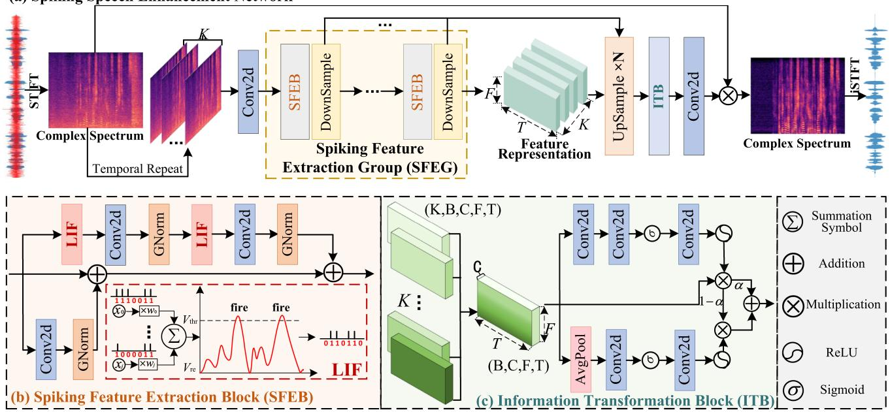
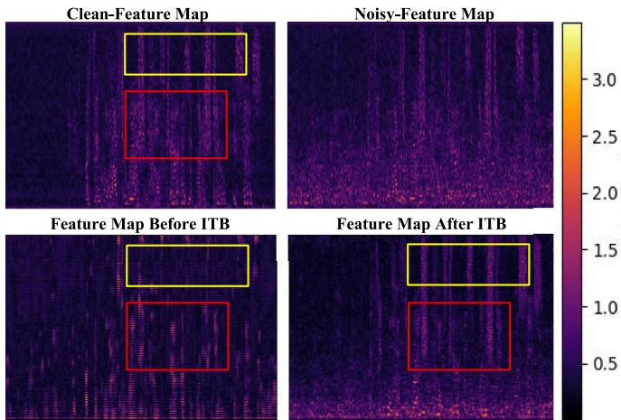
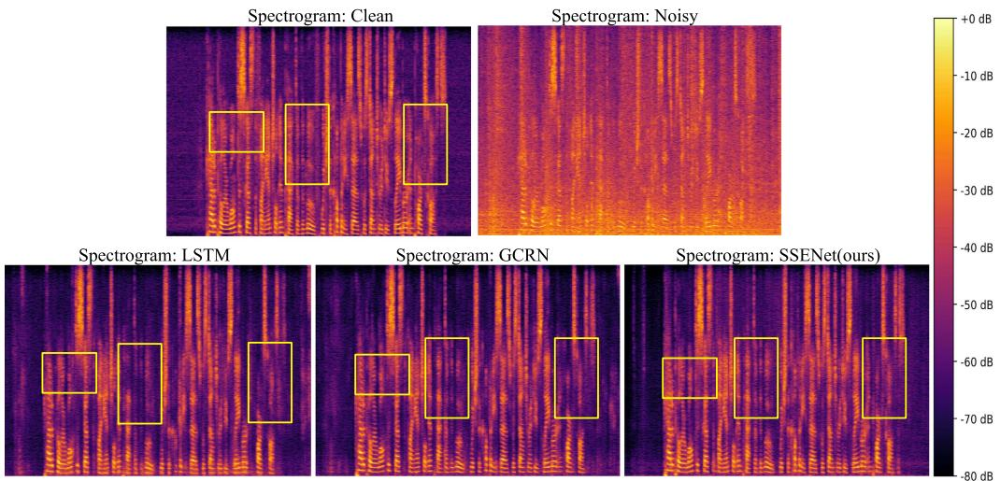
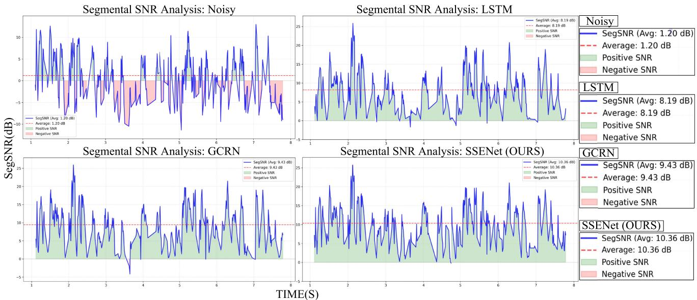

# SSE-Net: Toward Low-Power-Consumption Spiking Neural Network for Monaural Speech Enhancement

Enrui Liu, Andong Li , Member, IEEE, Cunhang Fan , Member, IEEE, Chengshi Zheng , Senior Member, IEEE, Jiangyan Yi, Member, IEEE, Ruibo Fu , Member, IEEE, Xinhui Li , Member, IEEE, Jian Zhou , and Zhao Lv , Member, IEEE

Abstract—Speech enhancement (SE) as a front-end task, especially in edge device deployment, requires low complexity and power consumption. However, deploying most artificial neural network (ANN)-based SE models while ensuring performance is challenging, particularly with the rapid development of large models in recent years. Spiking neural networks (SNNs) have shown potential in reducing power consumption. However, SNN-based SE models face two main challenges: on one hand, directly converting an ANN model to a SNN model introduces redundant modules, leading to difficulties in model training and information mismatch; on the other hand, the discrete binary activation and complex spatio-temporal dynamics of SNNs often result in information loss. To address these challenges, this paper proposes the SNN Speech Enhancement Network (SSE-Net). Unlike conventional approaches that convert ANNs to SNNs, all modules in SSE-Net are specifically designed for spike signal characteristics. Furthermore, the method innovatively develops a spiking feature extraction group that simultaneously converts information into spike signals while extracting original speech features, thereby effectively reducing information loss while significantly lowering both power consumption and computational complexity. The proposed method further designs information transformation blocks to convert spike signals back into continuous signals, fine-tuning and supplementing the speech information. Experimental results demonstrate that our proposed model achieves state of the art (SOTA) performance compared to the best SNN-SE models, with a 62% reduction in power proxy and 11% reduction in power cost, it also demonstrates strong competitiveness when compared with ANN-based SE models.

Index Terms—Speech enhancement, signal processing, spiking neural networks.

## I. INTRODUCTION

PEECH enhancement (SE) serves as a core technology in audio processing for extracting clean speech signals from noise-corrupted recordings [1]. Background noise not only causes auditory discomfort but also severely degrades automatic speech recognition (ASR) accuracy [2], [3], [4]. This technology finds essential applications across smart devices, automotive systems, and smart home environments. The rapid adoption of online conferencing platforms has particularly accelerated the need for efficient real-time SE implementations. As a critical preprocessing stage, SE substantially boosts the effectiveness of downstream speech processing pipelines while optimizing overall system performance [5], [6], [7].

In the past years, deep learning-based SE methods have been rapidly developed [8], [9], evolving from simply stacking basic modules to using RNNs [10] for sequence modeling. Given RNNs’ historical information loss issue, LSTM [11] was adopted. Later, convolutional neural networks (CNNs) [12], temporal convolutional networks (TCNs) [13], Transformers [8], and Mambas [14] have also been integrated into SE networks. In the meanwhile, SE model structures have been continuously refined. Initially, only the spectral amplitude was considered, and the noisy phase was incorporated [15]. After that, as the phase exhibits relatively random distribution and is quite hard for accurate estimation, the network structure was separated into two parts for independent modeling, and subsequently, a parallel dual-branch model emerged [16]. All of these improvements have improved the performance of SE networks but have also substantially increased the computational complexity and power consumption of models. When implementing SE as a front-end task, its influence on subsequent processing components must be carefully considered. Furthermore, the development of computationally efficient SE algorithms becomes critical for deployment scenarios with limited processing capabilities [17], particularly in applications like live conferencing and instant voice transmission systems. Currently, methods like pruning [18], quantization [19], resource-efficient [20] architectures and low-rank [21] approximation have been proposed to handle high computational complexity. However, these methods still suffer from challenges in adaptation, deployment and lack adequate generalization [22].

Recently, Spiking Neural Networks (SNNs) have garnered extensive attention for their brain-like mechanisms, which can significantly reduce the power consumption [23] [24]. SNNs use spike streams to encode and transmit information, and this communication method leads to asynchronous, event-driven computing [25]. Meanwhile, only a small number of neurons in the SNN are activated to generate spikes at specific time steps, and this uneven distribution of neuronal activity results in the sparsity of the network [26]. Moreover, previous literature have demonstrated the sparsity of the spectrum distribution in the time-frequency (T-F) domain, which exactly matches the sparsity mechanism of SNNs. Recently, the Intel Neuromorphic Deep Noise Suppression Challenge solicited high-performance SNN models for SE tasks [27]. However, there are still some intrinsic challenges. First, current SNN-Based-SE models are all converted from existing ANN models by modifying the activation functions to transform the original information into spike signals, which can cause confusion in the network structure and lead to training difficulties and problems such as information mismatch [28]. Second, speech signals usually have complicated feature patterns, showing temporal variations across multiple time scales. SNN models are usually equipped with simplified spiking neurons, such as the Leaky Integrate-and-Fire (LIF) [29] model, which can cause the information loss and significantly affect the overall model performance [30].

To address the above-mentioned challenges, we propose an Spiking Neural Network for Monaural Speech Enhancement (SSE-Net). First, unlike conventional approaches that directly modify activation functions of existing ANN models to generate SNN models, each layer of the network is specially devised to cater for spike signals [31], eliminating unnecessary and complex network layers, making the entire network conform to the characteristics of spikes and also easy to train. Besides, we construct an SNN-based speech encoder-decoder architecture and propose a Spiking Feature Extraction Group (SFEG) incorporating Spiking Feature Extraction Blocks (SFEB), which helps to extract and preserve more important information under limited representation capability, alleviating the information loss caused by discrete binary activation. Furthermore, we devise a Information Transformation Block (ITB) that can effectively convert discrete information into continuous signals, further refining the information while reducing information loss. Finally, the network adopts a gradient replacement strategy for training, making the training process simple and efficient. Extensive experiments on two datasets show that the proposed method model outshines exiting advanced SNN-based SE models while significantly reducing the power consumption.

The major contributions of this paper are summarized as follows:

1) To our knowledge, SSE-Net is the first SNN-based SE architecture that (i) designs all blocks specifically around spike processing (SFEB/SFEG/ITB) rather than reusing ANN modules, and (ii) couples spike-domain encoder–decoder processing with an explicit continuous-domain refinement stage.

2) The proposed method constructs a SNN-based speech encoder-decoder structure, which incorporates Spiking Feature Extraction Group and Information Transformation block, and can effectively extract, preserve, and refine important information, alleviating information loss caused by discrete binary activation.

3) Experimental results demonstrate that compared to existing SNN-based SE state-of-the-art (SOTA) models, SSE-Net yields superiority performance while achieving significantly lower power consumption.

## II. RELATED WORKS

## A. ANN-Based Speech Enhancement

A plenty of ANN-based SE methods have been proposed in recent years. CRN [32], GCRN [15], and DPRNN [10], as single-stage models, optimize speech enhancement models from different perspectives (such as network architecture and processing domain). However, the performance of the single-stage SE pipeline is often severely limited in complicated acoustic scenarios. Consequently, the multi-stage pipeline has been proposed [14], [33]. In DTLN [34], the authors proposed a stacked dual signal transformation network. In FullSubNet [35], the authors proposed an innovative sub-band and full-band integrated processing scheme for spectral feature reconstruction. Subsequently, FullSubNet+ [36] was further developed to boost information extraction from both sub-band and full-band domains, achieving superior performance. CTS-Net [16] employs a two-stage paradigm that supplements phase information based on magnitude spectrum extraction. GaG-Net [13] enhances this architecture by replacing the serial dual-branch structure with parallel processing, enabling more thorough information separation to boost model performance. Meanwhile, TaylorNet [37] proposes an end-to-end framework that simulates both 0th-order and higher-order Taylor expansion terms for feature representation, adopting a multi-stage distributed processing approach to further improve speech enhancement capabilities [14]. DBT-Net [8] proposed a Transformer-based dual-path framework and achieved good performance, but its complexity is extremely high. Considering that high model complexity can affect the practical deployment, BSDB-Net [14] combines frequency band split and Mamba blocks to achieve high performance while significantly reducing the computational complexity. Compactdeep-Net [38] proposed a compact and streamlined network and optimized its deployment for devices with limited resources. MN-Net [39] employs a multi-stage model to jointly model speech and noise.

## B. Spiking Neural Networks

Currently, there are mainly two methods to implement deep SNNs, namely the ANN-SNN conversion strategy and the surrogate gradient strategy [40]. The performance of the converted SNN depends on that of the original ANN, which is usually difficult for training. Therefore, the surrogate gradient method is introduced, where a continuously differentiable function is chosen as an approximation of the step function. Compared to the ANN-SNN conversion strategy, directly training SNNs can significantly reduce the simulation time step, making them more appealing in terms of power efficiency. In [40], a SNN framework is proposed to learn the characteristics of the raincontaminated pixel units, achieving promising performance in image denoising and restoration. More recently, SNNs are used in the field of speech enhancement to reduce the power consumption of models. The Spiking-UNet [41] constructs an SNN model based on the UNet architecture for single-channel speech enhancement. The Spiking-FullSubNet [23] uses a full-band model and a sub-band model and constructs gated spiking neurons (GSN) to convert them into spiking signals. DPSNN [42] adapts DPRNN [10] into a spiking neural architecture, primarily investigating the potential of SNNs under low-latency constraints. The Spiking Structured State Space Model (SpikingS4) [43] combines the structured state space model with spiking neural units for speech enhancement. However, SpikingS4 cannot be strictly classified as a SNN-based speech enhancement model as the majority retains floating-format representations.

  
Fig. 1. (a) Overall structure diagram of the proposed Spiking Speech Enhancement Network, which adopts the encoder-decoder structure. It includes Spiking Feature Extraction Group (SFEG) that can convert the continuous features into spiking streams. (b) Internal structure of the proposed Spiking Feature Extraction Block (SFEB), which is a residual structure and includes the LIFNode that realizes the generation of spike signals. The lower right corner shows the Leaky Integrate-and-Fire neurons and their schematic diagrams. (c) Internal structure of the proposed Information Transformation module, which is utilized to convert discrete spike signals into continuous signals and further refine the information.

## III. THE PROPOSED MODEL

The received noisy mixture in the short-time Fourier transform (STFT) domain can be represented as [14]:

$$
\mathrm{Y} _ {(\mathrm{t}, \mathrm{f})} = \mathrm{X} _ {(\mathrm{t}, \mathrm{f})} + \mathrm{N} _ {(\mathrm{t}, \mathrm{f})},\tag{1}
$$

where $\{ \mathrm { Y } , \mathrm { X } , \mathrm { N } \} \in \mathbb { C } ^ { \mathrm { T } \times \mathrm { F } }$ denote the mixture, clean and noise signals, respectively. $\mathrm { t } \in \{ 1 , \ldots , \mathrm { T } \}$ denotes the frame index, and $\mathrm { f } \in \{ 1 , \ldots , \mathrm { F } \}$ is the frequency index [14].

## A. Data Preprocessing

The noisy speech input is first transformed into a complexvalued spectrum through the STFT operation. Following the previous trial [37], the real and imaginary (RI) parts are stacked together along the channel axis, i.e., $\mathrm { Y } \in \mathbb { R } ^ { \bar { \mathrm { B } } \times 2 \times \mathrm { T } \times \mathrm { F } }$ Considering the spatio-temporal characteristics of the Spiking Neural Network (SNN), we first encode the input complex spectrum Y along the first dimension to generate a sequence $\bar { \mathbf { Y } } = \{ \mathrm { Y _ { k } } \} _ { \mathrm { k = 1 } } ^ { \mathrm { K } } \in \mathbb { R } ^ { \mathrm { K \times B \times 2 \times T \times F } }$ , that is, we replicate the single complex spectrum $\mathrm { Y _ { k } }$ as the input for each time step k.1

## B. Network Architecture

The proposed network is shown in Fig. 1(a). The model comprises an Encoder-Decoder structure based on spiking neural network (SNN). While converting the signals into 0 and 1 outputs, it extracts important information as much as possible, thereby achieving high-quality speech restoration.

Noisy speech is transformed from the time domain to the T-F domain through the STFT operation to generate the spectrum. Then, the spectrum is directly replicated along the first dimension to generate a sequence Y. The generated sequence is sent into the encoder-decoder network structure. First, a twodimensional convolution (Conv2D) layer with a kernel of size 3 and a stride of 1 is used to extract shallow features. After that, the shallow features are sent into the feature extraction module composed of N Spiking Feature Extraction Blocks (SFEB) and DownSampling Blocks to gradually abstract and extract spectral features. For each SFEBs, the Leaky Integrate-and-Fire (LIF) converts and weights the inputs to generate output spike sequences, which only consist of 0 and 1 values. Here 1 means the membrane potential exceeds the preset threshold; otherwise, it is set to 0. Meanwhile, a residual structure is utilized to alleviate the problem of information loss of LIF. The DownSampling Blocks are used for feature compression and extraction. This enables easier speech processing while preserving the main characteristic of the audio features.

Similarly, for the decoder, it consists of N SFEBs and Up-Sampling Blocks to gradually recover the target from the bottleneck intermediate representations. UpSampling Blocks are used to restore speech features to their original dimensions. This not only enhances the speech quality but also enables the acquisition of more speech information. After the decoder, a Information Transformation block (ITB) is followed to convert the discrete spike signals into continuous information representations, further refining the feature representations. Meanwhile, the ITB integrates spiking-based information across K temporal dimensions and reconstructs it into the original feature size. A Conv2D layer is utilized for mask estimation, which is applied to the original spectrum to yield the enhanced spectrum and is further transformed to time domain through inverse short-time Fourier transform (ISTFT). Note that the skip connections are adopted to mitigate the information loss caused by consecutive downsampling operations, effectively alleviating the problem of gradient vanishing.

## C. Spiking Feature Extraction Group

The Spiking Feature Extraction Group (SFEG) consists of N Spiking Feature Extraction Blocks (SFEBs) and a Down-Sampling modules. The former employs LIF neurons in a residual manner for information transformation while capturing multi-perspective critical features to mitigate information loss, whereas the latter performs downsampling to further extract speech-characteristic representations.

1) Spiking Feature Extraction Blocks: The proposed SFEB is shown in Fig. 1(b). The generated complex spectrum sequence first goes through a Conv2D layer to extract the shallow features, given by:

$$
\mathrm{A} _ {\mathrm{k}} = \operatorname{Conv2d} \left(\mathrm{X} _ {\mathrm{k}}\right),\tag{2}
$$

where $\mathrm { A _ { k } }$ represent the output ofthe k-th spiking time step. After that, the extracted shallow features will be sent to the encoder for further feature extraction. Without loss generality, taking a SFEB and DownSmpling Blocks as an example, the detailed structure of the SFEB is shown in Fig. 1(b). The feature is divided into three branches for information processing. One of the branches first converts the original signal into 0/1 spiking signals through the LIFNode, and then a Conv2D layer with kernel size of 3 is utilized for further feature extraction. Subsequently, it passes through the group normalization (GN) layer to accelerate the model training process. The above operations is repeated again to yield the output of the first branch. The second branch aims to extract the feature information through a Conv2D and GN layers. Finally, the outputs of the two branches alongside with the original input are fused together to obtain the output, given by:

$$
\hat {X} _ {k 1} = \mathrm{GN} (\mathrm{Conv2D} (\mathrm{LIF} (\mathrm{GN} (\mathrm{Conv2D} (\mathrm{LIF} (A _ {k}))))))),\tag{3}
$$

$$
\hat {X} _ {k 2} = \mathrm{GN} (\mathrm{Conv2D} (A _ {k})),\tag{4}
$$

$$
\hat {X} _ {k} = A _ {k} \oplus \hat {X} _ {k, 1} \oplus \hat {X} _ {k, 2},\tag{5}
$$

where $\{ \hat { \mathrm { X } } _ { \mathrm { k 1 } } , \hat { \mathrm { X } } _ { \mathrm { k 2 } } , \hat { \mathrm { X } } _ { \mathrm { k } } \}$ denote the outputs of the first, the second, and the fused output at the k-th spiking time step, respectively. ⊕ denotes the elementary add operation.

2) DownSampling Block and UpSampling Block: After the first SNN Block, the output feature will pass the DownSampling Block, which includes a LIFNode, a Conv2D layer, and a GN layer:

$$
\hat {\mathrm{Y}} _ {\mathrm{k}} = (\mathrm{GN} (\operatorname{Conv} (\mathrm{LIF} (\mathrm{X} _ {\mathrm{k}})))),\tag{6}
$$

where $\hat { \mathrm { Y } } _ { \mathrm { k } }$ represents the output of the DownSampling Block. After the encoder, a bottleneck feature representation will be obtained. In the decoder, similar operations will be implemented, where the feature first passes a SFEB, followed by a UpSampling Block. After the decoder, the obtained feature is defined as $\mathrm { Z _ { k } }$

3) LIF Neurons: Unlike artificial neural networks (ANNs) that process continuous-valued signals, spiking neural networks (SNNs) operate through discrete spike-based communication. The leaky integrate-and-fire (LIF) [44] model has emerged as the predominant spiking neuron formulation due to its favorable computational efficiency and mathematical tractability. In this model, each neuron maintains a time-varying membrane potential that exhibits exponential decay governed by time constant τ. Spike generation occurs when this potential crosses a specified threshold, triggering both signal propagation to connected neurons and subsequent potential reset to a baseline level. These dynamics are formally captured by the following discrete-time equations:

$$
\boldsymbol {H} _ {k} ^ {n} = \boldsymbol {U} _ {k - 1} ^ {n} + \frac {1}{\tau} \left(\boldsymbol {X} _ {k} ^ {n} - \left(\boldsymbol {U} _ {k - 1} ^ {n} - V _ {\text { reset }}\right)\right),\tag{7}
$$

$$
\boldsymbol {S} _ {k} ^ {n} = \Theta \left(\boldsymbol {H} _ {k} ^ {n} - V _ {\mathrm{thr}}\right) = \left\{ \begin{array}{l l} 1 & \boldsymbol {H} _ {k} ^ {n} > = V _ {\mathrm{thr}} \\ 0 & \text { otherwise } \end{array} \right.,\tag{8}
$$

$$
\boldsymbol {U} _ {k} ^ {n} = \left(\beta \boldsymbol {H} _ {k} ^ {n}\right) \odot \left(\boldsymbol {1} - \boldsymbol {S} _ {k} ^ {n}\right) + V _ {\text { reset }} \boldsymbol {S} _ {k} ^ {n},\tag{9}
$$

where k and n represent the k-th spiking time step and the n-th layer.

Next, the article will provide a detailed explanation of the mechanisms underlying each formula, including the operational flow of the formulas. Formula (7) represents the membrane potential integration and leak equation of the LIF neuron. Here, $U _ { k - 1 } ^ { n }$ denotes the membrane potential state of the neuron at the previous time step k-1; $X _ { k } ^ { n }$ represents the input signal from the previous layer at the current time step k (spatial dimension); τ is the membrane time constant, controlling the rate of potential decay (the larger τ, the slower the decay); and $V _ { r e s e t }$ is the baseline value for potential reset. The process described by this formula is as follows: first, the membrane potential starts from $U _ { k - } ^ { n }$ and increases upon receiving the input $X _ { k } ^ { n }$ ; then, the potential decays toward $V _ { r e s e t }$ at a rate of $1 / \tau$ (the “leak” characteristic)(Each element in $U _ { k - 1 } ^ { n }$ is subtracted by Vreset.); finally, the membrane potential $\pmb { H } _ { k } ^ { n }$ at the current time step is obtained. Formula (8) represents the spike firing decision, which is a step function determining whether the neuron fires a spike. Here, $V _ { t h r }$ denotes the firing threshold of the membrane potential; $\Theta ( \cdot )$ represents the step function, which outputs 1 when the input is greater than or equal to $0 ,$ and outputs 0 otherwise. The process described by this formula is as follows: first, the current membrane potential $\pmb { H } _ { k } ^ { n }$ is compared with the threshold $V _ { t h r }$ ; The comparison $H _ { k } ^ { n } > = V _ { t h r }$ is performed element-wise. For each neuron i in the vector, if the membrane potential $[ H _ { k } ^ { n } ] _ { : }$ is greater than or equal to $V _ { t h r }$ , the corresponding output spike $[ S _ { k } ^ { n } ]$ i is set to 1 (indicating firing); otherwise, it is set to 0. Formula (9) represents the reset and maintenance of the membrane potential. This is the state update equation for the membrane potential, handling reset after spike firing and decay when no spike is fired. Here, $\beta ( 0 < \beta < 1 )$ is the decay factor, controlling the degree of decay when no spike is fired.  denotes element-wise multiplication. 1 is an all-ones vector with the same dimension as $S _ { k } ^ { n }$

## D. Information Transformation Block

The proposed Information Transformation Block is shown in Fig. 1(c). To further refine the features and capture the detailed information, we need to transform discrete values into the continuous counterparts. A classic approach is to apply average sampling along the spiking time dimension and then scale it to the size of the input. However, this method will lead to heavy information loss and ultimately affect the final speech quality. To this end, we designed a Information Transformation Block that compensates for spike quantization effects, similar in spirit to ANN gating/refinement blocks (Its function is illustrated in Fig. 2. This module processes the information through two branches. For the first branch, it first goes through two Conv2D layers and a Sigmoid function. Then another Conv2D layer and a ReLU activation are used to obtain the output of the first branch. For the second branch, it passes through an average pooling layer to integrate the feature information. Then, it passes a Conv2D and a Sigmoid function. After that, another Conv2D layer and ReLU activation are adopted to obtain the output of the second branch. The outputs from two branches are fused together to obtain the final output. The above process can be formulated as:

$$
\hat {F} _ {1} = \phi (\text { Conv2d } (\sigma (\text { Conv2d } (\text { Conv2d } (Z _ {k}))))),\tag{10}
$$

$$
\hat {F} _ {2} = \phi (\text { Conv2d } (\sigma (\text { Conv2d } (\text { AvgPool } (Z _ {k}))))),\tag{11}
$$

$$
\hat {F} = \left(\hat {F} _ {1} \otimes Z _ {k}\right) \oplus \left(\hat {F} _ {2} \otimes (1 - \hat {F} _ {1})\right),\tag{12}
$$

where $\{ \mathrm { Z } _ { \mathrm { k } } , \hat { \mathrm { F } } _ { 1 } , \hat { \mathrm { F } } _ { 2 } , \hat { \mathrm { F } } \}$ represent the input of this module, the output of the first branch, the output of the second branch, and the output of the whole module, respectively. {Conv2d(·), $\operatorname { A v g P o o l } ( \cdot ) \}$ represent a Conv2D layer and an average pooling layer. $\{ \sigma ( \cdot ) , \phi ( \cdot ) \}$ represents the Sigmoid and ReLU functions.

  
Fig. 2. Regarding the feature maps before and after the Information Transformation Block (ITB): “Clean” represents the feature channel map of the clean speech, while “Noisy” represents the feature channel map of the noisy speech. “Feature Map Before $\scriptstyle \mathrm { I T B } ^ { \prime \prime }$ refers to the feature channel map before the ITB module when testing the trained network with noisy speech. “Feature Map After ITB” refers to the feature channel map after the ITB module when testing the trained network with noisy speech.

⊕ denotes the elementary sum operation. ⊗ denotes the elementary multiplication operation.

## E. Training Strategies

Due to the non-differentiable nature of binary activation in SNN neurons, SNNs cannot directly perform backpropagation operation [40]. Currently, the training of SNNs mainly involve two approaches. The first is to train the network using the ANN-SNN conversion strategy, and the second is to train the network by using gradient-proxy functions for backpropagation [40]. The latter has shown promising results in recent years. In this paper, the Sigmoid function is leveraged as a gradient proxy function for SNN training, which can effectively handle the binary neuron outputs and enable gradient propagation during the backpropagation process. The gradient proxy function is defined as:

$$
\sigma (x) = \frac {1}{1 + e ^ {- \alpha x}},\tag{13}
$$

$$
\sigma^ {\prime} (x) = \alpha \cdot \sigma (x) \cdot (1 - \sigma (x)).\tag{14}
$$

Among them, α is a hyperparameter used to adjust the gradient of the proxy function. The larger the value of $\alpha \ \mathrm { i s } ,$ the greater the gradient of the function will be.

Loss Function: Following the preliminary literature [8], [37], both the RI loss and magnitude constraint are incorporated for network training, given by:

$$
\mathcal {L} _ {R I} = \left\| \tilde {S} _ {r} - S _ {r} \right\| _ {F} ^ {2} + \left\| \tilde {S} _ {i} - S _ {i} \right\| _ {F} ^ {2},\tag{15}
$$

$$
\mathcal {L} _ {M a g} = \left\| \sqrt {\left| \tilde {S} _ {r} \right| ^ {2} + \left| \tilde {S} _ {i} \right| ^ {2}} + \sqrt {\left| S _ {r} \right| ^ {2} + \left| S _ {i} \right| ^ {2}} \right\| _ {F} ^ {2},\tag{16}
$$

$$
\mathcal {L} = \beta \mathcal {L} _ {R I} + (1 - \beta) \mathcal {L} _ {M a g},\tag{17}
$$

TABLE I

SUMMARY OF THE CHARACTERISTICS OF DIFFERENT NETWORKS. HERE,“ARCH.” REFERS TO ARCHITECTURE, “ENERGY” REFERS TO COMPUTATIONALCOMPLEXITY AND ENERGY CONSUMPTION, AND “PER.” REFERS TOPERFORMANCE. A GREATER NUMBER OF “+” INDICATES HIGHERCOMPUTATIONAL COMPLEXITY AND ENERGY CONSUMPTION, WHILE AGREATER NUMBER OF “∗” INDICATES BETTER PERFORMANCE.

<table><tr><td>Arch.</td><td colspan="2">Energy Per.</td><td>Key Structural Characteristics</td></tr><tr><td rowspan="5">ANN</td><td>+</td><td>*</td><td>Diverse approaches with specific focuses:</td></tr><tr><td>+</td><td>*</td><td>• Dual-branch → Magnitude+Phase.</td></tr><tr><td>+</td><td>*</td><td>• Fullband-subband → Wideband+Narrowband</td></tr><tr><td>+</td><td>*</td><td>• Intra-/Inter-block → Local+Global</td></tr><tr><td>+</td><td>*</td><td>• Pure ANN → For various SE objectives.</td></tr><tr><td rowspan="3">ANN→SNN</td><td>+</td><td rowspan="3">*</td><td>•Maintains the reference:</td></tr><tr><td>+</td><td>ANN&#x27;s core architecture and design.</td></tr><tr><td>+</td><td>•Limited by information loss</td></tr><tr><td rowspan="3">ANN+SNN</td><td>+</td><td>*</td><td>•Hybrid Network:</td></tr><tr><td>+</td><td>*</td><td>ANN-dominated information</td></tr><tr><td>+</td><td>*</td><td>•to reduce computational complexity.</td></tr><tr><td rowspan="2">SNN(ours)</td><td rowspan="2">+</td><td>*</td><td>•Focus on SNN&#x27;s information loss.</td></tr><tr><td>*</td><td>• Balancing performance and energy</td></tr></table>

where  · F represents Frobenius norm, and β is empirically set to 0.5 [14].

## IV. EXPERIMENTS

## A. Datasets

We use two datasets for evaluations with other baselines, namely the WSJ0-SI84 + DNS-Challenge and the Voice-Bank+Demand. Detailed information are illustrated below:

WSJ0-SI84+DNS-Challenge: WSJ0-SI84 [45] consists of 7138 clean speech samples from 83 speakers, where 5428 and 957 utterances from 77 speakers are randomly selected as the training and validation sets [14]. To construct “noisy-clean” training pairs, approximately 20,000 types of noise from the DNS-Challenge [46] noise set are randomly selected and concatenated together, resulting in a total duration ofapproximate 55 hours [14]. The synthesis procedure of “noisy-clean” pairs follow that in [16], and the testing setup is consistent with [37] [14].

VoiceBank+Demand: VoiceBank [47] consists of30 speakers, with 28 speakers used for the training set and the remaining two speakers used for testing. Following [48], the training set includes 11,572 “noisy-clean” pairs, mixed with 10 types of noise (8 types are from the Demand [49] noise database and the remaining two types are from artificial noise), this is a public dataset in the SE field.

## B. Details of Network Parameter Setup.

For the sake of facilitating reproducibility, we provide detailed settings of the network parameters of the proposed SSENet, as shown in Table II. In addition, we will meticulously explain the parameters indicated in the table. The Table II shows the specific settings of each network layer. The network first duplicates and superimposes the input signal to form the stride of the SNN network, and the parameter “K” is used to represent the time step of the SNN network. B, 161, T, 2 respectively represent the batch size, frequency domain dimension, time domain dimension, and real and imaginary parts. LIF represents the spiking activation unit. In the SNN Block, ×2 indicates that the relevant module is executed twice. The Cat Layer represents the residual connection, and dim = 2 indicates that the connection is performed on the second dimension.

TABLE II  
DETAILS OF NETWORK PARAMETER SETUP, HERE, “RA.” REFERS TO RAMETERS.

<table><tr><td colspan="2">LAYER NAME</td><td>INPUT SIZE</td><td>RA.</td><td>OUTPUT SIZE</td></tr><tr><td>SNN Block</td><td>LIFConv2d×2GroupNormConv2dGroupNorm</td><td>(K,B,24,161,T)(K,B,24,161,T)(K,B,24,161,T)(K,B,24,161,T)(K,B,24,161,T)</td><td>-(3,1)24(3,1)24</td><td>(K,B,24,161,T)(K,B,24,161,T)(K,B,24,161,T)(K,B,24,161,T)(K,B,24,161,T)</td></tr><tr><td>Encoder</td><td>LIFConv2dGroupNorm</td><td>(K,B,24,161,T)(K,B,24,161,T)(K,B,48,81,T)</td><td>-(3,1)48</td><td>(K,B,24,161,T)(K,B,48,81,T)(K,B,48,81,T)</td></tr><tr><td>SNN Block</td><td>LIFConv2d×2GroupNormConv2dGroupNorm</td><td>(K,B,48,81,T)(K,B,48,81,T)(K,B,48,81,T)(K,B,48,81,T)(K,B,48,81,T)</td><td>-(3,1)48(3,1)48</td><td>(K,B,48,81,T)(K,B,48,81,T)(K,B,48,81,T)(K,B,48,81,T)(K,B,48,81,T)</td></tr><tr><td>Encoder</td><td>LIFConv2dGroupNorm</td><td>(K,B,48,81,T)(K,B,48,81,T)(K,B,96,41,T)</td><td>-(3,1)96</td><td>(K,B,48,81,T)(K,B,96,41,T)(K,B,96,41,T)</td></tr><tr><td>SNN Block×2</td><td>LIFConv2d×2GroupNormConv2dGroupNorm</td><td>(K,B,96,41,T)(K,B,96,41,T)(K,B,96,41,T)(K,B,96,41,T)(K,B,96,41,T)</td><td>-(3,1)96(3,1)96</td><td>(K,B,96,41,T)(K,B,96,41,T)(K,B,96,41,T)(K,B,96,41,T)(K,B,96,41,T)</td></tr><tr><td>Decoder</td><td>LIFConv2dGroupNorm</td><td>(K,B,96,41,T)(K,B,96,41,T)(K,B,48,81,T)</td><td>-(3,1)48</td><td>(K,B,96,41,T)(K,B,48,81,T)(K,B,48,81,T)</td></tr><tr><td colspan="2">Cat Layer</td><td>(K,B,48,81,T)</td><td>dim=2</td><td>(K,B,96,81,T)</td></tr><tr><td>SNN Block</td><td>LIFConv2d×2GroupNormConv2dGroupNorm</td><td>(K,B,48,81,T)(K,B,48,81,T)(K,B,48,81,T)(K,B,48,81,T)(K,B,48,81,T)</td><td>-(3,1)48(3,1)48</td><td>(K,B,48, 81,T)(K,B,48,81,T)(K,B,48,81,T)(K,B,48,81,T)(K,B,48,81,T)</td></tr><tr><td>Decoder</td><td>LIFConv2dGroupNorm</td><td>(K,B,48,81,T)(K,B,48,81,T)(K,B,24,161,T)</td><td>-(3,1)24</td><td>(K,B,48,81,T)(K,B,24,161,T)(K,B,24,161,T)</td></tr><tr><td colspan="2">Cat Layer</td><td>(K,B,24,161,T)</td><td>dim=2</td><td>(K,B,48,161,T)</td></tr><tr><td>SNN Block</td><td>LIFConv2d×2GroupNormConv2dGroupNorm</td><td>(K,B,48,161,T)(K,B,48,161,T)(K,B,48,161,T)(K,B,48,161,T)(K,B,48,161,T)</td><td>-(3,1)48(3,1)48</td><td>(K,B,48,161,T)(K,B,48,161,T)(K,B,48,161,T)(K,B,48,161,T)(K,B,48,161,T)</td></tr><tr><td colspan="2">Refinement</td><td>(K,B,48,161,T)</td><td>-</td><td>(B,48,161,T)</td></tr></table>

## C. Baseline Models

In this section, we primarily provide a detailed description of the baseline models selected for the paper [14].

On the WSJ0-SI84+DNS-Challenge [45] dataset, a comprehensive set of eight baseline methodologies has been curated for comparative analysis against the SSENet introduced in this chapter [14]. All baseline models are causal versions that we retrained on the WSJ0-SI84+DNS-Challenge datasets, except for the Spiking-U-Net model, whose code is not publicly available. However, Spiking-U-Net was originally evaluated using a causal configuration on the WWSJ0-SI84+DNS-Challenge datasets, so we directly adopted the original results from the paper. For models that were originally causal, we trained them without modification to obtain the reported metrics. For models originally designed in a non-causal manner, we adapted them to a causal configuration. This ensures that the framework relies solely on prior information and remains unaffected by future data.

The methodologies anchored in the time domain encompass ConvTasNet [50] and DPRNN [10]. In contrast, those operating within the time-frequency domain include LSTM [11], CRN [32], GCRN [15], DCCRN [12], and FullSubNet [35]. This set also includes the Spiking-U-Net model based on spiking neural networks [41]. Notably, the first two algorithms of the frequency-domain variety solely estimate the amplitude spectrum, whereas the subsequent five algorithms perform estimation grounded in the complex spectral domain. A detailed exposition of each algorithm is delineated herein. In the interest of equitable comparison, all models are implemented with a causal configuration, implying that the computation for the current frame is contingent solely on prior information and remains unaffected by subsequent data.

ConvTasNet: a separation model proposed by Luo [50], based on the “encoder-separator-decoder” architecture, where the encoder and decoder consist of one-dimensional convolutional and deconvolutional layers, respectively, and the separator includes cascaded temporal convolutional modules (TCMs). The original paper’s sampling rate is 8 kHz, which is extended to 16 kHz in this work.

DPRNN: similar to ConvTasNet, with the distinction that the separator is replaced by a cascade of dual-path LSTM modules that model both short-term and long-term dependencies. The sampling rate is extended from 8 kHz to 16 kHz.

LSTM: a model for amplitude spectrum estimation, composed of four-layer LSTMs, which outputs an amplitude spectrum estimate through a linear layer and a Softplus activation function, where the Softplus function confines the output range to [0,+∞).

CRN: an amplitude spectrum estimation model introduced by Tan [32]., which includes an encoder and decoder based on two-dimensional convolution, with temporal modeling performed by LSTM in between, and the output is activated by the Softplus function.

\- GCRN: a complex spectrum estimation model proposed by Tan [15], differing in that it estimates the real and imaginary parts of the complex spectrum through two separate decoders.

FullSubNet: a two-stage model proposed by Hao [35], with each stage modeled by LSTMs. The first stage uses a fullband modeling approach, while the second stage uses a subband modeling approach, and it outputs complex-valued filtering coefficients.

\- Spiking-U-Net: Spiking-U-Net [41] is a neural network model that combines Spiking Neural Networks (SNNs)

with the U-Net architecture. It retains the U-shaped structure of U-Net, including the encoder, decoder.

On the VoiceBank+DEMAND dataset, a total of eight baseline methods were selected for comparison with SSENet [14], including SEGAN [51], MMSE-GAN [52], Wavenet [53], MetricGAN [54], DCCRN [12], and S4DSE [55]. The set also includes two spiking-based speech enhancement models, Spiking-FullSubNet [23] and Spiking-U-Net [41]. As Voice-Bank+DEMAND is a widely adopted public dataset, previous baseline models have all been evaluated under a non-causal configuration. To ensure fair comparison, we also adopt a noncausal setup on the VoiceBank+DEMAND dataset and directly compare our results with those reported in the original papers. However, Spiking-FullSubNet has not been experimentally tested on this dataset. We conducted experiments according to the open-source code and experimental settings described in the paper.

SEGAN: a time-domain processed U-Net model proposed by Pascual [51], which employs a Generative Adversarial Network (GAN) to enhance the quality of the restored signal. The model takes and outputs 16,384 waveform sampling points.

\- MMSE-GAN: a Gammatone-domain model based on a generative adversarial network, proposed by Soni [52], where the generator estimates the target spectrum in the Gammatone transform domain, and the discriminator differentiates between the estimated and clean spectra.

\- Wavenet: a time-domain model based on Wavenet, proposed by Rethage, utilizing the dilated convolutions in Wavenet to progressively increase the receptive field, facilitating the reconstruction of the target waveform sampling points.

\- MetricGAN: a generative adversarial model based on the prediction of objective metrics such as PESQ and STOI, proposed by Fu [54], where the generator produces timefrequency domain target spectrum estimates, and the discriminator guides the generator to produce speech with higher specified objective metric values by predicting these values in a continuous space.

\- DCCRN and Spiking-U-Net: the descriptions of these models are the same as in the baseline system of the WSJ0-SI84 dataset.

\- S4DSE: a joint dual-branch structured state-space model proposed by Sun [55], introducing a diagonal version of the structured state-space sequence (S4D) model for denoising speech feature sequences on both branches.

Spiking-FullSubNet: Spiking-FullSubNet [23] is the champion solution in the algorithm track of Intel’s N-DNS Challenge [27]. It combines the full-band model and the sub-band model. The full-band model extracts global spectral information and extensive cross-band dependencies, while the sub-band model processes frequency bands independently, emphasizing local spectral patterns, reverberation characteristics, and signal stability. Moreover, a gating function is introduced into the leaky integrate-and-fire (LIF) structure to adjust the decay rate at each time step, enabling each neuron to dynamically adjust its membrane potential and enhancing its ability to handle temporal tasks.

## D. Evaluation Metrics

Multiple objective metrics are adopted to evaluate the performance, including the narrow-band (NB) and wide-band (WB) versions of perceptual evaluation of speech quality (PESQ) [56], i.e., NB-PESQ and WB-PESQ, which evaluate the speech quality, the short-time objective intelligibility (STOI) [57] and its extended version, i.e., ESTOI [58], for speech intelligibility evaluation, scale-invariant signal distortion ratio (SISDR) [59] for speech distortion evaluation, and the MOS (CSIG, CBAK, COVL) [60], which serves as the proxy of the subjective quality.

Meanwhile, we also adopted power-calculation indicators related to SNN, mainly including the power proxy $( P _ { p r o x y } ) ,$ the power delay product $( \mathrm { P D P _ { p r o x y } } )$ , and power cost [27]. Power Consumption Measurement: we calculate a power proxy by estimating the effective number of synaptic operations per second, which includes synaptic operations (SynOP) and neuron operations (NeuronOP). Based on the power consumption estimates conducted on the Intel Loihi architecture, which indicates that the power consumed by one NeuronOP is approximately equivalent to that of around 10 × SynOP [61], we derive the power consumption $P _ { p r o x y }$ using the following formula:

$$
P _ {\text { proxy }} = \text { SynOPs } + 1 0 \times \text { NeuronOPs },\tag{18}
$$

$$
\text { SynOPs } = \sum_ {l = 1} ^ {L - 1} \sum_ {i = 1} ^ {\mathcal {N} ^ {l}} \mathcal {R} _ {i} ^ {l} \left(\mathcal {N} ^ {l + 1} + \mathcal {N} ^ {l}\right),\tag{19}
$$

$$
\text { NeuronOPs } = \sum_ {l = 1} ^ {L} \mathcal {N} ^ {l},\tag{20}
$$

where $\mathcal { R } _ { \mathrm { i } } ^ { \mathrm { l } }$ denotes the firing rate of neuron i in layer l, $\mathcal { N } ^ { 1 }$ represents the number of neurons in layer l, and L is the total number of layers in the network.

Meanwhile, we also adopted the power delay product (PDP) metric [27], which takes into account the power consumption under delay conditions. The $\mathrm { P D P _ { p r o x y } }$ is defined as follows:

$$
\mathrm{PDP} _ {\text { proxy }} = P _ {\text { proxy }} \text { Latency },\tag{21}
$$

where Latency represents the system delay.

## V. RESULTS AND ANALYSIS

To comprehensively evaluate the performance ofthe proposed method, we conduct the experiments from multiple perspectives. First, it includes the comprehensive performance on two datasets (one of which is a public dataset). Secondly, it involves the monitoring of the power consumption measurement, which is an indicator specific to the SNN model. Thirdly, it is the comparison of the computational complexity between the model and the baseline. Fourthly, we have examined the performance of the model under causal and non-causal conditions.

TABLE III  
ABLATION STUDIES ON THE K DIMENSION IN THE SNN NETWORK, WHERE ‘K=1, K=2, K=4, K=6’ REFER TO THE DIFFERENT VALUES TAKEN BY THIS DIMENSION

<table><tr><td>The value of K</td><td>PESQ (WSJ0+DNS)</td><td>PESQ (VB+Demand)</td><td>PDP Proxy (Ops)</td><td>Energy Cost(J)</td></tr><tr><td>K=1</td><td>2.20</td><td>2.89</td><td>0.63 M</td><td>1.31μ</td></tr><tr><td>K=2</td><td>2.20</td><td>2.87</td><td>0.82 M</td><td>1.71μ</td></tr><tr><td>K=4</td><td>2.25</td><td>2.85</td><td>1.27 M</td><td>2.64μ</td></tr><tr><td>K=6</td><td>2.31</td><td>2.81</td><td>1.62 M</td><td>3.37μ</td></tr></table>

TABLE IV

ABLATION STUDIES WERE CONDUCTED ON THE PROPOSED SPIKING FEATURE EXTRACTION BLOCK (SFEB) AND INFORMATION TRANSFORMATION BLOCK (ITB), WHERE W/O SFEB DENOTES REPLACING SFEB WITH A STANDARD LIF MODULE, W/O ITB INDICATES DIRECT REMOVAL OF THE ITB STRUCTURE, AND ITB → CONV2D DENOTES REPLACING ITB WITH A CONV2D MODULE

<table><tr><td>Modle</td><td>PESQ</td><td>STOI (in %)</td></tr><tr><td>SSE-NET</td><td>2.89</td><td>94</td></tr><tr><td>w/o SFEB</td><td>2.70</td><td>93.5</td></tr><tr><td>w/o ITB</td><td>2.81</td><td>93.8</td></tr><tr><td>ITB → Conv2D</td><td>2.80</td><td>93.8</td></tr></table>

## A. The Ablation Experiments on Different Values of Parameter K

Table III, we investigated the effect of the K dimension in the SNN branch. The results indicate that when K=1, the optimal balance between performance and computational complexity is achieved. Therefore, in subsequent experiments, we set K=1. We observed that as the value of K increases, energy consumption rises, but the performance improvement is marginal. This suggests that the current setting of K essentially resembles ratecodinglike repetition and fails to fully leverage temporal encoding. Consequently, we are exploring whether a more sophisticated method for generating the K parameter could be designed, for example, using the data from the previous frame as the input for K in the next frame, thereby introducing modeling of historical information. We plan to continue exploring this direction in the future.

## B. The Ablation Experiments on SFEB and ITB

As shown in Table IV. To demonstrate the effectiveness of each proposed module, we conducted ablation experiments by replacing our SFEB with a simple LIF and directly removing the ITB module, respectively. The experimental results show that when we replaced SFEB with LIF, the performance dropped significantly, proving that our residual structure can preserve more critical information even when the input is binary (0/1). Meanwhile, removing the ITB module also caused a substantial performance degradation, demonstrating that the ITB module can further mitigate the information loss inherent in SNNs. Furthermore, even when we replaced the ITB with a simple baseline model (Conv2D), performance still declined, indicating the irreplaceability of the ITB module.

Regarding the viewpoint that the ITB can refine information, we conducted a visualization experiment, as illustrated in Fig. 2. Compared to the channel feature map of clean speech, the following conclusions can be drawn from the figure: First, the information granularity after passing through the ITB module is finer (the “Feature Map Before ITB” exhibits obvious pixelation, whereas the “Feature Map After ITB” appears much more refined), indicating higher precision in the feature data—this aligns with the statement in the paper that “the ITB module can refine information.” Second, in certain details, the ITB further refines and supplements important speech features (as indicated in the red box). Finally, the ITB also mitigates information loss; specifically, some important speech information was missing before the ITB module, while after passing through the ITB, such critical information is recovered (as shown in the yellow box).

TABLE V  
RESULT COMPARISONS BETWEEN CAUSAL AND NON-CAUSAL VERSIONS OF SSENET

<table><tr><td>Model</td><td>cal.</td><td>PESQ</td><td>ESTOI (in %)</td><td>SI-SDR</td></tr><tr><td>Noisy</td><td>-</td><td>1.86</td><td>43.11</td><td>0</td></tr><tr><td>SSE_Net</td><td>√</td><td>2.67</td><td>69.00</td><td>9.37</td></tr><tr><td>SSE_Net</td><td>×</td><td>2.82</td><td>75.56</td><td>11.02</td></tr></table>

TABLE VI

COMPARISONS OF THE COMPUTATIONAL COMPLEXITY BETWEEN THEPROPOSED SSE-NET AND BASELINES. “-” DENOTES THE PESQ OFSPIKING-FULLSUBNET ON THE WSJ0-SI84+DNS-CHALLENGE DATASETS ISNOT PROVIDED.

<table><tr><td>Modle</td><td>PESQ</td><td>MACs</td></tr><tr><td>LSTM [11]</td><td>2.37</td><td>3.69 G/s</td></tr><tr><td>CRN [32]</td><td>2.45</td><td>2.54 G/s</td></tr><tr><td>GCRN [15]</td><td>2.55</td><td>2.40 G/s</td></tr><tr><td>FullSubNet [35]</td><td>2.64</td><td>29.83 G/s</td></tr><tr><td>ConvTasNet [50]</td><td>2.54</td><td>5.22 G/s</td></tr><tr><td>DPRNN [10]</td><td>2.60</td><td>8.47 G/s</td></tr><tr><td>Spiking-FullSubNet [23]</td><td>-</td><td>0.51 G/s</td></tr><tr><td>SSE-NET(our)</td><td>2.72</td><td>0.44 G/S</td></tr></table>

## C. Causal and Non-Causal

Nowadays, real-time speech enhancement is also widely used in our daily lives. To further evaluate the potential of the model in real-time speech enhancement, we conducted experiments on the model under causal conditions. As shown in Table V, when the model is transformed to be causal, although its performance has declined to some extent, it still remains quite competitive. This proves that this model can be applied to real-time speech enhancement in subsequent research. Meanwhile, our future research will further explore SNNs’ contributions to real-time speech enhancement under ultra-low latency constraints.

## D. Model Complexity Comparison

As shown in Table VI. It is worth noting that all input samples were set as one-second audio to ensure fairness in our experiments. Through the experiments, it can be concluded that our model has reduced the computational complexity by an average of17 times compared to all the baseline models and has good performance. In practical deployment, computational complexity is an important indicator that we take into consideration. However, the SE models based on ANNs cannot be well deployed due to their high computational complexity and our model has well solved this problem.

TABLE VII  
THE COMPARISON OF THE PROPOSED SSE-NET AND BASELINE MODELS IN TERMS OF THREE ENERGY-RELATED METRICS: POWER PROXY $( P _ { p r o x y } ) _ { }$ POWER DELAY PRODUCT $( \mathrm { P D P _ { p r o x y } } ) ,$ AND POWER COST

<table><tr><td>Model</td><td>Power Proxy(Ops/S)</td><td>PDP Proxy(Ops)</td><td>Energy Cost(J)</td></tr><tr><td>Microsoft NsNet2 [61]</td><td>136.13 M</td><td>2.72 M</td><td>12.51 μ</td></tr><tr><td>DCCRN [12]</td><td>5070 M</td><td>100 M</td><td>460 μ</td></tr><tr><td>FullSubNet [35]</td><td>3650 M</td><td>120 M</td><td>550 μ</td></tr><tr><td>Fast FullSubNet [62]</td><td>490 M</td><td>20 M</td><td>90 μ</td></tr><tr><td>CMGAN [63]</td><td>1594 M</td><td>320 M</td><td>1470 μ</td></tr><tr><td>CTDNN LAVADL*</td><td>61.37 M</td><td>1.96 M</td><td>1.76 μ</td></tr><tr><td>PSNN*</td><td>57.24 M</td><td>1.83 M</td><td>1.65 μ</td></tr><tr><td>Spiking-FullSubNet [23]</td><td>51.30 M</td><td>1.64 M</td><td>1.48 μ</td></tr><tr><td>SSE-NET(ours)</td><td>19.70 M</td><td>0.63 M</td><td>1.31 μ</td></tr></table>

TABLE VIII  
\* Intel N-DNS Challenge top-ranking systems. The results are directly quoted from the Intel N-DNS official repository

THE AVERAGE MEAN OPINION SCORES (MOS) OBTAINED FROM THE RATINGS OF 15 PEOPLE ON THE ENHANCED SPEECH BY THE SSE-NET, SPIKING-FULLSUBNET, AND SPIKING-U\_NET MODELS. THE CONFIDENCE LEVEL IS 95%, AND WE CONDUCTED A T-TEST, WHERE $^ { * } p < 0 . 0 5$

<table><tr><td>Model</td><td>MOS (mean ± confidence interval)</td></tr><tr><td>Spiking-FullSubnet</td><td>3.21 ± 0.30</td></tr><tr><td>Spiking-U_Net</td><td>2.49 ± 0.39</td></tr><tr><td>SSE-Net (ours)</td><td>*3.78 ± 0.21</td></tr></table>

## E. Comparison of Model Power Consumption

As shown in Table VII, experimental measurements reveal a linear relationship between neuromorphic hardware energy usage and its fundamental computational operations, encompassing both synaptic (SynOPs) and neuronal (NeuronOPs) processing elements [27]. This proportional dependence has been quantitatively verified through systematic benchmarking. Tests are carried out according to the indicators put forward by the Intel neuromorphic DNS challenge. It can be concluded that, firstly, our model achieves the optimal performance in all aspects, and even its power consumption is significantly lower than that of SNN-FullSubNet, the winner of the challenge. Secondly, compared with the SE models based on ANNs, our model consumes only one percent of the power while having better performance, which can better meet the requirements of practical deployment and generate practical value.

## F. Comparison ofModel Mean Opinion Scores (MOS)

As shown in Table VIII, to test the performance of the proposed model in real-world scenarios, we selected SNN-based SE models to enhance 12 speech samples recorded in real environments and invited 15 volunteers to rate the enhanced speech from different models (the specific ratings from each individual are provided in the appendix, and Table VIII shows the average values of the 15 individuals). Specifically, we used the SSE-Net (ours), Spiking-FullSubNet, and Spiking-U\_Net, which were trained on the VoiceBank+Demand dataset, to evaluate the mean opinion score (MOS) performance under 12 real-world recorded speech samples (including music noise, door opening sounds, highway noise, background speech, keyboard typing sounds, etc.). Volunteers were asked to rate each speech sample they heard on a scale of 1 to 5 based on overall subjective quality. As can be seen from Table VIII, our model achieved a better overall MOS score among the three algorithms, which also demonstrates the effectiveness of the proposed model in real-world scenarios.

  
Fig. 3. Regarding the complex spectrograms of the proposed model and the baseline models. Here, “Clean” and “Noisy” refer to the complex spectrograms of clean and noisy speech, respectively, while “LSTM,” “GCRN,” and “SSENet” refer to the complex spectrograms enhanced by different models.

  
Fig. 4. Regarding the frame-wise SNR curves of the enhanced speech produced by the proposed model and the baseline models. In the figure, the vertical axis “SegSNR” refers to the segmental SNR value; the horizontal axis “Time” represents the timeline, where an SNR value is calculated every 0.01 seconds over a tota duration of 8 seconds; “Average” refers to the average SNR value of the entire speech segment; “Positive SNR” refers to the portion of the entire speech where $\mathrm { S N R } > 0 ;$ and “Negative SNR” refers to the portion of the entire speech where $\mathrm { S N R } < 0 .$

## G. Visualization Experiments of the Proposed Model and the Baseline Models

To better observe the advantages of the proposed model, the article visualizes the speech enhanced by each model. First, as shown in Fig. 3, the proposed SSENet better recovers the details of the spectrogram and reduces information loss compared to the baseline models (yellow box), thereby achieving better results. Second, in noise reduction, overall performance is less critical than ensuring the algorithm does not introduce significant distortion at any particular time frame. Therefore, we computed the frame-wise SNR values and plotted the SNR metric curves over time (as shown in Fig. 4). Fig. 4 shows that: (1) the proposed model performs well over the entire speech segment (red dashed line); (2) the proposed model has no segments where SNR falls below 0 (pink blocks); and (3) the proposed model achieves higher SNR values in more segments, with greater density (blue solid line, green blocks). This demonstrates the superior performance of the proposed model at the granularity of individual time frames.

TABLE IX  
RESULT COMPARISONS BETWEEN THE PROPOSED SSE-NET AND BASELINES IN TERMS OF THE PESQ, ESTOI AND SI-SDR ON THE TEST SET OF THEWSJ0-SI84+DNS-CHALLENGE DATASET. FACTORY1 AND BABBLE NOISES ARE ADOPTED.

<table><tr><td>METRICS</td><td colspan="4">PESQ</td><td colspan="4">ESTOI (in%)</td><td colspan="4">SI-SDR (in dB)</td></tr><tr><td>SNR(dB)</td><td>-5</td><td>0</td><td>5</td><td>AVG.</td><td>-5</td><td>0</td><td>5</td><td>AVG.</td><td>-5</td><td>0</td><td>5</td><td>AVG.</td></tr><tr><td>Noisy</td><td>1.54</td><td>1.86</td><td>2.17</td><td>1.85</td><td>29.25</td><td>43.11</td><td>57.53</td><td>43.30</td><td>-5.00</td><td>0.00</td><td>5.00</td><td>0</td></tr><tr><td colspan="13">ANN-based SE methods</td></tr><tr><td>ConvTasNet [50]</td><td>2.11</td><td>2.54</td><td>2.88</td><td>2.52</td><td>60.06</td><td>73.80</td><td>82.90</td><td>72.25</td><td>6.56</td><td>10.43</td><td>13.63</td><td>10.21</td></tr><tr><td>DPRNN [10]</td><td>2.17</td><td>2.60</td><td>2.96</td><td>2.57</td><td>61.74</td><td>74.74</td><td>83.53</td><td>73.34</td><td>6.88</td><td>11.23</td><td>13.82</td><td>10.43</td></tr><tr><td>LSTM [11]</td><td>1.97</td><td>2.37</td><td>2.67</td><td>2.34</td><td>49.33</td><td>64.14</td><td>74.98</td><td>62.82</td><td>2.49</td><td>6.58</td><td>9.54</td><td>6.20</td></tr><tr><td>CRN [32]</td><td>1.97</td><td>2.45</td><td>2.79</td><td>2.41</td><td>50.52</td><td>66.21</td><td>77.24</td><td>64.66</td><td>2.66</td><td>7.23</td><td>10.79</td><td>6.89</td></tr><tr><td>GCRN [15]</td><td>2.02</td><td>2.55</td><td>2.92</td><td>2.50</td><td>56.44</td><td>72.83</td><td>82.08</td><td>70.45</td><td>5.36</td><td>9.72</td><td>12.67</td><td>9.25</td></tr><tr><td>DCCRN [12]</td><td>1.90</td><td>2.46</td><td>2.84</td><td>2.40</td><td>50.98</td><td>68.06</td><td>78.73</td><td>65.92</td><td>4.17</td><td>8.61</td><td>11.74</td><td>8.17</td></tr><tr><td>FullSubNet [35]</td><td>2.20</td><td>2.64</td><td>2.97</td><td>2.60</td><td>50.44</td><td>67.34</td><td>78.88</td><td>65.56</td><td>4.34</td><td>9.01</td><td>12.81</td><td>8.72</td></tr><tr><td colspan="13">SNN-based SE methods</td></tr><tr><td>Spiking-U-Net [41]</td><td>1.96</td><td>2.38</td><td>2.98</td><td>2.44</td><td>47.13</td><td>62.21</td><td>76.11</td><td>61.82</td><td>2.78</td><td>7.42</td><td>9.87</td><td>6.69</td></tr><tr><td colspan="13">Traditional Speech Enhancement Algorithms</td></tr><tr><td>Wiener-filtering [64]</td><td>1.72</td><td>2.03</td><td>2.35</td><td>2.03</td><td>40.72</td><td>53.04</td><td>63.41</td><td>52.39</td><td>-1.32</td><td>3.78</td><td>6.82</td><td>3.09</td></tr><tr><td colspan="13">Proposed</td></tr><tr><td>SSE-NET</td><td>2.20</td><td>2.67</td><td>3.07</td><td>2.65</td><td>50.10</td><td>69.00</td><td>81.75</td><td>66.95</td><td>5.20</td><td>9.37</td><td>12.87</td><td>9.15</td></tr></table>

TABLE X

RESULT COMPARISONS BETWEEN THE PROPOSED SSE-NET AND BASELINES IN TERMS OF THE WB-PESQ, STOI, CSIG, CBAK, AND COVL METRICS ON THE VOICEBANK+DEMAND DATASET. “-” DENOTES THE RESULTS ARE NOT REPORTED IN THE ORIGINAL LITERATURE.

<table><tr><td>MODLE</td><td>WB-PESQ</td><td>STOI (in %)</td><td>CSIG</td><td>CBAK</td><td>COVL</td></tr><tr><td>Noisy</td><td>1.97</td><td>92.1</td><td>3.35</td><td>2.44</td><td>2.63</td></tr><tr><td colspan="6">ANN-based methods</td></tr><tr><td>SEGAN [51]</td><td>2.16</td><td>92.5</td><td>3.48</td><td>29.4</td><td>2.8</td></tr><tr><td>MMSEGAN [52]</td><td>2.53</td><td>93</td><td>3.8</td><td>3.12</td><td>3.14</td></tr><tr><td>Wavenet [53]</td><td>-</td><td>-</td><td>3.62</td><td>3.32</td><td>2.98</td></tr><tr><td>MetricGAN [54]</td><td>2.86</td><td>-</td><td>3.99</td><td>3.18</td><td>3.42</td></tr><tr><td>DCCRN [12]</td><td>2.68</td><td>93.7</td><td>3.88</td><td>3.18</td><td>3.27</td></tr><tr><td>S4DSE [55]</td><td>2.55</td><td>-</td><td>3.94</td><td>3.00</td><td>3.32</td></tr><tr><td colspan="6">SNN-based methods</td></tr><tr><td>Spiking-U-NET [41]</td><td>2.66</td><td>92</td><td>-</td><td>-</td><td>-</td></tr><tr><td>Spiking-FullSubNet [23]</td><td>2.79</td><td>93.7</td><td>3.96</td><td>3.26</td><td>3.29</td></tr><tr><td colspan="6">Proposed</td></tr><tr><td>SSE-NET</td><td>2.89</td><td>94</td><td>4.03</td><td>3.46</td><td>3.46</td></tr></table>

## H. Comparisons With Baselines on WSJ0-SI84+DNS Challenge

In Table IX, it is evident that our model achieves a significant improvement compared to the current SE models based on SNNs. This proves that, compared to models with directly modified activation functions, our SNN models are more suitable for spiking signals, effectively preventing information loss and enabling efficient information modeling. Second, compared to ANN-based speech enhancement models, the proposed SSENet also surpasses some classic ANN-based SE models, since the information capacity of discrete 0/1 data in SNNs inherently cannot match that of floating-point data in ANNs. However, the strength of our model lies in its extremely low computational complexity and energy consumption, reducing both power consumption and computational complexity by more than two orders of magnitude. Therefore, it is crucial to explore more efficient SNN models in future research.

## I. Comparisons With Baselines on VoiceBank +demand

As shown in Table X, we also conducted experiments on another public benchmark dataset. In this experiment, we divided the baseline models into two groups. The first group consisted of ANN-based SE models, and the second group comprised the current best-performing SNN-based SE models. From these results, we can draw the following conclusions: First, SSENet, as an SNN-based SE model, achieves state-of-the-art (SOTA) performance among all SNN-based SE models. This demonstrates that our proposed structure is better adapted to the characteristics of spiking neural processing. Second, compared to representative ANN-based speech enhancement models, the proposed SSENet offers certain advantages. However, SSENet still lags behind current ANN-based SOTA models in performance. The strength of our model lies in its extremely low computational complexity and energy consumption, reducing both by more than two orders of magnitude. Therefore, exploring more efficient SNN models remains essential for future research.

## VI. CONCLUSION

This paper proposes a low-power-consumption Spiking Neural Network. Specifically, we have constructed the Spiking Neural Network to better align with the characteristics of spiking signals and to model information more effectively. Additionally, we have designed two structures—the speech codec and spiking residual blocks—which effectively address the inherent information loss in SNN-based speech enhancement models. Our proposed model offers novel perspectives for the broader field of speech pattern recognition. This work also encourages the speech pattern recognition community to better consider how to balance energy consumption and performance, especially since SNNs have demonstrated significant potential in reducing computational complexity in other domains.

However, this work still has areas that need further improvement. First, there remains a significant performance gap between the proposed model and ANN-based speech enhancement approaches, primarily due to the intrinsic information loss associated with spike-based representation in SNNs. Second, a current limitation of the architecture is that it resembles more of a spiking-quantized CNN encoder-decoder rather than a fully temporally dynamic SNN.Therefore, in future work, we will first further enhance the model’s performance while reducing power consumption and computational complexity, and explore network architectures better suited for spiking signals to mitigate information loss and simplify complex network structures. Second, we will focus on improving the temporal encoding of speech, for example, by leveraging frame-level historical information, as fully exploiting temporal step information is a key focus for SNN networks.

## REFERENCES

[1] M. Ebrahimi, Q. Alfalouji, and M. Basirat, “Validity and robustness of denoisers: A proof of concept in speech denoising,” IEEE Trans. Audio, Speech Lang. Process., vol. 33, pp. 650–665, 2025.

[2] H. Shi, M. Mimura, and T. Kawahara, “Waveform-domain speech enhancement using spectrogram encoding for robust speech recognition,” IEEE/ACM Trans. Audio, Speech, Lang. Process., vol. 32, pp. 3049–3060, 2024.

[3] H. Ahlawat, N. Aggarwal, and D. Gupta, “Automatic speech recognition: A survey of deep learning techniques and approaches,” Int. J. Cogn. Comput. Eng., vol. 6, pp. 201–237, 2025.

[4] C. Fan et al., “A joint training framework for noise-robust speech recognition through multi-level feature fusion,” IEEE Trans. Audio, Speech Lang. Process., vol. 33, pp. 4808–4820, 2025.

[5] C. Fan, M. Ding, J. Yi, J. Li, and Z. Lv, “Two-stage deep spectrum fusion for noise-robust end-to-end speech recognition,” Appl. Acoust., vol. 212, 2023, Art. no. 109547.

[6] C. Fan et al., “Seeing helps hearing: A multi-modal dataset and a Mambabased dual branch parallel network for auditory attention decoding,” Inf. Fusion, vol. 118, 2025, Art. no. 102946.

[7] C. Fan, W. Xiang, J. Tao, J. Yi, and Z. Lv, “Cross-modal knowledge distillation with multi-stage adaptive feature fusion for speech separation,” IEEE Trans. Audio, Speech Lang. Process., vol. 33, pp. 935–948, 2025.

[8] G. Yu, A. Li, H. Wang, Y. Wang, Y. Ke, and C. Zheng, “DBT-NET: Dual-branch federative magnitude and phase estimation with attentionin-attention transformer for monaural speech enhancement,” IEEE/ACM Trans. Audio, Speech, Lang. Process., vol. 30, pp. 2629–2644, 2022.

[9] F. E. Wahab, Z. Ye, N. Saleem, and R. Ullah, “Compact deep neura networks for real-time speech enhancement on resource-limited devices,” Speech Commun., vol. 156, 2024, Art. no. 103008.

[10] Y. Luo, Z. Chen, and T. Yoshioka, “Dual-path RNN: Efficient long sequence modeling for time-domain single-channel speech separation,” in Proc. ICASSP 2020-2020 IEEE Int. Conf. Acoust., Speech Signal Process., 2020, pp. 46–50.

[11] J. Chen, Y. Wang, S. E. Yoho, D. Wang, and E. W. Healy, “Large-scale training to increase speech intelligibility for hearing-impaired listeners in novel noises,” J. Acoustical Soc. Amer., vol. 139, no. 5, pp. 2604–2612, 2016.

[12] Y. Hu et al., “DCCRN: Deep complex convolution recurrent network for phase-aware speech enhancement,” in Proc. INTERSPEECH Int. Speech Commun. Assoc., 2020, vol. 2020, pp. 2472–2476.

[13] A. Li, C. Zheng, L. Zhang, and X. Li, “Glance and gaze: A collaborative learning framework for single-channel speech enhancement,” Appl. Acoust., vol. 187, 2022, Art. no. 108499.

[14] C. Fan et al., “BSDB-NET: Band-split dual-branch network with selective state spaces mechanism for monaural speech enhancement,” in Proc. AAAI Conf. Artif. Intell., 2025, vol. 39, no. 22, pp. 23850–23858.

[15] K. Tan and D. Wang, “Learning complex spectral mapping with gated convolutional recurrent networks for monaural speech enhancement,” IEEE/ACM Trans. Audio, Speech, Lang. Process., vol. 28, pp. 380–390, 2020.

[16] A. Li, W. Liu, C. Zheng, C. Fan, and X. Li, “Two heads are better than one: A two-stage complex spectral mapping approach for monaural speech enhancement,” IEEE/ACM Trans. Audio, Speech, Lang. Process., vol. 29, pp. 1829–1843, 2021.

[17] C.-H. Wu and T.-S. Chang, “A low-power streaming speech enhancement accelerator for edge devices,” IEEE Open J. Circuits Syst., vol. 5, pp. 128–140, 2024.

[18] X. Shen et al., “Numerical pruning for efficient autoregressive models,” in Proc. AAAI Conf. Artif. Intell., 2025, vol. 39, no. 19, pp. 20418–20426.

[19] Á. D. Reguero, S. Martı ´nez-Fernández, and R. Verdecchia, “Energyefficient neural network training through runtime layer freezing, model quantization, and early stopping,” Comput. Standards Interfaces, vol. 92, 2025, Art. no. 103906.

[20] N. Saleem, S. Bourouis, H. Elmannai, and A. D. Algarni, “CTSE-NET: Resource-efficient convolutional and TF-transformer network for speech enhancement,” Knowl.-Based Syst., vol. 317, 2025, Art. no. 113452.

[21] B. G. Doan et al., “Bayesian low-rank learning (Bella): A practical approach to Bayesian neural networks,” in Proc. AAAI Conf. Artif. Intell., 2025, vol. 39, no. 15, pp. 16298–16307.

[22] S. Lee, S. Cheong, S. Han, and J. W. Shin, “FlowSE: Flow matchingbased speech enhancement,” in Proc. ICASSP 2025-2025 IEEE Int. Conf. Acoust., Speech Signal Process., 2025, pp. 1–5.

[23] X. Hao, C. Ma, Q. Yang, J. Wu, and K. C. Tan, “Toward ultralowpower neuromorphic speech enhancement with spiking-fullsubNET,” IEEE Trans. Neural Netw. Learn. Syst., vol. 36, no. 9, pp. 17350–17364, Sep. 2025.

[24] C. Du, F. Liu, B. Kang, and T. Hou, “Speech emotion recognition based on spiking neural network and convolutional neural network,” Eng. Appl. Artif. Intell., vol. 147, 2025, Art. no. 110314.

[25] A. Aydin, M. Gehrig, D. Gehrig, and D. Scaramuzza, “A hybrid ann-SNN architecture for low-power and low-latency visual perception,” in Proc. IEEE/CVF Conf. Comput. Vis. Pattern Recognit., 2024, pp. 5701–5711.

[26] M. Karamimanesh, E. Abiri, M. Shahsavari, K. Hassanli, A. van Schaik, and J. Eshraghian, “Spiking neural networks on FPGA: A survey of methodologies and recent advancements,” Neural Netw., vol. 186, 2025, Art. no. 107256.

[27] J. Timcheck et al., “The Intel neuromorphic DNS challenge,” Neuromorphic Comput. Eng., vol. 3, no. 3, 2023, Art. no. 034005.

[28] Y. Zhong et al., “HyNITA: A neuromorphic inference and training accelerator for hybrid ANN-SNN fusion models,” in Proc. 2025 IEEE Int. Symp. Circuits Syst., 2025, pp. 1–5.

[29] W. Gerstner and W. M. Kistler, Spiking Neuron Models: Single Neurons, Populations, Plasticity. Cambridge U.K.: Cambridge Univ. Press, 2002.

[30] J. Chang, Z. Li, Z. Wang, L. Tao, and Z.-C. Xiao, “Minimizing information loss reduces spiking neuronal networks to differential equations,” J. Comput. Phys., vol. 537, 2025, Art. no. 114117.

[31] W. Fang et al., “Spikingjelly: An open-source machine learning infrastructure platform for spike-based intelligence,” Sci. Adv., vol. 9, no. 40, 2023, Art. no. eadi1480.

[32] K. Tan and D. Wang, “A convolutional recurrent neural network for real-time speech enhancement,” in Proc. Interspeech, 2018, vol. 2018, pp. 3229–3233.

[33] N. Saleem and S. Bourouis, “MFFR-NET: Multi-scale feature fusion and attentive recalibration network for deep neural speech enhancement,” Digit. Signal Process., vol. 156, 2025, Art. no. 104870.

[34] N. L. Westhausen and B. T. Meyer, “Dual-signal transformation LSTM network for real-time noise suppression,” in Proc. Interspeech, 2020. [Online]. Available: https://www.sciencedirect.com/science/article/abs/ pii/S1051200424004949

[35] X. Hao, X. Su, R. Horaud, and X. Li, “Fullsubnet: A full-band and sub-band fusion model for real-time single-channel speech enhancement,” in Proc. ICASSP 2021-2021 IEEE Int. Conf.Acoust., Speech Signal Process., 2021, pp. 6633–6637.

[36] J. Chen, Z. Wang, D. Tuo, Z. Wu, S. Kang, and H. Meng, “Fullsubnet : Channel attention fullsubnet with complex spectrograms for speech enhancement,” in Proc. ICASSP 2022-2022 IEEE Int. Conf. Acoust., Speech Signal Process., 2022, pp. 7857–7861.

[37] A. Li, S. You, G. Yu, C. Zheng, and X. Li, “Taylor, can you hear me now? A Taylor-unfolding framework for monaural speech enhancement,” in Proc. 31st Int. Joint Conf. Artif. Intell., L. D. Raedt, Ed., 2022, pp. 4193–4200.

[38] C. Fan et al., “CompNet: Complementary network for single-channel speech enhancement,” Neural Netw., vol. 168, pp. 508–517, 2023.

[39] Y. Hu et al., “MN-NET: Speech enhancement network via modeling the noise,” IEEE Trans.Audio, Speech Lang. Process., vol. 33, pp. 1208–1219, 2025.

[40] T. Song, G. Jin, P. Li, K. Jiang, X. Chen, and J. Jin, “Learning a spiking neural network for efficient image deraining,” in Proc. 33rd Int. Joint Conf. Artif. Intell., K. Larson, Ed., 2024, pp. 1254–1262.

[41] A. Riahi and É. Plourde, “Single channel speech enhancement using U-NET spiking neural networks,” in Proc. 2023 IEEE Can. Conf. Elect. Comput. Eng., 2023, pp. 111–116.

[42] T. Sun and S. Bohté, “DPSNN: Spiking neural network for low-latency streaming speech enhancement,” Neuromorphic Comput. Eng., vol. 4, no. 4, 2024, Art. no. 044008.

[43] Y. Du, X. Liu, and Y. Chua, “Spiking structured state space model for monaural speech enhancement,” in Proc. ICASSP 2024-2024 IEEE Int. Conf. Acoust., Speech Signal Process., 2024, pp. 766–770.

[44] Y. Guo et al., “RMP-Loss: Regularizing membrane potential distribution for spiking neural networks,” in Proc. IEEE/CVF Int. Conf. Comput. Vis., 2023, pp. 17391–17401.

[45] D. B. Paul and J. Baker, “The design for the wall street journal-based CSR corpus,” in Proc. Speech Natural Lang.: Proc. A Workshop, New York, NY, USA, Feb. ; 1992, pp. 357–362.

[46] C. K. Reddy et al., “The interspeech 2020 deep noise suppression challenge: Datasets, subjective testing framework, and challenge results,” in Proc. Interspeech, 2020, pp. 2492–2496.

[47] C. Veaux, J. Yamagishi, and S. King, “The voice bank corpus: Design, collection and data analysis of a large regional accent speech database,” in Proc. 2013 Int. Conf. Oriental COCOSDA Held Jointly 2013 Conf. Asian Spoken Lang. Res. Eval., 2013, pp. 1–4.

[48] C. V. Botinhao, X. Wang, S. Takaki, and J. Yamagishi, “Investigating RNNbased speech enhancement methods for noise-robust text-to-speech,” inProc. 9th ISCA Speech Synth. Workshop, 2016, pp. 159–165.

[49] J. Thiemann, N. Ito, and E. Vincent, “The diverse environments multichannel acoustic noise database (demand): A database of multichannel environmental noise recordings,” in Proc. Meetings Acoust., 2013, vol. 19, no. 1, p. 035081.

[50] Y. Luo and N. Mesgarani, “Conv-tasNET: Surpassing ideal time– frequency magnitude masking for speech separation,” IEEE/ACM Trans. Audio, Speech, Lang. Process., vol. 27, no. 8, pp. 1256–1266, Aug. 2019.

[51] S. Pascual, A. Bonafonte, and J. Serrà, “SEGAN: Speech enhancement generative adversarial network,” in Proc. Interspeech, 2017, pp. 3642– 3646.

[52] M. H. Soni, N. Shah, and H. A. Patil, “Time-frequency masking-based speech enhancement using generative adversarial network,” in Proc. ICASSP 2018-2018 IEEE Int. Conf.Acoust., Speech Signal Process., 2018, pp. 5039–5043.

[53] S. Dieleman et al., “WaveNet: A generative model for raw audio,” in Proc. SSW, 2016, pp. 125–125.

[54] S.-W. Fu, C.-F. Liao, Y. Tsao, and S.-D. Lin, “MetricGAN: Generative adversarial networks based black-box metric scores optimization for speech enhancement,” in Proc. Int. Conf. Mach. Learn., 2019, pp. 2031– 2041.

[55] P.-J. Ku et al., “A multi-dimensional deep structured state space approach to speech enhancement using small-footprint models,” in Proc. INTER-SPEECH, Int. Speech Commun. Assoc., 2023, vol. 2023, pp. 2453–2457.

[56] A. W. Rix, M. P. Hollier, J. G. Beerends, and A. P. Hekstra, “Perceptual evaluation of speech quality (PESQ)-a new method for speech quality assessment of telephone networks and codecs,” in Proc. ICASSP. IEEE, 2001, vol. 2, pp. 749–752.

[57] C. H. Taal, R. C. Hendriks, R. Heusdens, and J. Jensen, “An algorithm for intelligibility prediction of time-frequency weighted noisy speech,,” IEEE Trans. Audio, Speech, Lang. Process., vol. 19, no. 7, pp. 2125–2136, Jul. 2011.

[58] J. Jensen and C. H. Taal, “An algorithm for predicting the intelligibility of speech masked by modulated noise maskers,” IEEE/ACM Trans. Audio, Speech, Lang. Process., vol. 24, no. 11, pp. 2009–2022, Nov. 2016.

[59] J. L. Roux, S. Wisdom, H. Erdogan, and J. R. Hershey, “SDR - Half-baked or well done?,” in Proc. ICASSP. IEEE, 2019, pp. 626–630.

[60] Y. Hu and P. C. Loizou, “Evaluation of objective quality measures for speech enhancement,” IEEE Trans. Audio, Speech, Lang. Process., vol. 16, no. 1, pp. 229–238, Jan. 2008.

[61] M. Davies et al., “Loihi: A neuromorphic manycore processor with on-chip learning,” IEEE Micro, vol. 38, no. 1, pp. 82–99, Jan./Feb. 2018.

[62] X. Hao and X. Li, “Fast FullSubNet: Accelerate full-band and subband fusion model for single-channel speech enhancement,” 2022, arXiv:2212.09019.

[63] S. Abdulatif, R. Cao, and B. Yang, “CMGAN: Conformer-based metric-GAN for monaural speech enhancement,” IEEE/ACM Trans. Audio, Speech, Lang. Process., vol. 32, pp. 2477–2493, 2024.

[64] N. Wiener, Extrapolation, interpolation, and smoothing ofstationary time series: with engineering applications. The MIT press, 1949.