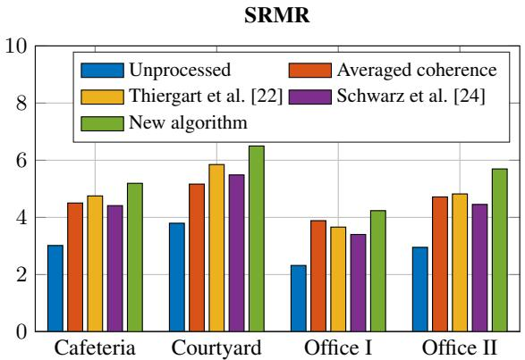
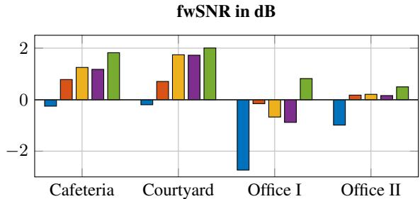
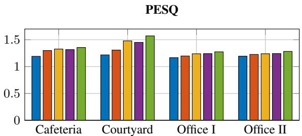

# GENERALIZED COHERENCE-BASED SIGNAL ENHANCEMENT

Heinrich W. Lollmann, Andreas Brendel, and Walter Kellermann ¨

Chair of Multimedia Communications and Signal Processing Friedrich-Alexander University Erlangen-Nurnberg ¨ 91058 Erlangen, Germany

{heinrich.loellmann,andreas.brendel,walter.kellermann}@fau.de

# ABSTRACT

This contribution presents a novel approach for coherence-based signal enhancement. An estimator for the coherent-to-diffuse ratio (CDR) is devised, which exploits the concept of generalized magnitude coherence and thus, unlike common state-of-the-art schemes, can simultaneously take advantage of more than two microphones. Moreover, the speech enhancement by CDR-based spectral weighting is not performed as a post-filtering step, but by enhancing the most appropriate microphone signal. This signal is implicitly determined as part of the CDR estimation such that the presented technique does not depend on an estimation of the direction-ofarrival (DOA) or similar side-information about the desired source.

The application of the new approach to binaural hearings aids shows that it achieves a consistently better speech enhancement performance than comparable state-of-the-art approaches.

Index Terms— CDR estimation, generalized coherence, multichannel signal enhancement, dereverberation, hearing aids

# 1. INTRODUCTION

Speech enhancement by exploiting information about the spatial coherence is a well-established concept, which has already been introduced in the 1970s [1]. Since then, numerous variations and improvements of this concept have been proposed by devising new weighting rules and filtering concepts as well as refined coherence models and coherent-to-diffuse power ratio (CDR) estimators, $\mathrm { e . g . }$ , [2–11]. The most common scheme is to perform coherence-based speech enhancement in a post-filtering step where the spectral weights are calculated by using CDR estimates from a pair of microphones. However, more than two microphones are often available as, e.g., for binaural hearing aids (HAs), cf., [12]. A (fixed or adaptive) beamformer can then be applied followed by a CDRbased post-filter, which requires knowledge about the direction of arrival (DOA) of the desired speaker for the beamsteering, $\mathrm { e . g . }$ , [4]. The DOA information could also be exploited by the post-filter and DOA-based CDR estimators achieve typically a better speech quality than non-DOA-based ones [13]. However, the performance of such an approach depends heavily on accurate DOA estimates, which are difficult to obtain in very noisy or highly reverberant environments as well as scenarios where some or even all microphones are not on the line-of-sight of the source. In such a case, a coherence-based signal enhancement scheme is desirable which requires no information about the desired source, but could still exploit the information provided by all microphones and not just a microphone pair. Moreover, the system should cope with a heterogeneous signal quality, e.g., varying CDR levels at the microphones, which is still a very challenging task.

In this contribution, a CDR-based speech enhancement scheme for such a scenario is presented. For this, a CDR estimator is devised which adopts the concept of generalized magnitude-squared coherence (GMSC) presented in [14]. This allows to inherently incorporate information provided by an arbitrary number of microphones. Moreover, it is proposed to perform the signal enhancement not as a post-filtering step but by enhancing the ’most suitable’ microphone signal, where the selection of this signal is a byproduct of the proposed algorithm and does not require additional side-information such as the DOA of the desired source.

The paper is organized as follows: Sec. 2 reviews CDR-based speech enhancement techniques and forms the basis for the derivation of the new algorithm in Sec. 3 as well as a performance comparison with related approaches presented in Sec. 4. The paper concludes with a summary in Sec. 5.

# 2. CDR-BASED SIGNAL ENHANCEMENT

The recording of a reverberant speech signal in the presence of diffuse background noise by a set of N microphones is considered. The $i ^ { \mathrm { { t h } } }$ microphone signal after A/D conversion is given by the convolution of a speech signal s(k) with a room impulse response (RIR) $h _ { i } ( k )$ of length L between the speech source and the ith microphone

$$
x _ {i} (k) = \sum_ {\kappa = 0} ^ {L - 1} s (\kappa) h _ {i} (k - \kappa) + n _ {i} ^ {(\text { diff })} (k); i \in \{1, \dots , N \} \tag {1}
$$

where k denotes the discrete time index and $n _ { i } ^ { ( \mathrm { d i f f } ) } ( k )$ diffuse background noise. The RIR $h _ { i } ( k )$ can be split into an early part, containing the direct path and early reflections, and a late part containing only late reflections. The microphone signal $x _ { i } ( k )$ can then be expressed as the sum of an early reverberant speech component $d _ { i } ( k )$ and an undesired noise component $n _ { i } ( k )$ according to

$$
x _ {i} (k) = \underbrace {\sum_ {\kappa = 0} ^ {k _ {0} + k _ {1} - 1} s (\kappa) h _ {i} (k - \kappa)} _ {d _ {i} (k)} \underbrace {+ \sum_ {\kappa = k _ {0} + k _ {1}} ^ {L - 1} s (\kappa) h _ {i} (k - \kappa) + n _ {i} ^ {(\text { diff })} (k)} _ {n _ {i} (k) = s _ {i} ^ {(\text { late })} (k) + n _ {i} ^ {(\text { diff })} (k)}. \tag {2}
$$

The index $k _ { 0 }$ marks the onset of the RIR and can be determined by its maximum peak or the onset detection method presented in [15],

$$
\widehat {\Lambda} _ {S} = \frac {1}{\left| \hat {\Gamma} _ {x} \right| ^ {2} - 1} \left(\hat {\Gamma} _ {n} \operatorname{Re} \left\{\hat {\Gamma} _ {x} \right\} - \left| \hat {\Gamma} _ {x} \right| ^ {2} - \sqrt {\left(\hat {\Gamma} _ {n}\right) ^ {2} \operatorname{Re} \left\{\hat {\Gamma} _ {x} \right\} ^ {2} - \left(\hat {\Gamma} _ {n}\right) ^ {2} \left| \hat {\Gamma} _ {x} \right| ^ {2} + \left(\hat {\Gamma} _ {n}\right) ^ {2} - 2 \hat {\Gamma} _ {n} \operatorname{Re} \left\{\hat {\Gamma} _ {x} \right\} + \left| \hat {\Gamma} _ {x} \right| ^ {2}}\right) \tag {9}
$$

where the latter one is more suitable if there might be no direct path between source and microphone and hence considered for the later evaluation in Sec. 4. The index $k _ { 1 }$ marks the end of a time span of 50 ms to 100 ms after the onset of the RIR, cf., [16], where a value of 50 ms is considered later in Sec. 4.

Early sound reflections can help to improve the speech intelligibility while late reflections are mostly detrimental, e.g., [17]. Thus, the signal $d _ { i } ( k )$ can be seen as the desired signal such that the signalto-noise ratio (SNR) at the $i ^ { \mathrm { t h } }$ microphone is given by

$$
\xi_ {i} (k) = \frac {E \left\{d _ {i} ^ {2} (k) \right\}}{E \left\{n _ {i} ^ {2} (k) \right\}} \tag {3}
$$

with $E \left\{ \cdot \right\}$ denoting the expectation operator. If the late reverberant speech can be assumed to represent a diffuse sound field and to be uncorrelated from the direct path and early reflections of the speech signal, the auto-power spectral density (PSD) of the $i ^ { \mathrm { t h } }$ microphone signal is given by

$$
\Phi_ {x _ {i}, x _ {i}} (l, f) = \Phi_ {d _ {i}, d _ {i}} (l, f) + \Phi_ {n _ {i}, n _ {i}} (l, f) \tag {4}
$$

with discrete-time (frame) index l and continuous frequency $f ,$ and the SNR of Eq. (3) becomes then equal to the CDR. This assumption is apparently not strictly fulfilled in practice, but commonly applied in the development of single and multichannel speech dereverberation algorithms as it allows to apply SNR-based spectral weighting rules for noise reduction also to speech dereverberation, e.g., [6, 13, 15, 18, 19]. This assumption is thus also used for the following treatment and the terms SNR and CDR are therefore used interchangeably.

In the short-time Fourier transform (STFT) domain, the CDR of the $i ^ { \mathrm { t h } }$ microphone signal can be expressed by the short-time power spectral densities (PSDs) of the desired and undesired signal parts

$$
\Lambda_ {i} (l, f) = \frac {\Phi_ {d _ {i} , d _ {i}} (l , f)}{\Phi_ {n _ {i} , n _ {i}} (l , f)}. \tag {5}
$$

The estimation of the CDR from a single-channel signal is very challenging, cf., [20]. Therefore, most algorithms take spatial diversity into account by estimating the CDR from a pair of microphones, e.g., [2, 4, 5, 8, 13]. It is usually assumed that the short-time auto-PSDs for each signal component are identical at both microphones such that Eq. (5) can be expressed for a microphone pair as follows

$$
\Lambda_ {i, j} (l, f) = \frac {\Gamma_ {n _ {i} , n _ {j}} (l , f) - \Gamma_ {x _ {i} , x _ {j}} (l , f)}{\Gamma_ {x _ {i} , x _ {j}} (l , f) - \Gamma_ {d _ {i} , d _ {j}} (l , f)} \tag {6}
$$

where the short-time coherence of two signals is given by

$$
\Gamma_ {x _ {i}, x _ {j}} (l, f) = \frac {\Phi_ {x _ {i} , x _ {j}} (l , f)}{\sqrt {\Phi_ {x _ {i} , x _ {i}} (l , f) \Phi_ {x _ {j} , x _ {j}} (l , f)}}. \tag {7}
$$

The CDR, as a representative of an SNR, is a positive realvalued quantity, whereas the coherence functions $\Gamma _ { x _ { i } , x _ { j } } ( l , f )$ and $\Gamma _ { d _ { i } , d _ { j } } ( l , f )$ are complex-valued in general. Hence, inserting estimates for the coherence functions directly into Eq. (6) would yield potentially complex-valued CDR estimates. Various approaches to ensure positive real-valued CDR estimates have been proposed, e.g., [13, 21–24] which are analyzed comprehensively in [13]. Such approaches require knowledge about the coherence of the diffuse signal components $n _ { i } ( k )$ and/or the coherent signal components $d _ { i } ( k )$ . CDR estimators incorporating a model for the coherence of $d _ { i } ( k )$ require the DOA of the source signal $s ( k )$ . CDR estimators which rely solely on estimates of the spatial coherence of the noise and input signals do not require prior knowledge of the DOA of the desired source and are hence more suitable for the task at hand where it is assumed that the DOA is unavailable or difficult to estimate. Such a CDR estimator has been proposed in [22]

$$
\widehat {\Lambda} _ {\mathrm{T}} (l, f) = \operatorname{Re} \left\{\frac {\widehat {\Gamma} _ {n _ {1} , n _ {2}} (l , f) - \widehat {\Gamma} _ {x _ {1} , x _ {2}} (l , f)}{\widehat {\Gamma} _ {x _ {1} , x _ {2}} (l , f) - e ^ {j \triangleleft \left\{\widehat {\Gamma} _ {x _ {1} , x _ {2}} (l , f) \right\}}} \right\} \tag {8}
$$

with ^ $\{ \cdot \}$ marking the phase and Re {·} the real part operator. In [13], it is shown that this CDR estimator is biased and the unbiased DOA-independent CDR estimator of Eq. (9) is discussed in [13, 24]. (The time, frequency and microphone indices are omitted in Eq. (9) for better readability.) Both CDR estimators are considered in the later evaluation in Sec. 4.

As reasoned before, SNR-based spectral weighting rules for noise suppression could also be applied for speech dereverberation. A common approach is Spectral Magnitude Subtraction where the weights are given by, e.g., [13, 25]

$$
W (l, f) = \max \left\{W _ {\min}, 1 - \sqrt {\frac {\mu}{\widehat {\Lambda} (l , f) + 1}} \right\}. \tag {10}
$$

The oversubtraction factor µ influences the amount of noise suppression and the factor $0 \leq W _ { \operatorname* { m i n } } \ll 1$ represents a minimum weight to avoid musical noise, see, e.g., [25].

Coherence-based speech enhancement is mostly applied in a post-filtering step at the output of a beamformer, e.g., [4, 5, 7]. If the spectral weights of Eq. (10) are applied without prior spatial filtering, it is common to perform spatial magnitude averaging prior to the spectral weighting, e.g., [13]

$$
\hat {D} (l, f) = W (l, f) \sqrt {\frac {| X _ {1} (l , f) | ^ {2} + | X _ {2} (l , f) | ^ {2}}{2}} e ^ {j \triangleleft \{X _ {1} (l, f) \}} \tag {11}
$$

with $X _ { 1 } ( l , f ) , X _ { 2 } ( l , f )$ and $\hat { D } ( l , f )$ denoting the STFT of the two microphone signals $x _ { 1 } ( k )$ and $x _ { 2 } ( k )$ , and the enhanced speech ${ \hat { d } } ( k )$ , respectively. This approach requires, in contrast to a beamformer as preprocessor, no DOA information about the desired signal and is hence considered in the later evaluation in Sec. 4.

# 3. GENERALIZED CDR-BASED SIGNAL ENHANCEMENT

The previously discussed coherence-based signal enhancement techniques estimate the CDR with a pair of microphones even though more microphones might be available, e.g., for binaural HAs, smart phones, smart speakers etc.. A straightforward approach to extend these methods could be to average the coherence estimates for some or all microphone pairs prior to the CDR calculation, but inferior results can be expected if the coherence functions or CDRs at different microphones differ significantly, e.g., if there is no direct path to the source for some microphones (see Sec. 4). Another aspect is to select the ’best’ microphone signal for performing the enhancement. This task is usually addressed in the context of sensor networks but less for concentrated microphone arrays, especially if the signal enhancement is performed as a post-filtering step. An obvious approach to obtain the best signal could be to select the one which has the strongest direct path to the source using DOA estimation. Here, it is proposed to select the best microphone implicitly by taking its relations to the other microphone signals into account as detailed later. The microphone selection is thereby a byproduct of the proposed algorithm and does not require additional side-information.

In the following, a new CDR-based signal enhancement algorithm is derived, which generalizes the CDR to more than two sensors and performs sensor selection. The proposed CDR estimator is based on the concept of GMSC, which has been introduced in [14] in a communications context.1

The short-time spectral coherence matrix $C _ { x } ( l , f )$ for a set of N sensor signals $x _ { 1 } ( k ) , \ldots , x _ { N } ( k )$ contains the signal coherence as given by Eq. (7) for all sensor pairs

$$
\boldsymbol {C} _ {x} (l, f) = \left[ \begin{array}{c c c c} 1 & \Gamma_ {x _ {1}, x _ {2}} (l, f) & \dots & \Gamma_ {x _ {1}, x _ {N}} (l, f) \\ \Gamma_ {x _ {2}, x _ {1}} (l, f) & 1 & \dots & \Gamma_ {x _ {2}, x _ {N}} (l, f) \\ \vdots & \vdots & \ddots & \vdots \\ \Gamma_ {x _ {N}, x _ {1}} (l, f) & \Gamma_ {x _ {N}, x _ {2}} (l, f) & \dots & 1 \end{array} \right]. \tag {12}
$$

Instead of the GMSC [14], it is more suitable for this treatment to consider the generalized magnitude coherence (GMC)

$$
\gamma_ {x} (l, f) = \frac {1}{N - 1} \left(\lambda_ {x} ^ {(\max)} (l, f) - 1\right) \tag {13}
$$

with $\lambda _ { x } ^ { \mathrm { ( m a x ) } } ( l , f )$ denoting the largest eigenvalue of the matrix $C _ { x } ( l , f )$ . It is easily shown that $0 \leq \gamma _ { x } ( l , f ) \leq 1$ holds, where $\gamma _ { x } ( l , f ) ~ = ~ 1$ , if all signals are fully coherent [14]. For two sensors, the GMC becomes equal to the magnitude of the coherence of Eq. (7), i.e., $\gamma _ { x } ( l , \bar { f } ) ~ = ~ | \Gamma _ { x _ { 1 } , x _ { 2 } } ( \bar { l } , f ) |$ for $N \ = \ 2$ . The magnitude of the coefficients of the principal eigenvector ${ \pmb v } _ { x } ^ { ( \operatorname * { m a x } ) } ( l , \bar { f } ) = [ v _ { x } ^ { ( \operatorname * { m a x } ) } ( l , f , 1 ) , \dots , v _ { x } ^ { ( \operatorname * { m a x } ) } ( l , f , \hat { N } ) ] ^ { \mathrm { T } }$ provides an indiof Eq. (13) [14].

In this contribution, the following new CDR estimator based on the GMC is proposed

$$
\widehat {\Lambda} _ {\text { gen }} (l, f) = \frac {\gamma_ {n} (l , f) - \gamma_ {x} (l , f)}{\gamma_ {x} (l , f) - 1}. \tag {14}
$$

The estimates are real-valued and positive since the matrix $C _ { x } ( l , f )$ of Eq. (12) is Hermitian and its eigenvalues are therefore real-valued and positive. For the special case of $N = 2$ microphones, Eq. (14) is given by

$$
\widehat {\Lambda} _ {\text { gen }} (l, f) = \frac {| \Gamma_ {n _ {1} , n _ {2}} (l , f) | - | \Gamma_ {x _ {1} , x _ {2}} (l , f) |}{| \Gamma_ {x _ {1} , x _ {2}} (l , f) | - 1} \tag {15}
$$

where it should be noted that $| \Gamma _ { d _ { 1 } , d _ { 2 } } ( l , f ) | = 1$ for the magnitude coherence of the coherent early reverberant speech. Thus, a positive estimate for the CDR of Eq. (5) is ensured by approximating the complex coherence functions by their magnitudes, which yields a biased CDR estimator. However, it should be stressed that the aim of this work is to devise a robust CDR-based speech enhancement

scheme, but not a highly accurate CDR estimator, which is anyway difficult to obtain, if a single CDR estimate is calculated form multiple signals with possibly different CDRs.

The spectral weights calculated with this CDR estimate, e.g., by Eq. (10), are applied to the most appropriate microphone signal, $\mathrm { i . e . , } \hat { D } ( l , f ) = W ( l , f ) X _ { i _ { \mathrm { o p t } } } ( l , f )$ . This microphone signal is determined by the largest magnitude of the principal eigenvector

$$
i _ {\mathrm{opt}} (l) = \text { round } \left\{\alpha i _ {\mathrm{opt}} (l - 1) + (1 - \alpha) \bar {i} _ {\mathrm{opt}} (l) \right\} \tag {16}
$$

$$
\text { with } \quad \bar {i} _ {\mathrm{opt}} (l) = \frac {1}{M} \sum_ {m = 0} ^ {M - 1} \arg \max _ {i} \left\{\left| v _ {x} ^ {(\max)} (l, f _ {m}, i) \right| \right\} \tag {17}
$$

and $0 < \alpha < 1$ , where round{·} denotes an integer rounding operation and M the number of discrete frequencies $f _ { m }$ . The smoothing over time and frequency should ensure a stable selection.

The entries for the spectral coherence matrix of Eq. (12) could be calculated by Eq. (7) with short-time PSDs estimated by recursive averaging

$$
\hat {\Phi} _ {x _ {i}, x _ {j}} (l, f) = \beta \hat {\Phi} _ {x _ {i}, x _ {j}} (l - 1, f) + (1 - \beta) X _ {i} (l, f) X _ {j} ^ {*} (l, f) \tag {18}
$$

where $( \cdot ) ^ { * }$ denotes complex conjugation and $0 \leq \beta < 1$ .

The spectral noise coherence matrix $c _ { n } ( l , f )$ underlying $\gamma _ { n } ( l , f )$ in Eq. (14) can be estimated by noise coherence models. This is now discussed by considering a setup for binaural signal enhancement in HAs, which is a major application of coherence-based enhancement techniques, e.g., [15, 19].

A pair of binaural HAs is considered with a frontal and a rear microphone on the left side (Microphones 1 and 2), and a frontal and a rear microphone on the right side (Microphones 3 and 4). The spectral noise coherence matrix is then given by

$$
\boldsymbol {C} _ {n} (f) = \left[ \begin{array}{c c c c} 1 & \Gamma_ {n _ {1}, n _ {2}} ^ {(I)} (f) & \Gamma_ {n _ {1}, n _ {3}} ^ {(I I)} (f) & \Gamma_ {n _ {1}, n _ {4}} ^ {(I I)} (f) \\ \Gamma_ {n _ {2}, n _ {1}} ^ {(I)} (f) & 1 & \Gamma_ {n _ {2}, n _ {3}} ^ {(I I)} (f) & \Gamma_ {n _ {2}, n _ {4}} ^ {(I I)} (f) \\ \Gamma_ {n _ {3}, n _ {1}} ^ {(I I)} (f) & \Gamma_ {n _ {3}, n _ {2}} ^ {(I I)} (f) & 1 & \Gamma_ {n _ {3}, n _ {4}} ^ {(I)} (f) \\ \Gamma_ {n _ {4}, n _ {1}} ^ {(I I)} (f) & \Gamma_ {n _ {4}, n _ {2}} ^ {(I I)} (f) & \Gamma_ {n _ {4}, n _ {3}} ^ {(I)} (f) & 1 \end{array} \right]. \tag {19}
$$

The time index is omitted since the noise coherence is typically timeinvariant such that the GMC for the noise $\gamma _ { n } ( f )$ could be calculated in advance. For the considered microphone arrangement, the noise coherence between the closely-spaced microphones of one device can be modeled by the coherence for diffuse noise, cf., [16]

$$
\Gamma_ {n _ {i}, n _ {j}} ^ {(I)} (f) = a _ {\mathrm{s}} \operatorname{sinc} \left(2 \pi f \frac {d _ {\mathrm{mic}}}{c}\right); i \neq j \tag {20}
$$

with $d _ { \mathrm { m i c } }$ marking the microphone distance, c denoting the speed of sound, and $0 \ll a _ { \mathrm { s } } \le 1$ is a (heuristic) scaling factor accounting for the shadowing effect of the head. Models for the binaural noise coherence between the microphones of the left and right side, $\Gamma _ { n _ { i } , n _ { j } } ^ { ( \mathrm { I I } ) } ( f )$ with $i \neq j$ , are presented in [27, 28].

# 4. EVALUATION

The enhancement performance of the new algorithm presented in Sec. 3 is evaluated for speech enhancement with binaural HAs having 4 microphones. It is compared with the DOA-independent CDR estimators of Schwarz et al. [24] according to Eq. (9) and Thiergart et al. [22] according to Eq. (8), where the weights are applied according to Eq. (11) using the front microphone signals of the left and right HA. Moreover, the CDR estimator of Schwarz et al. was extended to four microphones by averaging the estimates for the signal coherence $\widehat { \Gamma } _ { x _ { i } , x _ { j } }$ for all pairs of left and right microphones prior to the CDR calculation according to Eq. (9). For all four methods, the spectral weights of Eq. (10) with $\mu \ : = \ : 0 . 8$ and $W _ { \mathrm { m i n } } ~ = ~ 0 . 1$ were used, and all PSDs were calculated according to Eq. (18) with $\beta ~ = ~ 0 . 8 .$ For all considered CDR estimators, the cylindrically isotropic (2 D) binaural noise coherence model of [28] was used to determine the noise coherence between the left and right microphones, and the values $a _ { \mathrm { s } } = 0 . 9 5 , c = 3 4 0 { \mathrm { m } } / { \mathrm { s } }$ , and $d _ { \mathrm { m i c } } = 1 . 5 \mathrm { c m }$ were taken for Eq. (20). The spectral filtering in the STFT domain was done by the overlap-add method [29]. Signal frames of 380 samples shifted by 190 samples were weighted with a von Hann window and padded with zeros before being transformed into the STFT domain by a Fast Fourier transform (FFT) of size $M = 5 1 2$ .

The reverberant signals were created according to Eq. (1) for a sampling frequency of 16 kHz. An anechoic male speech signal of 1 min duration was convolved with head-related room impulse responses (HRIRs) of the database presented in [30] (after downsampling the HRIRs to 16 kHz). The HRIRs of this database were measured with HA dummies mounted on a dummy head in an anechoic chamber $( T _ { 6 0 } ~ < ~ 0 . 0 5 \mathrm { s } )$ , a cafeteria $( T _ { 6 0 } ~ = ~ 1 . 2 5 \ : \mathrm { s } )$ , a courtyard $( T _ { 6 0 } = 0 . 9 { \mathrm { s } } ) ,$ a first office room $( T _ { 6 0 } = 0 . 4 { \mathrm s } )$ , and a second office room $( T _ { 6 0 } = 0 . 3 \mathrm { { m s } ) }$ for different source positions [30]. Only the front and rear microphones of the left and right HA device, respectively, were considered here, i.e., N = 4 microphones according to Sec. 3.

The diffuse background noise for each microphone $n _ { i } ^ { ( \mathrm { d i f f } ) } ( k )$ was created by convolving anechoic babble noise, obtained by adding 4 male and 4 female speech files of the VCTK database [31], with the late reverberant part of the HRIR for the respective microphone. The additive noise signals for each microphone $n _ { i } ^ { ( \mathrm { d i f f } ) } ( k )$ n(diff)i (k) were of equal power and scaled such that the CDR according to Eq. (3) was equal to 5 dB at Microphone 1 for all considered scenarios. This approach ensured the same low CDR level for each signal even though the power ratios between early and late reverberant speech varied between 7 dB and 32 dB (for Microphone 1) for the different rooms and loudspeaker positions (HRIRs), respectively.

The performance of the four considered speech enhancement methods was evaluated by the speech-to-reverberation modulation energy ratio (SRMR) measure [32, 33], the frequency-weighted segmental signal-to-noise ratio (fwSNR) [34], and the wideband PESQ meausure [35]. The SRMR is a non-intrusive measure which has been developed for the quality assessment of reverberant and dereverberated speech. The fwSNR and PESQ are intrusive measures, where the clean speech was taken as reference. In [36], it is shown that these measures show a high correlation with the perceived amount of reverberation.

The evaluation results, averaged over all available loudspeaker positions for one room, are shown in Fig. 1. All enhancement schemes achieve a significantly improved speech quality in comparison to the unprocessed speech. The proposed GMC-based signal enhancement consistently achieves the best results for all scenarios. The results of all four algorithms are close to each other for the PESQ measure. While the proposed technique only achieves marginally better results for the PESQ measure, it achieves a significantly better performance regarding the fwSNR and SRMR. It is also observed that the new GMC-based approach to combine multiple coherence estimates for the CDR calculation is clearly superior to a simple averaging of the coherence estimates.

The proposed algorithm has a higher computational complexity than the considered benchmark approaches but its (MATLAB) exe-

bar

| Category    | Unprocessed | Averaged coherence | Thiergart et al. [22] | Schwarz et al. [24] | New algorithm |
| ----------- | ----------- | ------------------ | --------------------- | ------------------- | ------------- |
| Cafeteria   | 3.0         | 4.5                | 4.7                   | 4.4                 | 5.2           |
| Courtyard   | 3.8         | 5.2                | 5.9                   | 5.5                 | 6.5           |
| Office I    | 2.3         | 3.9                | 3.7                   | 3.4                 | 4.2           |
| Office II   | 3.0         | 4.7                | 4.8                   | 4.4                 | 5.7           |

bar

| Location   | Series 1 | Series 2 | Series 3 | Series 4 |
| ---------- | -------- | -------- | -------- | -------- |
| Cafeteria  | -0.5     | 0.8      | 1.2      | 1.8      |
| Courtyard  | -0.2     | 0.6      | 1.7      | 1.9      |
| Office I   | -3.0     | -0.1     | -0.5     | -1.0     |
| Office II  | -1.0     | 0.1      | 0.2      | 0.4      |

bar

PESQ
| Location | Series 1 | Series 2 | Series 3 | Series 4 | Series 5 |
|---|---|---|---|---|---|
| Cafeteria | 1.2 | 1.3 | 1.3 | 1.3 | 1.4 |
| Courtyard | 1.2 | 1.3 | 1.5 | 1.45 | 1.6 |
| Office I | 1.15 | 1.2 | 1.25 | 1.25 | 1.3 |
| Office II | 1.2 | 1.25 | 1.25 | 1.25 | 1.3 |

Fig. 1. Evaluation results for CDR-based binaural signal enhancement schemes for different acoustical environments and an input CDR of 5 dB.

cution time on a standard PC was still significantly lower than the signal duration even for a straightforward implementation. Moreover, the computational complexity can be significantly reduced by using a partial singular value decomposition [37] as only the largest eigenvalue and its eigenvector are needed.

# 5. CONCLUSIONS

A robust approach for CDR-based speech enhancement is presented. The concept of generalized magnitude coherence (GMC) is adopted for the CDR estimation such that the coherence calculation inherently exploits information provided by an arbitrary large set of microphones. Moreover, the most appropriate microphone signal for the signal enhancement is determined as a byproduct without requiring a DOA estimate. The presented approach achieves a consistently better quality in comparison to related approaches at the price of moderately increased computational complexity.

As an example, the application for speech enhancement in binaural hearing aids has been investigated here, but the proposed algorithm appears also to be suitable for speech enhancement in sensor networks or mobile phones equipped with multiple microphones, which remains a subject for further investigations.

# References

[1] J. B. Allen, D. A. Berkely, and J. Blauert, “Multimicrophone Signal-Processing Technique to Remove Room Reverberation from Speech Signals,” Journal of the Acoustical Society of America, vol. 62, no. 4, pp. 912–915, Oct. 1977.   
[2] R. Zelinski, “A Microphone Array with Adaptive Post-Filtering for Noise Reduction in Reverberant Rooms,” in Proc. of Intl. Conference on Acoustics, Speech, and Signal Processing (ICASSP), New York, USA, Apr. 1988, pp. 2578–2581.   
[3] R. Le Bouquin-Jeannes, A. A. Azirani, and G. Faucon, “Enhancement of Speech Degraded by Coherent and Incoherent Noise Using a Cross-Spectral Estimator,” IEEE Trans. on Acoustics, Speech, and Signal Processing, vol. 5, no. 5, pp. 484–487, Sept. 1997.   
[4] K. U. Simmer, J. Bitzer, and C. Marro, “Post-Filtering Techniques,” in Microphone Arrays, M. Brandstein and D. Ward, Eds., chapter 3, pp. 39–60. Springer, Berlin, 2001.   
[5] I. A. McCowan and H. Bourland, “Microphone Array Post-Filter Based on Noise Field Coherence,” IEEE Trans. on Speech and Audio Processing, vol. 11, no. 6, pp. 709–716, Nov. 2003.   
[6] E. A. P. Habets, Single- and Multi-Microphone Speech Dereverberation using Spectral Enhancement, Ph.D. thesis, Eindhoven University, Eindhoven, The Netherlands, 2007.   
[7] H. W. Lollmann and P. Vary, “Post-Filter Design for Superdirective ¨ Beamformers with Closely Spaced Microphones,” in Proc. of IEEE Workshop on Applications of Signal Processing to Audio and Acoustics (WASPAA), New Paltz (New York), USA, Oct. 2007, pp. 291–294.   
[8] M. Jeub, M. Schafer, T. Esch, and P. Vary, “Model-Based Derever- ¨ beration Preserving Binaural Cues,” IEEE Trans. on Audio, Speech, and Language Processing, vol. 18, no. 7, pp. 1732–1745, Sept. 2010.   
[9] M. Jeub, H. W. Lollmann, and P. Vary, “Blind Dereverberation for ¨ Hearing Aids with Binaural Link,” in Proc. of ITG Conference on Speech Communication, Bochum, Germany, Oct. 2010.   
[10] A. Schwarz, A. Brendel, and W. Kellermann, “Coherence-based Dereverberation for Automatic Speech Recognition,” in Annual German Congress on Acoustics (DAGA), Oldenburg, Germany, Mar. 2014, pp. 1–2.   
[11] C. Zheng, A. Schwarz, W. Kellermann, and X. Li, “Binaural Coherent-To-Diffuse-Ratio Estimation for Dereverberation Using an ITD Model,” in Proc. of European Signal Processing Conference (EUSIPCO), Lisbon, Portugal, Aug. 2015, pp. 1048–1052.   
[12] V. Hamacher, E. Fischer, U. Kornagel, and H. Puder, “Application of Adaptive Signal Processing Methods in High-End Hearing Aids,” in Topics in Acoustic Echo and Noise Control, E. Hansler and G. Schmidt,¨ Eds., chapter 15, pp. 599–636. Springer, 2006.   
[13] A. Schwarz and W. Kellermann, “Coherent-to-Diffuse Power Ratio Estimation,” IEEE/ACM Trans. on Audio, Speech, and Language Processing, vol. 23, no. 6, pp. 1006–1018, 6 2015.   
[14] D. Ramirez, J. Via, and I. Santamaria, “A Generalization of the Magnitude Squared Coherence Spectrum for More than Two Signals: Definition, Properties and Estimation,” in Proc. of Intl. Conference on Acoustics, Speech, and Signal Processing (ICASSP), Las Vegas (Nevada), USA., Mar. 2008, pp. 3769–3772.   
[15] M. Jeub, Joint Dereverberation and Noise Reduction for Binaural Hearing Aids and Mobile Phones, Ph.D. thesis, RWTH Aachen University, Aachen, Germany, 2012.   
[16] H. Kuttruff, Room Acoustics, Taylor & Francis, London, UK, 4th edition, 2000.   
[17] E. Zwicker and H. Fastl, Psychoacoustics: Facts and Models, Springer, Berlin, New York, 2nd edition, 1999.   
[18] K. Lebart, J. M. Boucher, and P. N. Denbigh, “A New Method Based on Spectral Subtraction for Speech Dereverberation,” acta acoustica - Acoustica, vol. 87, no. 3, pp. 359–366, 2001.   
[19] H. W. Lollmann and P. Vary, “Low Delay Noise Reduction and De-¨ reverberation for Hearing Aids,” EURASIP Journal on Applied Signal Processing, vol. 2009, pp. 1–9, 2009.   
[20] J. Eaton, N. D. Gaubitch, A. H. Moore, and P. A. Naylor, “Estimation

of Room Acoustic Parameters: The ACE Challenge,” IEEE/ACM Trans. on Audio, Speech, and Language Processing, vol. 24, no. 10, pp. 1681–1693, Oct. 2016.   
[21] M. Jeub, C. M. Nelke, C. Beaugeant, and P. Vary, “Blind Estimation of the Coherent-to-Diffuse Energy Ratio From Noisy Speech Signals,” in Proc. of European Signal Processing Conference (EUSIPCO), Barcelona, Spain, Sept. 2011, pp. 1347–1351.   
[22] O. Thiergart, G. Del Galdo, and E. A. P. Habets, “Signal-to-Reverberant Ratio Estimation Based on the Complex Spatial Coherence Between Omnidirectional Microphones,” in Proc. of Intl. Conference on Acoustics, Speech, and Signal Processing (ICASSP), Kyoto, Japan, Mar. 2012, pp. 309–312.   
[23] O. Thiergart, G. Del Galdo, and E. A. P. Habets, “On the Spatial Coherence in Mixed-Sound Fields and Its Application to Signal-To-Diffuse Ratio Estimation,” Journal of the Acoustical Society of America, vol. 132, no. 4, pp. 2337–2346, 2012.   
[24] A. Schwarz and W. Kellermann, “Unbiased Coherent-to-Diffuse Ratio Estimation for Dereverberation,” in Proc. of Intl. Workshop on Acoustic Signal Enhancement (IWAENC), Antibes - Juan les Pins, France, Sept. 2014, pp. 6–10.   
[25] P. Vary and R. Martin, Digital Speech Transmission: Enhancement, Coding and Error Concealment, Wiley, Chichester, UK, 2006.   
[26] H. Gish and D. Cochran, “Generalized Coherence,” in Proc. of Intl. Conference on Acoustics, Speech, and Signal Processing (ICASSP), New York, USA, Apr. 1988, vol. 5, pp. 2745–2748.   
[27] I. Lindevald and A. Benade, “Two-Ear Correlation in the Statistical Sound Fields of Rooms,” Journal of the Acoustical Society of America, vol. 87, no. 2, pp. 661–664, 1986.   
[28] M. Jeub, M. Dorbecker, and P. Vary, “A Semi-Analytical Model for ¨ the Binaural Coherence of Noise Fields,” Signal Processing, vol. 18, no. 3, pp. 197–200, Mar. 2011.   
[29] A. V. Oppenheim, R. W. Schafer, and J. R. Buck, Discrete-Time Signal Processing, Prentice-Hall, Upper Saddle River, New Jersey, 2nd edition, 1999.   
[30] H. Kayser, S. D. Ewert, J. Anemuller, T. Rohdenburg, V. Hohmann, ¨ and B. Kollmeier, “Database of Multichannel In-Ear and Behind-the-Ear Head-Related and Binaural Room Impulse Responses,” EURASIP Journal on Advances in Signal Processing, vol. 2009, pp. 1–10, 2009.   
[31] C. Veaux, J. Yamagishi, and K. MacDonald, “English Multi-speaker Corpus for CSTR Voice Cloning Toolkit,” [Online, accessed 21.09.2017] http://homepages.inf.ed.ac.uk/jyamagis/page3/page58/page58.html.   
[32] T. H. Falk, C. Zheng, and W. Chan, “A Non-Intrusive Quality and Intelligibility Measure of Reverberant and Dereverberated Speech,” IEEE Trans. on Audio, Speech, and Language Processing, vol. 18, no. 7, pp. 1766–1774, Sept. 2010.   
[33] J. F. Santos, M. Senoussaoui, and T. H. Falk, “An Improved Non-Intrusive Intelligibility Metric for Noisy and Reverberant Speech,” in Proc. of Intl. Workshop on Acoustic Signal Enhancement (IWAENC), Antibes - Juan les Pins, France, Sept. 2014, pp. 55–59.   
[34] Y. Hu and P. C. Loizou, “Evaluation of Objective Quality Measures for Speech Enhancement,” IEEE Trans. on Audio, Speech, and Language Processing, vol. 16, no. 1, pp. 229–238, Jan 2008.   
[35] A. W. Rix, J. G. Beerends, M. P. Hollier, and A. P. Hekstra, “Perceptual Evaluation of Speech Quality (PESQ) - A New Method for Speech Quality Assessment of Telephone Networks and Codecs,” in Proc. of Intl. Conference on Acoustics, Speech, and Signal Processing (ICASSP), Salt Lake City (Utah), USA, May 2001, vol. 2, pp. 749–752.   
[36] S. Goetze, A. Warzybok, I. Kodrasi, J. O. Jungmann, B. Cauchi, J. Rennies, E. A. P. Habets, A. Mertins, T. Gerkmann, S. Doclo, and B. Kollmeier, “A Study On Speech Quality and Speech Intelligibility Measures for Quality Assessment of Single-Channel Dereverberation Algorithms,” in Proc. of Intl. Workshop on Acoustic Signal Enhancement (IWAENC), Antibes - Juan les Pins, France, Sept. 2014, pp. 233– 237.   
[37] T. K. Moon and W. C. Stirling, Mathematical Methods and Algorithms for Signal Processing, Prentice-Hall, Upper Saddle River, New Jersey, 2000.